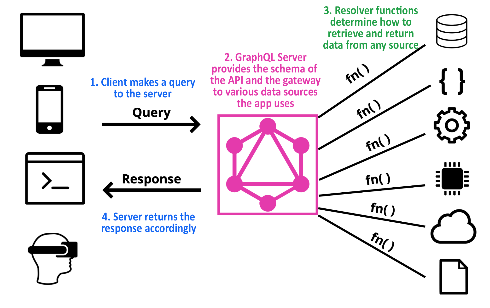

# 03 GraphQL

## GraphQL

GraphQL 是一种面向 API 的查询语言，也是服务端运行时。客户端按需声明所需字段，服务端依据 schema 返回对应结果。和 REST 常见的“一个资源对应一个或多个 endpoint”不同，GraphQL 更强调通过统一 schema 描述数据及关系，再通过 query / mutation / subscription 访问。其核心价值是：客户端决定要什么，服务端暴露统一能力。



### GraphQL 核心

- Graph：把业务对象及其关系抽象为图结构，如用户、订单、评论、商品之间的关联
- Query Language：客户端通过查询语言声明所需字段和结构

### GraphQL 特点

- 强类型 Schema：明确类型、字段、参数和返回结构
- 按需查询：减少过量获取和获取不足
- 单一入口：常见实现通过单个 endpoint 接收 GraphQL 请求
- 统一数据模型：用一套 schema 描述不同资源及关系
- 可扩展：更适合通过新增字段、类型演进能力

---

## GraphQL 的主要概念

### Schema

Schema 是 GraphQL 的核心，相当于“类型系统 + 接口说明书”。它会描述：

- 系统有哪些类型
- 类型有哪些字段
- 字段是什么类型
- 哪些字段支持参数
- 系统允许哪些 Query / Mutation / Subscription

例如：

```graphql
type User {
  id: ID!
  name: String!
  email: String!
}

type Query {
  user(id: ID!): User
}
```

含义：系统定义了 `User` 类型；`User` 有 `id`、`name`、`email` 三个字段；`Query` 类型上提供 `user` 查询；调用 `user` 时必须传入 `id`；其返回值是一个 `User`。

### 操作类型

| 操作类型 | 描述 | 用途 |
| :-- | :-- | :-- |
| Query | 查询数据 | 读 |
| Mutation | 修改数据 | 新增、更新、删除 |
| Subscription | 订阅数据变化 | 实时推送 |

这是推荐语义，不是硬性技术限制。理论上服务端可以在 Query 中实现带副作用的逻辑，但不推荐。

---

## GraphQL 的使用方式

### 基本形式

可以把 GraphQL 的一次调用理解成：

> 操作类型 + 操作名 + 参数 + 字段选择

例如：

```graphql
query {
  user(id: "1") {
    id
    name
  }
}
```

这表示：发起一个查询，调用 `user`，传入参数 `id = "1"`，并要求只返回 `id` 和 `name`。

### 字段（Fields）

GraphQL 的核心是“请求对象上的字段”。例如：

```graphql
{
  hero {
    name
  }
}
{
  "data": {
    "hero": {
      "name": "R2-D2"
    }
  }
}
```

查询结构和结果结构非常相似，因此客户端通常能直接预测返回形状。字段也可以返回对象，这时可以继续做次级选择：

```graphql
{
  hero {
    name
    # 查询可以有备注！
    friends {
      name
    }
  }
}
{
  "data": {
    "hero": {
      "name": "R2-D2",
      "friends": [
        { "name": "Luke Skywalker" },
        { "name": "Han Solo" },
        { "name": "Leia Organa" }
      ]
    }
  }
}
```

`friends` 返回列表，但写法和单对象一致。具体返回单值还是列表，应由 schema 预期。

### 参数（Arguments）

每个字段都可以带参数，甚至嵌套对象或标量字段都能有自己的参数：

```graphql
{
  human(id: "1000") {
    name
    height(unit: FOOT)
  }
}
{
  "data": {
    "human": {
      "name": "Luke Skywalker",
      "height": 5.6430448
    }
  }
}
```

GraphQL 的参数都是具名参数，不是按位置传递。参数可以是标量、枚举，或服务端定义的输入类型。

### 别名（Aliases）

当同一个字段需要用不同参数查询多次时，直接写会冲突，这时要用别名：

```graphql
{
  empireHero: hero(episode: EMPIRE) {
    name
  }
  jediHero: hero(episode: JEDI) {
    name
  }
}
{
  "data": {
    "empireHero": { "name": "Luke Skywalker" },
    "jediHero": { "name": "R2-D2" }
  }
}
```

别名重命名的是结果中的字段名。

### 片段（Fragments）

片段用于复用一组字段，适合复杂页面和重复查询结构：

```graphql
{
  leftComparison: hero(episode: EMPIRE) {
    ...comparisonFields
  }
  rightComparison: hero(episode: JEDI) {
    ...comparisonFields
  }
}

fragment comparisonFields on Character {
  name
  appearsIn
  friends {
    name
  }
}
```

片段常用于将 UI 组件所需的数据组织成可复用块。

### 在片段内使用变量

片段可以访问操作中声明的变量：

```graphql
query HeroComparison($first: Int = 3) {
  leftComparison: hero(episode: EMPIRE) {
    ...comparisonFields
  }
  rightComparison: hero(episode: JEDI) {
    ...comparisonFields
  }
}

fragment comparisonFields on Character {
  name
  friendsConnection(first: $first) {
    totalCount
    edges {
      node {
        name
      }
    }
  }
}
```

### 操作名称（Operation name）

GraphQL 支持简写，也支持显式写出操作类型与操作名。生产环境更推荐显式写法，便于调试、日志记录和定位问题：

```graphql
query HeroNameAndFriends {
  hero {
    name
    friends {
      name
    }
  }
}
```

- 操作类型：`query` / `mutation` / `subscription`
- 操作名称：如 `HeroNameAndFriends`

操作名称类似程序中的函数名，便于追踪。

### 变量（Variables）

参数经常是动态的，不应通过字符串拼接硬塞进查询。GraphQL 支持把动态值独立为变量：

```graphql
query HeroNameAndFriends($episode: Episode) {
  hero(episode: $episode) {
    name
    friends {
      name
    }
  }
}
```

配套变量字典通常通过 JSON 传递：

```json
{ "episode": "JEDI" }
```

使用变量通常分三步：

1. 用 `$variableName` 替代静态值
2. 在操作头部声明变量及类型
3. 在请求中单独传入变量字典

#### 变量定义

例如 `($episode: Episode)`：

- 变量名前缀必须是 `$`
- 必须声明类型
- 变量类型必须是标量、枚举或输入对象

如果变量对应的参数是非空类型，那么变量本身也必须满足非空要求。

#### 默认变量

可以给变量设置默认值：

```graphql
query HeroNameAndFriends($episode: Episode = "JEDI") {
  hero(episode: $episode) {
    name
    friends {
      name
    }
  }
}
```

若调用时不提供变量，则使用默认值；若传入变量，则覆盖默认值。

### 指令（Directives）

指令用于动态改变查询结构，避免通过字符串拼接增删字段：

```graphql
query Hero($episode: Episode, $withFriends: Boolean!) {
  hero(episode: $episode) {
    name
    friends @include(if: $withFriends) {
      name
    }
  }
}
```

```json
{
  "episode": "JEDI",
  "withFriends": false
}
```

标准内置指令：

- `@include(if: Boolean)`：条件为 `true` 时包含字段
- `@skip(if: Boolean)`：条件为 `true` 时跳过字段

服务端也可以扩展自己的自定义指令。

### 变更（Mutations）

GraphQL 大部分讨论集中在读数据，但完整的数据平台也必须支持写操作。推荐把所有写操作放在 mutation 中，而不要放在 query 中。

```graphql
mutation CreateReviewForEpisode($ep: Episode!, $review: ReviewInput!) {
  createReview(episode: $ep, review: $review) {
    stars
    commentary
  }
}
```

```json
{
  "ep": "JEDI",
  "review": {
    "stars": 5,
    "commentary": "This is a great movie!"
  }
}
```

```json
{
  "data": {
    "createReview": {
      "stars": 5,
      "commentary": "This is a great movie!"
    }
  }
}
```

注意：mutation 返回值仍然可以继续选择字段，因此它不只是“做事”，还能把变更后的最新对象状态一起返回。

#### 变更中的多个字段

一个 mutation 也可以包含多个字段。和 query 不同的是：

- query 字段通常可以并行执行
- mutation 字段按顺序线性执行

这样能避免竞态问题。

### 内联片段（Inline Fragments）

当字段返回接口或联合类型时，想取出具体类型上的字段，需要用内联片段：

```graphql
query HeroForEpisode($ep: Episode!) {
  hero(episode: $ep) {
    name
    ... on Droid {
      primaryFunction
    }
    ... on Human {
      height
    }
  }
}
```

如果 `hero` 实际返回 `Droid`，则会额外返回 `primaryFunction`；如果返回 `Human`，则会额外返回 `height`。

### 元字段（Meta fields）

当客户端不知道返回的具体类型时，可以请求 `__typename`：

```graphql
{
  search(text: "an") {
    __typename
    ... on Human {
      name
    }
    ... on Droid {
      name
    }
    ... on Starship {
      name
    }
  }
}
```

`__typename` 会告诉客户端当前位置对象的实际类型名称，这在处理联合类型时非常重要。

---

## Schema 和类型

### 类型系统（Type System）

GraphQL 查询本质上是在对象上选择字段。例如：

```graphql
{
  hero {
    name
    appearsIn
  }
}
```

可以理解为：

1. 从根对象开始
2. 选择 `hero` 字段
3. 对 `hero` 返回的对象，再选择 `name` 和 `appearsIn`

由于查询结构和结果结构相似，客户端通常能预测返回结果形状；但要知道“哪些字段可查、返回什么类型、对象还有哪些字段”，仍然需要 schema。每个 GraphQL 服务都会定义一套类型，查询到来时服务器先按 schema 验证，再执行。

### 类型语言（Type Language）

GraphQL 定义了自己的 schema language，用统一语法描述 schema，而不依赖具体实现语言。

### 对象类型和字段（Object Types and Fields）

对象类型是 schema 最基础的组件：

```graphql
type Character {
  name: String!
  appearsIn: [Episode!]!
}
```

可这样理解：

- `Character`：对象类型
- `name`、`appearsIn`：字段
- `String`：内置标量类型
- `String!`：非空字符串
- `[Episode!]!`：非空数组，数组项也非空

只有某类型上定义过的字段，才可以在该类型的查询位置上使用。

### 参数（Arguments）

字段可以带参数，例如：

```graphql
type Starship {
  id: ID!
  name: String!
  length(unit: LengthUnit = METER): Float
}
```

特点：

- 参数都是具名参数
- 参数可以有默认值
- 参数可以是必选或可选

### 查询和变更类型（The Query and Mutation Types）

一个 schema 里有两个特殊入口类型：

```graphql
schema {
  query: Query
  mutation: Mutation
}
```

`Query` 和 `Mutation` 的特殊之处仅在于：它们定义了 GraphQL 的入口字段。

例如：

```graphql
type Query {
  hero(episode: Episode): Character
  droid(id: ID!): Droid
}
```

这就意味着下面的查询是合法的：

```graphql
query {
  hero {
    name
  }
  droid(id: "2000") {
    name
  }
}
```

除了“作为入口”之外，`Query` / `Mutation` 和普通对象类型没有本质区别。

### 标量类型（Scalar Types）

标量是 GraphQL 的叶子节点，不能继续选择下级字段。内置标量包括：

- `Int`
- `Float`
- `String`
- `Boolean`
- `ID`

自定义标量也很常见，例如：

```graphql
scalar Date
```

其具体序列化、反序列化和校验逻辑由服务端实现负责。

### 枚举类型（Enumeration Types）

枚举是一种特殊标量，取值只能来自固定集合：

```graphql
enum Episode {
  NEWHOPE
  EMPIRE
  JEDI
}
```

使用枚举的意义：

1. 限制参数/返回值范围
2. 明确告诉类型系统这个字段只会取有限值

### 列表和非空（Lists and Non-Null）

GraphQL 用修饰符表达“列表”和“非空”：

```graphql
name: String!
appearsIn: [Episode]!
```

- `!`：非空
- `[T]`：列表

非空参数如果传 `null`，会触发验证错误：

```graphql
query DroidById($id: ID!) {
  droid(id: $id) {
    name
  }
}
```

```json
{ "id": null }
```

组合用法示例：

```graphql
myField: [String!]
```

表示：数组本身可以为 `null`，但数组元素不能为 `null`。

```javascript
myField: null // 有效
myField: [] // 有效
myField: ['a', 'b'] // 有效
myField: ['a', null, 'b'] // 错误
```

```graphql
myField: [String]!
```

表示：数组本身不能为 `null`，但元素可以为 `null`。

```javascript
myField: null // 错误
myField: [] // 有效
myField: ['a', 'b'] // 有效
myField: ['a', null, 'b'] // 有效
```

### 接口（Interfaces）

接口是抽象类型，定义一组必须存在的字段：

```graphql
interface Character {
  id: ID!
  name: String!
  friends: [Character]
  appearsIn: [Episode]!
}
```

实现接口的对象类型必须包含这些字段，例如：

```graphql
type Human implements Character {
  id: ID!
  name: String!
  friends: [Character]
  appearsIn: [Episode]!
  starships: [Starship]
  totalCredits: Int
}

type Droid implements Character {
  id: ID!
  name: String!
  friends: [Character]
  appearsIn: [Episode]!
  primaryFunction: String
}
```

如果字段返回接口类型，直接查询时只能访问接口上声明的字段。下面这个查询会报错：

```graphql
query HeroForEpisode($ep: Episode!) {
  hero(episode: $ep) {
    name
    primaryFunction
  }
}
```

因为 `hero` 返回的是 `Character`，而 `primaryFunction` 不在 `Character` 上。要查具体实现类型上的字段，需要用内联片段：

```graphql
query HeroForEpisode($ep: Episode!) {
  hero(episode: $ep) {
    name
    ... on Droid {
      primaryFunction
    }
  }
}
```

### 联合类型（Union Types）

联合类型和接口类似，但它不声明共同字段：

```graphql
union SearchResult = Human | Droid | Starship
```

如果某字段返回联合类型，查询具体字段时同样要用内联片段：

```graphql
{
  search(text: "an") {
    __typename
    ... on Human {
      name
      height
    }
    ... on Droid {
      name
      primaryFunction
    }
    ... on Starship {
      name
      length
    }
  }
}
```

---

## 验证

GraphQL 查询在执行前会先验证语义是否正确。

### 标量不能再选子字段

下面的查询无效，因为 `name` 是标量，不能继续选择子字段：

```graphql
{
  hero {
    name {
      firstCharacterOfName
    }
  }
}
```

### 类型上不存在的字段不能查询

下面查询无效，因为 `primaryFunction` 不存在于 `Character` 上：

```graphql
{
  hero {
    name
    primaryFunction
  }
}
```

解决方式是使用具名片段或内联片段：

```graphql
{
  hero {
    name
    ...DroidFields
  }
}

fragment DroidFields on Droid {
  primaryFunction
}
```

如果片段只用一次，通常更推荐内联片段：

```graphql
{
  hero {
    name
    ... on Droid {
      primaryFunction
    }
  }
}
```

验证规则远不止这些，规范中有完整定义。

---

## 执行

查询通过验证后，服务器开始执行，并返回与请求结构对应的结果，通常为 JSON。

例如有如下 schema：

```graphql
type Query {
  human(id: ID!): Human
}
 
type Human {
  name: String
  appearsIn: [Episode]
  starships: [Starship]
}
 
enum Episode {
  NEWHOPE
  EMPIRE
  JEDI
}
 
type Starship {
  name: String
}
```

查询：

```graphql
{
  human(id: 1002) {
    name
    appearsIn
    starships {
      name
    }
  }
}
```

结果：

```json
{
  "data": {
    "human": {
      "name": "Han Solo",
      "appearsIn": ["NEWHOPE", "EMPIRE", "JEDI"],
      "starships": [
        { "name": "Millenium Falcon" },
        { "name": "Imperial shuttle" }
      ]
    }
  }
}
```

可以把每个字段看成“返回下一级值的函数”。GraphQL 服务器通过 **resolver** 逐层解析字段：

- 字段返回标量：执行到此结束
- 字段返回对象：继续解析该对象的子字段
- 最终所有路径都会落到标量叶子节点

### Resolver

每个字段背后都可以有 resolver。以根查询字段 `human` 为例：

```javascript
Query: {
  human(obj, args, context, info) {
    return context.db.loadHumanByID(args.id).then(
      userData => new Human(userData)
    )
  }
}
```

resolver 典型接收四个参数：

- `obj`：上一级对象
- `args`：当前字段参数
- `context`：上下文，如登录用户、数据库对象
- `info`：当前字段与 schema 相关的详细信息

### 异步解析器

Resolver 可以返回 Promise / Future / Task 等异步结果。GraphQL 会等待异步完成后再继续执行，因此性能优化经常与 resolver 的异步处理方式有关。

### 简单解析器可省略

很多库允许省略“同名属性直取”的简单 resolver。例如：

```javascript
Human: {
  name(obj) {
    return obj.name
  }
}
```

如果没有显式 resolver，很多实现会默认读取上一级对象中的同名属性。

### 标量强制（Coercion）

GraphQL 会按 schema 对返回值做强制转换。例如字段声明返回枚举，但 resolver 内部返回数字，GraphQL 仍会依据 schema 转成客户端看到的枚举名称。

---

## 一个更实用的理解方式

GraphQL 的使用可以类比成：

- schema：接口说明书 + 类型系统
- Query / Mutation：入口类型
- 字段：可调用的查询或修改入口
- 参数：具名传入
- 字段选择：客户端显式指定返回结构
- resolver：服务端真正执行业务逻辑的位置

例如：

```graphql
query {
  user(id: "1") {
    id
    name
  }
}
```

可以理解成：

> 调用 `user` 这个查询入口，传入 `id = "1"`，并要求返回 `id` 和 `name`。

这也是 GraphQL 和 REST 最直观的区别：

- REST 更像“访问某个 URL 资源”
- GraphQL 更像“按 schema 调用字段，并声明返回哪些字段”

