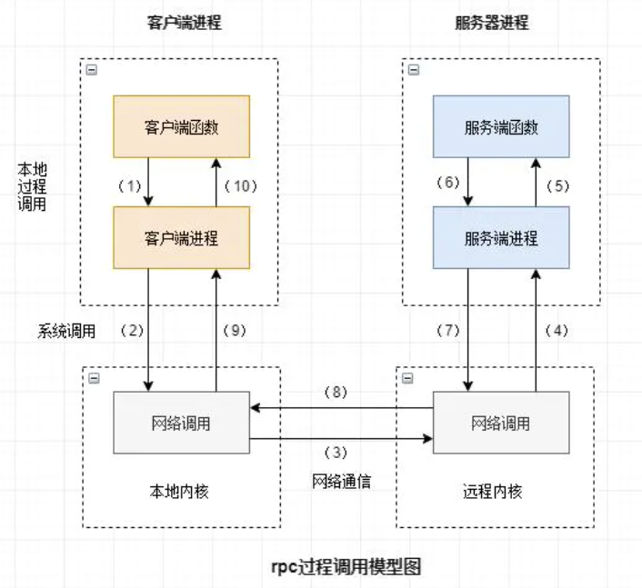
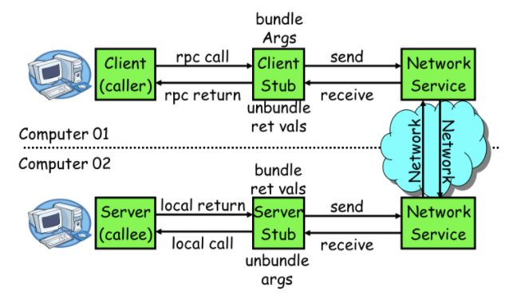
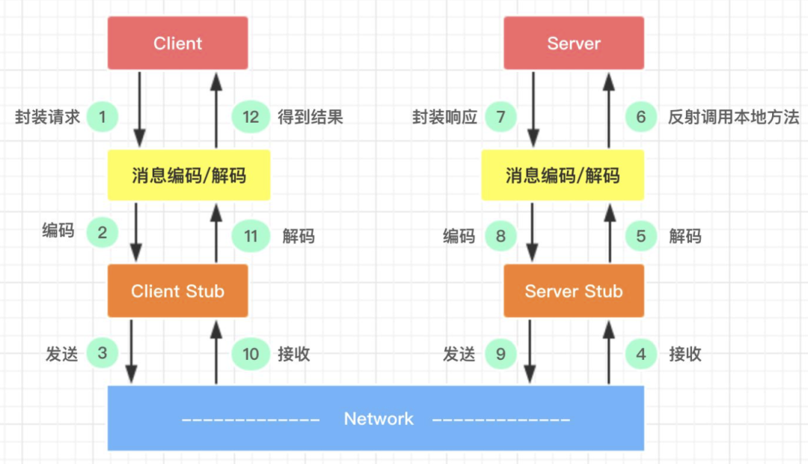
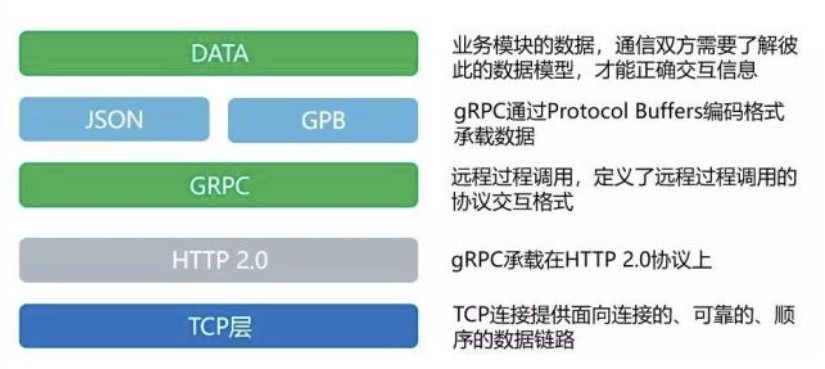
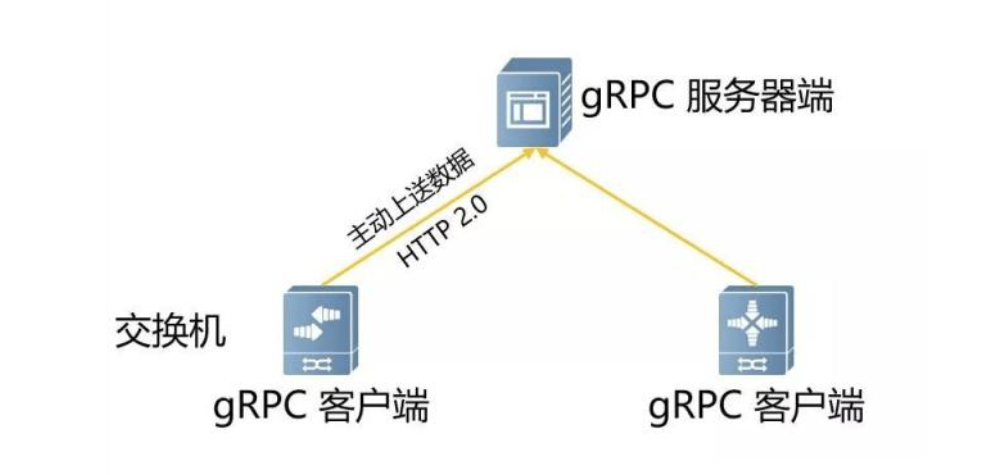
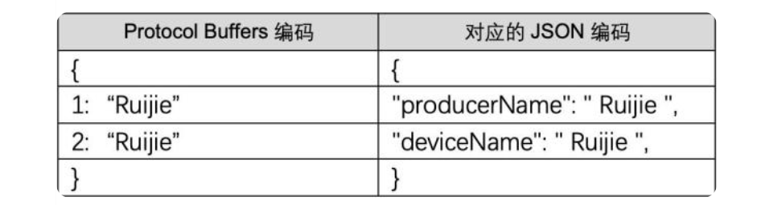
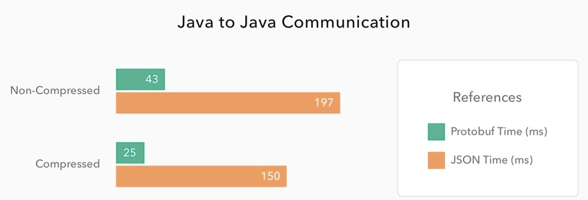
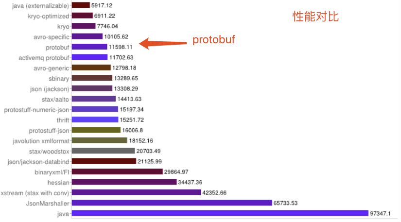

# RPC
RPC（Remote Procedure Call Protocol）远程过程调用协议，目的是让远程服务调用更简单透明。RPC 框架负责屏蔽底层的传输方式（TCP 或者 UDP）、序列化方式（XML/Json/ 二进制）和通信细节，服务调用者可以像调用本地接口一样调用远程的服务提供者，而不需要关心底层通信细节和调用过程。




## 常用的 RPC 框架

- gRPC：由 google 开发，是一款语言中立、平台中立、开源的远程过程调用(RPC)系统。
- Thrift：thrift是一个软件框架，用来进行可扩展且跨语言的服务的开发。它结合了功能强大的软件堆栈和代码生成引擎，以构建在 C++, Java, Python, PHP, Ruby, Erlang, Perl, Haskell, C#, Cocoa, JavaScript, Node.js, Smalltalk, and OCaml 这些编程语言间无缝结合的、高效的服务。
- Dubbo：Dubbo 是一个分布式服务框架，以及 SOA 治理方案，Dubbo自2011年开源后，已被许多非阿里系公司使用。
- Spring Cloud：Spring Cloud 由众多子项目组成，如 Spring Cloud Config、Spring Cloud Netflix、Spring Cloud Consul 等，提供了搭建分布式系统及微服务常用的工具。

## RPC 的调用流程

要让网络通信细节对使用者透明，我们需要对通信细节进行封装，我们先看下一个 RPC 调用的流程涉及到哪些通信细节：



1. 服务消费方（client）调用以本地调用方式调用服务；

2. client stub接收到调用后负责将方法、参数等组装成能够进行网络传输的消息体；
3. client stub找到服务地址，并将消息发送到服务端；
4. server stub收到消息后进行解码；
5. server stub根据解码结果调用本地的服务；
6. 本地服务执行并将结果返回给 server stub；
7. server stub将返回结果打包成消息并发送至消费方；
8. client stub接收到消息，并进行解码；
9. 服务消费方得到最终结果。

RPC 的目标就是要 2~8 这些步骤都封装起来，让用户对这些细节透明，下面是网上的另外一幅图，感觉一目了然：



## gRPC

gRPC 是一个高性能、通用的开源 RPC 框架，其由 Google 2015年主要面向移动应用开发并基于 HTTP /2 协议标准而设计，基于 ProtoBuf 序列化协议开发，且支持众多开发语言。由于是开源框架，通信的双方可以进行二次开发，所以客户端 和服务器端之间的通信会更加专注于业务层面的内容，减少了对由 gRPC 框架实现的底层通信的关注。如下图，DATA 部分即业务层面内容，下面所有的信息都由 gRPC 进行封装。



### gRPC 的特点

- 跨语言使用，支持 C++、Java、Go、Python、Ruby、C#、Node.js、Android Java、Objective-C、PHP 等编程语言；
- 基于 IDL 文件定义服务，通过 proto3 工具生成指定语言的数据结构、服务端接口以及客户端 Stub；
- 通信协议基于标准的 HTTP/2 设计，支持双向流、消息头压缩、单 TCP 的多路复用、服务端推送等特性，这些特性使得 gRPC 在移动端设备上更加省电和节省网络流量；
- 序列化支持 PB（Protocol Buffer）和 JSON，PB 是一种语言无关的高性能序列化框架，基于 HTTP/2 + PB, 保障了 RPC 调用的高性能；
- 安装简单，扩展方便（用该框架每秒可达到百万个RPC）。

### gRPC 交互过程



- 交换机在开启 gRPC 功能后充当 gRPC 客户端的角色，采集服务器充当 gRPC 服务器角色；
- 交换机会根据订阅的事件构建对应数据的格式（GPB/JSON），通过 Protocol Buffers 进行编写 proto 文件，交换机与服务器建立 gRPC 通道，通过 gRPC 协议向服务器发送请求消息；
- 服务器收到请求消息后，服务器会通过 Protocol Buffers 解译 proto 文件，还原出最先定义好格式的数据结构，进行业务处理；
- 数据处理完后，服务器需要使用 Protocol Buffers 重编译应答数据，通过 gRPC 协议向交换机发送应答消息；
- 交换机收到应答消息后，结束本次的 gRPC 交互。

简单地说，gRPC 就是在客户端和服务器端开启 gRPC 功能后建立连接，将设备上配置的订阅数据推送给服务器端。我们可以看到整个过程是需要用到 Protocol Buffers 将所需要处理数据的结构化数据在 proto 文件中进行定义。

### Protocol Buffers

你可以理解 ProtoBuf 是一种更加灵活、高效的数据格式，与 XML、JSON 类似，在一些高性能且对响应速度有要求的数据传输场景非常适用。

ProtoBuf 在 gRPC 的框架中主要有三个作用：定义数据结构、定义服务接口，通过序列化和反序列化方式提升传输效率。

为什么 ProtoBuf 会提高传输效率呢？

我们知道使用 XML、JSON 进行数据编译时，数据文本格式更容易阅读，但进行数据交换时，设备就需要耗费大量的 CPU 在 I/O 动作上，自然会影响整个传输速率。

Protocol Buffers 不像前者，它会将字符串进行序列化后再进行传输，即二进制数据。



可以看到其实两者内容相差不大，并且内容非常直观，但是 Protocol Buffers 编码的内容只是提供给操作者阅读的，实际上传输的并不会以这种文本形式，而是序列化后的二进制数据，字节数会比 JSON、XML 的字节数少很多，速率更快。

gPRC 如何支撑跨平台，多语言呢 ？

Protocol Buffers 自带一个编译器也是一个优势点，前面提到的 proto 文件就是通过编译器进行编译的，proto 文件需要编译生成一个类似库文件，基于库文件才能真正开发数据应用。

具体用什么编程语言编译生成这个库文件呢？由于现网中负责网络设备和服务器设备的运维人员往往不是同一组人，运维人员可能会习惯使用不同的编程语言进行运维开发，那么 Protocol Buffers 其中一个优势就能发挥出来——跨语言。

从上面的介绍，我们得出在编码方面 Protocol Buffers 对比 JSON、XML 的优点：

- 标准的 IDL 和 IDL 编译器，这使得其对工程师非常友好；

- 序列化数据非常简洁，紧凑，与 XML 相比，其序列化之后的数据量约为 1/3 到 1/10；
- 解析速度非常快，比对应的 XML 快约 20-100 倍；
- 提供了非常友好的动态库，使用非常简单，反序列化只需要一行代码。

Protobuf 也有其局限性：

- 由于 Protobuf 产生于 Google，所以目前其仅支持 Java、C++、Python 三种语言；

- Protobuf 支持的数据类型相对较少，不支持常量类型；
- 由于其设计的理念是纯粹的展现层协议（Presentation Layer），目前并没有一个专门支持 Protobuf 的 RPC 框架。

Protobuf 适用场景：

- Protobuf 具有广泛的用户基础，空间开销小以及高解析性能是其亮点，非常适合于公司内部的对性能要求高的 RPC 调用；

- 由于 Protobuf 提供了标准的 IDL 以及对应的编译器，其 IDL 文件是参与各方的非常强的业务约束；
- Protobuf 与传输层无关，采用 HTTP 具有良好的跨防火墙的访问属性，所以 Protobuf 也适用于公司间对性能要求比较高的场景；
- 由于其解析性能高，序列化后数据量相对少，非常适合应用层对象的持久化场景；
- 主要问题在于其所支持的语言相对较少，另外由于没有绑定的标准底层传输层协议，在公司间进行传输层协议的调试工作相对麻烦。

### 基于 HTTP 2.0 标准设计

除了 Protocol Buffers 之外，从交互图中和分层框架可以看到， gRPC 还有另外一个优势——它是基于 HTTP 2.0 协议的。

由于 gRPC 基于 HTTP 2.0 标准设计，带来了更多强大功能，如多路复用、二进制帧、头部压缩、推送机制。

这些功能给设备带来重大益处，如节省带宽、降低 TCP 连接次数、节省 CPU 使用等，gRPC 既能够在客户端应用，也能够在服务器端应用，从而以透明的方式实现两端的通信和简化通信系统的构建。

HTTP 1.X 定义了四种与服务器交互的方式，分别为 GET、POST、PUT、DELETE，这些在 HTTP 2.0 中均保留，我们看看 HTTP 2.0 的新特性：双向流、多路复用、二进制帧、头部压缩。

### 性能对比

与采用文本格式的 JSON 相比，采用二进制格式的 protobuf 在速度上可以达到前者的 5 倍！

Auth0 网站所做的性能测试结果显示，protobuf 和 JSON 的优势差异在 Java、Python 等环境中尤为明显，下图是 Auth0 在两个 Spring Boot 应用程序间所做的对比测试结果。



结果显示，protobuf 所需的请求时间最多只有 JSON 的 20% 左右，即速度是其 5 倍!

下面看一下性能和空间开销对比。



从上图可得出如下结论：

- XML序列化（Xstream）无论在性能和简洁性上比较差。
- Thrift 与 Protobuf 相比在时空开销方面都有一定的劣势。
- Protobuf 和 Avro 在两方面表现都非常优越。

## ProtoBuff 

### 定义

首先我们需要编写一个 proto 文件，定义我们程序中需要处理的结构化数据，在 protobuf 的术语中，结构化数据被称为 Message。proto 文件非常类似 java 或者 C 语言的数据定义，可以使用C或C++风格的注释。下面是一个proto文件的例子。

```
syntax = "proto3";
package tutorial;


option java_package = "com.example.tutorial";
option java_outer_classname = "AddressBookProtos";


message Person {
required string name = 1;
required int32 id = 2;        // Unique ID number for this person.
optional string email = 3;

 

enum PhoneType {

  MOBILE = 0;
  HOME = 1;
  WORK = 2;

}


message PhoneNumber {

  required string number = 1;
  optional PhoneType type = 2 [default = HOME];

}

repeated PhoneNumber phone = 4;

}


// Our address book file is just one of these.

message AddressBook {
repeated Person person = 1;

}
```


一个proto文件主要包含package定义、message定义和属性定义三个部分，还有一些可选项。

文件的第一行指定了你正在使用proto3语法：如果你没有指定这个，编译器会使用proto2。这个指定语法行必须是文件的非空非注释的第一个行。

### 定义package

Package在c++中对应namespace。

对于Java，包声明符会变为java的一个包，除非在.proto文件中提供了一个明确有java_package。

### 定义message

Message在C++中对应class。Message中定义的全部属性在class中全部为private的。

Message的嵌套使用可以嵌套定义，也可以采用先定义再使用的方式。

Message的定义末尾可以采用java方式在不加“;”，也可以采用C++定义方式在末尾加上“;”，这两种方式都兼容，建议采用java定义方式。

向.proto文件添加注释，可以使用C/C++/java风格的双斜杠（//） 语法格式。

### 定义属性

属性定义分为四部分：标注+类型+属性名+属性顺序号+[默认值]，其示意如下所示。

| 标注     | 类型   | 属性名 | 属性顺序号 | [默认值]      |      |
| -------- | ------ | ------ | ---------- | ------------- | ---- |
| required | string | name   | = 1        | [default=””]; |      |


其中属性名与C++和java语言类似，不再解释；下面分别对标注、类型和属性顺序号加以详细介绍。

其中包名和消息名以及其中变量名均采用java的命名规则——驼峰式命名法，驼峰式命名法规则见附件1。

#### 标注

标注包括“required”、“optional”、“repeated”三种，其中

- required表示该属性为必选属性，否则对应的message“未初始化”，debug模式下导致断言，release模式下解析失败；

- optional表示该属性为可选属性，不指定，使用默认值（int或者char数据类型默认为0，string默认为空，bool默认为false，嵌套message默认为构造，枚举则为第一个）

- repeated表示该属性为重复字段，可看作是动态数组，类似于C++中的vector。


如果为optional属性，发送端没有包含该属性，则接收端在解析式采用默认值。对于默认值，如果已设置默认值，则采用默认值，如果未设置，则类型特定的默认值为使用，例如string的默认值为””。

#### 类型

Protobuf的属性基本包含了c++需要的所有基本属性类型。

protobuf属性	C++属性	Java属性	备注
double	double	double	固定8个字节
float	float	float	固定4个字节
int32	int32	int32	使用变长编码，对于负数编码效率较低，如果经常使用负数，建议使用sint32
int64	int64	int64	使用变长编码，对于负数编码效率较低，如果经常使用负数，建议使用sint64
uint32	uint32	int	使用变长编码
uint64	uint64	long	使用变长编码
sint32	int32	int	采用zigzag压缩，对负数编码效率比int32高
sint64	int64	long	采用zigzag压缩，对负数编码效率比int64高
fixed32	uint32	int	总是4字节，如果数据>2^28，编码效率高于unit32
fixed64	uint64	long	总是8字节，如果数据>2^56，编码效率高于unit32
sfixed32	int32	int	总是4字节
sfixed64	int64	long	总是8字节
bool	bool	boolean	布尔类型
string	string	String	一个字符串必须是utf-8编码或者7-bit的ascii编码的文本
bytes	string	ByteString	可能包含任意顺序的字节数据
4.3.2.1 Union类型定义

Protobuf没有提供union类型，如果希望使用union类型，可以采用enum和optional属性定义的方式。

例如，如果已经定义了Foo、Bar、Baz等message，则可以采用如下定义。

message OneMessage {

  enum Type { FOO = 1; BAR = 2; BAZ = 3; }

  // 标识要填写的字段，必填
  required Type type = 1;

  // 将填写以下内容之一，可选
  optional Foo foo = 2;
  optional Bar bar = 3;
  optional Baz baz = 4;

}


#### 属性顺序号

属性顺序号是protobuf为了提高数据的压缩和可选性等功能定义的，需要按照顺序进行定义，且不允许有重复。

### 可选项

#### import可选项

Import可选项用于包含其它proto文件中定义的message或enum类型等。标准格式如下

import “phonetype.proto”;

使用时，import的文件必须与当前文件处于同一个文件夹下，protoc无法完成不处于同一个文件夹下的import选项。

#### 4.4.2 packed

packed (field option): 如果该选项在一个整型基本类型上被设置为真，则采用更紧凑的编码方式。当然使用该值并不会对数值造成任何损失。在2.3.0版本之前，解析器将会忽略那些 非期望的包装值。因此，它不可能在不破坏现有框架的兼容性上而改变压缩格式。在2.3.0之后，这种改变将是安全的，解析器能够接受上述两种格式，但是在 处理protobuf老版本程序时，还是要多留意一下。

repeated int32 samples = 4 [packed=true];

#### 4.4.3 default

[default = default_value]: optional类型的字段，如果在序列化时没有被设置，或者是老版本的消息中根本不存在该字段，那么在反序列化该类型的消息是，optional的字段将被赋予类型相关的缺省值，如bool被设置为false，int32被设置为0。Protocol Buffer也支持自定义的缺省值，如：

optional int32 result_per_page = 3 [default = 10]。

### 4.5 大数据量使用建议

在使用过程中发现，对于大数据量的协议报文（循环超过10000条），如果repeated修饰的属性为对象类型（诸如message 、Bytes、string等称为“对象类型”，其余的诸如int32、int64、float等等称为“原始类型”）时，效率非常低，而且占用的进程内存也非常大，建议采用如下方式优化。

#### 4.5.1 repeated message类型

在message 中对repeated 标识的 message类型的字段需要做大量ADD操作时，可以考虑尽量避免嵌套message或者减少嵌套的message个数。

#### 4.5.2 repeated raw类型

在message中对repeated 标识的原始数据类型的字段需要做大量ADD操作（例如超过3千）时，可以考虑预分配数据空间，避免重复大量地分配空间。

#### 4.5.3 repeated Bytes类型

在protobuf中，Bytes基于C++ STL中的string实现，因为string内存管理的原因，程序空间往往较大。所以应用如果有很多repeated Bytes类型的字段的话，进程显示耗用大量内存，这与vector的情况基本一致。

### 4.6 Protocol Buffer消息升级原则

  在实际的开发中会存在这样一种应用场景，既消息格式因为某些需求的变化而不得不进行必要的升级，但是有些使用原有消息格式的应用程序暂时又不能被立刻升级，这便要求我们在升级消息格式时要遵守一定的规则，从而可以保证基于新老消息格式的新老程序同时运行。规则如下：
运行项目并下载源码
1
不要修改已经存在字段的标签号。

任何新添加的字段必须是optional和repeated限定符，否则无法保证新老程序在互相传递消息时的消息兼容性。

在原有的消息中，不能移除已经存在的required字段，optional和repeated类型的字段可以被移除，但是他们之前使用的标签号必须被保留，不能被新的字段重用。

int32、uint32、int64、uint64和bool等类型之间是兼容的，sint32和sint64是兼容的，string和bytes是兼容的，fixed32和sfixed32，以及fixed64和sfixed64之间是兼容的，这意味着如果想修改原有字段的类型时，为了保证兼容性，只能将其修改为与其原有类型兼容的类型，否则就将打破新老消息格式的兼容性。

optional和repeated限定符也是相互兼容的。

### 5.编译 .proto 文件

可以通过定义好的.proto文件来生成Java、Python、C++代码，需要基于.proto文件运行protocol buffer编译器protoc。如果你没有安装编译器，下载安装包并遵照README安装。运行的命令如下所示：

protoc --proto_path=IMPORT_PATH --cpp_out=DST_DIR --java_out=DST_DIR --python_out=DST_DIR path/to/file.proto

MPORT_PATH声明了一个.proto文件所在的具体目录。如果忽略该值，则使用当前目录。如果有多个目录则可以 对–proto_path 写多次，它们将会顺序的被访问并执行导入。-I=IMPORT_PATH是它的简化形式。

当然也可以提供一个或多个输出路径：

–cpp_out 在目标目录DST_DIR中产生C++代码，可以在C++代码生成参考中查看更多。
–java_out 在目标目录DST_DIR中产生Java代码，可以在 Java代码生成参考中查看更多。
–python_out 在目标目录 DST_DIR 中产生Python代码，可以在Python代码生成参考中查看更多。
–go_out 在目标目录 DST_DIR 中产生Go代码，可以在GO代码生成参考中查看更多。
–ruby_out在目标目录 DST_DIR 中产生Go代码，参考正在制作中。
–javanano_out在目标目录DST_DIR中生成JavaNano，JavaNano代码生成器有一系列的选项用于定制自定义生成器的输出：你可以通过生成器的README查找更多信息，JavaNano参考正在制作中。
–objc_out在目标目录DST_DIR中产生Object代码，可以在Objective-C代码生成参考中查看更多。
–csharp_out在目标目录DST_DIR中产生Object代码，可以在C#代码生成参考中查看更多。
–php_out在目标目录DST_DIR中产生Object代码，可以在PHP代码生成参考中查看更多。
作为一个方便的拓展，如果DST_DIR以.zip或者.jar结尾，编译器会将输出写到一个ZIP格式文件或者符合JAR标准的.jar文件中。注意如果输出已经存在则会被覆盖，编译器还没有智能到可以追加文件。
你必须提议一个或多个.proto文件作为输入，多个.proto文件可以只指定一次。虽然文件路径是相对于当前目录的，每个文件必须位于其IMPORT_PATH下，以便每个文件可以确定其规范的名称。

### 6.使用 message

#### 6.1 类成员变量的访问

在生成的.h文件中定义了类成员的访问方法。例如，对于Person类，定义了name、id、email、phone等成员的访问方法。

获取成员变量值直接采用使用成员变量名（全部为小写），设置成员变量值，使用在成员变量名前加set_的方法。

对于普通成员变量（required和optional）提供has_方法判断变量值是否被设置；提供clear_方法清除设置的变量值。

对于string类型，提供多种set_方法，其参数不同。同时，提供了一个mutable_方法，返回变量值的可修改指针。

对于repeated变量，提供了其它一些特殊的方法：

l _size方法：返回repeated field’s

l 通过下脚标访问其中的数组成员组

l 通过下脚标返回其中的成员的mutable_的方法

l _add方法：增加一个成员。

#### 6.2 标准message方法

生成的.h文件中的class都继承自::google::protobuf::Message类，Message类提供了一些方法可以检查或者操作整个message，包括

l bool IsInitialized() const;检查是否所有required变量都已经初始化；

l string DebugString() const;返回message的可阅读的表示，主要用于调试程序；

l void CopyFrom(const Person& from);使用一个message的值覆盖本message；

l void Clear();清空message的所有成员变量值。

#### 6.3 编码和解码函数

每个message类都提供了写入和读取message数据的方法，包括

l bool SerializeToString(string* output) const;把message编码进output。

l bool ParseFromString(const string& data);从string解码到message

l bool SerializeToArray(char* buf,int size) const;把message编码进数组buf.

l bool ParseFromArray(const char* buf,int size);把buf解码到message。此解码方法效率较ParseFromString高很多，所以一般用这种方法解码。

l bool SerializeToOstream(ostream* output) const;把message编码进ostream

l bool ParseFromIstream(istream* input);从istream解码到message

备注：发送接收端所使用的加码解码方法不一定非得配对，即发送端用SerializeToString 接收端不一定非得用ParseFromString ，可以使用其他解码方法。
