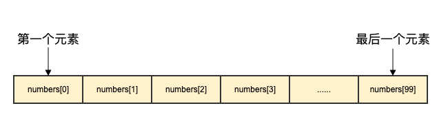
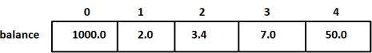

# Go

## 基础

### 环境

### 数据类型

数据类型指定有效的[Go变量](https://www.cainiaojc.com/golang/go-variables.html)可以保存的数据类型。在Go语言中，类型分为以下四类：

**基本类型：**数字，字符串和布尔值属于此类别。

**聚合类型：**数组和结构属于此类别。

**引用类型：**指针，切片，map集合，函数和Channel属于此类别。

**接口类型**

#### 基本类型

##### 数字类型

在Go语言中，数字分为*三个*子类别：

- **整数：**在Go语言中，有符号和无符号整数都可以使用四种不同的大小，如下表所示。有符号的int由int表示，而无符号的整数由uint表示。

  | 数据类型    | 描述                                                         |
  | :---------- | :----------------------------------------------------------- |
  | **int8**    | 8位有符号整数                                                |
  | **int16**   | 16位有符号整数                                               |
  | **int32**   | 32位有符号整数                                               |
  | **int64**   | 64位有符号整数                                               |
  | **uint8**   | 8位无符号整数                                                |
  | **uint16**  | 16位无符号整数                                               |
  | **uint32**  | 32位无符号整数                                               |
  | **uint64**  | 64位无符号整数                                               |
  | **int**     | in和uint都包含相同的大小，无论是32位还是64位。               |
  | **uint**    | in和uint都包含相同的大小，无论是32位还是64位。               |
  | **rune**    | 它是int32的同义词，也表示Unicode代码点。                     |
  | **byte**    | 它是int8的同义词。                                           |
  | **uintptr** | 它是无符号整数类型。它的宽度未定义，但是可以容纳指针值的所有位。 |

  ```
  // 使用整数 
  package main  
  import "fmt"
           
  func main() { 
        
      // 使用8位无符号整型
      var X uint8 = 225 
      fmt.Println(X+1, X) 
        
      // 使用16位有符号整型
      var Y int16 = 32767 
      fmt.Println(Y+2, Y-2)  
  }
  
  226 225
  -32767 32765
  ```

- **浮点数：**在Go语言，浮点数被分成***2\***类如示于下表：

  | 数据类型    | 描述               |
  | :---------- | :----------------- |
  | **float32** | 32位IEEE 754浮点数 |
  | **float64** | 64位IEEE 754浮点数 |

  ```
  // 浮点数的使用 
  package main  
  import "fmt"
           
  func main() { 
      a := 20.45 
      b := 34.89 
        
      //两个浮点数相减
      c := b-a 
        
      //显示结果 
      fmt.Printf("结果: %f", c) 
        
      //显示c变量的类型
      fmt.Printf("\nc的类型是 : %T", c)   
  }
  
  结果: 14.440000
  c的类型是: float64
  ```

- **复数：**将复数分为两部分，如下表所示。float32和float64也是这些复数的一部分。内建函数从它的虚部和实部创建一个复数，内建虚部和实部函数提取这些部分。

  | 数据类型       | 描述                                  |
  | :------------- | :------------------------------------ |
  | **complex64**  | 包含float32作为实数和虚数分量的复数。 |
  | **complex128** | 包含float64作为实数和虚数分量的复数。 |

  

  ```
  //复数的使用 
  package main 
  import "fmt"
    
  func main() { 
        
     var a complex128 = complex(6, 2) 
     var b complex64 = complex(9, 2) 
     fmt.Println(a) 
     fmt.Println(b) 
       
     //显示类型 
    fmt.Printf("a的类型是 %T 以及"+ "b的类型是 %T", a, b) 
  }
  
  (6+2i)
  (9+2i)
  a的类型是 complex128 以及b的类型是 complex64
  ```

##### 布尔类型

布尔数据类型仅表示true或false。布尔类型的值不会隐式或显式转换为任何其他类型。

```
//布尔值的使用
package main

import "fmt"

func main() {

    //变量
    str1 := "cainiaojc"
    str2 := "cainiaojc"
    str3 := "cainiaojc"
    result1 := str1 == str2
    result2 := str1 == str3

    //打印结果
    fmt.Println(result1)
    fmt.Println(result2)

    //显示result1和result2的类型
    fmt.Printf("result1 的类型是 %T ， "+"result2的类型是 %T", result1, result2)

}

true
true
result1 的类型是 bool ， result2的类型是 bool
```

##### 字符串

在Go语言中，字符串不同于其他语言，如Java、c++、Python等。它是一个变宽字符序列，其中每个字符都用UTF-8编码的一个或多个字节表示。或者换句话说，字符串是任意字节(包括值为零的字节)的不可变链，或者字符串是一个只读字节片，字符串的字节可以使用UTF-8编码在Unicode文本中表示。由于采用UTF-8编码，Golang字符串可以包含文本，文本是世界上任何语言的混合，而不会造成页面的混乱和限制。

**注意：**字符串可以为空，但不能为nil。

###### 字符串字面量

在Go语言中，字符串字面量是通过两种不同的方式创建的：

- **使用双引号（“”）：**在这里，字符串字面量使用双引号（“”）创建。此类字符串支持转义字符，如下表所示，但不跨越多行。这种类型的字符串文字在Golang程序中被广泛使用。

  | 转义符     | 描述                                           |
  | :--------- | :--------------------------------------------- |
  | **\\**     | 反斜杠（\）                                    |
  | **\000**   | 具有给定的3位8位八进制代码点的Unicode字符      |
  | **\’**     | 单引号（'）。仅允许在字符文字中使用            |
  | **\”**     | 双引号（""）。仅允许在解释的字符串文字中使用   |
  | **\a**     | ASCII铃声(BEL)                                 |
  | **\b**     | ASCII退格键(BS)                                |
  | **\f**     | ASCII换页(FF)                                  |
  | **\n**     | ASCII换行符(LF)                                |
  | **\r**     | ASCII回车(CR)                                  |
  | **\t**     | ASCII标签(TAB)                                 |
  | **\uhhhh** | 具有给定的4位16位十六进制代码点的Unicode字符。 |
  |            | 具有给定的8位32位十六进制代码点的Unicode字符。 |
  | **\v**     | ASCII垂直制表符(VT)                            |
  | **\xhh**   | 具有给定的2位8位十六进制代码点的Unicode字符。  |

- **使用反引号（``）：**此处，字符串文字是使用反引号（``）创建的，也称为**raw literals**(原始文本)。原始文本不支持转义字符，可以跨越多行，并且可以包含除反引号之外的任何字符。通常，它用于在正则表达式和HTML中编写多行消息。

  ```
  package main
  
  import "fmt"
  
  func main() {
  
      //创建并初始化
      //带有字符串文字的变量
      //使用双引号
      My_value_1 := "Welcome to cainiaojc"
  
      //添加转义字符
      My_value_2 := "Welcome!\ncainiaojc$1quot;
  
      //使用反引号
      My_value_3 := `Hello!cainiaojc$1
  
      //添加转义字符
  
      //原始文本
      My_value_4 := `Hello!\ncainiaojc$1
  
      //显示
      fmt.Println("String 1: ", My_value_1)
      fmt.Println("String 2: ", My_value_2)
      fmt.Println("String 3: ", My_value_3)
      fmt.Println("String 4: ", My_value_4)
  }
  ```

###### 字符串比较

在Go语言中，字符串是使用UTF-8编码编码的不可变的任意字节链。您可以使用两种不同的方式来比较字符串：

**使用比较运算符：**转到字符串支持比较运算符，即*==，！=，> =，<=，<，>*。在这里，**==**和**！=**运算符用于检查给定的字符串是否相等。和> =，<=，<，>操作符用于查找词法顺序。这些运算符的结果为布尔类型，意味着如果条件满足，则返回*true*，否则返回*false*。

**使用Compare()方法：**您还可以使用字符串包提供的内置函数Compare()比较两个字符串。在比较两个字符串后，此函数返回整数值。返回值为：

- 如果*str1 == str2*，则返回0 。
- 如果*str1> str2*，返回1 。
- 如果*str1 <str2，*返回-1 。

**语法：**

```
func Compare(str1, str2 string) int
```

```
//字符串使用compare()函数
package main 
  
import ( 
    "fmt"
    "strings"
) 
  
func main() { 
  
          //创建和初始化
        //使用速记声明
    myslice := []string{"Geeks", "Geeks", 
                    "gfg", "GFG", "for"} 
      
    fmt.Println("Slice: ", myslice) 
  
    //使用比较运算符
    result1 := "GFG" > "Geeks"
    fmt.Println("Result 1: ", result1) 
  
    result2 := "GFG" < "Geeks"
    fmt.Println("Result 2: ", result2) 
  
    result3 := "Geeks" >= "for"
    fmt.Println("Result 3: ", result3) 
  
    result4 := "Geeks" <= "for"
    fmt.Println("Result 4: ", result4) 
  
    result5 := "Geeks" == "Geeks"
    fmt.Println("Result 5: ", result5) 
  
    result6 := "Geeks" != "for"
    fmt.Println("Result 6: ", result6) 
    
    //比较字符串使用比较函数
    fmt.Println(strings.Compare("gfg", "Geeks")) 
      
    fmt.Println(strings.Compare("cainiaojc", "cainiaojc")) 
      
    fmt.Println(strings.Compare("Geeks", " GFG")) 
      
    fmt.Println(strings.Compare("GeeKS", "GeeKs")) 

}


Slice:  [Geeks Geeks gfg GFG for]
Result 1:  false
Result 2:  true
Result 3:  false
Result 4:  true
Result 5:  true
Result 6:  true

1
0
1
-1
```

###### 字符串连接

在Go语言中，字符串是使用UTF-8编码编码的不可变的任意字节链。在Go字符串中，将两个或多个字符串添加到新的单个字符串中的过程称为串联。连接Go语言中两个或多个字符串的最简单方法是使用运算符（+）。也称为串联运算符。

**使用bytes.Buffer：**您还可以通过使用bytes.Buffer和WriteString()方法来连接字符串的字节来创建字符串。 它在字节包下定义。 它可以防止生成不必要的字符串对象，这意味着它不会从两个或多个字符串中生成新的字符串（如+运算符）。

**使用Sprintf：**在Go语言中，您还可以使用*Sprintf()*方法连接字符串。

**使用+ =运算符或字符串附加：**在Go字符串中，允许您使用*+ =运算符连接*字符串。该运算符将新的或给定的字符串添加到指定字符串的末尾。

**使用Join()函数：**此函数将字符串切片中存在的所有元素连接为单个字符串。此函数在字符串包中可用。

**语法：**

```
func Join(str []string, sep string) string
```

在这里，*str*是可以用来连接元素的字符串，sep是放置在最终字符串中元素之间的分隔符。

```
package main

import (
	"bytes"
	"fmt"
	"strings"
)

func main() {
	// 原始字符串
	str1 := "Hello"
	str2 := "Go"
	str3 := "Lang"

	// 1. 使用 + 运算符
	result1 := str1 + " " + str2 + " " + str3
	fmt.Println("1. 使用 + 运算符:", result1)

	// 2. 使用 bytes.Buffer
	var buffer bytes.Buffer
	buffer.WriteString(str1)
	buffer.WriteString(" ")
	buffer.WriteString(str2)
	buffer.WriteString(" ")
	buffer.WriteString(str3)
	result2 := buffer.String()
	fmt.Println("2. 使用 bytes.Buffer:", result2)

	// 3. 使用 fmt.Sprintf
	result3 := fmt.Sprintf("%s %s %s", str1, str2, str3)
	fmt.Println("3. 使用 fmt.Sprintf:", result3)

	// 4. 使用 += 运算符
	result4 := str1
	result4 += " "
	result4 += str2
	result4 += " "
	result4 += str3
	fmt.Println("4. 使用 += 运算符:", result4)

	// 5. 使用 strings.Join
	parts := []string{str1, str2, str3}
	result5 := strings.Join(parts, " ")
	fmt.Println("5. 使用 strings.Join:", result5)
}

```

###### 字符串修剪

**Trim：**此函数用于修剪此函数中指定的所有前导和后缀Unicode代码点的字符串。

**语法：**

```
func Trim(str string, cutstr string) string
```

在这里，*str*表示当前字符串，而*cutstr*表示要在给定字符串中修剪的元素。

**TrimLeft：**此函数用于修剪字符串的左侧（在函数中指定）Unicode代码点。

**语法：**

```
func TrimLeft(str string, cutstr string) string
```

在这里，*str*表示当前字符串，而*cutstr*表示要在给定字符串中修剪的左侧元素。

**TrimRight：**此函数用于修剪字符串的右侧（在函数中指定）Unicode代码点。

**语法：**

```
func TrimRight(str string, cutstr string) string
```

在这里，*str*表示当前字符串，而*cutstr*表示要在给定字符串中修剪的右侧元素。

**TrimSpace：**此函数用于修剪指定字符串中的所有前导和尾随空白（空格）。

**语法：**

```
func TrimSpace(str string) string
```

**TrimSuffix：**此方法用于修剪给定字符串中的尾随后缀字符串。如果给定的字符串不包含指定的后缀字符串，则此函数将返回原始字符串，而不进行任何更改。

**语法：**

```
func TrimSuffix(str, suffstr string) string
```

在这里，*str*表示原始字符串，*suffstr*表示后缀字符串。

**TrimPrefix：**此方法用于从给定字符串中修剪前导前缀字符串。如果给定的字符串不包含指定的前缀字符串，则此函数将返回原始字符串，而不进行任何更改。

**语法：**

```
func TrimPrefix(str, suffstr string) string
```

在这里，*str*表示原始字符串，*suffstr*表示前缀字符串。

```
package main

import (
	"fmt"
	"strings"
)

func main() {
	// 1. Trim：修剪两侧指定字符集合中的字符
	str1 := "!!@@Hello Go@@!!"
	result1 := strings.Trim(str1, "!@")
	fmt.Println("1. Trim:")
	fmt.Println("原字符串:", str1)
	fmt.Println("结果   :", result1)
	fmt.Println()

	// 2. TrimLeft：只修剪左侧指定字符集合中的字符
	str2 := "###Welcome###"
	result2 := strings.TrimLeft(str2, "#")
	fmt.Println("2. TrimLeft:")
	fmt.Println("原字符串:", str2)
	fmt.Println("结果   :", result2)
	fmt.Println()

	// 3. TrimRight：只修剪右侧指定字符集合中的字符
	str3 := "***Golang***"
	result3 := strings.TrimRight(str3, "*")
	fmt.Println("3. TrimRight:")
	fmt.Println("原字符串:", str3)
	fmt.Println("结果   :", result3)
	fmt.Println()

	// 4. TrimSpace：修剪两侧空白字符
	str4 := "   Hello World   \n"
	result4 := strings.TrimSpace(str4)
	fmt.Println("4. TrimSpace:")
	fmt.Printf("原字符串: %q\n", str4)
	fmt.Printf("结果   : %q\n", result4)
	fmt.Println()

	// 5. TrimSuffix：去掉指定后缀
	str5 := "main.go"
	result5 := strings.TrimSuffix(str5, ".go")
	fmt.Println("5. TrimSuffix:")
	fmt.Println("原字符串:", str5)
	fmt.Println("结果   :", result5)
	fmt.Println()

	// 6. TrimPrefix：去掉指定前缀
	str6 := "prefix_filename"
	result6 := strings.TrimPrefix(str6, "prefix_")
	fmt.Println("6. TrimPrefix:")
	fmt.Println("原字符串:", str6)
	fmt.Println("结果   :", result6)
}

1. Trim:
原字符串: !!@@Hello Go@@!!
结果   : Hello Go

2. TrimLeft:
原字符串: ###Welcome###
结果   : Welcome###

3. TrimRight:
原字符串: ***Golang***
结果   : ***Golang

4. TrimSpace:
原字符串: "   Hello World   \n"
结果   : "Hello World"

5. TrimSuffix:
原字符串: main.go
结果   : main

6. TrimPrefix:
原字符串: prefix_filename
结果   : filename

```


###### 字符串分割

**Split：**此函数将字符串拆分为由给定分隔符分隔的所有子字符串，并返回包含这些子字符串的切片。

**语法：**

```
func Split(str, sep string) []string
```

在这里，str是字符串，sep是分隔符。 如果str不包含给定的sep且sep为非空，则它将返回长度为1的切片，其中仅包含str。 或者，如果sep为空，则它将在每个UTF-8序列之后拆分。 或者，如果str和sep均为空，则它将返回一个空切片。

**SplitAfter：**此函数在给定分隔符的每个实例之后将字符串拆分为所有子字符串，并返回包含这些子字符串的切片。

**语法：**

```
func SplitAfter(str, sep string) []string
```

在这里，str是字符串，sep是分隔符。 如果str不包含给定的sep且sep为非空，则它将返回长度为1的切片，其中仅包含str。 或者，如果sep为空，则它将在每个UTF-8序列之后拆分。 或者，如果str和sep均为空，则它将返回一个空切片。

**SplitAfterN：**此函数在给定分隔符的每个实例之后将字符串拆分为所有子字符串，并返回包含这些子字符串的切片。

**语法：**

```
func SplitAfterN(str, sep string, m int) []string
```

在这里，*str*是字符串，*sep*是分隔符，m用于查找要返回的子字符串数。在这里，如果**m> 0**，那么它最多返回*m*个子字符串，并且最后一个字符串子字符串不会拆分。如果**m == 0**，则它将返回nil。如果**m <0**，则它将返回所有子字符串。

```
package main

import (
	"fmt"
	"strings"
)

func main() {
	str := "Go,Java,Python,C++"

	// 1. Split：按分隔符拆分，分隔符不会保留在结果中
	result1 := strings.Split(str, ",")
	fmt.Println("1. Split:")
	fmt.Println("原字符串:", str)
	fmt.Println("结果   :", result1)
	fmt.Println()

	// 2. SplitAfter：按分隔符拆分，分隔符会保留在每个子串末尾
	result2 := strings.SplitAfter(str, ",")
	fmt.Println("2. SplitAfter:")
	fmt.Println("原字符串:", str)
	fmt.Println("结果   :", result2)
	fmt.Println()

	// 3. SplitAfterN：按分隔符拆分，限制返回的子串数量
	result3 := strings.SplitAfterN(str, ",", 2)
	fmt.Println("3. SplitAfterN (m = 2):")
	fmt.Println("原字符串:", str)
	fmt.Println("结果   :", result3)
	fmt.Println()

	// 4. SplitAfterN：m < 0，返回所有子串
	result4 := strings.SplitAfterN(str, ",", -1)
	fmt.Println("4. SplitAfterN (m = -1):")
	fmt.Println("原字符串:", str)
	fmt.Println("结果   :", result4)
	fmt.Println()

	// 5. SplitAfterN：m == 0，返回 nil
	result5 := strings.SplitAfterN(str, ",", 0)
	fmt.Println("5. SplitAfterN (m = 0):")
	fmt.Println("原字符串:", str)
	fmt.Println("结果   :", result5)
	fmt.Println()

	// 6. 特殊情况：字符串中不包含分隔符
	str2 := "Golang"
	result6 := strings.Split(str2, ",")
	fmt.Println("6. Split（字符串中不包含分隔符）:")
	fmt.Println("原字符串:", str2)
	fmt.Println("结果   :", result6)
	fmt.Println()

	// 7. 特殊情况：分隔符为空
	str3 := "Go"
	result7 := strings.Split(str3, "")
	fmt.Println("7. Split（分隔符为空）:")
	fmt.Println("原字符串:", str3)
	fmt.Println("结果   :", result7)
}

1. Split:
原字符串: Go,Java,Python,C++
结果   : [Go Java Python C++]

2. SplitAfter:
原字符串: Go,Java,Python,C++
结果   : [Go, Java, Python, C++]

3. SplitAfterN (m = 2):
原字符串: Go,Java,Python,C++
结果   : [Go, Java,Python,C++]

4. SplitAfterN (m = -1):
原字符串: Go,Java,Python,C++
结果   : [Go, Java, Python, C++]

5. SplitAfterN (m = 0):
原字符串: Go,Java,Python,C++
结果   : []

6. Split（字符串中不包含分隔符）:
原字符串: Golang
结果   : [Golang]

7. Split（分隔符为空）:
原字符串: Go
结果   : [G o]

```

###### 字符串包含

**Contains：**此函数用于检查给定字符串中是否存在给定字符。如果字符存在于给定的字符串中，则它将返回true，否则返回false。

**语法：**

```
func Contains(str, chstr string) bool
```

在这里，*str*是原始字符串，而*chstr*是您要检查的字符串。

**ContainsAny：**此函数用于检查给定字符串(str)中是否存在 charstr 中的任何Unicode字符。如果给定字符串(str)中有 charstr 中的任何Unicode字符，则此方法返回true，否则返回false。

**语法：**

```
func ContainsAny(str, charstr string) bool
```

在这里，*str* 是原始字符串，*charstr* 是chars中的Unicode字符。

```
package main

import (
	"fmt"
	"strings"
)

func main() {
	str := "Hello Golang"

	// 1. Contains：检查字符串中是否包含指定子串
	result1 := strings.Contains(str, "Go")
	fmt.Println("1. Contains:")
	fmt.Println("原字符串:", str)
	fmt.Println("是否包含 \"Go\":", result1)
	fmt.Println()

	// 2. Contains：检查不存在的子串
	result2 := strings.Contains(str, "Java")
	fmt.Println("2. Contains:")
	fmt.Println("原字符串:", str)
	fmt.Println("是否包含 \"Java\":", result2)
	fmt.Println()

	// 3. ContainsAny：检查字符串中是否包含给定字符集合中的任意字符
	result3 := strings.ContainsAny(str, "xyzG")
	fmt.Println("3. ContainsAny:")
	fmt.Println("原字符串:", str)
	fmt.Println("是否包含 \"xyzG\" 中任意字符:", result3)
	fmt.Println()

	// 4. ContainsAny：检查不存在的字符
	result4 := strings.ContainsAny(str, "xyz")
	fmt.Println("4. ContainsAny:")
	fmt.Println("原字符串:", str)
	fmt.Println("是否包含 \"xyz\" 中任意字符:", result4)
	fmt.Println()

	// 5. ContainsAny：支持 Unicode 字符
	str2 := "你好，Go语言"
	result5 := strings.ContainsAny(str2, "界语")
	fmt.Println("5. ContainsAny（Unicode）:")
	fmt.Println("原字符串:", str2)
	fmt.Println("是否包含 \"界语\" 中任意字符:", result5)
}

1. Contains:
原字符串: Hello Golang
是否包含 "Go": true

2. Contains:
原字符串: Hello Golang
是否包含 "Java": false

3. ContainsAny:
原字符串: Hello Golang
是否包含 "xyzG" 中任意字符: true

4. ContainsAny:
原字符串: Hello Golang
是否包含 "xyz" 中任意字符: false

5. ContainsAny（Unicode）:
原字符串: 你好，Go语言
是否包含 "界语" 中任意字符: true

```

###### 字符串包含

**Index：**此函数用于从原始字符串中查找给定字符串的第一个实例的索引值。如果给定的字符串在原始字符串中不存在，则此方法将返回-1。

**语法：**

```
func Index(str, sbstr string) int
```

在这里，*str*是原始字符串，*sbstr*是我们要查找索引值的字符串。

**IndexAny：**此方法从原始字符串中的chars返回任何Unicode码的第一个实例的索引值。如果原始字符中没有来自chars的Unicode代码点，则此方法将返回-1。

**语法：**

```
func IndexAny(str, charstr string) int
```

在这里，*str*是原始字符串，*charstr*是chars的Unicode代码点，我们想要查找索引值。

**IndexByte：**此函数返回原始字符串中给定字节的第一个实例的索引。如果给定的字节在原始字符串中不存在，则此方法将返回-1。

**语法：**

```
func IndexByte(str string, b byte) int
```

在这里，*str*是原始字符串，*b*是一个字节，我们要查找其索引值。

###### 关于字符串的要点

- **字符串是不可变的：**在Go语言中，一旦创建了字符串，则字符串是不可变的，无法更改字符串的值。换句话说，字符串是只读的。如果尝试更改，则编译器将引发错误。

  ```
  //字符串是不可变的
  package main 
    
  import "fmt"
    
  func main() { 
    
          //创建和初始化字符串
          //使用简写声明
      mystr := "Welcome to cainiaojc"
    
      fmt.Println("String:", mystr) 
    
      /* 果你试图改变字符串的值，编译器将抛出一个错误,例如, 
       cannot assign to mystr[1] 
         mystr[1]= 'G' 
         fmt.Println("String:", mystr) 
      */
    
  }
  
  String: Welcome to cainiaojc
  ```

- **如何遍历字符串：**您可以使用for range循环遍历字符串。此循环可以在Unicode代码点上迭代一个字符串。

  **语法：**

  ```
  for index, chr:= range str{
       // 语句..
  }
  ```

  在这里，索引是存储UTF-8编码代码点的第一个字节的变量，而*chr是*存储给定字符串的字符的变量，str是字符串。

  ```
  //遍历字符串
  //使用for范围循环
  package main
  
  import "fmt"
  
  func main() {
  
      //字符串作为for循环中的范围
      for index, s := range "cainiaojc" {
  
          fmt.Printf("%c 索引值是 %d\n", s, index)
      }
  }
  
  n 索引值是 0
  h 索引值是 1
  o 索引值是 2
  o 索引值是 3
  o 索引值是 4
  ```

- **如何访问字符串的单个字节？**：字符串是一个字节，因此，我们可以访问给定字符串的每个字节。

  示例

  ```
  //访问字符串的字节
  package main
  
  import "fmt"
  
  func main() {
  
      //创建和初始化一个字符串
      str := "Welcome to cainiaojc"
  
      //访问给定字符串的字节
      for c := 0; c < len(str); c++ {
  
          fmt.Printf("\n字符 = %c 字节 = %v", str[c], str[c])
      }
  }
  
  
  字符 = W 字节 = 87
  字符 = e 字节 = 101
  字符 = l 字节 = 108
  字符 = c 字节 = 99
  字符 = o 字节 = 111
  字符 = m 字节 = 109
  字符 = e 字节 = 101
  字符 =   字节 = 32
  字符 = t 字节 = 116
  字符 = o 字节 = 111
  字符 =   字节 = 32
  字符 = n 字节 = 110
  字符 = h 字节 = 104
  字符 = o 字节 = 111
  字符 = o 字节 = 111
  字符 = o 字节 = 111
  ```

- **如何从切片创建字符串？：**在Go语言中，允许您从字节切片创建字符串。

  示例

  ```
  //从切片创建一个字符串 
  package main 
    
  import "fmt"
    
  func main() { 
    
      //创建和初始化一个字节片
      myslice1 := []byte{0x47, 0x65, 0x65, 0x6b, 0x73} 
    
      //从切片创建字符串
      mystring1 := string(myslice1) 
    
      //显示字符串
      fmt.Println("String 1: ", mystring1) 
    
      //创建和初始化一个符文切片 
      myslice2 := []rune{0x0047, 0x0065, 0x0065, 0x006b, 0x0073} 
    
      //从切片创建字符串
      mystring2 := string(myslice2) 
    
      //显示字符串
      fmt.Println("String 2: ", mystring2) 
  }
  
  String 1:  Geeks
  String 2:  Geeks
  ```

- **如何查找字符串的长度？：**在Golang字符串中，可以使用两个函数（一个是**len()**，另一个是**RuneCountInString()）**来找到字符串的长度。UTF-8包提供了RuneCountInString()函数，该函数返回字符串中存在的符文总数。*len()*函数返回字符串的字节数。

  示例

  ```
  //查找字符串的长度
  package main
  
  import (
      "fmt"
      "unicode/utf8"
  )
  
  func main() {
  
      //创建和初始化字符串
      //使用简写声明
      mystr := "Welcome to cainiaojc ??????"
  
      //查找字符串的长度
      //使用len()函数
      length1 := len(mystr)
  
      //使用RuneCountInString()函数
      length2 := utf8.RuneCountInString(mystr)
  
      //显示字符串的长度
      fmt.Println("string:", mystr)
      fmt.Println("Length 1:", length1)
      fmt.Println("Length 2:", length2)
  
  }
  
  string: Welcome to cainiaojc ??????
  Length 1: 31
  Length 2: 31
  ```

#### 聚合类型

##### 数组

Go 语言提供了数组类型的数据结构。数组是具有相同唯一类型的一组已编号且长度固定的数据项序列，这种类型可以是任意的原始类型例如整型、字符串或者自定义类型。相对于去声明 **number0, number1, ..., number99** 的变量，使用数组形式 **numbers[0], numbers[1] ..., numbers[99]** 更加方便且易于扩展。数组元素可以通过索引（位置）来读取（或者修改），索引从 0 开始，第一个元素索引为 0，第二个索引为 1，以此类推。




Go 语言数组声明需要指定元素类型及元素个数，语法格式如下：

```
var arrayName [size]dataType
```

其中，**arrayName** 是数组的名称，**size** 是数组的大小，**dataType** 是数组中元素的数据类型。

以下实例声明一个名为 numbers 的整数数组，其大小为 5，在声明时，数组中的每个元素都会根据其数据类型进行默认初始化，对于整数类型，初始值为 0。

```
var numbers [5]int
```

还可以使用初始化列表来初始化数组的元素：

```
var numbers = [5]int{1, 2, 3, 4, 5}
```

以上代码声明一个大小为 5 的整数数组，并将其中的元素分别初始化为 1、2、3、4 和 5。

另外，还可以使用 **:=** 简短声明语法来声明和初始化数组：

```
numbers := [5]int{1, 2, 3, 4, 5}
```

以上代码创建一个名为 numbers 的整数数组，并将其大小设置为 5，并初始化元素的值。

**注意：**在 Go 语言中，数组的大小是类型的一部分，因此不同大小的数组是不兼容的，也就是说 **[5]int** 和 **[10]int** 是不同的类型。

如果数组长度不确定，可以使用 **...** 代替数组的长度，编译器会根据元素个数自行推断数组的长度：

```
var balance = [...]float32{1000.0, 2.0, 3.4, 7.0, 50.0}
或
balance := [...]float32{1000.0, 2.0, 3.4, 7.0, 50.0}
```

如果设置了数组的长度，我们还可以通过指定下标来初始化元素：

```
//  将索引为 1 和 3 的元素初始化
balance := [5]float32{1:2.0,3:7.0}
```

初始化数组中 **{}** 中的元素个数不能大于 **[]** 中的数字。

如果忽略 **[]** 中的数字不设置数组大小，Go 语言会根据元素的个数来设置数组的大小：

```
 balance[4] = 50.0
```

以上实例读取了第五个元素。数组元素可以通过索引（位置）来读取（或者修改），索引从 0 开始，第一个元素索引为 0，第二个索引为 1，以此类推。




数组元素可以通过索引（位置）来读取。格式为数组名后加中括号，中括号中为索引的值。例如：

```
var salary float32 = balance[9]
```

**多维数组**：

Go 语言支持多维数组，以下为常用的多维数组声明方式：

```
var variable_name [SIZE1][SIZE2]...[SIZEN] variable_type
a := [3][4]int{  
 {0, 1, 2, 3} ,   /*  第一行索引为 0 */
 {4, 5, 6, 7} ,   /*  第二行索引为 1 */
 {8, 9, 10, 11},   /* 第三行索引为 2 */
}

注意：以上代码中倒数第二行的 } 必须要有逗号，因为最后一行的 } 不能单独一行
```

**数组参数**：Go 语言中的数组是值类型，因此在将数组传递给函数时，实际上是传递数组的副本。

如果你想向函数传递数组参数，你需要在函数定义时，声明形参为数组，我们可以通过以下两种方式来声明：

* 形参设定数组大小：

```
func myFunction(param [10]int) {
    ....
}
```

* 形参未设定数组大小：

```
func myFunction(param []int) {
    ....
}
```

如果你想要在函数内修改原始数组，可以通过传递数组的指针来实现。

##### 结构体

Go 语言中数组可以存储同一类型的数据，但在结构体中我们可以为不同项定义不同的数据类型。结构体是由一系列具有相同类型或不同类型的数据构成的数据集合。结构体定义需要使用 type 和 struct 语句。struct 语句定义一个新的数据类型，结构体中有一个或多个成员。type 语句设定了结构体的名称。结构体的格式如下：

```
type struct_variable_type struct {
   member definition
   member definition
   ...
   member definition
}
```

一旦定义了结构体类型，它就能用于变量的声明，语法格式如下：

```
variable_name := structure_variable_type {value1, value2...valuen}
或
variable_name := structure_variable_type { key1: value1, key2: value2..., keyn: valuen}
```

如果要访问结构体成员，需要使用点号 **.** 操作符，格式为：

```
结构体.成员名"
```

结构体类型变量使用 struct 关键字定义。

```go
package main

import "fmt"

type Books struct {
   title string
   author string
   subject string
   book_id int
}

func main() {
   var Book1 Books        /* 声明 Book1 为 Books 类型 */
   var Book2 Books        /* 声明 Book2 为 Books 类型 */

   /* book 1 描述 */
   Book1.title = "Go 语言"
   Book1.author = "www.runoob.com"
   Book1.subject = "Go 语言教程"
   Book1.book_id = 6495407

   /* book 2 描述 */
   Book2.title = "Python 教程"
   Book2.author = "www.runoob.com"
   Book2.subject = "Python 语言教程"
   Book2.book_id = 6495700

   /* 打印 Book1 信息 */
   fmt.Printf( "Book 1 title : %s\n", Book1.title)
   fmt.Printf( "Book 1 author : %s\n", Book1.author)
   fmt.Printf( "Book 1 subject : %s\n", Book1.subject)
   fmt.Printf( "Book 1 book_id : %d\n", Book1.book_id)

   /* 打印 Book2 信息 */
   fmt.Printf( "Book 2 title : %s\n", Book2.title)
   fmt.Printf( "Book 2 author : %s\n", Book2.author)
   fmt.Printf( "Book 2 subject : %s\n", Book2.subject)
   fmt.Printf( "Book 2 book_id : %d\n", Book2.book_id)
}
```

**结构体参数**：结构体允许按值作为函数参数传递。

**结构体指针:**你可以定义指向结构体的指针类似于其他指针变量，格式如下：

```
var struct_pointer *Books
```

以上定义的指针变量可以存储结构体变量的地址。查看结构体变量地址，可以将 & 符号放置于结构体变量前：

```
struct_pointer = &Book1
```

使用结构体指针访问结构体成员，使用 "." 操作符：

```
struct_pointer.title
```

#### 引用类型

##### 指针

变量是一种使用方便的占位符，用于引用计算机内存地址。Go 语言的取地址符是 &，放到一个变量前使用就会返回相应变量的内存地址。一个指针变量指向了一个值的内存地址。类似于变量和常量，在使用指针前你需要声明指针。指针声明格式如下：

```
var var_name *var-type
```

var-type 为指针类型，var_name 为指针变量名，* 号用于指定变量是作为一个指针。

在指针类型前面加上 * 号（前缀）来获取指针所指向的内容。

```go
package main

import "fmt"

func main() {
   var a int= 20   /* 声明实际变量 */
   var ip *int        /* 声明指针变量 */

   ip = &a  /* 指针变量的存储地址 */

   fmt.Printf("a 变量的地址是: %x\n", &a  )

   /* 指针变量的存储地址 */
   fmt.Printf("ip 变量储存的指针地址: %x\n", ip )

   /* 使用指针访问值 */
   fmt.Printf("*ip 变量的值: %d\n", *ip )
}
```

当一个指针被定义后没有分配到任何变量时，它的值为 nil。nil 指针也称为空指针。nil在概念上和其它语言的null、None、nil、NULL一样，都指代零值或空值。

##### 切片

Go 语言切片是对数组的抽象。Go 数组的长度不可改变，在特定场景中这样的集合就不太适用，Go 中提供了一种灵活，功能强悍的内置类型切片("动态数组")，与数组相比切片的长度是不固定的，可以追加元素，在追加时可能使切片的容量增大。

你可以声明一个未指定大小的数组来定义切片：

```
var identifier []type
```

切片不需要说明长度。

或使用 **make()** 函数来创建切片:

```
var slice1 []type = make([]type, len)

也可以简写为

slice1 := make([]type, len)
```

也可以指定容量，其中 **capacity** 为可选参数。

```
make([]T, length, capacity)
```

这里 len 是数组的长度并且也是切片的初始长度。

```
s :=[] int {1,2,3 } 
```

直接初始化切片，**[]** 表示是切片类型，**{1,2,3}** 初始化值依次是 **1,2,3**，其 **cap=len=3**。

```
s := arr[:] 
```

初始化切片 **s**，是数组 arr 的引用。

```
s := arr[startIndex:endIndex] 
```

将 arr 中从下标 startIndex 到 endIndex-1 下的元素创建为一个新的切片。

```
s := arr[startIndex:] 
```

默认 endIndex 时将表示一直到arr的最后一个元素。

```
s := arr[:endIndex] 
```

默认 startIndex 时将表示从 arr 的第一个元素开始。

```
s1 := s[startIndex:endIndex] 
```

通过切片 s 初始化切片 s1。

```
s :=make([]int,len,cap) 
```

通过内置函数 **make()** 初始化切片**s**，**[]int** 标识为其元素类型为 int 的切片。

**len() 和 cap() 函数**

切片是可索引的，并且可以由 len() 方法获取长度。

切片提供了计算容量的方法 cap() 可以测量切片最长可以达到多少。

`append(list,[params])`

- 当一个一个添加元素时

  len(list)+1<=cap: cap = cap

  len(list)+1>cap: cap = 2*cap

- 当同时添加多个元素时

  len(list)+len([params])为偶数： cap = len(list)+len([params])

  len(list)+len([params])为奇数： cap = len(list)+len([params])+1

**空(nil)切片**

一个切片在未初始化之前默认为 nil，长度为 0

**append() 和 copy() 函数**

如果想增加切片的容量，我们必须创建一个新的更大的切片并把原分片的内容都拷贝过来。

**切片截取**

可以通过设置下限及上限来设置截取切片 *[lower-bound:upper-bound]*

**切片作为函数参数**：切片作为函数参数时是按**引用传递**的。

##### 字典

Map 是一种无序的键值对的集合。Map 最重要的一点是通过 key 来快速检索数据，key 类似于索引，指向数据的值。Map 是一种集合，所以我们可以像迭代数组和切片那样迭代它。不过，Map 是无序的，遍历 Map 时返回的键值对的顺序是不确定的。在获取 Map 的值时，如果键不存在，返回该类型的零值，例如 int 类型的零值是 0，string 类型的零值是 ""。Map 是引用类型，如果将一个 Map 传递给一个函数或赋值给另一个变量，它们都指向同一个底层数据结构，因此对 Map 的修改会影响到所有引用它的变量。

可以使用内建函数 make 或使用 map 关键字来定义 Map:

```
/* 使用 make 函数 */
map_variable := make(map[KeyType]ValueType, initialCapacity)
```

其中 KeyType 是键的类型，ValueType 是值的类型，initialCapacity 是可选的参数，用于指定 Map 的初始容量。Map 的容量是指 Map 中可以保存的键值对的数量，当 Map 中的键值对数量达到容量时，Map 会自动扩容。如果不指定 initialCapacity，Go 语言会根据实际情况选择一个合适的值。

也可以使用字面量创建 Map：

```
// 使用字面量创建 Map
m := map[string]int{
    "apple": 1,
    "banana": 2,
    "orange": 3,
}
```

获取元素：

```
// 获取键值对
v1 := m["apple"]
v2, ok := m["pear"]  // 如果键不存在，ok 的值为 false，v2 的值为该类型的零值
```

修改元素：

```
// 修改键值对
m["apple"] = 5
```

获取 Map 的长度：

```
// 获取 Map 的长度
len := len(m)
```

遍历 Map：

```
// 遍历 Map
for k, v := range m {
    fmt.Printf("key=%s, value=%d\n", k, v)
}
```

删除元素：

```
// 删除键值对
delete(m, "banana")
```

**delete() 函数**：delete() 函数用于删除集合的元素, 参数为 map 和其对应的 key。

##### 接口

接口（interface）是 Go 语言中的一种类型，用于定义行为的集合，它通过描述类型必须实现的方法，规定了类型的行为契约。Go 语言提供了另外一种数据类型即接口，它把所有的具有共性的方法定义在一起，任何其他类型只要实现了这些方法就是实现了这个接口。Go 的接口设计简单却功能强大，是实现多态和解耦的重要工具。接口可以让我们将不同的类型绑定到一组公共的方法上，从而实现多态和灵活的设计。interface 本质是一个指针。

**隐式实现**：

- Go 中没有关键字显式声明某个类型实现了某个接口。
- 只要一个类型实现了接口要求的所有方法，该类型就自动被认为实现了该接口。

**接口类型变量**：

- 接口变量可以存储实现该接口的任意值。
- 接口变量实际上包含了两个部分：
  - **动态类型**：存储实际的值类型。
  - **动态值**：存储具体的值。

**零值接口**：

- 接口的零值是 `nil`。
- 一个未初始化的接口变量其值为 `nil`，且不包含任何动态类型或值。

**空接口**：

- 定义为 `interface{}`，可以表示任何类型。
- 常用于需要存储任意类型数据的场景，如泛型容器、通用参数等。

接口定义使用关键字 **interface**，其中包含方法声明。类型通过实现接口要求的所有方法来实现接口。

```go
/* 定义接口 */
type interface_name interface {
   method_name1 [return_type]
   method_name2 [return_type]
   method_name3 [return_type]
   ...
   method_namen [return_type]
}

/* 定义结构体 */
type struct_name struct {
   /* variables */
}

/* 实现接口方法 */
func (struct_name_variable struct_name) method_name1() [return_type] {
   /* 方法实现 */
}
...
func (struct_name_variable struct_name) method_namen() [return_type] {
   /* 方法实现*/
}
```

**类型断言**：类型断言用于从接口类型中提取其底层值。

基本语法:

```
value := iface.(Type)
```

- `iface` 是接口变量。
- `Type` 是要断言的具体类型。
- 如果类型不匹配，会触发 `panic`。

为了避免 panic，可以使用带检查的类型断言：

```
value, ok := iface.(Type)
```

- `ok` 是一个布尔值，表示断言是否成功。
- 如果断言失败，`value` 为零值，`ok` 为 `false`。

**类型选择**：type switch 是 Go 中的语法结构，用于根据接口变量的具体类型执行不同的逻辑。

```go
package main

import "fmt"

func printType(val interface{}) {
        switch v := val.(type) {
        case int:
                fmt.Println("Integer:", v)
        case string:
                fmt.Println("String:", v)
        case float64:
                fmt.Println("Float:", v)
        default:
                fmt.Println("Unknown type")
        }
}

func main() {
        printType(42)
        printType("hello")
        printType(3.14)
        printType([]int{1, 2, 3})
}
```

**接口组合**

接口可以通过嵌套组合，实现更复杂的行为描述。

```go
package main

import "fmt"

type Reader interface {
        Read() string
}

type Writer interface {
        Write(data string)
}

type ReadWriter interface {
        Reader
        Writer
}

type File struct{}

func (f File) Read() string {
        return "Reading data"
}

func (f File) Write(data string) {
        fmt.Println("Writing data:", data)
}

func main() {
        var rw ReadWriter = File{}
        fmt.Println(rw.Read())
        rw.Write("Hello, Go!")
}
```

**动态值和动态类型**

接口变量实际上包含了两部分：

1. **动态类型**：接口变量存储的具体类型。
2. **动态值**：具体类型的值。

动态值和动态类型示例：

```go
package main

import "fmt"

func main() {
        var i interface{} = 42
        fmt.Printf("Dynamic type: %T, Dynamic value: %v\n", i, i)
}
```

##### 管道

提前说明，管道的笔记部分可能需要后边知识的支持。

Channel是Go中的一个核心类型，你可以把它看成一个管道，通过它并发核心单元就可以发送或者接收数据进行通讯(communication)。它的操作符是箭头 **<-** 。

```
ch <- v    // 发送值v到Channel ch中
v := <-ch  // 从Channel ch中接收数据，并将数据赋值给v
```

(箭头的指向就是数据的流向)

就像 map 和 slice 数据类型一样, channel必须先创建再使用:

```
ch := make(chan int)
```

Channel类型的定义格式如下：

```
ChannelType = ( "chan" | "chan" "<-" | "<-" "chan" ) ElementType .
```

它包括三种类型的定义。可选的`<-`代表channel的方向。如果没有指定方向，那么Channel就是双向的，既可以接收数据，也可以发送数据。

```
chan T          // 可以接收和发送类型为 T 的数据
chan<- float64  // 只可以用来发送 float64 类型的数据
<-chan int      // 只可以用来接收 int 类型的数据
```

`<-`总是优先和最左边的类型结合。

```
chan<- chan int    // 等价 chan<- (chan int)
chan<- <-chan int  // 等价 chan<- (<-chan int)
<-chan <-chan int  // 等价 <-chan (<-chan int)
chan (<-chan int)
```

使用`make`初始化Channel,并且可以设置容量:

```
make(chan int, 100)
```

容量(capacity)代表Channel容纳的最多的元素的数量，代表Channel的缓存的大小。
如果没有设置容量，或者容量设置为0, 说明Channel没有缓存，只有sender和receiver都准备好了后它们的通讯(communication)才会发生(Blocking)。如果设置了缓存，就有可能不发生阻塞， 只有buffer满了后 send才会阻塞， 而只有缓存空了后receive才会阻塞。一个nil channel不会通信。

可以通过内建的`close`方法可以关闭Channel。

你可以在多个goroutine从/往 一个channel 中 receive/send 数据, 不必考虑额外的同步措施。

Channel可以作为一个先入先出(FIFO)的队列，接收的数据和发送的数据的顺序是一致的。

channel的 receive支持 *multi-valued assignment*，如

```
v, ok := <-ch
```

它可以用来检查Channel是否已经被关闭了。

1. **send语句**
   send语句用来往Channel中发送数据， 如`ch <- 3`。
   它的定义如下:

```
SendStmt = Channel "<-" Expression .
Channel  = Expression .
```

在通讯(communication)开始前channel和expression必选先求值出来(evaluated)，比如下面的(3+4)先计算出7然后再发送给channel。

```
c := make(chan int)
defer close(c)
go func() { c <- 3 + 4 }()
i := <-c
fmt.Println(i)
```

send被执行前(proceed)通讯(communication)一直被阻塞着。如前所言，无缓存的channel只有在receiver准备好后send才被执行。如果有缓存，并且缓存未满，则send会被执行。

往一个已经被close的channel中继续发送数据会导致**run-time panic**。

往nil channel中发送数据会一致被阻塞着。

1. receive 操作符
   `<-ch`用来从channel ch中接收数据，这个表达式会一直被block,直到有数据可以接收。

从一个nil channel中接收数据会一直被block。

从一个被close的channel中接收数据不会被阻塞，而是立即返回，接收完已发送的数据后会返回元素类型的零值(zero value)。

如前所述，你可以使用一个额外的返回参数来检查channel是否关闭。

```
x, ok := <-ch
x, ok = <-ch
var x, ok = <-ch
```

如果OK 是false，表明接收的x是产生的零值，这个channel被关闭了或者为空。

内建的close方法可以用来关闭channel。

总结一下channel关闭后sender的receiver操作。
如果channel c已经被关闭,继续往它发送数据会导致`panic: send on closed channel`:

```
import "time"
func main() {
    go func() {
        time.Sleep(time.Hour)
    }()
    c := make(chan int, 10)
    c <- 1
    c <- 2
    close(c)
    c <- 3
}
```

但是从这个关闭的channel中不但可以读取出已发送的数据，还可以不断的读取零值:

```
c := make(chan int, 10)
c <- 1
c <- 2
close(c)
fmt.Println(<-c) //1
fmt.Println(<-c) //2
fmt.Println(<-c) //0
fmt.Println(<-c) //0
```

但是如果通过`range`读取，channel关闭后for循环会跳出：

```
c := make(chan int, 10)
c <- 1
c <- 2
close(c)
for i := range c {
    fmt.Println(i)
}
```

通过`i, ok := <-c`可以查看Channel的状态，判断值是零值还是正常读取的值。

```
c := make(chan int, 10)
close(c)
i, ok := <-c
fmt.Printf("%d, %t", i, ok) //0, false
```

###### 阻塞

默认情况下，发送和接收会一直阻塞着，直到另一方准备好。这种方式可以用来在gororutine中进行同步，而不必使用显示的锁或者条件变量。

如官方的例子中`x, y := <-c, <-c`这句会一直等待计算结果发送到channel中。

```
import "fmt"
func sum(s []int, c chan int) {
    sum := 0
    for _, v := range s {
        sum += v
    }
    c <- sum // send sum to c
}
func main() {
    s := []int{7, 2, 8, -9, 4, 0}
    c := make(chan int)
    go sum(s[:len(s)/2], c)
    go sum(s[len(s)/2:], c)
    x, y := <-c, <-c // receive from c
    fmt.Println(x, y, x+y)
}
```

###### 缓存管道

make的第二个参数指定缓存的大小：`ch := make(chan int, 100)`。

通过缓存的使用，可以尽量避免阻塞，提供应用的性能。

###### 可迭代

`for …… range`语句可以处理Channel。

```
func main() {
    go func() {
        time.Sleep(1 * time.Hour)
    }()
    c := make(chan int)
    go func() {
        for i := 0; i < 10; i = i + 1 {
            c <- i
        }
        close(c)
    }()
    for i := range c {
        fmt.Println(i)
    }
    fmt.Println("Finished")
}
```

`range c`产生的迭代值为Channel中发送的值，它会一直迭代直到channel被关闭。上面的例子中如果把`close(c)`注释掉，程序会一直阻塞在`for …… range`那一行。

###### 多路选择

`select`语句选择一组可能的send操作和receive操作去处理。它类似`switch`,但是只是用来处理通讯(communication)操作。
它的`case`可以是send语句，也可以是receive语句，亦或者`default`。

`receive`语句可以将值赋值给一个或者两个变量。它必须是一个receive操作。

最多允许有一个`default case`,它可以放在case列表的任何位置，尽管我们大部分会将它放在最后。

```
import "fmt"
func fibonacci(c, quit chan int) {
    x, y := 0, 1
    for {
        select {
        case c <- x:
            x, y = y, x+y
        case <-quit:
            fmt.Println("quit")
            return
        }
    }
}
func main() {
    c := make(chan int)
    quit := make(chan int)
    go func() {
        for i := 0; i < 10; i++ {
            fmt.Println(<-c)
        }
        quit <- 0
    }()
    fibonacci(c, quit)
}
```

如果有同时多个case去处理,比如同时有多个channel可以接收数据，那么Go会伪随机的选择一个case处理(pseudo-random)。如果没有case需要处理，则会选择`default`去处理，如果`default case`存在的情况下。如果没有`default case`，则`select`语句会阻塞，直到某个case需要处理。

需要注意的是，nil channel上的操作会一直被阻塞，如果没有default case,只有nil channel的select会一直被阻塞。

`select`语句和`switch`语句一样，它不是循环，它只会选择一个case来处理，如果想一直处理channel，你可以在外面加一个无限的for循环：

```
for {
    select {
    case c <- x:
        x, y = y, x+y
    case <-quit:
        fmt.Println("quit")
        return
    }
}
```

`select`有很重要的一个应用就是超时处理。 因为上面我们提到，如果没有case需要处理，select语句就会一直阻塞着。这时候我们可能就需要一个超时操作，用来处理超时的情况。
下面这个例子我们会在2秒后往channel c1中发送一个数据，但是`select`设置为1秒超时,因此我们会打印出`timeout 1`,而不是`result 1`。

```
import "time"
import "fmt"
func main() {
    c1 := make(chan string, 1)
    go func() {
        time.Sleep(time.Second * 2)
        c1 <- "result 1"
    }()
    select {
    case res := <-c1:
        fmt.Println(res)
    case <-time.After(time.Second * 1):
        fmt.Println("timeout 1")
    }
}
```

其实它利用的是`time.After`方法，它返回一个类型为`<-chan Time`的单向的channel，在指定的时间发送一个当前时间给返回的channel中。

###### 同步

channel可以用在goroutine之间的同步。
下面的例子中main goroutine通过done channel等待worker完成任务。 worker做完任务后只需往channel发送一个数据就可以通知main goroutine任务完成。

```
import (
    "fmt"
    "time"
)
func worker(done chan bool) {
    time.Sleep(time.Second)
    // 通知任务已完成
    done <- true
}
func main() {
    done := make(chan bool, 1)
    go worker(done)
    // 等待任务完成
    <-done
}
```

###### Timer和Ticker

我们看一下关于时间的两个Channel。
timer是一个定时器，代表未来的一个单一事件，你可以告诉timer你要等待多长时间，它提供一个Channel，在将来的那个时间那个Channel提供了一个时间值。下面的例子中第二行会阻塞2秒钟左右的时间，直到时间到了才会继续执行。

```
timer1 := time.NewTimer(time.Second * 2)
<-timer1.C
fmt.Println("Timer 1 expired")
```

当然如果你只是想单纯的等待的话，可以使用`time.Sleep`来实现。

你还可以使用`timer.Stop`来停止计时器。

```
timer2 := time.NewTimer(time.Second)
go func() {
    <-timer2.C
    fmt.Println("Timer 2 expired")
}()
stop2 := timer2.Stop()
if stop2 {
    fmt.Println("Timer 2 stopped")
}
```

`ticker`是一个定时触发的计时器，它会以一个间隔(interval)往Channel发送一个事件(当前时间)，而Channel的接收者可以以固定的时间间隔从Channel中读取事件。下面的例子中ticker每500毫秒触发一次，你可以观察输出的时间。

```
ticker := time.NewTicker(time.Millisecond * 500)
go func() {
    for t := range ticker.C {
        fmt.Println("Tick at", t)
    }
}()
```

类似timer, ticker也可以通过`Stop`方法来停止。一旦它停止，接收者不再会从channel中接收数据了。

#### 别名类型

##### Rune

`rune` 类型是 Go 语言的一种特殊数字类型。在 `builtin/builtin.go` 文件中，它的定义：`type rune = int32`；官方对它的解释是：`rune` 是类型 `int32` 的别名，在所有方面都等价于它，用来区分字符值跟整数值。使用单引号定义 ，返回采用 UTF-8 编码的 Unicode 码点。Go 语言通过 `rune` 处理中文，支持国际化多语言。

众所周知，Go 语言有两种类型声明方式：一种叫类型定义声明，另一种叫类型别名声明。其中，别名的使用在大型项目重构中作用最为明显，它能解决代码升级或迁移过程中可能存在的类型兼容性问题。而`rune` 跟 `byte` 是 Go 语言中仅有的两个类型别名，专门用来处理字符。当然，我们也可以通过 `type` 关键字加等号的方式声明更多的类型别名。

我们知道，字符串由字符组成，字符的底层由字节组成，而一个字符串在底层的表示是一个字节序列。在 Go 语言中，字符可以被分成两种类型处理：对占 1 个字节的英文类字符，可以使用 `byte`（或者 `unit8` ）；对占 1 ~ 4 个字节的其他字符，可以使用 `rune`（或者 `int32` ），如中文、特殊符号等。

下面，我们通过示例应用来具体感受一下。

- 统计带中文字符串长度

```go
// 使用内置函数 len() 统计字符串长度
fmt.Println(len("Go语言编程"))  // 输出：14  
```

前面说到，字符串在底层的表示是一个字节序列。其中，英文字符占用 1 字节，中文字符占用 3 字节，所以得到的长度 14 显然是底层占用字节长度，而不是字符串长度，这时，便需要用到 `rune` 类型。

```go
// 转换成 rune 数组后统计字符串长度
fmt.Println(len([]rune("Go语言编程")))  // 输出：6
```

这回对了。很容易，我们解锁了 `rune` 类型的第一个功能，即统计字符串长度。

- 截取带中文字符串

如果想要截取字符串中 ”Go语言“ 这一段，考虑到底层是一个字节序列，或者说是一个数组，通常情况下，我们会这样：

```go
s := "Go语言编程"
// 8=2*1+2*3
fmt.Println(s[0:8])  // 输出：Go语言
```

结果符合预期。但是，按照字节的方式进行截取，必须预先计算出需要截取字符串的字节数，如果字节数计算错误，就会显示乱码，比如这样：

```go
s := "Go语言编程"
fmt.Println(s[0:7]) // 输出：Go语�
```

此外，如果截取的字符串较长，那通过字节的方式进行截取显然不是一个高效准确的办法。那有没有不用计算字节数，简单又不会出现乱码的方法呢？不妨试试这样：

```go
s := "Go语言编程"
// 转成 rune 数组，需要几个字符，取几个字符
fmt.Println(string([]rune(s)[:4])) // 输出：Go语言    
```

到这里，我们解锁了 `rune` 类型的第二个功能，即截取字符串。

通过上面的示例，我们发现似乎在处理带中文的字符串时，都需要用到 `rune` 类型，这究竟是为什么呢？除了使用 `rune` 类型，还有其他方法吗？

在深入思考之前，我们需要首先弄清楚 `string` 、`byte`、`rune` 三者间的关系。

字符串在底层的表示是由单个字节组成的一个不可修改的字节序列，字节使用 UTF-8[1] 编码标识 Unicode[2] 文本。Unicode 文本意味着 `.go` 文件内可以包含世界上的任意语言或字符，该文件在任意系统上打开都不会乱码。UTF-8 是 Unicode 的一种实现方式，是一种针对 Unicode 可变长度的字符编码，它定义了字符串具体以何种方式存储在内存中。UFT-8 使用 1 ~ 4 为每个字符编码。

Go 语言把字符分 `byte` 和 `rune` 两种类型处理。`byte` 是类型 `unit8` 的别名，用于存放占 1 字节的 ASCII 字符，如英文字符，返回的是字符原始字节。`rune` 是类型 `int32` 的别名，用于存放多字节字符，如占 3 字节的中文字符，返回的是字符 Unicode 码点值。如下图所示：

```go
s := "Go语言编程"
// byte
fmt.Println([]byte(s)) // 输出：[71 111 232 175 173 232 168 128 231 188 150 231 168 139]
// rune
fmt.Println([]rune(s)) // 输出：[71 111 35821 35328 32534 31243]
```

它们的对应关系如下图：了解了这些，我们再回过来看看，刚才的问题是不是清楚明白很多？接下来，让我们再来看看源码中是如何处理的，以 utf8.RuneCountInString()[3] 函数为例。  

 

示例：

```cpp
// 统计字符串长度
fmt.Println(utf8.RuneCountInString("Go语言编程")) // 输出：6
```

源码：

```go
// RuneCountInString is like RuneCount but its input is a string.
func RuneCountInString(s string) (n int) {
 // 调用 len() 函数得到字节数
 ns := len(s)
 for i := 0; i < ns; n++ {
  c := s[i]
  // 如码点值小于 128，则为占 1 字节的 ASCII 字符（或者说英文字符），长度 + 1
  if c < RuneSelf { // RuneSelf = 128
   // ASCII fast path
   i++
   continue
  }
  // 查询首字节信息表，得到中文占 3 字节，所以这里的 x = 3
  x := first[c]
  // 判断 x = 3,xx = 241（0xF1）
  if x == xx {
   i++ // invalid.
   continue
  }
  // 提取有效的 UTF-8 字节长度编码信息，size = 3
  size := int(x & 7)
  if i+size > ns {
   i++ // Short or invalid.
   continue
  }
  // 提取有效字节范围
  accept := acceptRanges[x>>4]
  // accept.lo，accept.hi，表示 UTF-8 中第二字节的有效范围
  // locb = 0b10000000，表示 UTF-8 编码非首字节的数值下限
  // hicb = 0b10111111，表示 UTF-8 编码非首字节的数值上限
  if c := s[i+1]; c < accept.lo || accept.hi < c {
   size = 1
  } else if size == 2 {
  } else if c := s[i+2]; c < locb || hicb < c {
   size = 1
  } else if size == 3 {
  } else if c := s[i+3]; c < locb || hicb < c {
   size = 1
  }
  i += size
 }
 return n
}
```

调用该函数时，传入一个原始的字符串，代码会根据每个字符的码点大小判断是否为 ASCII 字符，如果是，则算做 1 位；如果不是，则查询首字节表，明确字符占用的字节数，验证有效性后再进行计数。

### 变量

典型的程序使用各种值，这些值在执行过程中可能会发生变化。

*例如*，对用户输入的值执行某些操作的程序。一个用户输入的值可能与另一个用户输入的值不同。因此，这就需要使用变量，因为其他用户可能不会使用相同的值。当一个用户输入一个新值将用于在操作的过程中,可以将暂时存储在计算机的随机存取存储器,这些值在执行这部分内存不同,因此这来的另一个术语称为***变量***。变量是可以在运行时更改的信息的占位符。并且变量允许检索和处理存储的信息。

**变量命名规则：**

变量名称必须以字母或下划线（_）开头。并且名称中可能包含字母“ a-z”或“ A-Z”或数字0-9，以及字符“ _”。变量名称不应以数字开头。变量名称区分大小写。关键字不允许用作变量名。变量名称的长度没有限制，但是建议仅使用4到15个字母的最佳长度。

```
Geeks, geeks, _geeks23  //合法变量
123Geeks, 23geeks      // 非法变量
234geeks  //非法变量
geeks 和Geeks 是两个不同的变量
```

#### 声明变量

*在Go语言中，变量是通过两种不同的方式创建的：*

**使用var关键字：**在Go语言中，变量是使用特定类型的*var*关键字创建的，该关键字与变量名关联并赋予其初始值。

**语法：**

```
var variable_name type = expression
```

**重要事项：**

在上述语法中，*类型（type）* 或*=*表达式可以删除，但不能同时删除变量声明中的两个。

如果删除了类型，则变量的类型由表达式中的值初始化确定。

示例

```
//变量的概念
package main

import "fmt"

func main() {

    //变量声明和初始化
    //显式类型
    var myvariable1 = 20
    var myvariable2 = "cainiaojc"
    var myvariable3 = 34.80

    // Display the value and the
    // type of the variables
    fmt.Printf("myvariable1的值是 : %d\n", myvariable1)

    fmt.Printf("myvariable1的类型是 : %T\n", myvariable1)

    fmt.Printf("myvariable2的值是 : %s\n", myvariable2)

    fmt.Printf("myvariable2的类型是 : %T\n", myvariable2)

    fmt.Printf("myvariable3的值是 : %f\n", myvariable3)

    fmt.Printf("myvariable3的类型是 : %T\n", myvariable3)

}
```

**输出：**

```
myvariable1的值是 : 20
myvariable1的类型是 : int
myvariable2的值是 : cainiaojc
myvariable2的类型是 : string
myvariable3的值是 : 34.800000
myvariable3的类型是 : float64
```

如果删除了表达式，则该变量的类型为零，数字为零，布尔值为false，字符串为**“”**，接口和引用类型为nil。因此，***在Go语言中没有这样的未初始化变量的概念。***

示例

```
package main

import "fmt"

func main() {

    //变量声明和初始化不使用表达式
    var myvariable1 int
    var myvariable2 string
    var myvariable3 float64

    //显示0值变量
    fmt.Printf("myvariable1的值是 : %d\n", myvariable1)
    fmt.Printf("myvariable2的值是 : %d\n", myvariable2)
    fmt.Printf("myvariable3的值是 : %d\n", myvariable3)
}
```

**输出：**

```
myvariable1的值是 : 0
myvariable2的值是 : %!d(string=)
myvariable3的值是 : %!d(float64=0)
```

如果使用类型，则可以在单个声明中声明相同类型的多个变量。

示例

```
package main

import "fmt"

func main() {

    // 在一行上同时声明和初始化多个类型相同的变量
    var myvariable1, myvariable2, myvariable3 int = 2, 454, 67

    // 输出变量的值
    fmt.Printf("myvariable1的值是 : %d\n", myvariable1)
    fmt.Printf("myvariable2的值是 : %d\n", myvariable2)
    fmt.Printf("myvariable3的值是 : %d\n", myvariable3)

}
```

**输出：**

```
myvariable1的值是 : 2
myvariable2的值是 : 454
myvariable3的值是 : 67
```

如果删除类型，则可以在单个声明中声明不同类型的多个变量。变量的类型由初始化值确定。

示例

```
package main

import "fmt"

func main() {

    //多个不同类型的变量
    //在单行中声明和初始化
    var myvariable1, myvariable2, myvariable3 = 2, "GFG", 67.56

    // 打印变量值和类型
    fmt.Printf("myvariable1的值是 : %d\n", myvariable1)

    fmt.Printf("myvariable1的类型是 : %T\n", myvariable1)

    fmt.Printf("\nmyvariable2的值是 : %s\n", myvariable2)

    fmt.Printf("myvariable2的类型是 : %T\n", myvariable2)

    fmt.Printf("\nmyvariable3的值是 : %f\n", myvariable3)

    fmt.Printf("myvariable3的类型是 : %T\n", myvariable3)
}
```

**输出：**

```
myvariable1的值是 : 2
myvariable1的类型是 : int

myvariable2的值是 : GFG
myvariable2的类型是 : string

myvariable3的值是 : 67.560000
myvariable3的类型是 : float64
```

返回多个值的调用函数允许您初始化一组变量。

**例如：**

```
//这里，os.Open函数返回一个
//文件中的i变量和一个错误
//在j变量中
var i, j = os.Open(name)
```

**（二）使用短变量声明：使用短变量声明**来声明在函数中声明和初始化的局部变量。

**语法：**

```
variable_name:= expression
```

**注意：**请不要在*：=*和*=*之间混淆，因为*：=* 是声明，而 *=* 是赋值。

**重要事项：**

在上面的表达式中，变量的类型由表达式的类型确定。

示例

```
package main

import "fmt"

func main() {

    // 使用短变量声明
    myvariable1 := 39
    myvariable2 := "(cainiaojc.com)"
    myvariable3 := 34.67

    // 打印变量值和类型
    fmt.Printf("myvariable1的值是 : %d\n", myvariable1)

    fmt.Printf("myvariable1的类型是 : %T\n", myvariable1)

    fmt.Printf("\nmyvariable2的值是 : %s\n", myvariable2)

    fmt.Printf("myvariable2的类型是 : %T\n", myvariable2)

    fmt.Printf("\nmyvariable3的值是 : %f\n", myvariable3)

    fmt.Printf("myvariable3的类型是 : %T\n", myvariable3)
}
```

**输出：**

```
myvariable1的值是 : 39
myvariable1的类型是 : int

myvariable2的值是 : (cainiaojc.com)
myvariable2的类型是 : string

myvariable3的值是 : 34.670000
myvariable3的类型是 : float64
```

由于它们的简洁性和灵活性，大多数局部变量都是使用短变量声明来声明和初始化的。

变量的var声明用于那些需要与初始值设定项表达式不同的显式类型的局部变量，或用于其值稍后分配且初始值不重要的那些变量。

使用短变量声明，可以在单个声明中声明多个变量。

示例

```
package main

import "fmt"

func main() {

    //在单行中声明和初始化变量
    //使用简短的变量声明
    //多个相同类型的变量

    myvariable1, myvariable2, myvariable3 := 800, 34.7, 56.9

    // 打印变量值和类型
    fmt.Printf("myvariable1的值是 : %d\n", myvariable1)

    fmt.Printf("myvariable1的类型是 : %T\n", myvariable1)

    fmt.Printf("\nmyvariable2的值是 : %f\n", myvariable2)

    fmt.Printf("myvariable2的类型是 : %T\n", myvariable2)

    fmt.Printf("\nmyvariable3的值是 : %f\n", myvariable3)

    fmt.Printf("myvariable3的类型是 : %T\n", myvariable3)
}
```

**输出：**

```
myvariable1的值是 : 800
myvariable1的类型是 : int

myvariable2的值是 : 34.700000
myvariable2的类型是 : float64

myvariable3的值是 : 56.900000
myvariable3的类型是 : float64
```

在简短的变量声明中，允许返回多个值的调用函数初始化一组变量。

```
//这里，os.Open函数返回一个
//文件中的i变量和一个错误
//在j变量中
i, j := os.Open(name)
```

简短的变量声明仅当对于已在同一语法块中声明的那些变量起作用时，才像赋值一样。在外部块中声明的变量将被忽略。如下面的示例所示，这两个变量中至少有一个是新变量。

示例

```
package main

import "fmt"

func main() {

    //使用简短的变量声明
    //这里，短变量声明动作
    //作为myvar2变量的赋值
    //因为相同的变量存在于同一块中
    //因此myvar2的值从45更改为100

    myvar1, myvar2 := 39, 45
    myvar3, myvar2 := 45, 100

    //如果您尝试运行注释行，
    //然后编译器将给出错误，因为
    //这些变量已经定义，例如
    // myvar1，myvar2：= 43，47
    // myvar2：= 200

    // 打印变量值
    fmt.Printf("myvar1 和 myvar2 的值 : %d %d\n", myvar1, myvar2)

    fmt.Printf("myvar3 和 myvar2 的值 : %d %d\n", myvar3, myvar2)
}
```

**输出：**

```
myvar1 和 myvar2 的值 : 39 100
myvar3 和 myvar2 的值 : 45 100
```

使用短变量声明，可以在单个声明中声明不同类型的多个变量。这些变量的类型由表达式确定。

示例

```
package main

import "fmt"

func main() {

    //在单行中声明和初始化
    //使用简短的变量声明
    //多个不同类型的变量
    myvariable1, myvariable2, myvariable3 := 800, "NHOOO", 47.56

    // 打印变量值和类型
    fmt.Printf("myvariable1的值是 : %d\n", myvariable1)

    fmt.Printf("myvariable1的类型是 : %T\n", myvariable1)

    fmt.Printf("\nmyvariable2的值是 : %s\n", myvariable2)

    fmt.Printf("myvariable2的类型是 : %T\n", myvariable2)

    fmt.Printf("\nmyvariable3的值是 : %f\n", myvariable3)

    fmt.Printf("myvariable3的类型是 : %T\n", myvariable3)
}
```

**输出：**

```
myvariable1的值是 : 800
myvariable1的类型是 : int

myvariable2的值是 : NHOOO
myvariable2的类型是 : string

myvariable3的值是 : 47.560000
myvariable3的类型是 : float64
```

### 常量

常量中的数据类型只可以是布尔型、数字型（整型、浮点型和复数）和字符串型

常量定义格式：`const identifier [type] = value`

- 显式类型定义：`const b string = "str"`
- 隐式类型定义：`const b = "str"`
- 多个相同类型声明：`const c_name1,c_name2 = value1,value2`

常量还可以用于枚举：

```go
const(
	Unknown = 0
	Female = 1
	Male = 2
)
```

常量可用len()、cap()、unsafe.Sizeof()函数计算表达式的值。常量表达式中，函数必须是内置函数：

```go
package main
import "unsafe"

const(
	a = "str"
	b = len(a)
	c = unsafe.Sizeof(a)
)
func main() {
	println(a,b,c)
}
/*
输出 str 3 16
*/
```

🔺字符串类型在go里是个结构，包含指向底层数组的指针和长度，这两部分每部分都是8个字节，所以字符串类型大小为16个字节

**iota**

特殊常量，可认为是一个可被编译器修改的常量

iota在const关键字出现时将被重置为0(const内部的第一行之前)，const中每新增一行常量声明将使iota计数一次（iota可理解为const语句块中行索引）

iota可被用作枚举值：

```go
const(
	a = iota
	b = iota
	c = iota
)
```

iota用法：

```go
package main
import "fmt"

func main() {
	const(
		a = iota
		b
		c
		d = 50
		e
		f = iota
		g
	)
	fmt.Println(a,b,c,d,e,f,g)
}
/*
输出 0 1 2 50 50 5 6
*/
```

🔺在定义常量组时，如不提供初始值，则表示使用上行的表达式

另一个iota实例：

```go
package main
import "fmt"

func main() {
	const(
		a = 1<<iota
		b = 3<<iota
		c
		d
	)
	fmt.Println(a,b,c,d)
}
/*
输出 1 6 12 24
*/
```

a = 1<<0，b=3<<1，c=3<<2，d=3<<3

### 运算符

运算符用于在程序运行时执行数学或逻辑运算。

Go 语言内置的运算符有：

- 算术运算符
- 关系运算符
- 逻辑运算符
- 位运算符
- 赋值运算符
- 其他运算符

接下来让我们来详细看看各个运算符的介绍。

**算术运算符**

下表列出了所有Go语言的算术运算符。假定 A 值为 10，B 值为 20。

| 运算符 | 描述 | 实例               |
| :----- | :--- | :----------------- |
| +      | 相加 | A + B 输出结果 30  |
| -      | 相减 | A - B 输出结果 -10 |
| *      | 相乘 | A * B 输出结果 200 |
| /      | 相除 | B / A 输出结果 2   |
| %      | 求余 | B % A 输出结果 0   |
| ++     | 自增 | A++ 输出结果 11    |
| --     | 自减 | A-- 输出结果 9     |

**关系运算符**

下表列出了所有Go语言的关系运算符。假定 A 值为 10，B 值为 20。

| 运算符 | 描述                                                         | 实例              |
| :----- | :----------------------------------------------------------- | :---------------- |
| ==     | 检查两个值是否相等，如果相等返回 True 否则返回 False。       | (A == B) 为 False |
| !=     | 检查两个值是否不相等，如果不相等返回 True 否则返回 False。   | (A != B) 为 True  |
| >      | 检查左边值是否大于右边值，如果是返回 True 否则返回 False。   | (A > B) 为 False  |
| <      | 检查左边值是否小于右边值，如果是返回 True 否则返回 False。   | (A < B) 为 True   |
| >=     | 检查左边值是否大于等于右边值，如果是返回 True 否则返回 False。 | (A >= B) 为 False |
| <=     | 检查左边值是否小于等于右边值，如果是返回 True 否则返回 False。 | (A <= B) 为 True  |

**逻辑运算符**

下表列出了所有Go语言的逻辑运算符。假定 A 值为 True，B 值为 False。

| 运算符 | 描述                                                         | 实例               |
| :----- | :----------------------------------------------------------- | :----------------- |
| &&     | 逻辑 AND 运算符。 如果两边的操作数都是 True，则条件 True，否则为 False。 | (A && B) 为 False  |
| \|\|   | 逻辑 OR 运算符。 如果两边的操作数有一个 True，则条件 True，否则为 False。 | (A \|\| B) 为 True |
| !      | 逻辑 NOT 运算符。 如果条件为 True，则逻辑 NOT 条件 False，否则为 True。 | !(A && B) 为 True  |

**位运算符**

位运算符对整数在内存中的二进制位进行操作。

下表列出了位运算符 &, |, 和 ^ 的计算：

| p    | q    | p & q | p \| q | p ^ q |
| :--- | :--- | :---- | :----- | :---- |
| 0    | 0    | 0     | 0      | 0     |
| 0    | 1    | 0     | 1      | 1     |
| 1    | 1    | 1     | 1      | 0     |
| 1    | 0    | 0     | 1      | 1     |

Go 语言支持的位运算符如下表所示。假定 A 为60，B 为13：

| 运算符 | 描述                                                         | 实例                                   |
| :----- | :----------------------------------------------------------- | :------------------------------------- |
| &      | 按位与运算符"&"是双目运算符。 其功能是参与运算的两数各对应的二进位相与。 | (A & B) 结果为 12, 二进制为 0000 1100  |
| \|     | 按位或运算符"\|"是双目运算符。 其功能是参与运算的两数各对应的二进位相或 | (A \| B) 结果为 61, 二进制为 0011 1101 |
| ^      | 按位异或运算符"^"是双目运算符。 其功能是参与运算的两数各对应的二进位相异或，当两对应的二进位相异时，结果为1。 | (A ^ B) 结果为 49, 二进制为 0011 0001  |
| <<     | 左移运算符"<<"是双目运算符。左移n位就是乘以2的n次方。 其功能把"<<"左边的运算数的各二进位全部左移若干位，由"<<"右边的数指定移动的位数，高位丢弃，低位补0。 | A << 2 结果为 240 ，二进制为 1111 0000 |
| >>     | 右移运算符">>"是双目运算符。右移n位就是除以2的n次方。 其功能是把">>"左边的运算数的各二进位全部右移若干位，">>"右边的数指定移动的位数。 | A >> 2 结果为 15 ，二进制为 0000 1111  |

**赋值运算符**

下表列出了所有Go语言的赋值运算符。

| 运算符 | 描述                                           | 实例                                  |
| :----- | :--------------------------------------------- | :------------------------------------ |
| =      | 简单的赋值运算符，将一个表达式的值赋给一个左值 | C = A + B 将 A + B 表达式结果赋值给 C |
| +=     | 相加后再赋值                                   | C += A 等于 C = C + A                 |
| -=     | 相减后再赋值                                   | C -= A 等于 C = C - A                 |
| *=     | 相乘后再赋值                                   | C *= A 等于 C = C * A                 |
| /=     | 相除后再赋值                                   | C /= A 等于 C = C / A                 |
| %=     | 求余后再赋值                                   | C %= A 等于 C = C % A                 |
| <<=    | 左移后赋值                                     | C <<= 2 等于 C = C << 2               |
| >>=    | 右移后赋值                                     | C >>= 2 等于 C = C >> 2               |
| &=     | 按位与后赋值                                   | C &= 2 等于 C = C & 2                 |
| ^=     | 按位异或后赋值                                 | C ^= 2 等于 C = C ^ 2                 |
| \|=    | 按位或后赋值                                   | C \|= 2 等于 C = C \| 2               |

**其他运算符**

下表列出了Go语言的其他运算符。

| 运算符 | 描述             | 实例                       |
| :----- | :--------------- | :------------------------- |
| &      | 返回变量存储地址 | &a; 将给出变量的实际地址。 |
| *      | 指针变量。       | *a; 是一个指针变量         |

**运算符优先级**

有些运算符拥有较高的优先级，二元运算符的运算方向均是从左至右。下表列出了所有运算符以及它们的优先级，由上至下代表优先级由高到低：

| 优先级 | 运算符           |
| :----- | :--------------- |
| 5      | * / % << >> & &^ |
| 4      | + - \| ^         |
| 3      | == != < <= > >=  |
| 2      | &&               |
| 1      | \|\|             |

当然，你可以通过使用括号来临时提升某个表达式的整体运算优先级。

***和&的使用区别**

```go
package main
import "fmt"

func main() {
	var a int = 3
	var ptr *int
	ptr = &a
	fmt.Println(a,*ptr,ptr)
}
/*
输出 3 3 0xc0000a0090
*/
```

🔺指针变量保存的是一个地址值，会分配独立的内存来分配一个整型数字。当变量前面有*号标识时，才等同于&用法，否则会直接输出一个整型数字。

### 类型转换

类型转换用于将一种数据类型的变量转换为另外一种类型的变量。

Go 语言类型转换基本格式如下：

```
type_name(expression)
```

type_name 为类型，expression 为表达式。

**数值类型转换**

**字符串类型转换**

将一个字符串转换成另一个类型，可以使用以下语法：

```
var str string = "10"
var num int
num, _ = strconv.Atoi(str)
```

以上代码将字符串变量 str 转换为整型变量 num。

注意，**strconv.Atoi** 函数返回两个值，第一个是转换后的整型值，第二个是可能发生的错误，我们可以使用空白标识符 **_** 来忽略这个错误

**接口类型转换**

接口类型转换有两种情况**：类型断言**和**类型转换**。

* **类型断言**

类型断言用于将接口类型转换为指定类型，其语法为：

```
value.(type) 
或者 
value.(T)
```

其中 value 是接口类型的变量，type 或 T 是要转换成的类型。如果类型断言成功，它将返回转换后的值和一个布尔值，表示转换是否成功。

```go
package main

import "fmt"

func main() {
    var i interface{} = "Hello, World"
    str, ok := i.(string)
    if ok {
        fmt.Printf("'%s' is a string\n", str)
    } else {
        fmt.Println("conversion failed")
    }
}
```

* **类型转换**

类型转换用于将一个接口类型的值转换为另一个接口类型，其语法为：

```
T(value)
```

T 是目标接口类型，value 是要转换的值。在类型转换中，我们必须保证要转换的值和目标接口类型之间是兼容的，否则编译器会报错。

```go
package main

import "fmt"

// 定义一个接口 Writer
type Writer interface {
    Write([]byte) (int, error)
}

// 实现 Writer 接口的结构体 StringWriter
type StringWriter struct {
    str string
}

// 实现 Write 方法
func (sw *StringWriter) Write(data []byte) (int, error) {
    sw.str += string(data)
    return len(data), nil
}

func main() {
    // 创建一个 StringWriter 实例并赋值给 Writer 接口变量
    var w Writer = &StringWriter{}
    
    // 将 Writer 接口类型转换为 StringWriter 类型
    sw := w.(*StringWriter)
    
    // 修改 StringWriter 的字段
    sw.str = "Hello, World"
    
    // 打印 StringWriter 的字段值
    fmt.Println(sw.str)
}
```

**空接口类型**

空接口 **interface{}** 可以持有任何类型的值。在实际应用中，空接口经常被用来处理多种类型的值。

```go
package main

import (
    "fmt"
)

func printValue(v interface{}) {
    switch v := v.(type) {
    case int:
        fmt.Println("Integer:", v)
    case string:
        fmt.Println("String:", v)
    default:
        fmt.Println("Unknown type")
    }
}

func main() {
    printValue(42)
    printValue("hello")
    printValue(3.14)
}
```

**不支持隐式转换**

go 不支持隐式转换类型，比如 :

```
package main
import "fmt"

func main() {  
    var a int64 = 3
    var b int32
    b = a
    fmt.Printf("b 为 : %d", b)
}
```

此时会报错

```
cannot use a (type int64) as type int32 in assignment
cannot use b (type int32) as type string in argument to fmt.Printf
```

但是如果改成 **b = int32(a)** 就不会报错了:

```
package main
import "fmt"

func main() {  
    var a int64 = 3
    var b int32
    b = int32(a)
    fmt.Printf("b 为 : %d", b)
}
```


### 控制流与函数

#### 分支与循环

##### 条件控制

**If 语句**：If 在布尔表达式为 true 时，其后紧跟的语句块执行，如果为 false 则执行 else 语句块。

流程图如下：


```go
if 布尔表达式 {
   /* 在布尔表达式为 true 时执行 */
} else {
  /* 在布尔表达式为 false 时执行 */
}

```

**switch 语句**：switch 语句用于基于不同条件执行不同动作，每一个 case 分支都是唯一的，从上至下逐一测试，直到匹配为止。switch 语句执行的过程从上至下，直到找到匹配项，匹配项后面也不需要再加 break。switch 默认情况下 case 最后自带 break 语句，匹配成功后就不会执行其他 case，如果我们需要执行后面的 case，可以使用 **fallthrough** 。其还支持多条件匹配。变量 var1 可以是任何类型，而 val1 和 val2 则可以是同类型的任意值。类型不被局限于常量或整数，但必须是相同的类型；或者最终结果为相同类型的表达式。您可以同时测试多个可能符合条件的值，使用逗号分割它们，例如：case val1, val2, val3。

流程图：


```go
switch var1 {
    case val1:
        ...
    case val2,val3,val4:
        ...
    default:
        ...
}

```

* switch 语句还可以被用于 type-switch 来判断某个 interface 变量中实际存储的变量类型。

  Type Switch 语法格式如下：

```go
switch x.(type){
    case type:
       statement(s);      
    case type:
       statement(s); 
    /* 你可以定义任意个数的case */
    default: /* 可选 */
       statement(s);
}

```

* **break 与 fallthrough**：不同的 case 之间不使用 break 分隔，默认只会执行一个 case。使用 fallthrough 会强制执行后面的 case 语句，fallthrough 不会判断下一条 case 的表达式结果是否为 true。如果想要执行多个 case，需要使用 fallthrough 关键字，也可用 break 终止。

```go
switch{
    case 1:
    ...
    if(...){
        break
    }

    fallthrough // 此时switch(1)会执行case1和case2，但是如果满足if条件，则只执行case1

    case 2:
    ...
    case 3:
}
```

* **default：**switch 的 default 不论放在哪都是最后执行

```go
a := 10

switch {
   default : {
      fmt.Println("default")
   }
   case a > 0 : {
      fmt.Println("a > 0")
   }
   case a >5 : {
      fmt.Println("a > 5")
   }
}
```

**select 语句**：select 是 Go 中的一个控制结构，类似于 switch 语句。select 语句只能用于通道操作，每个 case 必须是一个通道操作，要么是发送要么是接收。select 语句会监听所有指定的通道上的操作，一旦其中一个通道准备好就会执行相应的代码块。如果多个通道都准备好，那么 select 语句会随机选择一个通道执行。如果所有通道都没有准备好，那么执行 default 块中的代码。也因此for-select常被用于管理连接。

```go
select {
  case <- channel1:
    // 执行的代码
  case value := <- channel2:
    // 执行的代码
  case channel3 <- value:
    // 执行的代码

    // 你可以定义任意数量的 case

  default:
    // 所有通道都没有准备好，执行的代码
}
```

以下描述了 select 语句的语法：

- 每个 case 都必须是一个通道
- 所有 channel 表达式都会被求值
- 所有被发送的表达式都会被求值
- 如果任意某个通道可以进行，它就执行，其他被忽略。
- 如果有多个 case 都可以运行，select 会随机公平地选出一个执行，其他不会执行。
  否则：
  1. 如果有 default 子句，则执行该语句。
  2. 如果没有 default 子句，select 将阻塞，直到某个通道可以运行；Go 不会重新对 channel 或值进行求值。

##### 循环

**for 循环**：for 循环是一个循环控制结构，可以执行指定次数的循环。Go 语言的 For 循环有 4 种形式，只有其中的一种使用分号。for 语句语法流程如下图所示：


- 先对表达式 1 赋初值；
- 2、判别赋值表达式 init 是否满足给定条件，若其值为真，满足循环条件，则执行循环体内语句，然后执行 post，进入第二次循环，再判别 condition；否则判断 condition 的值为假，不满足条件，就终止for循环，执行循环体外语句。

* **C语言for循环风格的for循环**

```go
for init; condition; post { }
init： 一般为赋值表达式，给控制变量赋初值；
condition： 关系表达式或逻辑表达式，循环控制条件；
post： 一般为赋值表达式，给控制变量增量或减量。
```

* **C语言while循环风格的for循环**

```go
for condition { }
```

* **无限for循环**

```go
for { }
```

* **for-each-range循环**：for 循环的 range 格式可以对 slice、map、数组、字符串等进行迭代循环。格式如下：

```
for key, value := range oldMap {
    newMap[key] = value
}
```

以上代码中的 key 和 value 是可以省略。

```
for key, _ := range oldMap
for _, value := range oldMap
```

**break语句**：break 语句用于终止当前循环或者 switch 语句的执行，并跳出该循环或者 switch 语句的代码块。

**continue语句**：跳过当前循环执行下一次循环语句。for 循环中，执行 continue 语句会触发 for 增量语句的执行。

**goto语句**：goto 语句可以无条件地转移到过程中指定的行。goto 语句通常与条件语句配合使用。可用来实现条件转移， 构成循环，跳出循环体等功能。goto 语法格式如下：

```
goto label;
..
.
label: statement;
```

goto 语句流程图如下：


#### 函数

函数是基本的代码块，用于执行一个任务。Go 语言最少有个 main() 函数。函数声明告诉了编译器函数的名称，返回类型，和参数。Go 语言标准库提供了多种可动用的内置的函数。例如，len() 函数可以接受不同类型参数并返回该类型的长度。如果我们传入的是字符串则返回字符串的长度，如果传入的是数组，则返回数组中包含的元素个数。

##### 函数定义

Go 语言函数定义格式如下：

```
func function_name( [parameter list] ) [return_types] {
   函数体
}
```

函数定义解析：

- func：函数由 func 开始声明
- function_name：函数名称，参数列表和返回值类型构成了函数签名。
- parameter list：参数列表，参数就像一个占位符，当函数被调用时，你可以将值传递给参数，这个值被称为实际参数。参数列表指定的是参数类型、顺序、及参数个数。参数是可选的，也就是说函数也可以不包含参数。
- return_types：返回类型，函数返回一列值。return_types 是该列值的数据类型。有些功能不需要返回值，这种情况下 return_types 不是必须的。
- 函数体：函数定义的代码集合。

##### 函数调用

当创建函数时，你定义了函数需要做什么，通过调用该函数来执行指定任务。调用函数，向函数传递参数，并返回值。Go 函数可以返回多个值。

```go
package main

import "fmt"

func swap(x, y string) (string, string) {
   return y, x
}

func main() {
   a, b := swap("Google", "Runoob")
   fmt.Println(a, b)
}
```

##### 函数参数

函数如果使用参数，该变量可称为函数的形参。形参就像定义在函数体内的局部变量。调用函数，可以通过两种方式来传递参数：

* **值传递**：传递是指在调用函数时将实际参数复制一份传递到函数中，这样在函数中如果对参数进行修改，将不会影响到实际参数。默认情况下，Go 语言使用的是值传递，即在调用过程中不会影响到实际参数。

```go
/* 定义相互交换值的函数 */
func swap(x, y int) int {
   var temp int

   temp = x /* 保存 x 的值 */
   x = y    /* 将 y 值赋给 x */
   y = temp /* 将 temp 值赋给 y*/

   return temp;
}
// 调用完毕后并不会使得传递的x，y交换值
```

* **引用传递**：引用传递是指在调用函数时将实际参数的地址传递到函数中，那么在函数中对参数所进行的修改，将影响到实际参数。

```go
package main

import "fmt"

func main() {
   /* 定义局部变量 */
   var a int = 100
   var b int= 200

   fmt.Printf("交换前，a 的值 : %d\n", a )
   fmt.Printf("交换前，b 的值 : %d\n", b )

   /* 调用 swap() 函数
   * &a 指向 a 指针，a 变量的地址
   * &b 指向 b 指针，b 变量的地址
   */
   swap(&a, &b)

   fmt.Printf("交换后，a 的值 : %d\n", a )
   fmt.Printf("交换后，b 的值 : %d\n", b )
}

func swap(x *int, y *int) {
   var temp int
   temp = *x    /* 保存 x 地址上的值 */
   *x = *y      /* 将 y 值赋给 x */
   *y = temp    /* 将 temp 值赋给 y */
}

```

##### 函数特殊用法

**函数参数**：Go 语言可以很灵活的创建函数，并作为另外一个函数的实参。以下实例中我们在定义的函数中初始化一个变量。

```go
package main

import (
   "fmt"
   "math"
)

func main(){
   /* 声明函数变量 */
   getSquareRoot := func(x float64) float64 {
      return math.Sqrt(x)
   }

   /* 使用函数 */
   fmt.Println(getSquareRoot(9))

}
```

**函数作为参数传递，实现回调**

```go
package main
import "fmt"

// 声明一个函数类型
type cb func(int) int

func main() {
	testCallBack(1, callBack)
	testCallBack(2, func(x int) int {
		fmt.Printf("我是回调，x：%d\n", x)
		return x
	})
}

func testCallBack(x int, f cb) {
	f(x)
}

func callBack(x int) int {
	fmt.Printf("我是回调，x：%d\n", x)
	return x
}
/*
我是回调，x：1
我是回调，x：2
*/
```


**匿名函数/闭包**：Go 语言支持匿名函数，可作为闭包。匿名函数是一个"内联"语句或表达式。匿名函数的优越性在于可以直接使用函数内的变量，不必申明。匿名函数是一种没有函数名的函数，通常用于在函数内部定义函数，或者作为函数参数进行传递。

```go
package main
import "fmt"
func main() {
	add_func := add(1,2)
	fmt.Println(add_func(1,1))
	fmt.Println(add_func(0,0))
	fmt.Println(add_func(2,2))
}
// 闭包使用方法
func add(x1, x2 int) func(x3 int,x4 int)(int,int,int)  {
	i := 0
	return func(x3 int,x4 int) (int,int,int){
		i++
		return i,x1+x2,x3+x4
	}
}
/*
1 3 2
2 3 0
3 3 4
*/
```

**Go语言函数方法**

Go语言同时有函数和方法。一个方法就是一个包含了接受者的参数，接受者可以是命名类型或者是结构体类型的一个值或者是一个指针。所有给定类型的方法属于该类型的方法集。

```go
func(variable_name variable_data_type) function_name()[return_type]{
	/* 函数体 */
}
```

实例：

```go
package main

import (
	"fmt"
)

/* 定义结构体 */
type Circle struct {
	radius float64
}

func main() {
	var c1 Circle
	c1.radius = 10.00
	fmt.Println("圆的面积 = ", c1.getArea())
}

//该 method 属于 Circle 类型对象中的方法
func (c Circle) getArea() float64 {
	//c.radius 即为 Circle 类型对象中的属性
	return 3.14 * c.radius * c.radius
}
```

#### 变量作用域

作用域为已声明标识符所表示的常量、类型、变量、函数或包在源代码中的作用范围

- 函数内定义的变量称为局部变量
- 函数外定义的变量称为全局变量
- 函数定义中的变量称为形式参数

**局部变量**

在函数体内声明的变量称之为局部变量，它们的作用域只在函数体内，参数和返回值变量也是局部变量。

**全局变量**

在函数体外声明的变量称之为全局变量，全局变量可以在整个包甚至外部包（被导出后）使用。Go 语言程序中全局变量与局部变量名称可以相同，但是函数内的局部变量会被优先考虑。

**形式参数**

形式参数会作为函数的局部变量来使用。

**初始化局部和全局变量**

| 数据类型 | 初始化默认值 |
| -------- | ------------ |
| int      | 0            |
| float32  | 0            |
| pointer  | nil          |

### 错误处理

Go 语言通过内置的错误接口提供了非常简单的错误处理机制。Go 语言的错误处理采用显式返回错误的方式，而非传统的异常处理机制。这种设计使代码逻辑更清晰，便于开发者在编译时或运行时明确处理错误。

**Go 的错误处理主要围绕以下机制展开：**

1. **`error` 接口**：标准的错误表示。
2. **显式返回值**：通过函数的返回值返回错误。
3. **自定义错误**：可以通过标准库或自定义的方式创建错误。
4. **`panic` 和 `recover`**：处理不可恢复的严重错误。

#### **error 接口**

Go 标准库定义了一个 error 接口，表示一个错误的抽象。

error 类型是一个接口类型，这是它的定义：

```
type error interface {
    Error() string
}
```

- **实现 `error` 接口**：任何实现了 `Error()` 方法的类型都可以作为错误。
- `Error()` 方法返回一个描述错误的字符串。

我们可以在编码中通过实现 error 接口类型来生成错误信息。

```
func Sqrt(f float64) (float64, error) {
    if f < 0 {
        return 0, errors.New("math: square root of negative number")
    }
    // 实现
}
```

在下面的例子中，我们在调用 Sqrt 的时候传递的一个负数，然后就得到了 non-nil 的 error 对象，将此对象与 nil 比较，结果为 true，所以 fmt.Println(fmt 包在处理 error 时会调用 Error 方法)被调用，以输出错误，请看下面调用的示例代码：

```
result, err:= Sqrt(-1)

if err != nil {
   fmt.Println(err)
}
```

Go 中，错误通常作为函数的返回值返回，开发者需要显式检查并处理。

**自定义错误**

通过定义自定义类型，可以扩展 error 接口。`fmt` 包提供了对错误的格式化输出支持：

- `%v`：默认格式。
- `%+v`：如果支持，显示详细的错误信息。
- `%s`：作为字符串输出。

```
package main

import (
    "fmt"
)

// 定义一个 DivideError 结构
type DivideError struct {
    dividee int
    divider int
}

// 实现 `error` 接口
func (de *DivideError) Error() string {
    strFormat := `
    Cannot proceed, the divider is zero.
    dividee: %d
    divider: 0
`
    return fmt.Sprintf(strFormat, de.dividee)
}

// 定义 `int` 类型除法运算的函数
func Divide(varDividee int, varDivider int) (result int, errorMsg string) {
    if varDivider == 0 {
            dData := DivideError{
                    dividee: varDividee,
                    divider: varDivider,
            }
            errorMsg = dData.Error()
            return
    } else {
            return varDividee / varDivider, ""
    }

}

func main() {

    // 正常情况
    if result, errorMsg := Divide(100, 10); errorMsg == "" {
            fmt.Println("100/10 = ", result)
    }
    // 当除数为零的时候会返回错误信息
    if _, errorMsg := Divide(100, 0); errorMsg != "" {
            fmt.Println("errorMsg is: ", errorMsg)
    }

}
```

**使用 errors.Is 和 errors.As**

从 Go 1.13 开始，`errors` 包引入了 `errors.Is` 和 `errors.As` 用于处理错误链：

* **`errors.Is`**:检查某个错误是否是特定错误或由该错误包装而成。

```
package main

import (
        "errors"
        "fmt"
)

var ErrNotFound = errors.New("not found")

func findItem(id int) error {
        return fmt.Errorf("database error: %w", ErrNotFound)
}

func main() {
        err := findItem(1)
        if errors.Is(err, ErrNotFound) {
                fmt.Println("Item not found")
        } else {
                fmt.Println("Other error:", err)
        }
}
```

* **errors.As**:将错误转换为特定类型以便进一步处理。

```
package main

import (
        "errors"
        "fmt"
)

type MyError struct {
        Code int
        Msg  string
}

func (e *MyError) Error() string {
        return fmt.Sprintf("Code: %d, Msg: %s", e.Code, e.Msg)
}

func getError() error {
        return &MyError{Code: 404, Msg: "Not Found"}
}

func main() {
        err := getError()
        var myErr *MyError
        if errors.As(err, &myErr) {
                fmt.Printf("Custom error - Code: %d, Msg: %s\n", myErr.Code, myErr.Msg)
        }
}
```

#### panic 与 recover

panic 与 recover 是 Go 的两个内置函数，这两个内置函数用于处理 Go 运行时的错误，panic 用于主动抛出错误，recover 用来捕获 panic 抛出的错误。

- 引发`panic`有两种情况，一是程序主动调用，二是程序产生运行时错误，由运行时检测并退出。
- 发生`panic`后，程序会从调用`panic`的函数位置或发生`panic`的地方立即返回，逐层向上执行函数的`defer`语句，然后逐层打印函数调用堆栈，直到被`recover`捕获或运行到最外层函数。
- `panic`不但可以在函数正常流程中抛出，在`defer`逻辑里也可以再次调用`panic`或抛出`panic`。`defer`里面的`panic`能够被后续执行的`defer`捕获。
- `recover`用来捕获`panic`，阻止`panic`继续向上传递。`recover()`和`defer`一起使用，但是`defer`只有在后面的函数体内直接被掉用才能捕获`panic`来终止异常，否则返回`nil`，异常继续向外传递。

例子1

```
//以下捕获失败
defer recover()
defer fmt.Prinntln(recover)
defer func(){
    func(){
        recover() //无效，嵌套两层
    }()
}()

//以下捕获有效
defer func(){
    recover()
}()

func except(){
    recover()
}
func test(){
    defer except()
    panic("runtime error")
}
```

例子2

多个panic只会捕捉最后一个：

```
package main
import "fmt"
func main(){
    defer func(){
        if err := recover() ; err != nil {
            fmt.Println(err)
        }
    }()
    defer func(){
        panic("three")
    }()
    defer func(){
        panic("two")
    }()
    panic("one")
}
```

一般情况下有两种情况用到：

-  程序遇到无法执行下去的错误时，抛出错误，主动结束运行。
-  在调试程序时，通过 panic 来打印堆栈，方便定位错误。

### 文件与IO

在 Go 语言中，文件处理是一个非常重要的功能，它允许我们读取、写入和操作文件。无论是处理配置文件、日志文件，还是进行数据持久化，文件处理都是不可或缺的一部分。

Go 语言提供了丰富的标准库来支持文件处理，包括文件的打开、关闭、读取、写入、追加和删除等操作。

1. **`os` 是核心库**：提供底层文件操作（创建、读写、删除等），大多数场景优先使用。
2. **`io` 提供通用接口**：如 `Reader`/`Writer`，可与文件、网络等数据源交互。
3. **`bufio` 优化性能**：通过缓冲减少 I/O 操作次数，适合频繁读写。
4. **`ioutil` 已弃用**：Go 1.16 后其功能迁移到 `os` 和 `io` 包。
5. **`path/filepath` 处理路径**：跨平台兼容（Windows/Unix 路径分隔符差异）。

| **库名**            | **主要方法/函数**                                            | **用途说明**                                               | **示例代码**                                                 |
| :------------------ | :----------------------------------------------------------- | :--------------------------------------------------------- | :----------------------------------------------------------- |
| **`os`**            | `Create(name string) (*File, error)`                         | 创建文件（若存在则清空）                                   | `file, err := os.Create("test.txt")`                         |
|                     | `Open(name string) (*File, error)`                           | 只读方式打开文件                                           | `file, err := os.Open("data.txt")`                           |
|                     | `OpenFile(name string, flag int, perm FileMode) (*File, error)` | 自定义模式打开文件（可指定读写、追加等）                   | `file, err := os.OpenFile("log.txt", os.O_APPEND|os.O_WRONLY, 0644)` |
|                     | `ReadFile(name string) ([]byte, error)`                      | 一次性读取整个文件内容（小文件适用）                       | `data, err := os.ReadFile("config.json")`                    |
|                     | `WriteFile(name string, data []byte, perm FileMode) error`   | 一次性写入文件（覆盖原有内容）                             | `err := os.WriteFile("out.txt", []byte("Hello"), 0644)`      |
|                     | `Remove(name string) error`                                  | 删除文件或空目录                                           | `err := os.Remove("temp.txt")`                               |
|                     | `Rename(oldpath, newpath string) error`                      | 重命名或移动文件                                           | `err := os.Rename("old.txt", "new.txt")`                     |
|                     | `Stat(name string) (FileInfo, error)`                        | 获取文件信息（大小、权限等）                               | `info, err := os.Stat("file.txt")`                           |
|                     | `Mkdir(name string, perm FileMode) error`                    | 创建单个目录                                               | `err := os.Mkdir("mydir", 0755)`                             |
|                     | `MkdirAll(path string, perm FileMode) error`                 | 递归创建多级目录                                           | `err := os.MkdirAll("path/to/dir", 0755)`                    |
|                     | `ReadDir(name string) ([]DirEntry, error)`                   | 读取目录内容                                               | `entries, err := os.ReadDir(".")`                            |
| **`io`**            | `Copy(dst Writer, src Reader) (written int64, err error)`    | 从 `Reader` 复制数据到 `Writer`（如文件复制）              | `io.Copy(dstFile, srcFile)`                                  |
|                     | `ReadAll(r Reader) ([]byte, error)`                          | 从 `Reader` 读取所有数据（类似 `os.ReadFile`，但针对接口） | `data, err := io.ReadAll(file)`                              |
| **`bufio`**         | `NewScanner(r Reader) *Scanner`                              | 创建逐行扫描器（适合逐行读取）                             | `scanner := bufio.NewScanner(file)`                          |
|                     | `NewReader(rd io.Reader) *Reader`                            | 创建带缓冲的读取器（提高大文件读取效率）                   | `reader := bufio.NewReader(file)`                            |
|                     | `NewWriter(w io.Writer) *Writer`                             | 创建带缓冲的写入器（提高写入效率）                         | `writer := bufio.NewWriter(file)`                            |
| **`ioutil`**        | `ReadFile(filename string) ([]byte, error)`                  | （已弃用，推荐 `os.ReadFile`）                             | `data, err := ioutil.ReadFile("old.txt")`                    |
|                     | `WriteFile(filename string, data []byte, perm os.FileMode) error` | （已弃用，推荐 `os.WriteFile`）                            | `err := ioutil.WriteFile("out.txt", data, 0644)`             |
|                     | `TempDir(dir, pattern string) (name string, err error)`      | （已弃用，推荐 `os.MkdirTemp`）                            | `dir, err := ioutil.TempDir("", "tmp")`                      |
|                     | `TempFile(dir, pattern string) (f *os.File, err error)`      | （已弃用，推荐 `os.CreateTemp`）                           | `file, err := ioutil.TempFile("", "temp-*")`                 |
| **`path/filepath`** | `Join(elem ...string) string`                                | 跨平台安全的路径拼接                                       | `path := filepath.Join("dir", "file.txt")`                   |
|                     | `Walk(root string, fn WalkFunc) error`                       | 递归遍历目录树                                             | `filepath.Walk(".", func(path string, info os.FileInfo, err error) error {...})` |
|                     | `Abs(path string) (string, error)`                           | 获取绝对路径                                               | `absPath, err := filepath.Abs("file.txt")`                   |

**不同场景推荐使用方法**

| **场景**         | **推荐方法**                                     | **原因**                                       |
| :--------------- | :----------------------------------------------- | :--------------------------------------------- |
| 读取小文件       | `os.ReadFile("file.txt")`                        | 简洁高效，自动处理打开/关闭                    |
| 逐行读取大文件   | `bufio.NewScanner(file)`                         | 内存友好，逐行处理                             |
| 高效写入大量数据 | `bufio.NewWriter(file)` + `writer.WriteString()` | 缓冲减少磁盘 I/O 次数                          |
| 递归遍历目录     | `filepath.Walk("/path", callback)`               | 自动处理子目录和错误                           |
| 跨平台路径拼接   | `filepath.Join("dir", "file.txt")`               | 自动处理不同操作系统的路径分隔符（`/` 或 `\`） |

#### **文件创建**

在 Go 语言中，我们使用 `os` 包来创建文件。

`os.Create` 函数用于创建一个文件，并返回一个 `*os.File` 类型的文件对象。创建文件后，我们通常需要调用 `Close` 方法来关闭文件，以释放系统资源。

```
package main

import (
        "log"
        "os"
)

func main() {
        // 创建文件，如果文件已存在会被截断（清空）
        file, err := os.Create("test.txt")
        if err != nil {
                log.Fatal(err)
        }
        defer file.Close() // 确保文件关闭
        
        log.Println("文件创建成功")
}
```

#### 文件的打开与关闭

在 Go 语言中，我们使用 `os` 包来打开和关闭文件。

`os.Open` 函数用于打开一个文件，并返回一个 `*os.File` 类型的文件对象。打开文件后，我们通常需要调用 `Close` 方法来关闭文件，以释放系统资源。

```
package main

import (
    "fmt"
    "os"
)

func main() {
    file, err := os.Open("example.txt")
    if err != nil {
        fmt.Println("Error opening file:", err)
        return
    }
    defer file.Close()

    fmt.Println("File opened successfully!")
}
```

在上面的代码中，我们使用 `os.Open` 打开了一个名为 `example.txt` 的文件。如果文件打开失败，程序会打印错误信息并退出。`defer file.Close()` 确保在函数返回前关闭文件。

关闭文件是一个重要的步骤，它可以防止文件描述符泄漏。在 Go 中，我们通常使用 `defer` 语句来确保文件在函数结束时被关闭。

#### 文件读取

Go 语言提供了多种读取文件的方式，包括逐行读取、一次性读取整个文件等。我们可以使用 `bufio` 包来逐行读取文件，或者使用 `ioutil` 包来一次性读取整个文件。

**逐行读取文件**

```
package main

import (
    "bufio"
    "fmt"
    "os"
)

func main() {
    file, err := os.Open("example.txt")
    if err != nil {
        fmt.Println("Error opening file:", err)
        return
    }
    defer file.Close()

    scanner := bufio.NewScanner(file)
    for scanner.Scan() {
        fmt.Println(scanner.Text())
    }

    if err := scanner.Err(); err != nil {
        fmt.Println("Error reading file:", err)
    }
}
```

在上面的代码中，我们使用 `bufio.NewScanner` 创建了一个扫描器，然后通过 `scanner.Scan()` 逐行读取文件内容，并使用 `scanner.Text()` 获取每一行的文本。

**一次性读取整个文件**

```
package main

import (
    "fmt"
    "io/ioutil"
)

func main() {
    content, err := ioutil.ReadFile("example.txt")
    if err != nil {
        fmt.Println("Error reading file:", err)
        return
    }

    fmt.Println(string(content))
}
```

在这个例子中，我们使用 `ioutil.ReadFile` 一次性读取整个文件的内容，并将其转换为字符串打印出来。

#### 文件写入

**逐行写入文件**

```
package main

import (
    "bufio"
    "fmt"
    "os"
)

func main() {
    file, err := os.Create("output.txt")
    if err != nil {
        fmt.Println("Error creating file:", err)
        return
    }
    defer file.Close()

    writer := bufio.NewWriter(file)
    fmt.Fprintln(writer, "Hello, World!")
    writer.Flush()
}
```

**一次性写入**

```
package main

import (
    "fmt"
    "io/ioutil"
)

func main() {
    content := []byte("Hello, World!")
    err := ioutil.WriteFile("output.txt", content, 0644)
    if err != nil {
        fmt.Println("Error writing file:", err)
        return
    }

    fmt.Println("File written successfully!")
}
```

**追加写入**

```
package main

import (
    "fmt"
    "os"
)

func main() {
    file, err := os.OpenFile("output.txt", os.O_APPEND|os.O_WRONLY, 0644)
    if err != nil {
        fmt.Println("Error opening file:", err)
        return
    }
    defer file.Close()

    if _, err := file.WriteString("Appended text\n"); err != nil {
        fmt.Println("Error appending to file:", err)
        return
    }

    fmt.Println("Text appended successfully!")
}
```

#### 文件删除

在 Go 语言中，我们可以使用 `os.Remove` 函数来删除文件。

```
package main

import (
    "fmt"
    "os"
)

func main() {
    err := os.Remove("output.txt")
    if err != nil {
        fmt.Println("Error deleting file:", err)
        return
    }

    fmt.Println("File deleted successfully!")
}
```

#### 文件信息

**获取文件信息**

```
package main

import (
        "fmt"
        "log"
        "os"
)

func main() {
        fileInfo, err := os.Stat("test.txt")
        if err != nil {
                log.Fatal(err)
        }
        
        fmt.Println("文件名:", fileInfo.Name())
        fmt.Println("文件大小:", fileInfo.Size(), "字节")
        fmt.Println("权限:", fileInfo.Mode())
        fmt.Println("最后修改时间:", fileInfo.ModTime())
        fmt.Println("是目录吗:", fileInfo.IsDir())
}
```

**检查文件是否存在**

```
import (
        "fmt"
        "os"
)

func main() {
        if _, err := os.Stat("test.txt"); os.IsNotExist(err) {
                fmt.Println("文件不存在")
        } else {
                fmt.Println("文件存在")
        }
}
```

**重命名和移动文件**

```
package main

import (
        "log"
        "os"
)

func main() {
        err := os.Rename("old.txt", "new.txt")
        if err != nil {
                log.Fatal(err)
        }
        log.Println("重命名成功")
}
```

#### 目录操作

**创建目录**

```
package main

import (
        "log"
        "os"
)

func main() {
        // 创建单个目录
        err := os.Mkdir("newdir", 0755)
        if err != nil {
                log.Fatal(err)
        }
        
        // 递归创建多级目录
        err = os.MkdirAll("path/to/newdir", 0755)
        if err != nil {
                log.Fatal(err)
        }
}
```

**读取目录内容**

```
package main

import (
        "fmt"
        "log"
        "os"
)

func main() {
        entries, err := os.ReadDir(".")
        if err != nil {
                log.Fatal(err)
        }
        
        for _, entry := range entries {
                info, _ := entry.Info()
                fmt.Printf("%-20s %8d %v\n", 
                        entry.Name(), 
                        info.Size(), 
                        info.ModTime().Format("2006-01-02 15:04:05"))
        }
}
```

**删除目录**

```
package main

import (
        "log"
        "os"
)

func main() {
        // 删除空目录
        err := os.Remove("emptydir")
        if err != nil {
                log.Fatal(err)
        }
        
        // 递归删除目录及其内容
        err = os.RemoveAll("path/to/dir")
        if err != nil {
                log.Fatal(err)
        }
}
```

### 泛型

泛型是 Go 语言在 1.18 版本中引入的重要特性，它让开发者能够编写更加灵活和可重用的代码。

泛型主要通过以下两个核心概念来实现：

- **类型参数（Type Parameters）：**允许你在函数或类型定义中使用一个或多个类型作为参数。
- **类型约束（Type Constraints）：**指定类型参数必须满足的条件，确保在函数内部可以安全地操作这些类型。

| 概念             | 作用                                                 | 示例                                                 |
| :--------------- | :--------------------------------------------------- | :--------------------------------------------------- |
| **类型参数**     | 在函数或类型名后声明，表示待定的类型。               | `[T any]`                                            |
| **类型约束**     | 定义类型参数必须满足的条件（如支持的操作符或方法）。 | `int，float64，comparable，constraints.Ordered，any` |
| **`any`**        | 约束类型参数为**任何**类型。                         | `[T any]`                                            |
| **`comparable`** | 约束类型参数为**可比较**的类型。                     | `[K comparable]`                                     |

泛型（Generics）允许我们编写不依赖特定数据类型的代码。

在引入泛型之前，如果我们想要处理不同类型的数据，通常需要为每种类型编写重复的函数。

#### 类型参数

泛型函数和类型通过类型参数列表来声明，语法为 `[类型参数 约束]`。

```
// 基本语法结构
func 函数名[T 约束](参数 T) 返回值类型 {
    // 函数体
}

type 类型名[T 约束] struct {
    // 结构体字段
}
```

**类型参数命名约定**

- 通常使用大写字母：`T`、`K`、`V`、`E` 等
- `T`：表示 Type（类型）
- `K`：表示 Key（键）
- `V`：表示 Value（值）
- `E`：表示 Element（元素）

#### 类型约束

约束定义了类型参数必须满足的条件，是泛型的核心概念。

**内置约束**

* **`any` 约束**:`any` 是空接口 `interface{}` 的别名，表示任何类型都可以。

* **`comparable` 约束**:`comparable` 表示类型支持 `==` 和 `!=` 操作符。
* **联合约束(Union Constraints)**：使用 `|` 运算符组合多个类型。

```
func PrintAny[T any](value T) {
    fmt.Printf("Value: %v, Type: %T\n", value, value)
}

// 使用示例
PrintAny(42)        // Value: 42, Type: int
PrintAny("hello")   // Value: hello, Type: string
PrintAny(3.14)      // Value: 3.14, Type: float64


func FindIndex[T comparable](slice []T, target T) int {
    for i, v := range slice {
        if v == target {
            return i
        }
    }
    return -1
}

// 使用示例
numbers := []int{1, 2, 3, 4, 5}
fmt.Println(FindIndex(numbers, 3))  // 输出: 2

names := []string{"Alice", "Bob", "Charlie"}
fmt.Println(FindIndex(names, "Bob"))  // 输出: 1


// 数字类型约束
type Number interface {
    int | int8 | int16 | int32 | int64 | 
    uint | uint8 | uint16 | uint32 | uint64 | 
    float32 | float64
}

func Add[T Number](a, b T) T {
    return a + b
}

// 使用示例
fmt.Println(Add(10, 20))        // 输出: 30
fmt.Println(Add(3.14, 2.71))    // 输出: 5.85
```

**自定义约束**

* **方法约束**：定义需要特定方法的约束。
* **复杂约束**：结合类型和方法要求。

```
// 定义 Stringer 约束
type Stringer interface {
    String() string
}

func PrintString[T Stringer](value T) {
    fmt.Println(value.String())
}

// 实现自定义类型
type Person struct {
    Name string
    Age  int
}

func (p Person) String() string {
    return fmt.Sprintf("%s (%d years old)", p.Name, p.Age)
}

// 使用示例
person := Person{Name: "Alice", Age: 25}
PrintString(person)  // 输出: Alice (25 years old)


// 要求类型是数字且实现 String() 方法
type NumericStringer interface {
    Number
    String() string
}
```

#### 泛型类型

**泛型结构体**

```
// 泛型栈实现
type Stack[T any] struct {
    elements []T
}

// 入栈
func (s *Stack[T]) Push(value T) {
    s.elements = append(s.elements, value)
}

// 出栈
func (s *Stack[T]) Pop() (T, bool) {
    if len(s.elements) == 0 {
        var zero T
        return zero, false
    }
    
    lastIndex := len(s.elements) - 1
    value := s.elements[lastIndex]
    s.elements = s.elements[:lastIndex]
    return value, true
}

// 查看栈顶元素
func (s *Stack[T]) Peek() (T, bool) {
    if len(s.elements) == 0 {
        var zero T
        return zero, false
    }
    return s.elements[len(s.elements)-1], true
}

// 判断栈是否为空
func (s *Stack[T]) IsEmpty() bool {
    return len(s.elements) == 0
}

// 使用示例
func main() {
    // 整数栈
    intStack := Stack[int]{}
    intStack.Push(1)
    intStack.Push(2)
    intStack.Push(3)
    
    fmt.Println(intStack.Pop())  // 输出: 3 true
    
    // 字符串栈
    stringStack := Stack[string]{}
    stringStack.Push("hello")
    stringStack.Push("world")
    
    fmt.Println(stringStack.Pop())  // 输出: world true
}
```

**泛型映射（Map）**

```
// 线程安全的泛型映射
type SafeMap[K comparable, V any] struct {
    data map[K]V
    mutex sync.RWMutex
}

// 创建新的 SafeMap
func NewSafeMap[K comparable, V any]() *SafeMap[K, V] {
    return &SafeMap[K, V]{
        data: make(map[K]V),
    }
}

// 设置键值对
func (m *SafeMap[K, V]) Set(key K, value V) {
    m.mutex.Lock()
    defer m.mutex.Unlock()
    m.data[key] = value
}

// 获取值
func (m *SafeMap[K, V]) Get(key K) (V, bool) {
    m.mutex.RLock()
    defer m.mutex.RUnlock()
    value, exists := m.data[key]
    return value, exists
}

// 删除键
func (m *SafeMap[K, V]) Delete(key K) {
    m.mutex.Lock()
    defer m.mutex.Unlock()
    delete(m.data, key)
}

// 获取所有键
func (m *SafeMap[K, V]) Keys() []K {
    m.mutex.RLock()
    defer m.mutex.RUnlock()
    
    keys := make([]K, 0, len(m.data))
    for key := range m.data {
        keys = append(keys, key)
    }
    return keys
}

// 使用示例
func main() {
    // 创建字符串到整数的映射
    scores := NewSafeMap[string, int]()
    scores.Set("Alice", 95)
    scores.Set("Bob", 87)
    
    if score, exists := scores.Get("Alice"); exists {
        fmt.Printf("Alice's score: %d\n", score)  // 输出: Alice's score: 95
    }
    
    fmt.Println("Keys:", scores.Keys())  // 输出: Keys: [Alice Bob]
}
```

## 未分类

### 范围

Go 语言中 range 关键字用于 for 循环中迭代数组(array)、切片(slice)、通道(channel)或集合(map)的元素。在数组和切片中它返回元素的索引和索引对应的值，在集合中返回 key-value 对。

for 循环的 range 格式可以对 slice、map、数组、字符串等进行迭代循环。格式如下：

```
for key, value := range oldMap {
    newMap[key] = value
}
```

以上代码中的 key 和 value 是可以省略。

如果只想读取 key，格式如下：

```
for key := range oldMap
```

或者这样：

for key, _ := range oldMap

如果只想读取 value，格式如下：

```
for _, value := range oldMap
```

#### 数组与切片

```
package main

import "fmt"

// 声明一个包含 2 的幂次方的切片
var pow = []int{1, 2, 4, 8, 16, 32, 64, 128}

func main() {
   // 遍历 pow 切片，i 是索引，v 是值
   for i, v := range pow {
      // 打印 2 的 i 次方等于 v
      fmt.Printf("2**%d = %d\n", i, v)
   }
}
```

#### 字符串

range 迭代字符串时，返回每个字符的索引和 Unicode 代码点（rune）。

```
package main

import "fmt"

func main() {
    for i, c := range "hello" {
        fmt.Printf("index: %d, char: %c\n", i, c)
    }
}
```

#### 映射（Map）

for 循环的 range 格式可以省略 key 和 value，如下实例：

```
package main

import "fmt"

func main() {
    // 创建一个空的 map，key 是 int 类型，value 是 float32 类型
    map1 := make(map[int]float32)
    
    // 向 map1 中添加 key-value 对
    map1[1] = 1.0
    map1[2] = 2.0
    map1[3] = 3.0
    map1[4] = 4.0
   
    // 遍历 map1，读取 key 和 value
    for key, value := range map1 {
        // 打印 key 和 value
        fmt.Printf("key is: %d - value is: %f\n", key, value)
    }

    // 遍历 map1，只读取 key
    for key := range map1 {
        // 打印 key
        fmt.Printf("key is: %d\n", key)
    }

    // 遍历 map1，只读取 value
    for _, value := range map1 {
        // 打印 value
        fmt.Printf("value is: %f\n", value)
    }
}
```

#### 通道（Channel）

range 遍历从通道接收的值，直到通道关闭。

```
package main

import "fmt"

func main() {
    ch := make(chan int, 2)
    ch <- 1
    ch <- 2
    close(ch)
    
    for v := range ch {
        fmt.Println(v)
    }
}
```

#### 忽略值

在遍历时可以使用 **_** 来忽略索引或值。

```
package main

import "fmt"

func main() {
    nums := []int{2, 3, 4}
    
    // 忽略索引
    for _, num := range nums {
        fmt.Println("value:", num)
    }
    
    // 忽略值
    for i := range nums {
        fmt.Println("index:", i)
    }
}
```

#### 其他

range 遍历其他数据结构：

```
package main
import "fmt"
func main() {
    //这是我们使用 range 去求一个 slice 的和。使用数组跟这个很类似
    nums := []int{2, 3, 4}
    sum := 0
    for _, num := range nums {
        sum += num
    }
    fmt.Println("sum:", sum)
    //在数组上使用 range 将传入索引和值两个变量。上面那个例子我们不需要使用该元素的序号，所以我们使用空白符"_"省略了。有时侯我们确实需要知道它的索引。
    for i, num := range nums {
        if num == 3 {
            fmt.Println("index:", i)
        }
    }
    //range 也可以用在 map 的键值对上。
    kvs := map[string]string{"a": "apple", "b": "banana"}
    for k, v := range kvs {
        fmt.Printf("%s -> %s\n", k, v)
    }

    //range也可以用来枚举 Unicode 字符串。第一个参数是字符的索引，第二个是字符（Unicode的值）本身。
    for i, c := range "go" {
        fmt.Println(i, c)
    }
}
```

### 并发

并发是指程序同时执行多个任务的能力。

Go 语言支持并发，通过 goroutines 和 channels 提供了一种简洁且高效的方式来实现并发。

**Goroutines：**

- Go 中的并发执行单位，类似于轻量级的线程。
- Goroutine 的调度由 Go 运行时管理，用户无需手动分配线程。
- 使用 `go` 关键字启动 Goroutine。
- Goroutine 是非阻塞的，可以高效地运行成千上万个 Goroutine。

**Channel：**

- Go 中用于在 Goroutine 之间通信的机制。
- 支持同步和数据共享，避免了显式的锁机制。
- 使用 `chan` 关键字创建，通过 `<-` 操作符发送和接收数据。

**Scheduler（调度器）：**

Go 的调度器基于 GMP 模型，调度器会将 Goroutine 分配到系统线程中执行，并通过 M 和 P 的配合高效管理并发。

- **G**：Goroutine。
- **M**：系统线程（Machine）。
- **P**：逻辑处理器（Processor）。

#### Goroutine

goroutine 是轻量级线程，goroutine 的调度是由 Golang 运行时进行管理的。

goroutine 语法格式：

```
go 函数名( 参数列表 )
```

例如：

```
go f(x, y, z)
```

开启一个新的 goroutine:

```
f(x, y, z)
```

Go 允许使用 go 语句开启一个新的运行期线程， 即 goroutine，以一个不同的、新创建的 goroutine 来执行一个函数。 同一个程序中的所有 goroutine 共享同一个地址空间。

```
package main

import (
        "fmt"
        "time"
)

func sayHello() {
        for i := 0; i < 5; i++ {
                fmt.Println("Hello")
                time.Sleep(100 * time.Millisecond)
        }
}

func main() {
        go sayHello() // 启动 Goroutine
        for i := 0; i < 5; i++ {
                fmt.Println("Main")
                time.Sleep(100 * time.Millisecond)
        }
}
```

#### 通道（Channel）

通道（Channel）是用于 Goroutine 之间的数据传递。

通道可用于两个 goroutine 之间通过传递一个指定类型的值来同步运行和通讯。

使用 `make` 函数创建一个 channel，使用 `<-` 操作符发送和接收数据。如果未指定方向，则为双向通道。

```
ch <- v    // 把 v 发送到通道 ch
v := <-ch  // 从 ch 接收数据
           // 并把值赋给 v
```

声明一个通道很简单，我们使用chan关键字即可，通道在使用前必须先创建：

```
ch := make(chan int)
```

**注意**：默认情况下，通道是不带缓冲区的。发送端发送数据，同时必须有接收端相应的接收数据。

以下实例通过两个 goroutine 来计算数字之和，在 goroutine 完成计算后，它会计算两个结果的和：

```
package main

import "fmt"

func sum(s []int, c chan int) {
    sum := 0
    for _, v := range s {
        sum += v
    }
    c <- sum // 把 sum 发送到通道 c
}

func main() {
    s := []int{7, 2, 8, -9, 4, 0}

    c := make(chan int)
    go sum(s[:len(s)/2], c)
    go sum(s[len(s)/2:], c)
    x, y := <-c, <-c // 从通道 c 中接收

    fmt.Println(x, y, x+y)
}
```

**通道缓冲区**

通道可以设置缓冲区，通过 make 的第二个参数指定缓冲区大小：

```
ch := make(chan int, 100)
```

带缓冲区的通道允许发送端的数据发送和接收端的数据获取处于异步状态，就是说发送端发送的数据可以放在缓冲区里面，可以等待接收端去获取数据，而不是立刻需要接收端去获取数据。

不过由于缓冲区的大小是有限的，所以还是必须有接收端来接收数据的，否则缓冲区一满，数据发送端就无法再发送数据了。

**注意**：如果通道不带缓冲，发送方会阻塞直到接收方从通道中接收了值。如果通道带缓冲，发送方则会阻塞直到发送的值被拷贝到缓冲区内；如果缓冲区已满，则意味着需要等待直到某个接收方获取到一个值。接收方在有值可以接收之前会一直阻塞。

**Go 遍历通道与关闭通道**

Go 通过 range 关键字来实现遍历读取到的数据，类似于与数组或切片。格式如下：

```
v, ok := <-ch
```

如果通道接收不到数据后 ok 就为 false，这时通道就可以使用 **close()** 函数来关闭。

**Select 语句**

`select` 语句使得一个 goroutine 可以等待多个通信操作。`select` 会阻塞，直到其中的某个 case 可以继续执行

#### 使用 WaitGroup

sync.WaitGroup 用于等待多个 Goroutine 完成。

**同步多个 Goroutine：**

```
package main

import (
        "fmt"
        "sync"
)

func worker(id int, wg *sync.WaitGroup) {
        defer wg.Done() // Goroutine 完成时调用 Done()
        fmt.Printf("Worker %d started\n", id)
        fmt.Printf("Worker %d finished\n", id)
}

func main() {
        var wg sync.WaitGroup

        for i := 1; i <= 3; i++ {
                wg.Add(1) // 增加计数器
                go worker(i, &wg)
        }

        wg.Wait() // 等待所有 Goroutine 完成
        fmt.Println("All workers done")
}
```

**Buffered Channel：**

创建有缓冲的 Channel。

```
ch := make(chan int, 2)
```

**Context：**

用于控制 Goroutine 的生命周期。

```
context.WithCancel、context.WithTimeout。
```

**Mutex 和 RWMutex：**

sync.Mutex 提供互斥锁，用于保护共享资源。

```
var mu sync.Mutex
mu.Lock()
// critical section
mu.Unlock()
```

### 模块

Go Modules 是 Go 语言的官方依赖管理工具，自 Go 1.11 版本开始引入，在 Go 1.16 版本成为默认的依赖管理模式。

Go Modules 解决了 Go 语言长期以来在依赖管理方面的痛点，为开发者提供了版本控制、依赖隔离和可重复构建等核心功能。

Go Modules 是一组相关 Go 包的集合，它们被版本化并作为一个独立的单元进行管理。每个模块都有一个明确的版本标识，允许开发者在项目中精确指定所需依赖的版本。

**模块（Module）**：包含 `go.mod` 文件的目录树，该文件定义了模块的路径、Go 版本要求和依赖关系。

**版本（Version）**：遵循语义化版本控制（Semantic Versioning）的标识符，格式为 `vMAJOR.MINOR.PATCH`。

**依赖图（Dependency Graph）**：模块及其所有传递依赖的层次结构，Go 工具会自动解析和维护。
