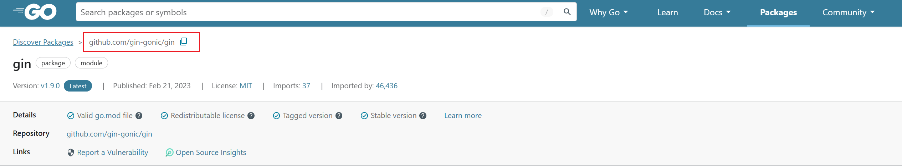
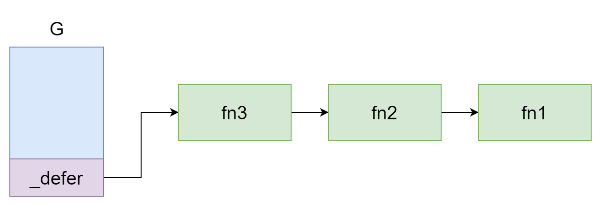
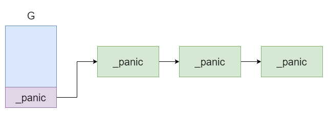
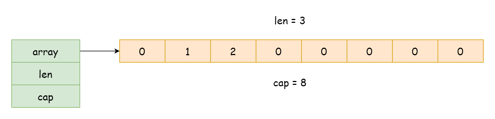
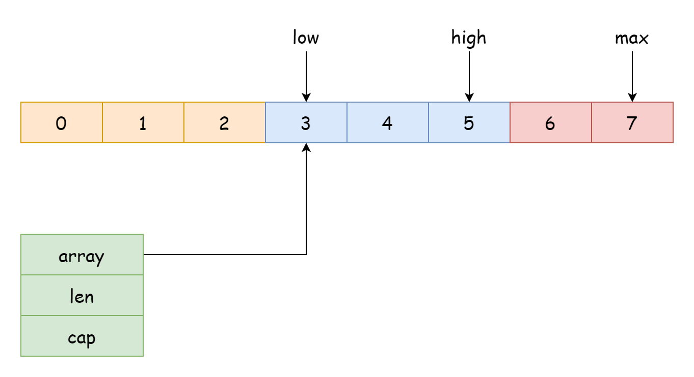

# Go

## 第一章 语言基础

### 基础语法

Go 的基本语法十分简单易懂，让我们从一个最简单的例子开始。

```go
package main

import "fmt"

func main() {
    fmt.Println("Hello 世界!")
}
```

`package` 关键字声明了是当前 go 文件属于哪一个包，入口文件都必须声明为 main 包，入口函数是 main 函数，在自定义包和函数时命名应当尽量避免与之重复。

`import` 是导入关键字，后面跟着的是被导入的包名。

`func` 是函数声明关键字，用于声明一个函数。

`fmt.Println("Hello 世界!")` 是一个语句，调用了 fmt 包下的 Println 函数进行输出。

以上就是一个简单的语法介绍，下面就来略微细致地去了解里面的概念。

#### 包

在 Go 中，程序是通过将包链接在一起来构建的。Go 中进行导入的最基本单位是一个包，而不是 .go 文件。包其实就是一个文件夹，英文名 package，包内共享所有变量，常量，以及所有定义的类型。包的命名风格建议都是小写字母，并且要尽量简短。

##### 可见性

前面提到过包内共享所有变量，常量，以及所有定义的类型，但对于包外而言并不是这样，有时候你并不想让别人访问某一个类型，所以就需要控制可见性。你可能在其它 OOP 语言中见过 Public ， Pravite 等关键字，不过在 Go 语言中没有这些，它控制可见性的方式非常简单，规则如下

- 名称大写字母开头，即为公有类型/变量/常量
- 名字小写或下划线开头，即为私有类型/变量/常量

比如下面的一个例子，常量 MyName 就是公开的，而常量 mySalary 就是私有的。

```go
package example

// 公有
const MyName = "jack"

// 私有
const mySalary = 20_000
```

这个可见性的规则适用于整个 Go 语言的任何地方。

##### 导入

导入一个包来使用这个包中的类型/方法/函数/变量，导入的语法就是 import 加上包名

```go
package main

import "example"
```

当导入多个包时，你可以这么写

```go
package main

import "example"
import "example1"
```

也可以用括号括起来，下面这种方法在实践中更加常用。

```go
package main

import (
  "example"
  "example1"
)
```

如果有包名重复了，或者包名比较复杂，你也可以给它们起别名

```go
package main

import (
  e "example"
  e1 "example1"
)
```

别名为下划线 _ 时就是匿名导入，匿名导入的包无法被使用，这么做通常是为了加载包下的 init 函数，但又不需要用到包中的类型，一个常见的例子就是注册数据库驱动，但是你并不需要去手动使用驱动。

```go
package main

import (
  e "example"
  _ "mysql-driver-go"
)
```

当你导入后，想要访问包中的类型时，通过 包名.标识符 去访问即可，比如下面这个例子，若你尝试去访问一个私有的类型，编译器就会告诉你无法访问。

```go
package main

import (
  "example"
   "fmt"
)

func main() {
    fmt.Println(example.MyName)
}
```

有一种特殊的导入方式就是将该包中的所有类型都导入到当前包作用域，以这种方法导入的类型不再需要 . 运算符去访问，但是如果有重名的类型将会无法通过编译。

```go
package main

import (
  . "example"
)
```


Go 中无法进行循环导入，不管是直接的还是间接的。例如包 A 导入了包 B，包 B 也导入了包 A，这是直接循环导入，包 A 导入了包 C，包 C 导入了包 B，包 B 又导入了包 A，这就是间接的循环导入，存在循环导入的话将会无法通过编译。

##### 内部包

go 中约定，一个包内名为 internal 包为内部包，外部包将无法访问内部包中的任何内容，否则的话编译不通过，下面看一个例子。

```
/home/user/go/
    src/
        crash/
            bang/              (go code in package bang)
                b.go
        foo/                   (go code in package foo)
            f.go
            bar/               (go code in package bar)
                x.go
            internal/
                baz/           (go code in package baz)
                    z.go
            quux/              (go code in package main)
                y.go
```

由文件结构中可知， crash 包无法访问 baz 包中的类型。

#### 注释

Go 支持单行注释和多行注释，注释与内容之间建议隔一个空格，例如

```go
// 这是main包
package main

// 导入了fmt包
import "fmt"

/*
*
这是启动函数main函数
*/
func main() {
  // 这是一个语句
  fmt.Println("Hello 世界!")
}
```

#### 标识符

标识符就是一个名称，用于包命名，函数命名，变量命名等等，命名规则如下：

- 只能由字母，数字，下划线组成
- 只能以字母和下划线开头
- 严格区分大小写
- 不能与任何已存在的标识符重复，即包内唯一的存在
- 不能与 Go 任何内置的关键字冲突

下方列出所有的内置关键字，也可以前往参考手册-标识符查看更多细节

```
break        default      func         interface    select
case         defer        go           map          struct
chan         else         goto         package      switch
const        fallthrough  if           range        type
continue     for          import       return       var
```


#### 代码风格

关于编码风格这一块 Go 是强制所有人统一同一种风格，Go 官方提供了一个格式化工具 gofmt ，通过命令行就可以使用，该格式化工具没有任何的格式化参数可以传递，仅有的两个参数也只是输出格式化过程，所以完全不支持自定义，也就是说所有通过此工具的格式化后的代码都是同一种代码风格，这会极大的降低维护人员的心智负担，所以在这一块追求个性显然是一个不太明智的选择。

##### 函数花括号换行

关于函数后的花括号到底该不该换行，几乎每个程序员都能说出属于自己的理由，在 Go 中所有的花括号都不应该换行

```go
// 正确示例
func main() {
  fmt.Println("Hello 世界!")
}
```

如果你真的这么做了，像下面这样

```go
// 错误示例
func main()
{
  fmt.Println("Hello 世界!")
}
```

这样的代码连编译都过不了，所以 Go 强制所有程序员花函数后的括号不换行。

##### 代码缩进

Go 默认使用 Tab 也就是制表符进行缩进，仅在一些特殊情况会使用空格。

##### 花括号省略

在其它语言中的 if 和 for 语句通常可以简写，像下面这样

```c
for (int i=0; i < 10; i++) printf("%d", i)
```

但在 Go 中不行，你可以只写一行，但必须加上花括号

```go
for i := 0; i < 10; i++ {fmt.Println(i)}
```

<<<<<<< HEAD
### 基本语法
=======
>>>>>>> 1ed6465f205541041eab649c0f09d390e3dac611

### 数据类型

数据类型指定有效的Go变量可以保存的数据类型。在Go语言中，类型分为以下四类：

* **基本类型：**数字，字符串和布尔值属于此类别。

* **聚合类型：**数组和结构属于此类别。

* **引用类型：**指针，切片，map集合，函数和Channel属于此类别。

* **接口类型**

#### 基本类型

##### 数值类型

- **整数：**有符号和无符号整数都可以使用四种不同的大小，如下表所示。有符号整数使用 `int8`、`int16`、`int32`、`int64` 表示，无符号整数使用 `uint8`、`uint16`、`uint32`、`uint64` 表示。

  | 数据类型    | 描述                                                       |
  | :---------- | :--------------------------------------------------------- |
  | **int8**    | 8位有符号整数                                              |
  | **int16**   | 16位有符号整数                                             |
  | **int32**   | 32位有符号整数                                             |
  | **int64**   | 64位有符号整数                                             |
  | **uint8**   | 8位无符号整数                                              |
  | **uint16**  | 16位无符号整数                                             |
  | **uint32**  | 32位无符号整数                                             |
  | **uint64**  | 64位无符号整数                                             |
  | **int**     | 平台相关的有符号整数，通常为32位或64位。                   |
  | **uint**    | 平台相关的无符号整数，通常为32位或64位。                   |
  | **rune**    | `int32` 的别名，表示一个 Unicode 代码点。                  |
  | **byte**    | `uint8` 的别名。                                           |
  | **uintptr** | 无符号整数类型，专用于存放指针运算，用于存放死的指针地址。 |

- **浮点数：**在Go语言，浮点数被分成2类如示于下表：

  | 数据类型    | 描述               |
  | :---------- | :----------------- |
  | **float32** | 32位IEEE 754浮点数 |
  | **float64** | 64位IEEE 754浮点数 |

- **复数：**将复数分为两部分，float32和float64也是这些复数的一部分。内建函数从它的虚部和实部创建一个复数，内建虚部和实部函数提取这些部分。

  | 数据类型       | 描述                                  |
  | :------------- | :------------------------------------ |
  | **complex64**  | 包含float32作为实数和虚数分量的复数。 |
  | **complex128** | 包含float64作为实数和虚数分量的复数。 |

##### 布尔类型

布尔数据类型仅表示true或false。布尔类型的值不会隐式或显式转换为任何其他类型。

##### 字符串

在Go语言中，字符串是一个变宽字符序列，是任意字节(包括值为零的字节)的不可变链，或者是一个只读字节片，字符串的字节可以使用UTF-8编码在Unicode文本中表示。

**注意：**字符串可以为空，但不能为nil。

###### 字符串字面量

- **使用双引号（""）：**此类字符串支持转义字符，如下表所示，但不跨越多行。

  | 转义符         | 描述                                         |
  | :------------- | :------------------------------------------- |
  | **\\**         | 反斜杠（\）                                  |
  | **\000**       | 具有给定的3位8位八进制代码点的Unicode字符    |
  | **\'**         | 单引号（'）。仅允许在字符文字中使用          |
  | **\"**         | 双引号（"）。仅允许在解释的字符串文字中使用  |
  | **\a**         | ASCII铃声(BEL)                               |
  | **\b**         | ASCII退格键(BS)                              |
  | **\f**         | ASCII换页(FF)                                |
  | **\n**         | ASCII换行符(LF)                              |
  | **\r**         | ASCII回车(CR)                                |
  | **\t**         | ASCII标签(TAB)                               |
  | **\uhhhh**     | 具有给定的4位16位十六进制代码点的Unicode字符 |
  | **\Uhhhhhhhh** | 具有给定的8位32位十六进制代码点的Unicode字符 |
  | **\v**         | ASCII垂直制表符(VT)                          |
  | **\xhh**       | 具有给定的2位8位十六进制代码点的Unicode字符  |

- **使用反引号（\`\`）**：原始文本。原始文本不支持转义字符，可以跨越多行，并且可以包含除反引号之外的任何字符。

###### 字符串索引与包含

- **Contains：**检查给定字符串中是否存在指定子串。

```go
func Contains(str, chstr string) bool
// str: 原始字符串
// chstr: 要检查的子串
// 返回值: 是否包含指定子串
```

- **ContainsAny：**检查给定字符串中是否存在字符集合中的任意 Unicode 字符。

```go
func ContainsAny(str, charstr string) bool
// str: 原始字符串
// charstr: 字符集合
// 返回值: 是否包含任意匹配字符
```

- **Index：**返回指定子串第一次出现的索引值，不存在时返回 `-1`。

```go
func Index(str, sbstr string) int
// str: 原始字符串
// sbstr: 要查找的子串
// 返回值: 第一次出现的字节索引，不存在时返回 -1
```

- **IndexAny：**返回字符集合中任意 Unicode 字符第一次出现的索引值，不存在时返回 `-1`。

```go
func IndexAny(str, charstr string) int
// str: 原始字符串
// charstr: 字符集合
// 返回值: 第一次出现的字节索引，不存在时返回 -1
```

- **IndexByte：**返回指定字节第一次出现的索引值，不存在时返回 `-1`。

```go
func IndexByte(str string, b byte) int
// str: 原始字符串
// b: 要查找的字节
// 返回值: 第一次出现的字节索引，不存在时返回 -1
```

* 因为字符串本质是字节序列，其索引操作`str[i]`被设计为返回第 i 个字节，语法上与切片一致，注意：**输出是字节编码值而不是字符**


###### 字符串比较

字符串无法修改，但是可以直接使用比较运算符进行比较，也可以使用 `strings.Compare()` 按词法顺序比较。

- **比较运算符：**支持 `==`、`!=`、`>`、`>=`、`<`、`<=`，结果为 `bool`。
- **Compare：**比较两个字符串，返回 `-1`、`0` 或 `1`。

```go
func Compare(str1, str2 string) int
// str1: 第一个字符串
// str2: 第二个字符串
// 返回值:
// -1: str1 < str2
//  0: str1 == str2
//  1: str1 > str2
```

###### 字符串常用函数

- **Join：**将字符串切片中存在的所有元素连接为单个字符串。

```go
func Join(str []string, sep string) string
// str: 待连接的字符串切片
// sep: 元素之间插入的分隔符
// 返回值: 连接后的字符串
```

- **Trim：**修剪字符串两侧属于指定字符集合的字符。

```go
func Trim(str string, cutstr string) string
// str: 当前字符串
// cutstr: 两侧要修剪的字符集合
// 返回值: 修剪后的字符串
```

- **TrimLeft：**修剪字符串左侧属于指定字符集合的字符。

```go
func TrimLeft(str string, cutstr string) string
// str: 当前字符串
// cutstr: 左侧要修剪的字符集合
// 返回值: 修剪后的字符串
```

- **TrimRight：**修剪字符串右侧属于指定字符集合的字符。

```go
func TrimRight(str string, cutstr string) string
// str: 当前字符串
// cutstr: 右侧要修剪的字符集合
// 返回值: 修剪后的字符串
```

- **TrimSpace：**修剪字符串两侧空白字符。

```go
func TrimSpace(str string) string
// str: 当前字符串
// 返回值: 去除两侧空白后的字符串
```

- **TrimPrefix：**删除固定前缀，未匹配时返回原字符串。

```go
func TrimPrefix(str, prefix string) string
// str: 原始字符串
// prefix: 要删除的前缀
// 返回值: 删除前缀后的字符串
```

- **TrimSuffix：**删除固定后缀，未匹配时返回原字符串。

```go
func TrimSuffix(str, suffix string) string
// str: 原始字符串
// suffix: 要删除的后缀
// 返回值: 删除后缀后的字符串
```

- **Split：**按分隔符拆分字符串，不保留分隔符。

```go
func Split(str, sep string) []string
// str: 原始字符串
// sep: 分隔符
// 返回值: 拆分后的字符串切片
```

- **SplitAfter：**按分隔符拆分字符串，保留分隔符。

```go
func SplitAfter(str, sep string) []string
// str: 原始字符串
// sep: 分隔符
// 返回值: 拆分后的字符串切片，分隔符保留在子串末尾
```

- **SplitAfterN：**按分隔符拆分字符串，并限制返回结果数量。

```go
func SplitAfterN(str, sep string, m int) []string
// str: 原始字符串
// sep: 分隔符
// m: 返回结果数量限制
// 返回值: 拆分后的字符串切片
// m > 0: 最多返回 m 个结果
// m == 0: 返回 nil
// m < 0: 返回全部结果
```

###### 字符串使用要点

- **字符串是不可变的：**在Go语言中，一旦创建了字符串，则字符串是不可变的，无法更改字符串的值。

- **如何遍历字符串：**可以使用 `for range` 循环按 `rune` 遍历字符串。

```go
for index, chr := range str {
    // index: 当前 rune 的起始字节索引
    // chr: 当前 rune
}
```

- **如何访问字符串的单个字节：**可以使用下标按字节访问字符串内容。

- **如何从切片创建字符串：**允许从 `[]byte` 或 `[]rune` 创建字符串。

- **如何连接字符串**：使用`+`可以连接两个字符串。

- **如何查找字符串的长度：**`len()` 返回**字节数而非字符数**，`utf8.RuneCountInString()` 返回 `rune` 数。

#### 聚合类型

##### 数组

Go编程语言中的数组是固定长度的，它是值类型，而非引用，并不是指向头部元素的指针。将数组作为参数传递给函数时，由于 Go 函数是传值传递，所以会将整个数组拷贝。

###### 数组声明

- **使用 var 关键字：**适合先声明后赋值，数组长度是类型的一部分。

```go
var arrayName [length]ElementType
// arrayName: 数组变量名
// length: 数组长度，必须是常量
// ElementType: 元素类型
```

- **使用简写声明：**适合声明时直接初始化。

```go
arrayName := [length]ElementType{element1, element2, element3}
arrayName := [...]ElementType{element1, element2, element3}
// arrayName: 数组变量名
// length: 数组长度
// ElementType: 元素类型
// ...: 根据初始化元素数量推导数组长度
```

- **多维数组：**数组的元素也可以是数组。

```go
var arrayName [length1][length2]ElementType
// length1: 第一维长度
// length2: 第二维长度
// ElementType: 元素类型
```

###### 数组操作

- **len：**返回数组长度。

```go
len(arrayValue)
// arrayValue: 数组值
// 返回值: 数组长度
```

- **遍历：**可以使用下标循环或 `for range` 遍历数组元素。

```go
for index := 0; index < len(arrayValue); index++ {
    // arrayValue[index]
}

for index, element := range arrayValue {
    // index: 当前索引
    // element: 当前元素副本
}
```

- **数组是值类型：**数组赋值会复制全部元素，修改副本不会影响原数组。

```go
copiedArray := sourceArray
// sourceArray: 原数组
// copiedArray: 原数组副本
// 返回结果: 复制后的新数组
```

- **引用复制：**可以通过指针共享同一个数组。

```go
referencedArray := &sourceArray
// sourceArray: 原数组
// referencedArray: 指向原数组的指针
// 返回结果: 通过指针访问原数组
```

- **数组可比较：**如果元素类型可比较，则数组也可比较，可以直接使用 `==`。

```go
leftArray == rightArray
// leftArray: 左侧数组
// rightArray: 右侧数组
// 返回值: 两个数组是否相等
```

###### 数组作为参数

在Go语言中，可以将数组或数组指针作为函数参数传递。数组参数会复制全部元素，切片参数不属于数组类型。

- **固定长度数组参数：**形参类型必须包含数组长度。

```go
func functionName(arrayValue [size]ElementType) ReturnType {
    statement
}
// arrayValue: 数组参数
// size: 数组长度
// ElementType: 元素类型
```

- **数组指针参数：**适合避免复制整个数组，或在函数内修改原数组。

```go
func functionName(arrayPointer *[size]ElementType) ReturnType {
    statement
}
// arrayPointer: 指向数组的指针参数
// size: 数组长度
// ElementType: 元素类型
```

##### 结构体

Go 语言中数组可以存储同一类型的数据，但在结构体中我们可以为不同项定义不同的数据类型。结构体是由一系列具有相同类型或不同类型的数据构成的数据集合。**结构体的内容将在第二章详细描述。**

#### 引用类型

##### 指针

###### 指针声明与初始化

在开始之前，我们将在指针中使用两个重要的运算符，即

`*` 运算符也称为解引用运算符，用于声明指针变量并访问存储在地址中的值。

`&` 运算符称为地址运算符，用于返回变量的地址或将变量的地址赋给指针。

- **声明一个指针：**

```go
var pointerName *DataType
// pointerName: 指针变量名
// DataType: 指针指向的数据类型
```

- **初始化指针：**需要使用地址运算符 `&` 获取变量地址。

```go
var value = 45
var pointerValue *int = &value
// value: 普通变量
// &value: 变量 value 的地址
// pointerValue: 保存 value 地址的指针变量
```

- **简写声明：**可以直接通过地址初始化，由编译器推导指针类型。

```go
value := 45
pointerValue := &value
// pointerValue 的类型会被推导为 *int
```

- **使用 `new` 初始化：**`new(Type)` 会分配对应类型的内存，并返回该类型的指针，指向该类型的零值。

```go
new(Type) *Type
// Type: 要分配内存的类型
// 返回值: 指向该类型零值的指针
```

###### 指针解引用

`*` 运算符不仅用于声明指针变量，也用于访问指针所指向的变量中存储的值。

```go
*pointerValue
// pointerValue: 指针变量
// 返回值: 指针指向的变量值
```

###### 指针比较

在Go语言中，允许比较两个指针。两个指针值只有在它们指向内存中的相同变量或者它们都为 `nil` 时才相等。

- **== 运算符：**如果两个指针指向同一个变量，则返回 `true`。
- **!= 运算符：**如果两个指针指向不同变量，则返回 `true`。

```go
leftPointer == rightPointer
// leftPointer: 左侧指针
// rightPointer: 右侧指针
// 返回值: 两个指针是否相等
```

###### 指针运算

在Go语言中，不支持普通指针的算术运算，指针不能像某些语言中那样进行偏移。

```go
pointerValue++
// pointerValue: 普通指针
// 结果: 非法，无法通过编译
```

**补充**：标准库 unsafe 提供了低级指针操作能力，包括指针运算。日常 Go 代码通常不依赖这类写法。

###### 指向数组的指针长度与容量

对于**指向数组的指针**，可以使用 `len()` 和 `cap()` 获取它所指向数组的长度与容量。

```go
len(arrayPointer)
cap(arrayPointer)
// arrayPointer: 指向数组的指针
// 返回值: 指向数组的长度或容量
```

###### 指针作为参数或返回值

在Go语言中，可以将指针作为参数传递给函数，也可以将指针作为返回值返回。

- **指针作为参数：**适合在函数内部修改外部变量。

```go
func functionName(pointerValue *DataType) ReturnType {
    statement
}
// pointerValue: 指针参数
// DataType: 指针指向的数据类型
```

- **指针作为返回值：**函数可以返回某个值的地址。

```go
func functionName() *DataType {
    statement
}
// 返回值: 指向 DataType 的指针
```

###### 指针自动解引用

Go存在自动解引用，也就是你传递的是指针，但是Go会自动解引用并操作对应指向的值。

* 当使用结构体指针通过 . 访问字段时，Go 会自动解引用指针。

* 当通过结构体指针调用方法时，无论方法的接收者是值类型还是指针类型，Go 都会自动解引用。**不过，并不会改变传递类型，比如你向值类型接收者传递了指针，那么效果是复制指针指向的值，然后解引用，在方法中任何修改并不会造成原本内容的改变；如果你向指针类型接收者传递值，那么你无法通过编译。**

* 当对数组指针使用 [] 索引操作符时，Go 会自动解引用指针。

自动解引用是 Go 的语法糖，旨在减少代码中的 * 符号，提高可读性。

###### new 和 make

`new` 和 `make` 都用于内存分配，但用途不同。

- **new：**接收一个类型，返回该类型的指针，它的本质是按照类型分配空间然后返回空间起始位置。
- **make：**返回值本身，不返回指针，只用于 `slice`、`map`、`chan`，它的本质是在空闲空间上创建并容纳一个对应类型的值，这也意味着返回值和创建类型本身有关。

```go
new(Type) *Type
// Type: 要分配内存的类型
// 返回值: 指向该类型零值的指针
```

```go
make(Type, size ...IntegerType) Type
// Type: slice、map 或 chan 类型
// size: 长度、容量或缓冲区大小
// 返回值: 初始化后的值
```

###### nil

`nil`类似于其它语言中的`none`或者`null`，但并不等同。`nil`仅仅只是一些引用类型的零值，并且不属于任何类型，从源代码中的`nil`可以看出它仅仅只是一个变量。

```go
var nil Type
```

并且`nil == nil`这样的语句是无法通过编译的。

##### 切片

在Go语言中，切片是一个可变长度序列，用于存储相同类型的元素，不允许在同一切片中存储不同类型的元素。切片的大小可以调整，不像数组处于固定大小。

**切片的底层实现依旧是数组，是引用类型，可以简单理解为是指向底层数组的指针（本质上切片在Go中是一个结构体，包含指向底层数组的指针、长度值、容量值）。因此切片作为函数参数传递时不复制底层数组，函数内对传入切片的修改会反映在原切片中。**

###### 切片声明与初始化

1. 切片声明时不写长度，零值为 `nil`。

```go
var sliceValue []int
// sliceValue: int 类型切片
// 返回结果: 零值切片，值为 nil
```

2. 可以直接使用切片字面量初始化。

```go
sliceValue := []int{1, 2, 3}
// sliceValue: 切片变量
// 1, 2, 3: 初始化元素
// 返回结果: 长度为 3 的切片
```

3. `make` 常用于创建可用切片，返回值是切片本身。

```go
make([]T, len, cap)
// T: 元素类型
// len: 切片长度
// cap: 切片容量，可选
// 返回结果: []T
```

4. `new` 返回的是切片指针，较少作为常规初始化手段。

```go
new([]T)
// T: 元素类型
// 返回值: *[]T
// 说明: 指向零值切片的指针
```

###### 切片切割与共享

1. 切片可以从数组创建，也可以从已有切片继续切割。

```go
source[low:high]
// source: 数组或切片
// low: 起始下标，默认值为 0
// high: 结束下标，默认值为 len(source)
// 返回结果: [low, high) 范围的新切片
```

2. 普通切割通常共享底层数组。

```go
subSlice := sourceSlice[1:4]
// subSlice: 与 sourceSlice 共享底层数组的新切片
```

3. 三下标表达式可以限制新切片容量。

```go
subSlice := sourceSlice[low:high:max]
// low: 起始下标
// high: 结束下标
// max: 容量上界
// 返回结果: 容量为 max - low 的新切片
```

###### 切片追加

新 slice 预留的 buffer 容量 大小是**有一定规律的**。 在 golang1.18 版本更新之前网上大多数的文章都是这样描述 slice 的扩容策略的： 当原 slice 容量小于 1024 的时候，新 slice 容量变成原来的 2 倍；原 slice 容量超过 1024，新 slice 容量变成原来的 1.25 倍。 在 1.18 版本更新之后，slice 的扩容策略变为了： 当原 slice 容量(oldcap)小于 256 的时候，新 slice(newcap)容量为原来的 2 倍；原 slice 容量超过 256，新 slice 容量 newcap = oldcap+(oldcap+3*256)/4

1. `append` 用于向切片尾部追加元素，返回追加后的新切片。

```go
append(slice []Type, elems ...Type) []Type
// slice: 目标切片
// elems: 要追加的元素
// 返回值: 追加后的新切片
```

2. `append(slice, otherSlice...)` 会把另一个切片展开后逐个追加。

```go
resultSlice := append(leftSlice, rightSlice...)
// leftSlice: 目标切片
// rightSlice: 待展开追加的切片
// 返回值: 追加后的新切片
```

3. `append` 也是插入、删除、连接等操作的基础手段。

**`append`的本质是将某个切片追加到另一个切片后边，再加上切片自身的用法，使得不需要专门的删除，插入也能使用`append`完成。**

```go
package main

import "fmt"

func main() {
    nums := make([]int, 0, 0)
    nums = append(nums, 1, 2, 3, 4, 5)
    nums = append(nums, []int{6, 7}...)
    fmt.Println(nums)                 // [1 2 3 4 5 6 7]
    fmt.Println(len(nums), cap(nums)) // 长度与容量可能不同

    insertSource := []int{1, 2, 3, 4, 5}
    insertIndex := 2
    insertSource = append(insertSource[:insertIndex], append([]int{999, 1000}, insertSource[insertIndex:]...)...)
    fmt.Println(insertSource) // [1 2 999 1000 3 4 5]

    deleteSource := []int{1, 2, 3, 4, 5, 6}
    deleteSource = deleteSource[2:]
    fmt.Println(deleteSource) // [3 4 5 6]

    deleteSource = deleteSource[:len(deleteSource)-1]
    fmt.Println(deleteSource) // [3 4 5]

    deleteSource = append(deleteSource[:1], deleteSource[2:]...)
    fmt.Println(deleteSource) // [3 5]

    // **注意**
    // 1. append 本质上返回一个新的切片值，通常要接回原变量。
    // 2. 插入、删除、连接本质上都可以通过 append 组合实现。
    // 3. 容量不足时，append 会分配新的底层数组。
}
```

###### 切片遍历

1. 可以使用普通 `for` 循环遍历切片。

```go
for index := 0; index < len(sliceValue); index++ {
    // sliceValue[index]
}
```

2. 可以使用 `for range` 获取索引和值。

```go
for index, element := range sliceValue {
    // index: 当前索引
    // element: 当前元素副本
}
```

3. 只需要值时，可以使用空白标识符 `_` 忽略索引。

```go
for _, element := range sliceValue {
    // element: 当前元素副本
}
```

###### 切片其他用法

1. `copy` 复制元素，复制数量取目标长度和源长度的较小值。

```go
copy(dst, src []Type) int
// dst: 目标切片
// src: 源切片
// 返回值: 实际复制的元素数量
```

2. `bytes.Compare`、`bytes.Split` 只适用于 `[]byte`。

```go
Compare(slice1, slice2 []byte) int
// slice1: 第一个字节切片
// slice2: 第二个字节切片
// 返回值: -1 / 0 / 1
```

```go
Split(oSlice, sep []byte) [][]byte
// oSlice: 原始字节切片
// sep: 分隔符
// 返回值: 拆分后的 [][]byte
```

3. `sort.Ints` 和 `sort.IntsAreSorted` 处理 `[]int`。

```go
Ints(slc []int)
// slc: 待排序的 int 切片
// 返回结果: 原地升序排序
```

```go
IntsAreSorted(slc []int) bool
// slc: 待检查的 int 切片
// 返回值: 是否已按升序排列
```

4. `clear` 会将切片中的元素重置为零值，但不会改变长度和容量。

```go
clear(sliceValue)
// sliceValue: 切片
// 返回结果: 将所有元素置为零值
```

5. `sliceValue = sliceValue[:0]` 或 `sliceValue = sliceValue[:0:0]` 常用于清空切片。

```go
package main

import (
    "bytes"
    "fmt"
    "sort"
)

func main() {
    sourceSlice := []int{10, 20, 30, 40, 50}
    targetSlice := make([]int, 3)
    copiedCount := copy(targetSlice, sourceSlice)
    fmt.Println(targetSlice) // [10 20 30]
    fmt.Println(copiedCount) // 3

    sortableSlice := []int{400, 600, 100, 300, 500, 200}
    fmt.Println(sort.IntsAreSorted(sortableSlice)) // false
    sort.Ints(sortableSlice)
    fmt.Println(sortableSlice)                     // [100 200 300 400 500 600]
    fmt.Println(sort.IntsAreSorted(sortableSlice)) // true

    leftByteSlice := []byte("Go")
    rightByteSlice := []byte("Lang")
    compareResult := bytes.Compare(leftByteSlice, rightByteSlice)
    splitResult := bytes.Split([]byte("Go,Java,Python"), []byte(","))
    fmt.Println(compareResult) // 1
    fmt.Println(splitResult)   // [[71 111] [74 97 118 97] [80 121 116 104 111 110]]

    clearSlice := []int{1, 2, 3, 4}
    clear(clearSlice)
    fmt.Println(clearSlice) // [0 0 0 0]

    clearSlice = clearSlice[:0]
    fmt.Println(clearSlice) // []

    limitedClearSlice := []int{1, 2, 3, 4}
    limitedClearSlice = limitedClearSlice[:0:0]
    fmt.Println(limitedClearSlice, len(limitedClearSlice), cap(limitedClearSlice)) // [] 0 0

    // **注意**
    // 1. copy 不会复制底层数组关系，只复制元素。
    // 2. 切片不能直接比较元素内容，通常只与 nil 比较。
    // 3. bytes.Compare 和 bytes.Split 处理的是 []byte。
    // 4. clear 只清零元素，不改变长度和容量。
}
```

###### 多维切片

1. `make([][]T, n)` 只创建外层切片。

```go
make([][]T, n)
// T: 元素类型
// n: 外层长度
// 返回结果: 外层已初始化、内层仍为 nil 的二维切片
```

2. 内层切片通常需要单独初始化。**这里比起把它看作多维数组，看出指针数组更容易理解，因为它是引用类型，而又未初始化，所以实际每个切片的长度是不确定的。**

```go
innerSlice := make([]T, length)
// T: 元素类型
// length: 内层切片长度
// 返回结果: 初始化后的内层切片
```

##### 映射

映射是一种无序的键值对集合，通过键快速访问值。映射表的键类型必须可比较，值类型没有此限制。Map 是引用类型，赋值或作为参数传递时会共享同一个底层数据结构。遍历 Map 时，键值对顺序不确定。访问不存在的键时，会返回值类型的零值。

**一般来说，映射表数据结构实现通常有两种，哈希表(hash table)和搜索树(search tree)，区别在于前者无序，后者有序。在 Go 中，`map`的实现是基于哈希桶(也是一种哈希表)，所以也是无序的。在初始化 map 时应当尽量分配一个合理的容量，以减少扩容次数。**

###### 映射初始化

1. 可以使用字面量创建 Map。

```go
map[keyType]valueType{}
// keyType: 键类型，必须可比较
// valueType: 值类型
```

2. 可以使用 `make` 创建 Map，并可指定初始容量。

```go
make(map[keyType]valueType, capacity)
// keyType: 键类型
// valueType: 值类型
// capacity: 初始容量，可选
// 返回结果: 初始化后的 map
```

3. 可以创建`nil map`，也就是不进行初始化使用零值。可以读取，但不能写入。

###### 映射访问与赋值

1. 通过 `mapValue[key]` 访问值，不存在的键会返回零值。

```go
mapValue[key]
// mapValue: 目标 map
// key: 键
// 返回值: 对应值；若键不存在，返回值类型零值
```

2. 通过双返回值形式可以判断键是否存在。

```go
value, exists := mapValue[key]
// value: 对应值
// exists: 键是否存在
```

3. 使用已存在的键赋值会覆盖原值。

```go
mapValue[key] = newValue
// key: 已存在或新写入的键
// newValue: 要写入的值
// 返回结果: 若 key 已存在则覆盖原值
```

4. `len(mapValue)` 返回当前键值对数量。

```go
len(mapValue)
// mapValue: 目标 map
// 返回值: 键值对数量
```

###### 映射删除、清空与遍历

1. `delete` 删除指定键值对，删除不存在的键不会报错。

```go
delete(mapValue, key)
// mapValue: 目标 map
// key: 要删除的键
// 返回结果: 删除对应键值对
```

2. `clear` 会清空 Map 中所有键值对。

```go
clear(mapValue)
// mapValue: 目标 map
// 返回结果: 清空 map 中所有键值对
```

3. `for range` 可以遍历 Map，但顺序不固定。

```go
for key, value := range mapValue {
    // key: 当前键
    // value: 当前值
}
```

###### 映射引用语义与并发

1. Map 是引用类型，赋值后多个变量会共享同一个底层数据结构。

```go
sharedMap := sourceMap
// sourceMap: 原 map
// sharedMap: 与原 map 共享底层数据的新变量
```

2. Map 不是并发安全的数据结构，并发读写可能触发运行时错误。

```go
concurrentMap["key"] = value
fmt.Println(concurrentMap["key"])
// 结果: 并发读写 map 可能触发 fatal error
```

3. 并发场景通常需要额外同步，或改用 `sync.Map`。

```go
package main

import (
    "fmt"
    "sync"
)

func main() {
    sourceMap := map[string]int{
        "a": 1,
        "b": 2,
    }

    sharedMap := sourceMap
    sharedMap["a"] = 100

    fmt.Println(sourceMap) // map[a:100 b:2]
    fmt.Println(sharedMap) // map[a:100 b:2]

    var group sync.WaitGroup
    concurrentMap := make(map[string]int, 10)

    group.Add(2)

    go func() {
        defer group.Done()
        for index := 0; index < 100; index++ {
            concurrentMap["hello"] = index
        }
    }()

    go func() {
        defer group.Done()
        for index := 0; index < 100; index++ {
            fmt.Println(concurrentMap["hello"])
        }
    }()

    group.Wait()

    // **注意**
    // 1. Map 赋值不会复制底层数据。
    // 2. 上述并发读写 map 的写法可能触发 fatal error。
    // 3. 并发场景下通常需要加锁，或改用 sync.Map。
}
```

###### 映射集合操作

Go 没有内建的 Set 类型，但可以使用 `map[T]struct{}` 或 `map[T]bool` 模拟。由于 Map 的键不能重复，因此非常适合表示无序且不重复的集合。

**初始化与存取**

1. `map[T]struct{}` 是最常见的 Set 写法。

```go
make(map[ElementType]struct{}, capacity)
// ElementType: 集合元素类型
// capacity: 初始容量，可选
// 返回结果: 使用 map 模拟的 set
```

2. 空结构体 `struct{}` 不占用额外存储空间。

```go
setValue[element] = struct{}{}
// setValue: 集合
// element: 要加入的元素
// 返回结果: 将元素加入集合
```

3. 判断元素是否存在时，通常使用双返回值形式。

```go
_, exists := setValue[element]
// exists: 元素是否存在于集合中
```

```go
package main

import "fmt"

func main() {
    setValue := make(map[int]struct{}, 10)

    setValue[1] = struct{}{}
    setValue[2] = struct{}{}
    setValue[2] = struct{}{}

    _, exists1 := setValue[1]
    _, exists2 := setValue[3]

    fmt.Println(setValue) // map[1:{} 2:{}]
    fmt.Println(exists1)  // true
    fmt.Println(exists2)  // false

    // **注意**
    // 1. 重复加入相同元素不会增加新的键。
    // 2. struct{} 适合用来表示“只关心键是否存在”。
}
```

**删除、遍历与清空**

1. 删除 Set 元素本质上是删除 Map 键。

```go
delete(setValue, element)
// setValue: 集合
// element: 要删除的元素
// 返回结果: 删除指定元素
```

2. 遍历 Set 本质上是遍历 Map 的键。

```go
for element := range setValue {
    // element: 当前集合元素
}
```

3. `clear` 也可以直接用于 Set。

```go
clear(setValue)
// setValue: 集合
// 返回结果: 清空集合
```

```go
package main

import "fmt"

func main() {
    setValue := map[string]struct{}{
        "go":   {},
        "java": {},
        "rust": {},
    }

    delete(setValue, "java")

    for element := range setValue {
        fmt.Println(element)
    }

    clear(setValue)
    fmt.Println(setValue) // map[]

    // **注意**
    // 1. Set 遍历顺序同样不固定。
    // 2. Set 的底层仍然是 Map，因此也不具备并发安全性。
}
```


##### 接口

接口（interface）是 Go 语言中的一种类型，用于定义行为的集合，它通过描述类型必须实现的方法，规定了类型的行为契约。**接口的内容将在第二章详细描述。**

##### 管道

**提前说明，管道的笔记部分可能需要第三章知识的支持。**

Channel 是 Go 中的一个核心类型，可以看成一个用于发送和接收数据的管道，通过它可以在 goroutine 之间进行通信。它的操作符是箭头 `<-`，箭头指向数据的流向。

###### 管道创建与方向

1. Channel 需要先创建再使用，通常使用 `make` 初始化。

```go
make(chan ElementType, capacity)
// ElementType: 管道中传输的数据类型
// capacity: 缓冲区大小，可选
// 返回结果: 对应类型的 channel
```

2. Channel 可以是双向、只发送、只接收三种方向。

```go
chan T
// 返回结果: 可发送也可接收的双向 channel
```

```go
chan<- T
// 返回结果: 只发送 channel
```

```go
<-chan T
// 返回结果: 只接收 channel
```

3. 如果容量为 0 或未指定容量，则为无缓冲管道；如果容量大于 0，则为有缓冲管道。

```go
package main

import "fmt"

func main() {
    bidirectionalChannel := make(chan int)
    bufferedChannel := make(chan int, 3)

    var sendOnlyChannel chan<- int = bufferedChannel
    var receiveOnlyChannel <-chan int = bufferedChannel

    fmt.Println(bidirectionalChannel) // channel 地址
    fmt.Println(bufferedChannel)      // channel 地址
    fmt.Println(sendOnlyChannel)      // channel 地址
    fmt.Println(receiveOnlyChannel)   // channel 地址

    // **注意**
    // 1. 无缓冲管道只有在发送方和接收方都准备好时才会完成通信。
    // 2. 有缓冲管道在缓冲区未满时发送通常不会阻塞，在缓冲区非空时接收通常不会阻塞。
    // 3. nil channel 不能正常通信。
}
```

###### 管道发送、接收与关闭

1. 发送操作使用 `channel <- value`。

```go
channelValue <- value
// channelValue: 目标 channel
// value: 要发送的数据
// 返回结果: 将数据发送到 channel
```

2. 接收操作使用 `<-channelValue`。

```go
value := <-channelValue
// channelValue: 目标 channel
// 返回值: 从 channel 中接收到的数据
```

3. 接收支持双返回值形式，可用于判断 channel 是否已关闭。

```go
value, ok := <-channelValue
// value: 接收到的数据
// ok: channel 是否仍然打开
// 若 ok 为 false，则 value 为元素类型零值
```

4. `close(channelValue)` 用于关闭 channel，关闭后不能继续发送数据。

```go
close(channelValue)
// channelValue: 要关闭的 channel
// 返回结果: 关闭 channel
```

```go
package main

import "fmt"

func main() {
    channelValue := make(chan int, 2)

    channelValue <- 1
    channelValue <- 2
    close(channelValue)

    firstValue := <-channelValue
    secondValue := <-channelValue
    thirdValue, ok := <-channelValue

    fmt.Println(firstValue)  // 1
    fmt.Println(secondValue) // 2
    fmt.Println(thirdValue)  // 0
    fmt.Println(ok)          // false

    // channelValue <- 3
    // panic: send on closed channel

    // **注意**
    // 1. 关闭后的 channel 仍可继续接收已发送的数据。
    // 2. 已关闭且已读空的 channel 再接收会得到零值。
    // 3. 向已关闭的 channel 发送数据会 panic。
}
```

###### 管道阻塞与缓冲

默认情况下，发送和接收会阻塞，直到另一方准备好。无缓冲 channel 常用于同步。有缓冲 channel 可以在一定程度上减少阻塞。

```go
package main

import "fmt"

func sumValue(partSlice []int, resultChannel chan int) {
    totalValue := 0
    for _, element := range partSlice {
        totalValue += element
    }
    resultChannel <- totalValue
}

func main() {
    sourceSlice := []int{7, 2, 8, -9, 4, 0}
    resultChannel := make(chan int)

    go sumValue(sourceSlice[:len(sourceSlice)/2], resultChannel)
    go sumValue(sourceSlice[len(sourceSlice)/2:], resultChannel)

    leftValue, rightValue := <-resultChannel, <-resultChannel
    fmt.Println(leftValue, rightValue, leftValue+rightValue)

    // **注意**
    // 1. 上面的接收操作会一直等待，直到对应结果被发送到 channel。
    // 2. 这种阻塞机制可用于 goroutine 之间的同步。
}
```

###### 管道迭代

`for range` 可以持续接收 channel 中的数据。只有在 channel 被关闭后，`range` 才会结束。如果发送结束后不关闭 channel，`range` 可能一直阻塞。

```go
for value := range channelValue {
    // value: 当前接收到的元素
}
```

```go
package main

import "fmt"

func main() {
    channelValue := make(chan int)

    go func() {
        for index := 0; index < 5; index++ {
            channelValue <- index
        }
        close(channelValue)
    }()

    for value := range channelValue {
        fmt.Println(value)
    }

    fmt.Println("Finished")

    // **注意**
    // 1. range 读取的是发送到 channel 中的值。
    // 2. 若不关闭 channel，range 可能会一直阻塞。
}
```

###### 管道 select 操作

`select` 用于在多个发送或接收操作之间选择一个可执行的分支。如果多个 case 同时满足，Go 会伪随机选择一个。如果没有可执行分支且存在 `default`，则会执行 `default`；否则会阻塞。

```go
select {
case value := <-receiveChannel:
    statement
case sendChannel <- value:
    statement
default:
    statement
}
```

4. `select` 本身不是循环，若需要持续监听，通常要配合 `for` 使用。

```go
package main

import (
    "fmt"
    "time"
)

func fibonacci(outputChannel, quitChannel chan int) {
    leftValue, rightValue := 0, 1

    for {
        select {
        case outputChannel <- leftValue:
            leftValue, rightValue = rightValue, leftValue+rightValue
        case <-quitChannel:
            fmt.Println("quit")
            return
        }
    }
}

func main() {
    outputChannel := make(chan int)
    quitChannel := make(chan int)

    go func() {
        for index := 0; index < 5; index++ {
            fmt.Println(<-outputChannel)
        }
        quitChannel <- 0
    }()

    fibonacci(outputChannel, quitChannel)

    timeoutChannel := make(chan string, 1)
    go func() {
        time.Sleep(2 * time.Second)
        timeoutChannel <- "result"
    }()

    select {
    case result := <-timeoutChannel:
        fmt.Println(result)
    case <-time.After(1 * time.Second):
        fmt.Println("timeout")
    }

    // **注意**
    // 1. nil channel 上的 send / receive 会一直阻塞。
    // 2. 只有 nil channel 且没有 default 的 select 会一直阻塞。
    // 3. time.After 常用于超时控制。
}
```

###### 管道同步

Channel 可以直接用于 goroutine 之间的同步。常见方式是一个 goroutine 完成工作后向 channel 发送信号，另一个 goroutine 等待接收。

```go
package main

import (
    "fmt"
    "time"
)

func worker(done chan bool) {
    time.Sleep(time.Second)
    done <- true
}

func main() {
    done := make(chan bool, 1)

    go worker(done)

    <-done
    fmt.Println("finished")

    // **注意**
    // 1. 这里只关心同步时，channel 中传递的值本身往往不重要。
    // 2. 这种写法常用于等待任务完成。
}
```

###### Timer 与 Ticker

`time.NewTimer` 返回一个定时器，它会在未来某个时间点向 `Timer.C` 发送一次时间值。`time.NewTicker` 返回一个周期性计时器，它会按固定间隔持续向 `Ticker.C` 发送时间值。两者都可以通过 `Stop` 停止。

```go
package main

import (
    "fmt"
    "time"
)

func main() {
    timerValue := time.NewTimer(2 * time.Second)
    <-timerValue.C
    fmt.Println("Timer expired")

    secondTimer := time.NewTimer(time.Second)
    stopResult := secondTimer.Stop()
    fmt.Println(stopResult) // true 或 false

    tickerValue := time.NewTicker(500 * time.Millisecond)
    defer tickerValue.Stop()

    done := make(chan bool, 1)

    go func() {
        time.Sleep(1600 * time.Millisecond)
        done <- true
    }()

    for {
        select {
        case tickTime := <-tickerValue.C:
            fmt.Println("Tick at", tickTime)
        case <-done:
            fmt.Println("Finished")
            return
        }
    }

    // **注意**
    // 1. Timer 对应单次事件，Ticker 对应周期性事件。
    // 2. Timer.C 和 Ticker.C 本质上都是 channel。
}
```

#### 别名类型

##### byte

`byte` 是 `uint8` 的别名。在语言层面，它与 `uint8` 完全等价；但在实际书写中，`byte` 更强调“字节”语义，通常用于原始二进制数据、文件内容、网络数据、ASCII 字符等场景。Go 官方内建定义中明确说明：`byte` 用来区分字节值与普通的 8 位无符号整数值。

```go
type byte = uint8
// byte: uint8 的别名
// 用途: 表示单个字节
```

1. 处理字符串底层字节时，经常会转成 `[]byte`。
2. 对 ASCII 字符，`byte` 往往足够直接。
3. 标准库中很多 I/O、编码、网络接口都大量使用 `[]byte`。

```go
package main

import "fmt"

func main() {
    stringValue := "Go语言"

    byteValue := stringValue[0]
    byteSlice := []byte(stringValue)

    fmt.Println(byteValue) // 71，'G' 的字节值
    fmt.Println(byteSlice) // UTF-8 字节序列

    // **示例**
    // stringValue[0] 取到的是第 1 个字节，不一定是完整字符。
    // []byte(stringValue) 常用于处理原始字节数据。
    //
    // **注意**
    // 1. byte 更强调“字节”语义，而不是整数语义。
    // 2. 处理文件、网络、编码、ASCII 时常用 []byte。
    // 3. 多字节字符不适合按 byte 直接理解为“一个字符”。
}
```

##### rune

`rune` 是 `int32` 的别名。在语言层面，它与 `int32` 完全等价；但在实际书写中，`rune` 更强调“字符 / Unicode 码点”语义。Go 官方内建定义中明确说明：`rune` 用来区分字符值与普通整数值。Go 字符串底层是 UTF-8 字节序列，而一个字符并不一定只占一个字节，因此在处理中文、多语言文本、按字符遍历字符串、统计字符数、按字符截取字符串时，`rune` 往往比按字节处理更合适。

```go
type rune = int32
// rune: int32 的别名
// 用途: 表示一个 Unicode 码点
```

1. `len(stringValue)` 统计的是字节数，不是字符数。
2. `[]rune(stringValue)` 适合按字符处理字符串。
3. `for range` 遍历字符串时，拿到的是 `rune`。
4. 字符字面量如 `'语'` 的类型本质上就是字符常量，常与 `rune` 语义对应。

```go
package main

import (
    "fmt"
    "unicode/utf8"
)

func main() {
    stringValue := "Go语言编程"

    runeValue := '语'
    runeSlice := []rune(stringValue)

    fmt.Println(runeValue)                        // 35821，对应 Unicode 码点值
    fmt.Println(len(stringValue))                 // 14，字节数
    fmt.Println(len(runeSlice))                   // 6，字符数
    fmt.Println(utf8.RuneCountInString(stringValue)) // 6

    fmt.Println(string(runeSlice[:4])) // Go语言

    for index, runeElement := range stringValue {
        fmt.Println(index, runeElement)
        // index: 当前 rune 的起始字节下标
        // runeElement: 当前字符对应的 rune
    }

    // **示例**
    // 统计中文字符串长度时，rune 比直接用 len 更符合“字符数”语义。
    // 截取中文字符串时，先转成 []rune 再切片，能避免按字节切割导致的乱码。
    //
    // **注意**
    // 1. rune 更强调“字符 / 码点”语义，而不是整数语义。
    // 2. len(stringValue) 统计字节数；len([]rune(stringValue)) 统计字符数。
    // 3. 处理中文或其他多字节字符时，常使用 []rune。
    // 4. for range 遍历字符串时，比按 byte 下标访问更适合文本处理。
}
```

##### any

`any` 是 `interface{}` 的别名。它在语言层面与 `interface{}` 完全等价，Go 1.18 将它加入为预声明标识符。它的意义主要不在于提供新能力，而在于让代码表达更直观：当你想表示“任意类型”时，`any` 比 `interface{}` 更短，也更符合阅读直觉。它尤其常见于泛型类型参数、需要接收任意值的函数参数、通用容器或工具函数中。

```go
type any = interface{}
// any: interface{} 的别名
// 用途: 表示任意类型
```

1. `any` 常用于泛型代码中表示“类型参数不做额外约束”。
2. `any` 也可用于普通函数参数，表示可接收任意类型。
3. 它只是别名，不会改变接口本身的行为。

```go
package main

import "fmt"

func printValue(value any) {
    fmt.Println(value)
}

func firstElement[T any](sliceValue []T) T {
    return sliceValue[0]
}

func main() {
    var firstValue any = 100
    var secondValue any = "Go"
    var thirdValue any = []int{1, 2, 3}

    printValue(firstValue)
    printValue(secondValue)
    printValue(thirdValue)

    fmt.Println(firstElement([]int{10, 20, 30}))       // 10
    fmt.Println(firstElement([]string{"Go", "Rust"}))  // Go

    // **示例**
    // any 在普通代码里可表示“任意类型参数”。
    // 在泛型里，T any 表示 T 不附加额外约束。
    //
    // **注意**
    // 1. any 只是 interface{} 的简写形式，语义更直观。
    // 2. any 不会带来新的运行时能力，本质仍然是空接口。
    // 3. 泛型代码中，any 的出现频率通常高于 interface{}。
}
```

### 变量

变量是用于保存一个值的存储位置，允许其存储的值在运行时动态变化。每声明一个变量，都会为其分配一块内存以存储对应类型的值。变量声明后可以被访问、修改，也可以参与表达式和函数调用。

#### 变量声明

在 Go 中，类型声明是后置的，变量声明通常使用 `var` 关键字，格式为 `var 变量名 类型名`。变量名需要遵守标识符命名规则：必须以字母或下划线开头，区分大小写，不能与关键字冲突。

1. 声明单个变量时，可以只写变量名和类型。

2. 声明多个相同类型变量时，可以只写一次类型。

3. 声明多个不同类型变量时，可以用 `()` 分组。

```go
var intNum int
var str string
var char byte
var numA, numB, numC int
var (
    name    string
    age     int
    address string
)
```

4. 如果变量只声明不赋值，则会自动使用该类型的零值。

5. 也可以在声明时直接由右侧表达式推导类型。

#### 变量赋值

赋值使用 `=` 运算符。变量声明之后可以单独赋值，也可以在声明时直接初始化。

1. 单个变量赋值使用 `=`。

2. 声明时也可以直接赋值。

3. 多个变量可以同时赋值。

```go
var age int
var name string = "jack"
name, age = "jack", 1
```

4. Go 提供了短变量声明 `:=`，用于在函数内部声明并初始化局部变量。`:=` 会根据右侧表达式自动推导类型。

```go
variableName := expression
```

5. 短变量声明支持批量初始化。

6. `:=` 不能用于包级变量，也不能在左侧全是旧变量时重复使用。若左侧至少有一个新变量，则可以在同一作用域中“旧变量 + 新变量”混合使用。`:=` 不能直接用于 `nil`，因为 `nil` 本身不属于具体类型，编译器无法推导其类型。

7. 在 Go 中，函数内部声明的局部变量必须被使用，否则无法通过编译；包级变量没有这个限制。

#### 匿名变量

下划线 `_` 称为空白标识符，用来表示某个值不需要使用。它最常见的场景是忽略函数返回值，或者在 `for range` 中忽略索引或元素。

不需要某个返回值时，可以使用 `_` 丢弃它。 它也常用于占位，避免“声明了但未使用”的编译错误。

```go
value, _ := functionCall()
```

#### 变量交换

Go 支持多变量同时赋值，因此交换变量时不需要像某些语言那样借助临时变量或指针。

两个变量可以直接交换。三个及以上变量同样可以同时交换。多变量赋值时是“先统一计算右侧，再统一赋值”，不是从左到右逐个立即生效。

```go
leftValue, rightValue = rightValue, leftValue
```

#### 变量比较

Go 不支持隐式类型转换，因此不同类型的变量通常不能直接比较。

类型不同的变量不能直接比较。如有需要，必须显式转换类型。
Go 1.21 起内建 `min`、`max` 支持更多场景。标准库 `cmp` 可用于有序类型的比较。

```go
leftValue == rightValue
```

#### 代码块作用域

在函数内部，可以通过花括号建立新的代码块。不同代码块之间的变量作用域彼此独立，内部代码块可以重新声明与外层同名的变量，这会形成遮蔽。

块内变量默认只在该块内可见。内层块可以访问外层块中的变量。内层块重新声明同名变量时，会遮蔽外层变量。

```go
package main

import "fmt"

func main() {
    value := 1

    {
        value := 2
        fmt.Println(value) // 2
    }

    {
        fmt.Println(value) // 1
    }

    fmt.Println(value) // 1

    // **注意**
    // 1. 内层块重新声明同名变量，不会修改外层变量。
    // 2. 块与块之间的局部变量彼此独立。
}
```

### 常量

常量的值无法在运行时改变，一旦赋值后就不能修改。

常量的值只能来源于字面量、其他常量标识符、常量表达式、或结果仍为常量的类型转换。

常量只能是基本数据类型，不能是切片、映射、结构体、函数返回值等非常量值。

#### 常量初始化

常量使用 `const` 声明，并且在声明时必须初始化赋值。可以省略类型。

```go
const constantName = expression
const constantName Type = expression
// constantName: 常量名
// Type: 常量类型
// expression: 常量表达式
```

批量声明常量时，可以使用 `()` 分组。在同一个分组中，如果后续常量不写值，则会默认重复前一个常量的表达式。

```go
const (
    A = 1
    B
    C
)

func main() {
    fmt.Println(A, B, C)          // 1 1 1
}
```

#### iota

`iota` 是一个内置常量标识符，通常用于 `const` 分组中表示递增的无类型整数序号。它在每个新的 `const` 分组中都会从 `0` 开始重新计数。

同一分组中，`iota` 会按行递增。后续常量若省略表达式，会复用上一行表达式，但 `iota` 的值仍会继续变化。`_` 也会占用一行，因此也会影响 `iota` 的序号递增。

```go
package main

import "fmt"

const (
    Num0 = iota
    Num1
    Num2
    Num3
)

const (
    Even0 = iota * 2
    Even1
    Even2
    Even3
)

const (
    A0 = iota<<2*3 + 1
    A1
    _
    A3
    A4 = iota
    _
    A6
)

func main() {
    fmt.Println(Num0, Num1, Num2, Num3)   // 0 1 2 3
    fmt.Println(Even0, Even1, Even2, Even3) // 0 2 4 6
    fmt.Println(A0, A1, A3, A4, A6)       // 1 13 37 4 6

    // **注意**
    // 1. iota 的值本质上与当前 const 分组中的相对行号有关。
    // 2. 每个新的 const 分组都会重置 iota。
}
```

#### 枚举

Go 没有内建的枚举类型，通常通过“自定义类型 + const + iota”来实现枚举效果。这也是 Go 中最常见的枚举写法。

先定义一个具名类型。再使用 `const` 和 `iota` 声明一组常量。若需要更好的打印效果，可以为该类型实现 `String()` 方法。

```go
package main

import "fmt"

type Season uint8

const (
    Spring Season = iota
    Summer
    Autumn
    Winter
)

func (s Season) String() string {
    switch s {
    case Spring:
        return "spring"
    case Summer:
        return "summer"
    case Autumn:
        return "autumn"
    case Winter:
        return "winter"
    }
    return ""
}

func main() {
    var seasonValue Season = Autumn

    fmt.Println(Spring, Summer, Autumn, Winter) // spring summer autumn winter
    fmt.Println(seasonValue)                    // autumn
    fmt.Println(Season(6))                      // 空字符串，对应未覆盖值

    // **注意**
    // 1. 这种枚举本质上仍然是数字常量。
    // 2. Go 不会自动限制非法枚举值，因此 Season(6) 仍然是合法转换。
    // 3. 若需要字符串表现形式，通常需要手动实现 String() 方法。
}
```

### 运算符

Go 语言内置的运算符有：

- 算术运算符
- 关系运算符
- 逻辑运算符
- 位运算符
- 赋值运算符
- 其他运算符

#### 运算符分类

1. 算术、关系、逻辑、位、赋值运算符都属于基础表达式运算。
2. `&`、`*`、`<-` 这类运算符分别与指针和通道相关。
3. 不同运算符之间存在优先级，必要时应使用括号明确运算顺序。

**算术运算符**

假定 A 值为 10，B 值为 20。

| 运算符 | 描述 | 实例               |
| :----- | :--- | :----------------- |
| +      | 相加 | A + B 输出结果 30  |
| -      | 相减 | A - B 输出结果 -10 |
| *      | 相乘 | A * B 输出结果 200 |
| /      | 相除 | B / A 输出结果 2   |
| %      | 求余 | B % A 输出结果 0   |
| ++     | 自增 | A++ 输出结果 11    |
| --     | 自减 | A-- 输出结果 9     |

**关系运算符**

假定 A 值为 10，B 值为 20。

| 运算符 | 描述                                                         | 实例              |
| :----- | :----------------------------------------------------------- | :---------------- |
| ==     | 检查两个值是否相等，如果相等返回 True 否则返回 False。       | (A == B) 为 False |
| !=     | 检查两个值是否不相等，如果不相等返回 True 否则返回 False。   | (A != B) 为 True  |
| >      | 检查左边值是否大于右边值，如果是返回 True 否则返回 False。   | (A > B) 为 False  |
| <      | 检查左边值是否小于右边值，如果是返回 True 否则返回 False。   | (A < B) 为 True   |
| >=     | 检查左边值是否大于等于右边值，如果是返回 True 否则返回 False。 | (A >= B) 为 False |
| <=     | 检查左边值是否小于等于右边值，如果是返回 True 否则返回 False。 | (A <= B) 为 True  |

**逻辑运算符**

假定 A 值为 True，B 值为 False。

| 运算符 | 描述                                                         | 实例               |
| :----- | :----------------------------------------------------------- | :----------------- |
| &&     | 逻辑 AND 运算符。 如果两边的操作数都是 True，则条件 True，否则为 False。 | (A && B) 为 False  |
| \|\|   | 逻辑 OR 运算符。 如果两边的操作数有一个 True，则条件 True，否则为 False。 | (A \|\| B) 为 True |
| !      | 逻辑 NOT 运算符。 如果条件为 True，则逻辑 NOT 条件 False，否则为 True。 | !(A && B) 为 True  |

**位运算符**

位运算符对整数在内存中的二进制位进行操作。下表列出了位运算符 &, |, 和 ^ 的计算：

| p    | q    | p & q | p \| q | p ^ q |
| :--- | :--- | :---- | :----- | :---- |
| 0    | 0    | 0     | 0      | 0     |
| 0    | 1    | 0     | 1      | 1     |
| 1    | 1    | 1     | 1      | 0     |
| 1    | 0    | 0     | 1      | 1     |

假定 A 为60，B 为13：

| 运算符 | 描述                                                         | 实例                                   |
| :----- | :----------------------------------------------------------- | :------------------------------------- |
| &      | 按位与运算符"&"是双目运算符。 其功能是参与运算的两数各对应的二进位相与。 | (A & B) 结果为 12, 二进制为 0000 1100  |
| \|     | 按位或运算符"\|"是双目运算符。 其功能是参与运算的两数各对应的二进位相或 | (A \| B) 结果为 61, 二进制为 0011 1101 |
| ^      | 按位异或运算符"^"是双目运算符。 其功能是参与运算的两数各对应的二进位相异或，当两对应的二进位相异时，结果为1。 | (A ^ B) 结果为 49, 二进制为 0011 0001  |
| <<     | 左移运算符"<<"是双目运算符。左移n位就是乘以2的n次方。 其功能把"<<"左边的运算数的各二进位全部左移若干位，由"<<"右边的数指定移动的位数，高位丢弃，低位补0。 | A << 2 结果为 240 ，二进制为 1111 0000 |
| >>     | 右移运算符">>"是双目运算符。右移n位就是除以2的n次方。 其功能是把">>"左边的运算数的各二进位全部右移若干位，">>"右边的数指定移动的位数。 | A >> 2 结果为 15 ，二进制为 0000 1111  |

**赋值运算符**

| 运算符 | 描述                                           | 实例                                  |
| :----- | :--------------------------------------------- | :------------------------------------ |
| =      | 简单的赋值运算符，将一个表达式的值赋给一个左值 | C = A + B 将 A + B 表达式结果赋值给 C |
| +=     | 相加后再赋值                                   | C += A 等于 C = C + A                 |
| -=     | 相减后再赋值                                   | C -= A 等于 C = C - A                 |
| *=     | 相乘后再赋值                                   | C *= A 等于 C = C * A                 |
| /=     | 相除后再赋值                                   | C /= A 等于 C = C / A                 |
| %=     | 求余后再赋值                                   | C %= A 等于 C = C % A                 |
| <<=    | 左移后赋值                                     | C <<= 2 等于 C = C << 2               |
| >>=    | 右移后赋值                                     | C >>= 2 等于 C = C >> 2               |
| &=     | 按位与后赋值                                   | C &= 2 等于 C = C & 2                 |
| ^=     | 按位异或后赋值                                 | C ^= 2 等于 C = C ^ 2                 |
| \|=    | 按位或后赋值                                   | C \|= 2 等于 C = C \| 2               |

**其他运算符**

| 运算符 | 描述                                       | 实例                       |
| :----- | :----------------------------------------- | :------------------------- |
| &      | 返回变量存储地址                           | &a; 将给出变量的实际地址。 |
| *      | 指针变量。                                 | *a; 是一个指针变量         |
| <-     | 该运算符的名称为接收。它用于从通道接收值。 |                            |

#### 运算符优先级

1. 二元运算符的运算方向均是从左至右。
2. 当表达式较复杂时，建议使用括号明确优先级。
3. `* / % << >> & &^` 的优先级高于 `+ - | ^`，关系运算高于逻辑运算。

有些运算符拥有较高的优先级，二元运算符的运算方向均是从左至右。下表列出了所有运算符以及它们的优先级，由上至下代表优先级由高到低：

| 优先级 | 运算符           |
| :----- | :--------------- |
| 5      | * / % << >> & &^ |
| 4      | + - \| ^         |
| 3      | == != < <= > >=  |
| 2      | &&               |
| 1      | \|\|             |

#### `*` 与 `&`

1. `&variableValue` 表示取地址，得到变量的指针。
2. `*pointerValue` 表示解引用，访问指针指向的值。
3. 在声明中，`*Type` 表示“指向 Type 的指针类型”。

```go
package main

import "fmt"

func main() {
    var integerValue int = 3
    var pointerValue *int

    pointerValue = &integerValue

    fmt.Println(integerValue, *pointerValue, pointerValue)

    // **注意**
    // 1. & 用于取地址。
    // 2. * 用于解引用或声明指针类型。
    // 3. *pointerValue 读取的是指针指向的实际值。
}
```

### 类型转换

类型转换用于将一种数据类型的变量转换为另外一种类型的变量。Go 不支持隐式类型转换，若类型不同，通常需要显式转换。

#### 类型转换格式

Go 语言类型转换的基本格式为 `TypeName(expression)`。转换前后类型必须兼容，否则无法通过编译。

#### 数值与字符串转换

数值类型之间转换时，应注意精度、范围和截断问题。字符串转整数常使用 `strconv.Atoi`。

`strconv.Atoi` 返回两个值：转换结果与错误值。

#### 接口断言与接口值处理

类型断言用于从接口值中取出具体类型。常见写法是 `value.(T)` 或 `value, ok := interfaceValue.(T)`。当接口需要处理多种具体类型时，常结合 `switch` 使用。

```go
value, ok := interfaceValue.(TargetType)
// interfaceValue: 接口值
// TargetType: 目标具体类型
// value: 断言后的值
// ok: 断言是否成功
```

比如：

```go
package main

import "fmt"

func main(){
    
    var interfaceValue any = 1
    value,ok := interfaceValue.(int)
    if ok {
        fmt.Println("interfaceValue is int and value is",value)
    } else {
        fmt.Println("interfaceValue is not int")
    }
}
```

#### 不支持隐式转换

Go 不支持类似 `int32 = int64` 这样的隐式转换。比较、赋值、函数传参时，只要类型不同，就可能需要显式转换。

### 控制流与函数

#### 分支与循环

##### 条件控制

**If 语句**：`if` 用于条件判断，当条件为 `true` 时执行对应代码块，否则执行 `else` 或 `else if` 分支。`if` 也可以先写一个简单语句，再判断条件，这种形式常用于局部变量只在判断内部生效的场景。


```go
if condition {
    statement
} else {
    statement
}

if initStatement; condition {
    statement
} else {
    statement
}
```

**switch 语句**：`switch` 用于在多个分支之间做匹配选择。它可以基于一个表达式逐个匹配 `case`，也可以省略表达式直接写条件判断。`case` 支持多值匹配，`default` 用作兜底分支。Go 的 `switch` 在命中一个 `case` 后默认不会继续向下执行，因此通常不需要手动写 `break`。如果确实需要继续进入下一个分支，可以使用 `fallthrough`，但它不会再次判断下一条 `case` 的条件。另外`switch` 后的`expression`可以省略，等价于`true`。

**简单来说`switch`的效果是将`expression`与`case`后的`value`做等值判断，这就要求`expression`与`value`一致，否则会出现编译错误。**


```go
switch expression {
case value1:
    statement
case value2, value3:
    statement
default:
    statement
}

switch {
case condition1:
    statement
case condition2:
    statement
default:
    statement
}
```

`switch` 还可以写成 `type-switch`，用于判断接口值内部保存的具体类型，但是记住这里没有办法使用`fallthrough`：

```go
switch interfaceValue.(type) {
case targetType:
    statement
default:
    statement
}
```

**select 语句**：`select` 是专门处理通道操作的控制结构，形式上类似 `switch`，但每个 `case` 都必须是一次通道发送或接收。它会监听所有分支，一旦某个通道可以通信，就执行对应分支；如果多个分支同时满足，会伪随机选择一个；如果所有分支都不能执行，则进入 `default`，若没有 `default` 则阻塞。因此它经常与 `for` 组合，形成 `for-select` 循环，用来持续管理任务、连接或消息流。

```go
select {
case <-channel1:
    statement
case value := <-channel2:
    statement
case channel3 <- value:
    statement
default:
    statement
}
```

##### 循环控制

**for 循环**：`for` 是 Go 中唯一的循环语句。它可以表达传统的三段式循环、类似 `while` 的条件循环、无限循环，以及通过 `range` 完成的遍历循环。

for 语句语法流程如下图所示：


最接近传统写法的是三段式 `for`，分别对应初始化语句、循环条件和每轮结束后的更新语句：

```go
for init; condition; post {
    statement
}
```

如果只保留条件部分，就形成了类似 `while` 的风格：

```go
for condition {
    statement
}
```

如果三部分都省略，就会形成无限循环：

```go
for {
    statement
}
```

`range` 形式则常用于遍历数组、切片、字符串、映射和通道：

```go
for key, value := range collectionValue {
    statement
}
```

其中 `key` 和 `value` 都可以按需省略：

```go
for key := range collectionValue {
    statement
}
```

```go
for _, value := range collectionValue {
    statement
}
```

**break 语句**：`break` 用于终止当前循环或 `switch`。

**continue 语句**：`continue` 用于结束当前轮次，进入下一轮循环。

**goto 语句**：`goto` 可以无条件跳转到指定标签，通常与条件语句配合使用，可用于跳出复杂流程、构造循环等，但在普通代码中应谨慎使用，以免破坏可读性。

```go
goto label
...
label:
    statement
```


#### 函数

函数是基本的代码块，用于执行一个任务。Go 语言最少有一个 `main()` 函数。在GO中函数也是一种类型，因此可以给变量赋值。

##### 函数定义

Go 语言函数定义格式如下：

```go
func functionName(parameterList) returnTypes {
    statement
}
```

函数定义说明：

- `func`：函数声明关键字。
- `functionName`：函数名称，参数列表和返回值类型共同构成函数签名。
- `parameterList`：参数列表。参数相当于函数内部可用的局部变量，用于接收调用时传入的实际参数。参数列表规定参数的类型、顺序和数量。参数可以省略，也就是说函数可以没有参数。
- `returnTypes`：返回类型。函数可以返回一个值，也可以返回多个值；如果函数不需要返回值，这部分可以省略。
- 函数体：函数定义中的代码集合。

**注意，Go中函数无法重载，这意味着不应该出现两个同名函数，即使参数表并不一致。**

```go
func functionName(parameter1 Type, parameter2 Type) (ReturnType1, ReturnType2){
    statement
}
```

##### 函数调用

当创建函数时，你定义了函数需要完成的任务；通过调用该函数来执行对应逻辑。调用函数时可以传递参数，并接收返回值。Go 函数支持多值返回。

##### 函数参数

函数如果使用参数，这些参数可以看作函数的形参。形参就像定义在函数体内部的局部变量。调用函数时，参数传递方式通常分为值传递和通过指针达到“引用传递”的效果。

**值传递**：调用函数时会把实参复制一份传入函数，因此在函数内部修改形参，不会影响原变量。

**指针参数**：将变量地址传入函数后，函数内部通过解引用修改值，会影响原变量。

##### 可变参数

使用不同数量参数调用的函数称为可变参数函数。

在可变参数函数声明中，最后一个参数的类型前面带有省略号 `...`，表示该函数可以接收任意数量的该类型参数。

```go
func functionName(parameterName ...Type) ReturnType {
    statement
}
```

**可变参数在函数内部的行为类似切片，或者说本质就是切片，当你将该参数再次传递给其他函数时，是按引用传递的，这意味着修改了会导致原函数参数改变。**也可以将一个已有切片通过 `sliceValue...` 形式传入可变参数函数。当不传递任何参数时，函数内部接收到的可变参数切片为 `nil`。

##### 匿名函数与闭包

Go 语言支持匿名函数，也支持闭包。匿名函数是一个内联函数表达式，可以直接定义并使用。它的优点是可以直接访问当前作用域中的变量，而不必额外声明命名函数。匿名函数可以赋值给变量、作为参数传递给其他函数，也可以作为返回值从函数中返回。

```go
func(parameterList) returnType {
    statement
}
```

直接调用的形式通常写作：

```go
func(parameterList) returnType {
    statement
}(argumentList)
```

##### 多值返回与命名返回

在 Go 语言中，允许使用 `return` 语句从一个函数返回多个值。返回值的类型写在参数列表之后，语法形式与参数列表类似。

```go
func functionName(parameterList) (returnTypeList) {
    statement
}
```

Go 也允许为返回值提供名称。命名返回值本质上是函数体内预先声明好的局部变量。函数中可以直接对这些变量赋值，然后使用裸返回 `return` 返回。

```go
func functionName(parameterName Type) (resultName1 Type, resultName2 Type) {
    statement
    return
}
```

使用命名返回参数后，`return` 语句通常称为“裸返回”。默认情况下，Go 会用零值初始化所有命名返回值。如果函数体内没有为它们重新赋值，则返回的就是零值。命名返回值已经在函数签名中声明，因此不能再用 `:=` 重新声明，否则会报错。

```go
func calculator(leftValue, rightValue int) (mul int, div int) {
    // mul := leftValue * rightValue // 非法：mul 已在函数签名中声明
    // div := leftValue / rightValue // 非法：div 已在函数签名中声明

    mul = leftValue * rightValue
    div = leftValue / rightValue
    return
}
```

##### 特殊函数

**main 函数**

在 Go 语言中，`main` 包是一个特殊包，与可执行程序一起使用，并且该包中必须包含 `main()` 函数。`main()` 函数是一种特殊类型的函数，它是可执行程序的入口点。它不带任何参数，也不返回任何内容。由于 `main()` 会被自动调用，因此无需显式调用。

**init 函数**

`init()` 函数与 `main()` 一样，不带任何参数，也不返回任何值。每个包中都可以存在一个或多个 `init()` 函数，它们会在包初始化时自动调用，并且先于 `main()` 执行。`init()` 常用于初始化无法在全局上下文中直接初始化的全局变量。

```go
package main

import "fmt"

func init() {
    fmt.Println("init called")
}

func main() {
    fmt.Println("main called")
}
```

##### 函数特殊用法

###### 空白标识符

Golang 中的 `_`（下划线）称为空白标识符。它通常用于忽略不需要的值，只接收其中一部分。

###### defer 关键字

在 Go 语言中，`defer` 语句会将函数、方法或匿名函数的执行延迟到当前函数返回之前。也就是说，`defer` 后面的调用参数会立即求值，但真正执行发生在外围函数即将结束时。

`defer` 常用于资源释放、关闭文件、关闭通道、解锁、记录退出日志等场景。多个 `defer` 会按 LIFO（后进先出）的顺序执行。

```go
defer functionCall(argumentList)
```

```go
package main

import "fmt"

func multiplyValue(leftValue, rightValue int) int {
    resultValue := leftValue * rightValue
    fmt.Println("Result:", resultValue)
    return resultValue
}

func showMessage() {
    fmt.Println("Hello!, www.cainiaojc.com Go语言菜鸟教程")
}

func main() {
    multiplyValue(23, 45)

    defer multiplyValue(23, 56)
    defer fmt.Println("defer 1")
    defer fmt.Println("defer 2")

    showMessage()

    // **注意**
    // 1. defer 的参数会在声明 defer 时立即求值。
    // 2. 多个 defer 按后进先出顺序执行。
}
```

###### 函数作为参数

Go 语言可以将函数作为另一个函数的参数传入，也可以先声明函数类型，再使用该类型约束参数。这种写法常见于回调、策略函数和高阶函数场景。

#### 变量作用域

变量的作用域可以理解为：程序中哪些位置可以访问某个变量。在 Go 中，标识符采用词法作用域（静态作用域），也就是说，一个变量能否被访问，可以在编译阶段根据它所在的代码块确定。换句话说，变量通常只能在定义它的作用域内部使用。

Golang 变量的作用域规则通常可以分为两类，具体取决于声明变量的位置：

- **局部变量**：在函数或代码块内部声明。
- **全局变量**：在函数或代码块外部声明。

##### 局部变量

在函数或代码块中声明的变量称为局部变量。局部变量只能在声明它的函数或代码块内部访问，不能在外部直接使用。它们也可以在 `if`、`switch`、`for` 等语句内部声明，因此也常被称为块变量。

局部变量有几个典型特点：

1. 局部变量在所属函数执行结束后就不再存在。
2. 在外层代码块中声明的局部变量，可以被内层嵌套代码块访问。
3. 在循环体或条件块内部声明的变量，对块外不可见。
4. 同一作用域内不能重复声明同名变量，否则会产生编译错误。

```go
package main

import "fmt"

func main() {
    outerValue := 10

    if outerValue > 0 {
        innerValue := 20
        fmt.Println(outerValue) // 10
        fmt.Println(innerValue) // 20
    }

    for index := 0; index < 1; index++ {
        loopValue := 30
        fmt.Println(index, loopValue) // 0 30
    }

    // fmt.Println(innerValue) // 非法：innerValue 超出作用域
    // fmt.Println(loopValue)  // 非法：loopValue 超出作用域

    {
        fmt.Println(outerValue) // 10，内层代码块可以访问外层变量
    }

    // **注意**
    // 1. 局部变量只在所属代码块内有效。
    // 2. 外层局部变量可被内层访问，但反过来不行。
}
```

##### 全局变量

在函数或代码块之外定义的变量称为全局变量。全局变量在程序整个运行期间都存在，通常定义在包作用域中，可以被同一包中的多个函数访问。

全局变量的特点如下：

1. 定义在函数外部。
2. 生命周期贯穿整个程序运行过程。
3. 可以被多个函数共享访问。
4. 若函数内部存在同名局部变量，则局部变量会遮蔽全局变量。

```go
package main

import "fmt"

var globalValue = 100

func showGlobal() {
    fmt.Println(globalValue) // 100
}

func main() {
    fmt.Println(globalValue) // 100
    showGlobal()

    localValue := 200
    fmt.Println(localValue) // 200

    // **注意**
    // 1. 包级变量通常就是这里所说的全局变量。
    // 2. 全局变量可以被同一包中的函数直接访问。
}
```

##### 同名变量与遮蔽

如果函数中存在与全局变量同名的局部变量，编译器会优先选择局部变量。一般来说，在同一作用域中重复声明同名变量会报错；但如果它们位于不同作用域，则这是合法的。此时，内层同名变量会遮蔽外层变量。

```go
package main

import "fmt"

var value = 1

func main() {
    fmt.Println(value) // 1

    value := 2
    fmt.Println(value) // 2

    {
        value := 3
        fmt.Println(value) // 3
    }

    fmt.Println(value) // 2

    // **注意**
    // 1. 内层同名变量会遮蔽外层变量。
    // 2. 这种情况不是修改外层变量，而是重新声明了一个新的局部变量。
}
```

##### 形式参数

函数的形式参数本质上也属于局部变量。它们在函数调用时接收实参，在函数体内部可直接使用，作用域仅限于该函数内部。

```go
package main

import "fmt"

func addValue(leftValue int, rightValue int) int {
    return leftValue + rightValue
}

func main() {
    resultValue := addValue(10, 20)
    fmt.Println(resultValue) // 30
}
```

##### 局部变量与全局变量初始化

无论是局部变量还是全局变量，只要声明后没有显式赋值，Go 都会自动赋予它们对应类型的零值。因此，在 Go 中不存在“未初始化但无值可用”的普通变量。

| 数据类型 | 初始化默认值 |
| -------- | ------------ |
| int      | 0            |
| float32  | 0            |
| bool     | false        |
| string   | ""           |
| pointer  | nil          |

```go
package main

import "fmt"

var globalInteger int
var globalPointer *int

func main() {
    var localInteger int
    var localString string
    var localBool bool

    fmt.Println(globalInteger) // 0
    fmt.Println(globalPointer) // <nil>

    fmt.Println(localInteger) // 0
    fmt.Println(localString)  // ""
    fmt.Println(localBool)    // false
}
```

### 错误处理

在 Go 中，严格来说并没有传统意义上的“异常系统”，也没有 `try-catch-finally` 这样的语法。Go 更强调通过返回值来显式处理错误，因此错误通常是可见、可传递、可检查的，而不是隐藏在控制流之外。

从严重程度上看，Go 中的异常情况通常可以分为三类：`error`、`panic`、`fatal`。其中，`error` 属于正常流程中的错误，通常不会立刻导致程序崩溃；`panic` 表示非常严重的问题，程序应当在完成必要善后后退出，或在边界处被恢复；`fatal` 则表示极其致命的问题，程序应立即终止，通常不会执行任何清理逻辑。

Go 创始人并不希望开发者在普通逻辑里到处嵌套 `try-catch`，因此大多数情况下，错误会作为函数返回值返回。这也是经常被调侃的`if err != nil`。

#### error

`error` 属于正常流程错误。它的出现是可以被接受的，大多数情况下应该显式处理；当然也可以忽略，但严重程度通常不足以立刻终止整个程序。

`error` 本身是一个预定义接口，定义如下：

```go
type error interface {
    Error() string
}
```

也就是说，只要某个类型实现了 `Error() string` 方法，它就可以作为错误类型使用。一般来说我们只返回错误信息描述即可。自 Go 1.13 起，标准库引入了链式错误机制，并提供了更完善的错误检查函数，这也是当前 Go 错误处理的重要基础。**Error必须显示传递回调用者。**

##### 错误创建

创建一个 `error` 最常见的方式有两种。第一种是使用 `errors.New` 创建一个简单错误；第二种是使用 `fmt.Errorf` 创建一个支持格式化的错误。

```go
err := errors.New("这是一个错误")
err := fmt.Errorf("这是%d个格式化参数的的错误", 1)
```

大多数情况下，为了更好的可维护性，一般不会在很多位置临时散落创建错误，而是会把常用错误定义成包级变量。标准库中也有大量这种写法：

```go
var (
    ErrInvalid    = errors.New("invalid argument")
    ErrPermission = errors.New("permission denied")
    ErrExist      = errors.New("file already exists")
    ErrNotExist   = errors.New("file does not exist")
)
```

##### 自定义错误

实现 `Error()` 方法即可。

```go
func New(text string) error {
   return &errorString{text}
}

// errorString结构体
type errorString struct {
   s string
}

func (e *errorString) Error() string {
   return e.s
}
```

##### 错误传递与包装

在很多情况下，当前函数拿到了一个错误，但它本身不负责最终处理，于是会把这个错误继续返回给上层调用者。这个过程就是错误的传递。

错误在传递过程中可能会被一层层包装。为了支持这种场景，Go 1.13 引入了标准的链式错误机制。一个包装错误通常除了实现 `Error()` 外，还会通过 `Unwrap()` 暴露它内部引用的原始错误。由于该结构体并不对外暴露，所以只能使用`fmt.Errorf`函数来进行创建：

```go
err := errors.New("这是一个原始错误")
wrapErr := fmt.Errorf("包装后的错误: %w", err)
```

这里必须使用 `%w`，并且参数只能是一个有效的 `error`。

##### 错误处理

错误处理中的最后一步是检查和判断错误。标准库 `errors` 包提供了几个很重要的函数。

`errors.Unwrap()` 用于解包错误链，返回当前错误包装的下一层错误。如果一个错误没有实现 `Unwrap() error`，那么 `errors.Unwrap(err)` 会返回 `nil`。

```go
package main

import (
    "errors"
    "fmt"
)

func main() {
    originalErr := errors.New("original")
    wrappedErr := fmt.Errorf("wrapped: %w", originalErr)

    fmt.Println(errors.Unwrap(wrappedErr)) // original
}
```

`errors.Is()` 用于判断错误链中是否包含某个指定错误。因此在判断错误时，不应该优先使用 `==`，而应该优先考虑 `errors.Is()`。

```go
package main

import (
    "errors"
    "fmt"
)

var originalErr = errors.New("this is an error")

func wrapLevel1() error {
    return fmt.Errorf("wrap level 1: %w", wrapLevel2())
}

func wrapLevel2() error {
    return originalErr
}

func main() {
    err := wrapLevel1()

    if errors.Is(err, originalErr) {
        fmt.Println("original")
    }
}
```

`errors.As()` 用于在错误链中查找第一个类型匹配的错误，并把它赋值给目标变量。它适合用于把 `error` 转换为某个具体错误类型，以便读取更详细的信息。

```go
package main

import (
    "errors"
    "fmt"
    "time"
)

type TimeError struct {
    Msg  string
    Time time.Time
}

func (e *TimeError) Error() string {
    return e.Msg
}

func newTimeError(msg string) error {
    return &TimeError{
        Msg:  msg,
        Time: time.Now(),
    }
}

func wrapLevel1() error {
    return fmt.Errorf("wrap level 1: %w", wrapLevel2())
}

func wrapLevel2() error {
    return newTimeError("original error")
}

func main() {
    var timeErr *TimeError
    err := wrapLevel1()

    if errors.As(err, &timeErr) {
        fmt.Println("original", timeErr.Time)
    }
}
```

需要注意的是：`target` 必须是“指向目标类型变量的指针”。如果具体错误本身是 `*TimeError`，那么传给 `errors.As` 的就应是 `&timeErr`。

##### 错误堆栈信息

标准库 `errors` 本身并不会自动提供堆栈信息。在一些需要定位错误来源的场景里，很多项目会使用第三方包进行增强，常见选择之一是 `github.com/pkg/errors`。

```go
package main

import (
    "fmt"

    "github.com/pkg/errors"
)

func do() error {
    return errors.New("error")
}

func main() {
    if err := do(); err != nil {
        fmt.Printf("%+v", err)
    }
}
```

通过格式化输出，可以看到更详细的调用位置信息。对于大型项目来说，这类增强错误信息在排查问题时会更方便。

#### panic 与 recover

`panic` 表示十分严重的程序问题。它属于运行时异常的表达形式，通常意味着程序当前状态已经不适合继续正常执行。为了避免造成更严重的后果，程序会停止当前正常流程，并开始执行退出前的善后逻辑。

例如，向一个 `nil map` 写入值就会触发 `panic`：

```go
package main

func main() {
    var dictionary map[string]int
    dictionary["a"] = 'a'
}
```

```go
panic: assignment to entry in nil map
```

**需要特别注意的是：当程序中存在多个协程时，只要任意一个协程发生 `panic` 且没有被恢复，整个程序最终都会崩溃。**

##### panic 创建

显式创建 `panic` 很简单，使用内置函数 `panic` 即可：

```go
func panic(v any)
```

`panic`函数接收一个类型为` any`的参数`v`，当输出错误堆栈信息时，`v`也会被输出。

```go
package main

func main() {
    initDataBase("", 0)
}

func initDataBase(host string, port int) {
    if len(host) == 0 || port == 0 {
        panic("非法的数据库连接参数")
    }
}
```

当初始化数据库连接失败时，程序就不应继续启动，因为失去关键依赖后继续运行没有意义。这类情况通常可以视为 `panic` 场景。

##### panic 善后

程序因为 `panic` 退出之前，会执行已经注册的 `defer` 语句。并且这种善后工作不仅会发生在当前函数中，还会沿调用链逐层向上执行。如果 `panic` 发生在下层函数中，上层函数的 `defer` 也会继续执行：

```go
package main

import "fmt"

func main() {
    defer fmt.Println("A")
    defer fmt.Println("B")
    fmt.Println("C")
    dangerOperation()
}

func dangerOperation() {
    defer fmt.Println(1)
    defer fmt.Println(2)
    panic("panic")
}
// C
// 2
// 1
// B
// A
// panic: panic
```

如果 `defer` 中又发生了新的 `panic`，那么会形成新的 `panic` 叠加；后续正常逻辑不会继续执行。总的来说，当发生 `panic` 时，会立即退出所在函数，并执行当前函数的 `defer`；随后逐层上抛，上层函数也会执行自己的善后逻辑，直到程序停止运行或被 `recover` 捕获。

##### recover 恢复

当发生 `panic` 时，可以使用内置函数 `recover()` 进行恢复，从而阻止程序继续崩溃。`recover()` 必须在 `defer` 中直接调用，才能生效。

```go
package main

import "fmt"

func main() {
    dangerOperation()
    fmt.Println("程序正常退出")
}

func dangerOperation() {
    defer func() {
        if err := recover(); err != nil {
            fmt.Println(err)
            fmt.Println("panic恢复")
        }
    }()

    panic("发生panic")
}
```

```go
发生panic
panic恢复
程序正常退出
```

调用者完全不知道 `dangerOperation()` 内部发生过 `panic`，程序在恢复后仍然可以继续向下执行。不过，`recover()` 有几个很容易踩坑的地方：

* 它必须在 `defer` 中直接使用；
* 即使多次使用，也只有真正命中的那个 `recover()` 能恢复本次 `panic`；
* 在 `defer` 中再嵌套闭包去调用 `recover()`，通常无法恢复外层函数的 `panic`；
* 以`panic(nil)`发生错误时，可以正常恢复但是恢复时拿不到有效错误值而会返回`nil`

例如，下面这种“在 defer 中再套一层闭包”的写法就无法恢复外层 `panic`：

```go
package main

func main() {
    dangerOperation()
}

func dangerOperation() {
    defer func() {
        func() {
            recover()
        }()
    }()

    panic("发生panic")
}
```

而 `panic(nil)` 也应该避免：

```go
package main

import "fmt"

func main() {
    dangerOperation()
    fmt.Println("程序正常退出")
}

func dangerOperation() {
    defer func() {
        if err := recover(); err != nil {
            fmt.Println(err)
            fmt.Println("panic恢复")
        }
    }()

    panic(nil)
}
```

```go
程序正常退出
```

可以看出，`panic` 确实被恢复了，但恢复时没有任何错误信息。

还需要注意 goroutine 场景：如果子 goroutine 发生 `panic`，它不会自动触发父 goroutine 的 `defer` 善后逻辑；如果直到子 goroutine 退出都没有恢复该 `panic`，程序会直接停止运行。

#### fatal

`fatal` 是一种极其严重的问题。当发生 `fatal` 时，程序需要立刻停止运行，并且通常不会执行任何善后工作。最典型的实现方式就是调用 `os.Exit()` 直接退出程序。

```go
package main

import (
    "fmt"
    "os"
)

func main() {
    dangerOperation("")
}

func dangerOperation(stringValue string) {
    if len(stringValue) == 0 {
        fmt.Println("fatal")
        os.Exit(1)
    }
    fmt.Println("正常逻辑")
}
```

`fatal` 通常不会给程序留下恢复机会，也不会执行后续 `defer`。因此它更适合用于那些已经没有继续运行意义的致命状态。

### 文件 I/O

Go 语言中文件处理常用的标准库主要有三个：`os` 负责和操作系统文件系统交互，`io` 提供读写 IO 的抽象接口，`fs` 提供文件系统抽象层。这一部分不按教程式展开，而按“文件”和“文件夹”两部分整理常见操作。

#### IO

1. **文件描述符**

在 os 包下有三个外暴露的文件描述符，其类型都是 `*os.File`，分别是：
- `os.Stdin` - 标准输入
- `os.Stdout` - 标准输出
- `os.Stderr` - 标准错误

Go 中的输入输出都离不开它们。

```go
var (
    Stdin  = NewFile(uintptr(syscall.Stdin), "/dev/stdin")
    Stdout = NewFile(uintptr(syscall.Stdout), "/dev/stdout")
    Stderr = NewFile(uintptr(syscall.Stderr), "/dev/stderr")
)
```

2. **输出**

在 Go 中输出有很多种方法，下面几个比较常见的：

因为标准输出本身就是一个文件，所以你可以直接将字符串写入到标准输出中：

```go
package main

import "os"

func main() {
  os.Stdout.WriteString("hello world!")
}
```

Go 有两个内置的函数 `print`，`println`，他们会将参数输出到标准错误中，仅做调试用，一般不推荐使用：

```go
package main

func main() {
  print("hello world!\n")
  println("hello world")
}
```

最常见的用法是使用 fmt 包，它提供了 `fmt.Println` 函数，该函数默认会将参数输出到标准输出中：

```go
package main

import "fmt"

func main() {
  fmt.Println("hello world!")
}
```

它的参数支持任意类型，如果类型实现了 String 接口也会调用 String 方法来获取其字符串表现形式，所以它输出的内容可读性比较高，适用于大部分情况，不过由于内部用到了反射，在性能敏感的场景不建议大量使用。

bufio 提供了可缓冲的输出方法，它会先将数据写入到内存中，积累到了一定阈值再输出到指定的 Writer 中，默认缓冲区大小是 4KB。在文件 IO，网络 IO 的时候建议使用这个包：

```go
func main() {
  writer := bufio.NewWriter(os.Stdout)
  defer writer.Flush()
  writer.WriteString("hello world!")
}
```

你也可以把它和 fmt 包结合起来用：

```go
func main() {
  writer := bufio.NewWriter(os.Stdout)
  defer writer.Flush()
  fmt.Fprintln(writer, "hello world!")
}
```

3. **格式化**

Go 中的格式化输出功能基本上由 `fmt.Printf` 函数提供，如果你学过 C 系语言，一定会觉得很熟悉：

```go
func main() {
  fmt.Printf("hello world, %s!", "jack")
}
```

格式化动词表：

| 编号 | 格式化动词 | 描述 | 接收类型 |
|------|-----------|------|----------|
| 1 | `%%` | 输出百分号 % | 任意 |
| 2 | `%s` | 输出 string / [] byte 值 | string, [] byte |
| 3 | `%q` | 格式化字符串，输出的字符串两端有双引号 "" | string, [] byte |
| 4 | `%d` | 输出十进制整型值 | 整型 |
| 5 | `%f` | 输出浮点数 | 浮点 |
| 6 | `%e` | 输出科学计数法形式,也可以用于复数 | 浮点 |
| 7 | `%E` | 与 %e 相同 | 浮点 |
| 8 | `%g` | 根据实际情况判断输出 %f 或者 %e,会去掉多余的 0 | 浮点 |
| 9 | `%b` | 输出整型的二进制表现形式 | 数字 |
| 10 | `%#b` | 输出二进制完整的表现形式 | 数字 |
| 11 | `%o` | 输出整型的八进制表示 | 整型 |
| 12 | `%#o` | 输出整型的完整八进制表示 | 整型 |
| 13 | `%x` | 输出整型的小写十六进制表示 | 数字 |
| 14 | `%#x` | 输出整型的完整小写十六进制表示 | 数字 |
| 15 | `%X` | 输出整型的大写十六进制表示 | 数字 |
| 16 | `%#X` | 输出整型的完整大写十六进制表示 | 数字 |
| 17 | `%v` | 输出值原本的形式，多用于数据结构的输出 | 任意 |
| 18 | `%+v` | 输出结构体时将加上字段名 | 任意 |
| 19 | `%#v` | 输出完整 Go 语法格式的值 | 任意 |
| 20 | `%t` | 输出布尔值 | 布尔 |
| 21 | `%T` | 输出值对应的 Go 语言类型值 | 任意 |
| 22 | `%c` | 输出 Unicode 码对应的字符 | int32 |
| 23 | `%U` | 输出字符对应的 Unicode 码 | rune, byte |
| 24 | `%p` | 输出指针所指向的地址 | 指针 |

格式化示例：

```go
fmt.Printf("%%%s\n", "hello world")

fmt.Printf("%s\n", "hello world")
fmt.Printf("%q\n", "hello world")
fmt.Printf("%d\n", 2<<7-1)

fmt.Printf("%f\n", 1e2)
fmt.Printf("%e\n", 1e2)
fmt.Printf("%E\n", 1e2)
fmt.Printf("%g\n", 1e2)

fmt.Printf("%b\n", 2<<7-1)
fmt.Printf("%#b\n", 2<<7-1)
fmt.Printf("%o\n", 2<<7-1)
fmt.Printf("%#o\n", 2<<7-1)
fmt.Printf("%x\n", 2<<7-1)
fmt.Printf("%#x\n", 2<<7-1)
fmt.Printf("%X\n", 2<<7-1)
fmt.Printf("%#X\n", 2<<7-1)

type person struct {
    name    string
    age     int
    address string
}
fmt.Printf("%v\n", person{"lihua", 22, "beijing"})
fmt.Printf("%+v\n", person{"lihua", 22, "beijing"})
fmt.Printf("%#v\n", person{"lihua", 22, "beijing"})
fmt.Printf("%t\n", true)
fmt.Printf("%T\n", person{})
fmt.Printf("%c%c\n", 20050, 20051)
fmt.Printf("%U\n", '码')
fmt.Printf("%p\n", &person{})
```

使用其它进制时，在 % 与格式化动词之间加上一个空格便可以达到分隔符的效果：

```go
func main() {
  str := "abcdefg"
  fmt.Printf("%x\n", str)
  fmt.Printf("% x\n", str)
}
// 输出:
// 61626364656667
// 61 62 63 64 65 66 67
```

在使用数字时，还可以自动补零：

```go
fmt.Printf("%09d", 1) // 000000001
fmt.Printf("%09b", 1<<3) // 000001000
```

错误情况：
- 格式化字符数量 < 参数列表数量：`fmt.Printf("", "") //%!(EXTRA string=)`
- 格式化字符数量 > 参数列表数量：`fmt.Printf("%s%s", "") //%!s(MISSING)`
- 类型不匹配：`fmt.Printf("%s", 1) //%!s(int=1)`
- 缺少格式化动词：`fmt.Printf("%", 1) // %!(NOVERB)%!(EXTRA int=1)`

4. **输入**

你可以像直接读文件一样，读取输入内容：

```go
func main() {
  var buf [1024]byte
  n, _ := os.Stdin.Read(buf[:])
  os.Stdout.Write(buf[:n])
}
```

这样用起来太麻烦了，一般不推荐使用。

我们可以使用 fmt 包提供的几个函数，用起来跟 C 差不多：

```go
// 扫描从os.Stdin读入的文本，根据空格分隔，换行也被当作空格
func Scan(a ...any) (n int, err error)

// 与Scan类似，但是遇到换行停止扫描
func Scanln(a ...any) (n int, err error)

// 根据格式化的字符串扫描
func Scanf(format string, a ...any) (n int, err error)
```

读取两个数字：

```go
func main() {
  var a, b int
  fmt.Scanln(&a, &b)
  fmt.Printf("%d + %d = %d\n", a, b, a+b)
}
```

读取固定长度的数组：

```go
func main() {
  n := 10
  s := make([]int, n)
  for i := range n {
    fmt.Scan(&s[i])
  }
  fmt.Println(s)
}
// 输入: 1 2 3 4 5 6 7 8 9 10
// 输出: [1 2 3 4 5 6 7 8 9 10]
```

在有大量输入需要读取的时候，就建议使用 `bufio.Reader` 来进行内容读取：

```go
func main() {
    reader := bufio.NewReader(os.Stdin)
    var a, b int
    fmt.Fscanln(reader, &a, &b)
    fmt.Printf("%d + %d = %d\n", a, b, a+b)
}
```

`bufio.Scanner` 与 `bufio.Reader` 类似，不过它是按行读取的：

```go
func main() {
  scanner := bufio.NewScanner(os.Stdin)
  for scanner.Scan() {
    line := scanner.Text()
    if line == "exit" {
      break
    }
    fmt.Println("scan", line)
  }
}
```

结果如下：

```
first line
scan first line
second line
scan second line
third line
scan third line
exit
```

#### 文件操作

1. 打开文件：`os.Open` 以只读方式打开文件；它本质上是对 `OpenFile` 的简单封装。

```go
file, err := os.Open(filePath)
// filePath: 文件路径
// file: 打开的文件对象
// err: 打开失败时返回错误

func Open(name string) (*File, error)
```

2. 按指定模式打开或创建文件：`os.OpenFile` 能控制打开模式和权限。

```go
file, err := os.OpenFile(filePath, flag, perm)
// filePath: 文件路径
// flag: 打开模式
// perm: 文件权限
// file: 打开的文件对象
// err: 操作失败时返回错误

func OpenFile(name string, flag int, perm FileMode) (*File, error)
```

常见打开模式：必须在 `O_RDONLY`、`O_WRONLY`、`O_RDWR` 中指定一种，其余标志用于控制行为。

```go
os.O_RDONLY  // 只读
os.O_WRONLY  // 只写
os.O_RDWR    // 读写
os.O_APPEND  // 追加写入
os.O_CREATE  // 文件不存在则创建
os.O_EXCL    // 配合 O_CREATE，要求文件必须不存在
os.O_SYNC    // 同步 IO
os.O_TRUNC   // 打开时清空可写文件
```

常见权限位：最常见的是 Unix 风格权限位，如 `0644`、`0666`、`0755`。

```go
0644 // 所有者可读写，其他人只读
0666 // 所有人可读写
0755 // 所有者可读写执行，其他人可读执行
os.ModePerm // 0o777，权限位掩码
```

3. 判断文件是否存在或访问异常：打开失败后可结合 `os.IsNotExist` 判断。

```go
if os.IsNotExist(err) {
    // 文件不存在
} else if err != nil {
    // 文件访问异常
}
```

4. 获取文件信息：若只想获取文件信息而不读取内容，可使用 `os.Stat`。

```go
info, err := os.Stat(filePath)
// filePath: 文件路径
// info: 文件信息对象
// err: 获取失败时返回错误

func Stat(name string) (FileInfo, error)
```

5. 读取文件内容：可以使用 `(*os.File).Read`、`os.ReadFile` 或 `io.ReadAll`。

```go
n, err := file.Read(buffer)
// file: 已打开文件
// buffer: 目标字节切片
// n: 实际读取字节数
// err: 读取失败或读到末尾时返回错误

func (f *File) Read(b []byte) (n int, err error)
```

```go
data, err := os.ReadFile(filePath)
// filePath: 文件路径
// data: 文件内容字节切片
// err: 读取失败时返回错误

func ReadFile(name string) ([]byte, error)
```

```go
data, err := io.ReadAll(reader)
// reader: 实现 io.Reader 的对象
// data: 读取到的全部内容
// err: 读取失败时返回错误

func ReadAll(r Reader) ([]byte, error)
```

6. 写入文件内容：可以使用 `(*os.File).Write`、`(*os.File).WriteString`、`os.WriteFile`、`io.WriteString`。

```go
n, err := file.Write(data)
// file: 已打开文件
// data: 要写入的字节切片
// n: 实际写入字节数
// err: 写入失败时返回错误

func (f *File) Write(b []byte) (n int, err error)
```

```go
n, err := file.WriteString(text)
// file: 已打开文件
// text: 要写入的字符串
// n: 实际写入字节数
// err: 写入失败时返回错误

func (f *File) WriteString(s string) (n int, err error)
```

```go
err := os.WriteFile(filePath, data, perm)
// filePath: 文件路径
// data: 要写入的字节切片
// perm: 文件权限
// err: 写入失败时返回错误

func WriteFile(name string, data []byte, perm FileMode) error
```

```go
n, err := io.WriteString(writer, text)
// writer: 实现 io.Writer 的对象
// text: 要写入的字符串
// n: 实际写入字节数
// err: 写入失败时返回错误

func WriteString(w Writer, s string) (n int, err error)
```

7. 创建文件：`os.Create` 本质上也是对 `OpenFile` 的封装，等价于以 `O_RDWR|O_CREATE|O_TRUNC` 模式打开。

```go
file, err := os.Create(filePath)
// filePath: 文件路径
// file: 创建后的文件对象
// err: 创建失败时返回错误

func Create(name string) (*File, error)
```

8. 复制文件：可以使用“读出再写入”的方式，也可以用 `io.Copy` 边读边写；后者更常用。

```go
written, err := io.Copy(dst, src)
// dst: 目标 Writer
// src: 源 Reader
// written: 实际复制字节数
// err: 复制失败时返回错误

func Copy(dst Writer, src Reader) (written int64, err error)
```

9. 重命名或移动文件：使用 `os.Rename`。

```go
err := os.Rename(oldPath, newPath)
// oldPath: 原路径
// newPath: 新路径
// err: 操作失败时返回错误

func Rename(oldpath, newpath string) error
```

10. 删除文件：删除单个文件使用 `os.Remove`。

```go
err := os.Remove(filePath)
// filePath: 文件路径
// err: 删除失败时返回错误

func Remove(name string) error
```

11. 刷新到磁盘：调用 `file.Sync()` 将缓存写入磁盘。

```go
err := file.Sync()
// file: 已打开文件
// err: 刷盘失败时返回错误

func (f *File) Sync() error
```

12. 关闭文件：打开文件后通常应在第一时间写 `defer file.Close()`。

```go
defer file.Close()
// file: 已打开的文件对象
// 返回结果: 在当前函数结束前关闭文件
```

**示例**：打开或创建文件、判断错误、写入、追加、读取、查看信息、复制、重命名、刷盘并删除。

```go
package main

import (
    "fmt"
    "io"
    "os"
)

func main() {
    filePath := "README.txt"
    copyPath := "README_copy.txt"
    renamedPath := "README_done.txt"

    file, err := os.OpenFile(filePath, os.O_RDWR|os.O_CREATE|os.O_TRUNC, 0666)
    if os.IsNotExist(err) {
        fmt.Println("文件不存在")
        return
    } else if err != nil {
        fmt.Println("文件访问异常")
        return
    }
    defer file.Close()

    _, err = file.WriteString("hello world!
")
    if err != nil {
        fmt.Println(err)
        return
    }

    _, err = io.WriteString(file, "go file io
")
    if err != nil {
        fmt.Println(err)
        return
    }

    err = file.Sync()
    if err != nil {
        fmt.Println(err)
        return
    }

    data, err := os.ReadFile(filePath)
    if err != nil {
        fmt.Println(err)
        return
    }
    fmt.Println(string(data))

    info, err := os.Stat(filePath)
    if err != nil {
        fmt.Println(err)
        return
    }
    fmt.Println(info.Name(), info.Size())

    sourceFile, err := os.Open(filePath)
    if err != nil {
        fmt.Println(err)
        return
    }
    defer sourceFile.Close()

    targetFile, err := os.OpenFile(copyPath, os.O_WRONLY|os.O_CREATE|os.O_TRUNC, 0666)
    if err != nil {
        fmt.Println(err)
        return
    }
    defer targetFile.Close()

    _, err = io.Copy(targetFile, sourceFile)
    if err != nil {
        fmt.Println(err)
        return
    }

    err = os.Rename(filePath, renamedPath)
    if err != nil {
        fmt.Println(err)
        return
    }

    err = os.Remove(copyPath)
    if err != nil {
        fmt.Println(err)
        return
    }

    err = os.Remove(renamedPath)
    if err != nil {
        fmt.Println(err)
        return
    }
}
```

#### 文件夹操作

1. 读取文件夹内容：可以直接使用 `os.ReadDir`，也可以先打开目录再调用 `(*os.File).ReadDir`。

```go
entries, err := os.ReadDir(dirPath)
// dirPath: 文件夹路径
// entries: 目录项列表
// err: 读取失败时返回错误

func ReadDir(name string) ([]DirEntry, error)
```

```go
entries, err := dir.ReadDir(n)
// dir: 已打开目录
// n: 读取数量，n < 0 时表示读取全部
// entries: 目录项列表
// err: 读取失败时返回错误

func (f *File) ReadDir(n int) ([]DirEntry, error)
```

2. 创建单个文件夹：使用 `os.Mkdir`。

```go
err := os.Mkdir(dirPath, perm)
// dirPath: 文件夹路径
// perm: 权限，如 0755
// err: 创建失败时返回错误

func Mkdir(name string, perm FileMode) error
```

3. 递归创建文件夹：使用 `os.MkdirAll`，会自动创建必要的父目录。

```go
err := os.MkdirAll(dirPath, perm)
// dirPath: 文件夹路径
// perm: 权限，如 0755
// err: 创建失败时返回错误

func MkdirAll(path string, perm FileMode) error
```

4. 获取文件夹信息：使用 `os.Stat` 判断路径是否存在、是否为目录。

```go
info, err := os.Stat(dirPath)
// dirPath: 文件夹路径
// info: 路径信息对象
// err: 获取失败时返回错误
```

5. 删除空文件夹：使用 `os.Remove`。

```go
err := os.Remove(dirPath)
// dirPath: 文件夹路径
// err: 删除失败时返回错误
```

6. 递归删除文件夹：使用 `os.RemoveAll`，会删除目录及其全部内容。

```go
err := os.RemoveAll(dirPath)
// dirPath: 文件夹路径
// err: 删除失败时返回错误

func RemoveAll(path string) error
```

7. 复制文件夹：标准库没有直接提供单个函数，通常使用 `filepath.Walk` 或 `filepath.WalkDir` 递归遍历目录，再结合 `os.MkdirAll` 和 `io.Copy` 完成复制。

```go
err := filepath.Walk(srcPath, walkFunc)
// srcPath: 源目录路径
// walkFunc: 遍历回调函数
// err: 遍历或复制失败时返回错误
```

**示例**：创建目录、读取目录内容、判断目录信息、在目录中创建文件、再次读取目录并递归删除目录。

```go
package main

import (
    "fmt"
    "os"
)

func main() {
    dirPath := "demo_dir/sub_dir"
    filePath := "demo_dir/sub_dir/demo.txt"

    err := os.MkdirAll(dirPath, 0755)
    if err != nil {
        fmt.Println(err)
        return
    }

    file, err := os.Create(filePath)
    if err != nil {
        fmt.Println(err)
        return
    }
    file.Close()

    entries, err := os.ReadDir("demo_dir")
    if err != nil {
        fmt.Println(err)
        return
    }

    for _, entry := range entries {
        fmt.Println(entry.Name(), entry.IsDir())
    }

    info, err := os.Stat("demo_dir")
    if err != nil {
        fmt.Println(err)
        return
    }
    fmt.Println(info.Name(), info.IsDir())

    dir, err := os.Open("demo_dir")
    if err != nil {
        fmt.Println(err)
        return
    }
    defer dir.Close()

    subEntries, err := dir.ReadDir(-1)
    if err != nil {
        fmt.Println(err)
        return
    }

    for _, entry := range subEntries {
        fmt.Println(entry.Name(), entry.IsDir())
    }

    err = os.RemoveAll("demo_dir")
    if err != nil {
        fmt.Println(err)
        return
    }
}
```

### 并发

#### 协程

协程是一种轻量级的线程，或者说是用户态的线程，不受操作系统直接调度，由 Go 语言自身的调度器进行运行时调度，因此上下文切换开销非常小。

在 Go 中，创建一个协程十分的简单，仅需要一个 `go` 关键字，就能够快速开启一个协程，`go` 关键字后面必须是一个函数调用。

1. **创建协程**：`go` 后面必须跟函数调用表达式。**不过要注意具有返回值的内置函数不允许跟随在 `go` 关键字后面。但是具有返回值的用户函数允许跟随在`go`关键字后。**

```go
go functionName(argumentList)
// functionName(argumentList): 函数调用表达式
// 返回结果: 启动一个新的 goroutine 执行该调用
```

2. **使用匿名函数创建协程**：适合在当前上下文中直接封装任务逻辑。

```go
go func(parameterList) {
    statement
}(argumentList)
// parameterList: 匿名函数参数列表
// statement: 协程中要执行的逻辑
// 返回结果: 启动一个执行匿名函数的 goroutine
```

协程是并发执行的，系统创建协程需要时间，而在此之前，主协程早已运行结束，一旦主线程退出，其他子协程也就自然退出了。并且协程的执行顺序也是不确定的，无法预判的。最简单的做法就是让主协程等一会儿，需要使用到 `time` 包下的 `Sleep` 函数，可以使当前协程暂停一段时间。

1. **暂停当前协程**：`time.Sleep` 只会暂停当前 goroutine。

```go
time.Sleep(durationValue)
// durationValue: 暂停时间
// 返回结果: 当前 goroutine 暂停指定时长
```

但是 `time.Sleep` 并不是一种良好的解决办法，因为并发程序是难以预估执行时间的。

幸运的是 Go 提供了非常多的并发控制手段，常用的并发控制方法有三种：

- `channel`：管道
- `WaitGroup`：信号量
- `Context`：上下文

三种方法有着不同的适用情况，`WaitGroup` 可以动态地控制一组指定数量的协程，`Context` 更适合子孙协程嵌套层级更深的情况，管道更适合协程间通信。对于较为传统的锁控制，Go 也对此提供了支持：

- `Mutex`：互斥锁
- `RWMutex`：读写互斥锁

#### 管道

`channel`，译为管道，Go 对于管道的作用如下解释：

> Do not communicate by sharing memory; instead, share memory by communicating.

即通过消息来进行内存共享，`channel` 就是为此而生，它是一种在协程间通信的解决方案，同时也可以用于并发控制。Go 中通过关键字 `chan` 来代表管道类型，同时也必须声明管道的存储类型，来指定其存储的数据是什么类型。管道还未初始化，其值为 `nil`，不可以直接使用。

**管道是线程安全的，当读取写入数据时，有且仅有一个线程可以操作；同样当向无剩余缓存的管道读写时会阻塞当前线程；管道只能用`make`创建并且使用完需要关闭，因此一般由信息发送方通过`defer`来结束时关闭。另外管道是一种引用类型。**

```go
var channelValue chan ElementType
// channelValue: 管道变量
// ElementType: 管道中存储的数据类型
// 零值: nil
```

##### 管道创建

在创建管道时，**有且只有一种方法**，那就是使用内置函数 `make`。对于管道而言，`make` 函数接收两个参数，第一个是管道的类型，第二个是可选参数，为管道的缓冲大小。

1. **创建无缓冲管道**：缓冲区大小为 0，发送与接收必须同步配对。

```go
make(chan ElementType)
// ElementType: 管道元素类型
// 返回结果: 无缓冲管道
```

2. **创建有缓冲管道**：额外指定缓冲区大小。

```go
make(chan ElementType, bufferSize)
// ElementType: 管道元素类型
// bufferSize: 缓冲区大小
// 返回结果: 有缓冲管道
```

3. **关闭管道**：使用完一个管道后要记得关闭，通常由发送方关闭。

```go
close(channelValue)
// channelValue: 待关闭管道
// 返回结果: 关闭该管道
```

##### 管道读写

对于一个管道而言，Go 使用了两种很形象的操作符来表示读写操作：

- `channelValue <- elementValue`：表示对一个管道写入数据
- `<-channelValue`：表示对一个管道读取数据

`<-` 很生动地表示了数据的流动方向。

1. **发送数据**：向管道写入一个值。

```go
channelValue <- elementValue
// channelValue: 目标管道
// elementValue: 要发送的数据
// 返回结果: 向管道中写入一个值
```

2. **接收数据**：从管道中读取一个值。

```go
resultValue := <-channelValue
// resultValue: 读取到的数据
// 返回结果: 从管道中取出一个值
```

3. **安全接收**：读取时可以取得第二个返回值，用于判断是否读取成功。

```go
resultValue, ok := <-channelValue
// resultValue: 读取到的数据；若失败则为零值
// ok: 是否成功读取到有效数据
```

4. **遍历读取**：通过 `for range` 可以不断从管道中读取数据。

```go
for elementValue := range channelValue {
    statement
}
// elementValue: 每次从管道读取到的值
// 说明:
// 1. 管道 range 只有一个返回值
// 2. 若管道未关闭，且后续没有新数据，会阻塞等待
```

管道中的数据流动方式与队列一样，即先进先出（FIFO）。协程对于管道的操作是同步的，在某一个时刻，只有一个协程能够对其写入数据，同时也只有一个协程能够读取管道中的数据。

##### 缓冲管道

缓冲管道可以继续分为无缓冲和有缓冲两种，它们的差别主要体现在发送和接收的阻塞条件上。

1. **无缓冲管道**：由于缓冲区容量为 0，不会临时存放任何数据，因此发送数据时必须立刻有其他协程接收，否则就会阻塞；接收也是同理。

```go
channelValue := make(chan ElementType)
// 返回结果: 无缓冲管道
```

无缓冲管道不应该同步地使用，正确来说应该开启一个新的协程来发送数据：

```go
channelValue := make(chan int)

go func() {
    channelValue <- elementValue
}()

resultValue := <-channelValue

// 输出示意:
// resultValue = elementValue
```

2. **有缓冲管道**：当管道有了缓冲区，就像是一个阻塞队列一样。发送时会先将数据放入缓冲区中，只有当缓冲区满了才会阻塞；读取时会先从缓冲区中取数据，直到缓冲区为空才会阻塞。

```go
channelValue := make(chan ElementType, bufferSize)
// bufferSize: 缓冲区大小
// 返回结果: 有缓冲管道
```

3. **查看缓冲区状态**：通过内置函数 `len` 可以访问管道缓冲区中数据的个数，通过 `cap` 可以访问管道缓冲区的大小。

```go
len(channelValue)
cap(channelValue)
// len(channelValue): 当前缓冲区中的元素数量
// cap(channelValue): 管道缓冲区容量
```

4. **利用阻塞进行同步**：利用无缓冲管道“发送/接收必须配对”的特点，可以实现一个简单的同步等待。

```go
syncChannel := make(chan struct{})

go func() {
    statement
    syncChannel <- struct{}{}
}()

<-syncChannel
// 说明:
// 1. 主协程会阻塞等待子协程发出信号
// 2. struct{} 常用于这种“只传递事件，不传递数据”的场景
```

5. **利用有缓冲管道实现简单互斥**：缓冲区大小为 1 时，可以在某些场景下起到互斥控制作用。

```go
var lockChannel = make(chan struct{}, 1)

lockChannel <- struct{}{}
statement
<-lockChannel

// 说明:
// 1. 缓冲区大小为 1，表示同一时刻最多只能有一个占用者
// 2. 写入可视为加锁，读取可视为解锁
```

**阻塞场景**：**同步读写无缓冲管道，读取空缓冲区的管道，写入满缓冲区的管道，对 nil 管道读写**

**panic 场景**：**close(nilChannel)、向已关闭的管道写入数据、重复关闭同一个管道**

##### 单向 / 双向管道

双向管道指的是既可以写，也可以读，即可以在管道两边进行操作。单向管道指的是只读或只写的管道，即只能在管道的一边进行操作。手动创建一个只读或只写的管道本身意义不大，因为不能对管道完整读写就失去了其存在的作用。单向管道通常用来限制通道的行为，一般会出现在函数的形参和返回值中。

1. **双向管道**：既可读也可写。

```go
var channelValue chan ElementType
// chan ElementType: 双向管道
```

2. **只读管道**：箭头符号 `<-` 在前。

```go
var receiveOnlyValue <-chan ElementType
// <-chan ElementType: 只读管道
```

3. **只写管道**：箭头符号 `<-` 在后。

```go
var sendOnlyValue chan<- ElementType
// chan<- ElementType: 只写管道
```

4. **典型内置函数中的单向管道**：例如 `close` 和 `time.After`。

```go
func close(c chan<- Type)
// c: 只写通道参数
// 含义: 调用者只需要拥有发送/关闭一侧的权限
```

```go
func After(d Duration) <-chan Time
// d: 等待时间
// 返回结果: 一个只读通道
```

当尝试对只读的管道写入数据时，将无法通过编译；对只写管道读取数据也是同理。双向管道可以转换为单向管道，反过来则不可以。通常情况下，将双向管道传给某个协程或函数，并且不希望它读取或发送数据，就可以用单向管道来限制另一方的行为。

#### select 语句

`select` 在 Linux 系统中，是一种 IO 多路复用的解决方案。类似地，在 Go 中，`select` 是一种管道多路复用的控制结构。什么是多路复用，简单地用一句话概括：在某一时刻，同时监测多个元素是否可用，被监测的可以是网络请求、文件 IO 等；而在 Go 中，**`select` 监测的元素就是管道，且只能是管道。**`select` 的语法与 `switch` 语句类似。

**`select` 本身不是循环，它一次只会选中一个可用分支并执行。若想持续监听多个管道，通常需要与 `for` 一起使用。`select` 也不会保证多个可用分支之间的固定顺序，因此它适合做并发控制，而不适合用来表达严格顺序。**

1. **基本结构**：由多个 `case` 和一个可选的 `default` 组成，每个 `case` 只能操作一个管道，且只能进行一种操作，要么读要么写。

```go
select {
case resultValue1 := <-channelValue1:
    statement
case channelValue2 <- elementValue:
    statement
default:
    statement
}
// resultValue1 := <-channelValue1: 从管道读取
// channelValue2 <- elementValue: 向管道写入
// default: 所有 case 当前都不可用时执行，可省略
```

2. **执行规则**：当有多个 `case` 可用时，`select` 会伪随机地选择一个分支执行；如果所有 `case` 都不可用，就会执行 `default` 分支；若没有 `default`，则会阻塞等待直到至少有一个 `case` 可用。

```go
select {
case statement1:
    statement
case statement2:
    statement
default:
    statement
}
// 说明:
// 1. 多个可用 case 同时存在时，select 不保证固定顺序
// 2. 无 default 时，select 会阻塞
// 3. 有 default 时，可以形成非阻塞收发
```

3. **持续监测**：如果想一直监测多个管道，通常会把 `select` 放进 `for` 循环中。

```go
for {
    select {
    case resultValue := <-channelValue1:
        statement
    case resultValue := <-channelValue2:
        statement
    case resultValue := <-channelValue3:
        statement
    }
}
// 说明:
// 1. for + select 常用于持续监听多个管道
// 2. 若没有退出条件，可能导致永久阻塞
```

死循环配合 `select` 会导致主协程永久阻塞，所以通常会加上额外的退出机制，例如超时、取消信号或完成信号。

4. **超时控制**：`select` 常与 `time.After` 一起使用来实现超时机制。

```go
time.After(durationValue)
// durationValue: 超时时长
// 返回结果: 一个只读管道，到期后会收到一个时间值
```

把它放进 `select` 中，就可以在“等到结果”和“等到超时”之间二选一：

```go
channelValue := make(chan int)
defer close(channelValue)

go func() {
    time.Sleep(time.Second * 2)
    channelValue <- 1
}()

select {
case resultValue := <-channelValue:
    fmt.Println(resultValue)
case <-time.After(time.Second):
    fmt.Println("超时")
}

// 输出:
// 超时
```

5. **永久阻塞**：当 `select` 语句中什么都没有时会永久阻塞。这种情况一般是有特殊用途，否则很容易形成死锁。

```go
select {}
// 返回结果: 永久阻塞当前 goroutine
```

6. **nil 管道行为**：在 `select` 的 `case` 中对值为 `nil` 的管道进行操作时，并不会导致整个 `select` 立即阻塞，而是该 `case` 会被忽略，永远不会被执行。

```go
var nilChannel chan int

select {
case <-nilChannel:
    statement
case nilChannel <- elementValue:
    statement
case <-time.After(time.Second):
    statement
}
// 说明:
// nil 管道相关 case 永远不可用，因此会被忽略
```

7. **非阻塞收发**：通过 `default` 分支配合管道，可以实现非阻塞的发送与接收。

```go
select {
case channelValue <- elementValue:
    statement
default:
    statement
}
// 说明:
// 若发送不能立即完成，则走 default
```

同理，也可以用同样的方式非阻塞地判断一个 `context` 是否已经结束：

```go
func isDone(contextValue context.Context) bool {
    select {
    case <-contextValue.Done():
        return true
    default:
        return false
    }
}
```

#### WaitGroup 同步

`sync.WaitGroup` 是 `sync` 包下提供的一个结构体，`WaitGroup` 即等待执行，使用它可以很轻易地实现等待一组协程的效果。它的核心用途是：在主协程中等待多个子协程执行完成后再继续往下执行。该结构体只对外暴露三个方法。

**waitGroup本质是信号量，使用Add增加，使用Done减少，使用Wait等待阻塞并归零；不过要注意一个细节，waitGroup本身是结构体，而非引用类型，因此传参需要传递指针，否则会出现死锁。**

1. **Add**：用于指明还要等待多少个协程或任务。

```go
func (waitGroupPointer *WaitGroup) Add(deltaValue int)
// waitGroupPointer: WaitGroup 指针
// deltaValue: 计数变化量
// 返回结果: 调整等待计数
```

2. **Done**：表示当前协程已经执行完毕，本质上等价于 `Add(-1)`。

```go
func (waitGroupPointer *WaitGroup) Done()
// waitGroupPointer: WaitGroup 指针
// 返回结果: 当前任务完成，计数减 1
```

3. **Wait**：等待全部子协程结束，否则就阻塞。

```go
func (waitGroupPointer *WaitGroup) Wait()
// waitGroupPointer: WaitGroup 指针
// 返回结果: 阻塞直到计数归零
```

`WaitGroup` 使用起来十分简单，属于开箱即用。其内部的实现可以理解为“计数器 + 唤醒机制”：程序开始时调用 `Add` 初始化计数，每当一个协程执行完毕时调用 `Done`，计数就减 1，直到减为 0，而在此期间，主协程调用 `Wait` 会一直阻塞直到全部计数减为 0，然后才会被唤醒。针对协程介绍中最开始的例子，可以使用 `sync.WaitGroup` 替代原先的 `time.Sleep`。这样做的重点不是“让主协程等一会儿”，而是“明确等待这些子协程执行结束”。

`WaitGroup` 通常适用于可动态调整协程数量的时候，例如事先知晓协程的数量，又或者在运行过程中需要动态调整。它最常见的场景就是：主协程等待一组子协程执行完毕。需要特别注意的是：`WaitGroup` 的值不应该被复制，复制后的值也不应该继续使用。尤其是将其作为函数参数传递时，应该传递指针而不是值。倘若使用复制的值，计数完全无法作用到真正的 `WaitGroup` 上，这可能会导致主协程一直阻塞等待，程序将无法正常运行。

1. **错误传值**：按值传递会复制 `WaitGroup`，导致 `Done` 不作用于原对象。

```go
func functionName(waitGroupValue sync.WaitGroup) {
    statement
}
// 错误原因:
// waitGroupValue 是复制品
// 在复制品上 Done 不会影响原来的 WaitGroup
```

2. **正确传指针**：应当传递 `*sync.WaitGroup`。

```go
func functionName(waitGroupPointer *sync.WaitGroup) {
    statement
}
// 正确原因:
// waitGroupPointer 指向原 WaitGroup
// Done 会作用到真正的计数对象
```

#### Context

`Context` 来自标准库 `context` 包，是 Go 提供的一种并发控制与流程管理机制。它主要用于在多个协程之间传递取消信号、超时截止时间以及请求范围内的数据，尤其适合管理父子孙协程这类层级更深的并发流程。相比单纯使用管道或 `WaitGroup`，`Context` 更强调“由上向下”地统一控制一组相关任务的生命周期。

从使用方式上看，`Context` 一般不是拿来直接“同步计数”的，而是更常用于**通知、取消、超时控制、请求链路传值**。在实际代码里，通常会把 `ctx.Done()` 返回的只读管道放进 `select` 中，通过阻塞等待它被关闭，从而得知“当前任务该结束了”。因此，`Context` 可以理解为一种面向并发流程的上下文机制：它不负责具体业务逻辑，但负责告诉各层协程“什么时候该停、为什么停、还携带了哪些上下文数据”。

`Context` 本身是一个接口，只要实现了该接口都可以称之为上下文，`context` 标准库也提供了几个实现，分别是：

- `emptyCtx`
- `cancelCtx`
- `timerCtx`
- `valueCtx`

##### Context 接口

先来看 `Context` 接口的定义，再去了解它的具体实现。

```go
type Context interface {
    Deadline() (deadline time.Time, ok bool)
    Done() <-chan struct{}
    Err() error
    Value(key any) any
}
```

1. **Deadline**：返回截止时间以及是否设置了截止时间。

```go
Deadline() (deadline time.Time, ok bool)
// deadline: 上下文取消的截止时间
// ok: 是否设置了 deadline
// 返回结果: 若未设置截止时间，则 ok 为 false
```

2. **Done**：返回一个只读管道，用于通知当前上下文应当结束。

```go
Done() <-chan struct{}
// 返回结果: 只读通知管道
// 说明:
// 1. 管道关闭表示当前上下文应当结束
// 2. 不传递实际数据，只起通知作用
// 3. 对于不支持取消的上下文，可能返回 nil
```

3. **Err**：返回上下文结束的原因。

```go
Err() error
// 返回结果:
// 1. Done 未关闭时返回 nil
// 2. 上下文结束后返回对应错误
```

4. **Value**：根据键获取上下文中携带的值。

```go
Value(key any) any
// key: 查找键
// 返回结果:
// 1. 找到时返回对应值
// 2. 不存在或不支持时返回 nil
```


##### emptyCtx 实现

顾名思义，`emptyCtx` 就是空的上下文。`context` 包下所有的具体实现都不对外暴露，但是提供了对应函数来创建上下文。可以看到它们本质上都是返回 `emptyCtx`。`emptyCtx` 没法被取消，没有 `deadline`，也不能取值，实现的方法基本都是返回零值。

```go
type emptyCtx int

func (*emptyCtx) Deadline() (deadline time.Time, ok bool) {
    return
}

func (*emptyCtx) Done() <-chan struct{} {
    return nil
}

func (*emptyCtx) Err() error {
    return nil
}

func (*emptyCtx) Value(key any) any {
    return nil
}
```

`emptyCtx` 通常是用来当作最顶层的上下文，在创建其他三种上下文时作为父上下文传入。`emptyCtx` 可以通过 `context.Background` 和 `context.TODO` 创建。

1. **Background**：通常作为最顶层的根上下文。

```go
func Background() Context
// 返回结果: 根上下文
```

2. **TODO**：用于暂时不知道该传什么上下文时占位使用。

```go
func TODO() Context
// 返回结果: 占位上下文
```

##### valueCtx 实现

`valueCtx` 的作用是携带键值对，常用于在多级协程中向下传递一些请求范围内的数据。`valueCtx` 多用于在多级协程中传递一些数据，无法被取消，因此 `ctx.Done()` 往往不会触发，若父级也是不可取消上下文，则它返回的通知通道也没有实际取消效果。

它的实现比较简单，内部只包含一对键值对，以及一个内嵌的父上下文字段。

1. **创建带值上下文**：通过 `WithValue` 创建。

```go
func WithValue(parent Context, key any, value any) Context
// parent: 父上下文
// key: 键
// value: 值
// 返回结果: 新的 valueCtx
```

2. **读取上下文值**：通过 `Value` 逐层向上查找。

```go
ctx.Value(key)
// key: 查找键
// 返回结果:
// 1. 当前上下文命中则直接返回
// 2. 否则继续向父上下文查找
```

##### cancelCtx 实现

`cancelCtx` 是可取消的上下文。它可以在外部主动调用取消函数，从而通知当前上下文以及它的子上下文全部结束。相比 `valueCtx`，它更适合做取消传播。同样的，我们本身并无法直接调用`cancel`函数，只能通过创建方法返回的函数来取消该上下文。

**`cancelCtx` 的核心特点是：一旦调用 `cancel()`，当前上下文的 `Done` 管道会被关闭，它的任何子级上下文也会随之取消。**

1. **创建可取消上下文**：通过 `WithCancel` 创建。

```go
func WithCancel(parent Context) (ctx Context, cancel CancelFunc)
// parent: 父上下文
// ctx: 新的 cancelCtx
// cancel: 取消函数
// 返回结果: 一个可取消上下文和对应取消函数
```

父上下文一旦取消，子上下文也会随之取消，因此它很适合控制一整棵协程树。

```go
func httpHandler(contextValue context.Context) {
    authContext, cancelAuth := context.WithCancel(contextValue)
    mailContext, cancelMail := context.WithCancel(contextValue)

    defer cancelAuth()
    defer cancelMail()

    go authService(authContext)
    go mailService(mailContext)

    for {
        select {
        case <-contextValue.Done():
            return
        default:
            statement
        }
    }
}
```

例子中创建了多个 `cancelCtx`。尽管父级 `cancelCtx` 在取消的同时会取消它的子上下文，但是保险起见，如果创建了一个 `cancelCtx`，在相应流程结束后最好仍然调用对应的 `cancel` 函数。

##### timerCtx 实现

`timerCtx` 在 `cancelCtx` 的基础之上增加了超时机制。`context` 包下提供了两种创建函数，分别是 `WithDeadline` 和 `WithTimeout`，两者功能类似：前者指定一个具体截止时间，后者指定一个持续时长。

1. **指定截止时间**：通过 `WithDeadline` 创建。

```go
func WithDeadline(parent Context, deadline time.Time) (Context, CancelFunc)
// parent: 父上下文
// deadline: 具体截止时间
// 返回结果: 带 deadline 的上下文和取消函数
```

2. **指定超时时长**：通过 `WithTimeout` 创建。

```go
func WithTimeout(parent Context, timeout time.Duration) (Context, CancelFunc)
// parent: 父上下文
// timeout: 超时时长
// 返回结果: 带 timeout 的上下文和取消函数
```

`timerCtx` 会在时间到期后自动取消当前上下文，取消流程除了要额外处理内部定时器之外，整体逻辑与 `cancelCtx` 相近。

`WithTimeout` 与 `WithDeadline` 用法基本一致，它的实现也只是稍微封装了一下并调用 `WithDeadline`。

```go
func WithTimeout(parent Context, timeout time.Duration) (Context, CancelFunc) {
    return WithDeadline(parent, time.Now().Add(timeout))
}
```

使用 `WithDeadline` 创建超时上下文。

```go
var waitGroupValue sync.WaitGroup

deadlineContext, cancelFunc := context.WithDeadline(
    context.Background(),
    time.Now().Add(time.Second),
)
defer cancelFunc()

waitGroupValue.Add(1)

go func(contextValue context.Context) {
    defer waitGroupValue.Done()

    for {
        select {
        case <-contextValue.Done():
            fmt.Println("上下文取消", contextValue.Err())
            return
        default:
            fmt.Println("等待取消中...")
        }
        time.Sleep(time.Millisecond * 200)
    }
}(deadlineContext)

waitGroupValue.Wait()

// 输出示意:
// 等待取消中...
// 等待取消中...
// ...
// 上下文取消 context deadline exceeded
```

尽管上下文到期会自动取消，但是为了保险起见，在相关流程结束后，最好手动调用取消函数。就跟内存分配后不回收会造成内存泄漏一样，上下文也是一种资源，如果创建了但从来不取消，一样会造成上下文泄露，所以最好避免此种情况的发生。

#### 锁

Go 中 `sync` 包下的 `Mutex` 与 `RWMutex` 提供了互斥锁与读写锁两种实现，且提供了非常简单易用的 API。加锁只需要 `Lock()`，解锁也只需要 `Unlock()`。**需要注意的是，Go 所提供的锁都是非递归锁，也就是不可重入锁，所以重复加锁或重复解锁都会导致 `fatal`。**

锁的意义在于保护不变量，加锁是希望数据不会被其他协程修改，如下：

```go
lockValue.Lock()
// 在这个过程中，数据不会被其他协程修改
lockValue.Unlock()
```

##### 互斥锁

`sync.Mutex` 是 Go 提供的互斥锁实现，其实现了 `sync.Locker` 接口。

1. **通用加锁接口**：`Locker` 只规定了加锁与解锁两个操作。

```go
type Locker interface {
    Lock()
    Unlock()
}
```

2. **互斥锁加锁**：同一时刻只允许一个协程进入临界区。

```go
mutexValue.Lock()
// mutexValue: 互斥锁
// 返回结果: 获取互斥锁；若已被占用则阻塞等待
```

3. **互斥锁解锁**：释放临界区访问权限。

```go
mutexValue.Unlock()
// mutexValue: 互斥锁
// 返回结果: 释放互斥锁
```

##### 读写锁

互斥锁适合读操作与写操作频率都差不多的情况。对于一些读多写少的数据，如果使用互斥锁，会造成大量不必要的协程竞争锁，这会消耗很多系统资源，这时候就需要用到读写锁，即读写互斥锁。对于一个协程而言：

- 如果获得了读锁，其他协程进行写操作时会阻塞，其他协程进行读操作时不会阻塞
- 如果获得了写锁，其他协程进行写操作时会阻塞，其他协程进行读操作时也会阻塞

Go 中读写互斥锁的实现是 `sync.RWMutex`，它也同样实现了 `Locker` 接口，但它提供了更多可用的方法，如下：

1. **加读锁**：允许多个读协程同时进入。

```go
func (rw *RWMutex) RLock()
// 返回结果: 获取读锁
```

2. **尝试加读锁**：非阻塞地尝试获取读锁。

```go
func (rw *RWMutex) TryRLock() bool
// 返回结果: 成功获取读锁返回 true，否则返回 false
```

3. **解读锁**：释放读锁。

```go
func (rw *RWMutex) RUnlock()
// 返回结果: 释放读锁
```

4. **加写锁**：独占锁，阻塞其他读写操作。

```go
func (rw *RWMutex) Lock()
// 返回结果: 获取写锁
```

5. **尝试加写锁**：非阻塞地尝试获取写锁。

```go
func (rw *RWMutex) TryLock() bool
// 返回结果: 成功获取写锁返回 true，否则返回 false
```

6. **解写锁**：释放写锁。

```go
func (rw *RWMutex) Unlock()
// 返回结果: 释放写锁
```

其中 `TryRLock` 与 `TryLock` 两个尝试加锁的操作是非阻塞式的，成功加锁会返回 `true`，无法获得锁时并不会阻塞而是返回 `false`。读写互斥锁内部实现依旧是互斥锁，并不是说分读锁和写锁就有两个锁，从始至终都只有一个锁。

**注意：对于锁而言，不应该将其作为值传递和存储，应该永远使用指针。**

##### 条件变量

条件变量与互斥锁一同出现和使用，所以有些人可能会误称为条件锁，但它并不是锁，而是一种通信机制。Go 中的 `sync.Cond` 对此提供了实现，而创建条件变量的函数签名如下：

1. **创建条件变量**：必须基于一个 `Locker`。

```go
func NewCond(lockerValue Locker) *Cond
// lockerValue: 条件变量依赖的锁
// 返回结果: 条件变量指针
```

`sync.Cond` 提供了如下的方法以供使用：

2. **Wait**：阻塞等待条件生效，直到被唤醒。

```go
func (condPointer *Cond) Wait()
// 返回结果: 当前协程阻塞等待条件
```

3. **Signal**：唤醒一个因条件阻塞的协程。

```go
func (condPointer *Cond) Signal()
// 返回结果: 唤醒一个等待中的协程
```

4. **Broadcast**：唤醒所有因条件阻塞的协程。

```go
func (condPointer *Cond) Broadcast()
// 返回结果: 唤醒全部等待中的协程
```

在创建条件变量时，因为这里条件变量作用的是读协程，所以将读锁作为 `Locker` 传入。如果直接传入读写互斥锁，会导致写协程重复解锁的问题。这里传入的是 `sync.RLocker`，通过 `RWMutex.RLocker` 方法获得。

```go
func (rw *RWMutex) RLocker() Locker {
    return (*rlocker)(rw)
}

type rlocker RWMutex

func (receiverPointer *rlocker) Lock() {
    (*RWMutex)(receiverPointer).RLock()
}

func (receiverPointer *rlocker) Unlock() {
    (*RWMutex)(receiverPointer).RUnlock()
}
```

可以看到 `rlocker` 也只是把读写互斥锁的读锁操作封装了一下，实际上是同一个引用，依旧是同一个锁。读协程读取数据时，如果小于 3 就会一直阻塞等待，直到数据大于等于 3，而写协程在更新数据后都会尝试唤醒所有因条件变量而阻塞的协程，所以最后所有读协程都恢复了运行。

**提示：**对于条件变量，应该使用 `for` 而不是 `if`，应该使用循环来判断条件是否满足，因为协程被唤醒时并不能保证当前条件就已经满足了。

```go
for !conditionValue {
    condPointer.Wait()
}
```

#### Once 机制

`Once` 来自标准库 `sync` 包，用于保证某段初始化逻辑在并发条件下只执行一次。当在使用一些数据结构时，如果这些数据结构太过庞大，可以考虑采用懒加载的方式，即真正要用到它的时候才会初始化该数据结构。顾名思义，`Once` 译为一次，`sync.Once` 保证了在并发条件下指定操作只会执行一次。它的使用非常简单，只对外暴露了一个 `Do` 方法。

1. **Do**：保证传入的初始化逻辑在并发条件下只执行一次。

```go
func (oncePointer *Once) Do(functionValue func())
// oncePointer: Once 指针
// functionValue: 只允许执行一次的函数
// 返回结果: 保证 functionValue 只执行一次
```

其实 `sync.Once` 的实现相当简单，其原理就是锁加原子操作。

```go
type Once struct {
    doneValue uint32
    mutexValue Mutex
}

func (receiverPointer *Once) Do(functionValue func()) {
    if atomic.LoadUint32(&receiverPointer.doneValue) == 0 {
        receiverPointer.doSlow(functionValue)
    }
}

func (receiverPointer *Once) doSlow(functionValue func()) {
    receiverPointer.mutexValue.Lock()
    defer receiverPointer.mutexValue.Unlock()

    if receiverPointer.doneValue == 0 {
        defer atomic.StoreUint32(&receiverPointer.doneValue, 1)
        functionValue()
    }
}
```

#### Pool 对象池

`Pool` 来自标准库 `sync` 包，用于缓存和复用临时对象，减少频繁分配与回收带来的开销。

`sync.Pool` 的设计目的是用于存储临时对象以便后续复用，是一个临时的并发安全对象池。将暂时用不到的对象放入池中，在后续使用中就不需要再额外创建对象，可以直接复用，从而减少内存的分配与释放频率，最重要的一点就是降低 GC 压力。

`sync.Pool` 总共只有两个方法，并且有一个对外暴露的 `New` 字段。

1. **Get**：从对象池中申请一个对象。

```go
func (poolPointer *Pool) Get() any
// poolPointer: Pool 指针
// 返回结果: 申请到的对象
```

2. **Put**：将对象放回对象池。

```go
func (poolPointer *Pool) Put(objectValue any)
// poolPointer: Pool 指针
// objectValue: 待回收对象
// 返回结果: 将对象放回对象池
```

3. **New**：当池中没有可复用对象时，用于创建一个新对象。

```go
New func() any
// 返回结果: 创建一个新的池对象
```

在使用 `sync.Pool` 时需要注意几个点：

- 临时对象：`sync.Pool` 只适合存放临时对象，池中的对象可能会在没有任何通知的情况下被 GC 移除，所以并不建议将网络连接、数据库连接这类对象存入 `sync.Pool` 中。
- 不可预知：`sync.Pool` 在申请对象时，无法预知这个对象是新创建的还是复用的，也无法知晓池中有几个对象。
- 并发安全：官方保证 `sync.Pool` 一定是并发安全，但并不保证用于创建对象的 `New` 函数就一定是并发安全的，`New` 函数是由使用者传入的，所以 `New` 函数的并发安全性要由使用者自己来维护。

**提示：最后需要注意的是，当使用完对象后，一定要释放回池中，如果用了不释放，那么对象池的使用将毫无意义。**

标准库 `fmt` 包下就有一个对象池的使用案例，在 `fmt.Fprintf` 函数中：

```go
func Fprintf(writerValue io.Writer, formatValue string, argumentList ...any) (writtenValue int, err error) {
    printerValue := newPrinter()
    printerValue.doPrintf(formatValue, argumentList)
    writtenValue, err = writerValue.Write(printerValue.buf)
    printerValue.free()
    return
}
```

其中 `newPrinter` 函数和 `free` 方法的实现如下：

```go
func newPrinter() *pp {
    printerValue := ppFree.Get().(*pp)
    printerValue.panicking = false
    printerValue.erroring = false
    printerValue.wrapErrs = false
    printerValue.fmt.init(&printerValue.buf)
    return printerValue
}

func (receiverPointer *pp) free() {
    if cap(receiverPointer.buf) > 64<<10 {
        return
    }

    receiverPointer.buf = receiverPointer.buf[:0]
    receiverPointer.arg = nil
    receiverPointer.value = reflect.Value{}
    receiverPointer.wrappedErr = nil
    ppFree.Put(receiverPointer)
}
```

#### sync.Map 并发映射

`sync.Map` 来自标准库 `sync` 包，用于在并发场景下安全地存取键值对。

`sync.Map` 是官方提供的一种并发安全 Map 的实现，开箱即用，使用起来十分简单。下面是该结构体对外暴露的方法：

1. **Load**：根据一个 key 读取值，并返回值是否存在。

```go
func (mapPointer *Map) Load(key any) (value any, ok bool)
// key: 键
// value: 读取到的值
// ok: 键是否存在
```

2. **Store**：存储一个键值对。

```go
func (mapPointer *Map) Store(key, value any)
// key: 键
// value: 值
// 返回结果: 存入一个键值对
```

3. **Delete**：删除一个键值对。

```go
func (mapPointer *Map) Delete(key any)
// key: 键
// 返回结果: 删除对应键值对
```

4. **LoadOrStore**：如果 key 已存在，就返回原有值；否则将新值存入并返回。

```go
func (mapPointer *Map) LoadOrStore(key, value any) (actual any, loaded bool)
// actual: 原值或新值
// loaded: 是否读取到了已有值
```

5. **LoadAndDelete**：删除一个键值对，并返回其原有值。

```go
func (mapPointer *Map) LoadAndDelete(key any) (value any, loaded bool)
// value: 删除前的值
// loaded: 键是否存在
```

6. **Range**：遍历 Map，当回调函数返回 `false` 时停止遍历。

```go
func (mapPointer *Map) Range(functionValue func(key, value any) bool)
// functionValue: 遍历回调
// 返回结果: 遍历 map
```

为了并发安全肯定需要做出一定的牺牲，`sync.Map` 的性能通常会比普通 `map` 更低，因此它更适合明确需要并发安全且使用模式合适的场景。

#### 原子操作

原子操作来自标准库 `sync/atomic` 包，用于在并发环境下对某些基础数据执行不可再分割的读写、交换、比较与更新操作。在计算机学科中，原子或原语操作，通常用于表述一些不可再细化分割的操作。由于这些操作无法再细化为更小的步骤，在执行完毕前，不会被其他任何协程打断，所以执行结果要么成功要么失败，没有第三种情况可言；如果出现了其他情况，那么它就不是原子操作。

##### 原子类型

好在大多数情况下并不需要自行编写汇编，Go 标准库 `sync/atomic` 包下已经提供了原子操作相关的 API。它提供了以下几种类型以供进行原子操作：

```go
atomic.Bool{}
atomic.Pointer[ElementType]{}
atomic.Int32{}
atomic.Int64{}
atomic.Uint32{}
atomic.Uint64{}
atomic.Uintptr{}
atomic.Value{}

// 说明:
// 1. Pointer 原子类型支持泛型
// 2. Value 可以存储任意类型
// 3. 原子操作更适合处理粒度较小的基础数据
```

其中 `Pointer` 原子类型支持泛型，`Value` 类型支持存储任何类型，除此之外，还提供了许多函数来方便操作。因为原子操作的粒度过细，在大多数情况下，更适合处理这些基础的数据类型。

`atomic` 包下很多原子操作的底层实现依赖更底层机制，使用时通常只需要关注其对外提供的 API。

##### 原子操作基础

每一个原子类型通常都会提供以下几类常见方法：

1. **Load**：原子地获取值。

```go
atomicValue.Load()
// atomicValue: 原子变量
// 返回结果: 当前值
```

2. **Store**：原子地存储值。

```go
atomicValue.Store(newValue)
// newValue: 新值
// 返回结果: 原子写入
```

3. **Swap**：原子地交换值，并返回旧值。

```go
atomicValue.Swap(newValue)
// newValue: 新值
// 返回结果: 旧值
```

4. **Add**：整型原子类型通常还会提供 `Add` 方法，用于原子加减。

```go
atomicIntegerValue.Add(deltaValue)
// deltaValue: 增量或减量
// 返回结果: 修改后的值
```

下面以一个整型原子类型演示：

```go
var atomicIntegerValue atomic.Int64

atomicIntegerValue.Store(64)
oldValue := atomicIntegerValue.Swap(128)
newValue := atomicIntegerValue.Add(112)
currentValue := atomicIntegerValue.Load()

fmt.Println(oldValue, newValue, currentValue)

// 输出:
// 64 240 240
```

除了原子类型的方法，也可以直接使用函数形式：

```go
var integerValue int64

atomic.StoreInt64(&integerValue, 64)
oldValue := atomic.SwapInt64(&integerValue, 128)
newValue := atomic.AddInt64(&integerValue, 112)
currentValue := atomic.LoadInt64(&integerValue)

fmt.Println(oldValue, newValue, currentValue)

// 输出:
// 64 240 240
```

其他类型的使用方式也是类似的。函数式 API 与原子类型方法本质上解决的是同一类问题，只是写法不同。

##### CAS 操作

`atomic` 包还提供了 `CompareAndSwap` 操作，也就是 `CAS`。它是实现乐观锁和无锁数据结构的核心。乐观锁本身并不是锁，而是一种并发条件下无锁化的并发控制方式：协程在修改数据前，不会先加锁，而是先读取数据，进行计算，然后在提交修改时使用 `CAS` 来判断在此期间是否有其他协程修改过该数据。如果没有，也就是值仍等于之前读取的值，则修改成功；否则失败并重试。因此之所以被称作乐观锁，是因为它总是假设共享数据大概率不会被修改，仅在提交时做校验。而前面提到的互斥量则更接近悲观锁，会先假设共享数据一定会被别人改动，所以直接加锁保护。

对于 `CAS` 而言，有三个核心部分：内存值、期望值、新值。执行时，`CAS` 会将期望值与当前内存值进行比较，如果内存值与期望值相同，就会执行后续替换，否则什么也不做。对于 Go 中 `atomic` 包下的原子操作，`CAS` 相关函数需要传入地址、期望值、新值，并返回是否成功替换的布尔值。例如 `int64` 类型的函数签名如下：

```go
func CompareAndSwapInt64(addressPointer *int64, oldValue, newValue int64) (swapped bool)
// addressPointer: 目标地址
// oldValue: 期望值
// newValue: 新值
// swapped: 是否替换成功
```


先看一个互斥锁版本的加法：

```go
var mutexValue sync.Mutex
var countValue int

func add(numValue int) {
    mutexValue.Lock()
    countValue += numValue
    mutexValue.Unlock()
}
```

接下来使用 `CAS` 改造一下：

```go
var countValue int64

func add(numValue int64) {
    for {
        expectedValue := atomic.LoadInt64(&countValue)

        if atomic.CompareAndSwapInt64(&countValue, expectedValue, expectedValue+numValue) {
            break
        }
    }
}
```

在上面的 `CAS` 示例中，首先通过 `LoadInt64` 获取期望值，随后使用 `CompareAndSwapInt64` 来进行比较交换。如果不成功的话就不断循环，直到成功。这样无锁化的操作虽然不会导致协程阻塞，但是不断循环对于 CPU 而言依旧是一个不小的开销，所以在一些实现中失败达到了一定次数可能会放弃操作。不过对于这种简单的数字相加场景，完全可以考虑无锁化实现。大多数情况下，仅仅只是比较值并不足以保证复杂场景下的并发安全。例如 `CAS` 经典的 ABA 问题，就往往需要额外引入版本号等机制来解决。

##### Value 类型

`atomic.Value` 结构体来自标准库 `sync/atomic` 包，可以存储任意类型的值。结构体如下：

```go
type Value struct {
    value any
}
```

尽管它可以存储任意类型，但是它不能存储 `nil`，并且前后存储的值类型应当保持一致。

1. **不能存储 nil**：向 `atomic.Value` 存储 `nil` 会触发 panic。

```go
var atomicValue atomic.Value
atomicValue.Store(nil)
fmt.Println(atomicValue.Load())

// 结果:
// panic: sync/atomic: store of nil value into Value
```

2. **类型必须一致**：第一次存的是什么类型，后面就必须继续存同类型值，否则也会 panic。

```go
var atomicValue atomic.Value

atomicValue.Store("hello world")
atomicValue.Store("another string")
fmt.Println(atomicValue.Load())

// 输出:
// another string
```

如果前后类型不一致，例如先存字符串再存整数，就会触发类型不一致的 panic。

其适合原子地替换某个整体配置、快照或共享只读对象。

```go
var configValue atomic.Value

configValue.Store(map[string]int{
    "port": 8080,
})

loadedValue := configValue.Load()
fmt.Println(loadedValue)

// 输出:
// map[port:8080]
```

除此之外，它的使用与其他原子类型并无太大的差别。需要注意的是，所有原子类型一般都不应该随意复制值，而应围绕同一个原子对象进行操作，实际使用中通常以变量本身或其地址为中心来共享。

## 第二章 类型系统与抽象设计


### 结构体

Go 的结构体本身不支持继承，更强调组合。例如，一个地址通常具有 `name`、`street`、`city`、`state`、`pincode` 等属性，把这些字段组合成一个结构体就很自然。

**需要注意的是结构体本身是值类型，这意味着传递参数时是副本传递，即使这个结构体内存在引用类型。**

#### 结构体定义与初始化

结构体定义的基本格式如下：

```go
type StructName struct {
    fieldName Type
}
```

相同类型的字段也可以合并书写：

```go
type Address struct {
    name, street, city, state string
    pincode                   int
}
```

结构体变量可以先声明，再使用零值初始化：

```go
var structValue StructName
// structValue: 结构体变量
// 返回结果: 所有字段都使用各自类型的零值初始化
```

也可以直接使用结构体字面量初始化：

```go
structValue := StructName{fieldValue1, fieldValue2, fieldValue3}
// 返回结果: 按字段声明顺序初始化结构体
```

还可以使用 `fieldName: fieldValue` 的形式按名称初始化字段。使用这种写法时，字段顺序无关紧要，也允许只初始化部分字段，其余字段会保留零值。

```go
structValue := StructName{
    fieldName1: fieldValue1,
    fieldName2: fieldValue2,
}
// 返回结果: 按字段名初始化结构体
```

访问结构体字段使用点运算符 `.`。

**如果持有的是结构体指针，也同样可以直接通过点运算符访问字段，Go 会自动完成解引用。事实上很多时候Go都会做解引用，比如你声明一个数组指针，然后直接对该指针操作[]也是允许的。**

```go
structValue.fieldName = fieldValue
resultValue := structValue.fieldName
```

```go
structPointer := &StructName{
    fieldName1: fieldValue1,
    fieldName2: fieldValue2,
}
resultValue := structPointer.fieldName
```

#### 结构体比较

在 Go 中，两个相同类型的结构体如果所有字段都可比较，就可以直接使用 `==` 比较。若结构体中包含切片、映射、函数等不可比较字段，则不能直接使用 `==`，此时通常需要借助 `reflect.DeepEqual()`。

```go
leftStruct == rightStruct
// leftStruct: 左侧结构体值
// rightStruct: 右侧结构体值
// 返回结果: 所有字段都可比较且值相等时返回 true

reflect.DeepEqual(leftValue, rightValue)
// leftValue: 左侧值
// rightValue: 右侧值
// 返回结果: 深度比较结果
```

#### 结构体嵌套

Go 允许一个结构体作为另一个结构体的字段，这种形式通常称为结构体嵌套。换句话说，一个结构体可以把另一个结构体作为自己的字段来组织数据。

```go
type InnerStruct struct {
    fieldName Type
}

type OuterStruct struct {
    innerField InnerStruct
}
```

嵌套结构体通常用于表达更清晰的数据层级关系。

#### 匿名结构

##### 匿名结构体

Go 支持匿名结构体。匿名结构体没有独立的类型名，适合只使用一次的临时结构。

```go
structValue := struct {
    fieldName1 Type1
    fieldName2 Type2
}{
    fieldName1: fieldValue1,
    fieldName2: fieldValue2,
}
```

##### 匿名字段

此外，结构体还支持匿名字段。匿名字段只写类型，不写字段名，Go 会自动把类型名作为字段名。匿名字段常用于组合。需要注意，同一个结构体中不能出现两个同类型匿名字段。

```go
type StructName struct {
    Type1
    Type2
}
```

匿名字段也可以和普通命名字段一起使用。

```go
type StructName struct {
    fieldName Type1
    Type2
}
```

**示例**：匿名结构体与匿名字段。

```go
type AnonymousFieldStruct struct {
    int
    string
    float64
}

anonymousStructValue := struct {
    fieldName1 Type1
    fieldName2 Type2
}{
    fieldName1: fieldValue1,
    fieldName2: fieldValue2,
}

anonymousFieldValue := AnonymousFieldStruct{
    fieldValue1,
    fieldValue2,
    fieldValue3,
}

resultValue1 := anonymousStructValue.fieldName1
resultValue2 := anonymousStructValue.fieldName2
resultValue3 := anonymousFieldValue.int
resultValue4 := anonymousFieldValue.string
resultValue5 := anonymousFieldValue.float64
```

#### 函数字段

在 Go 中，函数本身也是一种类型，因此结构体字段也可以是函数类型。这样可以把“数据”和“某个可替换的行为”放在同一个结构体里。

```go
type FunctionType func(parameterList) returnType

type StructName struct {
    fieldName FunctionType
}
```

也可以直接把匿名函数赋给结构体中的函数字段。

```go
structValue := StructName{
    fieldName: func(parameterName Type) ReturnType {
        statement
        return returnValue
    },
}
```

#### 标签

结构体标签是一种元编程的形式，结合反射可以做出很多奇妙的功能，格式如下

```
`key1:"val1" key2:"val2"`
```

标签是一种键值对的形式，使用空格进行分隔。结构体标签的容错性很低，如果没能按照正确的格式书写结构体，那么将会导致无法正常读取，但是在编译时却不会有任何的报错，下方是一个使用示例。

```
type Programmer struct {
    Name     string `json:"name"`
    Age      int `yaml:"age"`
    Job      string `toml:"job"`
    Language []string `properties:"language"`
}
```

结构体标签最广泛的应用就是在各种序列化格式中的别名定义，标签的使用需要结合反射才能完整发挥出其功能。

### 方法

Go 方法与 Go 函数相似，但有一个重要区别：方法包含接收者参数。借助接收者，方法可以访问接收者对应的属性或行为。接收者既可以是结构类型，也可以是非结构类型。需要注意的是，方法和接收者类型必须定义在同一个包中，因此不能直接给 `int`、`string` 等内建类型添加方法。

**注意：Go中函数是一种类型，但是方法不是，因此你并不能把方法作为参数或者定义为变量，亦或者作为字段出现。**

方法的基本格式如下：

```go
func (receiverName ReceiverType) methodName(parameterList) returnType {
    statement
}
```

#### 结构类型接收器的方法

当接收者是结构体类型时，方法通常用于访问结构体字段，或围绕结构体组织相关行为。

```go
type StructName struct {
    fieldName1 Type1
    fieldName2 Type2
    fieldName3 Type3
}

func (receiverValue StructName) methodName() {
    statement
    resultValue1 := receiverValue.fieldName1
    resultValue2 := receiverValue.fieldName2
    resultValue3 := receiverValue.fieldName3
}
```

上面这种写法中，方法接收的是结构体值，因此方法内部拿到的是接收者的一个副本。适合读取数据、格式化输出、做不修改原值的计算。

#### 非结构类型接收器的方法

在 Go 中，只要类型定义和方法定义位于同一包中，就可以为非结构类型定义方法。常见做法是先基于某个基础类型定义一个新的自定义类型，再为它添加方法。也正因为如此，不能直接给 `int`、`string` 这些内建类型本身定义方法。

```go
type DefinedType BaseType

func (receiverValue DefinedType) methodName(parameterName DefinedType) ReturnType {
    statement
    return returnValue
}
```

#### 指针接收器的方法

在 Go 中，方法也可以使用指针接收器。指针接收器最重要的特点是：方法内部对接收者所做的修改，会直接作用到原对象上。这一点是值接收器做不到的。

```go
func (receiverPointer *ReceiverType) methodName(parameterList) returnType {
    statement
}
```

#### 值接收器与指针接收器的自动转换

众所周知，在 Go 中，普通函数如果参数类型是值，就不能直接传入指针；如果参数类型是指针，也不能直接传入值。但方法调用在这点上更灵活：Go 会在满足条件时自动完成值和指针之间的转换。

也就是说：

- 值变量可以调用指针接收器方法
- 指针变量也可以调用值接收器方法

不过它们的语义仍然不同：  值接收器拿到的是副本，修改不会影响原值；指针接收器拿到的是原对象地址，修改会反映到原值上。

```go
type StructName struct {
    fieldName1 Type1
    fieldName2 Type2
}

func (receiverPointer *StructName) pointerMethod(parameterName Type2) {
    receiverPointer.fieldName2 = parameterName
}

func (receiverValue StructName) valueMethod() {
    receiverValue.fieldName1 = anotherFieldValue
    temporaryValue := receiverValue.fieldName1
    _ = temporaryValue
    // 输出:
    // fieldName1 在方法内部已修改
}

structValue := StructName{
    fieldName1: fieldValue1,
    fieldName2: fieldValue2,
}

structValue.pointerMethod(argumentValue)
(&structValue).valueMethod()

// 调用前:
// fieldName2 = fieldValue2
// 调用后:
// fieldName2 = argumentValue
// fieldName1 在原对象中保持不变
```

#### 同名方法

在 Go 语言中，允许在同一包中创建两个或多个同名方法，但它们的接收者必须是不同类型。这个特性对函数不成立，也就是说普通函数不能仅通过参数不同就在同一包中重名。注意的是，对于一个类型的接受者，你还是没法创建同名但是参数不同的方法。

```go
func (receiverValue1 ReceiverType1) methodName(parameterList) returnType {
    statement
}

func (receiverValue2 ReceiverType2) methodName(parameterList) returnType {
    statement
}
```

### 接口

Go 语言中的接口不同于很多传统面向对象语言中的接口。接口在 Go 中是一种自定义类型，用于描述一组方法签名。**接口本身描述了一种规范，根据规范提供具体的功能，这就叫实现**。**根据接口的规范来使用功能，屏蔽其内部实现，这就叫面向接口编程**。

#### 概念补充

**Go 接口的发展历程**

Go 关于接口的发展历史有一个分水岭，在 Go 1.17 及以前，官方在参考手册中对于接口的定义为：一组方法的集合。

> An interface type specifies a method set called its interface.

接口实现的定义为：

> A variable of interface type can store a value of any type with a method set that is any superset of the interface. Such a type is said to implement the interface.

翻译过来就是，当一个类型的方法集是一个接口的方法集的超集时，且该类型的值可以由该接口类型的变量存储，那么称该类型实现了该接口。

**Go 1.18 的重大变化**

不过在 Go 1.18 时，关于接口的定义发生了变化，接口定义为：一组类型的集合。

> An interface type defines a type set.

接口实现的定义为：

> A variable of interface type can store a value of any type that is in the type set of the interface. Such a type is said to implement the interface.

翻译过来就是，当一个类型位于一个接口的类型集内，且该类型的值可以由该接口类型的变量存储，那么称该类型实现了该接口。

并且还给出了如下的额外定义：

当如下情况时，可以称类型 T 实现了接口 I：
- T 不是一个接口，并且是接口 I 类型集中的一个元素
- T 是一个接口，并且 T 的类型集是接口 I 类型集的一个子集
- 如果 T 实现了一个接口，那么 T 的值也实现了该接口。

**所以更准确的理解：Go 中的接口是类型集合。**

**这一点可能比较抽象，但理解这一点对掌握 Go 语言至关重要。在 Go 中，很多内容都是类型，比如接口、函数、结构体、切片、指针，甚至是接口本身。可以说，Go 是一个建立在类型系统之上，并附加部分处理逻辑的语言。**

**方法本身并不能严格算作类型，但为了便于理解，你可以把方法签名等同于函数类型。从这个角度来看，接口定义的方法签名本质上也是一种类型描述。事实上，在 Go 1.18 引入泛型后，接口被进一步扩展为可以直接描述基础类型，这使得接口的概念更加完整和统一。**

**接口现在可以包含两种元素：**

1. **方法签名：描述类型必须实现的行为**
2. **类型元素：直接描述类型集合（如 `int | float64`）**

**这种扩展使得接口不仅是行为契约的定义，也成为类型约束的强大工具。**

#### 接口定义

接口的基本格式如下：

```go
type InterfaceName interface {
    methodName1(parameterList) returnType
    methodName2(parameterList) returnType
}
```

接口中只写方法签名，不写方法实现。一个接口中可以声明一个或多个方法签名，也可以不声明任何方法。当接口中一个方法都没有时，这种接口通常称为空接口。空接口可以接收任意类型的值，因此它常用于需要接收不同类型参数的场景。旧写法常见为 `interface{}`，在较新的代码中也常见 `any`。

```go
var emptyInterfaceValue interface{}
var anyValue any

emptyInterfaceValue = expression1
anyValue = expression2
```

#### 接口实现

一个具体类型若想实现某个接口，就必须实现接口中声明的全部方法。Go 的接口实现是隐式的，不需要专门写 `implements` 之类的关键字。

```go
type InterfaceName interface {
    methodName1() ReturnType1
    methodName2() ReturnType2
}

type StructName struct {
    fieldName1 Type1
    fieldName2 Type2
}

func (receiverValue StructName) methodName1() ReturnType1 {
    statement
    return returnValue1
}

func (receiverValue StructName) methodName2() ReturnType2 {
    statement
    return returnValue2
}

var interfaceValue InterfaceName
interfaceValue = StructName{
    fieldName1: fieldValue1,
    fieldName2: fieldValue2,
}
```

#### 多接口实现

一个具体类型可以同时实现多个接口。只要它实现了某个接口要求的全部方法，就可以赋值给该接口类型变量。因此，同一个结构体往往可以在不同接口语义下被复用。

```go
type InterfaceName1 interface {
    methodName1()
}

type InterfaceName2 interface {
    methodName2()
}

type StructName struct {
    fieldName Type
}

func (receiverValue StructName) methodName1() {
    statement
}

func (receiverValue StructName) methodName2() {
    statement
}

var interfaceValue1 InterfaceName1 = StructName{}
var interfaceValue2 InterfaceName2 = StructName{}
```

接口也支持嵌套。一个接口可以把其他接口直接写进自己的定义中，也可以把那些方法重新展开写一遍。两种写法表达的效果是一样的：最终接口的方法集是这些方法的并集。

```go
type InterfaceName1 interface {
    methodName1()
}

type InterfaceName2 interface {
    methodName2()
}

type FinalInterfaceName interface {
    InterfaceName1
    InterfaceName2
    methodName3()
}。
```

#### 接口值

接口值可以理解为“动态类型 + 动态值”的组合。接口本身是静态类型，而接口变量中真正保存的是某个具体实现了接口的类型对应的具体值。若一个接口变量没有保存任何具体值，那么它的零值就是 `nil`。

```go
var interfaceValue InterfaceName
// interfaceValue: 接口变量
// 零值: nil
```

接口值内部可以近似理解为一个 `(dynamicType, dynamicValue)` 的组合。  
其中：

- `dynamicType` 表示当前接口内部保存的具体类型
- `dynamicValue` 表示当前接口内部保存的具体值

当接口变量没有绑定任何具体值时，这两个部分都可以看作是 `nil`。一旦把某个具体值赋给接口变量，接口的静态类型不会变，但它内部保存的动态类型和动态值会发生变化。

```go
var interfaceValue InterfaceName
interfaceValue = concreteValue
// interfaceValue: 静态类型仍然是 InterfaceName
// dynamicType: concreteType
// dynamicValue: concreteValue
```

空接口同样遵循这个规则，只不过由于空接口没有方法约束，因此几乎所有类型都可以赋值给它。

```go
var emptyInterfaceValue interface{}
var anyValue any

emptyInterfaceValue = expression1
emptyInterfaceValue = expression2
anyValue = expression3
```

在比较接口值时，比较的是它们内部保存的具体类型和值，而不是只比较表面上的接口变量名。也就是说：

- 先比较动态类型是否一致
- 再比较动态值是否相等

如果接口内部保存的是不可比较类型，例如切片、映射等，那么直接比较会触发 `panic`。

“接口值为 `nil`” 和 “接口里装着一个底层为 `nil` 的具体值” 不是一回事。前者表示接口本身没有动态类型和动态值；后者表示接口已经有动态类型，只是它内部保存的具体值是 `nil`。

```go
var interfaceValue1 interface{}
var pointerValue *TargetType = nil
var interfaceValue2 interface{} = pointerValue

resultValue1 := interfaceValue1 == nil
resultValue2 := interfaceValue2 == nil

// 输出:
// resultValue1 = true
// resultValue2 = false
// 因为 interfaceValue2 已经保存了动态类型 *TargetType
```

对于 Go 而言，内置数据类型是否可比较，大致可以整理为下表：

| 类型       | 可比较 | 依据                     |
| ---------- | ------ | ------------------------ |
| 数字类型   | 是     | 值是否相等               |
| 字符串类型 | 是     | 值是否相等               |
| 数组类型   | 是     | 数组全部元素是否相等     |
| 切片类型   | 否     | 不可比较                 |
| 结构体     | 是     | 字段值是否全部相等       |
| map 类型   | 否     | 不可比较                 |
| 通道       | 是     | 地址是否相等             |
| 指针       | 是     | 指针存储的地址是否相等   |
| 接口       | 是     | 底层所存储的数据是否相等 |

不过这里有一个前提：  像结构体、数组、接口这类“表面上可比较”的类型，前提都是其内部实际参与比较的值本身也必须可比较。否则在比较时仍然会触发 `panic`。

在 Go 中还有一个专门的预声明接口类型，用于表示“所有可比较类型”，即 `comparable`。它主要出现在泛型约束中，用来限制类型参数必须支持 `==` 和 `!=`。

```go
type comparable interface{ comparable }
// 含义: 代表所有可比较类型
```

#### 接口用途

接口常用于以下场景：一是希望函数或方法能够接收不同类型的参数；二是多个具体类型共享同一组行为时，希望以统一方式处理它们；三是通过接口隔离具体实现，从而降低耦合。

当一个函数只关心“能做什么”，而不关心“具体是什么类型”时，接口就很适合。例如，一个函数只要参数实现了指定方法，就可以处理这个参数，而无需关心它背后到底是哪个结构体类型。

```go
type InterfaceName interface {
    methodName()
}

func functionName(interfaceValue InterfaceName) {
    interfaceValue.methodName()
}
```

类型断言也是接口的常见用途之一。它用于从接口值中提取具体值。基本格式为 `value.(T)`。如果断言失败，直接使用这种写法会触发 `panic`；为了更安全，通常使用双返回值形式 `value, ok := interfaceValue.(T)`。

```go
resultValue, ok := interfaceValue.(TargetType)
// resultValue: 断言成功时得到具体值，失败时得到零值
// ok: 断言是否成功
```

当需要一次判断多个可能的具体类型时，通常使用类型判断，也就是 `switch interfaceValue.(type)`。

```go
switch interfaceValue.(type) {
case TargetType1:
    statement
case TargetType2:
    statement
case TargetType3:
    statement
default:
    statement
}
```

### 泛型

泛型，或者更学术化的名称 —— 参数化多态（Parameterized Polymorphism），是指通过类型参数化来实现代码的复用与灵活性。在许多编程语言中，参数化多态是一个重要的概念，它使得函数或数据结构可以处理不同类型的数据，而无需为每种类型编写单独的代码。最初的 Go 是没有泛型这一说法的，但自从诞生以来，社区关于 Go 呼声最高的事情就是希望加入泛型，终于 Go 语言于 2022 年在 1.18 版本加入了对泛型的支持。

泛型主要围绕两个核心概念展开：

- **类型参数（Type Parameters）**：允许在函数、结构体、接口等定义中引入待定类型。
- **类型约束（Type Constraints）**：限制类型参数必须满足的条件，从而保证泛型代码中的操作是安全的。

| 概念         | 作用                           | 示例                          |
| ------------ | ------------------------------ | ----------------------------- |
| 类型参数     | 在函数名或类型名后声明待定类型 | `[T any]`                     |
| 类型约束     | 限制类型参数必须满足的条件     | `comparable`、`int | float64` |
| `any`        | 表示任意类型                   | `[T any]`                     |
| `comparable` | 表示支持 `==`、`!=` 比较的类型 | `[K comparable]`              |

#### 概念补充

Go 语言当初在设计泛型时，考虑过了以下的方案

- [stenciling](https://github.com/golang/proposal/blob/master/design/generics-implementation-stenciling.md) ：单态化，比较典型的像 C++，Rust 这种，为每一个用到的类型都生成一份模板代码，这种的性能是最好的，完全没有任何运行时开销，性能等于直接调用，缺点就是大幅度拖慢编译速度（相较于 Go 自己而言），同时由于为每一个类型生成了代码，也会导致编译的二进制文件体积膨胀。
- [dictionaries](https://github.com/golang/proposal/blob/master/design/generics-implementation-dictionaries.md) ：它只会生成一套代码，同时在编译时生成一个类型字典存储在只读数据段，它存储了所有会用到的类型信息，在调用函数时，则会根据字典去查询类型信息。这种方式不会拖慢编译速度，也不会造成体积膨胀，但是会造成巨大的运行时开销，泛型的性能很差。

上面两个方法代表着两种极端，Go 语言最终选择的实现方案是 [Gcshape stenciling](https://github.com/golang/proposal/blob/master/design/generics-implementation-dictionaries-go1.18.md) ，它是一个折中的选择，对于同种内存形状（形状怎么看由内存分配器决定）的类型会使用单态化，为其生成同一份代码，比如 `type Int int` 与 `int` 其实是同一个类型，所以共用一套代码。但是对于指针而言，虽然所有的指针类型都是同一个内存形状，比如 `*int`， `*Person` 都是一个内存形状，但是它们是无法共用一套代码的，因为解引用时操作的目标类型内存布局完全不同，为此，Go 同时也会使用字典在运行时获取类型信息，所以 Go 的泛型也存在运行时开销。

#### 类型参数

泛型函数和泛型类型都通过类型参数列表声明，类型参数写在函数名或类型名后面的方括号中。**一般来说写在类型声明前，名称定义后。**

```go
func functionName[T Constraint](parameterName T) ReturnType {
    statement
}

type TypeName[T Constraint] struct {
    fieldName T
}
```

类型参数通常使用简短的大写字母命名，例如：

- `T`：Type
- `K`：Key
- `V`：Value
- `E`：Element

这些命名本身不是语法要求，只是一种常见约定。

```go
func functionName[T any](parameterName T) T {
    return parameterName
}

type Pair[K any, V any] struct {
    key   K
    value V
}
```

#### 类型约束

约束定义了类型参数必须满足的条件，它是泛型的核心。只有在约束允许的前提下，泛型函数内部才能安全地执行某些操作。**泛型约束的本质是接口，你可以通过定义方法签名和类型集合来约束泛型使用。**

最常见的内置约束有两个：

- `any`：表示任意类型，本质上是 `interface{}` 的别名
- `comparable`：表示支持 `==` 与 `!=` 的类型

```go
func functionName[T any](parameterName T) {
    statement
}

func functionName[T comparable](leftValue T, rightValue T) bool {
    return leftValue == rightValue
}
```

除了内置约束，也可以通过联合类型来定义约束，即使用 `|` 把多个类型组合在一起。这样定义出来的约束，表示类型参数只能从这些类型中取值。

```go
type ConstraintName interface {
    Type1 | Type2 | Type3
}
```

```go
type Number interface {
    int | int8 | int16 | int32 | int64 |
    uint | uint8 | uint16 | uint32 | uint64 |
    float32 | float64
}
```

有时约束不仅要求“底层类型属于某个集合”，还要求“实现某些方法”。这种约束可以把类型集合和方法集合组合在一起。

```go
type ConstraintName interface {
    Type1 | Type2
    methodName() ReturnType
}
```

#### 通用接口

在 Go 1.18 引入泛型之后，接口的含义可以从“方法集合”进一步理解为“类型集合”。这时接口可以分成两类：

- **基本接口（Basic Interface）**：只包含方法集合
- **通用接口（General Interface）**：除了方法，还包含类型集合

也就是说，只要接口中出现了类型元素、联合类型、`~` 底层类型约束等内容，它就不再只是传统意义上的“方法接口”，而是泛型语境下的通用接口。

```go
type BasicInterface interface {
    methodName()
}

type GeneralInterface interface {
    Type1 | Type2
}

type GeneralInterface interface {
    ~int | ~int64
}
```

通用接口主要用于**约束类型参数**，而不是像普通接口那样拿来声明接口值变量。也就是说，这类接口更多是“泛型约束工具”，而不是“多态对象容器”。

##### 并集

接口类型 `SignedInt` 是一个类型集，有符号整数类型的并集就是 `SignedInt`，反过来 `SignedInt` 就是它们的超集。

```go
type SignedInt interface {
   int8 | int16 | int | int32 | int64
}
```

基本数据类型如此，对待其它通用接口也是如此

```go
type SignedInt interface {
  int8 | int16 | int | int32 | int64
}

type UnSignedInt interface {
  uint8 | uint16 | uint32 | uint64
}

type Integer interface {
  SignedInt | UnSignedInt
}
```

##### **交集**

非空接口的类型集是其所有元素的类型集的交集，翻译成人话就是：如果一个接口包含多个非空类型集，那么该接口就是这些类型集的交集，例子如下

```go
type SignedInt interface {
   int8 | int16 | int | int32 | int64
}

type Integer interface {
   int8 | int16 | int | int32 | int64 | uint8 | uint16 | uint | uint32 | uint64
}

type Number interface {
  SignedInt
  Integer
}
```

例子中的交集肯定就是 `SignedInt`，

```go
func Do[T Number](n T) T {
   return n
}

Do[int](2)
DO[uint](2) //无法通过编译
```

##### **空集**

空集就是没有交集，例子如下，下面例子中的 `Integer` 就是一个类型空集。

```go
type SignedInt interface {
  int8 | int16 | int | int32 | int64
}

type UnsignedInt interface {
  uint8 | uint16 | uint | uint32 | uint64
}

type Integer interface {
  SignedInt
  UnsignedInt
}
```

因为无符号整数和有符号整数两个肯定没有交集，所以交集就是个空集，下方例子中不管传什么类型都无法通过编译。

```go
Do[Integer](1)
Do[Integer](-100)
```

##### **空接口**

空接口与空集并不同，空接口是所有类型集的集合，即包含所有类型。

```go
func Do[T interface{}](n T) T {
   return n
}

func main() {
   Do[struct{}](struct{}{})
   Do[any]("abc")
}
```

不过我们一般会使用 `any` 来作为泛型形参，因为 `inerface{}` 不好看。

##### **底层类型**

当使用 `type` 关键字声明了一个新的类型时，即便其底层类型包含在类型集内，当传入时也依旧会无法通过编译。

```go
type Int interface {
   int8 | int16 | int | int32 | int64 | uint8 | uint16 | uint | uint32 | uint64
}

type TinyInt int8

func Do[T Int](n T) T {
   return n
}

func main() {
   Do[TinyInt](1) // 无法通过编译，即便其底层类型属于Int类型集的范围内
}
```

使用 `~` 符号，来表示底层类型，如果一个类型的底层类型属于该类型集，那么该类型就属于该类型集，如下所示

```go
type Int interface {
   ~int8 | ~int16 | ~int | ~int32 | ~int64 | ~uint8 | ~uint16 | ~uint | ~uint32 | ~uint64
}
```

修改过后就可以通过编译了。

```go
func main() {
   Do[TinyInt](1) // 可以通过编译，因为TinyInt在类型集Int内
}
```

#### 使用要点

* **泛型不能作为一个类型的基本类型**

```go
type MyInt int        // 底层类型是 int
type MyType[T any] T  // 不能将类型参数 T 作为底层类型
```

* **泛型类型无法使用类型断言**

  对泛型类型使用类型断言将会无法通过编译，泛型要解决的问题是 **类型无关** 的，如果一个问题需要根据不同类型做出不同的逻辑，那么就根本不应该使用泛型，应该使用 `interface{}` 或者 `any`。

* **匿名结构不支持泛型**

* **匿名函数不支持自定义泛型，但是可以使用已有的泛型类型**

* **不支持泛型方法**

  方法是不能拥有泛型形参的，但是 `receiver` 可以拥有泛型形参。

* **类型集无法作为类型实参**

  只要是带有类型集的接口，都无法当作类型实参。

```go
type SignedInt interface {
  int8 | int16 | int | int32 | int64
}

func Do[T SignedInt](n T) T {
   return n
}

func main() {
   Do[SignedInt](1) // 无法通过编译
}
```

* **类型集中的交集问题**

  对于非接口类型，类型并集中不能有交集，例如下例中的 `TinyInt` 与 `~int8` 有交集。

```go
type Int interface {
   ~int8 | ~int16 | ~int | ~int32 | ~int64 | ~uint8 | ~uint16 | ~uint | ~uint32 | ~uint64 | TinyInt // 无法通过编译
}

type TinyInt int8
```

但是对于接口类型的话，就允许有交集，如下例

```go
type Int interface {
   ~int8 | ~int16 | ~int | ~int32 | ~int64 | ~uint8 | ~uint16 | ~uint | ~uint32 | ~uint64 | TinyInt // 可以通过编译
}
  
type TinyInt interface {
  int8
}
```

* **类型集无法直接或间接的并入自身**

以下示例中，`Floats` 直接的并入了自身，而 `Double` 又并入了 `Floats`，所以又间接的并入了自身。
```go
type Floats interface {  // 代码无法通过编译
   Floats | Double
}

type Double interface {
   Floats
}
```
*  **`comparable` 接口无法并入类型集**

同样的，也无法并入类型约束中，所以基本上都是单独使用。
```go
func Do[T comparable | Integer](n T) T { //无法通过编译
   return n
}
type Number interface { // 无法通过编译
  Integer | comparable
}
type Comparable interface { // 可以通过编译但是毫无意义
  comparable
}
```

* **方法集无法并入类型集**
任何包含方法的接口，都不能并入类型集合
```go
type I interface {
    int | fmt.Stringer // cannot use fmt.Stringer in union (fmt.Stringer contains methods)
}
```
但是它们可以做交集，不过这样做没有任何意义
```go
type I interface {
    int
    fmt.Stringer
}
```

## 第三章 语言特性


### 范围

Go 语言中 `range` 关键字用于 `for` 循环中迭代数组、切片、字符串、映射、通道等数据。它最大的特点是：**同一个关键字，可以针对不同数据类型返回不同含义的结果**。

一般来说，`range` 最常见的形式如下：

1. **同时获取索引 / 键 与值**：这是最完整的写法。

```go
for keyValue, elementValue := range targetValue {
    statement
}
// keyValue: 索引或键
// elementValue: 元素值
// targetValue: 被遍历对象
```

2. **只获取索引 / 键**：当只关心位置或键时，可以省略值。

```go
for keyValue := range targetValue {
    statement
}
// keyValue: 索引或键
// targetValue: 被遍历对象
```

也可以显式忽略值：

```go
for keyValue, _ := range targetValue {
    statement
}
// keyValue: 索引或键
// _: 忽略值
```

3. **只获取值**：当只关心元素值时，可以忽略索引或键。

```go
for _, elementValue := range targetValue {
    statement
}
// _: 忽略索引或键
// elementValue: 元素值
```

#### 常见数据类型

`range` 针对不同数据类型时，返回结果略有区别：

- 对数组、切片：返回索引和值
- 对字符串：返回字符起始字节索引和 `rune`
- 对映射：返回键和值
- 对通道：只返回接收到的值，直到通道关闭

1. **数组与切片**：返回索引和值。

```go
for indexValue, elementValue := range sliceValue {
    statement
}
// indexValue: 元素索引
// elementValue: 元素值
// sliceValue: 数组或切片
```

如果只需要值：

```go
for _, elementValue := range sliceValue {
    statement
}
// elementValue: 元素值
```

如果只需要索引：

```go
for indexValue := range sliceValue {
    statement
}
// indexValue: 元素索引
```

2. **字符串**：返回字符起始字节索引和 `rune`。

```go
for indexValue, runeValue := range stringValue {
    statement
}
// indexValue: 当前字符的起始字节索引
// runeValue: 当前字符对应的 Unicode 码点
// stringValue: 字符串
```

需要注意的是，字符串和数组、切片并不完全一样。`range` 遍历字符串时，返回的不是“每个字节”，而是**字符起始位置的字节索引**和对应的 `rune`。因此在包含中文等多字节字符时，索引值可能不是连续加一的。

3. **映射（Map）**：返回键和值。

```go
for keyValue, elementValue := range mapValue {
    statement
}
// keyValue: 键
// elementValue: 值
// mapValue: 映射
```

如果只需要键：

```go
for keyValue := range mapValue {
    statement
}
// keyValue: 键
```

如果只需要值：

```go
for _, elementValue := range mapValue {
    statement
}
// elementValue: 值
```

4. **通道（Channel）**：只返回接收到的值，直到通道关闭。

```go
for elementValue := range channelValue {
    statement
}
// elementValue: 从通道中接收到的值
// channelValue: 通道
```

`range` 遍历通道时不会返回索引，它只会不断接收值；当通道关闭并且数据读完后，循环才会结束。这也是它和数组、切片、映射最明显的不同之一。

### 迭代器

在 Go 中，过去 `for range` 只能直接作用于语言内置的一些数据结构，例如数组、切片、字符串、`map`、`chan` 以及整型值。这样虽然简单，但对自定义类型几乎没有扩展性。好在 Go 1.23 之后，`for range` 支持了 `range over func`，这样一来自定义迭代器就成为了可能。

Go 的迭代器本质上就是一个函数，它接受一个回调函数作为参数，并在迭代过程中把元素逐个传给这个回调。这里的 `yield` 只是一个惯用命名，并不是关键字。它和其他语言里的生成器、回调式遍历比较类似，只是 Go 没有为此新增新的语法关键字。

#### 推送式迭代器

关于迭代器的定义，可以在 `iter` 标准库中看到一个非常直接的描述：**迭代器是一个函数，它将序列中的元素逐个传递给回调函数，通常称为 `yield`**。这种由迭代器主动把值“推送”给调用方的模式，一般就称为推送式迭代器。

标准库 `iter` 包中定义了两种常见的迭代器类型：

1. **单值迭代器**：每次推送一个值。

```go
type Seq[ValueType any] func(yieldValue func(ValueType) bool)
// ValueType: 迭代值类型
// yieldValue: 每轮迭代接收一个值，返回是否继续
```

2. **双值迭代器**：每次推送两个值，通常对应键值对或索引和值。

```go
type Seq2[KeyType, ValueType any] func(yieldValue func(KeyType, ValueType) bool)
// KeyType: 第一个返回值类型
// ValueType: 第二个返回值类型
// yieldValue: 每轮迭代接收两个值，返回是否继续
```

如果是 `iter.Seq`，使用起来就是一个返回值；如果是 `iter.Seq2`，使用起来就是两个返回值；理论上也允许 0 参数形式的迭代器，它大致等价于：

```go
func(yieldValue func() bool)
// yieldValue: 不接收任何值，只负责决定是否继续
```

不过回调函数的参数个数只能是 0 到 2 个，再多就无法通过编译。换句话说，`for range` 中的循环体，其实就相当于迭代器里的 `yield` 回调函数。每一轮迭代，迭代器都会调用一次 `yield`，也就相当于执行了一次循环体中的代码。循环体里的 `return`、`break`、`continue`、`goto`、`defer` 等关键字在 `range over func` 中依旧会表现得像普通循环一样，这是编译器额外帮我们处理好的，因此使用时不需要手动改写这些控制流。以下是一个使用`iter.Seq`的例子：

```go
package main

import (
	"fmt"
	"iter"
)

// DualList 包含两个列表的结构体
type DualList struct {
	listA []int
	listB []int
}

func NewDualList(a, b []int) *DualList {
	return &DualList{listA: a, listB: b}
}

// All 返回一个迭代器，一次返回两个列表的对应元素
// 使用 iter.Seq2[K, V] 类型，这里 K 是索引，V 是值对
func (d *DualList) All() iter.Seq2[int, int] {
	return func(yield func(int, int) bool) {
		maxLen := len(d.listA)
		if len(d.listB) > maxLen {
			maxLen = len(d.listB)
		}
		for i := 0; i < maxLen; i++ {
			var valA, valB int
			if i < len(d.listA) {
				valA = d.listA[i]
			}
			if i < len(d.listB) {
				valB = d.listB[i]
			}
			if !yield(valA, valB) {
				return
			}
		}
	}
}

// AllWithIndex 返回带索引的迭代器
func (d *DualList) AllWithIndex() iter.Seq2[int, [2]int] {
	return func(yield func(int, [2]int) bool) {
		maxLen := len(d.listA)
		if len(d.listB) > maxLen {
			maxLen = len(d.listB)
		}
		for i := 0; i < maxLen; i++ {
			var pair [2]int
			if i < len(d.listA) {
				pair[0] = d.listA[i]
			}
			if i < len(d.listB) {
				pair[1] = d.listB[i]
			}
			if !yield(i, pair) {
				return
			}
		}
	}
}

// ListA 只遍历列表A
func (d *DualList) ListA() iter.Seq[int] {
	return func(yield func(int) bool) {
		for _, v := range d.listA {
			if !yield(v) {
				return
			}
		}
	}
}

// ListB 只遍历列表B
func (d *DualList) ListB() iter.Seq[int] {
	return func(yield func(int) bool) {
		for _, v := range d.listB {
			if !yield(v) {
				return
			}
		}
	}
}

func main() {
	listA := []int{1, 2, 3, 4, 5}
	listB := []int{10, 20, 30}
	dual := NewDualList(listA, listB)

	fmt.Println("=== 遍历两个列表（一次返回两个值） ===")
	for a, b := range dual.All() {
		fmt.Printf("A: %d, B: %d\n", a, b)
	}

	fmt.Println("\n=== 带索引遍历 ===")
	for i, pair := range dual.AllWithIndex() {
		fmt.Printf("索引 %d: A=%d, B=%d\n", i, pair[0], pair[1])
	}

	fmt.Println("\n=== 只遍历列表A ===")
	for v := range dual.ListA() {
		fmt.Printf("A: %d\n", v)
	}

	fmt.Println("\n=== 只遍历列表B ===")
	for v := range dual.ListB() {
		fmt.Printf("B: %d\n", v)
	}

	fmt.Println("\n=== 提前终止迭代 ===")
	count := 0
	for a, b := range dual.All() {
		fmt.Printf("A: %d, B: %d\n", a, b)
		count++
		if count >= 3 {
			break
		}
	}
	fmt.Println("迭代提前终止")
}
```

#### 拉取式迭代器

推送式迭代器是由迭代器控制迭代过程，调用方被动接收元素；相反，拉取式迭代器则是由调用方主动控制，每次自己决定何时获取下一个元素。一般来说，拉取式迭代器往往会暴露出类似 `next()`、`stop()` 这样的操作接口。

标准库 `iter` 包提供了 `Pull` 和 `Pull2`，用于把标准的推送式迭代器转换为拉取式迭代器：

1. **单值拉取转换**：

```go
func Pull[ValueType any](seqValue Seq[ValueType]) (
    nextValue func() (ValueType, bool),
    stopValue func(),
)
// seqValue: 推送式迭代器
// nextValue: 每次调用获取一个值和是否有效
// stopValue: 提前结束迭代
```

2. **双值拉取转换**：

```go
func Pull2[KeyType, ValueType any](seqValue Seq2[KeyType, ValueType]) (
    nextValue func() (KeyType, ValueType, bool),
    stopValue func(),
)
// seqValue: 推送式迭代器
// nextValue: 每次调用获取两个值和是否有效
// stopValue: 提前结束迭代
```

其中 `next()` 会返回当前迭代值以及一个布尔值；当布尔值为 `false` 时，说明迭代已经结束。`stop()` 用来主动停止迭代，一旦调用方决定不再继续使用这个迭代器，就应该调用它。需要注意的是，同一个拉取式迭代器的 `next` 不是并发安全的，不应在多个协程中同时调用。以下是对上述内容的拉取版本。

```go
package main

import (
	"fmt"
	"iter"
)

// DualList 包含两个列表的结构体
type DualList struct {
	listA []int
	listB []int
}

func NewDualList(a, b []int) *DualList {
	return &DualList{listA: a, listB: b}
}

// All 返回一个迭代器，一次返回两个列表的对应元素
// 使用 iter.Seq2[K, V] 类型，这里 K 是索引，V 是值对
func (d *DualList) All() iter.Seq2[int, int] {
	return func(yield func(int, int) bool) {
		maxLen := len(d.listA)
		if len(d.listB) > maxLen {
			maxLen = len(d.listB)
		}
		for i := 0; i < maxLen; i++ {
			var valA, valB int
			if i < len(d.listA) {
				valA = d.listA[i]
			}
			if i < len(d.listB) {
				valB = d.listB[i]
			}
			if !yield(valA, valB) {
				return
			}
		}
	}
}

// AllWithIndex 返回带索引的迭代器
func (d *DualList) AllWithIndex() iter.Seq2[int, [2]int] {
	return func(yield func(int, [2]int) bool) {
		maxLen := len(d.listA)
		if len(d.listB) > maxLen {
			maxLen = len(d.listB)
		}
		for i := 0; i < maxLen; i++ {
			var pair [2]int
			if i < len(d.listA) {
				pair[0] = d.listA[i]
			}
			if i < len(d.listB) {
				pair[1] = d.listB[i]
			}
			if !yield(i, pair) {
				return
			}
		}
	}
}

// ListA 只遍历列表A
func (d *DualList) ListA() iter.Seq[int] {
	return func(yield func(int) bool) {
		for _, v := range d.listA {
			if !yield(v) {
				return
			}
		}
	}
}

// ListB 只遍历列表B
func (d *DualList) ListB() iter.Seq[int] {
	return func(yield func(int) bool) {
		for _, v := range d.listB {
			if !yield(v) {
				return
			}
		}
	}
}

func main() {
	listA := []int{1, 2, 3, 4, 5}
	listB := []int{10, 20, 30}
	dual := NewDualList(listA, listB)

	fmt.Println("=== 遍历两个列表（一次返回两个值） ===")
	for a, b := range dual.All() {
		fmt.Printf("A: %d, B: %d\n", a, b)
	}

	fmt.Println("\n=== 带索引遍历 ===")
	for i, pair := range dual.AllWithIndex() {
		fmt.Printf("索引 %d: A=%d, B=%d\n", i, pair[0], pair[1])
	}

	fmt.Println("\n=== 只遍历列表A ===")
	for v := range dual.ListA() {
		fmt.Printf("A: %d\n", v)
	}

	fmt.Println("\n=== 只遍历列表B ===")
	for v := range dual.ListB() {
		fmt.Printf("B: %d\n", v)
	}

	fmt.Println("\n=== 提前终止迭代 ===")
	count := 0
	for a, b := range dual.All() {
		fmt.Printf("A: %d, B: %d\n", a, b)
		count++
		if count >= 3 {
			break
		}
	}
	fmt.Println("迭代提前终止")

	// === 使用 iter.Pull 拉取式迭代器 ===
	fmt.Println("\n=== 拉取式迭代器: iter.Pull ===")

	// 拉取式迭代器: ListA
	fmt.Println("\n--- 拉取 ListA ---")
	nextA, stopA := iter.Pull(dual.ListA())
	defer stopA() // 确保资源释放
	for {
		val, ok := nextA()
		if !ok {
			break
		}
		fmt.Printf("A: %d\n", val)
	}

	// 拉取式迭代器: All (Seq2)
	fmt.Println("\n--- 拉取 All (两个列表) ---")
	nextAll, stopAll := iter.Pull2(dual.All())
	defer stopAll()
	for {
		valA, valB, ok := nextAll()
		if !ok {
			break
		}
		fmt.Printf("A: %d, B: %d\n", valA, valB)
	}

	// 拉取式迭代器: 提前终止
	fmt.Println("\n--- 拉取式提前终止 ---")
	nextB, stopB := iter.Pull(dual.ListB())
	for i := 0; i < 2; i++ {
		val, ok := nextB()
		if !ok {
			break
		}
		fmt.Printf("B: %d\n", val)
	}
	stopB() // 手动终止，释放资源
	fmt.Println("拉取式迭代提前终止")
}
```

#### 迭代器执行模型

在使用推送式迭代器时，一个比较容易让人困惑的问题是：`yield` 回调函数是从哪里来的。代码中我们通常只定义了迭代器函数本身，却没有显式写出那个回调函数，但它依然能够正常工作。

关键点在于：这个回调函数并不是我们手动写出来的，而是**由编译器根据 `for range` 的循环体自动生成的**。

例如下面这段代码：

```go
for elementValue := range iteratorValue {
    fmt.Println(elementValue)
}
// elementValue: 每轮迭代得到的值
```

从语义上看，它大致等价于：

```go
iteratorValue(func(elementValue int) bool {
    fmt.Println(elementValue)
    return true
})
// elementValue: 当前被推送出来的值
// 返回 true: 继续迭代
// 返回 false: 停止迭代
```

也就是说，整个执行过程可以理解为下面这样：

- 迭代器函数本身的类型类似 `func(func(T) bool)`
- `for range` 会把循环体转换成一个回调函数
- 然后把这个回调函数作为参数传给迭代器执行

换句话说，**循环体本身就相当于 `yield` 回调函数**。

从执行流程来看，可以把它理解为：先调用 `iteratorValue` 得到一个可执行的迭代器函数，然后编译器把 `for` 循环体包装成回调函数，再由迭代器内部不断调用这个回调。每调用一次回调，就相当于执行了一次循环体。

因此，迭代器中很常见的这段代码：

```go
if !yieldValue(elementValue) {
    return
}
```

并不是一种随意的写法，而是用来承接循环控制流的必要模式。它的作用就是：**一旦循环体要求停止，迭代器也必须随之停止继续推送元素**。

例如：

```go
for elementValue := range iteratorValue {
    if elementValue > 3 {
        break
    }
}
```

从语义上看，大致等价于：

```go
iteratorValue(func(elementValue int) bool {
    if elementValue > 3 {
        return false
    }
    return true
})
```

也就是说：

- `yieldValue(...) == true`：继续迭代
- `yieldValue(...) == false`：停止迭代，可以对应 `break` 这样的行为

需要特别注意的是，这是一种**同步调用模型**。它不会自动引入 `goroutine`，也不会经过 `channel`。本质上，迭代器函数仍然只是普通函数调用，因此它的执行特征更接近普通的 `for` 循环，而不是并发流水线。

可以用一句话来概括这一机制：**`range over func` 的本质，就是把 `for` 循环体包装成回调函数，并交给迭代器驱动执行。**循环体里的 `return`、`break`、`continue`、`goto`、`defer` 等关键字在 `range over func` 中依旧会表现得像普通循环一样，这是编译器额外帮我们处理好的，因此使用时不需要手动改写这些控制流。

#### 迭代器错误处理

如果在迭代过程中可能出现错误，最直接的办法就是把错误也作为迭代值的一部分返回。最常见的方式是使用 `iter.Seq2`，把第二个返回值设计成 `error`。

例如，一个按行扫描输入流的迭代器可以这样定义：

```go
func ScanLines(readerValue io.Reader) iter.Seq2[string, error] {
    scannerValue := bufio.NewScanner(readerValue)

    return func(yieldValue func(string, error) bool) {
        for scannerValue.Scan() {
            if !yieldValue(scannerValue.Text(), scannerValue.Err()) {
                return
            }
        }
    }
}
// readerValue: 输入源
// 返回结果: 每次迭代返回一行文本和一个错误
```

使用推送式迭代器时，可以这样处理错误：

```go
for lineValue, errValue := range ScanLines(readerValue) {
    if errValue != nil {
        fmt.Println(errValue)
        break
    }

    fmt.Println(lineValue)
}
// lineValue: 当前行内容
// errValue: 当前错误
```

使用拉取式迭代器时，也可以同样处理：

```go
nextValue, stopValue := iter.Pull2(ScanLines(readerValue))
defer stopValue()

for {
    lineValue, errValue, okValue := nextValue()

    if errValue != nil {
        fmt.Println(errValue)
        break
    }

    if !okValue {
        break
    }

    fmt.Println(lineValue)
}
// lineValue: 当前行内容
// errValue: 当前错误
// okValue: 当前值是否有效
```

如果在迭代过程中发生 `panic`，处理方式和普通 Go 代码没有区别，仍然是通过 `recover` 来兜底即可。

#### 标准库支持

Go 1.23 之后，很多标准库也开始支持迭代器，最常用的就是 `slices`、`maps` 和 `iter` 这些包。下面列几个比较常用的工具。

1. **slices.All**：把切片转换为带索引和值的迭代器。

```go
func All[SliceType ~[]ElementType, ElementType any](
    sliceValue SliceType,
) iter.Seq2[int, ElementType]
// sliceValue: 切片
// 返回结果: 返回索引和值的迭代器
```

2. **slices.Values**：把切片转换为只返回值的迭代器。

```go
func Values[SliceType ~[]ElementType, ElementType any](
    sliceValue SliceType,
) iter.Seq[ElementType]
// sliceValue: 切片
// 返回结果: 只返回值的迭代器
```

3. **slices.Chunk**：按固定大小分块返回子切片。

```go
func Chunk[SliceType ~[]ElementType, ElementType any](
    sliceValue SliceType,
    sizeValue int,
) iter.Seq[SliceType]
// sliceValue: 原切片
// sizeValue: 每块大小
// 返回结果: 分块后的切片迭代器
```

4. **slices.Collect**：把切片迭代器重新收集成切片。

```go
func Collect[ElementType any](
    seqValue iter.Seq[ElementType],
) []ElementType
// seqValue: 迭代器
// 返回结果: 收集后的切片
```

5. **maps.Keys**：返回 map 所有键的迭代器。

```go
func Keys[
    MapType ~map[KeyType]ValueType,
    KeyType comparable,
    ValueType any,
](mapValue MapType) iter.Seq[KeyType]
// mapValue: 原 map
// 返回结果: 键迭代器
```

6. **maps.Values**：返回 map 所有值的迭代器。

```go
func Values[
    MapType ~map[KeyType]ValueType,
    KeyType comparable,
    ValueType any,
](mapValue MapType) iter.Seq[ValueType]
// mapValue: 原 map
// 返回结果: 值迭代器
```

7. **maps.All**：返回 map 的键值对迭代器。

```go
func All[
    MapType ~map[KeyType]ValueType,
    KeyType comparable,
    ValueType any,
](mapValue MapType) iter.Seq2[KeyType, ValueType]
// mapValue: 原 map
// 返回结果: 键值对迭代器
```

8. **maps.Collect**：把 map 迭代器重新收集成 map。

```go
func Collect[KeyType comparable, ValueType any](
    seqValue iter.Seq2[KeyType, ValueType],
) map[KeyType]ValueType
// seqValue: map 迭代器
// 返回结果: 收集后的 map
```

这些函数通常作为数据流处理的中间环节或终结环节使用，例如把一个切片转成迭代器、再做筛选、排序、收集等操作。

#### 链式调用

标准库里的这些函数虽然可以组合起来处理数据流，但 Go 的迭代器采用的是闭包函数风格，本身只能通过函数嵌套来组合，调用链一长以后可读性会比较差，例如：

```go
sortedValues := slices.Sorted(slices.Values(sliceValue))
// sliceValue: 原切片
// 返回结果: 排序后的新切片
```

因此，如果希望写出更直观的链式调用风格，通常就需要自己再封装一层结构体，把迭代器保存到结构体中，再通过方法把各种操作串起来。一个简单的封装大致如下：

```go
type SliceSeq[ElementType any] struct {
    seqValue iter.Seq2[int, ElementType]
}
// seqValue: 底层切片迭代器
```

1. **返回原始迭代器**：

```go
func (receiverValue SliceSeq[ElementType]) All() iter.Seq2[int, ElementType]
// 返回结果: 原始索引和值迭代器
```

2. **过滤元素**：

```go
func (receiverValue SliceSeq[ElementType]) Filter(
    filterValue func(int, ElementType) bool,
) SliceSeq[ElementType]
// filterValue: 过滤条件
// 返回结果: 过滤后的迭代器包装
```

3. **映射元素**：

```go
func (receiverValue SliceSeq[ElementType]) Map(
    mapValue func(ElementType) ElementType,
) SliceSeq[ElementType]
// mapValue: 映射函数
// 返回结果: 映射后的迭代器包装
```

4. **查找元素**：

```go
func (receiverValue SliceSeq[ElementType]) Find(
    matchValue func(int, ElementType) bool,
) (resultValue ElementType)
// matchValue: 查找条件
// resultValue: 第一个匹配到的值
```

5. **收集结果**：

```go
func (receiverValue SliceSeq[ElementType]) Collect() []ElementType
// 返回结果: 收集后的切片
```

6. **排序结果**：

```go
func (receiverValue SliceSeq[ElementType]) Sort(
    compareValue func(leftValue, rightValue ElementType) int,
) []ElementType
// compareValue: 比较函数
// 返回结果: 排序后的切片
```

7. **入口函数**：把普通切片包装成链式可用的对象。

```go
func Slice[SliceType ~[]ElementType, ElementType any](
    sliceValue SliceType,
) SliceSeq[ElementType]
// sliceValue: 原切片
// 返回结果: 可链式调用的包装对象
```

有了这一层封装后，就可以写出类似下面这样的调用方式：

```go
upperValues := iterx.Slice(stringSliceValue).
    Map(strings.ToUpper).
    Collect()
// stringSliceValue: 原字符串切片
// 返回结果: 转大写后的切片
```

```go
resultValue := iterx.Slice(intSliceValue).
    Filter(func(indexValue int, elementValue int) bool {
        return elementValue%2 == 0
    }).
    Collect()
// intSliceValue: 原整型切片
// 返回结果: 过滤后的切片
```

这种方式本质上并不是 Go 原生语法支持的链式迭代器，而是通过结构体方法把推送式迭代器包装成了更接近数据流处理风格的接口。比较可惜的是，Go 目前还不支持更简短的匿名函数写法，因此链式调用虽然可行，但在表达上通常还是不如一些函数式语言或脚本语言简洁。

```go
package main

import (
	"fmt"
	"iter"
	"slices"
)

// SortedValuesIterator 接收一个切片，返回一个“排序后的值迭代器”。
// 它不会修改原切片，而是先拷贝一份，再排序，然后按顺序 yield。
func SortedValuesIterator(sliceValue []int) iter.Seq[int] {
	copiedValue := slices.Clone(sliceValue)
	slices.Sort(copiedValue)

	return func(yieldValue func(int) bool) {
		for _, elementValue := range copiedValue {
			if !yieldValue(elementValue) {
				return
			}
		}
	}
}

func main() {
	numberSliceValue := []int{5, 1, 4, 2, 3, 9, 7, 6, 8}

	for elementValue := range SortedValuesIterator(numberSliceValue) {
		fmt.Println(elementValue)
	}

	// 输出:
	// 1
	// 2
	// 3
	// 4
	// 5
	// 6
	// 7
	// 8
	// 9
}

```

**Go 的推送式迭代器相对于原生 `for range` 会有一些额外开销，但通常还在可接受范围内；而拉取式迭代器由于要额外做转换和状态管理，性能往往会明显差于前两者。** 因此在实际使用时，一般更适合优先考虑可读性、统一性和抽象能力，而不是把它当成原生循环的性能替代品。

### 类型机制

Go 是一个典型的静态类型语言，所有变量的类型都会在编译期确定好，并且在整个程序的生命周期都不会再改变。

#### 静态强类型

Go 是一个静态强类型语言，静态指的是 Go 所有变量的类型早在编译期间就已经确定了，在程序的生命周期都不会再发生改变，尽管 Go 中的短变量声明有点类似动态语言的写法，但其变量类型是由编译器自行推断的，最根本的区别在于它的类型一旦推断出来后不会再发生变化，动态语言则完全相反。

强类型则指的是在程序中执行严格的类型检查，如果出现类型不匹配的情况时，会立即告诉程序员不应该这么做，而不是像动态语言一样去尝试推断可能的结果。

#### 类型后置

Go 为什么要把类型声明放在后面而不是前面，很大程度上是从 C 语言吸取了教训，拿官方的一个例子展示效果，这是一个函数指针

```c
int (*(*fp)(int (*)(int, int), int))(int, int)
```

说实话不认真看很难知道这是一个什么类型，在 Go 中类似的写法如下

```c
f func(func(int,int) int, int) func(int, int) int
```

Go 的声明方式始终遵循名字在前面，类型在后面的原则，从左往右读，大概第一眼就可以知道这是一个函数，且返回值为`func(int,int) int`。当类型变得越来越复杂时，类型后置在可读性上要好得多，Go 在许多层面的设计都是为了可读性而服务的。

#### 类型声明

在 Go 中通过类型声明，可以通过`type`关键字声明一个自定义名称的新类型，声明一个新类型通常需要一个类型名称以及一个基础类型。

在 Go 中，每一个新声明的类型都必须有一个与之对应的基础类型，且类型名称不建议与已有的内置标识符重复。**通过类型声明的类型都是新类型，不同的类型无法进行运算，即便基础类型是相同的。**

#### 类型别名

类型别名与类型声明则不同，类型别名仅仅只是一个别名，并不是创建了一个新的类型。

类型别名对于一些特别复杂的类型有很大的用处，例如现在有一个类型`map[string]map[string]int`，这是一个二维 map，现有一个函数参数是`map[string]map[string]int`类型，这种情况下，就没有必要使用类型声明了，因为前者是声明了一个新的类型，无法作为该函数的参数。使用类型别名后看起来会简洁一些。

**内置类型`any`就是`interface{}`的类型别名，两者完全等价，仅仅叫法不一样。**

```go
func PrintMyMap(mymap map[string]map[string]int) {
   fmt.Println(mymap)
}

type TwoDMap = map[string]map[string]int

func PrintMyMap(mymap TwoDMap) {
   fmt.Println(mymap)
}
```

#### 类型转换

在 Go 中，只存在显式的类型转换，**不存在隐式类型转换**，因此不同类型的变量无法进行运算，无法作为参数传递。类型转换适用的前提是**知晓被转换变量的类型和要转换成的目标类型**。类型转换的另一个前提是：**被转换类型必须是可以被目标类型代表的（Representability）**，例如`int`可以被`int64`类型所代表，也可以被`float64`类型代表，所以它们之间可以进行显式的类型转换，但是`int`类型无法被`string`和`bool`类型代表，因为也就无法进行类型转换。

#### 类型断言

类型断言通常用于判断某一接口类型的变量是否属于某一个类型，示例如下

```go
var b int = 1
var a interface{} = b
if intVal, ok := a.(int); ok {
   fmt.Println(intVal)
} else {
   fmt.Println("error type")
}
```

由于`interface{}`是空接口类型，空接口类型可以代表所有的类型，但是`int`类型无法代表`interface{}`类型，所以无法使用类型转换。而类型断言就可以判断其底层类型是否为想要的类型，类型断言语句有两个返回值，一个是类型转换过后的值，另一个是转换结果的布尔值。

#### 类型判断

在 Go 中，`switch`语句还支持一种特殊的写法，如果还记得前文对`switch`的描述的额话，这里就是在判断`a.(type) == case()`，不过这种类型判断只能出现在`switch`中使用，**使用的前提是入参必须是接口类型**，示例如下：

```go
var a interface{} = 2
switch a.(type) {
    case int: fmt.Println("int")
    case float64: fmt.Println("float")
    case string: fmt.Println("string")
}
```

### 反射

反射是一种在运行时检查语言自身结构的机制，它可以很灵活地去应对一些问题，但同时带来的弊端也很明显，例如性能问题、可读性下降、类型安全变弱等。在 Go 中，反射与 `any` 密切相关，很大程度上，只要有 `any` 出现的地方，就会有反射。Go 中的反射 API 主要由标准库 `reflect` 包提供。

#### 反射实现机制

在 Go 中，接口在运行时并不是一个抽象概念，而是会被表示成具体的数据结构。Go 运行时大体上把接口分成两类：一类是**没有方法集的接口**，另一类是**有方法集的接口**。

对于带方法集的接口，在运行时大致可以表示为：

```go
type iface struct {
    tab  *itab
    data unsafe.Pointer
}
// tab: 保存接口类型、具体类型、方法集等信息
// data: 指向真实值的指针
```

对于空接口，也就是没有方法集的接口，在运行时大致可以表示为：

```go
type eface struct {
    _type *_type
    data  unsafe.Pointer
}
// _type: 具体类型信息
// data: 指向真实值的指针
```

而在 `reflect` 包内部，也存在与它们对应的表示。对于普通接口，内部有类似这样的结构：

```go
type nonEmptyInterface struct {
    itab *struct {
        ityp *rtype
        typ  *rtype
        hash uint32
        _    [4]byte
        fun  [100000]unsafe.Pointer
    }
    word unsafe.Pointer
}
// ityp: 静态接口类型
// typ: 动态具体类型
// word: 指向具体值
```

对于空接口，则对应类似这样的结构：

```go
type emptyInterface struct {
    typ  *rtype
    word unsafe.Pointer
}
// typ: 动态具体类型
// word: 指向具体值
```

需要注意，Go 依然是静态类型语言；这里所谓的“动态”，并不是说语言本身变成了动态类型，而是说：**接口对外暴露的抽象类型不变，但它内部实际存放的具体值类型可以变化。**

理解这一点以后，就可以自然过渡到反射。因为在 `reflect` 包中，最核心的两个类型正是：

```go
type Type interface {
    Name() string
    PkgPath() string
    Size() uintptr
    String() string
    Kind() Kind
    ...
}
```

```go
type Value struct {
    typ *rtype
    ptr unsafe.Pointer
    flag
}
```

`reflect.Type` 用来表示 Go 中的**类型**，`reflect.Value` 用来表示 Go 中的**值**。Go 中几乎所有反射相关的操作，最终都围绕这两个类型展开。

而要把普通 Go 值转换成这两类反射对象，就需要使用下面两个函数：

1. **获取类型对象**

```go
func TypeOf(i any) Type
// i: 任意值
// 返回结果: 对应的反射类型
```

2. **获取值对象**

```go
func ValueOf(i any) Value
// i: 任意值
// 返回结果: 对应的反射值
```

之所以它们的参数都是 `any`，本质上就是因为：**空接口是 Go 类型系统与反射系统之间的桥梁。** 普通 Go 值先进入 `any`，随后再由 `reflect.TypeOf` 或 `reflect.ValueOf` 转换成反射对象，这就是反射最基本的入口。

也正因为如此，Go 反射里有三个非常经典的定律，基本可以看作反射的核心：

第一，反射可以把 `any` 类型变量转换成反射对象。  

第二，反射也可以把反射对象再还原成 `any` 类型变量。  

第三，如果想通过反射修改值，那么这个值必须是可设置的。

所以在实际使用时，通常就是：

- 想访问类型相关信息时，使用 `reflect.TypeOf`
- 想读取值、修改值、调用函数或方法时，使用 `reflect.ValueOf`

到这里，其实就已经把接口、桥梁和核心三部分串起来了：**接口是运行时承载值与类型信息的容器，`any` 是普通值进入反射系统的桥梁，而 `Type` / `Value` 与三条反射定律则构成了反射的核心。**

#### 反射类型

`reflect.Type` 代表着 Go 中的类型，使用 `reflect.TypeOf()` 函数可以将变量转换成 `reflect.Type`。代码示例如下：

```go
reflect.TypeOf(targetValue)
// targetValue: 任意 Go 值
// 返回结果: reflect.Type
```

##### Kind 类型

**通过 `Kind`，可以知晓空接口存储的值究竟是什么基础类型。**

对于 `Type` 而言，Go 内部使用 `reflect.Kind` 来表示 Go 中的基础类型，其本质上是无符号整型 `uint`。

```go
type Kind uint
```

`reflect` 包使用 `Kind` 枚举出了 Go 中所有的基础类型，如下所示：

```go
const (
    Invalid Kind = iota
    Bool
    Int
    Int8
    Int16
    Int32
    Int64
    Uint
    Uint8
    Uint16
    Uint32
    Uint64
    Uintptr
    Float32
    Float64
    Complex64
    Complex128
    Array
    Chan
    Func
    Interface
    Map
    Pointer
    Slice
    String
    Struct
    UnsafePointer
)
```

以下是一个示例：

```go
var anyValue any
anyValue = 100

fmt.Println(reflect.TypeOf(anyValue).Kind())
// 输出: int
```

##### Elem 方法

**通过 `Elem`，可以知晓空接口存储数据结构内部究竟是什么基础类型。**

```go
typeValue.Elem()
// typeValue: 指针、切片、数组、通道、映射等类型
// 返回结果: 元素类型对应的 reflect.Type
```

使用 `Type.Elem()` 方法，可以判断类型为 `any` 的数据结构所存储的元素类型。对于 `map` 而言，还可以结合 `Key()` 一起使用。

```go
var anyValue any
anyValue = map[string]int{}

typeValue := reflect.TypeOf(anyValue)

fmt.Println(typeValue.Key().Kind())
fmt.Println(typeValue.Elem().Kind())
// 输出:
// string
// int
```

指针也可以理解为是一个容器，对于指针使用 `Elem()` 会获得其指向元素的反射类型。对于数组、切片、通道，使用起来都是类似的。

##### Size 方法

**通过 `Size`，可以知晓空接口存储的值所占的字节大小。**

```go
typeValue.Size()
// typeValue: reflect.Type
// 返回结果: 类型所占字节数
```

通过 `Size` 方法可以获取对应类型所占的字节大小，示例如下：

```go
fmt.Println(reflect.TypeOf(0).Size())
fmt.Println(reflect.TypeOf("").Size())
fmt.Println(reflect.TypeOf(complex(0, 0)).Size())
fmt.Println(reflect.TypeOf(0.1).Size())
fmt.Println(reflect.TypeOf([]string{}).Size())
// 输出:
// 8
// 16
// 16
// 8
// 24
```

提示：使用 `unsafe.Sizeof()` 也可以达到类似效果。

##### Comparable 方法

**通过 `Comparable` 方法可以判断一个类型是否可以被比较。**

```go
typeValue.Comparable()
// typeValue: reflect.Type
// 返回结果: 是否可比较
```

例子如下：

```go
fmt.Println(reflect.TypeOf("hello world").Comparable())
fmt.Println(reflect.TypeOf(1024).Comparable())
fmt.Println(reflect.TypeOf([]int{}).Comparable())
fmt.Println(reflect.TypeOf(struct{}{}).Comparable())
// 输出:
// true
// true
// false
// true
```

##### Implements 方法

**通过 `Implements` 方法可以判断一个类型是否实现了某一接口。**

```go
typeValue.Implements(interfaceTypeValue)
// typeValue: 某个具体类型
// interfaceTypeValue: 某个接口类型
// 返回结果: 是否实现该接口
```

```go
type MyInterface interface {
    My() string
}

type MyStruct struct {
}

func (receiverValue MyStruct) My() string {
    return "my"
}

type HisStruct struct {
}

func (receiverValue HisStruct) String() string {
    return "his"
}

interfaceTypeValue := reflect.TypeOf(new(MyInterface)).Elem()

fmt.Println(reflect.TypeOf(new(MyStruct)).Elem().Implements(interfaceTypeValue))
fmt.Println(reflect.TypeOf(new(HisStruct)).Elem().Implements(interfaceTypeValue))
// 输出:
// true
// false
```

##### ConvertibleTo 方法

**使用 `ConvertibleTo` 方法可以判断一个类型是否可以被转换为另一个指定的类型。**

```go
typeValue.ConvertibleTo(targetTypeValue)
// typeValue: 原类型
// targetTypeValue: 目标类型
// 返回结果: 是否可转换
```

```go
type MyInt int
type YourInt int

sourceTypeValue := reflect.TypeOf(MyInt(0))
targetTypeValue := reflect.TypeOf(YourInt(0))

fmt.Println(sourceTypeValue.ConvertibleTo(targetTypeValue))
// 输出: true
```

#### 反射值

`reflect.Value` 代表着反射接口的值，使用 `reflect.ValueOf()` 函数可以将变量转换成 `reflect.Value`。

```go
reflect.ValueOf(targetValue)
// targetValue: 任意 Go 值
// 返回结果: reflect.Value
```

##### Type 方法

**通过`Type` 方法可以获取一个反射值的类型。**

```go
valueValue.Type()
// valueValue: reflect.Value
// 返回结果: reflect.Type
```

```go
numberValue := 114514
valueValue := reflect.ValueOf(numberValue)

fmt.Println(valueValue.Type())
// 输出: int
```

##### Elem 方法

**通过 `Elem`，可以获得空接口存储数据结构内部的反射值。**

```go
valueValue.Elem()
// valueValue: 指针、接口等包装值
// 返回结果: 内部元素的 reflect.Value
```

获取一个反射值的元素反射值。

```go
numberPointerValue := new(int)
*numberPointerValue = 114514

valueValue := reflect.ValueOf(numberPointerValue).Elem()
fmt.Println(valueValue.Interface())
// 输出: 114514
```

##### 指针

获取一个反射值的指针方式有几种：

1. **获取地址形式的反射值**

```go
valueValue.Addr()
// valueValue: 可取址的 reflect.Value
// 返回结果: 表示地址的 reflect.Value
```

2. **获取原始地址**

```go
valueValue.UnsafeAddr()
// valueValue: 可取址的 reflect.Value
// 返回结果: uintptr 形式的地址
```

3. **获取某些引用类型的底层地址**

```go
valueValue.Pointer()
// valueValue: Chan、Func、Map、Pointer、Slice、UnsafePointer 等
// 返回结果: uintptr 形式的地址
```

4. **获取 unsafe.Pointer**

```go
valueValue.UnsafePointer()
// valueValue: Chan、Func、Map、Pointer、Slice、UnsafePointer 等
// 返回结果: unsafe.Pointer
```

示例如下：

```go
numberValue := 1024
elementValue := reflect.ValueOf(&numberValue).Elem()

fmt.Println("&numberValue", &numberValue)
fmt.Println("Addr", elementValue.Addr())
fmt.Println("UnsafeAddr", unsafe.Pointer(elementValue.UnsafeAddr()))
fmt.Println("Pointer", unsafe.Pointer(elementValue.Addr().Pointer()))
fmt.Println("UnsafePointer", elementValue.Addr().UnsafePointer())
// 输出示意:
// &numberValue 0xc0000...
// Addr 0xc0000...
// UnsafeAddr 0xc0000...
// Pointer 0xc0000...
// UnsafePointer 0xc0000...
```

提示：`fmt.Println` 会反射获取参数的类型，如果是 `reflect.Value` 类型的话，会自动调用 `Value.Interface()` 来获取其原始值。

##### 设置值

```go
valueValue.Set(newValueValue)
// valueValue: 可设置的 reflect.Value
// newValueValue: 新 reflect.Value
```

倘若通过反射来修改反射值，那么其值必须是可取址、可设置的，这时应该通过指针来修改其元素值，而不是直接尝试修改值本身。

```go
numberPointerValue := new(int)
*numberPointerValue = 114514

valueValue := reflect.ValueOf(numberPointerValue)
elementValue := valueValue.Elem()

fmt.Println(elementValue.Interface())

elementValue.SetInt(11)

fmt.Println(elementValue.Interface())
// 输出:
// 114514
// 11
```

##### 获取值

```go
valueValue.Interface()
// valueValue: reflect.Value
// 返回结果: any
```

通过 `Interface()` 方法可以获取反射值原有的值。

```go
stringValue := "hello"
valueValue := reflect.ValueOf(stringValue)

if resultValue, okValue := valueValue.Interface().(string); okValue {
    fmt.Println(resultValue)
}
// 输出: hello
```

#### 反射函数

由于函数本身也是一种特殊的类型，所以通过反射可以获取函数的一切信息，也可以反射调用函数。

##### 函数信息

通过反射类型来获取函数的信息。

```go
func Max(leftValue, rightValue int) int {
    if leftValue > rightValue {
        return leftValue
    }
    return rightValue
}
```

```go
typeValue := reflect.TypeOf(Max)

fmt.Println(typeValue.Name())
fmt.Println(typeValue.NumIn(), typeValue.NumOut())

parameterTypeValue := typeValue.In(0)
resultTypeValue := typeValue.Out(0)

fmt.Println(parameterTypeValue.Kind())
fmt.Println(resultTypeValue.Kind())
// 输出:
// 2 1
// int
// int
```

##### 函数调用

```go
valueValue.Call(argumentValues)
// valueValue: 函数对应的 reflect.Value
// argumentValues: 参数 reflect.Value 列表
// 返回结果: 返回值 reflect.Value 列表
```

通过反射值来调用函数。

```go
functionValue := reflect.ValueOf(Max)

resultValues := functionValue.Call([]reflect.Value{
    reflect.ValueOf(18),
    reflect.ValueOf(50),
})

for _, resultValue := range resultValues {
    fmt.Println(resultValue.Interface())
}
// 输出: 50
```

#### 反射结构体

假设有如下结构体：

```go
type Person struct {
    Name    string `json:"name"`
    Age     int    `json:"age"`
    Address string `json:"address"`
    money   int
}

func (receiverValue Person) Talk(messageValue string) string {
    return messageValue
}
```

##### 访问字段

`reflect.StructField` 结构如下：

```go
type StructField struct {
    Name      string
    PkgPath   string
    Type      Type
    Tag       StructTag
    Offset    uintptr
    Index     []int
    Anonymous bool
}
```

访问结构体字段的方法有两种，一种是通过索引来访问，另一种是通过名称。

1. **按索引访问字段**

```go
typeValue.Field(indexValue)
// typeValue: 结构体对应的 reflect.Type
// indexValue: 字段下标
// 返回结果: StructField
```

```go
typeValue := reflect.TypeOf(new(Person)).Elem()

fmt.Println(typeValue.NumField())

for indexValue := 0; indexValue < typeValue.NumField(); indexValue++ {
    fieldValue := typeValue.Field(indexValue)
    fmt.Println(
        fieldValue.Index,
        fieldValue.Name,
        fieldValue.Type,
        fieldValue.Offset,
        fieldValue.IsExported(),
    )
}
// 输出示意:
// 4
// [0] Name string 0 true
// [1] Age int 16 true
// [2] Address string 24 true
// [3] money int 40 false
```

2. **按名称访问字段**

```go
typeValue.FieldByName(fieldNameValue)
// fieldNameValue: 字段名
// 返回结果: StructField, bool
```

```go
typeValue := reflect.TypeOf(new(Person)).Elem()

fmt.Println(typeValue.NumField())

if fieldValue, okValue := typeValue.FieldByName("money"); okValue {
    fmt.Println(fieldValue.Name, fieldValue.Type, fieldValue.IsExported())
}
// 输出:
// 4
// money int false
```

##### 修改字段

倘若要修改结构体字段值，则必须传入一个结构体指针。

```go
valueValue := reflect.ValueOf(&Person{
    Name:    "",
    Age:     0,
    Address: "",
    money:   0,
}).Elem()

nameFieldValue := valueValue.FieldByName("Name")

if nameFieldValue != (reflect.Value{}) {
    nameFieldValue.SetString("jack")
}

fmt.Println(valueValue.Interface())
// 输出: {jack 0  0}
```

对于修改结构体私有字段而言，需要进行一些额外的操作，例如借助 `reflect.NewAt` 和 `unsafe`：

```go
valueValue := reflect.ValueOf(&Person{
    Name:    "",
    Age:     0,
    Address: "",
    money:   0,
}).Elem()

moneyFieldValue := valueValue.FieldByName("money")

if moneyFieldValue != (reflect.Value{}) {
    pointerValue := reflect.NewAt(
        moneyFieldValue.Type(),
        moneyFieldValue.Addr().UnsafePointer(),
    )

    fieldValue := pointerValue.Elem()
    fieldValue.SetInt(164)
}

fmt.Printf("%+v
", valueValue.Interface())
// 输出示意:
// {Name: Age:0 Address: money:164}
```

##### 访问 Tag

获取到 `StructField` 后，便可以直接访问其 Tag。

1. **查找标签并区分是否存在**

```go
fieldValue.Tag.Lookup(tagKeyValue)
// tagKeyValue: 标签名
// 返回结果: 标签值, 是否存在
```

2. **直接获取标签值**

```go
fieldValue.Tag.Get(tagKeyValue)
// tagKeyValue: 标签名
// 返回结果: 标签值，不存在时为空字符串
```

示例如下：

```go
typeValue := reflect.TypeOf(new(Person)).Elem()

nameFieldValue, okValue := typeValue.FieldByName("Name")
if okValue {
    fmt.Println(nameFieldValue.Tag.Lookup("json"))
    fmt.Println(nameFieldValue.Tag.Get("json"))
}
// 输出:
// name true
// name
```

##### 访问方法

访问方法与访问字段的过程很相似。`reflect.Method` 结构如下：

```go
type Method struct {
    Name    string
    PkgPath string
    Type    Type
    Func    Value
    Index   int
}
```

访问方法信息示例如下：

```go
typeValue := reflect.TypeOf(new(Person)).Elem()

fmt.Println(typeValue.NumMethod())

for indexValue := 0; indexValue < typeValue.NumMethod(); indexValue++ {
    methodValue := typeValue.Method(indexValue)
    fmt.Println(
        methodValue.Index,
        methodValue.Name,
        methodValue.Type,
        methodValue.IsExported(),
    )
}
// 输出示意:
// 1
// 0 Talk func(main.Person, string) string true
```

如果想要获取方法的参数和返回值细节，可以通过 `Method.Func.Type()` 来获取，过程与访问函数信息一致。需要注意，第一个参数是接收者类型。

```go
typeValue := reflect.TypeOf(new(Person)).Elem()

fmt.Println(typeValue.NumMethod())

for indexValue := 0; indexValue < typeValue.NumMethod(); indexValue++ {
    methodValue := typeValue.Method(indexValue)

    fmt.Println(
        methodValue.Index,
        methodValue.Name,
        methodValue.Type,
        methodValue.IsExported(),
    )

    fmt.Println("方法参数")
    for parameterIndexValue := 0; parameterIndexValue < methodValue.Func.Type().NumIn(); parameterIndexValue++ {
        fmt.Println(methodValue.Func.Type().In(parameterIndexValue).String())
    }

    fmt.Println("方法返回值")
    for resultIndexValue := 0; resultIndexValue < methodValue.Func.Type().NumOut(); resultIndexValue++ {
        fmt.Println(methodValue.Func.Type().Out(resultIndexValue).String())
    }
}
// 输出示意:
// 1
// 0 Talk func(main.Person, string) string true
// 方法参数
// main.Person
// string
// 方法返回值
// string
```

##### 调用方法

调用方法与调用函数的过程相似，而且并不需要手动传入接收者。

```go
valueValue := reflect.ValueOf(new(Person)).Elem()

fmt.Println(valueValue.NumMethod())

talkMethodValue := valueValue.MethodByName("Talk")

if talkMethodValue != (reflect.Value{}) {
    resultValues := talkMethodValue.Call([]reflect.Value{
        reflect.ValueOf("hello,reflect!"),
    })

    for _, resultValue := range resultValues {
        fmt.Println(resultValue.Interface())
    }
}
// 输出:
// 1
// hello,reflect!
```

#### 反射创建

通过反射可以构造新的值，`reflect` 包同时根据一些特殊的类型提供了不同的更为方便的函数。

##### 创建基本类型

```go
reflect.New(typeValue)
// typeValue: reflect.Type
// 返回结果: 指向该类型零值的 reflect.Value
```

以 `string` 为例：

```go
valueValue := reflect.New(reflect.TypeOf(*new(string)))
valueValue.Elem().SetString("hello world!")

fmt.Println(valueValue.Elem().Interface())
// 输出: hello world!
```

##### 创建结构体

结构体的创建同样用到 `reflect.New` 函数。

```go
typeValue := reflect.TypeOf(new(Person)).Elem()
personValue := reflect.New(typeValue).Elem()

fmt.Println(personValue.Interface())
// 输出示意:
// { 0  0}
```

##### 创建切片

```go
reflect.MakeSlice(typeValue, lengthValue, capacityValue)
// typeValue: 切片类型
// lengthValue: 长度
// capacityValue: 容量
// 返回结果: reflect.Value
```

```go
sliceValue := reflect.MakeSlice(
    reflect.TypeOf(*new([]int)),
    10,
    10,
)

for indexValue := 0; indexValue < 10; indexValue++ {
    sliceValue.Index(indexValue).SetInt(int64(indexValue))
}

fmt.Println(sliceValue.Interface())
// 输出:
// [0 1 2 3 4 5 6 7 8 9]
```

##### 创建 Map

```go
reflect.MakeMapWithSize(typeValue, sizeValue)
// typeValue: map 类型
// sizeValue: 初始容量
// 返回结果: reflect.Value
```

```go
mapValue := reflect.MakeMapWithSize(
    reflect.TypeOf(*new(map[string]int)),
    10,
)

mapValue.SetMapIndex(
    reflect.ValueOf("a"),
    reflect.ValueOf(1),
)

fmt.Println(mapValue.Interface())
// 输出:
// map[a:1]
```

##### 创建管道

```go
reflect.MakeChan(typeValue, bufferValue)
// typeValue: chan 类型
// bufferValue: 缓冲区大小
// 返回结果: reflect.Value
```

```go
chanValue := reflect.MakeChan(
    reflect.TypeOf(new(chan int)).Elem(),
    0,
)

fmt.Println(chanValue.Interface())
```

##### 创建函数

```go
reflect.MakeFunc(typeValue, functionBodyValue)
// typeValue: 函数类型
// functionBodyValue: 用反射值切片接收参数并返回结果
// 返回结果: reflect.Value
```

```go
functionValue := reflect.MakeFunc(
    reflect.TypeOf(new(func(int))).Elem(),
    func(argumentValues []reflect.Value) (resultValues []reflect.Value) {
        for _, argumentValue := range argumentValues {
            fmt.Println(argumentValue.Interface())
        }
        return nil
    },
)

fmt.Println(functionValue.Type())

functionValue.Call([]reflect.Value{
    reflect.ValueOf(1024),
})
// 输出:
// func(int)
// 1024
```

#### 反射相等

`reflect.DeepEqual` 是反射包下提供的一个用于判断两个变量是否完全相等的函数。

```go
reflect.DeepEqual(leftValue, rightValue)
// leftValue: 任意值
// rightValue: 任意值
// 返回结果: 是否完全相等
```

该函数对于每一种基础类型都做了处理，大致规则如下：

- 数组：数组中的每一个元素都完全相等
- 切片：都为 `nil` 时判为完全相等，或者都不为空且长度范围内元素完全相等
- 结构体：所有字段都完全相等
- 映射表：都为 `nil` 时为完全相等，都不为 `nil` 时每一个键所映射的值都完全相等
- 指针：指向同一个元素或指向的元素完全相等
- 接口：接口的具体类型和值都完全相等
- 函数：只有两者都为 `nil` 时才是完全相等，否则就不是完全相等

下面是一些例子。

**切片**

```go
leftValue := make([]int, 100)
rightValue := make([]int, 100)

fmt.Println(reflect.DeepEqual(leftValue, rightValue))
// 输出: true
```

**结构体**

```go
type PersonNode struct {
    Name   string
    Age    int
    Father *PersonNode
}

mikeValue := PersonNode{
    Name:   "mike",
    Age:    39,
    Father: nil,
}

jackValue := PersonNode{
    Name:   "jack",
    Age:    18,
    Father: &mikeValue,
}

tomValue := PersonNode{
    Name:   "tom",
    Age:    18,
    Father: &mikeValue,
}

fmt.Println(reflect.DeepEqual(mikeValue, jackValue))
fmt.Println(reflect.DeepEqual(tomValue, jackValue))
fmt.Println(reflect.DeepEqual(jackValue, jackValue))
// 输出:
// false
// false
// true
```

## 第四章 工程化与生态

### 工程基础

#### Go 工具链

Go 自带了一套完整的工具链，用来完成**运行、构建、安装、清理、格式化、检查、查看文档、列出包信息**等工作。这些工具通常都通过 `go` 命令统一调用。

常见命令包括：`go run`、`go build`、`go install`、`go clean`、`go fmt`、`go vet`、`go doc`、`go list`。

##### 基本命令

**`go run`**

`go run` 用于**直接运行 Go 程序**。它会先临时编译代码，再立即执行，但通常不会把最终可执行文件保留下来。

```bash
go run main.go
# 作用: 临时编译并运行指定文件
```

如果当前目录下是一个完整的 Go 模块项目，也常见这样写：

```bash
go run .
# 作用: 运行当前包
```

这里的 `.` 表示当前包。`go run` 更强调“运行”，不是“产出构建结果”。如果你需要得到一个真正的可执行文件，应该使用 `go build`。

**`go build`**

`go build` 用于**编译 Go 程序**。它会把源码编译成可执行文件或编译结果，但不会像 `go run` 那样直接执行。

```bash
go build
# 作用: 编译当前包
```

```bash
go build main.go
# 作用: 编译指定文件
```

```bash
go build -o app
# 作用: 指定输出文件名为 app
```

如果当前目录是 `main` 包，执行后通常会生成一个可执行文件。如果不是 `main` 包，则主要是检查和生成编译结果，而不会得到可直接运行的程序。

**`go install`**

`go install` 用于**编译并安装 Go 程序**。它会把生成的可执行文件安装到 Go 的可执行目录中，方便以后直接在命令行使用。

```bash
go install
# 作用: 编译并安装当前包
```

```bash
go install 包路径
# 作用: 安装指定路径下的包
```

例如：

```bash
go install github.com/example/tool
# 作用: 安装第三方 Go 工具
```

`go install` 常用于安装自己写的命令行程序，也常用于安装第三方 Go 工具。安装后，可执行文件通常会进入：

- `GOBIN` 指定的目录
- 如果未设置 `GOBIN`，则通常进入 `GOPATH/bin`

**`go clean`**

`go clean` 用于**清理构建过程中产生的文件**。

```bash
go clean
# 作用: 清理当前包构建产生的文件
```

```bash
go clean -cache
# 作用: 清理构建缓存
```

```bash
go clean -modcache
# 作用: 清理模块下载缓存
```

```bash
go clean -testcache
# 作用: 清理测试缓存
```

当你怀疑缓存导致结果异常，或者想让项目回到较干净的状态时，可以使用 `go clean`。

##### 代码质量与辅助命令

**`go fmt`**

`go fmt` 用于**格式化 Go 代码**。它会按照 Go 官方统一的代码风格自动调整源码格式。

```bash
go fmt
# 作用: 格式化当前包代码
```

```bash
go fmt ./...
# 作用: 格式化当前项目下所有包
```

它通常会自动整理缩进、调整空格与换行、统一代码风格、减少风格争议。Go 非常强调统一代码风格，`go fmt` 是 Go 开发中的基础工具之一。通常写完代码后都应该运行一次格式化。Go 社区普遍遵循同一套格式规则，因此很多时候不需要花太多时间讨论代码排版问题。

**`go vet`**

`go vet` 用于**检查代码中可疑的写法**。它不是编译器，也不是传统意义上的语法检查器，而是一个更偏向“静态分析”的工具。

```bash
go vet
# 作用: 检查当前包中可能存在问题的代码
```

```bash
go vet ./...
# 作用: 检查整个项目
```

它会帮助发现一些虽然能编译通过，但可能存在问题的代码，例如：

- `Printf` 格式化参数与占位符不匹配
- 某些结构体标签写法异常
- 不合理的代码模式
- 一些潜在逻辑问题

`go vet` 不保证找出所有错误，但它能帮助提前发现一部分隐藏问题。因此在工程实践中，`go vet` 常作为基础检查步骤之一。

**`go doc`**

`go doc` 用于**查看 Go 包、类型、函数、方法等的文档信息**。

```bash
go doc fmt
# 作用: 查看 fmt 包文档
```

```bash
go doc fmt.Println
# 作用: 查看 fmt.Println 文档
```

```bash
go doc time.Time
# 作用: 查看 time.Time 类型文档
```

`go doc` 适合快速查看标准库文档、查询函数用途、查看类型定义和方法列表。学习 Go 标准库时，`go doc` 非常实用，它可以直接在命令行中查看文档，不必每次都打开网页。

**`go list`**

`go list` 用于**列出包、模块或依赖的相关信息**。

```bash
go list
# 作用: 列出当前包
```

```bash
go list .
# 作用: 列出当前目录对应的包
```

```bash
go list ./...
# 作用: 列出当前模块下所有包
```

`go list` 更偏向“查询信息”的工具，适合查看当前项目有哪些包、获取依赖信息、配合脚本或自动化工具使用，以及查询模块和包的路径信息。在日常手动开发中，它不如 `go run`、`go build` 那么常用，但在工程自动化、脚本处理、依赖分析中很有价值。

#### 模块

 Go 在早期并没有一个成熟的依赖管理解决方案，那时所有的代码都存放在 GOPATH 目录下，对于工程项目而言十分的不友好，版本混乱，依赖难以管理。直到 Go 1.11，官方终于推出了 Go Mod 这款官方的依赖管理工具，结束了先前的混乱局面，并在后续的更新中不断完善，淘汰掉了曾经老旧的工具。时至今日，Go Mod 已经是 Go 项目的事实标准。

##### 模块编写

Go Module 本质上是基于 VCS（版本控制系统）的。当你在下载依赖时，实际上执行的是 VCS 命令，比如 `git`。所以你只需要正常使用 VCS 开发，并为你的特定版本打上符合标准的 Tag，其它人就可以通过模块名来下载你所编写的库。下面将通过示例来演示模块开发的几个步骤。

* **准备环境**：在开始之前，确保你的版本足以完全支持 Go Mod（通常建议 `go >= 1.17`），并且启用了 Go Module。可以先通过下面的命令查看是否开启。

```bash
go env GO111MODULE
# 输出示例:
# on

go env -w GO111MODULE=on
# 作用: 持久化开启 Go Module
```

* **创建模块**：首先你需要一个可公网访问的源代码仓库，这个有很多选择，比较常见的是 GitHub。仓库名虽然没有什么特别限制，但建议还是不要使用特殊字符，因为这会影响到模块名。比如创建完成后，仓库的 URL 是 `https://github.com/mymodule`，对应的 Go 模块名就是 `github.com/mymodule`。然后将其克隆到本地，通过 `go mod init` 命令初始化模块。进入目录并初始化模块

```bash
cd hello
go mod init github.com/mymodule
```

* **编写代码**：编写代码的部分不再描述。

* **测试与运行**：编写完后，通常会先对源代码进行格式化、静态检查和测试。

```bash
go fmt ./...
# 作用: 格式化当前模块下的 Go 源码

go vet ./...
# 作用: 检查代码中常见的可疑问题

go test -v .
# 输出示例:
# === RUN   TestHello
# --- PASS: TestHello (0.00s)
# PASS

go run ./cmd/hello -name jack
# 输出:
# hello jack!
```

* **补全文档**：编写简洁明了的 `README`。

* **上传与发布**：当一切代码都编写并测试完毕过后，就可以将修改提交并推送到远程仓库。通常流程就是提交、打 Tag、推送代码与标签。

```bash
git add .
git commit -m "feat: complete hello module"
# 作用: 提交当前模块代码

git tag v1.0.0
git tag -l
# 输出示例:
# v1.0.0

git push
git push --tags
# 作用: 推送分支和版本标签到远程仓库
```

如果使用的是 GitHub，推送完毕后还可以进一步为其创建一个 Release。严格来说，Go 模块真正依赖的是 Tag，Release 更多是平台层面的展示和补充说明。

* **引用模块**通过模块名，其他开发者就可以直接使用你发布的模块。

1. 作为库引入

```bash
go get github.com/246859/hello@latest
# 输出示例:
# go: downloading github.com/246859/hello v1.0.0
# go: added github.com/246859/hello v1.0.0
```

2. 安装命令行程序

```bash
go install github.com/246859/hello/cmd/hello@latest
# 作用: 安装 hello 命令
```

3. 直接运行命令行程序

```bash
go run -mod=mod github.com/246859/hello/cmd/hello -name jack
# 输出:
# hello jack!
```

当一个库被引用过后，Go Package 之类的服务通常会为其创建一个页面，这个过程是自动完成的，不需要开发者做什么额外工作。

##### 模块代理设置

目前国内常见的代理有以下几家：

- goproxy.io
- goproxy.cn

**设置方式**

这里以七牛云的代理为例，执行如下命令来修改 Go 代理。其中的 `direct` 表示代理下载失败后，绕过代理缓存直接访问源代码仓库。

```bash
go env -w GOPROXY=https://goproxy.cn,direct
# 作用: 设置模块代理地址
```

代理修改成功后，日后下载依赖通常会明显更快。

##### 依赖下载

**基本思路**

修改完代理后，接下来就可以安装一个第三方依赖试试。Go 官方有专门的依赖查询网站 `pkg.go.dev`，通常可以先去那里查文档、看版本、看引用情况，然后再决定是否引入。

**代码依赖**

以著名的 Web 框架 Gin 为例。只要拿到模块路径，就可以在当前项目中通过 `go get` 引入。



```bash
go get github.com/gin-gonic/gin
# 作用: 将 gin 及其依赖加入当前模块

cat go.mod
# 作用: 查看当前模块及依赖信息
```

过程中会下载很多依赖，只要没有报错，一般就说明下载成功。完成后目录下通常也会多出一个 `go.sum` 文件。

当不再需要某一个依赖时，也可以使用 `go get` 删除该依赖，这里以删除 Gin 为例：

```bash
go get github.com/gin-gonic/gin@none
# 输出示例:
# go: removed github.com/gin-gonic/gin v1.9.0
```

同样还有升级依赖：

```bash
go get -u github.com/gin-gonic/gin@latest
# 作用: 升级依赖到最新版本
```

**安装命令行工具**

`go install` 命令会将第三方依赖下载到本地并编译成二进制文件。得益于 Go 的编译速度，这一过程通常不会花费太多时间，然后 Go 会将其存放在 `$GOPATH/bin` 或者 `$GOBIN` 目录下，以便在全局执行该二进制文件。

需要注意的是，在安装远程命令行工具时，通常必须显式指定版本号。如果系统提示找不到命令，一般说明 bin 目录还没有加入环境变量。

```bash
go install github.com/go-delve/delve/cmd/dlv@latest
# 作用: 安装 delve 调试器

dlv version
# 输出示例:
# Delve Debugger
# Version: ...
```

##### 模块管理

**版本规则**

官方对于模块的定义为：一组被版本标记的包集合。这里的“包”是我们熟悉的 Go package，而“版本”通常要遵循语义化版本号，即：

```text
v(major).(minor).(patch)
```

例如 Go 的版本号 `v1.20.1`，主版本号是 1，小版本号是 20，补丁版本是 1。下面是更详细一些的解释：

- `major`：当主版本变化时，说明项目发生了不兼容的改动
- `minor`：当次版本变化时，说明项目增加了新的特性
- `patch`：当补丁版本变化时，说明只是修复了 bug

**常用命令**

| 命令                 | 说明                       |
| -------------------- | -------------------------- |
| `go mod download`    | 下载当前项目的依赖包       |
| `go mod edit`        | 编辑 go.mod 文件           |
| `go mod graph`       | 输出模块依赖图             |
| `go mod init`        | 在当前目录初始化 go mod    |
| `go mod tidy`        | 清理项目模块               |
| `go mod verify`      | 验证项目的依赖合法性       |
| `go mod why`         | 解释项目哪些地方用到了依赖 |
| `go clean -modcache` | 用于删除项目模块依赖缓存   |
| `go list -m`         | 列出模块                   |

**模块存储**

当使用 Go Mod 进行项目管理时，模块缓存默认存放在 `$GOPATH/pkg/mod` 目录下，也可以通过 `GOMODCACHE` 来指定另外一个位置。

```bash
go env -w GOMODCACHE=/your/mod/cache/path
# 作用: 指定新的模块缓存目录
```

同一台机器上的所有 Go Module 项目共享该目录下的缓存，缓存没有大小限制且不会自动删除。在缓存中解压的依赖源文件通常是只读的。想要清空缓存可以执行：

```bash
go clean -modcache
# 作用: 删除本地所有模块缓存
```

在 `$GOMODCACHE/cache/download` 目录下存放着依赖的原始文件，包括哈希文件、原始压缩包等。

**版本选择**

Go 在依赖版本选择时，遵循**最小版本选择原则**。简单来说，是在满足依赖图要求的前提下，选择每个模块所需的最小可行版本集合。

**go.mod**

每创建一个 Go Mod 项目都会生成一个 `go.mod` 文件，因此熟悉 `go.mod` 文件是非常有必要的，不过大部分情况并不需要手动修改它。

一个典型的 `go.mod` 可能如下：

```go
module golearn

go 1.20

require github.com/gin-gonic/gin v1.9.0

require (
    github.com/bytedance/sonic v1.8.0 // indirect
    github.com/gin-contrib/sse v0.1.0 // indirect
)
```

在文件中可以发现绝大多数依赖地址都带有 `github.com` 等字样，这是因为 Go 并没有一个统一的公共依赖仓库，大部分开源项目都托管在 GitHub 上，也有部分项目会自行搭建仓库，例如 `google.golang.org/protobuf`、`golang.org/x/crypto`。通常情况下，这一串路径同时也是 Go 项目的模块名称。

下面是 `go.mod` 中几项最重要的指令。

* **module**：`module` 关键字声明了当前项目的模块名，一个 `go.mod` 文件中只能出现一个 `module` 指令。通常推荐模块名格式为：`域名/用户/仓库名`。有一个需要注意的点是，当主版本大于 1 时，主版本号要体现在模块名中。

* **go**：`go` 关键字表示当前项目所用到的 Go 版本。根据 Go 版本的不同，Go Mod 也会表现出不同的行为。

* **require**：`require` 表示引用了一个外部依赖，格式是：`require 模块名 版本号`。有多个引用时可以用括号括起来。带有 `// indirect` 注释的表示该依赖没有被当前项目直接引用，而是间接依赖。

* **伪版本**：在 `go.mod` 文件中，有些依赖包的版本并不是标准语义化版本，而是一串较长的字符串。这就是伪版本。它通常用来表示某个具体 Commit，而不是某个正式发布的 Release 版本。

```go
github.com/chenzhuoyu/base64x v0.0.0-20221115062448-fe3a3abad311
```

* **exclude**：`exclude` 表示不加载指定版本的依赖。该指令仅在主模块中生效。

* **replace**:`replace` 会将指定版本的依赖替换掉，可以替换成另外一个模块，也可以替换成本地路径。这在本地调试 fork 或联调本地模块时非常常见。

* **retract**:`retract` 表示某个版本或某个版本范围不应该再被依赖。例如某个版本发布后发现了严重问题，就可以用这个指令将其撤回。

```go
retract (
    v1.0.0
    [v1.0.0, v1.9.9]
)
```

**go.sum**

`go.sum` 文件在创建项目之初并不会存在，只有在真正引用了外部依赖后，才会生成该文件。它并不适合人类阅读，也不建议手动修改。它的作用主要是解决一致性构建问题，也就是说：不同的人在不同环境中构建同一个项目时，所使用的依赖包必须是完全相同的。**或者说Go Sum是Go Modules Sumcheck的意思。**

通常可以这样理解：

- `go.mod`：声明当前项目需要哪些依赖以及大致版本
- `go.sum`：记录依赖包和对应 `go.mod` 文件的哈希值，用于校验一致性

下载一个依赖时，Go 会将依赖包下载到本地缓存目录中，一般位于 `$GOMODCACHE/cache/download/`，然后计算压缩包和 `go.mod` 文件的哈希值，再根据 `GOSUMDB` 所指定的服务器进行校验。如果校验通过，就会写入 `go.sum` 文件。

典型记录大致如下：

```text
github.com/bytedance/sonic v1.8.0 h1:xxxxxxxxxxxxxxxxxxxxxxxxxxxxxxxxxxxxxxxxxxx=
github.com/bytedance/sonic v1.8.0/go.mod h1:yyyyyyyyyyyyyyyyyyyyyyyyyyyyyyyyyyyyyyyyyyy=
```

通常一个依赖会有两条记录：第一条对应源码压缩包，第二条对应该依赖自己的 `go.mod` 文件。

##### 私有模块

**私有模块配置**

Go Mod 大多数工具都是针对开源项目而言的，不过 Go 也对私有模块进行了支持。对于私有项目而言，通常情况下需要配置以下几个环境变量来进行处理：

- `GOPROXY`：依赖的代理服务器集合
- `GOPRIVATE`：私有模块的模块路径前缀列表
- `GONOPROXY`：不从代理下载的模块路径前缀列表
- `GONOSUMDB`：不进行公共校验的模块路径前缀列表
- `GOINSECURE`：允许通过不安全协议检索的模块路径前缀列表

最常见的做法通常如下。

* 设置私有模块前缀

```bash
go env -w GOPRIVATE=github.com/your-org/*
# 作用: 告诉 Go，这些模块属于私有模块
```

* 设置私有模块不走代理

```bash
go env -w GONOPROXY=github.com/your-org/*
# 作用: 私有模块直接访问 VCS，不通过 GOPROXY
```

* 设置私有模块不走公共校验

```bash
go env -w GONOSUMDB=github.com/your-org/*
# 作用: 私有模块不使用公共 checksum 数据库
```

对于私有模块来说，环境变量只是基础，还通常需要结合 Git 凭据、SSH Key 或其他认证方式一起使用。

##### 工作区

**为什么需要工作区**

前面提到了 `go.mod` 文件支持 `replace` 指令，这使得我们可以暂时使用一些本地来不及发版的修改，例如：

```go
replace github.com/246859/hello v1.0.1 => ./hello
```

在编译时，Go 就会使用本地的 hello 模块，在日后发布新版本后再将其去掉。

但如果使用了 `replace` 指令，就会修改 `go.mod` 文件的内容，并且这个修改可能会被误提交到远程仓库中。这一点通常不是我们希望看到的，因为 `replace` 指定的 target 可能是某台机器上的本地文件路径，到另一台机器上往往就不能用了。为了解决这类问题，工作区便应运而生。

工作区（workspace）是 Go 在 1.18 引入的关于多模块管理的一个新的解决方案，旨在更好地进行本地多模块开发工作。

**基本示例**

假设项目下有两个独立的 Go 模块，分别是 `auth`、`user`：

```bash
ls -1
# 输出示例:
# LICENSE
# README.md
# auth
# go.work
# user
```

`auth` 模块依赖于 `user` 模块中的结构体 `User`。在这种场景下，可以编写一个 `go.work` 文件：

```go
go 1.22

use (
    ./auth
    ./user
)
```

其内容非常容易理解：通过 `use` 指令，指定哪些模块参与编译。

接下来运行 `auth` 模块中的代码：

1. 运行示例程序

```bash
go run ./auth/example
# 输出:
# true
```

通过结果可以得知，成功导入了本地模块。

在以前的版本中，对于这两个独立模块，如果 `auth` 模块想要使用 `user` 模块中的代码，通常只有两种办法：

- 提交 `user` 模块的修改并推送到远程仓库，发布新版本，然后修改 `go.mod`
- 修改 `go.mod` 文件，将依赖重定向到本地文件

两种方法都会修改 `go.mod` 文件，而工作区的存在，就是为了能够在**不修改 `go.mod` 文件的情况下导入其它本地模块**。

不过需要明白的一点是，`go.work` 文件主要用于开发过程中。它的存在只是为了更方便地进行本地开发，而不是进行正式依赖管理。它只是暂时让你略过了“提交、打 Tag、发版”这一过程，可以让你马上使用另一个本地模块的新修改而无需等待。当本地模块测试完毕后，最后依旧需要发布新版本，并且依赖方最后仍然要修改 `go.mod` 文件引用最新版本。

**常用命令**

下面是一些工作区的命令

| 命令   | 介绍                           |
| ------ | ------------------------------ |
| edit   | 编辑`go.work`                  |
| init   | 初始化一个新的工作区           |
| sync   | 同步工作区的模块依赖           |
| use    | 往`go.work`中添加一个新模块    |
| vendor | 将依赖按照 vendor 格式进行复制 |

**常见指令**

`go.work` 文件的内容很简单，主要只有三个常见指令：

- `go`：指定 Go 版本
- `use`：指定参与工作区的模块
- `replace`：指定替换的模块

一个完整的 `go.work` 例如：

```go
go 1.22

use (
    ./auth
    ./user
)

replace github.com/246859/hello v1.0.0 => /home/jack/code/hello
```

整体来说，工作区的意义主要在于**本地多模块联调**。它并不是为了替代正式版本依赖，而是为了让开发过程更加顺畅。

#### 构建

### 数据库访问

#### GORM

在 go 社区中，对于数据库交互这一块，有两派人，一派人更喜欢简洁的 `sqlx` 这一类的库，功能并不那么强大但是自己可以时时刻刻把控 sql，性能优化到极致。另一派人喜欢为了开发效率而生的 ORM，可以省去开发过程中许多不必要的麻烦。

而提到 ORM，在 go 语言社区中就绝对绕不开 `gorm`，它是一个非常老牌的 ORM，与之类似的还有相对比较年轻的 `xorm`，`ent` 等。这篇文章讲的就是关于 gorm 的内容，本文只是对它的基础入门内容做一个讲解，权当是抛砖引玉，想要了解更深的细节可以阅读官方文档，它的中文文档已经相当完善了，并且笔者也是 gorm 文档的翻译人员之一。

gorm 当然也有一些缺点，比如几乎所有的方法参数都是空接口类型，不去看文档恐怕根本就不知道到底该传什么参数，有时候可以传结构体，有时候可以传字符串，有时候可以传 map，有时候可以传切片，语义比较模糊，并且很多情况还是需要自己手写 SQL。

作为替代的有两个 orm 可以试一试，第一个是 `aorm`，刚开源不久，它不再需要去自己手写表的字段名，大多情况下都是链式操作，基于反射实现，由于 star 数目不多，可以再观望下。第二个就是 `ent`，是 `facebook` 开源的 orm，它同样支持链式操作，并且大多数情况下不需要自己去手写 SQL，它的设计理念上是基于图（数据结构里面的那个图），实现上基于代码生成而非反射（比较认同这个），但是文档是全英文的，有一定的上手门槛。

**特点**

- 全功能 ORM
- 关联（拥有一个，拥有多个，属于，多对多，多态，单表继承）
- `Create`、`Save`、`Update`、`Delete`、`Find` 中钩子方法
- 支持 `Preload`、`Joins` 的预加载
- 事务，嵌套事务，Save Point，Rollback To to Saved Point
- `Context`、预编译模式、`DryRun` 模式
- 批量插入，`FindInBatches`，Find/Create with Map，使用 SQL 表达式、Context Valuer 进行 CRUD
- SQL 构建器，Upsert，锁，Optimizer/Index/Comment Hint，命名参数，子查询
- 复合主键，索引，约束
- 自动迁移
- 自定义 Logger
- 灵活的可扩展插件 API：Database Resolver（多数据库，读写分离）、Prometheus…
- 每个特性都经过了测试的重重考验
- 开发者友好

##### 安装与入门

gorm 目前支持以下几种数据库：

- MySQL：`gorm.io/driver/mysql`
- PostgreSQL：`gorm.io/driver/postgres`
- SQLite：`gorm.io/driver/sqlite`
- SQL Server：`gorm.io/driver/sqlserver`
- TIDB：`gorm.io/driver/mysql`，TIDB 兼容 mysql 协议
- ClickHouse：`gorm.io/driver/clickhouse`

**安装命令**

安装 gorm 库和 Mysql 驱动：

```bash
go get -u gorm.io/gorm
go get -u gorm.io/driver/mysql
```

以下是一个入门示例，即使有所忘记也应该能看懂Gorm大体使用方法：

```go
package main

import (
	"fmt"

	"gorm.io/driver/mysql"
	"gorm.io/gorm"
)

// 定义Person结构体
type Person struct {
	ID   uint   `gorm:"primaryKey;autoIncrement"`
	Name string `gorm:"type:varchar(100);not null"`
}

func main() {
	// 数据库连接字符串
	dsn := "root:Helloworld1!@tcp(localhost:3306)/mydatabase?charset=utf8mb4&parseTime=True&loc=Local"
	
	// 连接数据库
	db, err := gorm.Open(mysql.Open(dsn), &gorm.Config{})
	if err != nil {
		panic("连接数据库失败: " + err.Error())
	}
	
	fmt.Println("数据库连接成功！")
	
	// 数据库迁移
	err = db.AutoMigrate(&Person{})
	if err != nil {
		panic("迁移失败: " + err.Error())
	}
	fmt.Println("数据库迁移成功！")
	
	// 写入两条记录
	fmt.Println("\n写入记录...")
	persons := []Person{
		{Name: "张三"},
		{Name: "李四"},
	}
	
	result := db.Create(&persons)
	if result.Error != nil {
		panic("创建记录失败: " + result.Error.Error())
	}
	fmt.Printf("成功创建 %d 条记录\n", result.RowsAffected)
	
	// 查询所有记录
	fmt.Println("\n查询结果:")
	var allPersons []Person
	db.Find(&allPersons)
	for _, p := range allPersons {
		fmt.Printf("ID: %d, Name: %s\n", p.ID, p.Name)
	}
}

```

##### 数据库连接与配置

**数据库连接**

* 使用 dsn（data source name）连接到数据库，驱动库会自行将 dsn 解析为对应的配置。其中分别需要填入：`user`,`password`,`ip:port`,`database`。后边的字符集和时间设置一般不用动。

```go
dsn := "user:password@tcp(ip:port)/database?charset=utf8mb4&parseTime=True&loc=Local"
db, err := gorm.Open(mysql.Open(dsn))
if err != nil {
    slog.Error("db connect error", err)
    return
}
```

* 手动传入配置：

```go
db, err := gorm.Open(mysql.New(mysql.Config{}))
if err != nil {
    slog.Error("db connect error", err)
    return
}
```

两种方法都是等价的，看自己使用习惯。

**连接配置**

通过传入 `gorm.Config` 配置结构体，我们可以控制 gorm 的一些行为：

```go
db, err := gorm.Open(mysql.Open(dsn), &gorm.Config{})
```

下面是一些简单的解释，使用时可以根据自己的需求来进行配置。

```go
type Config struct {
  // 禁用默认事务，gorm在单个创建和更新时都会开启事务以保持数据一致性
  SkipDefaultTransaction bool
  // 自定义的命名策略
  NamingStrategy schema.Namer
  // 保存完整的关联
  FullSaveAssociations bool
  // 自定义logger
  Logger logger.Interface
  // 自定义nowfunc，用于注入CreatedAt和UpdatedAt字段
  NowFunc func() time.Time
  // 只生成sql不执行
  DryRun bool
  // 使用预编译语句
  PrepareStmt bool
  // 建立连接后，ping一下数据库
  DisableAutomaticPing bool
  // 在迁移数据库时忽略外键
  DisableForeignKeyConstraintWhenMigrating bool
  // 在迁移数据库时忽略关联引用
  IgnoreRelationshipsWhenMigrating bool
  // 禁用嵌套事务
  DisableNestedTransaction bool
  // 运行全局更新，就是不加where的update
  AllowGlobalUpdate bool
  // 对表的所有字段进行查询
  QueryFields bool
  // 批量创建的size
  CreateBatchSize int
  // 启用错误转换
  TranslateError bool

  // ClauseBuilders clause builder
  ClauseBuilders map[string]clause.ClauseBuilder
  // ConnPool db conn pool
  ConnPool ConnPool
  // Dialector database dialector
  Dialector
  // Plugins registered plugins
  Plugins map[string]Plugin

  callbacks  *callbacks
  cacheStore *sync.Map
}
```

其中比较常用的配置有：

- `SkipDefaultTransaction`：禁用默认事务，gorm 在单个创建和更新时都会开启事务以保持数据一致性
- `NamingStrategy`：自定义命名策略
- `Logger`：自定义 logger
- `DryRun`：只生成 sql 不执行
- `PrepareStmt`：使用预编译语句
- `CreateBatchSize`：批量创建的 size
- `AllowGlobalUpdate`：运行全局更新，就是不加 where 的 update

##### 模型定义与迁移

###### 模型定义

在 gorm 中，模型与数据库表相对应，它通常由结构体的方式展现，例如下面的结构体。

```go
type Person struct {
    Id      uint
    Name    string
    Address string
    Mom     string
    Dad     string
}
```

结构体的内部可以由基本数据类型与实现了 `sql.Scanner` 和 `sql.Valuer` 接口的类型组成。在默认情况下，`Person` 结构体所映射的表名为 `persons`，其为蛇形复数风格，以下划线分隔。列名同样是以蛇形风格，比如 `Id` 对应列名 `id`，gorm 同样也提供了一些方式来对其进行配置。

关于表名，默认来说表名应该是结构体名的复数形式，不过实际可能比较难预测，比如`Person`在数据库里可能是`people`，也可能是`persons`。建议对于有自己复数形式的表名自己使用`TableName()` 定义。

**指定列名**

通过结构体标签，我们可以对结构体字段指定列名，这样在实体映射的时候，gorm 就会使用指定的列名。

```go
type Person struct {
    Id      uint   `gorm:"column:ID;"`
    Name    string `gorm:"column:Name;"`
    Address string
    Mom     string
    Dad     string
}
```

**指定表名**

通过实现 `TableName()` 方法，就可以指定表名。

```go
type Person struct {
    Id      uint   `gorm:"column:ID;"`
    Name    string `gorm:"column:Name;"`
    Address string
    Mom     string
    Dad     string
}

func (p Person) TableName() string {
    return "person"
}
```

对于命名策略，也可以在创建连接时传入自己的策略实现来达到自定义的效果。

**时间追踪与 gorm.Model**

当包含 `CreatedAt` 或 `UpdatedAt` 字段时，在创建或更新记录时，如果其为零值，那么 gorm 会自动使用 `time.Now()` 来设置时间。

```go
type Person struct {
    Id        uint
    Name      string
    Address   string
    Mom       string
    Dad       string
    CreatedAt sql.NullTime
    UpdatedAt sql.NullTime
}
```

gorm 也支持时间戳追踪：

```go
type Person struct {
    Id        uint   `gorm:"primaryKey;"`
    Name      string `gorm:"primaryKey;"`
    Address   string
    Mom       string
    Dad       string
    CreatedAt uint64 `gorm:"autoCreateTime:nano;"`
    UpdatedAt uint64 `gorm:"autoUpdateTime:milli;"`
}
```

在实际情况中，如果有时间追踪的需要，更推荐后端存储时间戳，在跨时区的情况下，处理更为简单。

gorm 提供了一个预设的 `Model` 结构体，它包含 ID 主键，以及两个时间追踪字段和一个软删除记录字段。

```go
type Model struct {
    ID        uint `gorm:"primarykey"`
    CreatedAt time.Time
    UpdatedAt time.Time
    DeletedAt DeletedAt `gorm:"index"`
}
```

在使用时只需要将其嵌入到你的实体模型中即可。

```go
type Order struct {
    gorm.Model
    Name string
}
```

这样它就会自动具备 `gorm.Model` 所有的特性。

**主键、索引、外键**

在默认情况下，名为 `Id` 的字段就是主键，使用结构体标签可以指定主键字段，多个主键字段意味着联合主键。

```go
type Person struct {
  Id      uint `gorm:"primaryKey;"`
  Name    string
  Address string
  Mom     string
  Dad     string

  CreatedAt sql.NullTime
  UpdatedAt sql.NullTime
}
```

通过`index`结构体标签可以指定列索引，两个字段使用同一个名字的索引就会创建复合索引。

```go
type Person struct {
    Id      uint   `gorm:"primaryKey;"`
    Name    string `gorm:"index:idx_name,unique;"`
    Address string `gorm:"index:idx_addr,unique;"`
    School  string `gorm:"index:idx_addr,unique;"`
    Mom     string
    Dad     string

    // nanoseconds
    CreatedAt uint64 `gorm:"autoCreateTime:nano;"`
    // milliseconds
    UpdatedAt uint64 `gorm:"autoUpdateTime;milli;"`
}
```

在结构体中定义外键关系，是通过嵌入结构体的方式来进行的，比如：

```go
type Person struct {
    Id   uint `gorm:"primaryKey;"`
    Name string

    MomId uint
    Mom   Mom `gorm:"foreignKey:MomId;"`

    DadId uint
    Dad   Dad `gorm:"foreignKey:DadId;"`
}

type Mom struct {
    Id   uint
    Name string

    Persons []Person `gorm:"foreignKey:MomId;"`
}

type Dad struct {
    Id   uint
    Name string

    Persons []Person `gorm:"foreignKey:DadId;"`
}
```

默认情况下，外键字段名格式是 `被引用类型名 + Id`，比如 `MomId`。默认情况下引用的是主键，通过结构体标签也可以指定引用某一个字段以及约束：

```go
type Person struct {
    Id   uint `gorm:"primaryKey;"`
    Name string

    MomId uint
    Mom   Mom `gorm:"foreignKey:MomId;references:Sid;constraint:OnUpdate:CASCADE,OnDelete:SET NULL;"`

    DadId uint
    Dad   Dad `gorm:"foreignKey:DadId;constraint:OnUpdate:CASCADE,OnDelete:SET NULL;"`
}

type Mom struct {
    Id   uint
    Sid  uint `gorm:"uniqueIndex;"`
    Name string

    Persons []Person `gorm:"foreignKey:MomId;"`
}
```

其中 `constraint:OnUpdate:CASCADE,OnDelete:SET NULL;` 便是定义的外键约束。

**钩子与标签**

一个实体模型可以自定义钩子：创建、更新、删除、查询

对应的接口分别如下：

```go
type BeforeCreateInterface interface { BeforeCreate(*gorm.DB) error }
type AfterCreateInterface interface { AfterCreate(*gorm.DB) error }
type BeforeUpdateInterface interface { BeforeUpdate(*gorm.DB) error }
type AfterUpdateInterface interface { AfterUpdate(*gorm.DB) error }
type BeforeSaveInterface interface { BeforeSave(*gorm.DB) error }
type AfterSaveInterface interface { AfterSave(*gorm.DB) error }
type BeforeDeleteInterface interface { BeforeDelete(*gorm.DB) error }
type AfterDeleteInterface interface { AfterDelete(*gorm.DB) error }
type AfterFindInterface interface { AfterFind(*gorm.DB) error }
```

结构体通过实现这些接口，可以自定义一些行为。

下面是 gorm 支持的一些常见标签：

| 标签名           | 说明                                            |
| :--------------- | :---------------------------------------------- |
| `column`         | 指定 db 列名                                    |
| `type`           | 列数据类型                                      |
| `serializer`     | 指定序列化器，如 `serializer:json/gob/unixtime` |
| `size`           | 定义列大小或长度                                |
| `primaryKey`     | 将列定义为主键                                  |
| `unique`         | 将列定义为唯一键                                |
| `default`        | 定义列默认值                                    |
| `not null`       | 指定列为 NOT NULL                               |
| `autoIncrement`  | 指定列为自动增长                                |
| `embedded`       | 嵌套字段                                        |
| `embeddedPrefix` | 嵌入字段的列名前缀                              |
| `autoCreateTime` | 创建时追踪当前时间                              |
| `autoUpdateTime` | 创建 / 更新时追踪当前时间                       |
| `index`          | 创建索引                                        |
| `uniqueIndex`    | 创建唯一索引                                    |
| `check`          | 创建检查约束                                    |
| `<-`             | 设置字段写入权限                                |
| `->`             | 设置字段读取权限                                |
| `-`              | 忽略字段                                        |
| `comment`        | 迁移时为字段添加注释                            |
| `foreignKey`     | 指定当前模型的列作为连接表的外键                |
| `references`     | 指定引用表的列名                                |
| `many2many`      | 指定连接表表名                                  |
| `constraint`     | 指定关系约束                                    |

###### 模型迁移

**迁移**

`AutoMigrate` 方法会帮助我们进行自动迁移，它会创建表，约束，索引，外键等等。

```go
func (db *DB) AutoMigrate(dst ...interface{}) error
```

例如：

```go
type Person struct {
    Id      uint   `gorm:"primaryKey;"`
    Name    string `gorm:"type:varchar(100);uniqueIndex;"`
    Address string
}

type Order struct {
    Id   uint
    Name string
}

db.AutoMigrate(Person{}, Order{})
// CREATE TABLE ...
```

或者也可以我们手动来操作，通过 `Migrator` 方法访问 `Migrator` 接口：

```go
func (db *DB) Migrator() Migrator
```

它支持数据库、表、列、视图、约束、索引等多个维度的方法，例如：

```go
type Migrator interface {
    AutoMigrate(dst ...interface{}) error
    CurrentDatabase() string
    CreateTable(dst ...interface{}) error
    DropTable(dst ...interface{}) error
    HasTable(dst interface{}) bool
    RenameTable(oldName, newName interface{}) error
    AddColumn(dst interface{}, field string) error
    DropColumn(dst interface{}, field string) error
    AlterColumn(dst interface{}, field string) error
    HasColumn(dst interface{}, field string) bool
    CreateConstraint(dst interface{}, name string) error
    DropConstraint(dst interface{}, name string) error
    CreateIndex(dst interface{}, name string) error
    DropIndex(dst interface{}, name string) error
}
```

如果想要添加表注释，可以按照如下方法来设置：

```go
db.Set("gorm:table_options", " comment 'person table'").Migrator().CreateTable(Person{})
```

需要注意的是如果使用的是 `AutoMigrate()` 方法来进行迁移，且结构体之间具引用关系，gorm 会进行递归先创建引用表，这就会导致被引用表和引用表的注释都是重复的，所以推荐使用 `CreateTable` 方法来创建。

在创建表时 `CreateTable` 方法需要保证被引用表比引用表先创建，否则会报错，而 `AutoMigrate` 方法则不需要，因为它会顺着关系引用关系递归创建。

##### 记录操作

###### 记录创建

* **Create**：在创建新的记录时，大多数情况都会用到 `Create` 方法：

```go
func (db *DB) Create(value interface{}) (tx *DB)

type Person struct {
    Id   uint `gorm:"primaryKey;"`
    Name string
}

users := []Person{
    {Name: "jack"},
    {Name: "mike"},
    {Name: "lili"},
}

db = db.Create(&user)
err := db.Error
affected := db.RowsAffected
```

* **CreateInBatches**：同样的，gorm 也会将主键写入切片中。当数据量过大时，也可以使用 `CreateInBatches` 方法分批次创建：

```go
db = db.CreateInBatches(&users, 50)
```

* **Save**：除此之外，`Save` 方法也可以创建记录，它的作用是当主键匹配时就更新记录，否则就插入。

```go
db = db.Save(&users)
```

* **Upsert**:`Save` 方法只能是匹配主键，我们可以通过构建 `Clause` 来完成更加自定义的 upsert。比如下面这行代码,它的作用是当字段 `name` 冲突后，更新字段 `address` 的值，不冲突的话就会创建一个新的记录：

```go
db.Clauses(clause.OnConflict{
    Columns:   []clause.Column{{Name: "name"}},
    DoNothing: false,
    DoUpdates: clause.AssignmentColumns([]string{"address"}),
    UpdateAll: false,
}).Create(&p)
```

###### 记录查询

**查询记录**

* **First**：`First` 按照主键升序查找第一条记录，`Take` 与 `First` 类似，区别就是不会根据主键排序。

```go
func (db *DB) First(dest interface{}, conds ...interface{}) (tx *DB)

var person Person
result := db.First(&person)
err := result.Error
affected := result.RowsAffected
```

* **Take**:`Take`方法与`First`类似，区别就是不会根据主键排序。

```go
func (db *DB) Take(dest interface{}, conds ...interface{}) (tx *DB)

var person Person
result := db.Take(&person)
err := result.Error
affected := result.RowsAffected
```

* **Find**:批量查询最常用的是 `Find` 方法，也可以通过 `Table` 和 `Model` 方法指定查询表。

```go
func (db *DB) Find(dest interface{}, conds ...interface{}) (tx *DB)

var ps []Person
db.Find(&ps)
// SELECT * FROM `person`

db.Table("person").Find(&p)
db.Model(Person{}).Find(&p)
```

如果传入的指针元素包含实体模型，比如结构体指针，或者是结构体切片的指针，那么就不需要手动使用指定查哪个表，这个规则适用于所有的增删改查操作。

**字段选择与聚合**

* **Pluck**：`Pluck` 方法用于批量查询一个表的单列，查询结果可以收集到一个指定类型的切片中。

```go
func (db *DB) Pluck(column string, dest interface{}) (tx *DB)

var adds []string
db.Model(Person{}).
    Where("name IN ?", []string{"jack", "lili"}).
    Pluck("address", &adds)
// SELECT `address` FROM `person` WHERE name IN ('jack','lili')
```

* **Count：**`Count` 方法用于统计实体记录的数量：

```go
func (db *DB) Count(count *int64) (tx *DB)

var count int64
db.Model(Person{}).Count(&count)
// SELECT count(*) FROM `person`
```

* **Select 与 Omit：**gorm 在默认情况下是查询所有字段，我们可以通过 `Select` 方法来指定字段，也可以通过 `Omit` 方法来忽略字段。

```go
func (db *DB) Select(query interface{}, args ...interface{}) (tx *DB)
func (db *DB) Omit(columns ...string) (tx *DB)

db.Select("address", "name").First(&p)
// SELECT `address`,`name` FROM `person` ORDER BY `person`.`id` LIMIT 1

db.Omit("address").Where("id IN ?", []int{1, 2, 3, 4}).Find(&ps)
// SELECT `person`.`id`,`person`.`name` FROM `person` WHERE id IN (1,2,3,4)
```

由 `Select` 和 `Omit` 选择或忽略的字段，在创建更新查询的时候都会起作用。

**条件、排序、分页与分组**

* **Where：**条件查询会用到 `Where` 方法。对于 `IN` 条件，可以直接在 `Where` 方法里面传入切片。多列 `IN` 条件需要使用 `[][]any` 类型来承载参数。

```go
func (db *DB) Where(query interface{}, args ...interface{}) (tx *DB)
func (db *DB) Or(query interface{}, args ...interface{}) (tx *DB)
func (db *DB) Not(query interface{}, args ...interface{}) (tx *DB)

db.Where("id = ?", 1).First(&p)

db.Where("id = ?", 1).
    Where("name = ?", "jack").
    First(&p)
// SELECT * FROM `person` WHERE id = 1 AND name = 'jack' ...

db.Where("id = ?", 1).
    Or("name = ?", "jack").
    Where("address = ?", "usa").
    First(&p)

db.Where("id = ?", 1).
    Or("name = ?", "jack").
    Not("name = ?", "mike").
    Where("address = ?", "usa").
    First(&p)

db.Where("address IN ?", []string{"cn", "us"}).Find(&ps)

db.Where("(id, name, address) IN ?", [][]any{
    {1, "jack", "uk"},
    {2, "mike", "usa"},
}).Find(&ps)
// SELECT * FROM `person` WHERE (id, name, address) IN ((1,'jack','uk'),(2,'mike','usa'))

db.Where(
    db.Where("name IN ?", []string{"cn", "uk"}).Where("id IN ?", []uint{1, 2}),
).Or(
    db.Where("name IN ?", []string{"usa", "jp"}).Where("id IN ?", []uint{3, 4}),
).Find(&ps)
// SELECT * FROM `person` WHERE (name IN ('cn','uk') AND id IN (1,2)) OR (name IN ('usa','jp') AND id IN (3,4))
```

* **Group**：

```go
func (db *DB) Order(value interface{}) (tx *DB)
func (db *DB) Limit(limit int) (tx *DB)
func (db *DB) Offset(offset int) (tx *DB)
func (db *DB) Group(name string) (tx *DB)
func (db *DB) Having(query interface{}, args ...interface{}) (tx *DB)
func (db *DB) Distinct(args ...interface{}) (tx *DB)


db.Order("name ASC, id DESC").Find(&ps)
// SELECT * FROM `person` ORDER BY name ASC, id DESC

db.Order("name ASC, id DESC").Order("address").Find(&ps)
// SELECT * FROM `person` ORDER BY name ASC, id DESC,address

page, size := 2, 10
db.Offset((page - 1) * size).Limit(size).Find(&ps)
// SELECT * FROM `person` LIMIT 10 OFFSET 10

db.Select("address").Group("address").Having("address IN ?", []string{"cn", "us"}).Find(&ps)
// SELECT `address` FROM `person` GROUP BY `address` HAVING address IN ('cn','us')

db.Where("address IN ?", []string{"cn", "us"}).Distinct("name").Find(&ps)
// SELECT DISTINCT `name` FROM `person` WHERE address IN ('cn','us')
```

**子查询与迭代**

子查询就是嵌套查询，例如想要查询出所有 `id` 值大于平均值的人：

```go
db.Where("id > (?)", db.Model(Person{}).Select("AVG(id)")).Find(&ps)
// SELECT * FROM `person` WHERE id > (SELECT AVG(id) FROM `person`)

db.Table("(?) as p", db.Model(Person{}).Where("address IN ?", []string{"cn", "uk"})).Find(&ps)
// SELECT * FROM (SELECT * FROM `person` WHERE address IN ('cn','uk')) as p
```

通过 `Rows` 方法可以获取一个迭代器，通过遍历迭代器，使用 `ScanRows` 方法可以将每一行的结果扫描到结构体中。

```go
func (db *DB) Rows() (*sql.Rows, error)

rows, err := db.Model(Person{}).Rows()
if err != nil {
    return
}
defer rows.Close()

for rows.Next() {
    var p Person
    if err := db.ScanRows(rows, &p); err != nil {
        return
    }
}
```

###### 记录修改与删除

**修改与删除**

* **Update：**在创建的时候提到过 `Save` 方法，不过如果主键匹配不到的话就会进行插入操作了。所以大多数情况下，建议使用 `Update` 和 `Updates` 方法。`Updates` 接收结构体和 map 作为参数，并且当结构体字段为零值时，会忽略该字段，但在 map 中不会。

```go
func (db *DB) Update(column string, value interface{}) (tx *DB)
func (db *DB) Updates(values interface{}) (tx *DB)

db.Model(Person{}).Where("id = ?", p.Id).Update("address", "poland")
// UPDATE `person` SET `address`='poland' WHERE id = 2

db.Model(p).Updates(Person{Name: "jojo", Address: "poland"})
// UPDATE `person` SET `name`='jojo',`address`='poland' WHERE `id` = 2

db.Model(p).Updates(map[string]any{"name": "jojo", "address": "poland"})
// UPDATE `person` SET `address`='poland',`name`='jojo' WHERE `id` = 2
```

* **Expr**：有些时候，常常会需要对字段进行一些自增或者自减等与自身进行运算的操作，一般是先查再计算然后更新，或者是使用 SQL 表达式：

```go
func Expr(expr string, args ...interface{}) clause.Expr

db.Model(p).Updates(map[string]any{
    "name": "jojo",
    "age":  gorm.Expr("age + age"),
})
// UPDATE `person` SET `age`=age + age,`name`='jojo' WHERE `id` = 2
```

* **Delete**：在 gorm 中，删除记录会用到 `Delete` 方法，它可以直接传实体结构，也可以传条件。

```go
func (db *DB) Delete(value interface{}, conds ...interface{}) (tx *DB)

db.Delete(&p)
// DELETE FROM `person` WHERE `person`.`id` = 2

db.Model(Person{}).Where("id = ?", p.Id).Delete(nil)
// DELETE FROM `person` WHERE id = 2

db.Delete(&Person{}, 2)
// DELETE FROM `person` WHERE `person`.`id` = 2

db.Delete(&Person{}, []uint{1, 2, 3})
// DELETE FROM `person` WHERE `person`.`id` IN (1,2,3)
```

* **Unscoped**：如果你的实体模型使用了软删除，那么在删除时，默认进行更新操作，若要永久删除的话可以使用 `Unscoped` 方法：

```go
db.Unscoped().Delete(&Person{}, []uint{1, 2, 3})
```

##### 关联

gorm 提供了表关联的交互能力，通过嵌入结构体和字段的形式来定义结构体与结构体之间的关联。

**关联定义**

一对一关系是最简单的，正常情况下一个人只能有一个母亲：

```go
type Person struct {
    Id      uint
    Name    string
    Address string
    Age     uint

    MomId sql.NullInt64
    Mom   Mom `gorm:"foreignKey:MomId;"`
}

type Mom struct {
    Id   uint
    Name string
}
```

对于外键字段，推荐使用 `sql` 包提供的类型，因为外键默认可以为 `NULL`，在使用 `Create` 创建记录时，如果使用普通类型，零值 `0` 也会被创建，不存在的外键被创建显然是不被允许的。

一对多关系如下，一个学校有多个学生，但是一个学生只能在一个学校上学：

```go
type Person struct {
    Id      uint
    Name    string
    Address string
    Age     uint

    MomId sql.NullInt64
    Mom   Mom `gorm:"foreignKey:MomId;"`

    SchoolId sql.NullInt64
    School   School `gorm:"foreignKey:SchoolId;"`
}

type Mom struct {
    Id   uint
    Name string
}

type School struct {
    Id   uint
    Name string

    Persons []Person `gorm:"foreignKey:SchoolId;"`
}
```

多对多关系如下，一个人可以拥有很多房子，一个房子也可以住很多人：

```go
type Person struct {
    Id      uint
    Name    string
    Address string
    Age     uint

    MomId sql.NullInt64
    Mom   Mom `gorm:"foreignKey:MomId;"`

    SchoolId sql.NullInt64
    School   School `gorm:"foreignKey:SchoolId;"`

    Houses []House `gorm:"many2many:person_house;"`
}

type Mom struct {
    Id   uint
    Name string
}

type School struct {
    Id   uint
    Name string

    Persons []Person
}

type House struct {
    Id   uint
    Name string

    Persons []Person `gorm:"many2many:person_house;"`
}

type PersonHouse struct {
    PersonId sql.NullInt64
    Person   Person `gorm:"foreignKey:PersonId;"`
    HouseId  sql.NullInt64
    House    House `gorm:"foreignKey:HouseId;"`
}
```

`Person` 和 `House` 互相持有对方的切片类型表示多对多的关系，多对多关系一般需要创建连接表，通过 `many2many` 来指定连接表，连接表的外键必须要指定正确。

创建完结构体后让 gorm 自动迁移到数据库中：

```go
tables := []any{School{}, Mom{}, Person{}, House{}, PersonHouse{}}
for _, table := range tables {
    db.Migrator().CreateTable(&table)
}
```

注意引用表与被引用表的先后创建顺序。

**关联操作**

在创建完上述三种关联关系后，接下来就是如何使用关联来进行增删改查。这主要会用到 `Association` 方法：

```go
func (db *DB) Association(column string) *Association
```

它接收一个关联参数，它的值应该是嵌入引用结构体中的被引用类型的字段名，例如：

```go
db.Model(&person).Association("Mom").Find(&mom)
```

比如关联查找一个人的母亲，`Association` 的参数就是 `Mom`，也就是 `Person.Mom` 字段名。

创建关联的例子如下：

```go
jenny := Mom{Name: "jenny"}
mit := School{Name: "MIT"}
h1 := House{Name: "h1"}
h2 := House{Name: "h2"}
jack := Person{Name: "jack", Address: "usa", Age: 18}
mike := Person{Name: "mike", Address: "uk", Age: 20}

db.Create(&jack)
db.Create(&mit)

db.Model(&jack).Association("Mom").Append(&jenny)
db.Model(&mit).Association("Persons").Append([]Person{jack, mike})
db.Model(&jack).Association("Houses").Append([]House{h1, h2})
```

假如所有的记录都不存在，在进行关联创建时，也会先创建记录再创建关联。

查找关联的例子如下：

```go
var person Person
var mom Mom
db.First(&person)
db.Model(person).Association("Mom").Find(&mom)

var school School
var persons []Person
db.First(&school)
db.Model(&school).Association("Persons").Find(&persons)

var houses []House
db.Model(&persons).Association("Houses").Find(&houses)
```

关联查找会根据已有的数据，去引用表中查找符合条件的记录，对于多对多关系而言，gorm 会自动完成表连接这一过程。

更新关联的例子如下：

```go
var jack Person
lili := Mom{Name: "lili"}
db.Where("name = ?", "jack").First(&jack)
db.Create(&lili)
db.Model(&jack).Association("Mom").Replace(&lili)

var mit School
newPerson := []Person{{Name: "bob"}, {Name: "jojo"}}
db.Create(&newPerson)
db.Where("name = ?", "mit").First(&mit)
db.Model(&mit).Association("Persons").Replace(newPerson)

db.Model(&jack).Association("Houses").Replace([]House{
    {Name: "h3"}, {Name: "h4"}, {Name: "h5"},
})
```

在关联更新时，如果被引用数据和引用数据都不存在，gorm 会尝试创建它们。

删除关联的例子如下：

```go
var jack Person
var lili Mom
db.Where("name = ?", "jack").First(&jack)
db.Where("name = ?", "lili").First(&lili)
db.Model(&jack).Association("Mom").Delete(&lili)

var mit School
var persons []Person
db.Where("name = ?", "mit").First(&mit)
db.Where("name IN ?", []string{"jack", "mike"}).Find(&persons)
db.Model(&mit).Association("Persons").Delete(&persons)

var houses []House
db.Where("name IN ?", []string{"h3", "h4"}).Find(&houses)
db.Model(&jack).Association("Houses").Delete(&houses)
```

关联删除时只会删除它们之间的引用关系，并不会删除实体记录。我们还可以使用 `Clear` 方法来直接清空关联：

```go
db.Model(&jack).Association("Houses").Clear()
```

如果想要删除对应的实体记录，可以在 `Association` 操作后面加上 `Unscoped` 操作（不会影响 many2many）：

```go
db.Model(&jack).Association("Houses").Unscoped().Delete(&houses)
```

对于一对多和多对多而言，可以使用 `Select` 操作来删除记录：

```go
var mit School
db.Where("name = ?", "mit").First(&mit)
db.Select("Persons").Delete(&mit)
```

##### 预加载

预加载用于查询关联数据，对于具有关联关系的实体而言，它会先预先加载被关联引用的实体。之前提到的关联查询是对关联关系进行查询，预加载是直接对实体记录进行查询，包括所有的关联关系。从语法上来说，关联查询需要先查询指定的 `[]Person`，然后再根据 `[]Person` 去查询关联的 `[]Mom`，预加载从语法上直接查询 `[]Person`，并且也会将所有的关联关系顺带都加载了，不过实际上它们执行的 SQL 都是差不多的。

下面看一个例子：

```go
var users []Person
db.Preload("Mom").Find(&users)
// SELECT * FROM `moms` WHERE `moms`.`id` = 1
// SELECT * FROM `people`
```

可以看到将关联的 `Mom` 一并查询出来了，但是没有预加载学校关系，所有 `School` 结构体都是零值。还可以使用 `clause.Associations` 表示预加载全部的关系，除了嵌套的关系。

```go
db.Preload(clause.Associations).Find(&users)
```

下面来看一个嵌套预加载的例子，它的作用是查询出所有学校关联的所有学生以及每一个学生所关联的母亲和每一个学生所拥有的房子，而且还要查询出每一个房子的主人集合，学校 -> 学生 -> 房子 -> 学生。

```go
var schools []School

db.Preload("Persons").
    Preload("Persons.Mom").
    Preload("Persons.Houses").
    Preload("Persons.Houses.Persons").
    Find(&schools)
```

可以看到预加载很适合用于一次性把多层级关联数据装载出来。

##### 锁

###### **锁**

gorm 使用 `clause.Locking` 子句来提供锁的支持：

```go
db.Clauses(clause.Locking{Strength: "UPDATE"}).Find(&ps)
// SELECT * FROM `person` FOR UPDATE

db.Clauses(clause.Locking{Strength: "SHARE", Options: "NOWAIT"}).Find(&ps)
// SELECT * FROM `person` FOR SHARE NOWAIT
```


###### 事务

gorm 默认开启事务，任何插入和更新操作失败后都会回滚，可以在连接配置中关闭，性能大概会提升 30% 左右。gorm 中事务的使用有多种方法。

**自动事务**

闭包事务，通过 `Transaction` 方法，传入一个闭包函数，如果函数返回值不为 nil，那么就会自动回滚。

```go
func (db *DB) Transaction(fc func(tx *DB) error, opts ...*sql.TxOptions) (err error)

db.Transaction(func(tx *gorm.DB) error {
    if err := tx.Create(&ps).Error; err != nil {
        return err
    }
    if err := tx.Create(&ps).Error; err != nil {
        return err
    }
    if err := tx.Model(Person{}).Where("id = ?", 1).Update("name", "jack").Error; err != nil {
        return err
    }
    return nil
})
```

闭包中的操作应该使用参数 `tx`，而非外部的 `db`。

**手动事务**

比较推荐使用手动事务，由我们自己来控制何时回滚，何时提交。手动事务会用到下面三个方法：

```go
func (db *DB) Begin(opts ...*sql.TxOptions) *DB
func (db *DB) Rollback() *DB
func (db *DB) Commit() *DB
```

```go
tx := db.Begin()

if err := tx.Create(&ps).Error; err != nil {
    tx.Rollback()
    return
}
if err := tx.Create(&ps).Error; err != nil {
    tx.Rollback()
    return
}
if err := tx.Model(Person{}).Where("id = ?", 1).Update("name", "jack").Error; err != nil {
    tx.Rollback()
    return
}

tx.Commit()
```

可以指定回滚点：

```go
tx := db.Begin()

if err := tx.Create(&ps).Error; err != nil {
    tx.Rollback()
    return
}

tx.SavePoint("createBatch")

if err := tx.Create(&ps).Error; err != nil {
    tx.Rollback()
    return
}

if err := tx.Model(Person{}).Where("id = ?", 1).Update("name", "jack").Error; err != nil {
    tx.RollbackTo("createBatch")
    return
}

tx.Commit()
```


#### MySQL

Mysql 是当下最流行的开源关系型数据库之一。这里不再展开 SQL 本身的语法知识，默认你已经知道 `SELECT`、`INSERT`、`UPDATE`、`DELETE`、事务等基础内容。

在 Go 中，如果不使用 ORM，最常见的做法就是基于标准库 `database/sql` 进行数据库交互。这里使用的则是它的增强库 `sqlx`，它来自 `github.com/jmoiron/sqlx`，相比标准库补充了结构体映射、命名参数等更方便的能力，但整体仍然保持了“SQL 由开发者自己掌控”的风格。

##### 安装与入门

安装 `sqlx`和Mysql驱动：

```bash
go get github.com/jmoiron/sqlx
go get github.com/go-sql-driver/mysql

func Register(name string, driver driver.Driver)
```

通常第三方驱动库在导入时就会自动完成注册，因此大多数情况下不需要手动调用 `sql.Register`。

##### 连接

在 Go 中，通常不会为每条 SQL 单独创建一次连接，而是通过 `sqlx.DB` 持有一个数据库句柄，由它在内部维护连接池。因此，正确的做法通常是：程序启动时初始化数据库句柄，之后在整个应用生命周期内复用它。

**DSN 格式**：连接数据库时需要传入 DSN（Data Source Name）。对于 MySQL，常见写法如下：

```go
root:123456@tcp(127.0.0.1:3306)/test?charset=utf8mb4&parseTime=True&loc=Local
```

其中通常会包含：

- 用户名和密码
- 主机与端口
- 数据库名
- 字符集、时间解析、本地时区等参数

**数据库连接**：`sqlx.Open` 用于创建数据库句柄：

```go
func Open(driverName, dataSourceName string) (*DB, error)
```

比如：

```go
db, err := sqlx.Open("mysql", "root:123456@tcp(127.0.0.1:3306)/test?charset=utf8mb4&parseTime=True&loc=Local")
```

不过需要注意，`Open` 本身并不会立刻验证数据库是否真的可用，因此实际项目中通常还会配合 `Ping` 或 `PingContext`：

```go
err = db.Ping()
```

**连接池配置**

`sqlx.DB` 底层仍然是标准库连接池，因此常见配置方法如下：

```go
db.SetMaxOpenConns(20)
db.SetMaxIdleConns(10)
db.SetConnMaxLifetime(time.Hour)
```

这些配置分别表示：

- `SetMaxOpenConns`：连接池允许的最大打开连接数
- `SetMaxIdleConns`：连接池允许保留的最大空闲连接数
- `SetConnMaxLifetime`：单个连接的最大复用时长

实际项目中通常都需要配置连接池，否则在高并发下容易出现连接不足、连接泄漏、连接长期不释放、服务端主动断开老连接等问题。

##### CRUD

其实CRUD围绕着查与增删改展开，由于查需要存储信息所以使用类似`GET`,`Select`展开，而增删改只需要一个是否成功的结果，所以用`Exec`就可以了。

**数据准备**

```sql
SET NAMES utf8mb4;
SET FOREIGN_KEY_CHECKS = 0;

-- ----------------------------
-- Table structure for user
-- ----------------------------
DROP TABLE IF EXISTS `user`;
CREATE TABLE `user`  (
  `id` varchar(20) CHARACTER SET utf8mb4 COLLATE utf8mb4_bin NOT NULL,
  `name` varchar(255) CHARACTER SET utf8mb4 COLLATE utf8mb4_bin NULL DEFAULT NULL,
  `age` tinyint(0) NULL DEFAULT NULL,
  `address` varchar(255) CHARACTER SET utf8mb4 COLLATE utf8mb4_bin NULL DEFAULT NULL,
  PRIMARY KEY (`id`) USING BTREE
) ENGINE = InnoDB CHARACTER SET = utf8mb4 COLLATE = utf8mb4_bin ROW_FORMAT = Dynamic;

-- ----------------------------
-- Records of user
-- ----------------------------
INSERT INTO `user` VALUES ('12132', '张三', 35, '北京市');
INSERT INTO `user` VALUES ('16162', '王五', 22, '上海市');

SET FOREIGN_KEY_CHECKS = 1;
```

###### 查询

```go
var db *sqlx.DB

type Person struct {
   UserId   string `db:"id"`
   Username string `db:"name"`
   Age      int    `db:"age"`
   Address  string `db:"address"`
}

func query() {
   var person Person
   //查询一个是Get，多个是Select
   err := db.Get(&person, "select * from user where id = ?", "12132")
   if err != nil {
      fmt.Println("query failed:", err)
      return
   }
   fmt.Printf("query succ:%+v", person)
}

func list() {
  var perons []Person
  err := db.Select(&perons, "select * from user")
  if err != nil {
    fmt.Println("list err", err)
    return
  }
  fmt.Printf("list succ,%+v", perons)
}
```

###### 增加

```go
func insert() {
   result, err := db.Exec("insert into user value (?,?,?,?)", "120230", "李四", 12, "广州市")
   if err != nil {
      fmt.Println("insert err:", err)
      return
   }
   id, err := result.LastInsertId()
   if err != nil {
      fmt.Println("insert err:", err)
      return
   }
   fmt.Println("insert succ:", id)
}
```

###### 更新

```go
func update() {
   res, err := db.Exec("update user set name = ? where id = ?", "赵六", "120230")
   if err != nil {
      fmt.Println("update err:", err)
      return
   }
   eff, err := res.RowsAffected()
   if err != nil || eff == 0 {
      fmt.Println("update err:", err)
      return
   }
   fmt.Println("Update succ")
}
```

###### 删除

```go
func delete() {
   res, err := db.Exec("delete from user where id = ?", "120230")
   if err != nil {
      fmt.Println("delete err:", err)
      return
   }
   eff, err := res.RowsAffected()
   if err != nil || eff == 0 {
      fmt.Println("delete err:", err)
      return
   }
   fmt.Println("delete succ")
}
```

##### 事务

事务是数据库交互中非常重要的一部分。Go 里最需要注意的一点不是 SQL 本身，而是：**一旦开启事务，后续操作必须使用 `tx`，而不是继续使用外部的 `db`**。否则这些操作根本不在同一个事务里。

```go
func (db *DB) Begin() (*Tx, error)
func (tx *Tx) Commit() error
func (tx *Tx) Rollback() error
```

通常写法里都会先加一句：

```go
defer tx.Rollback()
```

这样即便中途返回或者报错，也能保证事务被正确回滚；如果后面已经 `Commit()` 成功，这句回滚自然不会再产生实际影响。

##### 存储过程与触发器

这里把“存储过程”和“钩子”合并在一起说明。需要注意的是，在 MySQL 语境中，这里的“钩子”更准确地说应该叫**触发器（Trigger）**。

###### 存储过程

存储过程本质上是保存在数据库中的一组 SQL 逻辑，可以通过 `CALL proc_name(...)` 执行。它适合把某些固定的数据库侧逻辑封装起来。

```go
_, err := db.Exec("CALL sp_add_user(?, ?, ?)", "存储过程用户", 26, "成都市")
if err != nil {
	fmt.Println("call procedure failed:", err)
}
```

#### Redis

Redis 是一个开源的键值数据库，既可以作为 NoSQL 数据库使用，也经常被当作缓存、计数器、排行榜、简单消息队列等基础组件。

在 Go 中，常用的 Redis 客户端之一是 `go-redis`。不同 Redis 版本通常对应不同的大版本客户端：

- Redis 6 常见写法：`github.com/go-redis/redis/v8`
- Redis 7 常见写法：`github.com/go-redis/redis/v9`

##### 安装与入门

安装 Redis 客户端时，需要根据自己使用的 Redis 版本与客户端版本选择对应依赖。如果使用 Redis 6或7，可以安装：

```bash
go get github.com/go-redis/redis/v8
go get github.com/go-redis/redis/v9
```

导入方式如下，例如：

```go
import "github.com/go-redis/redis/v8"
import "github.com/go-redis/redis/v9"
```

##### 连接

###### 创建客户端

Redis 客户端通过 `redis.NewClient` 创建。创建完成后，驱动内部会维护连接池，后续的大部分操作都通过这个客户端对象完成。

```go
redisClient := redis.NewClient(&redis.Options{
    Addr:     "127.0.0.1:6379",
    Password: "123456",
    DB:       0,
})
```

其中：

- `Addr`：Redis 地址，格式一般为 `host:port`
- `Password`：Redis 密码，没有密码时可以留空
- `DB`：使用的逻辑库编号，默认通常是 `0`

###### 连接测试与关闭

客户端创建完成后，通常会先调用 `Ping` 测试连接是否正常。由于客户端内部维护连接池，因此并不需要每做一次操作就手动关闭连接，一般只在程序退出前统一关闭即可。

```go
ctx := context.Background()

redisClient := redis.NewClient(&redis.Options{
    Addr:     "127.0.0.1:6379",
    Password: "123456",
    DB:       0,
})

if err := redisClient.Ping(ctx).Err(); err != nil {
    log.Fatalf("redis ping failed: %v", err)
}

defer redisClient.Close()
```

###### 常用连接配置

`redis.Options` 可以配置很多内容，但实际项目中最常用的通常集中在以下这些：

- **基础连接信息**：`Addr`、`Password`、`DB`
- **超时控制**：`DialTimeout`、`ReadTimeout`、`WriteTimeout`
- **重试控制**：`MaxRetries`、`MinRetryBackoff`、`MaxRetryBackoff`
- **连接池控制**：`PoolSize`、`MinIdleConns`、`PoolTimeout`、`ConnMaxIdleTime`
- **安全传输**：`TLSConfig`

例如：

```go
redisClient := redis.NewClient(&redis.Options{
    Addr:            "127.0.0.1:6379",
    Password:        "123456",
    DB:              0,
    DialTimeout:     5 * time.Second,
    ReadTimeout:     3 * time.Second,
    WriteTimeout:    3 * time.Second,
    MaxRetries:      3,
    PoolSize:        20,
    MinIdleConns:    5,
    ConnMaxIdleTime: 5 * time.Minute,
})
```

实际项目里之所以要关注连接池，是因为 Redis 往往会成为高频访问的基础组件。如果连接数过小，容易造成等待；如果连接数设置不合理，也可能增加资源浪费或导致服务端压力异常。

##### 基础操作

###### 键管理

Redis 中最基础的操作就是对键进行增删查改与管理。`go-redis` 的设计风格与 Redis 命令高度对应，只要知道 Redis 命令，大多数情况下就能快速找到对应的方法。

常用的方法签名大致如下：

```go
func (c Client) Del(ctx context.Context, keys ...string) *IntCmd
func (c Client) Exists(ctx context.Context, keys ...string) *IntCmd
func (c Client) Rename(ctx context.Context, key, newkey string) *StatusCmd
func (c Client) Type(ctx context.Context, key string) *StatusCmd
```

例如下面这些都是比较常见的键管理操作：

```go
ctx := context.Background()

redisClient.Set(ctx, "name", "jack", 0)

fmt.Println(redisClient.Exists(ctx, "name").Val())
fmt.Println(redisClient.Type(ctx, "name").Val())
fmt.Println(redisClient.Rename(ctx, "name", "newName").Err())
fmt.Println(redisClient.Del(ctx, "newName").Val())
```

###### 过期控制

Redis 常被当作缓存使用，所以过期时间控制非常重要。常见操作包括设置过期时间、取消过期时间、查询剩余生存时间。

常用的方法签名大致如下：

```go
func (c Client) Expire(ctx context.Context, key string, expiration time.Duration) *BoolCmd
func (c Client) Persist(ctx context.Context, key string) *BoolCmd
func (c Client) TTL(ctx context.Context, key string) *DurationCmd
func (c Client) PTTL(ctx context.Context, key string) *DurationCmd
```

```go
ctx := context.Background()

redisClient.Set(ctx, "session", "token-123", 0)
redisClient.Expire(ctx, "session", 2*time.Second)

fmt.Println(redisClient.TTL(ctx, "session").Val())
fmt.Println(redisClient.PTTL(ctx, "session").Val())

redisClient.Persist(ctx, "session")
```

###### 扫描与遍历

当键数量较多时，通常不建议直接使用全量遍历的方式，而更适合使用 `Scan` 进行游标扫描。`Scan` 返回的是一批键和新的游标，直到游标为 `0` 表示扫描结束。

```go
func (c Client) Scan(ctx context.Context, cursor uint64, match string, count int64) *ScanCmd
```

```go
ctx := context.Background()

var cursor uint64
for {
    keys, nextCursor, err := redisClient.Scan(ctx, cursor, "*", 5).Result()
    if err != nil {
        log.Fatal(err)
    }

    fmt.Println("keys:", keys)
    cursor = nextCursor
    if cursor == 0 {
        break
    }
}
```

##### Redis 五种数据类型操作

###### String 类型

字符串是 Redis 中最基础也最常用的数据类型，常用于缓存对象、存 token、做计数器等。

这一类操作最常见的方法包括：

```go
func (c Client) Set(ctx context.Context, key string, value interface{}, expiration time.Duration) *StatusCmd
func (c Client) Get(ctx context.Context, key string) *StringCmd
func (c Client) MSet(ctx context.Context, values ...interface{}) *StatusCmd
func (c Client) MGet(ctx context.Context, keys ...string) *SliceCmd
func (c Client) Incr(ctx context.Context, key string) *IntCmd
func (c Client) Decr(ctx context.Context, key string) *IntCmd
```

**示例代码**

```go
ctx := context.Background()

redisClient.Set(ctx, "token", "abcdefghijklmn", 0)
fmt.Println(redisClient.Get(ctx, "token").Val())

redisClient.MSet(ctx, "cookie", "12345", "access_token", "abcdefg")
fmt.Println(redisClient.MGet(ctx, "cookie", "access_token").Val())

redisClient.Set(ctx, "age", 1, 0)
redisClient.Incr(ctx, "age")
fmt.Println(redisClient.Get(ctx, "age").Val())
redisClient.Decr(ctx, "age")
fmt.Println(redisClient.Get(ctx, "age").Val())
```

###### Hash 类型

哈希表适合存储结构化对象，例如用户资料、配置项等。相比直接把对象序列化成一个字符串，Hash 可以更方便地按字段读写。

这一类操作常见的方法包括：

```go
func (c Client) HSet(ctx context.Context, key string, values ...interface{}) *IntCmd
func (c Client) HGet(ctx context.Context, key, field string) *StringCmd
func (c Client) HMGet(ctx context.Context, key string, fields ...string) *SliceCmd
func (c Client) HGetAll(ctx context.Context, key string) *StringStringMapCmd
func (c Client) HDel(ctx context.Context, key string, fields ...string) *IntCmd
func (c Client) HExists(ctx context.Context, key, field string) *BoolCmd
func (c Client) HKeys(ctx context.Context, key string) *StringSliceCmd
func (c Client) HLen(ctx context.Context, key string) *IntCmd
func (c Client) HScan(ctx context.Context, key string, cursor uint64, match string, count int64) *ScanCmd
```

**示例代码**

```go
ctx := context.Background()

redisClient.HSet(ctx, "user:1", "name", "jack", "age", 18, "city", "beijing")
fmt.Println(redisClient.HGet(ctx, "user:1", "name").Val())
fmt.Println(redisClient.HMGet(ctx, "user:1", "name", "age", "missing").Val())
fmt.Println(redisClient.HGetAll(ctx, "user:1").Val())
fmt.Println(redisClient.HExists(ctx, "user:1", "city").Val())
fmt.Println(redisClient.HKeys(ctx, "user:1").Val())
fmt.Println(redisClient.HLen(ctx, "user:1").Val())
fmt.Println(redisClient.HDel(ctx, "user:1", "city").Val())
```

###### List 类型

列表适合做简单队列、消息暂存、按顺序存储元素等场景。

这一类操作常见的方法包括：

```go
func (c Client) LPush(ctx context.Context, key string, values ...interface{}) *IntCmd
func (c Client) RPush(ctx context.Context, key string, values ...interface{}) *IntCmd
func (c Client) LPop(ctx context.Context, key string) *StringCmd
func (c Client) RPop(ctx context.Context, key string) *StringCmd
func (c Client) LRange(ctx context.Context, key string, start, stop int64) *StringSliceCmd
func (c Client) LIndex(ctx context.Context, key string, index int64) *StringCmd
func (c Client) LLen(ctx context.Context, key string) *IntCmd
func (c Client) LSet(ctx context.Context, key string, index int64, value interface{}) *StatusCmd
func (c Client) LRem(ctx context.Context, key string, count int64, value interface{}) *IntCmd
func (c Client) LTrim(ctx context.Context, key string, start, stop int64) *StatusCmd
```

**示例代码**

```go
ctx := context.Background()

redisClient.LPush(ctx, "tasks", "a", "b", "c")
redisClient.RPush(ctx, "tasks", "d", "e")
fmt.Println(redisClient.LLen(ctx, "tasks").Val())
fmt.Println(redisClient.LRange(ctx, "tasks", 0, -1).Val())
fmt.Println(redisClient.LIndex(ctx, "tasks", 1).Val())
fmt.Println(redisClient.LPop(ctx, "tasks").Val())
fmt.Println(redisClient.RPop(ctx, "tasks").Val())
redisClient.LSet(ctx, "tasks", 0, "head")
redisClient.LRem(ctx, "tasks", 0, "c")
redisClient.LTrim(ctx, "tasks", 0, 1)
fmt.Println(redisClient.LRange(ctx, "tasks", 0, -1).Val())
```

###### Set 类型

集合适合做去重、标签集合、好友集合、交并差运算等场景。

这一类操作常见的方法包括：

```go
func (c Client) SAdd(ctx context.Context, key string, members ...interface{}) *IntCmd
func (c Client) SMembers(ctx context.Context, key string) *StringSliceCmd
func (c Client) SIsMember(ctx context.Context, key string, member interface{}) *BoolCmd
func (c Client) SCard(ctx context.Context, key string) *IntCmd
func (c Client) SDiff(ctx context.Context, keys ...string) *StringSliceCmd
func (c Client) SInter(ctx context.Context, keys ...string) *StringSliceCmd
func (c Client) SUnion(ctx context.Context, keys ...string) *StringSliceCmd
func (c Client) SPop(ctx context.Context, key string) *StringCmd
func (c Client) SMove(ctx context.Context, source, destination string, member interface{}) *BoolCmd
func (c Client) SRem(ctx context.Context, key string, members ...interface{}) *IntCmd
func (c Client) SScan(ctx context.Context, key string, cursor uint64, match string, count int64) *ScanCmd
```

**示例代码**

```go
ctx := context.Background()

redisClient.SAdd(ctx, "set1", "a", "b", "c")
redisClient.SAdd(ctx, "set2", "c", "d", "e")

fmt.Println(redisClient.SMembers(ctx, "set1").Val())
fmt.Println(redisClient.SIsMember(ctx, "set1", "a").Val())
fmt.Println(redisClient.SCard(ctx, "set1").Val())
fmt.Println(redisClient.SDiff(ctx, "set1", "set2").Val())
fmt.Println(redisClient.SInter(ctx, "set1", "set2").Val())
fmt.Println(redisClient.SUnion(ctx, "set1", "set2").Val())
fmt.Println(redisClient.SPop(ctx, "set1").Val())
fmt.Println(redisClient.SMove(ctx, "set2", "set1", "d").Val())
fmt.Println(redisClient.SRem(ctx, "set1", "a", "b").Val())

cursor, members, err := redisClient.SScan(ctx, "set1", 0, "", 10).Result()
if err != nil {
    fmt.Println("sscan err:", err)
    return
}
fmt.Println(cursor, members)
```

###### ZSet 类型

有序集合适合做排行榜、延迟队列、按分数排序的数据集合等场景。

这一类操作常见的方法包括：

```go
func (c Client) ZAdd(ctx context.Context, key string, members ...Z) *IntCmd
func (c Client) ZRank(ctx context.Context, key, member string) *IntCmd
func (c Client) ZRevRank(ctx context.Context, key, member string) *IntCmd
func (c Client) ZScore(ctx context.Context, key, member string) *FloatCmd
func (c Client) ZRange(ctx context.Context, key string, start, stop int64) *StringSliceCmd
func (c Client) ZRangeByScore(ctx context.Context, key string, opt *ZRangeBy) *StringSliceCmd
func (c Client) ZCount(ctx context.Context, key, min, max string) *IntCmd
func (c Client) ZIncrBy(ctx context.Context, key string, increment float64, member string) *FloatCmd
func (c Client) ZRem(ctx context.Context, key string, members ...interface{}) *IntCmd
func (c Client) ZRemRangeByRank(ctx context.Context, key string, start, stop int64) *IntCmd
func (c Client) ZRemRangeByScore(ctx context.Context, key, min, max string) *IntCmd
```

**示例代码**

```go
ctx := context.Background()

redisClient.ZAdd(ctx, "rank", redis.Z{Score: 1, Member: "alice"}, redis.Z{Score: 2, Member: "bob"})
fmt.Println(redisClient.ZRank(ctx, "rank", "alice").Val())
fmt.Println(redisClient.ZRevRank(ctx, "rank", "alice").Val())
fmt.Println(redisClient.ZScore(ctx, "rank", "bob").Val())
fmt.Println(redisClient.ZRange(ctx, "rank", 0, -1).Val())
fmt.Println(redisClient.ZRangeByScore(ctx, "rank", &redis.ZRangeBy{Min: "1", Max: "2"}).Val())
fmt.Println(redisClient.ZCount(ctx, "rank", "1", "2").Val())
fmt.Println(redisClient.ZIncrBy(ctx, "rank", 3, "alice").Val())
fmt.Println(redisClient.ZRem(ctx, "rank", "bob").Val())
```

##### 高级功能

###### 脚本

当需要把多条 Redis 命令以原子方式组合执行，或者希望把逻辑下推到 Redis 端时，可以使用 Lua 脚本。`go-redis` 对脚本执行提供了直接支持。

常用的方法签名大致如下：

```go
func (c Client) ScriptLoad(ctx context.Context, script string) *StringCmd
func (c Client) Eval(ctx context.Context, script string, keys []string, args ...interface{}) *Cmd
func (c Client) EvalSha(ctx context.Context, sha1 string, keys []string, args ...interface{}) *Cmd
func (c Client) ScriptExists(ctx context.Context, hashes ...string) *BoolSliceCmd
func (c Client) ScriptFlush(ctx context.Context) *StatusCmd
func (c Client) ScriptKill(ctx context.Context) *StatusCmd
```

```go
ctx := context.Background()

sha, _ := redisClient.ScriptLoad(ctx, `return redis.call("GET", KEYS[1])`).Result()
fmt.Println("sha:", sha)

fmt.Println(redisClient.Eval(ctx, `return redis.call("SET", KEYS[1], ARGV[1])`, []string{"k1"}, "v1").Val())
fmt.Println(redisClient.EvalSha(ctx, sha, []string{"k1"}).Val())
fmt.Println(redisClient.ScriptExists(ctx, sha).Val())
```

###### 发布订阅

发布订阅适合做轻量消息通知。一个客户端负责发布消息，其他客户端订阅对应频道并接收内容。

常用的方法签名大致如下：

```go
func (c Client) Publish(ctx context.Context, channel string, message interface{}) *IntCmd
func (c Client) Subscribe(ctx context.Context, channels ...string) *PubSub
func (c Client) PubSubNumSub(ctx context.Context, channels ...string) *MapStringIntCmd
```

```go
ctx := context.Background()

pubsub := redisClient.Subscribe(ctx, "channel:news")
defer pubsub.Close()

go func() {
    ch := pubsub.Channel()
    for msg := range ch {
        fmt.Printf("channel=%s payload=%s\n", msg.Channel, msg.Payload)
    }
}()

redisClient.Publish(ctx, "channel:news", "hello redis pubsub")
fmt.Println(redisClient.PubSubNumSub(ctx, "channel:news").Val())
```

##### 完整示例

下面给出一个完整示例，把连接、`Ping`、基础键操作、五种数据类型中的典型操作，以及脚本执行串起来演示。

**示例代码文件名：`main.go`**

```go
package main

import (
    "context"
    "fmt"
    "log"
    "time"

    "github.com/go-redis/redis/v9"
)

func main() {
    ctx := context.Background()

    redisClient := redis.NewClient(&redis.Options{
        Addr:            "127.0.0.1:6379",
        Password:        "123456",
        DB:              0,
        DialTimeout:     5 * time.Second,
        ReadTimeout:     3 * time.Second,
        WriteTimeout:    3 * time.Second,
        PoolSize:        10,
        MinIdleConns:    2,
        ConnMaxIdleTime: 5 * time.Minute,
    })
    defer redisClient.Close()

    if err := redisClient.Ping(ctx).Err(); err != nil {
        log.Fatalf("redis ping failed: %v", err)
    }
    fmt.Println("redis connected")

    // 基础键操作
    redisClient.Set(ctx, "name", "jack", 10*time.Second)
    fmt.Println("name:", redisClient.Get(ctx, "name").Val())
    fmt.Println("ttl:", redisClient.TTL(ctx, "name").Val())

    // String
    redisClient.Set(ctx, "counter", 1, 0)
    redisClient.Incr(ctx, "counter")
    fmt.Println("counter:", redisClient.Get(ctx, "counter").Val())

    // Hash
    redisClient.HSet(ctx, "user:1", "name", "jack", "age", 18)
    fmt.Println("user:1:", redisClient.HGetAll(ctx, "user:1").Val())

    // List
    redisClient.Del(ctx, "tasks")
    redisClient.RPush(ctx, "tasks", "task1", "task2", "task3")
    fmt.Println("tasks:", redisClient.LRange(ctx, "tasks", 0, -1).Val())

    // Set
    redisClient.SAdd(ctx, "tags", "go", "redis", "cache")
    fmt.Println("tags:", redisClient.SMembers(ctx, "tags").Val())

    // ZSet
    redisClient.ZAdd(ctx, "rank", redis.Z{Score: 90, Member: "alice"}, redis.Z{Score: 95, Member: "bob"})
    fmt.Println("rank:", redisClient.ZRange(ctx, "rank", 0, -1).Val())

    // Lua 脚本
    result, err := redisClient.Eval(ctx, `return redis.call("GET", KEYS[1])`, []string{"name"}).Result()
    if err != nil {
        log.Fatalf("eval failed: %v", err)
    }
    fmt.Println("lua result:", result)
}
```

**运行命令：**

```bash
go run main.go
```

**预期输出示例：**

```text
redis connected
name: jack
ttl: 10s
counter: 2
user:1: map[age:18 name:jack]
tasks: [task1 task2 task3]
tags: [go redis cache]
rank: [alice bob]
lua result: jack
```

### 服务通信

#### 网络编程

##### net

Go 语言的 `net` 标准库是一个非常强大的库，它来自标准库 `net` 包，提供了处理网络通信、IP 地址、DNS 解析、TCP/UDP 协议、Unix 域套接字等常见任务的功能。由于 Go 语言本身的并发特性，得益于此，Go 在处理网络 IO 的时候非常简洁高效。

###### 地址解析

Go 提供了多个函数来解析不同类型的网络地址，常见的包括 MAC 地址、CIDR、IP 地址、TCP 地址、UDP 地址、Unix 地址。

1. **解析 MAC 地址**：用于把字符串形式的 MAC 地址解析为 `HardwareAddr`。

```go
func ParseMAC(addressString string) (hardwareAddress HardwareAddr, err error)
// addressString: MAC 地址字符串
// hardwareAddress: 解析后的 MAC 地址
// err: 解析错误
```

2. **解析 CIDR**：用于解析 IP 网段。

```go
func ParseCIDR(cidrString string) (ipValue IP, ipNetValue *IPNet, err error)
// cidrString: CIDR 字符串
// ipValue: IP 地址
// ipNetValue: IP 网段
// err: 解析错误
```

3. **解析 IP 地址**：支持 `ip4`、`ip6`。

```go
func ResolveIPAddr(networkName, addressString string) (*IPAddr, error)
// networkName: 网络类型，如 ip4、ip6
// addressString: IP 地址字符串
// 返回结果: IP 地址对象
```

4. **解析 TCP 地址**：支持 `tcp4`、`tcp6`。

```go
func ResolveTCPAddr(networkName, addressString string) (*TCPAddr, error)
// networkName: 网络类型，如 tcp4、tcp6
// addressString: TCP 地址字符串
// 返回结果: TCP 地址对象
```

5. **解析 UDP 地址**：支持 `udp4`、`udp6`。

```go
func ResolveUDPAddr(networkName, addressString string) (*UDPAddr, error)
// networkName: 网络类型，如 udp4、udp6
// addressString: UDP 地址字符串
// 返回结果: UDP 地址对象
```

6. **解析 Unix 地址**：支持 `unix`、`unixgram`、`unixpacket`。

```go
func ResolveUnixAddr(networkName, addressString string) (*UnixAddr, error)
// networkName: 网络类型
// addressString: Unix Socket 地址
// 返回结果: Unix 地址对象
```

**示例**：统一演示地址解析。

```go
package main

import (
    "fmt"
    "net"
)

func main() {
    macAddressValue, _ := net.ParseMAC("00:1A:2B:3C:4D:5E")
    fmt.Println(macAddressValue)

    ipValue, ipNetValue, _ := net.ParseCIDR("192.0.2.1/24")
    fmt.Println(ipValue)
    fmt.Println(ipNetValue)

    ipv4AddressValue, _ := net.ResolveIPAddr("ip4", "192.168.2.1")
    ipv6AddressValue, _ := net.ResolveIPAddr("ip6", "2001:0db8:85a3:0000:0000:8a2e:0370:7334")
    fmt.Println(ipv4AddressValue)
    fmt.Println(ipv6AddressValue)

    tcp4AddressValue, _ := net.ResolveTCPAddr("tcp4", "0.0.0.0:2020")
    tcp6AddressValue, _ := net.ResolveTCPAddr("tcp6", "[::1]:8080")
    fmt.Println(tcp4AddressValue)
    fmt.Println(tcp6AddressValue)

    udp4AddressValue, _ := net.ResolveUDPAddr("udp4", "0.0.0.0:2020")
    udp6AddressValue, _ := net.ResolveUDPAddr("udp6", "[::1]:8080")
    fmt.Println(udp4AddressValue)
    fmt.Println(udp6AddressValue)

    unixAddressValue, _ := net.ResolveUnixAddr("unix", "/tmp/mysocket")
    fmt.Println(unixAddressValue)

    // 输出示意:
    // 00:1a:2b:3c:4d:5e
    // 192.0.2.1
    // 192.0.2.0/24
    // 192.168.2.1
    // 2001:db8:85a3::8a2e:370:7334
    // 0.0.0.0:2020
    // [::1]:8080
    // 0.0.0.0:2020
    // [::1]:8080
    // /tmp/mysocket
}
```

###### 域名解析

`net` 包还提供了很多函数用于 DNS 查询，例如域名解析、MX 记录查询等。

1. **查询主机地址**：根据域名查询 IP 地址列表。

```go
func LookupHost(hostName string) (addressList []string, err error)
// hostName: 域名
// addressList: 解析到的地址列表
// err: 查询错误
```

2. **查询 MX 记录**：根据域名查询邮件交换记录。

```go
func LookupMX(domainName string) (mxList []*MX, err error)
// domainName: 域名
// mxList: MX 记录列表
// err: 查询错误
```

**示例**：统一演示常见 DNS 查询。

```go
package main

import (
    "fmt"
    "net"
)

func main() {
    hostAddressList, _ := net.LookupHost("github.com")
    fmt.Println(hostAddressList)

    mxRecordList, _ := net.LookupMX("github.com")
    fmt.Println(mxRecordList)

    // 输出示意:
    // [140.82.113.4 ...]
    // [recordValue1 recordValue2 ...]
}
```

###### 网络编程

网络编程部分主要还是围绕 `net` 包中的连接、监听、读写这些能力展开。对于 TCP 而言，通常会区分客户端与服务端；对于 UDP 而言，因为它本身是无连接的，所以写法会和 TCP 略有不同。

####### TCP 网络编程

TCP 编程的逻辑十分简单。对于客户端而言就是：

* 建立连接
* 发送数据或读取数据
* 退出

对于服务端而言就是：

* 监听地址
* 获取连接
* 新建一个协程去处理该连接

1. **建立连接**：客户端常用 `Dial` 建立网络连接。

```go
func Dial(networkName, addressString string) (connectionValue Conn, err error)
// networkName: 网络类型，如 tcp、udp
// addressString: 目标地址
// connectionValue: 建立好的连接
// err: 连接错误
```

2. **监听地址**：服务端常用 `Listen` 监听端口。

```go
func Listen(networkName, addressString string) (listenerValue Listener, err error)
// networkName: 网络类型，如 tcp
// addressString: 监听地址
// listenerValue: 监听器
// err: 监听错误
```

3. **接受连接**：服务端通过 `Accept` 获取新连接。

```go
func (listenerValue Listener) Accept() (connectionValue Conn, err error)
// connectionValue: 新连接
// err: 接收错误
```

4. **读取数据**：连接通常通过 `Read` 读取字节流。

```go
func (connectionValue Conn) Read(bufferValue []byte) (readCountValue int, err error)
// bufferValue: 读取缓冲区
// readCountValue: 实际读取的字节数
// err: 读取错误
```

5. **写入数据**：连接通常通过 `Write` 写入字节流。

```go
func (connectionValue Conn) Write(dataValue []byte) (writeCountValue int, err error)
// dataValue: 待写入数据
// writeCountValue: 实际写入的字节数
// err: 写入错误
```

6. **关闭连接**：连接使用完毕后应关闭。

```go
func (connectionValue Conn) Close() error
// 返回结果: 关闭连接
```

**示例**：TCP 客户端发送数据。

```go
package main

import "net"

func main() {
    connectionValue, err := net.Dial("tcp", "0.0.0.0:1234")
    if err != nil {
        panic(err)
    }
    defer connectionValue.Close()

    for indexValue := 0; indexValue < 5; indexValue++ {
        _, err = connectionValue.Write([]byte("hello"))
        if err != nil {
            panic(err)
        }
    }

    // 作用:
    // 1. 建立 TCP 连接
    // 2. 连续向服务端写入数据
}
```

**示例**：TCP 服务端接收数据。

```go
package main

import (
    "errors"
    "fmt"
    "io"
    "net"
)

func main() {
    listenerValue, err := net.Listen("tcp", "0.0.0.0:1234")
    if err != nil {
        panic(err)
    }
    defer listenerValue.Close()

    for {
        connectionValue, err := listenerValue.Accept()
        if err != nil {
            panic(err)
        }

        go func() {
            defer connectionValue.Close()

            bufferValue := make([]byte, 4096)

            for {
                readCountValue, err := connectionValue.Read(bufferValue)
                if errors.Is(err, io.EOF) {
                    break
                }
                if err != nil {
                    panic(err)
                }

                dataValue := string(bufferValue[:readCountValue])
                fmt.Println(dataValue)
            }
        }()
    }

    // 作用:
    // 1. 监听 TCP 地址
    // 2. 每接收到一个连接就开一个协程处理
    // 3. 从连接中持续读取数据直到连接关闭
}
```

####### UDP 网络编程

UDP 是无连接协议，因此没有像 TCP 那样明显的“建立连接后持续收发”的过程。常见写法是：

* 服务端绑定一个 UDP 地址
* 客户端向该地址发送数据报
* 服务端读取数据报并获知发送方地址
* 如有需要，再把响应写回发送方

1. **解析 UDP 地址**：通常先通过 `ResolveUDPAddr` 获取地址对象。

```go
func ResolveUDPAddr(networkName, addressString string) (*UDPAddr, error)
// networkName: 网络类型，如 udp、udp4、udp6
// addressString: UDP 地址字符串
// 返回结果: UDP 地址对象
```

2. **监听 UDP**：服务端通过 `ListenUDP` 绑定本地 UDP 地址。

```go
func ListenUDP(networkName string, localAddressValue *UDPAddr) (*UDPConn, error)
// networkName: 网络类型，如 udp
// localAddressValue: 本地 UDP 地址
// 返回结果: UDP 连接对象
```

3. **读取 UDP 数据**：服务端通过 `ReadFromUDP` 读取数据报与来源地址。

```go
func (udpConnectionValue *UDPConn) ReadFromUDP(bufferValue []byte) (readCountValue int, remoteAddressValue *UDPAddr, err error)
// bufferValue: 读取缓冲区
// readCountValue: 实际读取字节数
// remoteAddressValue: 发送方地址
// err: 读取错误
```

4. **写入 UDP 数据**：可以通过 `WriteToUDP` 向指定地址发送数据报。

```go
func (udpConnectionValue *UDPConn) WriteToUDP(dataValue []byte, remoteAddressValue *UDPAddr) (writeCountValue int, err error)
// dataValue: 待发送数据
// remoteAddressValue: 目标地址
// writeCountValue: 实际写入字节数
// err: 写入错误
```

5. **客户端快捷发送**：客户端也可以通过 `DialUDP` 获得一个面向目标地址的 UDP 连接。

```go
func DialUDP(networkName string, localAddressValue, remoteAddressValue *UDPAddr) (*UDPConn, error)
// localAddressValue: 本地地址，可为 nil
// remoteAddressValue: 远端地址
// 返回结果: UDP 连接对象
```

**示例**：UDP 客户端发送数据。

```go
package main

import "net"

func main() {
    remoteAddressValue, err := net.ResolveUDPAddr("udp", "127.0.0.1:2345")
    if err != nil {
        panic(err)
    }

    udpConnectionValue, err := net.DialUDP("udp", nil, remoteAddressValue)
    if err != nil {
        panic(err)
    }
    defer udpConnectionValue.Close()

    _, err = udpConnectionValue.Write([]byte("hello udp"))
    if err != nil {
        panic(err)
    }

    // 作用:
    // 1. 解析远端 UDP 地址
    // 2. 建立一个面向该地址的 UDPConn
    // 3. 直接发送数据报
}
```

**示例**：UDP 服务端接收数据并回写。

```go
package main

import (
    "fmt"
    "net"
)

func main() {
    localAddressValue, err := net.ResolveUDPAddr("udp", "0.0.0.0:2345")
    if err != nil {
        panic(err)
    }

    udpConnectionValue, err := net.ListenUDP("udp", localAddressValue)
    if err != nil {
        panic(err)
    }
    defer udpConnectionValue.Close()

    bufferValue := make([]byte, 4096)

    for {
        readCountValue, remoteAddressValue, err := udpConnectionValue.ReadFromUDP(bufferValue)
        if err != nil {
            panic(err)
        }

        dataValue := string(bufferValue[:readCountValue])
        fmt.Println(dataValue)

        _, err = udpConnectionValue.WriteToUDP([]byte("received"), remoteAddressValue)
        if err != nil {
            panic(err)
        }
    }

    // 作用:
    // 1. 服务端绑定 UDP 地址
    // 2. 读取客户端发来的数据报
    // 3. 根据来源地址回写响应
}
```

客户端发送数据，服务端接收数据，这类例子本身都不复杂。TCP 更强调连接、读写流和并发处理连接；UDP 更强调数据报、来源地址和按报文收发。二者在 Go 中的 API 风格是一致的，都是围绕“解析地址、建立或监听、读写、关闭”这几个步骤展开。

###### HTTP

Go 语言标准库中的 `net/http` 包十分优秀，提供了非常完善的 HTTP 客户端与服务端实现，仅通过几行代码就可以搭建一个非常简单的 HTTP 服务器。

几乎所有 Go 语言中的 Web 框架，都是对已有的 `net/http` 包做的封装与修改，因此十分建议学习其他框架前先掌握 `http` 包。

####### HTTP 基础

`http` 相关能力主要来自标准库 `net/http` 包。它既提供了客户端请求能力，也提供了服务端启动能力，因此很多最常见的 HTTP 操作都可以直接从这个包开始。

**客户端**

对于客户端而言，最常见的需求就是发起请求并读取响应。`net/http` 已经提供了一组开箱即用的快捷函数。

1. **GET 请求**：用于获取资源。

```go
func Get(urlValue string) (responseValue *Response, err error)
// urlValue: 请求地址
// responseValue: 响应对象
// err: 请求错误
```

2. **POST 请求**：用于提交资源，通常带请求体。

```go
func Post(
    urlValue string,
    contentTypeValue string,
    bodyValue io.Reader,
) (responseValue *Response, err error)
// urlValue: 请求地址
// contentTypeValue: 请求体类型
// bodyValue: 请求体
// responseValue: 响应对象
// err: 请求错误
```

3. **POST 表单请求**：用于发送表单数据。

```go
func PostForm(urlValue string, dataValue url.Values) (responseValue *Response, err error)
// urlValue: 请求地址
// dataValue: 表单数据
// responseValue: 响应对象
// err: 请求错误
```

4. **HEAD 请求**：用于只获取响应头，不读取响应体内容。

```go
func Head(urlValue string) (responseValue *Response, err error)
// urlValue: 请求地址
// responseValue: 响应对象
// err: 请求错误
```

5. **关闭响应体**：响应体使用完后应及时关闭。

```go
defer responseValue.Body.Close()
// responseValue.Body: 响应体
// 返回结果: 在当前函数结束前关闭响应体
```

6. **读取响应体**：通常使用 `io.ReadAll` 读取完整响应数据。

```go
io.ReadAll(responseValue.Body)
// responseValue.Body: 响应体
// 返回结果: 响应体字节内容
```

**服务端**

对于服务端而言，最常见的需求就是监听地址并处理请求。`net/http` 也提供了开箱即用的启动方式。

1. **快速启动服务**：直接使用 `http.ListenAndServe`。

```go
func ListenAndServe(addressValue string, handlerValue Handler) error
// addressValue: 监听地址
// handlerValue: 处理器，为 nil 时使用默认处理器
// 返回结果: 启动错误
```

2. **请求对象**：服务端处理请求时会接收到 `*http.Request`。

```go
type Request struct {
    Method string
    URL    *url.URL
    Header Header
    Body   io.ReadCloser
}
// Method: 请求方法
// URL: 请求地址信息
// Header: 请求头
// Body: 请求体
```

3. **响应写入器**：服务端通过 `http.ResponseWriter` 写入响应。

```go
type ResponseWriter interface {
    Header() Header
    Write(dataValue []byte) (writeCountValue int, err error)
    WriteHeader(statusCodeValue int)
}
// Header(): 设置响应头
// Write(): 写入响应体
// WriteHeader(): 写入状态码
```

4. **写入响应体**：最常见的响应方式。

```go
responseWriterValue.Write(dataValue)
// responseWriterValue: 响应写入器
// dataValue: 响应数据
// 返回结果: 实际写入字节数与错误
```

5. **写入状态码**：在写入响应体前可先设置状态码。

```go
responseWriterValue.WriteHeader(statusCodeValue)
// statusCodeValue: HTTP 状态码
// 返回结果: 写入响应状态码
```

**示例**：统一演示客户端与服务端基础能力。

```go
package main

import (
    "fmt"
    "io"
    "net/http"
)

func main() {
    go func() {
        http.HandleFunc("/", func(
            responseWriterValue http.ResponseWriter,
            requestValue *http.Request,
        ) {
            fmt.Println(requestValue.Method)
            responseWriterValue.WriteHeader(http.StatusOK)
            responseWriterValue.Write([]byte("hello http"))
        })

        http.ListenAndServe(":8080", nil)
    }()

    responseValue, err := http.Get("http://127.0.0.1:8080/")
    if err != nil {
        return
    }
    defer responseValue.Body.Close()

    bodyValue, err := io.ReadAll(responseValue.Body)
    if err != nil {
        return
    }

    fmt.Println(responseValue.StatusCode)
    fmt.Println(string(bodyValue))

    // 输出示意:
    // GET
    // 200
    // hello http
}
```

####### 自定义请求

一般情况下，我们并不会只使用 `http.Get`、`http.Post` 这些快捷函数，而是会自己配置一个客户端来达到更加细致化的需求。这将会用到 `http.Client{}` 结构体。

`http.Client` 常见可配置项包括：

- `Transport`：配置 HTTP 客户端数据传输相关选项，没有就采用默认策略
- `Timeout`：请求超时时间配置
- `Jar`：Cookie 相关配置
- `CheckRedirect`：重定向配置

1. **自定义客户端**：通过 `http.Client` 控制请求行为。

```go
type Client struct {
    Transport     RoundTripper
    CheckRedirect func(requestValue *Request, viaValue []*Request) error
    Jar           CookieJar
    Timeout       time.Duration
}
```

2. **创建请求对象**：使用 `http.NewRequest` 构造任意方法的请求。

```go
func NewRequest(
    methodValue string,
    urlValue string,
    bodyValue io.Reader,
) (requestValue *Request, err error)
// methodValue: 请求方法，如 GET、POST、PUT、DELETE、PATCH、OPTIONS
// urlValue: 请求地址
// bodyValue: 请求体
// requestValue: 请求对象
// err: 创建错误
```

3. **发送请求**：客户端通过 `Do` 执行请求。

```go
func (clientValue *Client) Do(requestValue *Request) (responseValue *Response, err error)
// requestValue: 请求对象
// responseValue: 响应对象
// err: 执行错误
```

4. **设置请求头**：常用于认证、内容类型、用户标识等。

```go
requestValue.Header.Add(keyValue, valueValue)
// keyValue: 请求头名称
// valueValue: 请求头值
```

因为 `NewRequest` 可以指定任意请求方法，所以除了 GET、POST 外，也可以自然支持 PUT、DELETE、PATCH、OPTIONS 等方法。

**示例**：统一演示自定义请求。

```go
clientValue := &http.Client{
    Timeout: 5 * time.Second,
}

getRequestValue, _ := http.NewRequest("GET", "https://example.com/users", nil)
getRequestValue.Header.Add("Authorization", "Bearer token")
getResponseValue, _ := clientValue.Do(getRequestValue)
defer getResponseValue.Body.Close()

putBodyValue := bytes.NewReader([]byte(`{"name":"new-name"}`))
putRequestValue, _ := http.NewRequest("PUT", "https://example.com/users/1", putBodyValue)
putRequestValue.Header.Add("Content-Type", "application/json")
putResponseValue, _ := clientValue.Do(putRequestValue)
defer putResponseValue.Body.Close()

deleteRequestValue, _ := http.NewRequest("DELETE", "https://example.com/users/1", nil)
deleteResponseValue, _ := clientValue.Do(deleteRequestValue)
defer deleteResponseValue.Body.Close()

patchBodyValue := bytes.NewReader([]byte(`{"age":20}`))
patchRequestValue, _ := http.NewRequest("PATCH", "https://example.com/users/1", patchBodyValue)
patchRequestValue.Header.Add("Content-Type", "application/json")
patchResponseValue, _ := clientValue.Do(patchRequestValue)
defer patchResponseValue.Body.Close()

optionsRequestValue, _ := http.NewRequest("OPTIONS", "https://example.com/users", nil)
optionsResponseValue, _ := clientValue.Do(optionsRequestValue)
defer optionsResponseValue.Body.Close()

// 作用:
// 1. 通过 NewRequest 支持任意 HTTP 方法
// 2. 通过 Header 自定义请求头
// 3. 通过 Client 控制超时等行为
```

一些更细致的配置，如自定义 `Transport`、TLS、代理、Cookie Jar 等，这里不做过多展开。

####### 路由与处理器

对于服务端而言，请求到达以后到底由谁处理、如何分发到不同路径，这部分主要由处理器与路由机制负责。

首先需要理解 `Handler` 接口。只要实现了 `ServeHTTP(ResponseWriter, *Request)` 方法，就可以作为一个 HTTP 处理器。

1. **Handler 接口**：HTTP 处理器的核心接口。

```go
type Handler interface {
    ServeHTTP(responseWriterValue ResponseWriter, requestValue *Request)
}
```

2. **注册处理器**：通过 `http.Handle` 绑定一个实现了 `Handler` 的对象。

```go
func Handle(patternValue string, handlerValue Handler)
// patternValue: 路由模式
// handlerValue: 处理器对象
```

3. **函数式处理器**：通过 `http.HandleFunc` 直接注册函数。

```go
func HandleFunc(
    patternValue string,
    handlerFuncValue func(ResponseWriter, *Request),
)
// patternValue: 路由模式
// handlerFuncValue: 处理函数
```

4. **默认路由器**：`DefaultServeMux` 是默认使用的多路复用器。

```go
var DefaultServeMux *ServeMux
// 说明:
// ListenAndServe(address, nil) 时会使用默认路由器
```

**示例**：统一演示结构体处理器与函数处理器。

```go
type MyHandler struct {
}

func (receiverPointer *MyHandler) ServeHTTP(
    responseWriterValue http.ResponseWriter,
    requestValue *http.Request,
) {
    responseWriterValue.Write([]byte("custom handler"))
}

func main() {
    http.Handle("/custom", &MyHandler{})

    http.HandleFunc("/index", func(
        responseWriterValue http.ResponseWriter,
        requestValue *http.Request,
    ) {
        responseWriterValue.Write([]byte("index"))
    })

    http.HandleFunc("/method", func(
        responseWriterValue http.ResponseWriter,
        requestValue *http.Request,
    ) {
        responseWriterValue.Write([]byte(requestValue.Method))
    })

    http.ListenAndServe(":8080", nil)

    // 效果:
    // 1. /custom 由结构体处理器处理
    // 2. /index 由函数处理器处理
    // 3. /method 返回请求方法
}
```

`ServeMux` 是核心结构体，实现了基本的路由分发能力，而 `DefaultServeMux` 是它的默认实例。大多数基础场景下使用默认实例即可。

####### 反向代理

`http` 相关能力还可以配合 `net/http/httputil` 包提供开箱即用的反向代理功能。反向代理的核心思想是：客户端请求先到本地服务，再由本地服务代替客户端去请求真正的目标服务，然后把结果返回给客户端。

1. **反向代理结构体**：常用入口是 `httputil.ReverseProxy`。

```go
type ReverseProxy struct {
    Director func(requestValue *http.Request)
}
```

2. **转发请求**：代理最终仍然通过 `ServeHTTP` 来处理请求。

```go
func (proxyValue *ReverseProxy) ServeHTTP(
    responseWriterValue http.ResponseWriter,
    requestValue *http.Request,
)
// responseWriterValue: 响应写入器
// requestValue: 原始请求
```

**示例**：

```go
http.HandleFunc("/forward", func(
    responseWriterValue http.ResponseWriter,
    requestValue *http.Request,
) {
    directorValue := func(requestValue *http.Request) {
        requestValue.URL.Scheme = "https"
        requestValue.URL.Host = "golang.org"
        requestValue.URL.Path = "/"
    }

    proxyValue := httputil.ReverseProxy{
        Director: directorValue,
    }

    proxyValue.ServeHTTP(responseWriterValue, requestValue)
})

http.ListenAndServe(":8080", nil)

// 作用:
// 访问本地 /forward 时，实际会把请求转发到 https://golang.org/
```

上述代码会将请求转发到指定目标地址。实际项目中，反向代理通常还会配合 Header 修改、Host 重写、错误处理、日志记录等能力一起使用。


#### gRPC

远程过程调用 RPC 应该是微服务当中必须要学习的一个点了，在学习的过程中会遇到各式各样的 RPC 框架，不过在 Go 这个领域，几乎所有的 RPC 框架都是基于 gRPC 的，并且它还成为了云原生领域的一个基础协议。为什么选择它，官方如下回答：

> gRPC 是一个现代化的开源高性能远程过程调用（Remote Process Call，RPC）框架，可以在任何环境中运行。它可以通过可插拔的负载平衡、跟踪、健康检查和身份验证支持，有效地连接数据中心内和数据中心之间的服务。它还适用于连接设备、移动应用程序和浏览器到后端服务的最后一英里分布式计算。

官方网址：gRPC  
官方文档：Documentation | gRPC  
gRPC 技术教程：Basics tutorial | Go | gRPC  
Protocol Buffers 官网：Reference Guides | Protocol Buffers Documentation

它也是 CNCF 基金会下的一个开源项目，CNCF 全名 **Cloud Native Computing Foundation**，译名云原生计算基金会。


gRPC 的常见特点如下：

- 使用 Protocol Buffers 定义服务，协议结构清晰，序列化效率高
- 启动和扩容都很迅捷，仅需少量代码即可完成服务搭建
- 支持跨语言、跨平台，可自动生成客户端与服务端存根代码
- 基于 HTTP/2，天然支持双向流式通信
- 支持可插拔的认证、授权、负载均衡、跟踪、健康检查等能力

虽然 gRPC 是语言无关的，但是本文主要使用 Go 来进行讲解，后续用到的 protobuf 编译器和生成器如果是其他语言的使用者，可以自行到 Protocol Buffers 官网查找对应资料。为了方便起见，接下来会直接省略项目创建过程中的一些非关键步骤。

提示

本文参考了以下文章的内容：

- 写给 Go 开发者的 gRPC 教程 - protobuf 基础
- gRPC 中的 Metadata
- gRPC 系列——grpc 超时传递原理
- gRPC API 设计指南

##### 环境准备

在开始使用 gRPC 之前，通常需要先准备好 protobuf 编译器、Go 代码生成器，以及 gRPC 本身的 Go 依赖。

**1. 安装 Protocol Buffer 编译器**

先下载 Protocol Buffer 编译器，下载地址：Releases · protocolbuffers/protobuf


根据自己的系统和版本选择对应安装包即可。下载完成后，需要将其 `bin` 目录添加到环境变量中。

**2. 安装 Go 代码生成器**

编译器主要负责把 `.proto` 文件转换为对应语言的数据结构代码，而生成器主要负责生成 gRPC 服务端与客户端相关代码。

```bash
go install google.golang.org/protobuf/cmd/protoc-gen-go@latest
go install google.golang.org/grpc/cmd/protoc-gen-go-grpc@latest
```

**3. 安装 gRPC Go 依赖**

创建一个空项目后，引入如下依赖：

```bash
go get google.golang.org/grpc
```

**4. 检查版本**

安装完成后，可以通过如下命令检查是否安装成功：

```bash
protoc --version
protoc-gen-go --version
protoc-gen-go-grpc --version
```

可能的输出如下：

```bash
libprotoc 23.4
protoc-gen-go v1.28.1
protoc-gen-go-grpc 1.3.0
```

##### 入门

下面通过一个 Hello World 示例来演示 gRPC 的基本使用流程。这个例子会完整展示项目结构、`.proto` 文件定义、代码生成、服务端编写、客户端编写，以及最终运行结果。

先创建如下项目结构：

```text
grpc_learn/helloworld
├── client
│   └── main.go
├── hello
├── pb
│   └── hello.proto
└── server
    └── main.go
```

其中，在 `pb/hello.proto` 中写入如下内容。这是一个非常基础的示例，定义了一个请求消息、一个响应消息，以及一个最简单的一元 RPC 服务。

```proto
syntax = "proto3";

option go_package = ".;hello";

message HelloReq {
  string name = 1;
}

message HelloRep {
  string msg = 1;
}

service SayHello {
  rpc Hello(HelloReq) returns (HelloRep) {}
}
```

编写完成后，使用 `protoc` 生成序列化代码和 gRPC 业务代码：

```bash
protoc -I ./pb \
  --go_out=./hello ./pb/*.proto \
  --go-grpc_out=./hello ./pb/*.proto
```

执行完成后，可以看到 `hello` 目录下生成了两个文件：

- `hello.pb.go`
- `hello_grpc.pb.go`

其中，`hello.pb.go` 中包含了消息结构对应的 Go 类型，`hello_grpc.pb.go` 中包含了服务接口、客户端、服务端注册函数等内容。

接下来编写服务端。在 `server/main.go` 中写入如下代码：

```go
package main

import (
	"context"
	"fmt"
	"log"
	"net"

	"google.golang.org/grpc"
	pb "grpc_learn/hello"
)

type GrpcServer struct {
	pb.UnimplementedSayHelloServer
}

func (g *GrpcServer) Hello(ctx context.Context, req *pb.HelloReq) (*pb.HelloRep, error) {
	log.Printf("received grpc req: %+v", req.String())
	return &pb.HelloRep{Msg: fmt.Sprintf("hello world! %s", req.Name)}, nil
}

func main() {
	listen, err := net.Listen("tcp", ":8080")
	if err != nil {
		panic(err)
	}

	server := grpc.NewServer()
	pb.RegisterSayHelloServer(server, &GrpcServer{})

	if err := server.Serve(listen); err != nil {
		panic(err)
	}
}
```

可以看到服务端的流程其实很清晰：

- 监听一个 TCP 地址
- 创建 gRPC 服务器
- 注册自己实现的服务
- 启动服务

然后编写客户端。在 `client/main.go` 中写入如下代码：

```go
package main

import (
	"context"
	"log"

	"google.golang.org/grpc"
	"google.golang.org/grpc/credentials/insecure"
	pb "grpc_learn/hello"
)

func main() {
	conn, err := grpc.Dial("localhost:8080", grpc.WithTransportCredentials(insecure.NewCredentials()))
	if err != nil {
		panic(err)
	}
	defer conn.Close()

	client := pb.NewSayHelloClient(conn)

	resp, err := client.Hello(context.Background(), &pb.HelloReq{Name: "client"})
	if err != nil {
		panic(err)
	}

	log.Printf("received grpc resp: %+v", resp.String())
}
```

客户端的基本流程也很固定：

- 建立连接
- 创建客户端存根
- 发起远程调用
- 获取响应结果

先运行服务端，再运行客户端。

服务端输出如下：

```text
2023/07/16 16:26:51 received grpc req: name:"client"
```

客户端输出如下：

```text
2023/07/16 16:26:51 received grpc resp: msg:"hello world! client"
```

在这个例子中，客户端调用远程方法时，看起来就和调用本地方法非常相似，直接调用 `client.Hello()` 并获取返回值即可。这也是 gRPC 最直观、最容易理解的一个特点：**让远程调用尽可能接近本地函数调用的体验**。

##### Protocol Buffers

gRPC 默认配合 **Protocol Buffers** 使用，它既是一套接口定义语言，也是一套高效的二进制序列化协议。在 gRPC 中，通常会先使用 `.proto` 文件描述消息结构与服务接口，然后再通过 `protoc` 生成 Go 代码。

Protocol Buffers 中最常见的几个部分如下：

**1. 语法版本**

```proto
syntax = "proto3";
```

目前更常见的是 `proto3`，语法更简洁，默认值语义也更统一。

**2. 包与 Go 包路径**

```proto
option go_package = ".;hello";
```

`go_package` 用于指定生成后的 Go 包路径与包名。实际开发中应尽量写成更明确的模块路径，方便后续导入和维护。

**3. 消息类型**

消息类型使用 `message` 定义，本质上就是序列化后的结构体描述。

```proto
message HelloReq {
  string name = 1;
}

message HelloRep {
  string msg = 1;
}
```

这里的数字 `1`、`2`、`3` 是字段编号，属于协议的一部分，一旦对外发布后就不应该随意修改。

**4. 服务定义**

gRPC 服务通过 `service` 和 `rpc` 来定义。

```proto
service SayHello {
  rpc Hello(HelloReq) returns (HelloRep) {}
}
```

这表示定义了一个 `SayHello` 服务，其中包含一个 `Hello` 方法，请求类型为 `HelloReq`，响应类型为 `HelloRep`。

**5. 流式定义**

如果某个 RPC 是流式的，则使用 `stream` 关键字：

```proto
rpc Send(stream Message) returns (Reply) {}
rpc Recv(Request) returns (stream Message) {}
rpc Chat(stream Message) returns (stream Message) {}
```

它们分别表示：

- 客户端流
- 服务端流
- 双向流

总的来说，`.proto` 文件主要完成两件事：

- 定义消息结构
- 定义服务接口

后续通过 `protoc` 生成代码后，Go 程序就可以直接基于这些定义实现服务端和客户端逻辑。

##### Buf 管理

在前面的示例中，我们是直接通过 `protoc` 命令来生成代码的。对于简单项目来说这样已经足够，但当 `.proto` 文件越来越多、插件越来越多时，命令会变得很长，也不方便统一管理。这时就可以使用 `bufbuild/buf` 来管理 protobuf 文件。

开源地址：bufbuild/buf  
文档地址：Buf - Install the Buf CLI

它的常见特点包括：

- 管理 protobuf 模块
- 提供 Linter
- 统一代码生成
- 提供格式化功能
- 支持依赖管理

如果本地已经安装了 Go 环境，直接使用如下命令安装即可：

```bash
go install github.com/bufbuild/buf/cmd/buf@latest
```

安装完成后查看版本：

```bash
buf --version
```

例如：

```bash
1.24.0
```

然后来到 `helloworld/pb` 目录，执行如下命令初始化一个 buf module：

```bash
buf mod init
```

执行后会生成 `buf.yaml` 文件。其默认内容如下：

```yaml
version: v1
breaking:
  use:
    - FILE
lint:
  use:
    - DEFAULT
```

接着再回到项目根目录，创建 `buf.gen.yaml` 文件，用来声明代码生成规则：

```yaml
version: v1
plugins:
  - plugin: go
    out: hello
    opt:
  - plugin: go-grpc
    out: hello
    opt:
```

配置完成后，执行如下命令即可生成代码：

```bash
buf generate
```

这样就不需要每次手动拼接很长的 `protoc` 命令了。对于团队协作和多文件项目而言，Buf 会比直接手写命令更加方便，也更适合后期维护。

##### 流式 RPC

gRPC 的调用方式大体可以分为两类：

- 一元 RPC（Unary RPC）
- 流式 RPC（Streaming RPC）

前面的 Hello World 示例就是一个典型的一元 RPC：客户端发送一次请求，服务端返回一次响应，一问一答，和普通的 HTTP 请求很像。


而流式 RPC 则支持请求和响应的一方或双方以“流”的方式持续收发数据。


流式 RPC 主要有三种常见形式：

- **客户端流**：客户端多次发送消息，服务端最终返回一次响应
- **服务端流**：客户端发送一次请求，服务端多次返回消息
- **双向流**：客户端和服务端都可以多次收发消息

例如下面三种定义形式：

```proto
service MessageService {
  rpc GetMessage(stream Request) returns (Reply);
}
```

表示客户端流。

```proto
service MessageService {
  rpc GetMessage(Request) returns (stream Reply);
}
```

表示服务端流。

```proto
service MessageService {
  rpc GetMessage(stream Request) returns (stream Reply);
}
```

表示双向流。

###### 单向流

下面通过一个消息服务的例子来演示单向流的使用。这里将同时展示服务端流和客户端流。

项目结构如下：

```text
grpc_learn/server_client_stream
├── buf.gen.yaml
├── client
│   └── main.go
├── pb
│   ├── buf.yaml
│   └── message.proto
└── server
    └── main.go
```

`message.proto` 内容如下：

```proto
syntax = "proto3";

option go_package = ".;message";

import "google/protobuf/wrappers.proto";

message Message {
  string from = 1;
  string content = 2;
  string to = 3;
}

service MessageService {
  rpc ReceiveMessage(google.protobuf.StringValue) returns (stream Message);
  rpc SendMessage(stream Message) returns (google.protobuf.Int64Value);
}
```

其中：

- `ReceiveMessage`：客户端发送一个用户名，服务端持续返回该用户收到的消息，因此这是 **服务端流**
- `SendMessage`：客户端持续发送消息，服务端在结束时统一返回发送条数，因此这是 **客户端流**

生成代码后，服务端需要实现对应方法。服务端在处理流式 RPC 时，不再像一元 RPC 那样直接通过函数签名体现请求与响应，而是通过生成的流对象来完成收发。

在服务端接口中，可以看到类似如下类型：

```go
type MessageService_ReceiveMessageServer interface {
	Send(*Message) error
	grpc.ServerStream
}

type MessageService_SendMessageServer interface {
	SendAndClose(*wrapperspb.Int64Value) error
	Recv() (*Message, error)
	grpc.ServerStream
}
```

也就是说：

- 服务端流里，服务端通过 `Send()` 持续发消息
- 客户端流里，服务端通过 `Recv()` 持续收消息，并在最后通过 `SendAndClose()` 返回结果

服务端逻辑可以借助一个内存中的 `sync.Map` 来模拟消息队列。客户端发送消息时，服务端不断读取并放入队列；客户端接收消息时，服务端不断从队列中读取并通过流返回。

客户端则可以通过生成的客户端流对象来完成对应操作：

- 对于服务端流：调用 `Recv()` 持续接收
- 对于客户端流：调用 `Send()` 持续发送，最后调用 `CloseAndRecv()` 关闭并获取响应

这种模型比一元 RPC 更灵活，但客户端和服务端代码也会明显更复杂，因为双方都需要显式控制消息的接收、发送、关闭，以及结束条件。

###### 双向流

双向流式 RPC 是流式 RPC 中最灵活的一类。它表示请求和响应两边都可以持续发送数据。客户端和服务端在同一次 RPC 调用中，都可以随时发送消息，也都可以随时接收消息。

其 `.proto` 定义通常如下：

```proto
syntax = "proto3";

option go_package = ".;message";

message Message {
  string from = 1;
  string content = 2;
  string to = 3;
}

service ChatService {
  rpc Chat(stream Message) returns (stream Message);
}
```

项目结构如下：

```text
bi_stream
├── buf.gen.yaml
├── client
│   └── main.go
├── message
│   ├── message.pb.go
│   └── message_grpc.pb.go
├── pb
│   ├── buf.yaml
│   └── message.proto
└── server
    ├── main.go
    └── message_service.go
```

在双向流中，服务端拿到的是一个流对象，它既可以 `Recv()`，也可以 `Send()`。客户端拿到的流对象也是一样，既能发消息，也能收消息。

因此在实际实现中，双向流往往需要结合 goroutine 使用。最常见的方式是：

- 一个协程负责收消息
- 一个协程负责发消息

服务端通常也是类似的处理方式。这样双方就可以在同一条连接上同时进行消息收发。

双向流的优势在于非常适合实时消息、聊天室、推送系统等场景，但其复杂度也明显高于一元 RPC 和单向流 RPC。无论是客户端还是服务端，都需要显式考虑以下问题：

- 谁负责关闭流
- 收发逻辑是否并发执行
- 连接断开后如何退出
- 接收到 `io.EOF` 或其他错误后如何收尾

从工程实践上来说，一元 RPC 更适合普通业务接口，流式 RPC 更适合持续通信、分块传输或实时交互场景，而双向流则最适合具有实时会话特征的系统。

##### Metadata

在 gRPC 中，metadata 本质上就是附加在一次 RPC 调用上的键值对数据。它的作用和 HTTP Header 很类似，通常用于携带一些与业务请求本身无关，但又需要随调用一起传递的信息，例如：

- token
- 用户身份信息
- 请求链路追踪信息
- 灰度标记
- 调试信息

在 gRPC 中，metadata 对应的类型是 `metadata.MD`：

```go
type MD map[string][]string
```

可以看出它本质上是一个 `map[string][]string`。之所以值是字符串切片，是因为同一个 key 可能会对应多个值。

需要注意几点：

- metadata 的键名只能使用特定字符
- 大写字母会自动转为小写
- 以 `grpc-` 开头的 key 是 gRPC 内部保留字段，不应自行使用

###### Metadata 创建

手动创建 metadata 最常见的方式有两种。

**1. 使用 `metadata.New`**

```go
md := metadata.New(map[string]string{
	"key":  "value",
	"key1": "value1",
	"key2": "value2",
})
```

**2. 使用 `metadata.Pairs`**

```go
md := metadata.Pairs("k", "v", "k1", "v1", "k2", "v2")
```

它会自动把偶数个字符串解析为键值对。

如果需要合并多个 metadata，可以使用：

```go
union := metadata.Join(md1, md2)
```

###### 服务端使用

服务端获取 metadata 时，通常从 `context.Context` 中读取。

对于一元 RPC，可以直接这样获取：

```go
md, ok := metadata.FromIncomingContext(ctx)
```

例如：

```go
func (h *HelloWorld) Hello(ctx context.Context, req *pb.HelloReq) (*pb.HelloRep, error) {
	md, ok := metadata.FromIncomingContext(ctx)
	_ = md
	_ = ok
	return &pb.HelloRep{Msg: "ok"}, nil
}
```

对于流式 RPC，则需要先从流对象中拿到 `Context()`：

```go
md, ok := metadata.FromIncomingContext(stream.Context())
```

服务端发送 metadata 时，可以使用以下方式：

- `grpc.SendHeader`
- `grpc.SetHeader`
- `stream.SendHeader`
- `stream.SetHeader`
- `stream.SetTrailer`

其中 Header 更偏向“请求处理中提前返回的信息”，Trailer 更偏向“请求结束后返回的信息”。

###### 客户端使用

客户端发送 metadata 的方式，本质上是把 metadata 放进 `context` 中，然后在发起 RPC 请求时把这个 `context` 传进去。

**1. 使用 `metadata.NewOutgoingContext`**

```go
md := metadata.Pairs("k1", "v1")
ctx := metadata.NewOutgoingContext(context.Background(), md)
```

然后调用 RPC：

```go
resp, err := client.SomeRPC(ctx, req)
```

**2. 使用 `metadata.AppendToOutgoingContext`**

如果原来的 `context` 中已经有 metadata，不想覆盖而是想继续追加，可以使用：

```go
ctx := metadata.AppendToOutgoingContext(context.Background(), "k1", "v1", "k2", "v2")
```

客户端如果想接收服务端返回的 Header 和 Trailer，可以在发起一元 RPC 时通过 `grpc.Header()` 与 `grpc.Trailer()` 传入接收变量：

```go
var header, trailer metadata.MD

resp, err := client.SomeRPC(
	ctx,
	req,
	grpc.Header(&header),
	grpc.Trailer(&trailer),
)
```

对于流式 RPC，则可以直接通过返回的流对象获取：

```go
header, err := stream.Header()
trailer := stream.Trailer()
```

总的来说，metadata 在 gRPC 中非常重要。很多认证、鉴权、链路追踪、请求透传等能力，本质上都依赖 metadata 来完成。

##### 拦截器

gRPC 的拦截器和 Web 框架中的中间件非常类似，都是为了在不侵入业务逻辑的前提下，在请求处理前后插入一些通用逻辑。例如：

- 日志
- 鉴权
- 监控
- 限流
- 链路追踪
- 统一错误处理

在 gRPC 中，拦截器可以按两个维度来区分：

- 按调用方分：服务端拦截器、客户端拦截器
- 按 RPC 类型分：一元 RPC 拦截器、流式 RPC 拦截器


###### 服务端拦截器

服务端拦截器分为两类：

- `UnaryServerInterceptor`
- `StreamServerInterceptor`

其类型分别如下：

```go
type UnaryServerInterceptor func(
	ctx context.Context,
	req interface{},
	info *UnaryServerInfo,
	handler UnaryHandler,
) (resp interface{}, err error)

type StreamServerInterceptor func(
	srv interface{},
	ss ServerStream,
	info *StreamServerInfo,
	handler StreamHandler,
) error
```

**一元 RPC 拦截器**

一元拦截器适合在请求进入服务端前后记录日志、做鉴权、统计耗时等。例如：

```go
func UnaryLogInterceptor(
	ctx context.Context,
	req interface{},
	info *grpc.UnaryServerInfo,
	handler grpc.UnaryHandler,
) (interface{}, error) {
	log.Printf("before unary rpc: %s req=%+v", info.FullMethod, req)
	resp, err := handler(ctx, req)
	log.Printf("after unary rpc: %s resp=%+v err=%v", info.FullMethod, resp, err)
	return resp, err
}
```

**流式 RPC 拦截器**

流式拦截器适合在流建立前后做统一处理：

```go
func StreamLogInterceptor(
	srv interface{},
	stream grpc.ServerStream,
	info *grpc.StreamServerInfo,
	handler grpc.StreamHandler,
) error {
	log.Printf("before stream rpc: %s", info.FullMethod)
	err := handler(srv, stream)
	log.Printf("after stream rpc: %s err=%v", info.FullMethod, err)
	return err
}
```

**注册服务端拦截器**

拦截器需要在创建 gRPC 服务端时注册：

```go
server := grpc.NewServer(
	grpc.ChainUnaryInterceptor(UnaryLogInterceptor),
	grpc.ChainStreamInterceptor(StreamLogInterceptor),
)
```

如果只需要一个，也可以使用：

- `grpc.UnaryInterceptor`
- `grpc.StreamInterceptor`

###### 客户端拦截器

客户端同样也有一元拦截器和流式拦截器：

```go
type UnaryClientInterceptor func(
	ctx context.Context,
	method string,
	req, reply interface{},
	cc *ClientConn,
	invoker UnaryInvoker,
	opts ...CallOption,
) error

type StreamClientInterceptor func(
	ctx context.Context,
	desc *StreamDesc,
	cc *ClientConn,
	method string,
	streamer Streamer,
	opts ...CallOption,
) (ClientStream, error)
```

**一元 RPC 客户端拦截器**

它可以拦截客户端发起请求与接收响应的过程：

```go
func UnaryClientLogInterceptor(
	ctx context.Context,
	method string,
	req, reply interface{},
	cc *grpc.ClientConn,
	invoker grpc.UnaryInvoker,
	opts ...grpc.CallOption,
) error {
	log.Printf("before unary request: %s req=%+v", method, req)
	err := invoker(ctx, method, req, reply, cc, opts...)
	log.Printf("after unary request: %s reply=%+v err=%v", method, reply, err)
	return err
}
```

**流式 RPC 客户端拦截器**

客户端流式拦截器默认只能拦截“创建流”的动作，如果要进一步拦截每次 `SendMsg` 和 `RecvMsg`，通常需要再包装一层 `ClientStream`。

###### 拦截器使用方式

客户端在建立连接时注册拦截器：

```go
conn, err := grpc.Dial(
	"localhost:9090",
	grpc.WithTransportCredentials(insecure.NewCredentials()),
	grpc.WithChainUnaryInterceptor(UnaryClientLogInterceptor),
	grpc.WithChainStreamInterceptor(StreamClientLogInterceptor),
)
```

服务端在创建 `grpc.Server` 时注册，客户端在 `grpc.Dial` 时注册，这一点和它们各自的职责非常一致。

在工程实践中，拦截器往往是 gRPC 项目里非常核心的一层。很多项目会把日志、认证、监控、超时控制、异常恢复等能力都放在拦截器中统一处理。

##### 错误处理

在普通的 Go 程序中，我们通常直接返回 `error`。但是在 gRPC 中，如果只是简单返回一个普通错误，客户端虽然能收到错误信息，却很难根据这个错误做进一步判断。

例如服务端返回：

```go
return nil, errors.New("person not found")
```

客户端收到的往往是类似这样的内容：

```text
rpc error: code = Unknown desc = person not found
```

这说明 gRPC 并不会直接把原始错误类型传给客户端，而是会把它包装成带有 `code` 和 `desc` 的错误。因此如果想让客户端做出更精确的处理，就应该使用 gRPC 提供的 `status` 包和 `codes` 包。

###### 基本问题

gRPC 中的错误本质上对应一个状态对象，它包含以下几个核心部分：

- 错误码
- 错误消息
- 可选的错误细节

也就是说，gRPC 的错误处理并不只是“返回一个字符串”，而是返回一个带有语义化状态码的结构化结果。

###### status 与 code

gRPC 提供了 `codes.Code` 枚举来表示不同类型的错误。常见的错误码包括：

- `codes.OK`：调用成功
- `codes.Canceled`：请求被取消
- `codes.InvalidArgument`：参数不合法
- `codes.DeadlineExceeded`：请求超时
- `codes.NotFound`：资源不存在
- `codes.AlreadyExists`：资源已存在
- `codes.PermissionDenied`：权限不足
- `codes.Unauthenticated`：认证失败
- `codes.Internal`：内部错误
- `codes.Unavailable`：服务不可用
- `codes.Unimplemented`：方法未实现

服务端可以通过 `status.New`、`status.Newf`、`status.Error`、`status.Errorf` 来创建带状态码的错误。

例如：

```go
return nil, status.Errorf(codes.NotFound, "person not found: %s", name)
```

或者：

```go
return nil, status.Error(codes.InvalidArgument, "invalid request")
```

客户端收到错误后，可以通过以下方式提取状态码：

```go
s, ok := status.FromError(err)
if ok {
	switch s.Code() {
	case codes.NotFound:
		// 资源不存在
	case codes.InvalidArgument:
		// 参数错误
	case codes.DeadlineExceeded:
		// 请求超时
	}
}
```

也可以直接取 code：

```go
code := status.Code(err)
```

相比直接比较字符串，这种方式显然更稳定，也更适合工程化处理。

###### 自定义错误细节

尽管 gRPC 已经提供了比较丰富的错误码，但有时仍然不足以表达更复杂的业务信息。这时就可以使用 `Status.Details` 来附加额外错误细节。

`status.Status` 提供了如下方法：

```go
func (s *Status) WithDetails(details ...proto.Message) (*Status, error)
```

例如可以附加 `errdetails.ErrorInfo`：

```go
st := status.New(codes.NotFound, "person not found")
st, err := st.WithDetails(&errdetails.ErrorInfo{
	Reason: "person not found",
	Domain: "user-service",
})
if err != nil {
	return nil, err
}
return nil, st.Err()
```

客户端则可以通过：

```go
s, _ := status.FromError(err)
for _, detail := range s.Details() {
	switch info := detail.(type) {
	case *errdetails.ErrorInfo:
		log.Println(info.Reason, info.Domain)
	}
}
```

这样一来，错误不仅有统一的状态码，还可以携带更详细、更结构化的业务上下文信息。

##### 超时控制

在微服务调用链中，请求往往不是只经过一个服务，而是会依次经过多个上游和下游服务。如果某个环节长时间不返回，就会让整条调用链都陷入等待，因此超时控制是非常重要的一环。

gRPC 支持超时机制，并且它可以在调用链中进行传递。也就是说，上游服务设置的超时时间，可以沿着整条 RPC 调用链继续向下传递。


在 gRPC 中，超时信息通常会通过底层的 HTTP/2 Header 传递，对应 `grpc-timeout` 字段。


###### 连接超时

gRPC 客户端默认建立连接是异步的。如果希望连接建立过程阻塞等待，可以使用 `grpc.WithBlock()`。

例如：

```go
conn, err := grpc.Dial(
	"localhost:9091",
	grpc.WithBlock(),
	grpc.WithTransportCredentials(insecure.NewCredentials()),
)
```

如果还想限制连接超时时间，则可以配合 `context.WithTimeout` 和 `grpc.DialContext` 使用：

```go
timeout, cancel := context.WithTimeout(context.Background(), time.Second)
defer cancel()

conn, err := grpc.DialContext(
	timeout,
	"localhost:9091",
	grpc.WithBlock(),
	grpc.WithTransportCredentials(insecure.NewCredentials()),
)
```

如果连接超时，会返回：

```text
context deadline exceeded
```

服务端也可以配置连接超时，例如：

```go
server := grpc.NewServer(
	grpc.ConnectionTimeout(time.Second * 3),
)
```

不过这个 API 仍属于实验性质，后续版本可能会有变化。

###### 请求超时

gRPC 客户端在发起 RPC 请求时，第一个参数就是 `context.Context`，所以请求超时控制也非常直接，只需要传入一个带超时的 `context` 即可：

```go
timeout, cancel := context.WithTimeout(context.Background(), time.Second*3)
defer cancel()

resp, err := client.GetPersonInfo(timeout, req)
if status.Code(err) == codes.DeadlineExceeded {
	// 请求超时处理
}
```

经过 gRPC 处理后，这个超时时间会自动传递给服务端。服务端在处理过程中，如果超时到达，也会感知到对应的 `context` 已经结束。

在实际项目中，请求超时的设置通常应由调用链最上游统一考虑。中间服务一般不建议随意修改这个超时时间，否则容易导致整条调用链的行为变得混乱。

##### 认证与安全

在微服务系统中，几乎每一个服务都需要面对认证与授权问题。如果让每个服务都自己实现一套完整的认证逻辑，不仅重复劳动很多，也很难统一维护。因此在实际项目中，通常会有专门的认证中心、鉴权服务，或者统一的令牌方案。

常见的几种方式包括：

- OAuth2
- 分布式 Session
- JWT

其中 OAuth2 是业界使用最广泛的一种授权方案，而 JWT 则常常作为 OAuth2 中的一种令牌格式出现。在前后端分离和分布式系统中，JWT 的使用尤其常见，因为它不依赖服务端存储状态，天然适合跨服务传递。

gRPC 在这一层面上并不限制具体认证方案，而是通过以下能力来承载这些信息：

- metadata：传输 token、用户信息等
- 拦截器：统一做认证和授权检查
- TLS：保证传输安全
- 业务层服务：统一签发和校验令牌

也就是说，gRPC 本身提供的是“承载能力”和“接入点”，而不是替你定义完整的认证体系。

对于安全传输而言，gRPC 默认推荐运行在 TLS 之上。前面示例中为了简化演示，使用的是：

```go
grpc.WithTransportCredentials(insecure.NewCredentials())
```

这表示关闭了传输层安全校验，仅适合本地开发或测试环境。在生产环境中，通常应改为使用真正的 TLS 凭证，以保证客户端与服务端之间的通信安全。

##### 服务发现

客户端在调用服务之前，必须先知道服务端的地址。前面所有例子中，我们都是把地址直接写死，例如：

```go
grpc.Dial("localhost:8080", ...)
```

但在真实环境中，服务地址往往不是稳定不变的。机器可能迁移，实例可能扩容、缩容、故障下线，因此不能长期依赖静态地址。这时就需要服务发现机制来解决“服务名如何动态映射为真实地址”的问题。

###### 基本概念

gRPC 默认支持基于 DNS 的服务发现。例如在本地 `hosts` 文件中加入：

```text
127.0.0.1 example.grpc.com
```

然后在客户端使用：

```go
grpc.Dial("example.grpc.com:8080", ...)
```

同样可以正常访问。

从 URI 角度来看，gRPC 的目标地址实际上遵循类似 URI 的规范。默认情况下，DNS 的 scheme 可以省略，因此：

```text
dns:example.grpc.com:8080
```

和直接写域名效果类似。

对于更复杂的动态发现机制，gRPC 提供了 `resolver` 扩展机制，允许开发者自己实现服务解析逻辑。

###### 自定义解析器

在 gRPC 中，自定义服务发现通常需要实现两个接口：

- `resolver.Builder`
- `resolver.Resolver`

其中：

- `Builder` 负责构建解析器
- `Resolver` 负责持续解析目标地址，并在地址变化时更新客户端状态

一个最简单的自定义解析器，通常会在 `Build()` 时把服务名对应的地址列表写入 `UpdateState()`：

```go
err := cc.UpdateState(resolver.State{
	Addresses: []resolver.Address{
		{Addr: "127.0.0.1:8080"},
		{Addr: "127.0.0.1:8081"},
	},
})
```

客户端只需要在初始化时注册 builder：

```go
resolver.Register(myresolver.NewBuilder(...))
```

然后在 `grpc.Dial()` 时使用自定义 scheme：

```go
grpc.Dial("hello:myworld", ...)
```

这样客户端就不再依赖写死的真实地址，而是交给解析器去动态处理。

###### 负载均衡与注册中心

当一个服务名对应多个实例时，就会涉及负载均衡。例如：

- `127.0.0.1:8080`
- `127.0.0.1:8081`

如果在 resolver 更新状态时附带如下配置：

```go
ServiceConfig: cc.ParseServiceConfig(`{"loadBalancingPolicy":"round_robin"}`)
```

则客户端就会按轮询方式把请求分发到多个实例上。

从职责划分上看：

- **服务注册**：服务实例把自己的地址上报出去
- **服务发现**：客户端或 resolver 获取这些地址并动态更新
- **负载均衡**：客户端在多个可用地址之间选择调用策略

注册中心本质上就是“服务名 -> 地址列表”的一套存储与通知机制。理论上任何可以做 KV 存储的系统都能承担这一角色，但在实际工程里，通常还是交给专门的注册中心来完成，例如：

- Zookeeper
- Consul
- Eureka
- Etcd
- Nacos

这些工具不仅负责存储地址，还会处理心跳检查、实例健康状态、下线通知、配置变更等问题，因此比单纯自己用数据库或 Redis 手写会更加合适。

##### 总结

如果你已经理解并实践了前面的内容，那么实际上就已经掌握了 gRPC 最核心的一些能力：

- 使用 protobuf 定义消息与服务
- 使用 `protoc` 或 Buf 生成代码
- 编写一元 RPC 服务端与客户端
- 理解并使用流式 RPC
- 使用 metadata 传递附加信息
- 使用拦截器处理日志、鉴权、监控等通用逻辑
- 使用 `status` 和 `codes` 做结构化错误处理
- 使用 `context` 做超时控制
- 理解服务发现与负载均衡的基本思路

gRPC 的内容远不止这些，例如：

- TLS
- 认证与授权体系的具体落地
- 健康检查
- 链路追踪
- 重试机制
- 连接池与性能调优
- 与注册中心的深度集成

这些都可以在后续继续深入。不过从学习路径上来说，先掌握本文这些基础能力，再去理解工程化实践，会更加顺畅。

### Web 开发

#### Gin

Gin 是一个用 Go (Golang) 编写的 Web 框架。它具有类似 martini 的 API，性能要好得多，多亏了 `httprouter`，速度提高了 40 倍。如果您需要性能和良好的生产力，您一定会喜欢 Gin。Gin 相比于 Iris 和 Beego 而言，更倾向于轻量化的框架，只负责 Web 部分，追求极致的路由性能，功能或许没那么全，胜在轻量易拓展，这也是它的优点。因此，在所有的 Web 框架中，Gin 是最容易上手和学习的。

- **快速**：基于 Radix 树的路由，小内存占用。没有反射。可预测的 API 性能。
- **支持中间件**：传入的 HTTP 请求可以由一系列中间件和最终操作来处理。例如：Logger，Authorization，GZIP，最终操作 DB。
- **Crash 处理**：Gin 可以 catch 一个发生在 HTTP 请求中的 panic 并 recover 它。这样，你的服务器将始终可用。
- **JSON 验证**：Gin 可以解析并验证请求的 JSON，例如检查所需值的存在。
- **路由组**：更好地组织路由。是否需要授权，不同的 API 版本…… 此外，这些组可以无限制地嵌套而不会降低性能。
- **错误管理**：Gin 提供了一种方便的方法来收集 HTTP 请求期间发生的所有错误。最终，中间件可以将它们写入日志文件，数据库并通过网络发送。
- **内置渲染**：Gin 为 JSON，XML 和 HTML 渲染提供了易于使用的 API。
- **可扩展性**：新建一个中间件非常简单。

##### Gin 安装与入门

截止目前 `2022/11/22`，Gin 支持的 Go 最低版本为 `1.16`，建议使用 `go mod` 来管理项目依赖。

**安装命令**

```bash
go get -u github.com/gin-gonic/gin
```

**导入方式**

```go
import "github.com/gin-gonic/gin"
```

**快速开始示例**

```go
// main.go
package main

import (
	"net/http"

	"github.com/gin-gonic/gin"
)

func main() {
	engine := gin.Default()
	engine.GET("/ping", func(context *gin.Context) {
		context.JSON(http.StatusOK, gin.H{
			"message": "pong",
		})
	})
	engine.Run()
}
```

运行命令：

```bash
go run .
```

请求：

```http
GET http://localhost:8080/ping
```

返回结果：

```text
HTTP/1.1 200 OK
Content-Type: application/json; charset=utf-8

{"message":"pong"}
```

其实 `Gin` 官方文档里面并没有多少教程，大多数只是一些介绍、基本使用和一些例子。但是 `gin-gonic/` 组织下，有一个 `gin-gonic/examples` 仓库，这是一个由社区共同维护的 Gin 示例仓库。都是全英文，更新时间并不是特别频繁，笔者也是从这里慢慢学习的 Gin 框架。

提示

开始之前建议可以阅读一下 `HttpRouter`。

##### 路由处理

路由管理是一个系统中非常重要的部分，需要确保每一个请求都能被正确地映射到对应的函数上。

###### 路由组

创建一个路由组是将接口分类，不同类别的接口对应不同的功能，也更易于管理。

```go
func Hello(c *gin.Context) {}

func Login(c *gin.Context) {}

func Update(c *gin.Context) {}

func Delete(c *gin.Context) {}
```

假设我们有以上四个接口，`Hello`、`Login` 是一组，`Update`、`Delete` 是一组。

**路由组创建方法**

```go
func (group *RouterGroup) Group(relativePath string, handlers ...HandlerFunc) *RouterGroup
```

在创建分组的时候，我们也可以给分组的根路由注册处理器，不过大多数时候并不会这么做。

```go
// main.go
package main

import "github.com/gin-gonic/gin"

func main() {
	e := gin.Default()

	v1 := e.Group("v1")
	{
		v1.GET("/hello", Hello)
		v1.GET("/login", Login)
	}

	v2 := e.Group("v2")
	{
		v2.POST("/update", Update)
		v2.DELETE("/delete", Delete)
	}
}
```

花括号 `{}` 仅仅只是为了规范，表明花括号内注册的处理器是属于同一个路由分组，在功能上没有任何作用。同样地，Gin 也支持嵌套分组，方法与上例一致。

###### 路由参数

在 Gin 中，请求参数最常见的来源有三种：`路由参数`、`URL 参数`、`表单参数`。其中路由参数和查询参数更偏向路由处理本身，因此先放在这里说明。

**路由参数读取方法**

```go
func (c *Context) Param(key string) string
```

**查询参数读取方法**

```go
func (c *Context) Query(key string) string
func (c *Context) DefaultQuery(key, defaultValue string) string
```

```go
// main.go
package main

import (
	"log"
	"net/http"

	"github.com/gin-gonic/gin"
)

func main() {
	e := gin.Default()

	e.GET("/findUser/:username/:userid", FindUserByPath)
	e.GET("/downloadFile/*filepath", DownloadByPath)
	e.GET("/findUser", FindUserByQuery)

	log.Fatalln(e.Run(":8080"))
}

func FindUserByPath(c *gin.Context) {
	username := c.Param("username")
	userid := c.Param("userid")
	c.String(http.StatusOK, "username is %s\nuserid is %s", username, userid)
}

func DownloadByPath(c *gin.Context) {
	filepath := c.Param("filepath")
	c.String(http.StatusOK, "filepath is %s", filepath)
}

func FindUserByQuery(c *gin.Context) {
	username := c.DefaultQuery("username", "defaultUser")
	userid := c.Query("userid")
	c.String(http.StatusOK, "username is %s\nuserid is %s", username, userid)
}
```

运行命令：

```bash
go run .
```

请求示例 1：

```bash
curl --location --request GET '127.0.0.1:8080/findUser/jack/001'
```

输出：

```text
username is jack
userid is 001
```

请求示例 2：

```bash
curl --location --request GET '127.0.0.1:8080/downloadFile/img/fruit.png'
```

输出：

```text
filepath is /img/fruit.png
```

请求示例 3：

```bash
curl --location --request GET '127.0.0.1:8080/findUser?username=jack&userid=001'
```

输出：

```text
username is jack
userid is 001
```

请求示例 4：

```bash
curl --location --request GET '127.0.0.1:8080/findUser'
```

输出：

```text
username is defaultUser
userid is
```

###### 错误处理

Gin 中的 `Engine` 提供了 `NoRoute` 和 `NoMethod` 两个入口，用来处理路由不存在或方法不匹配的情况。同时，Gin 也内置了非常直接的重定向支持。

**相关方法**

```go
func (engine *Engine) NoRoute(handlers ...HandlerFunc)
func (engine *Engine) NoMethod(handlers ...HandlerFunc)
func (c *Context) Redirect(code int, location string)
```

```go
// main.go
package main

import (
	"log"
	"net/http"

	"github.com/gin-gonic/gin"
)

func main() {
	e := gin.Default()
	e.HandleMethodNotAllowed = true

	v1 := e.Group("/v1")
	{
		v1.GET("/hello", Hello)
		v1.GET("/login", Login)
	}

	v2 := e.Group("/v2")
	{
		v2.POST("/update", Update)
		v2.DELETE("/delete", Delete)
	}

	e.GET("/", func(c *gin.Context) {
		c.Redirect(http.StatusMovedPermanently, "/v1/hello")
	})

	e.NoRoute(func(c *gin.Context) {
		c.String(http.StatusNotFound, "<h1>404 Page Not Found</h1>")
	})

	e.NoMethod(func(c *gin.Context) {
		c.String(http.StatusMethodNotAllowed, "method not allowed")
	})

	log.Fatalln(e.Run(":8080"))
}
```

运行命令：

```bash
go run .
```

请求 404 示例：

```bash
curl --location --request GET 'http://localhost:8080/notfound'
```

输出：

```text
<h1>404 Page Not Found</h1>
```

请求 405 示例：

```bash
curl --location --request OPTIONS 'http://localhost:8080/v2/delete'
```

输出：

```text
method not allowed
```

重定向示例：

```bash
curl --location --request GET 'http://localhost:8080/'
```

输出：

```text
hello
```

##### 参数解析与绑定

在大多数情况下，我们都会使用结构体来承载数据，而不是直接解析参数。在 Gin 中，用于数据绑定的方法主要是 `Bind()` 和 `ShouldBind()`。两者的区别在于前者内部也是直接调用的 `ShouldBind()`，但是返回 `err` 时会直接进行 400 响应，后者则不会。如果想要更加灵活地进行错误处理，建议选择后者。

这两个函数会自动根据请求的 `Content-Type` 来推断用什么方式解析。

```go
func (c *Context) MustBindWith(obj any, b binding.Binding) error {
	if err := c.ShouldBindWith(obj, b); err != nil {
		c.AbortWithError(http.StatusBadRequest, err).SetType(ErrorTypeBind) // 直接响应 400 Bad Request
		return err
	}
	return nil
}
```

如果想要自行选择可以使用 `BindWith()` 和 `ShouldBindWith()`，例如：

```go
c.MustBindWith(obj, binding.JSON)
c.MustBindWith(obj, binding.XML)
```

Gin 支持的绑定类型如下：

```go
var (
	JSON          = jsonBinding{}
	XML           = xmlBinding{}
	Form          = formBinding{}
	Query         = queryBinding{}
	FormPost      = formPostBinding{}
	FormMultipart = formMultipartBinding{}
	ProtoBuf      = protobufBinding{}
	MsgPack       = msgpackBinding{}
	YAML          = yamlBinding{}
	Uri           = uriBinding{}
	Header        = headerBinding{}
	TOML          = tomlBinding{}
)
```

###### 基本参数

表单的内容类型一般有 `application/json`、`application/x-www-form-urlencoded`、`application/xml`、`multipart/form-data`。

**常用参数读取方法**

```go
func (c *Context) Param(key string) string
func (c *Context) Query(key string) string
func (c *Context) DefaultQuery(key, defaultValue string) string
func (c *Context) PostForm(key string) string
```

```go
// main.go
package main

import (
	"net/http"

	"github.com/gin-gonic/gin"
)

func main() {
	e := gin.Default()
	e.POST("/register", RegisterUser)
	e.POST("/update", UpdateUser)
	e.Run(":8080")
}

func RegisterUser(c *gin.Context) {
	username := c.PostForm("username")
	password := c.PostForm("password")
	c.String(http.StatusOK, "successfully registered,your username is [%s],password is [%s]", username, password)
}

func UpdateUser(c *gin.Context) {
	var form map[string]string
	c.ShouldBind(&form)
	c.String(http.StatusOK, "successfully update,your username is [%s],password is [%s]", form["username"], form["password"])
}
```

运行命令：

```bash
go run .
```

表单示例：

```bash
curl --location --request POST '127.0.0.1:8080/register' \
--form 'username="jack"' \
--form 'password="123456"'
```

输出：

```text
successfully registered,your username is [jack],password is [123456]
```

JSON 示例：

```bash
curl --location --request POST '127.0.0.1:8080/update' \
--header 'Content-Type: application/json' \
--data-raw '{
    "username":"username",
    "password":"123456"
}'
```

输出：

```text
successfully update,your username is [username],password is [123456]
```

`PostForm` 方法默认解析 `application/x-www-form-urlencoded` 和 `multipart/form-data` 类型的表单。

###### 结构体绑定

结构体绑定通常是 Gin 中最常见的写法。路径、Query、表单、JSON 都可以通过字段标签绑定到同一个结构体中。

```go
// main.go
package main

import (
	"fmt"
	"net/http"

	"github.com/gin-gonic/gin"
)

type LoginUser struct {
	Username string `binding:"required" json:"username" form:"username" uri:"username"`
	Password string `binding:"required" json:"password" form:"password" uri:"password"`
}

func main() {
	e := gin.Default()
	e.POST("/loginWithJSON", Login)
	e.POST("/loginWithForm", Login)
	e.GET("/loginWithUri/:username/:password", LoginWithURI)
	e.Run(":8080")
}

func Login(c *gin.Context) {
	var login LoginUser
	if c.ShouldBind(&login) == nil && login.Password != "" && login.Username != "" {
		c.String(http.StatusOK, "login successfully !")
	} else {
		c.String(http.StatusBadRequest, "login failed !")
	}
	fmt.Println(login)
}

func LoginWithURI(c *gin.Context) {
	var login LoginUser
	if err := c.ShouldBindUri(&login); err == nil && login.Password != "" && login.Username != "" {
		c.String(http.StatusOK, "login successfully !")
	} else {
		c.String(http.StatusBadRequest, "login failed !")
	}
}
```

运行命令：

```bash
go run .
```

JSON 绑定示例：

```bash
curl --location --request POST '127.0.0.1:8080/loginWithJSON' \
--header 'Content-Type: application/json' \
--data-raw '{
    "username":"root",
    "password":"root"
}'
```

输出：

```text
login successfully !
```

表单绑定示例：

```bash
curl --location --request POST '127.0.0.1:8080/loginWithForm' \
--form 'username="root"' \
--form 'password="root"'
```

输出：

```text
login successfully !
```

URI 绑定示例：

```bash
curl --location --request GET '127.0.0.1:8080/loginWithUri/root/root'
```

输出：

```text
login successfully !
```

当使用 URL 路径参数时，应该显式使用 `ShouldBindUri()`，因为这类请求通常无法依靠 `Content-Type` 自动推断绑定方式。

###### 多次绑定

一般方法都是通过调用 `c.Request.Body` 绑定数据，但不能多次调用这个方法，例如 `c.ShouldBind` 不可重用。如果想要多次绑定，可以使用 `c.ShouldBindBodyWith`。

```go
func SomeHandler(c *gin.Context) {
	objA := formA{}
	objB := formB{}

	if errA := c.ShouldBindBodyWith(&objA, binding.JSON); errA == nil {
		c.String(http.StatusOK, `the body should be formA`)
	}

	if errB := c.ShouldBindBodyWith(&objB, binding.JSON); errB == nil {
		c.String(http.StatusOK, `the body should be formB JSON`)
	}

	if errB2 := c.ShouldBindBodyWith(&objB, binding.XML); errB2 == nil {
		c.String(http.StatusOK, `the body should be formB XML`)
	}
}
```

提示

`c.ShouldBindBodyWith` 会在绑定之前将 body 存储到上下文中。这会对性能造成轻微影响，如果调用一次就能完成绑定，那就不要用这个方法。只有某些格式需要此功能，如 `JSON`、`XML`、`MsgPack`、`ProtoBuf`。对于 `Query`、`Form`、`FormPost`、`FormMultipart` 这类格式，可以多次调用 `c.ShouldBind()` 而不会造成任何性能损失。

##### 数据校验

Gin 内置的校验工具其实是 `github.com/go-playground/validator/v10`，使用方法也几乎没有什么差别。需要注意的一点是，Gin 中 validator 的校验 tag 是 `binding`，而单独使用 validator 的校验 tag 是 `validate`。

```go
// main.go
package main

import (
	"log"
	"net/http"

	"github.com/gin-gonic/gin"
)

type LoginUser struct {
	Username string `binding:"required" json:"username" form:"username" uri:"username"`
	Password string `binding:"required" json:"password" form:"password" uri:"password"`
}

func main() {
	e := gin.Default()
	e.POST("/register", Register)
	log.Fatalln(e.Run(":8080"))
}

func Register(ctx *gin.Context) {
	newUser := &LoginUser{}
	if err := ctx.ShouldBind(newUser); err == nil {
		ctx.String(http.StatusOK, "user %+v", *newUser)
	} else {
		ctx.String(http.StatusBadRequest, "invalid user,%v", err)
	}
}
```

运行命令：

```bash
go run .
```

测试命令：

```bash
curl --location --request POST 'http://localhost:8080/register' \
--header 'Content-Type: application/json' \
--data-raw '{
    "username":"jack1"
}'
```

输出：

```text
invalid user,Key: 'LoginUser.Password' Error:Field validation for 'Password' failed on the 'required' tag
```

##### 数据响应

数据响应是接口处理中最后一步要做的事情。后端将所有数据处理完成后，通过 HTTP 协议返回给调用者。Gin 对于数据响应提供了丰富的内置支持，用法简洁明了，上手十分容易。

###### 常用响应

对于大多数应用而言，用得最多的还是 `context.JSON`，其他的相对而言要少一些。

**常用响应方法**

```go
func (c *Context) Render(code int, r render.Render)
func (c *Context) HTML(code int, name string, obj any)
func (c *Context) IndentedJSON(code int, obj any)
func (c *Context) SecureJSON(code int, obj any)
func (c *Context) JSONP(code int, obj any)
func (c *Context) JSON(code int, obj any)
func (c *Context) AsciiJSON(code int, obj any)
func (c *Context) PureJSON(code int, obj any)
func (c *Context) XML(code int, obj any)
func (c *Context) YAML(code int, obj any)
func (c *Context) TOML(code int, obj interface{})
func (c *Context) ProtoBuf(code int, obj any)
func (c *Context) String(code int, format string, values ...any)
func (c *Context) Redirect(code int, location string)
func (c *Context) Data(code int, contentType string, data []byte)
func (c *Context) DataFromReader(code int, contentLength int64, contentType string, reader io.Reader, extraHeaders map[string]string)
func (c *Context) File(filepath string)
func (c *Context) FileFromFS(filepath string, fs http.FileSystem)
func (c *Context) FileAttachment(filepath, filename string)
func (c *Context) SSEvent(name string, message any)
func (c *Context) Stream(step func(w io.Writer) bool) bool
```

```go
func Hello(c *gin.Context) {
	c.String(http.StatusOK, "Hello world !")
}
```

###### HTML 响应

文件加载的时候，默认根路径是项目路径，也就是 `go.mod` 文件所在的路径。下面例子中的 `index.html` 即位于根路径下的 `index.html`。不过一般情况下这些模板文件都不会放在根路径，而是会存放在静态资源文件夹中。

```go
// main.go
package main

import (
	"log"
	"net/http"

	"github.com/gin-gonic/gin"
)

func main() {
	e := gin.Default()
	e.LoadHTMLFiles("index.html")
	e.GET("/", Index)
	log.Fatalln(e.Run(":8080"))
}

func Index(c *gin.Context) {
	c.HTML(http.StatusOK, "index.html", gin.H{})
}
```

运行命令：

```bash
go run .
```

测试命令：

```bash
curl --location --request GET 'http://localhost:8080/'
```

返回：

```html
<!DOCTYPE html>
<html lang="en">
  <head>
    <meta charset="UTF-8" />
    <title>GinLearn</title>
  </head>
  <body>
    <h1>Hello World!</h1>
    <h1>This is a HTML Template Render Example</h1>
  </body>
</html>
```

###### 文件与流响应

Gin 对文件、流和下载都提供了较高层的封装。像 `File`、`FileAttachment`、`DataFromReader`、`Stream`、`SSEvent` 这些方法，本质上仍然是对底层 `net/http` 能力的进一步包装。

例如文件下载时，很多时候只需要：

```go
ctx.FileAttachment(filename, filename)
```

而如果不用框架，自行实现则通常还需要手动设置响应头、处理文件名转义，再调用 `http.ServeFile`。Gin 已经把这些高频工作做了封装，因此在业务中通常直接使用框架提供的方法即可。

###### 异步处理

在 Gin 中，异步处理需要结合 goroutine 使用。需要注意的是，在子协程中不应该直接使用原始 `Context`，而应该使用 `Context.Copy()` 拿到副本。

```go
func (c *Context) Copy() *Context
```

```go
// main.go
package main

import (
	"log"
	"net/http"

	"github.com/gin-gonic/gin"
)

func main() {
	e := gin.Default()
	e.GET("/hello", Hello)
	log.Fatalln(e.Run(":8080"))
}

func Hello(c *gin.Context) {
	ctx := c.Copy()
	go func() {
		log.Println("异步处理函数:", ctx.HandlerNames()) // 副本上下文
	}()
	log.Println("接口处理函数:", c.HandlerNames()) // 原始上下文
	c.String(http.StatusOK, "hello")
}
```

运行命令：

```bash
go run .
```

测试命令：

```bash
curl --location --request GET 'http://localhost:8080/hello'
```

输出示例：

```text
异步处理函数: []
接口处理函数: [github.com/gin-gonic/gin.LoggerWithConfig.func1 github.com/gin-gonic/gin.CustomRecoveryWithWriter.func1 main.Hello]
```

可以看到两者输出不同，副本在复制时，为了安全考虑，删掉了许多元素的值。

##### 文件传输

文件传输是 Web 应用的一个不可或缺的功能，Gin 对于此的支持也是封装得十分简单，但其实本质上和原生 `net/http` 的流程都差不多。流程都是从请求体中读取文件流，然后再保存到本地。

###### 文件上传

Gin 支持单文件上传和多文件上传。单文件上传一般使用 `FormFile` 获取单个文件，再调用 `SaveUploadedFile` 保存到本地；多文件上传则通常通过 `MultipartForm()` 读取表单中的文件列表后逐个保存。

**常用方法**

```go
func (c *Context) FormFile(name string) (*multipart.FileHeader, error)
func (c *Context) MultipartForm() (*multipart.Form, error)
func (c *Context) SaveUploadedFile(file *multipart.FileHeader, dst string) error
```

```go
// main.go
package main

import (
	"net/http"

	"github.com/gin-gonic/gin"
)

func main() {
	e := gin.Default()
	e.POST("/upload", uploadFile)
	e.POST("/uploadFiles", uploadFiles)
	e.Run(":8080")
}

func uploadFile(ctx *gin.Context) {
	file, err := ctx.FormFile("file")
	if err != nil {
		ctx.String(http.StatusBadRequest, "%+v", err)
		return
	}
	if err := ctx.SaveUploadedFile(file, "./"+file.Filename); err != nil {
		ctx.String(http.StatusBadRequest, "%+v", err)
		return
	}
	ctx.String(http.StatusOK, "upload %s size:%d byte successfully!", file.Filename, file.Size)
}

func uploadFiles(ctx *gin.Context) {
	form, _ := ctx.MultipartForm()
	files := form.File["files"]

	for _, file := range files {
		if err := ctx.SaveUploadedFile(file, "./"+file.Filename); err != nil {
			ctx.String(http.StatusBadRequest, "upload failed")
			return
		}
	}

	ctx.String(http.StatusOK, "upload %d files successfully!", len(files))
}
```

运行命令：

```bash
go run .
```

单文件上传测试：

```bash
curl --location --request POST 'http://localhost:8080/upload' \
--form 'file=@"/path/to/a.jpg"'
```

输出：

```text
upload a.jpg size:1424 byte successfully!
```

多文件上传测试：

```bash
curl --location --request POST 'http://localhost:8080/uploadFiles' \
--form 'files=@"/path/to/a.jpg"' \
--form 'files=@"/path/to/b.jpg"' \
--form 'files=@"/path/to/c.jpg"'
```

输出：

```text
upload 3 files successfully!
```

提示

一般情况下，上传文件的 `Method` 都会指定用 `POST`，一些公司可能会倾向于使用 `PUT`。如果使用后者，尤其是前后端分离项目时，需要进行相应的跨域处理，而 Gin 默认配置是不支持跨域的。

###### 文件下载

关于文件下载的部分，Gin 对原有标准库 API 再一次封装，使得文件下载异常简单。

```go
// main.go
package main

import (
	"log"

	"github.com/gin-gonic/gin"
)

func main() {
	e := gin.Default()
	e.GET("/download/:filename", download)
	log.Fatalln(e.Run(":8080"))
}

func download(ctx *gin.Context) {
	filename := ctx.Param("filename")
	ctx.FileAttachment(filename, filename)
}
```

运行命令：

```bash
go run .
```

测试命令：

```bash
curl --location --request GET 'http://localhost:8080/download/a.jpg'
```

输出示例：

```text
Content-Disposition: attachment; filename="a.jpg"
Date: Wed, 21 Dec 2022 08:04:17 GMT
Last-Modified: Wed, 21 Dec 2022 07:50:44 GMT
```

其实 `net/http` 也已经封装得足够好了，Gin 这里只是进一步让调用过程更直接。

提示

可以通过 `Engine.MaxMultipartMemory` 来设置文件传输的最大内存，默认为 `32 << 20 // 32 MB`。

##### 中间件

Gin 十分轻便灵活，拓展性非常高，对于中间件的支持也非常友好。在 Gin 中，所有的接口请求都要经过中间件。通过中间件，开发者可以自定义实现很多功能和逻辑。Gin 虽然本身自带的功能很少，但是由第三方社区开发的 Gin 拓展中间件十分丰富。

###### 基本概念

中间件本质上其实还是一个接口处理器。

```go
type HandlerFunc func(*Context)
```

从某种意义上来说，每一个请求对应的处理器也是中间件，只不过是作用范围非常小的局部中间件。

```go
func Default() *Engine {
	debugPrintWARNINGDefault()
	engine := New()
	engine.Use(Logger(), Recovery())
	return engine
}
```

查看 Gin 源代码可以看到，`Default()` 函数返回的默认 `Engine` 就使用了两个默认中间件 `Logger()`、`Recovery()`。如果不想使用默认中间件，也可以使用 `gin.New()` 来代替。

###### 全局与局部

全局中间件即作用范围为全局，整个系统所有的请求都会经过此中间件。局部中间件即作用范围为局部，系统中局部的请求会经过此中间件。局部中间件可以注册到单个路由上，不过更多时候是注册到路由组上。

```go
func GlobalMiddleware() gin.HandlerFunc {
	return func(ctx *gin.Context) {
		fmt.Println("全局中间件被执行...")
		ctx.Next()
	}
}

func LocalMiddleware() gin.HandlerFunc {
	return func(ctx *gin.Context) {
		fmt.Println("局部中间件被执行")
		ctx.Next()
	}
}
```

```go
// main.go
package main

import (
	"fmt"
	"log"

	"github.com/gin-gonic/gin"
)

func main() {
	e := gin.Default()

	e.Use(GlobalMiddleware())

	v1 := e.Group("/v1", LocalMiddleware())
	{
		v1.GET("/hello", Hello)
		v1.GET("/login", Login)
	}

	v2 := e.Group("/v2")
	{
		v2.POST("/update", LocalMiddleware(), Update)
		v2.DELETE("/delete", Delete)
	}

	log.Fatalln(e.Run(":8080"))
}
```

运行命令：

```bash
go run .
```

测试命令：

```bash
curl --location --request POST 'http://localhost:8080/v2/update'
```

输出示例：

```text
全局中间件被执行...
局部中间件被执行
```

###### 执行原理

Gin 中间件的使用和自定义非常容易，其内部原理也比较简单。Gin 中的中间件其实用到了责任链模式，`Context` 中维护着一个 `HandlersChain`，本质上是一个 `[]HandlerFunc`，以及一个 `index`。

在 `Engine.handleHTTPRequest(c *Context)` 中，当 Gin 在路由树中找到了对应的路由后，便调用了 `Next()` 方法：

```go
if value.handlers != nil {
	c.handlers = value.handlers
	c.fullPath = value.fullPath
	c.Next()
	c.writermem.WriteHeaderNow()
	return
}
```

`Next()` 会遍历路由的 `handlers` 中的 `HandlerFunc` 并执行：

```go
func (c *Context) Next() {
	c.index++
	for c.index < int8(len(c.handlers)) {
		c.handlers[c.index](c)
		c.index++
	}
}
```

给对应路由注册的接口函数也在 `handlers` 内，这也就是为什么前面会说接口本身也可以看作一个中间件。

提示

在注册局部路由时，Gin 内部对 handler 数量有上限断言，实际使用时路由注册数量不要超过 63 个。

###### 示例

在知晓了上述中间件原理后，就可以编写一个简单的请求时间统计中间件。

```go
func TimeMiddleware() gin.HandlerFunc {
	return func(context *gin.Context) {
		start := time.Now()
		context.Next()
		duration := time.Since(start)
		fmt.Println("请求用时:", duration.Nanoseconds()) // 输出纳秒
	}
}
```

将其注册为全局中间件即可：

```go
e.Use(GlobalMiddleware(), TimeMiddleware())
```

测试命令：

```bash
curl --location --request GET 'http://localhost:8080/v1/hello'
```

输出示例：

```text
请求用时: 517600
```

一个简单的计时器中间件就已经编写完毕了，后续可以凭借自己的摸索编写一些功能更实用的中间件。

##### 服务配置

光是使用默认配置是远远不够的，大多数情况下都需要修改很多服务配置才能达到需求。

###### HTTP 配置

可以通过 `net/http` 创建 `Server` 来配置，Gin 本身也支持像原生 API 一样使用 Gin。

```go
// main.go
package main

import (
	"log"
	"net/http"
	"time"

	"github.com/gin-gonic/gin"
)

func main() {
	router := gin.Default()
	server := &http.Server{
		Addr:           ":8080",
		Handler:        router,
		ReadTimeout:    10 * time.Second,
		WriteTimeout:   10 * time.Second,
		MaxHeaderBytes: 1 << 20,
	}
	log.Fatal(server.ListenAndServe())
}
```

###### 静态资源

静态资源在以往基本上是服务端不可或缺的一部分，尽管在现在使用占比正在逐渐减少，但仍旧有大量系统还是单体架构。

Gin 提供了三个方法来加载静态资源：

```go
func (group *RouterGroup) Static(relativePath, root string) IRoutes
func (group *RouterGroup) StaticFS(relativePath string, fs http.FileSystem) IRoutes
func (group *RouterGroup) StaticFile(relativePath, filepath string) IRoutes
```

提示

`relativePath` 是映射到网页 URL 上的相对路径，`root` 是文件在项目中的实际路径。

```go
// main.go
package main

import (
	"net/http"

	"github.com/gin-gonic/gin"
)

func main() {
	router := gin.Default()
	router.Static("/static", "./static")
	router.StaticFS("/view", http.Dir("view"))
	router.StaticFile("/favicon", "./static/favicon.ico")
	router.Run(":8080")
}
```

###### 跨域

Gin 本身没有对跨域配置做出任何处理，需要自行编写中间件来实现需求。

```go
func CorsMiddle() gin.HandlerFunc {
	return func(c *gin.Context) {
		method := c.Request.Method
		origin := c.Request.Header.Get("Origin")
		if origin != "" {
			c.Header("Access-Control-Allow-Origin", origin)
			c.Header("Access-Control-Allow-Methods", "POST, GET, OPTIONS, PUT, DELETE, UPDATE")
			c.Header("Access-Control-Allow-Headers", "Origin, X-Requested-With, Content-Type, Accept, Authorization")
			c.Header("Access-Control-Expose-Headers", "Content-Length, Access-Control-Allow-Origin, Access-Control-Allow-Headers, Cache-Control, Content-Language, Content-Type")
			c.Header("Access-Control-Allow-Credentials", "true")
		}
		if method == "OPTIONS" {
			c.AbortWithStatus(http.StatusNoContent)
			return
		}
		c.Next()
	}
}
```

将中间件注册为全局中间件即可。

##### 会话控制

在目前的时代中，流行的三种 Web 会话控制总共有三种：`Cookie`、`Session`、`JWT`。

###### Cookie 会话

Cookie 中的信息是以键值对的形式储存在浏览器中，而且在浏览器中可以直接看到数据。

优点：

- 结构简单
- 数据持久

缺点：

- 大小受限
- 明文存储
- 容易受到 CSRF 攻击

```go
// main.go
package main

import (
	"fmt"

	"github.com/gin-gonic/gin"
)

func main() {
	router := gin.Default()

	router.GET("/cookie", func(c *gin.Context) {
		cookie, err := c.Cookie("gin_cookie")
		if err != nil {
			cookie = "NotSet"
			c.SetCookie("gin_cookie", "test", 3600, "/", "localhost", false, true)
		}
		fmt.Printf("Cookie value: %s\n", cookie)
	})

	router.Run()
}
```

单纯的 Cookie 在很多年前用得比较多，不过一般很少使用单纯的 Cookie 来做会话控制，这样做确实不太安全。

###### Session 会话

Session 存储在服务器中，然后发送一个 Cookie 存储在浏览器中，Cookie 中存储的是 session_id，之后每次请求服务器通过 session_id 可以获取对应的 session 信息。

优点：

- 存储在服务端，增加安全性，便于管理

缺点：

- 存储在服务端，增大服务器开销，降低性能
- 基于 Cookie 识别，不安全
- 认证信息在分布式情况下不同步

Session 与 Cookie 是不分家的。每次要用到 Session，默认就是要用到 Cookie 了。Gin 默认是不支持 Session 的，因为 Cookie 是 HTTP 协议里的内容，但 Session 不是，不过有第三方中间件支持。

```bash
go get github.com/gin-contrib/sessions
```

```go
// main.go
package main

import (
	"github.com/gin-contrib/sessions"
	"github.com/gin-contrib/sessions/cookie"
	"github.com/gin-gonic/gin"
)

func main() {
	r := gin.Default()
	store := cookie.NewStore([]byte("secret"))
	r.Use(sessions.Sessions("mysession", store))

	r.GET("/incr", func(c *gin.Context) {
		session := sessions.Default(c)
		var count int
		v := session.Get("count")
		if v == nil {
			count = 0
		} else {
			count = v.(int)
			count++
		}
		session.Set("count", count)
		session.Save()
		c.JSON(200, gin.H{"count": count})
	})

	r.Run(":8000")
}
```

一般不推荐通过 Cookie 存储 Session，推荐使用 Redis。

###### JWT 认证

优点：

- 基于 JSON，多语言通用
- 可以存储非敏感信息
- 占用很小，便于传输
- 服务端无需存储，利于分布式扩展

缺点：

- Token 刷新问题
- 一旦签发则无法主动控制

自从前端革命以来，前后端分离的趋势愈演愈烈，JWT 是最适合前后端分离和分布式系统来做会话控制的，具有很大的天然优势。考虑到 JWT 已经完全脱离 Gin 的内容，且没有任何中间件支持，因为 JWT 本身就不局限于任何框架和语言，这里不作细致讲解。

##### 日志与调试

Gin 默认使用的日志中间件采用的是 `os.Stdout`，只有最基本的功能。毕竟 Gin 只专注于 Web 服务，大多数情况下应该使用更加成熟的日志框架。不过 Gin 的扩展性很高，可以很轻易地整合其他框架，这里只讨论其自带日志相关能力。

###### 控制台颜色

```go
gin.DisableConsoleColor() // 关闭控制台日志颜色
```

除了在开发的时候，大多数时候都不建议开启此项。

###### 日志写入

```go
// main.go
package main

import (
	"io"
	"os"

	"github.com/gin-gonic/gin"
)

func main() {
	e := gin.Default()

	gin.DisableConsoleColor()
	log1, _ := os.Create("info1.log")
	log2, _ := os.Create("info2.log")

	gin.DefaultWriter = io.MultiWriter(log1, log2)
	e.GET("/hello", Hello)
	e.Run(":8080")
}
```

Gin 自带的日志支持写入多个文件，但内容是相同的，使用起来不太方便，并且不会将请求日志完整地区分处理。如果需要更灵活的日志格式，可以通过 `gin.LoggerWithFormatter` 自定义。

###### 路由调试

这里修改的只是启动时输出路由信息的日志。

```go
// main.go
package main

import (
	"log"

	"github.com/gin-gonic/gin"
)

func main() {
	e := gin.Default()
	gin.SetMode(gin.DebugMode)

	gin.DebugPrintRouteFunc = func(httpMethod, absolutePath, handlerName string, numHandlers int) {
		if gin.IsDebugging() {
			log.Printf("路由 %v %v %v %v\n", httpMethod, absolutePath, handlerName, numHandlers)
		}
	}

	e.GET("/hello", Hello)
	log.Fatalln(e.Run(":8080"))
}
```

运行命令：

```bash
go run .
```

输出示例：

```text
路由 GET /hello main.Hello 3
```

Gin 算是 Go 语言 Web 框架中最易学习的一种，因为 Gin 真正做到了职责最小化，只是单纯地负责 Web 服务。其他认证逻辑、数据缓存等等功能都交给开发者自行完成。相比于那些大而全的框架，轻量简洁的 Gin 对于初学者而言更适合也更应该去学习，因为 Gin 并没有强制使用某一种规范，项目该如何构建、采用什么结构都需要自行斟酌，对于初学者而言更能锻炼能力。

### 测试

#### Testing

对于开发者而言，良好的测试可以提前发现程序中的错误，避免后续因维护不及时产生 Bug 而造成的心智负担，所以写好测试非常有必要。Go 在测试这一方面提供了非常简便实用的命令行工具 `go test`，在标准库和许多开源框架中都能看到测试的身影。该工具使用起来十分方便，常见的测试类型主要包括示例测试、单元测试、基准测试和模糊测试。除此之外，在工程实践中，还经常会配合使用子测试、并行测试和覆盖率测试。在 Go 中，大部分测试相关的 API 都由标准库 `testing` 提供。

在命令行中执行 `go help testfunc`，可以查看 Go 官方对于这些测试函数形式的说明。

##### 编写规范

在开始编写测试之前，首先需要注意几点规范。测试文件通常以 `_test.go` 结尾，例如 `hello_test.go`。测试代码既可以写在原包中，也可以写在外部测试包中；如果写在外部测试包中，通常使用 `包名_test` 的命名形式。不同测试类型的函数命名也必须符合约定：示例测试一般写成 `ExampleXxx`，单元测试写成 `TestXxx`，基准测试写成 `BenchmarkXxx`，模糊测试写成 `FuzzXxx`。如果目录名为 `testdata`，通常表示这里存放的是测试辅助数据，Go 在执行测试时会忽略这个目录本身，但测试代码仍然可以读取其中的文件。

**示例代码**

`hello_test.go`

```go
package hello_test

import "testing"

func TestHello(t *testing.T) {
    // test body
}

func BenchmarkHello(b *testing.B) {
    // benchmark body
}

func FuzzHello(f *testing.F) {
    // fuzz body
}

func ExampleHello() {
    // example body
}
```

**说明**

上面这段代码并不强调可直接运行，而是用来说明 Go 测试函数的基本命名与参数形式。只要命名和参数不符合要求，`go test` 就不会把它识别为对应类型的测试。

##### 执行测试

执行测试主要通过 `go test` 命令完成。它既可以执行当前包测试，也可以执行整个模块下的测试，还可以按名称筛选具体用例。执行当前包测试时，直接使用 `go test` 即可；如果想执行整个模块下所有包的测试，通常使用 `go test ./...`。如果只想运行某一类或某一个测试，可以配合 `-run` 参数；如果想看详细日志，可以加 `-v`。需要注意的是，`go test` 在很多情况下会缓存已经成功通过的测试结果，如果想禁用缓存，可以加上 `-count=1`。

**示例命令**

```bash
go test
go test ./...
go test -run TestHello
go test -run ExampleHello -v
go test -count=1
```

**示例输出**

```text
=== RUN   TestHello
--- PASS: TestHello (0.00s)
PASS
ok      example/hello    0.032s
```

**说明**

在实际使用中，比较常用的参数包括 `-run`、`-bench`、`-fuzz`、`-count`、`-cover`、`-coverprofile`、`-benchmem`、`-failfast`、`-parallel`、`-timeout`、`-shuffle` 和 `-json`。其中，`-run` 用于筛选普通测试或示例测试，`-bench` 用于筛选基准测试，`-fuzz` 用于运行模糊测试，`-cover` 和 `-coverprofile` 用于查看覆盖率，`-benchmem` 用于输出基准测试中的内存分配信息。

| 参数                          | 释义                                                         |
| ----------------------------- | ------------------------------------------------------------ |
| `-o file`                     | 指定编译后的二进制文件名称                                   |
| `-c`                          | 只编译测试文件，但不运行                                     |
| `-json`                       | 以 json 格式输出测试日志                                     |
| `-exec xprog`                 | 使用`xprog`运行测试，等价于`go run`                          |
| `-bench regexp`               | 选中`regexp`匹配的基准测试                                   |
| `-fuzz regexp`                | 选中`regexp`匹配的模糊测试                                   |
| `-fuzztime t`                 | 模糊测试自动结束的时间，`t`为时间间隔，当单位为`x`时，表示次数，例如`200x` |
| `-fuzzminimizetime t`         | 模式测试运行的最小时间，规则同上                             |
| `-count n`                    | 运行测试 n 次，默认 1 次                                     |
| `-cover`                      | 开启测试覆盖率分析                                           |
| `-covermode set,count,atomic` | 设置覆盖率分析的模式                                         |
| `-cpu`                        | 为测试执行`GOMAXPROCS`                                       |
| `-failfast`                   | 第一次测试失败后，不会开始新的测试                           |
| `-list regexp`                | 列出`regexp`匹配的测试用例                                   |
| `-parallel n`                 | 允许调用了`t.Parallel`的测试用例并行运行，`n`值为并行的最大数量 |
| `-run regexp`                 | 只运行`regexp`匹配的测试用例                                 |
| `-skip regexp`                | 跳过`regexp`匹配的测试用例                                   |
| `-timeout d`                  | 如果单次测试执行时间超过了时间间隔`d`，就会`panic`。`d`为时间间隔，例 1s,1ms,1ns 等 |
| `-shuffle off,on,N`           | 打乱测试的执行顺序，`N`为随机种子，默认种子为系统时间        |
| `-v`                          | 输出更详细的测试日志                                         |
| `-benchmem`                   | 统计基准测试的内存分配                                       |
| `-blockprofile block.out`     | 统计测试中协程阻塞情况并写入文件                             |
| `-blockprofilerate n`         | 控制协程阻塞统计频率，通过命令`go doc runtime.SetBlockProfileRate`查看更多细节 |
| `-coverprofile cover.out`     | 统计覆盖率测试的情况并写入文件                               |
| `-cpuprofile cpu.out`         | 统计 cpu 情况并写入文件                                      |
| `-memprofile mem.out`         | 统计内存分配情况并写入文件                                   |
| `-memprofilerate n`           | 控制内存分配统计的频率，通过命令`go doc runtime.MemProfileRate`查看更多细节 |
| `-mutexprofile mutex.out`     | 统计锁竞争情况并写入文件                                     |
| `-mutexprofilefraction n`     | 设置统计`n`个协程竞争一个互斥锁的情况                        |
| `-trace trace.out`            | 将执行追踪情况写入文件                                       |
| `-outputdir directory`        | 指定上述的统计文件的输出目录，默认为`go test`的运行目录      |

整体来看，Go 的测试体系比较统一：可以用 `ExampleXxx` 编写示例测试，用 `TestXxx` 编写单元测试，用 `BenchmarkXxx` 编写基准测试，用 `FuzzXxx` 编写模糊测试，并通过 `go test` 统一执行、筛选和分析这些测试。Go 测试工具链最大的优点之一，就是约定明确、命令统一、上手成本较低。只要遵循好命名规范与文件规范，测试代码的组织和维护通常都会比较顺畅。

##### 示例测试

示例测试并不像其他几类测试那样主要用于发现程序问题，它更多是为了展示某一个功能的使用方式，起到文档作用。示例测试在标准库中出现得很多，通常和文档展示紧密相关。对于示例测试而言，函数名通常写成 `ExampleXxx`，函数一般不需要参数和返回值。**真正让它成为“可校验的示例测试”的关键，是函数末尾的 `Output:` 注释**。执行测试时，Go 会对照这段注释检查标准输出是否一致。如果没有 `Output:` 注释，那么它更像是一个普通示例函数，而不是严格意义上的示例测试。

**示例代码**

`hello_test.go`

```go
package hello_test

import "fmt"

func Hello() {
    fmt.Println("hello")
}

func GoodBye() {
    fmt.Println("bye")
}

func ExampleHello() {
    Hello()
    // Output:
    // hello
}

func ExampleSay() {
    Hello()
    GoodBye()
    // Output:
    // hello
    // bye
}
```

**示例输出**

运行命令：`go test -run Example -v`

```text
=== RUN   ExampleHello
--- PASS: ExampleHello (0.00s)
=== RUN   ExampleSay
--- PASS: ExampleSay (0.00s)
PASS
```

**说明**

关于输出注释，最常见的是单行输出和多行输出两种形式；如果输出顺序本身不固定，也可以使用 `Unordered output:`。需要注意的是，只有当这类注释放在函数末尾时，Go 才会把它识别为示例测试的期望输出。

##### 单元测试

单元测试就是对软件中的最小可测试单元进行测试。这个“单元”具体有多大，并没有绝对标准，可能是一个函数、一个类型、一个结构体，也可能是一个包中的某段逻辑。在 Go 中，单元测试函数必须以 `Test` 开头命名，通常写成 `TestXxx` 的形式，这样 `go test` 才会把它识别为可执行的单元测试。函数的参数固定为 `t *testing.T`，其中 `t` 是 `testing` 包提供的测试上下文对象，用来记录日志、报告失败、跳过测试以及注册清理逻辑等。

编写单元测试时，一般会先准备输入数据和预期结果，然后调用待测试函数，将实际结果与预期结果进行比较。如果比较失败，可以使用 `t.Error`、`t.Errorf`、`t.Fatal` 或 `t.Fatalf` 报告错误。其中，`Error` / `Errorf` 会将当前测试标记为失败，但仍继续执行后续代码；`Fatal` / `Fatalf` 则会在记录失败信息后立即停止当前测试函数。若只是输出一些辅助调试信息，而不希望影响测试结果，则可以使用 `t.Log` 或 `t.Logf`。

**示例代码**

`tool.go`

```go
package tool

func SumInt(a, b int) int {
    return a + b
}
```

`tool_test.go`


```go
package tool_test

import (
    "testing"

    "example/tool"
)

func TestSumInt(t *testing.T) {
    actual := tool.SumInt(10, 101)
    expected := 111

    if actual != expected {
        t.Fatalf("expected %d, got %d", expected, actual)
    }

    t.Logf("test passed: actual=%d", actual)
}
```

**示例输出**

运行命令：`go test -run TestSumInt -v`

```text
=== RUN   TestSumInt
    sum_test.go:17: test passed: actual=111
--- PASS: TestSumInt (0.00s)
PASS
```

**说明**

在 `testing.T` 中，比较常见的方法除了前面提到的 `Log`、`Error`、`Fatal` 之外，还有 `Skip`、`Skipf`、`Cleanup` 和 `Helper`。其中，`Cleanup` 可以注册测试结束后的清理逻辑，而 `Helper` 可以把辅助函数标记为帮助函数，让日志行号更准确地落在调用位置上。

##### 子测试与表格驱动测试

当同一类逻辑需要测试多组数据时，通常不会手动声明很多零散变量，而是会采用结构体切片来组织测试数据。这种写法通常称为表格驱动测试（table-driven test）。如果再配合 `t.Run()`，每组数据就可以成为一个独立的子测试。这样做的好处是：测试数据集中、结构清晰，而且每组测试都有独立名称，失败时更容易定位。

**示例代码**

`equal_test.go`

```go
func TestEqual(t *testing.T) {
    testData := []struct {
        name string
        a    int
        b    int
        exp  bool
    }{
        {"10!=101", 10, 101, false},
        {"5==5", 5, 5, true},
        {"4==4", 4, 4, true},
    }

    for _, data := range testData {
        t.Run(data.name, func(t *testing.T) {
            actual := data.a == data.b
            if actual != data.exp {
                t.Fatalf("expected %t, got %t", data.exp, actual)
            }
        })
    }
}
```

**示例输出**

运行命令：`go test -run TestEqual -v`

```text
=== RUN   TestEqual
=== RUN   TestEqual/10!=101
=== RUN   TestEqual/5==5
=== RUN   TestEqual/4==4
--- PASS: TestEqual (0.00s)
    --- PASS: TestEqual/10!=101 (0.00s)
    --- PASS: TestEqual/5==5 (0.00s)
    --- PASS: TestEqual/4==4 (0.00s)
PASS
```

**说明**

表格驱动测试适合组织多组输入与输出，而子测试适合把这些数据逐组拆分成独立测试单元。两者配合起来是 Go 测试中非常常见的一种写法。

##### 并行测试

在一些情况下，测试之间彼此独立，就可以使用并行测试来提升执行效率。只需要在测试函数中调用 `t.Parallel()` 即可。被标记为并行的测试不会立刻继续执行，而是会先被调度挂起，等到外层测试允许并行时再继续运行。因此，并行测试更适合彼此独立、不共享可变状态的场景。如果多个测试共享全局变量、临时文件或者外部资源，那么盲目并行反而容易引发问题。

**示例代码**

`parallel_test.go`

```go
func TestSum(t *testing.T) {
    t.Parallel()

    actual := 10 + 101
    expected := 111

    if actual != expected {
        t.Fatalf("expected %d, got %d", expected, actual)
    }
}
```

**示例输出**

运行命令：`go test -run TestSum -v`

```text
=== RUN   TestSum
=== PAUSE TestSum
=== CONT  TestSum
--- PASS: TestSum (0.00s)
PASS
```

##### 基准测试

基准测试又称性能测试，通常用于测试程序的执行耗时、内存占用、分配次数等性能指标。对于基准测试而言，测试函数必须以 `Benchmark` 开头命名，通常写成 `BenchmarkXxx`，参数固定为 `b *testing.B`。在函数内部，待测逻辑一般写在 `for i := 0; i < b.N; i++ {}` 的循环中。这里的 `b.N` 并不是手动指定的固定值，而是由 Go 根据运行情况自动调整，以便得到更稳定的性能测量结果。

**示例代码**

`benchmark_test.go`

```go
func BenchmarkConcatDirect(b *testing.B) {
    for i := 0; i < b.N; i++ {
        _ = "hello" + "world"
    }
}
```

**示例命令**

```bash
go test -bench . -run ^$
go test -bench . -benchmem -run ^$
```

**示例输出**

运行命令：`go test -bench . -benchmem -run ^$`

```text
goos: windows
goarch: amd64
BenchmarkConcatDirect-8    1000000000    0.300 ns/op    0 B/op    0 allocs/op
PASS
```

**说明**

基准测试输出中，比较关键的几列分别是 `ns/op`、`B/op` 和 `allocs/op`。其中，`ns/op` 表示每次操作耗时，`B/op` 表示每次操作分配的字节数，`allocs/op` 表示每次操作发生的内存分配次数。如果需要对多轮基准结果做更系统的对比，还可以借助 `benchstat` 这类工具。

##### 模糊测试

模糊测试是 Go 1.18 推出的特性，属于单元测试的一种增强。与单元测试和基准测试相比，它不只依赖开发者手写的固定输入，还可以基于种子语料不断生成随机输入，从而更容易触发边界情况和隐藏问题。对于模糊测试而言，函数名必须以 `Fuzz` 开头，通常写成 `FuzzXxx`，参数固定为 `f *testing.F`。在测试开始前，通常会通过 `f.Add(...)` 向语料库添加一些初始测试数据，然后通过 `f.Fuzz(...)` 定义真正的测试逻辑。

**示例代码**

`fuzz_test.go`

```go
func Reverse(s string) string {
    r := []rune(s)
    for i, j := 0, len(r)-1; i < len(r)/2; i, j = i+1, j-1 {
        r[i], r[j] = r[j], r[i]
    }
    return string(r)
}

func FuzzReverse(f *testing.F) {
    f.Add("hello")
    f.Add("good bye")
    f.Add("你好")

    f.Fuzz(func(t *testing.T, str string) {
        first := Reverse(str)
        second := Reverse(first)

        if str != second {
            t.Fatalf("before: %q, after: %q", str, second)
        }
    })
}
```

**示例命令**

```bash
go test -fuzz . -run ^$
go test -fuzz FuzzReverse -fuzztime 10s
```

**示例输出**

运行命令：`go test -fuzz FuzzReverse -fuzztime 10s`

```text
fuzz: elapsed: 3s, execs: 895571, new interesting: 32
PASS
```

**说明**

当模糊测试发现失败输入时，Go 会把触发失败的语料写入 `testdata/fuzz/...` 目录下，之后可以直接用对应路径重新运行那一条失败用例。模糊测试目前常见支持的输入类型包括 `string`、`[]byte`、整数类型、无符号整数类型、`float32`、`float64` 和 `bool` 等。

##### 覆盖率测试

覆盖率测试并不是一种独立的测试函数类型，而是对已有测试进行统计分析的一种方式。它主要用于帮助判断：哪些代码被测试覆盖到了，哪些代码还没有被执行到。通常来说，覆盖率测试的前提是你已经写好了普通测试，然后通过 `go test` 的相关参数来收集覆盖率信息。

**示例命令**

```bash
go test -cover
go test -coverprofile=cover.out
go tool cover -func=cover.out
go tool cover -html=cover.out
```

**示例输出**

运行命令：`go test -cover`

```text
coverage: 85.7% of statements
```

**说明**

覆盖率并不等于测试质量高低，但它确实是一个非常实用的辅助指标。通常来说，覆盖率过低意味着还有很多代码根本没有进入测试流程；而结合函数级别或 HTML 报告来看，往往能更直观地发现测试盲区。

Go Fuzz 中的支持的类型如下：

- `string`, `[]byte`
- `int`, `int8`, `int16`, `int32`/`rune`, `int64`
- `uint`, `uint8`/`byte`, `uint16`, `uint32`, `uint64`
- `float32`, `float64`
- `bool`

### 可观测性

#### Zap


Zap 是一个用 Go 构建的，快速的，结构化，级别化的日志组件。

官方仓库：[uber-go/zap: Blazing fast, structured, leveled logging in Go. (github.com)](https://github.com/uber-go/zap)

官方文档：[zap package - go.uber.org/zap - Go Packages](https://pkg.go.dev/go.uber.org/zap)

##### 安装

```bash
go get -u go.uber.org/zap
```

##### 入门

官方给出了两个快速开始的示例，两个都是产品级别的日志。第一个是一个支持 `printf` 风格但是性能相对较低的 `Sugar`。

```go
logger, _ := zap.NewProduction()
defer logger.Sync() // 在程序结束时将缓存同步到文件中
sugar := logger.Sugar()
sugar.Infow("failed to fetch URL",
  "url", url,
  "attempt", 3,
  "backoff", time.Second,
)
sugar.Infof("Failed to fetch URL: %s", url)
```

第二个是性能比较好，但是仅支持强类型输出的日志 `logger`。

```go
logger, _ := zap.NewProduction()
defer logger.Sync()
logger.Info("failed to fetch URL",
  // Structured context as strongly typed Field values.
  zap.String("url", url),
  zap.Int("attempt", 3),
  zap.Duration("backoff", time.Second),
)
```

提示

Zap 的使用非常简单，麻烦的点在于配置出一个适合自己项目的日志，官方例子很少，要多读源代码注释。

##### 配置

一般来说日志的配置都是写在配置文件里的，Zap 的配置也支持通过配置文件反序列化，但是仅支持基础的配置，即便是高级配置官方给出的例子也是十分简洁，并不足以投入使用，所以要详细讲一下细节的配置。

首先看一下总体的配置结构体，需要先搞明白里面的每一个字段的含义。

```go
type Config struct {
    // 最小日志级别
   Level AtomicLevel `json:"level" yaml:"level"`
    // 开发模式，主要影响堆栈跟踪
   Development bool `json:"development" yaml:"development"`
    // 调用者追踪
   DisableCaller bool `json:"disableCaller" yaml:"disableCaller"`
    // 堆栈跟踪
   DisableStacktrace bool `json:"disableStacktrace" yaml:"disableStacktrace"`
    // 采样，在限制日志对性能占用的情况下仅记录部分比较有代表性的日志，等于日志选择性记录
   Sampling *SamplingConfig `json:"sampling" yaml:"sampling"`
    // 编码，分为json和console两种模式
   Encoding string `json:"encoding" yaml:"encoding"`
    // 编码配置，主要是一些输出格式化的配置
   EncoderConfig zapcore.EncoderConfig `json:"encoderConfig" yaml:"encoderConfig"`
    // 日志文件输出路径
   OutputPaths []string `json:"outputPaths" yaml:"outputPaths"`
    // 错误文件输出路径
   ErrorOutputPaths []string `json:"errorOutputPaths" yaml:"errorOutputPaths"`
    // 给日志添加一些默认输出的内容
   InitialFields map[string]interface{} `json:"initialFields" yaml:"initialFields"`
}
```

如下是关于编码配置的细节。

```go
type EncoderConfig struct {
   // 键值，如果key为空，那么对于的属性将不会输出
   MessageKey     string `json:"messageKey" yaml:"messageKey"`
   LevelKey       string `json:"levelKey" yaml:"levelKey"`
   TimeKey        string `json:"timeKey" yaml:"timeKey"`
   NameKey        string `json:"nameKey" yaml:"nameKey"`
   CallerKey      string `json:"callerKey" yaml:"callerKey"`
   FunctionKey    string `json:"functionKey" yaml:"functionKey"`
   StacktraceKey  string `json:"stacktraceKey" yaml:"stacktraceKey"`
   SkipLineEnding bool   `json:"skipLineEnding" yaml:"skipLineEnding"`
   LineEnding     string `json:"lineEnding" yaml:"lineEnding"`
   // 一些自定义的编码器
   EncodeLevel    LevelEncoder    `json:"levelEncoder" yaml:"levelEncoder"`
   EncodeTime     TimeEncoder     `json:"timeEncoder" yaml:"timeEncoder"`
   EncodeDuration DurationEncoder `json:"durationEncoder" yaml:"durationEncoder"`
   EncodeCaller   CallerEncoder   `json:"callerEncoder" yaml:"callerEncoder"`
   // 日志器名称编码器
   EncodeName NameEncoder `json:"nameEncoder" yaml:"nameEncoder"`
   // 反射编码器，主要是对于interface{}类型，如果没有默认jsonencoder
   NewReflectedEncoder func(io.Writer) ReflectedEncoder `json:"-" yaml:"-"`
   // 控制台输出间隔字符串
   ConsoleSeparator string `json:"consoleSeparator" yaml:"consoleSeparator"`
}
```

`Option` 是关于一些配置的开关及应用，有很多实现。

```go
type Option interface {
   apply(*Logger)
}

// Option的实现
type optionFunc func(*Logger)

func (f optionFunc) apply(log *Logger) {
  f(log)
}

// 应用
func Development() Option {
  return optionFunc(func(log *Logger) {
    log.development = true
  })
}
```

这是最常用的日志核心，其内部的字段基本上就代表了我们配置的步骤，也可以参考官方在反序列化配置时的步骤，大致都是一样的。

```go
type ioCore struct {
   // 日志级别
   LevelEnabler
   // 日志编码
   enc Encoder
   // 日志书写
   out WriteSyncer
}
```

`zap.Encoder` 负责日志的格式化、编码。

`zap.WriteSyncer` 负责日志的输出，主要是输出到文件和控制台。

`zap.LevelEnabler` 代表最小日志级别，该级别以下的日志不会再通过 `syncer` 输出。

###### 日志编码

日志编码主要涉及到对于日志的一些细节的格式化，首先看一下直接使用最原始的日志的输出。

```go
func TestQuickStart(t *testing.T) {
   rawJSON := []byte(`{
     "level": "debug",
     "encoding": "json",
     "outputPaths": ["stdout"],
     "errorOutputPaths": ["stderr"],
     "initialFields": {"foo": "bar"},
     "encoderConfig": {
       "messageKey": "message",
       "levelKey": "level",
       "levelEncoder": "lowercase"
     }
   }`)

   var cfg zap.Config
   if err := json.Unmarshal(rawJSON, &cfg); err != nil {
      panic(err)
   }
   logger := zap.Must(cfg.Build())
   defer logger.Sync()

   logger.Info("logger construction succeeded")
}
```

```text
{"level":"info","message":"logger construction succeeded","foo":"bar"}
```

会发现这行日志有几个问题：

- 没有时间
- 没有调用者的情况，不知道这行日志是哪里输出的，不然到时候发生错误的话都没法排查
- 没有堆栈情况

接下来就一步一步的来解决问题，主要是对 `zapcore.EncoderConfig` 来进行改造，首先我们要自己书写配置文件，不采用官方的直接反序列化。首先自己创建一个配置文件 `config.yml`。

```yaml
# Zap日志配置
zap:
  prefix: ZapLogTest
  timeFormat: 2006/01/02 - 15:04:05.00000
  level: debug
  caller: true
  stackTrace: false
  encode: console
  # 日志输出到哪里 file | console | both
  writer: both
  logFile:
    maxSize: 20
    backups: 5
    compress: true
    output:
      - "./log/output.log"
```

映射到的结构体：

```go
// ZapConfig
// @Date: 2023-01-09 16:37:05
// @Description: zap日志配置结构体
type ZapConfig struct {
  Prefix     string         `yaml:"prefix" mapstructure:"prefix"`
  TimeFormat string         `yaml:"timeFormat" mapstructure:"timeFormat"`
  Level      string         `yaml:"level" mapstructure:"level"`
  Caller     bool           `yaml:"caller" mapstructure:"caller"`
  StackTrace bool           `yaml:"stackTrace" mapstructure:"stackTrace"`
  Writer     string         `yaml:"writer" mapstructure:"writer"`
  Encode     string         `yaml:"encode" mapstructure:"encode"`
  LogFile    *LogFileConfig `yaml:"logFile" mapstructure:"logFile"`
}

// LogFileConfig
// @Date: 2023-01-09 16:38:45
// @Description: 日志文件配置结构体
type LogFileConfig struct {
  MaxSize  int      `yaml:"maxSize" mapstructure:"maxSize"`
  BackUps  int      `yaml:"backups" mapstructure:"backups"`
  Compress bool     `yaml:"compress" mapstructure:"compress"`
  Output   []string `yaml:"output" mapstructure:"output"`
  Errput   []string `yaml:"errput" mapstructure:"errput"`
}
```

提示

读取配置使用 `Viper`，具体代码省略。

```go
type TimeEncoder func(time.Time, PrimitiveArrayEncoder)
```

`TimeEncoder` 本质上其实是一个函数，我们可以采用官方提供的其他时间编码器，也可以自行编写。

```go
func CustomTimeFormatEncoder(t time.Time, encoder zapcore.PrimitiveArrayEncoder) {
   encoder.AppendString(global.Config.ZapConfig.Prefix + "\t" + t.Format(global.Config.ZapConfig.TimeFormat))
}
```

整体部分如下。

```go
func zapEncoder(config *ZapConfig) zapcore.Encoder {
   // 新建一个配置
   encoderConfig := zapcore.EncoderConfig{
      TimeKey:       "Time",
      LevelKey:      "Level",
      NameKey:       "Logger",
      CallerKey:     "Caller",
      MessageKey:    "Message",
      StacktraceKey: "StackTrace",
      LineEnding:    zapcore.DefaultLineEnding,
      FunctionKey:   zapcore.OmitKey,
   }
   // 自定义时间格式
   encoderConfig.EncodeTime = CustomTimeFormatEncoder
   // 日志级别大写
   encoderConfig.EncodeLevel = zapcore.CapitalColorLevelEncoder
   // 秒级时间间隔
   encoderConfig.EncodeDuration = zapcore.SecondsDurationEncoder
   // 简短的调用者输出
   encoderConfig.EncodeCaller = zapcore.ShortCallerEncoder
   // 完整的序列化logger名称
   encoderConfig.EncodeName = zapcore.FullNameEncoder
   // 最终的日志编码 json或者console
   switch config.Encode {
   case "json":
      return zapcore.NewJSONEncoder(encoderConfig)
   case "console":
      return zapcore.NewConsoleEncoder(encoderConfig)
   }
   // 默认console
   return zapcore.NewConsoleEncoder(encoderConfig)
}
```

###### 日志输出

日志输出分为控制台输出和文件输出，我们可以根据配置文件来进行动态配置，并且如果想要进行日志文件切割的话还需要使用另一个第三方的依赖。

```bash
go get -u github.com/natefinch/lumberjack
```

最后代码如下。

```go
func zapWriteSyncer(cfg *ZapConfig) zapcore.WriteSyncer {
   syncers := make([]zapcore.WriteSyncer, 0, 2)
   // 如果开启了日志控制台输出，就加入控制台书写器
   if cfg.Writer == config.WriteBoth || cfg.Writer == config.WriteConsole {
      syncers = append(syncers, zapcore.AddSync(os.Stdout))
   }

   // 如果开启了日志文件存储，就根据文件路径切片加入书写器
   if cfg.Writer == config.WriteBoth || cfg.Writer == config.WriteFile {
      // 添加日志输出器
      for _, path := range cfg.LogFile.Output {
         logger := &lumberjack.Logger{
            Filename:   path,                // 文件路径
            MaxSize:    cfg.LogFile.MaxSize, // 分割文件的大小
            MaxBackups: cfg.LogFile.BackUps, // 备份次数
            Compress:   cfg.LogFile.Compress, // 是否压缩
            LocalTime:  true,               // 使用本地时间
         }
         syncers = append(syncers, zapcore.Lock(zapcore.AddSync(logger)))
      }
   }
   return zap.CombineWriteSyncers(syncers...)
}
```

###### 日志级别

官方有关于日志级别的枚举项，直接使用即可。

```go
func zapLevelEnabler(cfg *ZapConfig) zapcore.LevelEnabler {
   switch cfg.Level {
   case config.DebugLevel:
      return zap.DebugLevel
   case config.InfoLevel:
      return zap.InfoLevel
   case config.ErrorLevel:
      return zap.ErrorLevel
   case config.PanicLevel:
      return zap.PanicLevel
   case config.FatalLevel:
      return zap.FatalLevel
   }
   // 默认Debug级别
   return zap.DebugLevel
}
```

###### 最终构建

```go
func InitZap(config *ZapConfig) *zap.Logger {
   // 构建编码器
   encoder := zapEncoder(config)
   // 构建日志级别
   levelEnabler := zapLevelEnabler(config)
   // 最后获得Core和Options
   subCore, options := tee(config, encoder, levelEnabler)
   // 创建Logger
   return zap.New(subCore, options...)
}

// 将所有合并
func tee(cfg *ZapConfig, encoder zapcore.Encoder, levelEnabler zapcore.LevelEnabler) (core zapcore.Core, options []zap.Option) {
   sink := zapWriteSyncer(cfg)
   return zapcore.NewCore(encoder, sink, levelEnabler), buildOptions(cfg, levelEnabler)
}

// 构建Option
func buildOptions(cfg *ZapConfig, levelEnabler zapcore.LevelEnabler) (options []zap.Option) {
   if cfg.Caller {
      options = append(options, zap.AddCaller())
   }

   if cfg.StackTrace {
      options = append(options, zap.AddStacktrace(levelEnabler))
   }
   return
}
```

### 命令行开发

#### Cobra

Cobra 是 Go 生态中非常常用的 CLI 框架，用来构建命令行程序。它既提供了用于组织命令、参数和标志的库，也提供了一个生成器工具，可以帮助快速创建基于 Cobra 的项目骨架和命令文件。Cobra 由 spf13 创建，已经被许多流行的 Go 项目采用，例如 GitHub CLI、Docker CLI 等。

##### Cobra 核心概念

Cobra 的基本模型建立在命令、参数和标志之上。通常可以理解为：**Command** 表示动作，**Args** 表示动作处理的对象，**Flags** 表示动作的修饰条件。很多命令行程序都可以按这种方式组织，例如 `APP COMMAND ARG --FLAG`。像 `hugo server --port=1313` 中，`server` 是命令，`port` 是标志；而在 `git clone URL --bare` 中，`clone` 是命令，`URL` 是位置参数，`bare` 是标志。

在 Cobra 中，命令是整个应用的核心。一个命令可以拥有自己的描述、参数校验、执行逻辑，也可以继续包含子命令。标志则用于控制命令行为。Cobra 的标志能力由 `pflag` 提供，它在接口风格上兼容 Go 标准库 `flag`，同时又支持更接近 POSIX 风格的命令行参数写法。参数部分通常通过 `Args` 字段做校验，可以限制参数数量，也可以自定义校验逻辑。

除了基本的命令解析能力之外，Cobra 还提供了不少实用功能，例如嵌套子命令、全局标志、本地标志、自动帮助信息、命令建议、自动补全、文档生成、版本输出，以及与 `viper` 的配置集成等。因此，对于稍微正式一些的 CLI 程序，Cobra 往往是一个很自然的选择。

##### Cobra 项目结构

在实际项目中，基于 Cobra 的应用通常会采用比较固定的目录结构。最常见的组织方式是把命令文件放到 `cmd/` 目录中，再用一个非常简单的 `main.go` 作为程序入口。`main.go` 的职责往往只有一个：调用根命令的执行函数。

一个典型结构通常如下：

```text
myapp/
├── cmd/
│   ├── root.go
│   ├── version.go
│   └── serve.go
└── main.go
```

其中，`cmd/` 目录用于存放各个命令文件，而 `main.go` 负责初始化并执行根命令。通常来说，`main.go` 会非常简单。

**示例代码**

`main.go`

```go
package main

import "myapp/cmd"

func main() {
    cmd.Execute()
}
```

程序入口只负责调用 `cmd.Execute()`，具体命令树、参数、标志和执行逻辑都放在 `cmd/` 目录中管理。这样做的好处是结构清晰，也便于后续拆分子命令。

##### 命令定义与执行

在 Cobra 中，每一个命令本质上都是一个 `*cobra.Command`。根命令通常放在 `cmd/root.go` 中，它描述了整个 CLI 程序在没有输入子命令时的默认行为，同时也负责挂载其他子命令。

一个命令最常见的字段包括：

- `Use`：命令的使用方式
- `Short`：简短描述
- `Long`：详细描述
- `Args`：参数校验规则
- `Run`：命令真正执行时调用的逻辑

如果根命令本身不希望直接执行，而只是作为容器来承载子命令，那么可以不给它配置 `Run`。这时用户必须输入某个子命令，程序才会真正执行对应逻辑。

**示例代码**

`cmd/root.go`

```go
package cmd

import (
    "fmt"
    "os"

    "github.com/spf13/cobra"
)

var rootCmd = &cobra.Command{
    Use:   "myapp",
    Short: "myapp is a simple CLI application",
    Long:  "myapp is a simple CLI application built with Cobra.",
}

func Execute() {
    if err := rootCmd.Execute(); err != nil {
        fmt.Println(err)
        os.Exit(1)
    }
}
```

`cmd/version.go`

```go
package cmd

import (
    "fmt"

    "github.com/spf13/cobra"
)

var versionCmd = &cobra.Command{
    Use:   "version",
    Short: "Print application version",
    Long:  "Print application version information.",
    Run: func(cmd *cobra.Command, args []string) {
        fmt.Println("myapp v1.0.0")
    },
}

func init() {
    rootCmd.AddCommand(versionCmd)
}
```

**运行命令**

```bash
go run . version
```

**预期输出**

```text
myapp v1.0.0
```

这里的关键点在于：根命令通过 `Execute()` 启动命令树，而子命令通过 `rootCmd.AddCommand(...)` 挂载进去。这样一来，程序就具备了多级命令结构。

##### 标志与参数

在 Cobra 中，标志用于修饰命令行为，参数则通常表示命令处理的数据。标志又分为持久标志和本地标志。持久标志会向下传播到子命令，本地标志只属于当前命令。

持久标志通常通过 `PersistentFlags()` 定义，本地标志通常通过 `Flags()` 定义。常见的绑定方法包括 `StringVarP`、`BoolVarP` 和 `IntVarP` 等，这些方法会把标志值直接绑定到某个变量上，便于在 `Run` 中使用。如果某个标志必须由用户显式传入，还可以通过 `MarkFlagRequired(...)` 将其标记为必需标志。

参数校验则通常通过 `Args` 字段指定。Cobra 内置了多种常见校验器，例如 `cobra.NoArgs`、`cobra.ArbitraryArgs`、`cobra.MinimumNArgs(n)`、`cobra.MaximumNArgs(n)`、`cobra.ExactArgs(n)` 和 `cobra.RangeArgs(min, max)`。如果内置校验器不够用，也可以自己写函数做校验。

**示例代码**

`cmd/root.go`

```go
package cmd

import "github.com/spf13/cobra"

var verbose bool
var source string
var region string

func init() {
    rootCmd.PersistentFlags().BoolVarP(&verbose, "verbose", "v", false, "verbose output")
    rootCmd.Flags().StringVarP(&source, "source", "s", "", "source directory to read from")
    rootCmd.Flags().StringVarP(&region, "region", "r", "", "AWS region")
    rootCmd.MarkFlagRequired("region")
}
```

`cmd/hello.go`

```go
package cmd

import (
    "fmt"

    "github.com/spf13/cobra"
)

var helloCmd = &cobra.Command{
    Use:   "hello",
    Short: "say hello",
    Args:  cobra.MinimumNArgs(2),
    Run: func(cmd *cobra.Command, args []string) {
        fmt.Println("Hello, World!")
    },
}

func init() {
    rootCmd.AddCommand(helloCmd)
}
```

**运行命令**

```bash
go run . hello one
```

**预期输出**

```text
Error: requires at least 2 arg(s), only received 1
```

如果参数数量满足要求，命令才会继续执行。这样一来，命令本身的约束规则就可以直接和命令定义写在一起，逻辑上也更集中。

##### 帮助、用法与版本

Cobra 会自动为命令生成帮助信息和用法说明，也会自动支持 `-h` 和 `--help`。只要定义了命令和标志，帮助信息基本就能自动生成，不需要额外做太多工作。这也是 Cobra 非常省心的地方之一。

如果根命令设置了 `Version` 字段，Cobra 还会自动提供 `--version` 标志。除此之外，帮助模板、用法模板、版本模板都支持自定义；也就是说，如果默认输出不符合项目风格，也可以自行覆盖。当输入未知命令时，Cobra 还会自动根据已注册命令给出相近建议，这一点和 Git 的体验很像。

**示例代码**

`cmd/root.go`

```go
var rootCmd = &cobra.Command{
    Use:     "myapp",
    Short:   "myapp is a simple CLI application",
    Version: "1.0.0",
}
```

**运行命令**

```bash
go run . --help
go run . version --help
go run . --version
```

**预期输出**

```text
# go run . --help
myapp is a simple CLI application

Usage:
  myapp [command]

Available Commands:
  help        Help about any command
  version     Print application version

Flags:
  -h, --help      help for myapp
  -v, --version   version for myapp
```

```text
# go run . --version
myapp version 1.0.0
```

如果命令拼写错误，例如输入了不存在的子命令，Cobra 还可能给出 “Did you mean this?” 的建议提示。这个行为默认开启，也可以通过设置命令对象的相关字段进行调整或关闭。

##### 配置与执行钩子

Cobra 本身专注于命令行结构，但它也经常和 `viper` 一起使用，以完成配置文件、环境变量和标志之间的整合。很多项目会在根命令的 `init()` 中完成标志注册、配置绑定和初始化逻辑。

如果需要在命令执行前完成某些初始化逻辑，可以使用 `cobra.OnInitialize(...)`。如果希望把某个标志和配置项绑定起来，可以结合 `viper.BindPFlag(...)` 一起使用。这样一来，命令行标志和配置文件之间就可以形成较自然的协作关系。

此外，Cobra 还允许在命令执行前后插入钩子逻辑，这在做鉴权、预加载配置、日志记录、资源清理时非常有用。它提供了 `PersistentPreRun`、`PreRun`、`Run`、`PostRun` 和 `PersistentPostRun` 这几类执行阶段。通常执行顺序如下：

- `PersistentPreRun`
- `PreRun`
- `Run`
- `PostRun`
- `PersistentPostRun`

其中，带 `Persistent` 的钩子更偏向父命令级别，可对子命令产生影响；而不带 `Persistent` 的则只作用于当前命令。

**示例代码**

`cmd/root.go`

```go
package cmd

import (
    "fmt"

    "github.com/spf13/cobra"
    "github.com/spf13/viper"
)

var cfgFile string
var author string

var rootCmd = &cobra.Command{
    Use: "myapp",
    PersistentPreRun: func(cmd *cobra.Command, args []string) {
        fmt.Println("root persistent pre run")
    },
}

func init() {
    cobra.OnInitialize(initConfig)

    rootCmd.PersistentFlags().StringVar(&cfgFile, "config", "", "config file path")
    rootCmd.PersistentFlags().StringVar(&author, "author", "YOUR NAME", "author name")

    viper.BindPFlag("author", rootCmd.PersistentFlags().Lookup("author"))
}

func initConfig() {
    if cfgFile != "" {
        viper.SetConfigFile(cfgFile)
    }
}
```

`cmd/sub.go`

```go
package cmd

import (
    "fmt"

    "github.com/spf13/cobra"
)

var subCmd = &cobra.Command{
    Use: "sub",
    PreRun: func(cmd *cobra.Command, args []string) {
        fmt.Println("sub pre run")
    },
    Run: func(cmd *cobra.Command, args []string) {
        fmt.Println("sub run")
    },
}

func init() {
    rootCmd.AddCommand(subCmd)
}
```

**运行命令**

```bash
go run . sub
```

**预期输出**

```text
root persistent pre run
sub pre run
sub run
```

这个结果可以直观看出：父命令的持久钩子会先执行，然后才进入子命令自己的执行阶段。

##### 生成器与辅助能力

除了框架本身的 API 之外，Cobra 还提供了一个生成器工具，可以帮助快速初始化项目和添加命令。对于入门阶段或者快速搭建 CLI 原型来说，这个工具非常方便。

最常见的两个命令是：

- `cobra-cli init`：初始化一个新的 Cobra 项目
- `cobra-cli add <name>`：添加一个新的命令文件

除此之外，Cobra 还支持生成 Markdown、ReStructuredText、man page 等格式的文档，也支持生成 shell 自动补全脚本。这些能力在命令较多、需要正式交付时会非常有价值。

**运行命令**

```bash
cobra-cli init
cobra-cli add version
cobra-cli add serve
```

**预期效果**

执行后，项目会自动生成基础的 `main.go`、`cmd/root.go` 以及对应命令文件。这样开发者就不需要从零手写最初的命令骨架，而是可以直接在生成好的模板上继续填充业务逻辑。

##### 完整流程示例

下面给出一个相对完整但仍保持简洁的 Cobra 使用流程。这个示例展示了如何安装生成器、初始化项目、添加命令、组织代码、运行命令，并查看预期输出。相比前面零散的命令说明，这里更像是一条从零开始的最小闭环。

第一步，安装 Cobra 生成器工具：

```bash
go install github.com/spf13/cobra-cli@latest
```

第二步，在当前目录初始化一个新的 Cobra 项目：

```bash
cobra-cli init
```

第三步，添加一个 `version` 子命令：

```bash
cobra-cli add version
```

执行完这几个命令后，项目目录通常会自动生成如下结构：

```text
myapp/
├── cmd/
│   ├── root.go
│   └── version.go
├── go.mod
└── main.go
```

第四步，修改 `cmd/version.go` 的执行逻辑，让它输出版本号。

**示例代码**

`cmd/version.go`

```go
package cmd

import (
    "fmt"

    "github.com/spf13/cobra"
)

var versionCmd = &cobra.Command{
    Use:   "version",
    Short: "Print application version",
    Long:  "Print application version information.",
    Run: func(cmd *cobra.Command, args []string) {
        fmt.Println("myapp v1.0.0")
    },
}

func init() {
    rootCmd.AddCommand(versionCmd)
}
```

`main.go`

```go
package main

import "myapp/cmd"

func main() {
    cmd.Execute()
}
```

第五步，在项目根目录执行命令：

```bash
go run . version
```

**预期输出**

```text
myapp v1.0.0
```

如果这时再执行：

```bash
go run . --help
```

那么 Cobra 会自动输出帮助信息；如果执行：

```bash
go run . version --help
```

则会输出 `version` 命令自己的帮助说明。也就是说，只要命令结构定义好了，帮助系统、命令解析和基础错误处理就都已经由 Cobra 帮你组织好了。

整体来看，Cobra 更适合构建具有明确命令层级的 CLI 程序。它最核心的组成是命令、参数和标志，最常见的工程结构是 `main.go + cmd/`。在使用时，通常先定义根命令，再逐步添加子命令，然后根据需要补充参数校验、标志绑定、配置初始化、帮助信息和执行钩子。对于简单程序来说，Cobra 让 CLI 组织变得非常清晰；对于复杂程序来说，它又提供了足够多的扩展点和自动化能力，因此一直是 Go CLI 开发中的主流方案之一。


### 部署与交付


## 原理基础

### 运行时

#### gmp

go 语言的协程使用起来如此的简单，对于开发者来说几乎不需要做什么额外的工作，这也是它受欢迎的原因之一。不过在简单的背后，是一个并不简单的并发调度器在支撑着这一切，它的名字相信各位或多或少都应该听说过，因为其主要参与者分别由 G（协程），M（系统线程），P（处理器）这三个成员组成，所以也被称为 GMP 调度器。GMP 调度器的设计影响着整个 go 语言运行时的设计，GC，网络轮询器，可以说它就是整个语言最核心的一块，如果对它能够有一定的了解，在日后的工作中说不定会有些许帮助。

Go 语言的并发调度模型并发不是完全原创的，它吸收了很多前人的经验和教训，影响最为巨大的还是霍尔在 1978 年发表了一篇关于 CSP（Communicate Sequential Process）的论文，该论文的基本思想是进程与进程之间通过通信来进行数据的交换。到了现如今，随着的计算机和互联网的发展，并发支持几乎已经成为了一个现代语言的标配，结合了 CSP 思想的 go 语言便应运而生。

##### 调度模型

GMP 成的三个成员

- G，Goroutine，指的是 go 语言中的协程
- M，Machine，指是系统线程或者叫工作线程（worker thread），由操作系统来负责调度
- P，Processor，并非指 CPU 处理器，是 go 自己抽象的一个概念，指的是工作在系统线程上的处理器，通过它来调度每一个系统线程上的协程。

协程就是一种更加轻量的线程，规模更小，所需的资源也会更少，创建和销毁和调度的时机都是由 go 语言运行时来完成，而并非操作系统，所以它的管理成本要比线程低很多。不过协程也是依附于线程的，协程执行所需的时间片来自于线程，线程所需的时间片来自于操作系统，而不同的线程间的切换是有一定成本的，如何让协程利用好线程的时间片就是设计的关键所在。

**1:N**

解决问题的最好办法就是忽略这个问题，既然线程切换是有成本的，那直接不切换就行了。将所有的协程都分配到一个内核线程上，这样就只涉及到了协程间的切换。


线程与协程间的关系是`1:N`，这样做有一个非常明显的缺点，当今时代的计算机几乎都是多核 CPU，这样的分配无法利用充分利用多核 CPU 的性能。

**N:N**

另一种方法，一个线程对应一个协程，一个协程可以享受该线程的所有时间片，多个线程也可以利用好多核 CPU 的性能。但是，线程的创建和切换成本是比较高的，如果是一比一的关系，反而没有利用好协程的轻量这一优势。


**M:N**

M 个线程对应 N 个协程，且 M 小于 N。多个线程对应多个协程，每一个线程都会对应若干个协程，由处理器 P 来负责调度协程 G 如何使用线程的时间片。这种方法是相对而言比较好的一种，也是 Go 一直沿用至今的调度模型。

M 只有与处理器 P 关联后才能执行任务，go 会创建`GOMAXPROCS`个处理器，所以真正能够用于执行任务的线程数量就是`GOMAXPROCS`个，它的默认值是当前机器上的 CPU 逻辑核数，我们也可以手动去设置它的值。

- 通过代码修改`runtime.GOMAXPROCS(N)`，并且可以在运行时动态调整，调用后直接 STW。
- 设置环境变量`export GOMAXPROCS=N`，静态。

在实际情况下，M 的数量会大于 P 的数量，因为在运行时会需要它们去处理其它的任务，比如一些系统调用，最大值是 10000。


GMP 这三个参与者以及调度器本身在运行时都有其对应的类型表示，它们都位于`runtime/runtime2.go`文件中，下面会对其结构进行简单的介绍，方便在后面进行理解。

**这里是一份顶层理解：GMP模型中G代表Gorotuine协程；M代表Machine也就是系统线程，在Go的世界里这个线程就像一个完整的机器一样提供了G的全部资源；P则代表Processor，其是M的代理人，负责调度G；如果回头看正常的计算机，那么就可以发现Go实际就是一个缩小版本的调度系统。**

###### G

G 在运行时的表现类型是`runtime.g`结构体，是GMP调度模型中最基本的调度单元，其结构如下所示，为了方便理解，删去了不少的字段。

```GO
type g struct {
    stack stack // offset known to runtime/cgo

    _panic   *_panic // innermost panic - offset known to liblink
    _defer   *_defer // innermost defer
    m        *m      // current m; offset known to arm liblink
    sched    gobuf

    goid       uint64
    waitsince  int64      // approx time when the g become blocked
    waitreason waitReason // if status==Gwaiting

    atomicstatus atomic.Uint32

    preempt       bool // preemption signal, duplicates stackguard0 = stackpreempt
    startpc       uintptr         // pc of goroutine function

    parentGoid uint64  // goid of goroutine that created this goroutine
    waiting    *sudog  // sudog structures this g is waiting on (that have a valid elem ptr); in lock order
}
```

**Stack：**该协程的栈的内存起始地址和结束地址

```GO
type stack struct {
  lo uintptr
  hi uintptr
}
```

**panic 与 defer：**`_panic`和`_defer`是分别指向`panic`栈和`defer`栈的指针,描述`panic`栈和`defer`栈

```GO
_panic   *_panic // innermost panic - offset known to liblink
_defer   *_defer // innermost defer
```

**m**：代表着其所属的**Machine**，`m`正在执行当前 g 的协程

```GO
m        *m      // current m; offset known to arm liblink
```

**preempt：**用于说明抢占情况，`preempt`表示当前协程是否需要被抢占，等价于`g.stackguard0 = stackpreempt`

```GO
preempt       bool // preemption signal, duplicates stackguard0 = stackpreempt
```

**atomicstatus**：描述协程状态，其内部存在一个转移关系类似操作系统下的线程状态转移，`atomicstatus`用于存储协程 G 的状态值，它有以下可选的值

| 名称        | 描述                                                         |
| ----------- | ------------------------------------------------------------ |
| _Gidle      | 刚被分配，且未被初始化                                       |
| _Grunnable  | 表示当前协程可以运行，位于等待队列中                         |
| _Grunning   | 表示当前协程正在执行用户代码                                 |
| _Gsyscall   | 被分配了一个 M，用于执行系统调用，                           |
| _Gwaiting   | 协程阻塞，阻塞的原因见下文                                   |
| _Gdead      | 表示当前协程未被使用，可能刚刚退出，也可能刚刚初始化         |
| _Gcopystack | 表示协程栈正在移动，在此期间不执行用户代码，也不位于等待队列中 |
| _Gpreempted | 阻塞自身进入抢占，等待被抢占方唤醒                           |
| _Gscan      | GC 正在扫描协程栈空间，可以其它状态共存                      |

**sched**：`sched`用于存储协程上下文信息用于恢复协程的执行现场，可以看到里面存储着`sp`，`pc`，`ret`指针。

```GO
type gobuf struct {
  sp   uintptr
  pc   uintptr
  g    guintptr
  ctxt unsafe.Pointer
  ret  uintptr
  lr   uintptr
  bp   uintptr // for framepointer-enabled architectures
}
```

**waiting**：`waiting `表示当前协程正在等待的协程，`waitsince`记录了协程发生阻塞的时刻，`waitreason`表示协程阻塞的原因。

```GO
var waitReasonStrings = [...]string{
  waitReasonZero:                  "",
  waitReasonGCAssistMarking:       "GC assist marking",
  waitReasonIOWait:                "IO wait",
  waitReasonChanReceiveNilChan:    "chan receive (nil chan)",
  waitReasonChanSendNilChan:       "chan send (nil chan)",
  waitReasonDumpingHeap:           "dumping heap",
  waitReasonGarbageCollection:     "garbage collection",
  waitReasonGarbageCollectionScan: "garbage collection scan",
  waitReasonPanicWait:             "panicwait",
  waitReasonSelect:                "select",
  waitReasonSelectNoCases:         "select (no cases)",
  waitReasonGCAssistWait:          "GC assist wait",
  waitReasonGCSweepWait:           "GC sweep wait",
  waitReasonGCScavengeWait:        "GC scavenge wait",
  waitReasonChanReceive:           "chan receive",
  waitReasonChanSend:              "chan send",
  waitReasonFinalizerWait:         "finalizer wait",
  waitReasonForceGCIdle:           "force gc (idle)",
  waitReasonSemacquire:            "semacquire",
  waitReasonSleep:                 "sleep",
  waitReasonSyncCondWait:          "sync.Cond.Wait",
  waitReasonSyncMutexLock:         "sync.Mutex.Lock",
  waitReasonSyncRWMutexRLock:      "sync.RWMutex.RLock",
  waitReasonSyncRWMutexLock:       "sync.RWMutex.Lock",
  waitReasonTraceReaderBlocked:    "trace reader (blocked)",
  waitReasonWaitForGCCycle:        "wait for GC cycle",
  waitReasonGCWorkerIdle:          "GC worker (idle)",
  waitReasonGCWorkerActive:        "GC worker (active)",
  waitReasonPreempted:             "preempted",
  waitReasonDebugCall:             "debug call",
  waitReasonGCMarkTermination:     "GC mark termination",
  waitReasonStoppingTheWorld:      "stopping the world",
}
```

**goid与parentGoid：**`goid`和`parentGoid`表示当前协程和父协程的唯一标识，`startpc`表示当前协程入口函数的地址。

###### M

`M`在运行时表现为`runtime.m`结构体，是对工作线程的抽象

```GO
type m struct {
    id            int64

    g0 *g // goroutine with scheduling stack
    curg          *g           // current running goroutine

    gsignal       *g           // signal-handling g
    goSigStack    gsignalStack // Go-allocated signal handling stack

    p             puintptr     // attached p for executing go code (nil if not executing go code)
    nextp         puintptr
    oldp          puintptr // the p that was attached before executing a syscall

    mallocing     int32
    throwing      throwType
    preemptoff    string // if != "", keep curg running on this m
    locks         int32
    dying         int32

    spinning      bool // m is out of work and is actively looking for work

    tls           [tlsSlots]uintptr
    ...
}
```

同样的，M 内部的字段也有很多，这里仅介绍部分字段方便理解。

- `id`，M 的唯一标识符
- `g0`，拥有调度栈的协程，进一步我们可以理解其为**P的执行者**，它类似一个主协程的概念，用于管理调度其他**P**下的**G**
- `curg`，正在工作线程上运行的用户协程
- `gsignal`，负责处理线程信号的协程
- `goSigStack`，go 分配的用于信号处理的栈空间
- `p`，处理器 P 的地址，`oldp`指向在执行系统调用前的 P，`nextp`指向新分配的 P
- `mallocing`，用于表示当前是否正在分配新的内存空间
- `throwing`，表示当 M 发生的错误类型
- `preemptoff`，抢占标识符，当它为空串时表示当前正在运行的协程可以被抢占
- `locks`，表示当前 M"锁"的数量，不为 0 时禁止抢占
- `dying`，表示 M 发生了无法挽回的`panic`，有`[0,3]`四个可选值，从低到高表示严重程度。
- `spinning`，表示 M 正处于空闲状态，并且随时可用。
- `tls`，线程本地存储

###### P

P 在运行时由`runtime.p`表示，负责调度 M 与 G 之间的工作，其结构如下所示

```GO
type p struct {
    id     int32
    status uint32 // one of pidle/prunning/...

    schedtick   uint32     // incremented on every scheduler call
    syscalltick uint32     // incremented on every system call
    sysmontick  sysmontick // last tick observed by sysmon

    m      muintptr // back-link to associated m (nil if idle)

    // Queue of runnable goroutines. Accessed without lock.
    runqhead uint32
    runqtail uint32
    runq     [256]guintptr

    runnext guintptr

    // Available G's (status == Gdead)
    gFree struct {
        gList
        n int32
    }

    // preempt is set to indicate that this P should be enter the
    // scheduler ASAP (regardless of what G is running on it).
    preempt bool

    ...
}
```

**status：**`status`表示 P 的状态，有以下几个可选值

| 值        | 描述                                                         |
| --------- | ------------------------------------------------------------ |
| _Pidle    | P 位于空闲状态，可以被调度器分配 M，也有可能只是在其它状态间转换 |
| _Prunning | P 与 M 关联，并且正在执行用户代码                            |
| _Psyscall | 表示与 P 关联的 M 正在进行系统调用，在此期间 P 可能会被其它的 M 抢占 |
| _Pgcstop  | 表示 P 因 GC 而停止                                          |
| _Pdead    | P 的大部分资源都被剥夺，将不再会被使用                       |

**runq：**本质是**P**负责调度的本地**G队列**，下面几个字段记录了 P 中的`runq`本地队列，可以看到本地队列的最大数量是 256，超过此数量后 G 会被放到**全局队列**中去。

```GO
runqhead uint32
runqtail uint32
runq     [256]guintptr
```

**runnext：**`runnext`表示下一个可用的 G

```GO
runnext guintptr
```

其它的几个字段释义如下

- `id`，P 的唯一标识符
- `schedtick`，随着协程调度次数的增加而增加，在`runtime.execute`函数中可见。
- `syscalltick`，随着系统调用的次数增加而增加
- `sysmontick`，记录了上一次被系统监控观察的信息
- `m`，与 P 关联的 M
- `gFree`，空闲的 G 列表
- `preempt`，表示 P 应该再次进入调度

全局队列的信息则存放在`runtime.schedt`结构体中，是调度器在运行时的表示形式，如下。

```GO
type schedt struct {
  ...

  midle        muintptr // idle m's waiting for work
  ngsys atomic.Int32 // number of system goroutines
  pidle        puintptr // idle p's

  // Global runnable queue.
  runq     gQueue
  runqsize int32

  ...
}
```

##### 初始化

通过`sched.maxmcount = 10000`可以看到，在调度器初始化的时候就设置了 M 的最大数量为 10000，这个值是固定的且没法修改。再之后就是初始化堆栈，然后才是`runtime.mcommoninit`函数来初始化 M，该函数对 M 进行预初始化，主要做了以下工作

1. 分配 M 的 id
2. 单独分配一个 G 用来处理线程信号，由`runtime.mpreinit`函数完成
3. 将其作为全局 M 链表`runtime.allm`的头结点

接下来初始化 P，其**数量默认是 CPU 的逻辑核数，其次是环境变量的值。**

最后由`runtime.procresize`函数来负责初始化 P，它会根据传入的数量来修改`runtime.allp`这个存放所有 P 的全局切片，然后再初始化每一个 P。如果当前协程正在使用的 P 需要被销毁，则将其替换为`allp[0]`，由`runtime.acquirep`函数来完成 M 与新 P 的关联。

随后销毁不再需要的 P，在销毁时会释放 P 的所有资源，将其本地队列中所有的 G 放入全局队列中，销毁完毕然后对`allp`进行切片。最后将空闲的 P 链接成一个链表，并最终返回链表的头结点再之后，调度器初始化完毕，由`runtime.worldStarted`将所有的 P 恢复运行。然后会通过`runtime.newproc`函数创建一个新的协程来启动 go 程序，随后调用`runtime.mstart`来正式启动调度器的运行，它同样是由汇编实现。

此时的 M 只有拥有一个协程`g0`，该协程使用线程的系统栈，并非单独分配的栈空间。`mstart0`函数会先初始化 G 的栈边界，然后交给`mstart1`去完成剩下的初始化工作。在开始之前，首先会记录当前的执行现场，因为初始化成功之后就会进入调度循环并且永远也不会返回，其它的调用可以复用执行现场从`mstart1`函数返回达到退出线程的目的。记录完毕后，由`runtime.asminit`和`runtime.minit`两个函数负责初始化系统栈，然后由`runtime.mstartm0`函数设置用于处理信号的回调。执行回调函数`m.mstartfn`后 ，`runtime.acquirep`函数将 M 与先前创建好的 P 进行关联，最后进入调度循环。

这里调用的`runtime.schudule`是整个 go 运行时的第一轮调度循环，代表着调度器正式开始工作。

##### 线程

在调度器中，G 想要执行用户代码要依靠 P，而 P 要正常工作必须要与一个 M 关联，M 指的就是系统线程。

###### 创建

M 的创建是由函数`runtime.newm`完成的，它接受一个函数和 P 以及 id 作为参数，作为参数的函数不能闭包。

```go
func newm(fn func(), pp *p, id int64) {
  acquirem()
  mp := allocm(pp, fn, id)
  mp.nextp.set(pp)
  mp.sigmask = initSigmask
  newm1(mp)
  releasem(getg().m)
}
```

在开始前，`newm`会先调用`runtime.allocm`函数来创建线程的运行时表示也就是 M，在过程中会使用`runtime.mcommoninit`函数来初始化 M 的栈边界。

```go
func allocm(pp *p, fn func(), id int64) *m  {
    allocmLock.rlock()

    // The caller owns pp, but we may borrow (i.e., acquirep) it. We must
    // disable preemption to ensure it is not stolen, which would make the
    // caller lose ownership.
    acquirem()

    gp := getg()
    if gp.m.p == 0 {
        acquirep(pp) // temporarily borrow p for mallocs in this function
    }

    mp := new(m)
    mp.mstartfn = fn
    mcommoninit(mp, id)

    mp.g0.m = mp

    releasem(gp.m)
    allocmLock.runlock()
    return mp
}
```

再之后由`runtime.newm1`调用`runtime.newosproc`函数来完成真正的系统线程的创建。

```go
func newm1(mp *m) {
  execLock.rlock()
  newosproc(mp)
  execLock.runlock()
}
```

`runtim.newosproc`的实现会根据操作系统的不同而不同，具体怎么创建就不是我们要关心的事了，由操作系统负责，然后由`runtime.mstart`来启动 M 的工作。

###### 退出

```go
runtime.gogo(&mp.g0.sched)
```

在初始的时候提到过，在调用`mstart1`函数时将执行现场保存在了 `g0`的`sched`字段中，将该字段传给`runtime.gogo`函数（汇编实现）就可以让线程跳到执行现场继续执行，在保存的时候用的是`getcallerpc()`，所以恢复现场的时候是回到了`mstar0`函数。

```go
mstart1()

if mStackIsSystemAllocated() {
    osStack = true
}
mexit(osStack)
```

执行现场恢复后，按照执行顺序就会进入`mexit`函数来退出线程。

```go
mp := getg().m

unminit()

lock(&sched.lock)
for pprev := &allm; *pprev != nil; pprev = &(*pprev).alllink {
    if *pprev == mp {
        *pprev = mp.alllink
    }
}

mp.freeWait.Store(freeMWait)
mp.freelink = sched.freem
sched.freem = mp
unlock(&sched.lock)

handoffp(releasep())

mdestroy(mp)

exitThread(&mp.freeWait)
```

它总共做了以下几个主要的事情

1. 调用`runtime.uminit`来撤销`runtime.minit`的工作
2. 从全局变量`allm`中删除该 M
3. 将调度器的`freem`指向当前 M
4. 由`runtime.releasep`将 P 与当前 M 解绑，并由`runtime.handoffp`让 P 跟其它的 M 绑定以继续工作
5. 由`runtime.destroy`负责销毁 M 的资源
6. 最后由操作系统来退出线程

到此 M 就成功退出了。

###### 暂停

当因为调度器调度，GC，系统调用等原因需要暂停 M 时，就会调用`runtime.stopm`函数来暂停线程，下面是简化后的代码。

```go
func stopm() {
  gp := getg()
  lock(&sched.lock)
  mput(gp.m)
  unlock(&sched.lock)
  mPark()
  acquirep(gp.m.nextp.ptr())
  gp.m.nextp = 0
}
```

它首先会将 M 放入全局的空闲 M 列表中，然后由`mPark()`将当前线程阻塞在`notesleep(&gp.m.park)`这里，当被唤醒过后该函数就会返回

```go
func mPark() {
  gp := getg()
  notesleep(&gp.m.park)
  noteclear(&gp.m.park)
}
```

唤醒后的 M 会去寻找一个 P 进行绑定从而继续执行任务。

##### 协程

协程的生命周期刚好对应着协程的几个状态，了解协程的生命周期对了解调度器会很有帮助，毕竟整个调度器就是围绕着协程来设计的，整个协程的生命周期就如下图所示。


`_Gcopystack`是协程栈扩张时具有的状态，在协程栈部分进行讲解。

###### 创建

协程的创建从语法层面上来讲只需要一个`go`关键字加一个函数。

```go
go doSomething()
```

编译后会变成`runtime.newproc`函数的调用

```go
func newproc(fn *funcval) {
  gp := getg()
  pc := getcallerpc()
  systemstack(func() {
    newg := newproc1(fn, gp, pc)

    pp := getg().m.p.ptr()
    runqput(pp, newg, true)

    if mainStarted {
      wakep()
    }
  })
}
```

由`runtime.newproc1`来完成实际的创建，**在创建时首先会锁住 M，禁止抢占，然后会去 P 的本地`gfree`列表中寻找空闲的 G 来重复利用，如果找不到就由`runtime.malg `创建一个新的 G，并为其分配 2kb 的栈空间。此时 G 的状态为`_Gdead`。**

```go
mp := acquirem() // disable preemption because we hold M and P in local vars.
pp := mp.p.ptr()
newg := gfget(pp)
if newg == nil {
    newg = malg(stackMin)
    casgstatus(newg, _Gidle, _Gdead)
    allgadd(newg) // publishes with a g->status of Gdead so GC scanner doesn't look at uninitialized stack.
}
```

在 go1.18 及以后，参数的拷贝不再由`newproc1`函数完成，在这之前，会使用`runtime.memmove`来拷贝函数的参数。现在的话只是负责重置协程的栈空间，将`runtime.goexit`作为栈底由它来进行协程的退出处理，然后**设置入口函数的 PC`newg.startpc = fn.fn`表示从这里开始执行，设置完成后，此时 G 的状态为`_Grunnable`。**

```go
totalSize := uintptr(4*goarch.PtrSize + sys.MinFrameSize) // extra space in case of reads slightly beyond frame
totalSize = alignUp(totalSize, sys.StackAlign)
sp := newg.stack.hi - totalSize
spArg := sp
if usesLR {
    // caller's LR
    *(*uintptr)(unsafe.Pointer(sp)) = 0
    prepGoExitFrame(sp)
    spArg += sys.MinFrameSize
}

memclrNoHeapPointers(unsafe.Pointer(&newg.sched), unsafe.Sizeof(newg.sched))
newg.sched.sp = sp
newg.stktopsp = sp
newg.sched.pc = abi.FuncPCABI0(goexit) + sys.PCQuantum // +PCQuantum so that previous instruction is in same function
newg.sched.g = guintptr(unsafe.Pointer(newg))
gostartcallfn(&newg.sched, fn)
newg.parentGoid = callergp.goid
newg.gopc = callerpc
newg.ancestors = saveAncestors(callergp)
newg.startpc = fn.fn
casgstatus(newg, _Gdead, _Grunnable)
```

**最后设置 G 的唯一标识符，然后释放 M，返回创建的协程 G。**

```
newg.goid = pp.goidcache
pp.goidcache++
releasem(mp)

return newg
```

协程创建完毕后，会由`runtime.runqput`函数尝试将其放入 P 的本地队列中，如果放不下就放到全局队列中。在协程创建的整个过程中，其状态变化首先是由`_Gidle`变为`_Gdead`，设置好入口函数后由`_Gdead`变为`_Grunnable`。

###### 退出

在创建的时候 go 就已经将`runtime.goexit`函数作为协程的栈底，那么当协程执行完毕后最终就会走入该函数，经过调用链`goexit->goexit1->goexit0`，最终由`runtime.goexit0`来负责协程的退出工作。

```go
func goexit0(gp *g) {
  mp := getg().m
  pp := mp.p.ptr()
  ...
  casgstatus(gp, _Grunning, _Gdead)
  ...
  gp.m = nil
  locked := gp.lockedm != 0
  gp.lockedm = 0
  mp.lockedg = 0
  gp.preemptStop = false
  gp.paniconfault = false
  gp._defer = nil // should be true already but just in case.
  gp._panic = nil // non-nil for Goexit during panic. points at stack-allocated data.
  gp.writebuf = nil
  gp.waitreason = waitReasonZero
  gp.param = nil
  gp.labels = nil
  gp.timer = nil

  dropg()
  ...
  gfput(pp, gp)
    ...
  schedule()
}
```

**该函数主要做了下面几个事情**

1. **设置状态为`_Gdead`**
2. **重置字段值**
3. **`dropg()`切断 M 与 G 之间的关联**
4. **`gfput(pp, gp)` 将当前 G 放入 P 的本地空闲列表中**
5. **`schedule()`进行新一轮调度，将 M 的执行权让给其它的 G**

**退出后，协程的状态由`_Grunning`变化为`_Gdead`，在以后新建协程时仍有可能被重复利用。**

###### 系统调用

当协程 G 在执行用户代码时如果进行了系统调用，触发系统调用的方法有两种

1. `syscall`标准库的系统调用
2. cgo 调用

因为系统调用会阻塞工作线程，所以在此之前需要进行准备工作，由`runtime.entersyscall`函数完成这一过程，但前者也只是对`runtime.reentersyscall`函数的一个简单调用，实际的工作是由后者来完成的。**首先会锁住当前的 M，在进行准备期间 G 禁止被抢占，也禁止栈扩张，**设置`gp.stackguard0 = stackPreempt`表示在准备工作完成后将 P 的执行权将被其它的 G 抢占，**然后保留协程的执行现场，方便系统调用返回后恢复。**

```go
gp := getg()

// Disable preemption because during this function g is in Gsyscall status,
// but can have inconsistent g->sched, do not let GC observe it.
gp.m.locks++

// Entersyscall must not call any function that might split/grow the stack.
// (See details in comment above.)
// Catch calls that might, by replacing the stack guard with something that
// will trip any stack check and leaving a flag to tell newstack to die.
gp.stackguard0 = stackPreempt
gp.throwsplit = true

// Leave SP around for GC and traceback.
save(pc, sp)
gp.syscallsp = sp
gp.syscallpc = pc
```

**再之后，为了防止长时间阻塞而影响其它 G 的执行，M 与 P 会解绑，解绑后的 M 和 G 会因执行系统调用而阻塞，而 P 在解绑以后可能会与其它空闲的 M 绑定从而让 P 本地队列中其它的 G 能够继续工作。**

```
casgstatus(gp, _Grunning, _Gsyscall)
gp.m.syscalltick = gp.m.p.ptr().syscalltick
pp := gp.m.p.ptr()
pp.m = 0
gp.m.oldp.set(pp)
gp.m.p = 0
atomic.Store(&pp.status, _Psyscall)
gp.m.locks--
```

**在准备工作完成后，释放 M 的锁，在此期间 G 的状态由`_Grunning`变为`_Gsyscall`，P 的状态变为`_Psyscall`。**

**当系统调用返回后，线程 M 不再阻塞，对应的 G 也需要再次被调度来执行用户代码，**由`runtime.exitsyscall`函数来完成这个善后的工作。**首先锁住当前的 M，获取旧 P 的引用。**

```
gp := getg()

gp.waitsince = 0
oldp := gp.m.oldp.ptr()
gp.m.oldp = 0
```

**此时分为两种情况来处理，第一种情况是是否有 P 可以直接使用，**`runtime.exitsyscallfast`函数会**判断原来的 P 是否可用，即 P 的状态是否为`_Psyscall`，否则的话就会去找空闲的 P。**

```go
func exitsyscallfast(oldp *p) bool {
  gp := getg()

  // Freezetheworld sets stopwait but does not retake P's.
  if sched.stopwait == freezeStopWait {
    return false
  }

  // Try to re-acquire the last P.
  if oldp != nil && oldp.status == _Psyscall && atomic.Cas(&oldp.status, _Psyscall, _Pidle) {
    // There's a cpu for us, so we can run.
    wirep(oldp)
    exitsyscallfast_reacquired()
    return true
  }

  // Try to get any other idle P.
  if sched.pidle != 0 {
    var ok bool
    systemstack(func() {
      ok = exitsyscallfast_pidle()
    })
    if ok {
      return true
    }
  }
  return false
}
```

**如果成功找到了可用的 P，M 会与 P 进行绑定，G 由`_Gsyscall`状态切换为`_Grunning`状态**，**然后**通过`runtime.Gosched`**G 主动让出执行权，P 进入调度循环寻找其它可用的 G。**

```go
oldp := gp.m.oldp.ptr()
gp.m.oldp = 0
if exitsyscallfast(oldp) {
    // There's a cpu for us, so we can run.
    gp.m.p.ptr().syscalltick++
    // We need to cas the status and scan before resuming...
    casgstatus(gp, _Gsyscall, _Grunning)

    // Garbage collector isn't running (since we are),
    // so okay to clear syscallsp.
    gp.syscallsp = 0
    gp.m.locks--
    if gp.preempt {
        // restore the preemption request in case we've cleared it in newstack
        gp.stackguard0 = stackPreempt
    } else {
        // otherwise restore the real stackGuard, we've spoiled it in entersyscall/entersyscallblock
        gp.stackguard0 = gp.stack.lo + stackGuard
    }
    gp.throwsplit = false

    if sched.disable.user && !schedEnabled(gp) {
        // Scheduling of this goroutine is disabled.
        Gosched()
    }

    return
}
```

**假如没有找到的话，M 会与 G 解绑，G 由`_Gsyscall`切换为`_Grunnable`状态，然后再次尝试是否能找到空闲的 P，如果没有找到就直接将 G 放入全局队列中，然后进入新一轮调度循环**，旧 M 由`runtime.stopm`进入空闲状态，等待日后的新任务。如果 P 找到了的话，旧 M 和 G 与新的 P 进行关联，然后继续执行用户代码，状态由`_Grunnable`变为`_Grunning`。

```go
func exitsyscall0(gp *g) {
  casgstatus(gp, _Gsyscall, _Grunnable)
  dropg()
  lock(&sched.lock)
  var pp *p
  if schedEnabled(gp) {
    pp, _ = pidleget(0)
  }
  var locked bool
  if pp == nil {
    globrunqput(gp)
  }
  unlock(&sched.lock)
  if pp != nil {
    acquirep(pp)
    execute(gp, false) // Never returns.
  }
  stopm()
  schedule() // Never returns.
}
```

**在退出系统调用后，G 的状态最终有两种结果，一种是等待被调度的`_Grunnable`，一种是继续运行的`_Grunning`。**

###### 挂起

**当前协程因为一些原因挂起的时候，状态会由`_Grunnable`变为`_Gwaiting`，挂起的原因有很多，可以是因为通道阻塞，`select`，锁或者是`time.sleep`，**更多原因见[G 结构](https://golang.halfiisland.com/essential/impl/runtime/7.gmp.html#G)。拿`time.Sleep`举例，它实际上是链接到了`runtime.timesleep`，后者的代码如下。

```go
func timeSleep(ns int64) {
  if ns <= 0 {
    return
  }

  gp := getg()
  t := gp.timer
  if t == nil {
    t = new(timer)
    gp.timer = t
  }
  t.f = goroutineReady
  t.arg = gp
  t.nextwhen = nanotime() + ns
  if t.nextwhen < 0 { // check for overflow.
    t.nextwhen = maxWhen
  }
  gopark(resetForSleep, unsafe.Pointer(t), waitReasonSleep, traceBlockSleep, 1)
}
```

可以看出，它通过`getg`**获取当前的协程**，再通过`runtime.gopark`使得当前的协程挂起。`runtime.gopark`会**更新 G 和 M 的阻塞原因，释放 M 的锁**

```
mp := acquirem()
gp := mp.curg
status := readgstatus(gp)
if status != _Grunning && status != _Gscanrunning {
    throw("gopark: bad g status")
}
mp.waitlock = lock
mp.waitunlockf = unlockf
gp.waitreason = reason
mp.waitTraceBlockReason = traceReason
mp.waitTraceSkip = traceskip
releasem(mp)
// can't do anything that might move the G between Ms here.
mcall(park_m)
```

**然后切换到系统栈上**由`runtime.park_m`来**将 G 的状态切换为`_Gwaiting`，然后切断 M 与 G 之间的关联并进入新的调度循环从而将执行权让给其它的 G。挂起后，G 即不执行用户代码，也不在本地队列中，只是保持着对 M 和 P 的引用。**

```go
mp := getg().m
casgstatus(gp, _Grunning, _Gwaiting)
dropg()
schedule()
```

在`runtime.timesleep`函数中有这么一行代码，指定了`t.f`的值

```go
t.f = goroutineReady
```

这个`runtime.goroutineReady`函数的作用就是用于唤醒挂起的协程，它会**调用`runtime.ready`函数来唤醒协程**

```go
status := readgstatus(gp)
// Mark runnable.
mp := acquirem()
casgstatus(gp, _Gwaiting, _Grunnable)
runqput(mp.p.ptr(), gp, next)
wakep()
releasem(mp)
```

**唤醒后，将 G 的状态切换为`_Grunnable`，然后将 G 放入 P 的本地队列中等待日后被调度。**

##### 协程栈

go 语言中的协程是典型的有栈协程，每开启一个协程都会为其在堆上分配一个独立的栈空间，并且它会随着使用量的变化而增长或缩小。在调度器初始化的时候，`runtime.stackinit`函数负责来初始化全局的栈空间缓存`stackpool`和`stackLarge`。

```go
func stackinit() {
  if _StackCacheSize&_PageMask != 0 {
    throw("cache size must be a multiple of page size")
  }
  for i := range stackpool {
    stackpool[i].item.span.init()
    lockInit(&stackpool[i].item.mu, lockRankStackpool)
  }
  for i := range stackLarge.free {
    stackLarge.free[i].init()
    lockInit(&stackLarge.lock, lockRankStackLarge)
  }
}
```

除此之外，每一个 P 都有一个自己独立的栈空间缓存`mcache`

```go
type p struct {
  ...
  mcache      *mcache
  ...
}

type mcache struct {
  _ sys.NotInHeap
  nextSample uintptr
  scanAlloc  uintptr
  tiny       uintptr
  tinyoffset uintptr
  tinyAllocs uintptr
  alloc [numSpanClasses]*mspan
  stackcache [_NumStackOrders]stackfreelist
  flushGen atomic.Uint32
}
```

线程缓存`mcache`是每一个线程独立的且不是分配在堆内存上，访问的时候不需要加锁，这三个栈缓存在后续分配空间的时候都会用到。

###### 分配

**在新建协程时，如果没有可重复利用的协程，就会选择为其分配一个新的栈空间，它的大小默认为 2KB。**

```
newg := gfget(pp)
if newg == nil {
    newg = malg(stackMin)
    casgstatus(newg, _Gidle, _Gdead)
    allgadd(newg) // publishes with a g->status of Gdead so GC scanner doesn't look at uninitialized stack.
}
```

负责分配栈空间的函数就是`runtime.stackalloc`

```
func stackalloc(n uint32) stack
```

**根据申请的栈内存大小是否小于 32KB 分为两种情况，32KB 同时也是 go 中判断是小对象还是大对象的标准。倘若小于这个值就会从`stackpool`缓存中去获取，当 M 与 P 绑定且 M 不允许被抢占时，就会去本地的线程缓存中获取。**

```
if n < fixedStack<<_NumStackOrders && n < _StackCacheSize {
    order := uint8(0)
    n2 := n
    for n2 > fixedStack {
        order++
        n2 >>= 1
    }
    var x gclinkptr
    if stackNoCache != 0 || thisg.m.p == 0 || thisg.m.preemptoff != "" {
        lock(&stackpool[order].item.mu)
        x = stackpoolalloc(order)
        unlock(&stackpool[order].item.mu)
    } else {
        c := thisg.m.p.ptr().mcache
        x = c.stackcache[order].list
        if x.ptr() == nil {
            stackcacherefill(c, order)
            x = c.stackcache[order].list
        }
        c.stackcache[order].list = x.ptr().next
        c.stackcache[order].size -= uintptr(n)
    }
    v = unsafe.Pointer(x)
}
```

**倘若大于 32KB，就会去`stackLarge`缓存中获取，如果还不够的话就直接在堆上分配内存。**

```
else {
    var s *mspan
    npage := uintptr(n) >> _PageShift
    log2npage := stacklog2(npage)

    // Try to get a stack from the large stack cache.
    lock(&stackLarge.lock)
    if !stackLarge.free[log2npage].isEmpty() {
        s = stackLarge.free[log2npage].first
        stackLarge.free[log2npage].remove(s)
    }
    unlock(&stackLarge.lock)

    lockWithRankMayAcquire(&mheap_.lock, lockRankMheap)

    if s == nil {
        // Allocate a new stack from the heap.
        s = mheap_.allocManual(npage, spanAllocStack)
        if s == nil {
            throw("out of memory")
        }
        osStackAlloc(s)
        s.elemsize = uintptr(n)
    }
    v = unsafe.Pointer(s.base())
}
```

完事后返回栈空间的低地址和高地址

```
return stack{uintptr(v), uintptr(v) + uintptr(n)}
```

###### 扩容

**默认的协程栈大小为 2KB，足够轻量，所以创建一个协程的成本非常低，但这不一定够用，当栈空间不够用的时候就需要扩容。**编译器会在函数的开头插入`runtime.morestack`函数来检查当前协程是否需要进行栈扩容，如果需要的话就调用`runtime.newstack`来完成真正的扩容操作。

**由于`morestack`几乎会在所有函数的开头都被插入，所以栈扩容检查的时机也是一个协程抢占点。**

```go
thisg := getg()
gp := thisg.m.curg
// Allocate a bigger segment and move the stack.
oldsize := gp.stack.hi - gp.stack.lo
newsize := oldsize * 2

// The goroutine must be executing in order to call newstack,
// so it must be Grunning (or Gscanrunning).
casgstatus(gp, _Grunning, _Gcopystack)

// The concurrent GC will not scan the stack while we are doing the copy since
// the gp is in a Gcopystack status.
copystack(gp, newsize)
casgstatus(gp, _Gcopystack, _Grunning)
gogo(&gp.sched)
```

可以看到，**计算后的栈空间容量是原来的两倍，**由`runtime.copystack`函数来完成栈拷贝的工作，**在拷贝前 G 的状态由`_Grunning`切换为`_Gcopystack`。**

```go
func copystack(gp *g, newsize uintptr) {
  old := gp.stack
  used := old.hi - gp.sched.sp

  // allocate new stack
  new := stackalloc(uint32(newsize))

  // Compute adjustment.
  var adjinfo adjustinfo
  adjinfo.old = old
  adjinfo.delta = new.hi - old.hi

  // Copy the stack (or the rest of it) to the new location
  memmove(unsafe.Pointer(new.hi-ncopy), unsafe.Pointer(old.hi-ncopy), ncopy)

  // Adjust remaining structures that have pointers into stacks.
  // We have to do most of these before we traceback the new
  // stack because gentraceback uses them.
  adjustctxt(gp, &adjinfo)
  adjustdefers(gp, &adjinfo)
  adjustpanics(gp, &adjinfo)
  if adjinfo.sghi != 0 {
    adjinfo.sghi += adjinfo.delta
  }

  // Swap out old stack for new one
  gp.stack = new
  gp.stackguard0 = new.lo + stackGuard // NOTE: might clobber a preempt request
  gp.sched.sp = new.hi - used
  gp.stktopsp += adjinfo.delta

  // Adjust pointers in the new stack.
  var u unwinder
  for u.init(gp, 0); u.valid(); u.next() {
    adjustframe(&u.frame, &adjinfo)
  }

  stackfree(old)
}
```

**该函数总共做了以下几个工作**

1. **分配新的栈空间**
2. **将旧栈内存通过`runtime.memmove`直接复制到新的栈空间中，**
3. **调整包含栈指针的结构，比如 defer，panic 等**
4. **更新 G 的栈空间字段**
5. **通过`runtime.adjustframe`调整指向旧栈内存的指针**
6. **释放旧栈的内存**

**完成后，G 的状态由`_Gcopystack`切换为`_Grunning`，并由`runtime.gogo`函数让 G 继续执行用户代码。正是因为协程栈扩容的存在，所以 go 中的内存是不稳定的。**

###### 收缩

**当 G 的状态为`_Grunnable`，`_Gsyscall`，`_Gwaiting`时，GC 会扫描协程栈的内存空间。**

```go
func scanstack(gp *g, gcw *gcWork) int64 {
  switch readgstatus(gp) &^ _Gscan {
  case _Grunnable, _Gsyscall, _Gwaiting:
    // ok
  }
    ...

  if isShrinkStackSafe(gp) {
    // Shrink the stack if not much of it is being used.
    shrinkstack(gp)
  }
    ...
}
```

实际的栈收缩工作由`runtime.shrinkstack`来完成。

```go
func shrinkstack(gp *g) {
  if !isShrinkStackSafe(gp) {
    throw("shrinkstack at bad time")
  }

  oldsize := gp.stack.hi - gp.stack.lo
  newsize := oldsize / 2
  if newsize < fixedStack {
    return
  }

  avail := gp.stack.hi - gp.stack.lo
  if used := gp.stack.hi - gp.sched.sp + stackNosplit; used >= avail/4 {
    return
  }

  copystack(gp, newsize)
}
```

**当使用的栈空间不足原有的 1/4 时，就会通过`runtime.copystack`将其缩小为原来的 1/2，后面的工作跟之前就没什么两样了。**

##### 调度循环


在调度器初始化部分提到过，在`runtime.mstart1`函数中，**M 与 P 成功关联后就会进入第一个**`runtime.schedule`**调度循环正式开始调度 G 以执行用户代码。在调度循环中，这一部分就主要是 P 在发挥作用。M 对应着系统线程，G 对应着入口函数也就是用户代码，但 P 并不像 M 和 G 一样有着对应的实体，它只是一个抽象的概念，作为中间人处理着 M 和 G 之间的关系。**

```go
func schedule() {
  mp := getg().m

top:
  pp := mp.p.ptr()
  pp.preempt = false

    if mp.spinning {
      resetspinning()
    }

  gp, inheritTime, tryWakeP := findRunnable() // blocks until work is available

  execute(gp, inheritTime)
}
```

上面的代码经过简化，删去了许多条件判断，**最核心的点只有两个`runtime.findRunnable`和`runtime.execute`，前者负责找到一个 G，并且一定会返回一个可用的 G，后者负责让 G 继续执行用户代码。**

对于`findRunnable`函数而言，**第一个 G 来源就是 P 的本地队列**

```
// local runq
if gp, inheritTime := runqget(pp); gp != nil {
    return gp, inheritTime, false
}
```

**如果本地队列没有 G，那么就尝试从全局队列中获取**

```
// global runq
if sched.runqsize != 0 {
    lock(&sched.lock)
    gp := globrunqget(pp, 0)
    unlock(&sched.lock)
    if gp != nil {
        return gp, false, false
    }
}
```

**如果本地和全局队列中都没有找到，就会尝试从网络轮询器中获取**

```
if netpollinited() && netpollWaiters.Load() > 0 && sched.lastpoll.Load() != 0 {
    if list := netpoll(0); !list.empty() { // non-blocking
        gp := list.pop()
        injectglist(&list)
        casgstatus(gp, _Gwaiting, _Grunnable)
        if traceEnabled() {
            traceGoUnpark(gp, 0)
        }
        return gp, false, false
    }
}
```

**倘若还找不到，最终就会从其它的 P 去偷取它本地队列中的 G。**在创建协程的时候提到过，P 的本地队列中的 G 一大来源是当前协程派生的子协程，然而并非所有的协程都会创建子协程，这样就可能会出现一部分 P 非常忙碌，另一部分 P 是空闲的，这会导致一种情况，有的 G 因为一直在等待而迟迟无法被运行，而另一边的 P 十分清闲，什么事也没有。为了能够压榨所有的 P，让它们发挥最大的工作效率，当 P 找不到 G 的时候，就会去其它 P 的本地队列中“偷取”能够执行的 G，这样一来，每一个 P 都能拥有较为均匀的 G 队列，就很少会出现 P 与 P 之间隔岸观火的情况了。

```go
gp, inheritTime, tnow, w, newWork := stealWork(now)
if gp != nil {
    // Successfully stole.
    return gp, inheritTime, false
}
```

**`runtime.stealWork`会随机选一个 P 来进行偷取，真正的偷取工作由`runtime.runqgrab`函数来完成，它会尝试偷取该 P 本地队列一半的 G。**

```go
for {
    h := atomic.LoadAcq(&pp.runqhead) // load-acquire, synchronize with other consumers
    t := atomic.LoadAcq(&pp.runqtail) // load-acquire, synchronize with the producer
    n := t - h
    n = n - n/2
    if n > uint32(len(pp.runq)/2) { // read inconsistent h and t
        continue
    }
    for i := uint32(0); i < n; i++ {
        g := pp.runq[(h+i)%uint32(len(pp.runq))]
        batch[(batchHead+i)%uint32(len(batch))] = g
    }
    if atomic.CasRel(&pp.runqhead, h, h+n) { // cas-release, commits consume
        return n
    }
}
```

**整个偷取工作会进行四次，如果四次后也偷不到 G 那么就返回。如果最终无法找到，当前 M 会被`runtime.stopm`给暂停，直到被唤醒后继续重复上面的步骤。当找到并返回了一个 G 后，就将其交给`runtime.execute`来运行 G。**

```go
mp := getg().m

mp.curg = gp
gp.m = mp
casgstatus(gp, _Grunnable, _Grunning)
gp.waitsince = 0
gp.preempt = false
gp.stackguard0 = gp.stack.lo + stackGuard

gogo(&gp.sched)
```

首先更新 M 的`curg`，然后更新 G 的状态为`_Grunning`，最后交给`runtime.gogo`来恢复 G 的运行。

总的的来说，在调度循环中 G 的来源根据优先级来分有四个

1. P 的本地队列
2. 全局队列
3. 网络轮询器
4. 从其它 P 的本地队列偷

`runtime.execute`在执行过后并不会返回，刚获取的 G 也不会永远执行下去，在某一个时机触发调度以后，它的执行权会被剥夺，然后进入新一轮调度循环，将执行权让给其它的 G。

##### 调度策略

不同的 G 执行用户代码的时长可能不同，部分 G 可能会耗时很长，部分 G 耗时很短，执行时机长的 G 可能会导致其它的 G 迟迟无法得到执行，所以交替执行 G 才是正确的方式，在操作系统中这种工作方式被称之为并发。

###### 协作式调度

**协作式调度的基本思路是，让 G 自行将执行权让给其它的 G**，主要有两种方法。

**第一种方法就是在用户代码中主动让权，go 提供了`runtime.Gosched()`函数，使用者可以自己决定在何时让出执行权**，不过在很多时候调度器内部的工作细节都使用者来说都是一个黑盒，很难去判断到底什么时候该主动让权，对使用者的要求比较高，并且 go 的调度器力求对使用者屏蔽大部分细节，追求更简单的使用方法，在这种情况下让使用者也参与到调度工作中并非是什么好事。

**第二种方法是抢占标记，虽然它的名字有抢占的字眼，但它本质上还是协作式调度策略。**思路就是**在函数的头部插入抢占检测代码`runtime.morestack()`，插入的过程在编译期完成，前面提到过它原本是用于进行栈扩容检测的函数，因为其检测点是每一个函数的调用，这同样是一个进行抢占检测的良好时机。**`runtime.newstack`函数上半部分都是在进行抢占检测，下半部分则在进行栈扩容检测，前面为了避免干扰就将这部分省掉了，现在就来看看这部分干了什么。首先会根据`gp.stackguard0`进行抢占判断，如果不需要的话就继续执行用户代码。

```go
stackguard0 := atomic.Loaduintptr(&gp.stackguard0)
preempt := stackguard0 == stackPreempt
if preempt {
    if !canPreemptM(thisg.m) {
        gp.stackguard0 = gp.stack.lo + stackGuard
        gogo(&gp.sched) // never return
    }
}
```

当`g.stackguard0 == stackPreempt`时，由`runtime.canPreemptM()`函数来判断协程条件是否需要被抢占，代码如下，

```
func canPreemptM(mp *m) bool {
  return mp.locks == 0 && mp.mallocing == 0 && mp.preemptoff == "" && mp.p.ptr().status == _Prunning
}
```

**可以看到能够被抢占需要满足四个条件**

1. **M 没有被锁住**
2. **没有正在分配内存**
3. **没有禁用抢占**
4. **P 处于`_Prunning`状态**

而在以下两种种情况会将`g.stackguard0`设置为`stackPreempt`

- 需要进行垃圾回收时
- 发生系统调用时

```go
if preempt {
    if gp.preemptShrink {
        gp.preemptShrink = false
        shrinkstack(gp)
    }
    // Act like goroutine called runtime.Gosched.
    gopreempt_m(gp) // never return
}
```

**最后就会走到`runtime.gopreempt_m()`主动让出当前协程的执行权。首先切断 M 与 G 之间的联系，状态变为`_Grunnbale`，然后将 G 放入全局队列中，最后进入调度循环将执行权让给其它的 G。**

```go
casgstatus(gp, _Grunning, _Grunnable)
dropg()
lock(&sched.lock)
globrunqput(gp)
unlock(&sched.lock)

schedule()
```

这样一来，所有的协程在进行函数调用时都可能会进入该函数进行抢占检测，这种策略得依赖函数调用这一时机才能触发抢占并且主动让权。在 1.14 之前，go 一直都是沿用的这种调度策略，但这样会有一个问题，如果没有函数调用，就没法检测了。

###### 抢占式调度

**官方在 go1.14 加入了基于信号的抢占式调度策略，这是一种异步抢占策略，通过异步线程发送信号的方式来进行抢占线程，基于信号的抢占式调度目前只有有两个入口，分别是系统监控和 GC。**

**在系统监控的循环中，会遍历每一个 P，如果 P 正在调度的 G 执行时间超过了 10ms，就会强制触发抢占。**这部分工作由`runtime.retake`函数完成，下面是简化的后代码。

```go
func retake(now int64) uint32 {
  n := 0
  lock(&allpLock)
  for i := 0; i < len(allp); i++ {
    pp := allp[i]
    if pp == nil {
      continue
    }
    pd := &pp.sysmontick
    s := pp.status
    sysretake := false
    if s == _Prunning || s == _Psyscall {
      // Preempt G if it's running for too long.
      t := int64(pp.schedtick)
      if int64(pd.schedtick) != t {
        pd.schedtick = uint32(t)
        pd.schedwhen = now
      } else if pd.schedwhen+forcePreemptNS <= now {
        preemptone(pp)
        sysretake = true
      }
    }
  }
  unlock(&allpLock)
  return uint32(n)
}
```

**当需要进行垃圾回收时，如果 G 是状态是`_Grunning`，也就是还在运行，同样也会触发抢占。**

```go
func suspendG(gp *g) suspendGState {
  for i := 0; ; i++ {
    switch s := readgstatus(gp); s {
    case _Grunning:
      gp.preemptStop = true
      gp.preempt = true
      gp.stackguard0 = stackPreempt
      casfrom_Gscanstatus(gp, _Gscanrunning, _Grunning)

      if preemptMSupported && debug.asyncpreemptoff == 0 && needAsync {
        now := nanotime()
        if now >= nextPreemptM {
          nextPreemptM = now + yieldDelay/2
          preemptM(asyncM)
        }
      }
    ......
    ......


func preemptM(mp *m) {
  if mp.signalPending.CompareAndSwap(0, 1) {
    if GOOS == "darwin" || GOOS == "ios" {
      pendingPreemptSignals.Add(1)
    }
    signalM(mp, sigPreempt)
  }
}
```

两个抢占入口最后都会进入`runtime.preemptM`函数中，由它来完成抢占信号的发送。当信号成功发送后，在`runtime.mstart`时通过`runtime.initsig`注册的信号处理器回调函数`runtime.sighandler`就会派上用场，如果检测到发送的是抢占信号，就会开始抢占。

```go
func sighandler(sig uint32, info *siginfo, ctxt unsafe.Pointer, gp *g) {
  ...
  if sig == sigPreempt && debug.asyncpreemptoff == 0 && !delayedSignal {
    // Might be a preemption signal.
    doSigPreempt(gp, c)
  }
    ...
}
```

`doSigPreempt`会修改目标协程的上下文，注入调用`runtime.asyncPreempt`。

```go
func doSigPreempt(gp *g, ctxt *sigctxt) {
  // Check if this G wants to be preempted and is safe to
  // preempt.
  if wantAsyncPreempt(gp) {
    if ok, newpc := isAsyncSafePoint(gp, ctxt.sigpc(), ctxt.sigsp(), ctxt.siglr()); ok {
      // Adjust the PC and inject a call to asyncPreempt.
      ctxt.pushCall(abi.FuncPCABI0(asyncPreempt), newpc)
    }
  }
...
```

这样一来当重新切换回用户代码的时候，目标协程就会走到`runtime.asyncPreempt`函数，在该函数中涉及到`runtime.asyncPreempt2`的调用。

```go
TEXT ·asyncPreempt(SB),NOSPLIT|NOFRAME,$0-0
  PUSHQ BP
  MOVQ SP, BP
  // Save flags before clobbering them
  PUSHFQ
  // obj doesn't understand ADD/SUB on SP, but does understand ADJSP
  ADJSP $368
  // But vet doesn't know ADJSP, so suppress vet stack checking
  ...
  CALL ·asyncPreempt2(SB)
  ...
  RET
```

它会让当前协程停止工作并进行一轮新的调度循环从而将执行权让给其它协程。

```go
func asyncPreempt2() {
  gp := getg()
  gp.asyncSafePoint = true
  if gp.preemptStop {
    mcall(preemptPark)
  } else {
    mcall(gopreempt_m)
  }
  gp.asyncSafePoint = false
}
```

这一过程过程都发生在`runtime.asyncPreempt`函数中，它由汇编实现（位于`runtime/preempt_*.s`中）并且会在调度完成后恢复先前被修改的协程上下文，以便让该协程在日后能够正常恢复。在采用异步抢占策略以后，之前的例子就不再会永久阻塞主协程了，当空转协程运行一定时间后就会被强制执行调度循环，从而将执行权让给了主协程，最终让程序能够正常结束。

#### memory

与传统的 c/c++不同，go 是一个 gc 语言，大多数情况下内存的分配和销毁由 go 来进行自动管理，一个对象的内存应该被分配到栈上还是堆上由编译器来进行决定，基本上不需要用户参与内存管理，用户要做的仅仅就是使用内存。在 go 中堆内存管理主要有两个大的组件，内存分配器负责堆内存的分配，垃圾回收器负责回收释放无用的堆内存，本文主要讲的就是内存分配器的工作方式，go 内存分配器很大程度上受到了谷歌的 TCMalloc 内存分配器的影响。

##### 分配器

在 go 中有两种内存分配器，一种是线性分配器，另一种就是链式分配。

###### 线性分配

线性分配器对应着`runtime.linearAlloc`结构体，如下所示

```go
type linearAlloc struct {
  next   uintptr // next free byte
  mapped uintptr // one byte past end of mapped space
  end    uintptr // end of reserved space

  mapMemory bool // transition memory from Reserved to Ready if true
}
```

该分配器会向操作系统预先申请一片连续的内存空间，`next`指向可使用的内存地址，`end`指向内存空间的末尾地址，大概可以理解为下图。


**线性分配器的内存分配方式非常好理解，根据要申请的内存大小检查是否有足够的剩余空间来容纳，如果足够的话就更新`next`字段并返回剩余空间的起始地址**，代码如下。

```go
func (l *linearAlloc) alloc(size, align uintptr, sysStat *sysMemStat) unsafe.Pointer {
  p := alignUp(l.next, align)
  if p+size > l.end {
    return nil
  }
  l.next = p + size
  return unsafe.Pointer(p)
}
```

**这种分配方式的优点就是快速和简单，缺点也相当明显，就是无法重新利用已释放的内存**，因为`next`字段只会指向剩余的空间内存地址，对于先前已使用后被释放的内存空间则无法感知，这样做会造成很大的内存空间浪费，如下图所示。


**所以线性分配并不是 go 中主要的分配方式**，它只在 32 位机器上作为内存预分配的功能来使用。

###### 链式分配

链式分配器器对应着结构体`runtime.fixalloc`，**链式分配器分配的内存不是连续的，以单向链表的形式存在。链式分配器由若干个固定大小的内存块组成，而每一个内存块由若干个固定大小的内存片组成，每一次进行内存分配时，都会使用一个固定大小的内存片。**

```go
type fixalloc struct {
  size   uintptr
  first  func(arg, p unsafe.Pointer) // called first time p is returned
  arg    unsafe.Pointer
  list   *mlink
  chunk  uintptr // use uintptr instead of unsafe.Pointer to avoid write barriers
  nchunk uint32  // bytes remaining in current chunk
  nalloc uint32  // size of new chunks in bytes
  inuse  uintptr // in-use bytes now
  stat   *sysMemStat
  zero   bool // zero allocations
}

type mlink struct {
  _    sys.NotInHeap
  next *mlink
}
```

它的字段不像线性分配器一样简单易懂，这里简单介绍一下重要的

- `size`，指的是每次内存分配时使用多少的内存。
- `list`，指向可复用内存片的头节点，每一片内存空间的大小由`size`决定。
- `chunk`，指向当前正在使用的内存块中的空闲地址
- `nchunk`，当前内存块的剩余可用字节数
- `nalloc`， 内存块的大小，固定为 16KB。
- `inuse`，总共已使用了多少字节的内存
- `zero`，在复用内存块时，是否将内存清零

**链式分配器持有着当前内存块和可复用内存片的引用，每一个内存块的大小都固定为 16KB，这个值在初始化时就被设置好了。**

```go
const _FixAllocChunk = 16 << 10

func (f *fixalloc) init(size uintptr, first func(arg, p unsafe.Pointer), arg unsafe.Pointer, stat *sysMemStat) {
  if size > _FixAllocChunk {
    throw("runtime: fixalloc size too large")
  }
  if min := unsafe.Sizeof(mlink{}); size < min {
    size = min
  }

  f.size = size
  f.first = first
  f.arg = arg
  f.list = nil
  f.chunk = 0
  f.nchunk = 0
  f.nalloc = uint32(_FixAllocChunk / size * size)
  f.inuse = 0
  f.stat = stat
  f.zero = true
}
```

内存块的分布如下图所示，图中的内存块是按照创建时间的先后来进行排列的，实际上它们的地址是不连续的。


链式分配器每一次分配的内存大小也是固定的，由`fixalloc.size`来决定，在分配时会首先检查是否有可复用的内存块，如果有的话则优先使用复用内存块，然后才会去使用当前的内存块，如果当前的内存块的剩余空间不足以容纳就会创建一个新的内存块，这部分逻辑对应如下代码。

```go
func (f *fixalloc) alloc() unsafe.Pointer {
  if f.size == 0 {
    print("runtime: use of FixAlloc_Alloc before FixAlloc_Init\n")
    throw("runtime: internal error")
  }

  if f.list != nil {
    v := unsafe.Pointer(f.list)
    f.list = f.list.next
    f.inuse += f.size
    if f.zero {
      memclrNoHeapPointers(v, f.size)
    }
    return v
  }
  if uintptr(f.nchunk) < f.size {
    f.chunk = uintptr(persistentalloc(uintptr(f.nalloc), 0, f.stat))
    f.nchunk = f.nalloc
  }

  v := unsafe.Pointer(f.chunk)
  if f.first != nil {
    f.first(f.arg, v)
  }
  f.chunk = f.chunk + f.size
  f.nchunk -= uint32(f.size)
  f.inuse += f.size
  return v
}
```

链式分配器的优点正是它可以复用被释放的内存，复用内存的基本单位是一个固定大小的内存片，其大小由`fixalloc.size`决定，在释放内存时，链式分配器会将该内存片作为头结点添加到空闲内存片链表中，代码如下所示

```go
func (f *fixalloc) free(p unsafe.Pointer) {
  f.inuse -= f.size
  v := (*mlink)(p)
  v.next = f.list
  f.list = v
}
```

##### 内存组件

go 中的内存分配器主要由`msapn`，`heaparena`，`mcache`，`mcentral`，`mheap`这几个组件构成，它们之间层层作用，管理着整个 go 的堆内存。

###### mspan


**`runtime.mspan`是 go 内存分配中基本的单位，**其结构如下

```go
type mspan struct {
    next *mspan     // next span in list, or nil if none
    prev *mspan     // previous span in list, or nil if none

    startAddr uintptr // address of first byte of span aka s.base()
    npages    uintptr // number of pages in span
    freeindex uintptr

    spanclass             spanClass     // size class and noscan (uint8)
    needzero              uint8         // needs to be zeroed before allocation
    elemsize              uintptr       // computed from sizeclass or from npages
    limit                 uintptr       // end of data in span
    state                 mSpanStateBox // mSpanInUse etc; accessed atomically (get/set methods)

    nelems uintptr // number of object in the span.
    allocCache uint64
    allocCount            uint16        // number of allocated objects
    ...
}
```

**`mspan`与`mspan`之间以双向链表的形式通过`next`和`prev`进行链接，内存地址并不连续。每一个`msapn`管理着`mspan.npages`个`runtime.pageSize`大小的页内存，通常来说页的大小就是 8KB，并且由`mspan.startAddr`记录着这些页的起始地址和`mspan.limit`记录着已使用内存的末端地址。**每一个`mspan`所存放的元素大小`elemsize`是固定的，所以能容纳的元素数量也是固定的。由于数量固定，对象存放就像是数组一样分布在`mspan`中，范围为`[0, nelems]`，同时由`freeindex`记录着下一个可用于存放对象的索引。**`mspan`总共有三种状态**

- **mSpanDead，内存已经被释放**
- **mSpanInUse，被分配到了堆上**
- **mSpanManual，被分配到了用于手动管理内存的部分，比如说栈。**

**决定着`mspan`元素大小的是`spanClass`**，`spanClass`自身是一个`uint8`类型的整数，高七位存放着表示`0-67`的 class 值，最后一位用于表示`noscan`即是否包含指针。

```go
type spanClass uint8

func (sc spanClass) sizeclass() int8 {
  return int8(sc >> 1)
}

func (sc spanClass) noscan() bool {
  return sc&1 != 0
}
```

它总共有 68 种不同的值，所有值都以打表的形式存放于`runtime.sizeclasses.go`文件中，在运行时，使用`spanClass`通过`runtime.class_to_size`可获得`mspan`的对象大小，通过`class_to_allocnpages`可获得`mspan`的页数。

| class | 最大对象大小 | span 大小 | 对象数量 | 尾部浪费 | 最大内存浪费率 | 最小对齐 |
| ----- | ------------ | --------- | -------- | -------- | -------------- | -------- |
| 1     | 8            | 8192      | 1024     | 0        | 87.50%         | 8        |
| 2     | 16           | 8192      | 512      | 0        | 43.75%         | 16       |
| 3     | 24           | 8192      | 341      | 8        | 29.24%         | 8        |
| 4     | 32           | 8192      | 256      | 0        | 21.88%         | 32       |
| 5     | 48           | 8192      | 170      | 32       | 31.52%         | 16       |
| 6     | 64           | 8192      | 128      | 0        | 23.44%         | 64       |
| 7     | 80           | 8192      | 102      | 32       | 19.07%         | 16       |
| 8     | 96           | 8192      | 85       | 32       | 15.95%         | 32       |
| 9     | 112          | 8192      | 73       | 16       | 13.56%         | 16       |
| 10    | 128          | 8192      | 64       | 0        | 11.72%         | 128      |
| 11    | 144          | 8192      | 56       | 128      | 11.82%         | 16       |
| 12    | 160          | 8192      | 51       | 32       | 9.73%          | 32       |
| 13    | 176          | 8192      | 46       | 96       | 9.59%          | 16       |
| 14    | 192          | 8192      | 42       | 128      | 9.25%          | 64       |
| 15    | 208          | 8192      | 39       | 80       | 8.12%          | 16       |
| 16    | 224          | 8192      | 36       | 128      | 8.15%          | 32       |
| 17    | 240          | 8192      | 34       | 32       | 6.62%          | 16       |
| 18    | 256          | 8192      | 32       | 0        | 5.86%          | 256      |
| 19    | 288          | 8192      | 28       | 128      | 12.16%         | 32       |
| 20    | 320          | 8192      | 25       | 192      | 11.80%         | 64       |
| 21    | 352          | 8192      | 23       | 96       | 9.88%          | 32       |
| 22    | 384          | 8192      | 21       | 128      | 9.51%          | 128      |
| 23    | 416          | 8192      | 19       | 288      | 10.71%         | 32       |
| 24    | 448          | 8192      | 18       | 128      | 8.37%          | 64       |
| 25    | 480          | 8192      | 17       | 32       | 6.82%          | 32       |
| 26    | 512          | 8192      | 16       | 0        | 6.05%          | 512      |
| 27    | 576          | 8192      | 14       | 128      | 12.33%         | 64       |
| 28    | 640          | 8192      | 12       | 512      | 15.48%         | 128      |
| 29    | 704          | 8192      | 11       | 448      | 13.93%         | 64       |
| 30    | 768          | 8192      | 10       | 512      | 13.94%         | 256      |
| 31    | 896          | 8192      | 9        | 128      | 15.52%         | 128      |
| 32    | 1024         | 8192      | 8        | 0        | 12.40%         | 1024     |
| 33    | 1152         | 8192      | 7        | 128      | 12.41%         | 128      |
| 34    | 1280         | 8192      | 6        | 512      | 15.55%         | 256      |
| 35    | 1408         | 16384     | 11       | 896      | 14.00%         | 128      |
| 36    | 1536         | 8192      | 5        | 512      | 14.00%         | 512      |
| 37    | 1792         | 16384     | 9        | 256      | 15.57%         | 256      |
| 38    | 2048         | 8192      | 4        | 0        | 12.45%         | 2048     |
| 39    | 2304         | 16384     | 7        | 256      | 12.46%         | 256      |
| 40    | 2688         | 8192      | 3        | 128      | 15.59%         | 128      |
| 41    | 3072         | 24576     | 8        | 0        | 12.47%         | 1024     |
| 42    | 3200         | 16384     | 5        | 384      | 6.22%          | 128      |
| 43    | 3456         | 24576     | 7        | 384      | 8.83%          | 128      |
| 44    | 4096         | 8192      | 2        | 0        | 15.60%         | 4096     |
| 45    | 4864         | 24576     | 5        | 256      | 16.65%         | 256      |
| 46    | 5376         | 16384     | 3        | 256      | 10.92%         | 256      |
| 47    | 6144         | 24576     | 4        | 0        | 12.48%         | 2048     |
| 48    | 6528         | 32768     | 5        | 128      | 6.23%          | 128      |
| 49    | 6784         | 40960     | 6        | 256      | 4.36%          | 128      |
| 50    | 6912         | 49152     | 7        | 768      | 3.37%          | 256      |
| 51    | 8192         | 8192      | 1        | 0        | 15.61%         | 8192     |
| 52    | 9472         | 57344     | 6        | 512      | 14.28%         | 256      |
| 53    | 9728         | 49152     | 5        | 512      | 3.64%          | 512      |
| 54    | 10240        | 40960     | 4        | 0        | 4.99%          | 2048     |
| 55    | 10880        | 32768     | 3        | 128      | 6.24%          | 128      |
| 56    | 12288        | 24576     | 2        | 0        | 11.45%         | 4096     |
| 57    | 13568        | 40960     | 3        | 256      | 9.99%          | 256      |
| 58    | 14336        | 57344     | 4        | 0        | 5.35%          | 2048     |
| 59    | 16384        | 16384     | 1        | 0        | 12.49%         | 8192     |
| 60    | 18432        | 73728     | 4        | 0        | 11.11%         | 2048     |
| 61    | 19072        | 57344     | 3        | 128      | 3.57%          | 128      |
| 62    | 20480        | 40960     | 2        | 0        | 6.87%          | 4096     |
| 63    | 21760        | 65536     | 3        | 256      | 6.25%          | 256      |
| 64    | 24576        | 24576     | 1        | 0        | 11.45%         | 8192     |
| 65    | 27264        | 81920     | 3        | 128      | 10.00%         | 128      |
| 66    | 28672        | 57344     | 2        | 0        | 4.91%          | 4096     |
| 67    | 32768        | 32768     | 1        | 0        | 12.50%         | 8192     |

关于这些值的计算逻辑可以在`runtime.mksizeclasses.go`的`printComment`函数中找到，其中的最大内存浪费率的计算公式为

```
float64((size-prevSize-1)*objects+tailWaste) / float64(spanSize)
```

例如，当`class`为 2，其最大内存浪费率为

```
((16-8-1)*512+0)/8192 = 0.4375
```

当`class`值为 0 时，就是专用于分配大于 32KB 以上的大对象所使用的`spanClass`，基本上一个大对象就会占用一个`mspan`。所以，go 的堆内存实际上是由若干个不同固定大小的`mspan`组成。

###### heaparena


前面提到了`mspan`是由若干个页组成，但**`mspan`只是持有页的地址引用，并不负责管理这些页，真正负责管理这些页内存的是`runtime.heaparena`。每一个`heaparena`管理着若干个页，`heaparena`的大小由`runtime.heapArenaBytes`决定，通常是 64MB。`bitmap`用于标识页中对应的地址是否存放了对象，`zeroedBase`就是该`heaparena`所管理的页内存的起始地址，并且由`spans`记录着每一个页由哪个`mspan`使用。**

```go
type heapArena struct {
  _ sys.NotInHeap
  bitmap [heapArenaBitmapWords]uintptr
  noMorePtrs [heapArenaBitmapWords / 8]uint8
  spans [pagesPerArena]*mspan
  pageInUse [pagesPerArena / 8]uint8
  pageMarks [pagesPerArena / 8]uint8
  pageSpecials [pagesPerArena / 8]uint8
  checkmarks *checkmarksMap
  zeroedBase uintptr
}
```

有关于页与`mspan`记录的逻辑可以在`mheap.setSpans`方法中找到，如下所示

```go
func (h *mheap) setSpans(base, npage uintptr, s *mspan) {
  p := base / pageSize
  ai := arenaIndex(base)
  ha := h.arenas[ai.l1()][ai.l2()]
  for n := uintptr(0); n < npage; n++ {
    i := (p + n) % pagesPerArena
    if i == 0 {
      ai = arenaIndex(base + n*pageSize)
      ha = h.arenas[ai.l1()][ai.l2()]
    }
    ha.spans[i] = s
  }
}
```

**在 go 堆中，是由一个二维的`heaparena`数组来管理所有的页内存**，参见`mheap.arenas`字段。

```go
type mheap struct {
  arenas [1 << arenaL1Bits]*[1 << arenaL2Bits]*heapArena
}
```

在 64 位 windows 平台上，数组的一维是`1 << 6`，二维是`1 << 16`，在 64 位 linux 平台上，一维则是 1，二维就是`1 << 22`。这个由所有`heaparena`组成的二维数组就构成了 go 运行时的虚拟内存空间，总体来看就如下图所示。


**尽管`heaparena`之间是相邻的，但它们所管理的页内存之间是不连续的。**

###### mcache

`mcache`对应着`runtime.mcache`结构体，在并发调度一文中就已经出现过，尽管它的名字叫`mcache`但它实际上是与处理器 P 绑定的。**`mcache`是每一个处理器 P 上的内存缓存，其中包含了`mspan`链表数组`alloc`，数组的大小固定为`136`，刚好是`spanClass`数量的两倍，还有微对象缓存`tiny`，其中`tiny`指向微对象内存的起始地址，`tinyoffset`则是空闲内存相对于起始地址的偏移量，`tinyAllocs`表示分配了多少个微对象。**关于栈缓存`stackcached`，可以前往[栈内存分配](https://golang.halfiisland.com/essential/impl/runtime/7.gmp.html#分配)进行了解。

```go
type mcache struct {
    _ sys.NotInHeap

    nextSample uintptr // trigger heap sample after allocating this many bytes
    scanAlloc  uintptr // bytes of scannable heap allocated
    tiny       uintptr
    tinyoffset uintptr
    tinyAllocs uintptr

    alloc [numSpanClasses]*mspan
    stackcache [_NumStackOrders]stackfreelist
    flushGen atomic.Uint32
}
```

在刚初始化时，`mcache`中的`alloc`中的链表都只包含一个空的头结点`runtime.emptymspan`，也就是没有可用内存的`mspan`。

```go
func allocmcache() *mcache {
  var c *mcache
  systemstack(func() {
    lock(&mheap_.lock)
    c = (*mcache)(mheap_.cachealloc.alloc())
    c.flushGen.Store(mheap_.sweepgen)
    unlock(&mheap_.lock)
  })
  for i := range c.alloc {
    c.alloc[i] = &emptymspan
  }
  c.nextSample = nextSample()
  return c
}
```

仅当在需要进行内存分配时，才会向`mcentral`申请一个新的`mspan`来替换原来的空 span，这部分的工作由`mcache.refill`方法完成，它唯一的调用入口就是`runtime.mallocgc`函数，下面是简化后的代码。

```go
func (c *mcache) refill(spc spanClass) {
  // Return the current cached span to the central lists.
  s := c.alloc[spc]

  // Get a new cached span from the central lists.
  s = mheap_.central[spc].mcentral.cacheSpan()
  if s == nil {
    throw("out of memory")
  }

  c.scanAlloc = 0

  c.alloc[spc] = s
}
```

**使用`mcache`的好处在于内存分配时不需要全局锁，不过当其内存不足时需要访问`mcentral`，这时仍然需要加锁。**

###### mcentra

**`runtime.mcentral`管理着堆中所有存放着小对象的`mspan`，在`mcache`申请内存时也是由`mcentral`进行分配。**

```go
type mcentral struct {
    _         sys.NotInHeap
    spanclass spanClass
    partial [2]spanSet
    full    [2]spanSet
}
```

`mcentral`的字段很少，`spanClass`表示所存储的`mspan`类型，`partial`和`full`是两个`spanSet`，前者存放有空闲内存的`mspan`，后者存放无空闲内存的`mspan`。`mcentral`由`mheap`堆直接进行管理，在运行时总共有 136 个`mcentral`。

```go
type mheap struct {
    central [numSpanClasses]struct {
        mcentral mcentral
        pad      [(cpu.CacheLinePadSize - unsafe.Sizeof(mcentral{})%cpu.CacheLinePadSize) % cpu.CacheLinePadSize]byte
    }
}
```

**`mcentral`主要负责两个工作，当内存足够时向`mcache`分配可用的`mspan`，当内存不足时向`mheap`申请分配一个新的`mspan`。向`mcache`分配`mspan`的工作由`mcentral.cacheSpan`方法来完成。**首先会在空闲列表的已清扫集合中寻找可用的`mspan`。

```go
// Try partial swept spans first.
sg := mheap_.sweepgen
if s = c.partialSwept(sg).pop(); s != nil {
    goto havespan
}
```

如果没找到，就在空闲列表的未清扫集合中寻找可用的`mspan`

```go
for ; spanBudget >= 0; spanBudget-- {
    s = c.partialUnswept(sg).pop()
    if s == nil {
        break
    }
    if s, ok := sl.tryAcquire(s); ok {
        s.sweep(true)
        sweep.active.end(sl)
        goto havespan
    }
}
```

如果仍然没有找到，就到非空闲列表的未清扫集合去寻找

```go
for ; spanBudget >= 0; spanBudget-- {
    s = c.fullUnswept(sg).pop()
    if s == nil {
        break
    }
    if s, ok := sl.tryAcquire(s); ok {
        s.sweep(true)
        freeIndex := s.nextFreeIndex()
        if freeIndex != s.nelems {
            s.freeindex = freeIndex
            sweep.active.end(sl)
            goto havespan
        }
        c.fullSwept(sg).push(s.mspan)
    }
}
```

如果最终还是没有找到，那么就会由`mcentral.grow`方法向`mheap`申请分配一个新的`mspan`。

```go
s = c.grow()
if s == nil {
    return nil
}
```

**在正常情况下，无论如何都会返回一个可用的`mspan`。**

```go
havespan:
  freeByteBase := s.freeindex &^ (64 - 1)
  whichByte := freeByteBase / 8
  // Init alloc bits cache.
  s.refillAllocCache(whichByte)
  s.allocCache >>= s.freeindex % 64

  return s
```

对于向`mheap`申请`mspan`的过程，实则是调用了`mheap.alloc`方法，该方法会返回一个新的`mspan`。

```go
func (c *mcentral) grow() *mspan {
  npages := uintptr(class_to_allocnpages[c.spanclass.sizeclass()])
  size := uintptr(class_to_size[c.spanclass.sizeclass()])

  s := mheap_.alloc(npages, c.spanclass)
  if s == nil {
    return nil
  }

  n := s.divideByElemSize(npages << _PageShift)
  s.limit = s.base() + size*n
  s.initHeapBits(false)
  return s
}
```

将其初始化好后就可以分配给`mcache`使用。

###### mheap


**`runtimme.mheap`是 go 语言堆内存的管理者，在运行时它作为全局变量`runtime.mheap_`而存在。**

```
var mheap_ mheap
```

**它管理着所有被创建的`mspan`，所有的`mcentral`，以及所有的`heaparena`，还有许多其它的各式各样的分配器，**其简化后的结构如下所示

```go
type mheap struct {
    _ sys.NotInHeap

    lock mutex

    allspans []*mspan // all spans out there

    pagesInUse         atomic.Uintptr // pages of spans in stats mSpanInUse
    pagesSwept         atomic.Uint64  // pages swept this cycle
    pagesSweptBasis    atomic.Uint64  // pagesSwept to use as the origin of the sweep ratio

    arenas [1 << arenaL1Bits]*[1 << arenaL2Bits]*heapArena
    allArenas []arenaIdx
    sweepArenas []arenaIdx
    central [numSpanClasses]struct {
        mcentral mcentral
        pad      [(cpu.CacheLinePadSize - unsafe.Sizeof(mcentral{})%cpu.CacheLinePadSize) % cpu.CacheLinePadSize]byte
    }

    pages            pageAlloc // page allocation data structure
    spanalloc              fixalloc // allocator for span*
    cachealloc             fixalloc // allocator for mcache*
    specialfinalizeralloc  fixalloc // allocator for specialfinalizer*
    specialprofilealloc    fixalloc // allocator for specialprofile*
    specialReachableAlloc  fixalloc // allocator for specialReachable
    specialPinCounterAlloc fixalloc // allocator for specialPinCounter
    arenaHintAlloc         fixalloc // allocator for arenaHints
}
```

对于`mheap`而言，在运行时主要有以下四个工作要做

- 初始化堆
- 分配`mspan`
- 释放`mspan`
- 堆扩容

下面按照顺序来讲讲这四件事。

**初始化**

堆的初始化时期位于程序的引导阶段，同时也是调度器的初始化阶段，其调用顺序为

```go
schedinit() -> mallocinit() -> mheap_.init()
```

在初始化时期，它主要是负责执行各个分配器的初始化工作

```go
func (h *mheap) init() {
  h.spanalloc.init(unsafe.Sizeof(mspan{}), recordspan, unsafe.Pointer(h), &memstats.mspan_sys)
  h.cachealloc.init(unsafe.Sizeof(mcache{}), nil, nil, &memstats.mcache_sys)
  h.specialfinalizeralloc.init(unsafe.Sizeof(specialfinalizer{}), nil, nil, &memstats.other_sys)
  h.specialprofilealloc.init(unsafe.Sizeof(specialprofile{}), nil, nil, &memstats.other_sys)
  h.specialReachableAlloc.init(unsafe.Sizeof(specialReachable{}), nil, nil, &memstats.other_sys)
  h.specialPinCounterAlloc.init(unsafe.Sizeof(specialPinCounter{}), nil, nil, &memstats.other_sys)
  h.arenaHintAlloc.init(unsafe.Sizeof(arenaHint{}), nil, nil, &memstats.other_sys)

  h.spanalloc.zero = false
  for i := range h.central {
    h.central[i].mcentral.init(spanClass(i))
  }

  h.pages.init(&h.lock, &memstats.gcMiscSys, false)
}
```

其中就包括了负责分配`mspan`的分配器`mheap.spanalloc`和负责页分配的分配器`mheap.pages`，以及所有`mcentral`的初始化。

**分配**

在`mheap`中，`mspan`的分配都由`mheap.allocSpan`方法来完成

```go
func (h *mheap) allocSpan(npages uintptr, typ spanAllocType, spanclass spanClass) (s *mspan)
```

**如果申请分配的内存足够小，即满足`npages < pageCachePages/4`，那么就会尝试不加锁在本地的 P 中的`mspan`缓存中去获取一个可用的`mspan`，倘若 P 的缓存是空的话，还会先进行初始化**

```go
// If the cache is empty, refill it.
if c.empty() {
    lock(&h.lock)
    *c = h.pages.allocToCache()
    unlock(&h.lock)
}
```

**然后再从 P 缓存中获取，由`mheap.tryAllocMSpan`方法完成。**

```go
pp := gp.m.p.ptr()
if !needPhysPageAlign && pp != nil && npages < pageCachePages/4 {
    c := &pp.pcache
    base, scav = c.alloc(npages)
    if base != 0 {
        s = h.tryAllocMSpan()
        if s != nil {
            goto HaveSpan
        }
    }
}
```

从 P 缓存中获取`mspan`的代码如下，**它会尝试获取缓存中最后一个`mspan`。**

```go
func (h *mheap) tryAllocMSpan() *mspan {
  pp := getg().m.p.ptr()
  // If we don't have a p or the cache is empty, we can't do
  // anything here.
  if pp == nil || pp.mspancache.len == 0 {
    return nil
  }
  // Pull off the last entry in the cache.
  s := pp.mspancache.buf[pp.mspancache.len-1]
  pp.mspancache.len--
  return s
}
```

**如果申请的内存比较大的话，就会在堆上分配内存，这个过程中需要持有锁**

```go
lock(&h.lock)
if base == 0 {
    // Try to acquire a base address.
    base, scav = h.pages.alloc(npages)
    if base == 0 {
        var ok bool
        growth, ok = h.grow(npages)
        if !ok {
            unlock(&h.lock)
            return nil
        }
        base, scav = h.pages.alloc(npages)
        if base == 0 {
            throw("grew heap, but no adequate free space found")
        }
    }
}
if s == nil {
    // We failed to get an mspan earlier, so grab
    // one now that we have the heap lock.
    s = h.allocMSpanLocked()
}
unlock(&h.lock)
```

首先会使用`pageAlloc.alloc`来为其分配足够的页内存，如果堆内存不够的会就由`mheap.grow`来进行扩容。页内存分配完成后，就会由链式分配`mheap.spanalloc`分配 64 个`mspan`到 P 本地的缓存中，64 正好是缓存数组长度的一半，然后再从 P 缓存中返回一个可用的`mspan`。

```go
func (h *mheap) allocMSpanLocked() *mspan {
  assertLockHeld(&h.lock)

  pp := getg().m.p.ptr()
  if pp == nil {
    // We don't have a p so just do the normal thing.
    return (*mspan)(h.spanalloc.alloc())
  }
  // Refill the cache if necessary.
  if pp.mspancache.len == 0 {
    const refillCount = len(pp.mspancache.buf) / 2
    for i := 0; i < refillCount; i++ {
      pp.mspancache.buf[i] = (*mspan)(h.spanalloc.alloc())
    }
    pp.mspancache.len = refillCount
  }
  // Pull off the last entry in the cache.
  s := pp.mspancache.buf[pp.mspancache.len-1]
  pp.mspancache.len--
  return s
}
```

根据上面两种情况，最终都能得到一个可用的`mspan`，最后将`mspan`初始化完毕后就可以返回了

```
HaveSpan:
  h.initSpan(s, typ, spanclass, base, npages)
  return s
```

**释放**

**既然`mspan`是由链式分配器的，自然释放内存的时候也由它来进行释放。**

```go
func (h *mheap) freeSpanLocked(s *mspan, typ spanAllocType) {
  assertLockHeld(&h.lock)
  // Mark the space as free.
  h.pages.free(s.base(), s.npages)
  s.state.set(mSpanDead)
  h.freeMSpanLocked(s)
}
```

**首先会通过页分配器`mheap.pages`标记指定的页内存被释放，然后将`mspan`的状态设置为`mSpanDead`，最后由`mheap.spanalloc`分配器释放`mspan`。**

```go
func (h *mheap) freeMSpanLocked(s *mspan) {
  assertLockHeld(&h.lock)

  pp := getg().m.p.ptr()
  // First try to free the mspan directly to the cache.
  if pp != nil && pp.mspancache.len < len(pp.mspancache.buf) {
    pp.mspancache.buf[pp.mspancache.len] = s
    pp.mspancache.len++
    return
  }
  // Failing that (or if we don't have a p), just free it to
  // the heap.
  h.spanalloc.free(unsafe.Pointer(s))
}
```

如果 P 缓存未满的话，会将其放入 P 本地的缓存中继续使用，否则的话它会被释放回堆内存。

**扩容**

**`heaparena`所管理的页内存空间并非在初期就已经全部申请好了，只有需要用到内存的时候才会去分配。**负责给堆内存扩容的是`mheap.grow`方法，下面是简化后的代码。

```go
func (h *mheap) grow(npage uintptr) (uintptr, bool) {
  assertLockHeld(&h.lock)
  ask := alignUp(npage, pallocChunkPages) * pageSize
  totalGrowth := uintptr(0)
  end := h.curArena.base + ask
  nBase := alignUp(end, physPageSize)

  if nBase > h.curArena.end || end < h.curArena.base {
    av, asize := h.sysAlloc(ask, &h.arenaHints, true)
        if uintptr(av) == h.curArena.end {
      h.curArena.end = uintptr(av) + asize
    } else {
      // Switch to the new space.
      h.curArena.base = uintptr(av)
      h.curArena.end = uintptr(av) + asize
    }
    nBase = alignUp(h.curArena.base+ask, physPageSize)
  }
  ...
}
```

它首先会根据`npage`计算所需内存并进行对齐， 然后判断当前`heaparena`是否有足够的内存，如果不够的话就会由`mheap.sysAlloc`为当前`heaparena`申请更多内存或者分配一个新的`heaparena`。

```go
func (h *mheap) sysAlloc(n uintptr, hintList **arenaHint, register bool) (v unsafe.Pointer, size uintptr) {
  n = alignUp(n, heapArenaBytes)
  if hintList == &h.arenaHints {
    v = h.arena.alloc(n, heapArenaBytes, &gcController.heapReleased)
    if v != nil {
      size = n
      goto mapped
    }
  }
    ...
}
```

首先会尝试使用线性分配器`mheap.arena`在预分配的内存空间中申请一块内存，如果失败就根据`hintList`来进行扩容，`hintList`的类型为`runtime.arenaHint`，它专门记录了用于`heaparena`扩容相关的地址信息。

```go
for *hintList != nil {
    hint := *hintList
    p := hint.addr
  v = sysReserve(unsafe.Pointer(p), n)
    if p == uintptr(v) {
        hint.addr = p
        size = n
        break
    }
    if v != nil {
        sysFreeOS(v, n)
    }
    *hintList = hint.next
    h.arenaHintAlloc.free(unsafe.Pointer(hint))
}
```

内存申请完毕后，再将其更新到`arenas`二维数组中

```go
for ri := arenaIndex(uintptr(v)); ri <= arenaIndex(uintptr(v)+size-1); ri++ {
    l2 := h.arenas[ri.l1()]
    var r *heapArena
    r = (*heapArena)(h.heapArenaAlloc.alloc(unsafe.Sizeof(*r), goarch.PtrSize, &memstats.gcMiscSys))
    atomic.StorepNoWB(unsafe.Pointer(&l2[ri.l2()]), unsafe.Pointer(r))
}
```

最后再由页分配器将这片内存标记为就绪状态。

```go
// Update the page allocator's structures to make this
// space ready for allocation.
h.pages.grow(v, nBase-v)
totalGrowth += nBase - v
```

##### 对象分配

**go 在为对象分配内存的时候，根据大小划分为了三个不同的类型：**

- **微对象 - tiny，小于 16B**
- **小对象 - small，小于 32KB**
- **大对象 - large，大于 32KB**

根据三种不同的类型，在分配内存的时候会执行不同的逻辑。负责为对象分配内存的函数是`runtime.mallocgc`，其函数签名如下

```
func mallocgc(size uintptr, typ *_type, needzero bool) unsafe.Pointer
```

它只有三个参数，内存大小，类型，以及一个布尔值用于表示是否需要清空内存。它是所有 go 对象内存分配的入口函数，平时在使用`new`函数创建指针时同样也会走入该函数，当内存分配成功后，它返回的指针就是该对象的地址。在[mpan](https://golang.halfiisland.com/essential/impl/runtime/mspan)部分中提到过，每一个`mspan`都拥有一个`spanClass`，`spanClass`决定了`mspan`的固定大小，并且 go 将对象从[0, 32KB]的范围分成了 68 种不同的大小，所以 go 内存由若干个不同的大小固定的`mspan`链表组成。在分配对象内存时，只需按照对象大小计算出对应的`spanClass`，然后再根据`spanClass`找到对应的`mspan`链表，最后再从链表中寻找可用的`mspan`，这种分级的做法能较为有效的解决内存碎片的问题。


###### 微对象

**所有小于 16B 的非指针微对象会由 P 中的微分配器被分配到同一片连续内存中**，在`runitme.mcache`，由`tiny`字段记录了这片内存的基地址。

```go
type mcache struct {
  tiny       uintptr
  tinyoffset uintptr
  tinyAllocs uintptr
}
```

微对象的大小由`runtime.maxTinySize`常量来决定，都是 16B，用于存储微对象的内存块同样也是这个大小，一般来说这里存储的对象都是一些小字符串，负责分配微对象的部分代码如下所示。

```go
if size <= maxSmallSize {
    if noscan && size < maxTinySize {
      off := c.tinyoffset
      if off+size <= maxTinySize && c.tiny != 0 {
        x = unsafe.Pointer(c.tiny + off)
        c.tinyoffset = off + size
        c.tinyAllocs++
        mp.mallocing = 0
        releasem(mp)
        return x
      }

      // Allocate a new maxTinySize block.
      span = c.alloc[tinySpanClass]
      v := nextFreeFast(span)
      if v == 0 {
        v, span, shouldhelpgc = c.nextFree(tinySpanClass)
      }
      x = unsafe.Pointer(v)
      (*[2]uint64)(x)[0] = 0
      (*[2]uint64)(x)[1] = 0

      if (size < c.tinyoffset || c.tiny == 0) {
        c.tiny = uintptr(x)
        c.tinyoffset = size
      }
      size = maxTinySize
```

如果当前的微内存块还有足够的空间来容纳，就直接使用当前内存块，即`off+size <= maxTinySize`。如果不够的话，就会先尝试从`mcache`的 span 缓存中寻找可用的空间，如果也不行的话就会向`mcentral`申请一个`mspan`，不管如何最终都会得到一个可用的地址，最后再用新的微对象内存块替换掉旧的。

###### 小对象

go 语言运行时大部分对象都是位于[16B, 32KB]这个范围内的小对象，小对象的分配过程最麻烦，但代码却是最少，负责小对象分配的部分代码如下。

```go
var sizeclass uint8
if size <= smallSizeMax-8 {
    sizeclass = size_to_class8[divRoundUp(size, smallSizeDiv)]
} else {
    sizeclass = size_to_class128[divRoundUp(size-smallSizeMax, largeSizeDiv)]
}
size = uintptr(class_to_size[sizeclass])
spc := makeSpanClass(sizeclass, noscan)
span = c.alloc[spc]
v := nextFreeFast(span)
if v == 0 {
    v, span, shouldhelpgc = c.nextFree(spc)
}
x = unsafe.Pointer(v)
if needzero && span.needzero != 0 {
    memclrNoHeapPointers(x, size)
}
```

首先会**根据对象的大小计算出应该使用哪一类的`spanClass`，然后由`runtime.nextFreeFast`根据`spanClass`尝试去`mcache`中对应的缓存`mspan`获取可用的内存空间。**

```
func nextFreeFast(s *mspan) gclinkptr {
  theBit := sys.TrailingZeros64(s.allocCache) // Is there a free object in the allocCache?
  if theBit < 64 {
    result := s.freeindex + uintptr(theBit)
    if result < s.nelems {
      freeidx := result + 1
      if freeidx%64 == 0 && freeidx != s.nelems {
        return 0
      }
      s.allocCache >>= uint(theBit + 1)
      s.freeindex = freeidx
      s.allocCount++
      return gclinkptr(result*s.elemsize + s.base())
    }
  }
  return 0
}
```

`mspan.allocCache`的作用是记录内存空间是否有对象使用，并且它是按照对象数量来将内存一个个划分而非按照空间大小来划分，这相当于是把`mspan`看了一个对象数组，如下图所示。


`allocCache`是一个 64 位数字，每一位对应着一片内存空间，如果某一位为 0 表示有对象使用，如果是 1 的话表示这片内存是空闲的。`sys.TrailingZeros64(s.allocCache)`的目的就是计算尾随零的数量，如果结果是 64 的话则表明没有空闲的内存可以使用，如果有的话再计算得到空闲内存的偏移量加上`mspan`的基地址然后返回。

**当`mcache`中没有足够的空间时，就会再去`mcentral`中去申请**，这部分工作由`mcache.nextFree`方法来完成

```go
func (c *mcache) nextFree(spc spanClass) (v gclinkptr, s *mspan, shouldhelpgc bool) {
  s = c.alloc[spc]
  shouldhelpgc = false
  freeIndex := s.nextFreeIndex()
  if freeIndex == s.nelems {
    c.refill(spc)
    shouldhelpgc = true
    s = c.alloc[spc]

    freeIndex = s.nextFreeIndex()
  }
  v = gclinkptr(freeIndex*s.elemsize + s.base())
  s.allocCount++
  return
}
```

其中的`mcache.refill`会负责向`mcentral`申请一个可用的`mspan`。

```go
func (c *mcache) refill(spc spanClass) {
  ...
  s = mheap_.central[spc].mcentral.cacheSpan()
  ...
}
```

而`mcentral.cacheSpan`方法会在内存不足时由`mcentral.grow`来进行扩容，扩容则又会向`mheap`去申请新的`mspan`。

```go
func (c *mcentral) grow() *mspan {
  ...
  s := mheap_.alloc(npages, c.spanclass)
  ...
  return s
}
```

所以最后看来，**小对象的内存分配是一级一级往下走的，先是`mcache`，然后是`mcentral`，最后是`mheap`。`mcache`分配的成本最低，因为它是 P 本地的缓存，分配内存时不需要持有锁，`mcentral`其次，直接向`mheap`申请内存成本最高，因为`mheap.alloc`方法会竞争整个堆的全局锁。**

###### 大对象

**大对象分配最为简单，如果对象的大小超过了 32KB，就会直接向`mheap`申请分配一个新的`mspan`来容纳**，负责分配大对象的部分代码如下。

```
shouldhelpgc = true
span = c.allocLarge(size, noscan)
span.freeindex = 1
span.allocCount = 1
size = span.elemsize
x = unsafe.Pointer(span.base())
if needzero && span.needzero != 0 {
    if noscan {
        delayedZeroing = true
    } else {
        memclrNoHeapPointers(x, size)
    }
}
```

其中`mcache.allocLarge`负责向`mheap`申请大对象的内存空间

```
func (c *mcache) allocLarge(size uintptr, noscan bool) *mspan {
  ...
  spc := makeSpanClass(0, noscan)
  s := mheap_.alloc(npages, spc)
  ...
  return s
}
```

从代码中可以看到的是大对象使用的`spanClass`值为 0，大对象基本上都是一个对象占用一个`mpan`。

##### 其它

###### 内存统计

go 运行时对用户暴露了一个函数`ReadMemStats`，可以用于统计运行时的内存情况。

```go
func ReadMemStats(m *MemStats) {
  _ = m.Alloc // nil check test before we switch stacks, see issue 61158
  stopTheWorld(stwReadMemStats)

  systemstack(func() {
    readmemstats_m(m)
  })

  startTheWorld()
}
```

但是使用它的代价非常大，从代码中可以看到分析内存情况前需要 STW，而 STW 的时长可能是几毫秒到几百毫秒不等，一般只有在调试和问题排查的时候才会使用。`runtime.MemStats`结构体记录了有关堆内存，栈内存，和 GC 相关的信息

```go
type MemStats struct {
    //  总体统计
    Alloc uint64
    TotalAlloc uint64
    Sys uint64
    Lookups uint64
    Mallocs uint64
    Frees uint64

    // 堆内存统计
    HeapAlloc uint64
    HeapSys uint64
    HeapIdle uint64
    HeapInuse uint64
    HeapReleased uint64
    HeapObjects uint64

    // 栈内存统计
    StackInuse uint64
    StackSys uint64

    // 内存组件统计
    MSpanInuse uint64
    MSpanSys uint64
    MCacheInuse uint64
    MCacheSys uint64
    BuckHashSys uint64

    // gc相关的统计
    GCSys uint64
    OtherSys uint64
    NextGC uint64
    LastGC uint64
    PauseTotalNs uint64
    PauseNs [256]uint64
    PauseEnd [256]uint64
    NumGC uint32
    NumForcedGC uint32
    GCCPUFraction float64
    EnableGC bool
    DebugGC bool

    BySize [61]struct {
        Size uint32
        Mallocs uint64
        Frees uint64
    }
}
```

###### NotInHeap

**内存分配器显然用来分配堆内存的，但堆又被分为了两部分，一部分是 go 运行时自身所需要的堆内存，另一部分是开放给用户使用的堆内存。**所以在一些结构中可以看到这样的嵌入字段

```go
_ sys.NotInHeap
```

表示该类型的内存不会分配在用户堆上，这种嵌入字段在内存分配组件中尤为常见，比如表示用户堆的结构体`runtime.mheap`

```go
type mheap struct {
  _ sys.NotInHeap
}
```

`sys.NotInHeap`的真正作用是为了避免内存屏障以提高运行时效率，而用户堆需要运行 GC 所以需要内存屏障。

#### gc

垃圾回收要干的事就是将不再使用的对象内存释放，腾出空间给其它对象使用。就这么简单的一句描述但它实现起来却非常不简单，垃圾回收的发展历史已经有了几十年，最早在上世纪 60 年代的 Lisp 语言就首次采用了垃圾回收机制，我们所熟知的 Python，Objective-C，其主要的 GC 机制就是引用计数，Java，C#采用的是分代回收。在今天来看垃圾回收，从回收算法来看，可以大致分为下面几个大类：

- 引用计数：让每一个对象记录自身被引用了多少次，当计数为 0 时，就将其回收
- 标记清除：将活动的对象做标记，将未标记的对象进行回收
- 复制算法：将活动对象复制到新的内存中，将旧内存中的所有对象全部回收，达到回收垃圾目的
- 标记压缩：标记清除的升级版，回收时将活动对象移动到堆的头部，方便管理

从应用方式来看，可以分为下面几个大类：

- 全局回收：一次直接回收所有的垃圾
- 分代回收：根据对象的存活时间分成不同的代，然后采用不同的回收算法
- 增量回收：每一次只进行局部的垃圾回收

在刚发布时，Go 的垃圾回收机制十分简陋，只有简单的标记清除算法，垃圾回收所造成的 STW（Stop The World，指因垃圾回收暂停整个程序）高达几秒甚至更久。意识到这一问题的 Go 团队变开始着手改进垃圾回收算法，在 go1.0 到 go1.8 版本之间，他们先后尝试过很多设想

1. 读屏障并发复制 GC：读屏障的开销有很多不确定性，这种方案被取消了
2. 面向请求的收集器（ROC）：需要时刻开启写屏障，拖累运行速度，拉低了编译时间
3. 分代回收：分代回收在 go 中的效率并不高，因为 go 的编译器会倾向于将新对象分配到栈上，长期存在的对象分配到堆上，所以新生代对象大多数会被栈直接回收。
4. 无写屏障的卡片标记：通过哈希散列成本来替代写屏障的成本，需要硬件配合

最后 **Go 团队还是选择了三色并发标记+写屏障的组合**，并且在后续的版本中不断的改进和优化，这种做法也一直沿用到现在对于如今的 go 来讲，GC 性能早已不算问题了，现在的 GC 延时大部分情况下都低于 100 微秒，满足绝大部分业务场景的需要。

总的来说，Go 中的垃圾回收可以分为下面几个阶段

- **扫描阶段：从栈和全局变量中收集根对象**
- **标记阶段：将对象着色**
- **标记终止阶段：处理善后工作，关闭屏障**
- **回收阶段：释放和回收垃圾对象的内存**

##### 概念

在官方文档和文章中可能会出现以下的一些概念，下面简单的解释说明一下

- 赋值器（mutator）：一种术语化的表达方式，指的是用户程序，在 go 中指的是用户代码
- 收集器（collector）：指的就是负责垃圾回收的程序，在 go 中负责垃圾回收的就是运行时
- 终结器（finalizer）：指的是在标记扫描工作完成后，负责回收释放清理对象内存的代码
- 控制器：指的是`runtime.gcController`全局变量，它的类型为`gcControllerState`，后者实现了调步算法，负责确认何时进行垃圾回收和执行多少工作量。
- 限制器：指的是`runtime.gcCPULimiter`，它负责在垃圾回收时防止 CPU 占用率过高而影响到用户程序

##### 触发

```go
func gcStart(trigger gcTrigger)
```

垃圾回收由`runtime.gcStart`函数来开启，它只接收参数`runtime.gcTrigger`结构体，其中包含了 GC 触发的原因，当前时间，以及这是第几轮 GC。

```go
type gcTrigger struct {
    kind gcTriggerKind
    now  int64  // gcTriggerTime: current time
    n    uint32 // gcTriggerCycle: cycle number to start
}
```

其中`gcTriggerKind`有以下几种可选值

```go
const (
  // gcTriggerHeap indicates that a cycle should be started when
  // the heap size reaches the trigger heap size computed by the
  // controller.
  gcTriggerHeap gcTriggerKind = iota

  // gcTriggerTime indicates that a cycle should be started when
  // it's been more than forcegcperiod nanoseconds since the
  // previous GC cycle.
  gcTriggerTime

  // gcTriggerCycle indicates that a cycle should be started if
  // we have not yet started cycle number gcTrigger.n (relative
  // to work.cycles).
  gcTriggerCycle
)
```

**总的来说垃圾回收的触发时机有三种**

- **创建新对象时：在调用`runtime.mallocgc`分配内存时，如果监测到堆内存达到了阈值（一般来说是上一次 GC 时的两倍，该值也会被调步算法进行调整），便会开启垃圾回收**

  ```go
  func mallocgc(size uintptr, typ *_type, needzero bool) unsafe.Pointer {
      ...
    if shouldhelpgc {
      if t := (gcTrigger{kind: gcTriggerHeap}); t.test() {
        gcStart(t)
      }
    }
      ...
  }
  ```

- **定时强制触发：go 在运行时会启动一个单独的协程来运行`runtime.forcegchelper`函数，如果长时间没有进行垃圾回收，它便会强制开启 GC，这个时间由`runtime.forcegcperiod`常量决定，其值为 2 分钟，同时在系统监控协程中也会定时检查是否需要强制 GC**

  ```go
  func forcegchelper() {
    for {
          ...
      gcStart(gcTrigger{kind: gcTriggerTime, now: nanotime()})
          ...
    }
  }
  ```

  ```go
  func sysmon() {
      ...
    for {
          ...
      // check if we need to force a GC
      if t := (gcTrigger{kind: gcTriggerTime, now: now}); t.test() && forcegc.idle.Load() {
        lock(&forcegc.lock)
        forcegc.idle.Store(false)
        var list gList
        list.push(forcegc.g)
        injectglist(&list)
        unlock(&forcegc.lock)
      }
    }
  }
  ```

- **手动触发：通过`runtime.GC`函数，用户可以手动触发垃圾回收。**

  ```go
  func GC() {
      ...
    n := work.cycles.Load()
    gcStart(gcTrigger{kind: gcTriggerCycle, n: n + 1})
      ...
  }
  ```

##### 标记

现如今 Go 的 GC 算法依然是先标记后清除这样一个步骤，但其实现不再像以前一样简单。

###### 标记-清除

**先从最简单的标记清除算法开始讲起，在内存中，对象与对象之间的引用关系会构成一个图，垃圾回收的工作就在这个图上进行，工作分为两个阶段：**

- **标记阶段：从根节点（根节点通常是栈上的变量，全局变量等活跃对象）开始，逐个遍历每一个可以到达的节点，并将其标记为活跃对象，直到遍历完所有可以到达的节点，**
- **清除阶段：遍历堆中的所有对象，将未标记的对象回收，将其内存空间释放或是复用。**


**在回收的过程中，对象图的结构不能被改变，所以要将整个程序停止，也就是 STW，回收完毕以后才能继续运行，这种算法的缺点就在于耗时较长，比较影响程序的运行效率，这是早期版本 Go 使用的标记算法，它的缺点比较明显**

- **会产生内存碎片（由于 Go TCMalloc 式的内存管理方式，碎片问题的影响并不大）**
- **在标记阶段会扫描堆的所有对象**
- **会导致 STW，暂停整个程序，且时间不短**

###### 三色标记

**为了改进效率，Go 采用了经典的三色标记算法，所谓三色，指的是黑灰白三色：**

- **黑色：在标记过程中对象已访问过，并且它所直接引用的对象也都已经访问过，表示活跃的对象**
- **灰色：在标记过程中对象已访问过，但它所直接引用的对象并未全部访问，当全部访问完后会转变为黑色，表示活跃的对象**
- **白色：在标记过程中从未被访问过，在访问过后会变为灰色，表示可能为垃圾对象，**

**在三色标记工作开始时，场上只有灰色和白色对象，所有根对象都是灰色，其它对象都是白色，**如下图所示


**每一轮标记开始时，先从灰色对象开始，将灰色对象标记为黑色，表示其为活跃对象，然后再将黑色对象所有直接引用的对象标记为灰色，剩下的就是白色，此时场上就有了黑白灰三种颜色。**


**不断重复上述步骤，直到场上只剩下黑色和白色对象，当灰色对象集合为空时，就代表着标记结束**，如下图


**在标记结束后，在清除阶段只需将白色集合中对象的内存释放即可。**

###### 不变性

**三色标记法本身没法进行并发标记（指程序一边运行一边标记），如果在标记时对象图结构发生了改变，这可能会导致两种情况**

- **多标：在对象被标记为黑色对象后，用户程序删除了对于该对象的所有引用，那么它应该是白色对象需要被清除**
- **漏标：在对象被标记为白色对象后，用户程序中有其它对象引用了该对象，那么它应该是黑色对象不应该被清除**

对于第一种情况其实可以接受，因为未被清理的对象可以在下一轮回收中被处理掉。但第二种情况就没法接受了，正在使用中的对象内存被错误的释放，会造成严重的程序错误，这是必须要避免的问题。

**三色不变性这一概念来自于 Pekka P. Pirinen 于 1998 年发表的论文《Barrier techniques for incremental tracing》，它指在并发标记时的对象颜色的两个不变性：**

- **强三色不变性：黑色对象不可以直接引用白色对象**
- **弱三色不变性：当黑色对象直接引用白色对象时，必须有另一个灰色对象可以直接或间接访问到该灰色对象，称作受到灰色对象的保护**

对于强三色不变性而言，已知黑色对象 3 是已经访问过的对象，且其子对象也全都访问过并标记为灰色对象，如果此时用户程序并发的给黑色对象 3 添加白色对象 7 的新引用，正常来说白色对象 7 应该被标记为灰色，但由于黑色对象 3 已经被访问过了，对象 7 不会被访问，所以它始终都是白色对象，并最终被错误的清理掉。


对于弱三色不变性而言，它其实跟强三色不变性同理，因为灰色对象能够直接或间接的访问到该白色对象，后续标记过程中它最终会被标记为灰色对象，从而避免被误清理。


**通过不变性，可以确保在标记过程中不会有对象被误清理，也就能保证并发条件下的标记工作的正确性，从而可以使得三色标记并发的工作，这样一来其标记效率相比于标记-清除算法会提升相当多。**要在并发情况下保证三色不变性，关键就在于屏障技术。

###### 标记工作

在 GC 扫描阶段时，有一个全局变量`runtime.gcphase`用于表示 GC 的状态，有如下可选值：

- `_GCoff`：标记工作未开始
- `_GCmark`：标记工作已开始
- `_GCmarktermination`：标记工作将要终止

当标记工作开始时，`runtime.gcphase`的状态为`_GCmark`，执行标记工作的是`runtime.gcDrain`函数，其中`runtime.gcWork`参数是一个缓冲池，它存放着要追踪的对象指针。

```go
func gcDrain(gcw *gcWork, flags gcDrainFlags)
```

在工作时，它会尝试从缓冲池去获取可追踪的指针，如果有的话则会调用`runtime.scanobject`函数继续执行扫描任务，它的作用是不断的扫描缓冲区中的对象，将它们染黑。

```go
if work.full == 0 {
    gcw.balance()
}

b := gcw.tryGetFast()
if b == 0 {
    b = gcw.tryGet()
    if b == 0 {
        // Flush the write barrier
        // buffer; this may create
        // more work.
        wbBufFlush()
        b = gcw.tryGet()
    }
}
if b == 0 {
    // Unable to get work.
    break
}
scanobject(b, gcw)
```

当 P 被抢占或将发生 STW 时，扫描工作才会停止

```go
for !(gp.preempt && (preemptible || sched.gcwaiting.Load() || pp.runSafePointFn != 0)) {
  ...
  scanobject(b, gcw)
  ...
}
```

`runtime.gcwork`是一个采用了生产者/消费者模型的队列，该队列负责存放待扫描的灰色对象，每一个处理器 P 本地都有这样一个队列，对应``runtime.p.gcw`字段。

```go
func scanobject(b uintptr, gcw *gcWork) {
  ...
  for {
    var addr uintptr
    if hbits, addr = hbits.nextFast(); addr == 0 {
            if hbits, addr = hbits.next(); addr == 0 {
                break
            }
        }
    scanSize = addr - b + goarch.PtrSize
    obj := *(*uintptr)(unsafe.Pointer(addr))
    if obj != 0 && obj-b >= n {
      if obj, span, objIndex := findObject(obj, b, addr-b); obj != 0 {
        greyobject(obj, b, addr-b, span, gcw, objIndex)
      }
    }
  }
  gcw.bytesMarked += uint64(n)
  gcw.heapScanWork += int64(scanSize)
}
```

`runitme.scanobject`函数在扫描时会不断的将可达的白色对象标记为灰色，然后通过调用`gcw.put`放入本地的队列中，同时`gcDrain`函数也会不断的通过`gcw.tryget`来尝试获取灰色对象以继续扫描。标记扫描的过程是增量式的，不需要一口气完成所有的标记工作，标记任务因一些原因被抢占时就会中断，等到恢复后可以根据队列中剩余的灰色对象继续完成标记工作。

###### 后台标记

**标记工作并不会在 GC 开始时立即执行，在刚触发 GC 时，go 会创建与当前处理器 P 总数量相同的标记任务，它们会被添加到全局任务队列中，然后进入休眠直到在标记阶段被唤醒。**在运行时，由`runtime.gcBgMarkStartWorkers`来进行任务的分配，标记任务实际上指的就是`runtime.gcBgMarkWorker`函数，其中`gcBgMarkWorkerCount`和`gomaxprocs`两个运行时全局变量分别表示当前 worker 的数量和处理器 P 的数量。

```go
func gcBgMarkStartWorkers() {
  // Background marking is performed by per-P G's. Ensure that each P has
  // a background GC G.
  //
  // Worker Gs don't exit if gomaxprocs is reduced. If it is raised
  // again, we can reuse the old workers; no need to create new workers.
  for gcBgMarkWorkerCount < gomaxprocs {
    go gcBgMarkWorker()

    notetsleepg(&work.bgMarkReady, -1)
    noteclear(&work.bgMarkReady)
    // The worker is now guaranteed to be added to the pool before
    // its P's next findRunnableGCWorker.

    gcBgMarkWorkerCount++
  }
}
```

**在 worker 启动后，它会创建一个`runtime.gcBgMarkWorkerNode`结构体，将其加入全局的 worker 池**`runitme.gcBgMarkWorkerPool`，**然后调用`runtime.gopark`函数让协程其陷入休眠**

```go
func gcBgMarkWorker() {
    ...
  node := new(gcBgMarkWorkerNode)
  node.gp.set(gp)
  notewakeup(&work.bgMarkReady)

  for {
    // Go to sleep until woken by
    // gcController.findRunnableGCWorker.
    gopark(func(g *g, nodep unsafe.Pointer) bool {
      node := (*gcBgMarkWorkerNode)(nodep)
      // Release this G to the pool.
      gcBgMarkWorkerPool.push(&node.node)
      // Note that at this point, the G may immediately be
      // rescheduled and may be running.
      return true
    }, unsafe.Pointer(node), waitReasonGCWorkerIdle, traceBlockSystemGoroutine, 0)
    }
    ...
}
```

**有两种情况可以唤醒 worker**

- **处于标记阶段时，调度循环会通过`runtime.runtime.gcController.findRunnableGCWorker`函数来唤醒休眠的 worker**
- **处于标记阶段时，如果处理器 P 当前为空闲状态，调度循环会尝试直接从全局 worker 池`gcBgMarkWorkerPool`中获取可用的 worker**

```go
func findRunnable() (gp *g, inheritTime, tryWakeP bool) {
top:
    // Try to schedule a GC worker.
  if gcBlackenEnabled != 0 {
    gp, tnow := gcController.findRunnableGCWorker(pp, now)
    if gp != nil {
      return gp, false, true
    }
    now = tnow
  }
    ...
    // We have nothing to do.
  //
  // If we're in the GC mark phase, can safely scan and blacken objects,
  // and have work to do, run idle-time marking rather than give up the P.
  if gcBlackenEnabled != 0 && gcMarkWorkAvailable(pp) && gcController.addIdleMarkWorker() {
    node := (*gcBgMarkWorkerNode)(gcBgMarkWorkerPool.pop())
    if node != nil {
      pp.gcMarkWorkerMode = gcMarkWorkerIdleMode
      gp := node.gp.ptr()

      trace := traceAcquire()
      casgstatus(gp, _Gwaiting, _Grunnable)
      if trace.ok() {
        trace.GoUnpark(gp, 0)
        traceRelease(trace)
      }
      return gp, false, false
    }
    gcController.removeIdleMarkWorker()
  }
    ...
}
```

**处理器 P 有结构体中有一个字段`gcMarkWorkerMode`来表示标记任务的执行模式，它有以下几个可选值：**

- **`gcMarkWorkerNotWorker`：表示当前处理器 P 没有正在执行标记任务**

- **`gcMarkWorkerDedicatedMode`：表示当前处理器 P 专门用于执行标记任务，且期间不会被抢占。**

- **`gcMarkWorkerFractionalMode`：表示当前处理器是因为 GC 利用率不达标（25%达标）才执行的标记任务，执行期间可以被抢占。假设当前处理器 P 数量为 5，根据计算公式此时需要一个专用处理标记任务的处理器 P，利用率只达到了 20%，剩下 5%的利用率就需要开启一个`FractionalMode`的处理器 P 来弥补。**具体的计算代码如下所示

  ```
  func (c *gcControllerState) startCycle(markStartTime int64, procs int, trigger gcTrigger) {
    ...
    totalUtilizationGoal := float64(procs) * gcBackgroundUtilization
    dedicatedMarkWorkersNeeded := int64(totalUtilizationGoal + 0.5)
      if float64(dedicatedMarkWorkersNeeded) > totalUtilizationGoal {
          // Too many dedicated workers.
          dedicatedMarkWorkersNeeded--
      }
      c.fractionalUtilizationGoal = (totalUtilizationGoal - float64(dedicatedMarkWorkersNeeded)) / float64(procs)
      ...
  }
  ```

- **`gcMarkWorkerIdleMode`：表示当前处理器是因为空闲才执行标记任务，执行期间可以被抢占。**

**Go 团队不希望 GC 占用过多的性能从而影响用户程序的正常运行，根据这些不同的模式进行标记工作，可以在不浪费性能也不影响用户程序的情况下完成 GC。****可以注意到的是标记任务的基本分配单位是处理器 P，所以标记工作是并发进行的，多个标记任务和用户程序之间并发的执行，互不影响。**

###### 标记辅助

**协程 G 在运行时有一个字段`gcAssistBytes`，这里将其称为 GC 辅助积分。处于 GC 标记状态时，当一个协程尝试申请若干大小的内存，它会被扣除与申请内存大小相同的积分。如果此时积分为负数，那么该协程必须辅助完成定量的 GC 扫描任务来偿还积分，当积分为正数时，协程就可以不需要去完成辅助标记任务了。**

扣除积分的函数为`runtime.deductAssistCredit`，它会在`runtime.mallocgc`函数分配内存前被调用。

```go
func deductAssistCredit(size uintptr) *g {
    var assistG *g
    if gcBlackenEnabled != 0 {
       // Charge the current user G for this allocation.
       assistG = getg()
       if assistG.m.curg != nil {
          assistG = assistG.m.curg
       }
       // Charge the allocation against the G. We'll account
       // for internal fragmentation at the end of mallocgc.
       assistG.gcAssistBytes -= int64(size)

       if assistG.gcAssistBytes < 0 {
          // This G is in debt. Assist the GC to correct
          // this before allocating. This must happen
          // before disabling preemption.
          gcAssistAlloc(assistG)
       }
    }
    return assistG
}
```

然而当协程完成定量的辅助扫描工作后，就会偿还定量的积分给当前协程，实际负责辅助标记的函数是`runtime.gcDrainN`。

```go
func gcAssistAlloc1(gp *g, scanWork int64) {
    ...
  gcw := &getg().m.p.ptr().gcw
    // 完成工作了
  workDone := gcDrainN(gcw, scanWork)
  ...
  assistBytesPerWork := gcController.assistBytesPerWork.Load()
  gp.gcAssistBytes += 1 + int64(assistBytesPerWork*float64(workDone))
    ...
}
```

由于扫描是并发的，记录下来的工作量中只有一部分是当前协程的，余下的工作量会根据辅助队列的顺序来逐个偿还给其它协程，如果还有剩余的话，就会添加到全局积分`gcController.assistBytesPerWork`中。

```go
func gcFlushBgCredit(scanWork int64) {
    // 如果队列为空则直接添加到全局积分中
  if work.assistQueue.q.empty() {
    gcController.bgScanCredit.Add(scanWork)
    return
  }

  assistBytesPerWork := gcController.assistBytesPerWork.Load()
  scanBytes := int64(float64(scanWork) * assistBytesPerWork)

  lock(&work.assistQueue.lock)
  for !work.assistQueue.q.empty() && scanBytes > 0 {
    gp := work.assistQueue.q.pop()
    if scanBytes+gp.gcAssistBytes >= 0 {
      scanBytes += gp.gcAssistBytes
      gp.gcAssistBytes = 0
      ready(gp, 0, false)
    } else {
      gp.gcAssistBytes += scanBytes
      scanBytes = 0
      work.assistQueue.q.pushBack(gp)
      break
    }
  }

    // 还有剩余
  if scanBytes > 0 {
    assistWorkPerByte := gcController.assistWorkPerByte.Load()
    scanWork = int64(float64(scanBytes) * assistWorkPerByte)
    gcController.bgScanCredit.Add(scanWork)
  }
  unlock(&work.assistQueue.lock)
}
```

相应的，当需要偿还的积分过多时（申请的内存过大），也可以使用全局积分来抵消部分自己的借债

```go
func gcAssistAlloc(gp *g) {
  ...
  assistWorkPerByte := gcController.assistWorkPerByte.Load()
  assistBytesPerWork := gcController.assistBytesPerWork.Load()
  debtBytes := -gp.gcAssistBytes
  scanWork := int64(assistWorkPerByte * float64(debtBytes))
  if scanWork < gcOverAssistWork {
    scanWork = gcOverAssistWork
    debtBytes = int64(assistBytesPerWork * float64(scanWork))
  }

    // 用全局积分抵押
  bgScanCredit := gcController.bgScanCredit.Load()
  stolen := int64(0)
  if bgScanCredit > 0 {
    if bgScanCredit < scanWork {
      stolen = bgScanCredit
      gp.gcAssistBytes += 1 + int64(assistBytesPerWork*float64(stolen))
    } else {
      stolen = scanWork
      gp.gcAssistBytes += debtBytes
    }
    gcController.bgScanCredit.Add(-stolen)

    scanWork -= stolen

    if scanWork == 0 {
      return
    }
  }
    ...
}
```

**标记辅助是在高负载的情况下的一种平衡手段，用户程序分配内存的速度远高于标记的速度，分配多少内存就进行多少标记工作。**

###### 标记终止

**当所有可达的灰色对象都被染黑了过后，此时就由`_GCmark`状态过渡到`_GCmarktermination`状态，**这个过程由`runtime.gcMarkDone`函数来完成。**在开始时，它会检查是否仍有任务要执行，**

```go
top:

  if !(gcphase == _GCmark && work.nwait == work.nproc && !gcMarkWorkAvailable(nil)) {
    return
  }

  gcMarkDoneFlushed = 0
  // 将所有因写屏障拦截的标记操作全部批量的执行
  forEachP(waitReasonGCMarkTermination, func(pp *p) {
    wbBufFlush1(pp)
    pp.gcw.dispose()
    if pp.gcw.flushedWork {
      atomic.Xadd(&gcMarkDoneFlushed, 1)
      pp.gcw.flushedWork = false
    }
  })

  if gcMarkDoneFlushed != 0 {
    goto top
  }
```

**当没有任何全局任务和本地任务要执行后，调用`runtime.stopTheWorldWithSema`进行 STW，然后做一些收尾的工作**

```go
// Disable assists and background workers. We must do
// this before waking blocked assists.
atomic.Store(&gcBlackenEnabled, 0)

// Notify the CPU limiter that GC assists will now cease.
gcCPULimiter.startGCTransition(false, now)

// Wake all blocked assists. These will run when we
// start the world again.
gcWakeAllAssists()

// In STW mode, re-enable user goroutines. These will be
// queued to run after we start the world.
schedEnableUser(true)

// endCycle depends on all gcWork cache stats being flushed.
// The termination algorithm above ensured that up to
// allocations since the ragged barrier.
gcController.endCycle(now, int(gomaxprocs), work.userForced)

// Perform mark termination. This will restart the world.
gcMarkTermination(stw)
```

**首先将`runtime.BlackenEnabled`置为 0，表示标记工作已经结束了，通知限制器标记辅助已经结束了，关闭内存屏障，唤醒所有因辅助标记而休眠的协程，然后再重新唤醒所有的用户协程，还要收集本轮扫描工作的各种数据来调整调步算法来为下一轮扫描做准备，收尾工作完成后，调用`runtime.gcSweep`函数清理垃圾对象，最后再调用`runtime.startTheWorldWithSema`让程序恢复运行。**

##### 屏障

内存屏障的作用可以理解为 hook 了对象的赋值行为，在赋值前做一些指定的操作，这种 hook 代码通常在编译期间由编译器插入到代码中。前面提到过，**三色标记在并发情况下添加和删除对象引用都会导致问题，由于这两个都是写操作（删除就是赋空值），所以拦截它们的屏障被统称为写屏障。但屏障机制并非毫无成本，拦截内存写操作会造成额外的开销，因此屏障机制只在堆上生效，考虑到实现复杂度和性能损耗，对于栈和寄存器则不起作用范围内。**

###### 插入写屏障

**插入写屏障由 Dijkstra 提出的，它满足强三色不变式。当给黑色对象添加了一个新的白色对象引用时，插入写屏障会拦截此操作，将该白色对象标记为灰色，这样可以避免黑色对象直接引用白色对象，保证了强三色不变性**，这个相当好理解。


前面提到过写屏障不会应用在栈上，如果在并发标记的过程中栈对象的引用关系发生了变化，比如栈中的黑色对象引用了堆中的白色对象，所以为了确保栈对象的正确性，只能在标记结束后再次将栈中的所有对象全部标记为灰色对象，然后重新扫描一遍，等于是一轮标记要扫描两次栈空间，并且第二次扫描时必须要 STW，假如程序中同时存在成百上千个协程栈，那么这一扫描过程的耗时将不容忽视，根据官方统计的数据，重新扫描的耗时大概在 10-100 毫秒左右。

优点：扫描时不需要 STW

缺点：需要二次扫描栈空间保证正确性，需要 STW

###### 删除写屏障

**删除写屏障由 Yuasa 提出，又称基于起始快照的屏障，该方式在开始时需要 STW 来对根对象进行快照记录，并且它会将所有根对象标黑，所有的一级子对象标灰，这样其余的白色子对象都会处于灰色对象的保护之下。**Go 团队并没有直接应用删除写屏障，而是选择了将其与插入写屏障混合使用，所以为了方便后续的理解，这里还是要讲一下。**删除写屏障在并发条件下保证正确性的规则是：当从灰色或白色对象删除对白色对象的引用时，都会直接将白色对象标记为灰色对象。**

分两种情况来解读：

- **删除灰色对象对于白色对象的引用：由于不知道白色对象下游是否被黑色对象引用，此举可能会切断灰色对象对于白色对象的保护**
- **删除白色对象对于白色对象的引用：由于不知道白色对象上游是否被灰色保护，下游是否被黑色对象引用，此举也可能会切断灰色对于白色对象的保护**

**不管是哪种情况，删除写屏障都会将被引用的白色对象标记为灰色，这样一来就能满足弱三色不变式。**这是一种保守的做法，因为上下游情况未知，将其标记为灰色就等于不再视其为垃圾对象，就算删除引用后会导致该对象不可达也就是成为垃圾对象时，也仍然会将其标记为灰色，它会在下轮扫描中被释放掉，这总好过对象被误清理而导致的内存错误。


优点：由于栈对象全黑，所以不需要二次扫描栈空间

缺点：在扫描开始时需要 STW 来对栈空间的根对象进行快照

###### 混合写屏障

**go1.8 版本引用了新的屏障机制：混合写屏障，即插入写屏障与删除写屏障的混合，结合了它们两个的优点：**

- **插入写屏障起始时不需要 STW 来进行快照**
- **删除写屏障不需要 STW 来二次扫描栈空间**

下面是官方给出的的伪代码：

```go
writePointer(slot, ptr):
    shade(*slot)
    if current stack is grey:
        shade(ptr)
    *slot = ptr
```

简单讲解下里面的一些概念，其中`slot`是一个指针，表示对其它对象的引用，`*slot`是原对象，`ptr`是新对象，`*slot=ptr`是一次赋值操作，等于修改对象的引用，赋空值就是删除引用，`shade()`表示将一个对象标记为灰色，`shade(*slot)`就是将原对象标记为灰色，`shade(ptr)`就是将新对象标记为灰色，下面是一个例图，假设对象 1 原来引用着对象 2，然后用户程序修改了引用，让对象 1 引用了对象 3，混合写屏障捕捉到了这一行为，其中`*slot`代表的就是对象 2，`ptr`代表的就是对象 1。


官方用一句话概括了上面伪代码的作用

> the write barrier shades the object whose reference is being overwritten, and, if the current goroutine's stack has not yet been scanned, also shades the reference being installed.

翻译过来就是，**当混合写屏障拦截到写操作时，会将原对象标记为灰色，如果当前协程栈还未被扫描过时，就将新对象也标记为灰色。**


**标记工作开始时，需要扫描栈空间以收集根对象，这时会直接将其全部标记为黑色，在此期间任何新创建对象也会被标记为黑色，保证栈中的所有都是黑色对象**，所以伪代码中的`current stack is grey`表示的就是当前协程栈还未被扫描过，所以协程栈只有两种状态，要么全黑要么全灰，在由全灰变为全黑的过程中是需要暂停当前协程的，所以在混合写屏障下依然会有局部的 STW。当协程栈全黑时，此时一定满足强三色不变式，因为扫描后栈中的黑色对象只会引用灰色对象，不会存在黑色对象直接引用白色对象的情况，所以此时不需要插入写屏障，对应伪代码

```go
if current stack is grey:
        shade(ptr)
```

但仍然需要删除写屏障来满足弱三色不变式，也就是

```go
shade(*slot)
```

在扫描完毕后，由于栈空间的对象已经是全黑的了，就不再需要去二次扫描栈空间了，可以节省掉 STW 的时间。

至此，也就是 go1.8 版本往后，Go 大体上确立了垃圾回收的基本框架，后续版本有关垃圾回收的优化也都是建立在混合写屏障的基础之上的，由于已经消除了大部分的 STW，此时垃圾回收的平均延时已经降低到了微秒级别。

###### 着色缓存

在之前提到的屏障机制中，在拦截到写操作时都是立即标记对象颜色，在采用混合写屏障后，由于需要对原对象和新对象都行进行标记，所以工作量会翻倍，同时编译器插入的代码也会增加。为了进行优化，在 go1.10 版本中，写屏障在进行着色时不再会立即标记对象颜色，而是会将原对象和新对象存入一个缓存池中，等积攒到了一定数量后，再进行批量标记，这样做效率更高。

负责缓存的结构是`runtime.wbBuf`，它实际上是一个数组，大小为 512。

```go
type wbBuf struct {
  next uintptr
  end uintptr
  buf [wbBufEntries]uintptr
}
```

每一个 P 本地都有这样一个缓存

```go
type p struct {
    ...
  wbBuf wbBuf
    ...
}
```

在标记工作进行时，如果`gcw`队列中没有可用的灰色对象，就会将缓存中的对象放入本地队列中。

```go
func gcDrain(gcw *gcWork, flags gcDrainFlags) {
  for !(gp.preempt && (preemptible || sched.gcwaiting.Load() || pp.runSafePointFn != 0)) {
    if work.full == 0 {
      gcw.balance()
    }
    b := gcw.tryGetFast()
    if b == 0 {
      b = gcw.tryGet()
      if b == 0 {
        // 刷新写屏障缓存
        wbBufFlush()
        b = gcw.tryGet()
      }
    }
    if b == 0 {
      break
    }
    scanobject(b, gcw)
  }
}
```

另外一种情况是，当标记终止时，也会检查每一个 P 本地的`wbBuf`是否有剩下的灰色对象

```go
func gcMarkDone() {
    ...
  forEachP(waitReasonGCMarkTermination, func(pp *p) {

    wbBufFlush1(pp)

    pp.gcw.dispose()

  })
    ...
}
```

##### 回收

在垃圾回收中，最重要的部分在于如何找出垃圾对象，也就是扫描标记工作，而在标记工作完成后，回收工作就相对没那么复杂，它只需要将未标记的对象回收释放就行。这部分代码主要在`runtime/mgcsweep.go`文件中，根据文件中注释可以得知 Go 中的回收算法分为两种。

###### 对象回收

对象回收的工作会在标记终止阶段，由`runtime.sweepone`来完成清理工作，过程是异步的。在清理时，它会尝试在内存单元中寻找未标记的对象，然后回收掉。倘若整个内存单元都未被标记，那么这一个单元都会被回收掉。

```go
func sweepone() uintptr {
  sl := sweep.active.begin()
  npages := ^uintptr(0)
  var noMoreWork bool
  for {
    s := mheap_.nextSpanForSweep()
    if s == nil {
      noMoreWork = sweep.active.markDrained()
      break
    }
    if state := s.state.get(); state != mSpanInUse {
      continue
    }
        // 尝试获取回收器
    if s, ok := sl.tryAcquire(s); ok {
      npages = s.npages
            // 清理
      if s.sweep(false) {
        mheap_.reclaimCredit.Add(npages)
      } else {
        npages = 0
      }
      break
    }
  }
  sweep.active.end(sl)
  return npages
}
```

对于对象回收算法而言，回收整个单元比较的困难，所以就有了第二个回收算法。

###### 单元回收

单元回收的工作是在内存分配前进行的，由`runtime.mheap.reclaim`方法来完成，它会在堆中寻找所有对象都未被标记的内存单元，然后将整个单元回收。

```go
func (h *mheap) reclaim(npage uintptr) {
  mp := acquirem()
  trace := traceAcquire()
  if trace.ok() {
    trace.GCSweepStart()
    traceRelease(trace)
  }
  arenas := h.sweepArenas
  locked := false
  for npage > 0 {
    if credit := h.reclaimCredit.Load(); credit > 0 {
      take := credit
      if take > npage {
        take = npage
      }
      if h.reclaimCredit.CompareAndSwap(credit, credit-take) {
        npage -= take
      }
      continue
    }

    idx := uintptr(h.reclaimIndex.Add(pagesPerReclaimerChunk) - pagesPerReclaimerChunk)
    if idx/pagesPerArena >= uintptr(len(arenas)) {
      h.reclaimIndex.Store(1 << 63)
      break
    }

    nfound := h.reclaimChunk(arenas, idx, pagesPerReclaimerChunk)
    if nfound <= npage {
      npage -= nfound
    } else {
      h.reclaimCredit.Add(nfound - npage)
      npage = 0
    }
  }

  trace = traceAcquire()
  if trace.ok() {
    trace.GCSweepDone()
    traceRelease(trace)
  }
  releasem(mp)
}
```

对于内存单元而言，有一个`sweepgen`字段用于表明其回收状态

- `mspan.sweepgen == mheap.sweepgen - 2`：该内存单元需要回收
- `mspan.sweepgen == mheap.sweepgen - 1`：该内存单元正在被回收
- `mspan.sweepgen == mheap.sweepgen`：该内存单元已经被回收了，可以正常使用
- `mspan.sweepgen == mheap.sweepgen + 1`：内存单元在缓存中，且需要回收
- `mspan.sweepgen == mheap.sweepgen + 3`：内存单元已经被回收了，但仍然在缓存中

`mheap.sweepgen`会随着 GC 轮次而增加，并且每一次都会+2。

#### sysmon

`sysmon`是一个普通的函数，直译为系统监控，去掉注释部分也就 200 来行代码。它会在程序引导阶段时被分配一个单独的线程来启动，之后会在后台不断地监控 Go 程序运行时的状态，并作出相应的处理。关于它启动这部分的代码可以在`runtime.main`函数中查看到：

```go
func main() {
    ...
  mp := getg().m
  mainStarted = true
  systemstack(func() {
        newm(sysmon, nil, -1)
    })
    ...
}
```

系统监控本身只是一个`for`循环，每一轮循环的间隔时间为 20 微秒，随着程序空闲指数的上升，间隔时间最多会提升至 10 毫秒。在每一轮循环中，它主要做了下面几件事情：

- 辅助协程调度，抢占长时间运行的协程
- 检查内存情况，并判断是否需要进行垃圾回收

### 错误处理

#### nil

`nil`是Go中引用类型的默认零值，不过不同引用类型的零值具体语义上有所不同：

* **切片**：当切片为`nil`的时候，可以访问它的长度和容量，也可以对其添加元素

```go
func main() {
  var s []int
  fmt.Println(len(s))
  fmt.Println(cap(s))
  s = append(s, 1)
}
```

* **映射表**：当 map 为`nil`的时候，还可以对其进行访问，但是会返回`error`；但是`nil`的 map 是只读的，一旦尝试写入就会引发panic

```go
func main() {
  var s map[string]int
  i, ok := s[""]
  fmt.Println(i, ok)
  fmt.Println(len(s))

  // 尝试写入时，会引发panic
  s["a"] = 1 // panic: assignment to entry in nil map

}
```

* **接口**：接口时由类型和值组成的，只有当类型为`untype`以及值为`nil`时，它才应当被视为空值。因此对接口做判断时，最好通过反射来判断值。

```go
func main() {
  var p *int
  fmt.Println(p)
  fmt.Println(p == nil)
  fmt.Println(reflect.TypeOf(p))
  var pa any
  pa = p
  fmt.Println(pa)
  fmt.Println(pa == nil)
  fmt.Println(reflect.TypeOf(pa))
}

// <nil>
// true
// *int
// <nil>
// false
// *int
```

* **结构体**：当结构体的接收者为指针接收者时，`nil`是可用的。本质上类似传入了一个零值结构体并对其进行操作。

```go
type test struct {
	t int
}

func (t *test) getT() int {
	return t.t
}

func main() {
	var t test
	fmt.Println(t.getT())
}
```

这些有关于`nil`的特性可能会让人比较困惑，尤其是对于 go 的初学者而言，`nil`代表着上面几种类型的零值，也就是默认值，默认值应当表现出默认的行为，这也正是 go 的设计者所希望看到的：让`nil`变得更有用，而不是直接抛出空指针错误。

#### defer

`defer`在 go 的日常开发中是一个出现频率非常高的关键字，它会以先进后出的方式来执行`defer`关联的函数，很多时候我们利用这种机制来进行一些资源的释放操作，比如文件关闭之类的操作。如此高频出现的关键字，使得我们有必要去了解一下它背后的结构。

##### 结构

`defer`关键字对应`runtime._defer`结构体，它的结构并不复杂

```go
type g struct {
    ...
  _panic    *_panic // innermost panic - offset known to liblink
  _defer    *_defer // innermost defer
    ...
}

type _defer struct {
  started bool
  heap    bool
  openDefer bool
  sp        uintptr // sp at time of defer
  pc        uintptr // pc at time of defer
  fn        func()  // can be nil for open-coded defers
  _panic    *_panic // panic that is running defer
  link      *_defer // next defer on G; can point to either heap or stack!
  fd   unsafe.Pointer // funcdata for the function associated with the frame
  varp uintptr        // value of varp for the stack frame
  framepc uintptr
}
```

其中的`fn`字段是`defer`关键字对应的函数，`link`表示下一个链接的`defer`，`sp`和`pc`记录了调用方的函数信息，用于判断`defer`属于哪一个函数。defer 在运行时以链表的形式存在，链表的头部就在协程 G 上，所以`defer`实际上是与协程直接关联的。

当协程执行函数时，就会按照顺序将函数中的`defer`从链表的头部加入

```
defer fn1()
defer fn2()
defer fn3()
```

上面那段代码就对应这幅图



除了协程之外，P 也跟`defer`有一定的关联，在 P 的结构体中，有一个`deferpool`字段。`deferpool`中存放着预分配好的`defer`结构，用于给与 P 关联的协程 G 分配新的`defer`结构，可以减少开销。

```go
type p struct {
  ...
  deferpool    []*_defer // pool of available defer structs (see panic.go)
  deferpoolbuf [32]*_defer
    ...
}
```

##### 分配

**defer通常来说由deferpool分配，若pool中无可用defer那么就会手动分配；在栈上分配的defer效率更高且会直接创建结构体，而在堆上分配的defer一般来说效率慢一些且用`new`来产生。**

在语法上对`defer`关键字的使用，编译器会将其转为为对`runtime.deferproc`函数的调用。所以实际上`defer`传入的函数是没有参数也没有返回值的。

```go
defer fn1(x, y)
// 编译后实际上的代码是这样的
deferproc(func(){
  fn1(x, y)
})
```

`deferproc`的函数负责创建`defer`结构并将其加入协程 G 链表的头部，其中的`runtime.newdefer`函数就会尝试从 P 中的`deferpool`来获取预分配的`defer`结构。

```go
func deferproc(fn func()) {
  gp := getg()
  d := newdefer()
  d.link = gp._defer
  gp._defer = d
  d.fn = fn
  d.pc = getcallerpc()
  d.sp = getcallersp()
  return0()
}
```

它首先会从全局的`sched.deferpool`向局部的`deferpool`装填一半的`defer`结构，然后再从 P 中的`deferpool`尝试去获取,最后实在找不到才会使用手动分配的方式。

```go
if len(pp.deferpool) == 0 && sched.deferpool != nil {
    lock(&sched.deferlock)
    for len(pp.deferpool) < cap(pp.deferpool)/2 && sched.deferpool != nil {
        d := sched.deferpool
        sched.deferpool = d.link
        d.link = nil
        pp.deferpool = append(pp.deferpool, d)
    }
    unlock(&sched.deferlock)
}

if n := len(pp.deferpool); n > 0 {
    d = pp.deferpool[n-1]
    pp.deferpool[n-1] = nil
    pp.deferpool = pp.deferpool[:n-1]
}

if d == nil {
    // Allocate new defer.
    d = new(_defer)
}
d.heap = true
```

其中`d.heap = true`表示`defer`在堆上分配，相应的当其为`false`时，就会在栈上分配，栈上分配的内存会在返回时自动回收，其内存管理效率要比在堆上更高，而决定是否在栈上分配的因素就是循环层数，这部分逻辑可以追溯到`cmd/compile/ssagen`中的`escape.goDeferStmt`方法的这一小段。

```go
func (e *escape) goDeferStmt(n *ir.GoDeferStmt) {
  ...
  if n.Op() == ir.ODEFER && e.loopDepth == 1 {
    k = e.later(e.discardHole())
    n.SetEsc(ir.EscNever)
  }
    ...
}
```

`e.loopDepth`表示的就是当前语句的循环层数，如果当前`defer`语句不在循环中，就会将其分配到栈上。如果是在栈上分配的话，就会直接在栈上创建`defer`结构体，最终会由`runtime.deferprocStack`函数来完成`defer`结构的创建。`deferprocStack`函数的签名如下

```go
func deferprocStack(d *_defer)
```

其具体的创建逻辑与`deferproc`并无太大区别，主要的区别在于，在栈上分配时是`defer`结构的来源是直接创建的结构体，在堆上分配的`defer`来源是`new`函数。

##### 执行

当函数将要返回或者发生`panic`时，便会进入`runtime.deferreturn`函数，它负责从协程的链表中取出`defer`并执行。

```
func deferreturn() {
  gp := getg()
  for {
    d := gp._defer
    sp := getcallersp()
    if d.sp != sp {
      return
    }
    fn := d.fn
    d.fn = nil
    gp._defer = d.link
    freedefer(d)
    fn()
  }
}
```

首先会通过`getcallersp()`获取当前函数的栈帧并与`defer`结构中的`sp`做比较来判断`defer`是否属于当前函数，然后将`defer`结构从链表头部取出，并使用`gp._defer = d.link`执行下一个`defer`，再通过`runtuime.freedefer`函数将`defer`结构释放回池中，最后再调用`fn`执行，就这样一直循环到执行完属于当前函数的所有`defer`结束为止。

##### 特性

这里主要说明一下使用`defer`的特点：

* 多个`defer`调用按照先进后出的顺序调用。
* `defer`作用域仅限当前函数，不同函数的`defer`不会互相产生影响。
* `defer`后的函数参数在声明时得到固定，这意味着`defer`只是推迟函数执行，而非推迟函数调用。

```go
func (){
    num := 0
    defer func(n int){
        fmt.Println("defer:",n)
    }(num)
    num = 10
}
// defer : 0
```

* `defer`的执行在`return`后，然后函数返回返回值。

```go
res := func ()(num int){
    num = 10
    defer func(){
        num +=5
    }()
    return 2
}
// 7

```

* `panic`时只有已声明的`defer`会出栈并执行。

```go
func non(n int) {
	fmt.Println(n)
}
func main() {
	res := func() {
		defer non(1)
		defer non(2)
		panic("panic")
		defer non(3)
	}
	res()
}
// 2
// 1
// panic:panic
```

#### panic

`panic`是 go 的内置函数，当遇到不可恢复的错误时，程序往往就会抛出`panic`。在一些情况下，我们也会手动调用`panic`函数来让程序退出，从而避免更严重的后果。平时也会用另一个内置函数`recover`来捕获`panic`，并配合`defer`使用。那么为什么`recover`函数一定要在`defer`里面使用，`recover`做了些什么工作？

**简单来说，就是因为panic与defer都是链表顺序执行，而defer先于panic执行，在触发panic到panic生效期间，只有defer流程能够介入恢复，也就因此recover必须配合defer完成。当panic触发时，gp._panic被赋值，而其他时候该值为nil。**

##### 结构

`panic`在运行时也有对应的结构进行表示，那就是`runtime._panic`，其结构并不复杂，如下。

```go
type _panic struct {
  argp      unsafe.Pointer // pointer to arguments of deferred call run during panic; cannot move - known to liblink
  arg       any            // argument to panic
  link      *_panic        // link to earlier panic
  pc        uintptr        // where to return to in runtime if this panic is bypassed
  sp        unsafe.Pointer // where to return to in runtime if this panic is bypassed
  recovered bool           // whether this panic is over
  aborted   bool           // the panic was aborted
  goexit    bool
}
```

它的结构与`defer`非常类似，

- `link`指向下一个`_panic`结构，
- `pc`和`sp`指向调用函数的执行现场便于日后恢复，
- `arg`就是`panic`函数的参数，
- `argp`指向`defer`的参数，`panic`发生后便会触发`defer`的执行
- `aborted`表示其是否被强制停止

`panic`跟`defer`一样，也是以链表的形式存在于协程中

```go
type g struct {
  _panic    *_panic // innermost panic - offset known to liblink
  _defer    *_defer // innermost defer
}
```



##### 执行

无论是我们主动调用`panic`函数，抑或是程序发生的`panic`，最终都会走入`runtime.gopanic`函数中

```go
func gopanic(e any)
```

在开始时，首先会检测参数是否为`nil`，如果是`nil`的话就会 new 一个`runtime.PanicNilError`类型的错误

```go
if e == nil {
    if debug.panicnil.Load() != 1 {
        e = new(PanicNilError)
    } else {
        panicnil.IncNonDefault()
    }
}
```

然后将当前的`panic`加入协程的链表头部

```go
var p _panic
p.arg = e
p.link = gp._panic
gp._panic = (*_panic)(noescape(unsafe.Pointer(&p)))
```

随后进入`for`循环开始逐个处理当前协程的`defer`链表

```go
for {
    d := gp._defer
    if d == nil {
      break
    }

    if d.started {
      if d._panic != nil {
        d._panic.aborted = true
      }
      d._panic = nil
    }
    d.started = true
        d._panic = (*_panic)(noescape(unsafe.Pointer(&p)))
    ...
}
```

如果当前的`defer`已经被其它的`panic`触发了，即`_defer.started == true`，那么较早的`panic`将不会执行。然后再执行`defer`对应的函数

```go
p.argp = unsafe.Pointer(getargp())
d.fn()
p.argp = nil
d._panic = nil

d.fn = nil
gp._defer = d.link
freedefer(d)
```

执行完后回收当前的`defer`结构，继续执行下一个`defer`，当执行完全部的`defer`结构后且期间没有被恢复，就会进入`runtime.fatalpanic`函数，该函数是`unrecoverable`即不可恢复的

```go
func fatalpanic(msgs *_panic) {
  pc := getcallerpc()
  sp := getcallersp()
  gp := getg()
  var docrash bool
  systemstack(func() {
    if startpanic_m() && msgs != nil {
      runningPanicDefers.Add(-1)
      printpanics(msgs)
    }

    docrash = dopanic_m(gp, pc, sp)
  })

  if docrash {
    crash()
  }

  systemstack(func() {
    exit(2)
  })

  *(*int)(nil) = 0 // not reached
}
```

在这期间会让`printpanics`打印`panic`的信息，我们通常看到的调用栈信息就是由它输出的，最后由`runtime.exit`函数通过系统调用`_ExitProcess`退出程序。

##### 恢复

通过调用内置函数`recover`，编译期间会变为对`runtime.gorecover`函数的调用

```go
func gorecover(argp uintptr) any {
  gp := getg()
  p := gp._panic
  if p != nil && !p.goexit && !p.recovered && argp == uintptr(p.argp) {
    p.recovered = true
    return p.arg
  }
  return nil
}
```

它的实现非常简单，只干了`p.recovered = true`这么一件事，而真正负责处理恢复逻辑的代码实际上在`gopanic`函数里

```go
for {
    ...
      d.fn()
      ...
    if p.recovered {
      ...
    }
}
```

恢复的逻辑在`defer`执行后，到这里也就明白了为什么`recover`函数只能在`defer`中使用，如果在`defer`之外使用`recover`函数的话`gp._panic`就等于`nil`，自然`p.recovered`就不会被设置为`true`，那么在`gopanic`函数中也就不会走到恢复这部分逻辑里面来。

```go
if p.recovered {
    gp._panic = p.link
    for gp._panic != nil && gp._panic.aborted {
      gp._panic = gp._panic.link
    }
    if gp._panic == nil {
      gp.sig = 0
    }

    gp.sigcode0 = uintptr(sp)
    gp.sigcode1 = pc
    mcall(recovery)
    throw("recovery failed")
}
```

恢复时会清理链表中那些已经被强制停止的`panic`，然后进入`runtime.recovery`函数中，由`runtime.gogo`回到用户函数的正常逻辑流程中

```go
func recovery(gp *g) {
  // Info about defer passed in G struct.
  sp := gp.sigcode0
  pc := gp.sigcode1

  gp.sched.sp = sp
  gp.sched.pc = pc
  gp.sched.lr = 0
  gp.sched.ret = 1
  gogo(&gp.sched)
}
```

然后有一个重点需要注意的是这行代码

```go
gp.sched.ret = 1
```

它将`ret`值设置成为了 1，从`runtime.deferproc`的函数注释中可以看代码下面这些内容

```go
func deferproc(fn func()) {
    ...
  // deferproc returns 0 normally.
  // a deferred func that stops a panic
  // makes the deferproc return 1.
  // the code the compiler generates always
  // checks the return value and jumps to the
  // end of the function if deferproc returns != 0.
  return0()
}
```

编译器生成的中间代码会检查该值是否为 1，如果是的话就会直接执行`runtime.deferreturn`函数，通常该函数只有在函数返回之前才会执行，这也说明了为什么`recover`过后函数会直接返回。

### 数据结构

#### slice

切片应该是 go 语言中最最常用的数据结构，没有之一（实际上内置的数据结构也没几个），几乎在任何地方都能看到它的身影。

##### 结构

有关切片的实现，其源代码位于`runtime/slice.go`文件中。在运行时，切片以一个结构体的形式而存在，其类型为`runtime.slice`，如下所示。

```
type slice struct {
  array unsafe.Pointer
  len   int
  cap   int
}
```

这个结构体只有三个字段

- `array`，指向底层数组的指针
- `len`，切片的长度，指的是数组中已有的元素数量
- `cap`，切片的容量，指的是数组能容纳元素的总数

从上面的信息可以得知，**切片的底层实现还是依赖于数组**，在平时它只是一个结构体，只持有对数组的引用，以及容量和长度的记录。这样一来传递切片的成本就会非常低，只需要复制其数据的引用，并不用复制所有数据，并且在使用`len`和`cap`获取切片的长度和容量时，就等于是在获取其字段值，不需要去遍历数组。

**后文内容总结来说就是： 切片底层实现依赖于数组，当修改会变更到底层数组上；当发生扩容时，底层数组会被复制所有值到新的更大空间的位置；这时指针指向新的底层数组。切片的很多功能依赖于len与cap来判别是否需要扩容，然后决定是否分配新的底层数组空间。而大多数的复制都是按照内存块分配的而非元素逐个复制。**



**对于一个切片而言，它能访问和修改的起始位置取决于对数组的引用位置，偏移量取决于结构体中记录的长度。**结构体中的指针除了可以指向开头，也可以数组的中间，就像下面这张图一样。


一个底层数组可以被很多个切片所引用，且引用的位置和范围可以不同，就像上图一样，这种情况一般出现在对切片进行切割的时候，类似下面的代码

```
s := make([]int, 0, 10)
s1 := s[:4]
s2 := s[4:6]
s3 := s[7:]
```

**在切割时，生成的新切片的容量等于数组长度减去新切片引用的起始位置。**例如`s[4:6]`生成的新切片容量就是`6 = 10 - 4`。当然，切片引用的范围也不一定非得相邻，也可以相互交错，不过这会产生非常大的麻烦，可能当前切片的数据在不知情的情况下就被别的切片修改了，比如上图中的紫色切片，如果在后续过程中使用`append`添加元素，就有可能会把绿色切片和蓝色切片的数据覆盖。为了避免这种情况，go 允许在切割时设置容量范围，语法如下。

```
s4 = s[4:6:6]
```

在这种情况下，它的容量就被限制到了 2，那么添加元素就会触发扩容，扩容后就是一个新数组了，与源数组就没有关系了，就不会有影响。

##### 创建

在运行时，使用`make`函数创建切片的工作由`runtime.makeslice`，来完成，它的逻辑比较简单，它接收三个参数，元素类型，长度，容量，完成后返回一个指向底层数组的指针，它的代码如下：

```go
func makeslice(et *_type, len, cap int) unsafe.Pointer {
    // 计算需要的总内存，如果太大会导致数值溢出
    // mem = sizeof(et) * cap
  mem, overflow := math.MulUintptr(et.Size_, uintptr(cap))
  if overflow || mem > maxAlloc || len < 0 || len > cap {
        // mem = sizeof(et) * len
    mem, overflow := math.MulUintptr(et.Size_, uintptr(len))
    if overflow || mem > maxAlloc || len < 0 {
      panicmakeslicelen()
    }
    panicmakeslicecap()
  }

    // 没问题的话就分配内存
  return mallocgc(mem, et, true)
}
```

可以看到逻辑非常简单，总共就做了两件事

- 计算所需内存
- 分配内存空间

如果条件检查失败了，就会直接`panic`

- 内存计算时数值溢出了
- 计算结果大于可分配的最大内存
- 长度与容量不合法

如果计算得到内存大于`32KB`，就会将其分配到堆上，完事之后就会返回一个指向底层数组的指针，构建`runtime.slice`结构体的工作并不由`makeslice`函数来完成。实际上，构建结构体的工作是编译期间完成的，运行时的`makeslice`函数只负责分配内存。

使用数组来创建切片的话，这个过程就类似下面的代码：

```go
var arr [5]int
s := arr[:]

var arr [5]int
var s runtime.slice
s.array = &arr
s.len = len
s.cap = cap
```

go 会直接将该数组作为切片的底层数组，所以修改切片中的数据也会影响到数组的数据。在使用数组创建切片时，长度大小等于`hight-low`，容量等于`max-low`，其中`max`默认为数组长度，或者也可以在切割的时候手动指定容量。



##### 访问

切片的访问操作是在编译期间就已经完成了，实际上是和C语言类似的，通过移动指针操作来访问对应下标元素的，在通过`len`和`cap`函数访问切片的长度和容量时，也是同样的道理。对应`cmd/compile/internal/ssagen.exprCheckPtr`函数中的如下部分代码：

```go
case ir.OINDEX:
    n := n.(*ir.IndexExpr)
    switch {
    case n.X.Type().IsSlice():
        // 偏移指针
        p := s.addr(n)
        return s.load(n.X.Type().Elem(), p)
case ir.OLEN, ir.OCAP:
    n := n.(*ir.UnaryExpr)
    switch {
    case n.X.Type().IsSlice():
        op := ssa.OpSliceLen
        if n.Op() == ir.OCAP {
            op = ssa.OpSliceCap
        }
        return s.newValue1(op, types.Types[types.TINT], s.expr(n.X))
```

在实际生成的代码中，通过移动指针来访问切片结构体中的`len`字段。倘若能在编译期间推断出它的长度和容量，就不会在运行时偏移指针来获取值，比如下面这种情况就不需要移动指针。

```go
s := make([]int, 10, 20)
l := len(s)
c := cap(s)
```

变量 `l`和`s`的值会被直接替换成`10`和`20`。

##### 写入

###### 修改

通过索引下标修改切片的值时，代码访问切片长度以检查下标是否合法，最后通过移动指针来存储元素。

###### 添加

通过`append`函数可以向切片添加元素，添加元素后，它会返回一个新的切片结构体，如果没有扩容的话相较于源切片只是更新了长度，否则会的话会指向一个新的数组。在运行时，并没有类似`runtime.appendslice`这样的函数与之对应，添加元素的工作实际上在编译期就已经做好了，`append`函数会被展开对应的中间代码,判断的代码在`cmd/compile/internal/walk/assign.go walkassign`函数中，

```go
case ir.OAPPEND:
    // x = append(...)
    call := as.Y.(*ir.CallExpr)
    if call.Type().Elem().NotInHeap() {
       base.Errorf("%v can't be allocated in Go; it is incomplete (or unallocatable)", call.Type().Elem())
    }
    var r ir.Node
    switch {
    case isAppendOfMake(call):
       // x = append(y, make([]T, y)...)
       r = extendSlice(call, init)
    case call.IsDDD:
       r = appendSlice(call, init) // also works for append(slice, string).
    default:
       r = walkAppend(call, init, as)
    }
```

可以看到分成三种情况

- 添加若干个元素
- 添加一个切片
- 添加一个临时创建的切片

**添加元素：**首先计算出待添加元素数量，然后判断是否需要扩容，最后再一个个赋值。

```go
s = append(s, x, y, z)
```

**添加切片：**如果是直接添加一个切片，还是跟之前一样，计算新长度，判断是否需要扩容，不同的是 go 并不会一个个去添加源切片的元素，而是选择直接复制内存。

```go
s = append(s, s1...)
```

**添加临时切片**：如果是添加一个临时创建的切片，go 会获取临时切片的长度，如果当前切片的容量不足以足以容纳，就会尝试扩容，完事后还会清除对应部分的内存。

```go
s = append(s, make([]T, l2)...)
```

##### 扩容

切片的底层依旧是一个数组，数组是一个长度固定的数据结构，但切片长度是可变的。切片在数组容量不足时，会申请一片更大的内存空间来存放数据，也就是一个新的数组，再将旧数据拷贝过去，然后切片的引用就会指向新数组，这个过程就被称为扩容。扩容的工作在运行时由`runtime.growslice`函数来完成，其函数签名如下

```go
func growslice(oldPtr unsafe.Pointer, newLen, oldCap, num int, et *_type) slice
```

参数的简单解释

- `oldPtr`，指向旧数组的指针
- `newLen`，新数组的长度，`newLen = oldLen + num`
- `oldCap`，旧切片的容量，也就等于旧数组的长度
- `et`，元素类型

它的返回值返回了一个新的切片，新切片跟原来的切片毫不相干，唯一共同点就是保存的数据是一样的。在使用`append`添加元素时，会要求将其返回值覆盖原切片，如果发生了扩容的话，返回的就是一个新切片了。对于容量小于 256 的切片，容量增长一倍，而容量大于等于 256 的切片，则至少会是原容量的 1.25 倍，当前切片较小时，每次都直接增大一倍，可以避免频繁的扩容，当切片较大时，扩容的倍率就会减小，避免申请过多的内存而造成浪费。

##### 拷贝

在复制切片的时候并不是一个个遍历元素去复制的，而是选择了直接把底层数组的内存整块复制过去，当切片很大时拷贝内存带来性能的影响并不小。

##### 清空

在版本`go1.21`中，新增了内置函数`clear`函数可以用于清空切片的内容，或者说是将所有元素都置为零值。编译器会在编译期间由`cmd/compile/internal/walk.arrayClear`函数展开成：首先判断切片长度是否为 0，然后计算需要清理的字节数，再根据元素是否是指针分成两种情况来处理，但最终都会用到`memclrNoHeapPointers`函数，其签名如下。

```
func memclrNoHeapPointers(ptr unsafe.Pointer, n uintptr)
```

它接收两个参数，一个是指向起始地址的真，另一个就是偏移量，也就是要清理的字节数。内存起始地址为切片所持有的引用的地址，偏移量`n = sizeof(et) * len`，该函数是由汇编实现，感兴趣可以去`runtime/memclr_amd64.s`查看细节。

##### 遍历

在使用`for range`遍历切片时，会由`cmd/compile/internal/walk/range.go`中的`walkRange`函数展开。`for range`的实现依旧是通过移动指针来遍历元素的。为了避免在遍历时切片被更新，事先拷贝了一份结构体`hs`，为了避免遍历结束后指针指向越界的内存，`hu`使用的`uinptr`类型来存放地址，在需要访问元素的时候才转换成`unsafe.Pointer`。

#### map

go 与其它语言不同的是，映射表的支持是由`map`关键字提供的，而非将其封装为标准库。映射表是一种使用场景非常多的数据结构，底层有着许多的实现方式，最常见的两种方式就是红黑树和哈希表，go 采用的是哈希表实现方式。

##### 结构

`runtime.hmap`结构体就是代表着 go 中的`map`，与切片一样`map`的内部实现也是结构体。

```GO
// A header for a Go map.
type hmap struct {
  // Note: the format of the hmap is also encoded in cmd/compile/internal/reflectdata/reflect.go.
  // Make sure this stays in sync with the compiler's definition.
  count     int // # live cells == size of map.  Must be first (used by len() builtin)
  flags     uint8
  B         uint8  // log_2 of # of buckets (can hold up to loadFactor * 2^B items)
  noverflow uint16 // approximate number of overflow buckets; see incrnoverflow for details
  hash0     uint32 // hash seed

  buckets    unsafe.Pointer // array of 2^B Buckets. may be nil if count==0.
  oldbuckets unsafe.Pointer // previous bucket array of half the size, non-nil only when growing
  nevacuate  uintptr        // progress counter for evacuation (buckets less than this have been evacuated)

  extra *mapextra // optional fields
}
```

英文注释已经说明的很清晰了，下面对比较重要的字段进行一些简单的解释

- `count`，表示 hamp 中的元素数量，结果等同于`len(map)`。

- `flags`，hmap 的标志位，用于表示 hmap 处于什么状态，有以下几种可能。

  ```GO
  const (
      iterator     = 1 // 迭代器正在使用桶
      oldIterator  = 2 // 迭代器正在使用旧桶
      hashWriting  = 4 // 一个协程正在写入hmap
      sameSizeGrow = 8 // 正在等量扩容
  )
  ```

- `B`，hmap 中的哈希桶的数量为`1 << B`。

- `noverflow`，hmap 中溢出桶的大致数量。

- `hash0`，哈希种子，在 hmap 被创建时指定，用于计算哈希值。

- `buckets`，存放哈希桶数组的指针。

- `oldbuckets`，存放 hmap 在扩容前哈希桶数组的指针。

- `extra`，存放着 hmap 中的溢出桶，溢出桶指的是就是当前桶已经满了，创建新的桶来存放元素，新创建的桶就是溢出桶。

hamp 中的`buckets`也就是桶切片指针，在 go 中对应的结构为`runtime.bmap`，它只有一个`tophash`的字段，该字段是用于存放每个键的高八位，不过实际上来说，`bmap`的字段不止这些，这是因为`map`可以存储各种类型的键值对，所以需要在编译时根据类型来推导占用的内存空间，在`cmd/compile/internal/reflectdata/reflect.go`中的`MapBucketType`函数的功能就是在编译时构造 bmap，它会进行一系列检查工作，比如 key 的类型是否`comparable`。所以实际上，`bmap`的结构如下，不过这些字段对我们是不可见的，go 在实际操作中是通过移动 unsafe 指针来进行访问

```GO
type bmap struct {
  tophash [BUCKETSIZE]uint8
  keys [BUCKETSIZE]keyType
  elems [BUCKETSIZE]elemType
  overflow *bucket
}
```

其中的一些解释如下

- `tophash`，存放每一个键的高八位值，对于一个 tophash 的元素而言，有下面几种特殊的值

  ```GO
  const (
      emptyRest      = 0 // 当前元素是空的，并且该元素后面也没有可用的键值了
      emptyOne       = 1 // 当前元素是空的，但是该元素后面有可用的键值。
      evacuatedX     = 2 // 扩容时出现，只能出现在oldbuckets中，表示当前元素被搬迁到了新哈希桶数组的上半区
      evacuatedY     = 3 // 扩容时出现只能出现在oldbuckets中，表示当前元素被搬迁到了新哈希桶数组的下半区
      evacuatedEmpty = 4 // 扩容时出现，元素本身就是空的，在搬迁时被标记
      minTopHash     = 5 // 对于一个正常的键值来说tophash的最小值
  )
  ```

  只要是`tophash[i]`的值大于`minTophash`的值，就说明对应下标存在正常的键值。

- `keys`，存放指定类型键的数组。

- `elems`，存放指定类型值的数组。

- `overflow`，指向溢出桶的指针。

既然键值无法通过结构体字段来直接访问，为此 go 事先声明了一个常量`dataoffset`，它代表的是数据在`bmap`中的内存偏移量。

```GO
const dataOffset = unsafe.Offsetof(struct {
    b bmap
    v int64
}{}.v)
```

实际上，键值是存放在一个连续的内存地址中，类似于下面这种结构，这样做是为了避免内存对齐带来的空间浪费。

```GO
k1,k2,k3,k4,k5,k6...v1,v2,v3,v4,v5,v6...
```

所以对于一个 bmap 而言，指针移动`dataoffset`后，移动`i*sizeof(keyType)`就是第 i 个 key 的地址

```GO
k := add(unsafe.Pointer(b), dataOffset+i*uintptr(t.KeySize))
```

获取第 i 个 value 的地址也是同理

```go
e := add(unsafe.Pointer(b), dataOffset+bucketCnt*uintptr(t.KeySize)+i*uintptr(t.ValueSize))
```

`hamp`中的`buckets`指针，就是指向的第一个哈希桶的地址，如果想要获取第 i 个哈希桶的地址，偏移量就是`i*sizeof(bucket)`。

```go
b := (*bmap)(add(h.buckets, i*uintptr(t.BucketSize)))
```

在后续的内容中，这些操作会非常频繁的出现。

**后文内容总结来说就是： 映射表是依赖哈希桶来实现的，当映射时首先确认哈希桶位置，然后顺序查找桶，当查到桶尽头就进入溢出桶查找。映射表创建时会首先估计要分配的内存大小，然后分为两种情况：当B小于4时则不分配溢出桶，否则分配1<<(B-4)的溢出桶。修改删除清空等的逻辑是类似的，都是先找到对应位置再操作，而遍历的情况会比较特殊，Go采用随机遍历，会随机选择一个哈希桶的一个随机起始位置然后遍历到末尾再从头遍历到开始位置。扩容分为两种：一种是增量扩容，其根据负载因子等因素决定，一般会分配原内存两倍大小的新内存，但是迁移是在每次修改删除等操作时进行的；而等量扩容实际是将映射表原地重组一遍，来解决分布不均匀的问题。**

##### 哈希

###### 冲突

在 hmap 中，有一个字段`extra`专门用来存放溢出桶的信息，它会指向存放溢出桶的切片，其结构如下。

```go
type mapextra struct {
  // 溢出桶的指针切片
  overflow    *[]*bmap
  // 扩容前旧的溢出桶的指针切片
  oldoverflow *[]*bmap
  // 指向下一个空闲的溢出桶的指针
  nextOverflow *bmap
}
```


在上图中，蓝色部分是哈希桶数组，橙色部分是溢出哈希桶数组，溢出哈希桶下面统称为溢出桶。上图就可以比较好的展示 hmap 的大致结构，`buckets`指向哈希桶数组，`extra`指向溢出桶数组，桶`bucket0`指向溢出桶`overflow0`，两种不同的桶分别存放在两个切片中，两种桶的内存都是连续的。当两个键通过哈希后被分配到了同一个 bucket，这种情况就是发生了哈希冲突。go 中解决哈希冲突的方式就是拉链法，当发生冲突的键的数量大于桶的容量后，一般是 8 个，其值取决于`internal/abi.MapBucketCount`。然后就会创建一个新的桶来存放这些键，而这个桶就叫溢出桶，意为原来的桶装不下了，元素溢出到这个新桶里来了，创建完毕后，哈希桶会有一个指针指向新的溢出桶，这些桶的指针连起来就形成了一个`bmap`链表。

对于拉链法而言，使用负载因子用于衡量哈希表的冲突情况，其计算公式如下

```go
loadfactor := len(elems) / len(buckets)
```

当负载因子越大时，说明哈希冲突越多，也就是溢出桶的数量越多，那么在读写哈希表时，就需要遍历更多的溢出桶链表，才能找到指定的位置，所以性能就越差。为了改善这种情况，应该增加`buckets`桶的数量，也就是扩容，对于 hmap 而言，有两种情况会触发扩容

- 负载因子超过阈值`bucketCnt*13/16`，其值至少是 6.5。
- 溢出桶数量过多

当负载因子越小时，说明 hmap 的内存利用率低，占用的内存就越大。go 中用于计算负载因子的函数是`runtime.overLoadFactor`，代码如下

```go
func overLoadFactor(count int, B uint8) bool {
  return count > bucketCnt && uintptr(count) > loadFactorNum*(bucketShift(B)/loadFactorDen)
}
```

其中`loadFactorNum`和`loadFactorDen`都是一个常数，`bucketshift`是计算`1 << B`，并且已知

```go
loadFactorNum = (bucketCnt * 13 / 16) * loadFactorDen
```

所以化简一下就能得到

```go
count > bucketCnt && uintptr(count) / 1 << B > (bucketCnt * 13 / 16)
```

其中`(bucketCnt * 13 / 16)`值为 6.5，`1 << B`就是哈希桶的数量，所以该函数的作用就是计算元素数量除以桶的数量值是否大于负载因子 6.5。

###### 计算

go 内部计算哈希的函数位于`runtime/alg.go`文件中的`f32hash`，如下所示，包含了对 NaN 和 0 两种情况的处理。

```go
func f32hash(p unsafe.Pointer, h uintptr) uintptr {
  f := *(*float32)(p)
  switch {
  case f == 0:
    return c1 * (c0 ^ h) // +0, -0
  case f != f:
    return c1 * (c0 ^ h ^ uintptr(fastrand())) // any kind of NaN
  default:
    return memhash(p, h, 4)
  }
}
```

可以看到的是，map 哈希计算方法并不是基于类型，而是基于内存，最终会走到`memhash`函数，该函数由汇编实现，逻辑位于`runtime/asm*.s`中。基于内存的哈希值不应该被持久化保存，因为它应该只在运行时被使用，不可能保证每一次运行内存分布都完全一致。

在该文件中还有一个名为`typehash`的函数，该函数会根据不同类型来计算哈希值，不过 map 并不会使用这个函数来计算哈希。

```go
func typehash(t *_type, p unsafe.Pointer, h uintptr) uintptr
```

这种实现相比上面那种更慢，但是更通用些，主要用于反射以及编译时的函数生成，比如下面这个函数。

```go
//go:linkname reflect_typehash reflect.typehash
func reflect_typehash(t *_type, p unsafe.Pointer, h uintptr) uintptr {
  return typehash(t, p, h)
}
```

##### 创建

map 的初始化有两种方式，这一点已经在语言入门中阐述过了，一种是使用关键字`map`直接创建，另一种是使用`make`函数，不管用何种方式初始化，最后都是由`runtime.makemap`来创建 map，该函数签名如下

```go
func makemap(t *maptype, hint int, h *hmap) *hmap
```

其中的参数

- `t`，指的是 map 的类型，不同的类型所需的内存占用不同
- `hint`，指的是`make`函数的第二个参数，map 预计元素的容量。
- `h`，指的是`hmap`的指针，可以为`nil`。

返回值就是初始化完毕的`hmap`指针。该函数在初始化过程中有几个主要的工作。首先就是计算预计分配的内存是否会超出最大分配内存，对应如下代码

```go
// 将预计容量与桶类型的内存大小相乘
mem, overflow := math.MulUintptr(uintptr(hint), t.Bucket.Size_)
// 数值溢出或者超出了最大分配内存
if overflow || mem > maxAlloc {
    hint = 0
}
```

在先前的内部结构中已经提到过，hmap 内部是由桶组成的，在内存利用率最低的情况下，一个桶只有一个元素，占用的内存最多，所以预计的最大内存占用就是元素数量乘以对应类型的内存占用大小。当计算结果数值溢出了，或者超出了最大能分配的内存，就将 hint 置为 0，因为后续需要用 hint 来计算桶数组的容量。

第二步初始化 hmap，并计算出一个随机的哈希种子，对应如下代码

```go
// 初始化
if h == nil {
    h = new(hmap)
}
// 获取一个随机的哈希种子
h.hash0 = fastrand()
```

再根据 hint 的值计算出哈希桶的容量，对应的代码如下

```go
B := uint8(0)
// 不断循环直到 hint / 1 << B < 6.5
for overLoadFactor(hint, B) {
    B++
}
// 赋值给hmap
h.B = B
```

通过不断循环找到第一个满足`(hint / 1 << B) < 6.5`的 B 值，将其赋值给 hmap，在知晓了哈希桶的容量后，最后就是为哈希桶分配内存

```go
if h.B != 0 {
    var nextOverflow *bmap
    // 分配好的哈希桶，和预先分配的空闲溢出桶
    h.buckets, nextOverflow = makeBucketArray(t, h.B, nil)
    // 如果预先分配了空闲溢出桶，就指向该溢出桶
    if nextOverflow != nil {
        h.extra = new(mapextra)
        h.extra.nextOverflow = nextOverflow
    }
}
```

`makeBucketArray`函数会根据 B 的值，为哈希桶分配对应大小的内存，以及预先分配空闲的溢出桶，当 B 小于 4 时，就不会创建溢出桶，如果大于 4 那么就会创建`2^B-4`个溢出桶。对应`runtime.makeBucketArray`函数中的如下代码

```go
base := bucketShift(b)
nbuckets := base
// 小于4就不会创建溢出桶
if b >= 4 {
    // 预计桶的数量加上1 << (b-4)
    nbuckets += bucketShift(b - 4)
    // 溢出桶所需的内存
    sz := t.Bucket.Size_ * nbuckets
    // 将内存空间向上取整
    up := roundupsize(sz)
    if up != sz {
        // 不相等就采用up重新计算
        nbuckets = up / t.Bucket.Size_
    }
}
```

`base`指的是预计分配桶的数量，`nbuckets`指的是实际分配桶的数量，它加上了溢出桶的数量。

```go
if base != nbuckets {
    // 第一个可用的溢出桶
    nextOverflow = (*bmap)(add(buckets, base*uintptr(t.BucketSize)))
    // 为了减少跟踪溢出桶的开销，将最后一个可用溢出桶的溢出指针指向哈希桶的头部
    last := (*bmap)(add(buckets, (nbuckets-1)*uintptr(t.BucketSize)))
    // 最后一个溢出桶指向哈希桶
    last.setoverflow(t, (*bmap)(buckets))
}
```

当两者不相等时，就说明分配了额外的溢出桶，`nextoverflow`指针就是指向的第一个可用的溢出桶。由此可见，哈希桶与溢出桶其实是在同一块连续的内存中，这也是为什么在图中哈希桶数组与溢出桶数组是相邻的。


##### 访问


在语法入门当中讲到过，访问 map 总共有三种方式，如下所示

```
# 直接访问值
val := dict[key]
# 访问值以及该键是否存在
val, exist := dict[key]
# 遍历map
for key, val := range dict{

}
```

这三种方式所用到的函数都不相同，其中`for range`遍历 map 最为复杂。

###### 键值

对于前两种方式而言，对应着两个函数，分别是`runtime.mapaccess1`和`runtime.mapaccess2`，函数签名如下

```go
func mapaccess1(t *maptype, h *hmap, key unsafe.Pointer) unsafe.Pointer

func mapaccess2(t *maptype, h *hmap, key unsafe.Pointer) (unsafe.Pointer, bool)
```

其中的 key 是指向访问 map 的键的指针，返回的时候也只会返回指针。在访问时，首先需要计算 key 的哈希值，定位 key 在哪个哈希桶，对应代码如下

```go
// 边界处理
if h == nil || h.count == 0 {
    if t.HashMightPanic() {
        t.Hasher(key, 0) // see issue 23734
    }
    return unsafe.Pointer(&zeroVal[0])
}
// 防止并发读写
if h.flags&hashWriting != 0 {
    fatal("concurrent map read and map write")
}
// 使用指定类型的hasher计算哈希值
hash := t.Hasher(key, uintptr(h.hash0))
// (1 << B) - 1
m := bucketMask(h.B)
// 通过移动指针定位key所在的哈希桶
b := (*bmap)(add(h.buckets, (hash&m)*uintptr(t.BucketSize)))
```

在访问的一开始先进行边界情况处理，并防止 map 并发读写，当 map 处于并发读写状态时，就会发生 panic。再然后计算哈希值，`bucketMask`函数所干的事就是计算`(1 << B) - 1 `，`hash & m`就等于`hash & (1 << B) - 1 `，这是二进制取余操作，等价于`hash % (1 << B)`，使用位运算的好处就是更快。最后三行代码干的事就是将 key 计算得到的哈希值与当前 map 中的桶的数量取余，得到哈希桶的序号，然后根据序号移动指针获取 key 所在的哈希桶指针。

在知晓了 key 在哪个哈希桶后，就可以展开查找了，这部分对应代码如下


```go
  // 获取哈希值的高八位
  top := tophash(hash)
bucketloop:
  // 遍历bmap链表
  for ; b != nil; b = b.overflow(t) {
        // bmap中的元素
    for i := uintptr(0); i < bucketCnt; i++ {
            //  将计算得出的top与tophash中的元素进行对比
      if b.tophash[i] != top {
                // 后续都是空的，没有了。
        if b.tophash[i] == emptyRest {
          break bucketloop
        }
                // 不相等就继续遍历溢出桶
        continue
      }
            // 根据i移动指针获取对应下标的键
      k := add(unsafe.Pointer(b), dataOffset+i*uintptr(t.KeySize))
            // 处理下指针
      if t.IndirectKey() {
        k = *((*unsafe.Pointer)(k))
      }
            // 比对两个键是否相等
      if t.Key.Equal(key, k) {
                // 如果相等的话，就移动指针返回k对应下标的元素
                // 从这行代码就能看出来键值的内存地址是连续的
        e := add(unsafe.Pointer(b), dataOffset+bucketCnt*uintptr(t.KeySize)+i*uintptr(t.ValueSize))
        if t.IndirectElem() {
          e = *((*unsafe.Pointer)(e))
        }

        return e
      }
    }
  }
// 没找到，返回零值。
return unsafe.Pointer(&zeroVal[0])
```

在定位哈希桶时，是通过取余来定位的，所以 key 在哪个哈希桶取决于哈希值的低位，至于到底是低几位这取决于 B 的大小，而找到了哈希桶后，其中的 tophash 存放的是哈希值的高八位，因为低位取余值都是相同的，这样就不需要去一个个对比 key 是否相等，只对比哈希值高八位就够了。根据先前计算得到的哈希值获取其高八位，在 bmap 中的 tophash 数组一个个对比，如果高八位相等的话，再对比键是否相等，如果键也相等的话就说明找到了元素，不相等就继续遍历 tophash 数组，还找不到就继续遍历溢出桶 bmap 链表，直到 bmap 的`tophash[i]`为`emptyRest`退出循环，最后返回对应类型的零值。

`mapaccess2` 函数与`mapaccess1`函数逻辑完全一致，仅仅多了一个布尔返回值，用于表示元素是否存在。

###### 遍历

遍历 map 的语法如下

```go
for key, val := range dict {
  // do somthing...
}
```

在实际进行遍历时，go 使用了`hiter`结构体来存放遍历信息，`hiter`就是`hmap interator`的简写，意为哈希表迭代器，结构如下所示。

```go
// A hash iteration structure.
// If you modify hiter, also change cmd/compile/internal/reflectdata/reflect.go
// and reflect/value.go to match the layout of this structure.
type hiter struct {
  key         unsafe.Pointer // Must be in first position.  Write nil to indicate iteration end (see cmd/compile/internal/walk/range.go).
  elem        unsafe.Pointer // Must be in second position (see cmd/compile/internal/walk/range.go).
  t           *maptype
  h           *hmap
  buckets     unsafe.Pointer // bucket ptr at hash_iter initialization time
  bptr        *bmap          // current bucket
  overflow    *[]*bmap       // keeps overflow buckets of hmap.buckets alive
  oldoverflow *[]*bmap       // keeps overflow buckets of hmap.oldbuckets alive
  startBucket uintptr        // bucket iteration started at
  offset      uint8          // intra-bucket offset to start from during iteration (should be big enough to hold bucketCnt-1)
  wrapped     bool           // already wrapped around from end of bucket array to beginning
  B           uint8
  i           uint8
  bucket      uintptr
  checkBucket uintptr
}
```

下面对它的一些字段做一些简单的解释

- `key`，`elem`就是`for range`遍历时获取到的键值
- `buckets`，在初始化迭代器时指定，指向哈希桶的头部
- `bptr`，当前正在遍历的 bmap
- `startBucket`，迭代开始时的起始桶序号
- `offset`，桶内偏移量，范围`[0, bucketCnt-1]`
- `B`，就是 hmap 的 B 值，
- `i`，桶内元素下标
- `wrapped`，是否从哈希桶数组末尾回到了头部

在遍历开始前，go 通过`runtime.mapiterinit`函数来初始化遍历器，然后再通过函数`runtime.mapinternext`对 map 进行遍历，两者都需要用到`hiter`结构体，两个函数签名如下。

```go
func mapiterinit(t *maptype, h *hmap, it *hiter)

func mapiternext(it *hiter)
```

对于迭代器初始化而言，首先要获取 map 当前的一个快照，对应如下的代码。

```go
it.t = t
it.h = h
// 记录hmap当前状态的快照，只需要保存B值。
it.B = h.B
it.buckets = h.buckets
if t.Bucket.PtrBytes == 0 {
    h.createOverflow()
    it.overflow = h.extra.overflow
    it.oldoverflow = h.extra.oldoverflow
}
```

后续在迭代时，实际上遍历的是 map 的一个快照，而非实际的 map，所以在遍历过程中添加的元素和桶都不会被遍历到，并且同时并发遍历写入元素，有可能触发`fatal`。

```go
if h.flags&hashWriting != 0 {
    fatal("concurrent map iteration and map write")
}
```

第二步再决定遍历的两个起始位置，第一个是起始桶的位置，第二个桶内的起始位置，这两个都是随机选的，对应如下代码

```go
// r是一个随机数
var r uintptr
if h.B > 31-bucketCntBits {
    r = uintptr(fastrand64())
} else {
    r = uintptr(fastrand())
}

// r % (1 << B) 得到起始桶的位置
it.startBucket = r & bucketMask(h.B)
// r >> B % 8 得到起始桶内的元素起始位置
it.offset = uint8(r >> h.B & (bucketCnt - 1))

// 记录当前正在遍历的桶序号
it.bucket = it.startBucket
```

通过`fastrand()`或`fastrand64()`获取一个随机数，两次取模运算得到桶起始位置和桶内起始位置。

map 虽然不允许同时并发读写，但是允许同时并发遍历。接下来才真正开始迭代 map，如何对桶进行遍历，以及退出的策略，这部分对应下面的代码

```go
// hmap
h := it.h
// maptype
t := it.t
// 待遍历的桶的位置
bucket := it.bucket
// 待遍历的bmap
b := it.bptr
// 桶内序号i
i := it.i

next:
  if b == nil {
        // 如果当前桶的位置与起始位置相等，说明是绕了一圈回来，后面的已经遍历过了
        // 遍历结束，可以退出了
    if bucket == it.startBucket && it.wrapped {
      it.key = nil
      it.elem = nil
      return
    }
        // 桶下标后移
    bucket++
        // bucket == 1 << B，就是走到哈希桶数组的末尾了
    if bucket == bucketShift(it.B) {
            // 从头开始
      bucket = 0
      it.wrapped = true
    }
    i = 0
  }
```

哈希桶的起始位置选取是随机的，在遍历时，从起始位置向桶切片的末尾逐个迭代，走到`1 << B`时，然后再从头开始，当再次回到起始位置时，说明已经遍历完毕，然后退出。上面的代码是关于如何在 map 中遍历桶，而下面的代码描述的就是如何在桶内进行遍历。

```go
for ; i < bucketCnt; i++ {
    // (i + offset) % 8
    offi := (i + it.offset) & (bucketCnt - 1)
    // 如果当前元素是空的就跳过
    if isEmpty(b.tophash[offi]) || b.tophash[offi] == evacuatedEmpty {
      continue
    }
    // 移动指针获取键
    k := add(unsafe.Pointer(b), dataOffset+uintptr(offi)*uintptr(t.KeySize))
    if t.IndirectKey() {
      k = *((*unsafe.Pointer)(k))
    }
      // 移动指针获取值
    e := add(unsafe.Pointer(b), dataOffset+bucketCnt*uintptr(t.KeySize)+uintptr(offi)*uintptr(t.ValueSize))

    // 处理等量扩容的情况，当键值被疏散到了其它位置后，需要重新去寻找键值。
    if (b.tophash[offi] != evacuatedX && b.tophash[offi] != evacuatedY) ||
      !(t.ReflexiveKey() || t.Key.Equal(k, k)) {
      it.key = k
      if t.IndirectElem() {
        e = *((*unsafe.Pointer)(e))
      }
      it.elem = e
    } else {
      rk, re := mapaccessK(t, h, k)
      if rk == nil {
        continue
      }
      it.key = rk
      it.elem = re
    }
    it.bucket = bucket
    it.i = i + 1
    return
  }
  // 没找到就去溢出桶里面找
  b = b.overflow(t)
  i = 0
  goto next
```

在上面的扩容判断条件中，有一个表达式可能会让人感到困惑，如下

```
t.Key.Equal(k, k)
```

之所以要去判断`k`是否与自身相等，是为了过滤键为`Nan`的情况，如果一个元素的键是`Nan`，那么就会无法正常访问该元素，无论是遍历还是直接访问，或者是删除都无法正常进行，因为`Nan != Nan`永远成立，也就永远无法找到这个键。

首先根据`i`值和`offset`值取模运算得到待遍历的桶内下标，通过移动指针获取键值，由于在 map 遍历期间，会有其它的写入操作触发了 map 的扩容，所以实际的键值可能已经不在原来的位置了，在这种情况下就需要使用`mapaccessK`函数去重新获取实际的键值，该函数签名如下

```
func mapaccessK(t *maptype, h *hmap, key unsafe.Pointer) (unsafe.Pointer, unsafe.Pointer)
```

它的功能与`mapaccess1`函数完全一致，区别在于`mapaccessK`函数会同时返回 key 值和 value 值。最终获取到了键值以后，将其赋值给迭代器的`key`，`elem`，然后更新迭代器的下标，这样就完成了一次迭代，代码执行就回到了`for range`的代码块中。如果在桶内没有找到，就再去溢出桶里面找，继续重复上面的步骤，直到溢出桶链表遍历完毕后，再继续迭代下一个哈希桶。

##### 修改

修改 map 的语法如下

```go
dict[key] = val
```

在 go 中，对于修改 map 的操作，由`runtime.mapassign`函数来完成，该函数签名如下

```go
func mapassign(t *maptype, h *hmap, key unsafe.Pointer) unsafe.Pointer
```

其访问过程的逻辑与`mapaccess1`相同，不过 key 不存在时会为其分配一个位置，如果存在就更新，最后返回元素的指针。在开始时，需要做一些准备工作，这部分对应的代码如下

```go
// 不允许写入为nil的map
if h == nil {
    panic(plainError("assignment to entry in nil map"))
}
// 禁止同时并发写
if h.flags&hashWriting != 0 {
    fatal("concurrent map writes")
}
// 计算key哈希值
hash := t.Hasher(key, uintptr(h.hash0))

// 修改hmap状态
h.flags ^= hashWriting

// 初始化哈希桶
if h.buckets == nil {
    h.buckets = newobject(t.Bucket) // newarray(t.Bucket, 1)
}
```

上面的代码主要做了以下几件事

- hmap 状态检查
- 计算 key 的哈希值
- 检查哈希桶是否需要初始化

再之后通过哈希值取模运算得到哈希桶位置，以及 key 的 tophash，代码对应如下

```go
again:
  // hash % (1 << B)
  bucket := hash & bucketMask(h.B)
  // 移动指针获取指定位置的bmap
  b := (*bmap)(add(h.buckets, bucket*uintptr(t.BucketSize)))
  // 计算tophash
  top := tophash(hash)
```

现在确定了桶的位置，bmap，tophash，就可以开始查找元素了，这部分代码对应如下

```go
// 待插入的tophash
var inserti *uint8
// 待插入的key值指针
var insertk unsafe.Pointer
// 待插入的value值指针
var elem unsafe.Pointer

bucketloop:
  for {
        // 遍历桶内的tophash数组
    for i := uintptr(0); i < bucketCnt; i++ {
            // tophash不相等
      if b.tophash[i] != top {
                // 如果当前桶内下标是空的，且还没有插入元素，就选取该位置插入
        if isEmpty(b.tophash[i]) && inserti == nil {
                    // 找到了一个合适的位置分配给key
          inserti = &b.tophash[i]
          insertk = add(unsafe.Pointer(b), dataOffset+i*uintptr(t.KeySize))
          elem = add(unsafe.Pointer(b), dataOffset+bucketCnt*uintptr(t.KeySize)+i*uintptr(t.ValueSize))
        }
                // 遍历完了就退出循环
        if b.tophash[i] == emptyRest {
          break bucketloop
        }
        continue
      }
            // 如果tophash相等的话，则说明key可能已经存在了
      k := add(unsafe.Pointer(b), dataOffset+i*uintptr(t.KeySize))
      if t.IndirectKey() {
        k = *((*unsafe.Pointer)(k))
      }
            // 判断key是否相等
      if !t.Key.Equal(key, k) {
        continue
      }
      // 如果需要更新key值的话，就将key的内存直接复制到k处
      if t.NeedKeyUpdate() {
        typedmemmove(t.Key, k, key)
      }
            // 得到了元素的指针
      elem = add(unsafe.Pointer(b), dataOffset+bucketCnt*uintptr(t.KeySize)+i*uintptr(t.ValueSize))
            // 更新完毕，返回元素指针
      goto done
    }
        // 执行到这里说明没找到key，遍历溢出桶链表，继续找
    ovf := b.overflow(t)
    if ovf == nil {
      break
    }
    b = ovf
  }

  // 执行到这里说明key没有存在于map中，但可能已经找到了一个合适的位置分配给key，也可能没有

  // 没有找到一个合适的位置分配给key
  if inserti == nil {
        // 说明当前的哈希桶以及它的溢出桶都满了，那就再分配一个溢出桶
    newb := h.newoverflow(t, b)
        // 在溢出桶中分配一个位置给key
    inserti = &newb.tophash[0]
    insertk = add(unsafe.Pointer(newb), dataOffset)
    elem = add(insertk, bucketCnt*uintptr(t.KeySize))
  }

  // 如果存放的是key指针的话
  if t.IndirectKey() {
        // 新分配内存，返回的是一个unsafe指针
    kmem := newobject(t.Key)
    *(*unsafe.Pointer)(insertk) = kmem
        // 赋值给insertk，方便后面进行key的内存复制
    insertk = kmem
  }

  // 如果存放的是元素指针
  if t.IndirectElem() {
        // 分配内存
    vmem := newobject(t.Elem)
        // 让指针指向vmem
    *(*unsafe.Pointer)(elem) = vmem
  }
  // 将key的内存直接复制到insertk的位置
  typedmemmove(t.Key, insertk, key)
  *inserti = top
  // 数量加一
  h.count++

done:
  // 执行到这里说明修改过程已经完成了
  if h.flags&hashWriting == 0 {
    fatal("concurrent map writes")
  }
  h.flags &^= hashWriting
  if t.IndirectElem() {
    elem = *((*unsafe.Pointer)(elem))
  }
  // 返回元素指针
  return elem
```

在上述一大段代码中，首先进入 for 循环尝试在哈希桶和溢出桶中去查找，查找的逻辑与`mapaccess`完全一致，此时有三种可能

- 第一种，在 map 中找到了已经存在的 key，直接跳到`done`代码块，返回元素指针
- 第二种，在 map 中找到了一个位置分配给 key 使用，将 key 复制到指定位置，并返回元素指针
- 第三种，所有桶都找完了，没有在 map 中找到可以分配给 key 的位置，创建一个新的溢出桶，并将 key 分配到桶中，然后将 key 复制到指定位置，并返回元素指针

最终得到了元素指针后，就可以赋值了，不过这部分操作并不由`mapassign`函数来完成，它只负责返回元素指针，赋值操作是在编译器期间插入的，在代码里面看不见。

##### 删除

在 go 中，要想删除一个 map 的元素，只能使用内置函数`delete`，如下

```go
delete(dict, "abc")
```

其内部调用的是`runtime.mapdelete`函数，该函数签名如下

```go
func mapdelete(t *maptype, h *hmap, key unsafe.Pointer)
```

它会删除 map 中指定 key 的元素，不管元素是否存在于 map 中，它都不会有任何反应。函数开头做准备工作的逻辑都是类似的，无非就是下面几件事

- hmap 状态检查
- 计算 key 的哈希值
- 定位哈希桶
- 计算 tophash

前面有很多重复的内容，就不再赘述了，这里只关注它删除的逻辑，对应的部分代码如下。

```go
bOrig := b
search:
  for ; b != nil; b = b.overflow(t) {
    for i := uintptr(0); i < bucketCnt; i++ {
      if b.tophash[i] != top {
        // 没找到就退出循环
        if b.tophash[i] == emptyRest {
          break search
        }
        continue
      }
      // 移动指针找到key的位置
      k := add(unsafe.Pointer(b), dataOffset+i*uintptr(t.KeySize))
      k2 := k
      if t.IndirectKey() {
        k2 = *((*unsafe.Pointer)(k2))
      }
      if !t.Key.Equal(key, k2) {
        continue
      }

      // 删除key
      if t.IndirectKey() {
        *(*unsafe.Pointer)(k) = nil
      } else if t.Key.PtrBytes != 0 {
        memclrHasPointers(k, t.Key.Size_)
      }
       // 移动指针找到元素的位置
      e := add(unsafe.Pointer(b), dataOffset+bucketCnt*uintptr(t.KeySize)+i*uintptr(t.ValueSize))

      // 删除元素
      if t.IndirectElem() {
        *(*unsafe.Pointer)(e) = nil
      } else if t.Elem.PtrBytes != 0 {
        memclrHasPointers(e, t.Elem.Size_)
      } else {
        memclrNoHeapPointers(e, t.Elem.Size_)
      }

    notLast:
      // 数量减一
      h.count--
      // 重置哈希种子，减小冲突发生概率
      if h.count == 0 {
        h.hash0 = fastrand()
      }
      break search
    }
  }
```

通过上面的代码可以看到，查找的逻辑跟前面的操作是几乎完全一致的，找到元素，然后删除，hmap 记录的数量减一，当数量减为 0 时，就重置哈希种子。

另一个要注意的点就是，在删除完元素后，需要修改当前下标的 tophash 状态，这部分对应的代码如下。当 i 在桶末尾时，判断根据下一个溢出桶来判断当前元素是否是最后一个可用元素，否则的话就直接查看相邻元素的哈希状态。如果当前元素不是最后一个可用的，就将状态置为`emptyOne`。

```go
// 将当前tophash标记为空
b.tophash[i] = emptyOne

// 如果在tophash末尾
if i == bucketCnt-1 {
    // 溢出桶不为空，且溢出桶内有元素，说明当前元素不是最后一个
    if b.overflow(t) != nil && b.overflow(t).tophash[0] != emptyRest {
        goto notLast
    }
} else {
    // 相邻元素不为空
    if b.tophash[i+1] != emptyRest {
        goto notLast
    }
}
```

如果元素确实是最后一个元素的话，就需要修正一下桶链表中部分桶的 tophash 数组的值，否则的话后续遍历时会导致无法在正确的位置退出。在 map 创建溢出桶的时候讲述过，go 为了减少追踪溢出桶的成本，最后一个溢出桶的`overflow`指针就是指向头部的哈希桶，所以它实际上是一个单向环形链表，链表的“头部”就是哈希桶。而这里的`b`是查找过后的`b`，很可能是链表中间的某一个溢出桶，逆序遍历环形链表查找最后一个存在的元素。尽管代码写的是正序遍历，由于链表是一个环，它不断正序遍历直到当前溢出桶的前一个为止，从结果上来说确实是逆序的。再然后逆序遍历桶中的 tophash 数组，将状态为`emptyOne`的元素更新为`emptyRest`，直到找到最后一个存在的元素。为避免无限陷入在环中，当回到了最开始的桶时，也就是`bOrig`，说明此时链表内已经没有可用的元素了，就可以退出循环了。

```go
// 执行到这里说明当前元素后面没有元素了
// 不断的倒序遍历bmap链表，倒序遍历桶内的tophash
// 将状态为emptyOne的更新为emptyRest
for {
    b.tophash[i] = emptyRest
    if i == 0 {
        if b == bOrig {
            break
        }

        c := b
    // 找到当前bmap链表的前一个
        for b = bOrig; b.overflow(t) != c; b = b.overflow(t) {
        }
        i = bucketCnt - 1
    } else {
        i--
    }
    if b.tophash[i] != emptyOne {
        break
    }
}
```

##### 清空

在`go1.21`版本中，新增了内置函数`clear`，可以用于清空 map 中的所有元素，语法如下

```go
clear(dict)
```

其内部调用了`runtime.mapclear`函数，它负责删除 map 中的所有元素，其函数签名如下

```go
func mapclear(t *maptype, h *hmap)
```

该函数的逻辑并不复杂，首先需要将整个 map 标记为空，对应的代码如下。

```go
// 遍历每一个桶以及溢出桶，将所有的tophash元素置为emptyRest
markBucketsEmpty := func(bucket unsafe.Pointer, mask uintptr) {
    for i := uintptr(0); i <= mask; i++ {
        b := (*bmap)(add(bucket, i*uintptr(t.BucketSize)))
        for ; b != nil; b = b.overflow(t) {
            for i := uintptr(0); i < bucketCnt; i++ {
                b.tophash[i] = emptyRest
            }
        }
    }
}
markBucketsEmpty(h.buckets, bucketMask(h.B))
```

上面代码做的事情就是遍历每一个桶，将桶中的 tophash 数组的元素都置为`emptyRest`，将 map 标记为空，这样就能阻止迭代器继续迭代，然后再清空 map，对应的代码如下。

```go
// 重置哈希种子
h.hash0 = fastrand()

// 重置extra结构体
if h.extra != nil {
    *h.extra = mapextra{}
}

// 这个操作会清除原来buckets的内存，并重新分配新的桶
_, nextOverflow := makeBucketArray(t, h.B, h.buckets)
if nextOverflow != nil {
  // 分配新的空闲溢出桶
    h.extra.nextOverflow = nextOverflow
}
```

通过`makeBucketArray`清除之前的桶的内存，然后新分配一个，这样一来就完成了桶的清除，除此之外还有一些细节，比如说将`count`置 0，还有其它的一些操作就不过多赘述。

##### 扩容

在之前的所有操作中，为了更关注其本身的逻辑，所以屏蔽了很多跟扩容有关内容，这样会简单很多。扩容的逻辑其实比较复杂，放在最后就是不希望产生干扰，那么现在就来看看 go 是如何对 map 进行扩容的，前面已经提到过，触发扩容有两个条件：

- 负载因子超过 6.5
- 溢出桶的数量过多

判断负载因子是否超过阈值的函数是`runtime.overLoadFactor`函数，在哈希冲突部分已经阐述过，而判断溢出桶的数量是否过多的函数是`runtime.tooManyOverflowBuckets`，其工作原理也很简单，代码如下

```go
func tooManyOverflowBuckets(noverflow uint16, B uint8) bool {
  if B > 15 {
    B = 15
  }
  return noverflow >= uint16(1)<<(B&15)
}
```

上面的代码可以简化成如下表达式，一眼就能看懂。

```go
overflow >= 1 << (min(15,B) % 16)
```

在这里，go 对于 too many 的定义是：溢出桶的数量跟哈希桶的数量差不多，如果阈值低了，就会做多余的工作，如果阈值高了，那么在扩容的时候就会占用大量的内存。在修改和删除元素时就有可能触发扩容，判断是否需要扩容的代码如下。

```go
if !h.growing() && (overLoadFactor(h.count+1, h.B) || tooManyOverflowBuckets(h.noverflow, h.B)) {
    hashGrow(t, h)
    goto again // Growing the table invalidates everything, so try again
}
```

可以看到的就是这三个条件限制

1. 当前不能正在扩容
2. 负载因子小于 6.5
3. 溢出桶数量不能过多

负责扩容的函数自然就是`runtime.hashGrow`，其函数签名如下

```
func hashGrow(t *maptype, h *hmap)
```

实际上，扩容也分种类，根据不同条件触发的扩容其类型也不同，分为以下两种

- 增量扩容
- 等量扩容

###### 增量扩容

当负载因子过大时，即元素数量较大于哈希桶的数量，当哈希冲突比较严重的时候，会形成很多溢出桶链表，这样会导致 map 读写性能下降，因为需要查找一个元素遍历更多的溢出桶链表，而遍历的时间复杂度是 O(n)，哈希表查找的时间复杂度主要取决于哈希值的计算时间和遍历的时间，当遍历的时间远小于计算哈希的时间时，查找的时间复杂度才能称为 O(1)。倘若哈希冲突比较频繁，过多 key 都被分配到了同一个哈希桶，溢出桶链表过长导致遍历时间增大，就会导致查找时间增大，而增删改操作都需要先进行查找操作，这样一来的话就会导致整个 map 的性能严重下降。


像图中这种比较极端的情况，查找的时间复杂度基本上跟 O(n)没啥区别了。面对这种情况，解决办法就是新增更多的哈希桶，避免形成过长的溢出桶链表，这种方法也被称为增量扩容。


在 go 中，增量扩容每次都会将 B 加一，也就是哈希桶的规模每次扩大一倍。扩容后，需要将旧数据搬迁到新的 map 中，倘若 map 中的元素数量以千万甚至亿计，一次性全部搬迁完的话耗时会很久，所以 go 采用的是逐步搬迁的策略，为此，go 会将 hamp 中的`oldBuckets`指向原来的哈希桶数组，表示这是旧数据，然后创建更大容量的哈希桶数组，让`hmap`中的`buckets`指向新的哈希桶数组，然后在每一次修改和删除元素时，将部分元素搬迁从旧桶搬到新桶，直到搬迁完毕，旧桶的内存才会被释放掉。

```go
func hashGrow(t *maptype, h *hmap) {
  // 差值
  bigger := uint8(1)
  // 旧桶
  oldbuckets := h.buckets
  // 新的哈希桶
  newbuckets, nextOverflow := makeBucketArray(t, h.B+bigger, nil)

  flags := h.flags &^ (iterator | oldIterator)
  if h.flags&iterator != 0 {
    flags |= oldIterator
  }
  // B+bigger
  h.B += bigger
  h.flags = flags
  h.oldbuckets = oldbuckets
  h.buckets = newbuckets
  h.nevacuate = 0
  h.noverflow = 0

  // 溢出桶也要指定旧桶和新桶
  if h.extra != nil && h.extra.overflow != nil {
    if h.extra.oldoverflow != nil {
      throw("oldoverflow is not nil")
    }
    h.extra.oldoverflow = h.extra.overflow
    h.extra.overflow = nil
  }
  if nextOverflow != nil {
    if h.extra == nil {
      h.extra = new(mapextra)
    }
    h.extra.nextOverflow = nextOverflow
  }

}
```

上面的代码做的事情就是创建大一倍容量的新哈希桶，然后指定哈希新旧桶的引用，以及溢出新旧桶的引用，而实际的搬迁工作并不由`hashGrow`函数来完成，它只负责指定新旧桶，并更新`hmap`的一些状态。这些工作实际上是由`runtime.growWork`函数完成的，其函数签名如下

```go
func growWork(t *maptype, h *hmap, bucket uintptr)
```

它会在`mapassign`函数和`mapdelete`函数中，以如下的形式被调用，其作用就是如果当前 map 正在扩容中，就进行一次部分搬迁工作

```go
if h.growing() {
    growWork(t, h, bucket)
}
```

在进行修改和删除操作时，需要判断当前是否处于扩容中，这主要由`hmap.growing`方法来完成，内容很简单，就是判断`oldbuckets`是否为不为空，对应代码如下。

```go
func (h *hmap) growing() bool {
  return h.oldbuckets != nil
}
```

来看看`growWork`函数都干了些什么。

```go
func growWork(t *maptype, h *hmap, bucket uintptr) {
    // bucket % 1 << (B-1)
  evacuate(t, h, bucket&h.oldbucketmask())
  if h.growing() {
    evacuate(t, h, h.nevacuate)
  }
}
```

其中`bucket&h.oldbucketmask()`操作是计算得到旧桶的位置，确保将要搬迁的是当前桶的旧桶。从函数中可以看到真正负责搬迁工作的是`runtime.evacuate`函数，其中用到了`evaDst`结构体用来表示搬迁目的地，主要作用是在搬迁的过程中迭代新桶，它的结构如下。

```go
type evacDst struct {
  b *bmap          // 搬迁目的地的新桶
  i int            // 桶内下标
  k unsafe.Pointer // 指向新键目的地的指针
  e unsafe.Pointer // 指向新值目的地的指针
}
```

在搬迁开始之前，go 会分配两个`evacDst`结构体，一个指向新哈希桶的上半区，另一个指向新哈希桶的下半区，对应的代码如下

```go
// 定位旧桶中指定的哈希桶
b := (*bmap)(add(h.oldbuckets, oldbucket*uintptr(t.BucketSize)))
// 旧桶的长度 = 1 << (B - 1)
newbit := h.noldbuckets()

var xy [2]evacDst
x := &xy[0]
// 指向新桶的上半区
x.b = (*bmap)(add(h.buckets, oldbucket*uintptr(t.BucketSize)))
x.k = add(unsafe.Pointer(x.b), dataOffset)
x.e = add(x.k, bucketCnt*uintptr(t.KeySize))

// 判断是不是等量扩容
if !h.sameSizeGrow() {
    y := &xy[1]
    // 指向新桶的下半区
    y.b = (*bmap)(add(h.buckets, (oldbucket+newbit)*uintptr(t.BucketSize)))
    y.k = add(unsafe.Pointer(y.b), dataOffset)
    y.e = add(y.k, bucketCnt*uintptr(t.KeySize))
}
```

旧桶的搬迁目的地是两个新桶，搬迁后，桶中的部分数据会在上半区，另一部分的数据会在下半区，这样做是希望扩容后的数据能够更加均匀的分布，分布的越均匀，map 的查找性能就会越好。go 如何将数据搬迁到两个新桶中，对应着下面的代码。

```go
// 遍历溢出桶链表
for ; b != nil; b = b.overflow(t) {
    // 拿到每个桶的第一键值对
    k := add(unsafe.Pointer(b), dataOffset)
    e := add(k, bucketCnt*uintptr(t.KeySize))
    // 遍历桶中的每一个键值对
    for i := 0; i < bucketCnt; i, k, e = i+1, add(k, uintptr(t.KeySize)), add(e, uintptr(t.ValueSize)) {
        top := b.tophash[i]
        // 如果是空的就跳过
        if isEmpty(top) {
            b.tophash[i] = evacuatedEmpty
            continue
        }
        // 新哈希桶不应该处于搬迁状态
        // 否则的话肯定是出问题了
        if top < minTopHash {
            throw("bad map state")
        }
        k2 := k
        if t.IndirectKey() {
            k2 = *((*unsafe.Pointer)(k2))
        }
        // 该变量决定了当前键值对被搬迁到上半区还是下半区
        // 它的值只能是0或1
        var useY uint8
        if !h.sameSizeGrow() {
            // 重新计算哈希值
            hash := t.Hasher(k2, uintptr(h.hash0))
            // 处理k2 != k2的特殊情况，
            if h.flags&iterator != 0 && !t.ReflexiveKey() && !t.Key.Equal(k2, k2) {
                useY = top & 1
                top = tophash(hash)
            } else {
                // hash % 1 << (B - 1)
                if hash&newbit != 0 {
                    useY = 1
                }
            }
        }
        // 检查常量的值
        if evacuatedX+1 != evacuatedY || evacuatedX^1 != evacuatedY {
            throw("bad evacuatedN")
        }

        // 更新旧桶的tophash，表示当前元素已被搬迁
        b.tophash[i] = evacuatedX + useY // evacuatedX + 1 == evacuatedY
        // 指定搬迁目的地
        dst := &xy[useY]                 // evacuation destination

        // 新桶容量不够用了建个溢出桶
        if dst.i == bucketCnt {
            dst.b = h.newoverflow(t, dst.b)
            dst.i = 0
            dst.k = add(unsafe.Pointer(dst.b), dataOffset)
            dst.e = add(dst.k, bucketCnt*uintptr(t.KeySize))
        }
        dst.b.tophash[dst.i&(bucketCnt-1)] = top // mask dst.i as an optimization, to avoid a bounds check
        // 复制键
        if t.IndirectKey() {
            *(*unsafe.Pointer)(dst.k) = k2 // copy pointer
        } else {
            typedmemmove(t.Key, dst.k, k) // copy elem
        }
        // 复制值
        if t.IndirectElem() {
            *(*unsafe.Pointer)(dst.e) = *(*unsafe.Pointer)(e)
        } else {
            typedmemmove(t.Elem, dst.e, e)
        }
        // 后移新桶目的指针，为下一个键值做准备
        dst.i++
        dst.k = add(dst.k, uintptr(t.KeySize))
        dst.e = add(dst.e, uintptr(t.ValueSize))
    }
}
```

从上面的代码可以看到，go 会遍历旧桶链表中的每一个桶中的每一个元素，将其中的数据搬到新桶中，决定数据到底是去上半区还是下半区取决于重新计算后的哈希值

```go
// hash % 1 << (B - 1)
if hash&newbit != 0 {
    useY = 1
}
```

在搬迁后，会将当前元素的 tophash 置为`evacuatedX`或`evacuated`，如果在扩容的过程中尝试查找数据，通过此状态就可以得知数据已经被搬迁，就知道要去新桶里面找对应的数据。这部分逻辑对应`runtime.mapaccess1`函数中的如下代码。

```go
if c := h.oldbuckets; c != nil {
    if !h.sameSizeGrow() {
        // There used to be half as many buckets; mask down one more power of two.
        m >>= 1
    }
    oldb := (*bmap)(add(c, (hash&m)*uintptr(t.BucketSize)))
    // 如果旧桶已经被搬迁了就不找了
    if !evacuated(oldb) {
        b = oldb
    }
}
```

在访问元素时，如果当前正处于扩容状态，会先去尝试去旧桶里面查找，如果旧桶已经被搬迁了就不去旧桶里面找。回到搬迁这块，此时已经确定了搬迁的目的地，接下来要做就是将数据复制到新桶中，然后让`evacDst`结构体指向下一个目的地。

```go
dst := &xy[useY]
dst.b.tophash[dst.i&(bucketCnt-1)] = top
typedmemmove(t.Key, dst.k, k)
typedmemmove(t.Elem, dst.e, e)

if h.flags&oldIterator == 0 && t.Bucket.PtrBytes != 0 {
    b := add(h.oldbuckets, oldbucket*uintptr(t.BucketSize))
    ptr := add(b, dataOffset)
    n := uintptr(t.BucketSize) - dataOffset
    memclrHasPointers(ptr, n)
}
```

这样操作直到当前桶全部搬迁完毕，然后 go 就会将当前旧桶键值数据全部内存清除，只留下一个哈希桶 tophash 数组（留下是因为后续要靠 tophash 数组判断搬迁状态），旧桶中的溢出桶内存由于不再被引用后续会被 GC 回收掉。`hmap`中有一个字段`nevacuate`用来记录搬迁进度，每搬完一个旧的哈希桶，就会加一，当它的值与旧桶的数量相等时，就说明整个 map 的扩容已经完成了，接下来就由`runtime.advanceEvacuationMark`函数进行扩容的收尾工作。

```go
func advanceEvacuationMark(h *hmap, t *maptype, newbit uintptr) {
  h.nevacuate++
  stop := h.nevacuate + 1024
  if stop > newbit {
    stop = newbit
  }
  for h.nevacuate != stop && bucketEvacuated(t, h, h.nevacuate) {
    h.nevacuate++
  }
    if h.nevacuate == newbit { // newbit = len(oldbuckets)
    h.oldbuckets = nil
    if h.extra != nil {
      h.extra.oldoverflow = nil
    }
    h.flags &^= sameSizeGrow
  }
}
```

它会统计已搬迁数量并确认是否与旧桶数量相等，相等的话就清除对于所有旧桶和旧溢出桶的引用，至此扩容完毕。


在`growWork`函数中，总共调用了两次`evacuate`函数，第一次是搬当前正在访问桶的旧桶，第二次是搬`h.nevacuate`所指向的旧桶，总共搬了两次，说明逐步搬迁时，每一次都会搬两个桶。

###### 等量扩容


前面提到过，等量扩容的触发条件是溢出桶数量过多，假如 map 先是添加了大量的元素，然后又大量删除元素，这样一来可能很多桶都是空的，可能有些桶有很多的元素，数据分布十分不均匀，有相当多的溢出桶都是空的，占用了不少的内存。为了解决这类问题，就需要创建一个同等容量的新 map，重新分配一次哈希桶，这个过程就叫等量扩容。所以其实并不是扩容操作，只是将所有元素二次分配使数据分布更加均匀，等量扩容操作是糅合在增量扩容操作中的，其逻辑与增量扩容完全一致，新旧 map 容量完全相等。

在`hashGrow`函数中，如果负载因子没有超过阈值，进行的就是等量扩容，go 更新`h.flags`的状态为`sameSizeGrow`，`h.B`也不会加一，所以新创建的哈希桶容量也不会有变化，对应代码如下。

```go
bigger := uint8(1)
if !overLoadFactor(h.count+1, h.B) {
    bigger = 0
    h.flags |= sameSizeGrow
}
oldbuckets := h.buckets
newbuckets, nextOverflow := makeBucketArray(t, h.B+bigger, nil)
```

在`evacuate`函数中，刚开始创建`eavcDst`结构体时，如果是等量扩容的话就只会创建一个结构体指向新桶，对应代码如下。

```go
if !h.sameSizeGrow() {
    y := &xy[1]
    y.b = (*bmap)(add(h.buckets, (oldbucket+newbit)*uintptr(t.BucketSize)))
    y.k = add(unsafe.Pointer(y.b), dataOffset)
    y.e = add(y.k, bucketCnt*uintptr(t.KeySize))
}
```

并且在搬迁元素的时候，等量扩容不会重新计算哈希值，也没有上下半区的选择

```
if !h.sameSizeGrow() {
    // 重新计算哈希值
    hash := t.Hasher(k2, uintptr(h.hash0))
    // 处理k2 != k2的特殊情况，
    if h.flags&iterator != 0 && !t.ReflexiveKey() && !t.Key.Equal(k2, k2) {
        useY = top & 1
        top = tophash(hash)
    } else {
        // hash % 1 << (B - 1)
        if hash&newbit != 0 {
            useY = 1
        }
    }
}
```

除了这些，其它的逻辑与增量扩容完全一致。经过等量扩容哈希桶重新分配过后，溢出桶的数量就会减少，旧的溢出桶都会被 GC 回收掉。

#### string

在`builtin/builtin.go`中有关于`string`的简单描述

```
// string is the set of all strings of 8-bit bytes, conventionally but not
// necessarily representing UTF-8-encoded text. A string may be empty, but
// not nil. Values of string type are immutable.
type string string
```

从上面这段话可以得到以下几个信息

- `string`是 8 位字节的集合
- `string`类型通常是`UTF-8`编码
- `string`可以是空的，但不会是`nil`
- `string`是不可变的

这几个特点对于经常使用 go 的人来说应该早就了熟于心了，那么下面就来看点不一样的。

##### 结构

在 go 中，字符串在运行时由`runtime.stringStruct`结构体表示，不过它并不对外暴露，作为替代可以使用`reflect.StringHeader`。

```
// runtime/string.go
type stringStruct struct {
  str unsafe.Pointer
  len int
}

// reflect/value.go
type StringHeader struct {
  Data uintptr
  Len  int
}
```

其中的字段释义如下

- `Data`，是一个指向字符串内存起始地址的指针
- `Len`，字符串的字节数

```
h e l l o , w o r l d !
```


字符串其本质上就是一片连续的内存地址，每一个地址上都存储着一个字节，换句话说就是一个字节数组，通过`len`函数获取的结果是字节的数量，而非字符串中字符的数量，当字符串中的字符是非 ASCII 字符是尤其如此。

`string`本身只占很小的内存即一个指向真实数据的指针，这样一来传递字符串的成本就会非常低。个人认为，由于只持有一个内存的引用，如果可以被随意修改的话，日后很难知道原来的指向是否还是想要的数据（要么使用反射要么使用`unsafe`包），除非说旧数据的使用者在使用过后永远不再需要这个字符串，另一个优点就是天生并发安全，任何人在常规情况下都无法对其进行修改。

**后文内容总结来说就是： 字符串本质是直接存放在内存里的不可变字节序列。因此任何创建修改等都会直接导致内存中出现新的字符串。对于字符串的拼接与转换大体逻辑都是如下的：可以编译时完成的分配则编译时完成，不可以编译时完成的则一般由两种情况：小字符串会特殊处理，比如使用Buffer来分配；大字符串本质是先全量Copy再操作剩余内容。**

##### 拼接


字符串的拼接语法如下所示，直接使用`+`运算符进行拼接。

```go
var (
    hello = "hello"
    dot   = ","
    world = "world"
    last  = "!"
)
str := hello + dot + world + last
```

拼接的操作在运行时由`runtime.concatstrings`函数完成，如果是下面这种字面量拼接，编译器会直接推断出结果。

```go
str := "hello" + "," + "world" + "!"
_ = str
```

通过输出其汇编代码就能知道结果，部分如下所示

```
LEAQ    go:string."hello,world!"(SB), AX
MOVQ    AX, main.str(SP)
```

很显然的是编译器直接将其视作一个完整的字符串，其值在编译期就已经确定了，并不会由`runtime.concatstrings`在运行时来拼接，只有拼接字符串变量才会在运行时完成，其函数签名如下，它接收一个字节数组和一个字符串切片。

```go
func concatstrings(buf *tmpBuf, a []string) string
```

当拼接的字符串变量小于 5 时，会使用下面的函数代替（个人猜测：由参数和匿名变量传递，它们都是存在栈上，相比于运行时创建的切片更好 GC？），虽然其最后还是由`concatstrings`来完成拼接。

```go
func concatstring2(buf *tmpBuf, a0, a1 string) string {
  return concatstrings(buf, []string{a0, a1})
}

func concatstring3(buf *tmpBuf, a0, a1, a2 string) string {
  return concatstrings(buf, []string{a0, a1, a2})
}

func concatstring4(buf *tmpBuf, a0, a1, a2, a3 string) string {
  return concatstrings(buf, []string{a0, a1, a2, a3})
}

func concatstring5(buf *tmpBuf, a0, a1, a2, a3, a4 string) string {
  return concatstrings(buf, []string{a0, a1, a2, a3, a4})
}
```

下面来看看`concatstrings`函数里面干了些什么

```go
func concatstrings(buf *tmpBuf, a []string) string {
  idx := 0
  l := 0
  count := 0
  for i, x := range a {
    n := len(x)
    // 长度为0跳过
    if n == 0 {
      continue
    }
    // 数值计算溢出
    if l+n < l {
      throw("string concatenation too long")
    }
    l += n
    // 计数
    count++
    idx = i
  }
  // 没有字符串直接返回空串
  if count == 0 {
    return ""
  }

  // 如果只有一个字符串的话，直接返回
  if count == 1 && (buf != nil || !stringDataOnStack(a[idx])) {
    return a[idx]
  }
  // 为新字符串开辟内存
  s, b := rawstringtmp(buf, l)
  for _, x := range a {
        // 复制
    copy(b, x)
        // 截断
    b = b[len(x):]
  }
  return s
}
```

首先做的事情是统计要拼接字符串的总长度和数量，然后根据总长度分配内存，`rawstringtmp`函数会返回一个字符串`s`和字节切片`b`，虽然其长度是确定的但它们没有任何内容，因为它们本质上是两个指向新内存地址的指针，分配内存的代码如下

```
func rawstring(size int) (s string, b []byte) {
    // 没有指定类型
  p := mallocgc(uintptr(size), nil, false)
    // 虽然分配了内存但是上面什么都没有
  return unsafe.String((*byte)(p), size), unsafe.Slice((*byte)(p), size)
}
```

返回的字符串`s`是为了方便表示，字节切片`b`是为了方便修改字符串，它们两个指向的都是同一个内存地址。


```
for _, x := range a {
    // 复制
    copy(b, x)
    // 截断
    b = b[len(x):]
}
```

`copy`函数在运行时调用的是`runtime.slicecopy` ，它所做的工作就是直接把`src`的内存直接复制到`dst`的地址，所有字符串都复制完毕后，整个拼接过程也就结束了。倘若复制的字符串非常大，这个过程将会相当消耗性能

##### 转换

前面提到过，字符串本身是不可以修改的，如果尝试修改连编译都没法通过，go 会如下报错

```go
str := "hello" + "," + "world" + "!"
str[0] = '1'
```

```go
cannot assign to string (neither addressable nor a map index expression)
```

想要修改字符串的话，就需要先将其类型转换至字节切片`[]byte`，使用起来很简单

```go
bs := []byte(str)
```

其内部调用了函数`runtime.stringtoslicebyte`，它的逻辑还是非常简单的，代码如下

```go
func stringtoslicebyte(buf *tmpBuf, s string) []byte {
  var b []byte
  if buf != nil && len(s) <= len(buf) {
    *buf = tmpBuf{}
    b = buf[:len(s)]
  } else {
    b = rawbyteslice(len(s))
  }
  copy(b, s)
  return b
}
```

如果字符串长度小于缓冲区长度的话就直接返回缓冲区的字节切片，这样在小字符串转换的时候可以节省内存。否则的话，就会开辟一片与字符串长度相当的内存，然后将字符串复制到新的内存地址中，其中函数`rawbyteslice(len(s))`所做的事与之前`rawstring`函数类似，都是分配内存。

同样的，字节切片在语法上也可以很轻易的转换成字符串

```
str := string([]byte{'h','e','l','l','o'})
```

其内部调用的是`runtime.slicebytetostring`函数，也很容易理解，代码如下

```go
func slicebytetostring(buf *tmpBuf, ptr *byte, n int) string {
  if n == 0 {
    return ""
  }

  if n == 1 {
    p := unsafe.Pointer(&staticuint64s[*ptr])
    if goarch.BigEndian {
      p = add(p, 7)
    }
    return unsafe.String((*byte)(p), 1)
  }

  var p unsafe.Pointer
  if buf != nil && n <= len(buf) {
    p = unsafe.Pointer(buf)
  } else {
    p = mallocgc(uintptr(n), nil, false)
  }
  memmove(p, unsafe.Pointer(ptr), uintptr(n))
  return unsafe.String((*byte)(p), n)
}
```

首先处理切片长度为 0 和 1 的特殊情况，在这种情况不用进行内存复制。然后就是小于缓冲区长度就用缓冲区的内存，否则就开辟新内存，最后再用`memmove`函数把内存直接复制过去，复制过后的内存与源内存没有任何关联，所以可以随意的修改。

值得注意的是，上面两种转换方法，都需要进行内存复制，如果待复制的内存非常大，性能消耗也会很大。在版本更新到`go1.20`时，`unsafe`包更新了下面几个函数。

```go
// 传入指向内存地址的类型指针和数据长度，返回其切片表达形式
func Slice(ptr *ArbitraryType, len IntegerType) []ArbitraryType

// 传入一个切片，得到指向其底层数组的指针
func SliceData(slice []ArbitraryType) *ArbitraryType

// 根据传入的地址和长度，返回字符串
func String(ptr *byte, len IntegerType) string

// 传入一个字符串，返回其起始内存地址，不过返回的字节不能被修改
func StringData(str string) *byte
```

尤其是`String`和`StringData` 函数，它们并不涉及内存复制，也可以完成转换，不过需要注意的是，使用它们的前提是，得确保数据是只读的，后续不会有任何修改，否则的话字符串就会发生变化，看下面的例子。

```go
func main() {
  bs := []byte("hello,world!")
  s := unsafe.String((*byte)(unsafe.SliceData(bs)), len(bs))
  bs[0] = 'b'
  fmt.Println(s)
}
```

首先通过`SliceData`获取字节切片的底层数组的地址，然后通过`String`获取其字符串表达形式，后续再直接修改字节切片，字符串同样也会发生变化，这显然违背了字符串的初衷。再来看个例子

```go
func main() {
  str := "hello,world!"
  bytes := unsafe.Slice(unsafe.StringData(str), len(str))
  fmt.Println(bytes)
    // fatal
  bytes[0] = 'b'
  fmt.Println(str)
}
```

获取了字符串其切片表达形式后，如果尝试修改字节切片，就会直接`fatal`，下面换个声明字符串的方式看看有什么区别。

```go
func main() {
  var str string
  fmt.Scanln(&str)
  bytes := unsafe.Slice(unsafe.StringData(str), len(str))
  fmt.Println(bytes)
  bytes[0] = 'b'
  fmt.Println(str)
}
```

```go
hello,world!
[104 101 108 108 111 44 119 111 114 108 100 33]
bello,world!
```

从结果可以看出来，确实修改成功了。之前所以`fatal`，在于变量`str`存储的是字符串字面量，字符串字面量都存储在只读数据段，而非堆栈，从根本上就断绝了字面量声明的字符串后续会被修改的可能性，对于一个普通的字符串变量而言，本质上来说它确实可以被修改，但是这种写法编译器不允许。总之，使用`unsafe`函数来操作字符串转换并不安全，除非能保证永远不会对数据进行修改。

##### 遍历

```
s := "hello world!"
for i, r := range s {
  fmt.Println(i, r)
}
```

为了处理多字节字符的情况，遍历字符串一般会使用`for range`循环。当使用`for range`遍历字符串时，编译器会在编译期间展开成如下形式的代码


```
ha := s
for hv1 := 0; hv1 < len(ha); {
    hv1t := hv1
    hv2 := rune(ha[hv1])
    // 判断是否是单字节字符
    if hv2 < utf8.RuneSelf {
        hv1++
    } else {
        hv2, hv1 = decoderune(ha, hv1)
    }
    i, r = hv1t, hv2
  // 循环体
}
```

在展开的代码中，`for range`循环会替换成经典的`for`循环，在循环中，会判断当前字节是否是单字节字符，如果是多字节字符的话会调用运行时函数`runtime.decoderune`来获取其完整编码，然后再赋值给`i`,`r`，处理完过后就到了源代码中定义的循环体执行。

负责构造中间代码的工作由`cmd/compile/internal/walk/range.go`中的`walkRange`函数来完成，同时它也负责处理所有能被`for range`遍历的类型，这里就不展开了，感兴趣的可以自己去了解。

#### chan

channel 是一个特殊的数据结构，是 go 语言贯彻 CSP 思想的典型代表，CSP 思想的核心就是进程之间通过消息通信来进行数据的交换，对应的，通过 channel 我们可以很轻松地在协程之间通信。

除了通信之外，通过 channel 也还可以实现协程同步之类的操作，而在需要并发的系统中，channel 的身影几乎随处可见，为了能够更好的理解 channel 工作方式，下面就会介绍其原理。

##### 结构

channel 在运行时对于的表示是`runtime.hchan`结构体，它所包含的字段并不多，如下


```
type hchan struct {
  qcount   uint           // total data in the queue
  dataqsiz uint           // size of the circular queue
  buf      unsafe.Pointer // points to an array of dataqsiz elements
  elemsize uint16
  closed   uint32
  elemtype *_type // element type
  sendx    uint   // send index
  recvx    uint   // receive index
  recvq    waitq  // list of recv waiters
  sendq    waitq  // list of send waiters

  lock mutex
}
```

从上面可以很明显的看到`lock`字段，channel 实际上是一个有锁的同步环形队列，其它的字段介绍如下

- `qcount`，表示总数据数

- `dataqsize`，环形队列的大小

- `buf`，指向大小为`dataqsize`的数组的指针，也就是环形队列

- `closed`，channel 是否关闭

- `sendx`，`recvx`，表示发送和接收的索引

- `sendq`，`recvq`，表示发送和接收的协程链表，其组成元素是`runtime.sudog`

  

  ```
  type waitq struct {
    first *sudog
    last  *sudog
  }
  ```

  通过下面一张图可以很清晰的明白 channel 的结构


当对 channel 使用`len`和`cap`函数时，返回的实际上是它的`hchan.qcoun`和`hchan.dataqsiz`字段。

##### 创建

正常来说创建管道有且只有一种方式，使用`make`函数创建

```go
ch := make(chan int, size)
```

编译器会将其翻译成对`runtime.makechan`函数的调用，由它来负责管道的实际创建，它的代码如下所示。

```go
func makechan(t *chantype, size int) *hchan {
  elem := t.Elem
  mem, overflow := math.MulUintptr(elem.Size_, uintptr(size))
  var c *hchan
  switch {
  case mem == 0:
    c = (*hchan)(mallocgc(hchanSize, nil, true))
    c.buf = c.raceaddr()
  case elem.PtrBytes == 0:
    c = (*hchan)(mallocgc(hchanSize+mem, nil, true))
    c.buf = add(unsafe.Pointer(c), hchanSize)
  default:
    c = new(hchan)
    c.buf = mallocgc(mem, elem, true)
  }

  c.elemsize = uint16(elem.Size_)
  c.elemtype = elem
  c.dataqsiz = uint(size)

  return c
}
```

这部分逻辑比较简单，主要是在给管道分配内存，它首先会根据传入的`size`和元素类型`elem.size`来计算预计需要的内存大小，然后分为三种情况来处理

1. `size`为 0，只分配`hchanSize`
2. 元素不包含指针，则分配对应内存大小的空间，并且环形队列的内存与管道的内存是连续的
3. 元素包含指针，管道和环形队列的内存单独分配

如果环形队列中存放的是指针元素的话，因为它们引用了外部的元素，GC 在标记-清除阶段就可能会扫描这些指针，当存放的是非指针元素时分配在连续的内存上就避免了不必要的扫描。内存分配完毕后，最后再更新其它的一些记录信息的字段。

顺便提一下，当管道容量是 64 位整数的时候，会使用`runtime.makechan64`函数来进行创建，它本质上也是对`runtime.makechan`的调用，只是多做了一个类型检查。

```go
func makechan64(t *chantype, size int64) *hchan {
  if int64(int(size)) != size {
    panic(plainError("makechan: size out of range"))
  }

  return makechan(t, int(size))
}
```

一般来说`size`都最好不要超过`math.MaxInt32`

##### 发送

向管道发送数据时，我们会将要发送的数据置于箭头的右方

```go
ch <- struct{}{}
```

编译器会将其翻译成`runtime.chansend1`，真正负责发送数据的是`runtime.chansend`函数，`chansend1`会向其传递`elem`指针，它指向发送元素的指针。

```go
// entry point for c <- x from compiled code.
func chansend1(c *hchan, elem unsafe.Pointer) {
  chansend(c, elem, true, getcallerpc())
}
```

它首先会检查管道是否为`nil`，`block`表示当前的发送操作是否是阻塞的（`block`的值与`select`结构有关），如果阻塞发送且管道是`nil`则直接崩溃。在非阻塞发送情况下，会在不加锁的情况下直接判断管道是否满了，如果满了就直接返回。

```go
func chansend(c *hchan, ep unsafe.Pointer, block bool, callerpc uintptr) bool {
    if c == nil {
        if !block {
            return false
        }
        gopark(nil, nil, waitReasonChanSendNilChan, traceBlockForever, 2)
        throw("unreachable")
    }

    if !block && c.closed == 0 && full(c) {
    return false
  }
    ...
}
```

随后才开始加锁，并检测管道是否关闭，如果已经关闭了就会`panic`

```go
func chansend(c *hchan, ep unsafe.Pointer, block bool, callerpc uintptr) bool {
    lock(&c.lock)

    if c.closed != 0 {
        unlock(&c.lock)
        panic(plainError("send on closed channel"))
    }
    ...
}
```

再之后从`recvq`队列中出队一个`sudog`，然后由`runtime.send`函数进行发送。

```go
if sg := c.recvq.dequeue(); sg != nil {
    send(c, sg, ep, func() { unlock(&c.lock) }, 3)
    return true
}
```

`send`函数内容如下，它会更新`recvx`和`sendx`，然后使用`runtime.memmove`函数将通信数据的内存直接复制到接收方协程的目标元素地址上，然后通过`runtime.goready`函数使接收方协程变为`_Grunnable`状态，以便重新参与调度。

```go
func send(c *hchan, sg *sudog, ep unsafe.Pointer, unlockf func(), skip int) {
    c.recvx++
    if c.recvx == c.dataqsiz {
        c.recvx = 0
    }
    c.sendx = c.recvx // c.sendx = (c.sendx+1) % c.dataqsiz
    if sg.elem != nil {
       sendDirect(c.elemtype, sg, ep)
       sg.elem = nil
    }
    gp := sg.g
    unlockf()
    gp.param = unsafe.Pointer(sg)
    sg.success = true
    goready(gp, skip+1)
}

func sendDirect(t *_type, sg *sudog, src unsafe.Pointer) {
  dst := sg.elem
  memmove(dst, src, t.Size_)
}
```

在上面的这个过程中，因为可以找到等待接收的协程，所以数据就直接发送给了接收方，并没有存放在环形队列中，倘若没有可用的接受方协程且容量足够，就会将其放入环形队列缓冲区中，然后直接返回。

```go
func chansend(c *hchan, ep unsafe.Pointer, block bool, callerpc uintptr) bool {
  ...
  if c.qcount < c.dataqsiz {
    qp := chanbuf(c, c.sendx)
    typedmemmove(c.elemtype, qp, ep)
    c.sendx++
    if c.sendx == c.dataqsiz {
      c.sendx = 0
    }
    c.qcount++
    unlock(&c.lock)
    return true
  }
    ...
}
```

倘若缓冲区满了，如果是在非阻塞发送的情况下就会直接返回

```go
if !block {
    unlock(&c.lock)
    return false
}
```

如果是阻塞发送，则会进入下面的代码流程

```go
func chansend(c *hchan, ep unsafe.Pointer, block bool, callerpc uintptr) bool {
  ...
    gp := getg()
    mysg := acquireSudog()
    mysg.releasetime = 0
    mysg.elem = ep
    mysg.waitlink = nil
    mysg.g = gp
    mysg.isSelect = false
    mysg.c = c
    gp.waiting = mysg
    gp.param = nil
    c.sendq.enqueue(mysg)
    gp.parkingOnChan.Store(true)
    gopark(chanparkcommit, unsafe.Pointer(&c.lock), waitReasonChanSend, traceBlockChanSend, 2)

    KeepAlive(ep)
    ...
}
```

首先它会将当前的协程构造成`sudog`并加入`hchan.sendq`等待发送协程队列，然后由`runtime.gopark`使当前协程阻塞，变为`_Gwaitting`状态直到再次被接收方唤醒，并且在会通过`runtime.KeepLAlive`对要发送的数据进行保活来确保接收方成功复制。当被唤醒后就会进入接下来的收尾流程

```go
func chansend(c *hchan, ep unsafe.Pointer, block bool, callerpc uintptr) bool {
  ...
    gp.waiting = nil
    gp.activeStackChans = false
    closed := !mysg.success
    gp.param = nil
    mysg.c = nil
    if closed {
    if c.closed == 0 {
      throw("chansend: spurious wakeup")
    }
    panic(plainError("send on closed channel"))
  }
    releaseSudog(mysg)
    return true
}
```

可以看到的是对于管道发送数据而言总共有下面几种情况

1. 管道为`nil`，程序崩溃
2. 管道已关闭，发生`panic`
3. `revq`队列不为空，直接发送给接收方
4. 没有协程等待，加入缓冲区
5. 缓冲区满了，发送协程进入阻塞状态，等待其它协程接收数据

值得注意的是，在上面发送的逻辑中没有看到对于缓冲区溢出数据的处理，这部分数据不可能抛弃掉，它保存在了`sudog.elem`，由接收方来进行处理。

##### 接收

在 go 中从管道接收数据的语法有两种，第一种是只读取数据

```go
data <- ch
```

第二种是判断数据是否读取成功

```go
data, ok <- ch
```

上面两种语法会被编译器翻译成对`runtime.chanrecv1`和`runtime.chanrecv1`的调用，不过它们实际上只是对`runtime.chanrecv`的调用。接收的逻辑开头部分与发送的逻辑类似，都会先对管道判空。

```go
func chanrecv(c *hchan, ep unsafe.Pointer, block bool) (selected, received bool) {
  if c == nil {
    if !block {
      return
    }
    gopark(nil, nil, waitReasonChanReceiveNilChan, traceBlockForever, 2)
    throw("unreachable")
  }
  ...
}
```

然后在非阻塞读取情况下，不加锁判断管道是否为空，如果管道未关闭就直接返回，管道已关闭则清空接收元素的内存。

```go
func chanrecv(c *hchan, ep unsafe.Pointer, block bool) (selected, received bool) {
  ...
    if !block && empty(c) {
        if atomic.Load(&c.closed) == 0 {
            return
        }
        if empty(c) {
            if ep != nil {
                typedmemclr(c.elemtype, ep)
            }
            return true, false
        }
  }
  ...
}
```

然后加锁访问`hchan.sendq`队列，通过下面`if c.closed != 0`这个分支可以看到，即便管道已经关闭了，但如果管道中还有元素存在，并不会直接返回，依然会往下执行消费元素的代码，这也是为什么管道关闭后仍然允许读取的原因。

```go
func chanrecv(c *hchan, ep unsafe.Pointer, block bool) (selected, received bool) {
  ...
    if c.closed != 0 {
        if c.qcount == 0 {
            unlock(&c.lock)
            if ep != nil {
                typedmemclr(c.elemtype, ep)
            }
            return true, false
        }
    } else {
        if sg := c.sendq.dequeue(); sg != nil {
            recv(c, sg, ep, func() { unlock(&c.lock) }, 3)
            return true, true
        }
    }
  ...
}
```

如果管道没有关闭，就会查看`sendq`队列是否有协程正在等待发送，是的话就由`runitme.recv`来处理该发送方协程。

```go
func recv(c *hchan, sg *sudog, ep unsafe.Pointer, unlockf func(), skip int) {
  if c.dataqsiz == 0 {
    if ep != nil {
      recvDirect(c.elemtype, sg, ep)
    }
  } else {
    qp := chanbuf(c, c.recvx)
    // copy data from queue to receiver
    if ep != nil {
      typedmemmove(c.elemtype, ep, qp)
    }
    // copy data from sender to queue
    typedmemmove(c.elemtype, qp, sg.elem)
    c.recvx++
    if c.recvx == c.dataqsiz {
      c.recvx = 0
    }
    c.sendx = c.recvx // c.sendx = (c.sendx+1) % c.dataqsiz
  }
  sg.elem = nil
  gp := sg.g
  unlockf()
  gp.param = unsafe.Pointer(sg)
  sg.success = true
  goready(gp, skip+1)
}
```

第一种情况，管道容量为 0 即无缓冲管道，接收方会直接通过`runtime.recvDirect`函数从发送方复制数据，第二种情况缓冲区已满，虽然在前面并没有看到判断缓冲区是否满了的逻辑，但实际上当缓冲区容量不为 0 且有发送方等待发送就已经代表了缓冲区已经满了，因为只有缓冲区满了发送方才会阻塞等待发送，这部分逻辑是由发送方来进行判断的。然后接收方会从缓冲区将头部元素出队并将其内存复制到目标接收元素的指针，再将发送方协程要发送的数据复制后并入队（在这里我们就看到了接收方对于溢出缓冲区数据的处理方式），最后会由`runtime.goready`去唤醒发送方协程，使其变为`_Grunnable`状态，以便重新加入调度。

倘若没有等待发送的协程，就会去查看缓冲区是否有等待消费的元素，将头部元素出队并复制其内存到接收方目标元素，然后返回。

```go
func chanrecv(c *hchan, ep unsafe.Pointer, block bool) (selected, received bool) {
  ...
    if c.qcount > 0 {
    // Receive directly from queue
    qp := chanbuf(c, c.recvx)
    if ep != nil {
      typedmemmove(c.elemtype, ep, qp)
    }
    typedmemclr(c.elemtype, qp)
    c.recvx++
    if c.recvx == c.dataqsiz {
      c.recvx = 0
    }
    c.qcount--
    unlock(&c.lock)
    return true, true
  }
  ...
}
```

到最后如果没有管道中没有可消费的元素，就会由`runtime.gopark`将当前协程变为`_Gwwaiting`状态，阻塞等待直到被发送方协程唤醒。

```go
func chanrecv(c *hchan, ep unsafe.Pointer, block bool) (selected, received bool) {
  ...
    gp := getg()
    mysg := acquireSudog()
    mysg.elem = ep
    mysg.waitlink = nil
    gp.waiting = mysg
    mysg.g = gp
    mysg.isSelect = false
    mysg.c = c
    gp.param = nil
    c.recvq.enqueue(mysg)
    gp.parkingOnChan.Store(true)
    gopark(chanparkcommit, unsafe.Pointer(&c.lock), waitReasonChanReceive, traceBlockChanRecv, 2)
  ...
}
```

被唤醒后，就会返回，此时返回的`success`值来自`sudog.success`，如果发送方成功发送数据那么该字段应该由发送方设置为`true`，这部分逻辑我们可以在`runtime.send`函数中看到。

```go
func send(c *hchan, sg *sudog, ep unsafe.Pointer, unlockf func(), skip int) {
    ...
    sg.success = true
    goready(gp, skip+1)
}

func chanrecv(c *hchan, ep unsafe.Pointer, block bool) (selected, received bool) {
  ...
    gp.waiting = nil
    gp.activeStackChans = false
    success := mysg.success
    gp.param = nil
    mysg.c = nil
    releaseSudog(mysg)
    return true, success
}
```

相对应的，在发送方`runtime.chansend`末尾对于`sudog.success`判断，其来源也是接收方在`runtime.recv`函数中的设置，通过这些可以发现接收方和发送方两者相辅相成才能让管道正常运作。总的来说，接收数据要比发送数据稍微复杂一些，总共有以下几种情况

1. 管道为`nil`，程序崩溃
2. 管道已关闭，如果管道是空的就直接返回，如果不为空则跳到第 5 个情况执行
3. 缓冲区容量为 0，`sendq`中有等待发送的协程，则直接复制发送方的数据，然后唤醒发送方。
4. 缓冲区满了，`sendq`中有等待发送的协程，将缓冲区头部元素出队，发送方的数据入队，然后唤醒发送方。
5. 缓冲区没满且数量不为 0，将缓冲区头部元素出队，然后返回。
6. 缓冲区是空的，进入阻塞状态，等待被发送方唤醒。

##### 关闭

对于关闭管道而言，我们会使用内置函数`close`

```go
close(ch)
```

编译器会将其翻译成对`runtime.closechan`的调用，如果传递的管道为`nil`或者已关闭，则会直接`panic`

```go
func closechan(c *hchan) {
  if c == nil {
    panic(plainError("close of nil channel"))
  }

  lock(&c.lock)
  if c.closed != 0 {
    unlock(&c.lock)
    panic(plainError("close of closed channel"))
  }
    c.closed = 1
  ...
}
```

然后将这个管道的`sendq`和`recvq`中的所有阻塞的协程都出队并将它们全部都通过`runtime.goready`唤醒

```go
func closechan(c *hchan) {
    ...
  var glist gList

    // release all readers
    for {
        sg := c.recvq.dequeue()
        gp := sg.g
        sg.success = false
        glist.push(gp)
    }

    // release all writers (they will panic)
    for {
        sg := c.sendq.dequeue()
        gp := sg.g
        sg.success = false
        glist.push(gp)
    }

    // Ready all Gs now that we've dropped the channel lock.
    for !glist.empty() {
        gp := glist.pop()
        gp.schedlink = 0
        goready(gp, 3)
    }
}
```

在很早的时候（go1 之前），有一个内置函数`closed`用于判断管道是否关闭，不过后面很快就被删掉了。这是因为管道的使用场景通常都是多协程的情况，假设它返回`true`确实可以代表管道已经关闭了，但是如果它返回了`false`，那么并不能代表管道就真的没有关闭，因为谁也不知道在下一刻谁会把管道关闭掉，所以这个返回值是不可信的，如果以这个返回值为依据来判断是否向管道发送数据就更是危险了，因为向已关闭的管道发送数据会发生`panic`。

但其实我们根本就不需要判断管道是否关闭，理由在开头已经讲过了因为返回值并不可信，正确地使用管道并正确的关闭才是我们应该做的，所以

1. 永远不要在接收方关闭管道，关闭只读管道不能通过编译这点已经很明确地告诉你不要这么做了，交给发送方来做这件事。
2. 如果有多个发送方，应该单独让一个协程来完成关闭操作，确保`close`只有一方调用且只会调用一次。
3. 传递管道时，最好限制只读或只写

#### select

众所周知，select 有两个非常重要的特性，一是非阻塞，在管道的发送与接收的源代码中可以看到对于 select 做了一些处理，可以在非阻塞的情况下判断管道是否可用，二是随机化，如果有多个管道可用的话它会随机选一个来执行，不遵守既定的顺序可以让每个管道都相对公平地得到执行，否则在极端情况下一些管道可能永远也不会被处理。

##### 结构

运行时只有一个`runtime.scase`结构体表示 select 的分支，每一个`case`的运行时表示就是`scase`。

```go
type scase struct {
  c    *hchan         // chan
  elem unsafe.Pointer // data element
}
```

其中的`c`指的是管道，`elem`表示接收或发送元素的指针，实际上 select 关键字指的是`runtime.selectgo`函数。

##### 原理

select 的使用方式被 go 分成了四种情况来进行优化，这一点可以在`cmd/compile/internal/walk.walkSelectCases`函数中看到对于这四种情况的处理逻辑。

```go
func walkSelectCases(cases []*ir.CommClause) []ir.Node {
  ncas := len(cases)
  sellineno := base.Pos

  // optimization: zero-case select
  if ncas == 0 {
    return []ir.Node{mkcallstmt("block")}
  }

  // optimization: one-case select: single op.
  if ncas == 1 {
    ...
  }

  // optimization: two-case select but one is default: single non-blocking op.
  if ncas == 2 && dflt != nil {
    ...
  }

  ...
  return init
}
```

##### 优化

编译器会对前三种情况进行优化，第一种情况是 case 数量为 0 时即一个空的 select，我们都知道空的 select 语句会造成当前协程永久阻塞。

```go
select{}
```

之所以会阻塞是因为编译器将其翻译成了对`runtime.block`函数的直接调用

```go
func block() {
  gopark(nil, nil, waitReasonSelectNoCases, traceBlockForever, 1) // forever
}
```

而`block`函数又调用了`runtime.gopark`函数，使得当前协程变为`_Gwaitting`状态，并进入永久阻塞，再也不会得到调度。

第二种情况，只有一个 case 且不是 default，这种情况编译器会直接将其翻译成对管道的收发操作，并且还是阻塞式的，例如下面的这种代码

```go
func main() {
  ch := make(chan int)
  select {
  case <-ch:
        // do something
  }
}
```

它会被翻译成对`runtime.chanrecv1`函数的直接调用，在只有一个 case 的情况下对管道进行发送数据也是同样的道理，它会被翻译成对`runtime.chansend1`函数的直接调用，同样也是阻塞式的。

第三种情况，有两个 case 且其中一个是 default

```go
func main() {
  ch := make(chan int)
  select {
  case ch <- 1:
        // do something
  default:
        // do something
  }
}
```

这种情况会将其翻译成一个对`runtime.selectnbsend`调用的`if`语句，如下

```go
if selectnbsend(ch, 1) {
  // do something
} else {
  // do something
}
```

如果是接收管道数据就会翻译成对`runtime.selectnbrecv`的调用、

```go
ch := make(chan int)
select {
  case x, ok := <-ch:
      // do something
  default:
      // do something
}
```

```go
if selected, ok = selectnbrecv(&v, c); selected {
  // do something
} else {
  // do something
}
```

指的是注意的是，这种情况下对管道的接收或发送是非阻塞式的，我们可以很明显的看到其中的`blcok`参数为`false`。

```go
func selectnbsend(c *hchan, elem unsafe.Pointer) (selected bool) {
  return chansend(c, elem, false, getcallerpc())
}

func selectnbrecv(elem unsafe.Pointer, c *hchan) (selected, received bool) {
  return chanrecv(c, elem, false)
}
```

而不论是对管道发送或接收数据，在`blcok`为`false`时都有一个快速路径可以在不加锁的情况下判断是否可以发送或接收数据，正如下所示

```go
func chanrecv(c *hchan, ep unsafe.Pointer, block bool) (selected, received bool) {
  if !block && empty(c) {
        if atomic.Load(&c.closed) == 0 {
      return
    }
    return true, false
  }
  ...
}

func chansend(c *hchan, ep unsafe.Pointer, block bool, callerpc uintptr) bool {
    if !block && c.closed == 0 && full(c) {
    return false
  }
    ...
}
```

对于读取管道时，如果管道是空的就会直接返回，对于写管道时，如果管道未关闭且已经满了也会直接返回，在一般情况下它们是会造成协程阻塞的，但是与 select 结合使用就不会。

##### 处理

上面三种只是对特殊情况的优化，正常使用的 select 关键字会被翻译成对`runtime.selectgo`函数的调用，它的处理逻辑长达 400 多行。

```go
func selectgo(cas0 *scase, order0 *uint16, pc0 *uintptr, nsends, nrecvs int, block bool) (int, bool)
```

编译器会将所有的 case 语句收集一个`scase`数组，然后传递给`selectgo`函数，处理完成后返回两个返回值

1. 第一个是随机选取的管道下标，表示哪一个管道被处理了，没有的话返回-1
2. 第二个表示对于读管道操作而言是否成功读取

这里简单解释下其参数

- `cas0`，`scase`数组的头部指针，前半部分存放的是写管道 case，后半部分存放的读管道 case，以`nsends`来区分
- `order0`，它的长度是`scase`数组的两倍，前半部分分配给`pollorder`数组，后半部分分配给`lockorder`数组
- `nsends`和`nrecvs`表示读/写管道 case 的数量，两者之和就是 case 的总数
- `block`表示是否阻塞，如果有`default`case 就代表非阻塞，其值为`true`，否则为`true`。
- `pc0`，指向一个`[ncases]uintptr`的数组头部，用于竞态分析，后面可以忽略它，对于理解 select 而言没什么帮助


编译器会在调用完`selectgo`函数后同时使用`if`语句来判断轮到哪一个管道被执行，并且在调用之前，编译器还会生成一个 for 循环来收集`scase`数组不过这里省略掉了。

在知晓了外部是如何使用`selectgo`函数以后，下面就来了解`selectgo`函数内部是如何工作的。它首先会初始化几个数组，`nsends+nrecvs`表示 case 的总数，从下面的代码也可以看出 case 数量的最大值也就是`1 << 16`，`pollorder`决定了管道的执行顺序，`lockorder`决定了管道的锁定顺序。


```
cas1 := (*[1 << 16]scase)(unsafe.Pointer(cas0))
// 它的长度是scase数组的两倍，前半部分分配给pollorder数组，后半部分分配给lockorder数组。
order1 := (*[1 << 17]uint16)(unsafe.Pointer(order0))

ncases := nsends + nrecvs
scases := cas1[:ncases:ncases]
pollorder := order1[:ncases:ncases]
lockorder := order1[ncases:][:ncases:ncases]
```

接下来初始化`pollorder`数组，它存放的是待执行管道的`sacses`数组下标


```
norder := 0
for i := range scases {
    cas := &scases[i]

    // Omit cases without channels from the poll and lock orders.
    if cas.c == nil {
       cas.elem = nil // allow GC
       continue
    }

    j := fastrandn(uint32(norder + 1))
    pollorder[norder] = pollorder[j]
    pollorder[j] = uint16(i)
    norder++
}
pollorder = pollorder[:norder]
lockorder = lockorder[:norder]
```

它会遍历整个`scases`数组，然后通过`runtime.fastrandn`生成[0, i]之间的随机数，再将它与`i`交换，过程中会跳过管道为`nil`的 case，遍历完成后就得到了一个元素被打乱了的`pollorder`数组，如下图所示


然后对`pollorder`数组根据管道的地址大小使用堆排序就得到了`lockorder`数组，再调用`runtime.sellock`按照顺序将其上锁


```
func sellock(scases []scase, lockorder []uint16) {
  var c *hchan
  for _, o := range lockorder {
    c0 := scases[o].c
    if c0 != c {
      c = c0
      lock(&c.lock)
    }
  }
}
```

这里值得注意的是，对管道按照地址大小排序是为了避免死锁，因为 select 操作本身不需要锁允许并发。假设按照`pollorder`随机顺序加锁，那么考虑下面代码的情况


```
ch1 := make(chan int)
ch2 := make(chan int)
ch3 := make(chan int)
ch4 := make(chan int)

poll := func() {
    select {
    case ch1 <- 1:
        println(1)
    case ch2 <- 2:
        println(2)
    case ch3 <- 3:
        println(3)
    case ch4 <- 4:
        println(4)
    default:
        println("default")
    }
}

// A
go poll()
// B
go poll()
// C
go poll()
```

三个协程 ABC 都走到了加锁这一步骤，并且它们彼此加锁顺序都是随机的互不相同，有可能造成这样一种情况，如下图所示


假设 ABC 加锁顺序跟上图一样，那么造成死锁的可能性就非常大，比如 A 会先持有`ch2`的锁，然后去尝试获取`ch1`的锁，但假设`ch1`已经被协程 B 锁住了，协程 B 又会去尝试获取`ch2`的锁，那么这样就造成了死锁。


如果所有协程都按照同样的顺序加锁，就不会发送死锁问题，这也是`lockorder`要按照地址大小来进行排序的根本原因。

上完锁之后，就开始了真正的处理阶段，首先遍历`pollorder`数组，按照之前打乱的顺序访问管道，逐个遍历找到一个可用的管道


```
for _, casei := range pollorder {
    casi = int(casei)
    cas = &scases[casi]
    c = cas.c

    if casi >= nsends { // 读管道
        sg = c.sendq.dequeue()
        if sg != nil {
            goto recv
        }
        if c.qcount > 0 {
            goto bufrecv
        }
        if c.closed != 0 {
            goto rclose
        }
    } else { // 写管道
        if c.closed != 0 {
            goto sclose
        }
        sg = c.recvq.dequeue()
        if sg != nil {
            goto send
        }
        if c.qcount < c.dataqsiz {
            goto bufsend
        }
    }
}
```

可以看到这里对读/写管道做了 6 种情况的处理，下面分别进行讲解。第一种情况，读取管道且有发送方正在等待发送，这里会走到`runtime.recv`函数，其作用已经讲过了，它最终会唤醒发送方协程，再唤醒之前回调函数会将全部管道解锁。


```
recv:
  // can receive from sleeping sender (sg)
  recv(c, sg, cas.elem, func() { selunlock(scases, lockorder) }, 2)
  recvOK = true
  goto retc
```

第二种情况，读取管道，没有发送方正在等待，缓冲区元素数量大于 0，这里会直接从缓冲区中读取数据，其逻辑跟`runtime.chanrecv`中完全一致，然后解锁。


```
bufrecv:
  recvOK = true
  qp = chanbuf(c, c.recvx)
  if cas.elem != nil {
    typedmemmove(c.elemtype, cas.elem, qp)
  }
  typedmemclr(c.elemtype, qp)
  c.recvx++
  if c.recvx == c.dataqsiz {
    c.recvx = 0
  }
  c.qcount--
  selunlock(scases, lockorder)
  goto retc
```

第三种情况，读取管道，但管道已经关闭了，且缓冲区中没有剩余元素，这里会先解锁然后直接返回。


```
rclose:
  selunlock(scases, lockorder)
  recvOK = false
  if cas.elem != nil {
    typedmemclr(c.elemtype, cas.elem)
  }
  goto retc
```

第四种情况，向已关闭的管道发送数据，这里会先解锁然后`panic`，


```
sclose:
  selunlock(scases, lockorder)
  panic(plainError("send on closed channel"))
```

第五种情况，有接收方正在阻塞等待，这里会调用`runitme.send`函数，并最终唤醒接收方协程，在唤醒之前回调函数会将全部管道解锁。


```
send:
  send(c, sg, cas.elem, func() { selunlock(scases, lockorder) }, 2)
  goto retc
```

第六种情况，没有接收方协程等待，将要发送的数据放入缓冲区，然后解锁。


```
bufsend:
  typedmemmove(c.elemtype, chanbuf(c, c.sendx), cas.elem)
  c.sendx++
  if c.sendx == c.dataqsiz {
    c.sendx = 0
  }
  c.qcount++
  selunlock(scases, lockorder)
  goto retc
```

然后上面所有情况最后都会走入`retc`这个分支，而它要做的只有返回选中的管道下标`casi`以及代表着是否读取成功的`recvOk`。


```
retc:
    return casi, recvOK
```

第七种情况，没有找到可用的管道，且代码中包含`default` 分支，则解锁管道然后直接返回，这里返回的`casi`为-1 即表示没有可用的管道。


```
if !block {
    selunlock(scases, lockorder)
    casi = -1
    goto retc
}
```

最后一种情况，没有找到可用的管道，且代码中不包含`default`分支，那么当前协程会陷入阻塞状态，在这之前`selectgo`会将当前协程加入所有监听管道的`recvq/sendq`队列中


```
gp = getg()
nextp = &gp.waiting
for _, casei := range lockorder {
    casi = int(casei)
    cas = &scases[casi]
    c = cas.c
    sg := acquireSudog()
    sg.g = gp
    sg.isSelect = true
    sg.elem = cas.elem
    sg.releasetime = 0
    sg.c = c
    *nextp = sg
    nextp = &sg.waitlink

    if casi < nsends {
        c.sendq.enqueue(sg)
    } else {
        c.recvq.enqueue(sg)
    }
}
```

这里会将创建若干个`sudog`并将其和对应的管道链接起来，如下图所示


然后由`runtime.gopark`阻塞，在阻塞前会将管道解锁，解锁的工作由`runtime.selparkcommit`函数完成，它被作为回调函数传入了`gopark`中。


```
gp.param = nil
// Signal to anyone trying to shrink our stack that we're about
// to park on a channel. The window between when this G's status
// changes and when we set gp.activeStackChans is not safe for
// stack shrinking.
gp.parkingOnChan.Store(true)
gopark(selparkcommit, nil, waitReasonSelect, traceBlockSelect, 1)
gp.activeStackChans = false
```

被唤醒后的第一件事情就是解除`sudog`与管道的链接


```
sellock(scases, lockorder)

gp.selectDone.Store(0)
sg = (*sudog)(gp.param)
gp.param = nil

casi = -1
cas = nil
caseSuccess = false
sglist = gp.waiting
// Clear all elem before unlinking from gp.waiting.
for sg1 := gp.waiting; sg1 != nil; sg1 = sg1.waitlink {
    sg1.isSelect = false
    sg1.elem = nil
    sg1.c = nil
}
gp.waiting = nil
```

然后将`sudog`从之前管道的等待队列中移除


```
for _, casei := range lockorder {
    k = &scases[casei]
    if sg == sglist {
        // sg has already been dequeued by the G that woke us up.
        casi = int(casei)
        cas = k
        caseSuccess = sglist.success
        if sglist.releasetime > 0 {
            caseReleaseTime = sglist.releasetime
        }
    } else {
        c = k.c
        if int(casei) < nsends {
            c.sendq.dequeueSudoG(sglist)
        } else {
            c.recvq.dequeueSudoG(sglist)
        }
    }
    sgnext = sglist.waitlink
    sglist.waitlink = nil
    releaseSudog(sglist)
    sglist = sgnext
}
```

在上面的过程中一定会找到一个唤醒方协程所处理的管道，然后根据`caseSuccess`来做出最后的处理。对于写操作而言，`sg.success`为`false`代表管道已经关闭了，而且整个 go 运行时也只有`close`函数会主动将该字段设置为`false`，这表明当前协程是唤醒方通过`close`函数唤醒的。对于读操作而言，如果是被发送方唤醒的，数据读取操作也早在被唤醒前由发送方通过`runtime.send`函数完成了，其值为`true`，如果是被`close`函数唤醒的，跟前面一样都是直接返回。


```
c = cas.c

if casi < nsends {
    if !caseSuccess {
       goto sclose
    }
} else {
    recvOK = caseSuccess
}

selunlock(scases, lockorder)
goto retc
```

到此整个 select 的逻辑都大致理清楚了，上面分了好几种情况，可见 select 处理起来还是比较复杂的。

#### sycn.map

go 标准库提供的`sync.Map`是一个并发安全的 map，使用它时不需要使用锁之类的方式来控制，其实现不算特别复杂，去掉注释总共也就两三百行代码。

###### 结构

```go
type Map struct {
    mu Mutex
    read atomic.Pointer[readOnly]
    dirty map[any]*entry
    misses int
}
```

它总共只有四个字段，分别如下

- `read`，只读的 map，可以理解为对`dirty`的缓存
- `dirty`，一个普通的 map
- `misses`，访问`read`时没有命中的次数
- `mu`，保护`dirty`的并发安全

`read`是`sync.readonly`类型，其内部依旧是一个 map，其中的`amended`字段表示`dirty`是否包含`read`所没有的 key。

```go
type readOnly struct {
  m       map[any]*entry
  amended bool // true if the dirty map contains some key not in m.
}
```

另外`entry`类型结构如下，`p`是一个指向 value 的指针。

```go
type entry struct {
  p atomic.Pointer[any]
}
```

对于一个 entry 而言，它有三种可能的情况

1. 正常情况，存放了对应的值
2. `p`为`nil`，表示该键值对已被删除，此时 dirty 可能为空，或者其可能依旧存在于 dirty 中。
3. `p == expunged`，`expunged`是一个空的接口对象，同样代表了键值对已经被删除且不存在于 dirty 中。

标准库 map 的并发安全是通过读写分离来实现的，`read`和`dirty`所存储的`entry`指针都是指向的同一片 value，`read`是只读的，所以多个协程访问时也不会有安全问题，`dirty`是可以被修改的，受到互斥锁的保护，`misses`记录了 key 访问没有命中的次数，当次数累计到一定的值后，当前的`dirty`就会转变为`read`，`misses`清零，这就是`sync.Map`大致的工作逻辑，后续会对其操作进行更加细致的分析。


###### 读

读操作对应`Map.Load`方法，代码如下

```go
func (m *Map) Load(key any) (value any, ok bool) {
  read := m.loadReadOnly()
  e, ok := read.m[key]
  if !ok && read.amended {
    m.mu.Lock()
    read = m.loadReadOnly()
    e, ok = read.m[key]
    if !ok && read.amended {
      e, ok = m.dirty[key]
      m.missLocked()
    }
    m.mu.Unlock()
  }
  if !ok {
    return nil, false
  }
  return e.load()
}
```

它首先会访问 read，如果存在的话就直接返回，否则就会去尝试持有`mu`互斥锁，然后再去访问 read，因为在获得锁的期间 dirty 有可能晋升为 read，倘若还是没有找到，最终就会去访问 dirty，并记录一次 miss，然后解锁。

```go
func (m *Map) missLocked() {
  m.misses++
  if m.misses < len(m.dirty) {
    return
  }
  m.read.Store(&readOnly{m: m.dirty})
  m.dirty = nil
  m.misses = 0
}
```

通过`missLocked`方法可以看出，dirty 晋升为 read 的阈值条件是`m.misses >= len(m.dirty)`。

###### 写

写操作对应的是`Store`方法，不过实际上也是由`Swap`方法来完成，`previous`代表着先前的值，`loaded`表示 key 是否存在。

```go
func (m *Map) Swap(key, value any) (previous any, loaded bool)
```

写操作的流程分为两部分，如果访问的 key 存在于 read 中的话，那么就会直接获取对应的`entry`，然后通过 CAS 来更新`entry`的值，期间不需要上锁。

```go
read := m.loadReadOnly()
if e, ok := read.m[key]; ok {
    if v, ok := e.trySwap(&value); ok {
        if v == nil {
            return nil, false
        }
        return *v, true
    }
}
```

在自旋的期间，如果`p == expunged`则代表着该 key 已经被删除了，就会直接返回。

```go
func (e *entry) trySwap(i *any) (*any, bool) {
  for {
    p := e.p.Load()
    if p == expunged {
      return nil, false
    }
    if e.p.CompareAndSwap(p, i) {
      return p, true
    }
  }
}
```

如果 key 不存在于 read 中，就会尝试获取锁来进行接下来的操作，接下来分三种情况。第一种情况，在获取锁的期间 dirty 晋升为了 read，如果访问到的`entry`是`expunged`，则说明它已经被删除了，且不存在于 dirty 中，这时需要将其添加到 dirty 中，然后再存储对应的值。

```go
read = m.loadReadOnly()
if e, ok := read.m[key]; ok {
    if e.unexpungeLocked() {
        m.dirty[key] = e
    }
    if v := e.swapLocked(&value); v != nil {
        loaded = true
        previous = *v
    }
}
```

第二种情况，read 中没有，但是 dirty 中有，也是直接存储对应的值

```go
if e, ok := m.dirty[key]; ok {
    if v := e.swapLocked(&value); v != nil {
        loaded = true
        previous = *v
    }
}
```

第三种情况，read 中没有，dirty 中也没有，在这里如果`read.amended`为`false`的话，代表着 dirty 是空的，然后会使用`m.dirtyLocked`将 read 中所有未删除的键值对复制到 ditry 中，然后将`read.amended`标记为`true`，最后会直接新建一个 entry 来存放对应的值。

```go
else {
    if !read.amended {
        // We're adding the first new key to the dirty map.
        // Make sure it is allocated and mark the read-only map as incomplete.
        m.dirtyLocked()
        m.read.Store(&readOnly{m: read.m, amended: true})
    }
    m.dirty[key] = newEntry(value)
}

func (m *Map) dirtyLocked() {
  if m.dirty != nil {
    return
  }

  read := m.loadReadOnly()
  m.dirty = make(map[any]*entry, len(read.m))
  for k, e := range read.m {
    if !e.tryExpungeLocked() {
      m.dirty[k] = e
    }
  }
}
```

###### 删

删除操作对应的是`LoadAndDelete`方法，它的思路与读操作几乎完全一致，只是多了一个`delete`函数的调用。

```
func (m *Map) LoadAndDelete(key any) (value any, loaded bool) {
  read := m.loadReadOnly()
  e, ok := read.m[key]
  if !ok && read.amended {
    m.mu.Lock()
    read = m.loadReadOnly()
    e, ok = read.m[key]
    if !ok && read.amended {
      e, ok = m.dirty[key]
      delete(m.dirty, key)
      m.missLocked()
    }
    m.mu.Unlock()
  }
  if ok {
    return e.delete()
  }
  return nil, false
}
```

删除键值对的时候永远只会对 ditry 执行`delete`操作，对应 read 而言，只会将它所存储的 entry 的值修改为`nil`。

```
func (e *entry) delete() (value any, ok bool) {
  for {
    p := e.p.Load()
    if p == nil || p == expunged {
      return nil, false
    }
    if e.p.CompareAndSwap(p, nil) {
      return *p, true
    }
  }
}
```

###### 遍历

遍历操作对应着`Range`方法

```
func (m *Map) Range(f func(key, value any) bool) {
  read := m.loadReadOnly()
  if read.amended {
    m.mu.Lock()
    read = m.loadReadOnly()
    if read.amended {
      read = readOnly{m: m.dirty}
      m.read.Store(&read)
      m.dirty = nil
      m.misses = 0
    }
    m.mu.Unlock()
  }

  for k, e := range read.m {
    v, ok := e.load()
    if !ok {
      continue
    }
    if !f(k, v) {
      break
    }
  }
}
```

在遍历时只会遍历 read，如果`read.amended`为`true`，代表 read 中的 key 有缺失，这时会直接将 ditry 晋升为 read，然后通过`for range`循环来遍历，并对每一个键值对调用回调函数。

###### 性能

`sync.Map`采用了读写分离的方式来进行并发控制，它更适合读多写少的场景，因为在大部分情况下访问一个键值对的时候不需要加锁。但是如果要新增一个元素的话，就需要持有一个全局锁，它会阻塞当前 map 的所有操作，这就导致了写性能的低下，所以`sync.Map`并不适用于所有情况，对于读少写多的情况，可以采用分段锁的方式来实现.

### 并发

#### mutex

锁是操作系统中的一种重要的同步原语，Go 语言在标准库中提供了互斥锁和读写锁两种实现，分别对应了

- `sync.Mutex`，互斥锁，读读互斥，读写互斥，写写互斥
- `sync.RWMutex`，读写锁，读读共享，读写互斥，写写互斥

它们的业务使用场景非常常见，用于在并发情况下保护某一片共享内存能够顺序地访问和修改，正如下面的例子


```
import (
	"fmt"
	"sync"
)

func main() {
	var i int
	var wg sync.WaitGroup
	var mu sync.Mutex

	for range 10 {
		wg.Add(1)
		go func() {
			defer wg.Done()
			mu.Lock()
			viewI := i
			mu.Unlock()

			viewI++

			mu.Lock()
			i = viewI
			mu.Unlock()
		}()
	}

	wg.Wait()
	fmt.Println(i)
}
```

如果没有锁的保护，那么该函数每次执行输出的结果都可能不同的，无法预测，显然在大部分场景中我们都不希望发生这样的情况。这个案例对于大部分人来说都很简单，或许你对已经对锁的使用得心应手，但未必了解 Go 语言的锁内部是如何实现的，它本身的代码并不复杂，本文接下来会进行较为详细的讲解。

##### Locker

在开始之前我们先看一个类型`sync.Locker`，它是 Go 定义的一组接口

```GO
// A Locker represents an object that can be locked and unlocked.
type Locker interface {
	Lock()
	Unlock()
}
```

它提供的方法非常的简单易懂，就是加锁和解锁，不过由于 Go 接口实现优于约定的特性，所以大部分人可能都从来没见过它，这里也只是简单提一嘴，因为它确实没那么重要，后面所讲的两个锁也是都实现了该接口。

###### Mutex

互斥锁`Mutex`的类型定义位于`sync/mutex.go`文件中，它是一个结构体类型，如下

```GO
type Mutex struct {
	state int32
	sema  uint32
}
```

**字段释义如下：**

- **`state` ，字段表示锁的状态**
- **`sema` ，即信号量 semaphore，有关它的介绍会在后面讲到**

先来讲讲这个`state`

```GO
const (
    mutexLocked = 1 << iota // mutex is locked
    mutexWoken
    mutexStarving
)
```

**`state`是一个 32 位的整数类型，低 3 位用于表示上面的三种状态，总共有三种状态，这三种状态并非独立的，它们可以共存。**

- **`mutexLocked=1`，被锁住**
- **`mutexWoken=2` ，被唤醒**
- **`mutexStarving=4` ，饥饿模式**

**高 29 位用于表示有多少个协程正在等待锁，所以理论上来说一个互斥锁最多可以被 2^29+1 个协程同时使用**，不过现实中不太可能会有这么多的协程，即便每个只占 2KB（初始栈空间大小），创建如此数量的协程所需要的内存空间也要 1TB 左右。


```
+-----------------------------------+---------------+------------+-------------+
|              waiter               | mutexStarving | mutexWoken | mutexLocked |
+-----------------------------------+---------------+------------+-------------+
|              29 bits              | 1 bit         | 1 bit      | 1 bit       |
+-----------------------------------+---------------+------------+-------------+
```

**互斥锁一共有两种运行模式，一是正常模式，二是饥饿模式。正常模式就是按照协程在阻塞等待队列中到达的顺序来持有锁，即 FIFO，这是一般的情况，也是性能最好的时候，因为大家都按照访问的顺序来持有锁就不会有问题。饥饿模式就是不一般的情况，这个饥饿指的是等待协程长时间无法持有锁而一直处于阻塞状态，并不是说互斥锁是饥饿状态，**那么什么时候协程会处于饥饿状态呢？官方给出一个例子，**有一个先到的协程，因为无法持有互斥锁而阻塞，后续由于锁的释放被唤醒了，就在这时候来了另一个代码刚刚运行到这块尝试持有锁的协程（喜欢插队的），由于后者正处于运行的状态（正在占用 CPU 时间片），后者能够成功竞争到锁的几率是很高的，并且在极端情况下像这样的协程可能会有很多，那么刚刚唤醒的协程就会一直无法持有锁（一直插队没完没了了），明明是它先到的，却一直无法获得锁。**

```GO
const (
	starvationThresholdNs = 1e6
)
```

**为了避免这种情况，Go 设置了一个等待阈值`starvationThresholdNs` ，如果有协程超过 1ms 仍未持有锁，互斥锁就会进入饥饿模式。在饥饿模式下，互斥锁的所有权会直接移交给等待队列中最前面的协程，新来的协程不会尝试持有锁，而且进入队尾等待。**就这样，饥饿模式下互斥锁的所有权会全部由等待队列中协程逐个持有（让排队的人先获得锁，插队的后面去），当协程成功持有锁后，如果自己是最后一个等待协程或等待时间小于 1ms，就会将互斥锁切换回正常模式。这种饥饿模式的设计，就避免了一些协程长时间无法持有锁而“饿死”的情况。

###### TryLock

互斥锁提供了两个方法来进行加锁：

- `Lock()`，以阻塞的方式获取锁
- `TryLock()`，非阻塞的方式获取锁

先来看看`TryLock`的代码，因为它的实现更简单

```
func (m *Mutex) TryLock() bool {
	old := m.state
	if old&(mutexLocked|mutexStarving) != 0 {
		return false
	}

	if !atomic.CompareAndSwapInt32(&m.state, old, old|mutexLocked) {
		return false
	}

	return true
}
```

**它开始时会进行检查，如果锁已经被持有了，或者处于饥饿状态（即很多协程正在等待锁），那么当前协程无法获得锁。否则的话通过 CAS 操作尝试更新状态为 `mutexLocked`，如果 CAS 操作返回`false`，则表示在此期间有其它协程成功获得了锁，那么当前协程无法获得锁，否则成功获得锁。**从这里的代码可以看出， `TryLock()`的调用者就是那个尝试插队的人，因为它不管有没有协程正在等待，就直接抢夺锁（old 可能不等于 0）。

###### Lock

下面是**`Lock`的代码，它也会使用 CAS 操作来尝试直接持有锁，只不过它更“老实”，它只会在没有协程阻塞等待时才会去直接持有锁（old=0）。**

```go
func (m *Mutex) Lock() {
    // Fast path: grab unlocked mutex.
    if atomic.CompareAndSwapInt32(&m.state, 0, mutexLocked) {
       return
    }
    // Slow path (outlined so that the fast path can be inlined)
    m.lockSlow()
}
```

倘若它发现有协程正在阻塞等待，那么它就会“老实”地到后面排队，进入`lockslow`自旋流程等待锁（互斥锁的核心）。首先会准备一些变量

```GO
func (m *Mutex) lockSlow() {
    var waitStartTime int64
    starving := false
    awoke := false
    iter := 0
    old := m.state
```

- `waitStartTime`: 用于记录等待开始的时间，检查是否进入饥饿模式。
- `starving`: 表示当前协程是否已经超过 1ms 未获得锁。
- `awoke`: 标记当前协程是否已被唤醒。
- `iter`: 计数器，记录自旋的次数。
- `old`: 获取当前互斥锁的状态

然后进入 for 循环，判断当前协程能否进入自旋状态。

**自旋是一种多线程间同步机制，又称为忙等待（busy-waiting），线程未持有锁时不会直接挂起切换线程上下文而是进入空转，这个过程中一直占用 CPU 时间片，如果是在锁竞争不大或是持有锁的时间很短的场情况下，这样做确实可以避免频繁切换线程上下文，能够有效地提高性能，**然而它并不是万能的，在 Go 语言中滥用自旋有可能导致以下危险的后果：

- CPU 占用过高：自旋的协程过多会消耗大量的 CPU 资源，尤其是在锁被占用的时间较长时
- 影响协程调度：处理器 P 的总数量是有限的，如果有很多自旋的协程占用了 P，那么其它执行用户代码的协程就无法及时的被调度
- 缓存一致性问题：自旋锁的忙等待特性会导致线程在高速缓存（cache）中反复读取锁的状态，如果自旋的协程在不同的核心上运行，并且锁的状态没有被及时更新到全局内存中，导致协程读到的锁状态不准确，并且频繁的缓存一致性同步也会显著降低性能，

所以**并不是所有的协程都能够进入自旋状态，它需要经过以下的严格判断**

```GO
for {
    if old&(mutexLocked|mutexStarving) == mutexLocked && runtime_canSpin(iter) {
        if !awoke && old&mutexWoken == 0 && old>>mutexWaiterShift != 0 &&
        atomic.CompareAndSwapInt32(&m.state, old, old|mutexWoken) {
            awoke = true
        }
        runtime_doSpin()
        iter++
        old = m.state
        continue
    }
    ...
}
```

条件如下：

1. **当前锁已经被持有且不能处于饥饿状态，否则意味着已经有协程长时间无法获得锁，这时候直接进入阻塞流程。**

2. **进入`runtime.sync_runtime_canSpin`判断流程**

   

   ```
    const (
   	active_spin = 4
   )
   func sync_runtime_canSpin(i int) bool {
   	if i >= active_spin || ncpu <= 1 || gomaxprocs <= sched.npidle.Load()+sched.nmspinning.Load()+1 {
   		return false
   	}
   	if p := getg().m.p.ptr(); !runqempty(p) {
   		return false
   	}
   	return true
   }
   ```

3. **自旋次数小于`runtime.active_spin`，默认是4次，次数多了浪费资源。**

4. **CPU核数大于1，单核系统自旋没有任何意义。**

5. **当前的 `gomaxprocs` 大于空闲 P 和正在自旋的 P 数量之和加 1，即说明当前没有足够的可用处理器来进行自旋**

6. **当前P的本地队列必须空的，否则说明有其它用户任务要执行，不能进行自旋**

如果判断可以自旋的话，就会调用`runtime.sync_runtime_doSpin`进入自旋，实际上它就是执行了30次`PAUSE`指令。

```GO
const (
	active_spin_cnt = 30
)

func sync_runtime_doSpin() {
	procyield(active_spin_cnt)
}
```

```GO
TEXT runtime·procyield(SB),NOSPLIT,$0-0
	MOVL	cycles+0(FP), AX
again:
	PAUSE
	SUBL	$1, AX
	JNZ	again
	RET
```

**如果不能进行自旋，就只会有两种下场：成功获得锁和进入等待队列陷入阻塞，不过在此之前还有很多事处理：**

1. **如果不为饥饿模式，就尝试获取锁**

```go
new := old
if old&mutexStarving == 0 {
	new |= mutexLocked
}
```

2. **如果锁已经被占用或现在是饥饿模式，则等待的协程数+1**

```go
if old&(mutexLocked|mutexStarving) != 0 {
	new += 1 << mutexWaiterShift
}
```

3. **如果当前协程已经处于饥饿状态，且锁仍然被占用，则进入饥饿模式**

```GO
if starving && old&mutexLocked != 0 {
	new |= mutexStarving
}
```

4. **如果当前协程自旋被唤醒，则加上`mutexWoken`标志**

```GO
if awoke {
	new &^= mutexWoken
}
```

然后就开始尝试通过 CAS 去更新锁的状态，更新失败就直接开始下一轮循环

```GO
if atomic.CompareAndSwapInt32(&m.state, old, new) {
    ...
}else {
    ...
}
```

更新成功的话就开始下面的判断。

1. **原状态并非饥饿模式，且没有协程占用锁，那么当前协程可以直接持有锁，退出流程，继续执行用户代码。**

   ```
   if old&(mutexLocked|mutexStarving) == 0 {
   		break
   }
   ```
   
2. **尝试持有锁失败，记录下等待时间，其中 LIFO 如果为 true，表示队列后进先出，否则就是 FIFO 先进先出。**

   ```
   queueLifo := waitStartTime != 0
   if waitStartTime == 0 {
   	waitStartTime = runtime_nanotime()
   }
   ```
   
3. **尝试获取信号量，进入`runtime.semacquire1`函数，如果能获取信号量就直接返回不会阻塞，否则的话就会调用`runtime.gopark` 挂起当前协程等待信号量的释放。**

   ```
   runtime_SemacquireMutex(&m.sema, queueLifo, 1)
   ```
   
4. **走到这一步有两种可能，一是直接成功获取信号量，二是阻塞刚刚被唤醒成功获得信号量，不管是哪一种都成功获得了信号量，如果现在是饥饿模式，就可以直接获得锁。**

   ```
   starving = starving || runtime_nanotime()-waitStartTime > starvationThresholdNs
   old = m.state
   if old&mutexStarving != 0 {
   	delta := int32(mutexLocked - 1<<mutexWaiterShift)
   	if !starving || old>>mutexWaiterShift == 1 {
   		delta -= mutexStarving
   	}
   	atomic.AddInt32(&m.state, delta)
   	break
   }
   ```
   
5. **如果不是饥饿模式，则重置`iter`，重新开始自旋流程。**

   ```
   awoke = true
   iter = 0
   ```

至此，加锁的流程就结束了，整个过程比较复杂，过程中用到了自旋等待和信号量阻塞等待两种方式，平衡了性能和公平性，适用于大多数的锁竞争情况。

###### Unlock

解锁的流程相对而言要简单很多，它**首先会尝试快速解锁，如果`new`为 0 的话表示现在没有等待协程，且不是饥饿模式，即解锁成功，可以直接返回。**

```GO
func (m *Mutex) Unlock() {
	new := atomic.AddInt32(&m.state, -mutexLocked)
	if new != 0 {
		m.unlockSlow(new)
	}
}
```

**否则就需要进入`unlockslow`的流程**

1. 首先判断是否已经解锁了

   ```
   if (new+mutexLocked)&mutexLocked == 0 {
   	fatal("sync: unlock of unlocked mutex")
   }
   ```
   
2. **如果是饥饿模式，就直接释放信号量，完成解锁。在饥饿模式下，当前解锁的协程将直接将锁的所有权交给下一个等待的协程。**

   ```
   if new&mutexStarving == 0 {
   	...
   } else {
   	runtime_Semrelease(&m.sema, true, 1)
   }
   ```
   
3. **不是饥饿模式，进入正常解锁流程**

   1. **如果没有协程正在等待，或者有其它被唤醒的协程已经获得了锁，又或者说锁进入了饥饿模式**

      ```
      if old>>mutexWaiterShift == 0 || old&(mutexLocked|mutexWoken|mutexStarving) != 0 {
          return
      }
      ```
      
   2. **否则的话，就释放信号量唤醒下一个等待的协程，将当前锁的状态设置为`mutexWoken`**

      ```
      new = (old - 1<<mutexWaiterShift) | mutexWoken
      if atomic.CompareAndSwapInt32(&m.state, old, new) {
          runtime_Semrelease(&m.sema, false, 1)
          return
      }
      old = m.state
      ```

最后，解锁的流程就结束了。

##### RWMutex

读写互斥锁`RWMutex`的类型定义位于`sync/rwmutex.go`文件中，它的实现也基于互斥锁。

```GO
type RWMutex struct {
	w           Mutex        // held if there are pending writers
	writerSem   uint32       // semaphore for writers to wait for completing readers
	readerSem   uint32       // semaphore for readers to wait for completing writers
	readerCount atomic.Int32 // number of pending readers
	readerWait  atomic.Int32 // number of departing readers
}
```

下面是各个字段的释义

- `w`，一个互斥锁，写者协程持有该互斥锁时，其它写者协程和读者协程将被阻塞。
- `writerSem`，写信号量，用于阻塞写者协程来等待读者协程，写者协程获取信号量，读者协程释放信号量。
- `readerSem`，读信号量，用于阻塞读者协程来等待写者协程，读者协程获取信号量，写者协程释放信号量。
- `readerCount`，核心字段，整个读写锁都靠它来维护状态。
- `readerWait`，表示写者协程被阻塞时，需要等待的读者协程个数

**读写锁大致的原理就是，通过互斥锁来使得写者协程间互斥，通过两个信号量`writerSem`和`readerSem`来使得读写互斥，读读共享。**

###### readerCounT

**由于这个`readerCount`变化比较多，且很重要，所以单独拎出来说，它大致上归纳为以下几种状态**

1. **0，当前既没有读者协程活跃也没有写者协程活跃，处于空闲的状态**
2. **`-rwmutexMaxReaders`，一个写者协程已经持有了互斥锁，当前没有活跃的读者协程**
3. **`-rwmutexMaxReaders+N`，一个写者协程已经持有了写锁，当前的读者协程需要阻塞等待写者协程释放写锁**
4. **``N-rwmutexMaxReaders`，一个写者协程已经持有了互斥锁，需要阻塞等待剩余读者协程释放读锁**
5. **`N`，当前有 N 个活跃读者协程，即加了`N`个读锁，没有活跃的写者协程**

其中`rwmutexMaxReaders`是一个常量值，它的值是互斥锁可以阻塞等待协程数量的 2 倍，因为一半是读者协程，一半是写者协程。

```
const rwmutexMaxReaders = 1 << 30
```

整个读写锁部分就这个`readerCount`比较复杂，理解了它的变化也就搞明白了读写锁的工作流程。

###### TryLock

还是老样子，先来看看最简单的`TryLock()`

```GO
func (rw *RWMutex) TryLock() bool {
	if !rw.w.TryLock() {
		return false
	}
	if !rw.readerCount.CompareAndSwap(0, -rwmutexMaxReaders) {
		rw.w.Unlock()
		return false
	}
	return true
}
```

开始时，它会尝试调用互斥锁的`TryLock()`，如果失败了就直接返回。然后用 CAS 操作尝试去将`readerCount`的值从 0 更新为 `-rwmutexMaxReaders`。0 代表的是没有正在工作的读者协程，`-rwmutexMaxReaders`表示现在写者协程已经持有了互斥锁。CAS 操作更新失败就将互斥锁解锁，成功的话就返回 `true`。

###### Lock

接下来是`Lock()`，它的实现也很简单。

```GO
func (rw *RWMutex) Lock() {
	rw.w.Lock()
	r := rw.readerCount.Add(-rwmutexMaxReaders) + rwmutexMaxReaders
	if r != 0 && rw.readerWait.Add(r) != 0 {
		runtime_SemacquireRWMutex(&rw.writerSem, false, 0)
	}
}
```

首先**它会跟其它的写者协程竞争直到持有互斥锁，然后进行这么一个操作**，先原子地减去`-rwmutexMaxReaders`，然后再将得到的新值非原子地加上 `rwmutexMaxReaders`

```
r = rw.readerCount.Add(-rwmutexMaxReaders) + rwmutexMaxReaders
```

拆成两步来看

1. 这是为了**通知其它读者协程现在正有写者协程尝试持有锁**，在`TryLock`部分已经讲过了。

   ```
   rw.readerCount.Add(-rwmutexMaxReaders)
   ```
   
2. 又加上`rwmutexMaxReaders`得到了 r，这个 r 代表的就是现在正在工作的读者协程数量。

   ```
   r = rw.readerCount.Add(-rwmutexMaxReaders) + rwmutexMaxReaders
   ```

**然后判断是否有读者协程正在工作**，然年后将`readerWait`的值加`r`，**最终还是不为 0 的话表示需要等待这些读者协程工作完**，则进入 `runtime_SemacquireRWMutex`流程尝试获取信号量`writerSem` ，该信号量是由读者协程释放的，如果能拿到信号量就表示读者协程已经工作完毕，否则的话就需要进入阻塞队列等待（这部分信号量的逻辑跟互斥锁那块基本上一致）。

###### UnLock

然后是`UnLock()`，释放写锁。

```GO
func (rw *RWMutex) Unlock() {
    r := rw.readerCount.Add(rwmutexMaxReaders)
    if r >= rwmutexMaxReaders {
       fatal("sync: Unlock of unlocked RWMutex")
    }

    for i := 0; i < int(r); i++ {
       runtime_Semrelease(&rw.readerSem, false, 0)
    }

    rw.w.Unlock()
}
```

它的流程如下

1. 前面提到过在加锁的时候会将`readerCount`更新为负值，这里再加上 `rwmutexMaxReaders` ，就表示现在没有写者协程正在工作，然后得到的值就是正在阻塞等待的读者协程数量。

   ```GO
   r := rw.readerCount.Add(rwmutexMaxReaders)
   ```
   
2. 如果它本身就是 0 或大于 0，代表着写锁已经被释放了

   ```GO
   if r >= rwmutexMaxReaders {
   	fatal("sync: Unlock of unlocked RWMutex")
   }
   ```
   
3. 释放信号量`readerSem`，唤醒等待的读者协程

   ```GO
   for i := 0; i < int(r); i++ {
   	runtime_Semrelease(&rw.readerSem, false, 0)
   }
   ```
   
4. 最后再释放互斥锁，唤醒等待的写者协程。

   ```GO
   rw.w.Unlock()
   ```

释放写锁完成。

###### TryRLock

接下来看看读锁部分，这是`TryRLock`的代码

```
func (rw *RWMutex) TryRLock() bool {
	for {
		c := rw.readerCount.Load()
		if c < 0 {
			return false
		}
		if rw.readerCount.CompareAndSwap(c, c+1) {
			return true
		}
	}
}
```

它总共只干两件事

1. **判断是否有写者协程正在工作，有的话则加锁失败。**

   ```
   c := rw.readerCount.Load()
   if c < 0 {
   	return false
   }
   ```
   
2. **尝试将`readerCount`加 1，如果更新成功了则加锁成功**

   ```
   if rw.readerCount.CompareAndSwap(c, c+1) {
   	return true
   }
   ```
   
3. **否则继续循环判断直到退出**

可以看到这里依赖的`readerCount`都是在写锁部分维护的，这也是为什么要先讲写锁的原因，因为复杂核心的地方都在写锁部分维护。

###### RLock

`RLock`的逻辑更简单

```
func (rw *RWMutex) RLock() {
	if rw.readerCount.Add(1) < 0 {
		runtime_SemacquireRWMutexR(&rw.readerSem, false, 0)
	}
}
```

它会**尝试将`readerCount`的值加 1，如果得到的新值还是小于 0，说明写者协程正在工作，则进入`readerSem`信号量阻塞流程，当前协程会进入阻塞队列等待。**

###### RUnLock

`RUnLock`的也是一样的简单易懂

```GO
func (rw *RWMutex) RUnlock() {
    if r := rw.readerCount.Add(-1); r < 0 {
       rw.rUnlockSlow(r)
    }
}

func (rw *RWMutex) rUnlockSlow(r int32) {
	if r+1 == 0 || r+1 == -rwmutexMaxReaders {
		fatal("sync: RUnlock of unlocked RWMutex")
	}
	if rw.readerWait.Add(-1) == 0 {
		runtime_Semrelease(&rw.writerSem, false, 1)
	}
}
```

**它首先会尝试讲`readerCount`减一，表示活跃读者协程数量减一，如果得到的值大于 0 表示可以直接释放，因为现在没有写者协程持有互斥锁，小于 0 表示有写者协程已经持有了互斥锁，它正在等待当前的所有读者协程完成工作。**接下来进入 `runlockSlow`的流程

1. **如果原来的`readerCount`值为 0（锁是空闲的）或者为`-rwmutexMaxReaders`（写者协程没有需要等待的读者协程，即读锁已经全部释放），则表示当前没有活跃的读者协程，不需要解锁**

   ```
   if r+1 == 0 || r+1 == -rwmutexMaxReaders {
   	fatal("sync: RUnlock of unlocked RWMutex")
   }
   ```
   
2. **如果有活跃的读者协程的话，则将`readerWait`减一，如果当前读者协程是最后一个活跃的读者，则释放`writerSem` 信号量，唤醒等待的写者协程。**

   ```
   if rw.readerWait.Add(-1) == 0 {
   	runtime_Semrelease(&rw.writerSem, false, 1)
   }
   ```

释放读锁的流程结束。

##### Semaphore

互斥锁里面的信号量就是一个单纯的`uint32`整型，通过原子地减一和加一来表示信号量的获取和释放，在运行时负责维护信号量的结构是 `runtime.semaRoot`，它的类型定义就位于`runtime/sema.go`文件中。**`semaRoot` 使用一个平衡二叉树（treap）来组织和管理信号量，树中的每一个节点代表一个信号量，节点类型是 `*sudog`，它是一个双向链表，维护了对应信号量的等待队列， 节点通过 `*sudog.elem`（信号量地址）保持唯一性，并通过 `*sudog.ticket` 字段保证树的平衡性。**

```GO
type semaRoot struct {
	lock  mutex
	treap *sudog        // root of balanced tree of unique waiters.
	nwait atomic.Uint32 // Number of waiters. Read w/o the lock.
}
```

**信号量树`semaRoot`依赖于一个更低层级的互斥锁`runtime.mutex`来保证它的并发安全性。**

```GO
var semtable semTable

// Prime to not correlate with any user patterns.
const semTabSize = 251

type semTable [semTabSize]struct {
	root semaRoot
    // 用于内存对齐，提高性能
	pad  [cpu.CacheLinePadSize - unsafe.Sizeof(semaRoot{})]byte
}
```

`semaRoot`在运行时存储在一个全局的`semaTable`中，它看起来是一个定长的数组，用来存储多个信号量树的根节点集合，但实际上从运作方式上来看，它其实就是一个哈希表。表中的每个元素包含一个 `semaRoot` 和一些填充字节（`pad`），用于对齐内存和避免缓存行竞争。`semTabSize` 是信号量表的大小常量，指定了表的长度为 251，通常选择一个质数，可以减少哈希冲突，提高散列效率。

```GO
func (t *semTable) rootFor(addr *uint32) *semaRoot {
	return &t[(uintptr(unsafe.Pointer(addr))>>3)%semTabSize].root
}
```

`rootFor`方法就相当于哈希函数，它接受一个 `uint32` 类型的指针 `addr`（即信号量的地址），返回该地址所对应的 `semaRoot` 结构体的指针。这行代码首先将 `addr` 转换为一个 `uintptr`，然后右移 3 位，相当于除以 8（因为一个字节占 8 位，指针地址除以 8 可以将其映射为数组的索引），通过对 `semTabSize` 取模，确保索引在信号量表的大小范围内，通过索引得到了`semaRoot` 后，再去平衡树里面寻找与信号量对应的`*sudog`等待队列。

###### Acquire

获取信号量，对应的实现是`runtime.semacquire1`函数，

```GO
func semacquire1(addr *uint32, lifo bool, profile semaProfileFlags, skipframes int, reason waitReason)
```

它接收下面几个参数：

- `addr`，信号量的地址
- `lifo`，影响平衡树的出队顺序，默认是 FIFO，LIFO 即后进先出，当协程等待锁的时间不为 0 时（至少已经阻塞过一次了），它就是 `true`
- `profile`，用于锁性能分析的标志
- `skipframes`，跳过的栈帧数目
- `reason`，阻塞的原因

下面会简述信号量获取的整个流程：

1. **判断协程状态，如果当前协程不是正在被调度的协程，直接抛出异常**

   ```go
   gp := getg()
   if gp != gp.m.curg {
   	throw("semacquire not on the G stack")
   }
   ```
   
2. **判断是否能获取信号量，并且尝试通过非阻塞的方法获取信号量，如果能获取的话既可以直接返回。**

   ```go
   for {
   	v := atomic.Load(addr)
   	if v == 0 {
   		return false
   	}
   	if atomic.Cas(addr, v, v-1) {
   		return true
   	}
   }
   ```
   
3. **如果不能非阻塞的获取，就会进入循环通过正常手段去获取信号量，首先通过`acquireSudog()`从缓存中获取一个`*sudog` ，该结构表示一个阻塞等待的协程**

   ```go
   s := acquireSudog()
   ```
   
4. **然后从全局表中得到信号量树**

   ```go
   root := semtable.rootFor(addr)
   ```
   
5. **进入循环，给信号量树加锁，再次判断是否能获取信号量，不能的话就将其加入信号量树中，然后调用`gopark` 将其挂起等待，直到被唤醒继续重复这一过程，一直循环到获得信号量。**

   ```go
   for {
   	lockWithRank(&root.lock, lockRankRoot)
   	root.nwait.Add(1)
   	if cansemacquire(addr) {
   		root.nwait.Add(-1)
   		unlock(&root.lock)
   		break
   	}
   	root.queue(addr, s, lifo)
   	goparkunlock(&root.lock, reason, traceBlockSync, 4+skipframes)
   	if s.ticket != 0 || cansemacquire(addr) {
   		break
   	}
   }
   ```
   
6. **最后被唤醒的时候会释放`*sudog`，将其归还至缓存中。**

   ```go
   releaseSudog(s)
   ```

###### Release

释放信号量，唤醒阻塞等待的协程，该功能由`runtime.semrelease1`函数实现

```
func semrelease1(addr *uint32, handoff bool, skipframes int)
```

它接收如下参数

- `addr`，信号量地址
- `handoff`，表示是否将当前 P 正在调度的 G 直接切换为唤醒的 G，仅在饥饿模式的时候为`true`
- `skipframes`，跳过的栈帧数

下面简述释放的整个过程：

1. **获取信号量树，然后信号量加一，表示释放一个信号量**

   ```go
   root := semtable.rootFor(addr)
   atomic.Xadd(addr, 1)
   ```
   
2. **如果等待协程数为 0，则直接返回**

   ```go
   if root.nwait.Load() == 0 {
   	return
   }
   ```
   
3. **给信号量树加锁，二次判断是否有等待的协程**

   ```go
   lockWithRank(&root.lock, lockRankRoot)
   if root.nwait.Load() == 0 {
   	unlock(&root.lock)
   	return
   }
   ```
   
4. **从信号量树中获得一个阻塞等待的协程，`nwait`减一，然后释放信号量的锁**

   ```go
   s, t0, tailtime := root.dequeue(addr)
   if s != nil {
   	root.nwait.Add(-1)
   }
   unlock(&root.lock)
   ```
   
5. **判断能否获取信号量**

   ```go
   if handoff && cansemacquire(addr) {
   	s.ticket = 1
   }
   ```
   
6. **`readyWithTime`函数会直接将唤醒的协程 G 作为 P 下一个将要运行的协程，也就是修改`*p.runnext=g`。**

   ```go
   readyWithTime(s, 5+skipframes)
   ```
   
7. **倘若`handoff`为`true`的话，那么`goyield`就会让当前释放信号量的协程 G 与当前 M 解绑，并重新加入 P 本地运行队列的尾部，然后开始新一轮调度循环，以便可以让被唤醒的协程 G 立即得到调度**

   ```go
   if s.ticket == 1 && getg().m.locks == 0 {
   	goyield()
   }
   ```

信号量的获取与释放的流程就是这些，Go 语言中用到信号量的不止互斥锁，放在这里是因为信号量跟互斥锁的关联性是最大的，官方甚至都在注释上写明了

#### WaitGroup

`WaitGroup`，由 Go 标准库提供，它的功能就是用于等待一组协程运行完毕。

```go
package main

import (
	"fmt"
	"sync"
)

func main() {
	var wg sync.WaitGroup
	for i := range 10 {
		wg.Add(1)
		go func() {
			defer wg.Done()
			fmt.Println(i)
		}()
	}
	wg.Wait()
}
```

这是一段非常简单的代码，它的功能就是开启 10 个协程打印 0-9，并等待它们运行完毕。它的用法不再赘述，接下来我们来了解下它的基本工作原理，一点也不复杂。

##### 结构

它的类型定义位于`sync/waitgroup.go`文件中

```go
type WaitGroup struct {
	noCopy noCopy

	state atomic.Uint64 // high 32 bits are counter, low 32 bits are waiter count.
	sema  uint32
}
```

字段释义如下：

- **`state`，表示 WaitGroup 的状态，高 32 位用于统计被等待协程的数量，低 32 位用于统计等待 wg 完成的协程数量。**
- **`sema`，信号量，在`sync`标准库里它几乎无处不在。**

**它的核心就在于`Add()`和`Wait()`这两个方法，基本工作原理就是信号量，`Wait()`方法尝试获取信号量，`Add()`方法释放信号量，来实现 M 个协程等待一组 N 个协程运行完毕。**

##### Add

Add 方法就是增加需要等待协程的数量。

```go
func (wg *WaitGroup) Add(delta int) {
    state := wg.state.Add(uint64(delta) << 32)
    v := int32(state >> 32)
    w := uint32(state)
    if v < 0 {
       panic("sync: negative WaitGroup counter")
    }
    if w != 0 && delta > 0 && v == int32(delta) {
       panic("sync: WaitGroup misuse: Add called concurrently with Wait")
    }
    if v > 0 || w == 0 {
       return
    }
    if wg.state.Load() != state {
       panic("sync: WaitGroup misuse: Add called concurrently with Wait")
    }
    wg.state.Store(0)
    for ; w != 0; w-- {
       runtime_Semrelease(&wg.sema, false, 0)
    }
}
```

流程如下：

1. **它首先会对`wg.state`进行移位操作，分别获取高 32 位和低 32 位，对应变量`v`和`w`**

   ```
   state := wg.state.Add(uint64(delta) << 32)
   v := int32(state >> 32)
   w := uint32(state)
   ```

2. **然后开始判断，`v`代表的是 wg 计数，`w`代表的等待 wg 完成的协程数量**

   1. **如果`v`小于 0，直接`panic`，负数没有任何意义**

      ```
      if v < 0 {
          panic("sync: negative WaitGroup counter")
      }
      ```

   2. **`w`不为 0，且`delta`与`v`相等，表示`Wait()`方法与`Add()`方法被并发地调用，这是错误的使用方式**

      ```
      if w != 0 && delta > 0 && v == int32(delta) {
      	panic("sync: WaitGroup misuse: Add called concurrently with Wait")
      }
      ```

   3. **如果`v`大于 0，或者`w`等于 0，表示现在没有等待 wg 完成的协程，可以直接返回**

      ```
      if v > 0 || w == 0 {
      	return
      }
      ```

3. **走到这一步说明`v`等于 0，且`w`大于 0，即当前没有协程运行，但是有协程正在等待 wg 完成，所以就需要释放信号量，唤醒这些协程。**

   ```
   if wg.state.Load() != state {
   	panic("sync: WaitGroup misuse: Add called concurrently with Wait")
   }
   wg.state.Store(0)
   for ; w != 0; w-- {
   	runtime_Semrelease(&wg.sema, false, 0)
   }
   ```

**`Done()`方法其实就是`Add(-1)`，没有什么要讲的。**

##### Wait

如果当前有其它协程需要等待运行完成，`Wait`方法的调用会使当前协程陷入阻塞。

```go
func (wg *WaitGroup) Wait() {
    for {
       state := wg.state.Load()
       v := int32(state >> 32)
       w := uint32(state)
       if v == 0 {
          return
       }
       // Increment waiters count.
       if wg.state.CompareAndSwap(state, state+1) {
          runtime_Semacquire(&wg.sema)
          if wg.state.Load() != 0 {
             panic("sync: WaitGroup is reused before previous Wait has returned")
          }
          return
       }
    }
}
```

它的流程就是一个 for 循环

1. **读取高 32 位和低 32 位，得到需要被等待协程的数量，和等待协程的数量，如果没有协程需要等待，就直接返回**

   ```
   state := wg.state.Load()
   v := int32(state >> 32)
   w := uint32(state)
   if v == 0 {
   	return
   }
   ```

2. **否则就通过 CAS 操作将等待协程数量加一，然后尝试获取信号量，进入阻塞等待队列**

   ```
   // Increment waiters count.
   if wg.state.CompareAndSwap(state, state+1) {
   	runtime_Semacquire(&wg.sema)
   	...
   }
   ```

3. **当等待协程被唤醒后（因为所有被等待的协程都运行完毕了，释放了信号量），检查`state` ，如果不为 0，表示在`Wait()`和`Add()` 又被并发的使用了**

   ```
   if wg.state.Load() != 0 {
   	panic("sync: WaitGroup is reused before previous Wait has returned")
   }
   return
   ```

4. **如果 CAS 没有更新成功，则继续循环**

#### context

`context`译名为上下文，其设计的初衷是用来跨多个协程尤其是父子协程间传递信号和一些简单的数据。它通常在处理 HTTP 请求、任务调度、数据库查询等场景中使用，尤其是在微服务架构中，gRPC 就通过`context`来跨进程跨网络来做元数据传递，链路控制等操作。

```go
package main

import (
    "context"
    "fmt"
    "os/signal"
    "syscall"
    "time"
)

func main() {
    ctx, stop := signal.NotifyContext(context.Background(), syscall.SIGKILL, syscall.SIGINT, syscall.SIGTERM)
    defer stop()
    for {
       select {
       case <-ctx.Done():
          fmt.Println("terminate")
          return
       default:
       }
       fmt.Println("running")
       time.Sleep(100 * time.Millisecond)
    }
}
```

上面这个案例中，通过`context`来传递进程信号，当接收到信号后，程序就会自行退出，这也是`context`的一个应用场景。

##### 结构

**`context.context`并不是一个具体的实现，而是一个定义了一组方法的接口**

```go
// Context's methods may be called by multiple goroutines simultaneously.
type Context interface {
	Deadline() (deadline time.Time, ok bool)
	Done() <-chan struct{}
	Err() error
	Value(key any) any
}
```

- **`Deadline()`，返回一个截至日期，和布尔值表示是否已经结束**
- **`Done()`，返回一个管道，用于通知结束消息**
- **`Err()`，返回上下文关闭的原因**
- **`Value()`，根据 key 获取指定的值**

**标准库中总共有下面几个可用的上下文**

- **`Background`，空白的上下文，通常用于上下文的根节点**
- **`WithCancel`，`WithCancelCause`，可取消的上下文**
- **`WithDeadline`，`WithDeadlineCause`，带截至时间的上下文**
- **`WithTimeout`，`WithTimeoutCause`，带超时时间的上下文**
- **`WithValue`，可以传值的上下文**

具体到实现就主要是

- `timerCtx`
- `cancelCtx`
- `emptyCtx`

所以它的核心功能就四个点

- 取消
- 截止
- 传值
- 传播

弄懂了这几个，基本上就明白了`context`的运作原理。

##### 取消

```
type cancelCtx struct {
	Context

	mu       sync.Mutex            // protects following fields
	done     atomic.Value          // of chan struct{}, created lazily, closed by first cancel call
	children map[canceler]struct{} // set to nil by the first cancel call
	err      error                 // set to non-nil by the first cancel call
	cause    error                 // set to non-nil by the first cancel call
}


func withCancel(parent Context) *cancelCtx {
    if parent == nil {
       panic("cannot create context from nil parent")
    }
    c := &cancelCtx{}
    c.propagateCancel(parent, c)
    return c
}
```

**`cancelCtx`的核心就在于`propagateCancel`这个方法**，它负责将可取消这一行为传播到父子上下文中。

```
func (c *cancelCtx) propagateCancel(parent Context, child canceler) {
	...
}
```

1. **首先它会调用检查父 context 能否被取消，不能的话就直接返回**

   ```
   done := parent.Done()
   if done == nil {
   	return // parent is never canceled
   }
   ```

2. **返回检查父 context 是否已经被取消了，是的话则取消所有的子 context**

   ```
   select {
   case <-done:
   	// parent is already canceled
   	child.cancel(false, parent.Err(), Cause(parent))
   	return
   default:
   }
   ```

3. **尝试将父 context 转换为`cancelCtx`类型，如果成功了的话就会将当前 context 加入到父 context 的`children`中。**

   ```
   if p, ok := parentCancelCtx(parent); ok {
   	// parent is a *cancelCtx, or derives from one.
   	p.mu.Lock()
   	if p.err != nil {
   		// parent has already been canceled
   		child.cancel(false, p.err, p.cause)
   	} else {
   		if p.children == nil {
   			p.children = make(map[canceler]struct{})
   		}
   		p.children[child] = struct{}{}
   	}
   	p.mu.Unlock()
   	return
   }
   ```

4. **尝试将其转换为`afterFuncer`类型，如果成功了的话，就会将取消当前 context 的方法注册到父 context 的`AfterFunc`中**

   ```
   if a, ok := parent.(afterFuncer); ok {
   	// parent implements an AfterFunc method.
   	c.mu.Lock()
   	stop := a.AfterFunc(func() {
   		child.cancel(false, parent.Err(), Cause(parent))
   	})
   	c.Context = stopCtx{
   		Context: parent,
   		stop:    stop,
   	}
   	c.mu.Unlock()
   	return
   }
   ```

5. **如果还是不行，那么就单独开一个协程来监听`Done`管道，当收到信号时，就会取消子 context**

   ```
   go func() {
       select {
       case <-parent.Done():
          child.cancel(false, parent.Err(), Cause(parent))
       case <-child.Done():
       }
   }()
   ```

**然后由`cancelCtx.cancel`方法最终来负责取消子 context**

```
func (c *cancelCtx) cancel(removeFromParent bool, err, cause error) {
	...
}
```

它的流程如下

1. **检查当前 context 是否已经被取消**

   ```
   if err == nil {
   	panic("context: internal error: missing cancel error")
   }
   if cause == nil {
   	cause = err
   }
   c.mu.Lock()
   if c.err != nil {
   	c.mu.Unlock()
   	return // already canceled
   }
   ```

2. **关闭`done`管道，发送关闭通知**

   ```
   c.err = err
   c.cause = cause
   d, _ := c.done.Load().(chan struct{})
   if d == nil {
   	c.done.Store(closedchan)
   } else {
   	close(d)
   }
   ```

3. **遍历通知子 context**

   ```go
   for child := range c.children {
   	child.cancel(false, err, cause)
   }
   c.children = nil
   c.mu.Unlock()
   ```

4. **最根据传入的参数判断是否需要从父 context 中删除**

   ```go
   if removeFromParent {
   	removeChild(c.Context, c)
   }
   ```

##### 截止

`WithTimeout`和`WithDeadline`都是具有截至时间的上下文，两者都是一个类型，仅仅只是使用的语义不一样，且都基于`cancelCtx`

```
type timerCtx struct {
	cancelCtx
	timer *time.Timer // Under cancelCtx.mu.

	deadline time.Time
}
```

`WithDeadlineCause`负责创建具有截至时间的上下文

```
func WithDeadlineCause(parent Context, d time.Time, cause error) (Context, CancelFunc) {
	...
}
```

它的流程如下

1. **检查截至日期，如果父截止日期比当前截止日期早，那么父 context 肯定比当前 context 先取消，则直接创建`cancelCtx`类型的上下文**

   ```
   if parent == nil {
   	panic("cannot create context from nil parent")
   }
   if cur, ok := parent.Deadline(); ok && cur.Before(d) {
   	// The current deadline is already sooner than the new one.
   	return WithCancel(parent)
   }
   ```

2. **构建`timeCtx`，并传播到子 context**

   ```
   c := &timerCtx{
   	deadline: d,
   }
   c.cancelCtx.propagateCancel(parent, c)
   ```

3. **计算当前截止时间，如果已经截止了就直接取消**

   ```
   dur := time.Until(d)
   if dur <= 0 {
   	c.cancel(true, DeadlineExceeded, cause) // deadline has already passed
   	return c, func() { c.cancel(false, Canceled, nil) }
   }
   ```

4. **如果没有截止的话，就通过`time.AfterFunc`设置在截至时间取消当前 context**

   ```
   c.mu.Lock()
   defer c.mu.Unlock()
   if c.err == nil {
   	c.timer = time.AfterFunc(dur, func() {
   		c.cancel(true, DeadlineExceeded, cause)
   	})
   }
   return c, func() { c.cancel(true, Canceled, nil) }
   ```

**对于`timerCtx`而言，它取消上下文方法就只是将`timer`停止，然后顺便停止子 context**

```
func (c *timerCtx) cancel(removeFromParent bool, err, cause error) {
	c.cancelCtx.cancel(false, err, cause)
	if removeFromParent {
		// Remove this timerCtx from its parent cancelCtx's children.
		removeChild(c.cancelCtx.Context, c)
	}
	c.mu.Lock()
	if c.timer != nil {
		c.timer.Stop()
		c.timer = nil
	}
	c.mu.Unlock()
}
```

##### 传值

**`valueCtx`可以在上下文中传值，获取值**

```
type valueCtx struct {
    Context
    key, val any
}

func WithValue(parent Context, key, val any) Context {
	if parent == nil {
		panic("cannot create context from nil parent")
	}
	if key == nil {
		panic("nil key")
	}
	if !reflectlite.TypeOf(key).Comparable() {
		panic("key is not comparable")
	}
	return &valueCtx{parent, key, val}
}
```

**其核心就在于`value`函数，其它的 context 具体实现也会进入到该函数来取值，比如**

```
func (c *valueCtx) Value(key any) any {
	if c.key == key {
		return c.val
	}
	return value(c.Context, key)
}

func (c *cancelCtx) Value(key any) any {
	if key == &cancelCtxKey {
		return c
	}
	return value(c.Context, key)
}
```

**`value`函数是一个大的 for 循环，通过不断向上递归来寻找指定 key 的值**

```
func value(c Context, key any) any {
	for {
		switch ctx := c.(type) {
		case *valueCtx:
			if key == ctx.key {
				return ctx.val
			}
			c = ctx.Context
		case *cancelCtx:
			if key == &cancelCtxKey {
				return c
			}
			c = ctx.Context
		case withoutCancelCtx:
			if key == &cancelCtxKey {
				// This implements Cause(ctx) == nil
				// when ctx is created using WithoutCancel.
				return nil
			}
			c = ctx.c
		case *timerCtx:
			if key == &cancelCtxKey {
				return &ctx.cancelCtx
			}
			c = ctx.Context
		case backgroundCtx, todoCtx:
			return nil
		default:
			return c.Value(key)
		}
	}
}
```

**不同 `Context` 类型的处理**：

- `*valueCtx`：如果 `key` 匹配当前 `Context` 的 `key`，则返回与 `key` 对应的 `val`。
- `*cancelCtx`：如果 `key` 匹配 `cancelCtxKey`，则返回当前的 `cancelCtx`，表示返回其自身。
- `withoutCancelCtx`：表示没有取消功能的 `Context`，如果 `key` 匹配 `cancelCtxKey`，则返回 `nil`。
- `*timerCtx`：如果 `key` 匹配 `cancelCtxKey`，返回与其关联的 `cancelCtx`。
- `backgroundCtx` 和 `todoCtx`：通常是没有携带任何额外值的特殊类型的 `Context`，遇到这两种类型时直接返回 `nil`。
- 如果是未知类型，则继续调用`Value`方法寻找。

#### cond

`sync.Cond` 是 Go 标准库中的条件变量，它是唯一一个需要手动初始化的同步工具。与其他同步原语不同，`sync.Cond` 需要传入一个互斥锁 (`sync.Mutex`) 来保护共享资源的访问。它允许协程在某个条件满足之前进入等待状态，并在条件满足时被唤醒。

```
package main

import (
    "fmt"
    "sync"
    "time"
)

var i = 0

func main() {
    var mu sync.Mutex
    var wg sync.WaitGroup

    // 创建一个条件变量，并传入互斥锁
    cd := sync.NewCond(&mu)

    // 添加 4 个待处理的协程
    wg.Add(4)

    // 创建 3 个协程，每个协程都会等待条件满足
   	for j := range 3 {
		go func() {
			defer wg.Done()

			mu.Lock()
			for i <= 100 {
                 // 条件不满足时，协程会被阻塞在此
				cd.Wait()
			}
			fmt.Printf("%d wake up\n", j)
			mu.Unlock()
		}()
	}

    // 创建一个协程，用来更新条件并唤醒其他协程
    go func() {
        defer wg.Done()
        for {
            mu.Lock()
            i++ // 更新共享变量
            mu.Unlock()
            if i > 100 {
                cd.Broadcast() // 条件满足时唤醒所有等待的协程
                break
            }
            time.Sleep(time.Millisecond * 10) // 模拟工作负载
        }
    }()

    // 等待所有协程完成
    wg.Wait()
}
```

在上面的示例中，共享变量 `i` 被多个协程并发访问和修改。通过互斥锁 `mu` 来确保在并发条件下，访问 `i` 的操作是安全的。然后，通过 `sync.NewCond(&mu)` 创建了一个条件变量 `cd`，它依赖于 `mu` 锁来保证在等待时对共享资源的访问是同步的。

- **三个等待的协程**：每个协程通过 `cd.Wait()` 阻塞自己，直到条件满足（`i > 100`）。这些协程会在共享资源 `i` 的值更新之前一直处于阻塞状态。
- **一个更新条件并唤醒其他协程的协程**：当条件满足时（即 `i > 100`），这个协程通过 `cd.Broadcast()` 唤醒所有等待的协程，让它们继续执行。

##### 结构

```
type Cond struct {
	// L is held while observing or changing the condition
	L Locker

	notify  notifyList
}

type notifyList struct {
	// wait is the ticket number of the next waiter. It is atomically
	// incremented outside the lock.
	wait atomic.Uint32

	notify uint32

	// List of parked waiters.
	lock mutex
	head *sudog
	tail *sudog
}
```

其结构并不复杂：

- `L`，互斥锁，这里的类型是`Locker`接口，而不是具体的锁类型
- `notify`，等待协程的通知链表

比较重要的是`runtime.notifyList`结构

- `wait`，原子值，记录了有多少个等待协程
- `notify`，指向下一个将要被唤醒的协程，从 0 开始递增
- `lock`，互斥锁，并不是我们传入的锁，而是`runtime`内部实现的一个锁
- `head`，`tail`，链表指针

它总共就三个方法

- `Wait`， 阻塞等待
- `Signal` ，唤醒一个等待协程
- `Broadcast`，唤醒所有等待协程

它的大部分实现都被隐藏在了`runtime`库下，这些实现位于`runtime/sema.go`文件中，以至于在标准库中它的代码非常简短，**其基本原理就是一个加了锁的阻塞队列。**

##### Wait

**`Wait`方法会让协程自身陷入阻塞等待，直到被唤醒。**

```
func (c *Cond) Wait() {
    t := runtime_notifyListAdd(&c.notify)
    c.L.Unlock()
    runtime_notifyListWait(&c.notify, t)
    c.L.Lock()
}
```

**它首先会将自身加入`notifyList`中，但其实只是将`notifyList.wait`加一而已，这里的操作就相当于`len(notifyList)-1` ，得到了最后一个元素的下标**

```
func notifyListAdd(l *notifyList) uint32 {
	return l.wait.Add(1) - 1
}
```

**真正的加入操作是在`notifyListWait`函数中完成**

```
func notifyListWait(l *notifyList, t uint32) {
	...
}
```

**在该函数中，它首先会对链表进行上锁，然后快速判断当前协程是否已经被唤醒了，如果已经唤醒了就直接返回，不需要阻塞等待。**

```
lockWithRank(&l.lock, lockRankNotifyList)
// Return right away if this ticket has already been notified.
if less(t, l.notify) {
	unlock(&l.lock)
	return
}
```

**如果没有被唤醒，则构造成`sudog`加入队列，然后通过`gopark`挂起。**

```
s := acquireSudog()
s.g = getg()
s.ticket = t
s.releasetime = 0
if l.tail == nil {
	l.head = s
} else {
	l.tail.next = s
}
l.tail = s
goparkunlock(&l.lock, waitReasonSyncCondWait, traceBlockCondWait, 3)
```

**被唤醒后释放`sudog`结构**

```
releaseSudog(s)
```

##### Signal

**`Signal`会按照队列先入先出的顺序唤醒阻塞的协程**

```
func (c *Cond) Signal() {
	runtime_notifyListNotifyOne(&c.notify)
}
```

它的流程如下

1. **不加锁直接判断，`l.wait`是否等于`l.notify`，相等则表示所有协程都已经唤醒**

   ```
   if l.wait.Load() == atomic.Load(&l.notify) {
   	return
   }
   ```

2. **加锁后，再判断一次是否都已经被唤醒**

   

   ```
   lockWithRank(&l.lock, lockRankNotifyList)
   t := l.notify
   if t == l.wait.Load() {
   	unlock(&l.lock)
   	return
   }
   ```

3. **`l.notify`加一**

   ```
   atomic.Store(&l.notify, t+1)
   ```

4. **循环遍历链表，找到需要被唤醒的协程，最后通过`runtime.goready`来唤醒协程。**

   ```
   for p, s := (*sudog)(nil), l.head; s != nil; p, s = s, s.next {
   	if s.ticket == t {
   		n := s.next
   		if p != nil {
   			p.next = n
   		} else {
   			l.head = n
   		}
   		if n == nil {
   			l.tail = p
   		}
   		unlock(&l.lock)
   		s.next = nil
   		readyWithTime(s, 4)
   		return
   	}
   }
   unlock(&l.lock)
   ```

##### Broadcast

`Broadcast`会唤醒所有阻塞的协程

```
func (c *Cond) Broadcast() {
    runtime_notifyListNotifyAll(&c.notify)
}
```

它的流程基本上是一致的

1. 无锁检查，是否都已经被唤醒了

   ```
   // Fast-path: if there are no new waiters since the last notification
   // we don't need to acquire the lock.
   if l.wait.Load() == atomic.Load(&l.notify) {
   	return
   }
   ```

2. 加锁，清空链表，然后释放锁，后续新到达的协程会被添加到链表头部

   ```
   lockWithRank(&l.lock, lockRankNotifyList)
   s := l.head
   l.head = nil
   l.tail = nil
   atomic.Store(&l.notify, l.wait.Load())
   unlock(&l.lock)
   ```

3. 遍历链表，唤醒所有协程

   ```
   for s != nil {
   	next := s.next
   	s.next = nil
   	readyWithTime(s, 4)
   	s = next
   }
   ```

#### once

`sync.Once` 是 Go 标准库中的一个同步工具，用于确保某个函数在并发环境下只执行一次。它通常用于延迟初始化、全局资源的初始化等场景，确保某个特定的操作只会被执行一次，即使有多个协程并发执行。

```
package main

import (
	"fmt"
	"sync"
)

func main() {
	var wg sync.WaitGroup
	var once sync.Once
	for i := range 10 {
		wg.Add(1)
		go func() {
			defer wg.Done()
			once.Do(func() {
				fmt.Println(i)
			})
		}()
	}
	wg.Wait()
}
```

在上面的代码中，总共有 10 个协程，但无论如何，只有一个协程会执行 `once.Do()` 中的 `fmt.Println(i)`。具体是哪一个协程会打印，取决于哪个协程最先到达 `once.Do()`。

##### 结构

```
type Once struct {
    done atomic.Uint32
    m    Mutex
}
```

它的内部结构非常简单

1. `done`，一个原子值，用于表示是否被执行过
2. `m`，互斥锁，用于阻塞其它想要执行的协程

它的原理就是在执行前先加锁，然后更新`done`，执行完毕后解锁。

##### Do

```
func (o *Once) Do(f func()) {
	if o.done.Load() == 0 {
		o.doSlow(f)
	}
}

func (o *Once) doSlow(f func()) {
	o.m.Lock()
	defer o.m.Unlock()
	if o.done.Load() == 0 {
		defer o.done.Store(1)
		f()
	}
}
```

代码整体上非常简单，流程如下：

1. **直接加载原子值，如果已经执行过了就直接返回**
2. **没有执行过，则尝试持有锁，这里可能是多个协程在竞争互斥锁**
3. **当胜者成功持有锁后，还需要再一次判断`done`的值，因为在你持有锁后，别人可能已经完成加锁-执行-解锁一条龙了，这时你才刚被唤醒。**
4. **执行目标函数**
5. **更新`done`值**
6. **释放锁**
