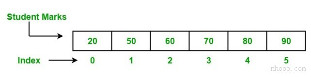
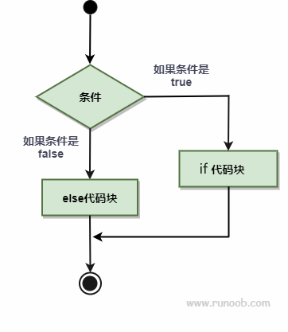
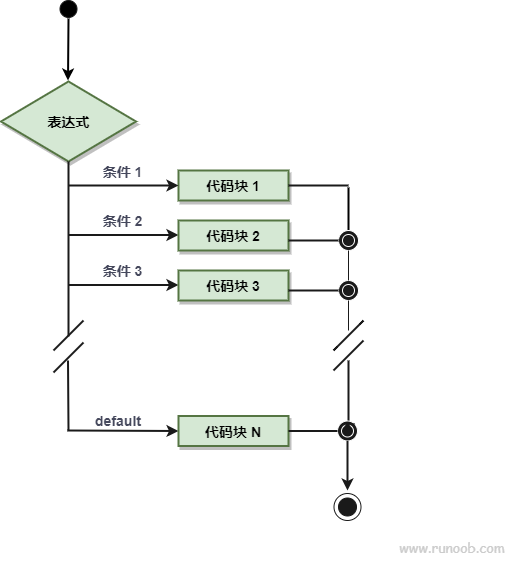
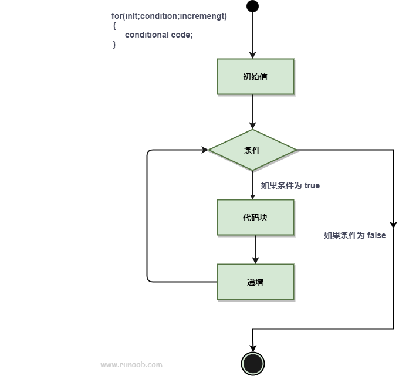
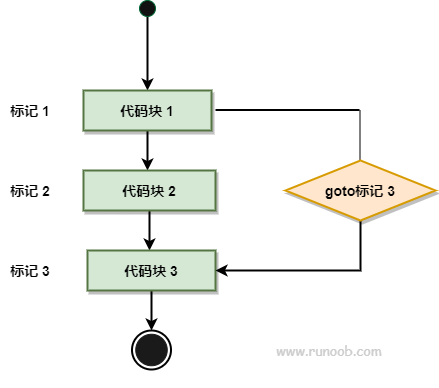

# Go

## 第一章 语言基础


### 基本语法

### 数据类型

数据类型指定有效的Go变量可以保存的数据类型。在Go语言中，类型分为以下四类：

* **基本类型：**数字，字符串和布尔值属于此类别。

* **聚合类型：**数组和结构属于此类别。

* **引用类型：**指针，切片，map集合，函数和Channel属于此类别。

* **接口类型**

#### 基本类型

##### 数值类型

在Go语言中，数字分为*三个*子类别：

- **整数：**在Go语言中，有符号和无符号整数都可以使用四种不同的大小，如下表所示。有符号整数使用 `int8`、`int16`、`int32`、`int64` 表示，无符号整数使用 `uint8`、`uint16`、`uint32`、`uint64` 表示。

  | 数据类型    | 描述                                                       |
  | :---------- | :--------------------------------------------------------- |
  | **int8**    | 8位有符号整数                                              |
  | **int16**   | 16位有符号整数                                             |
  | **int32**   | 32位有符号整数                                             |
  | **int64**   | 64位有符号整数                                             |
  | **uint8**   | 8位无符号整数                                              |
  | **uint16**  | 16位无符号整数                                             |
  | **uint32**  | 32位无符号整数                                             |
  | **uint64**  | 64位无符号整数                                             |
  | **int**     | 平台相关的有符号整数，通常为32位或64位。                   |
  | **uint**    | 平台相关的无符号整数，通常为32位或64位。                   |
  | **rune**    | `int32` 的别名，表示一个 Unicode 代码点。                  |
  | **byte**    | `uint8` 的别名。                                           |
  | **uintptr** | 无符号整数类型，专用于存放指针运算，用于存放死的指针地址。 |

- **浮点数：**在Go语言，浮点数被分成2类如示于下表：

  | 数据类型    | 描述               |
  | :---------- | :----------------- |
  | **float32** | 32位IEEE 754浮点数 |
  | **float64** | 64位IEEE 754浮点数 |

- **复数：**将复数分为两部分，如下表所示。float32和float64也是这些复数的一部分。内建函数从它的虚部和实部创建一个复数，内建虚部和实部函数提取这些部分。

  | 数据类型       | 描述                                  |
  | :------------- | :------------------------------------ |
  | **complex64**  | 包含float32作为实数和虚数分量的复数。 |
  | **complex128** | 包含float64作为实数和虚数分量的复数。 |

```go
package main

import "fmt"

func main() {
    var unsignedIntegerValue uint8 = 225
    var signedIntegerValue int16 = 32767
    var floatValue = 20.45
    var complexValue complex128 = complex(6, 2)

    fmt.Println(unsignedIntegerValue)
    fmt.Println(signedIntegerValue)
    fmt.Println(floatValue)
    fmt.Println(complexValue)

    fmt.Printf("%T\n", unsignedIntegerValue) // uint8
    fmt.Printf("%T\n", signedIntegerValue)   // int16
    fmt.Printf("%T\n", floatValue)           // float64，未显式声明时浮点常量默认推导为 float64
    fmt.Printf("%T\n", complexValue)         // complex128

    // **注意**
    // 1. 不同整数类型之间不能直接混用，通常需要显式转换。
    // 2. int 与 uint 的位宽依赖平台。
    // 3. 数值溢出会截断到对应类型的表示范围内。
}
```

##### 布尔类型

布尔数据类型仅表示true或false。布尔类型的值不会隐式或显式转换为任何其他类型。

```go
package main

import "fmt"

func main() {
    var booleanValue bool = true

    comparisonResult := 10 > 5
    logicalResult := true && false

    fmt.Println(booleanValue)      // true
    fmt.Println(comparisonResult)  // true
    fmt.Println(logicalResult)     // false

    fmt.Printf("%T\n", booleanValue)     // bool
    fmt.Printf("%T\n", comparisonResult) // bool
    fmt.Printf("%T\n", logicalResult)    // bool

    // **注意**
    // 1. bool 只有 true 和 false 两个值。
    // 2. 比较表达式和逻辑表达式的结果都是 bool。
    // 3. bool 不会与数值类型互相转换。
}
```

##### 字符串

在Go语言中，字符串不同于其他语言，如Java、c++、Python等。它是一个变宽字符序列，其中每个字符都用UTF-8编码的一个或多个字节表示。或者换句话说，字符串是任意字节(包括值为零的字节)的不可变链，或者字符串是一个只读字节片，字符串的字节可以使用UTF-8编码在Unicode文本中表示。由于采用UTF-8编码，Golang字符串可以包含文本，文本是世界上任何语言的混合，而不会造成页面的混乱和限制。

**注意：**字符串可以为空，但不能为nil。

###### 字符串字面量

在Go语言中，字符串字面量是通过两种不同的方式创建的：

- **使用双引号（""）：**在这里，字符串字面量使用双引号（""）创建。此类字符串支持转义字符，如下表所示，但不跨越多行。

  | 转义符         | 描述                                         |
  | :------------- | :------------------------------------------- |
  | **\\**         | 反斜杠（\）                                  |
  | **\000**       | 具有给定的3位8位八进制代码点的Unicode字符    |
  | **\'**         | 单引号（'）。仅允许在字符文字中使用          |
  | **\"**         | 双引号（"）。仅允许在解释的字符串文字中使用  |
  | **\a**         | ASCII铃声(BEL)                               |
  | **\b**         | ASCII退格键(BS)                              |
  | **\f**         | ASCII换页(FF)                                |
  | **\n**         | ASCII换行符(LF)                              |
  | **\r**         | ASCII回车(CR)                                |
  | **\t**         | ASCII标签(TAB)                               |
  | **\uhhhh**     | 具有给定的4位16位十六进制代码点的Unicode字符 |
  | **\Uhhhhhhhh** | 具有给定的8位32位十六进制代码点的Unicode字符 |
  | **\v**         | ASCII垂直制表符(VT)                          |
  | **\xhh**       | 具有给定的2位8位十六进制代码点的Unicode字符  |

- 使用反引号（\`\`）：使用反引号\`\`创建的，也称为原始文本。原始文本不支持转义字符，可以跨越多行，并且可以包含除反引号之外的任何字符。

```go
package main

import "fmt"

func main() {
    interpretedString := "line1\nline2\tGo"
    rawString := `line1
line2\tGo`

    fmt.Println(interpretedString)
    fmt.Println(rawString)

    // 输出示意:
    // line1
    // line2    Go
    // line1
    // line2\tGo
}
```

###### 字符串索引与包含

- **Contains：**检查给定字符串中是否存在指定子串。

```go
func Contains(str, chstr string) bool
// str: 原始字符串
// chstr: 要检查的子串
// 返回值: 是否包含指定子串
```

- **ContainsAny：**检查给定字符串中是否存在字符集合中的任意 Unicode 字符。

```go
func ContainsAny(str, charstr string) bool
// str: 原始字符串
// charstr: 字符集合
// 返回值: 是否包含任意匹配字符
```

- **Index：**返回指定子串第一次出现的索引值，不存在时返回 `-1`。

```go
func Index(str, sbstr string) int
// str: 原始字符串
// sbstr: 要查找的子串
// 返回值: 第一次出现的字节索引，不存在时返回 -1
```

- **IndexAny：**返回字符集合中任意 Unicode 字符第一次出现的索引值，不存在时返回 `-1`。

```go
func IndexAny(str, charstr string) int
// str: 原始字符串
// charstr: 字符集合
// 返回值: 第一次出现的字节索引，不存在时返回 -1
```

- **IndexByte：**返回指定字节第一次出现的索引值，不存在时返回 `-1`。

```go
func IndexByte(str string, b byte) int
// str: 原始字符串
// b: 要查找的字节
// 返回值: 第一次出现的字节索引，不存在时返回 -1
```

```go
package main

import (
    "fmt"
    "strings"
)

func main() {
    stringValue := "Hello, Go语言"

    containsResult := strings.Contains(stringValue, "Go")
    containsAnyResult := strings.ContainsAny(stringValue, "xyz语")
    indexResult := strings.Index(stringValue, "Go")
    indexAnyResult := strings.IndexAny(stringValue, "xyz语")
    indexByteResult := strings.IndexByte(stringValue, ',')

    fmt.Println(containsResult)    // true
    fmt.Println(containsAnyResult) // true
    fmt.Println(indexResult)       // 7
    fmt.Println(indexAnyResult)    // 9
    fmt.Println(indexByteResult)   // 5

    // **注意**
    // 1. Contains 判断子串。
    // 2. ContainsAny / IndexAny 判断字符集合。
    // 3. Index / IndexAny / IndexByte 返回的都是字节索引。
}
```

* 因为字符串本质是字节序列，其索引操作`str[i]`被设计为返回第 i 个字节，语法上与切片一致，例如访问字符串第一个元素

  ```go
  func main() {
     str := "this is a string"
     fmt.Println(str[0]) // 116
  }
  ```

  输出是字节编码值而不是字符

###### 字符串比较

字符串可以直接使用比较运算符进行比较，也可以使用 `strings.Compare()` 按词法顺序比较。

- **比较运算符：**支持 `==`、`!=`、`>`、`>=`、`<`、`<=`，结果为 `bool`。
- **Compare：**比较两个字符串，返回 `-1`、`0` 或 `1`。

```go
func Compare(str1, str2 string) int
// str1: 第一个字符串
// str2: 第二个字符串
// 返回值:
// -1: str1 < str2
//  0: str1 == str2
//  1: str1 > str2
```

```go
package main

import (
    "fmt"
    "strings"
)

func main() {
    leftString := "Go"
    rightString := "Lang"

    equalResult := leftString == rightString
    greaterResult := leftString > rightString
    compareResult := strings.Compare(leftString, rightString)

    fmt.Println(equalResult)   // false
    fmt.Println(greaterResult) // false
    fmt.Println(compareResult) // -1
}
```

###### 字符串常用函数

- **Join：**将字符串切片中存在的所有元素连接为单个字符串。

```go
func Join(str []string, sep string) string
// str: 待连接的字符串切片
// sep: 元素之间插入的分隔符
// 返回值: 连接后的字符串
```

- **Trim：**修剪字符串两侧属于指定字符集合的字符。

```go
func Trim(str string, cutstr string) string
// str: 当前字符串
// cutstr: 两侧要修剪的字符集合
// 返回值: 修剪后的字符串
```

- **TrimLeft：**修剪字符串左侧属于指定字符集合的字符。

```go
func TrimLeft(str string, cutstr string) string
// str: 当前字符串
// cutstr: 左侧要修剪的字符集合
// 返回值: 修剪后的字符串
```

- **TrimRight：**修剪字符串右侧属于指定字符集合的字符。

```go
func TrimRight(str string, cutstr string) string
// str: 当前字符串
// cutstr: 右侧要修剪的字符集合
// 返回值: 修剪后的字符串
```

- **TrimSpace：**修剪字符串两侧空白字符。

```go
func TrimSpace(str string) string
// str: 当前字符串
// 返回值: 去除两侧空白后的字符串
```

- **TrimPrefix：**删除固定前缀，未匹配时返回原字符串。

```go
func TrimPrefix(str, prefix string) string
// str: 原始字符串
// prefix: 要删除的前缀
// 返回值: 删除前缀后的字符串
```

- **TrimSuffix：**删除固定后缀，未匹配时返回原字符串。

```go
func TrimSuffix(str, suffix string) string
// str: 原始字符串
// suffix: 要删除的后缀
// 返回值: 删除后缀后的字符串
```

- **Split：**按分隔符拆分字符串，不保留分隔符。

```go
func Split(str, sep string) []string
// str: 原始字符串
// sep: 分隔符
// 返回值: 拆分后的字符串切片
```

- **SplitAfter：**按分隔符拆分字符串，保留分隔符。

```go
func SplitAfter(str, sep string) []string
// str: 原始字符串
// sep: 分隔符
// 返回值: 拆分后的字符串切片，分隔符保留在子串末尾
```

- **SplitAfterN：**按分隔符拆分字符串，并限制返回结果数量。

```go
func SplitAfterN(str, sep string, m int) []string
// str: 原始字符串
// sep: 分隔符
// m: 返回结果数量限制
// 返回值: 拆分后的字符串切片
// m > 0: 最多返回 m 个结果
// m == 0: 返回 nil
// m < 0: 返回全部结果
```

```go
package main

import (
    "bytes"
    "fmt"
    "strings"
)

func main() {
    sourceString := "  prefix_value.go  "
    partSlice := []string{"Go", "Lang"}

    joinResult := strings.Join(partSlice, "-")

    plusResult := "Go" + "-" + "Lang"
    formatResult := fmt.Sprintf("%s-%s", "Go", "Lang")

    var buffer bytes.Buffer
    buffer.WriteString("Go")
    buffer.WriteString("-")
    buffer.WriteString("Lang")
    bufferResult := buffer.String()

    trimResult := strings.Trim(sourceString, " ")
    trimLeftResult := strings.TrimLeft("###value", "#")
    trimRightResult := strings.TrimRight("value***", "*")
    trimSpaceResult := strings.TrimSpace(sourceString)
    trimPrefixResult := strings.TrimPrefix(trimSpaceResult, "prefix_")
    trimSuffixResult := strings.TrimSuffix(trimPrefixResult, ".go")

    splitResult := strings.Split("Go,Java,Python", ",")
    splitAfterResult := strings.SplitAfter("Go,Java,Python", ",")
    splitAfterNResult := strings.SplitAfterN("Go,Java,Python", ",", 2)

    fmt.Println(joinResult)         // Go-Lang
    fmt.Println(plusResult)         // Go-Lang
    fmt.Println(formatResult)       // Go-Lang
    fmt.Println(bufferResult)       // Go-Lang

    fmt.Printf("%q\n", trimResult)       // "prefix_value.go"
    fmt.Printf("%q\n", trimLeftResult)   // "value"
    fmt.Printf("%q\n", trimRightResult)  // "value"
    fmt.Printf("%q\n", trimSpaceResult)  // "prefix_value.go"
    fmt.Printf("%q\n", trimPrefixResult) // "value.go"
    fmt.Printf("%q\n", trimSuffixResult) // "value"

    fmt.Println(splitResult)       // [Go Java Python]
    fmt.Println(splitAfterResult)  // [Go, Java, Python]
    fmt.Println(splitAfterNResult) // [Go, Java,Python]

    // **注意**
    // 1. Trim / TrimLeft / TrimRight 修剪的是字符集合，不是固定子串。
    // 2. TrimPrefix / TrimSuffix 处理固定前后缀。
    // 3. Split 不保留分隔符；SplitAfter 保留分隔符。
}
```

###### 字符串使用要点

- **字符串是不可变的：**在Go语言中，一旦创建了字符串，则字符串是不可变的，无法更改字符串的值。

- **如何遍历字符串：**可以使用 `for range` 循环按 `rune` 遍历字符串。

```go
for index, chr := range str {
    // index: 当前 rune 的起始字节索引
    // chr: 当前 rune
}
```

- **如何访问字符串的单个字节：**可以使用下标按字节访问字符串内容。

- **如何从切片创建字符串：**允许从 `[]byte` 或 `[]rune` 创建字符串。

- **如何查找字符串的长度：**`len()` 返回字节数，`utf8.RuneCountInString()` 返回 `rune` 数。

```go
package main

import (
    "fmt"
    "unicode/utf8"
)

func main() {
    stringValue := "Go语言"

    fmt.Println(len(stringValue))                     // 8，字节数
    fmt.Println(utf8.RuneCountInString(stringValue)) // 4，rune 数

    for index, runeValue := range stringValue {
        fmt.Printf("%d %c\n", index, runeValue)
    }

    for index := 0; index < len(stringValue); index++ {
        fmt.Printf("%d %v\n", index, stringValue[index])
    }

    byteSlice := []byte{0x47, 0x6f}
    runeSlice := []rune{0x8bed, 0x8a00}

    fmt.Println(string(byteSlice)) // Go
    fmt.Println(string(runeSlice)) // 语言

    // **注意**
    // 1. stringValue[index] 取得的是字节，不一定是完整字符。你可能打印出来的是字节编码。
    // 2. for range 按 rune 遍历，适合处理 Unicode 文本。
    // 3. 字符串不可修改，修改通常需要转为 []byte 或 []rune。
}
```

#### 聚合类型

##### 数组

Go编程语言中的数组与其他编程语言非常相似。由于它们的固定长度，数组不像Go语言中的Slice(切片)这样受欢迎。
在数组中，允许在其中存储零个或零个以上的元素。通过使用[]索引运算符及其从零开始的位置对数组的元素进行索引，这意味着第一个元素的索引为*array [0]*，最后一个元素的索引为*array [len（array）-1]*。

如果事先就知道了要存放数据的长度，且后续使用中不会有扩容的需求，就可以考虑使用数组，Go 中的数组是值类型，而非引用，并不是指向头部元素的指针。数组作为值类型，将数组作为参数传递给函数时，由于 Go 函数是传值传递，所以会将整个数组拷贝。



###### 数组声明

在Go语言中，数组可以使用 `var` 关键字或简写声明创建。

- **使用 var 关键字：**适合先声明后赋值，数组长度是类型的一部分。

```go
var arrayName [length]ElementType
// arrayName: 数组变量名
// length: 数组长度，必须是常量
// ElementType: 元素类型
```

```go
var arrayName [length]ElementType{element1, element2, element3}
// arrayName: 数组变量名
// length: 数组长度
// ElementType: 元素类型
// 返回结果: 创建并初始化数组
```

- **使用简写声明：**适合声明时直接初始化。

```go
arrayName := [length]ElementType{element1, element2, element3}
// arrayName: 数组变量名
// length: 数组长度
// ElementType: 元素类型
// 返回结果: 创建并初始化数组
```

```go
arrayName := [...]ElementType{element1, element2, element3}
// ...: 根据初始化元素数量推导数组长度
// 返回结果: 创建长度由元素个数决定的数组
```

- **多维数组：**数组的元素也可以是数组。

```go
var arrayName [length1][length2]ElementType
// length1: 第一维长度
// length2: 第二维长度
// ElementType: 元素类型
```

```go
package main

import "fmt"

func main() {
    var declaredArray [3]string
    declaredArray[0] = "value0"
    declaredArray[1] = "value1"
    declaredArray[2] = "value2"

    initializedArray := [3]int{10, 20, 30}
    inferredArray := [...]int{1, 2, 3, 4}
    matrixValue := [2][2]int{
        {1, 2},
        {3, 4},
    }

    fmt.Println(declaredArray)     // [value0 value1 value2]
    fmt.Println(initializedArray)  // [10 20 30]
    fmt.Println(inferredArray)     // [1 2 3 4]
    fmt.Println(matrixValue)       // [[1 2] [3 4]]

    fmt.Println(declaredArray[0])  // value0
    fmt.Println(matrixValue[1][0]) // 3

    for index, element := range initializedArray {
        fmt.Println(index, element)
    }

    // **注意**
    // 1. 数组长度是类型的一部分，[3]int 和 [4]int 是不同类型。
    // 2. 数组长度固定，创建后不能改变。
    // 3. 未显式初始化的数组元素会取对应类型的零值。
}
```

###### 数组操作

- **len：**返回数组长度。

```go
len(arrayValue)
// arrayValue: 数组值
// 返回值: 数组长度
```

- **遍历：**可以使用下标循环或 `for range` 遍历数组元素。

```go
for index := 0; index < len(arrayValue); index++ {
    // arrayValue[index]
}
```

```go
for index, element := range arrayValue {
    // index: 当前索引
    // element: 当前元素副本
}
```

- **数组是值类型：**数组赋值会复制全部元素，修改副本不会影响原数组。

```go
copiedArray := sourceArray
// sourceArray: 原数组
// copiedArray: 原数组副本
// 返回结果: 复制后的新数组
```

- **引用复制：**可以通过指针共享同一个数组。

```go
referencedArray := &sourceArray
// sourceArray: 原数组
// referencedArray: 指向原数组的指针
// 返回结果: 通过指针访问原数组
```

- **数组可比较：**如果元素类型可比较，则数组也可比较，可以直接使用 `==`。

```go
leftArray == rightArray
// leftArray: 左侧数组
// rightArray: 右侧数组
// 返回值: 两个数组是否相等
```

```go
package main

import "fmt"

func main() {
    zeroValueArray := [3]int{}
    inferredArray := [...]int{9, 7, 6, 4}
    sourceArray := [...]int{100, 200, 300}
    copiedArray := sourceArray
    referencedArray := &sourceArray

    copiedArray[0] = 999
    referencedArray[1] = 888

    fmt.Println(zeroValueArray)      // [0 0 0]
    fmt.Println(len(inferredArray))  // 4

    for index := 0; index < len(inferredArray); index++ {
        fmt.Println(index, inferredArray[index])
    }

    fmt.Println(sourceArray)       // [100 888 300]
    fmt.Println(copiedArray)       // [999 200 300]
    fmt.Println(*referencedArray)  // [100 888 300]

    equalResult1 := [3]int{1, 2, 3} == [3]int{1, 2, 3}
    equalResult2 := [3]int{1, 2, 3} == [3]int{1, 2, 4}

    fmt.Println(equalResult1) // true
    fmt.Println(equalResult2) // false

    // **注意**
    // 1. copiedArray := sourceArray 是值复制。
    // 2. referencedArray := &sourceArray 是指针引用，同步修改原数组。
    // 3. 不同长度的数组类型不同，不能直接比较或赋值。
}
```

###### 数组作为参数

在Go语言中，可以将数组或数组指针作为函数参数传递。数组参数会复制全部元素，切片参数不属于数组类型。

- **固定长度数组参数：**形参类型必须包含数组长度。

```go
func functionName(arrayValue [size]ElementType) ReturnType {
    statement
}
// arrayValue: 数组参数
// size: 数组长度
// ElementType: 元素类型
```

- **数组指针参数：**适合避免复制整个数组，或在函数内修改原数组。

```go
func functionName(arrayPointer *[size]ElementType) ReturnType {
    statement
}
// arrayPointer: 指向数组的指针参数
// size: 数组长度
// ElementType: 元素类型
```

```go
package main

import "fmt"

func averageValue(scoreArray [6]int) int {
    totalValue := 0

    for _, element := range scoreArray {
        totalValue += element
    }

    return totalValue / len(scoreArray)
}

func updateFirstElement(arrayPointer *[3]int) {
    arrayPointer[0] = 500
}

func main() {
    scoreArray := [6]int{67, 59, 29, 35, 4, 34}
    dataArray := [3]int{100, 200, 300}

    averageResult := averageValue(scoreArray)
    updateFirstElement(&dataArray)

    fmt.Println(averageResult) // 38
    fmt.Println(dataArray)     // [500 200 300]

    // **注意**
    // 1. 函数参数写成 [6]int 时，只能接收长度为 6 的数组。
    // 2. 传递数组会复制全部元素。
    // 3. 传递 *[size]type 可以避免复制，并允许修改原数组。
}
```


##### 结构体

Go 语言中数组可以存储同一类型的数据，但在结构体中我们可以为不同项定义不同的数据类型。结构体是由一系列具有相同类型或不同类型的数据构成的数据集合。**结构体的内容将在第二章详细描述。**

#### 引用类型

##### 指针

###### 指针声明与初始化

在开始之前，我们将在指针中使用两个重要的运算符，即

`*` 运算符也称为解引用运算符，用于声明指针变量并访问存储在地址中的值。

`&` 运算符称为地址运算符，用于返回变量的地址或将变量的地址赋给指针。

- **声明一个指针：**

```go
var pointerName *DataType
// pointerName: 指针变量名
// DataType: 指针指向的数据类型
```

```go
var stringPointer *string
// stringPointer: 只能保存 string 类型变量的地址
```

- **初始化指针：**需要使用地址运算符 `&` 获取变量地址。

```go
var value = 45
var pointerValue *int = &value
// value: 普通变量
// &value: 变量 value 的地址
// pointerValue: 保存 value 地址的指针变量
```

- **简写声明：**可以直接通过地址初始化，由编译器推导指针类型。

```go
value := 45
pointerValue := &value
// pointerValue 的类型会被推导为 *int
```

- **使用 `new` 初始化：**`new(Type)` 会分配对应类型的内存，并返回该类型的指针，指向该类型的零值。

```go
new(Type) *Type
// Type: 要分配内存的类型
// 返回值: 指向该类型零值的指针
```

```go
package main

import "fmt"

func main() {
    var integerValue = 45
    var pointerValue *int = &integerValue
    shorthandPointer := &integerValue

    newIntegerPointer := new(int)
    newStringPointer := new(string)
    newArrayPointer := new([3]int)
    newSlicePointer := new([]float64)

    fmt.Println(integerValue)       // 45
    fmt.Println(pointerValue)       // 变量地址
    fmt.Println(shorthandPointer)   // 变量地址

    fmt.Println(*newIntegerPointer) // 0
    fmt.Println(*newStringPointer)  // ""
    fmt.Println(*newArrayPointer)   // [0 0 0]
    fmt.Println(*newSlicePointer)   // []

    // **注意**
    // 1. 指针的零值是 nil。
    // 2. *T 只能保存 T 类型变量的地址。
    // 3. pointerValue := &integerValue 会由编译器推导出指针类型。
    // 4. new(Type) 返回 *Type，且指向该类型的零值。
}
```

###### 指针解引用

`*` 运算符不仅用于声明指针变量，也用于访问指针所指向的变量中存储的值。

```go
*pointerValue
// pointerValue: 指针变量
// 返回值: 指针指向的变量值
```

```go
package main

import "fmt"

func main() {
    var integerValue = 458
    var pointerValue = &integerValue

    fmt.Println(integerValue)   // 458
    fmt.Println(&integerValue)  // 变量地址
    fmt.Println(pointerValue)   // 变量地址
    fmt.Println(*pointerValue)  // 458

    *pointerValue = 500
    fmt.Println(integerValue)   // 500

    // **注意**
    // 1. *pointerValue 读取的是指针指向的值。
    // 2. *pointerValue = newValue 可以通过指针修改原变量。
}
```

###### 指针比较

在Go语言中，允许比较两个指针。两个指针值只有在它们指向内存中的相同变量或者它们都为 `nil` 时才相等。

- **== 运算符：**如果两个指针指向同一个变量，则返回 `true`。
- **!= 运算符：**如果两个指针指向不同变量，则返回 `true`。

```go
leftPointer == rightPointer
// leftPointer: 左侧指针
// rightPointer: 右侧指针
// 返回值: 两个指针是否相等
```

```go
leftPointer != rightPointer
// leftPointer: 左侧指针
// rightPointer: 右侧指针
// 返回值: 两个指针是否不相等
```

```go
package main

import "fmt"

func main() {
    firstValue := 10
    secondValue := 10

    firstPointer := &firstValue
    samePointer := &firstValue
    secondPointer := &secondValue

    fmt.Println(firstPointer == samePointer)   // true
    fmt.Println(firstPointer == secondPointer) // false
    fmt.Println(firstPointer != secondPointer) // true

    var nilPointer1 *int
    var nilPointer2 *int

    fmt.Println(nilPointer1 == nilPointer2) // true
}
```

###### 指针运算

在Go语言中，不支持普通指针的算术运算，指针不能像某些语言中那样进行偏移。

```go
pointerValue++
// pointerValue: 普通指针
// 结果: 非法，无法通过编译
```

```go
package main

func main() {
    arrayValue := [5]int{0, 1, 2, 3, 4}
    arrayPointer := &arrayValue

    println(&arrayValue[0])
    println(arrayPointer)

    // arrayPointer++
    // invalid operation: arrayPointer++ (non-numeric type *[5]int)

    _ = arrayPointer
}
```

**补充**：标准库 unsafe 提供了低级指针操作能力，包括指针运算。日常 Go 代码通常不依赖这类写法。

###### 指向数组的指针长度与容量

对于**指向数组的指针**，可以使用 `len()` 和 `cap()` 获取它所指向数组的长度与容量。

```go
len(arrayPointer)
cap(arrayPointer)
// arrayPointer: 指向数组的指针
// 返回值: 指向数组的长度或容量
```

```go
package main

import "fmt"

func main() {
    arrayValue := [4]int{10, 20, 30, 40}
    arrayPointer := &arrayValue

    fmt.Println(len(arrayPointer)) // 4
    fmt.Println(cap(arrayPointer)) // 4

    // **注意**
    // 1. 这里的 len 和 cap 适用于指向数组的指针。
    // 2. 普通指针的使用重点通常是取地址和解引用。
}
```

###### 指针作为参数或返回值

在Go语言中，可以将指针作为参数传递给函数，也可以将指针作为返回值返回。

- **指针作为参数：**适合在函数内部修改外部变量。

```go
func functionName(pointerValue *DataType) ReturnType {
    statement
}
// pointerValue: 指针参数
// DataType: 指针指向的数据类型
```

- **指针作为返回值：**函数可以返回某个值的地址。

```go
func functionName() *DataType {
    statement
}
// 返回值: 指向 DataType 的指针
```

```go
package main

import "fmt"

func updateValue(pointerValue *int) {
    *pointerValue = 748
}

func createPointer() *int {
    localValue := 100
    return &localValue
}

func main() {
    integerValue := 100

    fmt.Println(integerValue) // 100
    updateValue(&integerValue)
    fmt.Println(integerValue) // 748

    returnedPointer := createPointer()
    fmt.Println(*returnedPointer) // 100

    // **注意**
    // 1. 指针参数常用于在函数内部修改外部变量。
    // 2. 返回局部变量地址是合法的，Go 会处理其生命周期。
}
```

###### new 和 make

`new` 和 `make` 都用于内存分配，但用途不同。

- **new：**接收一个类型，返回该类型的指针，常用于指针初始化。
- **make：**返回值本身，不返回指针，只用于 `slice`、`map`、`chan`。

```go
new(Type) *Type
// Type: 要分配内存的类型
// 返回值: 指向该类型零值的指针
```

```go
make(Type, size ...IntegerType) Type
// Type: slice、map 或 chan 类型
// size: 长度、容量或缓冲区大小
// 返回值: 初始化后的值
```

```go
package main

import "fmt"

func main() {
    integerPointer := new(int)
    stringPointer := new(string)
    slicePointer := new([]int)

    sliceValue := make([]int, 3, 5)
    mapValue := make(map[string]int, 2)
    channelValue := make(chan int, 2)

    fmt.Println(integerPointer) // *int
    fmt.Println(stringPointer)  // *string
    fmt.Println(slicePointer)   // *[]int

    fmt.Println(sliceValue)     // [0 0 0]
    fmt.Println(len(sliceValue), cap(sliceValue)) // 3 5
    fmt.Println(mapValue)       // map[]
    fmt.Println(channelValue)   // chan

    // **注意**
    // 1. new 返回指针；make 返回值本身。
    // 2. new 可用于任意类型；make 只用于 slice、map、chan。
    // 3. new([]int) 得到的是 *[]int；make([]int, 3, 5) 得到的是 []int。
}
```

##### 切片

在Go语言中，切片比数组更强大，灵活，方便，并且是轻量级的数据结构。slice是一个可变长度序列，用于存储相同类型的元素，不允许在同一slice中存储不同类型的元素。就像具有索引值和长度的数组一样，但是切片的大小可以调整，切片不像数组那样处于固定大小。在内部，切片和数组相互连接，切片是对基础数组的引用。允许在切片中存储重复元素。***切片中的第一个索引位置始终为0，而最后一个索引位置将为（切片的长度– 1）***。

###### 切片声明与初始化

1. 切片声明时不写长度，零值为 `nil`。

```go
var sliceValue []int
// sliceValue: int 类型切片
// 返回结果: 零值切片，值为 nil
```

2. 可以直接使用切片字面量初始化。

```go
sliceValue := []int{1, 2, 3}
// sliceValue: 切片变量
// 1, 2, 3: 初始化元素
// 返回结果: 长度为 3 的切片
```

3. `make` 常用于创建可用切片，返回值是切片本身。

```go
make([]T, len, cap)
// T: 元素类型
// len: 切片长度
// cap: 切片容量，可选
// 返回结果: []T
```

4. `new` 返回的是切片指针，较少作为常规初始化手段。

```go
new([]T)
// T: 元素类型
// 返回值: *[]T
// 说明: 指向零值切片的指针
```

```go
package main

import "fmt"

func main() {
    var nilSlice []int
    literalSlice := []int{1, 2, 3}
    madeSlice := make([]int, 0, 5)
    pointerSlice := new([]int)

    fmt.Println(nilSlice == nil)           // true
    fmt.Println(literalSlice)              // [1 2 3]
    fmt.Println(madeSlice)                 // []
    fmt.Println(len(madeSlice), cap(madeSlice)) // 0 5
    fmt.Println(*pointerSlice == nil)      // true

    // **注意**
    // 1. var slice []T 的零值是 nil。
    // 2. make 返回 []T；new 返回 *[]T。
    // 3. 通常更常用 make 来创建可用切片。
}
```

###### 切片切割与共享

1. 切片可以从数组创建，也可以从已有切片继续切割。

```go
source[low:high]
// source: 数组或切片
// low: 起始下标，默认值为 0
// high: 结束下标，默认值为 len(source)
// 返回结果: [low, high) 范围的新切片
```

2. 普通切割通常共享底层数组。

```go
subSlice := sourceSlice[1:4]
// subSlice: 与 sourceSlice 共享底层数组的新切片
```

3. 三下标表达式可以限制新切片容量。

```go
subSlice := sourceSlice[low:high:max]
// low: 起始下标
// high: 结束下标
// max: 容量上界
// 返回结果: 容量为 max - low 的新切片
```

```go
package main

import "fmt"

func main() {
    sourceSlice := []int{1, 2, 3, 4, 5, 6, 7, 8, 9}

    sharedSlice := sourceSlice[3:4]
    sharedSlice = append(sharedSlice, 100)

    limitedSlice := sourceSlice[3:4:4]
    limitedSlice = append(limitedSlice, 200)

    fmt.Println(sharedSlice)  // [4 100]
    fmt.Println(limitedSlice) // [4 200]
    fmt.Println(sourceSlice)  // [1 2 3 4 100 6 7 8 9]

    // **注意**
    // 1. 普通切割后的 append 可能改写原底层数组。
    // 2. 三下标表达式可限制容量，减少覆盖原切片后续元素的风险。
}
```

###### 切片追加

1. `append` 用于向切片尾部追加元素，返回追加后的新切片。

```go
append(slice []Type, elems ...Type) []Type
// slice: 目标切片
// elems: 要追加的元素
// 返回值: 追加后的新切片
```

2. `append(slice, otherSlice...)` 会把另一个切片展开后逐个追加。

```go
resultSlice := append(leftSlice, rightSlice...)
// leftSlice: 目标切片
// rightSlice: 待展开追加的切片
// 返回值: 追加后的新切片
```

3. `append` 也是插入、删除、连接等操作的基础手段。

```go
package main

import "fmt"

func main() {
    nums := make([]int, 0, 0)
    nums = append(nums, 1, 2, 3, 4, 5)
    nums = append(nums, []int{6, 7}...)
    fmt.Println(nums)                 // [1 2 3 4 5 6 7]
    fmt.Println(len(nums), cap(nums)) // 长度与容量可能不同

    insertSource := []int{1, 2, 3, 4, 5}
    insertIndex := 2
    insertSource = append(insertSource[:insertIndex], append([]int{999, 1000}, insertSource[insertIndex:]...)...)
    fmt.Println(insertSource) // [1 2 999 1000 3 4 5]

    deleteSource := []int{1, 2, 3, 4, 5, 6}
    deleteSource = deleteSource[2:]
    fmt.Println(deleteSource) // [3 4 5 6]

    deleteSource = deleteSource[:len(deleteSource)-1]
    fmt.Println(deleteSource) // [3 4 5]

    deleteSource = append(deleteSource[:1], deleteSource[2:]...)
    fmt.Println(deleteSource) // [3 5]

    // **注意**
    // 1. append 本质上返回一个新的切片值，通常要接回原变量。
    // 2. 插入、删除、连接本质上都可以通过 append 组合实现。
    // 3. 容量不足时，append 会分配新的底层数组。
}
```

###### 切片遍历

1. 可以使用普通 `for` 循环遍历切片。

```go
for index := 0; index < len(sliceValue); index++ {
    // sliceValue[index]
}
```

2. 可以使用 `for range` 获取索引和值。

```go
for index, element := range sliceValue {
    // index: 当前索引
    // element: 当前元素副本
}
```

3. 只需要值时，可以使用空白标识符 `_` 忽略索引。

```go
for _, element := range sliceValue {
    // element: 当前元素副本
}
```

```go
package main

import "fmt"

func main() {
    sliceValue := []int{10, 20, 30}

    for index := 0; index < len(sliceValue); index++ {
        fmt.Println(index, sliceValue[index])
    }

    for index, element := range sliceValue {
        fmt.Println(index, element)
    }

    for _, element := range sliceValue {
        fmt.Println(element)
    }

    // **注意**
    // range 返回的 element 是元素副本。
}
```

###### 切片其他用法

1. `copy` 复制元素，复制数量取目标长度和源长度的较小值。

```go
copy(dst, src []Type) int
// dst: 目标切片
// src: 源切片
// 返回值: 实际复制的元素数量
```

2. `bytes.Compare`、`bytes.Split` 只适用于 `[]byte`。

```go
Compare(slice1, slice2 []byte) int
// slice1: 第一个字节切片
// slice2: 第二个字节切片
// 返回值: -1 / 0 / 1
```

```go
Split(oSlice, sep []byte) [][]byte
// oSlice: 原始字节切片
// sep: 分隔符
// 返回值: 拆分后的 [][]byte
```

3. `sort.Ints` 和 `sort.IntsAreSorted` 处理 `[]int`。

```go
Ints(slc []int)
// slc: 待排序的 int 切片
// 返回结果: 原地升序排序
```

```go
IntsAreSorted(slc []int) bool
// slc: 待检查的 int 切片
// 返回值: 是否已按升序排列
```

4. `clear` 会将切片中的元素重置为零值，但不会改变长度和容量。

```go
clear(sliceValue)
// sliceValue: 切片
// 返回结果: 将所有元素置为零值
```

5. `sliceValue = sliceValue[:0]` 或 `sliceValue = sliceValue[:0:0]` 常用于清空切片。

```go
package main

import (
    "bytes"
    "fmt"
    "sort"
)

func main() {
    sourceSlice := []int{10, 20, 30, 40, 50}
    targetSlice := make([]int, 3)
    copiedCount := copy(targetSlice, sourceSlice)
    fmt.Println(targetSlice) // [10 20 30]
    fmt.Println(copiedCount) // 3

    sortableSlice := []int{400, 600, 100, 300, 500, 200}
    fmt.Println(sort.IntsAreSorted(sortableSlice)) // false
    sort.Ints(sortableSlice)
    fmt.Println(sortableSlice)                     // [100 200 300 400 500 600]
    fmt.Println(sort.IntsAreSorted(sortableSlice)) // true

    leftByteSlice := []byte("Go")
    rightByteSlice := []byte("Lang")
    compareResult := bytes.Compare(leftByteSlice, rightByteSlice)
    splitResult := bytes.Split([]byte("Go,Java,Python"), []byte(","))
    fmt.Println(compareResult) // 1
    fmt.Println(splitResult)   // [[71 111] [74 97 118 97] [80 121 116 104 111 110]]

    clearSlice := []int{1, 2, 3, 4}
    clear(clearSlice)
    fmt.Println(clearSlice) // [0 0 0 0]

    clearSlice = clearSlice[:0]
    fmt.Println(clearSlice) // []

    limitedClearSlice := []int{1, 2, 3, 4}
    limitedClearSlice = limitedClearSlice[:0:0]
    fmt.Println(limitedClearSlice, len(limitedClearSlice), cap(limitedClearSlice)) // [] 0 0

    // **注意**
    // 1. copy 不会复制底层数组关系，只复制元素。
    // 2. 切片不能直接比较元素内容，通常只与 nil 比较。
    // 3. bytes.Compare 和 bytes.Split 处理的是 []byte。
    // 4. clear 只清零元素，不改变长度和容量。
}
```

###### 多维切片

1. `make([][]T, n)` 只创建外层切片。

```go
make([][]T, n)
// T: 元素类型
// n: 外层长度
// 返回结果: 外层已初始化、内层仍为 nil 的二维切片
```

2. 内层切片通常需要单独初始化。

```go
innerSlice := make([]T, length)
// T: 元素类型
// length: 内层切片长度
// 返回结果: 初始化后的内层切片
```

```go
package main

import "fmt"

func main() {
    matrixSlice := make([][]int, 3)

    for index := 0; index < len(matrixSlice); index++ {
        matrixSlice[index] = make([]int, 2)
    }

    matrixSlice[0][0] = 1
    matrixSlice[1][1] = 2

    fmt.Println(matrixSlice) // [[1 0] [0 2] [0 0]]

    // **注意**
    // 1. make([][]int, 3) 只创建外层切片。
    // 2. 内层切片通常需要单独初始化。
}
```

##### 映射

Map 是一种无序的键值对集合，通过键快速访问值。Map 的键类型必须可比较，值类型没有此限制。Map 是引用类型，赋值或作为参数传递时会共享同一个底层数据结构。遍历 Map 时，键值对顺序不确定。访问不存在的键时，会返回值类型的零值。

###### 映射初始化

1. 可以使用字面量创建 Map。

```go
map[keyType]valueType{}
// keyType: 键类型，必须可比较
// valueType: 值类型
// 返回结果: map 字面量
```

2. 可以使用 `make` 创建 Map，并可指定初始容量。

```go
make(map[keyType]valueType, capacity)
// keyType: 键类型
// valueType: 值类型
// capacity: 初始容量，可选
// 返回结果: 初始化后的 map
```

3. nil map 可以读取，但不能写入。

```go
package main

import "fmt"

func main() {
    literalMap := map[string]int{
        "apple":  1,
        "banana": 2,
        "orange": 3,
    }

    madeMap := make(map[string][]int, 8)

    var nilMap map[string]int

    fmt.Println(literalMap)       // map[apple:1 banana:2 orange:3]
    fmt.Println(madeMap)          // map[]
    fmt.Println(nilMap == nil)    // true

    // nilMap["a"] = 1
    // panic: assignment to entry in nil map

    // **注意**
    // 1. nil map 可以读，但不能写。
    // 2. 初始化时给出合理容量可以减少扩容次数。
}
```

###### 映射访问与赋值

1. 通过 `mapValue[key]` 访问值，不存在的键会返回零值。

```go
mapValue[key]
// mapValue: 目标 map
// key: 键
// 返回值: 对应值；若键不存在，返回值类型零值
```

2. 通过双返回值形式可以判断键是否存在。

```go
value, exists := mapValue[key]
// value: 对应值
// exists: 键是否存在
```

3. 使用已存在的键赋值会覆盖原值。

```go
mapValue[key] = newValue
// key: 已存在或新写入的键
// newValue: 要写入的值
// 返回结果: 若 key 已存在则覆盖原值
```

4. `len(mapValue)` 返回当前键值对数量。

```go
len(mapValue)
// mapValue: 目标 map
// 返回值: 键值对数量
```

```go
package main

import (
    "fmt"
    "math"
)

func main() {
    mapValue := make(map[string]int, 10)

    mapValue["a"] = 1
    mapValue["b"] = 2
    mapValue["b"] = 3

    fmt.Println(mapValue["a"]) // 1
    fmt.Println(mapValue["f"]) // 0
    fmt.Println(len(mapValue)) // 2

    if value, exists := mapValue["f"]; exists {
        fmt.Println(value)
    } else {
        fmt.Println("key不存在")
    }

    nanMap := make(map[float64]string, 10)
    nanMap[math.NaN()] = "a"
    nanMap[math.NaN()] = "b"
    nanMap[math.NaN()] = "c"

    _, exists := nanMap[math.NaN()]
    fmt.Println(exists) // false
    fmt.Println(nanMap) // map 中可能同时出现多个 NaN 键

    // **注意**
    // 1. 对不存在的键取值会返回零值。
    // 2. 双返回值形式更适合判断键是否存在。
    // 3. 应尽量避免使用 NaN 作为 map 的键。
}
```

###### 映射删除、清空与遍历

1. `delete` 删除指定键值对，删除不存在的键不会报错。

```go
delete(mapValue, key)
// mapValue: 目标 map
// key: 要删除的键
// 返回结果: 删除对应键值对
```

2. `clear` 会清空 Map 中所有键值对。

```go
clear(mapValue)
// mapValue: 目标 map
// 返回结果: 清空 map 中所有键值对
```

3. `for range` 可以遍历 Map，但顺序不固定。

```go
for key, value := range mapValue {
    // key: 当前键
    // value: 当前值
}
```

```go
package main

import "fmt"

func main() {
    mapValue := map[string]int{
        "a": 0,
        "b": 1,
        "c": 2,
        "d": 3,
    }

    fmt.Println(mapValue) // map[a:0 b:1 c:2 d:3]

    delete(mapValue, "a")
    fmt.Println(mapValue) // map[b:1 c:2 d:3]

    for key, value := range mapValue {
        fmt.Println(key, value)
    }

    clear(mapValue)
    fmt.Println(mapValue) // map[]

    // **注意**
    // 1. Map 遍历顺序不保证稳定。
    // 2. clear 不会把 map 重新变成 nil。
}
```

###### 映射引用语义与并发

1. Map 是引用类型，赋值后多个变量会共享同一个底层数据结构。

```go
sharedMap := sourceMap
// sourceMap: 原 map
// sharedMap: 与原 map 共享底层数据的新变量
```

2. Map 不是并发安全的数据结构，并发读写可能触发运行时错误。

```go
concurrentMap["key"] = value
fmt.Println(concurrentMap["key"])
// 结果: 并发读写 map 可能触发 fatal error
```

3. 并发场景通常需要额外同步，或改用 `sync.Map`。

```go
package main

import (
    "fmt"
    "sync"
)

func main() {
    sourceMap := map[string]int{
        "a": 1,
        "b": 2,
    }

    sharedMap := sourceMap
    sharedMap["a"] = 100

    fmt.Println(sourceMap) // map[a:100 b:2]
    fmt.Println(sharedMap) // map[a:100 b:2]

    var group sync.WaitGroup
    concurrentMap := make(map[string]int, 10)

    group.Add(2)

    go func() {
        defer group.Done()
        for index := 0; index < 100; index++ {
            concurrentMap["hello"] = index
        }
    }()

    go func() {
        defer group.Done()
        for index := 0; index < 100; index++ {
            fmt.Println(concurrentMap["hello"])
        }
    }()

    group.Wait()

    // **注意**
    // 1. Map 赋值不会复制底层数据。
    // 2. 上述并发读写 map 的写法可能触发 fatal error。
    // 3. 并发场景下通常需要加锁，或改用 sync.Map。
}
```

###### 映射集合操作

Go 没有内建的 Set 类型，但可以使用 `map[T]struct{}` 或 `map[T]bool` 模拟。由于 Map 的键不能重复，因此非常适合表示无序且不重复的集合。

**初始化与存取**

1. `map[T]struct{}` 是最常见的 Set 写法。

```go
make(map[ElementType]struct{}, capacity)
// ElementType: 集合元素类型
// capacity: 初始容量，可选
// 返回结果: 使用 map 模拟的 set
```

2. 空结构体 `struct{}` 不占用额外存储空间。

```go
setValue[element] = struct{}{}
// setValue: 集合
// element: 要加入的元素
// 返回结果: 将元素加入集合
```

3. 判断元素是否存在时，通常使用双返回值形式。

```go
_, exists := setValue[element]
// exists: 元素是否存在于集合中
```

```go
package main

import "fmt"

func main() {
    setValue := make(map[int]struct{}, 10)

    setValue[1] = struct{}{}
    setValue[2] = struct{}{}
    setValue[2] = struct{}{}

    _, exists1 := setValue[1]
    _, exists2 := setValue[3]

    fmt.Println(setValue) // map[1:{} 2:{}]
    fmt.Println(exists1)  // true
    fmt.Println(exists2)  // false

    // **注意**
    // 1. 重复加入相同元素不会增加新的键。
    // 2. struct{} 适合用来表示“只关心键是否存在”。
}
```

**删除、遍历与清空**

1. 删除 Set 元素本质上是删除 Map 键。

```go
delete(setValue, element)
// setValue: 集合
// element: 要删除的元素
// 返回结果: 删除指定元素
```

2. 遍历 Set 本质上是遍历 Map 的键。

```go
for element := range setValue {
    // element: 当前集合元素
}
```

3. `clear` 也可以直接用于 Set。

```go
clear(setValue)
// setValue: 集合
// 返回结果: 清空集合
```

```go
package main

import "fmt"

func main() {
    setValue := map[string]struct{}{
        "go":   {},
        "java": {},
        "rust": {},
    }

    delete(setValue, "java")

    for element := range setValue {
        fmt.Println(element)
    }

    clear(setValue)
    fmt.Println(setValue) // map[]

    // **注意**
    // 1. Set 遍历顺序同样不固定。
    // 2. Set 的底层仍然是 Map，因此也不具备并发安全性。
}
```


##### 接口

接口（interface）是 Go 语言中的一种类型，用于定义行为的集合，它通过描述类型必须实现的方法，规定了类型的行为契约。**接口的内容将在第二章详细描述。**

##### 管道

**提前说明，管道的笔记部分可能需要第三章知识的支持。**

Channel 是 Go 中的一个核心类型，可以看成一个用于发送和接收数据的管道，通过它可以在 goroutine 之间进行通信。它的操作符是箭头 `<-`，箭头指向数据的流向。

###### 管道创建与方向

1. Channel 需要先创建再使用，通常使用 `make` 初始化。

```go
make(chan ElementType, capacity)
// ElementType: 管道中传输的数据类型
// capacity: 缓冲区大小，可选
// 返回结果: 对应类型的 channel
```

2. Channel 可以是双向、只发送、只接收三种方向。

```go
chan T
// 返回结果: 可发送也可接收的双向 channel
```

```go
chan<- T
// 返回结果: 只发送 channel
```

```go
<-chan T
// 返回结果: 只接收 channel
```

3. 如果容量为 0 或未指定容量，则为无缓冲管道；如果容量大于 0，则为有缓冲管道。

```go
package main

import "fmt"

func main() {
    bidirectionalChannel := make(chan int)
    bufferedChannel := make(chan int, 3)

    var sendOnlyChannel chan<- int = bufferedChannel
    var receiveOnlyChannel <-chan int = bufferedChannel

    fmt.Println(bidirectionalChannel) // channel 地址
    fmt.Println(bufferedChannel)      // channel 地址
    fmt.Println(sendOnlyChannel)      // channel 地址
    fmt.Println(receiveOnlyChannel)   // channel 地址

    // **注意**
    // 1. 无缓冲管道只有在发送方和接收方都准备好时才会完成通信。
    // 2. 有缓冲管道在缓冲区未满时发送通常不会阻塞，在缓冲区非空时接收通常不会阻塞。
    // 3. nil channel 不能正常通信。
}
```

###### 管道发送、接收与关闭

1. 发送操作使用 `channel <- value`。

```go
channelValue <- value
// channelValue: 目标 channel
// value: 要发送的数据
// 返回结果: 将数据发送到 channel
```

2. 接收操作使用 `<-channelValue`。

```go
value := <-channelValue
// channelValue: 目标 channel
// 返回值: 从 channel 中接收到的数据
```

3. 接收支持双返回值形式，可用于判断 channel 是否已关闭。

```go
value, ok := <-channelValue
// value: 接收到的数据
// ok: channel 是否仍然打开
// 若 ok 为 false，则 value 为元素类型零值
```

4. `close(channelValue)` 用于关闭 channel，关闭后不能继续发送数据。

```go
close(channelValue)
// channelValue: 要关闭的 channel
// 返回结果: 关闭 channel
```

```go
package main

import "fmt"

func main() {
    channelValue := make(chan int, 2)

    channelValue <- 1
    channelValue <- 2
    close(channelValue)

    firstValue := <-channelValue
    secondValue := <-channelValue
    thirdValue, ok := <-channelValue

    fmt.Println(firstValue)  // 1
    fmt.Println(secondValue) // 2
    fmt.Println(thirdValue)  // 0
    fmt.Println(ok)          // false

    // channelValue <- 3
    // panic: send on closed channel

    // **注意**
    // 1. 关闭后的 channel 仍可继续接收已发送的数据。
    // 2. 已关闭且已读空的 channel 再接收会得到零值。
    // 3. 向已关闭的 channel 发送数据会 panic。
}
```

###### 管道阻塞与缓冲

默认情况下，发送和接收会阻塞，直到另一方准备好。无缓冲 channel 常用于同步。有缓冲 channel 可以在一定程度上减少阻塞。

```go
package main

import "fmt"

func sumValue(partSlice []int, resultChannel chan int) {
    totalValue := 0
    for _, element := range partSlice {
        totalValue += element
    }
    resultChannel <- totalValue
}

func main() {
    sourceSlice := []int{7, 2, 8, -9, 4, 0}
    resultChannel := make(chan int)

    go sumValue(sourceSlice[:len(sourceSlice)/2], resultChannel)
    go sumValue(sourceSlice[len(sourceSlice)/2:], resultChannel)

    leftValue, rightValue := <-resultChannel, <-resultChannel
    fmt.Println(leftValue, rightValue, leftValue+rightValue)

    // **注意**
    // 1. 上面的接收操作会一直等待，直到对应结果被发送到 channel。
    // 2. 这种阻塞机制可用于 goroutine 之间的同步。
}
```

###### 管道迭代

`for range` 可以持续接收 channel 中的数据。只有在 channel 被关闭后，`range` 才会结束。如果发送结束后不关闭 channel，`range` 可能一直阻塞。

```go
for value := range channelValue {
    // value: 当前接收到的元素
}
```

```go
package main

import "fmt"

func main() {
    channelValue := make(chan int)

    go func() {
        for index := 0; index < 5; index++ {
            channelValue <- index
        }
        close(channelValue)
    }()

    for value := range channelValue {
        fmt.Println(value)
    }

    fmt.Println("Finished")

    // **注意**
    // 1. range 读取的是发送到 channel 中的值。
    // 2. 若不关闭 channel，range 可能会一直阻塞。
}
```

###### 管道 select 操作

`select` 用于在多个发送或接收操作之间选择一个可执行的分支。如果多个 case 同时满足，Go 会伪随机选择一个。如果没有可执行分支且存在 `default`，则会执行 `default`；否则会阻塞。

```go
select {
case value := <-receiveChannel:
    statement
case sendChannel <- value:
    statement
default:
    statement
}
```

4. `select` 本身不是循环，若需要持续监听，通常要配合 `for` 使用。

```go
package main

import (
    "fmt"
    "time"
)

func fibonacci(outputChannel, quitChannel chan int) {
    leftValue, rightValue := 0, 1

    for {
        select {
        case outputChannel <- leftValue:
            leftValue, rightValue = rightValue, leftValue+rightValue
        case <-quitChannel:
            fmt.Println("quit")
            return
        }
    }
}

func main() {
    outputChannel := make(chan int)
    quitChannel := make(chan int)

    go func() {
        for index := 0; index < 5; index++ {
            fmt.Println(<-outputChannel)
        }
        quitChannel <- 0
    }()

    fibonacci(outputChannel, quitChannel)

    timeoutChannel := make(chan string, 1)
    go func() {
        time.Sleep(2 * time.Second)
        timeoutChannel <- "result"
    }()

    select {
    case result := <-timeoutChannel:
        fmt.Println(result)
    case <-time.After(1 * time.Second):
        fmt.Println("timeout")
    }

    // **注意**
    // 1. nil channel 上的 send / receive 会一直阻塞。
    // 2. 只有 nil channel 且没有 default 的 select 会一直阻塞。
    // 3. time.After 常用于超时控制。
}
```

###### 管道同步

Channel 可以直接用于 goroutine 之间的同步。常见方式是一个 goroutine 完成工作后向 channel 发送信号，另一个 goroutine 等待接收。

```go
package main

import (
    "fmt"
    "time"
)

func worker(done chan bool) {
    time.Sleep(time.Second)
    done <- true
}

func main() {
    done := make(chan bool, 1)

    go worker(done)

    <-done
    fmt.Println("finished")

    // **注意**
    // 1. 这里只关心同步时，channel 中传递的值本身往往不重要。
    // 2. 这种写法常用于等待任务完成。
}
```

###### Timer 与 Ticker

`time.NewTimer` 返回一个定时器，它会在未来某个时间点向 `Timer.C` 发送一次时间值。`time.NewTicker` 返回一个周期性计时器，它会按固定间隔持续向 `Ticker.C` 发送时间值。两者都可以通过 `Stop` 停止。

```go
package main

import (
    "fmt"
    "time"
)

func main() {
    timerValue := time.NewTimer(2 * time.Second)
    <-timerValue.C
    fmt.Println("Timer expired")

    secondTimer := time.NewTimer(time.Second)
    stopResult := secondTimer.Stop()
    fmt.Println(stopResult) // true 或 false

    tickerValue := time.NewTicker(500 * time.Millisecond)
    defer tickerValue.Stop()

    done := make(chan bool, 1)

    go func() {
        time.Sleep(1600 * time.Millisecond)
        done <- true
    }()

    for {
        select {
        case tickTime := <-tickerValue.C:
            fmt.Println("Tick at", tickTime)
        case <-done:
            fmt.Println("Finished")
            return
        }
    }

    // **注意**
    // 1. Timer 对应单次事件，Ticker 对应周期性事件。
    // 2. Timer.C 和 Ticker.C 本质上都是 channel。
}
```

#### 别名类型

##### byte

`byte` 是 `uint8` 的别名。在语言层面，它与 `uint8` 完全等价；但在实际书写中，`byte` 更强调“字节”语义，通常用于原始二进制数据、文件内容、网络数据、ASCII 字符等场景。Go 官方内建定义中明确说明：`byte` 用来区分字节值与普通的 8 位无符号整数值。

```go
type byte = uint8
// byte: uint8 的别名
// 用途: 表示单个字节
```

1. 处理字符串底层字节时，经常会转成 `[]byte`。
2. 对 ASCII 字符，`byte` 往往足够直接。
3. 标准库中很多 I/O、编码、网络接口都大量使用 `[]byte`。

```go
package main

import "fmt"

func main() {
    stringValue := "Go语言"

    byteValue := stringValue[0]
    byteSlice := []byte(stringValue)

    fmt.Println(byteValue) // 71，'G' 的字节值
    fmt.Println(byteSlice) // UTF-8 字节序列

    // **示例**
    // stringValue[0] 取到的是第 1 个字节，不一定是完整字符。
    // []byte(stringValue) 常用于处理原始字节数据。
    //
    // **注意**
    // 1. byte 更强调“字节”语义，而不是整数语义。
    // 2. 处理文件、网络、编码、ASCII 时常用 []byte。
    // 3. 多字节字符不适合按 byte 直接理解为“一个字符”。
}
```

##### rune

`rune` 是 `int32` 的别名。在语言层面，它与 `int32` 完全等价；但在实际书写中，`rune` 更强调“字符 / Unicode 码点”语义。Go 官方内建定义中明确说明：`rune` 用来区分字符值与普通整数值。Go 字符串底层是 UTF-8 字节序列，而一个字符并不一定只占一个字节，因此在处理中文、多语言文本、按字符遍历字符串、统计字符数、按字符截取字符串时，`rune` 往往比按字节处理更合适。

```go
type rune = int32
// rune: int32 的别名
// 用途: 表示一个 Unicode 码点
```

1. `len(stringValue)` 统计的是字节数，不是字符数。
2. `[]rune(stringValue)` 适合按字符处理字符串。
3. `for range` 遍历字符串时，拿到的是 `rune`。
4. 字符字面量如 `'语'` 的类型本质上就是字符常量，常与 `rune` 语义对应。

```go
package main

import (
    "fmt"
    "unicode/utf8"
)

func main() {
    stringValue := "Go语言编程"

    runeValue := '语'
    runeSlice := []rune(stringValue)

    fmt.Println(runeValue)                        // 35821，对应 Unicode 码点值
    fmt.Println(len(stringValue))                 // 14，字节数
    fmt.Println(len(runeSlice))                   // 6，字符数
    fmt.Println(utf8.RuneCountInString(stringValue)) // 6

    fmt.Println(string(runeSlice[:4])) // Go语言

    for index, runeElement := range stringValue {
        fmt.Println(index, runeElement)
        // index: 当前 rune 的起始字节下标
        // runeElement: 当前字符对应的 rune
    }

    // **示例**
    // 统计中文字符串长度时，rune 比直接用 len 更符合“字符数”语义。
    // 截取中文字符串时，先转成 []rune 再切片，能避免按字节切割导致的乱码。
    //
    // **注意**
    // 1. rune 更强调“字符 / 码点”语义，而不是整数语义。
    // 2. len(stringValue) 统计字节数；len([]rune(stringValue)) 统计字符数。
    // 3. 处理中文或其他多字节字符时，常使用 []rune。
    // 4. for range 遍历字符串时，比按 byte 下标访问更适合文本处理。
}
```

##### any

`any` 是 `interface{}` 的别名。它在语言层面与 `interface{}` 完全等价，Go 1.18 将它加入为预声明标识符。它的意义主要不在于提供新能力，而在于让代码表达更直观：当你想表示“任意类型”时，`any` 比 `interface{}` 更短，也更符合阅读直觉。它尤其常见于泛型类型参数、需要接收任意值的函数参数、通用容器或工具函数中。

```go
type any = interface{}
// any: interface{} 的别名
// 用途: 表示任意类型
```

1. `any` 常用于泛型代码中表示“类型参数不做额外约束”。
2. `any` 也可用于普通函数参数，表示可接收任意类型。
3. 它只是别名，不会改变接口本身的行为。

```go
package main

import "fmt"

func printValue(value any) {
    fmt.Println(value)
}

func firstElement[T any](sliceValue []T) T {
    return sliceValue[0]
}

func main() {
    var firstValue any = 100
    var secondValue any = "Go"
    var thirdValue any = []int{1, 2, 3}

    printValue(firstValue)
    printValue(secondValue)
    printValue(thirdValue)

    fmt.Println(firstElement([]int{10, 20, 30}))       // 10
    fmt.Println(firstElement([]string{"Go", "Rust"}))  // Go

    // **示例**
    // any 在普通代码里可表示“任意类型参数”。
    // 在泛型里，T any 表示 T 不附加额外约束。
    //
    // **注意**
    // 1. any 只是 interface{} 的简写形式，语义更直观。
    // 2. any 不会带来新的运行时能力，本质仍然是空接口。
    // 3. 泛型代码中，any 的出现频率通常高于 interface{}。
}
```

### 变量

变量是用于保存一个值的存储位置，允许其存储的值在运行时动态变化。每声明一个变量，都会为其分配一块内存以存储对应类型的值。变量声明后可以被访问、修改，也可以参与表达式和函数调用。

#### 变量声明

在 Go 中，类型声明是后置的，变量声明通常使用 `var` 关键字，格式为 `var 变量名 类型名`。变量名需要遵守标识符命名规则：必须以字母或下划线开头，区分大小写，不能与关键字冲突。

1. 声明单个变量时，可以只写变量名和类型。

```go
var intNum int
var str string
var char byte
```

2. 声明多个相同类型变量时，可以只写一次类型。

```go
var numA, numB, numC int
```

3. 声明多个不同类型变量时，可以用 `()` 分组。

```go
var (
    name    string
    age     int
    address string
)

var (
    school string
    class  int
)
```

4. 如果变量只声明不赋值，则会自动使用该类型的零值。

```go
var variableName Type
// variableName: 变量名
// Type: 变量类型
// 返回结果: 声明变量并使用零值初始化
```

5. 也可以在声明时直接由右侧表达式推导类型。

```go
var variableName = expression
// variableName: 变量名
// expression: 初始化表达式
// 返回结果: 声明变量并由表达式推导类型
```

```go
package main

import "fmt"

func main() {
    var integerValue int
    var stringValue string
    var boolValue bool

    var inferredInteger = 20
    var inferredString = "Go"

    var leftValue, rightValue int = 10, 20

    var (
        userName string = "Jack"
        userAge  int    = 18
    )

    fmt.Println(integerValue, stringValue, boolValue) // 0 "" false
    fmt.Println(inferredInteger, inferredString)      // 20 Go
    fmt.Println(leftValue, rightValue)                // 10 20
    fmt.Println(userName, userAge)                    // Jack 18

    // **注意**
    // 1. Go 中不存在“声明了但没有零值”的普通变量。
    // 2. 使用 var 时，类型和表达式可以省略其一，但不能同时省略。
}
```

#### 变量赋值

赋值使用 `=` 运算符。变量声明之后可以单独赋值，也可以在声明时直接初始化。

1. 单个变量赋值使用 `=`。

```go
var name string
name = "jack"
```

2. 声明时也可以直接赋值。

```go
var name string = "jack"
```

3. 多个变量可以同时赋值。

```go
var name string
var age int
name, age = "jack", 1
```

4. Go 提供了短变量声明 `:=`，用于在函数内部声明并初始化局部变量。`:=` 会根据右侧表达式自动推导类型。

```go
variableName := expression
// variableName: 变量名
// expression: 初始化表达式
// 返回结果: 声明并初始化局部变量
```

5. 短变量声明支持批量初始化。

```go
name, age := "jack", 1
```

6. `:=` 不能用于包级变量，也不能在左侧全是旧变量时重复使用。若左侧至少有一个新变量，则可以在同一作用域中“旧变量 + 新变量”混合使用。`:=` 不能直接用于 `nil`，因为 `nil` 本身不属于具体类型，编译器无法推导其类型。

```go
package main

import "fmt"

func main() {
    name := "jack"
    age := 1

    name, score := "tom", 100 // name 是旧变量，score 是新变量

    var city string
    city = "beijing"

    fmt.Println(name, age)   // tom 1
    fmt.Println(score)       // 100
    fmt.Println(city)        // beijing

    // a := nil
    // 非法：nil 没有独立类型，无法推导

    // **注意**
    // 1. := 是声明，= 是赋值。
    // 2. := 只能用于函数内部。
    // 3. 后续重新赋值时，类型必须保持一致。
}
```

7. 在 Go 中，函数内部声明的局部变量必须被使用，否则无法通过编译；包级变量没有这个限制。

```go
package main

var packageValue = 1

func main() {
    localValue := 1
    _ = localValue

    // 若 localValue 声明后不使用，则会报错：
    // localValue declared and not used
}
```

#### 匿名变量

下划线 `_` 称为空白标识符，用来表示某个值不需要使用。它最常见的场景是忽略函数返回值，或者在 `for range` 中忽略索引或元素。

不需要某个返回值时，可以使用 `_` 丢弃它。 它也常用于占位，避免“声明了但未使用”的编译错误。

```go
value, _ := functionCall()
// value: 保留的返回值
// _: 丢弃的返回值
```

```go
package main

import "fmt"

func openFile(name string) (string, error) {
    return name, nil
}

func main() {
    fileName, _ := openFile("readme.txt")
    fmt.Println(fileName) // readme.txt

    // **注意**
    // 1. _ 不会分配可访问的变量。
    // 2. 当返回值不需要时，可使用 _ 忽略。
}
```

#### 变量交换

Go 支持多变量同时赋值，因此交换变量时不需要像某些语言那样借助临时变量或指针。

两个变量可以直接交换。三个及以上变量同样可以同时交换。多变量赋值时是“先统一计算右侧，再统一赋值”，不是从左到右逐个立即生效。

```go
leftValue, rightValue = rightValue, leftValue
```

```go
package main

import "fmt"

func main() {
    firstValue, secondValue := 25, 36
    firstValue, secondValue = secondValue, firstValue
    fmt.Println(firstValue, secondValue) // 36 25

    leftValue, middleValue, rightValue := 0, 1, 1
    leftValue, middleValue, rightValue = middleValue, rightValue, leftValue+middleValue
    fmt.Println(leftValue, middleValue, rightValue) // 1 1 1

    // **注意**
    // 1. 多变量赋值会先计算右侧所有表达式，再统一写回左侧变量。
    // 2. 因此 a, b, c = b, c, a+b 的结果与逐行赋值不同。
}
```

#### 变量比较

变量之间能否比较，前提是类型兼容。Go 不支持隐式类型转换，因此不同类型的变量通常不能直接比较。

类型不同的变量不能直接比较。如有需要，必须显式转换类型。
Go 1.21 起内建 `min`、`max` 支持更多场景。标准库 `cmp` 可用于有序类型的比较。

```go
leftValue == rightValue
// leftValue: 左侧变量
// rightValue: 右侧变量
// 返回值: 比较结果
```

```go
int64(a) == b
// a: 待转换值
// b: 目标比较值
// 返回值: 显式转换后再比较
```

```go
min(value1, value2, value3)
max(value1, value2, value3)
// 返回值: 最小值或最大值
```

```go
package main

import (
    "cmp"
    "fmt"
)

func main() {
    var unsignedValue uint64 = 10
    var signedValue int64 = 10

    fmt.Println(int64(unsignedValue) == signedValue) // true

    minValue := min(1, 2, -1, 3)
    maxValue := max(100, 22, -1, 12)

    fmt.Println(minValue) // -1
    fmt.Println(maxValue) // 100

    fmt.Println(cmp.Compare(1, 2)) // -1
    fmt.Println(cmp.Less(1, 2))    // true

    // **注意**
    // 1. Go 中不存在隐式类型转换。
    // 2. 比较前若类型不同，必须先显式转换。
    // 3. 切片不可比较；数组、结构体是否可比较取决于其元素或字段是否可比较。
}
```

#### 代码块作用域

在函数内部，可以通过花括号建立新的代码块。不同代码块之间的变量作用域彼此独立，内部代码块可以重新声明与外层同名的变量，这会形成遮蔽。

块内变量默认只在该块内可见。内层块可以访问外层块中的变量。内层块重新声明同名变量时，会遮蔽外层变量。

```go
package main

import "fmt"

func main() {
    value := 1

    {
        value := 2
        fmt.Println(value) // 2
    }

    {
        fmt.Println(value) // 1
    }

    fmt.Println(value) // 1

    // **注意**
    // 1. 内层块重新声明同名变量，不会修改外层变量。
    // 2. 块与块之间的局部变量彼此独立。
}
```

### 常量

常量的值无法在运行时改变，一旦赋值后就不能修改。常量的值只能来源于字面量、其他常量标识符、常量表达式、或结果仍为常量的类型转换。常量只能是基本数据类型，不能是切片、映射、结构体、函数返回值等非常量值。

#### 常量初始化

常量使用 `const` 声明，并且在声明时必须初始化。常量可以省略类型，也可以显式指定类型。但是常量不能只声明不赋值。常量适合表示不会变化的配置值、数学值、状态值等。

```go
const constantName = expression
// constantName: 常量名
// expression: 常量表达式
```

```go
const constantName Type = expression
// constantName: 常量名
// Type: 常量类型
// expression: 常量表达式
```

批量声明常量时，可以使用 `()` 分组。在同一个分组中，如果后续常量不写值，则会默认重复前一个常量的表达式。

```go
package main

import "fmt"

const Pi = 3.14

const (
    Count = 1
    Name  = "Jack"
)

const (
    A = 1
    B
    C
)

func main() {
    const message = "hello world"
    const numberExpression = (1+2+3)/2%100 + 1

    fmt.Println(Pi)               // 3.14
    fmt.Println(Count, Name)      // 1 Jack
    fmt.Println(A, B, C)          // 1 1 1
    fmt.Println(message)          // hello world
    fmt.Println(numberExpression) // 3
}
```

#### iota

`iota` 是一个内置常量标识符，通常用于 `const` 分组中表示递增的无类型整数序号。它在每个新的 `const` 分组中都会从 `0` 开始重新计数。

同一分组中，`iota` 会按行递增。后续常量若省略表达式，会复用上一行表达式，但 `iota` 的值仍会继续变化。`_` 也会占用一行，因此也会影响 `iota` 的序号递增。

```go
package main

import "fmt"

const (
    Num0 = iota
    Num1
    Num2
    Num3
)

const (
    Even0 = iota * 2
    Even1
    Even2
    Even3
)

const (
    A0 = iota<<2*3 + 1
    A1
    _
    A3
    A4 = iota
    _
    A6
)

func main() {
    fmt.Println(Num0, Num1, Num2, Num3)   // 0 1 2 3
    fmt.Println(Even0, Even1, Even2, Even3) // 0 2 4 6
    fmt.Println(A0, A1, A3, A4, A6)       // 1 13 37 4 6

    // **注意**
    // 1. iota 的值本质上与当前 const 分组中的相对行号有关。
    // 2. 每个新的 const 分组都会重置 iota。
}
```

#### 枚举

Go 没有内建的枚举类型，通常通过“自定义类型 + const + iota”来实现枚举效果。这也是 Go 中最常见的枚举写法。

先定义一个具名类型。再使用 `const` 和 `iota` 声明一组常量。若需要更好的打印效果，可以为该类型实现 `String()` 方法。

```go
package main

import "fmt"

type Season uint8

const (
    Spring Season = iota
    Summer
    Autumn
    Winter
)

func (s Season) String() string {
    switch s {
    case Spring:
        return "spring"
    case Summer:
        return "summer"
    case Autumn:
        return "autumn"
    case Winter:
        return "winter"
    }
    return ""
}

func main() {
    var seasonValue Season = Autumn

    fmt.Println(Spring, Summer, Autumn, Winter) // spring summer autumn winter
    fmt.Println(seasonValue)                    // autumn
    fmt.Println(Season(6))                      // 空字符串，对应未覆盖值

    // **注意**
    // 1. 这种枚举本质上仍然是数字常量。
    // 2. Go 不会自动限制非法枚举值，因此 Season(6) 仍然是合法转换。
    // 3. 若需要字符串表现形式，通常需要手动实现 String() 方法。
}
```

### 运算符

运算符用于在程序运行时执行数学或逻辑运算。

Go 语言内置的运算符有：

- 算术运算符
- 关系运算符
- 逻辑运算符
- 位运算符
- 赋值运算符
- 其他运算符

#### 运算符分类

1. 算术、关系、逻辑、位、赋值运算符都属于基础表达式运算。
2. `&`、`*`、`<-` 这类运算符分别与指针和通道相关。
3. 不同运算符之间存在优先级，必要时应使用括号明确运算顺序。

**算术运算符**

下表列出了所有Go语言的算术运算符。假定 A 值为 10，B 值为 20。

| 运算符 | 描述 | 实例               |
| :----- | :--- | :----------------- |
| +      | 相加 | A + B 输出结果 30  |
| -      | 相减 | A - B 输出结果 -10 |
| *      | 相乘 | A * B 输出结果 200 |
| /      | 相除 | B / A 输出结果 2   |
| %      | 求余 | B % A 输出结果 0   |
| ++     | 自增 | A++ 输出结果 11    |
| --     | 自减 | A-- 输出结果 9     |

**关系运算符**

下表列出了所有Go语言的关系运算符。假定 A 值为 10，B 值为 20。

| 运算符 | 描述                                                         | 实例              |
| :----- | :----------------------------------------------------------- | :---------------- |
| ==     | 检查两个值是否相等，如果相等返回 True 否则返回 False。       | (A == B) 为 False |
| !=     | 检查两个值是否不相等，如果不相等返回 True 否则返回 False。   | (A != B) 为 True  |
| >      | 检查左边值是否大于右边值，如果是返回 True 否则返回 False。   | (A > B) 为 False  |
| <      | 检查左边值是否小于右边值，如果是返回 True 否则返回 False。   | (A < B) 为 True   |
| >=     | 检查左边值是否大于等于右边值，如果是返回 True 否则返回 False。 | (A >= B) 为 False |
| <=     | 检查左边值是否小于等于右边值，如果是返回 True 否则返回 False。 | (A <= B) 为 True  |

**逻辑运算符**

下表列出了所有Go语言的逻辑运算符。假定 A 值为 True，B 值为 False。

| 运算符 | 描述                                                         | 实例               |
| :----- | :----------------------------------------------------------- | :----------------- |
| &&     | 逻辑 AND 运算符。 如果两边的操作数都是 True，则条件 True，否则为 False。 | (A && B) 为 False  |
| \|\|   | 逻辑 OR 运算符。 如果两边的操作数有一个 True，则条件 True，否则为 False。 | (A \|\| B) 为 True |
| !      | 逻辑 NOT 运算符。 如果条件为 True，则逻辑 NOT 条件 False，否则为 True。 | !(A && B) 为 True  |

**位运算符**

位运算符对整数在内存中的二进制位进行操作。

下表列出了位运算符 &, |, 和 ^ 的计算：

| p    | q    | p & q | p \| q | p ^ q |
| :--- | :--- | :---- | :----- | :---- |
| 0    | 0    | 0     | 0      | 0     |
| 0    | 1    | 0     | 1      | 1     |
| 1    | 1    | 1     | 1      | 0     |
| 1    | 0    | 0     | 1      | 1     |

Go 语言支持的位运算符如下表所示。假定 A 为60，B 为13：

| 运算符 | 描述                                                         | 实例                                   |
| :----- | :----------------------------------------------------------- | :------------------------------------- |
| &      | 按位与运算符"&"是双目运算符。 其功能是参与运算的两数各对应的二进位相与。 | (A & B) 结果为 12, 二进制为 0000 1100  |
| \|     | 按位或运算符"\|"是双目运算符。 其功能是参与运算的两数各对应的二进位相或 | (A \| B) 结果为 61, 二进制为 0011 1101 |
| ^      | 按位异或运算符"^"是双目运算符。 其功能是参与运算的两数各对应的二进位相异或，当两对应的二进位相异时，结果为1。 | (A ^ B) 结果为 49, 二进制为 0011 0001  |
| <<     | 左移运算符"<<"是双目运算符。左移n位就是乘以2的n次方。 其功能把"<<"左边的运算数的各二进位全部左移若干位，由"<<"右边的数指定移动的位数，高位丢弃，低位补0。 | A << 2 结果为 240 ，二进制为 1111 0000 |
| >>     | 右移运算符">>"是双目运算符。右移n位就是除以2的n次方。 其功能是把">>"左边的运算数的各二进位全部右移若干位，">>"右边的数指定移动的位数。 | A >> 2 结果为 15 ，二进制为 0000 1111  |

**赋值运算符**

下表列出了所有Go语言的赋值运算符。

| 运算符 | 描述                                           | 实例                                  |
| :----- | :--------------------------------------------- | :------------------------------------ |
| =      | 简单的赋值运算符，将一个表达式的值赋给一个左值 | C = A + B 将 A + B 表达式结果赋值给 C |
| +=     | 相加后再赋值                                   | C += A 等于 C = C + A                 |
| -=     | 相减后再赋值                                   | C -= A 等于 C = C - A                 |
| *=     | 相乘后再赋值                                   | C *= A 等于 C = C * A                 |
| /=     | 相除后再赋值                                   | C /= A 等于 C = C / A                 |
| %=     | 求余后再赋值                                   | C %= A 等于 C = C % A                 |
| <<=    | 左移后赋值                                     | C <<= 2 等于 C = C << 2               |
| >>=    | 右移后赋值                                     | C >>= 2 等于 C = C >> 2               |
| &=     | 按位与后赋值                                   | C &= 2 等于 C = C & 2                 |
| ^=     | 按位异或后赋值                                 | C ^= 2 等于 C = C ^ 2                 |
| \|=    | 按位或后赋值                                   | C \|= 2 等于 C = C \| 2               |

**其他运算符**

下表列出了Go语言的其他运算符。

| 运算符 | 描述                                       | 实例                       |
| :----- | :----------------------------------------- | :------------------------- |
| &      | 返回变量存储地址                           | &a; 将给出变量的实际地址。 |
| *      | 指针变量。                                 | *a; 是一个指针变量         |
| <-     | 该运算符的名称为接收。它用于从通道接收值。 |                            |

```go
package main

import "fmt"

func main() {
    leftValue, rightValue := 10, 20
    leftBool, rightBool := true, false
    bitLeftValue, bitRightValue := 60, 13

    fmt.Println(leftValue+rightValue) // 30
    fmt.Println(leftValue-rightValue) // -10
    fmt.Println(leftValue*rightValue) // 200
    fmt.Println(rightValue/leftValue) // 2
    fmt.Println(rightValue%leftValue) // 0

    leftValue++
    rightValue--
    fmt.Println(leftValue, rightValue) // 11 19

    fmt.Println(leftValue == rightValue) // false
    fmt.Println(leftValue != rightValue) // true
    fmt.Println(leftValue > rightValue)  // false
    fmt.Println(leftValue < rightValue)  // true

    fmt.Println(leftBool && rightBool) // false
    fmt.Println(leftBool || rightBool) // true
    fmt.Println(!leftBool)             // false

    fmt.Println(bitLeftValue & bitRightValue)  // 12
    fmt.Println(bitLeftValue | bitRightValue)  // 61
    fmt.Println(bitLeftValue ^ bitRightValue)  // 49
    fmt.Println(bitLeftValue << 2)             // 240
    fmt.Println(bitLeftValue >> 2)             // 15

    assignValue := 10
    assignValue += 2
    assignValue *= 3
    assignValue >>= 1
    fmt.Println(assignValue) // 18

    channelValue := make(chan int, 1)
    channelValue <- 100
    fmt.Println(<-channelValue) // 100

    pointerSource := 3
    pointerValue := &pointerSource
    fmt.Println(pointerSource, *pointerValue, pointerValue)

    // **注意**
    // 1. ++ 和 -- 在 Go 中是语句，不是表达式。
    // 2. 位运算只适用于整数类型。
    // 3. <- 同时可用于发送和接收，方向由位置决定。
}
```

#### 运算符优先级

1. 二元运算符的运算方向均是从左至右。
2. 当表达式较复杂时，建议使用括号明确优先级。
3. `* / % << >> & &^` 的优先级高于 `+ - | ^`，关系运算高于逻辑运算。

有些运算符拥有较高的优先级，二元运算符的运算方向均是从左至右。下表列出了所有运算符以及它们的优先级，由上至下代表优先级由高到低：

| 优先级 | 运算符           |
| :----- | :--------------- |
| 5      | * / % << >> & &^ |
| 4      | + - \| ^         |
| 3      | == != < <= > >=  |
| 2      | &&               |
| 1      | \|\|             |

```go
package main

import "fmt"

func main() {
    firstResult := 2 + 3*4
    secondResult := (2 + 3) * 4
    thirdResult := 1 < 2 && 3 < 4 || false
    fourthResult := 1 < 2 && (3 < 4 || false)

    fmt.Println(firstResult)  // 14
    fmt.Println(secondResult) // 20
    fmt.Println(thirdResult)  // true
    fmt.Println(fourthResult) // true
}
```

#### `*` 与 `&`

1. `&variableValue` 表示取地址，得到变量的指针。
2. `*pointerValue` 表示解引用，访问指针指向的值。
3. 在声明中，`*Type` 表示“指向 Type 的指针类型”。

```go
package main

import "fmt"

func main() {
    var integerValue int = 3
    var pointerValue *int

    pointerValue = &integerValue

    fmt.Println(integerValue, *pointerValue, pointerValue)

    // **注意**
    // 1. & 用于取地址。
    // 2. * 用于解引用或声明指针类型。
    // 3. *pointerValue 读取的是指针指向的实际值。
}
```

### 类型转换

类型转换用于将一种数据类型的变量转换为另外一种类型的变量。Go 不支持隐式类型转换，若类型不同，通常需要显式转换。

#### 类型转换格式

Go 语言类型转换的基本格式为 `TypeName(expression)`。转换前后类型必须兼容，否则无法通过编译。

```go
TypeName(expression)
// TypeName: 目标类型
// expression: 待转换的值或表达式
// 返回结果: 转换后的值
```

#### 数值与字符串转换

数值类型之间转换时，应注意精度、范围和截断问题。字符串转整数常使用 `strconv.Atoi`。

`strconv.Atoi` 返回两个值：转换结果与错误值。

```go
package main

import (
    "fmt"
    "strconv"
)

func main() {
    var integer64Value int64 = 3
    var integer32Value int32

    integer32Value = int32(integer64Value)
    fmt.Println(integer32Value) // 3

    stringValue := "10"
    integerValue, err := strconv.Atoi(stringValue)
    fmt.Println(integerValue, err) // 10 <nil>

    // **注意**
    // 1. Go 不支持隐式数值类型转换。
    // 2. 字符串转数字时通常需要处理 error。
}
```

#### 接口断言与接口值处理

类型断言用于从接口值中取出具体类型。常见写法是 `value.(T)` 或 `value, ok := interfaceValue.(T)`。当接口需要处理多种具体类型时，常结合 `switch` 使用。

```go
value, ok := interfaceValue.(TargetType)
// interfaceValue: 接口值
// TargetType: 目标具体类型
// value: 断言后的值
// ok: 断言是否成功
```

```go
package main

import "fmt"

type Writer interface {
    Write([]byte) (int, error)
}

type StringWriter struct {
    str string
}

func (sw *StringWriter) Write(data []byte) (int, error) {
    sw.str += string(data)
    return len(data), nil
}

func printValue(value interface{}) {
    switch convertedValue := value.(type) {
    case int:
        fmt.Println("Integer:", convertedValue)
    case string:
        fmt.Println("String:", convertedValue)
    default:
        fmt.Println("Unknown type")
    }
}

func main() {
    var interfaceValue interface{} = "Hello, World"
    stringValue, ok := interfaceValue.(string)
    if ok {
        fmt.Printf("%q is a string
", stringValue)
    }

    var writerValue Writer = &StringWriter{}
    stringWriterValue := writerValue.(*StringWriter)
    stringWriterValue.str = "Go"
    fmt.Println(stringWriterValue.str) // Go

    printValue(42)
    printValue("hello")
    printValue(3.14)

    // **注意**
    // 1. 类型断言失败时，双返回值写法不会 panic。
    // 2. 单返回值断言失败会 panic。
    // 3. interface{} 可以持有任意类型的值。
}
```

#### 不支持隐式转换

Go 不支持类似 `int32 = int64` 这样的隐式转换。比较、赋值、函数传参时，只要类型不同，就可能需要显式转换。

```go
package main

import "fmt"

func main() {
    var leftValue int64 = 3
    var rightValue int32

    rightValue = int32(leftValue)
    fmt.Printf("rightValue = %d", rightValue)

    // **注意**
    // 1. cannot use leftValue (type int64) as type int32 in assignment
    //    这类报错通常意味着需要显式类型转换。
}
```

### 控制流与函数

#### 分支与循环

##### 条件控制

**If 语句**：`if` 用于条件判断，当条件为 `true` 时执行对应代码块，否则执行 `else` 或 `else if` 分支。`if` 也可以先写一个简单语句，再判断条件，这种形式常用于局部变量只在判断内部生效的场景。

流程图如下：



```go
if condition {
    statement
} else {
    statement
}
```

```go
if initStatement; condition {
    statement
} else {
    statement
}
```

```go
package main

import "fmt"

func main() {
    integerValue := 10

    if integerValue > 0 {
        fmt.Println("integerValue > 0")
    } else {
        fmt.Println("integerValue <= 0")
    }

    if comparedValue := integerValue - 5; comparedValue > 0 {
        fmt.Println("comparedValue > 0")
    } else if comparedValue == 0 {
        fmt.Println("comparedValue == 0")
    } else {
        fmt.Println("comparedValue < 0")
    }
}
```

**switch 语句**：`switch` 用于在多个分支之间做匹配选择。它可以基于一个表达式逐个匹配 `case`，也可以省略表达式直接写条件判断。`case` 支持多值匹配，`default` 用作兜底分支。与很多语言不同，Go 的 `switch` 在命中一个 `case` 后默认不会继续向下执行，因此通常不需要手动写 `break`。如果确实需要继续进入下一个分支，可以使用 `fallthrough`，但它不会再次判断下一条 `case` 的条件。

流程图：



```go
switch expression {
case value1:
    statement
case value2, value3:
    statement
default:
    statement
}
```

```go
switch {
case condition1:
    statement
case condition2:
    statement
default:
    statement
}
```

`switch` 还可以写成 `type-switch`，用于判断接口值内部保存的具体类型：

```go
switch interfaceValue.(type) {
case targetType:
    statement
default:
    statement
}
```

```go
package main

import "fmt"

func main() {
    integerValue := 10

    switch integerValue {
    case 1, 2, 3:
        fmt.Println("small")
    case 10:
        fmt.Println("ten")
    default:
        fmt.Println("other")
    }

    switch {
    case integerValue > 0:
        fmt.Println("integerValue > 0")
        fallthrough
    case integerValue > 5:
        fmt.Println("integerValue > 5")
    default:
        fmt.Println("default")
    }

    var interfaceValue any = "Go"

    switch convertedValue := interfaceValue.(type) {
    case string:
        fmt.Println("string:", convertedValue)
    case int:
        fmt.Println("int:", convertedValue)
    default:
        fmt.Println("unknown")
    }

    // **注意**
    // 1. switch 默认命中一个 case 后就结束。
    // 2. fallthrough 直接进入下一个 case，不再判断条件。
    // 3. default 不论写在什么位置，逻辑上都作为最后的兜底分支。
}
```

**select 语句**：`select` 是专门处理通道操作的控制结构，形式上类似 `switch`，但每个 `case` 都必须是一次通道发送或接收。它会监听所有分支，一旦某个通道可以通信，就执行对应分支；如果多个分支同时满足，会伪随机选择一个；如果所有分支都不能执行，则进入 `default`，若没有 `default` 则阻塞。因此它经常与 `for` 组合，形成 `for-select` 循环，用来持续管理任务、连接或消息流。

```go
select {
case <-channel1:
    statement
case value := <-channel2:
    statement
case channel3 <- value:
    statement
default:
    statement
}
```

```go
package main

import (
    "fmt"
    "time"
)

func main() {
    firstChannel := make(chan string, 1)
    secondChannel := make(chan string, 1)

    firstChannel <- "first"

    select {
    case value := <-firstChannel:
        fmt.Println(value)
    case value := <-secondChannel:
        fmt.Println(value)
    default:
        fmt.Println("default")
    }

    timeoutChannel := make(chan string, 1)

    go func() {
        time.Sleep(2 * time.Second)
        timeoutChannel <- "result"
    }()

    select {
    case result := <-timeoutChannel:
        fmt.Println(result)
    case <-time.After(1 * time.Second):
        fmt.Println("timeout")
    }

    // **注意**
    // 1. 若没有 default 且没有可执行分支，select 会阻塞。
    // 2. nil channel 上的操作会一直阻塞。
    // 3. time.After 常用于超时控制。
}
```

##### 循环控制

**for 循环**：`for` 是 Go 中唯一的循环语句。它可以表达传统的三段式循环、类似 `while` 的条件循环、无限循环，以及通过 `range` 完成的遍历循环。

for 语句语法流程如下图所示：



最接近传统写法的是三段式 `for`，分别对应初始化语句、循环条件和每轮结束后的更新语句：

```go
for init; condition; post {
    statement
}
```

如果只保留条件部分，就形成了类似 `while` 的风格：

```go
for condition {
    statement
}
```

如果三部分都省略，就会形成无限循环：

```go
for {
    statement
}
```

`range` 形式则常用于遍历数组、切片、字符串、映射和通道：

```go
for key, value := range collectionValue {
    statement
}
```

其中 `key` 和 `value` 都可以按需省略：

```go
for key := range collectionValue {
    statement
}
```

```go
for _, value := range collectionValue {
    statement
}
```

**break 语句**：`break` 用于终止当前循环或 `switch`。

**continue 语句**：`continue` 用于结束当前轮次，进入下一轮循环。

**goto 语句**：`goto` 可以无条件跳转到指定标签，通常与条件语句配合使用，可用于跳出复杂流程、构造循环等，但在普通代码中应谨慎使用，以免破坏可读性。

```go
goto label
...
label:
    statement
```

goto 语句流程图如下：



```go
package main

import "fmt"

func main() {
    for index := 0; index < 3; index++ {
        fmt.Println("for:", index)
    }

    counterValue := 0
    for counterValue < 3 {
        fmt.Println("while-style:", counterValue)
        counterValue++
    }

    mapValue := map[string]int{
        "a": 1,
        "b": 2,
    }
    for key, value := range mapValue {
        fmt.Println(key, value)
    }

    for numberValue := 0; numberValue < 5; numberValue++ {
        if numberValue == 1 {
            continue
        }
        if numberValue == 3 {
            break
        }
        fmt.Println("loop:", numberValue)
    }

    goto labelValue

labelValue:
    fmt.Println("goto label reached")

    // **注意**
    // 1. Go 只有 for，没有独立的 while 和 do-while。
    // 2. range 的 key、value 都可以按需省略。
    // 3. continue 进入下一轮循环，break 结束当前循环或 switch。
    // 4. goto 可用但应谨慎使用。
}
```

#### 函数

函数是基本的代码块，用于执行一个任务。Go 语言最少有一个 `main()` 函数。函数声明告诉编译器函数的名称、参数和返回类型。Go 语言标准库提供了多种内置函数，例如 `len()` 可以接受不同类型的参数并返回对应长度：传入字符串时返回字符串长度，传入数组时返回数组中元素个数。

##### 函数定义

Go 语言函数定义格式如下：

```go
func functionName(parameterList) returnTypes {
    statement
}
```

函数定义说明：

- `func`：函数声明关键字。
- `functionName`：函数名称，参数列表和返回值类型共同构成函数签名。
- `parameterList`：参数列表。参数相当于函数内部可用的局部变量，用于接收调用时传入的实际参数。参数列表规定参数的类型、顺序和数量。参数可以省略，也就是说函数可以没有参数。
- `returnTypes`：返回类型。函数可以返回一个值，也可以返回多个值；如果函数不需要返回值，这部分可以省略。
- 函数体：函数定义中的代码集合。

```go
func functionName(parameterName Type, anotherParameter Type) ReturnType {
    statement
}
```

```go
func functionName(parameterName Type) (ReturnType1, ReturnType2) {
    statement
}
```

##### 函数调用

当创建函数时，你定义了函数需要完成的任务；通过调用该函数来执行对应逻辑。调用函数时可以传递参数，并接收返回值。Go 函数支持多值返回。

```go
package main

import "fmt"

func swapValue(leftValue, rightValue string) (string, string) {
    return rightValue, leftValue
}

func main() {
    firstValue, secondValue := swapValue("Google", "Runoob")
    fmt.Println(firstValue, secondValue)
}
```

##### 函数参数

函数如果使用参数，这些参数可以看作函数的形参。形参就像定义在函数体内部的局部变量。调用函数时，参数传递方式通常分为值传递和通过指针达到“引用传递”的效果。

**值传递**：调用函数时会把实参复制一份传入函数，因此在函数内部修改形参，不会影响原变量。**默认情况下，Go 使用值传递。这里一定一定需要注意，所有类型除非你主动使用&来传递地址，否则均是按值传递，即使是引用类型的切片，传递时也是传递副本而非本身。** 

```go
func swapValue(leftValue, rightValue int) int {
    tempValue := leftValue
    leftValue = rightValue
    rightValue = tempValue
    return tempValue
}
// 调用完毕后并不会使得传递的 leftValue、rightValue 交换值
```

**指针参数**：将变量地址传入函数后，函数内部通过解引用修改值，会影响原变量。

```go
package main

import "fmt"

func swapValue(leftPointer *int, rightPointer *int) {
    tempValue := *leftPointer
    *leftPointer = *rightPointer
    *rightPointer = tempValue
}

func main() {
    leftValue := 100
    rightValue := 200

    fmt.Printf("交换前，leftValue 的值: %d
", leftValue)
    fmt.Printf("交换前，rightValue 的值: %d
", rightValue)

    swapValue(&leftValue, &rightValue)

    fmt.Printf("交换后，leftValue 的值: %d
", leftValue)
    fmt.Printf("交换后，rightValue 的值: %d
", rightValue)
}
```

##### 可变参数

使用不同数量参数调用的函数称为可变参数函数。换句话说，允许用户在可变参数函数中传递零个或多个参数。`fmt.Printf` 就是典型示例：它前面有固定参数，后面可以接受任意数量的参数。

在可变参数函数声明中，最后一个参数的类型前面带有省略号 `...`，表示该函数可以接收任意数量的该类型参数。

```go
func functionName(parameterName ...Type) ReturnType {
    statement
}
```

可变参数在函数内部的行为类似切片。也可以将一个已有切片通过 `sliceValue...` 形式传入可变参数函数。当不传递任何参数时，函数内部接收到的可变参数切片为 `nil`。

```go
package main

import (
    "fmt"
    "strings"
)

func joinString(element ...string) string {
    return strings.Join(element, "-")
}

func main() {
    elementSlice := []string{"geeks", "FOR", "geeks"}
    fmt.Println(joinString(elementSlice...))
}
```

##### 匿名函数与闭包

Go 语言支持匿名函数，也支持闭包。匿名函数是一个内联函数表达式，可以直接定义并使用。它的优点是可以直接访问当前作用域中的变量，而不必额外声明命名函数。匿名函数可以赋值给变量、作为参数传递给其他函数，也可以作为返回值从函数中返回。

```go
func(parameterList) returnType {
    statement
}
```

直接调用的形式通常写作：

```go
func(parameterList) returnType {
    statement
}(argumentList)
```

```go
package main

import "fmt"

func showResult(callback func(leftValue, rightValue string) string) {
    fmt.Println(callback("Geeks", "for"))
}

func getMessageFunc() func(firstValue, secondValue string) string {
    messageFunc := func(firstValue, secondValue string) string {
        return firstValue + secondValue + "cainiaojc"
    }
    return messageFunc
}

func main() {
    printer := func() {
        fmt.Println("Welcome! to (cainiaojc.com)")
    }
    printer()

    func(element string) {
        fmt.Println(element)
    }("cainiaojc")

    joinValue := func(leftValue, rightValue string) string {
        return leftValue + rightValue + "Geeks"
    }
    showResult(joinValue)

    messageFunc := getMessageFunc()
    fmt.Println(messageFunc("Welcome ", "to "))
}
```

##### 多值返回与命名返回

在 Go 语言中，允许使用 `return` 语句从一个函数返回多个值。返回值的类型写在参数列表之后，语法形式与参数列表类似。

```go
func functionName(parameterList) (returnTypeList) {
    statement
}
```

Go 也允许为返回值提供名称。命名返回值本质上是函数体内预先声明好的局部变量。函数中可以直接对这些变量赋值，然后使用裸返回 `return` 返回。

```go
func functionName(parameterName Type) (resultName1 Type, resultName2 Type) {
    statement
    return
}
```

```go
package main

import "fmt"

func calculateArea(lengthValue, widthValue int) (rectangleArea int, squareArea int) {
    rectangleArea = lengthValue * widthValue
    squareArea = lengthValue * lengthValue
    return
}

func main() {
    areaValue1, areaValue2 := calculateArea(2, 4)

    fmt.Printf("矩形面积为: %d", areaValue1)
    fmt.Printf("
正方形面积为: %d", areaValue2)
}
```

使用命名返回参数后，`return` 语句通常称为“裸返回”。默认情况下，Go 会用零值初始化所有命名返回值。如果函数体内没有为它们重新赋值，则返回的就是零值。命名返回值已经在函数签名中声明，因此不能再用 `:=` 重新声明，否则会报错。

```go
func calculator(leftValue, rightValue int) (mul int, div int) {
    // mul := leftValue * rightValue // 非法：mul 已在函数签名中声明
    // div := leftValue / rightValue // 非法：div 已在函数签名中声明

    mul = leftValue * rightValue
    div = leftValue / rightValue
    return
}
```

##### 特殊函数

**main 函数**

在 Go 语言中，`main` 包是一个特殊包，与可执行程序一起使用，并且该包中必须包含 `main()` 函数。`main()` 函数是一种特殊类型的函数，它是可执行程序的入口点。它不带任何参数，也不返回任何内容。由于 `main()` 会被自动调用，因此无需显式调用。

**init 函数**

`init()` 函数与 `main()` 一样，不带任何参数，也不返回任何值。每个包中都可以存在一个或多个 `init()` 函数，它们会在包初始化时自动调用，并且先于 `main()` 执行。`init()` 常用于初始化无法在全局上下文中直接初始化的全局变量。

```go
package main

import "fmt"

func init() {
    fmt.Println("init called")
}

func main() {
    fmt.Println("main called")
}
```

##### 函数特殊用法

###### 空白标识符

Golang 中的 `_`（下划线）称为空白标识符。它通常用于忽略不需要的值，最常见的场景是函数返回多个值时，只接收其中一部分。Go 不允许在函数内部声明未使用的局部变量，因此空白标识符也常用于满足语法而明确表示“这个值不需要”。

```go
package main

import "fmt"

func multiplyAndDivide(leftValue int, rightValue int) (int, int) {
    return leftValue * rightValue, leftValue / rightValue
}

func main() {
    multipliedValue, _ := multiplyAndDivide(105, 7)
    fmt.Println("105 x 7 =", multipliedValue)
}
```

###### defer 关键字

在 Go 语言中，`defer` 语句会将函数、方法或匿名函数的执行延迟到当前函数返回之前。也就是说，`defer` 后面的调用参数会立即求值，但真正执行发生在外围函数即将结束时。

`defer` 常用于资源释放、关闭文件、关闭通道、解锁、记录退出日志等场景。多个 `defer` 会按 LIFO（后进先出）的顺序执行。

```go
defer functionCall(argumentList)
```

```go
package main

import "fmt"

func multiplyValue(leftValue, rightValue int) int {
    resultValue := leftValue * rightValue
    fmt.Println("Result:", resultValue)
    return resultValue
}

func showMessage() {
    fmt.Println("Hello!, www.cainiaojc.com Go语言菜鸟教程")
}

func main() {
    multiplyValue(23, 45)

    defer multiplyValue(23, 56)
    defer fmt.Println("defer 1")
    defer fmt.Println("defer 2")

    showMessage()

    // **注意**
    // 1. defer 的参数会在声明 defer 时立即求值。
    // 2. 多个 defer 按后进先出顺序执行。
}
```

###### 函数作为参数

Go 语言可以将函数作为另一个函数的参数传入，也可以先声明函数类型，再使用该类型约束参数。这种写法常见于回调、策略函数和高阶函数场景。

```go
package main

import "fmt"

type callback func(int) int

func main() {
    testCallback(1, callBack)
    testCallback(2, func(value int) int {
        fmt.Printf("我是回调，value：%d
", value)
        return value
    })
}

func testCallback(value int, functionValue callback) {
    functionValue(value)
}

func callBack(value int) int {
    fmt.Printf("我是回调，value：%d
", value)
    return value
}
```

#### 变量作用域

变量的作用域可以理解为：程序中哪些位置可以访问某个变量。在 Go 中，标识符采用词法作用域（静态作用域），也就是说，一个变量能否被访问，可以在编译阶段根据它所在的代码块确定。换句话说，变量通常只能在定义它的作用域内部使用。

Golang 变量的作用域规则通常可以分为两类，具体取决于声明变量的位置：

- **局部变量**：在函数或代码块内部声明。
- **全局变量**：在函数或代码块外部声明。

##### 局部变量

在函数或代码块中声明的变量称为局部变量。局部变量只能在声明它的函数或代码块内部访问，不能在外部直接使用。它们也可以在 `if`、`switch`、`for` 等语句内部声明，因此也常被称为块变量。

局部变量有几个典型特点：

1. 局部变量在所属函数执行结束后就不再存在。
2. 在外层代码块中声明的局部变量，可以被内层嵌套代码块访问。
3. 在循环体或条件块内部声明的变量，对块外不可见。
4. 同一作用域内不能重复声明同名变量，否则会产生编译错误。

```go
package main

import "fmt"

func main() {
    outerValue := 10

    if outerValue > 0 {
        innerValue := 20
        fmt.Println(outerValue) // 10
        fmt.Println(innerValue) // 20
    }

    for index := 0; index < 1; index++ {
        loopValue := 30
        fmt.Println(index, loopValue) // 0 30
    }

    // fmt.Println(innerValue) // 非法：innerValue 超出作用域
    // fmt.Println(loopValue)  // 非法：loopValue 超出作用域

    {
        fmt.Println(outerValue) // 10，内层代码块可以访问外层变量
    }

    // **注意**
    // 1. 局部变量只在所属代码块内有效。
    // 2. 外层局部变量可被内层访问，但反过来不行。
}
```

##### 全局变量

在函数或代码块之外定义的变量称为全局变量。全局变量在程序整个运行期间都存在，通常定义在包作用域中，可以被同一包中的多个函数访问。

全局变量的特点如下：

1. 定义在函数外部。
2. 生命周期贯穿整个程序运行过程。
3. 可以被多个函数共享访问。
4. 若函数内部存在同名局部变量，则局部变量会遮蔽全局变量。

```go
package main

import "fmt"

var globalValue = 100

func showGlobal() {
    fmt.Println(globalValue) // 100
}

func main() {
    fmt.Println(globalValue) // 100
    showGlobal()

    localValue := 200
    fmt.Println(localValue) // 200

    // **注意**
    // 1. 包级变量通常就是这里所说的全局变量。
    // 2. 全局变量可以被同一包中的函数直接访问。
}
```

##### 同名变量与遮蔽

如果函数中存在与全局变量同名的局部变量，编译器会优先选择局部变量。一般来说，在同一作用域中重复声明同名变量会报错；但如果它们位于不同作用域，则这是合法的。此时，内层同名变量会遮蔽外层变量。

```go
package main

import "fmt"

var value = 1

func main() {
    fmt.Println(value) // 1

    value := 2
    fmt.Println(value) // 2

    {
        value := 3
        fmt.Println(value) // 3
    }

    fmt.Println(value) // 2

    // **注意**
    // 1. 内层同名变量会遮蔽外层变量。
    // 2. 这种情况不是修改外层变量，而是重新声明了一个新的局部变量。
}
```

##### 形式参数

函数的形式参数本质上也属于局部变量。它们在函数调用时接收实参，在函数体内部可直接使用，作用域仅限于该函数内部。

```go
package main

import "fmt"

func addValue(leftValue int, rightValue int) int {
    return leftValue + rightValue
}

func main() {
    resultValue := addValue(10, 20)
    fmt.Println(resultValue) // 30
}
```

##### 局部变量与全局变量初始化

无论是局部变量还是全局变量，只要声明后没有显式赋值，Go 都会自动赋予它们对应类型的零值。因此，在 Go 中不存在“未初始化但无值可用”的普通变量。

| 数据类型 | 初始化默认值 |
| -------- | ------------ |
| int      | 0            |
| float32  | 0            |
| bool     | false        |
| string   | ""           |
| pointer  | nil          |

```go
package main

import "fmt"

var globalInteger int
var globalPointer *int

func main() {
    var localInteger int
    var localString string
    var localBool bool

    fmt.Println(globalInteger) // 0
    fmt.Println(globalPointer) // <nil>

    fmt.Println(localInteger) // 0
    fmt.Println(localString)  // ""
    fmt.Println(localBool)    // false
}
```

### 错误处理

在 Go 中，严格来说并没有传统意义上的“异常系统”，也没有 `try-catch-finally` 这样的语法。Go 更强调通过返回值来显式处理错误，因此错误通常是可见、可传递、可检查的，而不是隐藏在控制流之外。

从严重程度上看，Go 中的异常情况通常可以分为三类：`error`、`panic`、`fatal`。其中，`error` 属于正常流程中的错误，通常不会立刻导致程序崩溃；`panic` 表示非常严重的问题，程序应当在完成必要善后后退出，或在边界处被恢复；`fatal` 则表示极其致命的问题，程序应立即终止，通常不会执行任何清理逻辑。

Go 创始人并不希望开发者在普通逻辑里到处嵌套 `try-catch`，因此大多数情况下，错误会作为函数返回值返回。下面这个例子就很典型：

```go
package main

import (
    "fmt"
    "os"
)

func main() {
    if file, err := os.Open("README.txt"); err != nil {
        fmt.Println(err)
        return
    } else {
        fmt.Println(file.Name())
    }
}
```

这段代码的意图很直接：尝试打开文件，如果失败则输出错误并返回；如果错误为 `nil`，则表示打开成功，继续处理后续逻辑。

当然，这种写法的代价也很明显：一旦函数调用较多，代码里就会频繁出现 `if err != nil` 这样的判断。正因如此，外界对 Go 的错误处理一直有很多讨论。它的优点和缺点都很明显。

优点在于心智负担小：有错误就处理，不处理就返回；同时可读性通常较强，因为处理方式很统一，大多数情况下容易看懂控制流；此外也相对容易调试，因为错误沿调用链逐层返回，通常能较清楚地追溯来源。缺点则在于默认没有堆栈信息，`if err != nil` 容易导致重复代码较多，自定义错误通常通过 `var` 声明而不是常量，也容易出现变量遮蔽问题。

#### error

`error` 属于正常流程错误。它的出现是可以被接受的，大多数情况下应该显式处理；当然也可以忽略，但严重程度通常不足以立刻终止整个程序。

`error` 本身是一个预定义接口，定义如下：

```go
type error interface {
    Error() string
}
```

也就是说，只要某个类型实现了 `Error() string` 方法，它就可以作为错误类型使用。

error 在历史上也有过重要改进。自 Go 1.13 起，标准库引入了链式错误机制，并提供了更完善的错误检查函数，这也是当前 Go 错误处理的重要基础。

##### 错误创建

创建一个 `error` 最常见的方式有两种。第一种是使用 `errors.New` 创建一个简单错误；第二种是使用 `fmt.Errorf` 创建一个支持格式化的错误。

```go
package main

import (
    "errors"
    "fmt"
)

func sumPositive(leftValue, rightValue int) (int, error) {
    if leftValue <= 0 || rightValue <= 0 {
        return -1, errors.New("必须是正整数")
    }
    return leftValue + rightValue, nil
}

func main() {
    simpleErr := errors.New("这是一个错误")
    formatErr := fmt.Errorf("这是 %d 个格式化参数的错误", 1)

    fmt.Println(simpleErr)
    fmt.Println(formatErr)

    resultValue, err := sumPositive(1, 2)
    fmt.Println(resultValue, err) // 3 <nil>

    resultValue, err = sumPositive(-1, 2)
    fmt.Println(resultValue, err) // -1 必须是正整数
}
```

大多数情况下，为了更好的可维护性，一般不会在很多位置临时散落创建错误，而是会把常用错误定义成包级变量。标准库中也有大量这种写法：

```go
var (
    ErrInvalid    = errors.New("invalid argument")
    ErrPermission = errors.New("permission denied")
    ErrExist      = errors.New("file already exists")
    ErrNotExist   = errors.New("file does not exist")
)
```

##### 自定义错误

通过实现 `Error()` 方法，可以很容易地自定义错误类型。标准库 `errors.New` 的底层其实就是一个非常简单的错误类型实现，只不过它的表达能力有限。实际项目中，很多库和标准库本身都会定义自己的错误类型，以便携带更多上下文信息。

```go
package main

import "fmt"

type DivideError struct {
    dividee int
    divider int
}

func (de *DivideError) Error() string {
    return fmt.Sprintf("cannot divide %d by %d", de.dividee, de.divider)
}

func divide(dividee int, divider int) (int, error) {
    if divider == 0 {
        return 0, &DivideError{
            dividee: dividee,
            divider: divider,
        }
    }
    return dividee / divider, nil
}

func main() {
    resultValue, err := divide(100, 10)
    fmt.Println(resultValue, err) // 10 <nil>

    _, err = divide(100, 0)
    if err != nil {
        fmt.Println(err)
    }
}
```

##### 错误传递与包装

在很多情况下，当前函数拿到了一个错误，但它本身不负责最终处理，于是会把这个错误继续返回给上层调用者。这个过程就是错误的传递。

错误在传递过程中可能会被一层层包装。为了支持这种场景，Go 1.13 引入了标准的链式错误机制。一个包装错误通常除了实现 `Error()` 外，还会通过 `Unwrap()` 暴露它内部引用的原始错误。虽然这个类型本身不需要手写，实际开发中更常见的做法是通过 `fmt.Errorf` 和 `%w` 来包装错误：

```go
err := errors.New("这是一个原始错误")
wrapErr := fmt.Errorf("包装后的错误: %w", err)
```

这里必须使用 `%w`，并且参数只能是一个有效的 `error`。

##### 错误处理

错误处理中的最后一步是检查和判断错误。标准库 `errors` 包提供了几个很重要的函数。

`errors.Unwrap()` 用于解包错误链，返回当前错误包装的下一层错误。如果一个错误没有实现 `Unwrap() error`，那么 `errors.Unwrap(err)` 会返回 `nil`。

```go
package main

import (
    "errors"
    "fmt"
)

func main() {
    originalErr := errors.New("original")
    wrappedErr := fmt.Errorf("wrapped: %w", originalErr)

    fmt.Println(errors.Unwrap(wrappedErr)) // original
}
```

`errors.Is()` 用于判断错误链中是否包含某个指定错误。因此在判断错误时，不应该优先使用 `==`，而应该优先考虑 `errors.Is()`。

```go
package main

import (
    "errors"
    "fmt"
)

var originalErr = errors.New("this is an error")

func wrapLevel1() error {
    return fmt.Errorf("wrap level 1: %w", wrapLevel2())
}

func wrapLevel2() error {
    return originalErr
}

func main() {
    err := wrapLevel1()

    if errors.Is(err, originalErr) {
        fmt.Println("original")
    }
}
```

`errors.As()` 用于在错误链中查找第一个类型匹配的错误，并把它赋值给目标变量。它适合用于把 `error` 转换为某个具体错误类型，以便读取更详细的信息。

```go
package main

import (
    "errors"
    "fmt"
    "time"
)

type TimeError struct {
    Msg  string
    Time time.Time
}

func (e *TimeError) Error() string {
    return e.Msg
}

func newTimeError(msg string) error {
    return &TimeError{
        Msg:  msg,
        Time: time.Now(),
    }
}

func wrapLevel1() error {
    return fmt.Errorf("wrap level 1: %w", wrapLevel2())
}

func wrapLevel2() error {
    return newTimeError("original error")
}

func main() {
    var timeErr *TimeError
    err := wrapLevel1()

    if errors.As(err, &timeErr) {
        fmt.Println("original", timeErr.Time)
    }
}
```

需要注意的是：`target` 必须是“指向目标类型变量的指针”。如果具体错误本身是 `*TimeError`，那么传给 `errors.As` 的就应是 `&timeErr`。

##### 错误堆栈信息

标准库 `errors` 本身并不会自动提供堆栈信息。在一些需要定位错误来源的场景里，很多项目会使用第三方包进行增强，常见选择之一是 `github.com/pkg/errors`。

```go
package main

import (
    "fmt"

    "github.com/pkg/errors"
)

func do() error {
    return errors.New("error")
}

func main() {
    if err := do(); err != nil {
        fmt.Printf("%+v", err)
    }
}
```

通过格式化输出，可以看到更详细的调用位置信息。对于大型项目来说，这类增强错误信息在排查问题时会更方便。

#### panic 与 recover

`panic` 中文通常译为“恐慌”，表示十分严重的程序问题。它属于运行时异常的表达形式，通常意味着程序当前状态已经不适合继续正常执行。为了避免造成更严重的后果，程序会停止当前正常流程，并开始执行退出前的善后逻辑。

例如，向一个 `nil map` 写入值就会触发 `panic`：

```go
package main

func main() {
    var dictionary map[string]int
    dictionary["a"] = 'a'
}
```

```go
panic: assignment to entry in nil map
```

需要特别注意的是：当程序中存在多个 goroutine 时，只要任意一个 goroutine 发生 `panic` 且没有被恢复，整个程序最终都会崩溃。

##### panic 创建

显式创建 `panic` 很简单，使用内置函数 `panic` 即可：

```go
func panic(v any)
```

`panic` 接收一个 `any` 类型参数，这个值会在崩溃输出时一并打印出来。

```go
package main

func main() {
    initDataBase("", 0)
}

func initDataBase(host string, port int) {
    if len(host) == 0 || port == 0 {
        panic("非法的数据库连接参数")
    }
}
```

当初始化数据库连接失败时，程序就不应继续启动，因为失去关键依赖后继续运行没有意义。这类情况通常可以视为 `panic` 场景。

##### panic 善后

程序因为 `panic` 退出之前，会执行已经注册的 `defer` 语句。并且这种善后工作不仅会发生在当前函数中，还会沿调用链逐层向上执行。如果 `panic` 发生在下层函数中，上层函数的 `defer` 也会继续执行：

```go
package main

import "fmt"

func main() {
    defer fmt.Println("A")
    defer fmt.Println("B")
    fmt.Println("C")
    dangerOperation()
}

func dangerOperation() {
    defer fmt.Println(1)
    defer fmt.Println(2)
    panic("panic")
}
```

```go
C
2
1
B
A
panic: panic
```

如果 `defer` 中又发生了新的 `panic`，那么会形成新的 `panic` 叠加；后续正常逻辑不会继续执行。总的来说，当发生 `panic` 时，会立即退出所在函数，并执行当前函数的 `defer`；随后逐层上抛，上层函数也会执行自己的善后逻辑，直到程序停止运行或被 `recover` 捕获。

##### recover 恢复

当发生 `panic` 时，可以使用内置函数 `recover()` 进行恢复，从而阻止程序继续崩溃。`recover()` 必须在 `defer` 中直接调用，才能生效。

```go
package main

import "fmt"

func main() {
    dangerOperation()
    fmt.Println("程序正常退出")
}

func dangerOperation() {
    defer func() {
        if err := recover(); err != nil {
            fmt.Println(err)
            fmt.Println("panic恢复")
        }
    }()

    panic("发生panic")
}
```

```go
发生panic
panic恢复
程序正常退出
```

调用者完全不知道 `dangerOperation()` 内部发生过 `panic`，程序在恢复后仍然可以继续向下执行。

不过，`recover()` 有几个很容易踩坑的地方。它必须在 `defer` 中直接使用；即使多次使用，也只有真正命中的那个 `recover()` 能恢复本次 `panic`；在 `defer` 中再嵌套闭包去调用 `recover()`，通常无法恢复外层函数的 `panic`；`panic(nil)` 虽然也可以被恢复，但恢复时拿不到有效错误值，因此不推荐这样写。

例如，下面这种“在 defer 中再套一层闭包”的写法就无法恢复外层 `panic`：

```go
package main

func main() {
    dangerOperation()
}

func dangerOperation() {
    defer func() {
        func() {
            recover()
        }()
    }()

    panic("发生panic")
}
```

而 `panic(nil)` 也应该避免：

```go
package main

import "fmt"

func main() {
    dangerOperation()
    fmt.Println("程序正常退出")
}

func dangerOperation() {
    defer func() {
        if err := recover(); err != nil {
            fmt.Println(err)
            fmt.Println("panic恢复")
        }
    }()

    panic(nil)
}
```

```go
程序正常退出
```

可以看出，`panic` 确实被恢复了，但恢复时没有任何错误信息。

还需要注意 goroutine 场景：如果子 goroutine 发生 `panic`，它不会自动触发父 goroutine 的 `defer` 善后逻辑；如果直到子 goroutine 退出都没有恢复该 `panic`，程序会直接停止运行。

#### fatal

`fatal` 是一种极其严重的问题。当发生 `fatal` 时，程序需要立刻停止运行，并且通常不会执行任何善后工作。最典型的实现方式就是调用 `os.Exit()` 直接退出程序。

```go
package main

import (
    "fmt"
    "os"
)

func main() {
    dangerOperation("")
}

func dangerOperation(stringValue string) {
    if len(stringValue) == 0 {
        fmt.Println("fatal")
        os.Exit(1)
    }
    fmt.Println("正常逻辑")
}
```

```go
fatal
```

与 `panic` 不同，`fatal` 通常不会给程序留下恢复机会，也不会执行后续 `defer`。因此它更适合用于那些已经没有继续运行意义的致命状态。大多数情况下，`fatal` 并不是业务逻辑里主动设计的常规控制流，而是极端失败场景下的最后手段。

### 文件 I/O

Go 语言中文件处理常用的标准库主要有三个：`os` 负责和操作系统文件系统交互，`io` 提供读写 IO 的抽象接口，`fs` 提供文件系统抽象层。这一部分不按教程式展开，而按“文件”和“文件夹”两部分整理常见操作。

#### 文件操作

1. 打开文件：`os.Open` 以只读方式打开文件；它本质上是对 `OpenFile` 的简单封装。

```go
file, err := os.Open(filePath)
// filePath: 文件路径
// file: 打开的文件对象
// err: 打开失败时返回错误

func Open(name string) (*File, error)
```

2. 按指定模式打开或创建文件：`os.OpenFile` 能控制打开模式和权限。

```go
file, err := os.OpenFile(filePath, flag, perm)
// filePath: 文件路径
// flag: 打开模式
// perm: 文件权限
// file: 打开的文件对象
// err: 操作失败时返回错误

func OpenFile(name string, flag int, perm FileMode) (*File, error)
```

常见打开模式：必须在 `O_RDONLY`、`O_WRONLY`、`O_RDWR` 中指定一种，其余标志用于控制行为。

```go
os.O_RDONLY  // 只读
os.O_WRONLY  // 只写
os.O_RDWR    // 读写
os.O_APPEND  // 追加写入
os.O_CREATE  // 文件不存在则创建
os.O_EXCL    // 配合 O_CREATE，要求文件必须不存在
os.O_SYNC    // 同步 IO
os.O_TRUNC   // 打开时清空可写文件
```

常见权限位：最常见的是 Unix 风格权限位，如 `0644`、`0666`、`0755`。

```go
0644 // 所有者可读写，其他人只读
0666 // 所有人可读写
0755 // 所有者可读写执行，其他人可读执行
os.ModePerm // 0o777，权限位掩码
```

3. 判断文件是否存在或访问异常：打开失败后可结合 `os.IsNotExist` 判断。

```go
if os.IsNotExist(err) {
    // 文件不存在
} else if err != nil {
    // 文件访问异常
}
```

4. 获取文件信息：若只想获取文件信息而不读取内容，可使用 `os.Stat`。

```go
info, err := os.Stat(filePath)
// filePath: 文件路径
// info: 文件信息对象
// err: 获取失败时返回错误

func Stat(name string) (FileInfo, error)
```

5. 读取文件内容：可以使用 `(*os.File).Read`、`os.ReadFile` 或 `io.ReadAll`。

```go
n, err := file.Read(buffer)
// file: 已打开文件
// buffer: 目标字节切片
// n: 实际读取字节数
// err: 读取失败或读到末尾时返回错误

func (f *File) Read(b []byte) (n int, err error)
```

```go
data, err := os.ReadFile(filePath)
// filePath: 文件路径
// data: 文件内容字节切片
// err: 读取失败时返回错误

func ReadFile(name string) ([]byte, error)
```

```go
data, err := io.ReadAll(reader)
// reader: 实现 io.Reader 的对象
// data: 读取到的全部内容
// err: 读取失败时返回错误

func ReadAll(r Reader) ([]byte, error)
```

6. 写入文件内容：可以使用 `(*os.File).Write`、`(*os.File).WriteString`、`os.WriteFile`、`io.WriteString`。

```go
n, err := file.Write(data)
// file: 已打开文件
// data: 要写入的字节切片
// n: 实际写入字节数
// err: 写入失败时返回错误

func (f *File) Write(b []byte) (n int, err error)
```

```go
n, err := file.WriteString(text)
// file: 已打开文件
// text: 要写入的字符串
// n: 实际写入字节数
// err: 写入失败时返回错误

func (f *File) WriteString(s string) (n int, err error)
```

```go
err := os.WriteFile(filePath, data, perm)
// filePath: 文件路径
// data: 要写入的字节切片
// perm: 文件权限
// err: 写入失败时返回错误

func WriteFile(name string, data []byte, perm FileMode) error
```

```go
n, err := io.WriteString(writer, text)
// writer: 实现 io.Writer 的对象
// text: 要写入的字符串
// n: 实际写入字节数
// err: 写入失败时返回错误

func WriteString(w Writer, s string) (n int, err error)
```

7. 创建文件：`os.Create` 本质上也是对 `OpenFile` 的封装，等价于以 `O_RDWR|O_CREATE|O_TRUNC` 模式打开。

```go
file, err := os.Create(filePath)
// filePath: 文件路径
// file: 创建后的文件对象
// err: 创建失败时返回错误

func Create(name string) (*File, error)
```

8. 复制文件：可以使用“读出再写入”的方式，也可以用 `io.Copy` 边读边写；后者更常用。

```go
written, err := io.Copy(dst, src)
// dst: 目标 Writer
// src: 源 Reader
// written: 实际复制字节数
// err: 复制失败时返回错误

func Copy(dst Writer, src Reader) (written int64, err error)
```

9. 重命名或移动文件：使用 `os.Rename`。

```go
err := os.Rename(oldPath, newPath)
// oldPath: 原路径
// newPath: 新路径
// err: 操作失败时返回错误

func Rename(oldpath, newpath string) error
```

10. 删除文件：删除单个文件使用 `os.Remove`。

```go
err := os.Remove(filePath)
// filePath: 文件路径
// err: 删除失败时返回错误

func Remove(name string) error
```

11. 刷新到磁盘：调用 `file.Sync()` 将缓存写入磁盘。

```go
err := file.Sync()
// file: 已打开文件
// err: 刷盘失败时返回错误

func (f *File) Sync() error
```

12. 关闭文件：打开文件后通常应在第一时间写 `defer file.Close()`。

```go
defer file.Close()
// file: 已打开的文件对象
// 返回结果: 在当前函数结束前关闭文件
```

**示例**：打开或创建文件、判断错误、写入、追加、读取、查看信息、复制、重命名、刷盘并删除。

```go
package main

import (
    "fmt"
    "io"
    "os"
)

func main() {
    filePath := "README.txt"
    copyPath := "README_copy.txt"
    renamedPath := "README_done.txt"

    file, err := os.OpenFile(filePath, os.O_RDWR|os.O_CREATE|os.O_TRUNC, 0666)
    if os.IsNotExist(err) {
        fmt.Println("文件不存在")
        return
    } else if err != nil {
        fmt.Println("文件访问异常")
        return
    }
    defer file.Close()

    _, err = file.WriteString("hello world!
")
    if err != nil {
        fmt.Println(err)
        return
    }

    _, err = io.WriteString(file, "go file io
")
    if err != nil {
        fmt.Println(err)
        return
    }

    err = file.Sync()
    if err != nil {
        fmt.Println(err)
        return
    }

    data, err := os.ReadFile(filePath)
    if err != nil {
        fmt.Println(err)
        return
    }
    fmt.Println(string(data))

    info, err := os.Stat(filePath)
    if err != nil {
        fmt.Println(err)
        return
    }
    fmt.Println(info.Name(), info.Size())

    sourceFile, err := os.Open(filePath)
    if err != nil {
        fmt.Println(err)
        return
    }
    defer sourceFile.Close()

    targetFile, err := os.OpenFile(copyPath, os.O_WRONLY|os.O_CREATE|os.O_TRUNC, 0666)
    if err != nil {
        fmt.Println(err)
        return
    }
    defer targetFile.Close()

    _, err = io.Copy(targetFile, sourceFile)
    if err != nil {
        fmt.Println(err)
        return
    }

    err = os.Rename(filePath, renamedPath)
    if err != nil {
        fmt.Println(err)
        return
    }

    err = os.Remove(copyPath)
    if err != nil {
        fmt.Println(err)
        return
    }

    err = os.Remove(renamedPath)
    if err != nil {
        fmt.Println(err)
        return
    }
}
```

#### 文件夹操作

1. 读取文件夹内容：可以直接使用 `os.ReadDir`，也可以先打开目录再调用 `(*os.File).ReadDir`。

```go
entries, err := os.ReadDir(dirPath)
// dirPath: 文件夹路径
// entries: 目录项列表
// err: 读取失败时返回错误

func ReadDir(name string) ([]DirEntry, error)
```

```go
entries, err := dir.ReadDir(n)
// dir: 已打开目录
// n: 读取数量，n < 0 时表示读取全部
// entries: 目录项列表
// err: 读取失败时返回错误

func (f *File) ReadDir(n int) ([]DirEntry, error)
```

2. 创建单个文件夹：使用 `os.Mkdir`。

```go
err := os.Mkdir(dirPath, perm)
// dirPath: 文件夹路径
// perm: 权限，如 0755
// err: 创建失败时返回错误

func Mkdir(name string, perm FileMode) error
```

3. 递归创建文件夹：使用 `os.MkdirAll`，会自动创建必要的父目录。

```go
err := os.MkdirAll(dirPath, perm)
// dirPath: 文件夹路径
// perm: 权限，如 0755
// err: 创建失败时返回错误

func MkdirAll(path string, perm FileMode) error
```

4. 获取文件夹信息：使用 `os.Stat` 判断路径是否存在、是否为目录。

```go
info, err := os.Stat(dirPath)
// dirPath: 文件夹路径
// info: 路径信息对象
// err: 获取失败时返回错误
```

5. 删除空文件夹：使用 `os.Remove`。

```go
err := os.Remove(dirPath)
// dirPath: 文件夹路径
// err: 删除失败时返回错误
```

6. 递归删除文件夹：使用 `os.RemoveAll`，会删除目录及其全部内容。

```go
err := os.RemoveAll(dirPath)
// dirPath: 文件夹路径
// err: 删除失败时返回错误

func RemoveAll(path string) error
```

7. 复制文件夹：标准库没有直接提供单个函数，通常使用 `filepath.Walk` 或 `filepath.WalkDir` 递归遍历目录，再结合 `os.MkdirAll` 和 `io.Copy` 完成复制。

```go
err := filepath.Walk(srcPath, walkFunc)
// srcPath: 源目录路径
// walkFunc: 遍历回调函数
// err: 遍历或复制失败时返回错误
```

**示例**：创建目录、读取目录内容、判断目录信息、在目录中创建文件、再次读取目录并递归删除目录。

```go
package main

import (
    "fmt"
    "os"
)

func main() {
    dirPath := "demo_dir/sub_dir"
    filePath := "demo_dir/sub_dir/demo.txt"

    err := os.MkdirAll(dirPath, 0755)
    if err != nil {
        fmt.Println(err)
        return
    }

    file, err := os.Create(filePath)
    if err != nil {
        fmt.Println(err)
        return
    }
    file.Close()

    entries, err := os.ReadDir("demo_dir")
    if err != nil {
        fmt.Println(err)
        return
    }

    for _, entry := range entries {
        fmt.Println(entry.Name(), entry.IsDir())
    }

    info, err := os.Stat("demo_dir")
    if err != nil {
        fmt.Println(err)
        return
    }
    fmt.Println(info.Name(), info.IsDir())

    dir, err := os.Open("demo_dir")
    if err != nil {
        fmt.Println(err)
        return
    }
    defer dir.Close()

    subEntries, err := dir.ReadDir(-1)
    if err != nil {
        fmt.Println(err)
        return
    }

    for _, entry := range subEntries {
        fmt.Println(entry.Name(), entry.IsDir())
    }

    err = os.RemoveAll("demo_dir")
    if err != nil {
        fmt.Println(err)
        return
    }
}
```


### 并发

#### 协程

协程（coroutine）是一种轻量级的线程，或者说是用户态的线程，不受操作系统直接调度，由 Go 语言自身的调度器进行运行时调度，因此上下文切换开销非常小，这也是为什么 Go 的并发性能很不错的原因之一。协程这一概念并非 Go 首次提出，Go 也不是第一个支持协程的语言，但 Go 是第一个能够将协程和并发支持的相当简洁和优雅的语言。

在 Go 中，创建一个协程十分的简单，仅需要一个 `go` 关键字，就能够快速开启一个协程，`go` 关键字后面必须是一个函数调用。

1. **创建协程**：`go` 后面必须跟函数调用表达式。

```go
go functionName(argumentList)
// functionName(argumentList): 函数调用表达式
// 返回结果: 启动一个新的 goroutine 执行该调用
```

2. **使用匿名函数创建协程**：适合在当前上下文中直接封装任务逻辑。

```go
go func(parameterList) {
    statement
}(argumentList)
// parameterList: 匿名函数参数列表
// statement: 协程中要执行的逻辑
// 返回结果: 启动一个执行匿名函数的 goroutine
```

**注意**：具有返回值的内置函数不允许跟随在 `go` 关键字后面，例如下面的错误示范：

```go
go make([]int, 10)
// 错误原因: go 后必须是函数调用，且返回值会被直接丢弃
// 编译错误: go discards result of make([]int, 10) (value of type []int)
```

下面这三种开启协程的方式都是可以的：

```go
func hello() {
    fmt.Println("hello world!")
}

go fmt.Println("hello world!")
go hello()
go func() {
    fmt.Println("hello world!")
}()
```

以上三种开启协程的方式都是可以的，但是其实这个例子执行过后在大部分情况下什么都不会输出，协程是并发执行的，系统创建协程需要时间，而在此之前，主协程早已运行结束，一旦主线程退出，其他子协程也就自然退出了。并且协程的执行顺序也是不确定的，无法预判的。

例如下面的例子：

```go
func main() {
    fmt.Println("start")

    for indexValue := 0; indexValue < 10; indexValue++ {
        go fmt.Println(indexValue)
    }

    fmt.Println("end")
}

// 输出可能为:
// start
// end
//
// 也可能为:
// start
// 0
// 1
// 5
// 3
// 4
// 6
// 7
// end
```

这是一个在循环体中开启协程的例子，永远也无法精准地预判到它到底会输出什么。可能子协程还没开始运行，主协程就已经结束了；也可能只有一部分子协程在主协程退出前成功运行。

最简单的做法就是让主协程等一会儿，需要使用到 `time` 包下的 `Sleep` 函数，可以使当前协程暂停一段时间。

1. **暂停当前协程**：`time.Sleep` 只会暂停当前 goroutine。

```go
time.Sleep(durationValue)
// durationValue: 暂停时间
// 返回结果: 当前 goroutine 暂停指定时长
```

例子如下：

```go
func main() {
    fmt.Println("start")

    for indexValue := 0; indexValue < 10; indexValue++ {
        go fmt.Println(indexValue)
    }

    time.Sleep(time.Millisecond)
    fmt.Println("end")
}

// 输出可能为:
// start
// 0
// 1
// 5
// 2
// 3
// 4
// 6
// 8
// 9
// 7
// end
```

再次执行可以看到所有的数字都完整输出了，没有遗漏，但是顺序还是乱的，因此让每次循环都稍微地等一下。例子如下：

```go
func main() {
    fmt.Println("start")

    for indexValue := 0; indexValue < 10; indexValue++ {
        go fmt.Println(indexValue)
        time.Sleep(time.Millisecond)
    }

    time.Sleep(time.Millisecond)
    fmt.Println("end")
}

// 输出可能为:
// start
// 0
// 1
// 2
// 3
// 4
// 5
// 6
// 7
// 8
// 9
// end
```

现在的输出已经是正常的顺序了。

但是上面的例子中结果输出很完美，那么并发的问题解决了吗？不，一点也没有。对于并发的程序而言，不可控的因素非常多，执行的时机、先后顺序、执行过程的耗时等等，倘若循环中子协程的工作不只是一个简单的输出数字，而是一个非常巨大复杂的任务，耗时是不确定的，那么依旧会重现之前的问题。例如下方代码：

```go
func main() {
    fmt.Println("start")

    for indexValue := 0; indexValue < 10; indexValue++ {
        go hello(indexValue)
        time.Sleep(time.Millisecond)
    }

    time.Sleep(time.Millisecond)
    fmt.Println("end")
}

func hello(indexValue int) {
    time.Sleep(time.Millisecond * time.Duration(rand.Intn(1000)))
    fmt.Println(indexValue)
}

// 输出可能为:
// start
// 0
// 3
// 4
// end
```

这段代码的输出依旧是不确定的。因此 `time.Sleep` 并不是一种良好的解决办法，幸运的是 Go 提供了非常多的并发控制手段，常用的并发控制方法有三种：

- `channel`：管道
- `WaitGroup`：信号量
- `Context`：上下文

三种方法有着不同的适用情况，`WaitGroup` 可以动态地控制一组指定数量的协程，`Context` 更适合子孙协程嵌套层级更深的情况，管道更适合协程间通信。对于较为传统的锁控制，Go 也对此提供了支持：

- `Mutex`：互斥锁
- `RWMutex`：读写互斥锁

#### 管道

`channel`，译为管道，Go 对于管道的作用如下解释：

> Do not communicate by sharing memory; instead, share memory by communicating.

即通过消息来进行内存共享，`channel` 就是为此而生，它是一种在协程间通信的解决方案，同时也可以用于并发控制。先来认识下 `channel` 的基本语法。Go 中通过关键字 `chan` 来代表管道类型，同时也必须声明管道的存储类型，来指定其存储的数据是什么类型，下面的例子是一个普通管道的模样。

```go
var channelValue chan ElementType
// channelValue: 管道变量
// ElementType: 管道中存储的数据类型
// 零值: nil
```

这是一个管道的声明语句，此时管道还未初始化，其值为 `nil`，不可以直接使用。

##### 管道创建

在创建管道时，有且只有一种方法，那就是使用内置函数 `make`。对于管道而言，`make` 函数接收两个参数，第一个是管道的类型，第二个是可选参数，为管道的缓冲大小。

1. **创建无缓冲管道**：缓冲区大小为 0，发送与接收必须同步配对。

```go
make(chan ElementType)
// ElementType: 管道元素类型
// 返回结果: 无缓冲管道
```

2. **创建有缓冲管道**：额外指定缓冲区大小。

```go
make(chan ElementType, bufferSize)
// ElementType: 管道元素类型
// bufferSize: 缓冲区大小
// 返回结果: 有缓冲管道
```

3. **关闭管道**：使用完一个管道后要记得关闭，通常由发送方关闭。

```go
close(channelValue)
// channelValue: 待关闭管道
// 返回结果: 关闭该管道
```

一个关闭管道的例子如下：

```go
channelValue := make(chan ElementType)
// do something
close(channelValue)
// 说明:
// 1. 管道创建后才能使用
// 2. nil 管道不可直接读写
// 3. 有些时候使用 defer 关闭管道会更方便
```

##### 管道读写

对于一个管道而言，Go 使用了两种很形象的操作符来表示读写操作：

- `channelValue <- elementValue`：表示对一个管道写入数据
- `<-channelValue`：表示对一个管道读取数据

`<-` 很生动地表示了数据的流动方向。

1. **发送数据**：向管道写入一个值。

```go
channelValue <- elementValue
// channelValue: 目标管道
// elementValue: 要发送的数据
// 返回结果: 向管道中写入一个值
```

2. **接收数据**：从管道中读取一个值。

```go
resultValue := <-channelValue
// resultValue: 读取到的数据
// 返回结果: 从管道中取出一个值
```

3. **安全接收**：读取时可以取得第二个返回值，用于判断是否读取成功。

```go
resultValue, ok := <-channelValue
// resultValue: 读取到的数据；若失败则为零值
// ok: 是否成功读取到有效数据
```

4. **遍历读取**：通过 `for range` 可以不断从管道中读取数据。

```go
for elementValue := range channelValue {
    statement
}
// elementValue: 每次从管道读取到的值
// 说明:
// 1. 管道 range 只有一个返回值
// 2. 若管道未关闭，且后续没有新数据，会阻塞等待
```

管道中的数据流动方式与队列一样，即先进先出（FIFO）。协程对于管道的操作是同步的，在某一个时刻，只有一个协程能够对其写入数据，同时也只有一个协程能够读取管道中的数据。

**示例**：创建一个管道，发送数据、接收数据，使用双返回值读取，并通过 `for range` 消费直到关闭。

```go
channelValue := make(chan int, bufferSize)

channelValue <- elementValue1
channelValue <- elementValue2

resultValue1 := <-channelValue
resultValue2, ok := <-channelValue

go func() {
    for indexValue := 0; indexValue < countValue; indexValue++ {
        channelValue <- indexValue
    }
    close(channelValue)
}()

for elementValue := range channelValue {
    statement
}

// 输出示意:
// resultValue1 = elementValue1
// resultValue2 = elementValue2
// ok = true
// range 会持续读取，直到发送方关闭管道且数据读完后退出
```

##### 缓冲管道

缓冲管道可以继续分为无缓冲和有缓冲两种，它们的差别主要体现在发送和接收的阻塞条件上。

1. **无缓冲管道**：由于缓冲区容量为 0，不会临时存放任何数据，因此发送数据时必须立刻有其他协程接收，否则就会阻塞；接收也是同理。

```go
channelValue := make(chan ElementType)
// 返回结果: 无缓冲管道
```

这也解释了为什么下面看起来很正常的代码会发生死锁：

```go
channelValue := make(chan int)
channelValue <- elementValue
resultValue := <-channelValue

// 说明:
// 1. 这是同步地对无缓冲管道先写后读
// 2. 发送时没有其他协程接收，因此当前协程会阻塞
// 3. 结果是死锁
```

无缓冲管道不应该同步地使用，正确来说应该开启一个新的协程来发送数据：

```go
channelValue := make(chan int)

go func() {
    channelValue <- elementValue
}()

resultValue := <-channelValue

// 输出示意:
// resultValue = elementValue
```

2. **有缓冲管道**：当管道有了缓冲区，就像是一个阻塞队列一样。发送时会先将数据放入缓冲区中，只有当缓冲区满了才会阻塞；读取时会先从缓冲区中取数据，直到缓冲区为空才会阻塞。

```go
channelValue := make(chan ElementType, bufferSize)
// bufferSize: 缓冲区大小
// 返回结果: 有缓冲管道
```

因此，无缓冲管道中会造成死锁的同步读写例子，在这里可以顺利运行：

```go
channelValue := make(chan int, 1)

channelValue <- elementValue
resultValue := <-channelValue

// 输出示意:
// resultValue = elementValue
```

尽管可以顺利运行，但这种同步读写的方式依旧是非常危险的，一旦管道缓冲区空了或者满了，将会永远阻塞下去，因为没有其他协程来向管道中写入或读取数据。

3. **查看缓冲区状态**：通过内置函数 `len` 可以访问管道缓冲区中数据的个数，通过 `cap` 可以访问管道缓冲区的大小。

```go
len(channelValue)
cap(channelValue)
// len(channelValue): 当前缓冲区中的元素数量
// cap(channelValue): 管道缓冲区容量
```

4. **利用阻塞进行同步**：利用无缓冲管道“发送/接收必须配对”的特点，可以实现一个简单的同步等待。

```go
syncChannel := make(chan struct{})

go func() {
    statement
    syncChannel <- struct{}{}
}()

<-syncChannel
// 说明:
// 1. 主协程会阻塞等待子协程发出信号
// 2. struct{} 常用于这种“只传递事件，不传递数据”的场景
```

5. **利用有缓冲管道实现简单互斥**：缓冲区大小为 1 时，可以在某些场景下起到互斥控制作用。

```go
var lockChannel = make(chan struct{}, 1)

lockChannel <- struct{}{}
statement
<-lockChannel

// 说明:
// 1. 缓冲区大小为 1，表示同一时刻最多只能有一个占用者
// 2. 写入可视为加锁，读取可视为解锁
```

**阻塞场景**：

*  同步读写无缓冲管道
* 读取空缓冲区的管道
* 写入满缓冲区的管道
* 对 nil 管道读写

**panic 场景**：

* close(nilChannel)
* 向已关闭的管道写入数据
* 重复关闭同一个管道

**提示**：关于管道阻塞的条件需要好好掌握和熟悉，大多数情况下这些问题隐藏得十分隐蔽，并不会像例子中那样直观。关于管道关闭的时机，应该尽量在向管道发送数据的那一方关闭管道，而不要在接收方关闭管道，因为大多数情况下接收方只知道接收数据，并不知道该在什么时候关闭管道。

##### 单向 / 双向管道

双向管道指的是既可以写，也可以读，即可以在管道两边进行操作。单向管道指的是只读或只写的管道，即只能在管道的一边进行操作。手动创建一个只读或只写的管道本身意义不大，因为不能对管道完整读写就失去了其存在的作用。单向管道通常用来限制通道的行为，一般会出现在函数的形参和返回值中。

1. **双向管道**：既可读也可写。

```go
var channelValue chan ElementType
// chan ElementType: 双向管道
```

2. **只读管道**：箭头符号 `<-` 在前。

```go
var receiveOnlyValue <-chan ElementType
// <-chan ElementType: 只读管道
```

3. **只写管道**：箭头符号 `<-` 在后。

```go
var sendOnlyValue chan<- ElementType
// chan<- ElementType: 只写管道
```

4. **典型内置函数中的单向管道**：例如 `close` 和 `time.After`。

```go
func close(c chan<- Type)
// c: 只写通道参数
// 含义: 调用者只需要拥有发送/关闭一侧的权限
```

```go
func After(d Duration) <-chan Time
// d: 等待时间
// 返回结果: 一个只读通道
```

当尝试对只读的管道写入数据时，将无法通过编译；对只写管道读取数据也是同理。双向管道可以转换为单向管道，反过来则不可以。通常情况下，将双向管道传给某个协程或函数，并且不希望它读取或发送数据，就可以用单向管道来限制另一方的行为。

**示例**：使用双向管道配合只写参数和只读接收方。

```go
func write(sendOnlyValue chan<- int) {
    sendOnlyValue <- elementValue
}

channelValue := make(chan int, 1)
go write(channelValue)

resultValue := <-channelValue

// 输出示意:
// resultValue = elementValue
// 说明:
// 1. write 只能发送，不能读取
// 2. 双向管道可以传给只写参数
```

**提示**`chan` 是引用类型，即便 Go 的函数参数是值传递，但其引用依旧是同一个。

#### select 语句

`select` 在 Linux 系统中，是一种 IO 多路复用的解决方案。类似地，在 Go 中，`select` 是一种管道多路复用的控制结构。什么是多路复用，简单地用一句话概括：在某一时刻，同时监测多个元素是否可用，被监测的可以是网络请求、文件 IO 等；而在 Go 中，`select` 监测的元素就是管道，且只能是管道。`select` 的语法与 `switch` 语句类似。

1. **基本结构**：由多个 `case` 和一个可选的 `default` 组成，每个 `case` 只能操作一个管道，且只能进行一种操作，要么读要么写。

```go
select {
case resultValue1 := <-channelValue1:
    statement
case channelValue2 <- elementValue:
    statement
default:
    statement
}
// resultValue1 := <-channelValue1: 从管道读取
// channelValue2 <- elementValue: 向管道写入
// default: 所有 case 当前都不可用时执行，可省略
```

2. **执行规则**：当有多个 `case` 可用时，`select` 会伪随机地选择一个分支执行；如果所有 `case` 都不可用，就会执行 `default` 分支；若没有 `default`，则会阻塞等待直到至少有一个 `case` 可用。

```go
select {
case statement1:
    statement
case statement2:
    statement
default:
    statement
}
// 说明:
// 1. 多个可用 case 同时存在时，select 不保证固定顺序
// 2. 无 default 时，select 会阻塞
// 3. 有 default 时，可以形成非阻塞收发
```

先看一个最基本的 `select` 结构：

```go
channelValueA := make(chan int)
channelValueB := make(chan int)
channelValueC := make(chan int)

defer func() {
    close(channelValueA)
    close(channelValueB)
    close(channelValueC)
}()

select {
case resultValue, ok := <-channelValueA:
    fmt.Println(resultValue, ok)
case resultValue, ok := <-channelValueB:
    fmt.Println(resultValue, ok)
case resultValue, ok := <-channelValueC:
    fmt.Println(resultValue, ok)
default:
    fmt.Println("所有管道都不可用")
}

// 输出:
// 所有管道都不可用
```

由于上例中没有对任何管道写入数据，自然所有 `case` 都不可用，所以最终输出为 `default` 分支的执行结果。稍微修改后如下：

```go
channelValueA := make(chan int)
channelValueB := make(chan int)
channelValueC := make(chan int)

defer func() {
    close(channelValueA)
    close(channelValueB)
    close(channelValueC)
}()

go func() {
    channelValueA <- 1
}()

select {
case resultValue, ok := <-channelValueA:
    fmt.Println(resultValue, ok)
case resultValue, ok := <-channelValueB:
    fmt.Println(resultValue, ok)
case resultValue, ok := <-channelValueC:
    fmt.Println(resultValue, ok)
}

// 输出:
// 1 true
```

上例开启了一个新的协程来向管道 A 写入数据，`select` 由于没有默认分支，所以会一直阻塞等待直到有 `case` 可用。当管道 A 可用时，执行完对应分支后主协程就直接退出了。

3. **持续监测**：如果想一直监测多个管道，通常会把 `select` 放进 `for` 循环中。

```go
for {
    select {
    case resultValue := <-channelValue1:
        statement
    case resultValue := <-channelValue2:
        statement
    case resultValue := <-channelValue3:
        statement
    }
}
// 说明:
// 1. for + select 常用于持续监听多个管道
// 2. 若没有退出条件，可能导致永久阻塞
```

例如：

```go
channelValueA := make(chan int)
channelValueB := make(chan int)
channelValueC := make(chan int)

defer func() {
    close(channelValueA)
    close(channelValueB)
    close(channelValueC)
}()

go send(channelValueA)
go send(channelValueB)
go send(channelValueC)

for {
    select {
    case resultValue, ok := <-channelValueA:
        fmt.Println("A", resultValue, ok)
    case resultValue, ok := <-channelValueB:
        fmt.Println("B", resultValue, ok)
    case resultValue, ok := <-channelValueC:
        fmt.Println("C", resultValue, ok)
    }
}
```

这样确实三个管道都能用上了，但是死循环配合 `select` 会导致主协程永久阻塞，所以通常会加上额外的退出机制，例如超时、取消信号或完成信号。

4. **超时控制**：`select` 常与 `time.After` 一起使用来实现超时机制。

```go
time.After(durationValue)
// durationValue: 超时时长
// 返回结果: 一个只读管道，到期后会收到一个时间值
```

把它放进 `select` 中，就可以在“等到结果”和“等到超时”之间二选一：

```go
channelValue := make(chan int)
defer close(channelValue)

go func() {
    time.Sleep(time.Second * 2)
    channelValue <- 1
}()

select {
case resultValue := <-channelValue:
    fmt.Println(resultValue)
case <-time.After(time.Second):
    fmt.Println("超时")
}

// 输出:
// 超时
```

如果把 `for`、`select` 和 `time.After` 结合起来，就能实现“持续监听一段时间，超时后退出”的模式。例如：

```go
channelValueA := make(chan int)
channelValueB := make(chan int)
channelValueC := make(chan int)
doneChannel := make(chan struct{})

defer func() {
    close(channelValueA)
    close(channelValueB)
    close(channelValueC)
    close(doneChannel)
}()

go send(channelValueA)
go send(channelValueB)
go send(channelValueC)

go func() {
Loop:
    for {
        select {
        case resultValue, ok := <-channelValueA:
            fmt.Println("A", resultValue, ok)
        case resultValue, ok := <-channelValueB:
            fmt.Println("B", resultValue, ok)
        case resultValue, ok := <-channelValueC:
            fmt.Println("C", resultValue, ok)
        case <-time.After(time.Second):
            break Loop
        }
    }

    doneChannel <- struct{}{}
}()

<-doneChannel

// 输出示意:
// C 0 true
// A 0 true
// B 0 true
// ...
// 超时后退出循环
```

5. **永久阻塞**：当 `select` 语句中什么都没有时，就会永久阻塞。

```go
select {}
// 返回结果: 永久阻塞当前 goroutine
```

例如：

```go
fmt.Println("start")
select {}
fmt.Println("end")

// 输出:
// start
// end 永远不会输出
```

这种情况一般是有特殊用途，否则很容易形成死锁。

6. **nil 管道行为**：在 `select` 的 `case` 中对值为 `nil` 的管道进行操作时，并不会导致整个 `select` 立即阻塞，而是该 `case` 会被忽略，永远不会被执行。

```go
var nilChannel chan int

select {
case <-nilChannel:
    statement
case nilChannel <- elementValue:
    statement
case <-time.After(time.Second):
    statement
}
// 说明:
// nil 管道相关 case 永远不可用，因此会被忽略
```

例如：

```go
var nilChannel chan int

select {
case <-nilChannel:
    fmt.Println("read")
case nilChannel <- 1:
    fmt.Println("write")
case <-time.After(time.Second):
    fmt.Println("timeout")
}

// 输出:
// timeout
```

7. **非阻塞收发**：通过 `default` 分支配合管道，可以实现非阻塞的发送与接收。

```go
select {
case channelValue <- elementValue:
    statement
default:
    statement
}
// 说明:
// 若发送不能立即完成，则走 default
```

```go
select {
case resultValue, ok := <-channelValue:
    statement
default:
    statement
}
// 说明:
// 若读取不能立即完成，则走 default
```

例如：

```go
func trySend(channelValue chan int, elementValue int) bool {
    select {
    case channelValue <- elementValue:
        return true
    default:
        return false
    }
}

func tryRecv(channelValue chan int) (int, bool) {
    select {
    case elementValue, ok := <-channelValue:
        return elementValue, ok
    default:
        return 0, false
    }
}
```

同理，也可以用同样的方式非阻塞地判断一个 `context` 是否已经结束：

```go
func isDone(contextValue context.Context) bool {
    select {
    case <-contextValue.Done():
        return true
    default:
        return false
    }
}
```

提示

`select` 本身不是循环，它一次只会选中一个可用分支并执行。若想持续监听多个管道，通常需要与 `for` 一起使用。`select` 也不会保证多个可用分支之间的固定顺序，因此它适合做并发控制，而不适合用来表达严格顺序。

#### WaitGroup 同步

`sync.WaitGroup` 是 `sync` 包下提供的一个结构体，`WaitGroup` 即等待执行，使用它可以很轻易地实现等待一组协程的效果。它的核心用途是：在主协程中等待多个子协程执行完成后再继续往下执行。该结构体只对外暴露三个方法。

1. **Add**：用于指明还要等待多少个协程或任务。

```go
func (waitGroupPointer *WaitGroup) Add(deltaValue int)
// waitGroupPointer: WaitGroup 指针
// deltaValue: 计数变化量
// 返回结果: 调整等待计数
```

2. **Done**：表示当前协程已经执行完毕，本质上等价于 `Add(-1)`。

```go
func (waitGroupPointer *WaitGroup) Done()
// waitGroupPointer: WaitGroup 指针
// 返回结果: 当前任务完成，计数减 1
```

3. **Wait**：等待全部子协程结束，否则就阻塞。

```go
func (waitGroupPointer *WaitGroup) Wait()
// waitGroupPointer: WaitGroup 指针
// 返回结果: 阻塞直到计数归零
```

`WaitGroup` 使用起来十分简单，属于开箱即用。其内部的实现可以理解为“计数器 + 唤醒机制”：程序开始时调用 `Add` 初始化计数，每当一个协程执行完毕时调用 `Done`，计数就减 1，直到减为 0，而在此期间，主协程调用 `Wait` 会一直阻塞直到全部计数减为 0，然后才会被唤醒。

**示例**：等待一个子协程执行完毕。

```go
var waitGroupValue sync.WaitGroup

waitGroupValue.Add(1)

go func() {
    fmt.Println(1)
    waitGroupValue.Done()
}()

waitGroupValue.Wait()
fmt.Println(2)

// 输出:
// 1
// 2
```

这段代码永远都是先输出 `1` 再输出 `2`，主协程会等待子协程执行完毕后再退出。

针对协程介绍中最开始的例子，可以使用 `sync.WaitGroup` 替代原先的 `time.Sleep`。这样做的重点不是“让主协程等一会儿”，而是“明确等待这些子协程执行结束”。

如果只是想等待一组协程全部执行完成，通常可以直接给总协程数计数，然后每个子协程结束时各自 `Done` 一次。

```go
var waitGroupValue sync.WaitGroup

waitGroupValue.Add(taskCountValue)

for indexValue := 0; indexValue < taskCountValue; indexValue++ {
    currentValue := indexValue

    go func() {
        defer waitGroupValue.Done()
        fmt.Println(currentValue)
    }()
}

waitGroupValue.Wait()
fmt.Println("end")

// 输出示意:
// 会等待全部 goroutine 结束后再输出 end
// 若任务内部执行顺序不受控制，数字顺序依旧可能不固定
```

如果希望像原例那样在循环中把顺序也控制住，可以在每轮中额外等待当前那一个协程先执行完毕，再进入下一轮。

**示例**：替代 `time.Sleep`，并让输出顺序保持可控。

```go
var totalWaitGroup sync.WaitGroup
var currentWaitGroup sync.WaitGroup

totalWaitGroup.Add(10)

fmt.Println("start")

for indexValue := 0; indexValue < 10; indexValue++ {
    currentValue := indexValue

    currentWaitGroup.Add(1)

    go func() {
        fmt.Println(currentValue)
        currentWaitGroup.Done()
        totalWaitGroup.Done()
    }()

    currentWaitGroup.Wait()
}

totalWaitGroup.Wait()
fmt.Println("end")

// 输出:
// start
// 0
// 1
// 2
// 3
// 4
// 5
// 6
// 7
// 8
// 9
// end
```

这里使用了 `sync.WaitGroup` 替代了原先的 `time.Sleep`，协程并发执行的顺序更加可控，不管执行多少次，输出都可以保持一致。

`WaitGroup` 通常适用于可动态调整协程数量的时候，例如事先知晓协程的数量，又或者在运行过程中需要动态调整。它最常见的场景就是：主协程等待一组子协程执行完毕。

需要特别注意的是：`WaitGroup` 的值不应该被复制，复制后的值也不应该继续使用。尤其是将其作为函数参数传递时，应该传递指针而不是值。倘若使用复制的值，计数完全无法作用到真正的 `WaitGroup` 上，这可能会导致主协程一直阻塞等待，程序将无法正常运行。

1. **错误传值**：按值传递会复制 `WaitGroup`，导致 `Done` 不作用于原对象。

```go
func functionName(waitGroupValue sync.WaitGroup) {
    statement
}
// 错误原因:
// waitGroupValue 是复制品
// 在复制品上 Done 不会影响原来的 WaitGroup
```

2. **正确传指针**：应当传递 `*sync.WaitGroup`。

```go
func functionName(waitGroupPointer *sync.WaitGroup) {
    statement
}
// 正确原因:
// waitGroupPointer 指向原 WaitGroup
// Done 会作用到真正的计数对象
```

**示例**：按值传递导致死锁，按指针传递才正确。

```go
func helloWrong(waitGroupValue sync.WaitGroup) {
    fmt.Println("hello")
    waitGroupValue.Done()
    // 输出:
    // hello
    // 但不会真正减少外部 WaitGroup 的计数
}

func helloRight(waitGroupPointer *sync.WaitGroup) {
    fmt.Println("hello")
    waitGroupPointer.Done()
    // 输出:
    // hello
    // 会正确减少外部 WaitGroup 的计数
}

var waitGroupValue sync.WaitGroup
waitGroupValue.Add(1)

go helloRight(&waitGroupValue)
// 如果改为 go helloWrong(waitGroupValue)
// 则主协程会一直阻塞等待，最终形成死锁

waitGroupValue.Wait()
fmt.Println("end")

// 正确输出:
// hello
// end
//
// 错误写法可能导致:
// hello
// fatal error: all goroutines are asleep - deadlock!
```

**提示**当计数变为负数，或者计数数量大于实际能够完成 `Done` 的协程数量时，将会引发 `panic`。因此 `Add`、`Done`、`Wait` 三者之间的对应关系一定要保持准确。

#### Context

`Context` 来自标准库 `context` 包，是 Go 提供的一种并发控制与流程管理机制。它主要用于在多个协程之间传递取消信号、超时截止时间以及请求范围内的数据，尤其适合管理父子协程、孙协程这类层级更深的并发流程。相比单纯使用管道或 `WaitGroup`，`Context` 更强调“由上向下”地统一控制一组相关任务的生命周期。

从使用方式上看，`Context` 一般不是拿来直接“同步计数”的，而是更常用于**通知、取消、超时控制、请求链路传值**。在实际代码里，通常会把 `ctx.Done()` 返回的只读管道放进 `select` 中，通过阻塞等待它被关闭，从而得知“当前任务该结束了”。因此，`Context` 可以理解为一种面向并发流程的上下文机制：它不负责具体业务逻辑，但负责告诉各层协程“什么时候该停、为什么停、还携带了哪些上下文数据”。

`Context` 译为上下文，是 Go 提供的一种并发控制的解决方案。相比于管道和 `WaitGroup`，它可以更好地控制子孙协程以及层级更深的协程。`Context` 本身是一个接口，只要实现了该接口都可以称之为上下文，例如著名 Web 框架 `Gin` 中的 `gin.Context`。`context` 标准库也提供了几个实现，分别是：

- `emptyCtx`
- `cancelCtx`
- `timerCtx`
- `valueCtx`

##### Context 接口

先来看 `Context` 接口的定义，再去了解它的具体实现。

```go
type Context interface {
    Deadline() (deadline time.Time, ok bool)
    Done() <-chan struct{}
    Err() error
    Value(key any) any
}
```

1. **Deadline**：返回截止时间以及是否设置了截止时间。

```go
Deadline() (deadline time.Time, ok bool)
// deadline: 上下文取消的截止时间
// ok: 是否设置了 deadline
// 返回结果: 若未设置截止时间，则 ok 为 false
```

2. **Done**：返回一个只读管道，用于通知当前上下文应当结束。

```go
Done() <-chan struct{}
// 返回结果: 只读通知管道
// 说明:
// 1. 管道关闭表示当前上下文应当结束
// 2. 不传递实际数据，只起通知作用
// 3. 对于不支持取消的上下文，可能返回 nil
```

3. **Err**：返回上下文结束的原因。

```go
Err() error
// 返回结果:
// 1. Done 未关闭时返回 nil
// 2. 上下文结束后返回对应错误
```

4. **Value**：根据键获取上下文中携带的值。

```go
Value(key any) any
// key: 查找键
// 返回结果:
// 1. 找到时返回对应值
// 2. 不存在或不支持时返回 nil
```


##### emptyCtx 实现

顾名思义，`emptyCtx` 就是空的上下文。`context` 包下所有的具体实现都不对外暴露，但是提供了对应函数来创建上下文。`emptyCtx` 可以通过 `context.Background` 和 `context.TODO` 创建。

1. **Background**：通常作为最顶层的根上下文。

```go
func Background() Context
// 返回结果: 根上下文
```

2. **TODO**：用于暂时不知道该传什么上下文时占位使用。

```go
func TODO() Context
// 返回结果: 占位上下文
```

可以看到它们本质上都是返回 `emptyCtx`。`emptyCtx` 没法被取消，没有 `deadline`，也不能取值，实现的方法基本都是返回零值。

```go
type emptyCtx int

func (*emptyCtx) Deadline() (deadline time.Time, ok bool) {
    return
}

func (*emptyCtx) Done() <-chan struct{} {
    return nil
}

func (*emptyCtx) Err() error {
    return nil
}

func (*emptyCtx) Value(key any) any {
    return nil
}
```

`emptyCtx` 通常是用来当作最顶层的上下文，在创建其他三种上下文时作为父上下文传入。

##### valueCtx 实现

`valueCtx` 的作用是携带键值对，常用于在多级协程中向下传递一些请求范围内的数据。它的实现比较简单，内部只包含一对键值对，以及一个内嵌的父上下文字段。

1. **创建带值上下文**：通过 `WithValue` 创建。

```go
func WithValue(parent Context, key any, value any) Context
// parent: 父上下文
// key: 键
// value: 值
// 返回结果: 新的 valueCtx
```

2. **读取上下文值**：通过 `Value` 逐层向上查找。

```go
ctx.Value(key)
// key: 查找键
// 返回结果:
// 1. 当前上下文命中则直接返回
// 2. 否则继续向父上下文查找
```

`valueCtx` 多用于在多级协程中传递一些数据，无法被取消，因此 `ctx.Done()` 往往不会触发，若父级也是不可取消上下文，则它返回的通知通道也没有实际取消效果。

**示例**：在协程中读取上下文值。

```go
ctx := context.WithValue(context.Background(), keyValue, valueValue)

go func(contextValue context.Context) {
    for {
        select {
        case <-contextValue.Done():
            return
        default:
            fmt.Println(contextValue.Value(keyValue))
        }
        time.Sleep(time.Millisecond * 100)
    }
}(ctx)

// 输出示意:
// valueValue
// valueValue
// valueValue
// ...
// 说明:
// 1. valueCtx 主要用于传值
// 2. 若父级不可取消，则 Done 分支通常不会执行
```

##### cancelCtx 实现

`cancelCtx` 是可取消的上下文。它可以在外部主动调用取消函数，从而通知当前上下文以及它的子上下文全部结束。相比 `valueCtx`，它更适合做取消传播。

1. **创建可取消上下文**：通过 `WithCancel` 创建。

```go
func WithCancel(parent Context) (ctx Context, cancel CancelFunc)
// parent: 父上下文
// ctx: 新的 cancelCtx
// cancel: 取消函数
// 返回结果: 一个可取消上下文和对应取消函数
```

`cancelCtx` 的核心特点是：一旦调用 `cancel()`，当前上下文的 `Done` 管道会被关闭，它的任何子级上下文也会随之取消。

**示例**：手动取消一个上下文。

```go
var waitGroupValue sync.WaitGroup

parentContext := context.Background()
cancelContext, cancelFunc := context.WithCancel(parentContext)

waitGroupValue.Add(1)

go func(contextValue context.Context) {
    defer waitGroupValue.Done()

    for {
        select {
        case <-contextValue.Done():
            fmt.Println(contextValue.Err())
            return
        default:
            fmt.Println("等待取消中...")
        }
        time.Sleep(time.Millisecond * 200)
    }
}(cancelContext)

time.Sleep(time.Second)
cancelFunc()
waitGroupValue.Wait()

// 输出示意:
// 等待取消中...
// 等待取消中...
// ...
// context canceled
```

再来一个层级嵌套深一点的示例。父上下文一旦取消，子上下文也会随之取消，因此它很适合控制一整棵协程树。

```go
func httpHandler(contextValue context.Context) {
    authContext, cancelAuth := context.WithCancel(contextValue)
    mailContext, cancelMail := context.WithCancel(contextValue)

    defer cancelAuth()
    defer cancelMail()

    go authService(authContext)
    go mailService(mailContext)

    for {
        select {
        case <-contextValue.Done():
            return
        default:
            statement
        }
    }
}
```

例子中创建了多个 `cancelCtx`。尽管父级 `cancelCtx` 在取消的同时会取消它的子上下文，但是保险起见，如果创建了一个 `cancelCtx`，在相应流程结束后最好仍然调用对应的 `cancel` 函数。

##### timerCtx 实现

`timerCtx` 在 `cancelCtx` 的基础之上增加了超时机制。`context` 包下提供了两种创建函数，分别是 `WithDeadline` 和 `WithTimeout`，两者功能类似：前者指定一个具体截止时间，后者指定一个持续时长。

1. **指定截止时间**：通过 `WithDeadline` 创建。

```go
func WithDeadline(parent Context, deadline time.Time) (Context, CancelFunc)
// parent: 父上下文
// deadline: 具体截止时间
// 返回结果: 带 deadline 的上下文和取消函数
```

2. **指定超时时长**：通过 `WithTimeout` 创建。

```go
func WithTimeout(parent Context, timeout time.Duration) (Context, CancelFunc)
// parent: 父上下文
// timeout: 超时时长
// 返回结果: 带 timeout 的上下文和取消函数
```

`timerCtx` 会在时间到期后自动取消当前上下文，取消流程除了要额外处理内部定时器之外，整体逻辑与 `cancelCtx` 相近。

**示例**：使用 `WithDeadline` 创建超时上下文。

```go
var waitGroupValue sync.WaitGroup

deadlineContext, cancelFunc := context.WithDeadline(
    context.Background(),
    time.Now().Add(time.Second),
)
defer cancelFunc()

waitGroupValue.Add(1)

go func(contextValue context.Context) {
    defer waitGroupValue.Done()

    for {
        select {
        case <-contextValue.Done():
            fmt.Println("上下文取消", contextValue.Err())
            return
        default:
            fmt.Println("等待取消中...")
        }
        time.Sleep(time.Millisecond * 200)
    }
}(deadlineContext)

waitGroupValue.Wait()

// 输出示意:
// 等待取消中...
// 等待取消中...
// ...
// 上下文取消 context deadline exceeded
```

`WithTimeout` 与 `WithDeadline` 用法基本一致，它的实现也只是稍微封装了一下并调用 `WithDeadline`。

```go
func WithTimeout(parent Context, timeout time.Duration) (Context, CancelFunc) {
    return WithDeadline(parent, time.Now().Add(timeout))
}
```

提示

尽管上下文到期会自动取消，但是为了保险起见，在相关流程结束后，最好手动调用取消函数。就跟内存分配后不回收会造成内存泄漏一样，上下文也是一种资源，如果创建了但从来不取消，一样会造成上下文泄露，所以最好避免此种情况的发生。

#### 锁

Go 中 `sync` 包下的 `Mutex` 与 `RWMutex` 提供了互斥锁与读写锁两种实现，且提供了非常简单易用的 API。加锁只需要 `Lock()`，解锁也只需要 `Unlock()`。需要注意的是，Go 所提供的锁都是非递归锁，也就是不可重入锁，所以重复加锁或重复解锁都会导致 `fatal`。锁的意义在于保护不变量，加锁是希望数据不会被其他协程修改，如下：

```go
lockValue.Lock()
// 在这个过程中，数据不会被其他协程修改
lockValue.Unlock()
```

倘若是递归锁的话，就可能会发生如下情况：

```go
func doSomething() {
    lockValue.Lock()
    doOther()
    lockValue.Unlock()
}

func doOther() {
    lockValue.Lock()
    statement
    lockValue.Unlock()
}
```

`DoSomthing` 函数显然不知道 `DoOther` 函数可能会对数据做点什么，从而修改了数据，比如再开几个子协程破坏了不变量。这在 Go 中是行不通的，一旦加锁以后就必须保证不变量的不变性，此时重复加锁解锁都会导致死锁。所以在编写代码时应该避免上述情况，必要时在加锁的同时立即使用 `defer` 语句解锁。

##### 互斥锁

`sync.Mutex` 是 Go 提供的互斥锁实现，其实现了 `sync.Locker` 接口。

1. **通用加锁接口**：`Locker` 只规定了加锁与解锁两个操作。

```go
type Locker interface {
    Lock()
    Unlock()
}
```

2. **互斥锁加锁**：同一时刻只允许一个协程进入临界区。

```go
mutexValue.Lock()
// mutexValue: 互斥锁
// 返回结果: 获取互斥锁；若已被占用则阻塞等待
```

3. **互斥锁解锁**：释放临界区访问权限。

```go
mutexValue.Unlock()
// mutexValue: 互斥锁
// 返回结果: 释放互斥锁
```

使用互斥锁可以非常完美地解决上述问题，例子如下：

```go
var waitGroupValue sync.WaitGroup
var sharedValue = 0
var mutexValue sync.Mutex

func main() {
    waitGroupValue.Add(10)

    for indexValue := 0; indexValue < 10; indexValue++ {
        go func(dataPointer *int) {
            mutexValue.Lock()
            defer mutexValue.Unlock()

            time.Sleep(time.Millisecond * time.Duration(rand.Intn(1000)))

            tempValue := *dataPointer

            time.Sleep(time.Millisecond * time.Duration(rand.Intn(1000)))

            answerValue := 1
            *dataPointer = tempValue + answerValue

            fmt.Println(*dataPointer)
            waitGroupValue.Done()
        }(&sharedValue)
    }

    waitGroupValue.Wait()
    fmt.Println("最终结果", sharedValue)
}

// 输出示意:
1
2
3
4
5
6
7
8
9
10
最终结果 10
```

每一个协程在访问数据前，都先上锁，更新完成后再解锁，其他协程想要访问就必须要先获得锁，否则就阻塞等待。如此一来，就不存在上述问题了。

##### 读写锁

互斥锁适合读操作与写操作频率都差不多的情况。对于一些读多写少的数据，如果使用互斥锁，会造成大量不必要的协程竞争锁，这会消耗很多系统资源，这时候就需要用到读写锁，即读写互斥锁。对于一个协程而言：

- 如果获得了读锁，其他协程进行写操作时会阻塞，其他协程进行读操作时不会阻塞
- 如果获得了写锁，其他协程进行写操作时会阻塞，其他协程进行读操作时也会阻塞

Go 中读写互斥锁的实现是 `sync.RWMutex`，它也同样实现了 `Locker` 接口，但它提供了更多可用的方法，如下：

1. **加读锁**：允许多个读协程同时进入。

```go
func (rw *RWMutex) RLock()
// 返回结果: 获取读锁
```

2. **尝试加读锁**：非阻塞地尝试获取读锁。

```go
func (rw *RWMutex) TryRLock() bool
// 返回结果: 成功获取读锁返回 true，否则返回 false
```

3. **解读锁**：释放读锁。

```go
func (rw *RWMutex) RUnlock()
// 返回结果: 释放读锁
```

4. **加写锁**：独占锁，阻塞其他读写操作。

```go
func (rw *RWMutex) Lock()
// 返回结果: 获取写锁
```

5. **尝试加写锁**：非阻塞地尝试获取写锁。

```go
func (rw *RWMutex) TryLock() bool
// 返回结果: 成功获取写锁返回 true，否则返回 false
```

6. **解写锁**：释放写锁。

```go
func (rw *RWMutex) Unlock()
// 返回结果: 释放写锁
```

其中 `TryRLock` 与 `TryLock` 两个尝试加锁的操作是非阻塞式的，成功加锁会返回 `true`，无法获得锁时并不会阻塞而是返回 `false`。读写互斥锁内部实现依旧是互斥锁，并不是说分读锁和写锁就有两个锁，从始至终都只有一个锁。

下面来看一个读写互斥锁的使用案例：

```go
var waitGroupValue sync.WaitGroup
var sharedValue = 0
var readWriteMutex sync.RWMutex

func main() {
    waitGroupValue.Add(12)

    go func() {
        for indexValue := 0; indexValue < 3; indexValue++ {
            go writeValue(&sharedValue)
        }
        waitGroupValue.Done()
    }()

    go func() {
        for indexValue := 0; indexValue < 7; indexValue++ {
            go readValue(&sharedValue)
        }
        waitGroupValue.Done()
    }()

    waitGroupValue.Wait()
    fmt.Println("最终结果", sharedValue)
}

func readValue(dataPointer *int) {
    time.Sleep(time.Millisecond * time.Duration(rand.Intn(500)))

    readWriteMutex.RLock()
    fmt.Println("拿到读锁")

    time.Sleep(time.Millisecond * time.Duration(rand.Intn(1000)))
    fmt.Println("释放读锁", *dataPointer)

    readWriteMutex.RUnlock()
    waitGroupValue.Done()
}

func writeValue(dataPointer *int) {
    time.Sleep(time.Millisecond * time.Duration(rand.Intn(1000)))

    readWriteMutex.Lock()
    fmt.Println("拿到写锁")

    tempValue := *dataPointer
    time.Sleep(time.Millisecond * time.Duration(rand.Intn(1000)))
    *dataPointer = tempValue + 1

    fmt.Println("释放写锁", *dataPointer)
    readWriteMutex.Unlock()
    waitGroupValue.Done()
}

// 输出示意:
拿到读锁
拿到读锁
拿到读锁
拿到读锁
释放读锁 0
释放读锁 0
释放读锁 0
释放读锁 0
拿到写锁
释放写锁 1
拿到读锁
拿到读锁
拿到读锁
释放读锁 1
释放读锁 1
释放读锁 1
拿到写锁
释放写锁 2
拿到写锁
释放写锁 3
最终结果 3
```

该例开启了 3 个写协程，7 个读协程。在读数据的时候都会先获得读锁，读协程之间可以同时获得读锁，但是会阻塞写协程；获得写锁的时候，则会同时阻塞读协程和写协程，直到释放写锁。如此一来实现了读协程与写协程互斥，保证了数据的正确性。

**注意：对于锁而言，不应该将其作为值传递和存储，应该永远使用指针。**

##### 条件变量

条件变量与互斥锁一同出现和使用，所以有些人可能会误称为条件锁，但它并不是锁，而是一种通信机制。Go 中的 `sync.Cond` 对此提供了实现，而创建条件变量的函数签名如下：

1. **创建条件变量**：必须基于一个 `Locker`。

```go
func NewCond(lockerValue Locker) *Cond
// lockerValue: 条件变量依赖的锁
// 返回结果: 条件变量指针
```

`sync.Cond` 提供了如下的方法以供使用：

2. **Wait**：阻塞等待条件生效，直到被唤醒。

```go
func (condPointer *Cond) Wait()
// 返回结果: 当前协程阻塞等待条件
```

3. **Signal**：唤醒一个因条件阻塞的协程。

```go
func (condPointer *Cond) Signal()
// 返回结果: 唤醒一个等待中的协程
```

4. **Broadcast**：唤醒所有因条件阻塞的协程。

```go
func (condPointer *Cond) Broadcast()
// 返回结果: 唤醒全部等待中的协程
```

条件变量使用起来非常简单，将上面的读写互斥锁例子稍微修改即可：

```go
var waitGroupValue sync.WaitGroup
var sharedValue = 0
var readWriteMutex sync.RWMutex
var condValue = sync.NewCond(readWriteMutex.RLocker())

func main() {
    waitGroupValue.Add(12)

    go func() {
        for indexValue := 0; indexValue < 3; indexValue++ {
            go writeValue(&sharedValue)
        }
        waitGroupValue.Done()
    }()

    go func() {
        for indexValue := 0; indexValue < 7; indexValue++ {
            go readValue(&sharedValue)
        }
        waitGroupValue.Done()
    }()

    waitGroupValue.Wait()
    fmt.Println("最终结果", sharedValue)
}

func readValue(dataPointer *int) {
    time.Sleep(time.Millisecond * time.Duration(rand.Intn(500)))

    readWriteMutex.RLock()
    fmt.Println("拿到读锁")

    for *dataPointer < 3 {
        condValue.Wait()
    }

    time.Sleep(time.Millisecond * time.Duration(rand.Intn(1000)))
    fmt.Println("释放读锁", *dataPointer)

    readWriteMutex.RUnlock()
    waitGroupValue.Done()
}

func writeValue(dataPointer *int) {
    time.Sleep(time.Millisecond * time.Duration(rand.Intn(1000)))

    readWriteMutex.Lock()
    fmt.Println("拿到写锁")

    tempValue := *dataPointer
    time.Sleep(time.Millisecond * time.Duration(rand.Intn(1000)))
    *dataPointer = tempValue + 1

    fmt.Println("释放写锁", *dataPointer)
    readWriteMutex.Unlock()

    condValue.Broadcast()
    waitGroupValue.Done()
}

// 输出示意:
拿到读锁
拿到读锁
拿到读锁
拿到读锁
拿到写锁
释放写锁 1
拿到读锁
拿到写锁
释放写锁 2
拿到读锁
拿到读锁
拿到写锁
释放写锁 3
释放读锁 3
释放读锁 3
释放读锁 3
释放读锁 3
释放读锁 3
释放读锁 3
释放读锁 3
最终结果 3
```

在创建条件变量时，因为这里条件变量作用的是读协程，所以将读锁作为 `Locker` 传入。如果直接传入读写互斥锁，会导致写协程重复解锁的问题。这里传入的是 `sync.RLocker`，通过 `RWMutex.RLocker` 方法获得。

```go
func (rw *RWMutex) RLocker() Locker {
    return (*rlocker)(rw)
}

type rlocker RWMutex

func (receiverPointer *rlocker) Lock() {
    (*RWMutex)(receiverPointer).RLock()
}

func (receiverPointer *rlocker) Unlock() {
    (*RWMutex)(receiverPointer).RUnlock()
}
```

可以看到 `rlocker` 也只是把读写互斥锁的读锁操作封装了一下，实际上是同一个引用，依旧是同一个锁。读协程读取数据时，如果小于 3 就会一直阻塞等待，直到数据大于等于 3，而写协程在更新数据后都会尝试唤醒所有因条件变量而阻塞的协程，所以最后所有读协程都恢复了运行。

**提示：**对于条件变量，应该使用 `for` 而不是 `if`，应该使用循环来判断条件是否满足，因为协程被唤醒时并不能保证当前条件就已经满足了。

```go
for !conditionValue {
    condPointer.Wait()
}
```

#### Once 机制

`Once` 来自标准库 `sync` 包，用于保证某段初始化逻辑在并发条件下只执行一次。

当在使用一些数据结构时，如果这些数据结构太过庞大，可以考虑采用懒加载的方式，即真正要用到它的时候才会初始化该数据结构。顾名思义，`Once` 译为一次，`sync.Once` 保证了在并发条件下指定操作只会执行一次。它的使用非常简单，只对外暴露了一个 `Do` 方法。

1. **Do**：保证传入的初始化逻辑在并发条件下只执行一次。

```go
func (oncePointer *Once) Do(functionValue func())
// oncePointer: Once 指针
// functionValue: 只允许执行一次的函数
// 返回结果: 保证 functionValue 只执行一次
```

在使用时，只需要将初始化操作传入 `Do` 方法即可，如下：

```go
var waitGroupValue sync.WaitGroup

type MySlice struct {
    sliceValue []int
    onceValue  sync.Once
}

func (receiverPointer *MySlice) Get(indexValue int) (int, bool) {
    if receiverPointer.sliceValue == nil {
        return 0, false
    }
    return receiverPointer.sliceValue[indexValue], true
}

func (receiverPointer *MySlice) Add(elementValue int) {
    receiverPointer.onceValue.Do(func() {
        fmt.Println("初始化")
        if receiverPointer.sliceValue == nil {
            receiverPointer.sliceValue = make([]int, 0, 10)
        }
    })

    receiverPointer.sliceValue = append(receiverPointer.sliceValue, elementValue)
}

func (receiverPointer *MySlice) Len() int {
    return len(receiverPointer.sliceValue)
}

func main() {
    var sliceValue MySlice

    waitGroupValue.Add(4)
    for indexValue := 0; indexValue < 4; indexValue++ {
        go func() {
            sliceValue.Add(1)
            waitGroupValue.Done()
        }()
    }

    waitGroupValue.Wait()
    fmt.Println(sliceValue.Len())
}

// 输出:
// 初始化
// 4
```

从输出结果中可以看到，所有的数据都正常添加进切片，初始化操作只执行了一次。其实 `sync.Once` 的实现相当简单，其原理就是锁加原子操作。

```go
type Once struct {
    doneValue uint32
    mutexValue Mutex
}

func (receiverPointer *Once) Do(functionValue func()) {
    if atomic.LoadUint32(&receiverPointer.doneValue) == 0 {
        receiverPointer.doSlow(functionValue)
    }
}

func (receiverPointer *Once) doSlow(functionValue func()) {
    receiverPointer.mutexValue.Lock()
    defer receiverPointer.mutexValue.Unlock()

    if receiverPointer.doneValue == 0 {
        defer atomic.StoreUint32(&receiverPointer.doneValue, 1)
        functionValue()
    }
}
```

#### Pool 对象池

`Pool` 来自标准库 `sync` 包，用于缓存和复用临时对象，减少频繁分配与回收带来的开销。

`sync.Pool` 的设计目的是用于存储临时对象以便后续复用，是一个临时的并发安全对象池。将暂时用不到的对象放入池中，在后续使用中就不需要再额外创建对象，可以直接复用，从而减少内存的分配与释放频率，最重要的一点就是降低 GC 压力。

`sync.Pool` 总共只有两个方法，并且有一个对外暴露的 `New` 字段。

1. **Get**：从对象池中申请一个对象。

```go
func (poolPointer *Pool) Get() any
// poolPointer: Pool 指针
// 返回结果: 申请到的对象
```

2. **Put**：将对象放回对象池。

```go
func (poolPointer *Pool) Put(objectValue any)
// poolPointer: Pool 指针
// objectValue: 待回收对象
// 返回结果: 将对象放回对象池
```

3. **New**：当池中没有可复用对象时，用于创建一个新对象。

```go
New func() any
// 返回结果: 创建一个新的池对象
```

下面用一个例子演示：

```go
var waitGroupValue sync.WaitGroup
var poolValue sync.Pool
var objectCountValue atomic.Int64

type BigMemData struct {
    messageValue string
}

func main() {
    poolValue.New = func() any {
        objectCountValue.Add(1)
        return BigMemData{messageValue: "大内存"}
    }

    waitGroupValue.Add(1000)

    for indexValue := 0; indexValue < 1000; indexValue++ {
        go func() {
            objectValue := poolValue.Get()
            _ = objectValue.(BigMemData)
            poolValue.Put(objectValue)
            waitGroupValue.Done()
        }()
    }

    waitGroupValue.Wait()
    fmt.Println(objectCountValue.Load())
}

// 输出示意:
// 5
```

例子中开启了 1000 个协程不断地在池中申请和释放对象。如果不采用对象池，那么 1000 个协程都需要各自实例化对象，并且这些对象在使用完毕后都需要由 GC 来释放内存。如果有几十万个协程，或者创建该对象的成本十分高昂，这种情况下就会占用很大的内存并且给 GC 带来非常大的压力。

采用对象池后，可以复用对象减少实例化的频率，比如上述例子里，即便开启了 1000 个协程，整个过程中也可能只创建了 5 个对象。如果不采用对象池的话，1000 个协程将会创建 1000 个对象，这种优化带来的提升是显而易见的，尤其是在并发量特别大和实例化对象成本特别高的时候更能体现出优势。

在使用 `sync.Pool` 时需要注意几个点：

- 临时对象：`sync.Pool` 只适合存放临时对象，池中的对象可能会在没有任何通知的情况下被 GC 移除，所以并不建议将网络连接、数据库连接这类对象存入 `sync.Pool` 中。
- 不可预知：`sync.Pool` 在申请对象时，无法预知这个对象是新创建的还是复用的，也无法知晓池中有几个对象。
- 并发安全：官方保证 `sync.Pool` 一定是并发安全，但并不保证用于创建对象的 `New` 函数就一定是并发安全的，`New` 函数是由使用者传入的，所以 `New` 函数的并发安全性要由使用者自己来维护，这也是为什么上例中对象计数要用到原子值的原因。

**提示：最后需要注意的是，当使用完对象后，一定要释放回池中，如果用了不释放，那么对象池的使用将毫无意义。**

标准库 `fmt` 包下就有一个对象池的使用案例，在 `fmt.Fprintf` 函数中：

```go
func Fprintf(writerValue io.Writer, formatValue string, argumentList ...any) (writtenValue int, err error) {
    printerValue := newPrinter()
    printerValue.doPrintf(formatValue, argumentList)
    writtenValue, err = writerValue.Write(printerValue.buf)
    printerValue.free()
    return
}
```

其中 `newPrinter` 函数和 `free` 方法的实现如下：

```go
func newPrinter() *pp {
    printerValue := ppFree.Get().(*pp)
    printerValue.panicking = false
    printerValue.erroring = false
    printerValue.wrapErrs = false
    printerValue.fmt.init(&printerValue.buf)
    return printerValue
}

func (receiverPointer *pp) free() {
    if cap(receiverPointer.buf) > 64<<10 {
        return
    }

    receiverPointer.buf = receiverPointer.buf[:0]
    receiverPointer.arg = nil
    receiverPointer.value = reflect.Value{}
    receiverPointer.wrappedErr = nil
    ppFree.Put(receiverPointer)
}
```

#### sync.Map 并发映射

`sync.Map` 来自标准库 `sync` 包，用于在并发场景下安全地存取键值对。

`sync.Map` 是官方提供的一种并发安全 Map 的实现，开箱即用，使用起来十分简单。下面是该结构体对外暴露的方法：

1. **Load**：根据一个 key 读取值，并返回值是否存在。

```go
func (mapPointer *Map) Load(key any) (value any, ok bool)
// key: 键
// value: 读取到的值
// ok: 键是否存在
```

2. **Store**：存储一个键值对。

```go
func (mapPointer *Map) Store(key, value any)
// key: 键
// value: 值
// 返回结果: 存入一个键值对
```

3. **Delete**：删除一个键值对。

```go
func (mapPointer *Map) Delete(key any)
// key: 键
// 返回结果: 删除对应键值对
```

4. **LoadOrStore**：如果 key 已存在，就返回原有值；否则将新值存入并返回。

```go
func (mapPointer *Map) LoadOrStore(key, value any) (actual any, loaded bool)
// actual: 原值或新值
// loaded: 是否读取到了已有值
```

5. **LoadAndDelete**：删除一个键值对，并返回其原有值。

```go
func (mapPointer *Map) LoadAndDelete(key any) (value any, loaded bool)
// value: 删除前的值
// loaded: 键是否存在
```

6. **Range**：遍历 Map，当回调函数返回 `false` 时停止遍历。

```go
func (mapPointer *Map) Range(functionValue func(key, value any) bool)
// functionValue: 遍历回调
// 返回结果: 遍历 map
```

下面用一个简单的示例来演示 `sync.Map` 的基本使用：

```go
func main() {
    var syncMapValue sync.Map

    syncMapValue.Store("a", 1)
    syncMapValue.Store("a", "a")

    fmt.Println(syncMapValue.Load("a"))
    fmt.Println(syncMapValue.LoadAndDelete("a"))
    fmt.Println(syncMapValue.LoadOrStore("a", "hello world"))

    syncMapValue.Store("b", "goodbye world")

    syncMapValue.Range(func(keyValue, valueValue any) bool {
        fmt.Println(keyValue, valueValue)
        return true
    })
}

// 输出示意:
// a true
// a true
// hello world false
// a hello world
// b goodbye world
```

为了并发安全肯定需要做出一定的牺牲，`sync.Map` 的性能通常会比普通 `map` 更低，因此它更适合明确需要并发安全且使用模式合适的场景。

#### 原子操作

原子操作来自标准库 `sync/atomic` 包，用于在并发环境下对某些基础数据执行不可再分割的读写、交换、比较与更新操作。在计算机学科中，原子或原语操作，通常用于表述一些不可再细化分割的操作。由于这些操作无法再细化为更小的步骤，在执行完毕前，不会被其他任何协程打断，所以执行结果要么成功要么失败，没有第三种情况可言；如果出现了其他情况，那么它就不是原子操作。

##### 原子类型

好在大多数情况下并不需要自行编写汇编，Go 标准库 `sync/atomic` 包下已经提供了原子操作相关的 API。它提供了以下几种类型以供进行原子操作：

```go
atomic.Bool{}
atomic.Pointer[ElementType]{}
atomic.Int32{}
atomic.Int64{}
atomic.Uint32{}
atomic.Uint64{}
atomic.Uintptr{}
atomic.Value{}

// 说明:
// 1. Pointer 原子类型支持泛型
// 2. Value 可以存储任意类型
// 3. 原子操作更适合处理粒度较小的基础数据
```

其中 `Pointer` 原子类型支持泛型，`Value` 类型支持存储任何类型，除此之外，还提供了许多函数来方便操作。因为原子操作的粒度过细，在大多数情况下，更适合处理这些基础的数据类型。

`atomic` 包下很多原子操作的底层实现依赖更底层机制，使用时通常只需要关注其对外提供的 API。

##### 原子操作基础

每一个原子类型通常都会提供以下几类常见方法：

1. **Load**：原子地获取值。

```go
atomicValue.Load()
// atomicValue: 原子变量
// 返回结果: 当前值
```

2. **Store**：原子地存储值。

```go
atomicValue.Store(newValue)
// newValue: 新值
// 返回结果: 原子写入
```

3. **Swap**：原子地交换值，并返回旧值。

```go
atomicValue.Swap(newValue)
// newValue: 新值
// 返回结果: 旧值
```

4. **Add**：整型原子类型通常还会提供 `Add` 方法，用于原子加减。

```go
atomicIntegerValue.Add(deltaValue)
// deltaValue: 增量或减量
// 返回结果: 修改后的值
```

下面以一个整型原子类型演示：

```go
var atomicIntegerValue atomic.Int64

atomicIntegerValue.Store(64)
oldValue := atomicIntegerValue.Swap(128)
newValue := atomicIntegerValue.Add(112)
currentValue := atomicIntegerValue.Load()

fmt.Println(oldValue, newValue, currentValue)

// 输出:
// 64 240 240
```

除了原子类型的方法，也可以直接使用函数形式：

```go
var integerValue int64

atomic.StoreInt64(&integerValue, 64)
oldValue := atomic.SwapInt64(&integerValue, 128)
newValue := atomic.AddInt64(&integerValue, 112)
currentValue := atomic.LoadInt64(&integerValue)

fmt.Println(oldValue, newValue, currentValue)

// 输出:
// 64 240 240
```

其他类型的使用方式也是类似的。函数式 API 与原子类型方法本质上解决的是同一类问题，只是写法不同。

##### CAS 操作

`atomic` 包还提供了 `CompareAndSwap` 操作，也就是 `CAS`。它是实现乐观锁和无锁数据结构的核心。乐观锁本身并不是锁，而是一种并发条件下无锁化的并发控制方式：协程在修改数据前，不会先加锁，而是先读取数据，进行计算，然后在提交修改时使用 `CAS` 来判断在此期间是否有其他协程修改过该数据。如果没有，也就是值仍等于之前读取的值，则修改成功；否则失败并重试。因此之所以被称作乐观锁，是因为它总是假设共享数据大概率不会被修改，仅在提交时做校验。而前面提到的互斥量则更接近悲观锁，会先假设共享数据一定会被别人改动，所以直接加锁保护。

对于 `CAS` 而言，有三个核心部分：内存值、期望值、新值。执行时，`CAS` 会将期望值与当前内存值进行比较，如果内存值与期望值相同，就会执行后续替换，否则什么也不做。对于 Go 中 `atomic` 包下的原子操作，`CAS` 相关函数需要传入地址、期望值、新值，并返回是否成功替换的布尔值。例如 `int64` 类型的函数签名如下：

```go
func CompareAndSwapInt64(addressPointer *int64, oldValue, newValue int64) (swapped bool)
// addressPointer: 目标地址
// oldValue: 期望值
// newValue: 新值
// swapped: 是否替换成功
```


先看一个互斥锁版本的加法：

```go
var mutexValue sync.Mutex
var countValue int

func add(numValue int) {
    mutexValue.Lock()
    countValue += numValue
    mutexValue.Unlock()
}
```

接下来使用 `CAS` 改造一下：

```go
var countValue int64

func add(numValue int64) {
    for {
        expectedValue := atomic.LoadInt64(&countValue)

        if atomic.CompareAndSwapInt64(&countValue, expectedValue, expectedValue+numValue) {
            break
        }
    }
}
```

在上面的 `CAS` 示例中，首先通过 `LoadInt64` 获取期望值，随后使用 `CompareAndSwapInt64` 来进行比较交换。如果不成功的话就不断循环，直到成功。这样无锁化的操作虽然不会导致协程阻塞，但是不断循环对于 CPU 而言依旧是一个不小的开销，所以在一些实现中失败达到了一定次数可能会放弃操作。不过对于这种简单的数字相加场景，完全可以考虑无锁化实现。大多数情况下，仅仅只是比较值并不足以保证复杂场景下的并发安全。例如 `CAS` 经典的 ABA 问题，就往往需要额外引入版本号等机制来解决。

##### Value 类型

`atomic.Value` 结构体来自标准库 `sync/atomic` 包，可以存储任意类型的值。结构体如下：

```go
type Value struct {
    value any
}
```

尽管它可以存储任意类型，但是它不能存储 `nil`，并且前后存储的值类型应当保持一致。

1. **不能存储 nil**：向 `atomic.Value` 存储 `nil` 会触发 panic。

```go
var atomicValue atomic.Value
atomicValue.Store(nil)
fmt.Println(atomicValue.Load())

// 结果:
// panic: sync/atomic: store of nil value into Value
```

2. **类型必须一致**：第一次存的是什么类型，后面就必须继续存同类型值，否则也会 panic。

```go
var atomicValue atomic.Value

atomicValue.Store("hello world")
atomicValue.Store("another string")
fmt.Println(atomicValue.Load())

// 输出:
// another string
```

如果前后类型不一致，例如先存字符串再存整数，就会触发类型不一致的 panic。

其适合原子地替换某个整体配置、快照或共享只读对象。

```go
var configValue atomic.Value

configValue.Store(map[string]int{
    "port": 8080,
})

loadedValue := configValue.Load()
fmt.Println(loadedValue)

// 输出:
// map[port:8080]
```

除此之外，它的使用与其他原子类型并无太大的差别。需要注意的是，所有原子类型一般都不应该随意复制值，而应围绕同一个原子对象进行操作，实际使用中通常以变量本身或其地址为中心来共享。

## 第二章 类型系统与抽象设计


### 结构体

Golang 中的结构体（`struct`）是一种用户定义的类型，允许将多个可能不同类型的字段组合成一个整体。任何现实世界中具有一组属性的实体，都可以用结构体表示。这个概念通常会与面向对象语言中的类进行类比，但 Go 的结构体本身不支持继承，更强调组合。

例如，一个地址通常具有 `name`、`street`、`city`、`state`、`pincode` 等属性，把这些字段组合成一个结构体就很自然。

#### 结构体定义与初始化

结构体定义的基本格式如下：

```go
type StructName struct {
    fieldName Type
}
```

相同类型的字段也可以合并书写：

```go
type Address struct {
    name, street, city, state string
    pincode                   int
}
```

结构体变量可以先声明，再使用零值初始化：

```go
var structValue StructName
// structValue: 结构体变量
// 返回结果: 所有字段都使用各自类型的零值初始化
```

也可以直接使用结构体字面量初始化：

```go
structValue := StructName{fieldValue1, fieldValue2, fieldValue3}
// 返回结果: 按字段声明顺序初始化结构体
```

还可以使用 `fieldName: fieldValue` 的形式按名称初始化字段。使用这种写法时，字段顺序无关紧要，也允许只初始化部分字段，其余字段会保留零值。

```go
structValue := StructName{
    fieldName1: fieldValue1,
    fieldName2: fieldValue2,
}
// 返回结果: 按字段名初始化结构体
```

访问结构体字段使用点运算符 `.`。如果持有的是结构体指针，也同样可以直接通过点运算符访问字段，Go 会自动完成解引用。

```go
structValue.fieldName = fieldValue
resultValue := structValue.fieldName
```

```go
structPointer := &StructName{
    fieldName1: fieldValue1,
    fieldName2: fieldValue2,
}
resultValue := structPointer.fieldName
```

**示例**：声明结构体、使用顺序字面量和命名字面量初始化、通过结构体值和结构体指针访问字段。

```go
type Address struct {
    name, street, city, state string
    pincode                   int
}

type Employee struct {
    firstName string
    lastName  string
    age       int
    salary    int
}

var defaultAddress Address

orderedAddress := Address{
    fieldValue1,
    fieldValue2,
    fieldValue3,
    fieldValue4,
    fieldValue5,
}

namedAddress := Address{
    name:    fieldValue1,
    city:    fieldValue2,
    pincode: fieldValue3,
}

employeePointer := &Employee{
    firstName: fieldValue1,
    lastName:  fieldValue2,
    age:       fieldValue3,
    salary:    fieldValue4,
}

defaultAddress.name = fieldValue1
resultValue1 := orderedAddress.city
resultValue2 := namedAddress.pincode
resultValue3 := employeePointer.firstName
resultValue4 := (*employeePointer).age
```

#### 结构体比较

在 Go 中，两个相同类型的结构体如果所有字段都可比较，就可以直接使用 `==` 比较。若结构体中包含切片、映射、函数等不可比较字段，则不能直接使用 `==`，此时通常需要借助 `reflect.DeepEqual()`。

```go
leftStruct == rightStruct
// leftStruct: 左侧结构体值
// rightStruct: 右侧结构体值
// 返回结果: 所有字段都可比较且值相等时返回 true
```

```go
reflect.DeepEqual(leftValue, rightValue)
// leftValue: 左侧值
// rightValue: 右侧值
// 返回结果: 深度比较结果
```

**示例**：比较可比较结构体，以及包含不可比较字段的结构体。

```go
type ComparableStruct struct {
    fieldName1 Type1
    fieldName2 Type2
}

type NonComparableStruct struct {
    fieldName1 Type1
    fieldName2 []ElementType
}

comparableValue1 := ComparableStruct{
    fieldName1: fieldValue1,
    fieldName2: fieldValue2,
}
comparableValue2 := ComparableStruct{
    fieldName1: fieldValue1,
    fieldName2: fieldValue2,
}
comparableValue3 := ComparableStruct{
    fieldName1: anotherFieldValue1,
    fieldName2: fieldValue2,
}

resultValue1 := comparableValue1 == comparableValue2
resultValue2 := comparableValue1 == comparableValue3
resultValue3 := reflect.DeepEqual(comparableValue1, comparableValue2)

nonComparableValue1 := NonComparableStruct{
    fieldName1: fieldValue1,
    fieldName2: []ElementType{elementValue1, elementValue2},
}
nonComparableValue2 := NonComparableStruct{
    fieldName1: fieldValue1,
    fieldName2: []ElementType{elementValue1, elementValue2},
}

// nonComparableValue1 == nonComparableValue2 // 非法：字段不可比较
resultValue4 := reflect.DeepEqual(nonComparableValue1, nonComparableValue2)
```

#### 结构体嵌套

Go 允许一个结构体作为另一个结构体的字段，这种形式通常称为结构体嵌套。换句话说，一个结构体可以把另一个结构体作为自己的字段来组织数据。

```go
type InnerStruct struct {
    fieldName Type
}

type OuterStruct struct {
    innerField InnerStruct
}
```

嵌套结构体通常用于表达更清晰的数据层级关系。

**示例**：将一个结构体作为另一个结构体的字段。

```go
type Address struct {
    city    string
    pincode int
}

type User struct {
    name    string
    address Address
}

userValue := User{
    name: fieldValue1,
    address: Address{
        city:    fieldValue2,
        pincode: fieldValue3,
    },
}

resultValue1 := userValue.name
resultValue2 := userValue.address.city
resultValue3 := userValue.address.pincode
```

#### 匿名结构

##### 匿名结构体

Go 支持匿名结构体。匿名结构体没有独立的类型名，适合只使用一次的临时结构。

```go
structValue := struct {
    fieldName1 Type1
    fieldName2 Type2
}{
    fieldName1: fieldValue1,
    fieldName2: fieldValue2,
}
```

##### 匿名字段

此外，结构体还支持匿名字段。匿名字段只写类型，不写字段名，Go 会自动把类型名作为字段名。匿名字段常用于组合。需要注意，同一个结构体中不能出现两个同类型匿名字段。

```go
type StructName struct {
    Type1
    Type2
}
```

匿名字段也可以和普通命名字段一起使用。

```go
type StructName struct {
    fieldName Type1
    Type2
}
```

**示例**：匿名结构体与匿名字段。

```go
type AnonymousFieldStruct struct {
    int
    string
    float64
}

anonymousStructValue := struct {
    fieldName1 Type1
    fieldName2 Type2
}{
    fieldName1: fieldValue1,
    fieldName2: fieldValue2,
}

anonymousFieldValue := AnonymousFieldStruct{
    fieldValue1,
    fieldValue2,
    fieldValue3,
}

resultValue1 := anonymousStructValue.fieldName1
resultValue2 := anonymousStructValue.fieldName2
resultValue3 := anonymousFieldValue.int
resultValue4 := anonymousFieldValue.string
resultValue5 := anonymousFieldValue.float64
```

#### 函数字段

在 Go 中，函数本身也是一种类型，因此结构体字段也可以是函数类型。这样可以把“数据”和“某个可替换的行为”放在同一个结构体里。

```go
type FunctionType func(parameterList) returnType

type StructName struct {
    fieldName FunctionType
}
```

也可以直接把匿名函数赋给结构体中的函数字段。

```go
structValue := StructName{
    fieldName: func(parameterName Type) ReturnType {
        statement
        return returnValue
    },
}
```

**示例**：定义函数字段并通过结构体字段调用该函数。

```go
type FunctionType func(parameterName1 Type1, parameterName2 Type2) ReturnType

type StructName struct {
    fieldName1    Type1
    fieldName2    Type2
    functionField FunctionType
}

structValue := StructName{
    fieldName1: fieldValue1,
    fieldName2: fieldValue2,
    functionField: func(parameterName1 Type1, parameterName2 Type2) ReturnType {
        statement
        return returnValue
    },
}

resultValue := structValue.functionField(argumentValue1, argumentValue2)
```

### 方法

Go 语言支持方法。Go 方法与 Go 函数相似，但有一个重要区别：方法包含接收者参数。借助接收者，方法可以访问接收者对应的属性或行为。接收者既可以是结构类型，也可以是非结构类型。需要注意的是，方法和接收者类型必须定义在同一个包中，因此不能直接给 `int`、`string` 等内建类型添加方法。

方法的基本格式如下：

```go
func (receiverName ReceiverType) methodName(parameterList) returnType {
    statement
}
```

#### 结构类型接收器的方法

当接收者是结构体类型时，方法通常用于访问结构体字段，或围绕结构体组织相关行为。

```go
type StructName struct {
    fieldName1 Type1
    fieldName2 Type2
    fieldName3 Type3
}

func (receiverValue StructName) methodName() {
    statement
    resultValue1 := receiverValue.fieldName1
    resultValue2 := receiverValue.fieldName2
    resultValue3 := receiverValue.fieldName3
}
```

上面这种写法中，方法接收的是结构体值，因此方法内部拿到的是接收者的一个副本。适合读取数据、格式化输出、做不修改原值的计算。

```go
type Author struct {
    name         string
    branch       string
    articleCount int
    salary       int
}

func (authorValue Author) show() {
    outputName := authorValue.name
    outputBranch := authorValue.branch
    outputArticleCount := authorValue.articleCount
    outputSalary := authorValue.salary

    _, _, _, _ = outputName, outputBranch, outputArticleCount, outputSalary
    // 输出:
    // Author's Name: fieldValue1
    // Branch Name: fieldValue2
    // Published articles: fieldValue3
    // Salary: fieldValue4
}

authorValue := Author{
    name:         fieldValue1,
    branch:       fieldValue2,
    articleCount: fieldValue3,
    salary:       fieldValue4,
}

authorValue.show()
```

#### 非结构类型接收器的方法

在 Go 中，只要类型定义和方法定义位于同一包中，就可以为非结构类型定义方法。常见做法是先基于某个基础类型定义一个新的自定义类型，再为它添加方法。也正因为如此，不能直接给 `int`、`string` 这些内建类型本身定义方法。

```go
type DefinedType BaseType

func (receiverValue DefinedType) methodName(parameterName DefinedType) ReturnType {
    statement
    return returnValue
}
```

```go
type Data int

func (leftValue Data) multiply(rightValue Data) Data {
    return leftValue * rightValue
}

// 非法写法:
// func (leftValue int) multiply(rightValue int) int {
//     return leftValue * rightValue
// }

value1 := Data(expression1)
value2 := Data(expression2)
resultValue := value1.multiply(value2)
// 输出:
// resultValue = expressionResult
```

#### 指针接收器的方法

在 Go 中，方法也可以使用指针接收器。指针接收器最重要的特点是：方法内部对接收者所做的修改，会直接作用到原对象上。这一点是值接收器做不到的。

```go
func (receiverPointer *ReceiverType) methodName(parameterList) returnType {
    statement
}
```

```go
type StructName struct {
    fieldName1 Type1
    fieldName2 Type2
}

func (receiverPointer *StructName) methodName(parameterName Type) {
    receiverPointer.fieldName2 = parameterName
}

structValue := StructName{
    fieldName1: fieldValue1,
    fieldName2: fieldValue2,
}

structPointer := &structValue
structPointer.methodName(argumentValue)

// 调用前:
// fieldName2 = fieldValue2
// 调用后:
// fieldName2 = argumentValue
```

#### 值接收器与指针接收器的自动转换

众所周知，在 Go 中，普通函数如果参数类型是值，就不能直接传入指针；如果参数类型是指针，也不能直接传入值。但方法调用在这点上更灵活：Go 会在满足条件时自动完成值和指针之间的转换。

也就是说：

- 值变量可以调用指针接收器方法
- 指针变量也可以调用值接收器方法

不过它们的语义仍然不同：  值接收器拿到的是副本，修改不会影响原值；指针接收器拿到的是原对象地址，修改会反映到原值上。

```go
type StructName struct {
    fieldName1 Type1
    fieldName2 Type2
}

func (receiverPointer *StructName) pointerMethod(parameterName Type2) {
    receiverPointer.fieldName2 = parameterName
}

func (receiverValue StructName) valueMethod() {
    receiverValue.fieldName1 = anotherFieldValue
    temporaryValue := receiverValue.fieldName1
    _ = temporaryValue
    // 输出:
    // fieldName1 在方法内部已修改
}

structValue := StructName{
    fieldName1: fieldValue1,
    fieldName2: fieldValue2,
}

structValue.pointerMethod(argumentValue)
(&structValue).valueMethod()

// 调用前:
// fieldName2 = fieldValue2
// 调用后:
// fieldName2 = argumentValue
// fieldName1 在原对象中保持不变
```

#### 同名方法

在 Go 语言中，允许在同一包中创建两个或多个同名方法，但它们的接收者必须是不同类型。这个特性对函数不成立，也就是说，普通函数不能仅通过参数不同就在同一包中重名。

```go
func (receiverValue1 ReceiverType1) methodName(parameterList) returnType {
    statement
}

func (receiverValue2 ReceiverType2) methodName(parameterList) returnType {
    statement
}
```

```go
type StructType1 struct{}
type StructType2 struct{}

func (receiverValue StructType1) show() {
    statement
}

func (receiverValue StructType2) show() {
    statement
}

value1 := StructType1{}
value2 := StructType2{}

value1.show()
value2.show()
```

### 接口

Go 语言中的接口不同于很多传统面向对象语言中的接口。接口在 Go 中是一种自定义类型，用于描述一组方法签名。接口本身是抽象的，不能直接创建实例，但可以声明接口类型变量，并把实现了该接口全部方法的具体类型值赋给它。换句话说，接口既是一组方法的约定，也是一种类型。

#### 接口定义

接口的基本格式如下：

```go
type InterfaceName interface {
    methodName1(parameterList) returnType
    methodName2(parameterList) returnType
}
```

接口中只写方法签名，不写方法实现。一个接口中可以声明一个或多个方法签名，也可以不声明任何方法。

```go
type InterfaceName interface {
    methodName1() ReturnType1
    methodName2() ReturnType2
}
```

当接口中一个方法都没有时，这种接口通常称为空接口。空接口可以接收任意类型的值，因此它常用于需要接收不同类型参数的场景。旧写法常见为 `interface{}`，在较新的代码中也常见 `any`。

```go
var emptyInterfaceValue interface{}
var anyValue any

emptyInterfaceValue = expression1
anyValue = expression2
```

#### 接口实现

一个具体类型若想实现某个接口，就必须实现接口中声明的全部方法。Go 的接口实现是隐式的，不需要专门写 `implements` 之类的关键字。

```go
type InterfaceName interface {
    methodName1() ReturnType1
    methodName2() ReturnType2
}

type StructName struct {
    fieldName1 Type1
    fieldName2 Type2
}

func (receiverValue StructName) methodName1() ReturnType1 {
    statement
    return returnValue1
}

func (receiverValue StructName) methodName2() ReturnType2 {
    statement
    return returnValue2
}

var interfaceValue InterfaceName
interfaceValue = StructName{
    fieldName1: fieldValue1,
    fieldName2: fieldValue2,
}
```

**示例**：定义接口、由结构体实现接口、再通过接口变量调用方法。

```go
type Tank interface {
    area() float64
    volume() float64
}

type Cylinder struct {
    radius float64
    height float64
}

func (receiverValue Cylinder) area() float64 {
    expression := 2*receiverValue.radius*receiverValue.height + 2*3.14*receiverValue.radius*receiverValue.radius
    return expression
}

func (receiverValue Cylinder) volume() float64 {
    expression := 3.14 * receiverValue.radius * receiverValue.radius * receiverValue.height
    return expression
}

var tankValue Tank
tankValue = Cylinder{
    radius: fieldValue1,
    height: fieldValue2,
}

resultValue1 := tankValue.area()
resultValue2 := tankValue.volume()

// 输出:
// resultValue1 = expressionResult1
// resultValue2 = expressionResult2
```

#### 多接口实现

一个具体类型可以同时实现多个接口。只要它实现了某个接口要求的全部方法，就可以赋值给该接口类型变量。因此，同一个结构体往往可以在不同接口语义下被复用。

```go
type InterfaceName1 interface {
    methodName1()
}

type InterfaceName2 interface {
    methodName2()
}

type StructName struct {
    fieldName Type
}

func (receiverValue StructName) methodName1() {
    statement
}

func (receiverValue StructName) methodName2() {
    statement
}

var interfaceValue1 InterfaceName1 = StructName{}
var interfaceValue2 InterfaceName2 = StructName{}
```

接口也支持嵌套。一个接口可以把其他接口直接写进自己的定义中，也可以把那些方法重新展开写一遍。两种写法表达的效果是一样的：最终接口的方法集是这些方法的并集。

```go
type InterfaceName1 interface {
    methodName1()
}

type InterfaceName2 interface {
    methodName2()
}

type FinalInterfaceName interface {
    InterfaceName1
    InterfaceName2
    methodName3()
}
```

**示例**：同一个结构体实现多个接口，并实现嵌套后的最终接口。

```go
type AuthorDetails interface {
    details()
}

type AuthorArticles interface {
    articles()
    picked()
}

type FinalDetails interface {
    AuthorDetails
    AuthorArticles
    extraDetails()
}

type Author struct {
    fieldName1 Type1
    fieldName2 Type2
    fieldName3 Type3
    fieldName4 Type4
}

func (receiverValue Author) details() {
    statement
}

func (receiverValue Author) articles() {
    statement
}

func (receiverValue Author) picked() {
    statement
}

func (receiverValue Author) extraDetails() {
    statement
}

authorValue := Author{
    fieldName1: fieldValue1,
    fieldName2: fieldValue2,
    fieldName3: fieldValue3,
    fieldName4: fieldValue4,
}

var detailsValue AuthorDetails = authorValue
var articlesValue AuthorArticles = authorValue
var finalValue FinalDetails = authorValue

detailsValue.details()
articlesValue.articles()
finalValue.details()
finalValue.articles()
finalValue.picked()
finalValue.extraDetails()

// 输出:
// authorValue 可以分别作为不同接口类型使用
// finalValue 可以访问嵌套接口的方法和当前接口新增的方法
```

#### 接口值

接口值可以理解为“动态类型 + 动态值”的组合。接口本身是静态类型，而接口变量中真正保存的是某个具体类型的具体值。若一个接口变量没有保存任何具体值，那么它的零值就是 `nil`。

```go
var interfaceValue InterfaceName
// interfaceValue: 接口变量
// 零值: nil
```

接口值内部可以近似理解为一个 `(dynamicType, dynamicValue)` 的组合。  
其中：

- `dynamicType` 表示当前接口内部保存的具体类型
- `dynamicValue` 表示当前接口内部保存的具体值

当接口变量没有绑定任何具体值时，这两个部分都可以看作是 `nil`。一旦把某个具体值赋给接口变量，接口的静态类型不会变，但它内部保存的动态类型和动态值会发生变化。

```go
var interfaceValue InterfaceName
interfaceValue = concreteValue
// interfaceValue: 静态类型仍然是 InterfaceName
// dynamicType: concreteType
// dynamicValue: concreteValue
```

空接口同样遵循这个规则，只不过由于空接口没有方法约束，因此几乎所有类型都可以赋值给它。

```go
var emptyInterfaceValue interface{}
var anyValue any

emptyInterfaceValue = expression1
emptyInterfaceValue = expression2
anyValue = expression3
```

在比较接口值时，比较的是它们内部保存的具体类型和值，而不是只比较表面上的接口变量名。也就是说：

- 先比较动态类型是否一致
- 再比较动态值是否相等

```go
leftValue == rightValue
// leftValue: 左侧接口值
// rightValue: 右侧接口值
// 返回结果: 动态类型相同且动态值相等时返回 true
```

如果接口内部保存的是不可比较类型，例如切片、映射等，那么直接比较会触发 `panic`。

```go
var leftValue interface{}
var rightValue interface{}

leftValue = expression1
rightValue = expression2

resultValue := leftValue == rightValue
// 当底层具体类型不可比较时，该操作会 panic
```

接口值还有一个很容易混淆的点：  
“接口值为 `nil`” 和 “接口里装着一个底层为 `nil` 的具体值” 不是一回事。前者表示接口本身没有动态类型和动态值；后者表示接口已经有动态类型，只是它内部保存的具体值是 `nil`。

```go
var interfaceValue1 interface{}
var pointerValue *TargetType = nil
var interfaceValue2 interface{} = pointerValue

resultValue1 := interfaceValue1 == nil
resultValue2 := interfaceValue2 == nil

// 输出:
// resultValue1 = true
// resultValue2 = false
// 因为 interfaceValue2 已经保存了动态类型 *TargetType
```

对于 Go 而言，内置数据类型是否可比较，大致可以整理为下表：

| 类型       | 可比较 | 依据                     |
| ---------- | ------ | ------------------------ |
| 数字类型   | 是     | 值是否相等               |
| 字符串类型 | 是     | 值是否相等               |
| 数组类型   | 是     | 数组全部元素是否相等     |
| 切片类型   | 否     | 不可比较                 |
| 结构体     | 是     | 字段值是否全部相等       |
| map 类型   | 否     | 不可比较                 |
| 通道       | 是     | 地址是否相等             |
| 指针       | 是     | 指针存储的地址是否相等   |
| 接口       | 是     | 底层所存储的数据是否相等 |

不过这里有一个前提：  像结构体、数组、接口这类“表面上可比较”的类型，前提都是其内部实际参与比较的值本身也必须可比较。否则在比较时仍然会触发 `panic`。

```go
type StructName struct {
    fieldName1 Type1
    fieldName2 Type2
}

leftValue == rightValue
// 只有当 Type1 和 Type2 都可比较时，这样的结构体才可比较
```

在 Go 中还有一个专门的预声明接口类型，用于表示“所有可比较类型”，即 `comparable`。它主要出现在泛型约束中，用来限制类型参数必须支持 `==` 和 `!=`。

```go
type comparable interface{ comparable }
// 含义: 代表所有可比较类型
```

**示例**：接口零值、空接口、接口比较、`nil` 接口与底层 `nil`、以及比较规则。

```go
type InterfaceName interface {
    methodName() ReturnType
}

var interfaceValue InterfaceName
var emptyInterfaceValue interface{}
var pointerValue *TargetType = nil
var wrappedNilValue interface{} = pointerValue

emptyInterfaceValue = expression1

resultValue1 := interfaceValue == nil
resultValue2 := wrappedNilValue == nil

compareValue1 := interface{}(expression2)
compareValue2 := interface{}(expression3)
compareResult := compareValue1 == compareValue2

// 如果底层具体值不可比较，则下面这种写法会 panic
// panicResult := interface{}(expression4) == interface{}(expression5)

// 输出:
// resultValue1 = true
// resultValue2 = false
// compareResult 取决于底层具体类型和值
// 当底层具体值不可比较时，接口比较会 panic
```

#### 接口用途

接口常用于以下场景：一是希望函数或方法能够接收不同类型的参数；二是多个具体类型共享同一组行为时，希望以统一方式处理它们；三是通过接口隔离具体实现，从而降低耦合。

当一个函数只关心“能做什么”，而不关心“具体是什么类型”时，接口就很适合。例如，一个函数只要参数实现了指定方法，就可以处理这个参数，而无需关心它背后到底是哪个结构体类型。

```go
type InterfaceName interface {
    methodName()
}

func functionName(interfaceValue InterfaceName) {
    interfaceValue.methodName()
}
```

类型断言也是接口的常见用途之一。它用于从接口值中提取具体值。基本格式为 `value.(T)`。如果断言失败，直接使用这种写法会触发 `panic`；为了更安全，通常使用双返回值形式 `value, ok := interfaceValue.(T)`。

```go
resultValue := interfaceValue.(TargetType)
// interfaceValue: 接口值
// TargetType: 目标类型
// 返回结果: 断言成功时返回具体值，失败时 panic
```

```go
resultValue, ok := interfaceValue.(TargetType)
// resultValue: 断言成功时得到具体值，失败时得到零值
// ok: 断言是否成功
```

当需要一次判断多个可能的具体类型时，通常使用类型判断，也就是 `switch interfaceValue.(type)`。

```go
switch interfaceValue.(type) {
case TargetType1:
    statement
case TargetType2:
    statement
case TargetType3:
    statement
default:
    statement
}
```

**示例**：统一处理实现同一接口的类型，并配合断言或类型判断提取具体值。

```go
type Reader interface {
    read()
}

type Type1 struct{}
type Type2 struct{}

func (receiverValue Type1) read() {
    statement
}

func (receiverValue Type2) read() {
    statement
}

func process(readerValue Reader) {
    readerValue.read()
}

var interfaceValue interface{}
interfaceValue = expression1

assertValue, ok := interfaceValue.(TargetType)

switch interfaceValue.(type) {
case TargetType:
    statement
default:
    statement
}

process(Type1{})
process(Type2{})

// 输出:
// process 可以统一处理所有实现 Reader 的类型
// 断言和类型判断可以进一步取出接口内部的具体值
```

### 泛型

泛型是 Go 语言在 1.18 版本中引入的重要特性，它让开发者能够编写更加灵活、可复用的代码。泛型的核心目标是：在不固定具体类型的前提下，先描述“这类类型都能做什么”，再基于这些约束编写统一逻辑。

泛型主要围绕两个核心概念展开：

- **类型参数（Type Parameters）**：允许在函数、结构体、接口等定义中引入待定类型。
- **类型约束（Type Constraints）**：限制类型参数必须满足的条件，从而保证泛型代码中的操作是安全的。

| 概念         | 作用                           | 示例                          |
| ------------ | ------------------------------ | ----------------------------- |
| 类型参数     | 在函数名或类型名后声明待定类型 | `[T any]`                     |
| 类型约束     | 限制类型参数必须满足的条件     | `comparable`、`int | float64` |
| `any`        | 表示任意类型                   | `[T any]`                     |
| `comparable` | 表示支持 `==`、`!=` 比较的类型 | `[K comparable]`              |

在引入泛型之前，如果想分别处理 `int`、`string`、`float64` 等多种类型，通常需要写多份逻辑相似的代码；而泛型的意义就在于把这种重复抽象掉。

#### 类型参数

泛型函数和泛型类型都通过类型参数列表声明，类型参数写在函数名或类型名后面的方括号中。

```go
func functionName[T Constraint](parameterName T) ReturnType {
    statement
}

type TypeName[T Constraint] struct {
    fieldName T
}
```

类型参数通常使用简短的大写字母命名，例如：

- `T`：Type
- `K`：Key
- `V`：Value
- `E`：Element

这些命名本身不是语法要求，只是一种常见约定。

```go
func functionName[T any](parameterName T) T {
    return parameterName
}

type Pair[K any, V any] struct {
    key   K
    value V
}
```

**示例**：定义泛型函数与泛型结构体。

```go
func identity[T any](parameterValue T) T {
    return parameterValue
}

type Pair[K any, V any] struct {
    key   K
    value V
}

resultValue1 := identity(expression1)
resultValue2 := identity(expression2)

pairValue := Pair[KeyType, ValueType]{
    key:   keyValue,
    value: valueValue,
}

// 输出:
// resultValue1 = expression1
// resultValue2 = expression2
// pairValue 保存一组不同类型的键和值
```

#### 类型约束

约束定义了类型参数必须满足的条件，它是泛型的核心。只有在约束允许的前提下，泛型函数内部才能安全地执行某些操作。

最常见的内置约束有两个：

- `any`：表示任意类型，本质上是 `interface{}` 的别名
- `comparable`：表示支持 `==` 与 `!=` 的类型

```go
func functionName[T any](parameterName T) {
    statement
}
```

```go
func functionName[T comparable](leftValue T, rightValue T) bool {
    return leftValue == rightValue
}
```

除了内置约束，也可以通过联合类型来定义约束，即使用 `|` 把多个类型组合在一起。这样定义出来的约束，表示类型参数只能从这些类型中取值。

```go
type ConstraintName interface {
    Type1 | Type2 | Type3
}
```

```go
type Number interface {
    int | int8 | int16 | int32 | int64 |
    uint | uint8 | uint16 | uint32 | uint64 |
    float32 | float64
}
```

有时约束不仅要求“底层类型属于某个集合”，还要求“实现某些方法”。这种约束可以把类型集合和方法集合组合在一起。

```go
type ConstraintName interface {
    Type1 | Type2
    methodName() ReturnType
}
```

**示例**：`any`、`comparable`、联合约束与方法约束。

```go
func printValue[T any](parameterValue T) {
    statement
}

func equalValue[T comparable](leftValue T, rightValue T) bool {
    return leftValue == rightValue
}

type Number interface {
    int | int64 | float32 | float64
}

func add[T Number](leftValue T, rightValue T) T {
    return leftValue + rightValue
}

type Stringer interface {
    String() string
}

func printString[T Stringer](parameterValue T) string {
    return parameterValue.String()
}

resultValue1 := equalValue(expression1, expression2)
resultValue2 := add(expression3, expression4)
resultValue3 := printString(expression5)

// 输出:
// resultValue1 = 比较结果
// resultValue2 = 数值求和结果
// resultValue3 = String() 返回结果
```

#### 通用接口

在 Go 1.18 引入泛型之后，接口的含义可以从“方法集合”进一步理解为“类型集合”。这时接口可以分成两类：

- **基本接口（Basic Interface）**：只包含方法集合
- **通用接口（General Interface）**：除了方法，还包含类型集合

也就是说，只要接口中出现了类型元素、联合类型、`~` 底层类型约束等内容，它就不再只是传统意义上的“方法接口”，而是泛型语境下的通用接口。

```go
type BasicInterface interface {
    methodName()
}
```

```go
type GeneralInterface interface {
    Type1 | Type2
}
```

```go
type GeneralInterface interface {
    ~int | ~int64
}
```

通用接口主要用于**约束类型参数**，而不是像普通接口那样拿来声明接口值变量。也就是说，这类接口更多是“泛型约束工具”，而不是“多态对象容器”。

```go
type Integer interface {
    ~int | ~int8 | ~int16 | ~int32 | ~int64
}

func sum[T Integer](leftValue T, rightValue T) T {
    return leftValue + rightValue
}
```

这里的 `~int` 表示“底层类型是 `int` 的类型”，因此不仅 `int` 本身可以满足约束，像 `type MyInt int` 这样的自定义类型也能满足。

**示例**：使用通用接口约束底层类型。

```go
type Integer interface {
    ~int | ~int32 | ~int64
}

type MyInt int

func addInteger[T Integer](leftValue T, rightValue T) T {
    return leftValue + rightValue
}

resultValue1 := addInteger(expression1, expression2)
resultValue2 := addInteger(MyInt(expression3), MyInt(expression4))

// 输出:
// resultValue1 = expression1 + expression2
// resultValue2 = MyInt(expression3 + expression4)
```

#### 泛型类型

泛型不仅可以用于函数，也可以用于结构体、切片包装器、映射包装器等类型定义。这样就能把“数据结构”和“适用类型”一起抽象出来。

泛型结构体的基本形式如下：

```go
type TypeName[T Constraint] struct {
    fieldName []T
}
```

常见场景是把某种容器写成泛型结构，例如栈、队列、集合、缓存等。此时类型参数决定容器里保存什么元素，而方法逻辑本身不需要为每种元素类型重复写一遍。

```go
type Stack[T any] struct {
    elements []T
}

func (receiverPointer *Stack[T]) Push(elementValue T) {
    receiverPointer.elements = append(receiverPointer.elements, elementValue)
}

func (receiverPointer *Stack[T]) Pop() (T, bool) {
    if len(receiverPointer.elements) == 0 {
        var zeroValue T
        return zeroValue, false
    }

    lastIndex := len(receiverPointer.elements) - 1
    resultValue := receiverPointer.elements[lastIndex]
    receiverPointer.elements = receiverPointer.elements[:lastIndex]
    return resultValue, true
}
```

映射类型在泛型中也很常见，尤其是键通常会约束为 `comparable`，因为底层 `map` 的键本身就必须可比较。

```go
type MapType[K comparable, V any] struct {
    data map[K]V
}
```

**示例**：泛型栈与泛型映射的典型形式。

```go
type Stack[T any] struct {
    elements []T
}

func (receiverPointer *Stack[T]) Push(elementValue T) {
    receiverPointer.elements = append(receiverPointer.elements, elementValue)
}

func (receiverPointer *Stack[T]) Pop() (T, bool) {
    if len(receiverPointer.elements) == 0 {
        var zeroValue T
        return zeroValue, false
    }

    lastIndex := len(receiverPointer.elements) - 1
    resultValue := receiverPointer.elements[lastIndex]
    receiverPointer.elements = receiverPointer.elements[:lastIndex]
    return resultValue, true
}

type SafeMap[K comparable, V any] struct {
    data map[K]V
}

func newSafeMap[K comparable, V any]() *SafeMap[K, V] {
    return &SafeMap[K, V]{
        data: make(map[K]V),
    }
}

func (receiverPointer *SafeMap[K, V]) Set(keyValue K, value V) {
    receiverPointer.data[keyValue] = value
}

func (receiverPointer *SafeMap[K, V]) Get(keyValue K) (V, bool) {
    resultValue, ok := receiverPointer.data[keyValue]
    return resultValue, ok
}

stackValue := Stack[ElementType]{}
stackValue.Push(elementValue1)
stackValue.Push(elementValue2)
popValue, popOK := stackValue.Pop()

mapValue := newSafeMap[KeyType, ValueType]()
mapValue.Set(keyValue, valueValue)
getValue, getOK := mapValue.Get(keyValue)

// 输出:
// popValue = 最近一次压入的元素
// popOK = 是否成功弹出
// getValue = 指定键对应的值
// getOK = 键是否存在
```


## 第三章 语言特性


### 范围

Go 语言中 `range` 关键字用于 `for` 循环中迭代数组、切片、字符串、映射、通道等数据。它最大的特点是：**同一个关键字，可以针对不同数据类型返回不同含义的结果**。

一般来说，`range` 最常见的形式如下：

1. **同时获取索引 / 键 与值**：这是最完整的写法。

```go
for keyValue, elementValue := range targetValue {
    statement
}
// keyValue: 索引或键
// elementValue: 元素值
// targetValue: 被遍历对象
```

2. **只获取索引 / 键**：当只关心位置或键时，可以省略值。

```go
for keyValue := range targetValue {
    statement
}
// keyValue: 索引或键
// targetValue: 被遍历对象
```

也可以显式忽略值：

```go
for keyValue, _ := range targetValue {
    statement
}
// keyValue: 索引或键
// _: 忽略值
```

3. **只获取值**：当只关心元素值时，可以忽略索引或键。

```go
for _, elementValue := range targetValue {
    statement
}
// _: 忽略索引或键
// elementValue: 元素值
```

#### 常见数据类型

`range` 针对不同数据类型时，返回结果略有区别：

- 对数组、切片：返回索引和值
- 对字符串：返回字符起始字节索引和 `rune`
- 对映射：返回键和值
- 对通道：只返回接收到的值，直到通道关闭

1. **数组与切片**：返回索引和值。

```go
for indexValue, elementValue := range sliceValue {
    statement
}
// indexValue: 元素索引
// elementValue: 元素值
// sliceValue: 数组或切片
```

如果只需要值：

```go
for _, elementValue := range sliceValue {
    statement
}
// elementValue: 元素值
```

如果只需要索引：

```go
for indexValue := range sliceValue {
    statement
}
// indexValue: 元素索引
```

2. **字符串**：返回字符起始字节索引和 `rune`。

```go
for indexValue, runeValue := range stringValue {
    statement
}
// indexValue: 当前字符的起始字节索引
// runeValue: 当前字符对应的 Unicode 码点
// stringValue: 字符串
```

需要注意的是，字符串和数组、切片并不完全一样。`range` 遍历字符串时，返回的不是“每个字节”，而是**字符起始位置的字节索引**和对应的 `rune`。因此在包含中文等多字节字符时，索引值可能不是连续加一的。

3. **映射（Map）**：返回键和值。

```go
for keyValue, elementValue := range mapValue {
    statement
}
// keyValue: 键
// elementValue: 值
// mapValue: 映射
```

如果只需要键：

```go
for keyValue := range mapValue {
    statement
}
// keyValue: 键
```

如果只需要值：

```go
for _, elementValue := range mapValue {
    statement
}
// elementValue: 值
```

4. **通道（Channel）**：只返回接收到的值，直到通道关闭。

```go
for elementValue := range channelValue {
    statement
}
// elementValue: 从通道中接收到的值
// channelValue: 通道
```

`range` 遍历通道时不会返回索引，它只会不断接收值；当通道关闭并且数据读完后，循环才会结束。这也是它和数组、切片、映射最明显的不同之一。

```go
package main

import "fmt"

func main() {
    sliceValue := []int{2, 3, 4}
    stringValue := "go语言"
    mapValue := map[string]string{
        "a": "apple",
        "b": "banana",
    }

    channelValue := make(chan int, 2)
    channelValue <- 1
    channelValue <- 2
    close(channelValue)

    // 1. 数组 / 切片: 返回索引和值
    for indexValue, elementValue := range sliceValue {
        fmt.Println("slice:", indexValue, elementValue)
    }

    // 2. 只读取值
    for _, elementValue := range sliceValue {
        fmt.Println("slice value:", elementValue)
    }

    // 3. 只读取索引
    for indexValue := range sliceValue {
        fmt.Println("slice index:", indexValue)
    }

    // 4. 字符串: 返回字符起始字节索引和 rune
    for indexValue, runeValue := range stringValue {
        fmt.Printf("string: index=%d rune=%c\n", indexValue, runeValue)
    }

    // 5. map: 返回 key 和 value
    for keyValue, elementValue := range mapValue {
        fmt.Printf("map: %s -> %s\n", keyValue, elementValue)
    }

    // 6. map 只读取 key
    for keyValue := range mapValue {
        fmt.Println("map key:", keyValue)
    }

    // 7. map 只读取 value
    for _, elementValue := range mapValue {
        fmt.Println("map value:", elementValue)
    }

    // 8. channel: 只返回值，直到通道关闭
    for elementValue := range channelValue {
        fmt.Println("channel:", elementValue)
    }

    // 9. 一个常见用途: 求切片元素和
    sumValue := 0
    for _, elementValue := range sliceValue {
        sumValue += elementValue
    }
    fmt.Println("sum:", sumValue)

    // 输出示意:
    // slice: 0 2
    // slice: 1 3
    // slice: 2 4
    // slice value: 2
    // slice value: 3
    // slice value: 4
    // slice index: 0
    // slice index: 1
    // slice index: 2
    // string: index=0 rune=g
    // string: index=1 rune=o
    // string: index=2 rune=语
    // string: index=5 rune=言
    // map: a -> apple
    // map: b -> banana
    // map key: a
    // map key: b
    // map value: apple
    // map value: banana
    // channel: 1
    // channel: 2
    // sum: 9
}
```

### 迭代器

在 Go 中，过去 `for range` 只能直接作用于语言内置的一些数据结构，例如数组、切片、字符串、`map`、`chan` 以及整型值。这样虽然简单，但对自定义类型几乎没有扩展性。好在 Go 1.23 之后，`for range` 支持了 `range over func`，这样一来自定义迭代器就成为了可能。

Go 的迭代器本质上就是一个函数，它接受一个回调函数作为参数，并在迭代过程中把元素逐个传给这个回调。这里的 `yield` 只是一个惯用命名，并不是关键字。它和其他语言里的生成器、回调式遍历比较类似，只是 Go 没有为此新增新的语法关键字。

#### 推送式迭代器

关于迭代器的定义，可以在 `iter` 标准库中看到一个非常直接的描述：**迭代器是一个函数，它将序列中的元素逐个传递给回调函数，通常称为 `yield`**。这种由迭代器主动把值“推送”给调用方的模式，一般就称为推送式迭代器。

标准库 `iter` 包中定义了两种常见的迭代器类型：

1. **单值迭代器**：每次推送一个值。

```go
type Seq[ValueType any] func(yieldValue func(ValueType) bool)
// ValueType: 迭代值类型
// yieldValue: 每轮迭代接收一个值，返回是否继续
```

2. **双值迭代器**：每次推送两个值，通常对应键值对或索引和值。

```go
type Seq2[KeyType, ValueType any] func(yieldValue func(KeyType, ValueType) bool)
// KeyType: 第一个返回值类型
// ValueType: 第二个返回值类型
// yieldValue: 每轮迭代接收两个值，返回是否继续
```

如果是 `iter.Seq`，使用起来就是一个返回值：

```go
for elementValue := range iteratorValue {
    statement
}
// elementValue: 每轮迭代得到的值
```

如果是 `iter.Seq2`，使用起来就是两个返回值：

```go
for keyValue, elementValue := range iteratorValue {
    statement
}
// keyValue: 第一个值
// elementValue: 第二个值
```

理论上也允许 0 参数形式的迭代器，它大致等价于：

```go
func(yieldValue func() bool)
// yieldValue: 不接收任何值，只负责决定是否继续
```

使用时也就是：

```go
for range iteratorValue {
    statement
}
```

不过回调函数的参数个数只能是 0 到 2 个，再多就无法通过编译。

换句话说，`for range` 中的循环体，其实就相当于迭代器里的 `yield` 回调函数。每一轮迭代，迭代器都会调用一次 `yield`，也就相当于执行了一次循环体中的代码。因此下面这两种写法，本质上是等价的：

```go
for fibonacciValue := range Fibonacci(countValue) {
    fmt.Println(fibonacciValue)
}
// fibonacciValue: 每轮迭代得到的斐波那契数
```

```go
Fibonacci(countValue)(func(fibonacciValue int) bool {
    fmt.Println(fibonacciValue)
    return true
})
// fibonacciValue: 当前被推送出来的值
// 返回 true: 继续迭代
// 返回 false: 停止迭代
```

循环体里的 `return`、`break`、`continue`、`goto`、`defer` 等关键字在 `range over func` 中依旧会表现得像普通循环一样，这是编译器额外帮我们处理好的，因此使用时不需要手动改写这些控制流。

#### 拉取式迭代器

推送式迭代器是由迭代器控制迭代过程，调用方被动接收元素；相反，拉取式迭代器则是由调用方主动控制，每次自己决定何时获取下一个元素。一般来说，拉取式迭代器往往会暴露出类似 `next()`、`stop()` 这样的操作接口。

标准库 `iter` 包提供了 `Pull` 和 `Pull2`，用于把标准的推送式迭代器转换为拉取式迭代器：

1. **单值拉取转换**：

```go
func Pull[ValueType any](seqValue Seq[ValueType]) (
    nextValue func() (ValueType, bool),
    stopValue func(),
)
// seqValue: 推送式迭代器
// nextValue: 每次调用获取一个值和是否有效
// stopValue: 提前结束迭代
```

2. **双值拉取转换**：

```go
func Pull2[KeyType, ValueType any](seqValue Seq2[KeyType, ValueType]) (
    nextValue func() (KeyType, ValueType, bool),
    stopValue func(),
)
// seqValue: 推送式迭代器
// nextValue: 每次调用获取两个值和是否有效
// stopValue: 提前结束迭代
```

其中 `next()` 会返回当前迭代值以及一个布尔值；当布尔值为 `false` 时，说明迭代已经结束。`stop()` 用来主动停止迭代，一旦调用方决定不再继续使用这个迭代器，就应该调用它。需要注意的是，同一个拉取式迭代器的 `next` 不是并发安全的，不应在多个协程中同时调用。

例如，把前面的斐波那契推送式迭代器改造成拉取式后，可以写成这样：

```go
nextValue, stopValue := iter.Pull(Fibonacci(countValue))
defer stopValue()

for {
    fibonacciValue, okValue := nextValue()
    if !okValue {
        break
    }

    fmt.Println(fibonacciValue)
}
// nextValue: 主动拉取下一个元素
// stopValue: 结束迭代
```

这样一来，调用方就可以完全掌控迭代节奏，而不是由迭代器主动往外推值。

#### 迭代器执行模型

在使用推送式迭代器时，一个比较容易让人困惑的问题是：`yield` 回调函数是从哪里来的。代码中我们通常只定义了迭代器函数本身，却没有显式写出那个回调函数，但它依然能够正常工作。

关键点在于：这个回调函数并不是我们手动写出来的，而是**由编译器根据 `for range` 的循环体自动生成的**。

例如下面这段代码：

```go
for elementValue := range iteratorValue {
    fmt.Println(elementValue)
}
// elementValue: 每轮迭代得到的值
```

从语义上看，它大致等价于：

```go
iteratorValue(func(elementValue int) bool {
    fmt.Println(elementValue)
    return true
})
// elementValue: 当前被推送出来的值
// 返回 true: 继续迭代
// 返回 false: 停止迭代
```

也就是说，整个执行过程可以理解为下面这样：

- 迭代器函数本身的类型类似 `func(func(T) bool)`
- `for range` 会把循环体转换成一个回调函数
- 然后把这个回调函数作为参数传给迭代器执行

换句话说，**循环体本身就相当于 `yield` 回调函数**。

从执行流程来看，可以把它理解为：先调用 `iteratorValue` 得到一个可执行的迭代器函数，然后编译器把 `for` 循环体包装成回调函数，再由迭代器内部不断调用这个回调。每调用一次回调，就相当于执行了一次循环体。

因此，迭代器中很常见的这段代码：

```go
if !yieldValue(elementValue) {
    return
}
```

并不是一种随意的写法，而是用来承接循环控制流的必要模式。它的作用就是：**一旦循环体要求停止，迭代器也必须随之停止继续推送元素**。

例如：

```go
for elementValue := range iteratorValue {
    if elementValue > 3 {
        break
    }
}
```

从语义上看，大致等价于：

```go
iteratorValue(func(elementValue int) bool {
    if elementValue > 3 {
        return false
    }
    return true
})
```

也就是说：

- `yieldValue(...) == true`：继续迭代
- `yieldValue(...) == false`：停止迭代，可以对应 `break` 这样的行为

需要特别注意的是，这是一种**同步调用模型**。它不会自动引入 `goroutine`，也不会经过 `channel`。本质上，迭代器函数仍然只是普通函数调用，因此它的执行特征更接近普通的 `for` 循环，而不是并发流水线。

可以用一句话来概括这一机制：**`range over func` 的本质，就是把 `for` 循环体包装成回调函数，并交给迭代器驱动执行。**

标准库 `iter` 包中定义了两种常见的迭代器类型：

1. **单值迭代器**：每次推送一个值。

```go
type Seq[ValueType any] func(yieldValue func(ValueType) bool)
// ValueType: 迭代值类型
// yieldValue: 每轮迭代接收一个值，返回是否继续
```

2. **双值迭代器**：每次推送两个值，通常对应键值对或索引和值。

```go
type Seq2[KeyType, ValueType any] func(yieldValue func(KeyType, ValueType) bool)
// KeyType: 第一个返回值类型
// ValueType: 第二个返回值类型
// yieldValue: 每轮迭代接收两个值，返回是否继续
```

如果是 `iter.Seq`，使用起来就是一个返回值：

```go
for elementValue := range iteratorValue {
    statement
}
// elementValue: 每轮迭代得到的值
```

如果是 `iter.Seq2`，使用起来就是两个返回值：

```go
for keyValue, elementValue := range iteratorValue {
    statement
}
// keyValue: 第一个值
// elementValue: 第二个值
```

理论上也允许 0 参数形式的迭代器，它大致等价于：

```go
func(yieldValue func() bool)
// yieldValue: 不接收任何值，只负责决定是否继续
```

使用时也就是：

```go
for range iteratorValue {
    statement
}
```

不过回调函数的参数个数只能是 0 到 2 个，再多就无法通过编译。

换句话说，`for range` 中的循环体，其实就相当于迭代器里的 `yield` 回调函数。每一轮迭代，迭代器都会调用一次 `yield`，也就相当于执行了一次循环体中的代码。因此下面这两种写法，本质上是等价的：

```go
for fibonacciValue := range Fibonacci(countValue) {
    fmt.Println(fibonacciValue)
}
// fibonacciValue: 每轮迭代得到的斐波那契数
```

```go
Fibonacci(countValue)(func(fibonacciValue int) bool {
    fmt.Println(fibonacciValue)
    return true
})
// fibonacciValue: 当前被推送出来的值
// 返回 true: 继续迭代
// 返回 false: 停止迭代
```

循环体里的 `return`、`break`、`continue`、`goto`、`defer` 等关键字在 `range over func` 中依旧会表现得像普通循环一样，这是编译器额外帮我们处理好的，因此使用时不需要手动改写这些控制流。

#### 迭代器错误处理

如果在迭代过程中可能出现错误，最直接的办法就是把错误也作为迭代值的一部分返回。最常见的方式是使用 `iter.Seq2`，把第二个返回值设计成 `error`。

例如，一个按行扫描输入流的迭代器可以这样定义：

```go
func ScanLines(readerValue io.Reader) iter.Seq2[string, error] {
    scannerValue := bufio.NewScanner(readerValue)

    return func(yieldValue func(string, error) bool) {
        for scannerValue.Scan() {
            if !yieldValue(scannerValue.Text(), scannerValue.Err()) {
                return
            }
        }
    }
}
// readerValue: 输入源
// 返回结果: 每次迭代返回一行文本和一个错误
```

使用推送式迭代器时，可以这样处理错误：

```go
for lineValue, errValue := range ScanLines(readerValue) {
    if errValue != nil {
        fmt.Println(errValue)
        break
    }

    fmt.Println(lineValue)
}
// lineValue: 当前行内容
// errValue: 当前错误
```

使用拉取式迭代器时，也可以同样处理：

```go
nextValue, stopValue := iter.Pull2(ScanLines(readerValue))
defer stopValue()

for {
    lineValue, errValue, okValue := nextValue()

    if errValue != nil {
        fmt.Println(errValue)
        break
    }

    if !okValue {
        break
    }

    fmt.Println(lineValue)
}
// lineValue: 当前行内容
// errValue: 当前错误
// okValue: 当前值是否有效
```

如果在迭代过程中发生 `panic`，处理方式和普通 Go 代码没有区别，仍然是通过 `recover` 来兜底即可。

#### 标准库支持

Go 1.23 之后，很多标准库也开始支持迭代器，最常用的就是 `slices`、`maps` 和 `iter` 这些包。下面列几个比较常用的工具。

1. **slices.All**：把切片转换为带索引和值的迭代器。

```go
func All[SliceType ~[]ElementType, ElementType any](
    sliceValue SliceType,
) iter.Seq2[int, ElementType]
// sliceValue: 切片
// 返回结果: 返回索引和值的迭代器
```

2. **slices.Values**：把切片转换为只返回值的迭代器。

```go
func Values[SliceType ~[]ElementType, ElementType any](
    sliceValue SliceType,
) iter.Seq[ElementType]
// sliceValue: 切片
// 返回结果: 只返回值的迭代器
```

3. **slices.Chunk**：按固定大小分块返回子切片。

```go
func Chunk[SliceType ~[]ElementType, ElementType any](
    sliceValue SliceType,
    sizeValue int,
) iter.Seq[SliceType]
// sliceValue: 原切片
// sizeValue: 每块大小
// 返回结果: 分块后的切片迭代器
```

4. **slices.Collect**：把切片迭代器重新收集成切片。

```go
func Collect[ElementType any](
    seqValue iter.Seq[ElementType],
) []ElementType
// seqValue: 迭代器
// 返回结果: 收集后的切片
```

5. **maps.Keys**：返回 map 所有键的迭代器。

```go
func Keys[
    MapType ~map[KeyType]ValueType,
    KeyType comparable,
    ValueType any,
](mapValue MapType) iter.Seq[KeyType]
// mapValue: 原 map
// 返回结果: 键迭代器
```

6. **maps.Values**：返回 map 所有值的迭代器。

```go
func Values[
    MapType ~map[KeyType]ValueType,
    KeyType comparable,
    ValueType any,
](mapValue MapType) iter.Seq[ValueType]
// mapValue: 原 map
// 返回结果: 值迭代器
```

7. **maps.All**：返回 map 的键值对迭代器。

```go
func All[
    MapType ~map[KeyType]ValueType,
    KeyType comparable,
    ValueType any,
](mapValue MapType) iter.Seq2[KeyType, ValueType]
// mapValue: 原 map
// 返回结果: 键值对迭代器
```

8. **maps.Collect**：把 map 迭代器重新收集成 map。

```go
func Collect[KeyType comparable, ValueType any](
    seqValue iter.Seq2[KeyType, ValueType],
) map[KeyType]ValueType
// seqValue: map 迭代器
// 返回结果: 收集后的 map
```

这些函数通常作为数据流处理的中间环节或终结环节使用，例如把一个切片转成迭代器、再做筛选、排序、收集等操作。

#### 链式调用

标准库里的这些函数虽然可以组合起来处理数据流，但 Go 的迭代器采用的是闭包函数风格，本身只能通过函数嵌套来组合，调用链一长以后可读性会比较差，例如：

```go
sortedValues := slices.Sorted(slices.Values(sliceValue))
// sliceValue: 原切片
// 返回结果: 排序后的新切片
```

因此，如果希望写出更直观的链式调用风格，通常就需要自己再封装一层结构体，把迭代器保存到结构体中，再通过方法把各种操作串起来。一个简单的封装大致如下：

```go
type SliceSeq[ElementType any] struct {
    seqValue iter.Seq2[int, ElementType]
}
// seqValue: 底层切片迭代器
```

1. **返回原始迭代器**：

```go
func (receiverValue SliceSeq[ElementType]) All() iter.Seq2[int, ElementType]
// 返回结果: 原始索引和值迭代器
```

2. **过滤元素**：

```go
func (receiverValue SliceSeq[ElementType]) Filter(
    filterValue func(int, ElementType) bool,
) SliceSeq[ElementType]
// filterValue: 过滤条件
// 返回结果: 过滤后的迭代器包装
```

3. **映射元素**：

```go
func (receiverValue SliceSeq[ElementType]) Map(
    mapValue func(ElementType) ElementType,
) SliceSeq[ElementType]
// mapValue: 映射函数
// 返回结果: 映射后的迭代器包装
```

4. **查找元素**：

```go
func (receiverValue SliceSeq[ElementType]) Find(
    matchValue func(int, ElementType) bool,
) (resultValue ElementType)
// matchValue: 查找条件
// resultValue: 第一个匹配到的值
```

5. **收集结果**：

```go
func (receiverValue SliceSeq[ElementType]) Collect() []ElementType
// 返回结果: 收集后的切片
```

6. **排序结果**：

```go
func (receiverValue SliceSeq[ElementType]) Sort(
    compareValue func(leftValue, rightValue ElementType) int,
) []ElementType
// compareValue: 比较函数
// 返回结果: 排序后的切片
```

7. **入口函数**：把普通切片包装成链式可用的对象。

```go
func Slice[SliceType ~[]ElementType, ElementType any](
    sliceValue SliceType,
) SliceSeq[ElementType]
// sliceValue: 原切片
// 返回结果: 可链式调用的包装对象
```

有了这一层封装后，就可以写出类似下面这样的调用方式：

```go
upperValues := iterx.Slice(stringSliceValue).
    Map(strings.ToUpper).
    Collect()
// stringSliceValue: 原字符串切片
// 返回结果: 转大写后的切片
```

```go
resultValue := iterx.Slice(intSliceValue).
    Filter(func(indexValue int, elementValue int) bool {
        return elementValue%2 == 0
    }).
    Collect()
// intSliceValue: 原整型切片
// 返回结果: 过滤后的切片
```

这种方式本质上并不是 Go 原生语法支持的链式迭代器，而是通过结构体方法把推送式迭代器包装成了更接近数据流处理风格的接口。比较可惜的是，Go 目前还不支持更简短的匿名函数写法，因此链式调用虽然可行，但在表达上通常还是不如一些函数式语言或脚本语言简洁。

```go
package main

import (
	"fmt"
	"iter"
	"slices"
)

// SortedValuesIterator 接收一个切片，返回一个“排序后的值迭代器”。
// 它不会修改原切片，而是先拷贝一份，再排序，然后按顺序 yield。
func SortedValuesIterator(sliceValue []int) iter.Seq[int] {
	copiedValue := slices.Clone(sliceValue)
	slices.Sort(copiedValue)

	return func(yieldValue func(int) bool) {
		for _, elementValue := range copiedValue {
			if !yieldValue(elementValue) {
				return
			}
		}
	}
}

func main() {
	numberSliceValue := []int{5, 1, 4, 2, 3, 9, 7, 6, 8}

	for elementValue := range SortedValuesIterator(numberSliceValue) {
		fmt.Println(elementValue)
	}

	// 输出:
	// 1
	// 2
	// 3
	// 4
	// 5
	// 6
	// 7
	// 8
	// 9
}

```

**Go 的推送式迭代器相对于原生 `for range` 会有一些额外开销，但通常还在可接受范围内；而拉取式迭代器由于要额外做转换和状态管理，性能往往会明显差于前两者。** 因此在实际使用时，一般更适合优先考虑可读性、统一性和抽象能力，而不是把它当成原生循环的性能替代品。

### 反射

反射是一种在运行时检查语言自身结构的机制，它可以很灵活地去应对一些问题，但同时带来的弊端也很明显，例如性能问题、可读性下降、类型安全变弱等。在 Go 中，反射与 `any` 密切相关，很大程度上，只要有 `any` 出现的地方，就会有反射。Go 中的反射 API 主要由标准库 `reflect` 包提供。

#### 反射实现机制

在 Go 中，接口在运行时并不是一个抽象概念，而是会被表示成具体的数据结构。Go 运行时大体上把接口分成两类：一类是**没有方法集的接口**，另一类是**有方法集的接口**。

对于带方法集的接口，在运行时大致可以表示为：

```go
type iface struct {
    tab  *itab
    data unsafe.Pointer
}
// tab: 保存接口类型、具体类型、方法集等信息
// data: 指向真实值的指针
```

对于空接口，也就是没有方法集的接口，在运行时大致可以表示为：

```go
type eface struct {
    _type *_type
    data  unsafe.Pointer
}
// _type: 具体类型信息
// data: 指向真实值的指针
```

而在 `reflect` 包内部，也存在与它们对应的表示。对于普通接口，内部有类似这样的结构：

```go
type nonEmptyInterface struct {
    itab *struct {
        ityp *rtype
        typ  *rtype
        hash uint32
        _    [4]byte
        fun  [100000]unsafe.Pointer
    }
    word unsafe.Pointer
}
// ityp: 静态接口类型
// typ: 动态具体类型
// word: 指向具体值
```

对于空接口，则对应类似这样的结构：

```go
type emptyInterface struct {
    typ  *rtype
    word unsafe.Pointer
}
// typ: 动态具体类型
// word: 指向具体值
```

这里经常会提到“动态具体类型”这一说法。需要注意，Go 依然是静态类型语言；这里所谓的“动态”，并不是说语言本身变成了动态类型，而是说：**接口对外暴露的抽象类型不变，但它内部实际存放的具体值类型可以变化。**

理解这一点以后，就可以自然过渡到反射。因为在 `reflect` 包中，最核心的两个类型正是：

```go
type Type interface {
    Name() string
    PkgPath() string
    Size() uintptr
    String() string
    Kind() Kind
}
```

```go
type Value struct {
    typ *rtype
    ptr unsafe.Pointer
    flag
}
```

`reflect.Type` 用来表示 Go 中的**类型**，`reflect.Value` 用来表示 Go 中的**值**。Go 中几乎所有反射相关的操作，最终都围绕这两个类型展开。

而要把普通 Go 值转换成这两类反射对象，就需要使用下面两个函数：

1. **获取类型对象**

```go
func TypeOf(i any) Type
// i: 任意值
// 返回结果: 对应的反射类型
```

2. **获取值对象**

```go
func ValueOf(i any) Value
// i: 任意值
// 返回结果: 对应的反射值
```

之所以它们的参数都是 `any`，本质上就是因为：**空接口是 Go 类型系统与反射系统之间的桥梁。** 普通 Go 值先进入 `any`，随后再由 `reflect.TypeOf` 或 `reflect.ValueOf` 转换成反射对象，这就是反射最基本的入口。

也正因为如此，Go 反射里有三个非常经典的定律，基本可以看作反射的核心：

第一，反射可以把 `any` 类型变量转换成反射对象。  
第二，反射也可以把反射对象再还原成 `any` 类型变量。  
第三，如果想通过反射修改值，那么这个值必须是可设置的。

所以在实际使用时，通常就是：

- 想访问类型相关信息时，使用 `reflect.TypeOf`
- 想读取值、修改值、调用函数或方法时，使用 `reflect.ValueOf`

到这里，其实就已经把接口、桥梁和核心三部分串起来了：**接口是运行时承载值与类型信息的容器，`any` 是普通值进入反射系统的桥梁，而 `Type` / `Value` 与三条反射定律则构成了反射的核心。**

#### 反射类型

`reflect.Type` 代表着 Go 中的类型，使用 `reflect.TypeOf()` 函数可以将变量转换成 `reflect.Type`。代码示例如下：

```go
reflect.TypeOf(targetValue)
// targetValue: 任意 Go 值
// 返回结果: reflect.Type
```

例如：

```go
stringValue := "hello world"
typeValue := reflect.TypeOf(stringValue)
fmt.Println(typeValue)
// 输出: string
```

##### Kind 类型

对于 `Type` 而言，Go 内部使用 `reflect.Kind` 来表示 Go 中的基础类型，其本质上是无符号整型 `uint`。

```go
type Kind uint
```

`reflect` 包使用 `Kind` 枚举出了 Go 中所有的基础类型，如下所示：

```go
const (
    Invalid Kind = iota
    Bool
    Int
    Int8
    Int16
    Int32
    Int64
    Uint
    Uint8
    Uint16
    Uint32
    Uint64
    Uintptr
    Float32
    Float64
    Complex64
    Complex128
    Array
    Chan
    Func
    Interface
    Map
    Pointer
    Slice
    String
    Struct
    UnsafePointer
)
```

通过 `Kind`，可以知晓空接口存储的值究竟是什么基础类型，例如：

```go
var anyValue any
anyValue = 100

fmt.Println(reflect.TypeOf(anyValue).Kind())
// 输出: int
```

##### Elem 方法

```go
typeValue.Elem()
// typeValue: 指针、切片、数组、通道、映射等类型
// 返回结果: 元素类型对应的 reflect.Type
```

使用 `Type.Elem()` 方法，可以判断类型为 `any` 的数据结构所存储的元素类型。对于 `map` 而言，还可以结合 `Key()` 一起使用。

```go
var anyValue any
anyValue = map[string]int{}

typeValue := reflect.TypeOf(anyValue)

fmt.Println(typeValue.Key().Kind())
fmt.Println(typeValue.Elem().Kind())
// 输出:
// string
// int
```

指针也可以理解为是一个容器，对于指针使用 `Elem()` 会获得其指向元素的反射类型，代码示例如下：

```go
var anyValue any
anyValue = new(strings.Builder)

typeValue := reflect.TypeOf(anyValue)
elementTypeValue := typeValue.Elem()

fmt.Println(elementTypeValue.PkgPath())
fmt.Println(elementTypeValue.Name())
// 输出:
// strings
// Builder
```

对于数组、切片、通道，使用起来都是类似的。

##### Size 方法

```go
typeValue.Size()
// typeValue: reflect.Type
// 返回结果: 类型所占字节数
```

通过 `Size` 方法可以获取对应类型所占的字节大小，示例如下：

```go
fmt.Println(reflect.TypeOf(0).Size())
fmt.Println(reflect.TypeOf("").Size())
fmt.Println(reflect.TypeOf(complex(0, 0)).Size())
fmt.Println(reflect.TypeOf(0.1).Size())
fmt.Println(reflect.TypeOf([]string{}).Size())
// 输出:
// 8
// 16
// 16
// 8
// 24
```

提示：使用 `unsafe.Sizeof()` 也可以达到类似效果。

##### Comparable 方法

```go
typeValue.Comparable()
// typeValue: reflect.Type
// 返回结果: 是否可比较
```

通过 `Comparable` 方法可以判断一个类型是否可以被比较，例子如下：

```go
fmt.Println(reflect.TypeOf("hello world").Comparable())
fmt.Println(reflect.TypeOf(1024).Comparable())
fmt.Println(reflect.TypeOf([]int{}).Comparable())
fmt.Println(reflect.TypeOf(struct{}{}).Comparable())
// 输出:
// true
// true
// false
// true
```

##### Implements 方法

```go
typeValue.Implements(interfaceTypeValue)
// typeValue: 某个具体类型
// interfaceTypeValue: 某个接口类型
// 返回结果: 是否实现该接口
```

通过 `Implements` 方法可以判断一个类型是否实现了某一接口。

```go
type MyInterface interface {
    My() string
}

type MyStruct struct {
}

func (receiverValue MyStruct) My() string {
    return "my"
}

type HisStruct struct {
}

func (receiverValue HisStruct) String() string {
    return "his"
}

interfaceTypeValue := reflect.TypeOf(new(MyInterface)).Elem()

fmt.Println(reflect.TypeOf(new(MyStruct)).Elem().Implements(interfaceTypeValue))
fmt.Println(reflect.TypeOf(new(HisStruct)).Elem().Implements(interfaceTypeValue))
// 输出:
// true
// false
```

##### ConvertibleTo 方法

```go
typeValue.ConvertibleTo(targetTypeValue)
// typeValue: 原类型
// targetTypeValue: 目标类型
// 返回结果: 是否可转换
```

使用 `ConvertibleTo` 方法可以判断一个类型是否可以被转换为另一个指定的类型。

```go
type MyInt int
type YourInt int

sourceTypeValue := reflect.TypeOf(MyInt(0))
targetTypeValue := reflect.TypeOf(YourInt(0))

fmt.Println(sourceTypeValue.ConvertibleTo(targetTypeValue))
// 输出: true
```

#### 反射值

`reflect.Value` 代表着反射接口的值，使用 `reflect.ValueOf()` 函数可以将变量转换成 `reflect.Value`。

```go
reflect.ValueOf(targetValue)
// targetValue: 任意 Go 值
// 返回结果: reflect.Value
```

例如：

```go
stringValue := "hello world"
valueValue := reflect.ValueOf(stringValue)
fmt.Println(valueValue)
// 输出: hello world
```

##### Type 方法

```go
valueValue.Type()
// valueValue: reflect.Value
// 返回结果: reflect.Type
```

`Type` 方法可以获取一个反射值的类型。

```go
numberValue := 114514
valueValue := reflect.ValueOf(numberValue)

fmt.Println(valueValue.Type())
// 输出: int
```

##### Elem 方法

```go
valueValue.Elem()
// valueValue: 指针、接口等包装值
// 返回结果: 内部元素的 reflect.Value
```

获取一个反射值的元素反射值。

```go
numberPointerValue := new(int)
*numberPointerValue = 114514

valueValue := reflect.ValueOf(numberPointerValue).Elem()
fmt.Println(valueValue.Interface())
// 输出: 114514
```

##### 指针

获取一个反射值的指针方式有几种：

1. **获取地址形式的反射值**

```go
valueValue.Addr()
// valueValue: 可取址的 reflect.Value
// 返回结果: 表示地址的 reflect.Value
```

2. **获取原始地址**

```go
valueValue.UnsafeAddr()
// valueValue: 可取址的 reflect.Value
// 返回结果: uintptr 形式的地址
```

3. **获取某些引用类型的底层地址**

```go
valueValue.Pointer()
// valueValue: Chan、Func、Map、Pointer、Slice、UnsafePointer 等
// 返回结果: uintptr 形式的地址
```

4. **获取 unsafe.Pointer**

```go
valueValue.UnsafePointer()
// valueValue: Chan、Func、Map、Pointer、Slice、UnsafePointer 等
// 返回结果: unsafe.Pointer
```

示例如下：

```go
numberValue := 1024
elementValue := reflect.ValueOf(&numberValue).Elem()

fmt.Println("&numberValue", &numberValue)
fmt.Println("Addr", elementValue.Addr())
fmt.Println("UnsafeAddr", unsafe.Pointer(elementValue.UnsafeAddr()))
fmt.Println("Pointer", unsafe.Pointer(elementValue.Addr().Pointer()))
fmt.Println("UnsafePointer", elementValue.Addr().UnsafePointer())
// 输出示意:
// &numberValue 0xc0000...
// Addr 0xc0000...
// UnsafeAddr 0xc0000...
// Pointer 0xc0000...
// UnsafePointer 0xc0000...
```

提示：`fmt.Println` 会反射获取参数的类型，如果是 `reflect.Value` 类型的话，会自动调用 `Value.Interface()` 来获取其原始值。

##### 设置值

```go
valueValue.Set(newValueValue)
// valueValue: 可设置的 reflect.Value
// newValueValue: 新 reflect.Value
```

倘若通过反射来修改反射值，那么其值必须是可取址、可设置的，这时应该通过指针来修改其元素值，而不是直接尝试修改值本身。

```go
numberPointerValue := new(int)
*numberPointerValue = 114514

valueValue := reflect.ValueOf(numberPointerValue)
elementValue := valueValue.Elem()

fmt.Println(elementValue.Interface())

elementValue.SetInt(11)

fmt.Println(elementValue.Interface())
// 输出:
// 114514
// 11
```

##### 获取值

```go
valueValue.Interface()
// valueValue: reflect.Value
// 返回结果: any
```

通过 `Interface()` 方法可以获取反射值原有的值。

```go
stringValue := "hello"
valueValue := reflect.ValueOf(stringValue)

if resultValue, okValue := valueValue.Interface().(string); okValue {
    fmt.Println(resultValue)
}
// 输出: hello
```

#### 反射函数

通过反射可以获取函数的一切信息，也可以反射调用函数。

##### 函数信息

通过反射类型来获取函数的信息。

```go
func Max(leftValue, rightValue int) int {
    if leftValue > rightValue {
        return leftValue
    }
    return rightValue
}
```

```go
typeValue := reflect.TypeOf(Max)

fmt.Println(typeValue.Name())
fmt.Println(typeValue.NumIn(), typeValue.NumOut())

parameterTypeValue := typeValue.In(0)
resultTypeValue := typeValue.Out(0)

fmt.Println(parameterTypeValue.Kind())
fmt.Println(resultTypeValue.Kind())
// 输出:
// 2 1
// int
// int
```

##### 函数调用

```go
valueValue.Call(argumentValues)
// valueValue: 函数对应的 reflect.Value
// argumentValues: 参数 reflect.Value 列表
// 返回结果: 返回值 reflect.Value 列表
```

通过反射值来调用函数。

```go
functionValue := reflect.ValueOf(Max)

resultValues := functionValue.Call([]reflect.Value{
    reflect.ValueOf(18),
    reflect.ValueOf(50),
})

for _, resultValue := range resultValues {
    fmt.Println(resultValue.Interface())
}
// 输出: 50
```

#### 反射结构体

假设有如下结构体：

```go
type Person struct {
    Name    string `json:"name"`
    Age     int    `json:"age"`
    Address string `json:"address"`
    money   int
}

func (receiverValue Person) Talk(messageValue string) string {
    return messageValue
}
```

##### 访问字段

`reflect.StructField` 结构如下：

```go
type StructField struct {
    Name      string
    PkgPath   string
    Type      Type
    Tag       StructTag
    Offset    uintptr
    Index     []int
    Anonymous bool
}
```

访问结构体字段的方法有两种，一种是通过索引来访问，另一种是通过名称。

1. **按索引访问字段**

```go
typeValue.Field(indexValue)
// typeValue: 结构体对应的 reflect.Type
// indexValue: 字段下标
// 返回结果: StructField
```

```go
typeValue := reflect.TypeOf(new(Person)).Elem()

fmt.Println(typeValue.NumField())

for indexValue := 0; indexValue < typeValue.NumField(); indexValue++ {
    fieldValue := typeValue.Field(indexValue)
    fmt.Println(
        fieldValue.Index,
        fieldValue.Name,
        fieldValue.Type,
        fieldValue.Offset,
        fieldValue.IsExported(),
    )
}
// 输出示意:
// 4
// [0] Name string 0 true
// [1] Age int 16 true
// [2] Address string 24 true
// [3] money int 40 false
```

2. **按名称访问字段**

```go
typeValue.FieldByName(fieldNameValue)
// fieldNameValue: 字段名
// 返回结果: StructField, bool
```

```go
typeValue := reflect.TypeOf(new(Person)).Elem()

fmt.Println(typeValue.NumField())

if fieldValue, okValue := typeValue.FieldByName("money"); okValue {
    fmt.Println(fieldValue.Name, fieldValue.Type, fieldValue.IsExported())
}
// 输出:
// 4
// money int false
```

##### 修改字段

倘若要修改结构体字段值，则必须传入一个结构体指针。

```go
valueValue := reflect.ValueOf(&Person{
    Name:    "",
    Age:     0,
    Address: "",
    money:   0,
}).Elem()

nameFieldValue := valueValue.FieldByName("Name")

if nameFieldValue != (reflect.Value{}) {
    nameFieldValue.SetString("jack")
}

fmt.Println(valueValue.Interface())
// 输出: {jack 0  0}
```

对于修改结构体私有字段而言，需要进行一些额外的操作，例如借助 `reflect.NewAt` 和 `unsafe`：

```go
valueValue := reflect.ValueOf(&Person{
    Name:    "",
    Age:     0,
    Address: "",
    money:   0,
}).Elem()

moneyFieldValue := valueValue.FieldByName("money")

if moneyFieldValue != (reflect.Value{}) {
    pointerValue := reflect.NewAt(
        moneyFieldValue.Type(),
        moneyFieldValue.Addr().UnsafePointer(),
    )

    fieldValue := pointerValue.Elem()
    fieldValue.SetInt(164)
}

fmt.Printf("%+v
", valueValue.Interface())
// 输出示意:
// {Name: Age:0 Address: money:164}
```

##### 访问 Tag

获取到 `StructField` 后，便可以直接访问其 Tag。

1. **查找标签并区分是否存在**

```go
fieldValue.Tag.Lookup(tagKeyValue)
// tagKeyValue: 标签名
// 返回结果: 标签值, 是否存在
```

2. **直接获取标签值**

```go
fieldValue.Tag.Get(tagKeyValue)
// tagKeyValue: 标签名
// 返回结果: 标签值，不存在时为空字符串
```

示例如下：

```go
typeValue := reflect.TypeOf(new(Person)).Elem()

nameFieldValue, okValue := typeValue.FieldByName("Name")
if okValue {
    fmt.Println(nameFieldValue.Tag.Lookup("json"))
    fmt.Println(nameFieldValue.Tag.Get("json"))
}
// 输出:
// name true
// name
```

##### 访问方法

访问方法与访问字段的过程很相似。`reflect.Method` 结构如下：

```go
type Method struct {
    Name    string
    PkgPath string
    Type    Type
    Func    Value
    Index   int
}
```

访问方法信息示例如下：

```go
typeValue := reflect.TypeOf(new(Person)).Elem()

fmt.Println(typeValue.NumMethod())

for indexValue := 0; indexValue < typeValue.NumMethod(); indexValue++ {
    methodValue := typeValue.Method(indexValue)
    fmt.Println(
        methodValue.Index,
        methodValue.Name,
        methodValue.Type,
        methodValue.IsExported(),
    )
}
// 输出示意:
// 1
// 0 Talk func(main.Person, string) string true
```

如果想要获取方法的参数和返回值细节，可以通过 `Method.Func.Type()` 来获取，过程与访问函数信息一致。需要注意，第一个参数是接收者类型。

```go
typeValue := reflect.TypeOf(new(Person)).Elem()

fmt.Println(typeValue.NumMethod())

for indexValue := 0; indexValue < typeValue.NumMethod(); indexValue++ {
    methodValue := typeValue.Method(indexValue)

    fmt.Println(
        methodValue.Index,
        methodValue.Name,
        methodValue.Type,
        methodValue.IsExported(),
    )

    fmt.Println("方法参数")
    for parameterIndexValue := 0; parameterIndexValue < methodValue.Func.Type().NumIn(); parameterIndexValue++ {
        fmt.Println(methodValue.Func.Type().In(parameterIndexValue).String())
    }

    fmt.Println("方法返回值")
    for resultIndexValue := 0; resultIndexValue < methodValue.Func.Type().NumOut(); resultIndexValue++ {
        fmt.Println(methodValue.Func.Type().Out(resultIndexValue).String())
    }
}
// 输出示意:
// 1
// 0 Talk func(main.Person, string) string true
// 方法参数
// main.Person
// string
// 方法返回值
// string
```

##### 调用方法

调用方法与调用函数的过程相似，而且并不需要手动传入接收者。

```go
valueValue := reflect.ValueOf(new(Person)).Elem()

fmt.Println(valueValue.NumMethod())

talkMethodValue := valueValue.MethodByName("Talk")

if talkMethodValue != (reflect.Value{}) {
    resultValues := talkMethodValue.Call([]reflect.Value{
        reflect.ValueOf("hello,reflect!"),
    })

    for _, resultValue := range resultValues {
        fmt.Println(resultValue.Interface())
    }
}
// 输出:
// 1
// hello,reflect!
```

#### 反射创建

通过反射可以构造新的值，`reflect` 包同时根据一些特殊的类型提供了不同的更为方便的函数。

##### 创建基本类型

```go
reflect.New(typeValue)
// typeValue: reflect.Type
// 返回结果: 指向该类型零值的 reflect.Value
```

以 `string` 为例：

```go
valueValue := reflect.New(reflect.TypeOf(*new(string)))
valueValue.Elem().SetString("hello world!")

fmt.Println(valueValue.Elem().Interface())
// 输出: hello world!
```

##### 创建结构体

结构体的创建同样用到 `reflect.New` 函数。

```go
typeValue := reflect.TypeOf(new(Person)).Elem()
personValue := reflect.New(typeValue).Elem()

fmt.Println(personValue.Interface())
// 输出示意:
// { 0  0}
```

##### 创建切片

```go
reflect.MakeSlice(typeValue, lengthValue, capacityValue)
// typeValue: 切片类型
// lengthValue: 长度
// capacityValue: 容量
// 返回结果: reflect.Value
```

```go
sliceValue := reflect.MakeSlice(
    reflect.TypeOf(*new([]int)),
    10,
    10,
)

for indexValue := 0; indexValue < 10; indexValue++ {
    sliceValue.Index(indexValue).SetInt(int64(indexValue))
}

fmt.Println(sliceValue.Interface())
// 输出:
// [0 1 2 3 4 5 6 7 8 9]
```

##### 创建 Map

```go
reflect.MakeMapWithSize(typeValue, sizeValue)
// typeValue: map 类型
// sizeValue: 初始容量
// 返回结果: reflect.Value
```

```go
mapValue := reflect.MakeMapWithSize(
    reflect.TypeOf(*new(map[string]int)),
    10,
)

mapValue.SetMapIndex(
    reflect.ValueOf("a"),
    reflect.ValueOf(1),
)

fmt.Println(mapValue.Interface())
// 输出:
// map[a:1]
```

##### 创建管道

```go
reflect.MakeChan(typeValue, bufferValue)
// typeValue: chan 类型
// bufferValue: 缓冲区大小
// 返回结果: reflect.Value
```

```go
chanValue := reflect.MakeChan(
    reflect.TypeOf(new(chan int)).Elem(),
    0,
)

fmt.Println(chanValue.Interface())
```

##### 创建函数

```go
reflect.MakeFunc(typeValue, functionBodyValue)
// typeValue: 函数类型
// functionBodyValue: 用反射值切片接收参数并返回结果
// 返回结果: reflect.Value
```

```go
functionValue := reflect.MakeFunc(
    reflect.TypeOf(new(func(int))).Elem(),
    func(argumentValues []reflect.Value) (resultValues []reflect.Value) {
        for _, argumentValue := range argumentValues {
            fmt.Println(argumentValue.Interface())
        }
        return nil
    },
)

fmt.Println(functionValue.Type())

functionValue.Call([]reflect.Value{
    reflect.ValueOf(1024),
})
// 输出:
// func(int)
// 1024
```

#### 完全相等

`reflect.DeepEqual` 是反射包下提供的一个用于判断两个变量是否完全相等的函数。

```go
reflect.DeepEqual(leftValue, rightValue)
// leftValue: 任意值
// rightValue: 任意值
// 返回结果: 是否完全相等
```

该函数对于每一种基础类型都做了处理，大致规则如下：

- 数组：数组中的每一个元素都完全相等
- 切片：都为 `nil` 时判为完全相等，或者都不为空且长度范围内元素完全相等
- 结构体：所有字段都完全相等
- 映射表：都为 `nil` 时为完全相等，都不为 `nil` 时每一个键所映射的值都完全相等
- 指针：指向同一个元素或指向的元素完全相等
- 接口：接口的具体类型和值都完全相等
- 函数：只有两者都为 `nil` 时才是完全相等，否则就不是完全相等

下面是一些例子。

**切片**

```go
leftValue := make([]int, 100)
rightValue := make([]int, 100)

fmt.Println(reflect.DeepEqual(leftValue, rightValue))
// 输出: true
```

**结构体**

```go
type PersonNode struct {
    Name   string
    Age    int
    Father *PersonNode
}

mikeValue := PersonNode{
    Name:   "mike",
    Age:    39,
    Father: nil,
}

jackValue := PersonNode{
    Name:   "jack",
    Age:    18,
    Father: &mikeValue,
}

tomValue := PersonNode{
    Name:   "tom",
    Age:    18,
    Father: &mikeValue,
}

fmt.Println(reflect.DeepEqual(mikeValue, jackValue))
fmt.Println(reflect.DeepEqual(tomValue, jackValue))
fmt.Println(reflect.DeepEqual(jackValue, jackValue))
// 输出:
// false
// false
// true
```

## 第四章 工程化与生态

### 工程基础

#### Go 工具链

Go 自带了一套完整的工具链，用来完成**运行、构建、安装、清理、格式化、检查、查看文档、列出包信息**等工作。这些工具通常都通过 `go` 命令统一调用。

常见命令包括：`go run`、`go build`、`go install`、`go clean`、`go fmt`、`go vet`、`go doc`、`go list`。

##### 基本命令

**`go run`**

`go run` 用于**直接运行 Go 程序**。它会先临时编译代码，再立即执行，但通常不会把最终可执行文件保留下来。

```bash
go run main.go
# 作用: 临时编译并运行指定文件
```

如果当前目录下是一个完整的 Go 模块项目，也常见这样写：

```bash
go run .
# 作用: 运行当前包
```

这里的 `.` 表示当前包。`go run` 更强调“运行”，不是“产出构建结果”。如果你需要得到一个真正的可执行文件，应该使用 `go build`。

**`go build`**

`go build` 用于**编译 Go 程序**。它会把源码编译成可执行文件或编译结果，但不会像 `go run` 那样直接执行。

```bash
go build
# 作用: 编译当前包
```

```bash
go build main.go
# 作用: 编译指定文件
```

```bash
go build -o app
# 作用: 指定输出文件名为 app
```

如果当前目录是 `main` 包，执行后通常会生成一个可执行文件。如果不是 `main` 包，则主要是检查和生成编译结果，而不会得到可直接运行的程序。

**`go install`**

`go install` 用于**编译并安装 Go 程序**。它会把生成的可执行文件安装到 Go 的可执行目录中，方便以后直接在命令行使用。

```bash
go install
# 作用: 编译并安装当前包
```

```bash
go install 包路径
# 作用: 安装指定路径下的包
```

例如：

```bash
go install github.com/example/tool
# 作用: 安装第三方 Go 工具
```

`go install` 常用于安装自己写的命令行程序，也常用于安装第三方 Go 工具。安装后，可执行文件通常会进入：

- `GOBIN` 指定的目录
- 如果未设置 `GOBIN`，则通常进入 `GOPATH/bin`

**`go clean`**

`go clean` 用于**清理构建过程中产生的文件**。

```bash
go clean
# 作用: 清理当前包构建产生的文件
```

```bash
go clean -cache
# 作用: 清理构建缓存
```

```bash
go clean -modcache
# 作用: 清理模块下载缓存
```

```bash
go clean -testcache
# 作用: 清理测试缓存
```

当你怀疑缓存导致结果异常，或者想让项目回到较干净的状态时，可以使用 `go clean`。

##### 代码质量与辅助命令

**`go fmt`**

`go fmt` 用于**格式化 Go 代码**。它会按照 Go 官方统一的代码风格自动调整源码格式。

```bash
go fmt
# 作用: 格式化当前包代码
```

```bash
go fmt ./...
# 作用: 格式化当前项目下所有包
```

它通常会自动整理缩进、调整空格与换行、统一代码风格、减少风格争议。Go 非常强调统一代码风格，`go fmt` 是 Go 开发中的基础工具之一。通常写完代码后都应该运行一次格式化。Go 社区普遍遵循同一套格式规则，因此很多时候不需要花太多时间讨论代码排版问题。

**`go vet`**

`go vet` 用于**检查代码中可疑的写法**。它不是编译器，也不是传统意义上的语法检查器，而是一个更偏向“静态分析”的工具。

```bash
go vet
# 作用: 检查当前包中可能存在问题的代码
```

```bash
go vet ./...
# 作用: 检查整个项目
```

它会帮助发现一些虽然能编译通过，但可能存在问题的代码，例如：

- `Printf` 格式化参数与占位符不匹配
- 某些结构体标签写法异常
- 不合理的代码模式
- 一些潜在逻辑问题

`go vet` 不保证找出所有错误，但它能帮助提前发现一部分隐藏问题。因此在工程实践中，`go vet` 常作为基础检查步骤之一。

**`go doc`**

`go doc` 用于**查看 Go 包、类型、函数、方法等的文档信息**。

```bash
go doc fmt
# 作用: 查看 fmt 包文档
```

```bash
go doc fmt.Println
# 作用: 查看 fmt.Println 文档
```

```bash
go doc time.Time
# 作用: 查看 time.Time 类型文档
```

`go doc` 适合快速查看标准库文档、查询函数用途、查看类型定义和方法列表。学习 Go 标准库时，`go doc` 非常实用，它可以直接在命令行中查看文档，不必每次都打开网页。

**`go list`**

`go list` 用于**列出包、模块或依赖的相关信息**。

```bash
go list
# 作用: 列出当前包
```

```bash
go list .
# 作用: 列出当前目录对应的包
```

```bash
go list ./...
# 作用: 列出当前模块下所有包
```

`go list` 更偏向“查询信息”的工具，适合查看当前项目有哪些包、获取依赖信息、配合脚本或自动化工具使用，以及查询模块和包的路径信息。在日常手动开发中，它不如 `go run`、`go build` 那么常用，但在工程自动化、脚本处理、依赖分析中很有价值。

#### 模块

每一个现代语言都会有属于自己的一个成熟的依赖管理工具，例如 Java 的 Gradle，Python 的 Pip，NodeJs 的 Npm 等，一个好的依赖管理工具可以为开发者省去不少时间并且可以提升开发效率。然而 Go 在早期并没有一个成熟的依赖管理解决方案，那时所有的代码都存放在 GOPATH 目录下，对于工程项目而言十分的不友好，版本混乱，依赖难以管理。为了解决这个问题，各大社区开发者百家争鸣，局面一时间混乱了起来，期间也不乏出现了一些佼佼者例如 Vendor。直到 Go 1.11，官方终于推出了 Go Mod 这款官方的依赖管理工具，结束了先前的混乱局面，并在后续的更新中不断完善，淘汰掉了曾经老旧的工具。

时至今日，Go Mod 已经是 Go 项目的事实标准，因此这一节主要围绕 Go Mod 展开。官方对于 Go 模块也编写了非常细致的文档：Go Modules Reference。

##### 模块编写

**基本前提**

Go Module 本质上是基于 VCS（版本控制系统）的。当你在下载依赖时，实际上执行的是 VCS 命令，比如 `git`。所以如果你想要分享你编写的库，通常只需要满足以下几个条件：

- 源代码仓库可公开访问，且 VCS 属于以下的其中之一
  - git
  - hg（Mercurial）
  - bzr（Bazaar）
  - svn
  - fossil
- 是一个符合规范的 Go Mod 项目
- 符合语义化版本规范

所以你只需要正常使用 VCS 开发，并为你的特定版本打上符合标准的 Tag，其它人就可以通过模块名来下载你所编写的库。下面将通过示例来演示模块开发的几个步骤。

示例仓库：`github.com/246859/hello`

**准备环境**

在开始之前，确保你的版本足以完全支持 Go Mod（通常建议 `go >= 1.17`），并且启用了 Go Module。可以先通过下面的命令查看是否开启：

1. 查看是否启用 Go Module

```bash
go env GO111MODULE
# 输出示例:
# on
```

如果未开启，可以通过如下命令开启 Go Module：

2. 开启 Go Module

```bash
go env -w GO111MODULE=on
# 作用: 持久化开启 Go Module
```

**创建模块**

首先你需要一个可公网访问的源代码仓库，这个有很多选择，比较常见的是 GitHub。在上面创建一个新项目，将其取名为 `hello`。仓库名虽然没有什么特别限制，但建议还是不要使用特殊字符，因为这会影响到模块名。


创建完成后，可以看到仓库的 URL 是 `https://github.com/246859/hello`，对应的 Go 模块名就是 `github.com/246859/hello`。


然后将其克隆到本地，通过 `go mod init` 命令初始化模块。

1. 克隆仓库

```bash
git clone git@github.com:246859/hello.git
# 输出示例:
# Cloning into 'hello'...
```

2. 进入目录并初始化模块

```bash
cd hello
go mod init github.com/246859/hello
# 输出示例:
# go: creating new go.mod: module github.com/246859/hello
```

**编写代码**

然后就可以进行开发工作了。它的功能非常简单，只有一个函数：

```go
package hello

import "fmt"

// Hello returns hello message
func Hello(name string) string {
    if name == "" {
        name = "world"
    }
    return fmt.Sprintf("hello %s!", name)
}
```

顺便写一个测试文件进行单元测试：

```go
package hello_test

import (
    "fmt"
    "testing"

    "github.com/246859/hello"
)

func TestHello(t *testing.T) {
    data := "jack"
    expected := fmt.Sprintf("hello %s!", data)
    result := hello.Hello(data)

    if result != expected {
        t.Fatalf("expected result %s, but got %s", expected, result)
    }
}
```

接下来继续编写一个命令行程序用于输出 hello。对于命令行程序而言，按照规范通常是在项目 `cmd/app_name/` 中进行创建，所以 hello 命令行程序的文件一般存放在 `cmd/hello/` 目录下，然后在其中编写相关代码。

```go
package main

import (
    "flag"
    "os"

    "github.com/246859/hello"
)

var name string

func init() {
    flag.StringVar(&name, "name", "world", "name to say hello")
}

func main() {
    flag.Parse()

    msg := hello.Hello(name)
    _, err := os.Stdout.WriteString(msg)
    if err != nil {
        _, _ = os.Stderr.WriteString(err.Error())
    }
}
```

**测试与运行**

编写完后，通常会先对源代码进行格式化、静态检查和测试。

1. 格式化代码

```bash
go fmt ./...
# 作用: 格式化当前模块下的 Go 源码
```

2. 静态检查

```bash
go vet ./...
# 作用: 检查代码中常见的可疑问题
```

3. 运行测试

```bash
go test -v .
# 输出示例:
# === RUN   TestHello
# --- PASS: TestHello (0.00s)
# PASS
```

4. 运行命令行程序

```bash
go run ./cmd/hello -name jack
# 输出:
# hello jack!
```

**补全文档**

最后的最后，需要为这个库编写简洁明了的 `README`，让其它开发者看一眼就知道怎么使用。这类文档不一定很长，但最好能说明安装方式和基本示例。

常见的安装命令通常有两种。

1. 引入库依赖

```bash
go get github.com/246859/hello@latest
# 作用: 在当前项目中添加该模块依赖
```

2. 安装命令行程序

```bash
go install github.com/246859/hello/cmd/hello@latest
# 作用: 安装 hello 命令
```

README 的具体内容可以根据项目复杂度自行丰富。

**上传与发布**

当一切代码都编写并测试完毕过后，就可以将修改提交并推送到远程仓库。通常流程就是提交、打 Tag、推送代码与标签。

1. 提交改动

```bash
git add .
git commit -m "feat: complete hello module"
# 作用: 提交当前模块代码
```

2. 创建 Tag

```bash
git tag v1.0.0
git tag -l
# 输出示例:
# v1.0.0
```

3. 推送代码和标签

```bash
git push
git push --tags
# 作用: 推送分支和版本标签到远程仓库
```

如果使用的是 GitHub，推送完毕后还可以进一步为其创建一个 Release。严格来说，Go 模块真正依赖的是 Tag，Release 更多是平台层面的展示和补充说明。


如此一来，模块的编写就完成了。以上就是模块开发的一个基本流程，其它开发者便可以通过模块名来引入代码或安装命令行工具。

**引用模块**

通过模块名，其他开发者就可以直接使用你发布的模块。

1. 作为库引入

```bash
go get github.com/246859/hello@latest
# 输出示例:
# go: downloading github.com/246859/hello v1.0.0
# go: added github.com/246859/hello v1.0.0
```

2. 安装命令行程序

```bash
go install github.com/246859/hello/cmd/hello@latest
# 作用: 安装 hello 命令
```

3. 直接运行命令行程序

```bash
go run -mod=mod github.com/246859/hello/cmd/hello -name jack
# 输出:
# hello jack!
```

当一个库被引用过后，Go Package 之类的服务通常会为其创建一个页面，这个过程是自动完成的，不需要开发者做什么额外工作。


##### 模块代理设置

**代理的作用**

Go 虽然没有像 Maven Repo、PyPi、NPM 这样类似的中央仓库，但是有一个官方的代理仓库，它会根据版本及模块名缓存开发者下载过的模块。不过由于其服务器部署在国外，访问速度对于国内的用户不甚友好，所以通常会修改默认的模块代理地址。

目前国内常见的代理有以下几家：

- goproxy.io
- goproxy.cn


**设置方式**

这里以七牛云的代理为例，执行如下命令来修改 Go 代理。其中的 `direct` 表示代理下载失败后，绕过代理缓存直接访问源代码仓库。

1. 设置代理

```bash
go env -w GOPROXY=https://goproxy.cn,direct
# 作用: 设置模块代理地址
```

代理修改成功后，日后下载依赖通常会明显更快。

##### 依赖下载

**基本思路**

修改完代理后，接下来就可以安装一个第三方依赖试试。Go 官方有专门的依赖查询网站 `pkg.go.dev`，通常可以先去那里查文档、看版本、看引用情况，然后再决定是否引入。

**代码依赖**

以著名的 Web 框架 Gin 为例。只要拿到模块路径，就可以在当前项目中通过 `go get` 引入。


1. 下载依赖

```bash
go get github.com/gin-gonic/gin
# 作用: 将 gin 及其依赖加入当前模块
```

过程中会下载很多依赖，只要没有报错，一般就说明下载成功。

2. 查看 `go.mod`

```bash
cat go.mod
# 作用: 查看当前模块及依赖信息
```

完成后目录下通常也会多出一个 `go.sum` 文件。

3. 查看目录文件

```bash
ls
# 输出示例:
# go.mod  go.sum  main.go
```

这时，如果把代码改成真正 import 并使用 Gin，例如：

```go
package main

import "github.com/gin-gonic/gin"

func main() {
    gin.Default().Run()
}
```

再次运行项目：

4. 运行项目

```bash
go run .
# 输出示例:
# [GIN-debug] Listening and serving HTTP on :8080
```

于是，通过几行代码就运行起了一个最简单的 Web 服务器。

当不再需要某一个依赖时，也可以使用 `go get` 删除该依赖，这里以删除 Gin 为例：

5. 删除依赖

```bash
go get github.com/gin-gonic/gin@none
# 输出示例:
# go: removed github.com/gin-gonic/gin v1.9.0
```

在依赖地址后面加上 `@none` 即可删除该依赖。此时再次查看 `go.mod` 文件，就会发现没有了 Gin 依赖。

6. 升级依赖

```bash
go get -u github.com/gin-gonic/gin@latest
# 作用: 升级依赖到最新版本
```

**安装命令行工具**

`go install` 命令会将第三方依赖下载到本地并编译成二进制文件。得益于 Go 的编译速度，这一过程通常不会花费太多时间，然后 Go 会将其存放在 `$GOPATH/bin` 或者 `$GOBIN` 目录下，以便在全局执行该二进制文件。

需要注意的是，在安装远程命令行工具时，通常必须显式指定版本号。

1. 安装命令行工具

```bash
go install github.com/go-delve/delve/cmd/dlv@latest
# 作用: 安装 delve 调试器
```

2. 运行命令确认是否可用

```bash
dlv version
# 输出示例:
# Delve Debugger
# Version: ...
```

如果系统提示找不到命令，一般说明 bin 目录还没有加入环境变量。

##### 模块管理

**版本规则**

上述所有的内容都只是在讲述 Go Mod 的基本使用，但事实上要学会 Go Mod，仅仅只有这些是完全不够的。官方对于模块的定义为：一组被版本标记的包集合。这里的“包”是我们熟悉的 Go package，而“版本”通常要遵循语义化版本号，即：

```text
v(major).(minor).(patch)
```

例如 Go 的版本号 `v1.20.1`，主版本号是 1，小版本号是 20，补丁版本是 1。下面是更详细一些的解释：

- `major`：当主版本变化时，说明项目发生了不兼容的改动
- `minor`：当次版本变化时，说明项目增加了新的特性
- `patch`：当补丁版本变化时，说明只是修复了 bug

**常用命令**

下面是一些最常用的模块管理命令。

1. 初始化模块

```bash
go mod init module/path
# 作用: 在当前目录初始化 go.mod
```

2. 清理和补全依赖

```bash
go mod tidy
# 作用: 删除未使用依赖，补全缺失依赖
```

3. 下载依赖

```bash
go mod download
# 作用: 下载当前项目的依赖包
```

4. 编辑 `go.mod`

```bash
go mod edit
# 作用: 通过命令修改 go.mod 文件
```

5. 输出依赖图

```bash
go mod graph
# 作用: 输出模块依赖图
```

6. 验证依赖合法性

```bash
go mod verify
# 作用: 验证项目依赖是否合法
```

7. 解释依赖来源

```bash
go mod why github.com/gin-gonic/gin
# 作用: 解释项目哪些地方用到了该依赖
```

8. 清空模块缓存

```bash
go clean -modcache
# 作用: 删除本地模块缓存
```

9. 列出模块

```bash
go list -m all
# 作用: 列出当前模块及所有依赖模块
```

**模块存储**

当使用 Go Mod 进行项目管理时，模块缓存默认存放在 `$GOPATH/pkg/mod` 目录下，也可以通过 `GOMODCACHE` 来指定另外一个位置。

1. 修改缓存目录

```bash
go env -w GOMODCACHE=/your/mod/cache/path
# 作用: 指定新的模块缓存目录
```

同一台机器上的所有 Go Module 项目共享该目录下的缓存，缓存没有大小限制且不会自动删除。在缓存中解压的依赖源文件通常是只读的。想要清空缓存可以执行：

2. 清空缓存

```bash
go clean -modcache
# 作用: 删除本地所有模块缓存
```

在 `$GOMODCACHE/cache/download` 目录下存放着依赖的原始文件，包括哈希文件、原始压缩包等。例如：

3. 查看原始下载文件

```bash
ls $(go env GOMODCACHE)/cache/download/github.com/246859/hello/@v -1
# 输出示例:
# list
# v1.0.0.info
# v1.0.0.lock
# v1.0.0.mod
# v1.0.0.zip
# v1.0.0.ziphash
```

解压过后的依赖组织形式如下所示，就是指定模块的源代码：

4. 查看解压后的模块源码

```bash
ls $(go env GOMODCACHE)/github.com/246859/hello@v1.0.0 -1
# 输出示例:
# LICENSE
# README.md
# cmd/
# example/
# go.mod
# hello.go
# hello_test.go
```

**版本选择**

Go 在依赖版本选择时，遵循**最小版本选择原则**。简单来说，不是无脑选择最新版本，而是在满足依赖图要求的前提下，选择每个模块所需的最小可行版本集合。

下面这张图保留原位置说明这一原则：


理解最小版本选择原则，有助于解释为什么某些依赖版本最后不是你直觉里“最新的那个版本”。

**go.mod**

每创建一个 Go Mod 项目都会生成一个 `go.mod` 文件，因此熟悉 `go.mod` 文件是非常有必要的，不过大部分情况并不需要手动修改它。

一个典型的 `go.mod` 可能如下：

```go
module golearn

go 1.20

require github.com/gin-gonic/gin v1.9.0

require (
    github.com/bytedance/sonic v1.8.0 // indirect
    github.com/gin-contrib/sse v0.1.0 // indirect
)
```

在文件中可以发现绝大多数依赖地址都带有 `github.com` 等字样，这是因为 Go 并没有一个统一的公共依赖仓库，大部分开源项目都托管在 GitHub 上，也有部分项目会自行搭建仓库，例如 `google.golang.org/protobuf`、`golang.org/x/crypto`。通常情况下，这一串路径同时也是 Go 项目的模块名称。

下面是 `go.mod` 中几项最重要的指令。

1. **module**

```go
module github.com/gin-gonic/gin
```

`module` 关键字声明了当前项目的模块名，一个 `go.mod` 文件中只能出现一个 `module` 指令。通常推荐模块名格式为：`域名/用户/仓库名`。

有一个需要注意的点是，当主版本大于 1 时，主版本号要体现在模块名中，例如：

```go
module github.com/my/example/v2
```

这是为了区分不兼容的主版本变化。

2. **go**

```go
go 1.20
```

`go` 关键字表示当前项目所用到的 Go 版本。根据 Go 版本的不同，Go Mod 也会表现出不同的行为。

3. **require**

```go
require github.com/gin-gonic/gin v1.9.0
```

`require` 表示引用了一个外部依赖，格式是：`require 模块名 版本号`。有多个引用时可以用括号括起来。带有 `// indirect` 注释的表示该依赖没有被当前项目直接引用，而是间接依赖。

4. **伪版本**

在 `go.mod` 文件中，有些依赖包的版本并不是标准语义化版本，而是一串较长的字符串，例如：

```go
github.com/chenzhuoyu/base64x v0.0.0-20221115062448-fe3a3abad311
```

这就是伪版本。它通常用来表示某个具体 Commit，而不是某个正式发布的 Release 版本。

5. **exclude**

```go
exclude golang.org/x/net v1.2.3
```

`exclude` 表示不加载指定版本的依赖。该指令仅在主模块中生效。

6. **replace**

```go
replace golang.org/x/net => ./fork/net
```

`replace` 会将指定版本的依赖替换掉，可以替换成另外一个模块，也可以替换成本地路径。这在本地调试 fork 或联调本地模块时非常常见。

7. **retract**

```go
retract (
    v1.0.0
    [v1.0.0, v1.9.9]
)
```

`retract` 表示某个版本或某个版本范围不应该再被依赖。例如某个版本发布后发现了严重问题，就可以用这个指令将其撤回。

**go.sum**

`go.sum` 文件在创建项目之初并不会存在，只有在真正引用了外部依赖后，才会生成该文件。它并不适合人类阅读，也不建议手动修改。它的作用主要是解决一致性构建问题，也就是说：不同的人在不同环境中构建同一个项目时，所使用的依赖包必须是完全相同的。

通常可以这样理解：

- `go.mod`：声明当前项目需要哪些依赖以及大致版本
- `go.sum`：记录依赖包和对应 `go.mod` 文件的哈希值，用于校验一致性

下载一个依赖时，Go 会将依赖包下载到本地缓存目录中，一般位于 `$GOMODCACHE/cache/download/`，然后计算压缩包和 `go.mod` 文件的哈希值，再根据 `GOSUMDB` 所指定的服务器进行校验。如果校验通过，就会写入 `go.sum` 文件。

典型记录大致如下：

```text
github.com/bytedance/sonic v1.8.0 h1:xxxxxxxxxxxxxxxxxxxxxxxxxxxxxxxxxxxxxxxxxxx=
github.com/bytedance/sonic v1.8.0/go.mod h1:yyyyyyyyyyyyyyyyyyyyyyyyyyyyyyyyyyyyyyyyyyy=
```

通常一个依赖会有两条记录：第一条对应源码压缩包，第二条对应该依赖自己的 `go.mod` 文件。

##### 私有模块

**私有模块配置**

Go Mod 大多数工具都是针对开源项目而言的，不过 Go 也对私有模块进行了支持。对于私有项目而言，通常情况下需要配置以下几个环境变量来进行处理：

- `GOPROXY`：依赖的代理服务器集合
- `GOPRIVATE`：私有模块的模块路径前缀列表
- `GONOPROXY`：不从代理下载的模块路径前缀列表
- `GONOSUMDB`：不进行公共校验的模块路径前缀列表
- `GOINSECURE`：允许通过不安全协议检索的模块路径前缀列表

最常见的做法通常如下。

1. 设置私有模块前缀

```bash
go env -w GOPRIVATE=github.com/your-org/*
# 作用: 告诉 Go，这些模块属于私有模块
```

2. 设置私有模块不走代理

```bash
go env -w GONOPROXY=github.com/your-org/*
# 作用: 私有模块直接访问 VCS，不通过 GOPROXY
```

3. 设置私有模块不走公共校验

```bash
go env -w GONOSUMDB=github.com/your-org/*
# 作用: 私有模块不使用公共 checksum 数据库
```

对于私有模块来说，环境变量只是基础，还通常需要结合 Git 凭据、SSH Key 或其他认证方式一起使用。

##### 工作区

**为什么需要工作区**

前面提到了 `go.mod` 文件支持 `replace` 指令，这使得我们可以暂时使用一些本地来不及发版的修改，例如：

```go
replace github.com/246859/hello v1.0.1 => ./hello
```

在编译时，Go 就会使用本地的 hello 模块，在日后发布新版本后再将其去掉。

但如果使用了 `replace` 指令，就会修改 `go.mod` 文件的内容，并且这个修改可能会被误提交到远程仓库中。这一点通常不是我们希望看到的，因为 `replace` 指定的 target 可能是某台机器上的本地文件路径，到另一台机器上往往就不能用了。为了解决这类问题，工作区便应运而生。

工作区（workspace）是 Go 在 1.18 引入的关于多模块管理的一个新的解决方案，旨在更好地进行本地多模块开发工作。

**基本示例**

假设项目下有两个独立的 Go 模块，分别是 `auth`、`user`：

```bash
ls -1
# 输出示例:
# LICENSE
# README.md
# auth
# go.work
# user
```

`auth` 模块依赖于 `user` 模块中的结构体 `User`。在这种场景下，可以编写一个 `go.work` 文件：

```go
go 1.22

use (
    ./auth
    ./user
)
```

其内容非常容易理解：通过 `use` 指令，指定哪些模块参与编译。

接下来运行 `auth` 模块中的代码：

1. 运行示例程序

```bash
go run ./auth/example
# 输出:
# true
```

通过结果可以得知，成功导入了本地模块。

在以前的版本中，对于这两个独立模块，如果 `auth` 模块想要使用 `user` 模块中的代码，通常只有两种办法：

- 提交 `user` 模块的修改并推送到远程仓库，发布新版本，然后修改 `go.mod`
- 修改 `go.mod` 文件，将依赖重定向到本地文件

两种方法都会修改 `go.mod` 文件，而工作区的存在，就是为了能够在**不修改 `go.mod` 文件的情况下导入其它本地模块**。

不过需要明白的一点是，`go.work` 文件主要用于开发过程中。它的存在只是为了更方便地进行本地开发，而不是进行正式依赖管理。它只是暂时让你略过了“提交、打 Tag、发版”这一过程，可以让你马上使用另一个本地模块的新修改而无需等待。当本地模块测试完毕后，最后依旧需要发布新版本，并且依赖方最后仍然要修改 `go.mod` 文件引用最新版本。

**常用命令**

下面是一些工作区常用命令。

1. 初始化工作区

```bash
go work init ./auth ./user
# 作用: 创建 go.work，并纳入指定模块
```

2. 添加模块到工作区

```bash
go work use ./another-module
# 作用: 往 go.work 中加入新的本地模块
```

3. 同步工作区依赖

```bash
go work sync
# 作用: 把工作区解析出的依赖同步回各模块
```

4. 编辑工作区文件

```bash
go work edit
# 作用: 通过命令方式编辑 go.work
```

5. 生成 vendor 依赖

```bash
go work vendor
# 作用: 将依赖按照 vendor 格式复制
```

**常见指令**

`go.work` 文件的内容很简单，主要只有三个常见指令：

- `go`：指定 Go 版本
- `use`：指定参与工作区的模块
- `replace`：指定替换的模块

一个完整的 `go.work` 例如：

```go
go 1.22

use (
    ./auth
    ./user
)

replace github.com/246859/hello v1.0.0 => /home/jack/code/hello
```

整体来说，工作区的意义主要在于**本地多模块联调**。它并不是为了替代正式版本依赖，而是为了让开发过程更加顺畅。

#### 构建

### 数据库访问

#### GORM

在 go 社区中，对于数据库交互这一块，有两派人，一派人更喜欢简洁的 `sqlx` 这一类的库，功能并不那么强大但是自己可以时时刻刻把控 sql，性能优化到极致。另一派人喜欢为了开发效率而生的 ORM，可以省去开发过程中许多不必要的麻烦。

而提到 ORM，在 go 语言社区中就绝对绕不开 `gorm`，它是一个非常老牌的 ORM，与之类似的还有相对比较年轻的 `xorm`，`ent` 等。这篇文章讲的就是关于 gorm 的内容，本文只是对它的基础入门内容做一个讲解，权当是抛砖引玉，想要了解更深的细节可以阅读官方文档，它的中文文档已经相当完善了，并且笔者也是 gorm 文档的翻译人员之一。

gorm 当然也有一些缺点，比如几乎所有的方法参数都是空接口类型，不去看文档恐怕根本就不知道到底该传什么参数，有时候可以传结构体，有时候可以传字符串，有时候可以传 map，有时候可以传切片，语义比较模糊，并且很多情况还是需要自己手写 SQL。

作为替代的有两个 orm 可以试一试，第一个是 `aorm`，刚开源不久，它不再需要去自己手写表的字段名，大多情况下都是链式操作，基于反射实现，由于 star 数目不多，可以再观望下。第二个就是 `ent`，是 `facebook` 开源的 orm，它同样支持链式操作，并且大多数情况下不需要自己去手写 SQL，它的设计理念上是基于图（数据结构里面的那个图），实现上基于代码生成而非反射（比较认同这个），但是文档是全英文的，有一定的上手门槛。


##### 特点

- 全功能 ORM
- 关联（拥有一个，拥有多个，属于，多对多，多态，单表继承）
- `Create`、`Save`、`Update`、`Delete`、`Find` 中钩子方法
- 支持 `Preload`、`Joins` 的预加载
- 事务，嵌套事务，Save Point，Rollback To to Saved Point
- `Context`、预编译模式、`DryRun` 模式
- 批量插入，`FindInBatches`，Find/Create with Map，使用 SQL 表达式、Context Valuer 进行 CRUD
- SQL 构建器，Upsert，锁，Optimizer/Index/Comment Hint，命名参数，子查询
- 复合主键，索引，约束
- 自动迁移
- 自定义 Logger
- 灵活的可扩展插件 API：Database Resolver（多数据库，读写分离）、Prometheus…
- 每个特性都经过了测试的重重考验
- 开发者友好

##### 安装与连接

gorm 目前支持以下几种数据库：

- MySQL：`gorm.io/driver/mysql`
- PostgreSQL：`gorm.io/driver/postgres`
- SQLite：`gorm.io/driver/sqlite`
- SQL Server：`gorm.io/driver/sqlserver`
- TIDB：`gorm.io/driver/mysql`，TIDB 兼容 mysql 协议
- ClickHouse：`gorm.io/driver/clickhouse`

除此之外，还有一些其它的数据库驱动是由第三方开发者提供的，比如 oracle 的驱动 `CengSin/oracle`。本文接下来将使用 MySQL 来进行演示，使用的什么数据库，就需要安装什么驱动。

**安装命令**

安装 gorm 库：

```bash
go get -u gorm.io/gorm
```

安装 Mysql 驱动：

```bash
go get -u gorm.io/driver/mysql
```

**连接方式**

然后使用 dsn（data source name）连接到数据库，驱动库会自行将 dsn 解析为对应的配置。

```go
package main

import (
    "gorm.io/driver/mysql"
    "gorm.io/gorm"
    "log/slog"
)

func main() {
    dsn := "root:123456@tcp(192.168.48.138:3306)/hello?charset=utf8mb4&parseTime=True&loc=Local"
    db, err := gorm.Open(mysql.Open(dsn))
    if err != nil {
        slog.Error("db connect error", err)
        return
    }
    _ = db
    slog.Info("db connect success")
}
```

或者手动传入配置：

```go
package main

import (
    "gorm.io/driver/mysql"
    "gorm.io/gorm"
    "log/slog"
)

func main() {
    db, err := gorm.Open(mysql.New(mysql.Config{}))
    if err != nil {
        slog.Error("db connect error", err)
        return
    }
    _ = db
    slog.Info("db connect success")
}
```

两种方法都是等价的，看自己使用习惯。

**连接配置**

通过传入 `gorm.Config` 配置结构体，我们可以控制 gorm 的一些行为：

```go
db, err := gorm.Open(mysql.Open(dsn), &gorm.Config{})
```

下面是一些简单的解释，使用时可以根据自己的需求来进行配置。

```go
type Config struct {
  // 禁用默认事务，gorm在单个创建和更新时都会开启事务以保持数据一致性
  SkipDefaultTransaction bool
  // 自定义的命名策略
  NamingStrategy schema.Namer
  // 保存完整的关联
  FullSaveAssociations bool
  // 自定义logger
  Logger logger.Interface
  // 自定义nowfunc，用于注入CreatedAt和UpdatedAt字段
  NowFunc func() time.Time
  // 只生成sql不执行
  DryRun bool
  // 使用预编译语句
  PrepareStmt bool
  // 建立连接后，ping一下数据库
  DisableAutomaticPing bool
  // 在迁移数据库时忽略外键
  DisableForeignKeyConstraintWhenMigrating bool
  // 在迁移数据库时忽略关联引用
  IgnoreRelationshipsWhenMigrating bool
  // 禁用嵌套事务
  DisableNestedTransaction bool
  // 运行全局更新，就是不加where的update
  AllowGlobalUpdate bool
  // 对表的所有字段进行查询
  QueryFields bool
  // 批量创建的size
  CreateBatchSize int
  // 启用错误转换
  TranslateError bool

  // ClauseBuilders clause builder
  ClauseBuilders map[string]clause.ClauseBuilder
  // ConnPool db conn pool
  ConnPool ConnPool
  // Dialector database dialector
  Dialector
  // Plugins registered plugins
  Plugins map[string]Plugin

  callbacks  *callbacks
  cacheStore *sync.Map
}
```

其中比较常用的配置有：

- `SkipDefaultTransaction`：禁用默认事务，gorm 在单个创建和更新时都会开启事务以保持数据一致性
- `NamingStrategy`：自定义命名策略
- `Logger`：自定义 logger
- `DryRun`：只生成 sql 不执行
- `PrepareStmt`：使用预编译语句
- `CreateBatchSize`：批量创建的 size
- `AllowGlobalUpdate`：运行全局更新，就是不加 where 的 update

##### 模型定义与迁移

###### 模型定义

在 gorm 中，模型与数据库表相对应，它通常由结构体的方式展现，例如下面的结构体。

```go
type Person struct {
    Id      uint
    Name    string
    Address string
    Mom     string
    Dad     string
}
```

结构体的内部可以由基本数据类型与实现了 `sql.Scanner` 和 `sql.Valuer` 接口的类型组成。在默认情况下，`Person` 结构体所映射的表名为 `persons`，其为蛇形复数风格，以下划线分隔。列名同样是以蛇形风格，比如 `Id` 对应列名 `id`，gorm 同样也提供了一些方式来对其进行配置。

**表名、列名与命名**

通过结构体标签，我们可以对结构体字段指定列名，这样在实体映射的时候，gorm 就会使用指定的列名。

```go
type Person struct {
    Id      uint   `gorm:"column:ID;"`
    Name    string `gorm:"column:Name;"`
    Address string
    Mom     string
    Dad     string
}
```

通过实现 `TableName()` 方法，就可以指定表名。

```go
type Person struct {
    Id      uint   `gorm:"column:ID;"`
    Name    string `gorm:"column:Name;"`
    Address string
    Mom     string
    Dad     string
}

func (p Person) TableName() string {
    return "person"
}
```

对于命名策略，也可以在创建连接时传入自己的策略实现来达到自定义的效果。

**时间追踪与 gorm.Model**

当包含 `CreatedAt` 或 `UpdatedAt` 字段时，在创建或更新记录时，如果其为零值，那么 gorm 会自动使用 `time.Now()` 来设置时间。

```go
type Person struct {
    Id        uint
    Name      string
    Address   string
    Mom       string
    Dad       string
    CreatedAt sql.NullTime
    UpdatedAt sql.NullTime
}
```

例如：

```go
db.Create(&Person{
    Name:    "jack",
    Address: "usa",
    Mom:     "lili",
    Dad:     "tom",
})
// INSERT INTO `person` (`name`,`address`,`mom`,`dad`,`created_at`,`updated_at`) VALUES (...)
```

gorm 也支持时间戳追踪：

```go
type Person struct {
    Id        uint   `gorm:"primaryKey;"`
    Name      string `gorm:"primaryKey;"`
    Address   string
    Mom       string
    Dad       string
    CreatedAt uint64 `gorm:"autoCreateTime:nano;"`
    UpdatedAt uint64 `gorm:"autoUpdateTime:milli;"`
}
```

在实际情况中，如果有时间追踪的需要，我更推荐后端存储时间戳，在跨时区的情况下，处理更为简单。

gorm 提供了一个预设的 `Model` 结构体，它包含 ID 主键，以及两个时间追踪字段，和一个软删除记录字段。

```go
type Model struct {
    ID        uint `gorm:"primarykey"`
    CreatedAt time.Time
    UpdatedAt time.Time
    DeletedAt DeletedAt `gorm:"index"`
}
```

在使用时只需要将其嵌入到你的实体模型中即可。

```go
type Order struct {
    gorm.Model
    Name string
}
```

这样它就会自动具备 `gorm.Model` 所有的特性。

**主键、索引、外键**

在默认情况下，名为 `Id` 的字段就是主键，使用结构体标签可以指定主键字段，也可以定义联合主键。

```go
type Person struct {
    Id        uint   `gorm:"primaryKey;"`
    Name      string `gorm:"primaryKey;"`
    Address   string `gorm:"index:idx_addr,unique;"`
    School    string `gorm:"index:idx_addr,unique;"`
    Mom       string
    Dad       string
    CreatedAt uint64 `gorm:"autoCreateTime:nano;"`
    UpdatedAt uint64 `gorm:"autoUpdateTime:milli;"`
}
```

上面的结构体中：

- `Id` 和 `Name` 共同组成联合主键
- `Address` 和 `School` 使用同一个索引名，因此会形成复合索引
- `Address` 和 `School` 上的索引都带了 `unique`

在结构体中定义外键关系，是通过嵌入结构体的方式来进行的，比如：

```go
type Person struct {
    Id   uint `gorm:"primaryKey;"`
    Name string

    MomId uint
    Mom   Mom `gorm:"foreignKey:MomId;"`

    DadId uint
    Dad   Dad `gorm:"foreignKey:DadId;"`
}

type Mom struct {
    Id   uint
    Name string

    Persons []Person `gorm:"foreignKey:MomId;"`
}

type Dad struct {
    Id   uint
    Name string

    Persons []Person `gorm:"foreignKey:DadId;"`
}
```

默认情况下，外键字段名格式是 `被引用类型名 + Id`，比如 `MomId`。默认情况下引用的是主键，通过结构体标签也可以指定引用某一个字段以及约束：

```go
type Person struct {
    Id   uint `gorm:"primaryKey;"`
    Name string

    MomId uint
    Mom   Mom `gorm:"foreignKey:MomId;references:Sid;constraint:OnUpdate:CASCADE,OnDelete:SET NULL;"`

    DadId uint
    Dad   Dad `gorm:"foreignKey:DadId;constraint:OnUpdate:CASCADE,OnDelete:SET NULL;"`
}

type Mom struct {
    Id   uint
    Sid  uint `gorm:"uniqueIndex;"`
    Name string

    Persons []Person `gorm:"foreignKey:MomId;"`
}
```

其中 `constraint:OnUpdate:CASCADE,OnDelete:SET NULL;` 便是定义的外键约束。

**钩子与标签**

一个实体模型可以自定义钩子：

- 创建
- 更新
- 删除
- 查询

对应的接口分别如下：

```go
type BeforeCreateInterface interface { BeforeCreate(*gorm.DB) error }
type AfterCreateInterface interface { AfterCreate(*gorm.DB) error }
type BeforeUpdateInterface interface { BeforeUpdate(*gorm.DB) error }
type AfterUpdateInterface interface { AfterUpdate(*gorm.DB) error }
type BeforeSaveInterface interface { BeforeSave(*gorm.DB) error }
type AfterSaveInterface interface { AfterSave(*gorm.DB) error }
type BeforeDeleteInterface interface { BeforeDelete(*gorm.DB) error }
type AfterDeleteInterface interface { AfterDelete(*gorm.DB) error }
type AfterFindInterface interface { AfterFind(*gorm.DB) error }
```

结构体通过实现这些接口，可以自定义一些行为。

下面是 gorm 支持的一些常见标签：

| 标签名           | 说明                                            |
| :--------------- | :---------------------------------------------- |
| `column`         | 指定 db 列名                                    |
| `type`           | 列数据类型                                      |
| `serializer`     | 指定序列化器，如 `serializer:json/gob/unixtime` |
| `size`           | 定义列大小或长度                                |
| `primaryKey`     | 将列定义为主键                                  |
| `unique`         | 将列定义为唯一键                                |
| `default`        | 定义列默认值                                    |
| `not null`       | 指定列为 NOT NULL                               |
| `autoIncrement`  | 指定列为自动增长                                |
| `embedded`       | 嵌套字段                                        |
| `embeddedPrefix` | 嵌入字段的列名前缀                              |
| `autoCreateTime` | 创建时追踪当前时间                              |
| `autoUpdateTime` | 创建 / 更新时追踪当前时间                       |
| `index`          | 创建索引                                        |
| `uniqueIndex`    | 创建唯一索引                                    |
| `check`          | 创建检查约束                                    |
| `<-`             | 设置字段写入权限                                |
| `->`             | 设置字段读取权限                                |
| `-`              | 忽略字段                                        |
| `comment`        | 迁移时为字段添加注释                            |
| `foreignKey`     | 指定当前模型的列作为连接表的外键                |
| `references`     | 指定引用表的列名                                |
| `many2many`      | 指定连接表表名                                  |
| `constraint`     | 指定关系约束                                    |

###### 模型迁移

**迁移**

`AutoMigrate` 方法会帮助我们进行自动迁移，它会创建表，约束，索引，外键等等。

```go
func (db *DB) AutoMigrate(dst ...interface{}) error
```

例如：

```go
type Person struct {
    Id      uint   `gorm:"primaryKey;"`
    Name    string `gorm:"type:varchar(100);uniqueIndex;"`
    Address string
}

type Order struct {
    Id   uint
    Name string
}

db.AutoMigrate(Person{}, Order{})
// CREATE TABLE ...
```

或者也可以我们手动来操作，通过 `Migrator` 方法访问 `Migrator` 接口：

```go
func (db *DB) Migrator() Migrator
```

它支持数据库、表、列、视图、约束、索引等多个维度的方法，例如：

```go
type Migrator interface {
    AutoMigrate(dst ...interface{}) error
    CurrentDatabase() string
    CreateTable(dst ...interface{}) error
    DropTable(dst ...interface{}) error
    HasTable(dst interface{}) bool
    RenameTable(oldName, newName interface{}) error
    AddColumn(dst interface{}, field string) error
    DropColumn(dst interface{}, field string) error
    AlterColumn(dst interface{}, field string) error
    HasColumn(dst interface{}, field string) bool
    CreateConstraint(dst interface{}, name string) error
    DropConstraint(dst interface{}, name string) error
    CreateIndex(dst interface{}, name string) error
    DropIndex(dst interface{}, name string) error
}
```

如果想要添加表注释，可以按照如下方法来设置：

```go
db.Set("gorm:table_options", " comment 'person table'").Migrator().CreateTable(Person{})
```

需要注意的是如果使用的是 `AutoMigrate()` 方法来进行迁移，且结构体之间具引用关系，gorm 会进行递归先创建引用表，这就会导致被引用表和引用表的注释都是重复的，所以推荐使用 `CreateTable` 方法来创建。

提示：在创建表时 `CreateTable` 方法需要保证被引用表比引用表先创建，否则会报错，而 `AutoMigrate` 方法则不需要，因为它会顺着关系引用关系递归创建。

##### 记录操作

###### 记录创建

**创建记录**

在创建新的记录时，大多数情况都会用到 `Create` 方法：

```go
func (db *DB) Create(value interface{}) (tx *DB)
```

创建一条记录：

```go
type Person struct {
    Id   uint `gorm:"primaryKey;"`
    Name string
}

user := Person{Name: "jack"}

db = db.Create(&user)
err := db.Error
affected := db.RowsAffected
```

创建完成后，gorm 会将主键写入 `user` 结构体中，所以这也是为什么必须得传入指针。如果传入的是一个切片，就会批量创建：

```go
users := []Person{
    {Name: "jack"},
    {Name: "mike"},
    {Name: "lili"},
}

db = db.Create(&users)
```

同样的，gorm 也会将主键写入切片中。当数据量过大时，也可以使用 `CreateInBatches` 方法分批次创建：

```go
db = db.CreateInBatches(&users, 50)
```

除此之外，`Save` 方法也可以创建记录，它的作用是当主键匹配时就更新记录，否则就插入。

```go
func (db *DB) Save(value interface{}) (tx *DB)
```

```go
db = db.Save(&users)
```

**Upsert**

`Save` 方法只能是匹配主键，我们可以通过构建 `Clause` 来完成更加自定义的 upsert。比如下面这行代码：

```go
db.Clauses(clause.OnConflict{
    Columns:   []clause.Column{{Name: "name"}},
    DoNothing: false,
    DoUpdates: clause.AssignmentColumns([]string{"address"}),
    UpdateAll: false,
}).Create(&p)
```

它的作用是当字段 `name` 冲突后，更新字段 `address` 的值，不冲突的话就会创建一个新的记录。也可以在冲突的时候什么都不做：

```go
db.Clauses(clause.OnConflict{
    Columns:   []clause.Column{{Name: "name"}},
    DoNothing: true,
}).Create(&p)
```

或者直接更新所有字段：

```go
db.Clauses(clause.OnConflict{
    Columns:   []clause.Column{{Name: "name"}},
    UpdateAll: true,
}).Create(&p)
```

在使用 upsert 之前，记得给冲突字段添加索引。

###### 记录查询

**查询记录**

gorm 对于查询而言，提供了相当多的方法可用。最常见的单条查询有：

```go
func (db *DB) First(dest interface{}, conds ...interface{}) (tx *DB)
func (db *DB) Take(dest interface{}, conds ...interface{}) (tx *DB)
```

`First` 按照主键升序查找第一条记录，`Take` 与 `First` 类似，区别就是不会根据主键排序。

```go
var person Person
result := db.First(&person)
err := result.Error
affected := result.RowsAffected

result = db.Take(&person)
err = result.Error
affected = result.RowsAffected
```

批量查询最常用的是 `Find` 方法：

```go
func (db *DB) Find(dest interface{}, conds ...interface{}) (tx *DB)
```

```go
var ps []Person
db.Find(&ps)
// SELECT * FROM `person`
```

也可以通过 `Table` 和 `Model` 方法指定查询表：

```go
db.Table("person").Find(&p)
db.Model(Person{}).Find(&p)
```

提示：如果传入的指针元素包含实体模型，比如结构体指针，或者是结构体切片的指针，那么就不需要手动使用指定查哪个表，这个规则适用于所有的增删改查操作。

**字段选择与聚合**

`Pluck` 方法用于批量查询一个表的单列，查询结果可以收集到一个指定类型的切片中。

```go
func (db *DB) Pluck(column string, dest interface{}) (tx *DB)
```

```go
var adds []string
db.Model(Person{}).
    Where("name IN ?", []string{"jack", "lili"}).
    Pluck("address", &adds)
// SELECT `address` FROM `person` WHERE name IN ('jack','lili')
```

`Count` 方法用于统计实体记录的数量：

```go
func (db *DB) Count(count *int64) (tx *DB)
```

```go
var count int64
db.Model(Person{}).Count(&count)
// SELECT count(*) FROM `person`
```

gorm 在默认情况下是查询所有字段，我们可以通过 `Select` 方法来指定字段，也可以通过 `Omit` 方法来忽略字段。

```go
func (db *DB) Select(query interface{}, args ...interface{}) (tx *DB)
func (db *DB) Omit(columns ...string) (tx *DB)
```

```go
db.Select("address", "name").First(&p)
// SELECT `address`,`name` FROM `person` ORDER BY `person`.`id` LIMIT 1

db.Omit("address").Where("id IN ?", []int{1, 2, 3, 4}).Find(&ps)
// SELECT `person`.`id`,`person`.`name` FROM `person` WHERE id IN (1,2,3,4)
```

由 `Select` 和 `Omit` 选择或忽略的字段，在创建更新查询的时候都会起作用。

**条件、排序、分页与分组**

条件查询会用到 `Where` 方法：

```go
func (db *DB) Where(query interface{}, args ...interface{}) (tx *DB)
func (db *DB) Or(query interface{}, args ...interface{}) (tx *DB)
func (db *DB) Not(query interface{}, args ...interface{}) (tx *DB)
```

```go
db.Where("id = ?", 1).First(&p)

db.Where("id = ?", 1).
    Where("name = ?", "jack").
    First(&p)
// SELECT * FROM `person` WHERE id = 1 AND name = 'jack' ...

db.Where("id = ?", 1).
    Or("name = ?", "jack").
    Where("address = ?", "usa").
    First(&p)

db.Where("id = ?", 1).
    Or("name = ?", "jack").
    Not("name = ?", "mike").
    Where("address = ?", "usa").
    First(&p)
```

对于 `IN` 条件，可以直接在 `Where` 方法里面传入切片：

```go
db.Where("address IN ?", []string{"cn", "us"}).Find(&ps)
```

多列 `IN` 条件需要使用 `[][]any` 类型来承载参数：

```go
db.Where("(id, name, address) IN ?", [][]any{
    {1, "jack", "uk"},
    {2, "mike", "usa"},
}).Find(&ps)
// SELECT * FROM `person` WHERE (id, name, address) IN ((1,'jack','uk'),(2,'mike','usa'))
```

gorm 支持 where 分组使用：

```go
db.Where(
    db.Where("name IN ?", []string{"cn", "uk"}).Where("id IN ?", []uint{1, 2}),
).Or(
    db.Where("name IN ?", []string{"usa", "jp"}).Where("id IN ?", []uint{3, 4}),
).Find(&ps)
// SELECT * FROM `person` WHERE (name IN ('cn','uk') AND id IN (1,2)) OR (name IN ('usa','jp') AND id IN (3,4))
```

排序、分页和分组相关方法也很常用：

```go
func (db *DB) Order(value interface{}) (tx *DB)
func (db *DB) Limit(limit int) (tx *DB)
func (db *DB) Offset(offset int) (tx *DB)
func (db *DB) Group(name string) (tx *DB)
func (db *DB) Having(query interface{}, args ...interface{}) (tx *DB)
func (db *DB) Distinct(args ...interface{}) (tx *DB)
```

```go
db.Order("name ASC, id DESC").Find(&ps)
// SELECT * FROM `person` ORDER BY name ASC, id DESC

db.Order("name ASC, id DESC").Order("address").Find(&ps)
// SELECT * FROM `person` ORDER BY name ASC, id DESC,address

page, size := 2, 10
db.Offset((page - 1) * size).Limit(size).Find(&ps)
// SELECT * FROM `person` LIMIT 10 OFFSET 10

db.Select("address").Group("address").Having("address IN ?", []string{"cn", "us"}).Find(&ps)
// SELECT `address` FROM `person` GROUP BY `address` HAVING address IN ('cn','us')

db.Where("address IN ?", []string{"cn", "us"}).Distinct("name").Find(&ps)
// SELECT DISTINCT `name` FROM `person` WHERE address IN ('cn','us')
```

**子查询与迭代**

子查询就是嵌套查询，例如想要查询出所有 `id` 值大于平均值的人：

```go
db.Where("id > (?)", db.Model(Person{}).Select("AVG(id)")).Find(&ps)
// SELECT * FROM `person` WHERE id > (SELECT AVG(id) FROM `person`)
```

from 子查询：

```go
db.Table("(?) as p", db.Model(Person{}).Where("address IN ?", []string{"cn", "uk"})).Find(&ps)
// SELECT * FROM (SELECT * FROM `person` WHERE address IN ('cn','uk')) as p
```

通过 `Rows` 方法可以获取一个迭代器：

```go
func (db *DB) Rows() (*sql.Rows, error)
```

通过遍历迭代器，使用 `ScanRows` 方法可以将每一行的结果扫描到结构体中。

```go
rows, err := db.Model(Person{}).Rows()
if err != nil {
    return
}
defer rows.Close()

for rows.Next() {
    var p Person
    if err := db.ScanRows(rows, &p); err != nil {
        return
    }
}
```

###### 记录修改与删除

**修改与删除**

在创建的时候提到过 `Save` 方法，它也可以用来更新记录，并且它会更新所有字段，即便有些结构体的字段是零值，不过如果主键匹配不到的话就会进行插入操作了。

```go
var p Person
db.First(&p)

p.Address = "poland"
db.Save(&p)
// UPDATE `person` SET `name`='json',`address`='poland' WHERE `id` = 2
```

所以大多数情况下，建议使用 `Update` 和 `Updates` 方法。

```go
func (db *DB) Update(column string, value interface{}) (tx *DB)
func (db *DB) Updates(values interface{}) (tx *DB)
```

```go
db.Model(Person{}).Where("id = ?", p.Id).Update("address", "poland")
// UPDATE `person` SET `address`='poland' WHERE id = 2

db.Model(p).Updates(Person{Name: "jojo", Address: "poland"})
// UPDATE `person` SET `name`='jojo',`address`='poland' WHERE `id` = 2

db.Model(p).Updates(map[string]any{"name": "jojo", "address": "poland"})
// UPDATE `person` SET `address`='poland',`name`='jojo' WHERE `id` = 2
```

`Updates` 接收结构体和 map 作为参数，并且当结构体字段为零值时，会忽略该字段，但在 map 中不会。

有些时候，常常会需要对字段进行一些自增或者自减等与自身进行运算的操作，一般是先查再计算然后更新，或者是使用 SQL 表达式：

```go
func Expr(expr string, args ...interface{}) clause.Expr
```

```go
db.Model(p).Updates(map[string]any{
    "name": "jojo",
    "age":  gorm.Expr("age + age"),
})
// UPDATE `person` SET `age`=age + age,`name`='jojo' WHERE `id` = 2
```

在 gorm 中，删除记录会用到 `Delete` 方法，它可以直接传实体结构，也可以传条件。

```go
func (db *DB) Delete(value interface{}, conds ...interface{}) (tx *DB)
```

```go
db.Delete(&p)
// DELETE FROM `person` WHERE `person`.`id` = 2

db.Model(Person{}).Where("id = ?", p.Id).Delete(nil)
// DELETE FROM `person` WHERE id = 2

db.Delete(&Person{}, 2)
// DELETE FROM `person` WHERE `person`.`id` = 2

db.Delete(&Person{}, []uint{1, 2, 3})
// DELETE FROM `person` WHERE `person`.`id` IN (1,2,3)
```

如果你的实体模型使用了软删除，那么在删除时，默认进行更新操作，若要永久删除的话可以使用 `Unscoped` 方法：

```go
db.Unscoped().Delete(&Person{}, []uint{1, 2, 3})
```

##### 关联

gorm 提供了表关联的交互能力，通过嵌入结构体和字段的形式来定义结构体与结构体之间的关联。

**关联定义**

一对一关系是最简单的，正常情况下一个人只能有一个母亲：

```go
type Person struct {
    Id      uint
    Name    string
    Address string
    Age     uint

    MomId sql.NullInt64
    Mom   Mom `gorm:"foreignKey:MomId;"`
}

type Mom struct {
    Id   uint
    Name string
}
```

对于外键字段，推荐使用 `sql` 包提供的类型，因为外键默认可以为 `NULL`，在使用 `Create` 创建记录时，如果使用普通类型，零值 `0` 也会被创建，不存在的外键被创建显然是不被允许的。

一对多关系如下，一个学校有多个学生，但是一个学生只能在一个学校上学：

```go
type Person struct {
    Id      uint
    Name    string
    Address string
    Age     uint

    MomId sql.NullInt64
    Mom   Mom `gorm:"foreignKey:MomId;"`

    SchoolId sql.NullInt64
    School   School `gorm:"foreignKey:SchoolId;"`
}

type Mom struct {
    Id   uint
    Name string
}

type School struct {
    Id   uint
    Name string

    Persons []Person `gorm:"foreignKey:SchoolId;"`
}
```

多对多关系如下，一个人可以拥有很多房子，一个房子也可以住很多人：

```go
type Person struct {
    Id      uint
    Name    string
    Address string
    Age     uint

    MomId sql.NullInt64
    Mom   Mom `gorm:"foreignKey:MomId;"`

    SchoolId sql.NullInt64
    School   School `gorm:"foreignKey:SchoolId;"`

    Houses []House `gorm:"many2many:person_house;"`
}

type Mom struct {
    Id   uint
    Name string
}

type School struct {
    Id   uint
    Name string

    Persons []Person
}

type House struct {
    Id   uint
    Name string

    Persons []Person `gorm:"many2many:person_house;"`
}

type PersonHouse struct {
    PersonId sql.NullInt64
    Person   Person `gorm:"foreignKey:PersonId;"`
    HouseId  sql.NullInt64
    House    House `gorm:"foreignKey:HouseId;"`
}
```

`Person` 和 `House` 互相持有对方的切片类型表示多对多的关系，多对多关系一般需要创建连接表，通过 `many2many` 来指定连接表，连接表的外键必须要指定正确。

创建完结构体后让 gorm 自动迁移到数据库中：

```go
tables := []any{School{}, Mom{}, Person{}, House{}, PersonHouse{}}
for _, table := range tables {
    db.Migrator().CreateTable(&table)
}
```

注意引用表与被引用表的先后创建顺序。

**关联操作**

在创建完上述三种关联关系后，接下来就是如何使用关联来进行增删改查。这主要会用到 `Association` 方法：

```go
func (db *DB) Association(column string) *Association
```

它接收一个关联参数，它的值应该是嵌入引用结构体中的被引用类型的字段名，例如：

```go
db.Model(&person).Association("Mom").Find(&mom)
```

比如关联查找一个人的母亲，`Association` 的参数就是 `Mom`，也就是 `Person.Mom` 字段名。

创建关联的例子如下：

```go
jenny := Mom{Name: "jenny"}
mit := School{Name: "MIT"}
h1 := House{Name: "h1"}
h2 := House{Name: "h2"}
jack := Person{Name: "jack", Address: "usa", Age: 18}
mike := Person{Name: "mike", Address: "uk", Age: 20}

db.Create(&jack)
db.Create(&mit)

db.Model(&jack).Association("Mom").Append(&jenny)
db.Model(&mit).Association("Persons").Append([]Person{jack, mike})
db.Model(&jack).Association("Houses").Append([]House{h1, h2})
```

假如所有的记录都不存在，在进行关联创建时，也会先创建记录再创建关联。

查找关联的例子如下：

```go
var person Person
var mom Mom
db.First(&person)
db.Model(person).Association("Mom").Find(&mom)

var school School
var persons []Person
db.First(&school)
db.Model(&school).Association("Persons").Find(&persons)

var houses []House
db.Model(&persons).Association("Houses").Find(&houses)
```

关联查找会根据已有的数据，去引用表中查找符合条件的记录，对于多对多关系而言，gorm 会自动完成表连接这一过程。

更新关联的例子如下：

```go
var jack Person
lili := Mom{Name: "lili"}
db.Where("name = ?", "jack").First(&jack)
db.Create(&lili)
db.Model(&jack).Association("Mom").Replace(&lili)

var mit School
newPerson := []Person{{Name: "bob"}, {Name: "jojo"}}
db.Create(&newPerson)
db.Where("name = ?", "mit").First(&mit)
db.Model(&mit).Association("Persons").Replace(newPerson)

db.Model(&jack).Association("Houses").Replace([]House{
    {Name: "h3"}, {Name: "h4"}, {Name: "h5"},
})
```

在关联更新时，如果被引用数据和引用数据都不存在，gorm 会尝试创建它们。

删除关联的例子如下：

```go
var jack Person
var lili Mom
db.Where("name = ?", "jack").First(&jack)
db.Where("name = ?", "lili").First(&lili)
db.Model(&jack).Association("Mom").Delete(&lili)

var mit School
var persons []Person
db.Where("name = ?", "mit").First(&mit)
db.Where("name IN ?", []string{"jack", "mike"}).Find(&persons)
db.Model(&mit).Association("Persons").Delete(&persons)

var houses []House
db.Where("name IN ?", []string{"h3", "h4"}).Find(&houses)
db.Model(&jack).Association("Houses").Delete(&houses)
```

关联删除时只会删除它们之间的引用关系，并不会删除实体记录。我们还可以使用 `Clear` 方法来直接清空关联：

```go
db.Model(&jack).Association("Houses").Clear()
```

如果想要删除对应的实体记录，可以在 `Association` 操作后面加上 `Unscoped` 操作（不会影响 many2many）：

```go
db.Model(&jack).Association("Houses").Unscoped().Delete(&houses)
```

对于一对多和多对多而言，可以使用 `Select` 操作来删除记录：

```go
var mit School
db.Where("name = ?", "mit").First(&mit)
db.Select("Persons").Delete(&mit)
```

##### 预加载

预加载用于查询关联数据，对于具有关联关系的实体而言，它会先预先加载被关联引用的实体。之前提到的关联查询是对关联关系进行查询，预加载是直接对实体记录进行查询，包括所有的关联关系。从语法上来说，关联查询需要先查询指定的 `[]Person`，然后再根据 `[]Person` 去查询关联的 `[]Mom`，预加载从语法上直接查询 `[]Person`，并且也会将所有的关联关系顺带都加载了，不过实际上它们执行的 SQL 都是差不多的。

下面看一个例子：

```go
var users []Person
db.Preload("Mom").Find(&users)
// SELECT * FROM `moms` WHERE `moms`.`id` = 1
// SELECT * FROM `people`
```

可以看到将关联的 `Mom` 一并查询出来了，但是没有预加载学校关系，所有 `School` 结构体都是零值。还可以使用 `clause.Associations` 表示预加载全部的关系，除了嵌套的关系。

```go
db.Preload(clause.Associations).Find(&users)
```

下面来看一个嵌套预加载的例子，它的作用是查询出所有学校关联的所有学生以及每一个学生所关联的母亲和每一个学生所拥有的房子，而且还要查询出每一个房子的主人集合，学校 -> 学生 -> 房子 -> 学生。

```go
var schools []School

db.Preload("Persons").
    Preload("Persons.Mom").
    Preload("Persons.Houses").
    Preload("Persons.Houses.Persons").
    Find(&schools)
```

可以看到预加载很适合用于一次性把多层级关联数据装载出来。

##### 锁

**锁**

gorm 使用 `clause.Locking` 子句来提供锁的支持：

```go
db.Clauses(clause.Locking{Strength: "UPDATE"}).Find(&ps)
// SELECT * FROM `person` FOR UPDATE

db.Clauses(clause.Locking{Strength: "SHARE", Options: "NOWAIT"}).Find(&ps)
// SELECT * FROM `person` FOR SHARE NOWAIT
```


###### 事务

gorm 默认开启事务，任何插入和更新操作失败后都会回滚，可以在连接配置中关闭，性能大概会提升 30% 左右。gorm 中事务的使用有多种方法。

**自动事务**

闭包事务，通过 `Transaction` 方法，传入一个闭包函数，如果函数返回值不为 nil，那么就会自动回滚。

```go
func (db *DB) Transaction(fc func(tx *DB) error, opts ...*sql.TxOptions) (err error)
```

```go
db.Transaction(func(tx *gorm.DB) error {
    if err := tx.Create(&ps).Error; err != nil {
        return err
    }
    if err := tx.Create(&ps).Error; err != nil {
        return err
    }
    if err := tx.Model(Person{}).Where("id = ?", 1).Update("name", "jack").Error; err != nil {
        return err
    }
    return nil
})
```

闭包中的操作应该使用参数 `tx`，而非外部的 `db`。

**手动事务**

比较推荐使用手动事务，由我们自己来控制何时回滚，何时提交。手动事务会用到下面三个方法：

```go
func (db *DB) Begin(opts ...*sql.TxOptions) *DB
func (db *DB) Rollback() *DB
func (db *DB) Commit() *DB
```

```go
tx := db.Begin()

if err := tx.Create(&ps).Error; err != nil {
    tx.Rollback()
    return
}
if err := tx.Create(&ps).Error; err != nil {
    tx.Rollback()
    return
}
if err := tx.Model(Person{}).Where("id = ?", 1).Update("name", "jack").Error; err != nil {
    tx.Rollback()
    return
}

tx.Commit()
```

可以指定回滚点：

```go
tx := db.Begin()

if err := tx.Create(&ps).Error; err != nil {
    tx.Rollback()
    return
}

tx.SavePoint("createBatch")

if err := tx.Create(&ps).Error; err != nil {
    tx.Rollback()
    return
}

if err := tx.Model(Person{}).Where("id = ?", 1).Update("name", "jack").Error; err != nil {
    tx.RollbackTo("createBatch")
    return
}

tx.Commit()
```


##### 总结

如果你阅读完了上面的所有内容，并动手敲了代码，那么你就可以使用 gorm 进行对数据库进行增删改查了。gorm 除了这些操作以外，还有其它许多功能，更多细节可以前往官方文档了解。


#### MySQL

Mysql 是当下最流行的开源关系型数据库之一。这里不再展开 SQL 本身的语法知识，默认你已经知道 `SELECT`、`INSERT`、`UPDATE`、`DELETE`、事务等基础内容。本节重点不是“如何写 SQL”，而是“如何在 Go 中接入并操作 MySQL”。

在 Go 中，如果不使用 ORM，最常见的做法就是基于标准库 `database/sql` 进行数据库交互。这里使用的则是它的增强库 `sqlx`，它来自 `github.com/jmoiron/sqlx`，相比标准库补充了结构体映射、命名参数等更方便的能力，但整体仍然保持了“SQL 由开发者自己掌控”的风格。MySQL 驱动则来自 `github.com/go-sql-driver/mysql`。

##### 基础说明

**依赖安装**

安装 `sqlx`：

```bash
go get github.com/jmoiron/sqlx
```

安装 MySQL 驱动：

```bash
go get github.com/go-sql-driver/mysql
```

`sqlx` 或者标准库 `database/sql` 支持的并不只有 MySQL。任何实现了 `driver.Driver` 接口的数据库驱动都可以接入，例如 PostgreSQL、SQLite、MariaDB、Oracle 等。通常第三方驱动库在导入时就会自动完成注册，因此大多数情况下不需要手动调用 `sql.Register`。

```go
func Register(name string, driver driver.Driver)
```

**DSN 格式**

连接数据库时需要传入 DSN（Data Source Name）。对于 MySQL，常见写法如下：

```go
root:123456@tcp(127.0.0.1:3306)/test?charset=utf8mb4&parseTime=True&loc=Local
```

其中通常会包含：

- 用户名和密码
- 主机与端口
- 数据库名
- 字符集、时间解析、本地时区等参数

##### 连接与连接池

在 Go 中，通常不会为每条 SQL 单独创建一次连接，而是通过 `sqlx.DB` 持有一个数据库句柄，由它在内部维护连接池。因此，正确的做法通常是：程序启动时初始化数据库句柄，之后在整个应用生命周期内复用它。

**常用方法**

`sqlx.Open` 用于创建数据库句柄：

```go
func Open(driverName, dataSourceName string) (*DB, error)
```

示例：

```go
db, err := sqlx.Open("mysql", "root:123456@tcp(127.0.0.1:3306)/test?charset=utf8mb4&parseTime=True&loc=Local")
```

不过需要注意，`Open` 本身并不会立刻验证数据库是否真的可用，因此实际项目中通常还会配合 `Ping` 或 `PingContext`：

```go
err = db.Ping()
```

**连接池配置**

`sqlx.DB` 底层仍然是标准库连接池，因此常见配置方法如下：

```go
db.SetMaxOpenConns(20)
db.SetMaxIdleConns(10)
db.SetConnMaxLifetime(time.Hour)
```

这些配置分别表示：

- `SetMaxOpenConns`：连接池允许的最大打开连接数
- `SetMaxIdleConns`：连接池允许保留的最大空闲连接数
- `SetConnMaxLifetime`：单个连接的最大复用时长

实际项目中通常都需要配置连接池，否则在高并发下容易出现连接不足、连接泄漏、连接长期不释放、服务端主动断开老连接等问题。

**连接初始化示例**

文件名：`main.go`

```go
package main

import (
	"fmt"
	"time"

	"github.com/jmoiron/sqlx"
	_ "github.com/go-sql-driver/mysql"
)

func main() {
	dsn := "root:123456@tcp(127.0.0.1:3306)/test?charset=utf8mb4&parseTime=True&loc=Local"

	db, err := sqlx.Open("mysql", dsn)
	if err != nil {
		fmt.Println("open mysql failed:", err)
		return
	}
	defer db.Close()

	if err = db.Ping(); err != nil {
		fmt.Println("ping mysql failed:", err)
		return
	}

	db.SetMaxOpenConns(20)
	db.SetMaxIdleConns(10)
	db.SetConnMaxLifetime(time.Hour)

	fmt.Println("mysql connect success")
}
```

运行命令：

```bash
go run .
```

示例输出：

```text
mysql connect success
```

##### 库、表与测试数据

这一部分只保留一套后续示例要用到的数据结构，后面的查询、写入、事务示例都会基于它展开。

**建库与建表**

```sql
CREATE DATABASE IF NOT EXISTS test DEFAULT CHARACTER SET utf8mb4;

USE test;

DROP TABLE IF EXISTS `user`;
CREATE TABLE `user` (
  `id` BIGINT UNSIGNED NOT NULL AUTO_INCREMENT,
  `name` VARCHAR(100) NOT NULL,
  `age` TINYINT UNSIGNED NOT NULL,
  `address` VARCHAR(255) DEFAULT '',
  PRIMARY KEY (`id`)
) ENGINE=InnoDB DEFAULT CHARSET=utf8mb4;
```

**测试数据**

```sql
INSERT INTO `user` (`name`, `age`, `address`) VALUES
('张三', 35, '北京市'),
('王五', 22, '上海市');
```

**Go 中的结构体映射**

文件名：`model.go`

```go
package main

type User struct {
	ID      uint64 `db:"id"`
	Name    string `db:"name"`
	Age     uint8  `db:"age"`
	Address string `db:"address"`
}
```

##### 用户与权限管理

这一部分属于 MySQL 基础运维中很常见的内容。即使本文重点是 Go 接入，也最好具备最基本的用户与权限概念。实际生产环境中，不建议应用直接使用 `root` 账户连接数据库，因为 `root` 权限过大，一旦泄露或者程序误操作，影响会非常严重。

**常见权限命令**

创建用户：

```sql
CREATE USER 'app'@'%' IDENTIFIED BY '123456';
```

授权：

```sql
GRANT SELECT, INSERT, UPDATE, DELETE ON test.* TO 'app'@'%';
```

查看权限：

```sql
SHOW GRANTS FOR 'app'@'%';
```

撤权：

```sql
REVOKE INSERT, UPDATE ON test.* FROM 'app'@'%';
```

删除用户：

```sql
DROP USER 'app'@'%';
```

如果只是本地开发环境，使用高权限账户问题不大；但在线上环境，通常都会为每个应用单独创建用户，并只授予该应用真正需要的最小权限。

##### 基本查询

查询这一块重点关注的是：如何把 SQL 结果映射到 Go 变量、结构体、切片以及如何安全传参，而不是重复讲 SQL 语法本身。

**Get 与 Select**

`Get` 常用于读取单条记录，`Select` 常用于读取多条记录。

文件名：`query.go`

```go
package main

import (
	"fmt"

	"github.com/jmoiron/sqlx"
)

func queryOne(db *sqlx.DB, id uint64) {
	var user User
	err := db.Get(&user, "SELECT id, name, age, address FROM user WHERE id = ?", id)
	if err != nil {
		fmt.Println("query one failed:", err)
		return
	}
	fmt.Printf("query one success: %+v\n", user)
}

func queryList(db *sqlx.DB) {
	var users []User
	err := db.Select(&users, "SELECT id, name, age, address FROM user")
	if err != nil {
		fmt.Println("query list failed:", err)
		return
	}
	fmt.Printf("query list success: %+v\n", users)
}
```

这里的 `?` 是占位符参数，参数值会单独传入，这比字符串拼接更安全，也更不容易产生 SQL 注入问题。

**Queryx 与手动扫描**

有些场景下，不一定适合直接映射到结构体，比如你想手动处理每一行结果，或者只取部分列，这时可以使用 `Queryx`。

```go
rows, err := db.Queryx("SELECT id, name FROM user WHERE age > ?", 18)
if err != nil {
	return
}
defer rows.Close()

for rows.Next() {
	var id uint64
	var name string
	if err := rows.Scan(&id, &name); err != nil {
		return
	}
	fmt.Println(id, name)
}
```

`Queryx` 更适合你想手动控制扫描过程的情况，而 `Get`、`Select` 更适合标准结构体映射。

##### 基本写入

写入操作通常统一围绕 `Exec` 展开，区别只是 SQL 语句不同。对 Go 来说，重点是如何执行、如何拿到受影响行数，以及在插入时如何获取新记录主键。

**Exec**

```go
func (db *DB) Exec(query string, args ...interface{}) (sql.Result, error)
```

`Exec` 适用于不直接返回结果集的 SQL，例如新增、更新、删除。

**新增 / 更新 / 删除**

文件名：`write.go`

```go
package main

import (
	"fmt"

	"github.com/jmoiron/sqlx"
)

func insertUser(db *sqlx.DB) {
	result, err := db.Exec(
		"INSERT INTO user(name, age, address) VALUES (?, ?, ?)",
		"李四", 18, "广州市",
	)
	if err != nil {
		fmt.Println("insert failed:", err)
		return
	}

	id, err := result.LastInsertId()
	if err != nil {
		fmt.Println("get last insert id failed:", err)
		return
	}

	fmt.Println("insert success, id =", id)
}

func updateUser(db *sqlx.DB, id uint64) {
	result, err := db.Exec(
		"UPDATE user SET name = ? WHERE id = ?",
		"赵六", id,
	)
	if err != nil {
		fmt.Println("update failed:", err)
		return
	}

	affected, _ := result.RowsAffected()
	fmt.Println("update success, rows =", affected)
}

func deleteUser(db *sqlx.DB, id uint64) {
	result, err := db.Exec("DELETE FROM user WHERE id = ?", id)
	if err != nil {
		fmt.Println("delete failed:", err)
		return
	}

	affected, _ := result.RowsAffected()
	fmt.Println("delete success, rows =", affected)
}
```

这里常见的两个结果方法是：

```go
result.LastInsertId()
result.RowsAffected()
```

- `LastInsertId`：常用于插入自增主键记录后获取 ID
- `RowsAffected`：常用于判断更新或删除到底影响了多少行

##### 预处理与命名参数

如果同一条 SQL 会被多次重复执行，或者你希望让参数绑定更清晰，就可以考虑预处理语句或者命名参数。

###### 预处理

预处理适合“同一条 SQL 多次执行，只是参数不同”的场景。这样可以减少重复 SQL 解析，也能让代码结构更明确。

```go
stmt, err := db.Preparex("SELECT id, name, age, address FROM user WHERE id = ?")
if err != nil {
	return
}
defer stmt.Close()

var user User
err = stmt.Get(&user, 1)
```

###### 命名参数

命名参数在参数比较多、结构体字段与 SQL 占位关系复杂时会更清晰。相比位置参数，它减少了“第几个参数对应哪个字段”的记忆负担，也减少了重复拼接 SQL 的麻烦。

```go
u := User{
	Name:    "小明",
	Age:     20,
	Address: "深圳市",
}

_, err := db.NamedExec(
	"INSERT INTO user(name, age, address) VALUES (:name, :age, :address)",
	u,
)
```

查询时也可以使用 `NamedQuery`：

```go
rows, err := db.NamedQuery(
	"SELECT id, name, age, address FROM user WHERE name = :name",
	map[string]any{"name": "张三"},
)
```

##### 事务

事务是数据库交互中非常重要的一部分。Go 里最需要注意的一点不是 SQL 本身，而是：**一旦开启事务，后续操作必须使用 `tx`，而不是继续使用外部的 `db`**。否则这些操作根本不在同一个事务里。

**常用方法**

```go
func (db *DB) Begin() (*Tx, error)
func (tx *Tx) Commit() error
func (tx *Tx) Rollback() error
```

通常写法里都会先加一句：

```go
defer tx.Rollback()
```

这样即便中途返回或者报错，也能保证事务被正确回滚；如果后面已经 `Commit()` 成功，这句回滚自然不会再产生实际影响。

**事务示例：转账**

文件名：`transaction.go`

```go
package main

import (
	"fmt"

	"github.com/jmoiron/sqlx"
)

func transfer(db *sqlx.DB, fromID, toID uint64, amount int) error {
	tx, err := db.Beginx()
	if err != nil {
		return err
	}
	defer tx.Rollback()

	_, err = tx.Exec("UPDATE account SET balance = balance - ? WHERE id = ?", amount, fromID)
	if err != nil {
		return err
	}

	_, err = tx.Exec("UPDATE account SET balance = balance + ? WHERE id = ?", amount, toID)
	if err != nil {
		return err
	}

	return tx.Commit()
}

func mustWriteInTx(db *sqlx.DB) {
	tx, err := db.Beginx()
	if err != nil {
		fmt.Println("begin tx failed:", err)
		return
	}
	defer tx.Rollback()

	_, err = tx.Exec("INSERT INTO user(name, age, address) VALUES (?, ?, ?)", "事务用户", 30, "杭州")
	if err != nil {
		fmt.Println("insert in tx failed:", err)
		return
	}

	_, err = tx.Exec("UPDATE user SET address = ? WHERE name = ?", "南京", "事务用户")
	if err != nil {
		fmt.Println("update in tx failed:", err)
		return
	}

	if err = tx.Commit(); err != nil {
		fmt.Println("commit failed:", err)
		return
	}

	fmt.Println("transaction success")
}
```

##### 存储过程与触发器

这里把“存储过程”和“钩子”合并在一起说明。需要注意的是，在 MySQL 语境中，这里的“钩子”更准确地说应该叫**触发器（Trigger）**。

###### 存储过程

存储过程本质上是保存在数据库中的一组 SQL 逻辑，可以通过 `CALL proc_name(...)` 执行。它适合把某些固定的数据库侧逻辑封装起来。

**定义示例**

```sql
DELIMITER $$

CREATE PROCEDURE sp_add_user(
    IN p_name VARCHAR(100),
    IN p_age TINYINT,
    IN p_address VARCHAR(255)
)
BEGIN
    INSERT INTO user(name, age, address)
    VALUES (p_name, p_age, p_address);
END $$

DELIMITER ;
```

**Go 中调用**

```go
_, err := db.Exec("CALL sp_add_user(?, ?, ?)", "存储过程用户", 26, "成都市")
if err != nil {
	fmt.Println("call procedure failed:", err)
}
```

###### 触发器

触发器会在指定表发生某类事件时自动执行，例如 `BEFORE INSERT`、`AFTER UPDATE`、`BEFORE DELETE` 等。它更像是数据库层的事件钩子。

**定义示例**

下面这个触发器会在插入用户前，把 `name` 自动转成大写：

```sql
DELIMITER $$

CREATE TRIGGER trg_user_before_insert
BEFORE INSERT ON user
FOR EACH ROW
BEGIN
    SET NEW.name = UPPER(NEW.name);
END $$

DELIMITER ;
```

之后如果 Go 代码里执行：

```go
_, err := db.Exec("INSERT INTO user(name, age, address) VALUES (?, ?, ?)", "jack", 20, "shenzhen")
```

那么真正写入数据库的 `name` 就会是大写形式。也就是说，触发器的逻辑是在数据库里自动生效的，并不需要 Go 再额外显式调用。

##### 完整示例

最后给出一个完整示例，把前面的核心流程串起来：建立连接、配置连接池、查询一条数据、插入一条数据、开启事务执行更新、调用存储过程，并观察触发器的效果。

文件名：`main.go`

```go
package main

import (
	"fmt"
	"time"

	"github.com/jmoiron/sqlx"
	_ "github.com/go-sql-driver/mysql"
)

type User struct {
	ID      uint64 `db:"id"`
	Name    string `db:"name"`
	Age     uint8  `db:"age"`
	Address string `db:"address"`
}

func main() {
	dsn := "root:123456@tcp(127.0.0.1:3306)/test?charset=utf8mb4&parseTime=True&loc=Local"

	db, err := sqlx.Open("mysql", dsn)
	if err != nil {
		fmt.Println("open mysql failed:", err)
		return
	}
	defer db.Close()

	if err = db.Ping(); err != nil {
		fmt.Println("ping mysql failed:", err)
		return
	}

	db.SetMaxOpenConns(20)
	db.SetMaxIdleConns(10)
	db.SetConnMaxLifetime(time.Hour)

	var user User
	err = db.Get(&user, "SELECT id, name, age, address FROM user WHERE id = ?", 1)
	if err != nil {
		fmt.Println("query failed:", err)
		return
	}
	fmt.Printf("query success: %+v\n", user)

	result, err := db.Exec(
		"INSERT INTO user(name, age, address) VALUES (?, ?, ?)",
		"jack", 20, "深圳市",
	)
	if err != nil {
		fmt.Println("insert failed:", err)
		return
	}
	newID, _ := result.LastInsertId()
	fmt.Println("insert success, id =", newID)

	tx, err := db.Beginx()
	if err != nil {
		fmt.Println("begin tx failed:", err)
		return
	}
	defer tx.Rollback()

	_, err = tx.Exec("UPDATE user SET address = ? WHERE id = ?", "杭州市", newID)
	if err != nil {
		fmt.Println("update in tx failed:", err)
		return
	}

	if err = tx.Commit(); err != nil {
		fmt.Println("commit failed:", err)
		return
	}
	fmt.Println("transaction success")

	_, err = db.Exec("CALL sp_add_user(?, ?, ?)", "procedure_user", 25, "苏州市")
	if err != nil {
		fmt.Println("call procedure failed:", err)
		return
	}
	fmt.Println("procedure call success")

	var inserted User
	err = db.Get(&inserted, "SELECT id, name, age, address FROM user WHERE id = ?", newID)
	if err != nil {
		fmt.Println("requery failed:", err)
		return
	}
	fmt.Printf("requery success: %+v\n", inserted)
}
```

运行命令：

```bash
go run .
```

示例输出：

```text
query success: {ID:1 Name:张三 Age:35 Address:北京市}
insert success, id = 3
transaction success
procedure call success
requery success: {ID:3 Name:JACK Age:20 Address:杭州市}
```

这里最后的 `Name:JACK` 就说明如果你前面创建了 `BEFORE INSERT` 触发器，那么它已经在插入阶段自动生效了。

这一节的核心其实只有一句话：**在 Go 中操作 MySQL，重点不是背 SQL，而是掌握连接、映射、参数传递、结果处理、事务边界以及数据库侧能力（如存储过程、触发器）如何与 Go 代码配合。**

#### Redis

##### 基础说明

Redis 是一个开源的键值数据库，既可以作为 NoSQL 数据库使用，也经常被当作缓存、计数器、排行榜、简单消息队列等基础组件。本文不展开讲 Redis 本身的命令设计与数据结构原理，而是重点说明 **如何在 Go 中接入并操作 Redis**。

在 Go 中，常用的 Redis 客户端之一是 `go-redis`。不同 Redis 版本通常对应不同的大版本客户端：

- Redis 6 常见写法：`github.com/go-redis/redis/v8`
- Redis 7 常见写法：`github.com/go-redis/redis/v9`

本节下面的示例以主流的 `go-redis` 用法为主，核心思路在不同版本之间差异并不大。

官方文档：[Golang Redis client (uptrace.dev)](https://redis.uptrace.dev/)

官方仓库：[go-redis/redis: Type-safe Redis client for Golang (github.com)](https://github.com/go-redis/redis)

##### 环境与依赖

安装 Redis 客户端时，需要根据自己使用的 Redis 版本与客户端版本选择对应依赖。

如果使用 Redis 6，可以安装：

```bash
go get github.com/go-redis/redis/v8
```

如果使用 Redis 7，可以安装：

```bash
go get github.com/go-redis/redis/v9
```

导入方式如下，例如：

```go
import "github.com/go-redis/redis/v9"
```

或者 v8：

```go
import "github.com/go-redis/redis/v8"
```

##### 连接

###### 创建客户端

Redis 客户端通过 `redis.NewClient` 创建。创建完成后，驱动内部会维护连接池，后续的大部分操作都通过这个客户端对象完成。

```go
redisClient := redis.NewClient(&redis.Options{
    Addr:     "127.0.0.1:6379",
    Password: "123456",
    DB:       0,
})
```

其中：

- `Addr`：Redis 地址，格式一般为 `host:port`
- `Password`：Redis 密码，没有密码时可以留空
- `DB`：使用的逻辑库编号，默认通常是 `0`

###### 连接测试与关闭

客户端创建完成后，通常会先调用 `Ping` 测试连接是否正常。由于客户端内部维护连接池，因此并不需要每做一次操作就手动关闭连接，一般只在程序退出前统一关闭即可。

```go
ctx := context.Background()

redisClient := redis.NewClient(&redis.Options{
    Addr:     "127.0.0.1:6379",
    Password: "123456",
    DB:       0,
})

if err := redisClient.Ping(ctx).Err(); err != nil {
    log.Fatalf("redis ping failed: %v", err)
}

defer redisClient.Close()
```

###### 常用连接配置

`redis.Options` 可以配置很多内容，但实际项目中最常用的通常集中在以下这些：

- **基础连接信息**：`Addr`、`Password`、`DB`
- **超时控制**：`DialTimeout`、`ReadTimeout`、`WriteTimeout`
- **重试控制**：`MaxRetries`、`MinRetryBackoff`、`MaxRetryBackoff`
- **连接池控制**：`PoolSize`、`MinIdleConns`、`PoolTimeout`、`ConnMaxIdleTime`
- **安全传输**：`TLSConfig`

例如：

```go
redisClient := redis.NewClient(&redis.Options{
    Addr:            "127.0.0.1:6379",
    Password:        "123456",
    DB:              0,
    DialTimeout:     5 * time.Second,
    ReadTimeout:     3 * time.Second,
    WriteTimeout:    3 * time.Second,
    MaxRetries:      3,
    PoolSize:        20,
    MinIdleConns:    5,
    ConnMaxIdleTime: 5 * time.Minute,
})
```

实际项目里之所以要关注连接池，是因为 Redis 往往会成为高频访问的基础组件。如果连接数过小，容易造成等待；如果连接数设置不合理，也可能增加资源浪费或导致服务端压力异常。

##### 基础操作

###### 键管理

Redis 中最基础的操作就是对键进行增删查改与管理。`go-redis` 的设计风格与 Redis 命令高度对应，只要知道 Redis 命令，大多数情况下就能快速找到对应的方法。

常用的方法签名大致如下：

```go
func (c Client) Del(ctx context.Context, keys ...string) *IntCmd
func (c Client) Exists(ctx context.Context, keys ...string) *IntCmd
func (c Client) Rename(ctx context.Context, key, newkey string) *StatusCmd
func (c Client) Type(ctx context.Context, key string) *StatusCmd
```

例如下面这些都是比较常见的键管理操作：

```go
ctx := context.Background()

redisClient.Set(ctx, "name", "jack", 0)

fmt.Println(redisClient.Exists(ctx, "name").Val())
fmt.Println(redisClient.Type(ctx, "name").Val())
fmt.Println(redisClient.Rename(ctx, "name", "newName").Err())
fmt.Println(redisClient.Del(ctx, "newName").Val())
```

###### 过期控制

Redis 常被当作缓存使用，所以过期时间控制非常重要。常见操作包括设置过期时间、取消过期时间、查询剩余生存时间。

常用的方法签名大致如下：

```go
func (c Client) Expire(ctx context.Context, key string, expiration time.Duration) *BoolCmd
func (c Client) Persist(ctx context.Context, key string) *BoolCmd
func (c Client) TTL(ctx context.Context, key string) *DurationCmd
func (c Client) PTTL(ctx context.Context, key string) *DurationCmd
```

```go
ctx := context.Background()

redisClient.Set(ctx, "session", "token-123", 0)
redisClient.Expire(ctx, "session", 2*time.Second)

fmt.Println(redisClient.TTL(ctx, "session").Val())
fmt.Println(redisClient.PTTL(ctx, "session").Val())

redisClient.Persist(ctx, "session")
```

###### 扫描与遍历

当键数量较多时，通常不建议直接使用全量遍历的方式，而更适合使用 `Scan` 进行游标扫描。`Scan` 返回的是一批键和新的游标，直到游标为 `0` 表示扫描结束。

```go
func (c Client) Scan(ctx context.Context, cursor uint64, match string, count int64) *ScanCmd
```

```go
ctx := context.Background()

var cursor uint64
for {
    keys, nextCursor, err := redisClient.Scan(ctx, cursor, "*", 5).Result()
    if err != nil {
        log.Fatal(err)
    }

    fmt.Println("keys:", keys)
    cursor = nextCursor
    if cursor == 0 {
        break
    }
}
```

##### Redis 五种数据类型操作

###### String 类型

字符串是 Redis 中最基础也最常用的数据类型，常用于缓存对象、存 token、做计数器等。

这一类操作最常见的方法包括：

```go
func (c Client) Set(ctx context.Context, key string, value interface{}, expiration time.Duration) *StatusCmd
func (c Client) Get(ctx context.Context, key string) *StringCmd
func (c Client) MSet(ctx context.Context, values ...interface{}) *StatusCmd
func (c Client) MGet(ctx context.Context, keys ...string) *SliceCmd
func (c Client) Incr(ctx context.Context, key string) *IntCmd
func (c Client) Decr(ctx context.Context, key string) *IntCmd
```

**示例代码**

```go
ctx := context.Background()

redisClient.Set(ctx, "token", "abcdefghijklmn", 0)
fmt.Println(redisClient.Get(ctx, "token").Val())

redisClient.MSet(ctx, "cookie", "12345", "access_token", "abcdefg")
fmt.Println(redisClient.MGet(ctx, "cookie", "access_token").Val())

redisClient.Set(ctx, "age", 1, 0)
redisClient.Incr(ctx, "age")
fmt.Println(redisClient.Get(ctx, "age").Val())
redisClient.Decr(ctx, "age")
fmt.Println(redisClient.Get(ctx, "age").Val())
```

###### Hash 类型

哈希表适合存储结构化对象，例如用户资料、配置项等。相比直接把对象序列化成一个字符串，Hash 可以更方便地按字段读写。

这一类操作常见的方法包括：

```go
func (c Client) HSet(ctx context.Context, key string, values ...interface{}) *IntCmd
func (c Client) HGet(ctx context.Context, key, field string) *StringCmd
func (c Client) HMGet(ctx context.Context, key string, fields ...string) *SliceCmd
func (c Client) HGetAll(ctx context.Context, key string) *StringStringMapCmd
func (c Client) HDel(ctx context.Context, key string, fields ...string) *IntCmd
func (c Client) HExists(ctx context.Context, key, field string) *BoolCmd
func (c Client) HKeys(ctx context.Context, key string) *StringSliceCmd
func (c Client) HLen(ctx context.Context, key string) *IntCmd
func (c Client) HScan(ctx context.Context, key string, cursor uint64, match string, count int64) *ScanCmd
```

**示例代码**

```go
ctx := context.Background()

redisClient.HSet(ctx, "user:1", "name", "jack", "age", 18, "city", "beijing")
fmt.Println(redisClient.HGet(ctx, "user:1", "name").Val())
fmt.Println(redisClient.HMGet(ctx, "user:1", "name", "age", "missing").Val())
fmt.Println(redisClient.HGetAll(ctx, "user:1").Val())
fmt.Println(redisClient.HExists(ctx, "user:1", "city").Val())
fmt.Println(redisClient.HKeys(ctx, "user:1").Val())
fmt.Println(redisClient.HLen(ctx, "user:1").Val())
fmt.Println(redisClient.HDel(ctx, "user:1", "city").Val())
```

###### List 类型

列表适合做简单队列、消息暂存、按顺序存储元素等场景。

这一类操作常见的方法包括：

```go
func (c Client) LPush(ctx context.Context, key string, values ...interface{}) *IntCmd
func (c Client) RPush(ctx context.Context, key string, values ...interface{}) *IntCmd
func (c Client) LPop(ctx context.Context, key string) *StringCmd
func (c Client) RPop(ctx context.Context, key string) *StringCmd
func (c Client) LRange(ctx context.Context, key string, start, stop int64) *StringSliceCmd
func (c Client) LIndex(ctx context.Context, key string, index int64) *StringCmd
func (c Client) LLen(ctx context.Context, key string) *IntCmd
func (c Client) LSet(ctx context.Context, key string, index int64, value interface{}) *StatusCmd
func (c Client) LRem(ctx context.Context, key string, count int64, value interface{}) *IntCmd
func (c Client) LTrim(ctx context.Context, key string, start, stop int64) *StatusCmd
```

**示例代码**

```go
ctx := context.Background()

redisClient.LPush(ctx, "tasks", "a", "b", "c")
redisClient.RPush(ctx, "tasks", "d", "e")
fmt.Println(redisClient.LLen(ctx, "tasks").Val())
fmt.Println(redisClient.LRange(ctx, "tasks", 0, -1).Val())
fmt.Println(redisClient.LIndex(ctx, "tasks", 1).Val())
fmt.Println(redisClient.LPop(ctx, "tasks").Val())
fmt.Println(redisClient.RPop(ctx, "tasks").Val())
redisClient.LSet(ctx, "tasks", 0, "head")
redisClient.LRem(ctx, "tasks", 0, "c")
redisClient.LTrim(ctx, "tasks", 0, 1)
fmt.Println(redisClient.LRange(ctx, "tasks", 0, -1).Val())
```

###### Set 类型

集合适合做去重、标签集合、好友集合、交并差运算等场景。

这一类操作常见的方法包括：

```go
func (c Client) SAdd(ctx context.Context, key string, members ...interface{}) *IntCmd
func (c Client) SMembers(ctx context.Context, key string) *StringSliceCmd
func (c Client) SIsMember(ctx context.Context, key string, member interface{}) *BoolCmd
func (c Client) SCard(ctx context.Context, key string) *IntCmd
func (c Client) SDiff(ctx context.Context, keys ...string) *StringSliceCmd
func (c Client) SInter(ctx context.Context, keys ...string) *StringSliceCmd
func (c Client) SUnion(ctx context.Context, keys ...string) *StringSliceCmd
func (c Client) SPop(ctx context.Context, key string) *StringCmd
func (c Client) SMove(ctx context.Context, source, destination string, member interface{}) *BoolCmd
func (c Client) SRem(ctx context.Context, key string, members ...interface{}) *IntCmd
func (c Client) SScan(ctx context.Context, key string, cursor uint64, match string, count int64) *ScanCmd
```

**示例代码**

```go
ctx := context.Background()

redisClient.SAdd(ctx, "set1", "a", "b", "c")
redisClient.SAdd(ctx, "set2", "c", "d", "e")

fmt.Println(redisClient.SMembers(ctx, "set1").Val())
fmt.Println(redisClient.SIsMember(ctx, "set1", "a").Val())
fmt.Println(redisClient.SCard(ctx, "set1").Val())
fmt.Println(redisClient.SDiff(ctx, "set1", "set2").Val())
fmt.Println(redisClient.SInter(ctx, "set1", "set2").Val())
fmt.Println(redisClient.SUnion(ctx, "set1", "set2").Val())
fmt.Println(redisClient.SPop(ctx, "set1").Val())
fmt.Println(redisClient.SMove(ctx, "set2", "set1", "d").Val())
fmt.Println(redisClient.SRem(ctx, "set1", "a", "b").Val())

cursor, members, err := redisClient.SScan(ctx, "set1", 0, "", 10).Result()
if err != nil {
    fmt.Println("sscan err:", err)
    return
}
fmt.Println(cursor, members)
```

###### ZSet 类型

有序集合适合做排行榜、延迟队列、按分数排序的数据集合等场景。

这一类操作常见的方法包括：

```go
func (c Client) ZAdd(ctx context.Context, key string, members ...Z) *IntCmd
func (c Client) ZRank(ctx context.Context, key, member string) *IntCmd
func (c Client) ZRevRank(ctx context.Context, key, member string) *IntCmd
func (c Client) ZScore(ctx context.Context, key, member string) *FloatCmd
func (c Client) ZRange(ctx context.Context, key string, start, stop int64) *StringSliceCmd
func (c Client) ZRangeByScore(ctx context.Context, key string, opt *ZRangeBy) *StringSliceCmd
func (c Client) ZCount(ctx context.Context, key, min, max string) *IntCmd
func (c Client) ZIncrBy(ctx context.Context, key string, increment float64, member string) *FloatCmd
func (c Client) ZRem(ctx context.Context, key string, members ...interface{}) *IntCmd
func (c Client) ZRemRangeByRank(ctx context.Context, key string, start, stop int64) *IntCmd
func (c Client) ZRemRangeByScore(ctx context.Context, key, min, max string) *IntCmd
```

**示例代码**

```go
ctx := context.Background()

redisClient.ZAdd(ctx, "rank", redis.Z{Score: 1, Member: "alice"}, redis.Z{Score: 2, Member: "bob"})
fmt.Println(redisClient.ZRank(ctx, "rank", "alice").Val())
fmt.Println(redisClient.ZRevRank(ctx, "rank", "alice").Val())
fmt.Println(redisClient.ZScore(ctx, "rank", "bob").Val())
fmt.Println(redisClient.ZRange(ctx, "rank", 0, -1).Val())
fmt.Println(redisClient.ZRangeByScore(ctx, "rank", &redis.ZRangeBy{Min: "1", Max: "2"}).Val())
fmt.Println(redisClient.ZCount(ctx, "rank", "1", "2").Val())
fmt.Println(redisClient.ZIncrBy(ctx, "rank", 3, "alice").Val())
fmt.Println(redisClient.ZRem(ctx, "rank", "bob").Val())
```

##### 高级功能

###### 脚本

当需要把多条 Redis 命令以原子方式组合执行，或者希望把逻辑下推到 Redis 端时，可以使用 Lua 脚本。`go-redis` 对脚本执行提供了直接支持。

常用的方法签名大致如下：

```go
func (c Client) ScriptLoad(ctx context.Context, script string) *StringCmd
func (c Client) Eval(ctx context.Context, script string, keys []string, args ...interface{}) *Cmd
func (c Client) EvalSha(ctx context.Context, sha1 string, keys []string, args ...interface{}) *Cmd
func (c Client) ScriptExists(ctx context.Context, hashes ...string) *BoolSliceCmd
func (c Client) ScriptFlush(ctx context.Context) *StatusCmd
func (c Client) ScriptKill(ctx context.Context) *StatusCmd
```

```go
ctx := context.Background()

sha, _ := redisClient.ScriptLoad(ctx, `return redis.call("GET", KEYS[1])`).Result()
fmt.Println("sha:", sha)

fmt.Println(redisClient.Eval(ctx, `return redis.call("SET", KEYS[1], ARGV[1])`, []string{"k1"}, "v1").Val())
fmt.Println(redisClient.EvalSha(ctx, sha, []string{"k1"}).Val())
fmt.Println(redisClient.ScriptExists(ctx, sha).Val())
```

###### 发布订阅

发布订阅适合做轻量消息通知。一个客户端负责发布消息，其他客户端订阅对应频道并接收内容。

常用的方法签名大致如下：

```go
func (c Client) Publish(ctx context.Context, channel string, message interface{}) *IntCmd
func (c Client) Subscribe(ctx context.Context, channels ...string) *PubSub
func (c Client) PubSubNumSub(ctx context.Context, channels ...string) *MapStringIntCmd
```

```go
ctx := context.Background()

pubsub := redisClient.Subscribe(ctx, "channel:news")
defer pubsub.Close()

go func() {
    ch := pubsub.Channel()
    for msg := range ch {
        fmt.Printf("channel=%s payload=%s\n", msg.Channel, msg.Payload)
    }
}()

redisClient.Publish(ctx, "channel:news", "hello redis pubsub")
fmt.Println(redisClient.PubSubNumSub(ctx, "channel:news").Val())
```

##### 完整示例

下面给出一个完整示例，把连接、`Ping`、基础键操作、五种数据类型中的典型操作，以及脚本执行串起来演示。

**示例代码文件名：`main.go`**

```go
package main

import (
    "context"
    "fmt"
    "log"
    "time"

    "github.com/go-redis/redis/v9"
)

func main() {
    ctx := context.Background()

    redisClient := redis.NewClient(&redis.Options{
        Addr:            "127.0.0.1:6379",
        Password:        "123456",
        DB:              0,
        DialTimeout:     5 * time.Second,
        ReadTimeout:     3 * time.Second,
        WriteTimeout:    3 * time.Second,
        PoolSize:        10,
        MinIdleConns:    2,
        ConnMaxIdleTime: 5 * time.Minute,
    })
    defer redisClient.Close()

    if err := redisClient.Ping(ctx).Err(); err != nil {
        log.Fatalf("redis ping failed: %v", err)
    }
    fmt.Println("redis connected")

    // 基础键操作
    redisClient.Set(ctx, "name", "jack", 10*time.Second)
    fmt.Println("name:", redisClient.Get(ctx, "name").Val())
    fmt.Println("ttl:", redisClient.TTL(ctx, "name").Val())

    // String
    redisClient.Set(ctx, "counter", 1, 0)
    redisClient.Incr(ctx, "counter")
    fmt.Println("counter:", redisClient.Get(ctx, "counter").Val())

    // Hash
    redisClient.HSet(ctx, "user:1", "name", "jack", "age", 18)
    fmt.Println("user:1:", redisClient.HGetAll(ctx, "user:1").Val())

    // List
    redisClient.Del(ctx, "tasks")
    redisClient.RPush(ctx, "tasks", "task1", "task2", "task3")
    fmt.Println("tasks:", redisClient.LRange(ctx, "tasks", 0, -1).Val())

    // Set
    redisClient.SAdd(ctx, "tags", "go", "redis", "cache")
    fmt.Println("tags:", redisClient.SMembers(ctx, "tags").Val())

    // ZSet
    redisClient.ZAdd(ctx, "rank", redis.Z{Score: 90, Member: "alice"}, redis.Z{Score: 95, Member: "bob"})
    fmt.Println("rank:", redisClient.ZRange(ctx, "rank", 0, -1).Val())

    // Lua 脚本
    result, err := redisClient.Eval(ctx, `return redis.call("GET", KEYS[1])`, []string{"name"}).Result()
    if err != nil {
        log.Fatalf("eval failed: %v", err)
    }
    fmt.Println("lua result:", result)
}
```

**运行命令：**

```bash
go run main.go
```

**预期输出示例：**

```text
redis connected
name: jack
ttl: 10s
counter: 2
user:1: map[age:18 name:jack]
tasks: [task1 task2 task3]
tags: [go redis cache]
rank: [alice bob]
lua result: jack
```

### 服务通信

#### 网络编程

##### net

Go 语言的 `net` 标准库是一个非常强大的库，它来自标准库 `net` 包，提供了处理网络通信、IP 地址、DNS 解析、TCP/UDP 协议、Unix 域套接字等常见任务的功能。由于 Go 语言本身的并发特性，得益于此，Go 在处理网络 IO 的时候非常简洁高效。

###### 地址解析

Go 提供了多个函数来解析不同类型的网络地址，常见的包括 MAC 地址、CIDR、IP 地址、TCP 地址、UDP 地址、Unix 地址。

1. **解析 MAC 地址**：用于把字符串形式的 MAC 地址解析为 `HardwareAddr`。

```go
func ParseMAC(addressString string) (hardwareAddress HardwareAddr, err error)
// addressString: MAC 地址字符串
// hardwareAddress: 解析后的 MAC 地址
// err: 解析错误
```

2. **解析 CIDR**：用于解析 IP 网段。

```go
func ParseCIDR(cidrString string) (ipValue IP, ipNetValue *IPNet, err error)
// cidrString: CIDR 字符串
// ipValue: IP 地址
// ipNetValue: IP 网段
// err: 解析错误
```

3. **解析 IP 地址**：支持 `ip4`、`ip6`。

```go
func ResolveIPAddr(networkName, addressString string) (*IPAddr, error)
// networkName: 网络类型，如 ip4、ip6
// addressString: IP 地址字符串
// 返回结果: IP 地址对象
```

4. **解析 TCP 地址**：支持 `tcp4`、`tcp6`。

```go
func ResolveTCPAddr(networkName, addressString string) (*TCPAddr, error)
// networkName: 网络类型，如 tcp4、tcp6
// addressString: TCP 地址字符串
// 返回结果: TCP 地址对象
```

5. **解析 UDP 地址**：支持 `udp4`、`udp6`。

```go
func ResolveUDPAddr(networkName, addressString string) (*UDPAddr, error)
// networkName: 网络类型，如 udp4、udp6
// addressString: UDP 地址字符串
// 返回结果: UDP 地址对象
```

6. **解析 Unix 地址**：支持 `unix`、`unixgram`、`unixpacket`。

```go
func ResolveUnixAddr(networkName, addressString string) (*UnixAddr, error)
// networkName: 网络类型
// addressString: Unix Socket 地址
// 返回结果: Unix 地址对象
```

**示例**：统一演示地址解析。

```go
package main

import (
    "fmt"
    "net"
)

func main() {
    macAddressValue, _ := net.ParseMAC("00:1A:2B:3C:4D:5E")
    fmt.Println(macAddressValue)

    ipValue, ipNetValue, _ := net.ParseCIDR("192.0.2.1/24")
    fmt.Println(ipValue)
    fmt.Println(ipNetValue)

    ipv4AddressValue, _ := net.ResolveIPAddr("ip4", "192.168.2.1")
    ipv6AddressValue, _ := net.ResolveIPAddr("ip6", "2001:0db8:85a3:0000:0000:8a2e:0370:7334")
    fmt.Println(ipv4AddressValue)
    fmt.Println(ipv6AddressValue)

    tcp4AddressValue, _ := net.ResolveTCPAddr("tcp4", "0.0.0.0:2020")
    tcp6AddressValue, _ := net.ResolveTCPAddr("tcp6", "[::1]:8080")
    fmt.Println(tcp4AddressValue)
    fmt.Println(tcp6AddressValue)

    udp4AddressValue, _ := net.ResolveUDPAddr("udp4", "0.0.0.0:2020")
    udp6AddressValue, _ := net.ResolveUDPAddr("udp6", "[::1]:8080")
    fmt.Println(udp4AddressValue)
    fmt.Println(udp6AddressValue)

    unixAddressValue, _ := net.ResolveUnixAddr("unix", "/tmp/mysocket")
    fmt.Println(unixAddressValue)

    // 输出示意:
    // 00:1a:2b:3c:4d:5e
    // 192.0.2.1
    // 192.0.2.0/24
    // 192.168.2.1
    // 2001:db8:85a3::8a2e:370:7334
    // 0.0.0.0:2020
    // [::1]:8080
    // 0.0.0.0:2020
    // [::1]:8080
    // /tmp/mysocket
}
```

###### 域名解析

`net` 包还提供了很多函数用于 DNS 查询，例如域名解析、MX 记录查询等。

1. **查询主机地址**：根据域名查询 IP 地址列表。

```go
func LookupHost(hostName string) (addressList []string, err error)
// hostName: 域名
// addressList: 解析到的地址列表
// err: 查询错误
```

2. **查询 MX 记录**：根据域名查询邮件交换记录。

```go
func LookupMX(domainName string) (mxList []*MX, err error)
// domainName: 域名
// mxList: MX 记录列表
// err: 查询错误
```

**示例**：统一演示常见 DNS 查询。

```go
package main

import (
    "fmt"
    "net"
)

func main() {
    hostAddressList, _ := net.LookupHost("github.com")
    fmt.Println(hostAddressList)

    mxRecordList, _ := net.LookupMX("github.com")
    fmt.Println(mxRecordList)

    // 输出示意:
    // [140.82.113.4 ...]
    // [recordValue1 recordValue2 ...]
}
```

###### 网络编程

网络编程部分主要还是围绕 `net` 包中的连接、监听、读写这些能力展开。对于 TCP 而言，通常会区分客户端与服务端；对于 UDP 而言，因为它本身是无连接的，所以写法会和 TCP 略有不同。

####### TCP 网络编程

TCP 编程的逻辑十分简单。对于客户端而言就是：

* 建立连接
* 发送数据或读取数据
* 退出

对于服务端而言就是：

* 监听地址
* 获取连接
* 新建一个协程去处理该连接

1. **建立连接**：客户端常用 `Dial` 建立网络连接。

```go
func Dial(networkName, addressString string) (connectionValue Conn, err error)
// networkName: 网络类型，如 tcp、udp
// addressString: 目标地址
// connectionValue: 建立好的连接
// err: 连接错误
```

2. **监听地址**：服务端常用 `Listen` 监听端口。

```go
func Listen(networkName, addressString string) (listenerValue Listener, err error)
// networkName: 网络类型，如 tcp
// addressString: 监听地址
// listenerValue: 监听器
// err: 监听错误
```

3. **接受连接**：服务端通过 `Accept` 获取新连接。

```go
func (listenerValue Listener) Accept() (connectionValue Conn, err error)
// connectionValue: 新连接
// err: 接收错误
```

4. **读取数据**：连接通常通过 `Read` 读取字节流。

```go
func (connectionValue Conn) Read(bufferValue []byte) (readCountValue int, err error)
// bufferValue: 读取缓冲区
// readCountValue: 实际读取的字节数
// err: 读取错误
```

5. **写入数据**：连接通常通过 `Write` 写入字节流。

```go
func (connectionValue Conn) Write(dataValue []byte) (writeCountValue int, err error)
// dataValue: 待写入数据
// writeCountValue: 实际写入的字节数
// err: 写入错误
```

6. **关闭连接**：连接使用完毕后应关闭。

```go
func (connectionValue Conn) Close() error
// 返回结果: 关闭连接
```

**示例**：TCP 客户端发送数据。

```go
package main

import "net"

func main() {
    connectionValue, err := net.Dial("tcp", "0.0.0.0:1234")
    if err != nil {
        panic(err)
    }
    defer connectionValue.Close()

    for indexValue := 0; indexValue < 5; indexValue++ {
        _, err = connectionValue.Write([]byte("hello"))
        if err != nil {
            panic(err)
        }
    }

    // 作用:
    // 1. 建立 TCP 连接
    // 2. 连续向服务端写入数据
}
```

**示例**：TCP 服务端接收数据。

```go
package main

import (
    "errors"
    "fmt"
    "io"
    "net"
)

func main() {
    listenerValue, err := net.Listen("tcp", "0.0.0.0:1234")
    if err != nil {
        panic(err)
    }
    defer listenerValue.Close()

    for {
        connectionValue, err := listenerValue.Accept()
        if err != nil {
            panic(err)
        }

        go func() {
            defer connectionValue.Close()

            bufferValue := make([]byte, 4096)

            for {
                readCountValue, err := connectionValue.Read(bufferValue)
                if errors.Is(err, io.EOF) {
                    break
                }
                if err != nil {
                    panic(err)
                }

                dataValue := string(bufferValue[:readCountValue])
                fmt.Println(dataValue)
            }
        }()
    }

    // 作用:
    // 1. 监听 TCP 地址
    // 2. 每接收到一个连接就开一个协程处理
    // 3. 从连接中持续读取数据直到连接关闭
}
```

####### UDP 网络编程

UDP 是无连接协议，因此没有像 TCP 那样明显的“建立连接后持续收发”的过程。常见写法是：

* 服务端绑定一个 UDP 地址
* 客户端向该地址发送数据报
* 服务端读取数据报并获知发送方地址
* 如有需要，再把响应写回发送方

1. **解析 UDP 地址**：通常先通过 `ResolveUDPAddr` 获取地址对象。

```go
func ResolveUDPAddr(networkName, addressString string) (*UDPAddr, error)
// networkName: 网络类型，如 udp、udp4、udp6
// addressString: UDP 地址字符串
// 返回结果: UDP 地址对象
```

2. **监听 UDP**：服务端通过 `ListenUDP` 绑定本地 UDP 地址。

```go
func ListenUDP(networkName string, localAddressValue *UDPAddr) (*UDPConn, error)
// networkName: 网络类型，如 udp
// localAddressValue: 本地 UDP 地址
// 返回结果: UDP 连接对象
```

3. **读取 UDP 数据**：服务端通过 `ReadFromUDP` 读取数据报与来源地址。

```go
func (udpConnectionValue *UDPConn) ReadFromUDP(bufferValue []byte) (readCountValue int, remoteAddressValue *UDPAddr, err error)
// bufferValue: 读取缓冲区
// readCountValue: 实际读取字节数
// remoteAddressValue: 发送方地址
// err: 读取错误
```

4. **写入 UDP 数据**：可以通过 `WriteToUDP` 向指定地址发送数据报。

```go
func (udpConnectionValue *UDPConn) WriteToUDP(dataValue []byte, remoteAddressValue *UDPAddr) (writeCountValue int, err error)
// dataValue: 待发送数据
// remoteAddressValue: 目标地址
// writeCountValue: 实际写入字节数
// err: 写入错误
```

5. **客户端快捷发送**：客户端也可以通过 `DialUDP` 获得一个面向目标地址的 UDP 连接。

```go
func DialUDP(networkName string, localAddressValue, remoteAddressValue *UDPAddr) (*UDPConn, error)
// localAddressValue: 本地地址，可为 nil
// remoteAddressValue: 远端地址
// 返回结果: UDP 连接对象
```

**示例**：UDP 客户端发送数据。

```go
package main

import "net"

func main() {
    remoteAddressValue, err := net.ResolveUDPAddr("udp", "127.0.0.1:2345")
    if err != nil {
        panic(err)
    }

    udpConnectionValue, err := net.DialUDP("udp", nil, remoteAddressValue)
    if err != nil {
        panic(err)
    }
    defer udpConnectionValue.Close()

    _, err = udpConnectionValue.Write([]byte("hello udp"))
    if err != nil {
        panic(err)
    }

    // 作用:
    // 1. 解析远端 UDP 地址
    // 2. 建立一个面向该地址的 UDPConn
    // 3. 直接发送数据报
}
```

**示例**：UDP 服务端接收数据并回写。

```go
package main

import (
    "fmt"
    "net"
)

func main() {
    localAddressValue, err := net.ResolveUDPAddr("udp", "0.0.0.0:2345")
    if err != nil {
        panic(err)
    }

    udpConnectionValue, err := net.ListenUDP("udp", localAddressValue)
    if err != nil {
        panic(err)
    }
    defer udpConnectionValue.Close()

    bufferValue := make([]byte, 4096)

    for {
        readCountValue, remoteAddressValue, err := udpConnectionValue.ReadFromUDP(bufferValue)
        if err != nil {
            panic(err)
        }

        dataValue := string(bufferValue[:readCountValue])
        fmt.Println(dataValue)

        _, err = udpConnectionValue.WriteToUDP([]byte("received"), remoteAddressValue)
        if err != nil {
            panic(err)
        }
    }

    // 作用:
    // 1. 服务端绑定 UDP 地址
    // 2. 读取客户端发来的数据报
    // 3. 根据来源地址回写响应
}
```

客户端发送数据，服务端接收数据，这类例子本身都不复杂。TCP 更强调连接、读写流和并发处理连接；UDP 更强调数据报、来源地址和按报文收发。二者在 Go 中的 API 风格是一致的，都是围绕“解析地址、建立或监听、读写、关闭”这几个步骤展开。

###### HTTP

Go 语言标准库中的 `net/http` 包十分优秀，提供了非常完善的 HTTP 客户端与服务端实现，仅通过几行代码就可以搭建一个非常简单的 HTTP 服务器。

几乎所有 Go 语言中的 Web 框架，都是对已有的 `net/http` 包做的封装与修改，因此十分建议学习其他框架前先掌握 `http` 包。

####### HTTP 基础

`http` 相关能力主要来自标准库 `net/http` 包。它既提供了客户端请求能力，也提供了服务端启动能力，因此很多最常见的 HTTP 操作都可以直接从这个包开始。

**客户端**

对于客户端而言，最常见的需求就是发起请求并读取响应。`net/http` 已经提供了一组开箱即用的快捷函数。

1. **GET 请求**：用于获取资源。

```go
func Get(urlValue string) (responseValue *Response, err error)
// urlValue: 请求地址
// responseValue: 响应对象
// err: 请求错误
```

2. **POST 请求**：用于提交资源，通常带请求体。

```go
func Post(
    urlValue string,
    contentTypeValue string,
    bodyValue io.Reader,
) (responseValue *Response, err error)
// urlValue: 请求地址
// contentTypeValue: 请求体类型
// bodyValue: 请求体
// responseValue: 响应对象
// err: 请求错误
```

3. **POST 表单请求**：用于发送表单数据。

```go
func PostForm(urlValue string, dataValue url.Values) (responseValue *Response, err error)
// urlValue: 请求地址
// dataValue: 表单数据
// responseValue: 响应对象
// err: 请求错误
```

4. **HEAD 请求**：用于只获取响应头，不读取响应体内容。

```go
func Head(urlValue string) (responseValue *Response, err error)
// urlValue: 请求地址
// responseValue: 响应对象
// err: 请求错误
```

5. **关闭响应体**：响应体使用完后应及时关闭。

```go
defer responseValue.Body.Close()
// responseValue.Body: 响应体
// 返回结果: 在当前函数结束前关闭响应体
```

6. **读取响应体**：通常使用 `io.ReadAll` 读取完整响应数据。

```go
io.ReadAll(responseValue.Body)
// responseValue.Body: 响应体
// 返回结果: 响应体字节内容
```

**服务端**

对于服务端而言，最常见的需求就是监听地址并处理请求。`net/http` 也提供了开箱即用的启动方式。

1. **快速启动服务**：直接使用 `http.ListenAndServe`。

```go
func ListenAndServe(addressValue string, handlerValue Handler) error
// addressValue: 监听地址
// handlerValue: 处理器，为 nil 时使用默认处理器
// 返回结果: 启动错误
```

2. **请求对象**：服务端处理请求时会接收到 `*http.Request`。

```go
type Request struct {
    Method string
    URL    *url.URL
    Header Header
    Body   io.ReadCloser
}
// Method: 请求方法
// URL: 请求地址信息
// Header: 请求头
// Body: 请求体
```

3. **响应写入器**：服务端通过 `http.ResponseWriter` 写入响应。

```go
type ResponseWriter interface {
    Header() Header
    Write(dataValue []byte) (writeCountValue int, err error)
    WriteHeader(statusCodeValue int)
}
// Header(): 设置响应头
// Write(): 写入响应体
// WriteHeader(): 写入状态码
```

4. **写入响应体**：最常见的响应方式。

```go
responseWriterValue.Write(dataValue)
// responseWriterValue: 响应写入器
// dataValue: 响应数据
// 返回结果: 实际写入字节数与错误
```

5. **写入状态码**：在写入响应体前可先设置状态码。

```go
responseWriterValue.WriteHeader(statusCodeValue)
// statusCodeValue: HTTP 状态码
// 返回结果: 写入响应状态码
```

**示例**：统一演示客户端与服务端基础能力。

```go
package main

import (
    "fmt"
    "io"
    "net/http"
)

func main() {
    go func() {
        http.HandleFunc("/", func(
            responseWriterValue http.ResponseWriter,
            requestValue *http.Request,
        ) {
            fmt.Println(requestValue.Method)
            responseWriterValue.WriteHeader(http.StatusOK)
            responseWriterValue.Write([]byte("hello http"))
        })

        http.ListenAndServe(":8080", nil)
    }()

    responseValue, err := http.Get("http://127.0.0.1:8080/")
    if err != nil {
        return
    }
    defer responseValue.Body.Close()

    bodyValue, err := io.ReadAll(responseValue.Body)
    if err != nil {
        return
    }

    fmt.Println(responseValue.StatusCode)
    fmt.Println(string(bodyValue))

    // 输出示意:
    // GET
    // 200
    // hello http
}
```

####### 自定义请求

一般情况下，我们并不会只使用 `http.Get`、`http.Post` 这些快捷函数，而是会自己配置一个客户端来达到更加细致化的需求。这将会用到 `http.Client{}` 结构体。

`http.Client` 常见可配置项包括：

- `Transport`：配置 HTTP 客户端数据传输相关选项，没有就采用默认策略
- `Timeout`：请求超时时间配置
- `Jar`：Cookie 相关配置
- `CheckRedirect`：重定向配置

1. **自定义客户端**：通过 `http.Client` 控制请求行为。

```go
type Client struct {
    Transport     RoundTripper
    CheckRedirect func(requestValue *Request, viaValue []*Request) error
    Jar           CookieJar
    Timeout       time.Duration
}
```

2. **创建请求对象**：使用 `http.NewRequest` 构造任意方法的请求。

```go
func NewRequest(
    methodValue string,
    urlValue string,
    bodyValue io.Reader,
) (requestValue *Request, err error)
// methodValue: 请求方法，如 GET、POST、PUT、DELETE、PATCH、OPTIONS
// urlValue: 请求地址
// bodyValue: 请求体
// requestValue: 请求对象
// err: 创建错误
```

3. **发送请求**：客户端通过 `Do` 执行请求。

```go
func (clientValue *Client) Do(requestValue *Request) (responseValue *Response, err error)
// requestValue: 请求对象
// responseValue: 响应对象
// err: 执行错误
```

4. **设置请求头**：常用于认证、内容类型、用户标识等。

```go
requestValue.Header.Add(keyValue, valueValue)
// keyValue: 请求头名称
// valueValue: 请求头值
```

因为 `NewRequest` 可以指定任意请求方法，所以除了 GET、POST 外，也可以自然支持 PUT、DELETE、PATCH、OPTIONS 等方法。

**示例**：统一演示自定义请求。

```go
clientValue := &http.Client{
    Timeout: 5 * time.Second,
}

getRequestValue, _ := http.NewRequest("GET", "https://example.com/users", nil)
getRequestValue.Header.Add("Authorization", "Bearer token")
getResponseValue, _ := clientValue.Do(getRequestValue)
defer getResponseValue.Body.Close()

putBodyValue := bytes.NewReader([]byte(`{"name":"new-name"}`))
putRequestValue, _ := http.NewRequest("PUT", "https://example.com/users/1", putBodyValue)
putRequestValue.Header.Add("Content-Type", "application/json")
putResponseValue, _ := clientValue.Do(putRequestValue)
defer putResponseValue.Body.Close()

deleteRequestValue, _ := http.NewRequest("DELETE", "https://example.com/users/1", nil)
deleteResponseValue, _ := clientValue.Do(deleteRequestValue)
defer deleteResponseValue.Body.Close()

patchBodyValue := bytes.NewReader([]byte(`{"age":20}`))
patchRequestValue, _ := http.NewRequest("PATCH", "https://example.com/users/1", patchBodyValue)
patchRequestValue.Header.Add("Content-Type", "application/json")
patchResponseValue, _ := clientValue.Do(patchRequestValue)
defer patchResponseValue.Body.Close()

optionsRequestValue, _ := http.NewRequest("OPTIONS", "https://example.com/users", nil)
optionsResponseValue, _ := clientValue.Do(optionsRequestValue)
defer optionsResponseValue.Body.Close()

// 作用:
// 1. 通过 NewRequest 支持任意 HTTP 方法
// 2. 通过 Header 自定义请求头
// 3. 通过 Client 控制超时等行为
```

一些更细致的配置，如自定义 `Transport`、TLS、代理、Cookie Jar 等，这里不做过多展开。

####### 路由与处理器

对于服务端而言，请求到达以后到底由谁处理、如何分发到不同路径，这部分主要由处理器与路由机制负责。

首先需要理解 `Handler` 接口。只要实现了 `ServeHTTP(ResponseWriter, *Request)` 方法，就可以作为一个 HTTP 处理器。

1. **Handler 接口**：HTTP 处理器的核心接口。

```go
type Handler interface {
    ServeHTTP(responseWriterValue ResponseWriter, requestValue *Request)
}
```

2. **注册处理器**：通过 `http.Handle` 绑定一个实现了 `Handler` 的对象。

```go
func Handle(patternValue string, handlerValue Handler)
// patternValue: 路由模式
// handlerValue: 处理器对象
```

3. **函数式处理器**：通过 `http.HandleFunc` 直接注册函数。

```go
func HandleFunc(
    patternValue string,
    handlerFuncValue func(ResponseWriter, *Request),
)
// patternValue: 路由模式
// handlerFuncValue: 处理函数
```

4. **默认路由器**：`DefaultServeMux` 是默认使用的多路复用器。

```go
var DefaultServeMux *ServeMux
// 说明:
// ListenAndServe(address, nil) 时会使用默认路由器
```

**示例**：统一演示结构体处理器与函数处理器。

```go
type MyHandler struct {
}

func (receiverPointer *MyHandler) ServeHTTP(
    responseWriterValue http.ResponseWriter,
    requestValue *http.Request,
) {
    responseWriterValue.Write([]byte("custom handler"))
}

func main() {
    http.Handle("/custom", &MyHandler{})

    http.HandleFunc("/index", func(
        responseWriterValue http.ResponseWriter,
        requestValue *http.Request,
    ) {
        responseWriterValue.Write([]byte("index"))
    })

    http.HandleFunc("/method", func(
        responseWriterValue http.ResponseWriter,
        requestValue *http.Request,
    ) {
        responseWriterValue.Write([]byte(requestValue.Method))
    })

    http.ListenAndServe(":8080", nil)

    // 效果:
    // 1. /custom 由结构体处理器处理
    // 2. /index 由函数处理器处理
    // 3. /method 返回请求方法
}
```

`ServeMux` 是核心结构体，实现了基本的路由分发能力，而 `DefaultServeMux` 是它的默认实例。大多数基础场景下使用默认实例即可。

####### 反向代理

`http` 相关能力还可以配合 `net/http/httputil` 包提供开箱即用的反向代理功能。反向代理的核心思想是：客户端请求先到本地服务，再由本地服务代替客户端去请求真正的目标服务，然后把结果返回给客户端。

1. **反向代理结构体**：常用入口是 `httputil.ReverseProxy`。

```go
type ReverseProxy struct {
    Director func(requestValue *http.Request)
}
```

2. **转发请求**：代理最终仍然通过 `ServeHTTP` 来处理请求。

```go
func (proxyValue *ReverseProxy) ServeHTTP(
    responseWriterValue http.ResponseWriter,
    requestValue *http.Request,
)
// responseWriterValue: 响应写入器
// requestValue: 原始请求
```

**示例**：

```go
http.HandleFunc("/forward", func(
    responseWriterValue http.ResponseWriter,
    requestValue *http.Request,
) {
    directorValue := func(requestValue *http.Request) {
        requestValue.URL.Scheme = "https"
        requestValue.URL.Host = "golang.org"
        requestValue.URL.Path = "/"
    }

    proxyValue := httputil.ReverseProxy{
        Director: directorValue,
    }

    proxyValue.ServeHTTP(responseWriterValue, requestValue)
})

http.ListenAndServe(":8080", nil)

// 作用:
// 访问本地 /forward 时，实际会把请求转发到 https://golang.org/
```

上述代码会将请求转发到指定目标地址。实际项目中，反向代理通常还会配合 Header 修改、Host 重写、错误处理、日志记录等能力一起使用。


#### gRPC

远程过程调用 RPC 应该是微服务当中必须要学习的一个点了，在学习的过程中会遇到各式各样的 RPC 框架，不过在 Go 这个领域，几乎所有的 RPC 框架都是基于 gRPC 的，并且它还成为了云原生领域的一个基础协议。为什么选择它，官方如下回答：

> gRPC 是一个现代化的开源高性能远程过程调用（Remote Process Call，RPC）框架，可以在任何环境中运行。它可以通过可插拔的负载平衡、跟踪、健康检查和身份验证支持，有效地连接数据中心内和数据中心之间的服务。它还适用于连接设备、移动应用程序和浏览器到后端服务的最后一英里分布式计算。

官方网址：gRPC  
官方文档：Documentation | gRPC  
gRPC 技术教程：Basics tutorial | Go | gRPC  
Protocol Buffers 官网：Reference Guides | Protocol Buffers Documentation

它也是 CNCF 基金会下的一个开源项目，CNCF 全名 **Cloud Native Computing Foundation**，译名云原生计算基金会。


gRPC 的常见特点如下：

- 使用 Protocol Buffers 定义服务，协议结构清晰，序列化效率高
- 启动和扩容都很迅捷，仅需少量代码即可完成服务搭建
- 支持跨语言、跨平台，可自动生成客户端与服务端存根代码
- 基于 HTTP/2，天然支持双向流式通信
- 支持可插拔的认证、授权、负载均衡、跟踪、健康检查等能力

虽然 gRPC 是语言无关的，但是本文主要使用 Go 来进行讲解，后续用到的 protobuf 编译器和生成器如果是其他语言的使用者，可以自行到 Protocol Buffers 官网查找对应资料。为了方便起见，接下来会直接省略项目创建过程中的一些非关键步骤。

提示

本文参考了以下文章的内容：

- 写给 Go 开发者的 gRPC 教程 - protobuf 基础
- gRPC 中的 Metadata
- gRPC 系列——grpc 超时传递原理
- gRPC API 设计指南

##### 环境准备

在开始使用 gRPC 之前，通常需要先准备好 protobuf 编译器、Go 代码生成器，以及 gRPC 本身的 Go 依赖。

**1. 安装 Protocol Buffer 编译器**

先下载 Protocol Buffer 编译器，下载地址：Releases · protocolbuffers/protobuf


根据自己的系统和版本选择对应安装包即可。下载完成后，需要将其 `bin` 目录添加到环境变量中。

**2. 安装 Go 代码生成器**

编译器主要负责把 `.proto` 文件转换为对应语言的数据结构代码，而生成器主要负责生成 gRPC 服务端与客户端相关代码。

```bash
go install google.golang.org/protobuf/cmd/protoc-gen-go@latest
go install google.golang.org/grpc/cmd/protoc-gen-go-grpc@latest
```

**3. 安装 gRPC Go 依赖**

创建一个空项目后，引入如下依赖：

```bash
go get google.golang.org/grpc
```

**4. 检查版本**

安装完成后，可以通过如下命令检查是否安装成功：

```bash
protoc --version
protoc-gen-go --version
protoc-gen-go-grpc --version
```

可能的输出如下：

```bash
libprotoc 23.4
protoc-gen-go v1.28.1
protoc-gen-go-grpc 1.3.0
```

##### 入门

下面通过一个 Hello World 示例来演示 gRPC 的基本使用流程。这个例子会完整展示项目结构、`.proto` 文件定义、代码生成、服务端编写、客户端编写，以及最终运行结果。

先创建如下项目结构：

```text
grpc_learn/helloworld
├── client
│   └── main.go
├── hello
├── pb
│   └── hello.proto
└── server
    └── main.go
```

其中，在 `pb/hello.proto` 中写入如下内容。这是一个非常基础的示例，定义了一个请求消息、一个响应消息，以及一个最简单的一元 RPC 服务。

```proto
syntax = "proto3";

option go_package = ".;hello";

message HelloReq {
  string name = 1;
}

message HelloRep {
  string msg = 1;
}

service SayHello {
  rpc Hello(HelloReq) returns (HelloRep) {}
}
```

编写完成后，使用 `protoc` 生成序列化代码和 gRPC 业务代码：

```bash
protoc -I ./pb \
  --go_out=./hello ./pb/*.proto \
  --go-grpc_out=./hello ./pb/*.proto
```

执行完成后，可以看到 `hello` 目录下生成了两个文件：

- `hello.pb.go`
- `hello_grpc.pb.go`

其中，`hello.pb.go` 中包含了消息结构对应的 Go 类型，`hello_grpc.pb.go` 中包含了服务接口、客户端、服务端注册函数等内容。

接下来编写服务端。在 `server/main.go` 中写入如下代码：

```go
package main

import (
	"context"
	"fmt"
	"log"
	"net"

	"google.golang.org/grpc"
	pb "grpc_learn/hello"
)

type GrpcServer struct {
	pb.UnimplementedSayHelloServer
}

func (g *GrpcServer) Hello(ctx context.Context, req *pb.HelloReq) (*pb.HelloRep, error) {
	log.Printf("received grpc req: %+v", req.String())
	return &pb.HelloRep{Msg: fmt.Sprintf("hello world! %s", req.Name)}, nil
}

func main() {
	listen, err := net.Listen("tcp", ":8080")
	if err != nil {
		panic(err)
	}

	server := grpc.NewServer()
	pb.RegisterSayHelloServer(server, &GrpcServer{})

	if err := server.Serve(listen); err != nil {
		panic(err)
	}
}
```

可以看到服务端的流程其实很清晰：

- 监听一个 TCP 地址
- 创建 gRPC 服务器
- 注册自己实现的服务
- 启动服务

然后编写客户端。在 `client/main.go` 中写入如下代码：

```go
package main

import (
	"context"
	"log"

	"google.golang.org/grpc"
	"google.golang.org/grpc/credentials/insecure"
	pb "grpc_learn/hello"
)

func main() {
	conn, err := grpc.Dial("localhost:8080", grpc.WithTransportCredentials(insecure.NewCredentials()))
	if err != nil {
		panic(err)
	}
	defer conn.Close()

	client := pb.NewSayHelloClient(conn)

	resp, err := client.Hello(context.Background(), &pb.HelloReq{Name: "client"})
	if err != nil {
		panic(err)
	}

	log.Printf("received grpc resp: %+v", resp.String())
}
```

客户端的基本流程也很固定：

- 建立连接
- 创建客户端存根
- 发起远程调用
- 获取响应结果

先运行服务端，再运行客户端。

服务端输出如下：

```text
2023/07/16 16:26:51 received grpc req: name:"client"
```

客户端输出如下：

```text
2023/07/16 16:26:51 received grpc resp: msg:"hello world! client"
```

在这个例子中，客户端调用远程方法时，看起来就和调用本地方法非常相似，直接调用 `client.Hello()` 并获取返回值即可。这也是 gRPC 最直观、最容易理解的一个特点：**让远程调用尽可能接近本地函数调用的体验**。

##### Protocol Buffers

gRPC 默认配合 **Protocol Buffers** 使用，它既是一套接口定义语言，也是一套高效的二进制序列化协议。在 gRPC 中，通常会先使用 `.proto` 文件描述消息结构与服务接口，然后再通过 `protoc` 生成 Go 代码。

Protocol Buffers 中最常见的几个部分如下：

**1. 语法版本**

```proto
syntax = "proto3";
```

目前更常见的是 `proto3`，语法更简洁，默认值语义也更统一。

**2. 包与 Go 包路径**

```proto
option go_package = ".;hello";
```

`go_package` 用于指定生成后的 Go 包路径与包名。实际开发中应尽量写成更明确的模块路径，方便后续导入和维护。

**3. 消息类型**

消息类型使用 `message` 定义，本质上就是序列化后的结构体描述。

```proto
message HelloReq {
  string name = 1;
}

message HelloRep {
  string msg = 1;
}
```

这里的数字 `1`、`2`、`3` 是字段编号，属于协议的一部分，一旦对外发布后就不应该随意修改。

**4. 服务定义**

gRPC 服务通过 `service` 和 `rpc` 来定义。

```proto
service SayHello {
  rpc Hello(HelloReq) returns (HelloRep) {}
}
```

这表示定义了一个 `SayHello` 服务，其中包含一个 `Hello` 方法，请求类型为 `HelloReq`，响应类型为 `HelloRep`。

**5. 流式定义**

如果某个 RPC 是流式的，则使用 `stream` 关键字：

```proto
rpc Send(stream Message) returns (Reply) {}
rpc Recv(Request) returns (stream Message) {}
rpc Chat(stream Message) returns (stream Message) {}
```

它们分别表示：

- 客户端流
- 服务端流
- 双向流

总的来说，`.proto` 文件主要完成两件事：

- 定义消息结构
- 定义服务接口

后续通过 `protoc` 生成代码后，Go 程序就可以直接基于这些定义实现服务端和客户端逻辑。

##### Buf 管理

在前面的示例中，我们是直接通过 `protoc` 命令来生成代码的。对于简单项目来说这样已经足够，但当 `.proto` 文件越来越多、插件越来越多时，命令会变得很长，也不方便统一管理。这时就可以使用 `bufbuild/buf` 来管理 protobuf 文件。

开源地址：bufbuild/buf  
文档地址：Buf - Install the Buf CLI

它的常见特点包括：

- 管理 protobuf 模块
- 提供 Linter
- 统一代码生成
- 提供格式化功能
- 支持依赖管理

如果本地已经安装了 Go 环境，直接使用如下命令安装即可：

```bash
go install github.com/bufbuild/buf/cmd/buf@latest
```

安装完成后查看版本：

```bash
buf --version
```

例如：

```bash
1.24.0
```

然后来到 `helloworld/pb` 目录，执行如下命令初始化一个 buf module：

```bash
buf mod init
```

执行后会生成 `buf.yaml` 文件。其默认内容如下：

```yaml
version: v1
breaking:
  use:
    - FILE
lint:
  use:
    - DEFAULT
```

接着再回到项目根目录，创建 `buf.gen.yaml` 文件，用来声明代码生成规则：

```yaml
version: v1
plugins:
  - plugin: go
    out: hello
    opt:
  - plugin: go-grpc
    out: hello
    opt:
```

配置完成后，执行如下命令即可生成代码：

```bash
buf generate
```

这样就不需要每次手动拼接很长的 `protoc` 命令了。对于团队协作和多文件项目而言，Buf 会比直接手写命令更加方便，也更适合后期维护。

##### 流式 RPC

gRPC 的调用方式大体可以分为两类：

- 一元 RPC（Unary RPC）
- 流式 RPC（Streaming RPC）

前面的 Hello World 示例就是一个典型的一元 RPC：客户端发送一次请求，服务端返回一次响应，一问一答，和普通的 HTTP 请求很像。


而流式 RPC 则支持请求和响应的一方或双方以“流”的方式持续收发数据。


流式 RPC 主要有三种常见形式：

- **客户端流**：客户端多次发送消息，服务端最终返回一次响应
- **服务端流**：客户端发送一次请求，服务端多次返回消息
- **双向流**：客户端和服务端都可以多次收发消息

例如下面三种定义形式：

```proto
service MessageService {
  rpc GetMessage(stream Request) returns (Reply);
}
```

表示客户端流。

```proto
service MessageService {
  rpc GetMessage(Request) returns (stream Reply);
}
```

表示服务端流。

```proto
service MessageService {
  rpc GetMessage(stream Request) returns (stream Reply);
}
```

表示双向流。

###### 单向流

下面通过一个消息服务的例子来演示单向流的使用。这里将同时展示服务端流和客户端流。

项目结构如下：

```text
grpc_learn/server_client_stream
├── buf.gen.yaml
├── client
│   └── main.go
├── pb
│   ├── buf.yaml
│   └── message.proto
└── server
    └── main.go
```

`message.proto` 内容如下：

```proto
syntax = "proto3";

option go_package = ".;message";

import "google/protobuf/wrappers.proto";

message Message {
  string from = 1;
  string content = 2;
  string to = 3;
}

service MessageService {
  rpc ReceiveMessage(google.protobuf.StringValue) returns (stream Message);
  rpc SendMessage(stream Message) returns (google.protobuf.Int64Value);
}
```

其中：

- `ReceiveMessage`：客户端发送一个用户名，服务端持续返回该用户收到的消息，因此这是 **服务端流**
- `SendMessage`：客户端持续发送消息，服务端在结束时统一返回发送条数，因此这是 **客户端流**

生成代码后，服务端需要实现对应方法。服务端在处理流式 RPC 时，不再像一元 RPC 那样直接通过函数签名体现请求与响应，而是通过生成的流对象来完成收发。

在服务端接口中，可以看到类似如下类型：

```go
type MessageService_ReceiveMessageServer interface {
	Send(*Message) error
	grpc.ServerStream
}

type MessageService_SendMessageServer interface {
	SendAndClose(*wrapperspb.Int64Value) error
	Recv() (*Message, error)
	grpc.ServerStream
}
```

也就是说：

- 服务端流里，服务端通过 `Send()` 持续发消息
- 客户端流里，服务端通过 `Recv()` 持续收消息，并在最后通过 `SendAndClose()` 返回结果

服务端逻辑可以借助一个内存中的 `sync.Map` 来模拟消息队列。客户端发送消息时，服务端不断读取并放入队列；客户端接收消息时，服务端不断从队列中读取并通过流返回。

客户端则可以通过生成的客户端流对象来完成对应操作：

- 对于服务端流：调用 `Recv()` 持续接收
- 对于客户端流：调用 `Send()` 持续发送，最后调用 `CloseAndRecv()` 关闭并获取响应

这种模型比一元 RPC 更灵活，但客户端和服务端代码也会明显更复杂，因为双方都需要显式控制消息的接收、发送、关闭，以及结束条件。

###### 双向流

双向流式 RPC 是流式 RPC 中最灵活的一类。它表示请求和响应两边都可以持续发送数据。客户端和服务端在同一次 RPC 调用中，都可以随时发送消息，也都可以随时接收消息。

其 `.proto` 定义通常如下：

```proto
syntax = "proto3";

option go_package = ".;message";

message Message {
  string from = 1;
  string content = 2;
  string to = 3;
}

service ChatService {
  rpc Chat(stream Message) returns (stream Message);
}
```

项目结构如下：

```text
bi_stream
├── buf.gen.yaml
├── client
│   └── main.go
├── message
│   ├── message.pb.go
│   └── message_grpc.pb.go
├── pb
│   ├── buf.yaml
│   └── message.proto
└── server
    ├── main.go
    └── message_service.go
```

在双向流中，服务端拿到的是一个流对象，它既可以 `Recv()`，也可以 `Send()`。客户端拿到的流对象也是一样，既能发消息，也能收消息。

因此在实际实现中，双向流往往需要结合 goroutine 使用。最常见的方式是：

- 一个协程负责收消息
- 一个协程负责发消息

服务端通常也是类似的处理方式。这样双方就可以在同一条连接上同时进行消息收发。

双向流的优势在于非常适合实时消息、聊天室、推送系统等场景，但其复杂度也明显高于一元 RPC 和单向流 RPC。无论是客户端还是服务端，都需要显式考虑以下问题：

- 谁负责关闭流
- 收发逻辑是否并发执行
- 连接断开后如何退出
- 接收到 `io.EOF` 或其他错误后如何收尾

从工程实践上来说，一元 RPC 更适合普通业务接口，流式 RPC 更适合持续通信、分块传输或实时交互场景，而双向流则最适合具有实时会话特征的系统。

##### Metadata

在 gRPC 中，metadata 本质上就是附加在一次 RPC 调用上的键值对数据。它的作用和 HTTP Header 很类似，通常用于携带一些与业务请求本身无关，但又需要随调用一起传递的信息，例如：

- token
- 用户身份信息
- 请求链路追踪信息
- 灰度标记
- 调试信息

在 gRPC 中，metadata 对应的类型是 `metadata.MD`：

```go
type MD map[string][]string
```

可以看出它本质上是一个 `map[string][]string`。之所以值是字符串切片，是因为同一个 key 可能会对应多个值。

需要注意几点：

- metadata 的键名只能使用特定字符
- 大写字母会自动转为小写
- 以 `grpc-` 开头的 key 是 gRPC 内部保留字段，不应自行使用

###### Metadata 创建

手动创建 metadata 最常见的方式有两种。

**1. 使用 `metadata.New`**

```go
md := metadata.New(map[string]string{
	"key":  "value",
	"key1": "value1",
	"key2": "value2",
})
```

**2. 使用 `metadata.Pairs`**

```go
md := metadata.Pairs("k", "v", "k1", "v1", "k2", "v2")
```

它会自动把偶数个字符串解析为键值对。

如果需要合并多个 metadata，可以使用：

```go
union := metadata.Join(md1, md2)
```

###### 服务端使用

服务端获取 metadata 时，通常从 `context.Context` 中读取。

对于一元 RPC，可以直接这样获取：

```go
md, ok := metadata.FromIncomingContext(ctx)
```

例如：

```go
func (h *HelloWorld) Hello(ctx context.Context, req *pb.HelloReq) (*pb.HelloRep, error) {
	md, ok := metadata.FromIncomingContext(ctx)
	_ = md
	_ = ok
	return &pb.HelloRep{Msg: "ok"}, nil
}
```

对于流式 RPC，则需要先从流对象中拿到 `Context()`：

```go
md, ok := metadata.FromIncomingContext(stream.Context())
```

服务端发送 metadata 时，可以使用以下方式：

- `grpc.SendHeader`
- `grpc.SetHeader`
- `stream.SendHeader`
- `stream.SetHeader`
- `stream.SetTrailer`

其中 Header 更偏向“请求处理中提前返回的信息”，Trailer 更偏向“请求结束后返回的信息”。

###### 客户端使用

客户端发送 metadata 的方式，本质上是把 metadata 放进 `context` 中，然后在发起 RPC 请求时把这个 `context` 传进去。

**1. 使用 `metadata.NewOutgoingContext`**

```go
md := metadata.Pairs("k1", "v1")
ctx := metadata.NewOutgoingContext(context.Background(), md)
```

然后调用 RPC：

```go
resp, err := client.SomeRPC(ctx, req)
```

**2. 使用 `metadata.AppendToOutgoingContext`**

如果原来的 `context` 中已经有 metadata，不想覆盖而是想继续追加，可以使用：

```go
ctx := metadata.AppendToOutgoingContext(context.Background(), "k1", "v1", "k2", "v2")
```

客户端如果想接收服务端返回的 Header 和 Trailer，可以在发起一元 RPC 时通过 `grpc.Header()` 与 `grpc.Trailer()` 传入接收变量：

```go
var header, trailer metadata.MD

resp, err := client.SomeRPC(
	ctx,
	req,
	grpc.Header(&header),
	grpc.Trailer(&trailer),
)
```

对于流式 RPC，则可以直接通过返回的流对象获取：

```go
header, err := stream.Header()
trailer := stream.Trailer()
```

总的来说，metadata 在 gRPC 中非常重要。很多认证、鉴权、链路追踪、请求透传等能力，本质上都依赖 metadata 来完成。

##### 拦截器

gRPC 的拦截器和 Web 框架中的中间件非常类似，都是为了在不侵入业务逻辑的前提下，在请求处理前后插入一些通用逻辑。例如：

- 日志
- 鉴权
- 监控
- 限流
- 链路追踪
- 统一错误处理

在 gRPC 中，拦截器可以按两个维度来区分：

- 按调用方分：服务端拦截器、客户端拦截器
- 按 RPC 类型分：一元 RPC 拦截器、流式 RPC 拦截器


###### 服务端拦截器

服务端拦截器分为两类：

- `UnaryServerInterceptor`
- `StreamServerInterceptor`

其类型分别如下：

```go
type UnaryServerInterceptor func(
	ctx context.Context,
	req interface{},
	info *UnaryServerInfo,
	handler UnaryHandler,
) (resp interface{}, err error)

type StreamServerInterceptor func(
	srv interface{},
	ss ServerStream,
	info *StreamServerInfo,
	handler StreamHandler,
) error
```

**一元 RPC 拦截器**

一元拦截器适合在请求进入服务端前后记录日志、做鉴权、统计耗时等。例如：

```go
func UnaryLogInterceptor(
	ctx context.Context,
	req interface{},
	info *grpc.UnaryServerInfo,
	handler grpc.UnaryHandler,
) (interface{}, error) {
	log.Printf("before unary rpc: %s req=%+v", info.FullMethod, req)
	resp, err := handler(ctx, req)
	log.Printf("after unary rpc: %s resp=%+v err=%v", info.FullMethod, resp, err)
	return resp, err
}
```

**流式 RPC 拦截器**

流式拦截器适合在流建立前后做统一处理：

```go
func StreamLogInterceptor(
	srv interface{},
	stream grpc.ServerStream,
	info *grpc.StreamServerInfo,
	handler grpc.StreamHandler,
) error {
	log.Printf("before stream rpc: %s", info.FullMethod)
	err := handler(srv, stream)
	log.Printf("after stream rpc: %s err=%v", info.FullMethod, err)
	return err
}
```

**注册服务端拦截器**

拦截器需要在创建 gRPC 服务端时注册：

```go
server := grpc.NewServer(
	grpc.ChainUnaryInterceptor(UnaryLogInterceptor),
	grpc.ChainStreamInterceptor(StreamLogInterceptor),
)
```

如果只需要一个，也可以使用：

- `grpc.UnaryInterceptor`
- `grpc.StreamInterceptor`

###### 客户端拦截器

客户端同样也有一元拦截器和流式拦截器：

```go
type UnaryClientInterceptor func(
	ctx context.Context,
	method string,
	req, reply interface{},
	cc *ClientConn,
	invoker UnaryInvoker,
	opts ...CallOption,
) error

type StreamClientInterceptor func(
	ctx context.Context,
	desc *StreamDesc,
	cc *ClientConn,
	method string,
	streamer Streamer,
	opts ...CallOption,
) (ClientStream, error)
```

**一元 RPC 客户端拦截器**

它可以拦截客户端发起请求与接收响应的过程：

```go
func UnaryClientLogInterceptor(
	ctx context.Context,
	method string,
	req, reply interface{},
	cc *grpc.ClientConn,
	invoker grpc.UnaryInvoker,
	opts ...grpc.CallOption,
) error {
	log.Printf("before unary request: %s req=%+v", method, req)
	err := invoker(ctx, method, req, reply, cc, opts...)
	log.Printf("after unary request: %s reply=%+v err=%v", method, reply, err)
	return err
}
```

**流式 RPC 客户端拦截器**

客户端流式拦截器默认只能拦截“创建流”的动作，如果要进一步拦截每次 `SendMsg` 和 `RecvMsg`，通常需要再包装一层 `ClientStream`。

###### 拦截器使用方式

客户端在建立连接时注册拦截器：

```go
conn, err := grpc.Dial(
	"localhost:9090",
	grpc.WithTransportCredentials(insecure.NewCredentials()),
	grpc.WithChainUnaryInterceptor(UnaryClientLogInterceptor),
	grpc.WithChainStreamInterceptor(StreamClientLogInterceptor),
)
```

服务端在创建 `grpc.Server` 时注册，客户端在 `grpc.Dial` 时注册，这一点和它们各自的职责非常一致。

在工程实践中，拦截器往往是 gRPC 项目里非常核心的一层。很多项目会把日志、认证、监控、超时控制、异常恢复等能力都放在拦截器中统一处理。

##### 错误处理

在普通的 Go 程序中，我们通常直接返回 `error`。但是在 gRPC 中，如果只是简单返回一个普通错误，客户端虽然能收到错误信息，却很难根据这个错误做进一步判断。

例如服务端返回：

```go
return nil, errors.New("person not found")
```

客户端收到的往往是类似这样的内容：

```text
rpc error: code = Unknown desc = person not found
```

这说明 gRPC 并不会直接把原始错误类型传给客户端，而是会把它包装成带有 `code` 和 `desc` 的错误。因此如果想让客户端做出更精确的处理，就应该使用 gRPC 提供的 `status` 包和 `codes` 包。

###### 基本问题

gRPC 中的错误本质上对应一个状态对象，它包含以下几个核心部分：

- 错误码
- 错误消息
- 可选的错误细节

也就是说，gRPC 的错误处理并不只是“返回一个字符串”，而是返回一个带有语义化状态码的结构化结果。

###### status 与 code

gRPC 提供了 `codes.Code` 枚举来表示不同类型的错误。常见的错误码包括：

- `codes.OK`：调用成功
- `codes.Canceled`：请求被取消
- `codes.InvalidArgument`：参数不合法
- `codes.DeadlineExceeded`：请求超时
- `codes.NotFound`：资源不存在
- `codes.AlreadyExists`：资源已存在
- `codes.PermissionDenied`：权限不足
- `codes.Unauthenticated`：认证失败
- `codes.Internal`：内部错误
- `codes.Unavailable`：服务不可用
- `codes.Unimplemented`：方法未实现

服务端可以通过 `status.New`、`status.Newf`、`status.Error`、`status.Errorf` 来创建带状态码的错误。

例如：

```go
return nil, status.Errorf(codes.NotFound, "person not found: %s", name)
```

或者：

```go
return nil, status.Error(codes.InvalidArgument, "invalid request")
```

客户端收到错误后，可以通过以下方式提取状态码：

```go
s, ok := status.FromError(err)
if ok {
	switch s.Code() {
	case codes.NotFound:
		// 资源不存在
	case codes.InvalidArgument:
		// 参数错误
	case codes.DeadlineExceeded:
		// 请求超时
	}
}
```

也可以直接取 code：

```go
code := status.Code(err)
```

相比直接比较字符串，这种方式显然更稳定，也更适合工程化处理。

###### 自定义错误细节

尽管 gRPC 已经提供了比较丰富的错误码，但有时仍然不足以表达更复杂的业务信息。这时就可以使用 `Status.Details` 来附加额外错误细节。

`status.Status` 提供了如下方法：

```go
func (s *Status) WithDetails(details ...proto.Message) (*Status, error)
```

例如可以附加 `errdetails.ErrorInfo`：

```go
st := status.New(codes.NotFound, "person not found")
st, err := st.WithDetails(&errdetails.ErrorInfo{
	Reason: "person not found",
	Domain: "user-service",
})
if err != nil {
	return nil, err
}
return nil, st.Err()
```

客户端则可以通过：

```go
s, _ := status.FromError(err)
for _, detail := range s.Details() {
	switch info := detail.(type) {
	case *errdetails.ErrorInfo:
		log.Println(info.Reason, info.Domain)
	}
}
```

这样一来，错误不仅有统一的状态码，还可以携带更详细、更结构化的业务上下文信息。

##### 超时控制

在微服务调用链中，请求往往不是只经过一个服务，而是会依次经过多个上游和下游服务。如果某个环节长时间不返回，就会让整条调用链都陷入等待，因此超时控制是非常重要的一环。

gRPC 支持超时机制，并且它可以在调用链中进行传递。也就是说，上游服务设置的超时时间，可以沿着整条 RPC 调用链继续向下传递。


在 gRPC 中，超时信息通常会通过底层的 HTTP/2 Header 传递，对应 `grpc-timeout` 字段。


###### 连接超时

gRPC 客户端默认建立连接是异步的。如果希望连接建立过程阻塞等待，可以使用 `grpc.WithBlock()`。

例如：

```go
conn, err := grpc.Dial(
	"localhost:9091",
	grpc.WithBlock(),
	grpc.WithTransportCredentials(insecure.NewCredentials()),
)
```

如果还想限制连接超时时间，则可以配合 `context.WithTimeout` 和 `grpc.DialContext` 使用：

```go
timeout, cancel := context.WithTimeout(context.Background(), time.Second)
defer cancel()

conn, err := grpc.DialContext(
	timeout,
	"localhost:9091",
	grpc.WithBlock(),
	grpc.WithTransportCredentials(insecure.NewCredentials()),
)
```

如果连接超时，会返回：

```text
context deadline exceeded
```

服务端也可以配置连接超时，例如：

```go
server := grpc.NewServer(
	grpc.ConnectionTimeout(time.Second * 3),
)
```

不过这个 API 仍属于实验性质，后续版本可能会有变化。

###### 请求超时

gRPC 客户端在发起 RPC 请求时，第一个参数就是 `context.Context`，所以请求超时控制也非常直接，只需要传入一个带超时的 `context` 即可：

```go
timeout, cancel := context.WithTimeout(context.Background(), time.Second*3)
defer cancel()

resp, err := client.GetPersonInfo(timeout, req)
if status.Code(err) == codes.DeadlineExceeded {
	// 请求超时处理
}
```

经过 gRPC 处理后，这个超时时间会自动传递给服务端。服务端在处理过程中，如果超时到达，也会感知到对应的 `context` 已经结束。

在实际项目中，请求超时的设置通常应由调用链最上游统一考虑。中间服务一般不建议随意修改这个超时时间，否则容易导致整条调用链的行为变得混乱。

##### 认证与安全

在微服务系统中，几乎每一个服务都需要面对认证与授权问题。如果让每个服务都自己实现一套完整的认证逻辑，不仅重复劳动很多，也很难统一维护。因此在实际项目中，通常会有专门的认证中心、鉴权服务，或者统一的令牌方案。

常见的几种方式包括：

- OAuth2
- 分布式 Session
- JWT

其中 OAuth2 是业界使用最广泛的一种授权方案，而 JWT 则常常作为 OAuth2 中的一种令牌格式出现。在前后端分离和分布式系统中，JWT 的使用尤其常见，因为它不依赖服务端存储状态，天然适合跨服务传递。

gRPC 在这一层面上并不限制具体认证方案，而是通过以下能力来承载这些信息：

- metadata：传输 token、用户信息等
- 拦截器：统一做认证和授权检查
- TLS：保证传输安全
- 业务层服务：统一签发和校验令牌

也就是说，gRPC 本身提供的是“承载能力”和“接入点”，而不是替你定义完整的认证体系。

对于安全传输而言，gRPC 默认推荐运行在 TLS 之上。前面示例中为了简化演示，使用的是：

```go
grpc.WithTransportCredentials(insecure.NewCredentials())
```

这表示关闭了传输层安全校验，仅适合本地开发或测试环境。在生产环境中，通常应改为使用真正的 TLS 凭证，以保证客户端与服务端之间的通信安全。

##### 服务发现

客户端在调用服务之前，必须先知道服务端的地址。前面所有例子中，我们都是把地址直接写死，例如：

```go
grpc.Dial("localhost:8080", ...)
```

但在真实环境中，服务地址往往不是稳定不变的。机器可能迁移，实例可能扩容、缩容、故障下线，因此不能长期依赖静态地址。这时就需要服务发现机制来解决“服务名如何动态映射为真实地址”的问题。

###### 基本概念

gRPC 默认支持基于 DNS 的服务发现。例如在本地 `hosts` 文件中加入：

```text
127.0.0.1 example.grpc.com
```

然后在客户端使用：

```go
grpc.Dial("example.grpc.com:8080", ...)
```

同样可以正常访问。

从 URI 角度来看，gRPC 的目标地址实际上遵循类似 URI 的规范。默认情况下，DNS 的 scheme 可以省略，因此：

```text
dns:example.grpc.com:8080
```

和直接写域名效果类似。

对于更复杂的动态发现机制，gRPC 提供了 `resolver` 扩展机制，允许开发者自己实现服务解析逻辑。

###### 自定义解析器

在 gRPC 中，自定义服务发现通常需要实现两个接口：

- `resolver.Builder`
- `resolver.Resolver`

其中：

- `Builder` 负责构建解析器
- `Resolver` 负责持续解析目标地址，并在地址变化时更新客户端状态

一个最简单的自定义解析器，通常会在 `Build()` 时把服务名对应的地址列表写入 `UpdateState()`：

```go
err := cc.UpdateState(resolver.State{
	Addresses: []resolver.Address{
		{Addr: "127.0.0.1:8080"},
		{Addr: "127.0.0.1:8081"},
	},
})
```

客户端只需要在初始化时注册 builder：

```go
resolver.Register(myresolver.NewBuilder(...))
```

然后在 `grpc.Dial()` 时使用自定义 scheme：

```go
grpc.Dial("hello:myworld", ...)
```

这样客户端就不再依赖写死的真实地址，而是交给解析器去动态处理。

###### 负载均衡与注册中心

当一个服务名对应多个实例时，就会涉及负载均衡。例如：

- `127.0.0.1:8080`
- `127.0.0.1:8081`

如果在 resolver 更新状态时附带如下配置：

```go
ServiceConfig: cc.ParseServiceConfig(`{"loadBalancingPolicy":"round_robin"}`)
```

则客户端就会按轮询方式把请求分发到多个实例上。

从职责划分上看：

- **服务注册**：服务实例把自己的地址上报出去
- **服务发现**：客户端或 resolver 获取这些地址并动态更新
- **负载均衡**：客户端在多个可用地址之间选择调用策略

注册中心本质上就是“服务名 -> 地址列表”的一套存储与通知机制。理论上任何可以做 KV 存储的系统都能承担这一角色，但在实际工程里，通常还是交给专门的注册中心来完成，例如：

- Zookeeper
- Consul
- Eureka
- Etcd
- Nacos

这些工具不仅负责存储地址，还会处理心跳检查、实例健康状态、下线通知、配置变更等问题，因此比单纯自己用数据库或 Redis 手写会更加合适。

##### 总结

如果你已经理解并实践了前面的内容，那么实际上就已经掌握了 gRPC 最核心的一些能力：

- 使用 protobuf 定义消息与服务
- 使用 `protoc` 或 Buf 生成代码
- 编写一元 RPC 服务端与客户端
- 理解并使用流式 RPC
- 使用 metadata 传递附加信息
- 使用拦截器处理日志、鉴权、监控等通用逻辑
- 使用 `status` 和 `codes` 做结构化错误处理
- 使用 `context` 做超时控制
- 理解服务发现与负载均衡的基本思路

gRPC 的内容远不止这些，例如：

- TLS
- 认证与授权体系的具体落地
- 健康检查
- 链路追踪
- 重试机制
- 连接池与性能调优
- 与注册中心的深度集成

这些都可以在后续继续深入。不过从学习路径上来说，先掌握本文这些基础能力，再去理解工程化实践，会更加顺畅。

### Web 开发

#### Gin

Gin 是一个用 Go (Golang) 编写的 Web 框架。它具有类似 martini 的 API，性能要好得多，多亏了 `httprouter`，速度提高了 40 倍。如果您需要性能和良好的生产力，您一定会喜欢 Gin。Gin 相比于 Iris 和 Beego 而言，更倾向于轻量化的框架，只负责 Web 部分，追求极致的路由性能，功能或许没那么全，胜在轻量易拓展，这也是它的优点。因此，在所有的 Web 框架中，Gin 是最容易上手和学习的。

- **快速**：基于 Radix 树的路由，小内存占用。没有反射。可预测的 API 性能。
- **支持中间件**：传入的 HTTP 请求可以由一系列中间件和最终操作来处理。例如：Logger，Authorization，GZIP，最终操作 DB。
- **Crash 处理**：Gin 可以 catch 一个发生在 HTTP 请求中的 panic 并 recover 它。这样，你的服务器将始终可用。
- **JSON 验证**：Gin 可以解析并验证请求的 JSON，例如检查所需值的存在。
- **路由组**：更好地组织路由。是否需要授权，不同的 API 版本…… 此外，这些组可以无限制地嵌套而不会降低性能。
- **错误管理**：Gin 提供了一种方便的方法来收集 HTTP 请求期间发生的所有错误。最终，中间件可以将它们写入日志文件，数据库并通过网络发送。
- **内置渲染**：Gin 为 JSON，XML 和 HTML 渲染提供了易于使用的 API。
- **可扩展性**：新建一个中间件非常简单。

##### Gin 安装与入门

截止目前 `2022/11/22`，Gin 支持的 Go 最低版本为 `1.16`，建议使用 `go mod` 来管理项目依赖。

**安装命令**

```bash
go get -u github.com/gin-gonic/gin
```

**导入方式**

```go
import "github.com/gin-gonic/gin"
```

**快速开始示例**

```go
// main.go
package main

import (
	"net/http"

	"github.com/gin-gonic/gin"
)

func main() {
	engine := gin.Default()
	engine.GET("/ping", func(context *gin.Context) {
		context.JSON(http.StatusOK, gin.H{
			"message": "pong",
		})
	})
	engine.Run()
}
```

运行命令：

```bash
go run .
```

请求：

```http
GET http://localhost:8080/ping
```

返回结果：

```text
HTTP/1.1 200 OK
Content-Type: application/json; charset=utf-8

{"message":"pong"}
```

其实 `Gin` 官方文档里面并没有多少教程，大多数只是一些介绍、基本使用和一些例子。但是 `gin-gonic/` 组织下，有一个 `gin-gonic/examples` 仓库，这是一个由社区共同维护的 Gin 示例仓库。都是全英文，更新时间并不是特别频繁，笔者也是从这里慢慢学习的 Gin 框架。

提示

开始之前建议可以阅读一下 `HttpRouter`。

##### 路由处理

路由管理是一个系统中非常重要的部分，需要确保每一个请求都能被正确地映射到对应的函数上。

###### 路由组

创建一个路由组是将接口分类，不同类别的接口对应不同的功能，也更易于管理。

```go
func Hello(c *gin.Context) {}

func Login(c *gin.Context) {}

func Update(c *gin.Context) {}

func Delete(c *gin.Context) {}
```

假设我们有以上四个接口，`Hello`、`Login` 是一组，`Update`、`Delete` 是一组。

**路由组创建方法**

```go
func (group *RouterGroup) Group(relativePath string, handlers ...HandlerFunc) *RouterGroup
```

在创建分组的时候，我们也可以给分组的根路由注册处理器，不过大多数时候并不会这么做。

```go
// main.go
package main

import "github.com/gin-gonic/gin"

func main() {
	e := gin.Default()

	v1 := e.Group("v1")
	{
		v1.GET("/hello", Hello)
		v1.GET("/login", Login)
	}

	v2 := e.Group("v2")
	{
		v2.POST("/update", Update)
		v2.DELETE("/delete", Delete)
	}
}
```

花括号 `{}` 仅仅只是为了规范，表明花括号内注册的处理器是属于同一个路由分组，在功能上没有任何作用。同样地，Gin 也支持嵌套分组，方法与上例一致。

###### 路由参数

在 Gin 中，请求参数最常见的来源有三种：`路由参数`、`URL 参数`、`表单参数`。其中路由参数和查询参数更偏向路由处理本身，因此先放在这里说明。

**路由参数读取方法**

```go
func (c *Context) Param(key string) string
```

**查询参数读取方法**

```go
func (c *Context) Query(key string) string
func (c *Context) DefaultQuery(key, defaultValue string) string
```

```go
// main.go
package main

import (
	"log"
	"net/http"

	"github.com/gin-gonic/gin"
)

func main() {
	e := gin.Default()

	e.GET("/findUser/:username/:userid", FindUserByPath)
	e.GET("/downloadFile/*filepath", DownloadByPath)
	e.GET("/findUser", FindUserByQuery)

	log.Fatalln(e.Run(":8080"))
}

func FindUserByPath(c *gin.Context) {
	username := c.Param("username")
	userid := c.Param("userid")
	c.String(http.StatusOK, "username is %s\nuserid is %s", username, userid)
}

func DownloadByPath(c *gin.Context) {
	filepath := c.Param("filepath")
	c.String(http.StatusOK, "filepath is %s", filepath)
}

func FindUserByQuery(c *gin.Context) {
	username := c.DefaultQuery("username", "defaultUser")
	userid := c.Query("userid")
	c.String(http.StatusOK, "username is %s\nuserid is %s", username, userid)
}
```

运行命令：

```bash
go run .
```

请求示例 1：

```bash
curl --location --request GET '127.0.0.1:8080/findUser/jack/001'
```

输出：

```text
username is jack
userid is 001
```

请求示例 2：

```bash
curl --location --request GET '127.0.0.1:8080/downloadFile/img/fruit.png'
```

输出：

```text
filepath is /img/fruit.png
```

请求示例 3：

```bash
curl --location --request GET '127.0.0.1:8080/findUser?username=jack&userid=001'
```

输出：

```text
username is jack
userid is 001
```

请求示例 4：

```bash
curl --location --request GET '127.0.0.1:8080/findUser'
```

输出：

```text
username is defaultUser
userid is
```

###### 错误处理

Gin 中的 `Engine` 提供了 `NoRoute` 和 `NoMethod` 两个入口，用来处理路由不存在或方法不匹配的情况。同时，Gin 也内置了非常直接的重定向支持。

**相关方法**

```go
func (engine *Engine) NoRoute(handlers ...HandlerFunc)
func (engine *Engine) NoMethod(handlers ...HandlerFunc)
func (c *Context) Redirect(code int, location string)
```

```go
// main.go
package main

import (
	"log"
	"net/http"

	"github.com/gin-gonic/gin"
)

func main() {
	e := gin.Default()
	e.HandleMethodNotAllowed = true

	v1 := e.Group("/v1")
	{
		v1.GET("/hello", Hello)
		v1.GET("/login", Login)
	}

	v2 := e.Group("/v2")
	{
		v2.POST("/update", Update)
		v2.DELETE("/delete", Delete)
	}

	e.GET("/", func(c *gin.Context) {
		c.Redirect(http.StatusMovedPermanently, "/v1/hello")
	})

	e.NoRoute(func(c *gin.Context) {
		c.String(http.StatusNotFound, "<h1>404 Page Not Found</h1>")
	})

	e.NoMethod(func(c *gin.Context) {
		c.String(http.StatusMethodNotAllowed, "method not allowed")
	})

	log.Fatalln(e.Run(":8080"))
}
```

运行命令：

```bash
go run .
```

请求 404 示例：

```bash
curl --location --request GET 'http://localhost:8080/notfound'
```

输出：

```text
<h1>404 Page Not Found</h1>
```

请求 405 示例：

```bash
curl --location --request OPTIONS 'http://localhost:8080/v2/delete'
```

输出：

```text
method not allowed
```

重定向示例：

```bash
curl --location --request GET 'http://localhost:8080/'
```

输出：

```text
hello
```

##### 参数解析与绑定

在大多数情况下，我们都会使用结构体来承载数据，而不是直接解析参数。在 Gin 中，用于数据绑定的方法主要是 `Bind()` 和 `ShouldBind()`。两者的区别在于前者内部也是直接调用的 `ShouldBind()`，但是返回 `err` 时会直接进行 400 响应，后者则不会。如果想要更加灵活地进行错误处理，建议选择后者。

这两个函数会自动根据请求的 `Content-Type` 来推断用什么方式解析。

```go
func (c *Context) MustBindWith(obj any, b binding.Binding) error {
	if err := c.ShouldBindWith(obj, b); err != nil {
		c.AbortWithError(http.StatusBadRequest, err).SetType(ErrorTypeBind) // 直接响应 400 Bad Request
		return err
	}
	return nil
}
```

如果想要自行选择可以使用 `BindWith()` 和 `ShouldBindWith()`，例如：

```go
c.MustBindWith(obj, binding.JSON)
c.MustBindWith(obj, binding.XML)
```

Gin 支持的绑定类型如下：

```go
var (
	JSON          = jsonBinding{}
	XML           = xmlBinding{}
	Form          = formBinding{}
	Query         = queryBinding{}
	FormPost      = formPostBinding{}
	FormMultipart = formMultipartBinding{}
	ProtoBuf      = protobufBinding{}
	MsgPack       = msgpackBinding{}
	YAML          = yamlBinding{}
	Uri           = uriBinding{}
	Header        = headerBinding{}
	TOML          = tomlBinding{}
)
```

###### 基本参数

表单的内容类型一般有 `application/json`、`application/x-www-form-urlencoded`、`application/xml`、`multipart/form-data`。

**常用参数读取方法**

```go
func (c *Context) Param(key string) string
func (c *Context) Query(key string) string
func (c *Context) DefaultQuery(key, defaultValue string) string
func (c *Context) PostForm(key string) string
```

```go
// main.go
package main

import (
	"net/http"

	"github.com/gin-gonic/gin"
)

func main() {
	e := gin.Default()
	e.POST("/register", RegisterUser)
	e.POST("/update", UpdateUser)
	e.Run(":8080")
}

func RegisterUser(c *gin.Context) {
	username := c.PostForm("username")
	password := c.PostForm("password")
	c.String(http.StatusOK, "successfully registered,your username is [%s],password is [%s]", username, password)
}

func UpdateUser(c *gin.Context) {
	var form map[string]string
	c.ShouldBind(&form)
	c.String(http.StatusOK, "successfully update,your username is [%s],password is [%s]", form["username"], form["password"])
}
```

运行命令：

```bash
go run .
```

表单示例：

```bash
curl --location --request POST '127.0.0.1:8080/register' \
--form 'username="jack"' \
--form 'password="123456"'
```

输出：

```text
successfully registered,your username is [jack],password is [123456]
```

JSON 示例：

```bash
curl --location --request POST '127.0.0.1:8080/update' \
--header 'Content-Type: application/json' \
--data-raw '{
    "username":"username",
    "password":"123456"
}'
```

输出：

```text
successfully update,your username is [username],password is [123456]
```

`PostForm` 方法默认解析 `application/x-www-form-urlencoded` 和 `multipart/form-data` 类型的表单。

###### 结构体绑定

结构体绑定通常是 Gin 中最常见的写法。路径、Query、表单、JSON 都可以通过字段标签绑定到同一个结构体中。

```go
// main.go
package main

import (
	"fmt"
	"net/http"

	"github.com/gin-gonic/gin"
)

type LoginUser struct {
	Username string `binding:"required" json:"username" form:"username" uri:"username"`
	Password string `binding:"required" json:"password" form:"password" uri:"password"`
}

func main() {
	e := gin.Default()
	e.POST("/loginWithJSON", Login)
	e.POST("/loginWithForm", Login)
	e.GET("/loginWithUri/:username/:password", LoginWithURI)
	e.Run(":8080")
}

func Login(c *gin.Context) {
	var login LoginUser
	if c.ShouldBind(&login) == nil && login.Password != "" && login.Username != "" {
		c.String(http.StatusOK, "login successfully !")
	} else {
		c.String(http.StatusBadRequest, "login failed !")
	}
	fmt.Println(login)
}

func LoginWithURI(c *gin.Context) {
	var login LoginUser
	if err := c.ShouldBindUri(&login); err == nil && login.Password != "" && login.Username != "" {
		c.String(http.StatusOK, "login successfully !")
	} else {
		c.String(http.StatusBadRequest, "login failed !")
	}
}
```

运行命令：

```bash
go run .
```

JSON 绑定示例：

```bash
curl --location --request POST '127.0.0.1:8080/loginWithJSON' \
--header 'Content-Type: application/json' \
--data-raw '{
    "username":"root",
    "password":"root"
}'
```

输出：

```text
login successfully !
```

表单绑定示例：

```bash
curl --location --request POST '127.0.0.1:8080/loginWithForm' \
--form 'username="root"' \
--form 'password="root"'
```

输出：

```text
login successfully !
```

URI 绑定示例：

```bash
curl --location --request GET '127.0.0.1:8080/loginWithUri/root/root'
```

输出：

```text
login successfully !
```

当使用 URL 路径参数时，应该显式使用 `ShouldBindUri()`，因为这类请求通常无法依靠 `Content-Type` 自动推断绑定方式。

###### 多次绑定

一般方法都是通过调用 `c.Request.Body` 绑定数据，但不能多次调用这个方法，例如 `c.ShouldBind` 不可重用。如果想要多次绑定，可以使用 `c.ShouldBindBodyWith`。

```go
func SomeHandler(c *gin.Context) {
	objA := formA{}
	objB := formB{}

	if errA := c.ShouldBindBodyWith(&objA, binding.JSON); errA == nil {
		c.String(http.StatusOK, `the body should be formA`)
	}

	if errB := c.ShouldBindBodyWith(&objB, binding.JSON); errB == nil {
		c.String(http.StatusOK, `the body should be formB JSON`)
	}

	if errB2 := c.ShouldBindBodyWith(&objB, binding.XML); errB2 == nil {
		c.String(http.StatusOK, `the body should be formB XML`)
	}
}
```

提示

`c.ShouldBindBodyWith` 会在绑定之前将 body 存储到上下文中。这会对性能造成轻微影响，如果调用一次就能完成绑定，那就不要用这个方法。只有某些格式需要此功能，如 `JSON`、`XML`、`MsgPack`、`ProtoBuf`。对于 `Query`、`Form`、`FormPost`、`FormMultipart` 这类格式，可以多次调用 `c.ShouldBind()` 而不会造成任何性能损失。

##### 数据校验

Gin 内置的校验工具其实是 `github.com/go-playground/validator/v10`，使用方法也几乎没有什么差别。需要注意的一点是，Gin 中 validator 的校验 tag 是 `binding`，而单独使用 validator 的校验 tag 是 `validate`。

```go
// main.go
package main

import (
	"log"
	"net/http"

	"github.com/gin-gonic/gin"
)

type LoginUser struct {
	Username string `binding:"required" json:"username" form:"username" uri:"username"`
	Password string `binding:"required" json:"password" form:"password" uri:"password"`
}

func main() {
	e := gin.Default()
	e.POST("/register", Register)
	log.Fatalln(e.Run(":8080"))
}

func Register(ctx *gin.Context) {
	newUser := &LoginUser{}
	if err := ctx.ShouldBind(newUser); err == nil {
		ctx.String(http.StatusOK, "user %+v", *newUser)
	} else {
		ctx.String(http.StatusBadRequest, "invalid user,%v", err)
	}
}
```

运行命令：

```bash
go run .
```

测试命令：

```bash
curl --location --request POST 'http://localhost:8080/register' \
--header 'Content-Type: application/json' \
--data-raw '{
    "username":"jack1"
}'
```

输出：

```text
invalid user,Key: 'LoginUser.Password' Error:Field validation for 'Password' failed on the 'required' tag
```

##### 数据响应

数据响应是接口处理中最后一步要做的事情。后端将所有数据处理完成后，通过 HTTP 协议返回给调用者。Gin 对于数据响应提供了丰富的内置支持，用法简洁明了，上手十分容易。

###### 常用响应

对于大多数应用而言，用得最多的还是 `context.JSON`，其他的相对而言要少一些。

**常用响应方法**

```go
func (c *Context) Render(code int, r render.Render)
func (c *Context) HTML(code int, name string, obj any)
func (c *Context) IndentedJSON(code int, obj any)
func (c *Context) SecureJSON(code int, obj any)
func (c *Context) JSONP(code int, obj any)
func (c *Context) JSON(code int, obj any)
func (c *Context) AsciiJSON(code int, obj any)
func (c *Context) PureJSON(code int, obj any)
func (c *Context) XML(code int, obj any)
func (c *Context) YAML(code int, obj any)
func (c *Context) TOML(code int, obj interface{})
func (c *Context) ProtoBuf(code int, obj any)
func (c *Context) String(code int, format string, values ...any)
func (c *Context) Redirect(code int, location string)
func (c *Context) Data(code int, contentType string, data []byte)
func (c *Context) DataFromReader(code int, contentLength int64, contentType string, reader io.Reader, extraHeaders map[string]string)
func (c *Context) File(filepath string)
func (c *Context) FileFromFS(filepath string, fs http.FileSystem)
func (c *Context) FileAttachment(filepath, filename string)
func (c *Context) SSEvent(name string, message any)
func (c *Context) Stream(step func(w io.Writer) bool) bool
```

```go
func Hello(c *gin.Context) {
	c.String(http.StatusOK, "Hello world !")
}
```

###### HTML 响应

文件加载的时候，默认根路径是项目路径，也就是 `go.mod` 文件所在的路径。下面例子中的 `index.html` 即位于根路径下的 `index.html`。不过一般情况下这些模板文件都不会放在根路径，而是会存放在静态资源文件夹中。

```go
// main.go
package main

import (
	"log"
	"net/http"

	"github.com/gin-gonic/gin"
)

func main() {
	e := gin.Default()
	e.LoadHTMLFiles("index.html")
	e.GET("/", Index)
	log.Fatalln(e.Run(":8080"))
}

func Index(c *gin.Context) {
	c.HTML(http.StatusOK, "index.html", gin.H{})
}
```

运行命令：

```bash
go run .
```

测试命令：

```bash
curl --location --request GET 'http://localhost:8080/'
```

返回：

```html
<!DOCTYPE html>
<html lang="en">
  <head>
    <meta charset="UTF-8" />
    <title>GinLearn</title>
  </head>
  <body>
    <h1>Hello World!</h1>
    <h1>This is a HTML Template Render Example</h1>
  </body>
</html>
```

###### 文件与流响应

Gin 对文件、流和下载都提供了较高层的封装。像 `File`、`FileAttachment`、`DataFromReader`、`Stream`、`SSEvent` 这些方法，本质上仍然是对底层 `net/http` 能力的进一步包装。

例如文件下载时，很多时候只需要：

```go
ctx.FileAttachment(filename, filename)
```

而如果不用框架，自行实现则通常还需要手动设置响应头、处理文件名转义，再调用 `http.ServeFile`。Gin 已经把这些高频工作做了封装，因此在业务中通常直接使用框架提供的方法即可。

###### 异步处理

在 Gin 中，异步处理需要结合 goroutine 使用。需要注意的是，在子协程中不应该直接使用原始 `Context`，而应该使用 `Context.Copy()` 拿到副本。

```go
func (c *Context) Copy() *Context
```

```go
// main.go
package main

import (
	"log"
	"net/http"

	"github.com/gin-gonic/gin"
)

func main() {
	e := gin.Default()
	e.GET("/hello", Hello)
	log.Fatalln(e.Run(":8080"))
}

func Hello(c *gin.Context) {
	ctx := c.Copy()
	go func() {
		log.Println("异步处理函数:", ctx.HandlerNames()) // 副本上下文
	}()
	log.Println("接口处理函数:", c.HandlerNames()) // 原始上下文
	c.String(http.StatusOK, "hello")
}
```

运行命令：

```bash
go run .
```

测试命令：

```bash
curl --location --request GET 'http://localhost:8080/hello'
```

输出示例：

```text
异步处理函数: []
接口处理函数: [github.com/gin-gonic/gin.LoggerWithConfig.func1 github.com/gin-gonic/gin.CustomRecoveryWithWriter.func1 main.Hello]
```

可以看到两者输出不同，副本在复制时，为了安全考虑，删掉了许多元素的值。

##### 文件传输

文件传输是 Web 应用的一个不可或缺的功能，Gin 对于此的支持也是封装得十分简单，但其实本质上和原生 `net/http` 的流程都差不多。流程都是从请求体中读取文件流，然后再保存到本地。

###### 文件上传

Gin 支持单文件上传和多文件上传。单文件上传一般使用 `FormFile` 获取单个文件，再调用 `SaveUploadedFile` 保存到本地；多文件上传则通常通过 `MultipartForm()` 读取表单中的文件列表后逐个保存。

**常用方法**

```go
func (c *Context) FormFile(name string) (*multipart.FileHeader, error)
func (c *Context) MultipartForm() (*multipart.Form, error)
func (c *Context) SaveUploadedFile(file *multipart.FileHeader, dst string) error
```

```go
// main.go
package main

import (
	"net/http"

	"github.com/gin-gonic/gin"
)

func main() {
	e := gin.Default()
	e.POST("/upload", uploadFile)
	e.POST("/uploadFiles", uploadFiles)
	e.Run(":8080")
}

func uploadFile(ctx *gin.Context) {
	file, err := ctx.FormFile("file")
	if err != nil {
		ctx.String(http.StatusBadRequest, "%+v", err)
		return
	}
	if err := ctx.SaveUploadedFile(file, "./"+file.Filename); err != nil {
		ctx.String(http.StatusBadRequest, "%+v", err)
		return
	}
	ctx.String(http.StatusOK, "upload %s size:%d byte successfully!", file.Filename, file.Size)
}

func uploadFiles(ctx *gin.Context) {
	form, _ := ctx.MultipartForm()
	files := form.File["files"]

	for _, file := range files {
		if err := ctx.SaveUploadedFile(file, "./"+file.Filename); err != nil {
			ctx.String(http.StatusBadRequest, "upload failed")
			return
		}
	}

	ctx.String(http.StatusOK, "upload %d files successfully!", len(files))
}
```

运行命令：

```bash
go run .
```

单文件上传测试：

```bash
curl --location --request POST 'http://localhost:8080/upload' \
--form 'file=@"/path/to/a.jpg"'
```

输出：

```text
upload a.jpg size:1424 byte successfully!
```

多文件上传测试：

```bash
curl --location --request POST 'http://localhost:8080/uploadFiles' \
--form 'files=@"/path/to/a.jpg"' \
--form 'files=@"/path/to/b.jpg"' \
--form 'files=@"/path/to/c.jpg"'
```

输出：

```text
upload 3 files successfully!
```

提示

一般情况下，上传文件的 `Method` 都会指定用 `POST`，一些公司可能会倾向于使用 `PUT`。如果使用后者，尤其是前后端分离项目时，需要进行相应的跨域处理，而 Gin 默认配置是不支持跨域的。

###### 文件下载

关于文件下载的部分，Gin 对原有标准库 API 再一次封装，使得文件下载异常简单。

```go
// main.go
package main

import (
	"log"

	"github.com/gin-gonic/gin"
)

func main() {
	e := gin.Default()
	e.GET("/download/:filename", download)
	log.Fatalln(e.Run(":8080"))
}

func download(ctx *gin.Context) {
	filename := ctx.Param("filename")
	ctx.FileAttachment(filename, filename)
}
```

运行命令：

```bash
go run .
```

测试命令：

```bash
curl --location --request GET 'http://localhost:8080/download/a.jpg'
```

输出示例：

```text
Content-Disposition: attachment; filename="a.jpg"
Date: Wed, 21 Dec 2022 08:04:17 GMT
Last-Modified: Wed, 21 Dec 2022 07:50:44 GMT
```

其实 `net/http` 也已经封装得足够好了，Gin 这里只是进一步让调用过程更直接。

提示

可以通过 `Engine.MaxMultipartMemory` 来设置文件传输的最大内存，默认为 `32 << 20 // 32 MB`。

##### 中间件

Gin 十分轻便灵活，拓展性非常高，对于中间件的支持也非常友好。在 Gin 中，所有的接口请求都要经过中间件。通过中间件，开发者可以自定义实现很多功能和逻辑。Gin 虽然本身自带的功能很少，但是由第三方社区开发的 Gin 拓展中间件十分丰富。

###### 基本概念

中间件本质上其实还是一个接口处理器。

```go
type HandlerFunc func(*Context)
```

从某种意义上来说，每一个请求对应的处理器也是中间件，只不过是作用范围非常小的局部中间件。

```go
func Default() *Engine {
	debugPrintWARNINGDefault()
	engine := New()
	engine.Use(Logger(), Recovery())
	return engine
}
```

查看 Gin 源代码可以看到，`Default()` 函数返回的默认 `Engine` 就使用了两个默认中间件 `Logger()`、`Recovery()`。如果不想使用默认中间件，也可以使用 `gin.New()` 来代替。

###### 全局与局部

全局中间件即作用范围为全局，整个系统所有的请求都会经过此中间件。局部中间件即作用范围为局部，系统中局部的请求会经过此中间件。局部中间件可以注册到单个路由上，不过更多时候是注册到路由组上。

```go
func GlobalMiddleware() gin.HandlerFunc {
	return func(ctx *gin.Context) {
		fmt.Println("全局中间件被执行...")
		ctx.Next()
	}
}

func LocalMiddleware() gin.HandlerFunc {
	return func(ctx *gin.Context) {
		fmt.Println("局部中间件被执行")
		ctx.Next()
	}
}
```

```go
// main.go
package main

import (
	"fmt"
	"log"

	"github.com/gin-gonic/gin"
)

func main() {
	e := gin.Default()

	e.Use(GlobalMiddleware())

	v1 := e.Group("/v1", LocalMiddleware())
	{
		v1.GET("/hello", Hello)
		v1.GET("/login", Login)
	}

	v2 := e.Group("/v2")
	{
		v2.POST("/update", LocalMiddleware(), Update)
		v2.DELETE("/delete", Delete)
	}

	log.Fatalln(e.Run(":8080"))
}
```

运行命令：

```bash
go run .
```

测试命令：

```bash
curl --location --request POST 'http://localhost:8080/v2/update'
```

输出示例：

```text
全局中间件被执行...
局部中间件被执行
```

###### 执行原理

Gin 中间件的使用和自定义非常容易，其内部原理也比较简单。Gin 中的中间件其实用到了责任链模式，`Context` 中维护着一个 `HandlersChain`，本质上是一个 `[]HandlerFunc`，以及一个 `index`。

在 `Engine.handleHTTPRequest(c *Context)` 中，当 Gin 在路由树中找到了对应的路由后，便调用了 `Next()` 方法：

```go
if value.handlers != nil {
	c.handlers = value.handlers
	c.fullPath = value.fullPath
	c.Next()
	c.writermem.WriteHeaderNow()
	return
}
```

`Next()` 会遍历路由的 `handlers` 中的 `HandlerFunc` 并执行：

```go
func (c *Context) Next() {
	c.index++
	for c.index < int8(len(c.handlers)) {
		c.handlers[c.index](c)
		c.index++
	}
}
```

给对应路由注册的接口函数也在 `handlers` 内，这也就是为什么前面会说接口本身也可以看作一个中间件。

提示

在注册局部路由时，Gin 内部对 handler 数量有上限断言，实际使用时路由注册数量不要超过 63 个。

###### 示例

在知晓了上述中间件原理后，就可以编写一个简单的请求时间统计中间件。

```go
func TimeMiddleware() gin.HandlerFunc {
	return func(context *gin.Context) {
		start := time.Now()
		context.Next()
		duration := time.Since(start)
		fmt.Println("请求用时:", duration.Nanoseconds()) // 输出纳秒
	}
}
```

将其注册为全局中间件即可：

```go
e.Use(GlobalMiddleware(), TimeMiddleware())
```

测试命令：

```bash
curl --location --request GET 'http://localhost:8080/v1/hello'
```

输出示例：

```text
请求用时: 517600
```

一个简单的计时器中间件就已经编写完毕了，后续可以凭借自己的摸索编写一些功能更实用的中间件。

##### 服务配置

光是使用默认配置是远远不够的，大多数情况下都需要修改很多服务配置才能达到需求。

###### HTTP 配置

可以通过 `net/http` 创建 `Server` 来配置，Gin 本身也支持像原生 API 一样使用 Gin。

```go
// main.go
package main

import (
	"log"
	"net/http"
	"time"

	"github.com/gin-gonic/gin"
)

func main() {
	router := gin.Default()
	server := &http.Server{
		Addr:           ":8080",
		Handler:        router,
		ReadTimeout:    10 * time.Second,
		WriteTimeout:   10 * time.Second,
		MaxHeaderBytes: 1 << 20,
	}
	log.Fatal(server.ListenAndServe())
}
```

###### 静态资源

静态资源在以往基本上是服务端不可或缺的一部分，尽管在现在使用占比正在逐渐减少，但仍旧有大量系统还是单体架构。

Gin 提供了三个方法来加载静态资源：

```go
func (group *RouterGroup) Static(relativePath, root string) IRoutes
func (group *RouterGroup) StaticFS(relativePath string, fs http.FileSystem) IRoutes
func (group *RouterGroup) StaticFile(relativePath, filepath string) IRoutes
```

提示

`relativePath` 是映射到网页 URL 上的相对路径，`root` 是文件在项目中的实际路径。

```go
// main.go
package main

import (
	"net/http"

	"github.com/gin-gonic/gin"
)

func main() {
	router := gin.Default()
	router.Static("/static", "./static")
	router.StaticFS("/view", http.Dir("view"))
	router.StaticFile("/favicon", "./static/favicon.ico")
	router.Run(":8080")
}
```

###### 跨域

Gin 本身没有对跨域配置做出任何处理，需要自行编写中间件来实现需求。

```go
func CorsMiddle() gin.HandlerFunc {
	return func(c *gin.Context) {
		method := c.Request.Method
		origin := c.Request.Header.Get("Origin")
		if origin != "" {
			c.Header("Access-Control-Allow-Origin", origin)
			c.Header("Access-Control-Allow-Methods", "POST, GET, OPTIONS, PUT, DELETE, UPDATE")
			c.Header("Access-Control-Allow-Headers", "Origin, X-Requested-With, Content-Type, Accept, Authorization")
			c.Header("Access-Control-Expose-Headers", "Content-Length, Access-Control-Allow-Origin, Access-Control-Allow-Headers, Cache-Control, Content-Language, Content-Type")
			c.Header("Access-Control-Allow-Credentials", "true")
		}
		if method == "OPTIONS" {
			c.AbortWithStatus(http.StatusNoContent)
			return
		}
		c.Next()
	}
}
```

将中间件注册为全局中间件即可。

##### 会话控制

在目前的时代中，流行的三种 Web 会话控制总共有三种：`Cookie`、`Session`、`JWT`。

###### Cookie 会话

Cookie 中的信息是以键值对的形式储存在浏览器中，而且在浏览器中可以直接看到数据。

优点：

- 结构简单
- 数据持久

缺点：

- 大小受限
- 明文存储
- 容易受到 CSRF 攻击

```go
// main.go
package main

import (
	"fmt"

	"github.com/gin-gonic/gin"
)

func main() {
	router := gin.Default()

	router.GET("/cookie", func(c *gin.Context) {
		cookie, err := c.Cookie("gin_cookie")
		if err != nil {
			cookie = "NotSet"
			c.SetCookie("gin_cookie", "test", 3600, "/", "localhost", false, true)
		}
		fmt.Printf("Cookie value: %s\n", cookie)
	})

	router.Run()
}
```

单纯的 Cookie 在很多年前用得比较多，不过一般很少使用单纯的 Cookie 来做会话控制，这样做确实不太安全。

###### Session 会话

Session 存储在服务器中，然后发送一个 Cookie 存储在浏览器中，Cookie 中存储的是 session_id，之后每次请求服务器通过 session_id 可以获取对应的 session 信息。

优点：

- 存储在服务端，增加安全性，便于管理

缺点：

- 存储在服务端，增大服务器开销，降低性能
- 基于 Cookie 识别，不安全
- 认证信息在分布式情况下不同步

Session 与 Cookie 是不分家的。每次要用到 Session，默认就是要用到 Cookie 了。Gin 默认是不支持 Session 的，因为 Cookie 是 HTTP 协议里的内容，但 Session 不是，不过有第三方中间件支持。

```bash
go get github.com/gin-contrib/sessions
```

```go
// main.go
package main

import (
	"github.com/gin-contrib/sessions"
	"github.com/gin-contrib/sessions/cookie"
	"github.com/gin-gonic/gin"
)

func main() {
	r := gin.Default()
	store := cookie.NewStore([]byte("secret"))
	r.Use(sessions.Sessions("mysession", store))

	r.GET("/incr", func(c *gin.Context) {
		session := sessions.Default(c)
		var count int
		v := session.Get("count")
		if v == nil {
			count = 0
		} else {
			count = v.(int)
			count++
		}
		session.Set("count", count)
		session.Save()
		c.JSON(200, gin.H{"count": count})
	})

	r.Run(":8000")
}
```

一般不推荐通过 Cookie 存储 Session，推荐使用 Redis。

###### JWT 认证

优点：

- 基于 JSON，多语言通用
- 可以存储非敏感信息
- 占用很小，便于传输
- 服务端无需存储，利于分布式扩展

缺点：

- Token 刷新问题
- 一旦签发则无法主动控制

自从前端革命以来，前后端分离的趋势愈演愈烈，JWT 是最适合前后端分离和分布式系统来做会话控制的，具有很大的天然优势。考虑到 JWT 已经完全脱离 Gin 的内容，且没有任何中间件支持，因为 JWT 本身就不局限于任何框架和语言，这里不作细致讲解。

##### 日志与调试

Gin 默认使用的日志中间件采用的是 `os.Stdout`，只有最基本的功能。毕竟 Gin 只专注于 Web 服务，大多数情况下应该使用更加成熟的日志框架。不过 Gin 的扩展性很高，可以很轻易地整合其他框架，这里只讨论其自带日志相关能力。

###### 控制台颜色

```go
gin.DisableConsoleColor() // 关闭控制台日志颜色
```

除了在开发的时候，大多数时候都不建议开启此项。

###### 日志写入

```go
// main.go
package main

import (
	"io"
	"os"

	"github.com/gin-gonic/gin"
)

func main() {
	e := gin.Default()

	gin.DisableConsoleColor()
	log1, _ := os.Create("info1.log")
	log2, _ := os.Create("info2.log")

	gin.DefaultWriter = io.MultiWriter(log1, log2)
	e.GET("/hello", Hello)
	e.Run(":8080")
}
```

Gin 自带的日志支持写入多个文件，但内容是相同的，使用起来不太方便，并且不会将请求日志完整地区分处理。如果需要更灵活的日志格式，可以通过 `gin.LoggerWithFormatter` 自定义。

###### 路由调试

这里修改的只是启动时输出路由信息的日志。

```go
// main.go
package main

import (
	"log"

	"github.com/gin-gonic/gin"
)

func main() {
	e := gin.Default()
	gin.SetMode(gin.DebugMode)

	gin.DebugPrintRouteFunc = func(httpMethod, absolutePath, handlerName string, numHandlers int) {
		if gin.IsDebugging() {
			log.Printf("路由 %v %v %v %v\n", httpMethod, absolutePath, handlerName, numHandlers)
		}
	}

	e.GET("/hello", Hello)
	log.Fatalln(e.Run(":8080"))
}
```

运行命令：

```bash
go run .
```

输出示例：

```text
路由 GET /hello main.Hello 3
```

Gin 算是 Go 语言 Web 框架中最易学习的一种，因为 Gin 真正做到了职责最小化，只是单纯地负责 Web 服务。其他认证逻辑、数据缓存等等功能都交给开发者自行完成。相比于那些大而全的框架，轻量简洁的 Gin 对于初学者而言更适合也更应该去学习，因为 Gin 并没有强制使用某一种规范，项目该如何构建、采用什么结构都需要自行斟酌，对于初学者而言更能锻炼能力。

### 测试

#### Testing

对于开发者而言，良好的测试可以提前发现程序中的错误，避免后续因维护不及时产生 Bug 而造成的心智负担，所以写好测试非常有必要。Go 在测试这一方面提供了非常简便实用的命令行工具 `go test`，在标准库和许多开源框架中都能看到测试的身影。该工具使用起来十分方便，常见的测试类型主要包括示例测试、单元测试、基准测试和模糊测试。除此之外，在工程实践中，还经常会配合使用子测试、并行测试和覆盖率测试。在 Go 中，大部分测试相关的 API 都由标准库 `testing` 提供。

在命令行中执行 `go help testfunc`，可以查看 Go 官方对于这些测试函数形式的说明。

##### 编写规范

在开始编写测试之前，首先需要注意几点规范。测试文件通常以 `_test.go` 结尾，例如 `hello_test.go`。测试代码既可以写在原包中，也可以写在外部测试包中；如果写在外部测试包中，通常使用 `包名_test` 的命名形式。不同测试类型的函数命名也必须符合约定：示例测试一般写成 `ExampleXxx`，单元测试写成 `TestXxx`，基准测试写成 `BenchmarkXxx`，模糊测试写成 `FuzzXxx`。如果目录名为 `testdata`，通常表示这里存放的是测试辅助数据，Go 在执行测试时会忽略这个目录本身，但测试代码仍然可以读取其中的文件。

**示例代码**

`hello_test.go`

```go
package hello_test

import "testing"

func TestHello(t *testing.T) {
    // test body
}

func BenchmarkHello(b *testing.B) {
    // benchmark body
}

func FuzzHello(f *testing.F) {
    // fuzz body
}

func ExampleHello() {
    // example body
}
```

**说明**

上面这段代码并不强调可直接运行，而是用来说明 Go 测试函数的基本命名与参数形式。只要命名和参数不符合要求，`go test` 就不会把它识别为对应类型的测试。

##### 执行测试

执行测试主要通过 `go test` 命令完成。它既可以执行当前包测试，也可以执行整个模块下的测试，还可以按名称筛选具体用例。执行当前包测试时，直接使用 `go test` 即可；如果想执行整个模块下所有包的测试，通常使用 `go test ./...`。如果只想运行某一类或某一个测试，可以配合 `-run` 参数；如果想看详细日志，可以加 `-v`。需要注意的是，`go test` 在很多情况下会缓存已经成功通过的测试结果，如果想禁用缓存，可以加上 `-count=1`。

**示例命令**

```bash
go test
go test ./...
go test -run TestHello
go test -run ExampleHello -v
go test -count=1
```

**示例输出**

```text
=== RUN   TestHello
--- PASS: TestHello (0.00s)
PASS
ok      example/hello    0.032s
```

**说明**

在实际使用中，比较常用的参数包括 `-run`、`-bench`、`-fuzz`、`-count`、`-cover`、`-coverprofile`、`-benchmem`、`-failfast`、`-parallel`、`-timeout`、`-shuffle` 和 `-json`。其中，`-run` 用于筛选普通测试或示例测试，`-bench` 用于筛选基准测试，`-fuzz` 用于运行模糊测试，`-cover` 和 `-coverprofile` 用于查看覆盖率，`-benchmem` 用于输出基准测试中的内存分配信息。

| 参数                          | 释义                                                         |
| ----------------------------- | ------------------------------------------------------------ |
| `-o file`                     | 指定编译后的二进制文件名称                                   |
| `-c`                          | 只编译测试文件，但不运行                                     |
| `-json`                       | 以 json 格式输出测试日志                                     |
| `-exec xprog`                 | 使用`xprog`运行测试，等价于`go run`                          |
| `-bench regexp`               | 选中`regexp`匹配的基准测试                                   |
| `-fuzz regexp`                | 选中`regexp`匹配的模糊测试                                   |
| `-fuzztime t`                 | 模糊测试自动结束的时间，`t`为时间间隔，当单位为`x`时，表示次数，例如`200x` |
| `-fuzzminimizetime t`         | 模式测试运行的最小时间，规则同上                             |
| `-count n`                    | 运行测试 n 次，默认 1 次                                     |
| `-cover`                      | 开启测试覆盖率分析                                           |
| `-covermode set,count,atomic` | 设置覆盖率分析的模式                                         |
| `-cpu`                        | 为测试执行`GOMAXPROCS`                                       |
| `-failfast`                   | 第一次测试失败后，不会开始新的测试                           |
| `-list regexp`                | 列出`regexp`匹配的测试用例                                   |
| `-parallel n`                 | 允许调用了`t.Parallel`的测试用例并行运行，`n`值为并行的最大数量 |
| `-run regexp`                 | 只运行`regexp`匹配的测试用例                                 |
| `-skip regexp`                | 跳过`regexp`匹配的测试用例                                   |
| `-timeout d`                  | 如果单次测试执行时间超过了时间间隔`d`，就会`panic`。`d`为时间间隔，例 1s,1ms,1ns 等 |
| `-shuffle off,on,N`           | 打乱测试的执行顺序，`N`为随机种子，默认种子为系统时间        |
| `-v`                          | 输出更详细的测试日志                                         |
| `-benchmem`                   | 统计基准测试的内存分配                                       |
| `-blockprofile block.out`     | 统计测试中协程阻塞情况并写入文件                             |
| `-blockprofilerate n`         | 控制协程阻塞统计频率，通过命令`go doc runtime.SetBlockProfileRate`查看更多细节 |
| `-coverprofile cover.out`     | 统计覆盖率测试的情况并写入文件                               |
| `-cpuprofile cpu.out`         | 统计 cpu 情况并写入文件                                      |
| `-memprofile mem.out`         | 统计内存分配情况并写入文件                                   |
| `-memprofilerate n`           | 控制内存分配统计的频率，通过命令`go doc runtime.MemProfileRate`查看更多细节 |
| `-mutexprofile mutex.out`     | 统计锁竞争情况并写入文件                                     |
| `-mutexprofilefraction n`     | 设置统计`n`个协程竞争一个互斥锁的情况                        |
| `-trace trace.out`            | 将执行追踪情况写入文件                                       |
| `-outputdir directory`        | 指定上述的统计文件的输出目录，默认为`go test`的运行目录      |

整体来看，Go 的测试体系比较统一：可以用 `ExampleXxx` 编写示例测试，用 `TestXxx` 编写单元测试，用 `BenchmarkXxx` 编写基准测试，用 `FuzzXxx` 编写模糊测试，并通过 `go test` 统一执行、筛选和分析这些测试。Go 测试工具链最大的优点之一，就是约定明确、命令统一、上手成本较低。只要遵循好命名规范与文件规范，测试代码的组织和维护通常都会比较顺畅。

##### 示例测试

示例测试并不像其他几类测试那样主要用于发现程序问题，它更多是为了展示某一个功能的使用方式，起到文档作用。示例测试在标准库中出现得很多，通常和文档展示紧密相关。对于示例测试而言，函数名通常写成 `ExampleXxx`，函数一般不需要参数和返回值。**真正让它成为“可校验的示例测试”的关键，是函数末尾的 `Output:` 注释**。执行测试时，Go 会对照这段注释检查标准输出是否一致。如果没有 `Output:` 注释，那么它更像是一个普通示例函数，而不是严格意义上的示例测试。

**示例代码**

`hello_test.go`

```go
package hello_test

import "fmt"

func Hello() {
    fmt.Println("hello")
}

func GoodBye() {
    fmt.Println("bye")
}

func ExampleHello() {
    Hello()
    // Output:
    // hello
}

func ExampleSay() {
    Hello()
    GoodBye()
    // Output:
    // hello
    // bye
}
```

**示例输出**

运行命令：`go test -run Example -v`

```text
=== RUN   ExampleHello
--- PASS: ExampleHello (0.00s)
=== RUN   ExampleSay
--- PASS: ExampleSay (0.00s)
PASS
```

**说明**

关于输出注释，最常见的是单行输出和多行输出两种形式；如果输出顺序本身不固定，也可以使用 `Unordered output:`。需要注意的是，只有当这类注释放在函数末尾时，Go 才会把它识别为示例测试的期望输出。

##### 单元测试

单元测试就是对软件中的最小可测试单元进行测试。这个“单元”具体有多大，并没有绝对标准，可能是一个函数、一个类型、一个结构体，也可能是一个包中的某段逻辑。在 Go 中，单元测试函数必须以 `Test` 开头命名，通常写成 `TestXxx` 的形式，这样 `go test` 才会把它识别为可执行的单元测试。函数的参数固定为 `t *testing.T`，其中 `t` 是 `testing` 包提供的测试上下文对象，用来记录日志、报告失败、跳过测试以及注册清理逻辑等。

编写单元测试时，一般会先准备输入数据和预期结果，然后调用待测试函数，将实际结果与预期结果进行比较。如果比较失败，可以使用 `t.Error`、`t.Errorf`、`t.Fatal` 或 `t.Fatalf` 报告错误。其中，`Error` / `Errorf` 会将当前测试标记为失败，但仍继续执行后续代码；`Fatal` / `Fatalf` 则会在记录失败信息后立即停止当前测试函数。若只是输出一些辅助调试信息，而不希望影响测试结果，则可以使用 `t.Log` 或 `t.Logf`。

**示例代码**

`tool.go`

```go
package tool

func SumInt(a, b int) int {
    return a + b
}
```

`tool_test.go`


```go
package tool_test

import (
    "testing"

    "example/tool"
)

func TestSumInt(t *testing.T) {
    actual := tool.SumInt(10, 101)
    expected := 111

    if actual != expected {
        t.Fatalf("expected %d, got %d", expected, actual)
    }

    t.Logf("test passed: actual=%d", actual)
}
```

**示例输出**

运行命令：`go test -run TestSumInt -v`

```text
=== RUN   TestSumInt
    sum_test.go:17: test passed: actual=111
--- PASS: TestSumInt (0.00s)
PASS
```

**说明**

在 `testing.T` 中，比较常见的方法除了前面提到的 `Log`、`Error`、`Fatal` 之外，还有 `Skip`、`Skipf`、`Cleanup` 和 `Helper`。其中，`Cleanup` 可以注册测试结束后的清理逻辑，而 `Helper` 可以把辅助函数标记为帮助函数，让日志行号更准确地落在调用位置上。

##### 子测试与表格驱动测试

当同一类逻辑需要测试多组数据时，通常不会手动声明很多零散变量，而是会采用结构体切片来组织测试数据。这种写法通常称为表格驱动测试（table-driven test）。如果再配合 `t.Run()`，每组数据就可以成为一个独立的子测试。这样做的好处是：测试数据集中、结构清晰，而且每组测试都有独立名称，失败时更容易定位。

**示例代码**

`equal_test.go`

```go
func TestEqual(t *testing.T) {
    testData := []struct {
        name string
        a    int
        b    int
        exp  bool
    }{
        {"10!=101", 10, 101, false},
        {"5==5", 5, 5, true},
        {"4==4", 4, 4, true},
    }

    for _, data := range testData {
        t.Run(data.name, func(t *testing.T) {
            actual := data.a == data.b
            if actual != data.exp {
                t.Fatalf("expected %t, got %t", data.exp, actual)
            }
        })
    }
}
```

**示例输出**

运行命令：`go test -run TestEqual -v`

```text
=== RUN   TestEqual
=== RUN   TestEqual/10!=101
=== RUN   TestEqual/5==5
=== RUN   TestEqual/4==4
--- PASS: TestEqual (0.00s)
    --- PASS: TestEqual/10!=101 (0.00s)
    --- PASS: TestEqual/5==5 (0.00s)
    --- PASS: TestEqual/4==4 (0.00s)
PASS
```

**说明**

表格驱动测试适合组织多组输入与输出，而子测试适合把这些数据逐组拆分成独立测试单元。两者配合起来是 Go 测试中非常常见的一种写法。

##### 并行测试

在一些情况下，测试之间彼此独立，就可以使用并行测试来提升执行效率。只需要在测试函数中调用 `t.Parallel()` 即可。被标记为并行的测试不会立刻继续执行，而是会先被调度挂起，等到外层测试允许并行时再继续运行。因此，并行测试更适合彼此独立、不共享可变状态的场景。如果多个测试共享全局变量、临时文件或者外部资源，那么盲目并行反而容易引发问题。

**示例代码**

`parallel_test.go`

```go
func TestSum(t *testing.T) {
    t.Parallel()

    actual := 10 + 101
    expected := 111

    if actual != expected {
        t.Fatalf("expected %d, got %d", expected, actual)
    }
}
```

**示例输出**

运行命令：`go test -run TestSum -v`

```text
=== RUN   TestSum
=== PAUSE TestSum
=== CONT  TestSum
--- PASS: TestSum (0.00s)
PASS
```

##### 基准测试

基准测试又称性能测试，通常用于测试程序的执行耗时、内存占用、分配次数等性能指标。对于基准测试而言，测试函数必须以 `Benchmark` 开头命名，通常写成 `BenchmarkXxx`，参数固定为 `b *testing.B`。在函数内部，待测逻辑一般写在 `for i := 0; i < b.N; i++ {}` 的循环中。这里的 `b.N` 并不是手动指定的固定值，而是由 Go 根据运行情况自动调整，以便得到更稳定的性能测量结果。

**示例代码**

`benchmark_test.go`

```go
func BenchmarkConcatDirect(b *testing.B) {
    for i := 0; i < b.N; i++ {
        _ = "hello" + "world"
    }
}
```

**示例命令**

```bash
go test -bench . -run ^$
go test -bench . -benchmem -run ^$
```

**示例输出**

运行命令：`go test -bench . -benchmem -run ^$`

```text
goos: windows
goarch: amd64
BenchmarkConcatDirect-8    1000000000    0.300 ns/op    0 B/op    0 allocs/op
PASS
```

**说明**

基准测试输出中，比较关键的几列分别是 `ns/op`、`B/op` 和 `allocs/op`。其中，`ns/op` 表示每次操作耗时，`B/op` 表示每次操作分配的字节数，`allocs/op` 表示每次操作发生的内存分配次数。如果需要对多轮基准结果做更系统的对比，还可以借助 `benchstat` 这类工具。

##### 模糊测试

模糊测试是 Go 1.18 推出的特性，属于单元测试的一种增强。与单元测试和基准测试相比，它不只依赖开发者手写的固定输入，还可以基于种子语料不断生成随机输入，从而更容易触发边界情况和隐藏问题。对于模糊测试而言，函数名必须以 `Fuzz` 开头，通常写成 `FuzzXxx`，参数固定为 `f *testing.F`。在测试开始前，通常会通过 `f.Add(...)` 向语料库添加一些初始测试数据，然后通过 `f.Fuzz(...)` 定义真正的测试逻辑。

**示例代码**

`fuzz_test.go`

```go
func Reverse(s string) string {
    r := []rune(s)
    for i, j := 0, len(r)-1; i < len(r)/2; i, j = i+1, j-1 {
        r[i], r[j] = r[j], r[i]
    }
    return string(r)
}

func FuzzReverse(f *testing.F) {
    f.Add("hello")
    f.Add("good bye")
    f.Add("你好")

    f.Fuzz(func(t *testing.T, str string) {
        first := Reverse(str)
        second := Reverse(first)

        if str != second {
            t.Fatalf("before: %q, after: %q", str, second)
        }
    })
}
```

**示例命令**

```bash
go test -fuzz . -run ^$
go test -fuzz FuzzReverse -fuzztime 10s
```

**示例输出**

运行命令：`go test -fuzz FuzzReverse -fuzztime 10s`

```text
fuzz: elapsed: 3s, execs: 895571, new interesting: 32
PASS
```

**说明**

当模糊测试发现失败输入时，Go 会把触发失败的语料写入 `testdata/fuzz/...` 目录下，之后可以直接用对应路径重新运行那一条失败用例。模糊测试目前常见支持的输入类型包括 `string`、`[]byte`、整数类型、无符号整数类型、`float32`、`float64` 和 `bool` 等。

##### 覆盖率测试

覆盖率测试并不是一种独立的测试函数类型，而是对已有测试进行统计分析的一种方式。它主要用于帮助判断：哪些代码被测试覆盖到了，哪些代码还没有被执行到。通常来说，覆盖率测试的前提是你已经写好了普通测试，然后通过 `go test` 的相关参数来收集覆盖率信息。

**示例命令**

```bash
go test -cover
go test -coverprofile=cover.out
go tool cover -func=cover.out
go tool cover -html=cover.out
```

**示例输出**

运行命令：`go test -cover`

```text
coverage: 85.7% of statements
```

**说明**

覆盖率并不等于测试质量高低，但它确实是一个非常实用的辅助指标。通常来说，覆盖率过低意味着还有很多代码根本没有进入测试流程；而结合函数级别或 HTML 报告来看，往往能更直观地发现测试盲区。

Go Fuzz 中的支持的类型如下：

- `string`, `[]byte`
- `int`, `int8`, `int16`, `int32`/`rune`, `int64`
- `uint`, `uint8`/`byte`, `uint16`, `uint32`, `uint64`
- `float32`, `float64`
- `bool`

### 可观测性

#### Zap


Zap 是一个用 Go 构建的，快速的，结构化，级别化的日志组件。

官方仓库：[uber-go/zap: Blazing fast, structured, leveled logging in Go. (github.com)](https://github.com/uber-go/zap)

官方文档：[zap package - go.uber.org/zap - Go Packages](https://pkg.go.dev/go.uber.org/zap)

##### 安装

```bash
go get -u go.uber.org/zap
```

##### 入门

官方给出了两个快速开始的示例，两个都是产品级别的日志。第一个是一个支持 `printf` 风格但是性能相对较低的 `Sugar`。

```go
logger, _ := zap.NewProduction()
defer logger.Sync() // 在程序结束时将缓存同步到文件中
sugar := logger.Sugar()
sugar.Infow("failed to fetch URL",
  "url", url,
  "attempt", 3,
  "backoff", time.Second,
)
sugar.Infof("Failed to fetch URL: %s", url)
```

第二个是性能比较好，但是仅支持强类型输出的日志 `logger`。

```go
logger, _ := zap.NewProduction()
defer logger.Sync()
logger.Info("failed to fetch URL",
  // Structured context as strongly typed Field values.
  zap.String("url", url),
  zap.Int("attempt", 3),
  zap.Duration("backoff", time.Second),
)
```

提示

Zap 的使用非常简单，麻烦的点在于配置出一个适合自己项目的日志，官方例子很少，要多读源代码注释。

##### 配置

一般来说日志的配置都是写在配置文件里的，Zap 的配置也支持通过配置文件反序列化，但是仅支持基础的配置，即便是高级配置官方给出的例子也是十分简洁，并不足以投入使用，所以要详细讲一下细节的配置。

首先看一下总体的配置结构体，需要先搞明白里面的每一个字段的含义。

```go
type Config struct {
    // 最小日志级别
   Level AtomicLevel `json:"level" yaml:"level"`
    // 开发模式，主要影响堆栈跟踪
   Development bool `json:"development" yaml:"development"`
    // 调用者追踪
   DisableCaller bool `json:"disableCaller" yaml:"disableCaller"`
    // 堆栈跟踪
   DisableStacktrace bool `json:"disableStacktrace" yaml:"disableStacktrace"`
    // 采样，在限制日志对性能占用的情况下仅记录部分比较有代表性的日志，等于日志选择性记录
   Sampling *SamplingConfig `json:"sampling" yaml:"sampling"`
    // 编码，分为json和console两种模式
   Encoding string `json:"encoding" yaml:"encoding"`
    // 编码配置，主要是一些输出格式化的配置
   EncoderConfig zapcore.EncoderConfig `json:"encoderConfig" yaml:"encoderConfig"`
    // 日志文件输出路径
   OutputPaths []string `json:"outputPaths" yaml:"outputPaths"`
    // 错误文件输出路径
   ErrorOutputPaths []string `json:"errorOutputPaths" yaml:"errorOutputPaths"`
    // 给日志添加一些默认输出的内容
   InitialFields map[string]interface{} `json:"initialFields" yaml:"initialFields"`
}
```

如下是关于编码配置的细节。

```go
type EncoderConfig struct {
   // 键值，如果key为空，那么对于的属性将不会输出
   MessageKey     string `json:"messageKey" yaml:"messageKey"`
   LevelKey       string `json:"levelKey" yaml:"levelKey"`
   TimeKey        string `json:"timeKey" yaml:"timeKey"`
   NameKey        string `json:"nameKey" yaml:"nameKey"`
   CallerKey      string `json:"callerKey" yaml:"callerKey"`
   FunctionKey    string `json:"functionKey" yaml:"functionKey"`
   StacktraceKey  string `json:"stacktraceKey" yaml:"stacktraceKey"`
   SkipLineEnding bool   `json:"skipLineEnding" yaml:"skipLineEnding"`
   LineEnding     string `json:"lineEnding" yaml:"lineEnding"`
   // 一些自定义的编码器
   EncodeLevel    LevelEncoder    `json:"levelEncoder" yaml:"levelEncoder"`
   EncodeTime     TimeEncoder     `json:"timeEncoder" yaml:"timeEncoder"`
   EncodeDuration DurationEncoder `json:"durationEncoder" yaml:"durationEncoder"`
   EncodeCaller   CallerEncoder   `json:"callerEncoder" yaml:"callerEncoder"`
   // 日志器名称编码器
   EncodeName NameEncoder `json:"nameEncoder" yaml:"nameEncoder"`
   // 反射编码器，主要是对于interface{}类型，如果没有默认jsonencoder
   NewReflectedEncoder func(io.Writer) ReflectedEncoder `json:"-" yaml:"-"`
   // 控制台输出间隔字符串
   ConsoleSeparator string `json:"consoleSeparator" yaml:"consoleSeparator"`
}
```

`Option` 是关于一些配置的开关及应用，有很多实现。

```go
type Option interface {
   apply(*Logger)
}

// Option的实现
type optionFunc func(*Logger)

func (f optionFunc) apply(log *Logger) {
  f(log)
}

// 应用
func Development() Option {
  return optionFunc(func(log *Logger) {
    log.development = true
  })
}
```

这是最常用的日志核心，其内部的字段基本上就代表了我们配置的步骤，也可以参考官方在反序列化配置时的步骤，大致都是一样的。

```go
type ioCore struct {
   // 日志级别
   LevelEnabler
   // 日志编码
   enc Encoder
   // 日志书写
   out WriteSyncer
}
```

`zap.Encoder` 负责日志的格式化、编码。

`zap.WriteSyncer` 负责日志的输出，主要是输出到文件和控制台。

`zap.LevelEnabler` 代表最小日志级别，该级别以下的日志不会再通过 `syncer` 输出。

###### 日志编码

日志编码主要涉及到对于日志的一些细节的格式化，首先看一下直接使用最原始的日志的输出。

```go
func TestQuickStart(t *testing.T) {
   rawJSON := []byte(`{
     "level": "debug",
     "encoding": "json",
     "outputPaths": ["stdout"],
     "errorOutputPaths": ["stderr"],
     "initialFields": {"foo": "bar"},
     "encoderConfig": {
       "messageKey": "message",
       "levelKey": "level",
       "levelEncoder": "lowercase"
     }
   }`)

   var cfg zap.Config
   if err := json.Unmarshal(rawJSON, &cfg); err != nil {
      panic(err)
   }
   logger := zap.Must(cfg.Build())
   defer logger.Sync()

   logger.Info("logger construction succeeded")
}
```

```text
{"level":"info","message":"logger construction succeeded","foo":"bar"}
```

会发现这行日志有几个问题：

- 没有时间
- 没有调用者的情况，不知道这行日志是哪里输出的，不然到时候发生错误的话都没法排查
- 没有堆栈情况

接下来就一步一步的来解决问题，主要是对 `zapcore.EncoderConfig` 来进行改造，首先我们要自己书写配置文件，不采用官方的直接反序列化。首先自己创建一个配置文件 `config.yml`。

```yaml
# Zap日志配置
zap:
  prefix: ZapLogTest
  timeFormat: 2006/01/02 - 15:04:05.00000
  level: debug
  caller: true
  stackTrace: false
  encode: console
  # 日志输出到哪里 file | console | both
  writer: both
  logFile:
    maxSize: 20
    backups: 5
    compress: true
    output:
      - "./log/output.log"
```

映射到的结构体：

```go
// ZapConfig
// @Date: 2023-01-09 16:37:05
// @Description: zap日志配置结构体
type ZapConfig struct {
  Prefix     string         `yaml:"prefix" mapstructure:"prefix"`
  TimeFormat string         `yaml:"timeFormat" mapstructure:"timeFormat"`
  Level      string         `yaml:"level" mapstructure:"level"`
  Caller     bool           `yaml:"caller" mapstructure:"caller"`
  StackTrace bool           `yaml:"stackTrace" mapstructure:"stackTrace"`
  Writer     string         `yaml:"writer" mapstructure:"writer"`
  Encode     string         `yaml:"encode" mapstructure:"encode"`
  LogFile    *LogFileConfig `yaml:"logFile" mapstructure:"logFile"`
}

// LogFileConfig
// @Date: 2023-01-09 16:38:45
// @Description: 日志文件配置结构体
type LogFileConfig struct {
  MaxSize  int      `yaml:"maxSize" mapstructure:"maxSize"`
  BackUps  int      `yaml:"backups" mapstructure:"backups"`
  Compress bool     `yaml:"compress" mapstructure:"compress"`
  Output   []string `yaml:"output" mapstructure:"output"`
  Errput   []string `yaml:"errput" mapstructure:"errput"`
}
```

提示

读取配置使用 `Viper`，具体代码省略。

```go
type TimeEncoder func(time.Time, PrimitiveArrayEncoder)
```

`TimeEncoder` 本质上其实是一个函数，我们可以采用官方提供的其他时间编码器，也可以自行编写。

```go
func CustomTimeFormatEncoder(t time.Time, encoder zapcore.PrimitiveArrayEncoder) {
   encoder.AppendString(global.Config.ZapConfig.Prefix + "\t" + t.Format(global.Config.ZapConfig.TimeFormat))
}
```

整体部分如下。

```go
func zapEncoder(config *ZapConfig) zapcore.Encoder {
   // 新建一个配置
   encoderConfig := zapcore.EncoderConfig{
      TimeKey:       "Time",
      LevelKey:      "Level",
      NameKey:       "Logger",
      CallerKey:     "Caller",
      MessageKey:    "Message",
      StacktraceKey: "StackTrace",
      LineEnding:    zapcore.DefaultLineEnding,
      FunctionKey:   zapcore.OmitKey,
   }
   // 自定义时间格式
   encoderConfig.EncodeTime = CustomTimeFormatEncoder
   // 日志级别大写
   encoderConfig.EncodeLevel = zapcore.CapitalColorLevelEncoder
   // 秒级时间间隔
   encoderConfig.EncodeDuration = zapcore.SecondsDurationEncoder
   // 简短的调用者输出
   encoderConfig.EncodeCaller = zapcore.ShortCallerEncoder
   // 完整的序列化logger名称
   encoderConfig.EncodeName = zapcore.FullNameEncoder
   // 最终的日志编码 json或者console
   switch config.Encode {
   case "json":
      return zapcore.NewJSONEncoder(encoderConfig)
   case "console":
      return zapcore.NewConsoleEncoder(encoderConfig)
   }
   // 默认console
   return zapcore.NewConsoleEncoder(encoderConfig)
}
```

###### 日志输出

日志输出分为控制台输出和文件输出，我们可以根据配置文件来进行动态配置，并且如果想要进行日志文件切割的话还需要使用另一个第三方的依赖。

```bash
go get -u github.com/natefinch/lumberjack
```

最后代码如下。

```go
func zapWriteSyncer(cfg *ZapConfig) zapcore.WriteSyncer {
   syncers := make([]zapcore.WriteSyncer, 0, 2)
   // 如果开启了日志控制台输出，就加入控制台书写器
   if cfg.Writer == config.WriteBoth || cfg.Writer == config.WriteConsole {
      syncers = append(syncers, zapcore.AddSync(os.Stdout))
   }

   // 如果开启了日志文件存储，就根据文件路径切片加入书写器
   if cfg.Writer == config.WriteBoth || cfg.Writer == config.WriteFile {
      // 添加日志输出器
      for _, path := range cfg.LogFile.Output {
         logger := &lumberjack.Logger{
            Filename:   path,                // 文件路径
            MaxSize:    cfg.LogFile.MaxSize, // 分割文件的大小
            MaxBackups: cfg.LogFile.BackUps, // 备份次数
            Compress:   cfg.LogFile.Compress, // 是否压缩
            LocalTime:  true,               // 使用本地时间
         }
         syncers = append(syncers, zapcore.Lock(zapcore.AddSync(logger)))
      }
   }
   return zap.CombineWriteSyncers(syncers...)
}
```

###### 日志级别

官方有关于日志级别的枚举项，直接使用即可。

```go
func zapLevelEnabler(cfg *ZapConfig) zapcore.LevelEnabler {
   switch cfg.Level {
   case config.DebugLevel:
      return zap.DebugLevel
   case config.InfoLevel:
      return zap.InfoLevel
   case config.ErrorLevel:
      return zap.ErrorLevel
   case config.PanicLevel:
      return zap.PanicLevel
   case config.FatalLevel:
      return zap.FatalLevel
   }
   // 默认Debug级别
   return zap.DebugLevel
}
```

###### 最终构建

```go
func InitZap(config *ZapConfig) *zap.Logger {
   // 构建编码器
   encoder := zapEncoder(config)
   // 构建日志级别
   levelEnabler := zapLevelEnabler(config)
   // 最后获得Core和Options
   subCore, options := tee(config, encoder, levelEnabler)
   // 创建Logger
   return zap.New(subCore, options...)
}

// 将所有合并
func tee(cfg *ZapConfig, encoder zapcore.Encoder, levelEnabler zapcore.LevelEnabler) (core zapcore.Core, options []zap.Option) {
   sink := zapWriteSyncer(cfg)
   return zapcore.NewCore(encoder, sink, levelEnabler), buildOptions(cfg, levelEnabler)
}

// 构建Option
func buildOptions(cfg *ZapConfig, levelEnabler zapcore.LevelEnabler) (options []zap.Option) {
   if cfg.Caller {
      options = append(options, zap.AddCaller())
   }

   if cfg.StackTrace {
      options = append(options, zap.AddStacktrace(levelEnabler))
   }
   return
}
```

### 命令行开发

#### Cobra

Cobra 是 Go 生态中非常常用的 CLI 框架，用来构建命令行程序。它既提供了用于组织命令、参数和标志的库，也提供了一个生成器工具，可以帮助快速创建基于 Cobra 的项目骨架和命令文件。Cobra 由 spf13 创建，已经被许多流行的 Go 项目采用，例如 GitHub CLI、Docker CLI 等。

##### Cobra 核心概念

Cobra 的基本模型建立在命令、参数和标志之上。通常可以理解为：**Command** 表示动作，**Args** 表示动作处理的对象，**Flags** 表示动作的修饰条件。很多命令行程序都可以按这种方式组织，例如 `APP COMMAND ARG --FLAG`。像 `hugo server --port=1313` 中，`server` 是命令，`port` 是标志；而在 `git clone URL --bare` 中，`clone` 是命令，`URL` 是位置参数，`bare` 是标志。

在 Cobra 中，命令是整个应用的核心。一个命令可以拥有自己的描述、参数校验、执行逻辑，也可以继续包含子命令。标志则用于控制命令行为。Cobra 的标志能力由 `pflag` 提供，它在接口风格上兼容 Go 标准库 `flag`，同时又支持更接近 POSIX 风格的命令行参数写法。参数部分通常通过 `Args` 字段做校验，可以限制参数数量，也可以自定义校验逻辑。

除了基本的命令解析能力之外，Cobra 还提供了不少实用功能，例如嵌套子命令、全局标志、本地标志、自动帮助信息、命令建议、自动补全、文档生成、版本输出，以及与 `viper` 的配置集成等。因此，对于稍微正式一些的 CLI 程序，Cobra 往往是一个很自然的选择。

##### Cobra 项目结构

在实际项目中，基于 Cobra 的应用通常会采用比较固定的目录结构。最常见的组织方式是把命令文件放到 `cmd/` 目录中，再用一个非常简单的 `main.go` 作为程序入口。`main.go` 的职责往往只有一个：调用根命令的执行函数。

一个典型结构通常如下：

```text
myapp/
├── cmd/
│   ├── root.go
│   ├── version.go
│   └── serve.go
└── main.go
```

其中，`cmd/` 目录用于存放各个命令文件，而 `main.go` 负责初始化并执行根命令。通常来说，`main.go` 会非常简单。

**示例代码**

`main.go`

```go
package main

import "myapp/cmd"

func main() {
    cmd.Execute()
}
```

程序入口只负责调用 `cmd.Execute()`，具体命令树、参数、标志和执行逻辑都放在 `cmd/` 目录中管理。这样做的好处是结构清晰，也便于后续拆分子命令。

##### 命令定义与执行

在 Cobra 中，每一个命令本质上都是一个 `*cobra.Command`。根命令通常放在 `cmd/root.go` 中，它描述了整个 CLI 程序在没有输入子命令时的默认行为，同时也负责挂载其他子命令。

一个命令最常见的字段包括：

- `Use`：命令的使用方式
- `Short`：简短描述
- `Long`：详细描述
- `Args`：参数校验规则
- `Run`：命令真正执行时调用的逻辑

如果根命令本身不希望直接执行，而只是作为容器来承载子命令，那么可以不给它配置 `Run`。这时用户必须输入某个子命令，程序才会真正执行对应逻辑。

**示例代码**

`cmd/root.go`

```go
package cmd

import (
    "fmt"
    "os"

    "github.com/spf13/cobra"
)

var rootCmd = &cobra.Command{
    Use:   "myapp",
    Short: "myapp is a simple CLI application",
    Long:  "myapp is a simple CLI application built with Cobra.",
}

func Execute() {
    if err := rootCmd.Execute(); err != nil {
        fmt.Println(err)
        os.Exit(1)
    }
}
```

`cmd/version.go`

```go
package cmd

import (
    "fmt"

    "github.com/spf13/cobra"
)

var versionCmd = &cobra.Command{
    Use:   "version",
    Short: "Print application version",
    Long:  "Print application version information.",
    Run: func(cmd *cobra.Command, args []string) {
        fmt.Println("myapp v1.0.0")
    },
}

func init() {
    rootCmd.AddCommand(versionCmd)
}
```

**运行命令**

```bash
go run . version
```

**预期输出**

```text
myapp v1.0.0
```

这里的关键点在于：根命令通过 `Execute()` 启动命令树，而子命令通过 `rootCmd.AddCommand(...)` 挂载进去。这样一来，程序就具备了多级命令结构。

##### 标志与参数

在 Cobra 中，标志用于修饰命令行为，参数则通常表示命令处理的数据。标志又分为持久标志和本地标志。持久标志会向下传播到子命令，本地标志只属于当前命令。

持久标志通常通过 `PersistentFlags()` 定义，本地标志通常通过 `Flags()` 定义。常见的绑定方法包括 `StringVarP`、`BoolVarP` 和 `IntVarP` 等，这些方法会把标志值直接绑定到某个变量上，便于在 `Run` 中使用。如果某个标志必须由用户显式传入，还可以通过 `MarkFlagRequired(...)` 将其标记为必需标志。

参数校验则通常通过 `Args` 字段指定。Cobra 内置了多种常见校验器，例如 `cobra.NoArgs`、`cobra.ArbitraryArgs`、`cobra.MinimumNArgs(n)`、`cobra.MaximumNArgs(n)`、`cobra.ExactArgs(n)` 和 `cobra.RangeArgs(min, max)`。如果内置校验器不够用，也可以自己写函数做校验。

**示例代码**

`cmd/root.go`

```go
package cmd

import "github.com/spf13/cobra"

var verbose bool
var source string
var region string

func init() {
    rootCmd.PersistentFlags().BoolVarP(&verbose, "verbose", "v", false, "verbose output")
    rootCmd.Flags().StringVarP(&source, "source", "s", "", "source directory to read from")
    rootCmd.Flags().StringVarP(&region, "region", "r", "", "AWS region")
    rootCmd.MarkFlagRequired("region")
}
```

`cmd/hello.go`

```go
package cmd

import (
    "fmt"

    "github.com/spf13/cobra"
)

var helloCmd = &cobra.Command{
    Use:   "hello",
    Short: "say hello",
    Args:  cobra.MinimumNArgs(2),
    Run: func(cmd *cobra.Command, args []string) {
        fmt.Println("Hello, World!")
    },
}

func init() {
    rootCmd.AddCommand(helloCmd)
}
```

**运行命令**

```bash
go run . hello one
```

**预期输出**

```text
Error: requires at least 2 arg(s), only received 1
```

如果参数数量满足要求，命令才会继续执行。这样一来，命令本身的约束规则就可以直接和命令定义写在一起，逻辑上也更集中。

##### 帮助、用法与版本

Cobra 会自动为命令生成帮助信息和用法说明，也会自动支持 `-h` 和 `--help`。只要定义了命令和标志，帮助信息基本就能自动生成，不需要额外做太多工作。这也是 Cobra 非常省心的地方之一。

如果根命令设置了 `Version` 字段，Cobra 还会自动提供 `--version` 标志。除此之外，帮助模板、用法模板、版本模板都支持自定义；也就是说，如果默认输出不符合项目风格，也可以自行覆盖。当输入未知命令时，Cobra 还会自动根据已注册命令给出相近建议，这一点和 Git 的体验很像。

**示例代码**

`cmd/root.go`

```go
var rootCmd = &cobra.Command{
    Use:     "myapp",
    Short:   "myapp is a simple CLI application",
    Version: "1.0.0",
}
```

**运行命令**

```bash
go run . --help
go run . version --help
go run . --version
```

**预期输出**

```text
# go run . --help
myapp is a simple CLI application

Usage:
  myapp [command]

Available Commands:
  help        Help about any command
  version     Print application version

Flags:
  -h, --help      help for myapp
  -v, --version   version for myapp
```

```text
# go run . --version
myapp version 1.0.0
```

如果命令拼写错误，例如输入了不存在的子命令，Cobra 还可能给出 “Did you mean this?” 的建议提示。这个行为默认开启，也可以通过设置命令对象的相关字段进行调整或关闭。

##### 配置与执行钩子

Cobra 本身专注于命令行结构，但它也经常和 `viper` 一起使用，以完成配置文件、环境变量和标志之间的整合。很多项目会在根命令的 `init()` 中完成标志注册、配置绑定和初始化逻辑。

如果需要在命令执行前完成某些初始化逻辑，可以使用 `cobra.OnInitialize(...)`。如果希望把某个标志和配置项绑定起来，可以结合 `viper.BindPFlag(...)` 一起使用。这样一来，命令行标志和配置文件之间就可以形成较自然的协作关系。

此外，Cobra 还允许在命令执行前后插入钩子逻辑，这在做鉴权、预加载配置、日志记录、资源清理时非常有用。它提供了 `PersistentPreRun`、`PreRun`、`Run`、`PostRun` 和 `PersistentPostRun` 这几类执行阶段。通常执行顺序如下：

- `PersistentPreRun`
- `PreRun`
- `Run`
- `PostRun`
- `PersistentPostRun`

其中，带 `Persistent` 的钩子更偏向父命令级别，可对子命令产生影响；而不带 `Persistent` 的则只作用于当前命令。

**示例代码**

`cmd/root.go`

```go
package cmd

import (
    "fmt"

    "github.com/spf13/cobra"
    "github.com/spf13/viper"
)

var cfgFile string
var author string

var rootCmd = &cobra.Command{
    Use: "myapp",
    PersistentPreRun: func(cmd *cobra.Command, args []string) {
        fmt.Println("root persistent pre run")
    },
}

func init() {
    cobra.OnInitialize(initConfig)

    rootCmd.PersistentFlags().StringVar(&cfgFile, "config", "", "config file path")
    rootCmd.PersistentFlags().StringVar(&author, "author", "YOUR NAME", "author name")

    viper.BindPFlag("author", rootCmd.PersistentFlags().Lookup("author"))
}

func initConfig() {
    if cfgFile != "" {
        viper.SetConfigFile(cfgFile)
    }
}
```

`cmd/sub.go`

```go
package cmd

import (
    "fmt"

    "github.com/spf13/cobra"
)

var subCmd = &cobra.Command{
    Use: "sub",
    PreRun: func(cmd *cobra.Command, args []string) {
        fmt.Println("sub pre run")
    },
    Run: func(cmd *cobra.Command, args []string) {
        fmt.Println("sub run")
    },
}

func init() {
    rootCmd.AddCommand(subCmd)
}
```

**运行命令**

```bash
go run . sub
```

**预期输出**

```text
root persistent pre run
sub pre run
sub run
```

这个结果可以直观看出：父命令的持久钩子会先执行，然后才进入子命令自己的执行阶段。

##### 生成器与辅助能力

除了框架本身的 API 之外，Cobra 还提供了一个生成器工具，可以帮助快速初始化项目和添加命令。对于入门阶段或者快速搭建 CLI 原型来说，这个工具非常方便。

最常见的两个命令是：

- `cobra-cli init`：初始化一个新的 Cobra 项目
- `cobra-cli add <name>`：添加一个新的命令文件

除此之外，Cobra 还支持生成 Markdown、ReStructuredText、man page 等格式的文档，也支持生成 shell 自动补全脚本。这些能力在命令较多、需要正式交付时会非常有价值。

**运行命令**

```bash
cobra-cli init
cobra-cli add version
cobra-cli add serve
```

**预期效果**

执行后，项目会自动生成基础的 `main.go`、`cmd/root.go` 以及对应命令文件。这样开发者就不需要从零手写最初的命令骨架，而是可以直接在生成好的模板上继续填充业务逻辑。

##### 完整流程示例

下面给出一个相对完整但仍保持简洁的 Cobra 使用流程。这个示例展示了如何安装生成器、初始化项目、添加命令、组织代码、运行命令，并查看预期输出。相比前面零散的命令说明，这里更像是一条从零开始的最小闭环。

第一步，安装 Cobra 生成器工具：

```bash
go install github.com/spf13/cobra-cli@latest
```

第二步，在当前目录初始化一个新的 Cobra 项目：

```bash
cobra-cli init
```

第三步，添加一个 `version` 子命令：

```bash
cobra-cli add version
```

执行完这几个命令后，项目目录通常会自动生成如下结构：

```text
myapp/
├── cmd/
│   ├── root.go
│   └── version.go
├── go.mod
└── main.go
```

第四步，修改 `cmd/version.go` 的执行逻辑，让它输出版本号。

**示例代码**

`cmd/version.go`

```go
package cmd

import (
    "fmt"

    "github.com/spf13/cobra"
)

var versionCmd = &cobra.Command{
    Use:   "version",
    Short: "Print application version",
    Long:  "Print application version information.",
    Run: func(cmd *cobra.Command, args []string) {
        fmt.Println("myapp v1.0.0")
    },
}

func init() {
    rootCmd.AddCommand(versionCmd)
}
```

`main.go`

```go
package main

import "myapp/cmd"

func main() {
    cmd.Execute()
}
```

第五步，在项目根目录执行命令：

```bash
go run . version
```

**预期输出**

```text
myapp v1.0.0
```

如果这时再执行：

```bash
go run . --help
```

那么 Cobra 会自动输出帮助信息；如果执行：

```bash
go run . version --help
```

则会输出 `version` 命令自己的帮助说明。也就是说，只要命令结构定义好了，帮助系统、命令解析和基础错误处理就都已经由 Cobra 帮你组织好了。

整体来看，Cobra 更适合构建具有明确命令层级的 CLI 程序。它最核心的组成是命令、参数和标志，最常见的工程结构是 `main.go + cmd/`。在使用时，通常先定义根命令，再逐步添加子命令，然后根据需要补充参数校验、标志绑定、配置初始化、帮助信息和执行钩子。对于简单程序来说，Cobra 让 CLI 组织变得非常清晰；对于复杂程序来说，它又提供了足够多的扩展点和自动化能力，因此一直是 Go CLI 开发中的主流方案之一。


### 部署与交付

