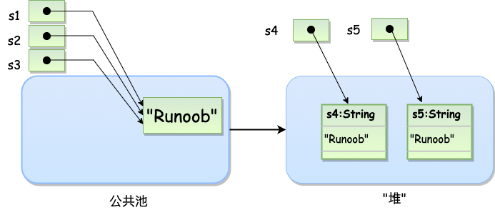
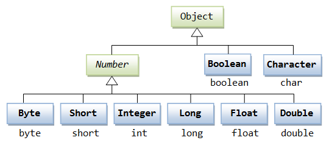
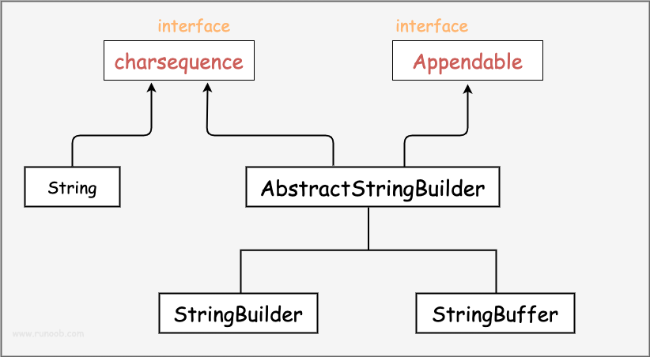
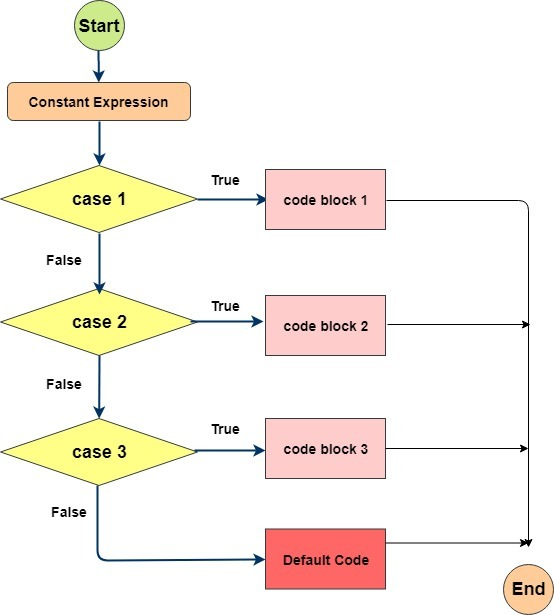

# Java

## 基础

### 运行与环境

Java 是由 Sun Microsystems 公司于 1995 年 5 月推出的 Java 面向对象程序设计语言和 Java 平台的总称。由 James Gosling和同事们共同研发，并在 1995 年正式推出。后来 Sun 公司被 Oracle （甲骨文）公司收购，Java 也随之成为 Oracle 公司的产品。Java分为三个体系：

- JavaSE（J2SE）（Java2 Platform Standard Edition，java平台标准版）
- JavaEE(J2EE)(Java 2 Platform,Enterprise Edition，java平台企业版)
- JavaME(J2ME)(Java 2 Platform Micro Edition，java平台微型版)。

### 基础数据

#### 基本数据类型

##### 内置数据类型

Java语言提供了八种基本类型。六种数字类型（四个整数型，两个浮点型），一种字符类型，还有一种布尔型。

**byte：**byte 数据类型是8位、有符号的，以二进制补码表示的整数；最小值是 **-128（-2^7）**；最大值是 **127（2^7-1）**；默认值是 **0**；byte 类型用在大型数组中节约空间，主要代替整数，因为 byte 变量占用的空间只有 int 类型的四分之一；例子：byte a = 100，byte b = -50。

**short：**short 数据类型是 16 位、有符号的以二进制补码表示的整数；最小值是 **-32768（-2^15）**；最大值是 **32767（2^15 - 1）**；Short 数据类型也可以像 byte 那样节省空间。一个short变量是int型变量所占空间的二分之一；默认值是 **0**；例子：short s = 1000，short r = -20000。

**int：**int 数据类型是32位、有符号的以二进制补码表示的整数；最小值是 **-2,147,483,648（-2^31）**；最大值是 **2,147,483,647（2^31 - 1）**；一般地整型变量默认为 int 类型；默认值是 **0** ；例子：int a = 100000, int b = -200000。

**long：**long 数据类型是 64 位、有符号的以二进制补码表示的整数；最小值是 **-9,223,372,036,854,775,808（-2^63）**；最大值是 **9,223,372,036,854,775,807（2^63 -1）**；这种类型主要使用在需要比较大整数的系统上；默认值是 **0L**；例子： **long a = 100000L**，**long b = -200000L**。"L"理论上不分大小写，但是若写成"l"容易与数字"1"混淆，不容易分辩。所以最好大写。

**float：**float 数据类型是单精度、32位、符合IEEE 754标准的浮点数；float 在储存大型浮点数组的时候可节省内存空间；默认值是 **0.0f**；浮点数不能用来表示精确的值，如货币；例子：float f1 = 234.5f。

**double：**double 数据类型是双精度、64 位、符合 IEEE 754 标准的浮点数；浮点数的默认类型为 double 类型；double类型同样不能表示精确的值，如货币；默认值是 **0.0d**；例子：double   d4  =  8.D; 

**boolean：**boolean数据类型表示一位的信息；只有两个取值：true 和 false；这种类型只作为一种标志来记录 true/false 情况；默认值是 **false**；例子：boolean one = true。

**char：**char 类型是一个单一的 16 位 Unicode 字符；最小值是 **\u0000**（十进制等效值为 0）；最大值是 **\uffff**（即为 65535）；char 数据类型可以储存任何字符；例子：char letter = 'A';。

##### 引用类型

在Java中，引用类型的变量非常类似于C/C++的指针。引用类型指向一个对象，指向对象的变量是引用变量。这些变量在声明时被指定为一个特定的类型，比如 Employee、Puppy 等。变量一旦声明后，类型就不能被改变了。对象、数组都是引用数据类型。所有引用类型的默认值都是null。一个引用变量可以用来引用任何与之兼容的类型。例子：Site site = new Site("Runoob")。

##### 常量

常量在程序运行时是不能被修改的。在 Java 中使用 final 关键字来修饰常量，声明方式和变量类似：

```
final double PI = 3.1415927;
```

虽然常量名也可以用小写，但为了便于识别，通常使用大写字母表示常量。字面量可以赋给任何内置类型的变量。例如：

```
byte a = 68;
char a = 'A'
```

byte、int、long、和short都可以用十进制、16进制以及8进制的方式来表示。

当使用字面量的时候，前缀 **0** 表示 8 进制，而前缀 **0x** 代表 16 进制, 例如：

```
int decimal = 100;
int octal = 0144;
int hexa =  0x64;
```

和其他语言一样，Java的字符串常量也是包含在两个引号之间的字符序列。下面是字符串型字面量的例子：

```
"Hello World"
"two\nlines"
"\"This is in quotes\""
```

字符串常量和字符变量都可以包含任何 Unicode 字符。例如：

```
char a = '\u0001';
String a = "\u0001";
```

Java语言支持一些特殊的转义字符序列。

| 符号   | 字符含义                 |
| :----- | :----------------------- |
| \n     | 换行 (0x0a)              |
| \r     | 回车 (0x0d)              |
| \f     | 换页符(0x0c)             |
| \b     | 退格 (0x08)              |
| \0     | 空字符 (0x0)             |
| \s     | 空格 (0x20)              |
| \t     | 制表符                   |
| \"     | 双引号                   |
| \'     | 单引号                   |
| \\     | 反斜杠                   |
| \ddd   | 八进制字符 (ddd)         |
| \uxxxx | 16进制Unicode字符 (xxxx) |

##### 数组

Java 语言中提供的数组是用来存储固定大小的同类型元素。首先必须声明数组变量，才能在程序中使用数组。建议使用 **dataType[] arrayRefVar** 的声明风格声明数组变量。 dataType arrayRefVar[] 风格是来自 C/C++ 语言 ，在Java中采用是为了让 C/C++ 程序员能够快速理解java语言。Java语言使用new操作符来创建数组。数组变量的声明，和创建数组可以用一条语句完成。

```
dataType[] arrayRefVar;   // 首选的方法
 
或
 
dataType arrayRefVar[];  // 效果相同，但不是首选方法

arrayRefVar = new dataType[arraySize];

dataType[] arrayRefVar = new dataType[arraySize];
dataType[] arrayRefVar = {value0, value1, ..., valuek};

```

多维数组可以看成是数组的数组，比如二维数组就是一个特殊的一维数组，其每一个元素都是一个一维数组。

```
type[][] typeName = new type[typeLength1][typeLength2];
```

###### Arrays 类

java.util.Arrays 类能方便地操作数组，它提供的所有方法都是静态的。

具有以下功能：

- 给数组赋值：通过 fill 方法。
- 对数组排序：通过 sort 方法,按升序。
- 比较数组：通过 equals 方法比较数组中元素值是否相等。
- 查找数组元素：通过 binarySearch 方法能对排序好的数组进行二分查找法操作。

具体说明请查看下表：

| 序号 | 方法和说明                                                   |
| :--- | :----------------------------------------------------------- |
| 1    | **public static int binarySearch(Object[] a, Object key)** 用二分查找算法在给定数组中搜索给定值的对象(Byte,Int,double等)。数组在调用前必须排序好的。如果查找值包含在数组中，则返回搜索键的索引；否则返回 (-(*插入点*) - 1)。 |
| 2    | **public static boolean equals(long[] a, long[] a2)** 如果两个指定的 long 型数组彼此*相等*，则返回 true。如果两个数组包含相同数量的元素，并且两个数组中的所有相应元素对都是相等的，则认为这两个数组是相等的。换句话说，如果两个数组以相同顺序包含相同的元素，则两个数组是相等的。同样的方法适用于所有的其他基本数据类型（Byte，short，Int等）。 |
| 3    | **public static void fill(int[] a, int val)** 将指定的 int 值分配给指定 int 型数组指定范围中的每个元素。同样的方法适用于所有的其他基本数据类型（Byte，short，Int等）。 |
| 4    | **public static void sort(Object[] a)** 对指定对象数组根据其元素的自然顺序进行升序排列。同样的方法适用于所有的其他基本数据类型（Byte，short，Int等）。 |


##### String 类

字符串广泛应用 在 Java 编程中，在 Java 中字符串属于对象，Java 提供了 String 类来创建和操作字符串。

创建字符串最简单的方式如下:

```
String str = "Runoob";
```

在代码中遇到字符串常量时，这里的值是 "**Runoob**"，编译器会使用该值创建一个 String 对象。和其它对象一样，可以使用关键字和构造方法来创建 String 对象。String 创建的字符串存储在公共池中，而 new 创建的字符串对象在堆上：

```
String s1 = "Runoob";              // String 直接创建
String s2 = "Runoob";              // String 直接创建
String s3 = s1;                    // 相同引用
String s4 = new String("Runoob");   // String 对象创建
String s5 = new String("Runoob");   // String 对象创建
```

**注意:**String 类是不可改变的，所以你一旦创建了 String 对象，那它的值就无法改变了（详看笔记部分解析）。如果需要对字符串做很多修改，那么应该选择使用 [StringBuffer & StringBuilder 类](https://www.runoob.com/java/java-stringbuffer.html)。





**字符串长度**：用于获取有关对象的信息的方法称为访问器方法。String 类的一个访问器方法是 length() 方法，它返回字符串对象包含的字符数。

**创建格式化字符串**：我们知道输出格式化数字可以使用 printf() 和 format() 方法。String 类使用静态方法 format() 返回一个String 对象而不是 PrintStream 对象。String 类的静态方法 format() 能用来创建可复用的格式化字符串，而不仅仅是用于一次打印输出。

```
System.out.printf("浮点型变量的值为 " +
                  "%f, 整型变量的值为 " +
                  " %d, 字符串变量的值为 " +
                  "is %s", floatVar, intVar, stringVar);
String fs;
fs = String.format("浮点型变量的值为 " +
                   "%f, 整型变量的值为 " +
                   " %d, 字符串变量的值为 " +
                   " %s", floatVar, intVar, stringVar);
```

| SN(序号) | 方法描述                                                     |
| :------- | :----------------------------------------------------------- |
| 1        | [char charAt(int index)](https://www.runoob.com/java/java-string-charat.html) 返回指定索引处的 char 值。 |
| 2        | [int compareTo(Object o)](https://www.runoob.com/java/java-string-compareto.html) 把这个字符串和另一个对象比较。 |
| 3        | [int compareTo(String anotherString)](https://www.runoob.com/java/java-string-compareto.html) 按字典顺序比较两个字符串。 |
| 4        | [int compareToIgnoreCase(String str)](https://www.runoob.com/java/java-string-comparetoignorecase.html) 按字典顺序比较两个字符串，不考虑大小写。 |
| 5        | [String concat(String str)](https://www.runoob.com/java/java-string-concat.html) 将指定字符串连接到此字符串的结尾。 |
| 6        | [boolean contentEquals(StringBuffer sb)](https://www.runoob.com/java/java-string-contentequals.html) 当且仅当字符串与指定的StringBuffer有相同顺序的字符时候返回真。 |
| 7        | [static String copyValueOf(char[\] data)](https://www.runoob.com/java/java-string-copyvalueof.html) 返回指定数组中表示该字符序列的 String。 |
| 8        | [static String copyValueOf(char[\] data, int offset, int count)](https://www.runoob.com/java/java-string-copyvalueof.html) 返回指定数组中表示该字符序列的 String。 |
| 9        | [boolean endsWith(String suffix)](https://www.runoob.com/java/java-string-endswith.html) 测试此字符串是否以指定的后缀结束。 |
| 10       | [boolean equals(Object anObject)](https://www.runoob.com/java/java-string-equals.html) 将此字符串与指定的对象比较。 |
| 11       | [boolean equalsIgnoreCase(String anotherString)](https://www.runoob.com/java/java-string-equalsignorecase.html) 将此 String 与另一个 String 比较，不考虑大小写。 |
| 12       | [byte[\] getBytes()](https://www.runoob.com/java/java-string-getbytes.html)  使用平台的默认字符集将此 String 编码为 byte 序列，并将结果存储到一个新的 byte 数组中。 |
| 13       | [byte[\] getBytes(String charsetName)](https://www.runoob.com/java/java-string-getbytes.html) 使用指定的字符集将此 String 编码为 byte 序列，并将结果存储到一个新的 byte 数组中。 |
| 14       | [void getChars(int srcBegin, int srcEnd, char[\] dst, int dstBegin)](https://www.runoob.com/java/java-string-getchars.html) 将字符从此字符串复制到目标字符数组。 |
| 15       | [int hashCode()](https://www.runoob.com/java/java-string-hashcode.html) 返回此字符串的哈希码。 |
| 16       | [int indexOf(int ch)](https://www.runoob.com/java/java-string-indexof.html) 返回指定字符在此字符串中第一次出现处的索引。 |
| 17       | [int indexOf(int ch, int fromIndex)](https://www.runoob.com/java/java-string-indexof.html) 返回在此字符串中第一次出现指定字符处的索引，从指定的索引开始搜索。 |
| 18       | [int indexOf(String str)](https://www.runoob.com/java/java-string-indexof.html)  返回指定子字符串在此字符串中第一次出现处的索引。 |
| 19       | [int indexOf(String str, int fromIndex)](https://www.runoob.com/java/java-string-indexof.html) 返回指定子字符串在此字符串中第一次出现处的索引，从指定的索引开始。 |
| 20       | [String intern()](https://www.runoob.com/java/java-string-intern.html)  返回字符串对象的规范化表示形式。 |
| 21       | [int lastIndexOf(int ch)](https://www.runoob.com/java/java-string-lastindexof.html)  返回指定字符在此字符串中最后一次出现处的索引。 |
| 22       | [int lastIndexOf(int ch, int fromIndex)](https://www.runoob.com/java/java-string-lastindexof.html) 返回指定字符在此字符串中最后一次出现处的索引，从指定的索引处开始进行反向搜索。 |
| 23       | [int lastIndexOf(String str)](https://www.runoob.com/java/java-string-lastindexof.html) 返回指定子字符串在此字符串中最右边出现处的索引。 |
| 24       | [int lastIndexOf(String str, int fromIndex)](https://www.runoob.com/java/java-string-lastindexof.html)  返回指定子字符串在此字符串中最后一次出现处的索引，从指定的索引开始反向搜索。 |
| 25       | [int length()](https://www.runoob.com/java/java-string-length.html) 返回此字符串的长度。 |
| 26       | [boolean matches(String regex)](https://www.runoob.com/java/java-string-matches.html) 告知此字符串是否匹配给定的正则表达式。 |
| 27       | [boolean regionMatches(boolean ignoreCase, int toffset, String other, int ooffset, int len)](https://www.runoob.com/java/java-string-regionmatches.html) 测试两个字符串区域是否相等。 |
| 28       | [boolean regionMatches(int toffset, String other, int ooffset, int len)](https://www.runoob.com/java/java-string-regionmatches.html) 测试两个字符串区域是否相等。 |
| 29       | [String replace(char oldChar, char newChar)](https://www.runoob.com/java/java-string-replace.html) 返回一个新的字符串，它是通过用 newChar 替换此字符串中出现的所有 oldChar 得到的。 |
| 30       | [String replaceAll(String regex, String replacement)](https://www.runoob.com/java/java-string-replaceall.html) 使用给定的 replacement 替换此字符串所有匹配给定的正则表达式的子字符串。 |
| 31       | [String replaceFirst(String regex, String replacement)](https://www.runoob.com/java/java-string-replacefirst.html)  使用给定的 replacement 替换此字符串匹配给定的正则表达式的第一个子字符串。 |
| 32       | [String[\] split(String regex)](https://www.runoob.com/java/java-string-split.html) 根据给定正则表达式的匹配拆分此字符串。 |
| 33       | [String[\] split(String regex, int limit)](https://www.runoob.com/java/java-string-split.html) 根据匹配给定的正则表达式来拆分此字符串。 |
| 34       | [boolean startsWith(String prefix)](https://www.runoob.com/java/java-string-startswith.html) 测试此字符串是否以指定的前缀开始。 |
| 35       | [boolean startsWith(String prefix, int toffset)](https://www.runoob.com/java/java-string-startswith.html) 测试此字符串从指定索引开始的子字符串是否以指定前缀开始。 |
| 36       | [CharSequence subSequence(int beginIndex, int endIndex)](https://www.runoob.com/java/java-string-subsequence.html)  返回一个新的字符序列，它是此序列的一个子序列。 |
| 37       | [String substring(int beginIndex)](https://www.runoob.com/java/java-string-substring.html) 返回一个新的字符串，它是此字符串的一个子字符串。 |
| 38       | [String substring(int beginIndex, int endIndex)](https://www.runoob.com/java/java-string-substring.html) 返回一个新字符串，它是此字符串的一个子字符串。 |
| 39       | [char[\] toCharArray()](https://www.runoob.com/java/java-string-tochararray.html) 将此字符串转换为一个新的字符数组。 |
| 40       | [String toLowerCase()](https://www.runoob.com/java/java-string-tolowercase.html) 使用默认语言环境的规则将此 String 中的所有字符都转换为小写。 |
| 41       | [String toLowerCase(Locale locale)](https://www.runoob.com/java/java-string-tolowercase.html)  使用给定 Locale 的规则将此 String 中的所有字符都转换为小写。 |
| 42       | [String toString()](https://www.runoob.com/java/java-string-tostring.html)  返回此对象本身（它已经是一个字符串！）。 |
| 43       | [String toUpperCase()](https://www.runoob.com/java/java-string-touppercase.html) 使用默认语言环境的规则将此 String 中的所有字符都转换为大写。 |
| 44       | [String toUpperCase(Locale locale)](https://www.runoob.com/java/java-string-touppercase.html) 使用给定 Locale 的规则将此 String 中的所有字符都转换为大写。 |
| 45       | [String trim()](https://www.runoob.com/java/java-string-trim.html) 返回字符串的副本，忽略前导空白和尾部空白。 |
| 46       | [static String valueOf(primitive data type x)](https://www.runoob.com/java/java-string-valueof.html) 返回给定data type类型x参数的字符串表示形式。 |
| 47       | [contains(CharSequence chars)](https://www.runoob.com/java/java-string-contains.html) 判断是否包含指定的字符系列。 |
| 48       | [isEmpty()](https://www.runoob.com/java/java-string-isempty.html) 判断字符串是否为空。 |

##### Enum 类

Java 枚举是一个特殊的类，一般表示一组常量，比如一年的 4 个季节，一年的 12 个月份，一个星期的 7 天，方向有东南西北等。Java 枚举类使用 enum 关键字来定义，各个常量使用逗号 **,** 来分割。枚举类也可以声明在内部类中。可以使用 for 语句来迭代枚举元素。也可使用switch做匹配选择。

例如定义一个颜色的枚举类。

```
public class Test 
{ 
    enum Color 
    { 
        RED, GREEN, BLUE; 
    } 
  
    // 执行输出结果
    public static void main(String[] args) 
    { 
        Color c1 = Color.RED; 
        System.out.println(c1); 
    } 
}

enum Color 
{ 
    RED, GREEN, BLUE; 
} 
public class MyClass { 
  public static void main(String[] args) { 
    for (Color myVar : Color.values()) {
      System.out.println(myVar);
    }
  } 
}


enum Color 
{ 
    RED, GREEN, BLUE; 
} 
public class MyClass {
  public static void main(String[] args) {
    Color myVar = Color.BLUE;

    switch(myVar) {
      case RED:
        System.out.println("红色");
        break;
      case GREEN:
         System.out.println("绿色");
        break;
      case BLUE:
        System.out.println("蓝色");
        break;
    }
  }
}
```

枚举跟普通类一样可以用自己的变量、方法和构造函数，构造函数只能使用 private 访问修饰符，所以外部无法调用。枚举既可以包含具体方法，也可以包含抽象方法。 如果枚举类具有抽象方法，则枚举类的每个实例都必须实现它。

enum 定义的枚举类默认继承了 java.lang.Enum 类，并实现了 java.lang.Serializable 和 java.lang.Comparable 两个接口。values(), ordinal() 和 valueOf() 方法位于 java.lang.Enum 类中：

- values() 返回枚举类中所有的值。
- ordinal()方法可以找到每个枚举常量的索引，就像数组索引一样。
- valueOf()方法返回指定字符串值的枚举常量。

```
enum Color 
{ 
    RED, GREEN, BLUE; 
} 
  
public class Test 
{ 
    public static void main(String[] args) 
    { 
        // 调用 values() 
        Color[] arr = Color.values(); 
  
        // 迭代枚举
        for (Color col : arr) 
        { 
            // 查看索引
            System.out.println(col + " at index " + col.ordinal()); 
        } 
  
        // 使用 valueOf() 返回枚举常量，不存在的会报错 IllegalArgumentException 
        System.out.println(Color.valueOf("RED")); 
        // System.out.println(Color.valueOf("WHITE")); 
    } 
}


enum Color 
{ 
    RED, GREEN, BLUE; 
  
    // 构造函数
    private Color() 
    { 
        System.out.println("Constructor called for : " + this.toString()); 
    } 
  
    public void colorInfo() 
    { 
        System.out.println("Universal Color"); 
    } 
} 
  
public class Test 
{     
    // 输出
    public static void main(String[] args) 
    { 
        Color c1 = Color.RED; 
        System.out.println(c1); 
        c1.colorInfo(); 
    } 
}
```


##### 包装类

在实际开发过程中，我们经常会遇到需要使用对象，而不是内置数据类型的情形。为了解决这个问题，Java 语言为每一个内置数据类型提供了对应的包装类。在某些情况下，Java编译器会自动创建一个包装类对象。例如，将一个char类型的参数传递给需要一个Character类型参数的方法时，那么编译器会自动地将char类型参数转换为Character对象。 这种特征称为装箱，反过来称为拆箱。

###### Number 类与 Math 类

所有的包装类**（Integer、Long、Byte、Double、Float、Short）**都是抽象类 Number 的子类。

| 类名       | 对应基本类型 | 描述                         |
| :--------- | :----------- | :--------------------------- |
| Byte       | byte         | 字节型包装类                 |
| Short      | short        | 短整型包装类                 |
| Integer    | int          | 整型包装类                   |
| Long       | long         | 长整型包装类                 |
| Float      | float        | 单精度浮点型包装类           |
| Double     | double       | 双精度浮点型包装类           |
| BigInteger | -            | 不可变任意精度整数           |
| BigDecimal | -            | 不可变任意精度有符号十进制数 |



这种由编译器特别支持的包装称为装箱，所以当内置数据类型被当作对象使用的时候，编译器会把内置类型装箱为包装类。相似的，编译器也可以把一个对象拆箱为内置类型。Number 类属于 java.lang 包。Number 是一个抽象类，主要作用是为各种数值类型提供统一的转换方法。

Math 类是 Java 提供的数学工具类，位于 java.lang 包中，包含执行基本数值运算的静态方法。Java 的 Math 包含了用于执行基本数学运算的属性和方法，如初等指数、对数、平方根和三角函数。Math 的方法都被定义为 static 形式，通过 Math 类可以在主函数中直接调用。下面的表中列出的是 Number & Math 类常用的一些方法：

| 序号 | 方法与描述                                                   |
| :--- | :----------------------------------------------------------- |
| 1    | [xxxValue()](https://www.runoob.com/java/number-xxxvalue.html) 将 Number 对象转换为xxx数据类型的值并返回。 |
| 2    | [compareTo()](https://www.runoob.com/java/number-compareto.html) 将number对象与参数比较。 |
| 3    | [equals()](https://www.runoob.com/java/number-equals.html) 判断number对象是否与参数相等。 |
| 4    | [valueOf()](https://www.runoob.com/java/number-valueof.html) 返回一个 Number 对象指定的内置数据类型 |
| 5    | [toString()](https://www.runoob.com/java/number-tostring.html) 以字符串形式返回值。 |
| 6    | [parseInt()](https://www.runoob.com/java/number-parseInt.html) 将字符串解析为int类型。 |
| 7    | [abs()](https://www.runoob.com/java/number-abs.html) 返回参数的绝对值。 |
| 8    | [ceil()](https://www.runoob.com/java/number-ceil.html) 返回大于等于( >= )给定参数的的最小整数，类型为双精度浮点型。 |
| 9    | [floor()](https://www.runoob.com/java/number-floor.html) 返回小于等于（<=）给定参数的最大整数 。 |
| 10   | [rint()](https://www.runoob.com/java/number-rint.html) 返回与参数最接近的整数。返回类型为double。 |
| 11   | [round()](https://www.runoob.com/java/number-round.html) 它表示**四舍五入**，算法为 **Math.floor(x+0.5)**，即将原来的数字加上 0.5 后再向下取整，所以，Math.round(11.5) 的结果为12，Math.round(-11.5) 的结果为-11。 |
| 12   | [min()](https://www.runoob.com/java/number-min.html) 返回两个参数中的最小值。 |
| 13   | [max()](https://www.runoob.com/java/number-max.html) 返回两个参数中的最大值。 |
| 14   | [exp()](https://www.runoob.com/java/number-exp.html) 返回自然数底数e的参数次方。 |
| 15   | [log()](https://www.runoob.com/java/number-log.html) 返回参数的自然数底数的对数值。 |
| 16   | [pow()](https://www.runoob.com/java/number-pow.html) 返回第一个参数的第二个参数次方。 |
| 17   | [sqrt()](https://www.runoob.com/java/number-sqrt.html) 求参数的算术平方根。 |
| 18   | [sin()](https://www.runoob.com/java/number-sin.html) 求指定double类型参数的正弦值。 |
| 19   | [cos()](https://www.runoob.com/java/number-cos.html) 求指定double类型参数的余弦值。 |
| 20   | [tan()](https://www.runoob.com/java/number-tan.html) 求指定double类型参数的正切值。 |
| 21   | [asin()](https://www.runoob.com/java/number-asin.html) 求指定double类型参数的反正弦值。 |
| 22   | [acos()](https://www.runoob.com/java/number-acos.html) 求指定double类型参数的反余弦值。 |
| 23   | [atan()](https://www.runoob.com/java/number-atan.html) 求指定double类型参数的反正切值。 |
| 24   | [atan2()](https://www.runoob.com/java/number-atan2.html) 将笛卡尔坐标转换为极坐标，并返回极坐标的角度值。 |
| 25   | [toDegrees()](https://www.runoob.com/java/number-todegrees.html) 将参数转化为角度。 |
| 26   | [toRadians()](https://www.runoob.com/java/number-toradians.html) 将角度转换为弧度。 |
| 27   | [random()](https://www.runoob.com/java/number-random.html) 返回一个随机数。 |

###### Character 类

Character 类用于对单个字符进行操作。Character 类在对象中包装一个基本类型 **char** 的值。Character类提供了一系列方法来操纵字符。

下面是Character类的方法：

| 序号 | 方法与描述                                                   |
| :--- | :----------------------------------------------------------- |
| 1    | [isLetter()](https://www.runoob.com/java/character-isletter.html) 是否是一个字母 |
| 2    | [isDigit()](https://www.runoob.com/java/character-isdigit.html) 是否是一个数字字符 |
| 3    | [isWhitespace()](https://www.runoob.com/java/character-iswhitespace.html) 是否是一个空白字符 |
| 4    | [isUpperCase()](https://www.runoob.com/java/character-isuppercase.html) 是否是大写字母 |
| 5    | [isLowerCase()](https://www.runoob.com/java/character-islowercase.html) 是否是小写字母 |
| 6    | [toUpperCase()](https://www.runoob.com/java/character-touppercase.html) 指定字母的大写形式 |
| 7    | [toLowerCase](https://www.runoob.com/java/character-tolowercase.html)() 指定字母的小写形式 |
| 8    | [toString](https://www.runoob.com/java/character-tostring.html)() 返回字符的字符串形式，字符串的长度仅为1 |

###### StringBuffer 与 StringBuilder 类

当对字符串进行修改的时候，需要使用 StringBuffer 和 StringBuilder 类。和 String 类不同的是，StringBuffer 和 StringBuilder 类的对象能够被多次的修改，并且不产生新的未使用对象。



在使用 StringBuffer 类时，每次都会对 StringBuffer 对象本身进行操作，而不是生成新的对象，所以如果需要对字符串进行修改推荐使用 StringBuffer。StringBuilder 类在 Java 5 中被提出，它和 StringBuffer 之间的最大不同在于 StringBuilder 的方法不是线程安全的（不能同步访问）。由于 StringBuilder 相较于 StringBuffer 有速度优势，所以多数情况下建议使用 StringBuilder 类。然而在应用程序要求线程安全的情况下，则必须使用 StringBuffer 类。


以下是 StringBuffer 类支持的主要方法：

| 序号 | 方法描述                                                     |
| :--- | :----------------------------------------------------------- |
| 1    | public StringBuffer append(String s) 将指定的字符串追加到此字符序列。 |
| 2    | public StringBuffer reverse()  将此字符序列用其反转形式取代。 |
| 3    | public delete(int start, int end) 移除此序列的子字符串中的字符。 |
| 4    | public insert(int offset, int i) 将 `int` 参数的字符串表示形式插入此序列中。 |
| 5    | insert(int offset, String str) 将 `str` 参数的字符串插入此序列中。 |
| 6    | replace(int start, int end, String str) 使用给定 `String` 中的字符替换此序列的子字符串中的字符。 |

以下列表列出了 StringBuffer 类的其他常用方法：

| 序号 | 方法描述                                                     |
| :--- | :----------------------------------------------------------- |
| 1    | int capacity() 返回当前容量。                                |
| 2    | char charAt(int index) 返回此序列中指定索引处的 `char` 值。  |
| 3    | void ensureCapacity(int minimumCapacity) 确保容量至少等于指定的最小值。 |
| 4    | void getChars(int srcBegin, int srcEnd, char[] dst, int dstBegin) 将字符从此序列复制到目标字符数组 `dst`。 |
| 5    | int indexOf(String str) 返回第一次出现的指定子字符串在该字符串中的索引。 |
| 6    | int indexOf(String str, int fromIndex) 从指定的索引处开始，返回第一次出现的指定子字符串在该字符串中的索引。 |
| 7    | int lastIndexOf(String str) 返回最右边出现的指定子字符串在此字符串中的索引。 |
| 8    | int lastIndexOf(String str, int fromIndex) 返回 String 对象中子字符串最后出现的位置。 |
| 9    | int length()  返回长度（字符数）。                           |
| 10   | void setCharAt(int index, char ch) 将给定索引处的字符设置为 `ch`。 |
| 11   | void setLength(int newLength) 设置字符序列的长度。           |
| 12   | CharSequence subSequence(int start, int end) 返回一个新的字符序列，该字符序列是此序列的子序列。 |
| 13   | String substring(int start) 返回一个新的 `String`，它包含此字符序列当前所包含的字符子序列。 |
| 14   | String substring(int start, int end) 返回一个新的 `String`，它包含此序列当前所包含的字符子序列。 |
| 15   | String toString() 返回此序列中数据的字符串表示形式。         |


#### 类型转换

##### 自动类型转换

**整型、实型（常量）、字符型数据可以混合运算。运算中，不同类型的数据先转化为同一类型，然后进行运算。**转换从低级到高级。

```
低  ------------------------------------>  高

byte,short,char—> int —> long—> float —> double 
```

数据类型转换必须满足如下规则：

- 不能对boolean类型进行类型转换。

- 不能把对象类型转换成不相关类的对象。

- 在把容量大的类型转换为容量小的类型时必须使用强制类型转换。

- 转换过程中可能导致溢出或损失精度，例如：

  ```
  int i =128;   
  byte b = (byte)i;
  ```

  因为 byte 类型是 8 位，最大值为127，所以当 int 强制转换为 byte 类型时，值 128 时候就会导致溢出。

- 浮点数到整数的转换是通过舍弃小数得到，而不是四舍五入，例如：

  ```
  (int)23.7 == 23;        
  (int)-45.89f == -45
  ```

##### 强制类型转换

- 1. 条件是转换的数据类型必须是兼容的。
- 2. 格式：(type)value type是要强制类型转换后的数据类型

##### 隐含强制类型转换

- 1、 整数的默认类型是 int。
- 2、 小数默认是 double 类型浮点型，在定义 float 类型时必须在数字后面跟上 F 或者 f。

#### 运算符

计算机的最基本用途之一就是执行数学运算，作为一门计算机语言，Java也提供了一套丰富的运算符来操纵变量。我们可以把运算符分成以下几组：算术运算符、关系运算符、位运算符、逻辑运算符、赋值运算符、其他运算符。

##### 算术运算符

算术运算符用在数学表达式中，它们的作用和在数学中的作用一样。下表列出了所有的算术运算符。表格中的实例假设整数变量A的值为10，变量B的值为20：

| 操作符 | 描述                              | 例子                               |
| :----- | :-------------------------------- | :--------------------------------- |
| +      | 加法 - 相加运算符两侧的值         | A + B 等于 30                      |
| -      | 减法 - 左操作数减去右操作数       | A – B 等于 -10                     |
| *      | 乘法 - 相乘操作符两侧的值         | A * B等于200                       |
| /      | 除法 - 左操作数除以右操作数       | B / A等于2                         |
| ％     | 取余 - 左操作数除以右操作数的余数 | B%A等于0                           |
| ++     | 自增: 操作数的值增加1             | B++ 或 ++B 等于 21（区别详见下文） |
| --     | 自减: 操作数的值减少1             | B-- 或 --B 等于 19（区别详见下文） |

**前缀自增自减法(++a,--a):** 先进行自增或者自减运算，再进行表达式运算。

**后缀自增自减法(a++,a--):** 先进行表达式运算，再进行自增或者自减运算。

##### 关系运算符

下表为Java支持的关系运算符表格中的实例整数变量A的值为10，变量B的值为20：

| 运算符 | 描述                                                         | 例子             |
| :----- | :----------------------------------------------------------- | :--------------- |
| ==     | 检查如果两个操作数的值是否相等，如果相等则条件为真。         | （A == B）为假。 |
| !=     | 检查如果两个操作数的值是否相等，如果值不相等则条件为真。     | (A != B) 为真。  |
| >      | 检查左操作数的值是否大于右操作数的值，如果是那么条件为真。   | （A> B）为假。   |
| <      | 检查左操作数的值是否小于右操作数的值，如果是那么条件为真。   | （A <B）为真。   |
| >=     | 检查左操作数的值是否大于或等于右操作数的值，如果是那么条件为真。 | （A> = B）为假。 |
| <=     | 检查左操作数的值是否小于或等于右操作数的值，如果是那么条件为真。 | （A <= B）为真。 |

##### 位运算符

Java定义了位运算符，应用于整数类型(int)，长整型(long)，短整型(short)，字符型(char)，和字节型(byte)等类型。位运算符作用在所有的位上，并且按位运算。假设a = 60，b = 13;它们的二进制格式表示将如下：

```
A = 0011 1100
B = 0000 1101
-----------------
A&B = 0000 1100
A | B = 0011 1101
A ^ B = 0011 0001
~A= 1100 0011
```

下表列出了位运算符的基本运算，假设整数变量 A 的值为 60 和变量 B 的值为 13：

| 操作符 | 描述                                                         | 例子                           |
| :----- | :----------------------------------------------------------- | :----------------------------- |
| ＆     | 如果相对应位都是1，则结果为1，否则为0                        | （A＆B），得到12，即0000 1100  |
| \|     | 如果相对应位都是 0，则结果为 0，否则为 1                     | （A \| B）得到61，即 0011 1101 |
| ^      | 如果相对应位值相同，则结果为0，否则为1                       | （A ^ B）得到49，即 0011 0001  |
| 〜     | 按位取反运算符翻转操作数的每一位，即0变成1，1变成0。         | （〜A）得到-61，即1100 0011    |
| <<     | 按位左移运算符。左操作数按位左移右操作数指定的位数。         | A << 2得到240，即 1111 0000    |
| >>     | 按位右移运算符。左操作数按位右移右操作数指定的位数。         | A >> 2得到15即 1111            |
| >>>    | 按位右移补零操作符。左操作数的值按右操作数指定的位数右移，移动得到的空位以零填充。 | A>>>2得到15即0000 1111         |

##### 逻辑运算符

下表列出了逻辑运算符的基本运算，假设布尔变量A为真，变量B为假

| 操作符 | 描述                                                         | 例子                |
| :----- | :----------------------------------------------------------- | :------------------ |
| &&     | 称为逻辑与运算符。当且仅当两个操作数都为真，条件才为真。     | （A && B）为假。    |
| \| \|  | 称为逻辑或操作符。如果任何两个操作数任何一个为真，条件为真。 | （A \| \| B）为真。 |
| ！     | 称为逻辑非运算符。用来反转操作数的逻辑状态。如果条件为true，则逻辑非运算符将得到false。 | ！（A && B）为真。  |

**短路逻辑运算符**：当使用与逻辑运算符时，在两个操作数都为true时，结果才为true，但是当得到第一个操作为false时，其结果就必定是false，这时候就不会再判断第二个操作了。同理到或运算符，当第一个为true时，会跳过第二个数的解析。

##### 赋值运算符

下面是Java语言支持的赋值运算符：

| 操作符  | 描述                                                         | 例子                                     |
| :------ | :----------------------------------------------------------- | :--------------------------------------- |
| =       | 简单的赋值运算符，将右操作数的值赋给左侧操作数               | C = A + B将把A + B得到的值赋给C          |
| + =     | 加和赋值操作符，它把左操作数和右操作数相加赋值给左操作数     | C + = A等价于C = C + A                   |
| - =     | 减和赋值操作符，它把左操作数和右操作数相减赋值给左操作数     | C - = A等价于C = C - A                   |
| * =     | 乘和赋值操作符，它把左操作数和右操作数相乘赋值给左操作数     | C * = A等价于C = C * A                   |
| / =     | 除和赋值操作符，它把左操作数和右操作数相除赋值给左操作数     | C / = A，C 与 A 同类型时等价于 C = C / A |
| （％）= | 取模和赋值操作符，它把左操作数和右操作数取模后赋值给左操作数 | C％= A等价于C = C％A                     |
| << =    | 左移位赋值运算符                                             | C << = 2等价于C = C << 2                 |
| >> =    | 右移位赋值运算符                                             | C >> = 2等价于C = C >> 2                 |
| ＆=     | 按位与赋值运算符                                             | C＆= 2等价于C = C＆2                     |
| ^ =     | 按位异或赋值操作符                                           | C ^ = 2等价于C = C ^ 2                   |
| \| =    | 按位或赋值操作符                                             | C \| = 2等价于C = C \| 2                 |

##### 其他运算符

* **条件运算符（?:）**：条件运算符也被称为三元运算符。该运算符有3个操作数，并且需要判断布尔表达式的值。该运算符的主要是决定哪个值应该赋值给变量。

```
variable x = (expression) ? value if true : value if false
```

* **instanceof 运算符**

该运算符用于操作对象实例，检查该对象是否是一个特定类型（类类型或接口类型）。instanceof运算符使用格式如下：

```
( Object reference variable ) instanceof  (class/interface type)
```

如果运算符左侧变量所指的对象，是操作符右侧类或接口(class/interface)的一个对象，那么结果为真。

* **钻石操作符**

 `<>`，用来让编译器**自动推断泛型类型**，省掉右边重复写的类型。减少泛型类型重复书写，让代码更简洁。

```
List<String> list = new ArrayList<String>();

List<String> list = new ArrayList<>();

```

这样程序会自己推断 new ArrayList<>(); 为 new ArrayList<String>();

##### Java运算符优先级

当多个运算符出现在一个表达式中，谁先谁后呢？这就涉及到运算符的优先级别的问题。在一个多运算符的表达式中，运算符优先级不同会导致最后得出的结果差别甚大。例如，（1+3）＋（3+2）*2，这个表达式如果按加号最优先计算，答案就是 18，如果按照乘号最优先，答案则是 14。再如，x = 7 + 3 * 2;这里x得到13，而不是20，因为乘法运算符比加法运算符有较高的优先级，所以先计算3 * 2得到6，然后再加7。下表中具有最高优先级的运算符在的表的最上面，最低优先级的在表的底部。

| 类别     | 操作符                                     | 关联性   |
| :------- | :----------------------------------------- | :------- |
| 后缀     | () [] . (点操作符)                         | 左到右   |
| 一元     | expr++ expr--                              | 从左到右 |
| 一元     | ++expr --expr + - ～ ！                    | 从右到左 |
| 乘性     | * /％                                      | 左到右   |
| 加性     | + -                                        | 左到右   |
| 移位     | >> >>>  <<                                 | 左到右   |
| 关系     | > >= < <=                                  | 左到右   |
| 相等     | == !=                                      | 左到右   |
| 按位与   | ＆                                         | 左到右   |
| 按位异或 | ^                                          | 左到右   |
| 按位或   | \|                                         | 左到右   |
| 逻辑与   | &&                                         | 左到右   |
| 逻辑或   | \| \|                                      | 左到右   |
| 条件     | ？：                                       | 从右到左 |
| 赋值     | = + = - = * = / =％= >> = << =＆= ^ = \| = | 从右到左 |
| 逗号     | ，                                         | 左到右   |

#### 变量

变量就是申请内存来存储值。也就是说，当创建变量的时候，需要在内存中申请空间。内存管理系统根据变量的类型为变量分配存储空间，分配的空间只能用来储存该类型数据。在 Java 语言中，所有的变量在使用前必须声明。

声明变量的基本格式如下：

```
type identifier [ = value][, identifier [= value] ...] ;
```

**格式说明：**type -- 数据类型。identifier -- 是变量名，可以使用逗号 **,** 隔开来声明多个同类型变量。

##### 参数变量

Java 中的参数变量是指在方法或构造函数中声明的变量，用于接收传递给方法或构造函数的值。参数变量与局部变量类似，但它们只在方法或构造函数被调用时存在，并且只能在方法或构造函数内部使用。Java 方法的声明语法如下：

```
accessModifier returnType methodName(parameterType parameterName1, parameterType parameterName2, ...) {
    // 方法体
}
```

- parameterType -- 表示参数变量的类型。
- parameterName -- 表示参数变量的名称。

在调用方法时，我们必须为参数变量传递值，这些值可以是常量、变量或表达式。

方法参数变量的值传递方式有两种：**值传递**和**引用传递**。

- **值传递：**在方法调用时，传递的是实际参数的值的副本。当参数变量被赋予新的值时，只会修改副本的值，不会影响原始值。Java 中的基本数据类型都采用值传递方式传递参数变量的值。
- **引用传递：**在方法调用时，传递的是实际参数的引用（即内存地址）。当参数变量被赋予新的值时，会修改原始值的内容。Java 中的对象类型采用引用传递方式传递参数变量的值。

```
public class RunoobTest {
    public static void main(String[] args) {
        int a = 10, b = 20;
        swap(a, b); // 调用swap方法
        System.out.println("a = " + a + ", b = " + b); // 输出a和b的值
    }
    
    public static void swap(int x, int y) {
        int temp = x;
        x = y;
        y = temp;
    }
}
```

##### 局部变量

Java 的局部变量是在方法、构造方法或语句块内部声明的变量，其作用域限制在声明它的代码块内部。

局部变量的声明语法为：

```
type variableName;
```

- type -- 表示变量的类型。
- variableName -- 表示变量的名称。

**说明：**

- **作用域**：局部变量的作用域限于它被声明的方法、构造方法或代码块内。一旦代码执行流程离开这个作用域，局部变量就不再可访问。
- **生命周期**：局部变量的生命周期从声明时开始，到方法、构造方法或代码块执行结束时终止。之后，局部变量将被垃圾回收。
- **初始化**：局部变量在使用前必须被初始化。如果不进行初始化，编译器会报错，因为 Java 不会为局部变量提供默认值。
- **声明**：局部变量的声明必须在方法或代码块的开始处进行。声明时可以指定数据类型，后面跟着变量名，例如：`int count;`。
- **赋值**：局部变量在声明后必须被赋值，才能在方法内使用。赋值可以是直接赋值，也可以是通过方法调用或表达式。
- **限制**：局部变量不能被类的其他方法直接访问，它们只为声明它们的方法或代码块所私有。
- **内存管理**：局部变量存储在 Java 虚拟机（JVM）的栈上，与存储在堆上的实例变量或对象不同。
- **垃圾回收**：由于局部变量的生命周期严格限于方法或代码块的执行，它们在方法或代码块执行完毕后不再被引用，因此JVM的垃圾回收器会自动回收它们占用的内存。
- **重用**：局部变量的名称可以在不同的方法或代码块中重复使用，因为它们的作用域是局部的，不会引起命名冲突。
- **参数和返回值**：方法的参数可以视为一种特殊的局部变量，它们在方法被调用时初始化，并在方法返回后生命周期结束。

```
public class LocalVariablesExample {
    public static void main(String[] args) {
        int a = 10; // 局部变量a的声明和初始化
        int b;     // 局部变量b的声明
        b = 20;    // 局部变量b的初始化
        
        System.out.println("a = " + a);
        System.out.println("b = " + b);
        
        // 如果在使用之前不初始化局部变量，编译器会报错
        // int c;
        // System.out.println("c = " + c);
    }
}
```

##### 成员变量（实例变量）

成员变量声明在一个类中，但在方法、构造方法和语句块之外。当一个对象被实例化之后，每个成员变量的值就跟着确定。成员变量在对象创建的时候创建，在对象被销毁的时候销毁。成员变量的值应该至少被一个方法、构造方法或者语句块引用，使得外部能够通过这些方式获取实例变量信息。成员变量可以声明在使用前或者使用后。访问修饰符可以修饰成员变量。成员变量对于类中的方法、构造方法或者语句块是可见的。一般情况下应该把成员变量设为私有。通过使用访问修饰符可以使成员变量对子类可见。成员变量具有默认值。数值型变量的默认值是0，布尔型变量的默认值是 false，引用类型变量的默认值是 null。变量的值可以在声明时指定，也可以在构造方法中指定；成员变量可以直接通过变量名访问。但在静态方法以及其他类中，就应该使用完全限定名：**ObjectReference.VariableName**。

成员变量的声明语法为：

```
accessModifier type variableName;
```

- accessModifier --表示访问修饰符，可以是 public、protected、private 或默认访问级别（即没有显式指定访问修饰符）。
- type -- 表示变量的类型。
- variableName -- 表示变量的名称。

与局部变量不同，成员变量的值在创建对象时被分配，即使未对其初始化，它们也会被赋予默认值，例如 int 类型的变量默认值为 0，boolean 类型的变量默认值为 false。成员变量可以通过对象访问，也可以通过类名访问（如果它们是静态成员变量）。如果没有显式初始化成员变量，则它们将被赋予默认值。可以在构造函数或其他方法中初始化成员变量，或者通过对象或类名访问它们并设置它们的值。以下实例我们声明了两个成员变量 a 和 b，并对其进行了访问和设置。注意，我们可以通过对象访问成员变量，也可以通过类名访问静态成员变量。

```
public class RunoobTest {
      private int a; // 私有成员变量a
      public String b = "Hello"; // 公有成员变量b
      
      public static void main(String[] args) {
         RunoobTest obj = new RunoobTest(); // 创建对象
          
          obj.a = 10; // 访问成员变量a，并设置其值为10
          System.out.println("a = " + obj.a);
          
          obj.b = "World"; // 访问成员变量b，并设置其值为"World"
          System.out.println("b = " + obj.b);
      }
  }
```

##### 类变量（静态变量）

Java 中的静态变量是指在类中定义的一个变量，它与类相关而不是与实例相关，即无论创建多少个类实例，静态变量在内存中只有一份拷贝，被所有实例共享。静态变量在类加载时被创建，在整个程序运行期间都存在。Java 中的静态变量是指在类中定义的一个变量，它与类相关而不是与实例相关，即无论创建多少个类实例，静态变量在内存中只有一份拷贝，被所有实例共享。静态变量在类加载时被创建，在整个程序运行期间都存在。

静态变量的定义方式是在类中使用 **static** 关键字修饰变量，通常也称为类变量。

以下实例中我们定义一个静态变量 **count** ，其初始值为 0：

```
public class MyClass {
    public static int count = 0;
    // 其他成员变量和方法
}
```

由于静态变量是与类相关的，因此可以通过类名来访问静态变量，也可以通过实例名来访问静态变量。

```
MyClass.count = 10; // 通过类名访问
MyClass obj = new MyClass();
obj.count = 20; // 通过实例名访问
```

静态变量的生命周期与程序的生命周期一样长，即它们在类加载时被创建，在整个程序运行期间都存在，直到程序结束才会被销毁。因此，静态变量可以用来存储整个程序都需要使用的数据，如配置信息、全局变量等。

```
public class MyClass {
    public static int count1 = 0;
    public static int count2 = count1 + 1;
    // 其他成员变量和方法
}
```

静态变量在类加载时被初始化，其初始化顺序与定义顺序有关。如果一个静态变量依赖于另一个静态变量，那么它必须在后面定义。

静态变量的访问修饰符可以是 public、protected、private 或者默认的访问修饰符（即不写访问修饰符）。需要注意的是，静态变量的访问权限与实例变量不同，因为静态变量是与类相关的，不依赖于任何实例。Java 中的静态变量是属于类的，而不是对象的实例。因此，当多个线程同时访问一个包含静态变量的类时，需要考虑其线程安全性。

静态变量在内存中只有一份拷贝，被所有实例共享。因此，如果一个线程修改了静态变量的值，那么其他线程在访问该静态变量时也会看到修改后的值。这可能会导致并发访问的问题，因为多个线程可能同时修改静态变量，导致不确定的结果或数据一致性问题。为了确保静态变量的线程安全性，需要采取适当的同步措施，如同步机制、原子类或 volatile 关键字，以便在多线程环境中正确地读取和修改静态变量的值。静态变量（也称为类变量）的命名规范通常遵循驼峰命名法，并且通常使用全大写字母，单词之间用下划线分隔，并且要用 static 关键字明确标识。

| ** 成员变量** | **局部变量**   | **静态变量**              |                    |
| ------------- | -------------- | ------------------------- | ------------------ |
| 定义位置      | 在类中,方法外  | 方法中,或者方法的形式参数 | 在类中,方法外      |
| 初始化值      | 有默认初始化值 | 无,先定义,赋值后才能使用  | 有默认初始化值     |
| 调用方式      | 对象调用       | ---                       | 对象调用，类名调用 |
| 存储位置      | 堆中           | 栈中                      | 方法区             |
| 生命周期      | 与对象共存亡   | 与方法共存亡              | 与类共存亡         |
| 别名          | 实例变量       | ---                       | 类变量             |

##### 命名风格

在 Java 中，不同类型的变量（例如实例变量、局部变量、静态变量等）有一些命名规则和约定。

遵循一些基本规则，这有助于提高代码的可读性和维护性。

以下是各种变量命名规则的概述：

- **使用有意义的名字：** 变量名应该具有清晰的含义，能够准确地反映变量的用途。避免使用单个字符或无意义的缩写。
- **驼峰命名法（Camel Case）：** 在变量名中使用驼峰命名法，即将每个单词的首字母大写，除了第一个单词外，其余单词的首字母都采用大写形式。例如：`myVariableName`。
- **避免关键字：** 不要使用 Java 关键字（例如，class、int、boolean等）作为变量名。
- **区分大小写：** Java 是大小写敏感的，因此变量名中的大小写字母被视为不同的符号。例如，`myVariable` 和 `myvariable` 是两个不同的变量。
- **不以数字开头：** 变量名不能以数字开头，但可以包含数字。
- **遵循命名约定：** 对于不同类型的变量（局部变量、实例变量、静态变量等），可以采用不同的命名约定，例如使用前缀或后缀来区分。

**局部变量**：使用驼峰命名法。应该以小写字母开头。变量名应该是描述性的，能够清晰地表示其用途。

```
int myLocalVariable;
```

**实例变量（成员变量）**：使用驼峰命名法。应该以小写字母开头。变量名应该是描述性的，能够清晰地表示其用途。

```
private int myInstanceVariable;
```

**静态变量（类变量）**：使用驼峰命名法，应该以小写字母开头。通常也可以使用大写蛇形命名法，全大写字母，单词之间用下划线分隔。变量名应该是描述性的，能够清晰地表示其用途。

```
// 使用驼峰命名法
public static int myStaticVariable;

// 使用大写蛇形命名法
public static final int MAX_SIZE = 100;
```

**常量**：使用全大写字母，单词之间用下划线分隔。常量通常使用 `final` 修饰。

```
public static final double PI = 3.14;
```

**参数**：使用驼峰命名法。应该以小写字母开头。参数名应该是描述性的，能够清晰地表示其用途。

```
public void myMethod(int myParameter) {
    // 方法体
}
```

**类名**：使用驼峰命名法。应该以大写字母开头。类名应该是描述性的，能够清晰地表示其用途。

```
public class MyClass {
    // 类的成员和方法
}
```

#### 变量修饰符

Java语言提供了很多修饰符，主要分为以下两类：访问修饰符非访问修饰符修饰符用来定义类、方法或者变量，通常放在语句的最前端。

##### 访问控制修饰符

Java中，可以使用访问控制符来保护对类、变量、方法和构造方法的访问。Java 支持 4 种不同的访问权限。

- **default** (即默认，什么也不写）: 在同一包内可见，不使用任何修饰符。使用对象：类、接口、变量、方法。
- **private** : 在同一类内可见。使用对象：变量、方法。 **注意：不能修饰类（外部类）**
- **public** : 对所有类可见。使用对象：类、接口、变量、方法
- **protected** : 对同一包内的类和所有子类可见。使用对象：变量、方法。 **注意：不能修饰类（外部类）**。

我们可以通过以下表来说明访问权限：

| 修饰符      | 当前类 | 同一包内 | 子孙类(同一包) | 子孙类(不同包)                                               | 其他包 |
| :---------- | :----- | :------- | :------------- | :----------------------------------------------------------- | :----- |
| `public`    | Y      | Y        | Y              | Y                                                            | Y      |
| `protected` | Y      | Y        | Y              | Y/N（[说明](https://www.runoob.com/java/java-modifier-types.html#protected-desc)） | N      |
| `default`   | Y      | Y        | Y              | N                                                            | N      |
| `private`   | Y      | N        | N              | N                                                            | N      |

###### 默认访问修饰符-不使用任何关键字

如果在类、变量、方法或构造函数的定义中没有指定任何访问修饰符，那么它们就默认具有默认访问修饰符。默认访问修饰符的访问级别是包级别（package-level），即只能被同一包中的其他类访问。变量和方法的声明可以不使用任何修饰符。

###### 私有访问修饰符-private

私有访问修饰符是最严格的访问级别，所以被声明为 **private** 的方法、变量和构造方法只能被所属类访问，并且类和接口不能声明为 **private**。声明为私有访问类型的变量只能通过类中公共的 getter 方法被外部类访问。Private 访问修饰符的使用主要用来隐藏类的实现细节和保护类的数据。

###### 公有访问修饰符-public

被声明为 public 的类、方法、构造方法和接口能够被任何其他类访问。如果几个相互访问的 public 类分布在不同的包中，则需要导入相应 public 类所在的包。由于类的继承性，类所有的公有方法和变量都能被其子类继承。Java 程序的 main() 方法必须设置成公有的，否则，Java 解释器将不能运行该类。

###### 受保护的访问修饰符-protected

protected 需要从以下两个点来分析说明：

- **子类与基类在同一包中**：被声明为 protected 的变量、方法和构造器能被同一个包中的任何其他类访问；
- **子类与基类不在同一包中**：那么在子类中，子类实例可以访问其从基类继承而来的 protected 方法，而不能访问基类实例的protected方法。

protected 可以修饰数据成员，构造方法，方法成员，**不能修饰类（内部类除外）**。接口及接口的成员变量和成员方法不能声明为 protected。子类能访问 protected 修饰符声明的方法和变量，这样就能保护不相关的类使用这些方法和变量。

###### 访问控制和继承

请注意以下方法继承的规则：

- 父类中声明为 public 的方法在子类中也必须为 public。
- 父类中声明为 protected 的方法在子类中要么声明为 protected，要么声明为 public，不能声明为 private。
- 父类中声明为 private 的方法，不能够被子类继承。

##### 非访问修饰符

为了实现一些其他的功能，Java 也提供了许多非访问修饰符。

###### **static 修饰符**

- **静态变量：**

  static 关键字用来声明独立于对象的静态变量，无论一个类实例化多少对象，它的静态变量只有一份拷贝。 静态变量也被称为类变量。局部变量不能被声明为 static 变量。

- **静态方法：**

  static 关键字用来声明独立于对象的静态方法。静态方法不能使用类的非静态变量。静态方法从参数列表得到数据，然后计算这些数据。

###### **final 修饰符**

* **final 变量：**final 表示"最后的、最终的"含义，变量一旦赋值后，不能被重新赋值。被 final 修饰的实例变量必须显式指定初始值。final 修饰符通常和 static 修饰符一起使用来创建类常量。

* **final 方法**：父类中的 final 方法可以被子类继承，但是不能被子类重写。声明 final 方法的主要目的是防止该方法的内容被修改。

* **final 类**：final 类不能被继承，没有类能够继承 final 类的任何特性。

###### **abstract 修饰符**

* **抽象类：**抽象类不能用来实例化对象，声明抽象类的唯一目的是为了将来对该类进行扩充。一个类不能同时被 abstract 和 final 修饰。如果一个类包含抽象方法，那么该类一定要声明为抽象类，否则将出现编译错误。抽象类可以包含抽象方法和非抽象方法。

* **抽象方法**：抽象方法是一种没有任何实现的方法，该方法的具体实现由子类提供。抽象方法不能被声明成 final 和 static。任何继承抽象类的子类必须实现父类的所有抽象方法，除非该子类也是抽象类。如果一个类包含若干个抽象方法，那么该类必须声明为抽象类。抽象类可以不包含抽象方法。抽象方法的声明以分号结尾，例如：**public abstract sample();**。

###### **synchronized 修饰符**

synchronized 关键字声明的方法同一时间只能被一个线程访问。synchronized 修饰符可以应用于四个访问修饰符。

###### transient 修饰符

序列化的对象包含被 transient 修饰的实例变量时，java 虚拟机(JVM)跳过该特定的变量。该修饰符包含在定义变量的语句中，用来预处理类和变量的数据类型。

###### volatile 修饰符

volatile 修饰的成员变量在每次被线程访问时，都强制从共享内存中重新读取该成员变量的值。而且，当成员变量发生变化时，会强制线程将变化值回写到共享内存。这样在任何时刻，两个不同的线程总是看到某个成员变量的同一个值。一个 volatile 对象引用可能是 null。

### 控制流与方法

#### 分支与循环

##### 条件控制

**If 语句**：if 语句至多有 1 个 else 语句，else 语句在所有的 else if 语句之后。if 语句可以有若干个 else if 语句，它们必须在 else 语句之前。一旦其中一个 else if 语句检测为 true，其他的 else if 以及 else 语句都将跳过执行。

```
if(布尔表达式 1){
   //如果布尔表达式 1的值为true执行代码
}else if(布尔表达式 2){
   //如果布尔表达式 2的值为true执行代码
}else if(布尔表达式 3){
   //如果布尔表达式 3的值为true执行代码
}else {
   //如果以上布尔表达式都不为true执行代码
}
```

**Switch 语句**：switch case 语句判断一个变量与一系列值中某个值是否相等，每个值称为一个分支。switch case 语句有如下规则：

- switch 语句中的变量类型可以是： byte、short、int 或者 char。从 Java SE 7 开始，switch 支持字符串 String 类型了，同时 case 标签必须为字符串常量或字面量。
- switch 语句可以拥有多个 case 语句。每个 case 后面跟一个要比较的值和冒号。
- case 语句中的值的数据类型必须与变量的数据类型相同，而且只能是常量或者字面常量。
- 当变量的值与 case 语句的值相等时，那么 case 语句之后的语句开始执行，直到 break 语句出现才会跳出 switch 语句。
- 当遇到 break 语句时，switch 语句终止。程序跳转到 switch 语句后面的语句执行。case 语句不必须要包含 break 语句。如果没有 break 语句出现，程序会继续执行下一条 case 语句，直到出现 break 语句。
- switch 语句可以包含一个 default 分支，该分支一般是 switch 语句的最后一个分支（可以在任何位置，但建议在最后一个）。default 在没有 case 语句的值和变量值相等的时候执行。default 分支不需要 break 语句。

**switch case 执行时，一定会先进行匹配，匹配成功返回当前 case 的值，再根据是否有 break，判断是否继续输出，或是跳出判断。**



```
switch(expression){
    case value :
       //语句
       break; //可选
    case value :
       //语句
       break; //可选
    //你可以有任意数量的case语句
    default : //可选
       //语句
}
```

##### 循环

Java中有三种主要的循环结构：**while** 循环、**do…while** 循环、**for** 循环

**while 循环**：while是最基本的循环，只要布尔表达式为 true，循环就会一直执行下去。

```
while( 布尔表达式 ) {
  //循环内容
}
```

**do…while 循环**：对于 while 语句而言，如果不满足条件，则不能进入循环。但有时候我们需要即使不满足条件，也至少执行一次。do…while 循环和 while 循环相似，不同的是，do…while 循环至少会执行一次。**注意：**布尔表达式在循环体的后面，所以语句块在检测布尔表达式之前已经执行了。 如果布尔表达式的值为 true，则语句块一直执行，直到布尔表达式的值为 false。

```
do {
       //代码语句
}while(布尔表达式);

```

**for 循环**

虽然所有循环结构都可以用 while 或者 do...while表示，但 Java 提供了另一种语句 —— for 循环，使一些循环结构变得更加简单。关于 for 循环有以下几点说明：最先执行初始化步骤。可以声明一种类型，但可初始化一个或多个循环控制变量，也可以是空语句。然后，检测布尔表达式的值。如果为 true，循环体被执行。如果为false，循环终止，开始执行循环体后面的语句。执行一次循环后，更新循环控制变量。再次检测布尔表达式。循环执行上面的过程。

```
for(初始化; 布尔表达式; 更新) {
    //代码语句
}
```

**增强 for 循环**

Java5 引入了一种主要用于数组的增强型 for 循环。**声明语句：**声明新的局部变量，该变量的类型必须和数组元素的类型匹配。其作用域限定在循环语句块，其值与此时数组元素的值相等。**表达式：**表达式是要访问的数组名，或者是返回值为数组的方法。

```
for(声明语句 : 表达式)
{
   //代码句子
}
```

**break 关键字**：break 主要用在循环语句或者 switch 语句中，用来跳出整个语句块。break 跳出最里层的循环，并且继续执行该循环下面的语句。

**continue 关键字**：continue 适用于任何循环控制结构中。作用是让程序立刻跳转到下一次循环的迭代。在 for 循环中，continue 语句使程序立即跳转到更新语句。在 while 或者 do…while 循环中，程序立即跳转到布尔表达式的判断语句。

#### 方法

Java方法是语句的集合，它们在一起执行一个功能。方法是解决一类问题的步骤的有序组合。方法包含于类或对象中。方法在程序中被创建，在其他地方被引用。


##### 方法定义

方法的名字的第一个单词应以小写字母作为开头，后面的单词则用大写字母开头写，不使用连接符。例如：**addPerson**。下划线可能出现在 JUnit 测试方法名称中用以分隔名称的逻辑组件。一个典型的模式是：**test<MethodUnderTest>_<state>**，例如 **testPop_emptyStack**。

```
修饰符 返回值类型 方法名(参数类型 参数名){
    ...
    方法体
    ...
    return 返回值;
}
```

方法包含一个方法头和一个方法体。下面是一个方法的所有部分：

- **修饰符：**修饰符，这是可选的，告诉编译器如何调用该方法。定义了该方法的访问类型。
- **返回值类型 ：**方法可能会返回值。returnValueType 是方法返回值的数据类型。有些方法执行所需的操作，但没有返回值。在这种情况下，returnValueType 是关键字**void**。
- **方法名：**是方法的实际名称。方法名和参数表共同构成方法签名。
- **参数类型：**参数像是一个占位符。当方法被调用时，传递值给参数。这个值被称为实参或变量。参数列表是指方法的参数类型、顺序和参数的个数。参数是可选的，方法可以不包含任何参数。
- **方法体：**方法体包含具体的语句，定义该方法的功能。

##### 方法调用

Java 支持两种调用方法的方式，根据方法是否返回值来选择。当程序调用一个方法时，程序的控制权交给了被调用的方法。当被调用方法的返回语句执行或者到达方法体闭括号时候交还控制权给程序。当方法返回一个值的时候，方法调用通常被当做一个值。如果方法返回值是void，方法调用一定是一条语句。例如，方法println返回void。

##### 方法重载

一个类的两个方法拥有相同的名字，但是有不同的参数列表。Java编译器根据方法签名判断哪个方法应该被调用。方法重载可以让程序更清晰易读。执行密切相关任务的方法应该使用相同的名字。重载的方法必须拥有不同的参数列表。你不能仅仅依据修饰符或者返回类型的不同来重载方法。

##### 变量作用域

变量的范围是程序中该变量可以被引用的部分。方法内定义的变量被称为局部变量。局部变量的作用范围从声明开始，直到包含它的块结束。局部变量必须声明才可以使用。方法的参数范围涵盖整个方法。参数实际上是一个局部变量。for循环的初始化部分声明的变量，其作用范围在整个循环。但循环体内声明的变量其适用范围是从它声明到循环体结束。它包含如下所示的变量声明：


你可以在一个方法里，不同的非嵌套块中多次声明一个具有相同的名称局部变量，但你不能在嵌套块内两次声明局部变量。

##### 参数传递

###### 传值参数

调用一个方法时候需要提供参数，你必须按照参数列表指定的顺序提供。注意，Java没有引用传递，包括对象传递时都只是传递了副本而非对象本身，而传递的副本本质是内存地址，因此你可以使用它来修改对象内容，但是不能替换、删除等。

###### 可变参数

DK 1.5 开始，Java支持传递同类型的可变参数给一个方法。

```
typeName... parameterName
```

在方法声明中，在指定参数类型后加一个省略号(...) 。一个方法中只能指定一个可变参数，它必须是方法的最后一个参数。任何普通的参数必须在它之前声明。

###### 命令行参数

有时候你希望运行一个程序时候再传递给它消息。这要靠传递命令行参数给main()函数实现。

命令行参数是在执行程序时候紧跟在程序名字后面的信息。

```
public class CommandLine {
   public static void main(String[] args){ 
      for(int i=0; i<args.length; i++){
         System.out.println("args[" + i + "]: " + args[i]);
      }
   }
}

$ javac CommandLine.java 
$ java CommandLine this is a command line 200 -100
args[0]: this
args[1]: is
args[2]: a
args[3]: command
args[4]: line
args[5]: 200
args[6]: -100

```

##### 特殊函数

###### 构造函数

构造方法（Constructor）是用于创建类的对象的特殊方法。当使用 new 关键字创建对象时，构造方法会自动调用，用来初始化对象的属性。**构造方法特点：****方法名与类名相同**：构造方法的名字必须和类名一致。**没有返回类型**：构造方法没有返回类型，连 `void` 也不能写。**在创建对象时自动调用**：每次使用 `new` 创建对象时，都会自动调用构造方法。**可以重载**：可以为同一个类定义多个构造方法，但这些构造方法的参数列表必须不同（即构成重载）。

不管你是否自定义构造方法，所有的类都有构造方法，因为 Java 自动提供了一个默认构造方法，默认构造方法的访问修饰符和类的访问修饰符相同(类为 public，构造函数也为 public；类改为 protected，构造函数也改为 protected)。一旦你定义了自己的构造方法，默认构造方法就会失效。

**无参构造方法**：如果一个类中没有定义任何构造方法，Java 会默认提供一个无参构造方法。一旦定义了其他构造方法，Java 将不再提供默认构造方法。

```
public class Person {
    public Person() {
        System.out.println("Person对象已创建");
    }
}
```

**有参构造方法**：可以定义带有参数的构造方法，用来在创建对象时为属性赋值。调用有参构造方法时，可以为对象的属性进行初始化。

```
public class Person {
    String name;
    int age;

    public Person(String name, int age) {
        this.name = name;
        this.age = age;
    }
}

Person p = new Person("Alice", 25);
```

**构造方法重载**：Java 支持构造方法的重载，即可以在同一个类中定义多个构造方法，只要参数列表不同即可。创建对象时，Java 会根据传入的参数数量和类型自动选择匹配的构造方法。

```
public class Person {
    String name;
    int age;

    public Person() {
        this.name = "Unknown";
        this.age = 0;
    }

    public Person(String name) {
        this.name = name;
        this.age = 0;
    }

    public Person(String name, int age) {
        this.name = name;
        this.age = age;
    }
}

Person p1 = new Person(); // 调用无参构造方法
Person p2 = new Person("Alice"); // 调用单参数构造方法
Person p3 = new Person("Bob", 30); // 调用双参数构造方法
```

**构造方法中的 this 关键字**

在构造方法中，this 关键字通常用于两种情况：

**引用当前对象的属性或方法：**当构造方法的参数名与类属性名相同时，使用 this 来区分类属性和参数。例如：

```
public Person(String name, int age) {
    this.name = name; // this.name 表示类的属性
    this.age = age;
}
```

**调用另一个构造方法：**可以使用 this() 调用当前类的其他构造方法，常用于避免重复代码，但必须放在构造方法的第一行。

```
public Person(String name) {
    this(name, 0); // 调用另一个双参数的构造方法
}

public Person(String name, int age) {
    this.name = name;
    this.age = age;
}
```

###### 析构函数

注意，严格来说Java并没有析构函数，只是通知GC来回收罢了，具体回收不回收，什么时候回收并不能由程序员决定。

**finalize() 方法**：Java 允许定义这样的方法，它在对象被垃圾收集器析构(回收)之前调用，这个方法叫做 finalize( )，它用来清除回收对象。关键字 protected 是一个限定符，它确保 finalize() 方法不会被该类以外的代码调用。`finalize()` 曾经是 `Object` 类里的一个方法，作用是对象在被垃圾回收前，**可能**会被调用一次。 但它有几个大问题：什么时候调用，**不确定**；甚至**可能根本不调用**；会影响性能；容易导致资源管理不可靠所以它**不能等同于析构函数**。

```
protected void finalize()
{
   // 在这里终结代码
}
```

**close() 方法**：为了使资源能够被 try-with-resources 使用，该资源必须实现 AutoCloseable 接口。AutoCloseable 定义了 close() 方法，系统在 try 块结束后会自动调用这个方法关闭资源。在使用时，只需将资源放在 try 块中。

```
public class Resource implements AutoCloseable {
    public void doSomething() {
        System.out.println("Using resource...");
    }

    @Override
    public void close() {
        System.out.println("Closing resource...");
    }
}


try (Resource res = new Resource()) {
    res.doSomething();
} catch (Exception e) {
    e.printStackTrace();
}
```

**try-with-resources 语句** ：JDK7 之后，Java 新增的 **try-with-resource** 语法结构，旨在自动管理资源，确保资源在使用后能够及时关闭，避免资源泄露 。try-with-resources 是一种异常处理机制，它能够自动关闭在 try 块中声明的资源，无需显式地在 finally 块中关闭。在 try-with-resources 语句中，你只需要在 try 关键字后面声明资源，然后跟随一个代码块。无论代码块中的操作是否成功，资源都会在 try 代码块执行完毕后自动关闭。try-with-resources 语句中可以声明多个资源，方法是使用分号 **;** 分隔各个资源。

```
import java.io.*;
import java.util.*;
class RunoobTest {
    public static void main(String[] args) throws IOException{
        try (Scanner scanner = new Scanner(new File("testRead.txt")); 
            PrintWriter writer = new PrintWriter(new File("testWrite.txt"))) {
            while (scanner.hasNext()) {
                writer.print(scanner.nextLine());
            }
        }
    }
}
```

#### 异常与IO

##### 异常体系

在 Java 中，异常处理是一种重要的编程概念，用于处理程序执行过程中可能出现的错误或异常情况。异常是程序中的一些错误，但并不是所有的错误都是异常，并且错误有时候是可以避免的。比如说，你的代码少了一个分号，那么运行出来结果是提示是错误 **java.lang.Error**，如果你用 **System.out.println(11/0)**，那么你是因为你用 **0** 做了除数，会抛出 **java.lang.ArithmeticException** 的异常。要理解 Java 异常处理是如何工作的，你需要掌握以下三种类型的异常：

- **检查性异常：**最具代表的检查性异常是用户错误或问题引起的异常，这些异常在编译时强制要求程序员处理。例如要打开一个不存在文件时，一个异常就发生了，这些异常在编译时不能被简单地忽略。

  这类异常通常使用 **try-catch** 块来捕获并处理异常，或者在方法声明中使用 **throws** 子句声明方法可能抛出的异常。

  ```
  try {
      // 可能会抛出异常的代码
  } catch (IOException e) {
      // 处理异常的代码
  }
  ```

  或者：

  ```
  public void readFile() throws IOException {
      // 可能会抛出IOException的代码
  }
  ```

- **运行时异常：** 这些异常在编译时不强制要求处理，通常是由程序中的错误引起的，例如 NullPointerException、ArrayIndexOutOfBoundsException 等，这类异常可以选择处理，但并非强制要求。

  ```
  try {
      // 可能会抛出异常的代码
  } catch (NullPointerException e) {
      // 处理异常的代码
  }
  ```

- **错误：** 错误不是异常，而是脱离程序员控制的问题，错误在代码中通常被忽略。例如，当栈溢出时，一个错误就发生了，它们在编译也检查不到的。


###### 异常捕获

使用 try 和 catch 关键字可以捕获异常。try/catch 代码块放在异常可能发生的地方。

try/catch代码块中的代码称为保护代码，Catch 语句包含要捕获异常类型的声明。当保护代码块中发生一个异常时，try 后面的 catch 块就会被检查。如果发生的异常包含在 catch 块中，异常会被传递到该 catch 块，这和传递一个参数的方法是一样。一个 try 代码块后面跟随多个 catch 代码块的情况就叫多重捕获。finally 关键字用来创建在 try 代码块后面执行的代码块。无论是否发生异常，finally 代码块中的代码总会被执行。在 finally 代码块中，可以运行清理类型等收尾善后性质的语句。

```
try{
  // 程序代码
}catch(异常类型1 异常的变量名1){
  // 程序代码
}catch(异常类型2 异常的变量名2){
  // 程序代码
}finally{
  // 程序代码
}
```

上面的代码段包含了 3 个 catch块。可以在 try 语句后面添加任意数量的 catch 块。如果保护代码中发生异常，异常被抛给第一个 catch 块。如果抛出异常的数据类型与 ExceptionType1 匹配，它在这里就会被捕获。如果不匹配，它会被传递给第二个 catch 块。如此，直到异常被捕获或者通过所有的 catch 块。

从 Java 7 开始，引入了一个更简洁的写法 —— 多异常合并捕获，可以用一个 catch 块处理多个无继承关系的异常。

```
try {
    // 可能抛出多个不同类型异常的代码
} catch (异常类型1 | 异常类型2 | 异常类型3 异常变量) {
    // 统一处理
}
```

**需要注意：**

- 异常类型1、异常类型2 等 不能有继承关系，否则会导致编译错误。
- 异常变量名 是这三种异常的共同引用变量，因此在 catch 块内你不能调用它们特有的方法。
- 编译器会推断出这个异常变量的类型为这几个异常的最近公共父类（比如 Exception 或 IOException）。

###### 异常抛出

在Java中， **throw** 和 **throws** 关键字是用于处理异常的。

**throw** 关键字用于在代码中抛出异常，而 **throws** 关键字用于在方法声明中指定可能会抛出的异常类型。

**throw 关键字**：**throw** 关键字用于在当前方法中抛出一个异常。通常情况下，当代码执行到某个条件下无法继续正常执行时，可以使用 **throw** 关键字抛出异常，以告知调用者当前代码的执行状态。例如，下面的代码中，在方法中判断 num 是否小于 0，如果是，则抛出一个 IllegalArgumentException 异常。

```
public void checkNumber(int num) {
  if (num < 0) {
    throw new IllegalArgumentException("Number must be positive");
  }
}
```

**throws 关键字**：**throws** 关键字用于在方法声明中指定该方法可能抛出的异常。当方法内部抛出指定类型的异常时，该异常会被传递给调用该方法的代码，并在该代码中处理异常。例如，下面的代码中，当 readFile 方法内部发生 IOException 异常时，会将该异常传递给调用该方法的代码。在调用该方法的代码中，必须捕获或声明处理 IOException 异常。

```
import java.io.*;
public class className
{
   public void withdraw(double amount) throws RemoteException,
                              InsufficientFundsException
   {
       // Method implementation
   }
   //Remainder of class definition
}
```

###### 自定义异常

在 Java 中你可以自定义异常。编写自己的异常类时需要记住下面的几点。

- 所有异常都必须是 Throwable 的子类。
- 如果希望写一个检查性异常类，则需要继承 Exception 类。
- 如果你想写一个运行时异常类，那么需要继承 RuntimeException 类。

只继承Exception 类来创建的异常类是检查性异常类。一个异常类和其它任何类一样，包含有变量和方法。

```
class MyException extends Exception{
}
```

在Java中定义了两种类型的异常和错误。

- **JVM(Java****虚拟机****)** **异常：**由 JVM 抛出的异常或错误。例如：NullPointerException 类，ArrayIndexOutOfBoundsException 类，ClassCastException 类。
- **程序级异常：**由程序或者API程序抛出的异常。例如 IllegalArgumentException 类，IllegalStateException 类。

###### 内置异常类

所有的异常类是从 java.lang.Exception 类继承的子类。Exception 类是 Throwable 类的子类。除了Exception类外，Throwable还有一个子类Error 。Java 程序通常不捕获错误。错误一般发生在严重故障时，它们在Java程序处理的范畴之外。Error 用来指示运行时环境发生的错误。例如，JVM 内存溢出。一般地，程序不会从错误中恢复。异常类有两个主要的子类：IOException 类和 RuntimeException 类。


在 Java 内置类中(接下来会说明)，有大部分常用检查性和非检查性异常。Java 语言定义了一些异常类在 java.lang 标准包中。标准运行时异常类的子类是最常见的异常类。由于 java.lang 包是默认加载到所有的 Java 程序的，所以大部分从运行时异常类继承而来的异常都可以直接使用。Java 根据各个类库也定义了一些其他的异常，下面的表中列出了 Java 的非检查性异常。

| **异常**                        | **描述**                                                     |
| :------------------------------ | :----------------------------------------------------------- |
| ArithmeticException             | 当出现异常的运算条件时，抛出此异常。例如，一个整数"除以零"时，抛出此类的一个实例。 |
| ArrayIndexOutOfBoundsException  | 用非法索引访问数组时抛出的异常。如果索引为负或大于等于数组大小，则该索引为非法索引。 |
| ArrayStoreException             | 试图将错误类型的对象存储到一个对象数组时抛出的异常。         |
| ClassCastException              | 当试图将对象强制转换为不是实例的子类时，抛出该异常。         |
| IllegalArgumentException        | 抛出的异常表明向方法传递了一个不合法或不正确的参数。         |
| IllegalMonitorStateException    | 抛出的异常表明某一线程已经试图等待对象的监视器，或者试图通知其他正在等待对象的监视器而本身没有指定监视器的线程。 |
| IllegalStateException           | 在非法或不适当的时间调用方法时产生的信号。换句话说，即 Java 环境或 Java 应用程序没有处于请求操作所要求的适当状态下。 |
| IllegalThreadStateException     | 线程没有处于请求操作所要求的适当状态时抛出的异常。           |
| IndexOutOfBoundsException       | 指示某排序索引（例如对数组、字符串或向量的排序）超出范围时抛出。 |
| NegativeArraySizeException      | 如果应用程序试图创建大小为负的数组，则抛出该异常。           |
| NullPointerException            | 当应用程序试图在需要对象的地方使用 `null` 时，抛出该异常     |
| NumberFormatException           | 当应用程序试图将字符串转换成一种数值类型，但该字符串不能转换为适当格式时，抛出该异常。 |
| SecurityException               | 由安全管理器抛出的异常，指示存在安全侵犯。                   |
| StringIndexOutOfBoundsException | 此异常由 `String` 方法抛出，指示索引或者为负，或者超出字符串的大小。 |
| UnsupportedOperationException   | 当不支持请求的操作时，抛出该异常。                           |

下面的表中列出了 Java 定义在 java.lang 包中的检查性异常类。

| **异常**                   | **描述**                                                     |
| :------------------------- | :----------------------------------------------------------- |
| ClassNotFoundException     | 应用程序试图加载类时，找不到相应的类，抛出该异常。           |
| CloneNotSupportedException | 当调用 `Object` 类中的 `clone` 方法克隆对象，但该对象的类无法实现 `Cloneable` 接口时，抛出该异常。 |
| IllegalAccessException     | 拒绝访问一个类的时候，抛出该异常。                           |
| InstantiationException     | 当试图使用 `Class` 类中的 `newInstance` 方法创建一个类的实例，而指定的类对象因为是一个接口或是一个抽象类而无法实例化时，抛出该异常。 |
| InterruptedException       | 一个线程被另一个线程中断，抛出该异常。                       |
| NoSuchFieldException       | 请求的变量不存在                                             |
| NoSuchMethodException      | 请求的方法不存在                                             |

下面的列表是 Throwable 类的主要方法:

| **序号** | **方法及说明**                                               |
| :------- | :----------------------------------------------------------- |
| 1        | **public String getMessage()** 返回关于发生的异常的详细信息。这个消息在Throwable 类的构造函数中初始化了。 |
| 2        | **public Throwable getCause()** 返回一个 Throwable 对象代表异常原因。 |
| 3        | **public String toString()** 返回此 Throwable 的简短描述。   |
| 4        | **public void printStackTrace()** 将此 Throwable 及其回溯打印到标准错误流。 |
| 5        | **public StackTraceElement [] getStackTrace()** 返回一个包含堆栈层次的数组。下标为0的元素代表栈顶，最后一个元素代表方法调用堆栈的栈底。 |
| 6        | **public Throwable fillInStackTrace()** 用当前的调用栈层次填充Throwable 对象栈层次，添加到栈层次任何先前信息中。 |

##### 文件与IO

Java 中的流（Stream）、文件（File）和 IO（输入输出）是处理数据读取和写入的基础设施，它们允许程序与外部数据（如文件、网络、系统输入等）进行交互。java.io 包是 Java 标准库中的一个核心包，提供了用于系统输入和输出的类，它包含了处理数据流（字节流和字符流）、文件读写、序列化以及数据格式化的工具。java.io 是处理文件操作、流操作以及低级别 IO 操作的基础包。java.io 包中的流支持很多种格式，比如：基本类型、对象、本地化字符集等等。一个流可以理解为一个数据的序列。输入流表示从一个源读取数据，输出流表示向一个目标写数据。

如前所述，一个流被定义为一个数据序列。输入流用于从源读取数据，输出流用于向目标写数据。

下图是一个描述输入流和输出流的类层次图。

[](https://www.runoob.com/wp-content/uploads/2013/12/iostream2xx.png)

字节流用于处理二进制数据，例如文件、图像、视频等。

| 类名                    | 类型            | 描述                                                         |
| :---------------------- | :-------------- | :----------------------------------------------------------- |
| `InputStream`           | 抽象类 (输入流) | 所有字节输入流的超类，处理字节的输入操作。                   |
| `OutputStream`          | 抽象类 (输出流) | 所有字节输出流的超类，处理字节的输出操作。                   |
| `FileInputStream`       | 输入流          | 从文件中读取字节数据。                                       |
| `FileOutputStream`      | 输出流          | 将字节数据写入文件。                                         |
| `BufferedInputStream`   | 输入流          | 为字节输入流提供缓冲功能，提高读取效率。                     |
| `BufferedOutputStream`  | 输出流          | 为字节输出流提供缓冲功能，提高写入效率。                     |
| `ByteArrayInputStream`  | 输入流          | 将内存中的字节数组作为输入源。                               |
| `ByteArrayOutputStream` | 输出流          | 将数据写入到内存中的字节数组。                               |
| `DataInputStream`       | 输入流          | 允许从输入流中读取 Java 原生数据类型（如 `int`、`float`、`boolean`）。 |
| `DataOutputStream`      | 输出流          | 允许向输出流中写入 Java 原生数据类型。                       |
| `ObjectInputStream`     | 输入流          | 从输入流中读取序列化对象。                                   |
| `ObjectOutputStream`    | 输出流          | 将对象序列化并写入输出流中。                                 |
| `PipedInputStream`      | 输入流          | 用于在管道中读取字节数据，通常与 `PipedOutputStream` 配合使用。 |
| `PipedOutputStream`     | 输出流          | 用于在管道中写入字节数据，通常与 `PipedInputStream` 配合使用。 |
| `FilterInputStream`     | 输入流          | 字节输入流的包装类，用于对其他输入流进行过滤处理。           |
| `FilterOutputStream`    | 输出流          | 字节输出流的包装类，用于对其他输出流进行过滤处理。           |
| `SequenceInputStream`   | 输入流          | 将多个输入流串联为一个输入流进行处理。                       |

字符流用于处理文本数据，例如读取和写入字符串或文件。

| 类名               | 类型            | 描述                                                      |
| :----------------- | :-------------- | :-------------------------------------------------------- |
| `Reader`           | 抽象类 (输入流) | 所有字符输入流的超类，处理字符的输入操作。                |
| `Writer`           | 抽象类 (输出流) | 所有字符输出流的超类，处理字符的输出操作。                |
| `FileReader`       | 输入流          | 从文件中读取字符数据。                                    |
| `FileWriter`       | 输出流          | 将字符数据写入文件。                                      |
| `BufferedReader`   | 输入流          | 为字符输入流提供缓冲功能，支持按行读取，提高读取效率。    |
| `BufferedWriter`   | 输出流          | 为字符输出流提供缓冲功能，支持按行写入，提高写入效率。    |
| `CharArrayReader`  | 输入流          | 将字符数组作为输入源。                                    |
| `CharArrayWriter`  | 输出流          | 将数据写入到字符数组。                                    |
| `StringReader`     | 输入流          | 将字符串作为输入源。                                      |
| `StringWriter`     | 输出流          | 将数据写入到字符串缓冲区。                                |
| `PrintWriter`      | 输出流          | 便捷的字符输出流，支持自动刷新和格式化输出。              |
| `PipedReader`      | 输入流          | 用于在管道中读取字符数据，通常与 `PipedWriter` 配合使用。 |
| `PipedWriter`      | 输出流          | 用于在管道中写入字符数据，通常与 `PipedReader` 配合使用。 |
| `LineNumberReader` | 输入流          | 带行号的缓冲字符输入流，允许跟踪读取的行号。              |
| `PushbackReader`   | 输入流          | 允许在读取字符后将字符推回流中，以便再次读取。            |

辅助类提供对文件、目录以及随机文件访问的支持。

| 类名               | 类型           | 描述                                                         |
| :----------------- | :------------- | :----------------------------------------------------------- |
| `File`             | 文件和目录操作 | 用于表示文件或目录，并提供文件操作，如创建、删除、重命名等。 |
| `RandomAccessFile` | 随机访问文件   | 支持文件的随机访问，可以从文件的任意位置读写数据。           |
| `Console`          | 控制台输入输出 | 提供对系统控制台的输入和输出支持。                           |

###### IO

**Scanner输入**

java.util.Scanner 是 Java5 的新特征，我们可以通过 Scanner 类来获取用户的输入。

next():

- 1、一定要读取到有效字符后才可以结束输入。
- 2、对输入有效字符之前遇到的空白，next() 方法会自动将其去掉。
- 3、只有输入有效字符后才将其后面输入的空白作为分隔符或者结束符。
- next() 不能得到带有空格的字符串。

nextLine()：

- 1、以Enter为结束符,也就是说 nextLine()方法返回的是输入回车之前的所有字符。
- 2、可以获得空白。


```
import java.util.Scanner; 
 
public class ScannerDemo {
    public static void main(String[] args) {
        Scanner scan = new Scanner(System.in);
        // 从键盘接收数据
 
        // next方式接收字符串
        System.out.println("next方式接收：");
        // 判断是否还有输入
        if (scan.hasNext()) {
            String str1 = scan.next();
            System.out.println("输入的数据为：" + str1);
        }
        scan.close();
    }
}

import java.util.Scanner;
 
public class ScannerDemo {
    public static void main(String[] args) {
        Scanner scan = new Scanner(System.in);
        // 从键盘接收数据
 
        // nextLine方式接收字符串
        System.out.println("nextLine方式接收：");
        // 判断是否还有输入
        if (scan.hasNextLine()) {
            String str2 = scan.nextLine();
            System.out.println("输入的数据为：" + str2);
        }
        scan.close();
    }
}
```

| 方法                                    | 描述                               |
| :-------------------------------------- | :--------------------------------- |
| **构造方法**                            |                                    |
| `Scanner(File source)`                  | 从文件创建 Scanner                 |
| `Scanner(InputStream source)`           | 从输入流创建 Scanner               |
| `Scanner(String source)`                | 从字符串创建 Scanner               |
| **基本输入方法**                        |                                    |
| `boolean hasNext()`                     | 检查是否有下一个标记（以空格分隔） |
| `String next()`                         | 读取下一个标记（字符串）           |
| `boolean hasNextLine()`                 | 检查是否有下一行                   |
| `String nextLine()`                     | 读取下一行内容                     |
| **类型检查方法**                        |                                    |
| `boolean hasNextInt()`                  | 检查下一个标记是否为整数           |
| `boolean hasNextDouble()`               | 检查下一个标记是否为双精度浮点数   |
| `boolean hasNextBoolean()`              | 检查下一个标记是否为布尔值         |
| **类型读取方法**                        |                                    |
| `int nextInt()`                         | 读取下一个整数                     |
| `double nextDouble()`                   | 读取下一个双精度浮点数             |
| `boolean nextBoolean()`                 | 读取下一个布尔值                   |
| `long nextLong()`                       | 读取下一个长整数                   |
| `float nextFloat()`                     | 读取下一个单精度浮点数             |
| `short nextShort()`                     | 读取下一个短整数                   |
| `byte nextByte()`                       | 读取下一个字节                     |
| **分隔符控制**                          |                                    |
| `Scanner useDelimiter(String pattern)`  | 设置分隔符模式                     |
| `Scanner useDelimiter(Pattern pattern)` | 使用正则表达式设置分隔符           |
| `String delimiter()`                    | 返回当前使用的分隔符模式           |
| **其他方法**                            |                                    |
| `void close()`                          | 关闭扫描器                         |
| `Scanner skip(Pattern pattern)`         | 跳过匹配指定模式的输入             |
| `Scanner skip(String pattern)`          | 跳过匹配指定字符串的输入           |
| `String findInLine(Pattern pattern)`    | 在当前行中查找指定模式             |
| `String findInLine(String pattern)`     | 在当前行中查找指定字符串           |
| `Scanner reset()`                       | 重置扫描器                         |
| `Locale locale()`                       | 返回扫描器当前使用的区域设置       |
| `Scanner useLocale(Locale locale)`      | 设置扫描器的区域设置               |


**控制台输入**

Java 的控制台输入由 System.in 完成。为了获得一个绑定到控制台的字符流，你可以把 System.in 包装在一个 BufferedReader 对象中来创建一个字符流。BufferedReader 对象创建后，我们便可以使用 read() 方法从控制台读取一个字符，或者用 readLine() 方法读取一个字符串。

```
//使用 BufferedReader 在控制台读取字符
 
import java.io.*;
 
public class BRRead {
    public static void main(String[] args) throws IOException {
        char c;
        // 使用 System.in 创建 BufferedReader
        BufferedReader br = new BufferedReader(new InputStreamReader(System.in));
        System.out.println("输入字符, 按下 'q' 键退出。");
        // 读取字符
        do {
            c = (char) br.read();
            System.out.println(c);
        } while (c != 'q');
    }
}

//使用 BufferedReader 在控制台读取字符
import java.io.*;
 
public class BRReadLines {
    public static void main(String[] args) throws IOException {
        // 使用 System.in 创建 BufferedReader
        BufferedReader br = new BufferedReader(new InputStreamReader(System.in));
        String str;
        System.out.println("Enter lines of text.");
        System.out.println("Enter 'end' to quit.");
        do {
            str = br.readLine();
            System.out.println(str);
        } while (!str.equals("end"));
    }
}
```

**控制台输出**

在此前已经介绍过，控制台的输出由 print( ) 和 println() 完成。这些方法都由类 PrintStream 定义，System.out 是该类对象的一个引用。PrintStream 继承了 OutputStream类，并且实现了方法 write()。这样，write() 也可以用来往控制台写操作。

```
import java.io.*;
 
//演示 System.out.write().
public class WriteDemo {
    public static void main(String[] args) {
        int b;
        b = 'A';
        System.out.write(b);
        System.out.write('\n');
    }
}
```

**FileInputStream**：该流用于从文件读取数据，它的对象可以用关键字 new 来创建。有多种构造方法可用来创建对象。可以使用字符串类型的文件名来创建一个输入流对象来读取文件，也可以使用一个文件对象来创建一个输入流对象来读取文件。我们首先得使用 File() 方法来创建一个文件对象。创建了 InputStream 对象，就可以使用下面的方法来读取流或者进行其他的流操作。

```
InputStream f = new FileInputStream("C:/java/hello");

File f = new File("C:/java/hello");
InputStream in = new FileInputStream(f);
```

| 方法                                   | 描述                                                         | 示例代码                                                     |
| :------------------------------------- | :----------------------------------------------------------- | :----------------------------------------------------------- |
| `int read()`                           | 读取一个字节的数据，返回值为 0 到 255 之间的整数。如果到达流的末尾，返回 -1。 | `int data = inputStream.read();`                             |
| `int read(byte[] b)`                   | 从输入流中读取字节，并将其存储在字节数组 `b` 中，返回实际读取的字节数。如果到达流的末尾，返回 -1。 | `byte[] buffer = new byte[1024]; int bytesRead = inputStream.read(buffer);` |
| `int read(byte[] b, int off, int len)` | 从输入流中读取最多 `len` 个字节，并将它们存储在字节数组 `b` 的 `off` 偏移位置，返回实际读取的字节数。如果到达流的末尾，返回 -1。 | `byte[] buffer = new byte[1024]; int bytesRead = inputStream.read(buffer, 0, buffer.length);` |
| `long skip(long n)`                    | 跳过并丢弃输入流中的 `n` 个字节，返回实际跳过的字节数。      | `long skippedBytes = inputStream.skip(100);`                 |
| `int available()`                      | 返回可以读取的字节数（不阻塞）。                             | `int availableBytes = inputStream.available();`              |
| `void close()`                         | 关闭输入流并释放与该流相关的所有资源。                       | `inputStream.close();`                                       |
| `void mark(int readlimit)`             | 在流中的当前位置设置标记，`readlimit` 是可以读取的字节数上限。 | `inputStream.mark(1024);`                                    |
| `void reset()`                         | 将流重新定位到上次标记的位置，如果没有标记或标记失效，抛出 `IOException`。 | `inputStream.reset();`                                       |
| `boolean markSupported()`              | 检查当前输入流是否支持 `mark()` 和 `reset()` 操作。          | `boolean isMarkSupported = inputStream.markSupported();`     |

**FileOutputStream**：该类用来创建一个文件并向文件中写数据。如果该流在打开文件进行输出前，目标文件不存在，那么该流会创建该文件。有两个构造方法可以用来创建 FileOutputStream 对象。使用字符串类型的文件名来创建一个输出流对象。也可以使用一个文件对象来创建一个输出流来写文件。我们首先得使用File()方法来创建一个文件对象，创建 OutputStream 对象完成后，就可以使用下面的方法来写入流或者进行其他的流操作。

```
OutputStream f = new FileOutputStream("C:/java/hello")

File f = new File("C:/java/hello");
OutputStream fOut = new FileOutputStream(f);
```

| 方法                                     | 描述                                                         | 示例代码                                                     |
| :--------------------------------------- | :----------------------------------------------------------- | :----------------------------------------------------------- |
| `void write(int b)`                      | 将指定的字节写入输出流，`b` 的低 8 位将被写入流中。          | `outputStream.write(255);`                                   |
| `void write(byte[] b)`                   | 将字节数组 `b` 中的所有字节写入输出流。                      | `byte[] data = "Hello".getBytes(); outputStream.write(data);` |
| `void write(byte[] b, int off, int len)` | 将字节数组 `b` 中从偏移量 `off` 开始的 `len` 个字节写入输出流。 | `byte[] data = "Hello".getBytes(); outputStream.write(data, 0, data.length);` |
| `void flush()`                           | 刷新输出流并强制写出所有缓冲的数据，确保数据被立即写入目标输出。 | `outputStream.flush();`                                      |
| `void close()`                           | 关闭输出流并释放与该流相关的所有资源。关闭后不能再写入。     | `outputStream.close();`                                      |

```
//文件名 :fileStreamTest2.java
import java.io.*;
 
public class fileStreamTest2 {
    public static void main(String[] args) throws IOException {
 
        File f = new File("a.txt");
        FileOutputStream fop = new FileOutputStream(f);
        // 构建FileOutputStream对象,文件不存在会自动新建
 
        OutputStreamWriter writer = new OutputStreamWriter(fop, "UTF-8");
        // 构建OutputStreamWriter对象,参数可以指定编码,默认为操作系统默认编码,windows上是gbk
 
        writer.append("中文输入");
        // 写入到缓冲区
 
        writer.append("\r\n");
        // 换行
 
        writer.append("English");
        // 刷新缓存冲,写入到文件,如果下面已经没有写入的内容了,直接close也会写入
 
        writer.close();
        // 关闭写入流,同时会把缓冲区内容写入文件,所以上面的注释掉
 
        fop.close();
        // 关闭输出流,释放系统资源
 
        FileInputStream fip = new FileInputStream(f);
        // 构建FileInputStream对象
 
        InputStreamReader reader = new InputStreamReader(fip, "UTF-8");
        // 构建InputStreamReader对象,编码与写入相同
 
        StringBuffer sb = new StringBuffer();
        while (reader.ready()) {
            sb.append((char) reader.read());
            // 转成char加到StringBuffer对象中
        }
        System.out.println(sb.toString());
        reader.close();
        // 关闭读取流
 
        fip.close();
        // 关闭输入流,释放系统资源
 
    }
}
```

###### 文件

**创建目录：**File类中有两个方法可以用来创建文件夹：

- **mkdir( )**方法创建一个文件夹，成功则返回true，失败则返回false。失败表明File对象指定的路径已经存在，或者由于整个路径还不存在，该文件夹不能被创建。
- **mkdirs()**方法创建一个文件夹和它的所有父文件夹。

```
import java.io.File;
 
public class CreateDir {
    public static void main(String[] args) {
        String dirname = "/tmp/user/java/bin";
        File d = new File(dirname);
        // 现在创建目录
        d.mkdirs();
    }
}
```

**读取目录**：一个目录其实就是一个 File 对象，它包含其他文件和文件夹。如果创建一个 File 对象并且它是一个目录，那么调用 isDirectory() 方法会返回 true。可以通过调用该对象上的 list() 方法，来提取它包含的文件和文件夹的列表。

```
import java.io.File;
 
public class DirList {
    public static void main(String args[]) {
        String dirname = "/tmp";
        File f1 = new File(dirname);
        if (f1.isDirectory()) {
            System.out.println("目录 " + dirname);
            String s[] = f1.list();
            for (int i = 0; i < s.length; i++) {
                File f = new File(dirname + "/" + s[i]);
                if (f.isDirectory()) {
                    System.out.println(s[i] + " 是一个目录");
                } else {
                    System.out.println(s[i] + " 是一个文件");
                }
            }
        } else {
            System.out.println(dirname + " 不是一个目录");
        }
    }
}
```

**删除目录或文件**删除文件可以使用 **java.io.File.delete()** 方法。以下代码会删除目录 **/tmp/java/**，需要注意的是当删除某一目录时，必须保证该目录下没有其他文件才能正确删除，否则将删除失败。

```
import java.io.File;
 
public class DeleteFileDemo {
    public static void main(String[] args) {
        // 这里修改为自己的测试目录
        File folder = new File("/tmp/java/");
        deleteFolder(folder);
    }
 
    // 删除文件及目录
    public static void deleteFolder(File folder) {
        File[] files = folder.listFiles();
        if (files != null) {
            for (File f : files) {
                if (f.isDirectory()) {
                    deleteFolder(f);
                } else {
                    f.delete();
                }
            }
        }
        folder.delete();
    }
}
```

#### 数据结构与算法

Java 提供了丰富的数据结构来处理和组织数据。

Java 的 java.util 包中提供了许多这些数据结构的实现，可以根据需要选择合适的类。

以下是一些常见的 Java 数据结构：

##### 数组（Arrays）

数组（Arrays）是一种基本的数据结构，可以存储固定大小的相同类型的元素。

```
int[] array = new int[5];
```

- **特点：** 固定大小，存储相同类型的元素。
- **优点：** 随机访问元素效率高。
- **缺点：** 大小固定，插入和删除元素相对较慢。

##### 列表（Lists）

Java 提供了多种列表实现，如 ArrayList 和 LinkedList。

```
List<String> arrayList = new ArrayList<>();
List<Integer> linkedList = new LinkedList<>();
```

**ArrayList:**

- **特点：** 动态数组，可变大小。
- **优点：** 高效的随机访问和快速尾部插入。
- **缺点：** 中间插入和删除相对较慢。

**LinkedList:**

- **特点：** 双向链表，元素之间通过指针连接。
- **优点：** 插入和删除元素高效，迭代器性能好。
- **缺点：** 随机访问相对较慢。

##### 集合（Sets）

集合（Sets）用于存储不重复的元素，常见的实现有 HashSet 和 TreeSet。

```
Set<String> hashSet = new HashSet<>();
Set<Integer> treeSet = new TreeSet<>();
```

**HashSet:**

- **特点：** 无序集合，基于HashMap实现。
- **优点：** 高效的查找和插入操作。
- **缺点：** 不保证顺序。

**TreeSet:**

- **特点：**TreeSet 是有序集合，底层基于红黑树实现，不允许重复元素。
- **优点：** 提供自动排序功能，适用于需要按顺序存储元素的场景。
- **缺点：** 性能相对较差，不允许插入 null 元素。

##### 映射（Maps）

映射（Maps）用于存储键值对，常见的实现有 HashMap 和 TreeMap。

```
Map<String, Integer> hashMap = new HashMap<>();
Map<String, Integer> treeMap = new TreeMap<>();
```

**HashMap:**

- **特点：** 基于哈希表实现的键值对存储结构。
- **优点：** 高效的查找、插入和删除操作。
- **缺点：** 无序，不保证顺序。

**TreeMap:**

- **特点：** 基于红黑树实现的有序键值对存储结构。
- **优点：** 有序，支持按照键的顺序遍历。
- **缺点：** 插入和删除相对较慢。

##### 栈（Stack）

栈（Stack）是一种线性数据结构，它按照后进先出（Last In, First Out，LIFO）的原则管理元素。在栈中，新元素被添加到栈的顶部，而只能从栈的顶部移除元素。这就意味着最后添加的元素是第一个被移除的。

```
Stack<Integer> stack = new Stack<>();
```

**Stack 类:**

- **特点：** 代表一个栈，通常按照后进先出（LIFO）的顺序操作元素。

##### 队列（Queue）

队列（Queue）遵循先进先出（FIFO）原则，常见的实现有 LinkedList 和 PriorityQueue。

```
Queue<String> queue = new LinkedList<>();
```

**Queue 接口:**

- **特点：** 代表一个队列，通常按照先进先出（FIFO）的顺序操作元素。
- **实现类：** LinkedList, PriorityQueue, ArrayDeque。

##### 堆（Heap）

堆（Heap）优先队列的基础，可以实现最大堆和最小堆。

```
PriorityQueue<Integer> minHeap = new PriorityQueue<>();
PriorityQueue<Integer> maxHeap = new PriorityQueue<>(Collections.reverseOrder());
```

##### 位集合（BitSet）

位集合类实现了一组可以单独设置和清除的位或标志。该类在处理一组布尔值的时候非常有用，你只需要给每个值赋值一"位"，然后对位进行适当的设置或清除，就可以对布尔值进行操作了。

##### 向量（Vector）

向量（Vector）类和传统数组非常相似，但是Vector的大小能根据需要动态的变化。和数组一样，Vector对象的元素也能通过索引访问。使用Vector类最主要的好处就是在创建对象的时候不必给对象指定大小，它的大小会根据需要动态的变化。

##### 树（Trees）

Java 提供了 TreeNode 类型，可以用于构建二叉树等数据结构。

```
class TreeNode {
    int val;
    TreeNode left;
    TreeNode right;
    TreeNode(int x) { val = x; }
}
```

##### 图（Graphs）

图的表示通常需要自定义数据结构或使用图库，Java 没有内建的图类。

以上介绍的只是 Java 中一些常见的数据结构，实际上还有很多其他的数据结构和算法可以根据具体问题选择使用。

#### 注释

Java 注释是一种在 Java 程序中用于提供代码功能说明的文本。注释不会被编译器包含在最终的可执行程序中，因此不会影响程序的运行。注释是良好的编程习惯，它们帮助程序员更容易地理解代码的用途和功能，并且在团队协作中非常有用。

**单行注释**单行注释以双斜杠 **//** 开始

**多行注释**多行注释以 **/\***开始，以 ***/**结束：

**文档注释**文档注释以 **/\**** 开始，以 ***/** 结束，通常出现在类、方法、字段等的声明前面，用于生成代码文档，这种注释可以被工具提取并生成 API 文档，如 JavaDoc。文档注释的格式通常包含一些特定的标签，如 **@param** 用于描述方法参数，**@return** 用于描述返回值，**@throws** 用于描述可能抛出的异常等等，这些标签有助于生成清晰的API文档，以便其他开发者能够更好地理解和使用你的代码。

```
// 这是一个单行注释
int x = 10; // 初始化一个变量x为10

/*
这是一个多行注释
可以用来注释多行代码
*/
int y = 20; // 初始化一个变量y为20

/**
 * 这是一个文档注释示例
 * 它通常包含有关类、方法或字段的详细信息
 */
public class MyClass {
    // 类的成员和方法
}
```


#### 常用类库

Java 提供了丰富的类库，以下是一些最常用的类。

###### 核心 Java 类库

Java 标准库提供了丰富的内置类库，以下是常用的一些核心类库：

| 类别         | 类库名称                               | 主要功能                                   |
| :----------- | :------------------------------------- | :----------------------------------------- |
| **集合框架** | `java.util.ArrayList`                  | 动态数组实现                               |
|              | `java.util.LinkedList`                 | 双向链表实现                               |
|              | `java.util.HashMap`                    | 哈希表实现的 Map                           |
|              | `java.util.Vector`                     | 实现了一个动态数组                         |
|              | `java.util.HashSet`                    | 基于哈希表的 Set                           |
|              | `java.util.Scanner`                    | 获取用户的输入                             |
|              | `java.util.regex.Pattern`              | 正则表达式                                 |
|              | `java.util.regex.Macher`               | 正则表达式                                 |
| **IO/NIO**   | `java.io.File`                         | 文件和目录操作                             |
|              | `java.nio.file.Files`                  | 文件操作工具类                             |
|              | `java.io.InputStream`                  | 字节流基础类                               |
|              | `java.io.OutputStream`                 | 字节流基础类                               |
| **多线程**   | `java.lang.Thread`                     | 线程操作类                                 |
|              | `java.util.concurrent.ExecutorService` | 线程池管理                                 |
| **日期时间** | `java.time.LocalDate`                  | 日期处理                                   |
|              | `java.time.LocalDateTime`              | 日期时间处理                               |
|              | `java.time.ZonedDateTime`              | 带有时区的日期和时间                       |
|              | `java.util.Date`                       | 当前的日期                                 |
|              | `java.text.SimpleDateFormat`           | 时间日期格式化                             |
|              | `java.util.Calendar`                   | 处理时间日期                               |
|              | `java.util.GregorianCalendar`          | 实现了公历日历                             |
|              | `java.time.Instant`                    | 表示时间线上的一个瞬时点                   |
|              | `java.time.ChronoUnit`                 | 用于测量时间的标准单位                     |
|              | `java.time.Period`                     | 表示两个日期之间的时间间隔                 |
|              | `java.time.Duration`                   | 表示基于时间的时段（小时、分钟、秒、纳秒） |
| **网络编程** | `java.net.URL`                         | URL 处理                                   |
|              | `java.net.Socket`                      | 套接字编程                                 |

###### 常用第三方库

以下是 Java 生态系统中广泛使用的第三方库：

| 类别          | 库名称             | 主要功能             | 官方网站                                    |
| :------------ | :----------------- | :------------------- | :------------------------------------------ |
| **JSON 处理** | `Jackson`          | JSON 序列化/反序列化 | https://github.com/FasterXML/jackson        |
|               | `Gson`             | Google 的 JSON 库    | https://github.com/google/gson              |
| **单元测试**  | `JUnit`            | Java 单元测试框架    | https://junit.org/junit5/                   |
|               | `Mockito`          | Mock 测试框架        | https://site.mockito.org/                   |
| **日志记录**  | `Log4j`            | 日志记录框架         | https://logging.apache.org/log4j/           |
|               | `SLF4J`            | 日志门面框架         | https://www.slf4j.org/                      |
| **Web 开发**  | `Spring Framework` | 企业级应用框架       | https://spring.io/projects/spring-framework |
|               | `Spring Boot`      | 快速应用开发框架     | https://spring.io/projects/spring-boot      |
| **数据库**    | `Hibernate`        | ORM 框架             | https://hibernate.org/                      |
|               | `MyBatis`          | SQL 映射框架         | https://mybatis.org/mybatis-3/              |
| **构建工具**  | `Maven`            | 项目构建和依赖管理   | https://maven.apache.org/                   |
|               | `Gradle`           | 灵活构建工具         | https://gradle.org/                         |

## 面向对象

### 封装

在面向对象程式设计方法中，封装（英语：Encapsulation）是指一种将抽象性函式接口的实现细节部分包装、隐藏起来的方法。封装可以被认为是一个保护屏障，防止该类的代码和数据被外部类定义的代码随机访问。要访问该类的代码和数据，必须通过严格的接口控制。封装最主要的功能在于我们能修改自己的实现代码，而不用修改那些调用我们代码的程序片段。适当的封装可以让程式码更容易理解与维护，也加强了程式码的安全性。

良好的封装能够减少耦合。类内部的结构可以自由修改。可以对成员变量进行更精确的控制。隐藏信息，实现细节。


Java实现封装一般为： 修改属性的可见性来限制对属性的访问（一般限制为private），对每个值属性提供对外的公共方法访问，也就是创建一对赋取值方法，用于对私有属性的访问。采用 **this** 关键字是为了解决实例变量（private String name）和局部变量（setName(String name)中的name变量）之间发生的同名的冲突。


```
public class Person{
    private String name;
    private int age;
​
    public int getAge(){
      return age;
    }
​
    public String getName(){
      return name;
    }
​
    public void setAge(int age){
      this.age = age;
    }
​
    public void setName(String name){
      this.name = name;
    }
}
```


### 继承

继承是java面向对象编程技术的一块基石，因为它允许创建分等级层次的类。继承就是子类继承父类的特征和行为，使得子类对象（实例）具有父类的实例域和方法，或子类从父类继承方法，使得子类具有父类相同的行为。继承的特性:子类拥有父类非 private 的属性、方法。子类可以拥有自己的属性和方法，即子类可以对父类进行扩展。子类可以用自己的方式实现父类的方法。Java 的继承是单继承，但是可以多重继承，单继承就是一个子类只能继承一个父类，多重继承就是，例如 B 类继承 A 类，C 类继承 B 类，所以按照关系就是 B 类是 C 类的父类，A 类是 B 类的父类，这是 Java 继承区别于 C++ 继承的一个特性。提高了类之间的耦合性（继承的缺点，耦合度高就会造成代码之间的联系越紧密，代码独立性越差）。需要注意的是 Java 不支持多继承，但支持多重继承。


子类是不继承父类的构造器（构造方法或者构造函数）的，它只是调用（隐式或显式）。如果父类的构造器带有参数，则必须在子类的构造器中显式地通过 **super** 关键字调用父类的构造器并配以适当的参数列表。如果父类构造器没有参数，则在子类的构造器中不需要使用 **super** 关键字调用父类构造器，系统会自动调用父类的无参构造器。继承可以使用 extends 和 implements 这两个关键字来实现继承，而且所有的类都是继承于 java.lang.Object，当一个类没有继承的两个关键字，则默认继承 Object（这个类在 **java.lang** 包中，所以不需要 **import**）祖先类。在 Java 中，类的继承是单一继承，也就是说，一个子类只能拥有一个父类，所以 extends 只能继承一个类。

```
public class Animal { 
    private String name;   
    private int id; 
    public Animal(String myName, int myid) { 
        //初始化属性值
    } 
    public void eat() {  //吃东西方法的具体实现  } 
    public void sleep() { //睡觉方法的具体实现  } 
} 
 
public class Penguin  extends  Animal{ 
}
```

使用 implements 关键字可以变相的使java具有多继承的特性，使用范围为类继承接口的情况，可以同时继承多个接口（接口跟接口之间采用逗号分隔）。

```
public interface A {
    public void eat();
    public void sleep();
}
 
public interface B {
    public void show();
}
 
public class C implements A,B {
}
```

**super 关键字：**我们可以通过 super 关键字来实现对父类成员的访问，用来引用当前对象的父类。

**this 关键字：**指向自己的引用，引用当前对象，即它所在的方法或构造函数所属的对象实例。

**final 关键字**final 可以用来修饰变量（包括类属性、对象属性、局部变量和形参）、方法（包括类方法和对象方法）和类。final 含义为 "最终的"。使用 final 关键字声明类，就是把类定义定义为最终类，不能被继承，或者用于修饰方法，该方法不能被子类重写。

- 声明类：

  ```
  final class 类名 {//类体}
  ```

- 声明方法：

  ```
  修饰符(public/private/default/protected) final 返回值类型 方法名(){//方法体}
  ```

**注：** final 定义的类，其中的属性、方法不是 final 的。

### 多态

多态是同一个行为具有多个不同表现形式或形态的能力。多态就是同一个接口，使用不同的实例而执行不同操作。多态存在的三个必要条件

- 继承

- 重写

- 父类引用指向子类对象：**Parent p = new Child();**

  


当使用多态方式调用方法时，首先检查父类中是否有该方法，如果没有，则编译错误；如果有，再去调用子类的同名方法。多态的好处：可以使程序有良好的扩展，并可以对所有类的对象进行通用处理。

#### 重写与重载

##### 重写(Override)

重写（Override）是指子类定义了一个与其父类中具有相同名称、参数列表和返回类型的方法，并且子类方法的实现覆盖了父类方法的实现。 **即外壳不变，核心重写！**重写的好处在于子类可以根据需要，定义特定于自己的行为。也就是说子类能够根据需要实现父类的方法。这样，在使用子类对象调用该方法时，将执行子类中的方法而不是父类中的方法。重写方法不能抛出新的检查异常或者比被重写方法申明更加宽泛的异常。例如： 父类的一个方法申明了一个检查异常 IOException，但是在重写这个方法的时候不能抛出 Exception 异常，因为 Exception 是 IOException 的父类，抛出 IOException 异常或者 IOException 的子类异常。

```
class Animal{
   public void move(){
      System.out.println("动物可以移动");
   }
}
 
class Dog extends Animal{
   public void move(){
      System.out.println("狗可以跑和走");
   }
   public void bark(){
      System.out.println("狗可以吠叫");
   }
}
 
public class TestDog{
   public static void main(String args[]){
      Animal a = new Animal(); // Animal 对象
      Animal b = new Dog(); // Dog 对象
 
      a.move();// 执行 Animal 类的方法
      b.move();//执行 Dog 类的方法
      b.bark();
   }
}

TestDog.java:30: cannot find symbol
symbol  : method bark()
location: class Animal
                b.bark();
                 ^

```

参数列表与被重写方法的参数列表必须完全相同。返回类型与被重写方法的返回类型可以不相同，但是必须是父类返回值的派生类（java5 及更早版本返回类型要一样，java7 及更高版本可以不同）。访问权限不能比父类中被重写的方法的访问权限更低。例如：如果父类的一个方法被声明为 public，那么在子类中重写该方法就不能声明为 protected。父类的成员方法只能被它的子类重写。声明为 final 的方法不能被重写。声明为 static 的方法不能被重写，但是能够被再次声明。子类和父类在同一个包中，那么子类可以重写父类所有方法，除了声明为 private 和 final 的方法。子类和父类不在同一个包中，那么子类只能够重写父类的声明为 public 和 protected 的非 final 方法。重写的方法能够抛出任何非强制异常，无论被重写的方法是否抛出异常。但是，重写的方法不能抛出新的强制性异常，或者比被重写方法声明的更广泛的强制性异常，反之则可以。构造方法不能被重写。如果不能继承一个类，则不能重写该类的方法。当需要在子类中调用父类的被重写方法时，要使用 super 关键字。

##### 重载(Overload)

重载(overloading) 是在一个类里面，方法名字相同，而参数不同。返回类型可以相同也可以不同。

每个重载的方法（或者构造函数）都必须有一个独一无二的参数类型列表。

最常用的地方就是构造器的重载。

**重载规则:**

- 被重载的方法必须改变参数列表(参数个数或类型不一样)；
- 被重载的方法可以改变返回类型；
- 被重载的方法可以改变访问修饰符；
- 被重载的方法可以声明新的或更广的检查异常；
- 方法能够在同一个类中或者在一个子类中被重载。
- 无法以返回值类型作为重载函数的区分标准。

```
public class Overloading {
    public int test(){
        System.out.println("test1");
        return 1;
    }
 
    public void test(int a){
        System.out.println("test2");
    }   
 
    //以下两个参数类型顺序不同
    public String test(int a,String s){
        System.out.println("test3");
        return "returntest3";
    }   
 
    public String test(String s,int a){
        System.out.println("test4");
        return "returntest4";
    }   
 
    public static void main(String[] args){
        Overloading o = new Overloading();
        System.out.println(o.test());
        o.test(1);
        System.out.println(o.test(1,"test3"));
        System.out.println(o.test("test4",1));
    }
}
```

| 区别点   | 重载方法 | 重写方法                                       |
| :------- | :------- | :--------------------------------------------- |
| 参数列表 | 必须修改 | 一定不能修改                                   |
| 返回类型 | 可以修改 | 一定不能修改                                   |
| 异常     | 可以修改 | 可以减少或删除，一定不能抛出新的或者更广的异常 |
| 访问     | 可以修改 | 一定不能做更严格的限制（可以降低限制）         |

#### 接口

接口（英文：Interface），在JAVA编程语言中是一个抽象类型，是抽象方法的集合，接口通常以interface来声明。一个类通过继承接口的方式，从而来继承接口的抽象方法。接口并不是类，编写接口的方式和类很相似，但是它们属于不同的概念。类描述对象的属性和方法。接口则包含类要实现的方法。除非实现接口的类是抽象类，否则该类要定义接口中的所有方法。接口无法被实例化，但是可以被实现。一个实现接口的类，必须实现接口内所描述的所有方法，否则就必须声明为抽象类。另外，在 Java 中，接口类型可用来声明一个变量，他们可以成为一个空指针，或是被绑定在一个以此接口实现的对象。

一个接口可以有多个方法。接口文件保存在 .java 结尾的文件中，文件名使用接口名。接口的字节码文件保存在 .class 结尾的文件中。接口相应的字节码文件必须在与包名称相匹配的目录结构中。接口不能用于实例化对象。接口没有构造方法。接口中所有的方法必须是抽象方法，Java 8 之后 接口中可以使用 default 关键字修饰的非抽象方法。接口不能包含成员变量，除了 static 和 final 变量。接口不是被类继承了，而是要被类实现。接口支持多继承。

抽象类中的方法可以有方法体，就是能实现方法的具体功能，但是接口中的方法不行。抽象类中的成员变量可以是各种类型的，而接口中的成员变量只能是 **public static final** 类型的。接口中不能含有静态代码块以及静态方法(用 static 修饰的方法)，而抽象类是可以有静态代码块和静态方法。一个类只能继承一个抽象类，而一个类却可以实现多个接口。

**注**：JDK 1.8 以后，接口里可以有静态方法和方法体了。

**注**：JDK 1.8 以后，接口允许包含具体实现的方法，该方法称为"默认方法"，默认方法使用 default 关键字修饰。更多内容可参考 [Java 8 默认方法](https://www.runoob.com/java/java8-default-methods.html)。

**注**：JDK 1.9 以后，允许将方法定义为 private，使得某些复用的代码不会把方法暴露出去。更多内容可参考 [Java 9 私有接口方法](https://www.runoob.com/java/java9-private-interface-methods.html)。

Interface关键字用来声明一个接口。接口是隐式抽象的，当声明一个接口的时候，不必使用**abstract**关键字。接口中每一个方法也是隐式抽象的，声明时同样不需要**abstract**关键字。接口中的方法都是公有的。当类实现接口的时候，类要实现接口中所有的方法。否则，类必须声明为抽象的类。类使用implements关键字实现接口。在类声明中，Implements关键字放在class声明后面。

```
[可见度] interface 接口名称 [extends 其他的接口名] {
        // 声明变量
        // 抽象方法
}
...implements 接口名称[, 其他接口名称, 其他接口名称..., ...] ...
```

一个接口能继承另一个接口，和类之间的继承方式比较相似。接口的继承使用extends关键字，子接口继承父接口的方法。在Java中，类的多继承是不合法，但接口允许多继承。在接口的多继承中extends关键字只需要使用一次，在其后跟着继承接口。 

```
public interface Hockey extends Sports, Event
```

最常用的标记接口是没有包含任何方法的接口。

标记接口是没有任何方法和属性的接口.它仅仅表明它的类属于一个特定的类型,供其他代码来测试允许做一些事情。标记接口作用：简单形象的说就是给某个对象打个标（盖个戳），使对象拥有某个或某些特权。例如：java.awt.event 包中的 MouseListener 接口继承的 java.util.EventListener 接口定义如下：

```
package java.util;
public interface EventListener
{}
```

- **建立一个公共的父接口：**

  正如EventListener接口，这是由几十个其他接口扩展的Java API，你可以使用一个标记接口来建立一组接口的父接口。例如：当一个接口继承了EventListener接口，Java虚拟机(JVM)就知道该接口将要被用于一个事件的代理方案。

- **向一个类添加数据类型：**

  这种情况是标记接口最初的目的，实现标记接口的类不需要定义任何接口方法(因为标记接口根本就没有方法)，但是该类通过多态性变成一个接口类型。

#### 抽象

在面向对象的概念中，所有的对象都是通过类来描绘的，但是反过来，并不是所有的类都是用来描绘对象的，如果一个类中没有包含足够的信息来描绘一个具体的对象，这样的类就是抽象类。抽象类除了不能实例化对象之外，类的其它功能依然存在，成员变量、成员方法和构造方法的访问方式和普通类一样。由于抽象类不能实例化对象，所以抽象类必须被继承，才能被使用。也是因为这个原因，通常在设计阶段决定要不要设计抽象类。父类包含了子类集合的常见的方法，但是由于父类本身是抽象的，所以不能使用这些方法。在 Java 中抽象类表示的是一种继承关系，一个类只能继承一个抽象类，而一个类却可以实现多个接口。

##### 抽象类

在 Java 语言中使用 abstract class 来定义抽象类。

```
/* 文件名 : Salary.java */
public class Salary extends Employee
{
   private double salary; //Annual salary
   public Salary(String name, String address, int number, double
      salary)
   {
       super(name, address, number);
       setSalary(salary);
   }
   public void mailCheck()
   {
       System.out.println("Within mailCheck of Salary class ");
       System.out.println("Mailing check to " + getName()
       + " with salary " + salary);
   }
   public double getSalary()
   {
       return salary;
   }
   public void setSalary(double newSalary)
   {
       if(newSalary >= 0.0)
       {
          salary = newSalary;
       }
   }
   public double computePay()
   {
      System.out.println("Computing salary pay for " + getName());
      return salary/52;
   }
}

/* 文件名 : AbstractDemo.java */
public class AbstractDemo
{
   public static void main(String [] args)
   {
      Salary s = new Salary("Mohd Mohtashim", "Ambehta, UP", 3, 3600.00);
      Employee e = new Salary("John Adams", "Boston, MA", 2, 2400.00);
 
      System.out.println("Call mailCheck using Salary reference --");
      s.mailCheck();
 
      System.out.println("\n Call mailCheck using Employee reference--");
      e.mailCheck();
    }
}
```

尽管我们不能实例化一个 Employee 类的对象，但是如果我们实例化一个 Salary 类对象，该对象将从 Employee 类继承 7 个成员方法，且通过该方法可以设置或获取三个成员变量。

##### 抽象方法

如果你想设计这样一个类，该类包含一个特别的成员方法，该方法的具体实现由它的子类确定，那么你可以在父类中声明该方法为抽象方法。Abstract 关键字同样可以用来声明抽象方法，抽象方法只包含一个方法名，而没有方法体。抽象方法没有定义，方法名后面直接跟一个分号，而不是花括号。声明抽象方法会造成以下两个结果：

- 如果一个类包含抽象方法，那么该类必须是抽象类。
- 任何子类必须重写父类的抽象方法，或者声明自身为抽象类。

继承抽象方法的子类必须重写该方法。否则，该子类也必须声明为抽象类。最终，必须有子类实现该抽象方法，否则，从最初的父类到最终的子类都不能用来实例化对象。

```
public abstract class Employee
{
   private String name;
   private String address;
   private int number;
   
   public abstract double computePay();
   
   //其余代码
}

/* 文件名 : Salary.java */
public class Salary extends Employee
{
   private double salary; // Annual salary
  
   public double computePay()
   {
      System.out.println("Computing salary pay for " + getName());
      return salary/52;
   }
 
   //其余代码
}
```

## 语言特性

### 包

为了更好地组织类，Java 提供了包机制，用于区别类名的命名空间。Java 使用包（package）这种机制是为了防止命名冲突，访问控制，提供搜索和定位类（class）、接口、枚举（enumerations）和注释（annotation）等。由于包创建了新的命名空间（namespace），所以不会跟其他包中的任何名字产生命名冲突。使用包这种机制，更容易实现访问控制，并且让定位相关类更加简单。

```
package pkg1[．pkg2[．pkg3…]];
```

#### 创建包

创建包的时候，你需要为这个包取一个合适的名字。之后，如果其他的一个源文件包含了这个包提供的类、接口、枚举或者注释类型的时候，都必须将这个包的声明放在这个源文件的开头。包声明应该在源文件的第一行，每个源文件只能有一个包声明，这个文件中的每个类型都应用于它。如果一个源文件中没有使用包声明，那么其中的类，函数，枚举，注释等将被放在一个无名的包（unnamed package）中。

```
/* 文件名: Animal.java */
package animals;
 
interface Animal {
   public void eat();
   public void travel();
}

package animals;
 
/* 文件名 : MammalInt.java */
public class MammalInt implements Animal{
 
   public void eat(){
      System.out.println("Mammal eats");
   }
 
   public void travel(){
      System.out.println("Mammal travels");
   } 
 
   public int noOfLegs(){
      return 0;
   }
 
   public static void main(String args[]){
      MammalInt m = new MammalInt();
      m.eat();
      m.travel();
   }
}

$ mkdir animals
$ cp Animal.class  MammalInt.class animals
$ java animals/MammalInt
Mammal eats
Mammal travel
```

#### 导入包

为了能够使用某一个包的成员，我们需要在 Java 程序中明确导入该包。在 Java 中，**import** 关键字用于导入其他类或包中定义的类型，以便在当前源文件中使用这些类型。**import** 关键字用于引入其他包中的类、接口或静态成员，它允许你在代码中直接使用其他包中的类，而不需要完整地指定类的包名。

在 java 源文件中 import 语句必须位于 Java 源文件的头部，其语法格式为：

```
// 第一行非注释行是 package 语句
package com.example;
 
// import 语句引入其他包中的类
import java.util.ArrayList;
import java.util.List;
 
// 类的定义
public class MyClass {
    // 类的成员和方法
}
```

如果在一个包中，一个类想要使用本包中的另一个类，那么该包名可以省略。

可以使用 import语句来引入一个特定的类：

```
import com.runoob.MyClass;
```

这样，你就可以在当前源文件中直接使用 MyClass 类的方法、变量或常量。

也可以使用通配符 ***** 来引入整个包或包的子包：

```
import com.runoob.mypackage.*;
```

这样，你可以导入 **com.runoob.mypackage** 包中的所有类，从而在当前源文件中使用该包中的任何类的方法、变量或常量。注意，使用通配符 ***** 导入整个包时，只会导入包中的类，而不会导入包中的子包。

在导入类或包时，你需要提供类的完全限定名或包的完全限定名。完全限定名包括包名和类名的组合，以点号 **.** 分隔。

#### 包目录

类放在包中会有两种主要的结果：

- 包名成为类名的一部分，正如我们前面讨论的一样。
- 包名必须与相应的字节码所在的目录结构相吻合。

将类、接口等类型的源码放在一个文本中，这个文件的名字就是这个类型的名字，并以.java作为扩展名。接下来，把源文件放在一个目录中，这个目录要对应类所在包的名字。通常，一个公司使用它互联网域名的颠倒形式来作为它的包名.例如：互联网域名是 runoob.com，所有的包名都以 com.runoob 开头。包名中的每一个部分对应一个子目录。类目录的绝对路径叫做 **class path**。设置在系统变量 **CLASSPATH** 中。编译器和 java 虚拟机通过将 package 名字加到 class path 后来构造 .class 文件的路径。

### 模块

Java 9 最大的变化之一是引入了模块系统（Jigsaw 项目）。模块就是代码和数据的封装体。模块的代码被组织成多个包，每个包中包含Java类和接口；模块的数据则包括资源文件和其他静态信息。

Java 9 模块的重要特征是在其工件（artifact）的根目录中包含了一个描述模块的 module-info.class 文 件。 工件的格式可以是传统的 JAR 文件或是 Java 9 新增的 JMOD 文件。这个文件由根目录中的源代码文件 module-info.java 编译而来。该模块声明文件可以描述模块的不同特征。

在 module-info.java 文件中，我们可以用新的关键词module来声明一个模块，如下所示。下面给出了一个模块com.mycompany.mymodule的最基本的模块声明。

```
module com.runoob.mymodule {
}
```

接下来我们创建一个 **com.runoob.greetings** 的模块。

**第一步**

创建文件夹 C:\>JAVA\src，然后在该目录下再创建与模块名相同的文件夹 com.runoob.greetings。

**第二步**

在 C:\>JAVA\src\com.runoob.greetings 目录下创建 module-info.java 文件，代码如下：

```
module com.runoob.greetings { }
```

module-info.java 用于创建模块。这一步我们创建了 com.runoob.greetings 模块。

**第三步**

在模块中添加源代码文件，在目录 C:\>JAVA\src\com.runoob.greetings\com\runoob\greetings 中创建文件 Java9Tester.java，代码如下：

```
package com.runoob.greetings;

public class Java9Tester {
   public static void main(String[] args) {
      System.out.println("Hello World!");
   }
}
```

**第四步**

创建文件夹 C:\>JAVA\mods，然后在该目录下创建 com.runoob.greetings 文件夹，编译模块到这个目录下：

```
C:/>JAVA> javac -d mods/com.runoob.greetings 
   src/com.runoob.greetings/module-info.java 
   src/com.runoob.greetings/com/runoob/greetings/Java9Tester.java
```

**第五步**

执行模块，查看输出结果：

```
C:/>JAVA> java --module-path mods -m com.runoob.greetings/com.runoob.greetings.Java9Tester
Hello World!
```

**module-path** 指定了模块所在的路径。

**-m** 指定主要模块。

### Lambda 表达式

Lambda 表达式，也可称为闭包，它是推动 Java 8 发布的最重要新特性。Lambda 允许把函数作为一个方法的参数（函数作为参数传递进方法中）。使用 Lambda 表达式可以使代码变的更加简洁紧凑。

```
(parameters) -> expression
或
(parameters) ->{ statements; }
```

`parameters` 是参数列表，`expression` 或 `{ statements; }` 是Lambda 表达式的主体。如果只有一个参数，可以省略括号；如果没有参数，也需要空括号。

Lambda 表达式提供了一种更为简洁的语法，尤其适用于函数式接口。相比于传统的匿名内部类，Lambda 表达式使得代码更为紧凑，减少了样板代码的编写。

Lambda 表达式是函数式编程的一种体现，它允许将函数当作参数传递给方法，或者将函数作为返回值，这种支持使得 Java 在函数式编程方面更为灵活，能够更好地处理集合操作、并行计算等任务。

Lambda 表达式可以访问外部作用域的变量，这种特性称为变量捕获，Lambda 表达式可以隐式地捕获 final 或事实上是 final 的局部变量。

Lambda 表达式可以通过方法引用进一步简化，方法引用允许你直接引用现有类或对象的方法，而不用编写冗余的代码。

Lambda 表达式能够更方便地实现并行操作，通过使用 Stream API 结合 Lambda 表达式，可以更容易地实现并行计算，提高程序性能。

```
// 传统的匿名内部类
Runnable runnable1 = new Runnable() {
    @Override
    public void run() {
        System.out.println("Hello World!");
    }
};

// 使用 Lambda 表达式
Runnable runnable2 = () -> System.out.println("Hello World!");

// 使用 Lambda 表达式作为参数传递给方法
List<String> names = Arrays.asList("Alice", "Bob", "Charlie");
names.forEach(name -> System.out.println(name));

// 变量捕获
int x = 10;
MyFunction myFunction = y -> System.out.println(x + y);
myFunction.doSomething(5); // 输出 15

// 使用方法引用
List<String> names = Arrays.asList("Alice", "Bob", "Charlie");
names.forEach(System.out::println);

// 使用 Lambda 表达式和 Stream API 进行并行计算
List<Integer> numbers = Arrays.asList(1, 2, 3, 4, 5);
int sum = numbers.parallelStream().mapToInt(Integer::intValue).sum();
```

使用 Lambda 表达式需要注意以下两点：

- Lambda 表达式主要用来定义行内执行的方法类型接口（例如，一个简单方法接口）。在上面例子中，我们使用各种类型的 Lambda 表达式来定义 MathOperation 接口的方法，然后我们定义了 operation 的执行。
- Lambda 表达式免去了使用匿名方法的麻烦，并且给予 Java 简单但是强大的函数化的编程能力。

lambda 表达式只能引用标记了 final 的外层局部变量，这就是说不能在 lambda 内部修改定义在域外的局部变量，否则会编译错误。

### 反射

Java 反射（Reflection）是一个强大的特性，它允许程序在运行时查询、访问和修改类、接口、字段和方法的信息。反射提供了一种动态地操作类的能力，这在很多框架和库中被广泛使用，例如Spring框架的依赖注入。

Java 的反射 API 提供了一系列的类和接口来操作 Class 对象。主要的类包括：

- **`java.lang.Class`**：表示类的对象。提供了方法来获取类的字段、方法、构造函数等。
- **`java.lang.reflect.Field`**：表示类的字段（属性）。提供了访问和修改字段的能力。
- **`java.lang.reflect.Method`**：表示类的方法。提供了调用方法的能力。
- **`java.lang.reflect.Constructor`**：表示类的构造函数。提供了创建对象的能力。

**工作流程**

1. **获取 `Class` 对象**：首先获取目标类的 `Class` 对象。
2. **获取成员信息**：通过 `Class` 对象，可以获取类的字段、方法、构造函数等信息。
3. **操作成员**：通过反射 API 可以读取和修改字段的值、调用方法以及创建对象。


`java.lang.reflect` 是 Java 反射机制的核心包，提供了操作类及其成员（字段、方法、构造函数等）的类和接口。通过这些 API，开发者可以在运行时动态地查询和修改类的结构。


以下是 `java.lang.reflect` 包中的主要类和接口的详细介绍：

**1. `Class` 类**

- **功能**：表示类的对象，提供了获取类信息的方法，如字段、方法、构造函数等。
- **主要方法**：
  - `getFields()`：获取所有公共字段。
  - `getDeclaredFields()`：获取所有声明的字段，包括私有字段。
  - `getMethods()`：获取所有公共方法。
  - `getDeclaredMethods()`：获取所有声明的方法，包括私有方法。
  - `getConstructors()`：获取所有公共构造函数。
  - `getDeclaredConstructors()`：获取所有声明的构造函数，包括私有构造函数。
  - `getSuperclass()`：获取类的父类。
  - `getInterfaces()`：获取类实现的所有接口。

**2. `Field` 类**

- **功能**：表示类的字段（属性），提供了访问和修改字段值的方法。
- **主要方法**：
  - `get(Object obj)`：获取指定对象的字段值。
  - `set(Object obj, Object value)`：设置指定对象的字段值。
  - `getType()`：获取字段的数据类型。
  - `getModifiers()`：获取字段的修饰符（如 public、private）。

**3. `Method` 类**

- **功能**：表示类的方法，提供了调用方法的能力。
- **主要方法**：
  - `invoke(Object obj, Object... args)`：调用指定对象的方法。
  - `getReturnType()`：获取方法的返回类型。
  - `getParameterTypes()`：获取方法的参数类型。
  - `getModifiers()`：获取方法的修饰符（如 public、private）。

**4. `Constructor` 类**

- **功能**：表示类的构造函数，提供了创建对象的能力。
- **主要方法**：
  - `newInstance(Object... initargs)`：创建一个新实例，使用指定的构造函数参数。
  - `getParameterTypes()`：获取构造函数的参数类型。
  - `getModifiers()`：获取构造函数的修饰符（如 public、private）。

```
import java.lang.reflect.Field;
import java.lang.reflect.Method;
import java.lang.reflect.Constructor;

public class ReflectionExample {

    public static void main(String[] args) throws Exception {
        // 获取 Class 对象
        Class<?> clazz = Car.class;

        // 创建 Car 对象
        Constructor<?> constructor = clazz.getConstructor(String.class, int.class);
        Object car = constructor.newInstance("Toyota", 2020);

        // 访问和修改字段
        Field modelField = clazz.getDeclaredField("model");
        Field yearField = clazz.getDeclaredField("year");
        
        // 设置字段为可访问（如果字段是私有的）
        modelField.setAccessible(true);
        yearField.setAccessible(true);
        
        // 打印原始字段值
        System.out.println("Original Model: " + modelField.get(car));
        System.out.println("Original Year: " + yearField.get(car));
        
        // 修改字段值
        modelField.set(car, "Honda");
        yearField.set(car, 2024);
        
        // 打印修改后的字段值
        System.out.println("Updated Model: " + modelField.get(car));
        System.out.println("Updated Year: " + yearField.get(car));
        
        // 调用方法
        Method startMethod = clazz.getMethod("start");
        startMethod.invoke(car);
    }
}

class Car {
    private String model;
    private int year;

    public Car(String model, int year) {
        this.model = model;
        this.year = year;
    }

    public void start() {
        System.out.println("The " + model + " car of year " + year + " is starting.");
    }
}


Original Model: Toyota
Original Year: 2020
Updated Model: Honda
Updated Year: 2024
The Honda car of year 2024 is starting.
```

### 迭代器

Java迭代器（Iterator）是 Java 集合框架中的一种机制，是一种用于遍历集合（如列表、集合和映射等）的接口。它提供了一种统一的方式来访问集合中的元素，而不需要了解底层集合的具体实现细节。Java Iterator（迭代器）不是一个集合，它是一种用于访问集合的方法，可用于迭代 [ArrayList](https://www.runoob.com/java/java-arraylist.html) 和 [HashSet](https://www.runoob.com/java/java-hashset.html) 等集合。Iterator 是 Java 迭代器最简单的实现，ListIterator 是 Collection API 中的接口， 它扩展了 Iterator 接口。


迭代器接口定义了几个方法，最常用的是以下三个：

- **next()** - 返回迭代器的下一个元素，并将迭代器的指针移到下一个位置。
- **hasNext()** - 用于判断集合中是否还有下一个元素可以访问。
- **remove()** - 从集合中删除迭代器最后访问的元素（可选操作）。

Iterator 类位于 java.util 包中，使用前需要引入它，语法格式如下：

```
import java.util.Iterator; // 引入 Iterator 类
```

通过使用迭代器，我们可以逐个访问集合中的元素，而不需要使用传统的 for 循环或索引。这种方式更加简洁和灵活，并且适用于各种类型的集合。

集合想获取一个迭代器可以使用 iterator() 方法:使用迭代器遍历集合时，如果在遍历过程中对集合进行了修改（例如添加或删除元素），可能会导致 ConcurrentModificationException 异常，为了避免这个问题，可以使用迭代器自身的 **remove()** 方法进行删除操作。让迭代器 it 逐个返回集合中所有元素最简单的方法是使用 while 循环：

```
// 引入 ArrayList 和 Iterator 类
import java.util.ArrayList;
import java.util.Iterator;

public class RunoobTest {
    public static void main(String[] args) {
        ArrayList<Integer> numbers = new ArrayList<Integer>();
        numbers.add(12);
        numbers.add(8);
        numbers.add(2);
        numbers.add(23);
        Iterator<Integer> it = numbers.iterator();
        while(it.hasNext()) {
            Integer i = it.next();
            if(i < 10) {  
                it.remove();  // 删除小于 10 的元素
            }
        }
        System.out.println(numbers);
    }
}
```

### 集合工厂方法

Java 9 List，Set 和 Map 接口中，新的静态工厂方法可以创建这些集合的不可变实例。

这些工厂方法可以以更简洁的方式来创建集合。Java 9 中，以下方法被添加到 List，Set 和 Map 接口以及它们的重载对象。

```
static <E> List<E> of(E e1, E e2, E e3);
static <E> Set<E>  of(E e1, E e2, E e3);
static <K,V> Map<K,V> of(K k1, V v1, K k2, V v2, K k3, V v3);
static <K,V> Map<K,V> ofEntries(Map.Entry<? extends K,? extends V>... entries)
```

- List 和 Set 接口, of(...) 方法重载了 0 ~ 10 个参数的不同方法 。
- Map 接口, of(...) 方法重载了 0 ~ 10 个参数的不同方法 。
- Map 接口如果超过 10 个参数, 可以使用 ofEntries(...) 方法。

```
import java.util.ArrayList;
import java.util.Collections;
import java.util.HashMap;
import java.util.HashSet;
import java.util.List;
import java.util.AbstractMap;
import java.util.Map;
import java.util.Set;
 
public class Tester {
 
   public static void main(String []args) {
      Set<String> set = Set.of("A", "B", "C");      
      System.out.println(set);
      List<String> list = List.of("A", "B", "C");
      System.out.println(list);
      Map<String, String> map = Map.of("A","Apple","B","Boy","C","Cat");
      System.out.println(map);
  
      Map<String, String> map1 = Map.ofEntries (
         new AbstractMap.SimpleEntry<>("A","Apple"),
         new AbstractMap.SimpleEntry<>("B","Boy"),
         new AbstractMap.SimpleEntry<>("C","Cat"));
      System.out.println(map1);
   }
}
```


### 泛型

Java 泛型（generics）是 JDK 5 中引入的一个新特性, 泛型提供了编译时类型安全检测机制，该机制允许程序员在编译时检测到非法的类型。泛型的本质是参数化类型，也就是说所操作的数据类型被指定为一个参数。假定我们有这样一个需求：写一个排序方法，能够对整型数组、字符串数组甚至其他任何类型的数组进行排序，该如何实现？答案是可以使用 **Java 泛型**。使用 Java 泛型的概念，我们可以写一个泛型方法来对一个对象数组排序。然后，调用该泛型方法来对整型数组、浮点数数组、字符串数组等进行排序。

#### 泛型方法

你可以写一个泛型方法，该方法在调用时可以接收不同类型的参数。根据传递给泛型方法的参数类型，编译器适当地处理每一个方法调用。

下面是定义泛型方法的规则：

- 所有泛型方法声明都有一个类型参数声明部分（由尖括号分隔），该类型参数声明部分在方法返回类型之前（在下面例子中的 **<E>**）。
- 每一个类型参数声明部分包含一个或多个类型参数，参数间用逗号隔开。一个泛型参数，也被称为一个类型变量，是用于指定一个泛型类型名称的标识符。
- 类型参数能被用来声明返回值类型，并且能作为泛型方法得到的实际参数类型的占位符。
- 泛型方法体的声明和其他方法一样。注意类型参数只能代表引用型类型，不能是原始类型（像 **int、double、char** 等）。

**java 中泛型标记符：**

- **E** - Element (在集合中使用，因为集合中存放的是元素)
- **T** - Type（Java 类）
- **K** - Key（键）
- **V** - Value（值）
- **N** - Number（数值类型）
- **？** - 表示不确定的 java 类型

```
public class GenericMethodTest
{
   // 泛型方法 printArray                         
   public static < E > void printArray( E[] inputArray )
   {
      // 输出数组元素            
         for ( E element : inputArray ){        
            System.out.printf( "%s ", element );
         }
         System.out.println();
    }
 
    public static void main( String args[] )
    {
        // 创建不同类型数组： Integer, Double 和 Character
        Integer[] intArray = { 1, 2, 3, 4, 5 };
        Double[] doubleArray = { 1.1, 2.2, 3.3, 4.4 };
        Character[] charArray = { 'H', 'E', 'L', 'L', 'O' };
 
        System.out.println( "整型数组元素为:" );
        printArray( intArray  ); // 传递一个整型数组
 
        System.out.println( "\n双精度型数组元素为:" );
        printArray( doubleArray ); // 传递一个双精度型数组
 
        System.out.println( "\n字符型数组元素为:" );
        printArray( charArray ); // 传递一个字符型数组
    } 
}
```

#### 泛型类

泛型类的声明和非泛型类的声明类似，除了在类名后面添加了类型参数声明部分。

和泛型方法一样，泛型类的类型参数声明部分也包含一个或多个类型参数，参数间用逗号隔开。一个泛型参数，也被称为一个类型变量，是用于指定一个泛型类型名称的标识符。因为他们接受一个或多个参数，这些类被称为参数化的类或参数化的类型。

```
public class Box<T> {
   
  private T t;
 
  public void add(T t) {
    this.t = t;
  }
 
  public T get() {
    return t;
  }
 
  public static void main(String[] args) {
    Box<Integer> integerBox = new Box<Integer>();
    Box<String> stringBox = new Box<String>();
 
    integerBox.add(new Integer(10));
    stringBox.add(new String("菜鸟教程"));
 
    System.out.printf("整型值为 :%d\n\n", integerBox.get());
    System.out.printf("字符串为 :%s\n", stringBox.get());
  }
}
```

**类型通配符**：一般是使用 **?** 代替具体的类型参数。例如 **List<?>** 在逻辑上是 **List<String>,List<Integer>** 等所有 **List<具体类型实参>** 的父类。

### 序列化

Java 序列化是一种将对象转换为字节流的过程，以便可以将对象保存到磁盘上，将其传输到网络上，或者将其存储在内存中，以后再进行反序列化，将字节流重新转换为对象。序列化在 Java 中是通过 **java.io.Serializable** 接口来实现的，该接口没有任何方法，只是一个标记接口，用于标识类可以被序列化。

当你序列化对象时，你把它包装成一个特殊文件，可以保存、传输或存储。反序列化则是打开这个文件，读取序列化的数据，然后将其还原为对象，以便在程序中使用。序列化是一种用于保存、传输和还原对象的方法，它使得对象可以在不同的计算机之间移动和共享，这对于分布式系统、数据存储和跨平台通信非常有用。

实现 Serializable 接口： 要使一个类可序列化，需要让该类实现 java.io.Serializable 接口，这告诉 Java 编译器这个类可以被序列化。

#### 序列化对象

ObjectOutputStream 类用来序列化一个对象，如下的 SerializeDemo 例子实例化了一个 Employee 对象，并将该对象序列化到一个文件中。该程序执行后，就创建了一个名为 employee.ser 文件。该程序没有任何输出，但是你可以通过代码研读来理解程序的作用。使用 ObjectOutputStream 类来将对象序列化为字节流**注意：** 当序列化一个对象到文件时， 按照 Java 的标准约定是给文件一个 .ser 扩展名。

```
import java.io.*;
 
public class SerializeDemo
{
   public static void main(String [] args)
   {
      Employee e = new Employee();
      e.name = "Reyan Ali";
      e.address = "Phokka Kuan, Ambehta Peer";
      e.SSN = 11122333;
      e.number = 101;
      try
      {
         FileOutputStream fileOut =
         new FileOutputStream("/tmp/employee.ser");
         ObjectOutputStream out = new ObjectOutputStream(fileOut);
         out.writeObject(e);
         out.close();
         fileOut.close();
         System.out.printf("Serialized data is saved in /tmp/employee.ser");
      }catch(IOException i)
      {
          i.printStackTrace();
      }
   }
}
```


#### 反序列化对象

使用 ObjectInputStream 类来从字节流中反序列化对象：

```
import java.io.*;
 
public class DeserializeDemo
{
   public static void main(String [] args)
   {
      Employee e = null;
      try
      {
         FileInputStream fileIn = new FileInputStream("/tmp/employee.ser");
         ObjectInputStream in = new ObjectInputStream(fileIn);
         e = (Employee) in.readObject();
         in.close();
         fileIn.close();
      }catch(IOException i)
      {
         i.printStackTrace();
         return;
      }catch(ClassNotFoundException c)
      {
         System.out.println("Employee class not found");
         c.printStackTrace();
         return;
      }
      System.out.println("Deserialized Employee...");
      System.out.println("Name: " + e.name);
      System.out.println("Address: " + e.address);
      System.out.println("SSN: " + e.SSN);
      System.out.println("Number: " + e.number);
    }
}
```

### 方法引用

方法引用通过方法的名字来指向一个方法。方法引用可以使语言的构造更紧凑简洁，减少冗余代码。方法引用使用一对冒号 **::** 。

下面，我们在 Car 类中定义了 4 个方法作为例子来区分 Java 中 4 种不同方法的引用。

```
package com.runoob.main;
 
@FunctionalInterface
public interface Supplier<T> {
    T get();
}
 
class Car {
    //Supplier是jdk1.8的接口，这里和lamda一起使用了
    public static Car create(final Supplier<Car> supplier) {
        return supplier.get();
    }
 
    public static void collide(final Car car) {
        System.out.println("Collided " + car.toString());
    }
 
    public void follow(final Car another) {
        System.out.println("Following the " + another.toString());
    }
 
    public void repair() {
        System.out.println("Repaired " + this.toString());
    }
}
```

- **构造器引用：**它的语法是Class::new，或者更一般的Class< T >::new实例如下：

  ```
  final Car car = Car.create( Car::new );
  final List< Car > cars = Arrays.asList( car );
  ```

- **静态方法引用：**它的语法是Class::static_method，实例如下：

  ```
  cars.forEach( Car::collide );
  ```

- **特定类的任意对象的方法引用：**它的语法是Class::method实例如下：

  ```
  cars.forEach( Car::repair );
  ```

- **特定对象的方法引用：**它的语法是instance::method实例如下：

  ```
  final Car police = Car.create( Car::new );
  cars.forEach( police::follow );
  ```


### 函数式接口

函数式接口(Functional Interface)就是一个有且仅有一个抽象方法，但是可以有多个非抽象方法的接口。函数式接口可以被隐式转换为 lambda 表达式。Lambda 表达式和方法引用（实际上也可认为是Lambda表达式）上。如定义了一个函数式接口如下：

```
@FunctionalInterface
interface GreetingService 
{
    void sayMessage(String message);
}
```

@FunctionalInterface用于标记以告诉解释器检查这个接口为函数式接口。那么就可以使用Lambda表达式来表示该接口的一个实现(注：JAVA 8 之前一般是用匿名类实现的)：

```
GreetingService greetService1 = message -> System.out.println("Hello " + message);
```

JDK 1.8 之前已有的函数式接口:

- java.lang.Runnable
- java.util.concurrent.Callable
- java.security.PrivilegedAction
- java.util.Comparator
- java.io.FileFilter
- java.nio.file.PathMatcher
- java.lang.reflect.InvocationHandler
- java.beans.PropertyChangeListener
- java.awt.event.ActionListener
- javax.swing.event.ChangeListener

JDK 1.8 新增加的函数接口：

- java.util.function

java.util.function 它包含了很多类，用来支持 Java的 函数式编程，该包中的函数式接口有：

| 序号 | 接口 & 描述                                                  |
| :--- | :----------------------------------------------------------- |
| 1    | **BiConsumer<T,U>**代表了一个接受两个输入参数的操作，并且不返回任何结果 |
| 2    | **BiFunction<T,U,R>**代表了一个接受两个输入参数的方法，并且返回一个结果 |
| 3    | **BinaryOperator<T>**代表了一个作用于于两个同类型操作符的操作，并且返回了操作符同类型的结果 |
| 4    | **BiPredicate<T,U>**代表了一个两个参数的boolean值方法        |
| 5    | **BooleanSupplier**代表了boolean值结果的提供方               |
| 6    | **Consumer<T>**代表了接受一个输入参数并且无返回的操作        |
| 7    | **DoubleBinaryOperator**代表了作用于两个double值操作符的操作，并且返回了一个double值的结果。 |
| 8    | **DoubleConsumer**代表一个接受double值参数的操作，并且不返回结果。 |
| 9    | **DoubleFunction<R>**代表接受一个double值参数的方法，并且返回结果 |
| 10   | **DoublePredicate**代表一个拥有double值参数的boolean值方法   |
| 11   | **DoubleSupplier**代表一个double值结构的提供方               |
| 12   | **DoubleToIntFunction**接受一个double类型输入，返回一个int类型结果。 |
| 13   | **DoubleToLongFunction**接受一个double类型输入，返回一个long类型结果 |
| 14   | **DoubleUnaryOperator**接受一个参数同为类型double,返回值类型也为double 。 |
| 15   | **Function<T,R>**接受一个输入参数，返回一个结果。            |
| 16   | **IntBinaryOperator**接受两个参数同为类型int,返回值类型也为int 。 |
| 17   | **IntConsumer**接受一个int类型的输入参数，无返回值 。        |
| 18   | **IntFunction<R>**接受一个int类型输入参数，返回一个结果 。   |
| 19   | **IntPredicate**：接受一个int输入参数，返回一个布尔值的结果。 |
| 20   | **IntSupplier**无参数，返回一个int类型结果。                 |
| 21   | **IntToDoubleFunction**接受一个int类型输入，返回一个double类型结果 。 |
| 22   | **IntToLongFunction**接受一个int类型输入，返回一个long类型结果。 |
| 23   | **IntUnaryOperator**接受一个参数同为类型int,返回值类型也为int 。 |
| 24   | **LongBinaryOperator**接受两个参数同为类型long,返回值类型也为long。 |
| 25   | **LongConsumer**接受一个long类型的输入参数，无返回值。       |
| 26   | **LongFunction<R>**接受一个long类型输入参数，返回一个结果。  |
| 27   | **LongPredicate**R接受一个long输入参数，返回一个布尔值类型结果。 |
| 28   | **LongSupplier**无参数，返回一个结果long类型的值。           |
| 29   | **LongToDoubleFunction**接受一个long类型输入，返回一个double类型结果。 |
| 30   | **LongToIntFunction**接受一个long类型输入，返回一个int类型结果。 |
| 31   | **LongUnaryOperator**接受一个参数同为类型long,返回值类型也为long。 |
| 32   | **ObjDoubleConsumer<T>**接受一个object类型和一个double类型的输入参数，无返回值。 |
| 33   | **ObjIntConsumer<T>**接受一个object类型和一个int类型的输入参数，无返回值。 |
| 34   | **ObjLongConsumer<T>**接受一个object类型和一个long类型的输入参数，无返回值。 |
| 35   | **Predicate<T>**接受一个输入参数，返回一个布尔值结果。       |
| 36   | **Supplier<T>**无参数，返回一个结果。                        |
| 37   | **ToDoubleBiFunction<T,U>**接受两个输入参数，返回一个double类型结果 |
| 38   | **ToDoubleFunction<T>**接受一个输入参数，返回一个double类型结果 |
| 39   | **ToIntBiFunction<T,U>**接受两个输入参数，返回一个int类型结果。 |
| 40   | **ToIntFunction<T>**接受一个输入参数，返回一个int类型结果。  |
| 41   | **ToLongBiFunction<T,U>**接受两个输入参数，返回一个long类型结果。 |
| 42   | **ToLongFunction<T>**接受一个输入参数，返回一个long类型结果。 |
| 43   | **UnaryOperator<T>**接受一个参数为类型T,返回值类型也为T。    |

### 默认方法

Java 8 新增了接口的默认方法。简单说，默认方法就是接口可以有实现方法，而且不需要实现类去实现其方法。我们只需在方法名前面加个 default 关键字即可实现默认方法。

之前的接口是个双刃剑，好处是面向抽象而不是面向具体编程，缺陷是，当需要修改接口时候，需要修改全部实现该接口的类，目前的 java 8 之前的集合框架没有 foreach 方法，通常能想到的解决办法是在JDK里给相关的接口添加新的方法及实现。然而，对于已经发布的版本，是没法在给接口添加新方法的同时不影响已有的实现。所以引进的默认方法。他们的目的是为了解决接口的修改与现有的实现不兼容的问题。所以一定程度来说，默认方法是程序员偷懒的一种手段吧。

默认方法语法格式如下：

```
public interface Vehicle {
   default void print(){
      System.out.println("我是一辆车!");
   }
}
```

Java 8 的另一个特性是接口可以声明（并且可以提供实现）静态方法。

```
public interface Vehicle {
   default void print(){
      System.out.println("我是一辆车!");
   }
    // 静态方法
   static void blowHorn(){
      System.out.println("按喇叭!!!");
   }
}
```

### Stream

Java 8 API添加了一个新的抽象称为流Stream，可以让你以一种声明的方式处理数据。

Stream 使用一种类似用 SQL 语句从数据库查询数据的直观方式来提供一种对 Java 集合运算和表达的高阶抽象。

Stream API可以极大提高Java程序员的生产力，让程序员写出高效率、干净、简洁的代码。

这种风格将要处理的元素集合看作一种流， 流在管道中传输， 并且可以在管道的节点上进行处理， 比如筛选， 排序，聚合等。

元素流在管道中经过中间操作（intermediate operation）的处理，最后由最终操作(terminal operation)得到前面处理的结果。

```
+--------------------+       +------+   +------+   +---+   +-------+
| stream of elements +-----> |filter+-> |sorted+-> |map+-> |collect|
+--------------------+       +------+   +------+   +---+   +-------+
```

以上的流程转换为 Java 代码为：

```
List<Integer> transactionsIds = 
widgets.stream()
             .filter(b -> b.getColor() == RED)
             .sorted((x,y) -> x.getWeight() - y.getWeight())
             .mapToInt(Widget::getWeight)
             .sum();
```

Stream（流）是一个来自数据源的元素队列并支持聚合操作

- 元素是特定类型的对象，形成一个队列。 Java中的Stream并不会存储元素，而是按需计算。
- **数据源** 流的来源。 可以是集合，数组，I/O channel， 产生器generator 等。
- **聚合操作** 类似SQL语句一样的操作， 比如filter, map, reduce, find, match, sorted等。

和以前的Collection操作不同， Stream操作还有两个基础的特征：

- **Pipelining**: 中间操作都会返回流对象本身。 这样多个操作可以串联成一个管道， 如同流式风格（fluent style）。 这样做可以对操作进行优化， 比如延迟执行(laziness)和短路( short-circuiting)。
- **内部迭代**： 以前对集合遍历都是通过Iterator或者For-Each的方式, 显式的在集合外部进行迭代， 这叫做外部迭代。 Stream提供了内部迭代的方式， 通过访问者模式(Visitor)实现。

#### 生成流

在 Java 8 中, 集合接口有两个方法来生成流：

- **stream()** − 为集合创建串行流。
- **parallelStream()** − 为集合创建并行流。

```
List<String> strings = Arrays.asList("abc", "", "bc", "efg", "abcd","", "jkl");
List<String> filtered = strings.stream().filter(string -> !string.isEmpty()).collect(Collectors.toList());
```

#### forEach

Stream 提供了新的方法 'forEach' 来迭代流中的每个数据。以下代码片段使用 forEach 输出了10个随机数：

```
Random random = new Random();
random.ints().limit(10).forEach(System.out::println);
```

#### map

map 方法用于映射每个元素到对应的结果，以下代码片段使用 map 输出了元素对应的平方数：

```
List<Integer> numbers = Arrays.asList(3, 2, 2, 3, 7, 3, 5);
// 获取对应的平方数
List<Integer> squaresList = numbers.stream().map( i -> i*i).distinct().collect(Collectors.toList());
```

#### filter

filter 方法用于通过设置的条件过滤出元素。以下代码片段使用 filter 方法过滤出空字符串：

```
List<String>strings = Arrays.asList("abc", "", "bc", "efg", "abcd","", "jkl");
// 获取空字符串的数量
long count = strings.stream().filter(string -> string.isEmpty()).count();
```

#### limit

limit 方法用于获取指定数量的流。 以下代码片段使用 limit 方法打印出 10 条数据：

```
Random random = new Random();
random.ints().limit(10).forEach(System.out::println);
```

#### sorted

sorted 方法用于对流进行排序。以下代码片段使用 sorted 方法对输出的 10 个随机数进行排序：

```
Random random = new Random();
random.ints().limit(10).sorted().forEach(System.out::println);
```

------

#### 并行（parallel）程序

parallelStream 是流并行处理程序的代替方法。以下实例我们使用 parallelStream 来输出空字符串的数量：

```
List<String> strings = Arrays.asList("abc", "", "bc", "efg", "abcd","", "jkl");
// 获取空字符串的数量
long count = strings.parallelStream().filter(string -> string.isEmpty()).count();
```

我们可以很容易的在顺序运行和并行之间切换。

#### Collectors

Collectors 类实现了很多归约操作，例如将流转换成集合和聚合元素。Collectors 可用于返回列表或字符串：

```
List<String>strings = Arrays.asList("abc", "", "bc", "efg", "abcd","", "jkl");
List<String> filtered = strings.stream().filter(string -> !string.isEmpty()).collect(Collectors.toList());
 
System.out.println("筛选列表: " + filtered);
String mergedString = strings.stream().filter(string -> !string.isEmpty()).collect(Collectors.joining(", "));
System.out.println("合并字符串: " + mergedString);
```

#### 统计

另外，一些产生统计结果的收集器也非常有用。它们主要用于int、double、long等基本类型上，它们可以用来产生类似如下的统计结果。

```
List<Integer> numbers = Arrays.asList(3, 2, 2, 3, 7, 3, 5);
 
IntSummaryStatistics stats = numbers.stream().mapToInt((x) -> x).summaryStatistics();
 
System.out.println("列表中最大的数 : " + stats.getMax());
System.out.println("列表中最小的数 : " + stats.getMin());
System.out.println("所有数之和 : " + stats.getSum());
System.out.println("平均数 : " + stats.getAverage());
```

#### takeWhile 方法

takeWhile() 方法使用一个断言作为参数，返回给定 Stream 的子集直到断言语句第一次返回 false。如果第一个值不满足断言条件，将返回一个空的 Stream。takeWhile() 方法在有序的 Stream 中，takeWhile 返回从开头开始的尽量多的元素；在无序的 Stream 中，takeWhile 返回从开头开始的符合 Predicate 要求的元素的子集。

```
import java.util.stream.Stream;
 
public class Tester {
   public static void main(String[] args) {
      Stream.of("a","b","c","","e","f").takeWhile(s->!s.isEmpty())
         .forEach(System.out::print);      
   } 
}
```

#### dropWhile 方法

dropWhile 方法和 takeWhile 作用相反的，使用一个断言作为参数，直到断言语句第一次返回 false 才返回给定 Stream 的子集。

```
import java.util.stream.Stream;
 
public class Tester {
   public static void main(String[] args) {
      Stream.of("a","b","c","","e","f").dropWhile(s-> !s.isEmpty())
         .forEach(System.out::print);
   } 
}
```

#### iterate 方法

方法允许使用初始种子值创建顺序（可能是无限）流，并迭代应用指定的下一个方法。 当指定的 hasNext 的 predicate 返回 false 时，迭代停止。

```
java.util.stream.IntStream;
 
public class Tester {
   public static void main(String[] args) {
      IntStream.iterate(3, x -> x < 10, x -> x+ 3).forEach(System.out::println);
   } 
}
```

#### ofNullable 方法

ofNullable 方法可以预防 NullPointerExceptions 异常， 可以通过检查流来避免 null 值。

如果指定元素为非 null，则获取一个元素并生成单个元素流，元素为 null 则返回一个空流。

```
import java.util.stream.Stream;
 
public class Tester {
   public static void main(String[] args) {
      long count = Stream.ofNullable(100).count();
      System.out.println(count);
  
      count = Stream.ofNullable(null).count();
      System.out.println(count);
   } 
}
```

