# Python

**前言**：这份笔记围绕 **Python 语言与相关生态技术**书写，目标是记录并复习Python语言本身特点和使用技巧，对于更系统的算法与数据结构和架构设计体系并不在本笔记描述内容。

## 基础

### 运行与环境
#### 解释器与运行方式
Python 3.0 常被称为 Python 3000 或 Py3k。相较于 Python 早期版本，3.0 属于一次较大的版本演进；其设计未优先考虑与 Python 2 的向下兼容。

Python 解释器不止一种，常见实现包括：

- **CPython**：官方标准实现，使用 C 语言开发，生态最完整，使用最广泛。
- **IPython**：在交互式体验上增强的解释器环境，常用于实验、调试与数据分析。
- **Jython**：面向 Java 平台的实现，可将 Python 代码运行在 JVM 上。
- **PyPy**：以性能优化见长的替代实现，对部分场景有更好的运行速度。

Python 首先是一门运行时语言。解释器可以理解为一个持续运行的进程，负责读取源代码、编译为字节码并执行。脚本运行、模块运行、交互式运行三者的差异，主要体现在：入口对象的确定方式、`__name__` 的取值、导入路径的初始化方式。

常见运行方式如下：

| 方式   | 命令形态                 | `__name__`            | 更适合的场景         |
| ------ | ------------------------ | --------------------- | -------------------- |
| 交互式 | `python`                 | 交互环境              | 快速验证语义         |
| 脚本   | `python path/to/file.py` | 入口文件为 `__main__` | 临时脚本、一次性工具 |
| 模块   | `python -m pkg.module`   | 入口模块为 `__main__` | 工程化入口、部署     |

在 Python 中，`__name__` 和 `__main__` 是两个与模块和脚本执行相关的特殊概念。它们通常用于控制代码的执行方式，尤其是在模块既可以作为独立脚本运行，也可以被其他模块导入时。当模块作为主程序运行时，`__name__` 的值会被设置为 `"__main__"`；当模块被导入时，`__name__` 的值会被设置为模块名（通常为文件名，不包括 `.py` 扩展名）。`__main__` 是一个特殊的字符串，用于表示当前模块是作为主程序运行的。它通常与 `__name__` 一起使用，以判断模块是被导入还是作为独立脚本运行。

```python
def greet() -> None:
    print("module entry example")


if __name__ == "__main__":
    # 当前文件作为入口执行时进入该分支。
    greet()
else:
    # 当前文件被导入时进入该分支。
    # __name__ 的值通常为模块名。
    pass
```

#### 数据与表达式
#### 变量

Python 中的变量不需要单独声明；名称在赋值时创建。更准确地说，Python 中绑定的是“名称”和“对象”的关系，而不是先声明一个带固定类型的变量。通常所说的“变量类型”，实际是名称当前所绑定对象的类型。

名称需要符合标识符规范：

- 第一个字符必须以字母（a-z, A-Z）或下划线 **_** 。
- 标识符的其他的部分由字母、数字和下划线组成。
- 标识符对大小写敏感，count 和 Count 是不同的标识符。
- 标识符对长度无硬性限制，但建议保持简洁（一般不超过 20 个字符）。
- 禁止使用保留关键字，如 if、for、class 等不能作为标识符。

名称和对象之间是绑定关系，赋值只是把名字重新指向另一个对象，并不会把对象复制一份。理解变量，关键在于区分“名称绑定”“对象身份”和“对象值”。赋值只是让名称重新绑定到对象，不会自动复制对象。对象身份表示对象本身，可通过 `id(objectValue)` 观察；对象值表示对象承载的数据内容。`is` 用于比较身份，`==` 用于比较值。工程中，`is` 主要用于判断是否为 `None`，以及少量单例对象判断。

真值测试也是变量语义的一部分。`if expression:` 并不要求 `expression` 一定是布尔值，而是会根据对象的布尔语义进行判断，这通常由 `__bool__()` 或 `__len__()` 决定。`None`、空字符串、空列表、空字典、`0` 都会被当作 `False`。因此在“缺省值”和“合法值可能为 0 或空字符串”的场景中，通常应优先使用 `is None` 做区分，而不是直接使用 `if expression:`。

短路求值也需要一并理解。`and` 和 `or` 按从左到右求值，返回最后参与计算的那个操作数，而不一定返回 `True` 或 `False`。这一点常用于默认值表达式，但如果合法值本身可能是假值，`or` 容易造成误判。可变默认参数的问题也属于同类语义：默认值在函数定义时求值；如果默认值是可变对象，则会在多次调用之间共享。

常见写法对比如下：

| 场景       | 推荐写法                                       | 不推荐写法                     | 说明                               |
| ---------- | ---------------------------------------------- | ------------------------------ | ---------------------------------- |
| 判断缺省   | `value is None`                                | `if not value`                 | `0`、`""`、`[]` 都会被当作 `False` |
| 比较值     | `left == right`                                | `left is right`                | `is` 比较身份，不比较值            |
| 提供默认值 | `value if value is not None else defaultValue` | `value or defaultValue`        | `or` 会把 `0` 当作缺省             |
| 判断空容器 | `if not collectionValue`                       | `if len(collectionValue) == 0` | 语义更直接                         |
| 复制容器   | `newValue = oldValue.copy()`                   | `newValue = oldValue`          | 赋值只是绑定别名                   |

```python
# binding_demo.py

orderValue = {"id": 1001, "amountCents": 0, "items": ["apple"]}

# 赋值不会复制对象，只会增加一个名称绑定。
aliasValue = orderValue
aliasValue["items"].append("banana")
print(orderValue["items"])  # ['apple', 'banana']

# == 比较值；is 比较身份。
print(orderValue["id"] == 1001)  # True
print(orderValue["id"] is 1001)  # 结果依赖实现细节，不作为值比较方式

amountValue = orderValue.get("amountCents")

# 缺省判断通常使用 is None。
print(amountValue is None)  # False

# 真值测试会把 0 视为 False。
print(bool(amountValue))  # False

defaultAmountValue = 10

# or 会把 0 当作假值并返回默认值。
print(amountValue or defaultAmountValue)  # 10

# 更稳的写法是显式区分 None 与合法值。
print(amountValue if amountValue is not None else defaultAmountValue)  # 0

sourceValue = {"status": "created"}
targetValue = sourceValue
copiedValue = sourceValue.copy()

targetValue["status"] = "paid"

print(sourceValue["status"])  # paid
print(copiedValue["status"])  # created
```

#### 基础数据

##### 数字 Number

Python 数字数据类型用于存储数值。数值对象是不可变对象，这意味着如果改变数字数据类型的值，将重新分配内存空间。`del` 语句删除的是名称对对象的引用，而不是直接删除某个值本身。

```python
var1, var2 = 1, 10
# var1、var2: 数字对象的名称绑定

del var1
del var2
# 删除名称绑定；对象是否释放由引用计数和垃圾回收决定
```

Python 支持三种不同的数值类型：

- **整型（int）**：通常被称为整数，是正或负整数，不带小数点。Python 3 的整型没有固定大小限制，可以表示任意精度整数；Python 2 中的 `Long` 类型在 Python 3 中已并入 `int`。布尔（`bool`）是整型的子类型。
- **浮点型（float）**：由整数部分和小数部分组成，也支持科学计数法表示，例如 `2.5e2` 表示 `250.0`。
- **复数（complex）**：由实数部分和虚数部分构成，可以写作 `a + bj`，也可以写作 `complex(a, b)`；实部和虚部通常都是浮点数。

以下是一些常用的数学函数，按类型整理如下：

| 类型         | 函数                               | 描述                                                         |
| :----------- | :--------------------------------- | :----------------------------------------------------------- |
| 基础运算     | `abs(x)`                           | 返回数字的绝对值                                             |
| 基础运算     | `pow(x, y)`                        | 返回 `x ** y` 的结果                                         |
| 基础运算     | `round(x[, n])`                    | 返回浮点数 `x` 的舍入结果；给出 `n` 时表示保留到小数点后 `n` 位 |
| 基础运算     | `max(x1, x2, ...)`                 | 返回给定参数的最大值，参数也可以为序列                       |
| 基础运算     | `min(x1, x2, ...)`                 | 返回给定参数的最小值，参数也可以为序列                       |
| 基础运算     | `modf(x)`                          | 返回 `(小数部分, 整数部分)`，两部分符号与 `x` 相同，整数部分以浮点型表示 |
| 对数与指数   | `exp(x)`                           | 返回 `e` 的 `x` 次幂                                         |
| 对数与指数   | `log(x[, base])`                   | 返回对数；给出 `base` 时返回对应底数的对数                   |
| 对数与指数   | `log10(x)`                         | 返回以 `10` 为底的对数                                       |
| 对数与指数   | `sqrt(x)`                          | 返回平方根                                                   |
| 取整与绝对值 | `ceil(x)`                          | 返回上入整数                                                 |
| 取整与绝对值 | `floor(x)`                         | 返回下舍整数                                                 |
| 取整与绝对值 | `fabs(x)`                          | 以浮点数形式返回绝对值                                       |
| 兼容性       | `cmp(x, y)`                        | Python 3 已移除；旧语义可用 `(x > y) - (x < y)` 表达         |
| 随机数       | `choice(seq)`                      | 从序列中随机挑选一个元素                                     |
| 随机数       | `randrange([start,] stop[, step])` | 从指定范围内按步长随机获取一个整数                           |
| 随机数       | `random()`                         | 返回 `[0, 1)` 范围内的随机浮点数                             |
| 随机数       | `seed([x])`                        | 设置随机数种子                                               |
| 随机数       | `shuffle(lst)`                     | 将序列所有元素原地随机排序                                   |
| 随机数       | `uniform(x, y)`                    | 返回 `[x, y]` 范围内的随机浮点数                             |
| 三角函数     | `acos(x)`                          | 返回反余弦弧度值                                             |
| 三角函数     | `asin(x)`                          | 返回反正弦弧度值                                             |
| 三角函数     | `atan(x)`                          | 返回反正切弧度值                                             |
| 三角函数     | `atan2(y, x)`                      | 返回给定坐标值的反正切值                                     |
| 三角函数     | `cos(x)`                           | 返回余弦值                                                   |
| 三角函数     | `hypot(x, y)`                      | 返回欧几里得范数 `sqrt(x*x + y*y)`                           |
| 三角函数     | `sin(x)`                           | 返回正弦值                                                   |
| 三角函数     | `tan(x)`                           | 返回正切值                                                   |
| 角度转换     | `degrees(x)`                       | 将弧度转换为角度                                             |
| 角度转换     | `radians(x)`                       | 将角度转换为弧度                                             |
| 数学常量     | `pi`                               | 圆周率                                                       |
| 数学常量     | `e`                                | 自然常数                                                     |
|              |                                    |                                                              |

1. **round：**返回舍入结果；对浮点数使用银行家舍入规则。

```python
round(numberValue, ndigits=0)
# numberValue: 要舍入的数值
# ndigits: 保留的小数位数；省略时舍入到整数位
# 返回值: 舍入后的结果
```

2. **pow：**返回幂运算结果，也可以直接写作 `baseValue ** exponentValue`。

```python
pow(baseValue, exponentValue)
# baseValue: 底数
# exponentValue: 指数
# 返回值: baseValue 的 exponentValue 次幂
```

3. **modf：**同时返回小数部分和整数部分。

```python
math.modf(numberValue)
# numberValue: 输入数值
# 返回值: (fractionalPart, integerPart)
# 说明: 两部分符号与原值相同，integerPart 以浮点数形式返回
```

```python
import math
import random

integerValue = 10
floatValue = 2.5e2
complexValue = 3 + 4j

print(type(integerValue))   # <class 'int'>
print(type(floatValue))     # <class 'float'>
print(type(complexValue))   # <class 'complex'>

print(abs(-10))             # 10
print(pow(2, 3))            # 8
print(round(2.5))           # 2
print(round(3.5))           # 4
print(math.floor(4.9))      # 4
print(math.ceil(4.1))       # 5
print(math.log(100, 10))    # 2.0
print(math.sqrt(9))         # 3.0
print(math.modf(12.34))     # (0.33999999999999986, 12.0)

random.seed(0)
print(random.randrange(1, 10))
print(random.uniform(1.0, 2.0))
```

##### 字符串 String

字符串是 Python 中最常用的数据类型。可以使用引号（`'` 或 `"`）创建字符串；为变量绑定一个字符串值即可。Python 不支持单独的单字符类型，单个字符在 Python 中仍然是长度为 `1` 的字符串。

字符串的截取语法如下：

```python
stringValue = "TestString"

stringValue[0:-1]
# 返回从第一个字符到倒数第二个字符的子串，不包含最后一个字符

stringValue[0]
# 返回第一个字符

stringValue[2:5]
# 返回索引 2 到索引 5 之前的子串，遵循左闭右开

stringValue[2:]
# 返回从索引 2 开始直到末尾的子串

stringValue[:]
# 返回完整字符串

stringValue[::2]
# 按步长 2 切片

stringValue[::-1]
# 逆序切片

stringValue * 2
# 返回重复两次的新字符串

stringValue + "TEST"
# 返回拼接后的新字符串
```

下表中，变量 `a` 的值为字符串 `"Hello"`，变量 `b` 的值为 `"Python"`：

| 操作符   | 描述                               | 示例                           |
| :------- | :--------------------------------- | :----------------------------- |
| `+`      | 字符串连接                         | `a + b` 的结果为 `HelloPython` |
| `*`      | 重复输出字符串                     | `a * 2` 的结果为 `HelloHello`  |
| `[]`     | 通过索引获取字符串中的字符         | `a[1]` 的结果为 `e`            |
| `[ : ]`  | 截取字符串的一部分，遵循左闭右开   | `a[1:4]` 的结果为 `ell`        |
| `in`     | 判断字符串中是否包含指定子串       | `'H' in a` 的结果为 `True`     |
| `not in` | 判断字符串中是否不包含指定子串     | `'M' not in a` 的结果为 `True` |
| `r/R`    | 原始字符串，按字面值解释字符串内容 | `r'\n'`、`R'\n'`               |
| `%`      | 旧式格式化字符串                   | 见下方格式化部分               |

以下是一些常用的内建函数与方法，按类型整理如下：

| 类型         | 方法 / 函数                                       | 描述                                    |
| :----------- | :------------------------------------------------ | :-------------------------------------- |
| 大小写与格式 | `capitalize()`                                    | 将首字符转换为大写                      |
| 大小写与格式 | `center(width[, fillchar])`                       | 返回指定宽度的居中字符串                |
| 大小写与格式 | `lower()`                                         | 将所有大写字符转换为小写                |
| 大小写与格式 | `upper()`                                         | 将所有小写字符转换为大写                |
| 大小写与格式 | `swapcase()`                                      | 大小写互换                              |
| 大小写与格式 | `title()`                                         | 返回标题化字符串                        |
| 大小写与格式 | `ljust(width[, fillchar])`                        | 左对齐并填充                            |
| 大小写与格式 | `rjust(width[, fillchar])`                        | 右对齐并填充                            |
| 大小写与格式 | `zfill(width)`                                    | 左侧补零到指定宽度                      |
| 查找与统计   | `count(sub[, beg[, end]])`                        | 返回子串出现次数                        |
| 查找与统计   | `find(sub[, beg[, end]])`                         | 返回第一次出现的索引，不存在时返回 `-1` |
| 查找与统计   | `index(sub[, beg[, end]])`                        | 返回第一次出现的索引，不存在时抛出异常  |
| 查找与统计   | `rfind(sub[, beg[, end]])`                        | 从右侧开始查找，找不到返回 `-1`         |
| 查找与统计   | `rindex(sub[, beg[, end]])`                       | 从右侧开始查找，找不到抛出异常          |
| 前后缀判断   | `startswith(prefix[, beg[, end]])`                | 判断是否以指定前缀开头                  |
| 前后缀判断   | `endswith(suffix[, beg[, end]])`                  | 判断是否以指定后缀结尾                  |
| 编码解码     | `encode(encoding='UTF-8', errors='strict')`       | 将字符串编码为 `bytes`                  |
| 编码解码     | `bytes.decode(encoding='utf-8', errors='strict')` | 将 `bytes` 解码为字符串                 |
| 去除与替换   | `lstrip([chars])`                                 | 去除左侧空白或指定字符                  |
| 去除与替换   | `rstrip([chars])`                                 | 去除右侧空白或指定字符                  |
| 去除与替换   | `strip([chars])`                                  | 去除两侧空白或指定字符                  |
| 去除与替换   | `replace(old, new[, max])`                        | 替换子串                                |
| 去除与替换   | `translate(table)`                                | 按映射表转换字符                        |
| 去除与替换   | `maketrans(x[, y[, z]])`                          | 创建字符映射转换表                      |
| 拆分与合并   | `split(sep=None, maxsplit=-1)`                    | 按分隔符拆分字符串                      |
| 拆分与合并   | `splitlines([keepends])`                          | 按行拆分字符串                          |
| 拆分与合并   | `join(seq)`                                       | 以指定字符串为分隔符合并序列            |
| 字符性质判断 | `isalnum()`                                       | 是否只由字母和数字组成                  |
| 字符性质判断 | `isalpha()`                                       | 是否只由字母组成                        |
| 字符性质判断 | `isdigit()`                                       | 是否只由数字组成                        |
| 字符性质判断 | `isnumeric()`                                     | 是否只由数值字符组成                    |
| 字符性质判断 | `isdecimal()`                                     | 是否只由十进制字符组成                  |
| 字符性质判断 | `islower()`                                       | 是否全部为小写                          |
| 字符性质判断 | `isupper()`                                       | 是否全部为大写                          |
| 字符性质判断 | `isspace()`                                       | 是否只包含空白字符                      |
| 字符性质判断 | `istitle()`                                       | 是否为标题格式                          |
| 其他         | `expandtabs(tabsize=8)`                           | 将 tab 转换为空格                       |
| 其他         | `len(stringValue)`                                | 返回字符串长度                          |
| 其他         | `max(stringValue)`                                | 返回字符串中最大的字符                  |
| 其他         | `min(stringValue)`                                | 返回字符串中最小的字符                  |

1. **find：**返回子串第一次出现的索引，不存在时返回 `-1`。

```python
stringValue.find(substringValue, start=0, end=len(stringValue))
# stringValue: 原始字符串
# substringValue: 要查找的子串
# start: 起始查找位置
# end: 结束查找位置
# 返回值: 第一次出现的索引；找不到时返回 -1
```

2. **index：**返回子串第一次出现的索引，不存在时抛出 `ValueError`。

```python
stringValue.index(substringValue, start=0, end=len(stringValue))
# stringValue: 原始字符串
# substringValue: 要查找的子串
# start: 起始查找位置
# end: 结束查找位置
# 返回值: 第一次出现的索引
```

3. **split：**按分隔符拆分字符串。

```python
stringValue.split(separator=None, maxsplit=-1)
# stringValue: 原始字符串
# separator: 分隔符；省略时按连续空白字符拆分
# maxsplit: 最大拆分次数
# 返回值: 拆分后的字符串列表
```

4. **join：**按分隔符合并字符串序列。

```python
separatorValue.join(iterableValue)
# separatorValue: 作为分隔符的字符串
# iterableValue: 由字符串组成的可迭代对象
# 返回值: 合并后的新字符串
```

###### 格式化与转义字符 

Python 支持格式化字符串的输出。旧式写法是将值插入到带有 `%s`、`%d` 等格式占位符的字符串中，这种语法与 C 中 `sprintf` 的风格相近。

| 占位符 | 描述                               |
| :----- | :--------------------------------- |
| `%c`   | 格式化字符及其 ASCII 码            |
| `%s`   | 格式化字符串                       |
| `%d`   | 格式化整数                         |
| `%u`   | 格式化无符号整型                   |
| `%o`   | 格式化无符号八进制数               |
| `%x`   | 格式化无符号十六进制数             |
| `%X`   | 格式化无符号十六进制数（大写）     |
| `%f`   | 格式化浮点数，可指定小数点后的精度 |
| `%e`   | 用科学计数法格式化浮点数           |
| `%E`   | 同 `%e`，但指数部分大写            |
| `%g`   | `%f` 和 `%e` 的简写                |
| `%G`   | `%f` 和 `%E` 的简写                |
| `%p`   | 用十六进制数格式化变量地址         |

格式化操作符辅助指令如下：

| 符号    | 功能                             |
| :------ | :------------------------------- |
| `*`     | 定义宽度或者小数点精度           |
| `-`     | 左对齐                           |
| `+`     | 在正数前显示加号                 |
| 空格    | 在正数前显示空格                 |
| `#`     | 显示进制前缀                     |
| `0`     | 使用 `0` 填充数字前导位          |
| `%`     | `%%` 输出一个 `%`                |
| `(var)` | 映射变量（字典参数）             |
| `m.n`   | `m` 为最小总宽度，`n` 为小数位数 |

**f-string** 是 Python 3.6 之后加入的字面量格式化字符串写法。f-string 以 `f` 开头，后面跟字符串，字符串中的表达式写在 `{}` 中；表达式会先求值，再将结果插入字符串中。这种方式通常比 `%` 格式化和 `str.format()` 更直接。

```python
nameValue = "ExampleName"

print("Hello %s" % nameValue)
print(f"Hello {nameValue}")

expressionValue = 1 + 2
print(f"{expressionValue}")  # 3

mappingValue = {"name": "ExampleName", "url": "example.com"}
print(f'{mappingValue["name"]}: {mappingValue["url"]}')
```

在需要在字符串中使用特殊字符时，Python 使用反斜杠 `\` 作为转义字符。如下表：

| 转义字符    | 描述                   | 示例                |
| :---------- | :--------------------- | :------------------ |
| `\`（行尾） | 续行符                 | `"line1 \ line2"`   |
| `\\`        | 反斜杠                 | `"\\"`              |
| `\'`        | 单引号                 | `"\'"`              |
| `\"`        | 双引号                 | `"\""`              |
| `\a`        | 响铃                   | `"\a"`              |
| `\b`        | 退格                   | `"Hello \b World!"` |
| `\000`      | 空字符                 | `"\000"`            |
| `\n`        | 换行                   | `"\n"`              |
| `\v`        | 纵向制表符             | `"\v"`              |
| `\t`        | 横向制表符             | `"\t"`              |
| `\r`        | 回车                   | `"Hello\rWorld!"`   |
| `\f`        | 换页                   | `"\f"`              |
| `\yyy`      | 八进制数转义           | `"\110"`            |
| `\xyy`      | 十六进制数转义         | `"\x48"`            |
| `\other`    | 其他字符按普通格式输出 | `"\z"`              |

```python
stringValue = "TestString"

print(stringValue[0])         # T
print(stringValue[0:-1])      # TestStrin
print(stringValue[2:5])       # stS
print(stringValue[2:])        # stString

print(stringValue * 2)        # TestStringTestString
print(stringValue + "TEST")   # TestStringTEST

print("Str" in stringValue)   # True
print("Go" not in stringValue)  # True

print(stringValue.find("Str"))   # 4
print(stringValue.index("Str"))  # 4
print("a,b,c".split(","))        # ['a', 'b', 'c']
print("-".join(["a", "b", "c"])) # a-b-c

nameValue = "Python"
print("Hello %s" % nameValue)
print(f"Hello {nameValue}")

rawStringValue = r"\n\t"
print(rawStringValue)  # \n\t

bytesValue = stringValue.encode("utf-8")
print(bytesValue)                   # b'TestString'
print(bytesValue.decode("utf-8"))   # TestString
```

##### 布尔 Bool

布尔类型即 `True` 或 `False`。在 Python 中，`True` 和 `False` 都是关键字，用来表示布尔值。布尔类型可以用于控制程序流程，例如判断条件是否成立，或者在条件满足时执行某段代码。

布尔类型只有两个值：`True` 和 `False`。布尔类型可以与其他数据类型比较，也可以转换为其他数据类型；其中 `True` 通常视为 `1`，`False` 视为 `0`。布尔类型也可以与逻辑运算符 `and`、`or`、`not` 一起使用。可以使用 `bool()` 将其他类型的值转换为布尔值。以下值在转换为布尔值时为 `False`：`None`、`False`、零（`0`、`0.0`、`0j`）、空序列（如 `''`、`()`、`[]`）和空映射（如 `{}`）；其他值通常会被解释为 `True`。

```python
print(bool(None))   # False
print(bool(False))  # False
print(bool(0))      # False
print(bool(""))     # False
print(bool([]))     # False
print(bool({}))     # False
print(bool(1))      # True
print(bool("x"))    # True
print(bool([1]))    # True

print(True + True)  # 2
print(False + 1)    # 1

leftValue = 0
rightValue = 10
print(leftValue and rightValue)  # 0
print(leftValue or rightValue)   # 10
print(not leftValue)             # True
```

##### 列表 List

序列是 Python 中最基本的数据结构。序列中的每个值都有对应的位置值，称为索引，第一个索引是 `0`，第二个索引是 `1`，依此类推。Python 有多个内置序列类型，其中最常见的是列表和元组。

列表是最常用的 Python 数据类型之一。列表可以作为方括号内、由逗号分隔的一组值出现；列表中的数据项不需要具有相同类型。列表支持索引、切片、拼接、重复、成员检查和原地修改。与字符串一样，列表索引从 `0` 开始；通过索引和切片可以进行访问、截取和组合。可以使用 `append()` 添加列表项，使用 `del` 删除元素，使用 `+` 组合列表，使用 `*` 重复列表。

```python
listValue = ["PlatformValue", "ExampleValue", "QuestionValue", "SearchValue", "ReferenceValue"]

print(listValue[1])       # ExampleValue
print(listValue[1:-2])    # ['ExampleValue', 'QuestionValue']

listValue.append("AddedValue")
del listValue[0]

listValue2 = listValue + ["SourceValue", "TargetValue"]
listValue3 = listValue * 2
```

以下是一些常用函数与方法，按类型整理如下：

| 类型     | 函数 / 方法                          | 描述                                 |
| :------- | :----------------------------------- | :----------------------------------- |
| 内置函数 | `len(listValue)`                     | 返回列表元素个数                     |
| 内置函数 | `max(listValue)`                     | 返回列表最大元素                     |
| 内置函数 | `min(listValue)`                     | 返回列表最小元素                     |
| 内置函数 | `list(seq)`                          | 将可迭代对象转换为列表               |
| 方法     | `list.append(obj)`                   | 在列表末尾添加对象                   |
| 方法     | `list.count(obj)`                    | 统计元素出现次数                     |
| 方法     | `list.extend(seq)`                   | 末尾追加另一个序列中的多个值         |
| 方法     | `list.index(obj)`                    | 返回第一个匹配项的索引               |
| 方法     | `list.insert(index, obj)`            | 在指定位置插入对象                   |
| 方法     | `list.pop([index])`                  | 删除并返回指定位置元素，默认最后一个 |
| 方法     | `list.remove(obj)`                   | 删除第一个匹配值                     |
| 方法     | `list.reverse()`                     | 原地反转列表                         |
| 方法     | `list.sort(key=None, reverse=False)` | 原地排序                             |
| 方法     | `list.clear()`                       | 清空列表                             |
| 方法     | `list.copy()`                        | 返回浅复制列表                       |

1. **append：**在列表末尾追加单个元素。

```python
listValue.append(element)
# listValue: 原始列表
# element: 要追加的元素
# 返回值: None
```

2. **extend：**在列表末尾追加多个元素。

```python
listValue.extend(iterableValue)
# listValue: 原始列表
# iterableValue: 可迭代对象
# 返回值: None
```

3. **pop：**删除并返回指定位置的元素；默认删除最后一个元素。

```python
listValue.pop(index=-1)
# listValue: 原始列表
# index: 要删除的位置
# 返回值: 被删除的元素
```

```python
listValue = ["Google", "Runoob", "Zhihu", "Taobao", "Wiki"]

print(listValue[1])       # Runoob
print(listValue[1:-2])    # ['Runoob', 'Zhihu']

listValue.append("Baidu")
listValue.extend(["GitHub", "Python"])
listValue.insert(0, "Start")

removedValue = listValue.pop()
print(removedValue)
print(listValue)

copyValue = listValue.copy()
copyValue.sort()
print(copyValue)

nestedListValue = [[0]] * 3
nestedListValue[0].append(1)
print(nestedListValue)  # [[0, 1], [0, 1], [0, 1]]
```

##### 元组 Tuple

Python 的元组与列表类似，不同之处在于元组的元素不能修改。元组使用小括号 `()`，列表使用方括号 `[]`。元组中的元素创建后不能重新绑定，但元组元素如果本身引用的是可变对象，则该可变对象内部仍可能变化。

元组创建很简单，只需要在括号中添加元素，并使用逗号分隔即可。元组中只包含一个元素时，需要在元素后添加逗号 `,`，否则括号会被当作普通表达式括号。元组与字符串类似，下标索引从 `0` 开始，可以进行截取、组合等操作。元组之间可以使用 `+`、`+=` 和 `*` 号进行运算，这些运算会生成新的元组。可以使用 `del` 删除整个元组名称绑定。

```python
tupleValue = ("StringValue", 786, 2.23, "ExampleValue", 70.2)
singleValueTuple = ("OnlyValue",)
emptyTupleValue = ()
oneElementTuple = (20,)

print(tupleValue)         # 完整元组
print(tupleValue[0])      # 第一个元素
print(tupleValue[1:3])    # 第二个到第三个元素
print(tupleValue[2:])     # 从第三个元素开始的所有元素

print(singleValueTuple * 2)
print(tupleValue + ("TailValue",))

del tupleValue
```

Python 元组包含以下内置函数，按功能整理如下：

| 类型     | 函数              | 描述                   |
| :------- | :---------------- | :--------------------- |
| 内置函数 | `len(tupleValue)` | 计算元组元素个数       |
| 内置函数 | `max(tupleValue)` | 返回元组中最大元素     |
| 内置函数 | `min(tupleValue)` | 返回元组中最小元素     |
| 内置函数 | `tuple(iterable)` | 将可迭代对象转换为元组 |

##### 集合 Set

集合（`set`）是一个无序且不重复元素的序列。集合中的元素不会重复，并且可以进行交集、并集、差集等常见集合操作。可以使用大括号 `{}` 创建集合，元素之间用逗号 `,` 分隔，也可以使用 `set()` 函数创建集合。

创建空集合必须使用 `set()`，而不是 `{}`，因为 `{}` 用于创建空字典。添加元素可以使用 `add()` 或 `update()`；移除元素可以使用 `remove()` 或 `discard()`；也可以使用 `pop()` 随机删除一个元素；使用 `clear()` 可以清空集合。

```python
setValue = set(("PlatformValue", "ExampleValue", "TargetValue"))
setValue.add("AddedValue")
setValue.update({"KeyValue1", "KeyValue2"})
setValue.update(["ListValue1", "ListValue2"], ["ListValue3", "ListValue4"])
setValue.remove("TargetValue")
setValue.discard("MissingValue")  # 不存在时不会报错
removedElementValue = setValue.pop()
setValue.clear()
```

以下是常用集合方法，按类型整理如下：

| 类型     | 方法 / 函数                     | 描述                         |
| :------- | :------------------------------ | :--------------------------- |
| 基础操作 | `add()`                         | 添加单个元素                 |
| 基础操作 | `update()`                      | 批量添加元素                 |
| 基础操作 | `remove()`                      | 删除指定元素；不存在时报错   |
| 基础操作 | `discard()`                     | 删除指定元素；不存在时不报错 |
| 基础操作 | `pop()`                         | 删除并返回一个元素           |
| 基础操作 | `clear()`                       | 清空集合                     |
| 复制     | `copy()`                        | 返回集合副本                 |
| 集合运算 | `difference()`                  | 返回差集                     |
| 集合运算 | `difference_update()`           | 原地移除交集元素             |
| 集合运算 | `intersection()`                | 返回交集                     |
| 集合运算 | `intersection_update()`         | 原地保留交集元素             |
| 集合运算 | `symmetric_difference()`        | 返回对称差集                 |
| 集合运算 | `symmetric_difference_update()` | 原地更新为对称差集           |
| 集合运算 | `union()`                       | 返回并集                     |
| 关系判断 | `isdisjoint()`                  | 判断是否无交集               |
| 关系判断 | `issubset()`                    | 判断是否为子集               |
| 关系判断 | `issuperset()`                  | 判断是否为超集               |
| 内置函数 | `len(setValue)`                 | 计算集合元素个数             |

1. **add：**向集合中添加单个元素。

```python
setValue.add(element)
# setValue: 原始集合
# element: 要添加的元素，必须可哈希
# 返回值: None
```

2. **update：**向集合中批量添加元素。

```python
setValue.update(iterableValue)
# setValue: 原始集合
# iterableValue: 可迭代对象
# 返回值: None
```

3. **remove / discard：**删除元素，二者对不存在元素的处理不同。

```python
setValue.remove(element)
setValue.discard(element)
# element: 要删除的元素
# remove: 元素不存在时报 KeyError
# discard: 元素不存在时不报错
# 返回值: None
```

##### 字典 Dictionary

字典是另一种可变容器模型，且可存储任意类型对象。字典中的每个键值对使用冒号 `:` 分隔，每个键值对之间用逗号分隔，整个字典包含在花括号 `{}` 中。`dict` 既是内置类型也是内置构造函数，通常不建议再把变量命名为 `dict`。

键必须是唯一的，值则不必唯一。值可以是任意数据类型，但键必须是不可变且可哈希的对象，例如字符串、数字、元组（前提是元组元素也可哈希）。

构造函数 `dict()` 可以直接从键值对序列构建字典，也可以使用大括号 `{}` 创建字典。字典支持增加、修改和删除键值对；可以删除单个元素，也可以清空整个字典，还可以使用 `del` 删除整个名称绑定。

```python
dictValue = {"name": "ExampleName", "age": 7, "level": "PrimaryValue"}

print(dictValue["name"])
print(dictValue["age"])

dictValue["age"] = 8
dictValue["school"] = "ExampleSchool"

del dictValue["name"]
dictValue.clear()
del dictValue
```

Python 字典包含以下内置函数与方法，按类型整理如下：

| 类型     | 函数 / 方法                       | 描述                               |
| :------- | :-------------------------------- | :--------------------------------- |
| 内置函数 | `len(dictValue)`                  | 计算字典元素个数，即键的总数       |
| 内置函数 | `str(dictValue)`                  | 返回字典的字符串表示               |
| 内置函数 | `type(variable)`                  | 返回变量类型                       |
| 基础方法 | `dict.clear()`                    | 删除字典内所有元素                 |
| 基础方法 | `dict.copy()`                     | 返回字典的浅复制                   |
| 基础方法 | `dict.fromkeys(seq[, value])`     | 以序列元素作为键创建新字典         |
| 访问方法 | `dict.get(key[, default])`        | 返回指定键的值，不存在时返回默认值 |
| 访问方法 | `key in dict`                     | 判断键是否在字典中                 |
| 访问方法 | `dict.items()`                    | 返回键值对视图对象                 |
| 访问方法 | `dict.keys()`                     | 返回键视图对象                     |
| 访问方法 | `dict.values()`                   | 返回值视图对象                     |
| 更新方法 | `dict.setdefault(key[, default])` | 获取键值；不存在时插入默认值       |
| 更新方法 | `dict.update(dict2)`              | 使用另一个映射批量更新             |
| 删除方法 | `dict.pop(key[, default])`        | 删除指定键并返回对应值             |
| 删除方法 | `dict.popitem()`                  | 返回并删除最后一个键值对           |

1. **get：**按键取值，不存在时返回默认值。

```python
dictValue.get(key, defaultValue=None)
# dictValue: 原始字典
# key: 要访问的键
# defaultValue: 键不存在时返回的默认值
# 返回值: 对应键的值或默认值
```

2. **setdefault：**获取键值；键不存在时插入默认值并返回该值。

```python
dictValue.setdefault(key, defaultValue=None)
# dictValue: 原始字典
# key: 要访问或插入的键
# defaultValue: 键不存在时写入的默认值
# 返回值: 键对应的值
```

3. **update：**使用另一个映射或键值对序列更新字典。

```python
dictValue.update(otherMappingValue)
# dictValue: 原始字典
# otherMappingValue: 另一个映射对象或键值对可迭代对象
# 返回值: None
```

##### 字节 Bytes

在 Python 3 中，`bytes` 类型表示不可变的二进制序列（byte sequence）。与字符串类型不同，`bytes` 中的元素是 `0` 到 `255` 之间的整数，而不是 Unicode 字符。

`bytes` 通常用于处理二进制数据，例如图像文件、音频文件、视频文件等；在网络编程中也常用于传输二进制内容。创建 `bytes` 对象的方式有多种，最常见的是使用 `b` 前缀；也可以使用 `bytes()` 构造函数将其他对象转换为 `bytes`。`bytes` 支持索引、切片、拼接、查找等操作；由于它是不可变对象，因此任何“修改”都会生成新的 `bytes` 对象。

```python
bytesValue = b"example"
print(bytesValue[0])      # 101
print(bytesValue[1:4])    # b'xam'

encodedValue = bytes("example", encoding="utf-8")
decodedValue = encodedValue.decode("utf-8")

print(encodedValue)       # b'example'
print(decodedValue)       # example
```

#### 

#### 数据类型转换

有时候，我们需要对数据内置的类型进行转换，数据类型的转换，一般情况下你只需要将数据类型作为函数名即可。Python 数据类型转换可以分为两种：隐式类型转换 - 自动完成，显式类型转换 - 需要使用类型函数来转换。

##### 隐式类型转换

在隐式类型转换中，Python 会自动将一种数据类型转换为另一种数据类型，不需要我们去干预。以下实例中，我们对两种不同类型的数据进行运算，较低数据类型（整数）就会转换为较高数据类型（浮点数）以避免数据丢失。

```
num_int = 123
num_flo = 1.23

num_new = num_int + num_flo

print("num_int 数据类型为:",type(num_int))
print("num_flo 数据类型为:",type(num_flo))

print("num_new 值为:",num_new)
print("num_new 数据类型为:",type(num_new))

num_int 数据类型为: <class 'int'>
num_flo 数据类型为: <class 'float'>
num_new: 值为: 124.23
num_new 数据类型为: <class 'float'>
```

##### 显式类型转换

在显式类型转换中，用户将对象的数据类型转换为所需的数据类型。 我们使用 int()、float()、str() 等预定义函数来执行显式类型转换。

```
num_int = 123
num_str = "456"

print("num_int 数据类型为:",type(num_int))
print("类型转换前，num_str 数据类型为:",type(num_str))

num_str = int(num_str)    # 强制转换为整型
print("类型转换后，num_str 数据类型为:",type(num_str))

num_sum = num_int + num_str

print("num_int 与 num_str 相加结果为:",num_sum)
print("sum 数据类型为:",type(num_sum))
```

##### 常用转换函数

| 函数                                                         | 描述                                                |
| :----------------------------------------------------------- | :-------------------------------------------------- |
| [int(x [,base\])](https://www.runoob.com/python3/python-func-int.html) | 将x转换为一个整数                                   |
| [float(x)](https://www.runoob.com/python3/python-func-float.html) | 将x转换到一个浮点数                                 |
| [complex(real [,imag\])](https://www.runoob.com/python3/python-func-complex.html) | 创建一个复数                                        |
| [str(x)](https://www.runoob.com/python3/python-func-str.html) | 将对象 x 转换为字符串                               |
| [repr(x)](https://www.runoob.com/python3/python-func-repr.html) | 将对象 x 转换为表达式字符串                         |
| [eval(str)](https://www.runoob.com/python3/python-func-eval.html) | 用来计算在字符串中的有效Python表达式,并返回一个对象 |
| [tuple(s)](https://www.runoob.com/python3/python3-func-tuple.html) | 将序列 s 转换为一个元组                             |
| [list(s)](https://www.runoob.com/python3/python3-att-list-list.html) | 将序列 s 转换为一个列表                             |
| [set(s)](https://www.runoob.com/python3/python-func-set.html) | 转换为可变集合                                      |
| [dict(d)](https://www.runoob.com/python3/python-func-dict.html) | 创建一个字典。d 必须是一个 (key, value)元组序列。   |
| [frozenset(s)](https://www.runoob.com/python3/python-func-frozenset.html) | 转换为不可变集合                                    |
| [chr(x)](https://www.runoob.com/python3/python-func-chr.html) | 将一个整数转换为一个字符                            |
| [ord(x)](https://www.runoob.com/python3/python-func-ord.html) | 将一个字符转换为它的整数值                          |
| [hex(x)](https://www.runoob.com/python3/python-func-hex.html) | 将一个整数转换为一个十六进制字符串                  |
| [oct(x)](https://www.runoob.com/python3/python-func-oct.html) | 将一个整数转换为一个八进制字符串                    |

#### 运算符

##### 算术运算符

以下假设变量 **a=10**，变量 **b=21**：

| 运算符 | 描述                                            | 实例                   |
| :----- | :---------------------------------------------- | :--------------------- |
| +      | 加 - 两个对象相加                               | a + b 输出结果 31      |
| -      | 减 - 得到负数或是一个数减去另一个数             | a - b 输出结果 -11     |
| *      | 乘 - 两个数相乘或是返回一个被重复若干次的字符串 | a * b 输出结果 210     |
| /      | 除 - x 除以 y                                   | b / a 输出结果 2.1     |
| %      | 取模 - 返回除法的余数                           | b % a 输出结果 1       |
| **     | 幂 - 返回x的y次幂                               | a**b 为10的21次方      |
| //     | 取整除 - 往小的方向取整数                       | 9//2 = 4   -9//2 = -5` |

##### 比较运算符

以下假设变量 a 为 10，变量 b 为20：

| 运算符 | 描述                                                         | 实例                  |
| :----- | :----------------------------------------------------------- | :-------------------- |
| ==     | 等于 - 比较对象是否相等                                      | (a == b) 返回 False。 |
| !=     | 不等于 - 比较两个对象是否不相等                              | (a != b) 返回 True。  |
| >      | 大于 - 返回x是否大于y                                        | (a > b) 返回 False。  |
| <      | 小于 - 返回x是否小于y。所有比较运算符返回1表示真，返回0表示假。这分别与特殊的变量True和False等价。注意，这些变量名的大写。 | (a < b) 返回 True。   |
| >=     | 大于等于 - 返回x是否大于等于y。                              | (a >= b) 返回 False。 |
| <=     | 小于等于 - 返回x是否小于等于y。                              | (a <= b) 返回 True。  |

##### 赋值运算符

以下假设变量a为10，变量b为20：

| 运算符 | 描述                                                         | 实例                                                         |
| :----- | :----------------------------------------------------------- | :----------------------------------------------------------- |
| =      | 简单的赋值运算符                                             | c = a + b 将 a + b 的运算结果赋值为 c                        |
| +=     | 加法赋值运算符                                               | c += a 等效于 c = c + a                                      |
| -=     | 减法赋值运算符                                               | c -= a 等效于 c = c - a                                      |
| *=     | 乘法赋值运算符                                               | c *= a 等效于 c = c * a                                      |
| /=     | 除法赋值运算符                                               | c /= a 等效于 c = c / a                                      |
| %=     | 取模赋值运算符                                               | c %= a 等效于 c = c % a                                      |
| **=    | 幂赋值运算符                                                 | c **= a 等效于 c = c ** a                                    |
| //=    | 取整除赋值运算符                                             | c //= a 等效于 c = c // a                                    |
| :=     | 海象运算符，这个运算符的主要目的是在表达式中同时进行赋值和返回赋值的值。**Python3.8 版本新增运算符**。 | 在这个示例中，赋值表达式可以避免调用 len() 两次:`if (n := len(a)) > 10:    print(f"List is too long ({n} elements, expected <= 10)")` |

##### 位运算符

按位运算符是把数字看作二进制来进行计算的。下表中变量 a 为 60，b 为 13二进制格式如下：

| 运算符 | 描述                                                         | 实例                                                         |
| :----- | :----------------------------------------------------------- | :----------------------------------------------------------- |
| &      | 按位与运算符：参与运算的两个值,如果两个相应位都为1,则该位的结果为1,否则为0 | (a & b) 输出结果 12 ，二进制解释： 0000 1100                 |
| \|     | 按位或运算符：只要对应的二个二进位有一个为1时，结果位就为1。 | (a \| b) 输出结果 61 ，二进制解释： 0011 1101                |
| ^      | 按位异或运算符：当两对应的二进位相异时，结果为1              | (a ^ b) 输出结果 49 ，二进制解释： 0011 0001                 |
| ~      | 按位取反运算符：对数据的每个二进制位取反,即把1变为0,把0变为1。**~x** 类似于 **-x-1** | (~a ) 输出结果 -61 ，二进制解释： 1100 0011， 在一个有符号二进制数的补码形式。 |
| <<     | 左移动运算符：运算数的各二进位全部左移若干位，由"<<"右边的数指定移动的位数，高位丢弃，低位补0。 | a << 2 输出结果 240 ，二进制解释： 1111 0000                 |
| >>     | 右移动运算符：把">>"左边的运算数的各二进位全部右移若干位，">>"右边的数指定移动的位数 | a >> 2 输出结果 15 ，二进制解释： 0000 1111                  |

##### 逻辑运算符

以下假设变量 a 为 10, b为 20:

| 运算符 | 逻辑表达式 | 描述                                                         | 实例                    |
| :----- | :--------- | :----------------------------------------------------------- | :---------------------- |
| and    | x and y    | 布尔"与" - 如果 x 为 False，x and y 返回 x 的值，否则返回 y 的计算值。 | (a and b) 返回 20。     |
| or     | x or y     | 布尔"或" - 如果 x 是 True，它返回 x 的值，否则它返回 y 的计算值。 | (a or b) 返回 10。      |
| not    | not x      | 布尔"非" - 如果 x 为 True，返回 False 。如果 x 为 False，它返回 True。 | not(a and b) 返回 False |

##### 成员运算符

测试实例中包含了一系列的成员，包括字符串，列表或元组。

| 运算符 | 描述                                                    | 实例                                              |
| :----- | :------------------------------------------------------ | :------------------------------------------------ |
| in     | 如果在指定的序列中找到值返回 True，否则返回 False。     | x 在 y 序列中 , 如果 x 在 y 序列中返回 True。     |
| not in | 如果在指定的序列中没有找到值返回 True，否则返回 False。 | x 不在 y 序列中 , 如果 x 不在 y 序列中返回 True。 |

##### 身份运算符

身份运算符用于比较两个对象的存储单元

| 运算符 | 描述                                        | 实例                                                         |
| :----- | :------------------------------------------ | :----------------------------------------------------------- |
| is     | is 是判断两个标识符是不是引用自一个对象     | **x is y**, 类似 **id(x) == id(y)** , 如果引用的是同一个对象则返回 True，否则返回 False |
| is not | is not 是判断两个标识符是不是引用自不同对象 | **x is not y** ， 类似 **id(x) != id(y)**。如果引用的不是同一个对象则返回结果 True，否则返回 False。 |

**注：** [id()](https://www.runoob.com/python/python-func-id.html) 函数用于获取对象内存地址。

##### 运算符优先级

以下表格列出了从最高到最低优先级的所有运算符， 相同单元格内的运算符具有相同优先级。 运算符均指二元运算，除非特别指出。 相同单元格内的运算符从左至右分组（除了幂运算是从右至左分组）：

| 运算符                                                       | 描述                               |
| :----------------------------------------------------------- | :--------------------------------- |
| `(expressions...)`,`[expressions...]`, `{key: value...}`, `{expressions...}` | 圆括号的表达式                     |
| `x[index]`, `x[index:index]`, `x(arguments...)`, `x.attribute` | 读取，切片，调用，属性引用         |
| await x                                                      | await 表达式                       |
| `**`                                                         | 乘方(指数)                         |
| `+x`, `-x`, `~x`                                             | 正，负，按位非 NOT                 |
| `*`, `@`, `/`, `//`, `%`                                     | 乘，矩阵乘，除，整除，取余         |
| `+`, `-`                                                     | 加和减                             |
| `<<`, `>>`                                                   | 移位                               |
| `&`                                                          | 按位与 AND                         |
| `^`                                                          | 按位异或 XOR                       |
| `|`                                                          | 按位或 OR                          |
| `in,not in, is,is not, <, <=, >, >=, !=, ==`                 | 比较运算，包括成员检测和标识号检测 |
| `not x`                                                      | 逻辑非 NOT                         |
| `and`                                                        | 逻辑与 AND                         |
| `or`                                                         | 逻辑或 OR                          |
| `if -- else`                                                 | 条件表达式                         |
| `lambda`                                                     | lambda 表达式                      |
| `:=`                                                         | 赋值表达式                         |

#### 数值与精度

float 不能直接用于金额，以及工程上怎么把风险压下去。`float` 的核心问题是它用二进制表示小数，很多十进制小数无法被精确表示，于是会产生误差，这个误差一旦进入累计、折扣、税费、分摊，最后会变成对账差异。`int` 在 Python 里是任意精度整数，不会像某些语言那样溢出回绕，代价是大整数计算会更慢一些。订单号、用户 id、金额分通常都落在 `int` 上，这让你不用担心溢出，但你仍然要注意系统边界，例如数据库字段类型的上限、JSON 数字在某些语言端的精度上限、以及前端展示的格式化规则。工程里对外接口如果可能出现超大整数，最好是把它当字符串传输，避免跨语言精度坑。

处理金额最常见的方案是用最小货币单位的整数表示，例如分，配合明确的舍入与单位转换策略。确实需要十进制精确规则计算时用 `decimal.Decimal`，但输入必须来自字符串或整数，不能来自 float。除此之外还经常会用万分比或基点表示比例，避免 float 漂移。看到 `discount_bp`、`rate_bp` 这类命名，通常就是以万分比表达比例。

下面的表展示数值策略按存储、计算、展示的链路。

| 场景        | 推荐类型           | 推荐原因           | 注意                  |
| ----------- | ------------------ | ------------------ | --------------------- |
| 金额存储    | `int`（分）        | 精确、快、便于索引 | 展示时忘记换算        |
| 比例        | `int`（万分比）    | 避免漂移           | 用 float 累计误差     |
| 规则计算    | `int` 或 `Decimal` | 取决于规则复杂度   | Decimal 从 float 构造 |
| 时间戳/计数 | `int`              | 不溢出             | 对外精度边界          |
| 近似值      | `float`            | 性能好             | 不能用于对账字段      |

#### 控制流与函数

#### 分支与循环

##### 条件控制

Python 条件语句根据条件表达式的真值决定执行哪个代码块。

**if 语句**：每个条件后使用冒号 `:`，并通过缩进划分代码块。

```python
if conditionValue1:
    statementBlock1
elif conditionValue2:
    statementBlock2
else:
    statementBlock3
```

**match...case...语句**：Python 3.10 新增 `match...case` 结构，用于模式匹配。`match` 后跟一个表达式，`case` 后定义匹配模式；可以匹配具体值、变量、通配符等，也可以在 `case` 中通过 `if` 添加保护条件。`_` 通常作为通配符，表示兜底分支。

```python
match subjectValue:
    case patternValue1:
        actionBlock1
    case patternValue2:
        actionBlock2
    case patternValue3 if conditionValue:
        actionBlock3
    case _:
        defaultActionBlock
```

##### 循环

Python 中的循环语句主要有 `for` 和 `while`。

**for 语句**：`for` 循环用于遍历可迭代对象。循环正常结束后会执行 `else` 子句；如果循环中遇到 `break`，则不会执行 `else` 子句。

```python
for elementValue in iterableValue:
    statementBlock
else:
    elseBlock
```

**while 语句**：`while` 在条件为真时持续执行循环体；条件为假时结束循环。`while` 也支持 `else` 子句，语义与 `for` 一致：仅在未被 `break` 中断时执行。

```python
while conditionValue:
    statementBlock
else:
    elseBlock
```

**注意**：for循环遍历的是一个可迭代体，这通常要求该迭代体提供next与iter方法。如果你需要遍历数字序列，可以使用内置 range() 函数。它会生成可迭代数列。

**break** 语句可以跳出 for 和 while 的循环体。如果你从 for 或 while 循环中终止，任何对应的循环 else 块将不执行。

**continue** 语句被用来告诉 Python 跳过当前循环块中的剩余语句，然后继续进行下一轮循环。

```python
sequenceValue = [1, 2, 3, 4]

for elementValue in sequenceValue:
    if elementValue == 2:
        continue
    if elementValue == 4:
        break
    print(elementValue)
else:
    print("for loop finished")

countValue = 0
while countValue < 3:
    print(countValue)
    countValue += 1
else:
    print("while loop finished")

for indexValue in range(3):
    print(indexValue)
```

#### 函数与参数规则

##### 函数定义

函数是可复用的代码块，用于封装单一功能或相关功能。函数定义使用 `def` 关键字；参数写在圆括号中；函数体通过缩进表示；`return` 用于返回结果，不带表达式时等价于返回 `None`。函数第一行可以写文档字符串，用于说明函数用途。

- 函数代码块以 `def` 关键字开头，后接函数名和圆括号 `()`
- 参数写在圆括号中
- 第一行可以选择性写文档字符串
- 函数体以冒号 `:` 开始，并通过缩进组织
- `return expressionValue` 返回一个值；`return` 或省略 `return` 时返回 `None`

```python
def functionName() -> None:
    """Function description."""
    print("statementValue")


functionName()
```

##### 函数调用

函数定义完成后，可以通过函数名加圆括号的形式调用；调用时传入的参数会按位置或按关键字与形参绑定。

```python
def printValue(stringValue: str) -> None:
    """Print the passed string value."""
    print(stringValue)


printValue("FirstValue")
printValue("SecondValue")
```

##### 函数参数

调用函数时，参数绑定规则主要包括：位置参数、关键字参数、默认参数、不定长参数，以及仅限位置参数等。

- **位置参数**：调用时按声明顺序传入，数量通常需要与定义匹配。
- **关键字参数**：调用时显式写出参数名，允许与声明顺序不同。
- **默认参数**：调用时未提供对应参数，则使用默认值。
- **不定长参数**：用于接收额外的位置参数或关键字参数。
- **仅限位置参数**：Python 3.8 起可使用 `/` 指定其左侧参数只能按位置传入。

1. **位置参数与关键字参数：**位置参数按顺序绑定，关键字参数按名称绑定。

```python
functionName(positionValue1, positionValue2)
functionName(parameterName1=value1, parameterName2=value2)
# positionValue1/positionValue2: 按位置传入的实参
# parameterName1/parameterName2: 形参名
# 返回值: 由函数定义决定
```

2. **默认参数：**未传入时使用默认值。

```python
def functionName(parameterValue, defaultValue=defaultArgumentValue):
    statementBlock
# parameterValue: 必需参数
# defaultValue: 默认参数
# 返回值: 由函数定义决定
```

3. **不定长参数：**`*args` 接收额外位置参数，`**kwargs` 接收额外关键字参数。

```python
def functionName(*argsValue, **kwargsValue):
    statementBlock
# argsValue: 额外位置参数组成的元组
# kwargsValue: 额外关键字参数组成的字典
# 返回值: 由函数定义决定
```

4. **仅限位置参数：**`/` 左侧参数只能按位置传入。

```python
def functionName(positionOnlyValue, /, standardValue):
    statementBlock
# positionOnlyValue: 仅限位置参数
# standardValue: 常规参数
# 返回值: 由函数定义决定
```

```python
def buildRecord(
    recordIdValue,
    categoryValue="DefaultCategory",
    /,
    statusValue="created",
    *tagValues,
    ownerValue=None,
    **extraValueDict,
):
    """Build an example record."""
    return {
        "recordId": recordIdValue,
        "category": categoryValue,
        "status": statusValue,
        "tags": tagValues,
        "owner": ownerValue,
        "extra": extraValueDict,
    }


recordValue1 = buildRecord(1001)
recordValue2 = buildRecord(
    1002,
    "CustomCategory",
    "active",
    "tagA",
    "tagB",
    ownerValue="OwnerValue",
    sourceValue="ApiValue",
)

print(recordValue1)
print(recordValue2)
```

### 异常与 IO

#### 异常体系

异常是 Python 中最重要的错误表达机制之一。Python 中常见的错误可以区分为语法错误和异常。`assert`（断言）用于判断一个表达式；当表达式结果为假时，会触发 `AssertionError`。

语法错误也称解析错误，表示代码本身不符合语法规范；运行期检测到的错误称为异常。大多数异常如果不被处理，会以错误信息的形式终止程序；也可以通过异常处理语句进行捕获和处理。

##### 异常捕获

异常捕获可以使用 `try / except / else / finally` 语句。


```python
try:
    # try 代码块：放置可能抛出异常的语句
    resultValue = 10 / 2
except ZeroDivisionError as error:
    # except 代码块：捕获指定异常并处理
    print(error)
else:
    # else 代码块：仅在 try 代码块未抛出异常时执行
    with open("example.log", "r", encoding="utf-8") as fileObject:
        fileContentValue = fileObject.read()
        print(fileContentValue)
finally:
    # finally 代码块：无论是否发生异常都会执行
    print("finally block executed")

# 说明：
# 1. try 中一旦抛出异常，会跳转到匹配的 except。
# 2. else 只在 try 成功完成时执行。
# 3. finally 通常用于资源释放、收尾逻辑。
```

##### 异常抛出

Python 使用 `raise` 语句抛出指定异常。`raise` 的参数必须是异常类或异常实例；实际使用时通常直接抛出异常实例，以便携带更明确的错误信息。

```python
raise ExceptionType("messageValue")
# ExceptionType: 异常类型，必须是 BaseException 的子类
# "messageValue": 异常说明信息
```

```python
def validateValue(numberValue: int) -> None:
    # numberValue: 待校验的数值
    if numberValue < 0:
        # 条件不满足时，主动抛出异常
        raise ValueError("numberValue must be >= 0")

try:
    validateValue(-1)
except ValueError as error:
    print(error)  # numberValue must be >= 0
```

##### 自定义异常

可以通过定义新的异常类来创建自定义异常。自定义异常通常继承自 `Exception`；如果一个模块可能抛出多种业务异常，通常会先定义一个基础异常类，再定义不同的子类表示不同错误场景。

```python
class ApplicationError(Exception):
    """应用级基础异常。"""

class ValidationError(ApplicationError):
    """校验异常。"""

    def __init__(self, messageValue: str):
        # messageValue: 异常说明信息
        self.messageValue = messageValue

    def __str__(self) -> str:
        # 返回异常的字符串表示
        return self.messageValue

try:
    raise ValidationError("validation failed")
except ValidationError as error:
    print(error)  # validation failed
except ApplicationError as error:
    print(error)
```

##### 断言

`assert`（断言）用于判断一个表达式；当表达式结果为假时，会触发 `AssertionError`。断言适合表达“代码执行到这里时某个条件必须成立”；如果条件不成立，程序会立即抛出异常。

```python
assert expressionValue, argumentValue
# expressionValue: 断言表达式
# argumentValue: 断言失败时的异常信息

# 等价形式
if not expressionValue:
    raise AssertionError(argumentValue)
```

```python
countValue = 3

assert countValue > 0, "countValue must be > 0"
# 条件成立时不会抛出异常

try:
    assert countValue < 0, "countValue must be < 0"
except AssertionError as error:
    print(error)  # countValue must be < 0
```

#### 文件与IO

##### 文件

文件处理的基本原则通常是：显式指定编码、优先使用 `with` 保证关闭、按行或按块处理内容以避免大文件一次性读入内存。Python 使用 `open()` 打开文件并返回文件对象；如果文件无法打开，会抛出 `OSError` 或其子类异常。

`open()` 的完整语法如下：

```python
open(
    file,
    mode="r",
    buffering=-1,
    encoding=None,
    errors=None,
    newline=None,
    closefd=True,
    opener=None,
)
# file: 文件路径，可以是相对路径或绝对路径，也可以是路径对象
# mode: 文件打开模式
# buffering: 缓冲策略
# encoding: 文本编码，文本模式下通常显式指定为 "utf-8"
# errors: 编码错误处理方式
# newline: 换行控制
# closefd: 是否在关闭文件对象时关闭底层文件描述符
# opener: 自定义打开器
# 返回值: 文件对象
```

常用 `mode` 参数如下：

| 类型       | 模式  | 描述                                     |
| :--------- | :---- | :--------------------------------------- |
| 文本读取   | `r`   | 只读文本模式，文件指针在开头             |
| 文本写入   | `w`   | 只写文本模式；已存在则清空，不存在则创建 |
| 文本追加   | `a`   | 追加文本模式；写入位置在文件末尾         |
| 文本读写   | `r+`  | 读写模式，文件指针在开头                 |
| 文本读写   | `w+`  | 读写模式；已存在则清空，不存在则创建     |
| 文本读写   | `a+`  | 读写模式；写入位置在文件末尾             |
| 二进制读取 | `rb`  | 只读二进制模式                           |
| 二进制写入 | `wb`  | 只写二进制模式；已存在则清空             |
| 二进制追加 | `ab`  | 追加二进制模式                           |
| 二进制读写 | `rb+` | 读写二进制模式                           |
| 二进制读写 | `wb+` | 读写二进制模式；已存在则清空             |
| 二进制读写 | `ab+` | 读写二进制模式；写入位置在文件末尾       |
| 其他       | `x`   | 独占创建；文件已存在时报错               |
| 其他       | `t`   | 文本模式，默认值                         |
| 其他       | `b`   | 二进制模式                               |
| 其他       | `+`   | 在当前模式基础上增加可读可写             |
| 兼容性     | `U`   | 通用换行模式，Python 3 不支持            |

文件对象常用方法如下：

| 类型         | 方法                             | 描述                               |
| :----------- | :------------------------------- | :--------------------------------- |
| 关闭与刷新   | `file.close()`                   | 关闭文件                           |
| 关闭与刷新   | `file.flush()`                   | 刷新内部缓冲区                     |
| 状态与描述符 | `file.fileno()`                  | 返回文件描述符                     |
| 状态与描述符 | `file.isatty()`                  | 是否连接到终端设备                 |
| 读取         | `file.read([size])`              | 读取指定字节数；省略时读取全部内容 |
| 读取         | `file.readline([size])`          | 读取一行，包含换行符               |
| 读取         | `file.readlines([hint])`         | 读取多行并返回列表                 |
| 指针控制     | `file.seek(offset[, whence])`    | 移动文件指针                       |
| 指针控制     | `file.tell()`                    | 返回当前位置                       |
| 截断         | `file.truncate([size])`          | 截断文件                           |
| 写入         | `file.write(stringValue)`        | 写入字符串，返回写入字符数         |
| 写入         | `file.writelines(sequenceValue)` | 写入字符串序列，不自动补换行       |
| 迭代         | `for lineValue in fileObject`    | 逐行遍历文件内容                   |
| 属性         | `file.closed`                    | 文件是否已关闭                     |
| 属性         | `file.mode`                      | 文件打开模式                       |
| 属性         | `file.name`                      | 文件名                             |
| 属性         | `file.encoding`                  | 文本模式下的编码                   |

`file.next()` 是 Python 2 的旧接口，Python 3 的文件对象不再支持；如需逐行读取，通常直接遍历文件对象即可。

1. **open：**打开文件并返回文件对象。

```python
open(file, mode="r", encoding=None)
# file: 文件路径
# mode: 打开模式
# encoding: 文本编码
# 返回值: 文件对象
```

2. **read / readline / readlines：**读取全部内容、单行内容或多行内容。

```python
fileObject.read(size=-1)
fileObject.readline(size=-1)
fileObject.readlines(hint=-1)
# size/hint: 读取字节数或读取提示大小
# 返回值: 字符串或字符串列表
```

3. **write / writelines：**写入字符串或字符串序列。

```python
fileObject.write(stringValue)
fileObject.writelines(sequenceValue)
# stringValue: 要写入的字符串
# sequenceValue: 字符串序列
# 返回值:
# write 返回写入字符数
# writelines 返回 None
```

4. **seek / tell：**移动并查询文件指针位置。

```python
fileObject.seek(offsetValue, whenceValue=0)
fileObject.tell()
# offsetValue: 偏移量
# whenceValue: 0 表示文件开头，1 表示当前位置，2 表示文件结尾（文本模式限制更多）
# 返回值:
# seek 返回新的绝对位置或 None（实现相关）
# tell 返回当前位置
```

5. **flush / truncate：**刷新缓冲区或截断文件。

```python
fileObject.flush()
fileObject.truncate(sizeValue=None)
# sizeValue: 截断后的大小；省略时从当前位置截断
# 返回值:
# flush 返回 None
# truncate 返回截断后的大小
```

```python
from pathlib import Path

filePath = Path("example.txt")

# 写入文件
with open(filePath, "w", encoding="utf-8") as fileObject:
    # 写入文本内容
    writtenCountValue = fileObject.write("line1\n")
    fileObject.writelines(["line2\n", "line3\n"])
    fileObject.flush()
    print(writtenCountValue)  # 6

# 读取全部内容
with open(filePath, "r", encoding="utf-8") as fileObject:
    contentValue = fileObject.read()
    print(contentValue)
    # line1
    # line2
    # line3

# 按行读取
with open(filePath, "r", encoding="utf-8") as fileObject:
    firstLineValue = fileObject.readline()
    print(firstLineValue.rstrip())  # line1

# 逐行遍历
with open(filePath, "r", encoding="utf-8") as fileObject:
    for lineValue in fileObject:
        print(lineValue.rstrip())
        # line1
        # line2
        # line3

# 指针控制
with open(filePath, "r+", encoding="utf-8") as fileObject:
    print(fileObject.tell())  # 0
    fileObject.seek(5)
    print(fileObject.tell())  # 5
    partialValue = fileObject.read()
    print(partialValue)
    # 
    # line2
    # line3

# 二进制写入与读取
binaryPath = Path("example.bin")
with open(binaryPath, "wb") as fileObject:
    fileObject.write(b"ABC")

with open(binaryPath, "rb") as fileObject:
    binaryContentValue = fileObject.read()
    print(binaryContentValue)  # b'ABC'
```

`pickle` 模块用于对象的序列化和反序列化。通过 `pickle.dump()` 可以把对象写入文件，通过 `pickle.load()` 可以把文件中的内容恢复为 Python 对象。

```python
pickle.dump(obj, fileObject, protocol=None)
# obj: 要序列化的对象
# fileObject: 以二进制写模式打开的文件对象
# protocol: 序列化协议版本
# 返回值: None
```

```python
pickle.load(fileObject)
# fileObject: 以二进制读模式打开的文件对象
# 返回值: 反序列化得到的 Python 对象
```

```python
import pickle

dataValue = {"name": "ExampleName", "count": 3}

with open("example.pkl", "wb") as fileObject:
    pickle.dump(dataValue, fileObject)

with open("example.pkl", "rb") as fileObject:
    loadedValue = pickle.load(fileObject)
    print(loadedValue)  # {'name': 'ExampleName', 'count': 3}
```

##### 文件夹

文件夹操作通常使用 `os`、`os.path` 或 `pathlib`。工程中更常使用 `pathlib.Path` 处理路径、目录创建、遍历和删除等操作。

常见目录操作包括：创建目录、递归创建目录、判断目录是否存在、遍历目录、删除空目录、递归删除目录树。

1. **mkdir：**创建目录；`parents=True` 时可递归创建父目录，`exist_ok=True` 时目录已存在不报错。

```python
Path("directoryPath").mkdir(parents=False, exist_ok=False)
# directoryPath: 目录路径
# parents: 是否递归创建父目录
# exist_ok: 目录已存在时是否忽略异常
# 返回值: None
```

2. **iterdir / glob / rglob：**遍历目录内容或按模式查找文件。

```python
Path("directoryPath").iterdir()
Path("directoryPath").glob(patternValue)
Path("directoryPath").rglob(patternValue)
# directoryPath: 目录路径
# patternValue: 匹配模式，例如 "*.txt"
# 返回值: 路径迭代器
```

3. **exists / is_dir / is_file：**判断路径状态。

```python
pathObject.exists()
pathObject.is_dir()
pathObject.is_file()
# 返回值: 布尔值
```

4. **rmdir / shutil.rmtree：**删除空目录或递归删除目录树。

```python
Path("directoryPath").rmdir()
shutil.rmtree("directoryPath")
# directoryPath: 目录路径
# 返回值: None
```

```python
from pathlib import Path
import shutil

directoryPath = Path("example_directory")
subDirectoryPath = directoryPath / "nested_directory"

# 创建目录
subDirectoryPath.mkdir(parents=True, exist_ok=True)

# 创建目录中的文件
filePath = subDirectoryPath / "example.txt"
filePath.write_text("contentValue", encoding="utf-8")

# 判断路径状态
print(directoryPath.exists())  # True
print(directoryPath.is_dir())  # True
print(filePath.is_file())      # True

# 遍历目录
for pathValue in directoryPath.rglob("*"):
    print(pathValue)

# 读取目录中的文本文件
for pathValue in directoryPath.glob("**/*.txt"):
    print(pathValue.read_text(encoding="utf-8"))  # contentValue

# 删除目录树
shutil.rmtree(directoryPath)
```

##### 输入流

标准输入默认来自键盘。Python 提供 `input()` 从标准输入读取一行文本；返回值始终是字符串，不会自动转换为其他类型。按行读入通常有两类场景：从键盘逐行输入，或从文件对象逐行读取。需要处理更底层的标准输入时，可以使用 `sys.stdin`。

1. **input：**从标准输入读取一行文本，返回字符串。

```python
input(promptValue="")
# promptValue: 输入提示文本
# 返回值: 用户输入的一整行字符串，不包含行尾换行符
```

2. **sys.stdin.readline：**从标准输入按行读取，常用于竞赛输入、脚本批量输入。

```python
sys.stdin.readline(size=-1)
# size: 最多读取的字符数
# 返回值: 一行字符串；通常包含行尾换行符
```

3. **sys.stdin.read：**一次性读取标准输入剩余内容。

```python
sys.stdin.read(size=-1)
# size: 最多读取的字符数
# 返回值: 剩余全部输入内容或指定长度内容
```

4. **逐行遍历输入流：**适合处理多行输入。

```python
for lineValue in sys.stdin:
    statementBlock
# lineValue: 每次读取到的一行，通常包含末尾换行符
```

5. **文件输入流常用方法：**`read`、`readline`、`readlines`、迭代器遍历。

```python
fileObject.read()
fileObject.readline()
fileObject.readlines()
for lineValue in fileObject:
    statementBlock
# 返回值: 字符串、单行字符串、行列表或逐行迭代
```

```python
import sys
from io import StringIO
from pathlib import Path

# 键盘输入
# 运行时输入示意: ExampleName
nameValue = input("请输入名称：")
print(nameValue)  # ExampleName

# 键盘输入后做类型转换
# 运行时输入示意: 123
numberValue = int(input("请输入整数值："))
print(numberValue)      # 123
print(numberValue + 1)  # 124

# 模拟标准输入，便于演示 sys.stdin 的用法
sys.stdin = StringIO("line1\nline2\nline3\n")

lineValue = sys.stdin.readline()
print(lineValue.rstrip())  # line1

remainingValue = sys.stdin.read()
print(remainingValue)
# line2
# line3

# 恢复另一个模拟输入流，演示逐行遍历
sys.stdin = StringIO("item1\nitem2\nitem3\n")
for lineValue in sys.stdin:
    print(lineValue.rstrip())
    # item1
    # item2
    # item3

# 文件输入流
filePath = Path("input_example.txt")
filePath.write_text("row1\nrow2\nrow3\n", encoding="utf-8")

with open(filePath, "r", encoding="utf-8") as fileObject:
    print(fileObject.readline().rstrip())  # row1

with open(filePath, "r", encoding="utf-8") as fileObject:
    print(fileObject.readlines())  # ['row1\n', 'row2\n', 'row3\n']

with open(filePath, "r", encoding="utf-8") as fileObject:
    for lineValue in fileObject:
        print(lineValue.rstrip())
        # row1
        # row2
        # row3
```

##### 输出流

标准输出默认指向终端。最常见的输出方式是 `print()`；它会把对象转换为字符串后写入标准输出，并默认在末尾追加换行。需要格式化输出时，通常配合 `sep`、`end`、`file`、`flush` 参数使用。输出到标准错误流通常使用 `sys.stderr`。输出重定向可以通过 `file` 参数把输出写入文件，也可以借助 `contextlib.redirect_stdout()` 临时重定向标准输出。

1. **print：**将内容输出到标准输出或指定文件对象。

```python
print(*objectsValue, sep=" ", end="\n", file=None, flush=False)
# objectsValue: 要输出的对象序列
# sep: 多个对象之间的分隔符
# end: 输出结束符
# file: 输出目标，默认为标准输出
# flush: 是否立即刷新缓冲区
# 返回值: None
```

2. **sys.stdout.write：**直接向标准输出写入字符串，不自动追加换行。

```python
sys.stdout.write(stringValue)
# stringValue: 要输出的字符串
# 返回值: 已写入的字符数
```

3. **sys.stderr.write：**向标准错误输出写入字符串。

```python
sys.stderr.write(stringValue)
# stringValue: 要输出的错误信息
# 返回值: 已写入的字符数
```

4. **print(..., file=fileObject)：**将输出重定向到文件对象。

```python
print(value, file=fileObject)
# value: 要输出的对象
# fileObject: 目标文件对象
# 返回值: None
```

5. **redirect_stdout / redirect_stderr：**在上下文中临时重定向输出流。

```python
redirect_stdout(fileObject)
redirect_stderr(fileObject)
# fileObject: 目标流对象
# 返回值: 上下文管理器
```

```python
import io
import sys
from contextlib import redirect_stdout, redirect_stderr

# 标准输出
print("outputValue1")
print("leftValue", "rightValue", sep=" | ", end=" <END>\n")
# outputValue1
# leftValue | rightValue <END>

# 直接写入标准输出
writtenCountValue = sys.stdout.write("stdoutValue\n")
print(writtenCountValue)  # 12

# 直接写入标准错误
errorWrittenCountValue = sys.stderr.write("errorValue\n")
print(errorWrittenCountValue)  # 11

# 输出到文件
with open("output_example.txt", "w", encoding="utf-8") as fileObject:
    print("file output line 1", file=fileObject)
    print("file output line 2", file=fileObject)
    print("flush output line", file=fileObject, flush=True)

with open("output_example.txt", "r", encoding="utf-8") as fileObject:
    print(fileObject.read())
    # file output line 1
    # file output line 2
    # flush output line

# 临时重定向标准输出
stdoutBufferObject = io.StringIO()
with redirect_stdout(stdoutBufferObject):
    print("redirected output")
    print("another line")

capturedStdoutValue = stdoutBufferObject.getvalue()
print(capturedStdoutValue)
# redirected output
# another line

# 临时重定向标准错误
stderrBufferObject = io.StringIO()
with redirect_stderr(stderrBufferObject):
    print("redirected error", file=sys.stderr)

capturedStderrValue = stderrBufferObject.getvalue()
print(capturedStderrValue)  # redirected error
```

### 算法与数据结构

这一部分主要汇总 Python 标准库和内置类型提供的常用数据结构与基础算法能力，重点放在：适合解决什么问题、Python 提供了哪些接口、常见操作如何书写。

#### 数据结构

##### 栈

在 Python 中，可以使用列表（`list`）实现栈。栈是一种后进先出（LIFO, Last-In-First-Out）数据结构，最后进入的元素最先弹出。列表尾部的 `append()` 和 `pop()` 都是均摊 `O(1)`，因此适合做栈顶入栈和出栈操作。

常见操作如下：

| 操作     | 写法                  | 说明                 |
| :------- | :-------------------- | :------------------- |
| 入栈     | `stack.append(value)` | 在栈顶压入元素       |
| 出栈     | `stack.pop()`         | 弹出并返回栈顶元素   |
| 查看栈顶 | `stack[-1]`           | 读取栈顶元素但不移除 |
| 判空     | `len(stack) == 0`     | 判断栈是否为空       |
| 栈大小   | `len(stack)`          | 返回栈中元素个数     |

```python
class Stack:
    def __init__(self):
        # 使用列表保存栈元素；列表尾部作为栈顶
        self.stack = []

    def push(self, item):
        # 入栈：在列表尾部追加元素
        self.stack.append(item)

    def pop(self):
        # 出栈：弹出并返回栈顶元素
        if not self.is_empty():
            return self.stack.pop()
        raise IndexError("pop from empty stack")

    def peek(self):
        # 查看栈顶元素，但不移除
        if not self.is_empty():
            return self.stack[-1]
        raise IndexError("peek from empty stack")

    def is_empty(self):
        # 判断栈是否为空
        return len(self.stack) == 0

    def size(self):
        # 返回栈大小
        return len(self.stack)


stack = Stack()
stack.push("firstValue")
stack.push("secondValue")
stack.push("thirdValue")

print(stack.peek())      # thirdValue
print(stack.size())      # 3
print(stack.pop())       # thirdValue
print(stack.is_empty())  # False
print(stack.size())      # 2
```

##### 队列

`collections.deque` 是 Python 标准库提供的双端队列结构，非常适合实现普通队列。队列是一种先进先出（FIFO, First-In-First-Out）数据结构，最早进入的元素最先移除。与列表相比，`deque` 在两端插入和删除都更高效。

常见操作如下：

| 操作     | 写法                  | 说明                 |
| :------- | :-------------------- | :------------------- |
| 入队     | `queue.append(value)` | 在队尾追加元素       |
| 出队     | `queue.popleft()`     | 从队首弹出元素       |
| 查看队首 | `queue[0]`            | 读取队首元素但不移除 |
| 查看队尾 | `queue[-1]`           | 读取队尾元素但不移除 |
| 判空     | `len(queue) == 0`     | 判断队列是否为空     |
| 队列大小 | `len(queue)`          | 返回元素个数         |

```python
from collections import deque

queue = deque()

# 入队：元素追加到队尾
queue.append("firstValue")
queue.append("secondValue")
queue.append("thirdValue")

print(queue)        # deque(['firstValue', 'secondValue', 'thirdValue'])
print(queue[0])     # firstValue
print(queue[-1])    # thirdValue

# 出队：从队首移除元素
frontValue = queue.popleft()
print(frontValue)   # firstValue
print(queue)        # deque(['secondValue', 'thirdValue'])

print(len(queue) == 0)  # False
print(len(queue))       # 2
```

##### 双端队列

`deque` 更准确地说是双端队列，支持在两端高效插入和删除。它适合实现滑动窗口、最近访问记录、双端消费等场景。

常见操作如下：

| 操作     | 写法                           | 说明                           |
| :------- | :----------------------------- | :----------------------------- |
| 左端插入 | `dequeValue.appendleft(value)` | 在左侧追加元素                 |
| 右端插入 | `dequeValue.append(value)`     | 在右侧追加元素                 |
| 左端弹出 | `dequeValue.popleft()`         | 弹出左端元素                   |
| 右端弹出 | `dequeValue.pop()`             | 弹出右端元素                   |
| 旋转     | `dequeValue.rotate(step)`      | 右移或左移元素                 |
| 限长队列 | `deque(maxlen=n)`              | 长度固定，超出时自动丢弃旧元素 |

```python
from collections import deque

dequeValue = deque(["leftValue", "middleValue", "rightValue"], maxlen=4)

dequeValue.appendleft("newLeftValue")
print(dequeValue)

dequeValue.append("newRightValue")
print(dequeValue)

leftValue = dequeValue.popleft()
rightValue = dequeValue.pop()

print(leftValue)
print(rightValue)

dequeValue.rotate(1)
print(dequeValue)
```

##### 堆

Python 使用 `heapq` 模块提供堆操作。`heapq` 实现的是**最小堆**：堆顶元素始终是当前最小值。堆适合处理“反复取最小值”“维护 Top-K”“合并有序流”等场景。

常见操作如下：

| 操作       | 写法                             | 说明                   |
| :--------- | :------------------------------- | :--------------------- |
| 建堆       | `heapq.heapify(listValue)`       | 原地把列表整理为最小堆 |
| 入堆       | `heapq.heappush(heap, value)`    | 插入元素并维护堆性质   |
| 出堆       | `heapq.heappop(heap)`            | 弹出并返回最小元素     |
| 压入并弹出 | `heapq.heappushpop(heap, value)` | 先压入再弹出最小值     |
| 弹出再压入 | `heapq.heapreplace(heap, value)` | 先弹出最小值再压入新值 |
| 查看堆顶   | `heap[0]`                        | 读取当前最小值         |

```python
import heapq

heap = [5, 3, 8, 1, 2]

heapq.heapify(heap)
print(heap)
print(heap[0])  # 1

heapq.heappush(heap, 0)
print(heap[0])  # 0

smallestValue = heapq.heappop(heap)
print(smallestValue)  # 0
print(heap[0])        # 1

returnedValue = heapq.heappushpop(heap, 4)
print(returnedValue)

replacedValue = heapq.heapreplace(heap, 6)
print(replacedValue)
print(heap[0])
```

##### 优先队列

优先队列通常基于 `heapq` 实现。与普通队列不同，优先队列按“优先级”而不是“进入顺序”决定出队顺序。常见写法是把元素写成元组 `(priorityValue, dataValue)` 压入堆中。

常见操作如下：

| 操作           | 写法                                       | 说明                         |
| :------------- | :----------------------------------------- | :--------------------------- |
| 入队           | `heapq.heappush(queue, (priority, value))` | 按优先级压入                 |
| 出队           | `heapq.heappop(queue)`                     | 弹出优先级最高（最小）的元素 |
| 查看队首       | `queue[0]`                                 | 读取当前最高优先级元素       |
| 最大优先级模拟 | `(-priority, value)`                       | 通过负号模拟最大堆           |

```python
import heapq

priorityQueue = []

heapq.heappush(priorityQueue, (2, "mediumTask"))
heapq.heappush(priorityQueue, (1, "highTask"))
heapq.heappush(priorityQueue, (3, "lowTask"))

print(priorityQueue[0])  # (1, 'highTask')

priorityValue, taskValue = heapq.heappop(priorityQueue)
print(priorityValue)  # 1
print(taskValue)      # highTask

maxPriorityQueue = []
heapq.heappush(maxPriorityQueue, (-2, "mediumTask"))
heapq.heappush(maxPriorityQueue, (-5, "highestTask"))
heapq.heappush(maxPriorityQueue, (-1, "lowTask"))

priorityValue, taskValue = heapq.heappop(maxPriorityQueue)
print(-priorityValue)  # 5
print(taskValue)       # highestTask
```

##### 计数器

`collections.Counter` 适合做频次统计、本质上是一个“元素 -> 次数”的映射。它适合统计、Top-K 频次、差异比较等场景。

常见操作如下：

| 操作       | 写法                                   | 说明                      |
| :--------- | :------------------------------------- | :------------------------ |
| 创建计数器 | `Counter(iterableValue)`               | 统计元素出现次数          |
| 访问次数   | `counterValue[key]`                    | 返回指定元素出现次数      |
| 最常见元素 | `counterValue.most_common(n)`          | 返回出现次数最多的前 n 项 |
| 更新计数   | `counterValue.update(iterableValue)`   | 累加计数                  |
| 减少计数   | `counterValue.subtract(iterableValue)` | 扣减计数                  |

```python
from collections import Counter

sequenceValue = ["valueA", "valueB", "valueA", "valueC", "valueA", "valueB"]

counterValue = Counter(sequenceValue)
print(counterValue)                 # Counter({'valueA': 3, 'valueB': 2, 'valueC': 1})
print(counterValue["valueA"])       # 3
print(counterValue.most_common(2))  # [('valueA', 3), ('valueB', 2)]

counterValue.update(["valueB", "valueD"])
print(counterValue)

counterValue.subtract(["valueA", "valueD"])
print(counterValue)
```

##### 默认字典

`collections.defaultdict` 适合在键不存在时自动创建默认值，减少显式初始化代码。常见用法包括分组、邻接表、计数和聚合。

常见操作如下：

| 操作       | 写法                          | 说明                     |
| :--------- | :---------------------------- | :----------------------- |
| 创建       | `defaultdict(defaultFactory)` | 指定默认值工厂函数       |
| 自动初始化 | `defaultDictValue[key]`       | 键不存在时自动创建默认值 |
| 分组聚合   | `defaultdict(list)`           | 键不存在时创建空列表     |
| 计数累加   | `defaultdict(int)`            | 键不存在时创建 `0`       |

```python
from collections import defaultdict

groupedValue = defaultdict(list)
groupedValue["group1"].append("item1")
groupedValue["group1"].append("item2")
groupedValue["group2"].append("item3")

print(dict(groupedValue))
# {'group1': ['item1', 'item2'], 'group2': ['item3']}

countValue = defaultdict(int)
for elementValue in ["valueA", "valueB", "valueA"]:
    countValue[elementValue] += 1

print(dict(countValue))  # {'valueA': 2, 'valueB': 1}
```

##### 有序字典

Python 3.7 起，普通 `dict` 已保证插入顺序，因此很多场景下不再必须使用 `OrderedDict`。但 `collections.OrderedDict` 仍提供顺序相关的专用操作，例如移动键到开头或末尾。

常见操作如下：

| 操作     | 写法                                       | 说明                 |
| :------- | :----------------------------------------- | :------------------- |
| 创建     | `OrderedDict()`                            | 创建有序字典         |
| 移动键   | `orderedDict.move_to_end(key)`             | 移动键到末尾         |
| 头部移动 | `orderedDict.move_to_end(key, last=False)` | 移动键到开头         |
| 弹出末尾 | `orderedDict.popitem()`                    | 删除并返回末尾键值对 |
| 弹出开头 | `orderedDict.popitem(last=False)`          | 删除并返回开头键值对 |

```python
from collections import OrderedDict

orderedValue = OrderedDict()
orderedValue["firstKey"] = "value1"
orderedValue["secondKey"] = "value2"
orderedValue["thirdKey"] = "value3"

orderedValue.move_to_end("firstKey")
print(list(orderedValue.items()))
# [('secondKey', 'value2'), ('thirdKey', 'value3'), ('firstKey', 'value1')]

orderedValue.move_to_end("thirdKey", last=False)
print(list(orderedValue.items()))
# [('thirdKey', 'value3'), ('secondKey', 'value2'), ('firstKey', 'value1')]
```

#### 算法

##### 排序

Python 内置排序能力主要由 `sorted()` 函数和列表方法 `list.sort()` 提供。二者都基于 Timsort，实现稳定排序，适合处理部分有序数据。`sorted()` 返回新列表；`list.sort()` 原地排序并返回 `None`。

常见操作如下：

| 操作       | 写法                    | 说明                     |
| :--------- | :---------------------- | :----------------------- |
| 返回新列表 | `sorted(iterableValue)` | 不修改原对象，返回新列表 |
| 原地排序   | `listValue.sort()`      | 修改原列表，返回 `None`  |
| 指定排序键 | `key=functionName`      | 按键函数结果排序         |
| 逆序排序   | `reverse=True`          | 从大到小排序             |
| 稳定排序   | 多次排序                | 保留同键元素相对顺序     |

```python
recordList = [
    {"name": "valueC", "score": 80},
    {"name": "valueA", "score": 95},
    {"name": "valueB", "score": 95},
]

numberList = [5, 1, 3, 2, 4]

sortedNumberList = sorted(numberList)
print(sortedNumberList)  # [1, 2, 3, 4, 5]
print(numberList)        # [5, 1, 3, 2, 4]

numberList.sort(reverse=True)
print(numberList)        # [5, 4, 3, 2, 1]

sortedRecordList = sorted(recordList, key=lambda recordValue: recordValue["score"])
print(sortedRecordList)

recordList.sort(key=lambda recordValue: recordValue["name"])
recordList.sort(key=lambda recordValue: recordValue["score"])
print(recordList)
```

##### 二分查找

`bisect` 模块提供二分查找与有序插入能力，适合处理**已经排好序**的列表。它不会自动排序，因此前提是输入列表本身保持有序。

常见操作如下：

| 操作         | 写法                         | 说明                 |
| :----------- | :--------------------------- | :------------------- |
| 左插入点     | `bisect_left(listValue, x)`  | 返回左侧插入位置     |
| 右插入点     | `bisect_right(listValue, x)` | 返回右侧插入位置     |
| 有序插入     | `insort(listValue, x)`       | 插入并保持有序       |
| 右侧有序插入 | `insort_right(listValue, x)` | 等价于 `insort`      |
| 左侧有序插入 | `insort_left(listValue, x)`  | 插入到最左可插入位置 |

```python
from bisect import bisect_left, bisect_right, insort, insort_left

sortedListValue = [1, 3, 3, 5, 7]

print(bisect_left(sortedListValue, 3))   # 1
print(bisect_right(sortedListValue, 3))  # 3

insort(sortedListValue, 4)
print(sortedListValue)  # [1, 3, 3, 4, 5, 7]

insort_left(sortedListValue, 3)
print(sortedListValue)  # [1, 3, 3, 3, 4, 5, 7]
```

##### Top-K 与最值选择

Python 的 `heapq.nsmallest()` 和 `heapq.nlargest()` 适合在数据量较大时选出最小或最大的前 K 项，避免整体完全排序。

常见操作如下：

| 操作          | 写法                                | 说明                  |
| :------------ | :---------------------------------- | :-------------------- |
| 最小的前 K 项 | `heapq.nsmallest(k, iterableValue)` | 返回最小的前 k 个元素 |
| 最大的前 K 项 | `heapq.nlargest(k, iterableValue)`  | 返回最大的前 k 个元素 |
| 指定键        | `key=functionName`                  | 按键函数做 Top-K 选择 |

```python
import heapq

numberList = [9, 1, 7, 3, 5, 8, 2]

print(heapq.nsmallest(3, numberList))  # [1, 2, 3]
print(heapq.nlargest(3, numberList))   # [9, 8, 7]

recordList = [
    {"name": "valueA", "score": 80},
    {"name": "valueB", "score": 95},
    {"name": "valueC", "score": 88},
]

topRecordList = heapq.nlargest(2, recordList, key=lambda recordValue: recordValue["score"])
print(topRecordList)
```

##### 归并有序序列

`heapq.merge()` 用于合并多个已经有序的输入序列，返回惰性迭代器。它不会一次性把所有数据加载到内存，适合流式合并有序数据。

常见操作如下：

| 操作         | 写法                      | 说明                 |
| :----------- | :------------------------ | :------------------- |
| 合并有序序列 | `heapq.merge(*iterables)` | 惰性合并多个有序输入 |
| 指定逆序     | `reverse=True`            | 按逆序合并           |
| 指定键       | `key=functionName`        | 按键函数比较         |

```python
import heapq

leftListValue = [1, 3, 5]
rightListValue = [2, 4, 6]
thirdListValue = [0, 7, 8]

mergedIterator = heapq.merge(leftListValue, rightListValue, thirdListValue)
print(list(mergedIterator))  # [0, 1, 2, 3, 4, 5, 6, 7, 8]
```

##### 笛卡尔积、排列与组合

`itertools` 提供很多轻量级组合算法工具。最常用的包括笛卡尔积、排列、组合和带重复组合。

常见操作如下：

| 操作       | 写法                                              | 说明                   |
| :--------- | :------------------------------------------------ | :--------------------- |
| 笛卡尔积   | `product(iter1, iter2, ...)`                      | 返回输入序列的笛卡尔积 |
| 排列       | `permutations(iterableValue, r)`                  | 返回长度为 r 的排列    |
| 组合       | `combinations(iterableValue, r)`                  | 返回长度为 r 的组合    |
| 可重复组合 | `combinations_with_replacement(iterableValue, r)` | 允许元素重复选择       |

```python
from itertools import product, permutations, combinations, combinations_with_replacement

valueList = ["A", "B", "C"]

print(list(product(["x", "y"], [1, 2])))
# [('x', 1), ('x', 2), ('y', 1), ('y', 2)]

print(list(permutations(valueList, 2)))
# [('A', 'B'), ('A', 'C'), ('B', 'A'), ('B', 'C'), ('C', 'A'), ('C', 'B')]

print(list(combinations(valueList, 2)))
# [('A', 'B'), ('A', 'C'), ('B', 'C')]

print(list(combinations_with_replacement(valueList, 2)))
# [('A', 'A'), ('A', 'B'), ('A', 'C'), ('B', 'B'), ('B', 'C'), ('C', 'C')]
```

##### 累积与前缀计算

`itertools.accumulate()` 适合做前缀和、前缀积等累积计算。它会按顺序输出到当前位置为止的累积结果。

常见操作如下：

| 操作         | 写法                              | 说明             |
| :----------- | :-------------------------------- | :--------------- |
| 默认累加     | `accumulate(iterableValue)`       | 计算前缀和       |
| 指定累积函数 | `accumulate(iterableValue, func)` | 按自定义函数累积 |

```python
from itertools import accumulate
import operator

numberList = [1, 2, 3, 4]

print(list(accumulate(numberList)))  # [1, 3, 6, 10]
print(list(accumulate(numberList, operator.mul)))  # [1, 2, 6, 24]
```

##### 分组

`itertools.groupby()` 用于对**相邻相等**元素做分组。通常在使用前会先按分组键排序，否则相同键但不相邻的元素不会被归到同一组。

常见操作如下：

| 操作       | 写法                                       | 说明                   |
| :--------- | :----------------------------------------- | :--------------------- |
| 分组       | `groupby(iterableValue, key=functionName)` | 按键函数对相邻元素分组 |
| 排序后分组 | `sorted(..., key=...) + groupby(...)`      | 常见配套写法           |

```python
from itertools import groupby

recordList = [
    {"category": "A", "value": 1},
    {"category": "B", "value": 2},
    {"category": "A", "value": 3},
]

sortedRecordList = sorted(recordList, key=lambda recordValue: recordValue["category"])

for categoryValue, groupIterator in groupby(
    sortedRecordList, key=lambda recordValue: recordValue["category"]
):
    groupList = list(groupIterator)
    print(categoryValue, groupList)
    # A [{'category': 'A', 'value': 1}, {'category': 'A', 'value': 3}]
    # B [{'category': 'B', 'value': 2}]
```

##### 缓存

`functools.lru_cache()` 适合做纯函数结果缓存，用空间换时间，常用于递归、重复计算和热点函数加速。

常见操作如下：

| 操作         | 写法                         | 说明                |
| :----------- | :--------------------------- | :------------------ |
| 启用缓存     | `@lru_cache(maxsize=n)`      | 给函数增加 LRU 缓存 |
| 查看缓存信息 | `functionName.cache_info()`  | 返回命中率等信息    |
| 清空缓存     | `functionName.cache_clear()` | 清空已有缓存        |

```python
from functools import lru_cache

@lru_cache(maxsize=128)
def fibonacciValue(indexValue: int) -> int:
    if indexValue < 2:
        return indexValue
    return fibonacciValue(indexValue - 1) + fibonacciValue(indexValue - 2)

print(fibonacciValue(10))        # 55
print(fibonacciValue.cache_info())
```

### 注释

在 Python 3 中，注释不会影响程序执行，但会提高代码的可读性与可维护性。Python 中常见的注释相关写法包括单行注释和文档字符串。

**单行注释** 以 `#` 开头，通常用于解释当前语句、补充说明或标记临时信息。`#` 之后直到行尾的内容都会被解释器忽略。

**三引号字符串**（由 `'''` 或 `"""` 包围）本质上仍然是字符串字面量。它们常被用来书写多行文本；当出现在模块、类、函数的开头位置时，会作为文档字符串（docstring）保存到对应对象的 `__doc__` 属性中。脱离这些位置单独出现的三引号字符串，通常只是未被使用的字符串常量，而不是严格意义上的“注释”。

一般来说：

- `#` 适合普通说明、行尾注释、临时标记
- 三引号字符串更适合模块说明、类说明、函数说明
- 文档字符串通常优先使用三引号双引号 `"""` 书写
- 文档字符串可以通过对象的 `__doc__` 属性访问
- “多行注释”这一说法在 Python 里更多是使用习惯，不是独立语法类别

```python
# 这是单行注释
print("Hello, World!")

"""
这是模块级文档字符串。
通常写在模块开头，用于说明模块用途。
"""

def functionValue():
    """这是函数文档字符串。"""
    pass

print(functionValue.__doc__)  # 这是函数文档字符串。
```

### 常用标准库

Python 标准库覆盖了文件系统、时间处理、随机数、数学运算、正则表达式、序列化、网络访问、调试等常见需求。这里主要汇总工程中最常见的一批标准库模块，以及它们的常用函数、结构和典型用法。

#### os

`os` 模块提供与操作系统交互的能力，常用于环境变量、进程信息、目录操作、路径拼接、文件删除与重命名等场景。

常见内容如下：

| 类型       | 名称                                | 说明             |
| :--------- | :---------------------------------- | :--------------- |
| 路径与目录 | `os.getcwd()`                       | 返回当前工作目录 |
| 路径与目录 | `os.chdir(path)`                    | 切换当前工作目录 |
| 路径与目录 | `os.listdir(path=".")`              | 列出目录内容     |
| 目录创建   | `os.mkdir(path)`                    | 创建单级目录     |
| 目录创建   | `os.makedirs(path, exist_ok=False)` | 递归创建目录     |
| 文件操作   | `os.remove(path)`                   | 删除文件         |
| 文件操作   | `os.rename(src, dst)`               | 重命名文件或目录 |
| 环境变量   | `os.environ`                        | 环境变量映射     |
| 进程相关   | `os.getpid()`                       | 获取当前进程 ID  |

```python
import os

currentDirectoryValue = os.getcwd()
print(currentDirectoryValue)

os.makedirs("example_os_directory", exist_ok=True)
print(os.listdir("."))

os.environ["EXAMPLE_ENV"] = "ExampleValue"
print(os.environ.get("EXAMPLE_ENV"))  # ExampleValue

print(os.getpid())
```

#### sys

`sys` 模块提供与 Python 解释器本身相关的信息和接口，常用于命令行参数、模块搜索路径、标准输入输出错误流、程序退出等场景。

常见内容如下：

| 类型       | 名称               | 说明             |
| :--------- | :----------------- | :--------------- |
| 解释器信息 | `sys.version`      | Python 版本信息  |
| 参数与路径 | `sys.argv`         | 命令行参数列表   |
| 参数与路径 | `sys.path`         | 模块搜索路径列表 |
| 标准流     | `sys.stdin`        | 标准输入流       |
| 标准流     | `sys.stdout`       | 标准输出流       |
| 标准流     | `sys.stderr`       | 标准错误输出流   |
| 程序退出   | `sys.exit([code])` | 退出程序         |

```python
import sys

print(sys.version)
print(sys.argv)
print(sys.path[:3])  # 仅展示前几个路径，便于阅读

sys.stdout.write("stdout message\n")
sys.stderr.write("stderr message\n")
```

#### time

`time` 模块提供底层时间处理能力，常用于时间戳、睡眠、简单计时、格式化与解析时间元组等场景。

常见内容如下：

| 类型     | 名称                                 | 说明                 |
| :------- | :----------------------------------- | :------------------- |
| 时间戳   | `time.time()`                        | 返回当前 Unix 时间戳 |
| 暂停     | `time.sleep(seconds)`                | 休眠指定秒数         |
| 本地时间 | `time.localtime([seconds])`          | 转换为本地时间元组   |
| 格式化   | `time.strftime(format, struct_time)` | 格式化时间           |
| 解析     | `time.strptime(string, format)`      | 解析时间字符串       |
| 性能计时 | `time.perf_counter()`                | 高精度计时器         |

```python
import time

timestampValue = time.time()
print(timestampValue)

localTimeValue = time.localtime(timestampValue)
formattedTimeValue = time.strftime("%Y-%m-%d %H:%M:%S", localTimeValue)
print(formattedTimeValue)

startValue = time.perf_counter()
time.sleep(0.1)
endValue = time.perf_counter()
print(endValue - startValue)
```

#### datetime

`datetime` 模块提供更高层级的日期和时间处理能力，适合做日期加减、时间差计算、格式化与解析、时区相关处理等场景。

常见内容如下：

| 类型     | 名称                                | 说明                 |
| :------- | :---------------------------------- | :------------------- |
| 当前时间 | `datetime.now()`                    | 获取当前本地日期时间 |
| 当前日期 | `date.today()`                      | 获取当前日期         |
| 时间差   | `timedelta(...)`                    | 表示时间差           |
| 格式化   | `datetime.strftime(format)`         | 格式化日期时间       |
| 解析     | `datetime.strptime(string, format)` | 解析日期时间字符串   |
| ISO 格式 | `datetime.fromisoformat(string)`    | 从 ISO 格式解析      |

```python
from datetime import date, datetime, timedelta

nowValue = datetime.now()
todayValue = date.today()
futureValue = nowValue + timedelta(days=7)

print(nowValue)
print(todayValue)
print(futureValue)

formattedValue = nowValue.strftime("%Y-%m-%d %H:%M:%S")
print(formattedValue)

parsedValue = datetime.strptime("2025-01-01 12:30:00", "%Y-%m-%d %H:%M:%S")
print(parsedValue)
```

#### random

`random` 模块提供伪随机数能力，常用于随机采样、随机整数、随机浮点数、洗牌等场景。

常见内容如下：

| 类型   | 名称                                    | 说明                     |
| :----- | :-------------------------------------- | :----------------------- |
| 种子   | `random.seed(a)`                        | 设置随机种子             |
| 整数   | `random.randint(a, b)`                  | 返回闭区间随机整数       |
| 范围   | `random.randrange(start, stop[, step])` | 返回范围内随机整数       |
| 浮点数 | `random.random()`                       | 返回 `[0, 1)` 随机浮点数 |
| 选择   | `random.choice(seq)`                    | 随机选择一个元素         |
| 采样   | `random.sample(population, k)`          | 无放回抽样               |
| 洗牌   | `random.shuffle(x)`                     | 原地打乱序列             |

```python
import random

random.seed(0)

print(random.randint(1, 10))
print(random.randrange(1, 10, 2))
print(random.random())

sequenceValue = ["valueA", "valueB", "valueC", "valueD"]
print(random.choice(sequenceValue))
print(random.sample(sequenceValue, 2))

random.shuffle(sequenceValue)
print(sequenceValue)
```

#### math

`math` 模块提供常见数学函数和数学常量，适合三角函数、对数、指数、平方根、取整等场景。

常见内容如下：

| 类型         | 名称                                              | 说明                   |
| :----------- | :------------------------------------------------ | :--------------------- |
| 常量         | `math.pi` / `math.e`                              | 圆周率和自然常数       |
| 绝对值与取整 | `math.fabs(x)` / `math.floor(x)` / `math.ceil(x)` | 绝对值、下取整、上取整 |
| 幂与根       | `math.pow(x, y)` / `math.sqrt(x)`                 | 幂运算、平方根         |
| 对数指数     | `math.log(x[, base])` / `math.exp(x)`             | 对数与指数             |
| 三角函数     | `math.sin(x)` / `math.cos(x)` / `math.tan(x)`     | 三角函数               |

```python
import math

print(math.pi)
print(math.e)
print(math.floor(4.9))
print(math.ceil(4.1))
print(math.sqrt(9))
print(math.log(100, 10))
print(math.sin(math.pi / 2))
```

#### re

`re` 模块提供正则表达式能力，常用于匹配、查找、替换、拆分和批量提取文本。

常见内容如下：

| 类型     | 名称                            | 说明                 |
| :------- | :------------------------------ | :------------------- |
| 匹配     | `re.match(pattern, string)`     | 从字符串开头尝试匹配 |
| 搜索     | `re.search(pattern, string)`    | 搜索第一个匹配       |
| 全部查找 | `re.findall(pattern, string)`   | 返回所有匹配结果     |
| 迭代查找 | `re.finditer(pattern, string)`  | 返回匹配迭代器       |
| 替换     | `re.sub(pattern, repl, string)` | 替换匹配内容         |
| 分割     | `re.split(pattern, string)`     | 按模式分割字符串     |
| 编译     | `re.compile(pattern)`           | 预编译正则表达式     |

```python
import re

textValue = "name=ExampleName, id=123, code=456"

print(re.search(r"id=(\d+)", textValue).group(1))  # 123
print(re.findall(r"\d+", textValue))  # ['123', '456']
print(re.sub(r"ExampleName", "UpdatedName", textValue))
print(re.split(r",\s*", textValue))
```

#### json

`json` 模块提供 JSON 编码与解码能力，适合接口数据处理、配置读写、日志落盘等场景。

常见内容如下：

| 类型       | 名称                              | 说明                      |
| :--------- | :-------------------------------- | :------------------------ |
| 字符串编码 | `json.dumps(obj, ...)`            | Python 对象转 JSON 字符串 |
| 字符串解码 | `json.loads(string)`              | JSON 字符串转 Python 对象 |
| 文件写入   | `json.dump(obj, fileObject, ...)` | Python 对象写入文件       |
| 文件读取   | `json.load(fileObject)`           | 从文件读取 JSON 并解析    |

```python
import json
from pathlib import Path

dataValue = {"name": "ExampleName", "count": 3, "active": True}

jsonStringValue = json.dumps(dataValue, ensure_ascii=False)
print(jsonStringValue)

parsedValue = json.loads(jsonStringValue)
print(parsedValue)

filePath = Path("example.json")
with open(filePath, "w", encoding="utf-8") as fileObject:
    json.dump(dataValue, fileObject, ensure_ascii=False, indent=2)

with open(filePath, "r", encoding="utf-8") as fileObject:
    loadedValue = json.load(fileObject)
    print(loadedValue)
```

#### urllib

`urllib` 模块提供 URL 处理和基础网络访问能力。常见子模块包括 `urllib.parse`、`urllib.request` 等，适合做 URL 编码、参数拼接、基础请求和下载操作。

常见内容如下：

| 类型       | 名称                               | 说明                       |
| :--------- | :--------------------------------- | :------------------------- |
| URL 编码   | `urllib.parse.quote(string)`       | 对 URL 片段编码            |
| 查询串编码 | `urllib.parse.urlencode(mapping)`  | 把参数字典编码为查询字符串 |
| URL 解析   | `urllib.parse.urlparse(url)`       | 解析 URL                   |
| 请求       | `urllib.request.urlopen(url)`      | 打开 URL 并返回响应对象    |
| 请求对象   | `urllib.request.Request(url, ...)` | 构造请求对象               |

```python
from urllib.parse import quote, urlencode, urlparse

stringValue = "example value"
print(quote(stringValue))  # example%20value

queryStringValue = urlencode({"name": "ExampleName", "page": 1})
print(queryStringValue)  # name=ExampleName&page=1

parsedUrlValue = urlparse("https://example.com/path?name=value")
print(parsedUrlValue.scheme)  # https
print(parsedUrlValue.netloc)  # example.com
print(parsedUrlValue.path)    # /path
```

### 调试

调试与日志的目标是把现象转化为可定位、可追踪的信息。Python 中最常用的调试与日志能力主要包括：

- `print()`：最直接的临时输出方式
- `pprint`：更适合复杂结构的格式化输出
- `logging`：标准日志模块，适合工程代码
- `traceback`：输出异常堆栈
- `pdb`：交互式调试器

#### print 与 pprint

`print()` 适合快速输出变量值；当对象结构较复杂时，可以使用 `pprint` 让输出更易读。

常见内容如下：

| 类型         | 名称                                 | 说明               |
| :----------- | :----------------------------------- | :----------------- |
| 普通输出     | `print(*objects, sep=" ", end="\n")` | 输出对象           |
| 格式化输出   | `pprint.pprint(object)`              | 美化复杂结构输出   |
| 格式化字符串 | `pprint.pformat(object)`             | 返回美化后的字符串 |

```python
from pprint import pformat, pprint

dataValue = {
    "name": "ExampleName",
    "items": ["valueA", "valueB", "valueC"],
    "nested": {"left": 1, "right": 2},
}

print(dataValue)
pprint(dataValue)
print(pformat(dataValue))
```

#### logging

`logging` 是 Python 标准日志模块，适合替代大量临时 `print()`。它支持日志级别、格式化、输出目标、文件落盘、异常堆栈记录等能力。

常见日志级别如下：

| 级别       | 说明         |
| :--------- | :----------- |
| `DEBUG`    | 调试信息     |
| `INFO`     | 一般运行信息 |
| `WARNING`  | 警告信息     |
| `ERROR`    | 错误信息     |
| `CRITICAL` | 严重错误     |

常见内容如下：

| 类型       | 名称                                                         | 说明                 |
| :--------- | :----------------------------------------------------------- | :------------------- |
| 基础配置   | `logging.basicConfig(...)`                                   | 配置日志格式与级别   |
| 日志记录   | `logging.debug(...)` / `info(...)` / `warning(...)` / `error(...)` / `critical(...)` | 记录日志             |
| 异常日志   | `logging.exception(...)`                                     | 在异常处理中记录堆栈 |
| 命名日志器 | `logging.getLogger(name)`                                    | 获取日志器实例       |

```python
import logging

logging.basicConfig(
    level=logging.INFO,
    format="%(asctime)s %(levelname)s %(name)s %(message)s",
)

logger = logging.getLogger("exampleLogger")

logger.debug("debug message")
logger.info("info message")
logger.warning("warning message")
logger.error("error message")
```

#### traceback

`traceback` 模块用于提取、格式化和打印异常堆栈信息，适合在错误处理和诊断阶段使用。

常见内容如下：

| 类型       | 名称                     | 说明                   |
| :--------- | :----------------------- | :--------------------- |
| 打印堆栈   | `traceback.print_exc()`  | 打印当前异常堆栈       |
| 格式化堆栈 | `traceback.format_exc()` | 返回当前异常堆栈字符串 |

```python
import traceback

try:
    resultValue = 1 / 0
except ZeroDivisionError:
    traceback.print_exc()
    stackStringValue = traceback.format_exc()
    print(stackStringValue)
```

#### pdb

`pdb` 是 Python 标准交互式调试器。最常见的使用方式是在代码中插入 `breakpoint()` 或 `pdb.set_trace()`，程序运行到该处时进入调试状态。

常见内容如下：

| 类型       | 名称              | 说明              |
| :--------- | :---------------- | :---------------- |
| 断点       | `breakpoint()`    | 进入调试器        |
| 断点       | `pdb.set_trace()` | 手动进入调试器    |
| 单步执行   | `n` / `s`         | 下一步 / 进入函数 |
| 继续执行   | `c`               | 继续运行          |
| 查看变量   | `p variableName`  | 打印变量值        |
| 查看调用栈 | `where`           | 显示当前调用栈    |

```python
import pdb

def computeValue(leftValue, rightValue):
    resultValue = leftValue + rightValue
    # 运行到这里时进入调试器
    # 可在调试器中执行:
    # p leftValue
    # p rightValue
    # p resultValue
    # n
    # c
    # pdb.set_trace()
    return resultValue


print(computeValue(1, 2))  # 3
```

#### 记录异常日志

实际工程中，日志最常见的用法之一是记录异常信息。可以在 `except` 代码块中使用 `logging.exception()` 自动附带当前异常堆栈。

```python
import logging

logging.basicConfig(
    level=logging.INFO,
    format="%(asctime)s %(levelname)s %(name)s %(message)s",
)

logger = logging.getLogger("applicationLogger")

try:
    valueList = [1, 2, 3]
    print(valueList[10])
except IndexError:
    logger.exception("index access failed")
    # 输出示意:
    # ERROR 级别日志
    # 异常消息
    # 当前异常堆栈信息

```

## 面向对象

Python 是一门多范式语言，但它从一开始就提供了完整的对象模型。类、实例、属性、方法、继承、多态、抽象、泛型，以及对象通过特殊方法参与语言机制的能力，都可以放在面向对象这一章下统一理解。学习 Python 的面向对象时，既要掌握传统的类与继承，也要理解 Python 特有的对象模型与协议思想。

### 类与对象

#### 类定义与实例化

类用于描述一组对象共有的状态与行为。类定义执行完成后，类名会绑定到一个类对象上；调用类对象时，会创建实例并执行初始化逻辑。

语法：

```python
class ClassName:
    statement
    
instanceName = ClassName(argumentList)
```

其中，`ClassName` 是类名，通常使用大驼峰命名法；`statement` 表示类体中的语句，可以是属性定义、方法定义，或其他在类定义阶段执行的语句；`instanceName` 表示实例对象名称，`argumentList` 表示实例化时传入的参数列表。

#### 属性与方法

属性用于保存对象状态，通常分为类属性与实例属性。类属性定义在类体中，属于类对象本身，通常由所有实例共享；实例属性通常在 `__init__()` 中定义，绑定到具体实例上。方法用于描述对象行为，本质上仍然是定义在类命名空间中的函数，只是在通过实例访问时会自动绑定实例对象。

语法：

```python
class ClassName:
    classAttributeName = expression

    def __init__(self, parameterList) -> None:
        self.instanceAttributeName = expression

    def methodName(self, parameterList) -> ReturnType:
        statement
        return expression

ClassName.classAttributeName
instanceName.instanceAttributeName
instanceName.methodName(argumentList)
```

访问 `instanceName.attributeName` 时，Python 会先查找实例命名空间；若找不到，再沿着类和父类继续查找，因此同名实例属性会遮蔽同名类属性。实例方法的第一个参数按约定写作 `self`，表示当前实例对象；`self` 不是关键字，但通常都这样写。

```python
class ClassName:
    classAttributeName = "class-level value"  # 类属性: 所有实例共享

    def __init__(self, instanceAttributeValue: str) -> None:
        # 参数 instanceAttributeValue: 用于初始化实例属性
        # 返回值: None
        self.instanceAttributeName = instanceAttributeValue
        self.itemList = []

    def add_item(self, itemValue: str) -> None:
        # 参数 itemValue: 待添加的元素
        # 返回值: None
        self.itemList.append(itemValue)

    def get_summary(self) -> str:
        # 返回值: 当前实例的摘要信息
        return f"{self.instanceAttributeName}: {self.itemList}"


instanceName = ClassName("instance-level value")
instanceName.add_item("first item")
instanceName.add_item("second item")

print(ClassName.classAttributeName)       # 输出类属性: class-level value
print(instanceName.instanceAttributeName) # 输出实例属性: instance-level value
print(instanceName.get_summary())         # 输出摘要: instance-level value: ['first item', 'second item']
```

#### 特殊方法与对象协议

特殊方法用于让对象接入语言机制，通常写成双下划线包裹的形式，例如 `__init__()`、`__repr__()`、`__len__()`、`__getitem__()`、`__call__()` 等。对象协议则是从行为角度对这些特殊方法进行归类：对象只要实现了对应特殊方法，就能参与相应语言机制。例如，支持长度、下标访问、迭代、调用、上下文管理，本质上都是对象协议的体现。

常见特殊方法如下：

| 方法                                 | 作用                         |
| ------------------------------------ | ---------------------------- |
| `__init__`                           | 初始化实例                   |
| `__repr__`                           | 返回更偏调试用途的字符串表示 |
| `__str__`                            | 返回更偏展示用途的字符串表示 |
| `__len__`                            | 支持 `len(instanceName)`     |
| `__getitem__`                        | 支持下标访问                 |
| `__setitem__`                        | 支持下标赋值                 |
| `__call__`                           | 让实例可调用                 |
| `__iter__` / `__next__`              | 支持迭代                     |
| `__enter__` / `__exit__`             | 支持上下文协议               |
| `__add__` / `__sub__` / `__mul__` 等 | 支持运算符重载               |

从对象协议角度看：

- 长度协议对应 `__len__()`
- 下标访问协议对应 `__getitem__()` 与 `__setitem__()`
- 调用协议对应 `__call__()`
- 迭代协议对应 `__iter__()` 与 `__next__()`
- 上下文协议对应 `__enter__()` 与 `__exit__()`

因此，`len(instanceName)`、`instanceName[indexValue]`、`instanceName1 + instanceName2`、`with instanceName as targetName:` 这些写法虽然表面上像语言内建能力，但其背后本质上都是对象通过特殊方法参与统一语法。

```python
class ClassName:
    def __init__(self) -> None:
        self.itemList = ["item-1", "item-2"]

    def __repr__(self) -> str:
        # 返回值: 更偏调试用途的字符串表示
        return f"ClassName(itemList={self.itemList!r})"

    def __len__(self) -> int:
        # 返回值: 元素个数
        return len(self.itemList)

    def __getitem__(self, indexValue: int) -> str:
        # 参数 indexValue: 索引位置
        # 返回值: 指定位置的元素
        return self.itemList[indexValue]

    def __call__(self) -> str:
        # 返回值: 调用实例时返回的结果
        return "call result"


instanceName = ClassName()

print(repr(instanceName))  # 输出调试表示: ClassName(itemList=['item-1', 'item-2'])
print(len(instanceName))   # 输出元素数量: 2
print(instanceName[0])     # 输出下标访问结果: item-1
print(instanceName())      # 输出调用结果: call result
```

### 继承

#### 继承的基本形式

继承用于表达“子类是父类的一种特殊形式”。子类会继承父类的属性与方法，也可以扩展或重写父类行为。单继承最常见，多继承也被 Python 支持。

语法：

```python
class DerivedClassName(BaseClassName):
    statement
    
class DerivedClassName(BaseClassName1, BaseClassName2, BaseClassName3):
    statement
```

其中，`BaseClassName` 表示基类或父类，`DerivedClassName` 表示派生类或子类。若子类没有定义某个属性或方法，Python 会沿着继承链向父类查找。

#### `super()` 与 MRO

如果子类没有重写 `__init__()`，实例化子类时会自动继承并调用父类的 `__init__()`；如果子类重写了 `__init__()`，但仍然需要父类初始化逻辑，则应显式调用 `super().__init__()`。`super()` 并不只是“调用父类方法”的简写，它表示按方法解析顺序继续查找下一个实现。

语法：

```python
super().methodName(argumentList)
```

在多继承中，Python 会按照 MRO（Method Resolution Order，方法解析顺序）查找属性与方法。现代 Python 使用 C3 线性化算法生成 MRO。查看形式如下：

```python
ClassName.__mro__
```

#### mixin

如果一个父类只提供局部辅助能力，而不承载完整业务语义，这种类通常称为 mixin。mixin 常用于给目标类增加某种可复用能力，如序列化、日志、比较等。它更强调“能力拼接”，而不是严格的业务层级。

```python
class BaseClassName:
    def __init__(self, baseAttributeValue: str) -> None:
        # 参数 baseAttributeValue: 用于初始化父类属性
        # 返回值: None
        self.baseAttributeName = baseAttributeValue

    def get_base_message(self) -> str:
        # 返回值: 父类属性对应的字符串
        return f"baseAttributeName={self.baseAttributeName}"


class DerivedClassName(BaseClassName):
    def __init__(self, baseAttributeValue: str, derivedAttributeValue: int) -> None:
        # 调用父类初始化逻辑，初始化继承而来的部分
        super().__init__(baseAttributeValue)
        self.derivedAttributeName = derivedAttributeValue

    def get_derived_message(self) -> str:
        # 返回值: 子类扩展属性对应的字符串
        return f"derivedAttributeName={self.derivedAttributeName}"


instanceName = DerivedClassName("base value", 10)

print(instanceName.baseAttributeName)      # 输出继承得到的属性: base value
print(instanceName.get_base_message())     # 输出父类方法结果: baseAttributeName=base value
print(instanceName.get_derived_message())  # 输出子类方法结果: derivedAttributeName=10
print(DerivedClassName.__mro__)            # 输出方法解析顺序
```

### 多态

多态强调“统一调用方式，不同对象给出不同实现结果”。调用方依赖的是共同接口或共同能力，而不是某个具体类型。在传统面向对象语境中，多态通常来自父类方法被子类重写；在 Python 中，多态还大量来自鸭子类型，也就是对象只要具备调用方所需的方法，就可以被正常使用。

#### 基于继承的多态

基本形式如下：

```python
class BaseClassName:
    def methodName(self) -> ReturnType:
        statement
        return expression


class DerivedClassName(BaseClassName):
    def methodName(self) -> ReturnType:
        statement
        return expression
```

调用时，若传入的是子类对象，则会优先执行子类重写后的实现。运算符重载同样可以看作多态的一种形式，因为不同对象在面对同一语法时，可以通过对应特殊方法给出不同实现。

#### 鸭子类型

Python 不强制要求对象必须继承自同一个父类。只要对象支持调用方所需的方法，它就可以参与统一调用。这使得 Python 中的多态既可以建立在继承层级上，也可以建立在行为兼容上。

```python
class BaseClassName:
    def get_message(self) -> str:
        # 返回值: 基类默认消息
        return "base message"


class DerivedClassName1(BaseClassName):
    def get_message(self) -> str:
        # 返回值: 第一个子类的消息
        return "derived message 1"


class DerivedClassName2(BaseClassName):
    def get_message(self) -> str:
        # 返回值: 第二个子类的消息
        return "derived message 2"


def output_message(instanceName: BaseClassName) -> None:
    # 参数 instanceName: 任意支持 get_message() 的对象
    # 返回值: None
    print(instanceName.get_message())


output_message(DerivedClassName1())  # 输出子类 1 的实现: derived message 1
output_message(DerivedClassName2())  # 输出子类 2 的实现: derived message 2
```

```python
class Vector:
    def __init__(self, xValue: int, yValue: int) -> None:
        self.x = xValue
        self.y = yValue

    def __repr__(self) -> str:
        return f"Vector(x={self.x}, y={self.y})"

    def __add__(self, otherValue: "Vector") -> "Vector":
        # 参数 otherValue: 另一个 Vector 对象
        # 返回值: 新的 Vector 对象
        return Vector(self.x + otherValue.x, self.y + otherValue.y)


leftValue = Vector(2, 10)
rightValue = Vector(5, -2)

print(leftValue + rightValue)  # 输出加法结果: Vector(x=7, y=8)
```

### 抽象

抽象强调提炼共同能力、隐藏具体实现，让上层代码依赖稳定接口而不是依赖实现细节。抽象的目标是降低耦合、提高可扩展性，而不是单纯增加层级。在 Python 中，抽象常见的表达方式有普通基类、抽象基类 `ABC` 和协议 `Protocol`。

#### 抽象基类 ABC

抽象基类（ABC，Abstract Base Class）用于定义“必须在子类中实现的接口”或“必须提供的方法”，通常作为父类存在，不能被实例化。抽象基类声明了一个或多个抽象方法，并要求任何继承该基类的子类必须实现这些方法。抽象基类为面向对象编程提供了结构和约束，强制实现了多态和一致性。
语法：

```python
from abc import ABC, abstractmethod


class AbstractClassName(ABC):
    @abstractmethod
    def methodName(self, parameterList) -> ReturnType:
        statement
        return expression
```

#### 协议 Protocol

协议（Protocol）允许我们定义类型结构。与抽象基类不同，协议并不要求子类继承自某个父类，它只关心对象是否实现了某些方法或属性。协议是一种“接口约定”，使得我们可以实现鸭子类型的多态。
语法：

```python
from typing import Protocol


class ProtocolName(Protocol):
    def methodName(self, parameterList) -> ReturnType:
        ...
```

### 泛型

泛型用于表达“同一个类、函数或接口可以适用于多种类型，同时保持这些类型之间的对应关系”。在 Python 中，泛型主要服务于类型标注、可读性与静态检查。它最常见的价值在于明确容器或接口中元素的类型，以及明确输入类型与输出类型之间的关联关系。

#### 类型变量与泛型类

类型变量通常使用 `TypeVar` 定义；自定义泛型类通常使用 `Generic[T]` 声明。

语法：

```python
from typing import Generic, TypeVar

T = TypeVar("T")


class ClassName(Generic[T]):
    def __init__(self, value: T) -> None:
        self.value = value
```

泛型函数用于表达“输入与输出之间存在类型对应关系”。

语法：

```python
from typing import TypeVar

T = TypeVar("T")


def functionName(value: T) -> T:
    return value
```

#### 使用形式

在现代 Python 中，很多内置容器都可以直接写成 `list[int]`、`dict[str, int]`、`tuple[str, int]` 这种形式；对于自定义泛型类，也可以写成 `ClassName[int](expression)`、`ClassName[str](expression)`。

```python
from typing import Generic, TypeVar

T = TypeVar("T")


class Box(Generic[T]):
    def __init__(self, value: T) -> None:
        # 参数 value: 初始值，类型与 T 一致
        # 返回值: None
        self.value = value

    def get(self) -> T:
        # 返回值: 当前保存的值，类型与 T 一致
        return self.value

    def set(self, value: T) -> None:
        # 参数 value: 与当前泛型参数一致的新值
        # 返回值: None
        self.value = value


def identity(value: T) -> T:
    # 参数 value: 任意类型的输入值
    # 返回值: 与输入值类型相同的结果
    return value


intBoxValue = Box[int](100)
strBoxValue = Box[str]("example")

print(intBoxValue.get())      # 输出整型盒子中的值: 100
print(strBoxValue.get())      # 输出字符串盒子中的值: example
print(identity(10))           # 输出整型: 10
print(identity("statement"))  # 输出字符串: statement
```

### 生命周期

#### `__new__()`、`__init__()` 与 `__del__()`

对象生命周期通常包括创建、初始化、使用、结束使用与最终回收几个阶段。在 Python 中，`__new__()` 负责创建实例对象，`__init__()` 负责初始化已创建好的实例；`__del__()` 看起来像析构方法，但它不是可靠的资源释放机制。它的触发时机与垃圾回收、引用关系、解释器退出时机等因素有关，因此不能把关键清理逻辑依赖在 `__del__()` 上。

语法：

```python
class ClassName:
    def __new__(cls, parameterList):
        return super().__new__(cls)

    def __init__(self, parameterList) -> None:
        statement

    def __del__(self) -> None:
        statement
```

绝大多数业务代码只需要重写 `__init__()`，很少直接重写 `__new__()`。

#### 资源释放

Python 中更可靠的资源释放方式通常是显式关闭，或者把资源对象放在 `with` 语句中管理。也就是说，文件、连接、锁等资源更适合在使用完成后主动结束，而不是依赖垃圾回收时机。这里强调的是生命周期中的“资源何时结束使用”，而不是对象协议本身；至于 `with` 背后的 `__enter__()` 与 `__exit__()`，更适合放在前面的“特殊方法与对象协议”中理解。

```python
class ResourceManager:
    def __init__(self, resourceName: str) -> None:
        # 参数 resourceName: 资源名称
        # 返回值: None
        self.resourceName = resourceName
        self.closed = False
        print(f"initialize: {self.resourceName}")

    def close(self) -> None:
        # 返回值: None
        if not self.closed:
            self.closed = True
            print(f"close: {self.resourceName}")

    def __del__(self) -> None:
        # 这里只演示 __del__ 的存在，不应依赖它进行关键资源释放
        print(f"delete: {self.resourceName}")


instanceName = ResourceManager("resource-A")
instanceName.close()

# 可能输出:
# initialize: resource-A
# close: resource-A
# delete: resource-A
#
# 注意: delete 的实际触发时机不应作为可靠行为假设
```


## 并发

### 多线程

多线程类似于同时执行多个不同程序，多线程运行有如下优点：

- 使用线程可以把占据长时间的程序中的任务放到后台去处理。
- 用户界面可以更加吸引人，比如用户点击了一个按钮去触发某些事件的处理，可以弹出一个进度条来显示处理的进度。
- 程序的运行速度可能加快。
- 在一些等待的任务实现上如用户输入、文件读写和网络收发数据等，线程就比较有用了。在这种情况下我们可以释放一些珍贵的资源如内存占用等等。

每个独立的线程有一个程序运行的入口、顺序执行序列和程序的出口。但是线程不能够独立执行，必须依存在应用程序中，由应用程序提供多个线程执行控制。

每个线程都有他自己的一组CPU寄存器，称为线程的上下文，该上下文反映了线程上次运行该线程的CPU寄存器的状态。

指令指针和堆栈指针寄存器是线程上下文中两个最重要的寄存器，线程总是在进程得到上下文中运行的，这些地址都用于标志拥有线程的进程地址空间中的内存。

- 线程可以被抢占（中断）。
- 在其他线程正在运行时，线程可以暂时搁置（也称为睡眠） -- 这就是线程的退让。

线程可以分为:

- **内核线程：**由操作系统内核创建和撤销。
- **用户线程：**不需要内核支持而在用户程序中实现的线程。

Python3 线程中常用的两个模块为：

- **_thread**
- **threading(推荐使用)**

thread 模块已被废弃。用户可以使用 threading 模块代替。所以，在 Python3 中不能再使用"thread" 模块。为了兼容性，Python3 将 thread 重命名为 "_thread"。

### 异步

### GIL 


## 语言特性

### 命名空间与作用域

作用域遵循 LEGB。作用域就是一个 Python 程序可以直接访问命名空间的正文区域。在一个 python 程序中，直接访问一个变量，会从内到外依次访问所有的作用域直到找到，否则会报未定义的错误。Python 中，程序的变量并不是在哪个位置都可以访问的，访问权限决定于这个变量是在哪里赋值的。变量的作用域决定了在哪一部分程序可以访问哪个特定的变量名称。Python 的作用域一共有 4 种，分别是：

- **L（Local）**：最内层，包含局部变量，比如一个函数/方法内部。
- **E（Enclosing）**：包含了非局部(non-local)也非全局(non-global)的变量。比如两个嵌套函数，一个函数（或类） A 里面又包含了一个函数 B ，那么对于 B 中的名称来说 A 中的作用域就为 nonlocal。
- **G（Global）**：当前脚本的最外层，比如当前模块的全局变量。
- **B（Built-in）**： 包含了内建的变量/关键字等，最后被搜索。
- 查找变量时的顺序是： **L –> E –> G –> B**。

Python 中只有模块（module），类（class）以及函数（def、lambda）才会引入新的作用域，其它的代码块（如 if/elif/else/、try/except、for/while等）是不会引入新的作用域的，也就是说这些语句内定义的变量，外部也可以访问。定义在函数内部的变量拥有一个局部作用域，定义在函数外的拥有全局作用域。局部变量只能在其被声明的函数内部访问，而全局变量可以在整个程序范围内访问。在函数内部声明的变量只在函数内部的作用域中有效，调用函数时，这些内部变量会被加入到函数内部的作用域中，并且不会影响到函数外部的同名变量。

```
total = 0 # 这是一个全局变量
# 可写函数说明
def sum( arg1, arg2 ):
    #返回2个参数的和."
    total = arg1 + arg2 # total在这里是局部变量.
    print ("函数内是局部变量 : ", total)
    return total
 
#调用sum函数
sum( 10, 20 )
print ("函数外是全局变量 : ", total)
```

当内部作用域想修改全局作用域的变量时，就要用到 global 关键字。

如果要修改嵌套作用域（enclosing 作用域，外层非全局作用域）中的变量则需要 nonlocal 关键字。

```
#!/usr/bin/python3
 
num = 1
def fun1():
    global num  # 需要使用 global 关键字声明
    print(num) 
    num = 123
    print(num)
fun1()
print(num)

1
123
123

#!/usr/bin/python3
 
def outer():
    num = 10
    def inner():
        nonlocal num   # nonlocal关键字声明
        num = 100
        print(num)
    inner()
    print(num)
outer()

100
100
```

### 包与模块

#### 模块

Python 提供了一个机制，可以将函数、类、变量和可执行代码存放在单个 `.py` 文件中，这个文件被称为模块（Module）。模块可以被脚本或交互式解释器实例导入和使用，以便将代码组织成可重用单元，方便管理和维护。每个模块都有一个内置属性 `__name__`：如果模块是直接运行的入口文件，`__name__` 的值为 `"__main__"`；如果模块被导入，`__name__` 的值为模块名（通常是文件名，不含 `.py` 后缀，或包路径形式）。内置函数 `dir()` 可以返回模块内定义的所有名称，以字符串列表形式呈现。Python 自带一些标准模块库，如下：

| 模块名        | 功能描述                                      |
| :------------ | :-------------------------------------------- |
| `math`        | 数学运算（平方根、三角函数等）                |
| `os`          | 操作系统相关功能（文件、目录操作等）          |
| `sys`         | 系统参数和函数                                |
| `random`      | 生成随机数                                    |
| `datetime`    | 处理日期和时间                                |
| `json`        | 处理 JSON 数据                                |
| `re`          | 正则表达式操作                                |
| `collections` | 提供额外数据结构（`defaultdict`、`deque` 等） |
| `itertools`   | 迭代器工具                                    |
| `functools`   | 高阶函数工具（如 `reduce`、`lru_cache`）      |

```python
# 模块示例
# module1.py
def func1():
    print("func1 in module1")

if __name__ == "__main__":
    print("module1 is running as main")
    func1()
```

#### 包

包（Package）是管理 Python 模块命名空间的一种形式，采用“点模块名称”的方式组织模块。例如模块名 `package1.module2` 表示包 `package1` 中的子模块 `module2`。包可以防止不同模块或库的全局变量冲突和模块重名问题。在导入包时，Python 会根据 `sys.path` 中的路径寻找包含 `__init__.py` 的目录。目录中必须包含 `__init__.py`（可以为空），该文件会在包被导入时执行，可以包含初始化代码，也可定义 `__all__` 列表变量，用于控制 `from package import *` 导入的内容。例如：

```python
# package1/__init__.py
__all__ = ["module2", "module3"]
```

包内模块可使用相对导入或绝对导入：

```python
# package1/module1.py 导入 package1/module2.py
from . import module2       # 相对导入
from package1 import module2 # 绝对导入
```

#### 导入方式

Python 提供两种主要导入语法，分别用于引入整个模块或包，或者从模块或包中导入特定符号。

* **import module1[, module2[,... moduleN] as alisa1[, alisa2[,... alisaN]** ：import 整个模块或包，他的效果是告诉解析器要从外部导入包/模块，之后的使用可以用 `module.func`来访问导入的包/模块下的名称。

```python
# import 整个模块或包
import module1
import module2 as m2

module1.func1()
m2.func2()
```

* **from module1 import func1**： import的是对应包/模块，他的效果是告诉解析器要从外部包/模块导入命名名称到本地的命名空间，之后的使用可以直接使用 `func`来直接访问导入的包/模块下的名称

```python
# from xxx import yyy
from module1 import func1
from module2 import func2 as f2
func1()
f2()
```

导入解析遵循模块搜索路径 (`sys.path`)：第一个匹配的包或模块被认为是顶层包。相对导入使用 `.` / `..`，基于当前模块所在包层级，绝对导入以顶层包或 `sys.path` 路径开始解析。注意，导入是相对包而言的，而非模块而言的。示例：

```python
# 包和模块导入示例
import package1.module2
from package1 import module2
from . import module2
from .. import module3
from ..subpackage import module4
```

绝对导入路径从顶层包开始，相对导入路径基于模块所在包，`__name__` 永远是 "__main__" 的模块作为主程序入口，主模块应使用绝对路径引用。

### Lambdas表达式

Python 使用 **lambda** 来创建匿名函数。lambda 函数是一种小型、匿名的、内联函数，它可以具有任意数量的参数，但只能有一个表达式。匿名函数不需要使用 **def** 关键字定义完整函数。lambda 函数通常用于编写简单的、单行的函数，通常在需要函数作为参数传递的情况下使用，例如在 map()、filter()、reduce() 等函数中。

**lambda 函数特点：**

- lambda 函数是匿名的，它们没有函数名称，只能通过赋值给变量或作为参数传递给其他函数来使用。
- lambda 函数通常只包含一行代码，这使得它们适用于编写简单的函数。

**lambda 语法格式：**

```
lambda arguments: expression
```

- `lambda`是 Python 的关键字，用于定义 lambda 函数。
- `arguments` 是参数列表，可以包含零个或多个参数，但必须在冒号(`:`)前指定。
- `expression` 是一个表达式，用于计算并返回函数的结果。

lambda 函数也可以设置多个参数，参数使用逗号 **,** 隔开。lambda 函数通常与内置函数如 map()、filter() 和 reduce() 一起使用，以便在集合上执行操作。

### Decorators 装饰器

装饰器（decorators）是 Python 中的一种高级功能，它允许你动态地修改函数或类的行为。装饰器是一种函数，它接受一个函数作为参数，并返回一个新的函数或修改原来的函数。


#### 函数装饰器

装饰器的语法使用 **@decorator_name** 来应用在函数或方法上。

Python 还提供了一些内置的装饰器，比如 **@staticmethod** 和 **@classmethod**，用于定义静态方法和类方法。Python 装饰允许在不修改原有函数代码的基础上，动态地增加或修改函数的功能，装饰器本质上是一个接收函数作为输入并返回一个新的包装过后的函数的对象。**解析：**decorator 是一个装饰器函数，它接受一个函数 func 作为参数，并返回一个内部函数 wrapper，在 wrapper 函数内部，你可以执行一些额外的操作，然后调用原始函数 func，并返回其结果。

- `decorator_function` 是装饰器，它接收一个函数 `original_function` 作为参数。
- `wrapper` 是内部函数，它是实际会被调用的新函数，它包裹了原始函数的调用，并在其前后增加了额外的行为。
- 当我们使用 `@decorator_function` 前缀在 `target_function` 定义前，Python会自动将 `target_function` 作为参数传递给 `decorator_function`，然后将返回的 `wrapper` 函数替换掉原来的 `target_function`。

装饰器通过 **@** 符号应用在函数定义之前，例如：

```
@time_logger
def target_function():
    pass
```

等同于：

```
def target_function():
    pass
target_function = time_logger(target_function)
```

这会将 target_function 函数传递给 decorator 装饰器，并将返回的函数重新赋值给 target_function。从而，每次调用 target_function 时，实际上是调用了经过装饰器处理后的函数。

通过装饰器，开发者可以在保持代码整洁的同时，灵活且高效地扩展程序的功能。带参数的装饰器

如果原函数需要参数，可以在装饰器的 wrapper 函数中传递参数。

#### 类装饰器

除了函数装饰器，Python 还支持类装饰器。

类装饰器（Class Decorator）是一种用于动态修改类行为的装饰器，它接收一个类作为参数，并返回一个新的类或修改后的类。

类装饰器可以用于：

- 添加/修改类的方法或属性
- 拦截实例化过程
- 实现单例模式、日志记录、权限检查等功能

**类装饰器有两种常见形式：**

- 函数形式的类装饰器（接收类作为参数，返回新类）
- 类形式的类装饰器（实现 **__call__** 方法，使其可调用）

```
def log_class(cls):
    """类装饰器，在调用方法前后打印日志"""
    class Wrapper:
        def __init__(self, *args, **kwargs):
            self.wrapped = cls(*args, **kwargs)  # 实例化原始类
        
        def __getattr__(self, name):
            """拦截未定义的属性访问，转发给原始类"""
            return getattr(self.wrapped, name)
        
        def display(self):
            print(f"调用 {cls.__name__}.display() 前")
            self.wrapped.display()
            print(f"调用 {cls.__name__}.display() 后")
    
    return Wrapper  # 返回包装后的类

@log_class
class MyClass:
    def display(self):
        print("这是 MyClass 的 display 方法")

obj = MyClass()
obj.display()
```

#### 内置装饰器

Python 提供了一些内置的装饰器，例如：

1. **`@staticmethod`**: 将方法定义为静态方法，不需要实例化类即可调用。
2. **`@classmethod`**: 将方法定义为类方法，第一个参数是类本身（通常命名为 `cls`）。
3. **`@property`**: 将方法转换为属性，使其可以像属性一样访问。

```
class MyClass:
    @staticmethod
    def static_method():
        print("This is a static method.")

    @classmethod
    def class_method(cls):
        print(f"This is a class method of {cls.__name__}.")

    @property
    def name(self):
        return self._name

    @name.setter
    def name(self, value):
        self._name = value

# 使用
MyClass.static_method()
MyClass.class_method()

obj = MyClass()
obj.name = "Alice"
print(obj.name)
```

### 迭代器与生成器 

#### 迭代器

迭代是 Python 最强大的功能之一，是访问集合元素的一种方式。迭代器是一个可以记住遍历的位置的对象。迭代器对象从集合的第一个元素开始访问，直到所有的元素被访问完结束。迭代器只能往前不会后退。迭代器有两个基本的方法：**iter()** 和 **next()**。字符串，列表或元组对象都可用于创建迭代器。迭代器对象可以使用常规for**语句进行遍历**。也可以使用 next() 函数。

```
#!/usr/bin/python3
 
list=[1,2,3,4]
it = iter(list)    # 创建迭代器对象
for x in it:
    print (x, end=" ")


#!/usr/bin/python3
 
import sys         # 引入 sys 模块
 
list=[1,2,3,4]
it = iter(list)    # 创建迭代器对象
 
while True:
    try:
        print (next(it))
    except StopIteration:
        sys.exit()
```

##### 创建迭代器

把一个类作为一个迭代器使用需要在类中实现两个方法 __iter__() 与 __next__() 。如果你已经了解的面向对象编程，就知道类都有一个构造函数，Python 的构造函数为 __init__(), 它会在对象初始化的时候执行。

__iter__() 方法返回一个特殊的迭代器对象， 这个迭代器对象实现了 __next__() 方法并通过 StopIteration 异常标识迭代的完成。

__next__() 方法（Python 2 里是 next()）会返回下一个迭代器对象。StopIteration 异常用于标识迭代的完成，防止出现无限循环的情况，在 __next__() 方法中我们可以设置在完成指定循环次数后触发 StopIteration 异常来结束迭代。

```
class MyNumbers:
  def __iter__(self):
    self.a = 1
    return self
 
  def __next__(self):
    if self.a <= 20:
      x = self.a
      self.a += 1
      return x
    else:
      raise StopIteration
 
myclass = MyNumbers()
myiter = iter(myclass)
 
for x in myiter:
  print(x)
```

#### 生成器

在 Python 中，使用了 **yield** 的函数被称为生成器（generator）。**yield** 是一个关键字，用于定义生成器函数，生成器函数是一种特殊的函数，可以在迭代过程中逐步产生值，而不是一次性返回所有结果。跟普通函数不同的是，生成器是一个返回迭代器的函数，只能用于迭代操作，更简单点理解生成器就是一个迭代器。当在生成器函数中使用 **yield** 语句时，函数的执行将会暂停，并将 **yield** 后面的表达式作为当前迭代的值返回。然后，每次调用生成器的 **next()** 方法或使用 **for** 循环进行迭代时，函数会从上次暂停的地方继续执行，直到再次遇到 **yield** 语句。这样，生成器函数可以逐步产生值，而不需要一次性计算并返回所有结果。调用一个生成器函数，返回的是一个迭代器对象。

```
def countdown(n):
    while n > 0:
        yield n
        n -= 1
 
# 创建生成器对象
generator = countdown(5)
 
# 通过迭代生成器获取值
print(next(generator))  # 输出: 5
print(next(generator))  # 输出: 4
print(next(generator))  # 输出: 3
 
# 使用 for 循环迭代生成器
for value in generator:
    print(value)  # 输出: 2 1
```

### 正则表达式

正则表达式是一个特殊的字符序列，它能帮助你方便的检查一个字符串是否与某种模式匹配。在 Python 中，使用 **re** 模块来处理正则表达式。re 模块提供了一组函数，允许你在字符串中进行模式匹配、搜索和替换操作。**re** 模块使 Python 语言拥有完整的正则表达式功能。

#### re.match函数

re.match 尝试从字符串的起始位置匹配一个模式，如果不是起始位置匹配成功的话，match() 就返回 None。

**函数语法**：

```
re.match(pattern, string, flags=0)
```

函数参数说明：

| 参数    | 描述                                                         |
| :------ | :----------------------------------------------------------- |
| pattern | 匹配的正则表达式                                             |
| string  | 要匹配的字符串。                                             |
| flags   | 标志位，用于控制正则表达式的匹配方式，如：是否区分大小写，多行匹配等等。参见：[正则表达式修饰符 - 可选标志](https://www.runoob.com/python3/python3-reg-expressions.html#flags) |

匹配成功 **re.match** 方法返回一个匹配的对象，否则返回 **None**。

我们可以使用 **group(num)** 或 **groups()** 匹配对象函数来获取匹配表达式。

| 匹配对象方法 | 描述                                                         |
| :----------- | :----------------------------------------------------------- |
| group(num=0) | 匹配的整个表达式的字符串，group() 可以一次输入多个组号，在这种情况下它将返回一个包含那些组所对应值的元组。 |
| groups()     | 返回一个包含所有小组字符串的元组，从 1 到 所含的小组号。     |

#### re.search方法

re.search 扫描整个字符串并返回第一个成功的匹配。

函数语法：

```
re.search(pattern, string, flags=0)
```

函数参数说明：

| 参数    | 描述                                                         |
| :------ | :----------------------------------------------------------- |
| pattern | 匹配的正则表达式                                             |
| string  | 要匹配的字符串。                                             |
| flags   | 标志位，用于控制正则表达式的匹配方式，如：是否区分大小写，多行匹配等等。参见：[正则表达式修饰符 - 可选标志](https://www.runoob.com/python3/python3-reg-expressions.html#flags) |

匹配成功re.search方法返回一个匹配的对象，否则返回None。

我们可以使用group(num) 或 groups() 匹配对象函数来获取匹配表达式。

| 匹配对象方法 | 描述                                                         |
| :----------- | :----------------------------------------------------------- |
| group(num=0) | 匹配的整个表达式的字符串，group() 可以一次输入多个组号，在这种情况下它将返回一个包含那些组所对应值的元组。 |
| groups()     | 返回一个包含所有小组字符串的元组，从 1 到 所含的小组号。     |

#### 检索和替换

Python 的re模块提供了re.sub用于替换字符串中的匹配项。

语法：

```
re.sub(pattern, repl, string, count=0, flags=0)
```

参数：

- pattern : 正则中的模式字符串。
- repl : 替换的字符串，也可为一个函数。
- string : 要被查找替换的原始字符串。
- count : 模式匹配后替换的最大次数，默认 0 表示替换所有的匹配。
- flags : 编译时用的匹配模式，数字形式。

前三个为必选参数，后两个为可选参数。

#### compile 函数

compile 函数用于编译正则表达式，生成一个正则表达式（ Pattern ）对象，供 match() 和 search() 这两个函数使用。

语法格式为：

```
re.compile(pattern[, flags])
```

参数：

- pattern : 一个字符串形式的正则表达式

- flags 可选，表示匹配模式，比如忽略大小写，多行模式等，具体参数为：

- - re.IGNORECASE 或 re.I
  - re.L 表示特殊字符集 \w, \W, \b, \B, \s, \S 依赖于当前环境
  - re.MULTILINE 或 re.M - 多行模式，改变 ^ 和 $ 的行为，使它们匹配字符串的每一行的开头和结尾。
  - re.DOTALL 或 re.S - 使 **.** 匹配包括换行符在内的任意字符。
  - re.ASCII - 使 \w, \W, \b, \B, \d, \D, \s, \S 仅匹配 ASCII 字符。
  - re.VERBOSE 或 re.X - 忽略空格和注释，可以更清晰地组织复杂的正则表达式。

  这些标志可以单独使用，也可以通过按位或（|）组合使用。例如，re.IGNORECASE | re.MULTILINE 表示同时启用忽略大小写和多行模式。

当匹配成功时返回一个 Match 对象，其中：

- `group([group1, …])` 方法用于获得一个或多个分组匹配的字符串，当要获得整个匹配的子串时，可直接使用 `group()` 或 `group(0)`；
- `start([group])` 方法用于获取分组匹配的子串在整个字符串中的起始位置（子串第一个字符的索引），参数默认值为 0；
- `end([group])` 方法用于获取分组匹配的子串在整个字符串中的结束位置（子串最后一个字符的索引+1），参数默认值为 0；
- `span([group])` 方法返回 `(start(group), end(group))`。

#### findall

在字符串中找到正则表达式所匹配的所有子串，并返回一个列表，如果有多个匹配模式，则返回元组列表，如果没有找到匹配的，则返回空列表。

**注意：** match 和 search 是匹配一次 findall 匹配所有。

语法格式为：

```
re.findall(pattern, string, flags=0)
或
pattern.findall(string[, pos[, endpos]])
```

参数：

- **pattern** 匹配模式。
- **string** 待匹配的字符串。
- **pos** 可选参数，指定字符串的起始位置，默认为 0。
- **endpos** 可选参数，指定字符串的结束位置，默认为字符串的长度。

#### re.finditer

和 findall 类似，在字符串中找到正则表达式所匹配的所有子串，并把它们作为一个迭代器返回。

```
re.finditer(pattern, string, flags=0)
```

参数：

| 参数    | 描述                                                         |
| :------ | :----------------------------------------------------------- |
| pattern | 匹配的正则表达式                                             |
| string  | 要匹配的字符串。                                             |
| flags   | 标志位，用于控制正则表达式的匹配方式，如：是否区分大小写，多行匹配等等。参见：[正则表达式修饰符 - 可选标志](https://www.runoob.com/python3/python3-reg-expressions.html#flags) |

#### re.split

split 方法按照能够匹配的子串将字符串分割后返回列表，它的使用形式如下：

```
re.split(pattern, string[, maxsplit=0, flags=0])
```

参数：

| 参数     | 描述                                                         |
| :------- | :----------------------------------------------------------- |
| pattern  | 匹配的正则表达式                                             |
| string   | 要匹配的字符串。                                             |
| maxsplit | 分割次数，maxsplit=1 分割一次，默认为 0，不限制次数。        |
| flags    | 标志位，用于控制正则表达式的匹配方式，如：是否区分大小写，多行匹配等等。参见：[正则表达式修饰符 - 可选标志](https://www.runoob.com/python3/python3-reg-expressions.html#flags) |

#### re.RegexObject

re.compile() 返回 RegexObject 对象。

#### re.MatchObject

group() 返回被 RE 匹配的字符串。

- **start()** 返回匹配开始的位置
- **end()** 返回匹配结束的位置
- **span()** 返回一个元组包含匹配 (开始,结束) 的位置

#### 正则表达式修饰符 - 可选标志

正则表达式可以包含一些可选标志修饰符来控制匹配的模式。

以下标志可以单独使用，也可以通过按位或（|）组合使用。例如，re.IGNORECASE | re.MULTILINE 表示同时启用忽略大小写和多行模式。

| 修饰符                | 描述                                                         | 实例                                                         |
| :-------------------- | :----------------------------------------------------------- | :----------------------------------------------------------- |
| re.IGNORECASE 或 re.I | 使匹配对大小写不敏感                                         | `import re pattern = re.compile(r'apple', flags=re.IGNORECASE) result = pattern.match('Apple') print(result.group())  # 输出: 'Apple'` |
| re.MULTILINE 或 re.M  | 多行匹配，影响 **^** 和 **$**，使它们匹配字符串的每一行的开头和结尾。 | `import re pattern = re.compile(r'^\d+', flags=re.MULTILINE) text = '123\n456\n789' result = pattern.findall(text) print(result)  # 输出: ['123', '456', '789']` |
| re.DOTALL 或 re.S：   | 使 **.** 匹配包括换行符在内的任意字符。                      | `import re pattern = re.compile(r'a.b', flags=re.DOTALL) result = pattern.match('a\nb') print(result.group())  # 输出: 'a\nb'` |
| re.ASCII              | 使 \w, \W, \b, \B, \d, \D, \s, \S 仅匹配 ASCII 字符。        | `import re pattern = re.compile(r'\w+', flags=re.ASCII) result = pattern.match('Hello123') print(result.group())  # 输出: 'Hello123'` |
| re.VERBOSE 或 re.X    | 忽略空格和注释，可以更清晰地组织复杂的正则表达式。           | `import re pattern = re.compile(r'''    \d+  # 匹配数字    [a-z]+  # 匹配小写字母 ''', flags=re.VERBOSE) result = pattern.match('123abc') print(result.group())  # 输出: '123abc'` |

------

#### 正则表达式模式

模式字符串使用特殊的语法来表示一个正则表达式。

字母和数字表示他们自身。一个正则表达式模式中的字母和数字匹配同样的字符串。

多数字母和数字前加一个反斜杠时会拥有不同的含义。

标点符号只有被转义时才匹配自身，否则它们表示特殊的含义。

反斜杠本身需要使用反斜杠转义。

由于正则表达式通常都包含反斜杠，所以你最好使用原始字符串来表示它们。模式元素(如 **r'\t'**，等价于 **\\t** )匹配相应的特殊字符。

下表列出了正则表达式模式语法中的特殊元素。如果你使用模式的同时提供了可选的标志参数，某些模式元素的含义会改变。

| 模式         | 描述                                                         |
| :----------- | :----------------------------------------------------------- |
| ^            | 匹配字符串的开头                                             |
| $            | 匹配字符串的末尾。                                           |
| .            | 匹配任意字符，除了换行符，当re.DOTALL标记被指定时，则可以匹配包括换行符的任意字符。 |
| [...]        | 用来匹配所包含的任意一个字符，例如 [amk] 匹配 'a'，'m'或'k'  |
| [^...]       | 不在[]中的字符：[^abc] 匹配除了a,b,c之外的字符。             |
| re*          | 匹配0个或多个的表达式。                                      |
| re+          | 匹配1个或多个的表达式。                                      |
| re?          | 匹配0个或1个由前面的正则表达式定义的片段，非贪婪方式         |
| re{ n}       | 匹配n个前面表达式。例如，"o{2}"不能匹配"Bob"中的"o"，但是能匹配"food"中的两个o。 |
| re{ n,}      | 精确匹配n个前面表达式。例如，"o{2,}"不能匹配"Bob"中的"o"，但能匹配"foooood"中的所有o。"o{1,}"等价于"o+"。"o{0,}"则等价于"o*"。 |
| re{ n, m}    | 匹配 n 到 m 次由前面的正则表达式定义的片段，贪婪方式         |
| a\| b        | 匹配a或b                                                     |
| (re)         | 匹配括号内的表达式，也表示一个组                             |
| (?imx)       | 正则表达式包含三种可选标志：i, m, 或 x 。只影响括号中的区域。 |
| (?-imx)      | 正则表达式关闭 i, m, 或 x 可选标志。只影响括号中的区域。     |
| (?: re)      | 类似 (...), 但是不表示一个组                                 |
| (?imx: re)   | 在括号中使用i, m, 或 x 可选标志                              |
| (?-imx: re)  | 在括号中不使用i, m, 或 x 可选标志                            |
| (?#...)      | 注释.                                                        |
| (?= re)      | 前向肯定界定符。如果所含正则表达式，以 ... 表示，在当前位置成功匹配时成功，否则失败。但一旦所含表达式已经尝试，匹配引擎根本没有提高；模式的剩余部分还要尝试界定符的右边。 |
| (?! re)      | 前向否定界定符。与肯定界定符相反；当所含表达式不能在字符串当前位置匹配时成功。 |
| (?> re)      | 匹配的独立模式，省去回溯。                                   |
| \w           | 匹配数字字母下划线                                           |
| \W           | 匹配非数字字母下划线                                         |
| \s           | 匹配任意空白字符，等价于 [\t\n\r\f]。                        |
| \S           | 匹配任意非空字符                                             |
| \d           | 匹配任意数字，等价于 [0-9]。                                 |
| \D           | 匹配任意非数字                                               |
| \A           | 匹配字符串开始                                               |
| \Z           | 匹配字符串结束，如果是存在换行，只匹配到换行前的结束字符串。 |
| \z           | 匹配字符串结束                                               |
| \G           | 匹配最后匹配完成的位置。                                     |
| \b           | 匹配一个单词边界，也就是指单词和空格间的位置。例如， 'er\b' 可以匹配"never" 中的 'er'，但不能匹配 "verb" 中的 'er'。 |
| \B           | 匹配非单词边界。'er\B' 能匹配 "verb" 中的 'er'，但不能匹配 "never" 中的 'er'。 |
| \n, \t, 等。 | 匹配一个换行符。匹配一个制表符, 等                           |
| \1...\9      | 匹配第n个分组的内容。                                        |
| \10          | 匹配第n个分组的内容，如果它经匹配。否则指的是八进制字符码的表达式。 |


#### 字符匹配

| 实例   | 描述           |
| :----- | :------------- |
| python | 匹配 "python". |

#### 字符类

| 实例        | 描述                              |
| :---------- | :-------------------------------- |
| [Pp]ython   | 匹配 "Python" 或 "python"         |
| rub[ye]     | 匹配 "ruby" 或 "rube"             |
| [aeiou]     | 匹配中括号内的任意一个字母        |
| [0-9]       | 匹配任何数字。类似于 [0123456789] |
| [a-z]       | 匹配任何小写字母                  |
| [A-Z]       | 匹配任何大写字母                  |
| [a-zA-Z0-9] | 匹配任何字母及数字                |
| [^aeiou]    | 除了aeiou字母以外的所有字符       |
| [^0-9]      | 匹配除了数字外的字符              |

#### 特殊字符类

| 实例 | 描述                                                         |
| :--- | :----------------------------------------------------------- |
| .    | 匹配除 "\n" 之外的任何单个字符。要匹配包括 '\n' 在内的任何字符，请使用象 '[.\n]' 的模式。 |
| \d   | 匹配一个数字字符。等价于 [0-9]。                             |
| \D   | 匹配一个非数字字符。等价于 [^0-9]。                          |
| \s   | 匹配任何空白字符，包括空格、制表符、换页符等等。等价于 [ \f\n\r\t\v]。 |
| \S   | 匹配任何非空白字符。等价于 [^ \f\n\r\t\v]。                  |
| \w   | 匹配包括下划线的任何单词字符。等价于'[A-Za-z0-9_]'。         |
| \W   | 匹配任何非单词字符。等价于 '[^A-Za-z0-9_]'。                 |

### List Comprehensions 列表推导式 

[列表推导式](https://zhida.zhihu.com/search?content_id=242962851&content_type=Article&match_order=1&q=列表推导式&zhida_source=entity)（List Comprehensions）是 Python 中一种简洁的创建列表的语法。它允许你从一个已有的[可迭代对象](https://zhida.zhihu.com/search?content_id=242962851&content_type=Article&match_order=1&q=可迭代对象&zhida_source=entity)（如列表、元组、字符串、集合或迭代器）中快速生成一个新的列表。列表推导式的基本语法是：

```python
[expression for item in iterable if condition]
```

其中：

- `expression`：对于可迭代对象中的每一个元素，都要执行这个表达式，结果将添加到新列表中。
- `item`：可迭代对象中的每一个元素，通常用于在表达式中进行某种操作。
- `iterable`：要进行迭代操作的可迭代对象。
- `if condition`：这是一个可选的子句，用于过滤可迭代对象中的元素，只有满足条件的元素才会被考虑。

**组合数据**

你可以使用列表推导式将多个列表的元素进行组合，生成新的列表结构。例如，你可以使用嵌套的列表推导式来创建一个二维列表的转置。

```python
matrix = [[1, 2, 3], [4, 5, 6], [7, 8, 9]]
transposed = [[row[i] for row in matrix] for i in range(len(matrix[0]))]
print(transposed)  # 输出: [[1, 4, 7], [2, 5, 8], [3, 6, 9]]
```

**执行复杂操作**

列表推导式不仅限于简单的算术运算或条件判断，你还可以在其中执行更复杂的操作，如函数调用、属性访问等。

```python
# 假设有一个Person类，具有name和age属性
class Person:
    def __init__(self, name, age):
        self.name = name
        self.age = age

people = [Person("Alice", 25), Person("Bob", 30), Person("Charlie", 35)]
names = [person.name for person in people]
print(names)  # 输出: ['Alice', 'Bob', 'Charlie']
```

**循环执行某个函数**

你可以使用列表推导式来循环执行某个函数，并将结果收集到一个列表中。

```python
def square(x):
    return x ** 2

numbers = [1, 2, 3, 4, 5]
squares = [square(x) for x in numbers]
print(squares)  # 输出: [1, 4, 9, 16, 25]
```

**将list转换为dict或将dict转换为list**

虽然这不是列表推导式的直接用途，但你可以结合[字典推导式](https://zhida.zhihu.com/search?content_id=242962851&content_type=Article&match_order=1&q=字典推导式&zhida_source=entity)（Dictionary Comprehensions）来实现这些转换。

例如，将一个包含元组的列表转换为字典：

```python
items = [(1, 'apple'), (2, 'banana'), (3, 'cherry')]
dictionary = {key: value for key, value in items}
print(dictionary)  # 输出: {1: 'apple', 2: 'banana', 3: 'cherry'}
```

或者，将一个字典的键值对转换为列表：

```python
dictionary = {'a': 1, 'b': 2, 'c': 3}
keys = list(dictionary.keys())
values = list(dictionary.values())
print(keys)  # 输出: ['a', 'b', 'c']
print(values)  # 输出: [1, 2, 3]
```

### Generator Expressions 生成器表达式

生成器表达式是一种创建生成器的简洁语法，它类似于列表推导式（List Comprehension），但使用圆括号而不是方括号。生成器表达式返回一个生成器对象，这是一种特殊的迭代器。与列表推导式不同，生成器表达式不会一次性生成所有元素，而是在需要时逐个生成元素，这种特性称为惰性求值。惰性求值是生成器表达式的核心特性之一。当使用生成器表达式时，Python不会立即计算所有元素的值，而是在迭代过程中，当需要某个元素时才进行计算。这种方式避免了一次性将所有元素加载到内存中，从而节省了大量的内存空间，尤其在处理大规模数据时优势明显。

生成器表达式的语法非常简单，它的基本形式如下：

```
(expression for item in iterable)
```

这里的 `expression` 是对每个元素进行的操作，`item` 是迭代的元素，`iterable` 是可迭代对象，如列表、元组、集合等。

以下是一个简单的示例：

```
# 生成器表达式示例gen_exp = (i * 2 for i in range(5)) # 遍历生成器for num in gen_exp:    print(num)
```

在上述代码中，`(i * 2 for i in range(5))` 是一个生成器表达式，它会生成一个生成器对象 `gen_exp`。在 `for` 循环中，每次迭代时，生成器会根据需要生成下一个元素。

**数据处理**

生成器表达式在处理大规模数据集时非常有用，例如从文件中读取大量数据。假设我们有一个包含大量数字的文本文件，每行一个数字，我们可以使用生成器表达式逐行处理这些数字：

```
# 假设文件名为 numbers.txt，每行一个数字with open('numbers.txt', 'r') as file:    # 生成器表达式用于处理文件中的数字    numbers = (int(line.strip()) for line in file)    # 计算所有数字的总和    total = sum(numbers)    print(total)
```

在这个示例中，生成器表达式 `(int(line.strip()) for line in file)` 逐行读取文件内容，将每行的字符串转换为整数，并且只有在 `sum` 函数需要时才会进行转换，避免了一次性将整个文件内容加载到内存中。

**过滤数据**

生成器表达式可以结合条件语句来过滤数据。例如，我们要从一个列表中过滤出所有的偶数：

```
numbers = [1, 2, 3, 4, 5, 6, 7, 8, 9, 10]even_numbers = (i for i in numbers if i % 2 == 0)for num in even_numbers:    print(num)
```

在这个示例中，`(i for i in numbers if i % 2 == 0)` 是一个生成器表达式，它会过滤出列表 `numbers` 中的所有偶数。

### 编程范式

Python 支持四种主要的 [编程范式](https://en.wikipedia.org/wiki/Programming_paradigm)：命令式、函数式、过程式和面向对象。无论你是否认同它们是有效的甚至是实用的，Python 都力求使所有四种范式都可用且可工作。

#### 命令式编程范式

[命令式编程范式](https://en.wikipedia.org/wiki/Imperative_programming) 使用自然语言的祈使语气来表达指令。它以逐步的方式执行命令，就像一系列口头命令一样。遵循“如何解决”的方法，它直接改变程序的状态；因此它也被称为有状态编程模型。使用命令式编程范式，你可以快速编写非常简单但优雅的代码，并且对于涉及数据操作的任务非常方便。由于其相对较慢和顺序的执行策略，它不能用于复杂或并行计算。以命令式编程风格执行此操作的一种方法类似于

```python
>>> sample_characters = ['p','y','t','h','o','n']
>>> sample_string = ''
>>> sample_string
''
>>> sample_string = sample_string + sample_characters[0]
>>> sample_string
'p'
>>> sample_string = sample_string + sample_characters[1]
>>> sample_string
'py'
>>> sample_string = sample_string + sample_characters[2]
>>> sample_string
'pyt'
>>> sample_string = sample_string + sample_characters[3]
>>> sample_string
'pyth'
>>> sample_string = sample_string + sample_characters[4]
>>> sample_string
'pytho'
>>> sample_string = sample_string + sample_characters[5]
>>> sample_string
'python'
>>>
```

#### 函数式编程范式

[函数式编程范式](https://en.wikipedia.org/wiki/Functional_programming) 将程序计算视为基于 [lambda 演算](https://en.wikipedia.org/wiki/Lambda_calculus) 的数学函数的求值。Lambda 演算是数理逻辑中的一种形式系统，用于基于函数抽象和使用变量绑定和替换的应用来表达计算。它遵循“解决什么”的方法——也就是说，它表达逻辑而不描述其控制流——因此它也被归类为声明式编程模型。

函数式编程范式提倡无状态函数，但重要的是要注意，Python 函数式编程的实现偏离了标准实现。Python 被称为*不纯*函数式语言，因为如果你不小心，可能会保持状态并产生副作用。也就是说，函数式编程对于并行处理非常方便，并且对于需要递归和并发执行的任务非常高效。

```python
>>> sample_characters = ['p','y','t','h','o','n']
>>> import functools
>>> sample_string = functools.reduce(lambda s,c: s + c, sample_characters)
>>> sample_string
'python'
>>>
```

使用相同的示例，将字符列表连接以形成字符串的函数式方法与上述相同。由于计算在一行中发生，因此没有明确的方法可以通过 **sample_string** 获取程序的状态并跟踪进度。此示例的函数式编程实现非常引人入胜，因为它减少了代码行数，并且仅用一行代码即可完成其工作，但需要使用 **functools** 模块和 **reduce** 方法。三个关键字——**functools**、**reduce** 和 **lambda**——定义如下

- **functools** 是用于高阶函数的模块，它提供对其他函数进行操作或返回其他函数的函数。它鼓励编写可重用代码，因为它更容易复制现有函数，并在已传递某些参数的情况下以文档完善的方式创建函数的新版本。

- **reduce** 是一种方法，它将具有两个参数的函数从左到右累积地应用于序列中的项，以将序列减少为单个值。例如

  ```python
  >>> sample_list = [1,2,3,4,5]
  >>> import functools
  >>> sum = functools.reduce(lambda x,y: x + y, sample_list)
  >>> sum
  15
  >>> ((((1+2)+3)+4)+5)
  15
  >>> 
  ```

- **lambda 函数**是小的、匿名的（即无名的）函数，可以接受任意数量的参数，但只输出一个值。当它们用作另一个函数的参数或驻留在另一个函数内部时，它们很有用；因此它们旨在仅在一次实例中使用。

#### 过程式编程范式

[过程式编程范式](https://en.wikipedia.org/wiki/Procedural_programming) 是命令式编程的一个子类型，其中语句被结构化为过程（也称为子例程或函数）。程序组合更像是一个过程调用，程序可能位于宇宙中的某个位置，并且执行是顺序的，因此成为资源利用的瓶颈。与命令式编程范式一样，过程式编程遵循有状态模型。过程式编程范式有助于良好的程序设计实践，并允许以代码库的形式重用模块。

这种模块化开发形式是一种非常古老的开发风格。程序中的不同模块可能彼此没有关系，并且可以位于不同的位置，但是拥有大量模块会给许多开发者带来困难，因为它不仅会导致逻辑重复，而且还会导致在查找和进行正确调用方面产生大量开销。请注意，在以下实现中，方法 **stringify** 可以定义在宇宙中的任何位置，并且为了发挥作用，只需要使用所需的参数进行正确的调用即可。

```python
>>> def stringify(characters):
...    string = ''
...    for c in characters:
...        string = string + c
...    return stringify
...
>>> sample_characters = ['p','y','t','h','o','n']
>>> stringify(sample_characters)
'python'
>>> 
```

#### 面向对象编程范式

[面向对象编程范式](https://en.wikipedia.org/wiki/Object-oriented_programming) 将基本实体视为对象，其实例可以同时包含数据和修改该数据的相应方法。面向对象设计的不同原则有助于代码重用性、数据隐藏等，但它是一个复杂的野兽，并且以面向对象的方法编写相同的逻辑很棘手。例如

```python
>>> class StringOps:
...    def __init__(self, characters):
...        self.characters = characters
...    def stringify(self):
...        self.string = ''.join(self.characters)
...
>>> sample_characters = ['p','y','t','h','o','n']
>>> sample_string = StringOps(sample_characters)
>>> sample_string.stringify()
>>> sample_string.string
'python'
>>>
```

### Context Manager 上下文管理器

在 Python 中，`with` 语句几乎无处不在 —— 打开文件、连接数据库、获取锁、建立网络会话……这些操作有一个共同点：**需要正确地分配与释放资源**。这正是“[上下文管理器](https://zhida.zhihu.com/search?content_id=264267526&content_type=Article&match_order=1&q=上下文管理器&zhida_source=entity)”（Context Manager）存在的意义。上下文管理器是一种对象协议，允许你优雅地管理资源的“进入”和“退出”，从而在使用完资源后安全地释放它们。

简单来说：

- 当你执行 `with obj as x:` 时，Python 会自动调用：
  - `obj.__enter__()` —— 进入上下文之前执行；
  - `obj.__exit__()` —— 退出上下文时执行（无论正常还是异常退出）。

例如：

```python3
with open("test.txt", "w") as f:
    f.write("Hello World!")
```

`open()` 创建了一个文件对象，在 `with` 块结束后，文件会自动关闭，即使有异常也不用担心资源泄漏。

| 场景       | 示例                                   | 优点                 |
| ---------- | -------------------------------------- | -------------------- |
| 文件读写   | with open()                            | 自动关闭文件         |
| 数据库连接 | with sqlite3.connect()                 | 自动提交/回滚事务    |
| 线程锁     | with threading.Lock()                  | 线程安全释放         |
| 临时配置   | with context():                        | 状态恢复             |
| 网络连接   | async with httpx.AsyncClient()         | 自动关闭连接         |
| 自定义资源 | @contextmanager / @asynccontextmanager | 灵活控制资源生命周期 |

**自动释放资源**

手动关闭文件的写法：

```python3
f = open("data.txt", "r")
try:
    data = f.read()
finally:
    f.close()
```

使用上下文管理器：

```python3
with open("data.txt", "r") as f:
    data = f.read()
```

更简洁、也更安全。

**异常安全，防止资源泄漏**

即使 `with` 块中抛出异常，`__exit__()` 仍会执行，确保资源被清理。


Python 在执行 `with expr as var:` 时，底层流程大致如下：

1. 计算 `expr`，得到一个上下文管理器对象；
2. 通过 `__enter__()` 进入上下文，结果赋值给 `var`；
3. 执行 `with` 块的代码；
4. 执行完毕后，不论是否有异常，调用 `__exit__(exc_type, exc_val, exc_tb)`；
5. 如果 `__exit__` 返回 `True`，异常会被吞掉，否则会重新抛出。


#### 自定义上下文管理器

**类实现**

```python3
class MyContext:
    def __enter__(self):
        print("进入上下文")
        return "资源对象"

    def __exit__(self, exc_type, exc_val, exc_tb):
        print("退出上下文")
        print(f"异常信息: {exc_type}, {exc_val}")
        return False  # False 表示不中断异常传播
    
with MyContext() as res:
    print(f"使用 {res}")
```

**使用 `contextlib.contextmanager`（同步版）**

上面的类实现很好理解，但在实际工作中，很多时候只是简单的“前后处理”，写类会显得繁琐。Python 提供了标准库模块 `contextlib` 来简化编写。

```python3
@contextmanager
def managed_resource():
    print("资源初始化")
    try:
        yield "资源对象"
    except Exception as e:
        print(f"捕获异常: {e}")
    finally:
        print("资源清理完成")

with managed_resource() as r:
    print(f"正在使用 {r}")
    raise ValueError("出错了！")
```

**使用 `contextlib.asynccontextmanager`（异步版）**

随着异步编程的普及，Python 还提供了异步上下文管理器的对应版本，用于 `async with`。

```python3
from contextlib import asynccontextmanager
import asyncio

@asynccontextmanager
async def connect():
    print("建立异步连接")
    conn = "异步资源"
    try:
        yield conn
    finally:
        print("关闭异步连接")

async def main():
    async with connect() as c:
        print(f"使用 {c}")
        await asyncio.sleep(1)

asyncio.run(main())
```

## Python框架

### Django

Django 是一个由 Python 编写的一个开放源代码的 Web 应用框架。使用 Django，只要很少的代码，Python 的程序开发人员就可以轻松地完成一个正式网站所需要的大部分内容，并进一步开发出全功能的 Web 服务。Django 提供了全栈开发所需的工具，包括数据库 ORM、模板引擎、路由系统、用户认证等，大幅减少重复代码。

**Django 的哲学:**

- **DRY（Don't Repeat Yourself）:** 避免重复代码，提倡复用（如模板继承、模型继承）。
- **约定优于配置:** 默认提供合理配置（如自动生成 Admin 界面），减少决策成本。
- **快速开发:** 从原型到生产环境均可高效推进。

Django 遵循 MVC（Model-View-Controller）架构，但在 Django 中更常被称为 MTV（Model-Template-View）。

| 功能           | 说明                                                |
| :------------- | :-------------------------------------------------- |
| **Admin 后台** | 自动生成管理界面，无需手动编写 CRUD 逻辑。          |
| **ORM**        | 用 Python 类操作数据库，无需写 SQL。                |
| **表单处理**   | 内置表单验证，防止 CSRF 攻击。                      |
| **用户认证**   | 提供登录、注册、权限管理（`django.contrib.auth`）。 |
| **路由系统**   | URL 映射灵活，支持正则表达式。                      |
| **缓存机制**   | 支持 Memcached、Redis 等后端。                      |

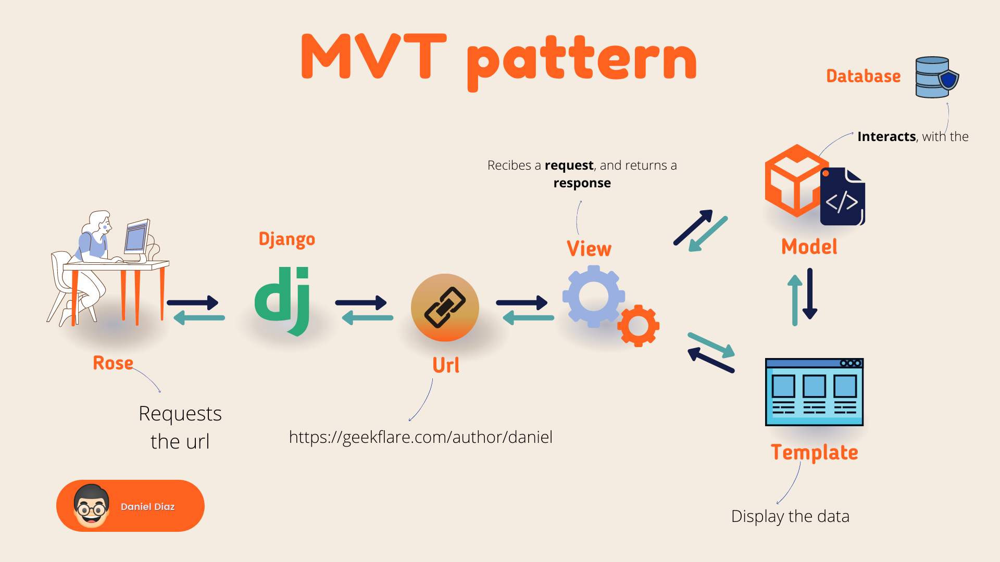

#### Django 安装

可以通过 Python 的包管理工具 `pip` 来完成。

```
pip --version
pip install Django
python -m django --version
```

#### Django Admin 后台

django-admin 是 Django 框架提供的一个命令行工具，它是管理 Django 项目的核心工具。

无论是创建新项目、运行开发服务器，还是执行数据库迁移，django-admin 都是不可或缺的工具。

要查看 django-admin 提供的所有命令，可以运行：

```
django-admin help
```

输出内容类似如下：

```
Type 'django-admin help <subcommand>' for help on a specific subcommand.

Available subcommands:

[django]
    check
    compilemessages
    createcachetable
    dbshell
    diffsettings
    dumpdata
    flush
    inspectdb
    loaddata
    makemessages
    makemigrations
    migrate
    optimizemigration
    runserver
    sendtestemail
    shell
    showmigrations
    sqlflush
    sqlmigrate
    sqlsequencereset
    squashmigrations
    startapp
    startproject
    test
    testserver
```

**创建新项目**

```
ddjango-admin startproject <项目名称> [目标目录]
```

这个命令会在当前目录下创建一个新的 Django 项目，包含基本的项目结构：

- `manage.py`：项目管理脚本
- `项目名称/`：项目主目录
  - `__init__.py`
  - `settings.py`：项目设置文件
  - `urls.py`：URL 路由配置
  - `wsgi.py`：WSGI 应用入口

参数说明:

| 参数          | 作用                                           | 示例                                                         |
| :------------ | :--------------------------------------------- | :----------------------------------------------------------- |
| `<项目名称>`  | 必填，项目名称（会生成同名目录）               | `django-admin startproject mysite`                           |
| `[目标目录]`  | 可选，指定项目存放目录                         | `django-admin startproject mysite /opt/myproject`            |
| `--template`  | 使用自定义项目模板                             | `django-admin startproject --template=my_template.zip mysite` |
| `--extension` | 指定文件扩展名（如 `.py`, `.txt`）             | `django-admin startproject --extension=py,txt mysite`        |
| `--name`      | 指定文件名模式（如 `Dockerfile`, `README.md`） | `django-admin startproject --name=Dockerfile mysite`         |

```
django-admin startproject mysite  # 创建默认项目
django-admin startproject mysite /opt/code  # 指定目录
django-admin startproject --template=https://example.com/my_template.zip mysite  # 使用远程模板
```

**创建新应用**

虽然通常使用 `manage.py` 来创建应用，但也可以通过 django-admin：

```
django-admin startapp <应用名称> [目标目录]
```

这会创建一个新的 Django 应用，包含：

- `migrations/`：数据库迁移文件目录
- `__init__.py`
- `admin.py`：管理后台配置
- `apps.py`：应用配置
- `models.py`：数据模型定义
- `tests.py`：测试代码
- `views.py`：视图函数

| 参数         | 作用                                                | 示例                                                        |
| :----------- | :-------------------------------------------------- | :---------------------------------------------------------- |
| `<应用名称>` | 必填，应用名称（会生成 `models.py`, `views.py` 等） | `django-admin startapp blog`                                |
| `[目标目录]` | 可选，指定应用存放目录                              | `django-admin startapp blog /opt/myapp`                     |
| `--template` | 使用自定义应用模板                                  | `django-admin startapp --template=my_app_template.zip blog` |

```
django-admin startapp blog  # 创建默认应用
django-admin startapp blog /opt/myapp  # 指定目录
django-admin startapp --template=my_template.zip blog  # 使用模板
```

**启动开发服务器**

```
python manage.py runserver [IP:端口]
```

参数说明:

| 参数         | 作用                                                | 示例                                      |
| :----------- | :-------------------------------------------------- | :---------------------------------------- |
| `[IP:端口]`  | 可选，指定监听的 IP 和端口（默认 `127.0.0.1:8000`） | `python manage.py runserver 0.0.0.0:8080` |
| `--noreload` | 禁用自动重载（调试时使用）                          | `python manage.py runserver --noreload`   |
| `--insecure` | 强制静态文件服务（非 DEBUG 模式）                   | `python manage.py runserver --insecure`   |

```
python manage.py runserver  # 默认启动（127.0.0.1:8000）
python manage.py runserver 0.0.0.0:8000  # 允许外部访问
python manage.py runserver 8080  # 仅修改端口
```

**数据库迁移**

Django 使用迁移系统来管理数据库模式变更：

```
python manage.py migrate [应用名] [迁移版本]
```

参数说明:

| 参数             | 作用                                 | 示例                                      |
| :--------------- | :----------------------------------- | :---------------------------------------- |
| `[应用名]`       | 可选，指定要迁移的应用               | `python manage.py migrate blog`           |
| `[迁移版本]`     | 可选，指定迁移版本号                 | `python manage.py migrate blog 0002`      |
| `--fake`         | 标记迁移为已执行（不实际修改数据库） | `python manage.py migrate --fake`         |
| `--fake-initial` | 仅当表已存在时标记为已执行           | `python manage.py migrate --fake-initial` |

```
python manage.py migrate  # 执行所有未应用的迁移
python manage.py migrate blog  # 仅迁移 blog 应用
python manage.py migrate blog 0002  # 迁移到特定版本
```


**检查项目配置**

```
django-admin check
```

这个命令会检查你的 Django 项目是否有配置错误，包括：

- 模型定义是否正确
- URL 配置是否有效
- 模板设置是否正确
- 静态文件配置等

**创建超级用户**

```
django-admin createsuperuser
```

这个命令会引导你创建一个可以访问 Django 管理后台的超级用户。

#### Django 项目结构

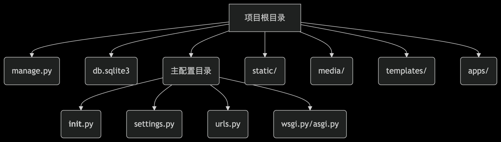

**manage.py**：`manage.py` 是 Django 项目的命令行工具入口，它提供了许多有用的命令：

```
#!/usr/bin/env python
import os
import sys

if __name__ == "__main__":
    os.environ.setdefault("DJANGO_SETTINGS_MODULE", "myproject.settings")
    try:
        from django.core.management import execute_from_command_line
    except ImportError:
        # 处理导入错误
        pass
    execute_from_command_line(sys.argv)
```

常用命令示例：

- `python manage.py runserver` - 启动开发服务器
- `python manage.py migrate` - 应用数据库迁移
- `python manage.py createsuperuser` - 创建管理员账户

**settings.py**：`settings.py` 是 Django 项目的配置文件，包含所有重要的设置。

```
# 关键配置项详解：
DEBUG = True  # 开发时设为True，显示详细错误；生产环境必须改为False
ALLOWED_HOSTS = []  # DEBUG=False时需指定允许访问的域名（如['example.com']）

INSTALLED_APPS = [
    'django.contrib.admin',    # 后台管理
    'django.contrib.auth',     # 认证系统
    'django.contrib.contenttypes',  # 内容类型框架
    'django.contrib.sessions', # 会话管理
    'django.contrib.messages', # 消息框架
    'django.contrib.staticfiles',  # 静态文件管理
    # 可添加自定义应用：'myapp.apps.MyAppConfig'
]

DATABASES = {  # 数据库配置
    'default': {
        'ENGINE': 'django.db.backends.sqlite3',
        'NAME': BASE_DIR / 'db.sqlite3',  # 使用 pathlib 语法
        # MySQL示例：
        # 'ENGINE': 'django.db.backends.mysql',
        # 'NAME': 'mydb',
        # 'USER': 'root',
        # 'PASSWORD': 'password',
    }
}

STATIC_URL = '/static/'  # 静态文件URL前缀
STATICFILES_DIRS = [BASE_DIR / 'static']  # 开发时静态文件搜索目录
MEDIA_URL = '/media/'   # 用户上传文件URL前缀
MEDIA_ROOT = BASE_DIR / 'media'  # 上传文件存储路径
```

**urls.py**：URL 调度中心。

```
from django.contrib import admin
from django.urls import path, include

urlpatterns = [
    path('admin/', admin.site.urls),  # 后台路由
    path('blog/', include('blog.urls')),  # 子应用路由分发
    # path('api/', include('api.urls', namespace='api')),
]
```

- **include()**：实现路由模块化，将不同应用的路由分离到各自的 urls.py。
- **namespace**：用于反向解析 URL 时避免命名冲突。

**wsgi.py & asgi.py**

| 文件          | 用途                                                         |
| :------------ | :----------------------------------------------------------- |
| **`wsgi.py`** | WSGI（Web Server Gateway Interface）配置，用于传统同步服务器（如 Gunicorn、uWSGI）。生产环境通过此文件启动项目。 |
| **`asgi.py`** | ASGI（Asynchronous Server Gateway Interface）配置，支持异步服务器（如 Daphne、Uvicorn）。用于 WebSocket 或异步视图。 |

**静态文件与媒体文件**

- **static/**：存放 CSS、JavaScript、图片等，通过 STATIC_URL 访问。

- **media/**：用户上传的文件（如头像），通过 MEDIA_URL 访问。需配置服务器在开发时提供访问：

  ```
  # urls.py（仅开发环境）
  from django.conf import settings
  from django.conf.urls.static import static
  
  urlpatterns += static(settings.MEDIA_URL, document_root=settings.MEDIA_ROOT)
  ```

**apps/ 目录（推荐结构）**

将应用集中管理，避免散落在项目根目录。需在 settings.py 中配置 Python 路径：

```
import sys
sys.path.insert(0, os.path.join(BASE_DIR, 'apps'))
```

通常具有以下结构：

```
myapp/
│
├── migrations/
│   └── __init__.py
├── __init__.py
├── admin.py
├── apps.py
├── models.py
├── tests.py
└── views.py

```

* **models.py**：定义数据模型，与数据库表对应

```
from django.db import models

class Product(models.Model):
    name = models.CharField(max_length=100)
    price = models.DecimalField(max_digits=10, decimal_places=2)
    description = models.TextField()
    
    def __str__(self):
        return self.name
```

* **views.py**：处理业务逻辑，返回响应。

```
from django.shortcuts import render
from .models import Product

def product_list(request):
    products = Product.objects.all()
    return render(request, 'myapp/product_list.html', {'products': products})
```

* **admin.py**：配置 Django 管理后台。

```
from django.contrib import admin
from .models import Product

@admin.register(Product)
class ProductAdmin(admin.ModelAdmin):
    list_display = ('name', 'price')
```

* **migrations 目录**：存储数据库迁移文件，Django 使用这些文件来跟踪模型变更并同步到数据库。

* **templates 目录**：存放 HTML 模板文件，Django 使用模板语言动态生成页面。

#### Django 模板

Django 的模板系统（Template System）是用于将业务逻辑（Python）与展示层（HTML）分离的核心组件，它允许开发者通过简单的标签和变量动态生成 HTML 页面。

使用 render 来替代之前使用的 HttpResponse,render 还使用了一个字典 context 作为参数。context 字典中元素的键值 **hello** 对应了模板中的变量 **{{ hello }}**。

```
from django.shortcuts import render
 
def runoob(request):
    context          = {}
    context['hello'] = 'Hello World!'
    return render(request, 'runoob.html', context)
```

| 能               | 语法/示例                      | 适用场景           |
| :--------------- | :----------------------------- | :----------------- |
| **变量渲染**     | `{{ variable }}`               | 动态显示数据       |
| **逻辑控制**     | ``, ``        | 条件/循环渲染      |
| **模板继承**     | ``, `` | 避免重复 HTML 结构 |
| **静态文件**     | ``          | 加载 CSS/JS/图片   |
| **自定义过滤器** | `@register.filter`             | 扩展模板功能       |

##### Django 模板标签

**变量模板**：

```
view：｛"HTML变量名" : "views变量名"｝
HTML：｛｛变量名｝｝
```

**列表模板**：

```
<p>{{ views_list }}</p>   # 取出整个列表
<p>{{ views_list.0 }}</p> # 取出列表的第一个元素
```

**字典模板**

```
<p>{{ views_dict }}</p>
<p>{{ views_dict.name }}</p>
```

**过滤器模板**

模板语法：

```
{{ 变量名 | 过滤器：可选参数 }}
```

* **default**：default 为变量提供一个默认值。如果 views 传的变量的布尔值是 false，则使用指定的默认值。
* **length**：返回对象的长度，适用于字符串和列表。字典返回的是键值对的数量，集合返回的是去重后的长度。
* **filesizeformat**：以更易读的方式显示文件的大小（即'13 KB', '4.1 MB', '102 bytes'等）。字典返回的是键值对的数量，集合返回的是去重后的长度。
* **date**：根据给定格式对一个日期变量进行格式化。格式 **Y-m-d H:i:s**返回 **年-月-日 小时:分钟:秒** 的格式时间。

* **truncatechars**：如果字符串包含的字符总个数多于指定的字符数量，那么会被截断掉后面的部分。截断的字符串将以 **...** 结尾。
* **safe**：将字符串标记为安全，不需要转义。要保证 views.py 传过来的数据绝对安全，才能用 safe。和后端 views.py 的 mark_safe 效果相同。Django 会自动对 views.py 传到HTML文件中的标签语法进行转义，令其语义失效。加 safe 过滤器是告诉 Django 该数据是安全的，不必对其进行转义，可以让该数据语义生效。

**If 模板**

基本语法格式如下：

```

   ... display 1

   ... display 2

   ... display 3

```

根据条件判断是否输出。if/else 支持嵌套。 标签接受 and ， or 或者 not 关键字来对多个变量做判断 ，或者对变量取反（ not )

**for 标签**

 允许我们在一个序列上迭代。与 Python 的 for 语句的情形类似，循环语法是 for X in Y ，Y 是要迭代的序列而 X 是在每一个特定的循环中使用的变量名称。每一次循环中，模板系统会渲染在 **** 和 **** 之间的所有内容。**遍历字典**: 可以直接用字典 **.items** 方法，用变量的解包分别获取键和值。可选的  从句：在循环为空的时候执行（即 in 后面的参数布尔值为 False ）。

```

    {{ forloop.counter0 }}

    空空如也～

```

**include 标签**

 标签允许在模板中包含其它的模板的内容。下面这个例子都包含了 nav.html 模板：

```

```

##### Django 模板继承

模板可以用继承的方式来实现复用，减少冗余内容。

网页的头部和尾部内容一般都是一致的，我们就可以通过模板继承来实现复用。

父模板用于放置可重复利用的内容，子模板继承父模板的内容，并放置自己的内容。

**标签 block...endblock:** 父模板中的预留区域，该区域留给子模板填充差异性的内容，不同预留区域名字不能相同。

```
 
预留给子模板的区域，可以设置设置默认内容

```

子模板使用标签 extends 继承父模板：

```
 
```

子模板如果没有设置父模板预留区域的内容，则使用在父模板设置的默认内容，当然也可以都不设置，就为空。

子模板设置父模板预留区域的内容：

```
{ % block 名称 % }
内容 

```

#### Django 模型

Django 对各种数据库提供了很好的支持，包括：PostgreSQL、MySQL、SQLite、Oracle。Django 为这些数据库提供了统一的调用API。 我们可以根据自己业务需求选择不同的数据库。下文以MySql为例。

```
sudo pip3 install pymysql
```

##### Django ORM

Django 模型使用自带的 ORM。对象关系映射（Object Relational Mapping，简称 ORM ）用于实现面向对象编程语言里不同类型系统的数据之间的转换。ORM 在业务逻辑层和数据库层之间充当了桥梁的作用。ORM 是通过使用描述对象和数据库之间的映射的元数据，将程序中的对象自动持久化到数据库中。

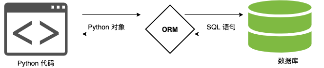

ORM 解析过程:

- 1、ORM 会将 Python 代码转成为 SQL 语句。
- 2、SQL 语句通过 pymysql 传送到数据库服务端。
- 3、在数据库中执行 SQL 语句并将结果返回。

ORM 对应关系表：

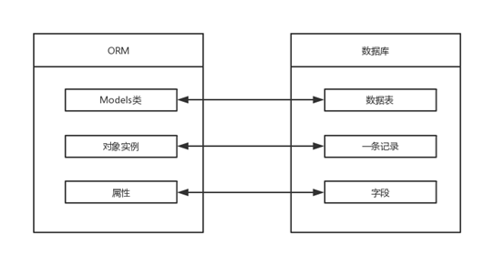

##### 数据库配置

创建 MySQL 数据库( ORM 无法操作到数据库级别，只能操作到数据表)语法：

```
create database 数据库名称 default charset=utf8; # 防止编码问题，指定为 utf8
```

settings.py 文件中找到 DATABASES 配置项，配置信息修改为：

```
DATABASES = { 
    'default': 
    { 
        'ENGINE': 'django.db.backends.mysql',    # 数据库引擎
        'NAME': 'runoob', # 数据库名称
        'HOST': '127.0.0.1', # 数据库地址，本机 ip 地址 127.0.0.1 
        'PORT': 3306, # 端口 
        'USER': 'root',  # 数据库用户名
        'PASSWORD': '123456', # 数据库密码
    }  
}
```

然后告诉 Django 使用 pymysql 模块连接 mysql 数据库：

```
# 在与 settings.py 同级目录下的 __init__.py 中引入模块和进行配置 
import pymysql
pymysql.install_as_MySQLdb()
```

##### 定义模型

Django 规定，如果要使用模型，必须要创建一个 app。我们使用以下命令创建一个 TestModel 的 app:

```
django-admin startapp TestModel
```

修改 models.py 文件，代码如下：

```
# models.py
from django.db import models
 
class Test(models.Model):
    name = models.CharField(max_length=20)
```

以上的类名代表了数据库表名，且继承了models.Model，类里面的字段代表数据表中的字段(name)，数据类型则由CharField（相当于varchar）、DateField（相当于datetime）， max_length 参数限定长度。

接下来在 settings.py 中找到INSTALLED_APPS这一项，如下：

```
INSTALLED_APPS = (
    'django.contrib.admin',
    'django.contrib.auth',
    'django.contrib.contenttypes',
    'django.contrib.sessions',
    'django.contrib.messages',
    'django.contrib.staticfiles',
    'TestModel',               # 添加此项
)
```

在命令行中运行：

```
$ python3 manage.py migrate   # 创建表结构

$ python3 manage.py makemigrations TestModel  # 让 Django 知道我们在我们的模型有一些变更
$ python3 manage.py migrate TestModel   # 创建表结构
```

看到几行 "Creating table…" 的字样，你的数据表就创建好了。

```
Creating tables ...
……
Creating table TestModel_test  #我们自定义的表
……
```

表名组成结构为：应用名_类名（如：TestModel_test）。

**注意：**尽管我们没有在 models 给表设置主键，但是 Django 会自动添加一个 id 作为主键。

##### 操作数据库

虽然Django提供了多种操作方法，但是还是推荐使用ORM交互。

* **创建模型**

在项目中的 models.py 中添加以下类：

class Book**(**models.Model**)**:
  **id** = models.AutoField**(**primary_key=True**)** *# id 会自动创建,可以手动写入*
  title = models.CharField**(**max_length=32**)** *# 书籍名称*
  price = models.DecimalField**(**max_digits=5, decimal_places=2**)** *# 书籍价格*
  publish = models.CharField**(**max_length=32**)** *# 出版社名称*
  pub_date = models.DateField**(****)** *# 出版时间*

然后在命令行执行以下命令：

```
$ python3 manage.py migrate   # 创建表结构

$ python3 manage.py makemigrations app01  # 让 Django 知道我们在我们的模型有一些变更
$ python3 manage.py migrate app01   # 创建表结构
```


#### Django 表单

HTTP协议以"请求－回复"的方式工作。客户发送请求时，可以在请求中附加数据。服务器通过解析请求，就可以获得客户传来的数据，并根据URL来提供特定的服务。

创建表单处理脚本和添加表单组件：

```
from django.http import HttpResponse
from django.shortcuts import render
# 表单
def search_form(request):
    return render(request, 'search_form.html')
 
# 接收请求数据
def search(request):  
    request.encoding='utf-8'
    if 'q' in request.GET and request.GET['q']:
        message = '你搜索的内容为: ' + request.GET['q']
    else:
        message = '你提交了空表单'
    return HttpResponse(message)
```

```
<!DOCTYPE html>
<html>
<head>
<meta charset="utf-8">
<title>菜鸟教程(runoob.com)</title>
</head>
<body>
    <form action="/search/" method="get">
        <input type="text" name="q">
        <input type="submit" value="搜索">
    </form>
</body>
</html>
```

#### Django 视图

一个视图函数，简称视图，是一个简单的 Python 函数，它接受 Web 请求并且返回 Web 响应。响应可以是一个 HTML 页面、一个 404 错误页面、重定向页面、XML 文档、或者一张图片...无论视图本身包含什么逻辑，都要返回响应。代码写在哪里都可以，只要在 Python 目录下面，一般放在项目的 views.py 文件中。每个视图函数都负责返回一个 HttpResponse 对象，对象中包含生成的响应。视图层中有两个重要的对象：请求对象(request)与响应对象(HttpResponse)。

##### Request 对象

每个视图函数的第一个参数是一个 HttpRequest 对象，就像下面这个 runoob() 函数:

```
from django.http import HttpResponse

def runoob(request):
    return HttpResponse("Hello world")
```

HttpRequest对象包含当前请求URL的一些信息：

| **属性**      | **描述**                                                     |
| ------------- | ------------------------------------------------------------ |
| path          | 请求页面的全路径,不包括域名—例如, "/hello/"。                |
| method        | 请求中使用的HTTP方法的字符串表示。全大写表示。例如:if request.method == 'GET':   do_something() elif request.method == 'POST':   do_something_else() |
| GET           | 包含所有HTTP GET参数的类字典对象。参见QueryDict 文档。       |
| POST          | 包含所有HTTP POST参数的类字典对象。参见QueryDict 文档。服务器收到空的POST请求的情况也是有可能发生的。也就是说，表单form通过HTTP POST方法提交请求，但是表单中可以没有数据。因此，不能使用语句if request.POST来判断是否使用HTTP POST方法；应该使用if request.method == "POST" (参见本表的method属性)。注意: POST不包括file-upload信息。参见FILES属性。 |
| REQUEST       | 为了方便，该属性是POST和GET属性的集合体，但是有特殊性，先查找POST属性，然后再查找GET属性。借鉴PHP's $_REQUEST。例如，如果GET = {"name": "john"} 和POST = {"age": '34'},则 REQUEST["name"] 的值是"john", REQUEST["age"]的值是"34".强烈建议使用GET and POST,因为这两个属性更加显式化，写出的代码也更易理解。 |
| COOKIES       | 包含所有cookies的标准Python字典对象。Keys和values都是字符串。 |
| FILES         | 包含所有上传文件的类字典对象。FILES中的每个Key都是<input type="file" name="" />标签中name属性的值. FILES中的每个value 同时也是一个标准Python字典对象，包含下面三个Keys:filename: 上传文件名,用Python字符串表示content-type: 上传文件的Content typecontent: 上传文件的原始内容注意：只有在请求方法是POST，并且请求页面中<form>有enctype="multipart/form-data"属性时FILES才拥有数据。否则，FILES 是一个空字典。 |
| META          | 包含所有可用HTTP头部信息的字典。 例如:CONTENT_LENGTHCONTENT_TYPEQUERY_STRING: 未解析的原始查询字符串REMOTE_ADDR: 客户端IP地址REMOTE_HOST: 客户端主机名SERVER_NAME: 服务器主机名SERVER_PORT: 服务器端口META 中这些头加上前缀 **HTTP_** 为 Key, 冒号(:)后面的为 Value， 例如:HTTP_ACCEPT_ENCODINGHTTP_ACCEPT_LANGUAGEHTTP_HOST: 客户发送的HTTP主机头信息HTTP_REFERER: referring页HTTP_USER_AGENT: 客户端的user-agent字符串HTTP_X_BENDER: X-Bender头信息 |
| user          | 是一个django.contrib.auth.models.User 对象，代表当前登录的用户。如果访问用户当前没有登录，user将被初始化为django.contrib.auth.models.AnonymousUser的实例。你可以通过user的is_authenticated()方法来辨别用户是否登录：`if request.user.is_authenticated():    # Do something for logged-in users. else:    # Do something for anonymous users.`只有激活Django中的AuthenticationMiddleware时该属性才可用 |
| session       | 唯一可读写的属性，代表当前会话的字典对象。只有激活Django中的session支持时该属性才可用。 |
| raw_post_data | 原始HTTP POST数据，未解析过。 高级处理时会有用处。           |

Request对象也有一些有用的方法：

| 方法             | 描述                                                         |
| :--------------- | :----------------------------------------------------------- |
| __getitem__(key) | 返回GET/POST的键值,先取POST,后取GET。如果键不存在抛出 KeyError。 这是我们可以使用字典语法访问HttpRequest对象。 例如,request["foo"]等同于先request.POST["foo"] 然后 request.GET["foo"]的操作。 |
| has_key()        | 检查request.GET or request.POST中是否包含参数指定的Key。     |
| get_full_path()  | 返回包含查询字符串的请求路径。例如， "/music/bands/the_beatles/?print=true" |
| is_secure()      | 如果请求是安全的，返回True，就是说，发出的是HTTPS请求。      |

##### QueryDict对象

在HttpRequest对象中, GET和POST属性是django.http.QueryDict类的实例。

QueryDict类似字典的自定义类，用来处理单键对应多值的情况。

QueryDict实现所有标准的词典方法。还包括一些特有的方法：

| **方法**    | **描述**                                                     |
| :---------- | :----------------------------------------------------------- |
| __getitem__ | 和标准字典的处理有一点不同，就是，如果Key对应多个Value，__getitem__()返回最后一个value。 |
| __setitem__ | 设置参数指定key的value列表(一个Python list)。注意：它只能在一个mutable QueryDict 对象上被调用(就是通过copy()产生的一个QueryDict对象的拷贝). |
| get()       | 如果key对应多个value，get()返回最后一个value。               |
| update()    | 参数可以是QueryDict，也可以是标准字典。和标准字典的update方法不同，该方法添加字典 items，而不是替换它们:`>>> q = QueryDict('a=1') >>> q = q.copy() # to make it mutable >>> q.update({'a': '2'}) >>> q.getlist('a')  ['1', '2'] >>> q['a'] # returns the last ['2']` |
| items()     | 和标准字典的items()方法有一点不同,该方法使用单值逻辑的__getitem__():`>>> q = QueryDict('a=1&a=2&a=3') >>> q.items() [('a', '3')]` |
| values()    | 和标准字典的values()方法有一点不同,该方法使用单值逻辑的__getitem__(): |

此外, QueryDict也有一些方法，如下表：

| **方法**                 | **描述**                                                     |
| :----------------------- | :----------------------------------------------------------- |
| copy()                   | 返回对象的拷贝，内部实现是用Python标准库的copy.deepcopy()。该拷贝是mutable(可更改的) — 就是说，可以更改该拷贝的值。 |
| getlist(key)             | 返回和参数key对应的所有值，作为一个Python list返回。如果key不存在，则返回空list。 It's guaranteed to return a list of some sort.. |
| setlist(key,list_)       | 设置key的值为list_ (unlike __setitem__()).                   |
| appendlist(key,item)     | 添加item到和key关联的内部list.                               |
| setlistdefault(key,list) | 和setdefault有一点不同，它接受list而不是单个value作为参数。  |
| lists()                  | 和items()有一点不同, 它会返回key的所有值，作为一个list, 例如:`>>> q = QueryDict('a=1&a=2&a=3') >>> q.lists() [('a', ['1', '2', '3'])] ` |
| urlencode()              | 返回一个以查询字符串格式进行格式化后的字符串(例如："a=2&b=3&b=5")。 |

##### Response 对象

响应对象主要有三种形式：HttpResponse()、render()、redirect()。

**HttpResponse():** 返回文本，参数为字符串，字符串中写文本内容。如果参数为字符串里含有 html 标签，也可以渲染。

**render():** 返回文本，第一个参数为 request，第二个参数为字符串（页面名称），第三个参数为字典（可选参数，向页面传递的参数：键为页面参数名，值为views参数名）。

**redirect()**：重定向，跳转新页面。参数为字符串，字符串中填写页面路径。一般用于 form 表单提交后，跳转到新页面。

render 和 redirect 是在 HttpResponse 的基础上进行了封装：

- render：底层返回的也是 HttpResponse 对象
- redirect：底层继承的是 HttpResponse 对象

#### Django 路由

路由简单的来说就是根据用户请求的 URL 链接来判断对应的处理程序，并返回处理结果，也就是 URL 与 Django 的视图建立映射关系。Django 路由在 urls.py 配置，urls.py 中的每一条配置对应相应的处理方法。

路由有两种配置：

- path：用于普通路径，不需要自己手动添加正则首位限制符号，底层已经添加。
- re_path：用于正则路径，需要自己手动添加正则首位限制符号。

```
from django.urls import re_path # 用re_path 需要引入 
urlpatterns = [ 
    path('admin/', admin.site.urls), 
    path('index/', views.index), # 普通路径 
    re_path(r'^articles/([0-9]{4})/$', views.articles), # 正则路径 
]
```

##### 路由分发(include)

Django 项目里多个app目录共用一个 urls 容易造成混淆，后期维护也不方便。使用路由分发（include），让每个app目录都单独拥有自己的 urls。

**步骤：**

- 1、在每个 app 目录里都创建一个 urls.py 文件。
- 2、在项目名称目录下的 urls 文件里，统一将路径分发给各个 app 目录。

```
from django.contrib import admin 
from django.urls import path,include # 从 django.urls 引入 include 
urlpatterns = [ 
    path('admin/', admin.site.urls), 
    path("app01/", include("app01.urls")), 
    path("app02/", include("app02.urls")), 
]
```

##### 反向解析

随着功能的增加，路由层的 url 发生变化，就需要去更改对应的视图层和模板层的 url，非常麻烦，不便维护。这时我们可以利用反向解析，当路由层 url 发生改变，在视图层和模板层动态反向解析出更改后的 url，免去修改的操作。反向解析一般用在模板中的超链接及视图中的重定向。

在 urls.py 中给路由起别名，**name="路由别名"**。

```
path("login1/", views.login, name="login")
```

在 views.py 中，从 django.urls 中引入 reverse，利用 **reverse("路由别名")** 反向解析:

```
return redirect(reverse("login"))
```

在模板 templates 中的 HTML 文件中，利用 **** 反向解析。

```
<form action="" method="post"> 
```

#### Django Admin 管理工具

Django 提供了基于 web 的管理工具。Django 自动管理工具是 django.contrib 的一部分。通过命令 **python manage.py createsuperuser** 来创建超级用户，如下所示：


```
# python manage.py createsuperuser
Username (leave blank to use 'root'): admin
Email address: admin@runoob.com
Password:
Password (again):
Superuser created successfully.
[root@solar HelloWorld]#
```

之后输入用户名密码登录，界面如下：

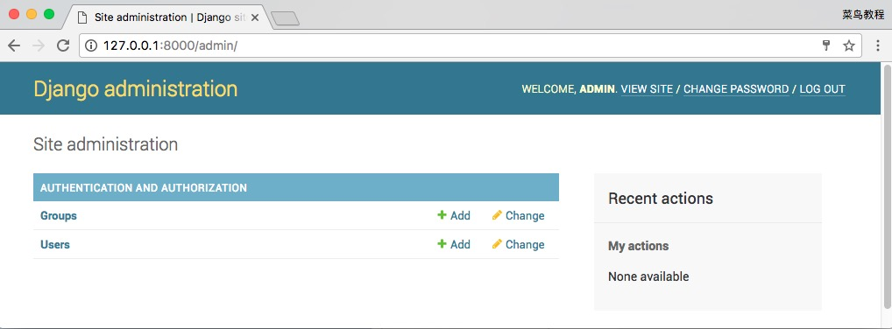

其功能相对较多，不在详细说明。

#### Django 鉴权

Django 用户认证（Auth）组件一般用在用户的登录注册上，用于判断当前的用户是否合法，并跳转到登陆成功或失败页面。Django 用户认证（Auth）组件需要导入 auth 模块:

```
# 认证模块
from django.contrib import auth

# 对应数据库
from django.contrib.auth.models import User
```

返回值是用户对象。

创建用户对象的三种方法：

- **create()**：创建一个普通用户，密码是明文的。
- **create_user()**：创建一个普通用户，密码是密文的。
- **create_superuser()**：创建一个超级用户，密码是密文的，要多传一个邮箱 email 参数。

**参数：**

- username: 用户名。
- password：密码。
- email：邮箱 (create_superuser 方法要多加一个 email)。

验证用户的用户名和密码使用 authenticate() 方法，从需要 auth_user 表中过滤出用户对象。

使用前要导入：

```
from django.contrib import auth
```

参数：

- username：用户名
- password：密码

**返回值：**如果验证成功，就返回用户对象，反之，返回 None。

给验证成功的用户加 session，将 request.user 赋值为用户对象。

登陆使用 login() 方法。

使用前要导入：

```
from django.contrib import auth
```

参数：

- request：用户对象

返回值：None

注销用户使用 logout() 方法，需要清空 session 信息，将 request.user 赋值为匿名用户。

使用前要导入：

```
from django.contrib import auth
```

参数：

- request：用户对象

返回值：None

设置装饰器，给需要登录成功后才能访问的页面统一加装饰器。

使用前要导入：

```
from django.contrib.auth.decorators import login_required
```

#### Django Cookies 与 Sessions

Cookie 是存储在客户端计算机上的文本文件，并保留了各种跟踪信息。

识别返回用户包括三个步骤：

- 服务器脚本向浏览器发送一组 Cookie。例如：姓名、年龄或识别号码等。
- 浏览器将这些信息存储在本地计算机上，以备将来使用。
- 当下一次浏览器向 Web 服务器发送任何请求时，浏览器会把这些 Cookie 信息发送到服务器，服务器将使用这些信息来识别用户。

HTTP 是一种"无状态"协议，这意味着每次客户端检索网页时，客户端打开一个单独的连接到 Web 服务器，服务器会自动不保留之前客户端请求的任何记录。

但是仍然有以下三种方式来维持 Web 客户端和 Web 服务器之间的 session 会话：

##### Cookies

一个 Web 服务器可以分配一个唯一的 session 会话 ID 作为每个 Web 客户端的 cookie，对于客户端的后续请求可以使用接收到的 cookie 来识别。

在Web开发中，使用 session 来完成会话跟踪，session 底层依赖 Cookie 技术。

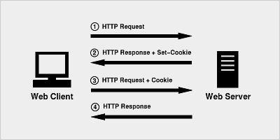


一个 Web 服务器可以分配一个唯一的 session 会话 ID 作为每个 Web 客户端的 cookie，对于客户端的后续请求可以使用接收到的 cookie 来识别。

在Web开发中，使用 session 来完成会话跟踪，session 底层依赖 Cookie 技术。


设置 cookie:

```
rep.set_cookie(key,value,...) 
rep.set_signed_cookie(key,value,salt='加密盐',...)
```

获取 cookie:

```
request.COOKIES.get(key)
```

删除 cookie:

```
rep =HttpResponse || render || redirect 
rep.delete_cookie(key)
```

##### Session

服务器在运行时可以为每一个用户的浏览器创建一个其独享的 session 对象，由于 session 为用户浏览器独享，所以用户在访问服务器的 web 资源时，可以把各自的数据放在各自的 session 中，当用户再去访问该服务器中的其它 web 资源时，其它 web 资源再从用户各自的 session 中取出数据为用户服务。

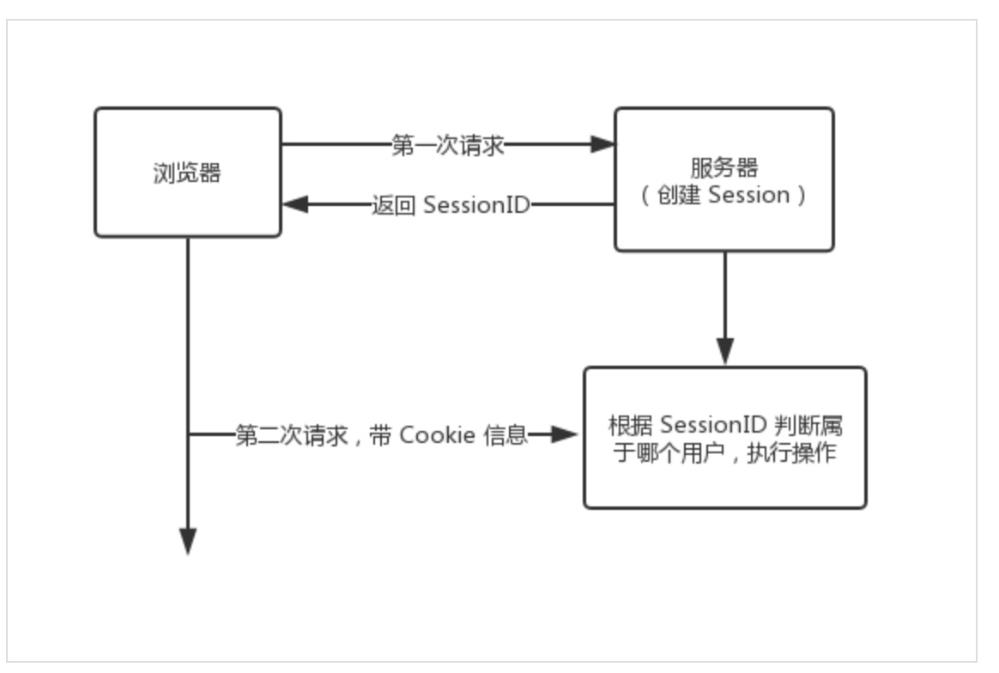

- a. 浏览器第一次请求获取登录页面 login。

- b. 浏览器输入账号密码第二次请求，若输入正确，服务器响应浏览器一个 index 页面和一个键为 sessionid，值为随机字符串的 cookie，即 set_cookie ("sessionid",随机字符串)。

- c. 服务器内部在 django.session 表中记录一条数据。

  django.session 表中有三个字段。

  - session_key：存的是随机字符串，即响应给浏览器的 cookie 的 sessionid 键对应的值。
  - session_data：存的是用户的信息，即多个 request.session["key"]=value，且是密文。
  - expire_date：存的是该条记录的过期时间（默认14天）

- d. 浏览器第三次请求其他资源时，携带 cookie :{sessionid:随机字符串}，服务器从 django.session 表中根据该随机字符串取出该用户的数据，供其使用（即保存状态）。

**注意:** django.session 表中保存的是浏览器的信息，而不是每一个用户的信息。 因此， 同一浏览器多个用户请求只保存一条记录（后面覆盖前面）,多个浏览器请求才保存多条记录。

cookie 弥补了 http 无状态的不足，让服务器知道来的人是"谁"，但是 cookie 以文本的形式保存在浏览器端，安全性较差，且最大只支持 4096 字节，所以只通过 cookie 识别不同的用户，然后，在对应的 session 里保存私密的信息以及超过 4096 字节的文本。

session 设置：

```
request.session["key"] = value
```

执行步骤：

- a. 生成随机字符串
- b. 把随机字符串和设置的键值对保存到 django_session 表的 session_key 和 session_data 里
- c. 设置 **cookie：set_cookie("sessionid",随机字符串)** 响应给浏览器

session 获取：

```
request.session.get('key')
```

执行步骤：

- a. 从 cookie 中获取 sessionid 键的值，即随机字符串。
- b. 根据随机字符串从 django_session 表过滤出记录。
- c. 取出 session_data 字段的数据。

session 删除，删除整条记录（包括 session_key、session_data、expire_date 三个字段）：

```
request.session.flush()
```

删除 session_data 里的其中一组键值对：

```
del request.session["key"]
```

执行步骤：

- a. 从 cookie 中获取 sessionid 键的值，即随机字符串
- b. 根据随机字符串从 django_session 表过滤出记录
- c. 删除过滤出来的记录

#### Django 中间件

Django 中间件是修改 Django request 或者 response 对象的钩子，可以理解为是介于 HttpRequest 与 HttpResponse 处理之间的一道处理过程。

浏览器从请求到响应的过程中，Django 需要通过很多中间件来处理，可以看如下图所示：

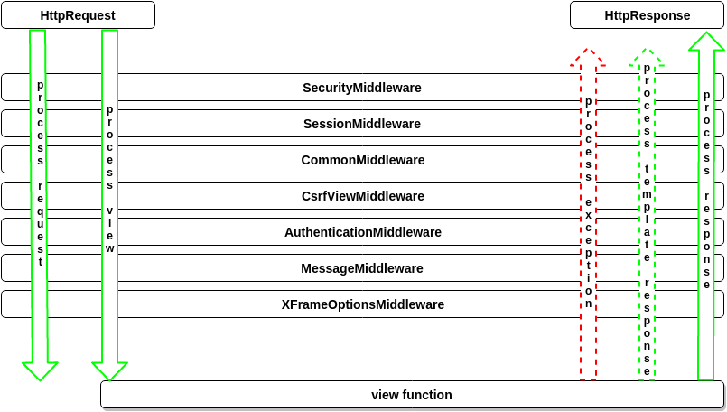

Django 中间件作用：

- 修改请求，即传送到 view 中的 HttpRequest 对象。
- 修改响应，即 view 返回的 HttpResponse 对象。


中间件可以定义四个方法，分别是：

process_request(self,request)
process_view(self, request, view_func, view_args, view_kwargs)
process_exception(self, request, exception)
process_response(self, request, response)

##### process_request 方法

process_request 方法有一个参数 request，这个 request 和视图函数中的 request 是一样的。

process_request 方法的返回值可以是 None 也可以是 HttpResponse 对象。

- 返回值是 None 的话，按正常流程继续走，交给下一个中间件处理。
- 返回值是 HttpResponse 对象，Django 将不执行后续视图函数之前执行的方法以及视图函数，直接以该中间件为起点，倒序执行中间件，且执行的是视图函数之后执行的方法。

process_request 方法是在视图函数之前执行的。

当配置多个中间件时，会按照 MIDDLEWARE中 的注册顺序，也就是列表的索引值，顺序执行。

不同中间件之间传递的 request 参数都是同一个请求对象。

**from** django.utils.deprecation **import** MiddlewareMixin

**from** django.shortcuts **import** render, HttpResponse

**class** MD1(MiddlewareMixin):
  **def** process_request(self, request):
    **print**("md1  process_request 方法。", id(request)) #在视图之前执行

##### process_response

process_response 方法有两个参数，一个是 request，一个是 response，request 是请求对象，response 是视图函数返回的 HttpResponse 对象，该方法必须要有返回值，且必须是response。

process_response 方法是在视图函数之后执行的。

当配置多个中间件时，会按照 MIDDLEWARE 中的注册顺序，也就是列表的索引值，倒序执行。

**class** MD1(MiddlewareMixin):
  **def** process_request(self, request):
    **print**("md1  process_request 方法。", id(request)) #在视图之前执行


  **def** process_response(self,request, response): :#基于请求响应
    **print**("md1  process_response 方法！", id(request)) #在视图之后
    **return** response

从下图看，正常的情况下按照绿色的路线进行执行,假设**中间件1**有返回值，则按照红色的路线走，直接执行该类下的 process_response 方法返回，后面的其他中间件就不会执行。

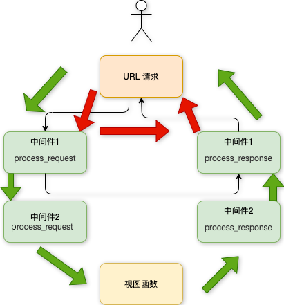

##### process_view

process_view 方法格式如下：

```
process_view(request, view_func, view_args, view_kwargs)
```

process_view 方法有四个参数：

- request 是 HttpRequest 对象。
- view_func 是 Django 即将使用的视图函数。
- view_args 是将传递给视图的位置参数的列表。
- view_kwargs 是将传递给视图的关键字参数的字典。

view_args 和 view_kwargs 都不包含第一个视图参数（request）。

process_view 方法是在视图函数之前，process_request 方法之后执行的。

返回值可以是 None、view_func(request) 或 HttpResponse 对象。

- 返回值是 None 的话，按正常流程继续走，交给下一个中间件处理。

- 返回值是 HttpResponse 对象，Django 将不执行后续视图函数之前执行的方法以及视图函数，直接以该中间件为起点，倒序执行中间件，且执行的是视图函数之后执行的方法。

- c.返回值是 view_func(request)，Django 将不执行后续视图函数之前执行的方法，提前执行视图函数，然后再倒序执行视图函数之后执行的方法。

- 当最后一个中间件的 process_request 到达路由关系映射之后，返回到第一个中间件 process_view，然后依次往下，到达视图函数。

  **class** MD1(MiddlewareMixin):
    **def** process_request(self, request):
      **print**("md1  process_request 方法。", id(request)) #在视图之前执行

  
    **def** process_response(self,request, response): :#基于请求响应
      **print**("md1  process_response 方法！", id(request)) #在视图之后
      **return** response


    **def** process_view(self,request, view_func, view_args, view_kwargs):
      **print**("md1  process_view 方法！") #在视图之前执行 顺序执行
      \#return view_func(request)

##### process_exception

process_exception 方法如下：

```
process_exception(request, exception)
```

参数说明：

- request 是 HttpRequest 对象。
- exception 是视图函数异常产生的 Exception 对象。

process_exception 方法只有在视图函数中出现异常了才执行，按照 settings 的注册倒序执行。

在视图函数之后，在 process_response 方法之前执行。

process_exception 方法的返回值可以是一个 None 也可以是一个 HttpResponse 对象。

返回值是 None，页面会报 500 状态码错误，视图函数不会执行。

process_exception 方法倒序执行，然后再倒序执行 process_response 方法。

返回值是 HttpResponse 对象，页面不会报错，返回状态码为 200。

视图函数不执行，该中间件后续的 process_exception 方法也不执行，直接从最后一个中间件的 process_response 方法倒序开始执行。

若是 process_view 方法返回视图函数，提前执行了视图函数，且视图函数报错，则无论 process_exception 方法的返回值是什么，页面都会报错， 且视图函数和 process_exception 方法都不执行。

直接从最后一个中间件的 process_response 方法开始倒序执行：

**class** MD1(MiddlewareMixin):
  **def** process_request(self, request):
    **print**("md1  process_request 方法。", id(request)) #在视图之前执行

  **def** process_response(self,request, response): :#基于请求响应
    **print**("md1  process_response 方法！", id(request)) #在视图之后
    **return** response

  **def** process_view(self,request, view_func, view_args, view_kwargs):
    **print**("md1  process_view 方法！") #在视图之前执行 顺序执行
    \#return view_func(request)


  **def** process_exception(self, request, exception):#引发错误 才会触发这个方法
    **print**("md1  process_exception 方法！")
    \# return HttpResponse(exception) #返回错误信息


### FastAPI

FastAPI 是一个用于构建 API 的现代、快速（高性能）的 web 框架，专为在 Python 中构建 RESTful API 而设计。FastAPI 使用 Python 3.8+ 并基于标准的 Python 类型提示。FastAPI 建立在 Starlette 和 Pydantic 之上，利用类型提示进行数据处理，并自动生成API文档。FastAPI 于 2018 年 12 月 5 日发布第一版本，以其易用性、速度和稳健性在开发者中间迅速流行起来。FastAPI 支持异步编程，可在生产环境中运行。

#### FastAPI 安装

FastAPI 依赖 Python 3.8 及更高版本。安装 FastAPI 很简单，这里我们使用 **pip** 命令来安装。

```
# 检查 Python 版本
python --version
pip install "fastapi[all]"
# fastapi - FastAPI 框架
# uvicorn[standard] - ASGI 服务器
# python-multipart - 表单和文件上传支持
# jinja2 - 模板引擎
# python-jose - JWT 令牌支持
# passlib - 密码哈希
# bcrypt - 密码加密
# python-dotenv - 环境变量支持
```

#### FastAPI 路由

在 FastAPI 中，基本路由是定义 API 端点的关键。每个路由都映射到应用程序中的一个函数，用于处理特定的 HTTP 请求，并返回相应的响应。

```
from fastapi import FastAPI

app = FastAPI()

@app.get("/")
def read_root():
    return {"Hello": "World"}

@app.get("/items/{item_id}")
def read_item(item_id: int, q: str = None):
    return {"item_id": item_id, "q": q}
```

**代码说明：**

- `FastAPI()`：创建 FastAPI 应用实例。
- `@app.get("/")`：使用 `@app.get` 装饰器创建一个处理根路径的路由。
- `def read_root()`：路由处理函数，返回一个包含 {"Hello": "World"} 的字典。

- `@app.get("/items/{item_id}")`：定义了一个路由路径，其中 `{item_id}` 是路径参数，对应于函数参数 `item_id`。
- `def read_item(item_id: int, q: str = None)`：路由处理函数接受一个整数类型的路径参数 `item_id` 和一个可选的字符串类型查询参数 `q`。

使用 Uvicorn 启动应用：

```
uvicorn main:app --reload
```

FastAPI 自动生成的交互式 API 文档将包括定义的路由信息、路径参数、查询参数等。访问文档地址 **http://127.0.0.1:8000/docs** 查看详细的文档和测试界面：

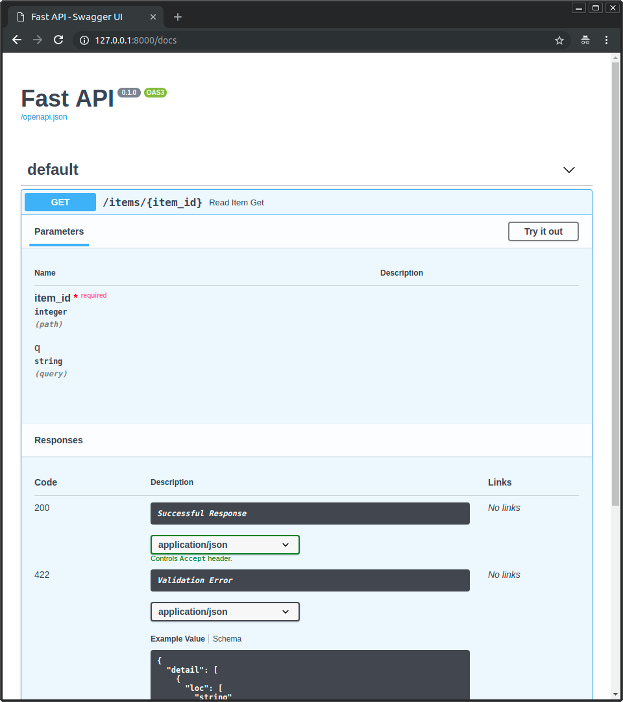

#### FastAPI 请求与响应

在 FastAPI 中，请求（Request）和响应（Response）是与客户端交互的核心。FastAPI 提供了强大的工具来解析请求数据，并根据需要生成规范的响应。

##### 请求

**查询参数**

以下实例中我们定义了一个 **/items/** 路由，接受两个查询参数 **skip** 和 **limit**，它们的类型均为整数，默认值分别为 **0** 和 **10**。

```
from fastapi import FastAPI

app = FastAPI()

@app.get("/items/")
def read_item(skip: int = 0, limit: int = 10):
    return {"skip": skip, "limit": limit}
```

**路径参数**

我们可以把参数设置在路径上，这样 URL 看起来更美观一些。以下实例我们定义了一个带有路径参数 **item_id** 和查询参数 **q** 的路由。

```
from fastapi import FastAPI

app = FastAPI()

@app.get("/items/{item_id}")
def read_item(item_id: int, q: str = None):
    return {"item_id": item_id, "q": q}
```

**请求体**

接下来我们创建了一个 **/items/** 路由，使用 **@app.post** 装饰器表示这是一个处理 **POST** 请求的路由。

```
from pydantic import BaseModel
from fastapi import FastAPI

app = FastAPI()
class Item(BaseModel):
    name: str
    description: str = None
    price: float
    tax: float = None

@app.post("/items/")
def create_item(item: Item):
    return item
```

使用 Pydantic 模型 Item 定义了一个请求体，包含多个字段

##### 响应

**返回 JSON 数据**

路由处理函数返回一个字典，该字典将被 FastAPI 自动转换为 JSON 格式，并作为响应发送给客户端：

```
from fastapi import FastAPI

app = FastAPI()

@app.get("/items/")
def read_item(skip: int = 0, limit: int = 10):
    return {"skip": skip, "limit": limit}
```

**返回 Pydantic 模型**

路由处理函数返回一个 Pydantic 模型实例，FastAPI 将自动将其转换为 JSON 格式，并作为响应发送给客户端：

```
from pydantic import BaseModel
from fastapi import FastAPI

app = FastAPI()
class Item(BaseModel):
    name: str
    description: str = None
    price: float
    tax: float = None

@app.post("/items/")
def create_item(item: Item):
    return item
```

**请求头和 Cookie**

使用 Header 和 Cookie 类型注解获取请求头和 Cookie 数据。

```
from fastapi import Header, Cookie
from fastapi import FastAPI

app = FastAPI()

@app.get("/items/")
def read_item(user_agent: str = Header(None), session_token: str = Cookie(None)):
    return {"User-Agent": user_agent, "Session-Token": session_token}
```

**重定向和状态码**

使用 **RedirectResponse** 实现重定向，将客户端重定向到 **/items/** 路由。

```
from fastapi import Header, Cookie
from fastapi import FastAPI
from fastapi.responses import RedirectResponse

app = FastAPI()

@app.get("/items/")
def read_item(user_agent: str = Header(None), session_token: str = Cookie(None)):
    return {"User-Agent": user_agent, "Session-Token": session_token}

@app.get("/redirect")
def redirect():
    return RedirectResponse(url="/items/")
```

**自定义响应头**

使用 **JSONResponse** 自定义响应头:

```
from fastapi import FastAPI
from fastapi.responses import JSONResponse

app = FastAPI()

@app.get("/items/{item_id}")
def read_item(item_id: int):
    content = {"item_id": item_id}
    headers = {"X-Custom-Header": "custom-header-value"}
    return JSONResponse(content=content, headers=headers)
```

#### FastAPI Pydantic 模型

Pydantic 是一个用于数据验证和序列化的 Python 模型库。它在 FastAPI 中广泛使用，用于定义请求体、响应体和其他数据模型，提供了强大的类型检查和自动文档生成功能。以下是关于 Pydantic 模型的详细介绍：

**定义 Pydantic 模型**

使用 Pydantic 定义一个模型非常简单，只需创建一个继承自 pydantic.BaseModel 的类，并在其中定义字段。字段的类型可以是任何有效的 Python 类型，也可以是 Pydantic 内置的类型。

```
from pydantic import BaseModel

class Item(BaseModel):
    name: str
    description: str = None
    price: float
    tax: float = None
```

以上代码中中，我们定义了一个名为 Item 的 Pydantic 模型，包含了四个字段：name、description、price 和 tax，name 和 price 是必需的字段，而 description 和 tax 是可选的字段，其默认值为 None。

**使用 Pydantic 模型**

* **请求体验证**：在 FastAPI 中，可以将 Pydantic 模型用作请求体（Request Body），以自动验证和解析客户端发送的数据。

```
from fastapi import FastAPI
from pydantic import BaseModel

app = FastAPI()

class Item(BaseModel):
    name: str
    description: str = None
    price: float
    tax: float = None

@app.post("/items/")
def create_item(item: Item):
    return item
```

以上代码中中，create_item 路由处理函数接受一个名为 item 的参数，其类型是 Item 模型。FastAPI 将自动验证传入的 JSON 数据是否符合模型的定义，并将其转换为 Item 类型的实例。

* **查询参数验证**：Pydantic 模型还可以用于验证查询参数、路径参数等。

```
from fastapi import FastAPI, Query
from pydantic import BaseModel

app = FastAPI()

class Item(BaseModel):
    name: str
    description: str = None
    price: float
    tax: float = None

@app.get("/items/")
def read_item(item: Item, q: str = Query(..., max_length=10)):
    return {"item": item, "q": q}
```

以上代码中，read_item 路由处理函数接受一个 Item 模型的实例作为查询参数，以及一个名为 q 的字符串查询参数。通过使用 Query 函数，我们还可以为查询参数指定更多的验证规则，如最大长度限制。

**自动文档生成**

使用 Pydantic 模型的一个重要优势是，它能够自动为 FastAPI 生成交互式 API 文档。文档会包括模型的字段、类型、验证规则等信息，让开发者和 API 使用者能够清晰地了解如何正确使用 API。打开 **http://127.0.0.1:8000/docs**，API 文档显示如下：

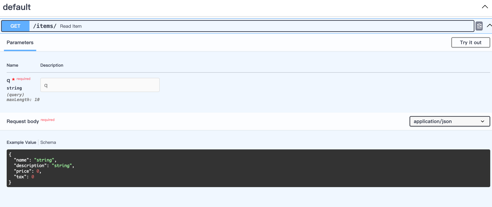

**数据转换和序列化**

Pydantic 模型不仅提供了验证功能，还可以用于将数据转换为特定类型（例如 JSON）或反向序列化。在 FastAPI 中，这种能力是自动的，你无需手动处理。通过使用 Pydantic 模型，你可以更轻松地定义和验证数据，使得代码更清晰、更健壮，并通过自动生成的文档提供更好的 API 交互体验。接下来我们可以打开 **http://127.0.0.1:8000/docs** 来进行 POST 测试：填写请求参数：

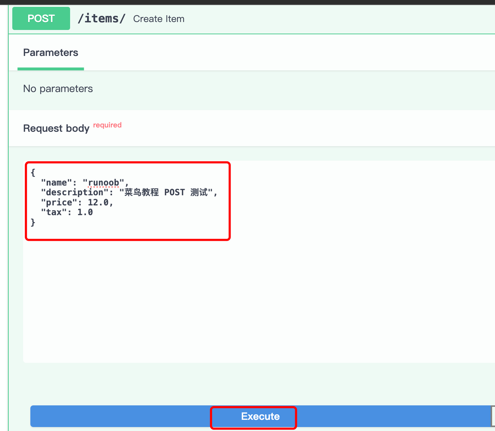

返回结果如下：

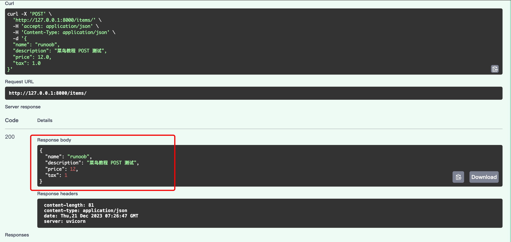

#### FastAPI 路径操作依赖项

FastAPI 提供了简单易用，但功能强大的依赖注入系统，这个依赖系统设计的简单易用，可以让开发人员轻松地把组件集成至 FastAPI。FastAPI 提供了路径操作依赖项（Path Operation Dependencies）的机制，允许你在路由处理函数执行之前或之后运行一些额外的逻辑。依赖项就是一个函数，且可以使用与路径操作函数相同的参数。路径操作依赖项提供了一种灵活的方式来组织代码、验证输入、进行身份验证等。

依赖项是在路由操作函数执行前或后运行的可复用的函数或对象。它们被用于执行一些通用的逻辑，如验证、身份验证、数据库连接等。在 FastAPI 中，依赖项通常用于两个方面：

- **预处理（Before）依赖项：** 在路由操作函数执行前运行，用于预处理输入数据，验证请求等。
- **后处理（After）依赖项：** 在路由操作函数执行后运行，用于执行一些后处理逻辑，如日志记录、清理等。

**依赖注入**：依赖注入是将依赖项注入到路由操作函数中的过程。在 FastAPI 中，通过在路由操作函数参数中声明依赖项来实现依赖注入。FastAPI 将负责解析依赖项的参数，并确保在执行路由操作函数之前将其传递给函数。

**依赖项的使用**：

* **定义依赖项**

```
from fastapi import Depends, FastAPI

app = FastAPI()

# 依赖项函数
def common_parameters(q: str = None, skip: int = 0, limit: int = 100):
    return {"q": q, "skip": skip, "limit": limit}
```

在这个例子中，common_parameters 是一个依赖项函数，用于预处理查询参数。在路由中使用依赖项：

```
from fastapi import Depends

# 路由操作函数
@app.get("/items/")
async def read_items(commons: dict = Depends(common_parameters)):
    return commons
```

在这个例子中，read_items 路由操作函数中的参数 commons 使用了 Depends(common_parameters)，表示 common_parameters 是一个依赖项。FastAPI 将在执行路由操作函数之前运行 common_parameters 函数，并将其返回的结果传递给 read_items 函数。

**依赖项的用途**：

* **预处理（Before）**：以下实例中，**common_parameters** 是一个依赖项函数，它接受查询参数 **q、skip 和 limit**，并返回一个包含这些参数的字典。在路由操作函数 **read_items** 中，通过传入 Depends(common_parameters)，我们使用了这个依赖项函数，实现了在路由执行前预处理输入数据的功能。

```
from fastapi import Depends, FastAPI, HTTPException

app = FastAPI()

# 依赖项函数
def common_parameters(q: str = None, skip: int = 0, limit: int = 100):
    return {"q": q, "skip": skip, "limit": limit}

# 路由操作函数
@app.get("/items/")
async def read_items(commons: dict = Depends(common_parameters)):
    return commons
```

* **后处理（After）**：以下例子中，**after_request** 是一个后处理函数，用于在路由执行后执行一些逻辑。在路由操作函数 read_items_after 中，通过传入 Depends(after_request)，我们使用了这个后处理依赖项，实现了在路由执行后进行额外操作的功能。

```
from fastapi import Depends, FastAPI, HTTPException

app = FastAPI()

# 依赖项函数
def common_parameters(q: str = None, skip: int = 0, limit: int = 100):
    return {"q": q, "skip": skip, "limit": limit}

# 路由操作函数
@app.get("/items/")
async def read_items(commons: dict = Depends(common_parameters)):
    return commons

# 后处理函数
async def after_request():
    # 这里可以执行一些后处理逻辑，比如记录日志
    pass

# 后处理依赖项
@app.get("/items/", response_model=dict)
async def read_items_after(request: dict = Depends(after_request)):
    return {"message": "Items returned successfully"}
```

**多个依赖项的组合**

以下例子中，**common_parameters** 和 **verify_token** 是两个不同的依赖项函数，**verify_token** 依赖于 **common_parameters**，这种组合依赖项的方式允许我们在路由执行前先验证一些参数，然后在进行身份验证。

```
from fastapi import Depends, FastAPI, HTTPException

app = FastAPI()

# 依赖项函数1
def common_parameters(q: str = None, skip: int = 0, limit: int = 100):
    return {"q": q, "skip": skip, "limit": limit}

# 依赖项函数2
def verify_token(token: str = Depends(common_parameters)):
    if token is None:
        raise HTTPException(status_code=400, detail="Token required")
    return token

# 路由操作函数
@app.get("/items/")
async def read_items(token: dict = Depends(verify_token)):
    return token
```

**异步依赖项**

依赖项函数和后处理函数可以是异步的，允许在它们内部执行异步操作。以下例子中，**get_token** 是一个异步的依赖项函数，模拟了一个异步操作。在路由操作函数 read_items 中，我们使用了这个异步依赖项函数。

```
from fastapi import Depends, FastAPI, HTTPException
from typing import Optional
import asyncio

app = FastAPI()

# 异步依赖项函数
async def get_token():
    # 模拟异步操作
    await asyncio.sleep(2)
    return "fake-token"

# 异步路由操作函数
@app.get("/items/")
async def read_items(token: Optional[str] = Depends(get_token)):
    return {"token": token}
```

#### FastAPI 表单数据

在 FastAPI 中，接收表单数据是一种常见的操作，通常用于处理用户通过 HTML 表单提交的数据。FastAPI 提供了 Form 类型，可以用于声明和验证表单数据。

**声明表单数据模型**

接下来我们设计一个接收一个登陆的表单数据，要使用表单，需预先安装 python-multipart：

```
pip install python-multipart。
```

代码如下：

```
from fastapi import FastAPI, Form

app = FastAPI()


@app.post("/login/")
async def login(username: str = Form(), password: str = Form()):
    return {"username": username}
```

接下来我们可以进入 API 文档 **http://127.0.0.1:8000/docs** 进行测验：

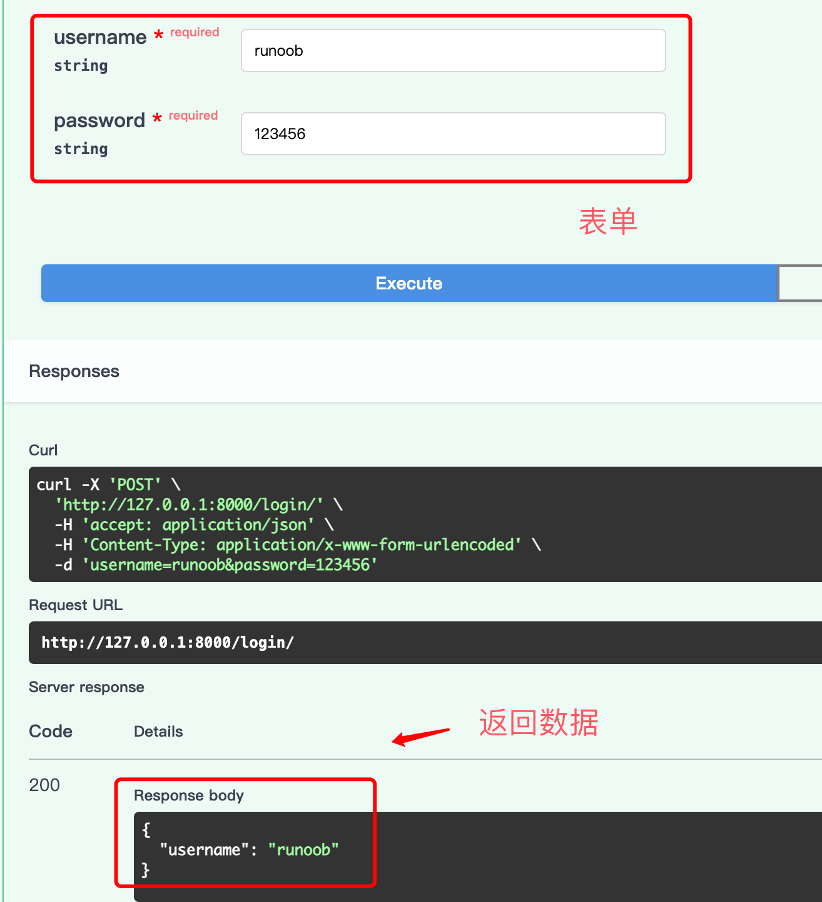

使用 Pydantic 模型来声明表单数据模型。在模型中，使用 Field 类型声明每个表单字段，并添加必要的验证规则。

```
from pydantic import BaseModel, Field

class Item(BaseModel):
    name: str = Field(..., title="Item Name", max_length=100)
    description: str = Field(None, title="Item Description", max_length=255)
    price: float = Field(..., title="Item Price", gt=0)
```

以上例子中，Item 是一个 Pydantic 模型，用于表示表单数据。模型中的字段 name、description 和 price 分别对应表单中的不同输入项，并设置了相应的验证规则。除了可以在 API 文档中测验，另外我们也可以自己创建 html 来测试：

```
<form action="http://localhost:8000/items/" method="post">
    <label for="name">Name:</label>
    <input type="text" id="name" name="name" required>
    <br>
    <label for="description">Description:</label>
    <textarea id="description" name="description"></textarea>
    <br>
    <label for="price">Price:</label>
    <input type="number" id="price" name="price" required min="0">
    <br>
    <button type="submit">Submit</button>
</form>
```

**在路由中接收表单数据**

在路由操作函数中，可以使用 Form 类型来接收表单数据。Form 类型的参数可以与 Pydantic 模型的字段一一对应，以实现表单数据的验证和转换。

```
from fastapi import FastAPI, Form

app = FastAPI()

# 路由操作函数
@app.post("/items/")
async def create_item(
    name: str = Form(...),
    description: str = Form(None),
    price: float = Form(..., gt=0),
):
    return {"name": name, "description": description, "price": price}
```

以上例子中，create_item 路由操作函数接收了三个表单字段：name、description 和 price，这些字段与 Item 模型的相应字段一致，FastAPI 将自动根据验证规则验证表单数据。接下来我们可以进入 API 文档 **http://127.0.0.1:8000/docs** 进行测验：

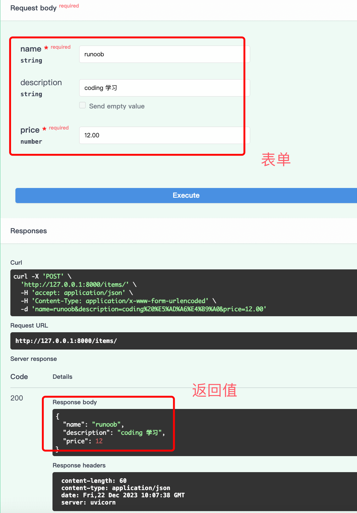

**表单数据的验证和文档生成**

使用 Pydantic 模型和 Form 类型，表单数据的验证和文档生成都是自动的。FastAPI 将根据模型中的字段信息生成交互式 API 文档，并根据验证规则进行数据验证。API 文档地址 **http://127.0.0.1:8000/docs** 。

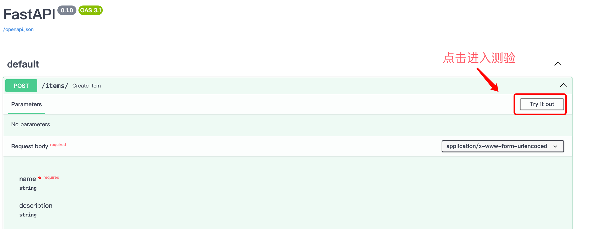

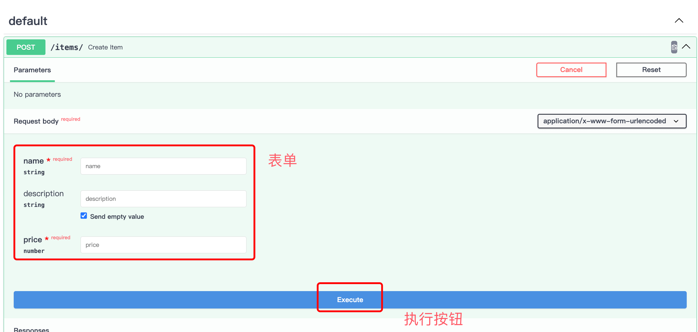

**处理文件上传**

如果表单包含文件上传，可以使用 UploadFile 类型处理。以下是一个处理文件上传的实例：

```
from fastapi import FastAPI, File, UploadFile

app = FastAPI()

# 路由操作函数
@app.post("/files/")
async def create_file(file: UploadFile = File(...)):
    return {"filename": file.filename}
```

在这个例子中，create_file 路由操作函数接收了一个 UploadFile 类型的文件参数。FastAPI 将负责处理文件上传，并将文件的相关信息包装在 UploadFile 对象中，可以轻松地获取文件名、内容类型等信息。通过上述方式，FastAPI 提供了一种简单而强大的方法来接收和处理表单数据，同时保持了代码的清晰性和可维护性。

#### FastAPI 交互式API文档

FastAPI 提供了内置的交互式 API 文档，使开发者能够轻松了解和测试 API 的各个端点。

这个文档是自动生成的，基于 OpenAPI 规范，支持 Swagger UI 和 ReDoc 两种交互式界面。

通过 FastAPI 的交互式 API 文档，开发者能够更轻松地理解和使用 API，提高开发效率

在运行 FastAPI 应用时，Uvicorn 同时启动了交互式 API 文档服务。

默认情况下，你可以通过访问 **http://127.0.0.1:8000/docs** 来打开 Swagger UI 风格的文档：


Swagger UI 提供了一个直观的用户界面，用于浏览 API 的各个端点、查看请求和响应的结构，并支持直接在文档中进行 API 请求测试。通过 Swagger UI，你可以轻松理解每个路由操作的输入参数、输出格式和请求示例。

或者通过 **http://127.0.0.1:8000/redoc** 来打开 ReDoc 风格的文档。

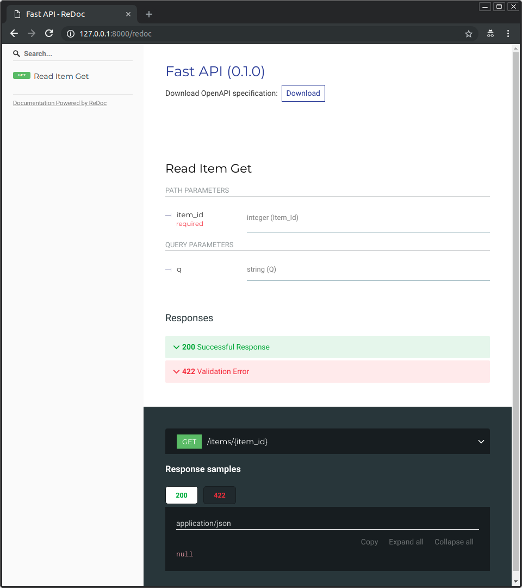

ReDoc 是另一种交互式文档界面，具有清晰简洁的外观。它使得开发者能够以可读性强的方式查看 API 的描述、请求和响应。与 Swagger UI 不同，ReDoc 的设计强调文档的可视化和用户体验。


### AIOHTTP

aiohttp 是一个基于异步 I/O 的 Web 框架，专注于提供高性能、低开销的异步 Web 服务。它允许我们同时处理大量并发请求，而不会阻塞程序执行。aiohttp 使用 Python 的 async /await 语法来实现异步编程，这使得编写异步代码更加直观和简洁。`asyncio`可以实现单线程并发IO操作。如果仅用在客户端，发挥的威力不大。如果把`asyncio`用在服务器端，例如Web服务器，由于HTTP连接就是IO操作，因此可以用单线程+`async`函数实现多用户的高并发支持。

`asyncio`实现了TCP、UDP、SSL等协议，`aiohttp`则是基于`asyncio`实现的HTTP框架。

我们先安装`aiohttp`：

```plain
$ pip install aiohttp
```


然后编写一个HTTP服务器，分别处理以下URL：

- `/` - 首页返回`Index Page`；
- `/{name}` - 根据URL参数返回文本`Hello, {name}!`。

代码如下：

```python
# app.py
from aiohttp import web

async def index(request):
    text = "<h1>Index Page</h1>"
    return web.Response(text=text, content_type="text/html")

async def hello(request):
    name = request.match_info.get("name", "World")
    text = f"<h1>Hello, {name}</h1>"
    return web.Response(text=text, content_type="text/html")

app = web.Application()

# 添加路由:
app.add_routes([web.get("/", index), web.get("/{name}", hello)])

if __name__ == "__main__":
    web.run_app(app)
```


直接运行`app.py`，访问首页：

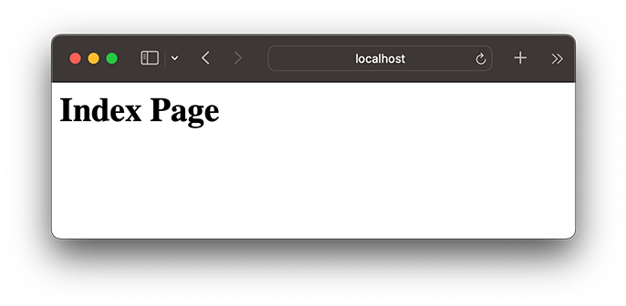

访问`http://localhost:8080/Bob`：

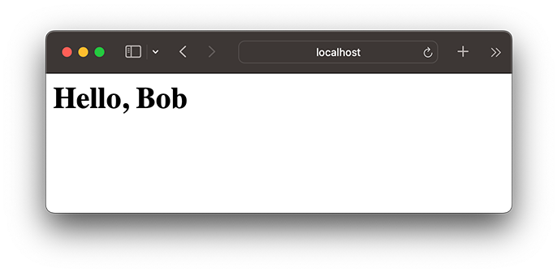

使用aiohttp时，定义处理不同URL的`async`函数，然后通过`app.add_routes()`添加映射，最后通过`run_app()`以asyncio的机制启动整个处理流程。

### Dash Plotly

Dash 是一个基于 Python 的开源框架，专门用于构建数据分析和数据可视化的 Web 应用程序。Dash 由 Plotly 团队开发，旨在帮助数据分析师、数据科学家和开发人员快速创建交互式的、基于数据的 Web 应用，而无需深入掌握前端技术（如 HTML、CSS 和 JavaScript）。Dash 的核心优势在于其简单易用性和强大的功能。通过 Dash，用户可以使用纯 Python 代码来构建复杂的 Web 应用，而无需编写繁琐的前端代码。Dash 应用通常由两个主要部分组成：**布局**和**交互性**。Dash 是它结合了 Flask 的后端能力、Plotly.js 的可视化能力以及 React.js 的交互能力，为用户提供了一个简单而强大的开发平台。


Dash 并不是一个完全独立的框架，而是基于以下技术构建的：

**Flask**：Dash 的后端基于 Flask，一个轻量级的 Python Web 框架。Flask 负责处理 HTTP 请求和响应。

**Plotly.js**：Dash 使用 Plotly.js 来渲染交互式图表。Plotly.js 支持多种图表类型，如折线图、柱状图、散点图、热力图等。

**React.js**：Dash 的前端组件基于 React.js，一个流行的 JavaScript 库。React.js 使得 Dash 的组件可以动态更新，而无需刷新页面。

**其他依赖**：Dash 还依赖于其他 Python 库，如 Pandas（数据处理）、NumPy（数值计算）等。

#### Dash 安装

Dash 支持 Python 3.6 及以上版本。可以通过 Python 的包管理工具 `pip` 来完成。除了核心库外，Dash 还支持一些可选依赖库，用于增强功能。

```
pip --version

pip install dash
#	dash：Dash 的核心库。
#	dash-core-components：Dash 的核心组件库（如输入框、下拉菜单、图表等）。
#	dash-html-components：Dash 的 HTML 组件库（如 div、h1、p 等）。
#	dash-table：用于显示和操作表格数据的组件。

pip install plotly #	Plotly 是 Dash 默认的图表渲染库。
pip install pandas # Pandas 是一个强大的数据处理库，常用于与 Dash 结合使用。
pip install jupyter-dash # 在 Jupyter Notebook 中使用 Dash
pip install dash-bootstrap-components 	# Dash Bootstrap Components 提供了 Bootstrap 风格的组件，用于快速构建美观的布局

python -c "import dash; print(dash.__version__)"
```

#### Dash 使用

##### Dash 组件

Dash 的核心组件可以分为两大类：`dash.html` 和 `dash.dcc`。`dash.html` 提供了 HTML 标签的 Python 封装，而 `dash.dcc` 则提供了更高级的交互式组件，如滑块、下拉菜单、图形等。

**`dash.html` 组件**： `dash.html` 模块提供了与 HTML 标签对应的 Python 类。这些类允许你以 Python 的方式编写 HTML 代码。例如，`dash.html.Div` 对应 HTML 的 `<div>` 标签，`dash.html.H1` 对应 `<h1>` 标签。

**`dash.dcc` 组件**:`dash.dcc` 模块提供了更高级的交互式组件，这些组件通常用于数据可视化和用户输入。常见的 `dash.dcc` 组件包括 `Graph`、`Dropdown`、`Slider` 等。

每个 Dash 组件都有一些属性，这些属性用于控制组件的外观和行为。例如，`dash.html.Div` 的 `children` 属性用于指定其子元素，`dash.dcc.Graph` 的 `figure` 属性用于指定图表的数据和布局。

- **children**: 用于指定组件的子元素。大多数组件都有这个属性。
- **id**: 用于唯一标识组件，通常在回调函数中使用。
- **style**: 用于设置组件的 CSS 样式。
- **className**: 用于指定组件的 CSS 类名。

| **组件**           | **说明**                                         | **示例代码**                                                 |
| :----------------- | :----------------------------------------------- | :----------------------------------------------------------- |
| **`html.Div`**     | 创建一个容器（`<div>`），用于包裹其他组件        | `html.Div(children=[html.H1("标题"), html.P("这是一个段落。")])` |
| **`html.H1`**      | 创建一级标题（`<h1>`）                           | `html.H1("一级标题")`                                        |
| **`html.H2`**      | 创建二级标题（`<h2>`）                           | `html.H2("二级标题")`                                        |
| **`html.H3`**      | 创建三级标题（`<h3>`）                           | `html.H3("三级标题")`                                        |
| **`html.P`**       | 创建段落（`<p>`）                                | `html.P("这是一个段落。")`                                   |
| **`html.Span`**    | 创建行内容器（`<span>`），用于包裹行内文本或元素 | `html.Span("这是一段行内文本。")`                            |
| **`html.Br`**      | 创建换行（`<br>`）                               | `html.Div(children=[html.P("第一行"), html.Br(), html.P("第二行")])` |
| **`html.A`**       | 创建超链接（`<a>`）                              | `html.A("点击这里访问 Dash 官网", href="https://dash.plotly.com")` |
| **`html.Img`**     | 插入图片（``）                              | `html.Img(src="https://plotly.com/assets/images/logo.png", height="50px")` |
| **`html.Ul`**      | 创建无序列表（`<ul>`）                           | `html.Ul(children=[html.Li("列表项1"), html.Li("列表项2")])` |
| **`html.Ol`**      | 创建有序列表（`<ol>`）                           | `html.Ol(children=[html.Li("第一项"), html.Li("第二项")])`   |
| **`html.Li`**      | 创建列表项（`<li>`）                             | `html.Li("列表项")`                                          |
| **`html.Button`**  | 创建按钮（`<button>`）                           | `html.Button("点击我", id='my-button')`                      |
| **`html.Label`**   | 创建标签（`<label>`），通常与输入组件一起使用    | `html.Label("用户名:"), dcc.Input(id='username', type='text')` |
| **`html.Table`**   | 创建表格（`<table>`）                            | `html.Table(children=[html.Tr(children=[html.Th("姓名"), html.Th("年龄")])])` |
| **`html.Tr`**      | 创建表格行（`<tr>`）                             | `html.Tr(children=[html.Th("姓名"), html.Th("年龄")])`       |
| **`html.Th`**      | 创建表头（`<th>`）                               | `html.Th("姓名")`                                            |
| **`html.Td`**      | 创建表格单元格（`<td>`）                         | `html.Td("张三")`                                            |
| **`html.Header`**  | 创建页眉（`<header>`）                           | `html.Header(children=[html.H1("页眉标题")])`                |
| **`html.Footer`**  | 创建页脚（`<footer>`）                           | `html.Footer(children=[html.P("版权所有 © 2023")])`          |
| **`html.Section`** | 创建章节（`<section>`）                          | `html.Section(children=[html.H2("章节标题"), html.P("章节内容")])` |
| **`html.Nav`**     | 创建导航栏（`<nav>`）                            | `html.Nav(children=[html.A("首页", href="/"), html.A("关于", href="/about")])` |
| **`html.Main`**    | 创建主要内容区域（`<main>`）                     | `html.Main(children=[html.H1("主要内容")])`                  |
| **`html.Article`** | 创建文章区域（`<article>`）                      | `html.Article(children=[html.H2("文章标题"), html.P("文章内容")])` |
| **`html.Aside`**   | 创建侧边栏（`<aside>`）                          | `html.Aside(children=[html.H2("侧边栏"), html.P("侧边栏内容")])` |
| **`html.Details`** | 创建可折叠内容（`<details>`）                    | `html.Details(children=[html.Summary("点击展开"), html.P("隐藏内容")])` |
| **`html.Summary`** | 创建可折叠内容的标题（`<summary>`）              | `html.Summary("点击展开")`                                   |


| **组件**                        | **说明**                                                     | **示例代码**                                                 |
| :------------------------------ | :----------------------------------------------------------- | :----------------------------------------------------------- |
| **`dcc.Input`**                 | 创建一个文本输入框。                                         | `dcc.Input(id='input', type='text', placeholder='请输入内容...')` |
| **`dcc.Dropdown`**              | 创建一个下拉菜单。                                           | `dcc.Dropdown(id='dropdown', options=[{'label': '选项1', 'value': '1'}], value='1')` |
| **`dcc.Slider`**                | 创建一个滑块。                                               | `dcc.Slider(id='slider', min=0, max=10, step=1, value=5)`    |
| **`dcc.Graph`**                 | 创建一个交互式图表（基于 Plotly.js）。                       | `dcc.Graph(id='graph', figure={'data': [{'x': [1, 2, 3], 'y': [4, 1, 2], 'type': 'bar'}]})` |
| **`dcc.Textarea`**              | 创建一个多行文本输入框。                                     | `dcc.Textarea(id='textarea', value='请输入多行文本...')`     |
| **`dcc.Checklist`**             | 创建一个复选框列表。                                         | `dcc.Checklist(id='checklist', options=[{'label': '选项1', 'value': '1'}], value=['1'])` |
| **`dcc.RadioItems`**            | 创建一个单选按钮组。                                         | `dcc.RadioItems(id='radio', options=[{'label': '选项1', 'value': '1'}], value='1')` |
| **`dcc.DatePickerSingle`**      | 创建一个日期选择器（单选）。                                 | `dcc.DatePickerSingle(id='date-picker', date='2023-10-01')`  |
| **`dcc.DatePickerRange`**       | 创建一个日期范围选择器。                                     | `dcc.DatePickerRange(id='date-range', start_date='2023-10-01', end_date='2023-10-07')` |
| **`dcc.Markdown`**              | 渲染 Markdown 文本。                                         | `dcc.Markdown('''# 标题\n- 列表项1''')`                      |
| **`dcc.Store`**                 | 在客户端存储数据，用于跨回调共享数据。                       | `dcc.Store(id='store', data={'key': 'value'})`               |
| **`dcc.Upload`**                | 创建一个文件上传组件。                                       | `dcc.Upload(id='upload', children=html.Div('拖放或点击上传文件'))` |
| **`dcc.Tabs`**                  | 创建选项卡组件。                                             | `dcc.Tabs(id='tabs', children=[dcc.Tab(label='标签1', value='1')])` |
| **`dcc.Tab`**                   | 创建单个选项卡（需与 `dcc.Tabs` 配合使用）。                 | `dcc.Tab(label='标签1', value='1')`                          |
| **`dcc.Interval`**              | 定时触发回调的组件。                                         | `dcc.Interval(id='interval', interval=1000)`                 |
| **`dcc.Location`**              | 用于管理 URL 的组件。                                        | `dcc.Location(id='url', pathname='/')`                       |
| **`dcc.Link`**                  | 创建一个超链接，用于页面导航（需与 `dcc.Location` 配合使用）。 | `dcc.Link('跳转到首页', href='/')`                           |
| **`dcc.ConfirmDialog`**         | 创建一个确认对话框。                                         | `dcc.ConfirmDialog(id='confirm', message='确定要执行此操作吗？')` |
| **`dcc.ConfirmDialogProvider`** | 提供一个确认对话框（需与按钮等组件配合使用）。               | `dcc.ConfirmDialogProvider(html.Button('删除'), id='confirm-provider')` |
| **`dcc.Loading`**               | 创建一个加载动画组件。                                       | `dcc.Loading(id='loading', children=[html.Div('加载中...')])` |
| **`dcc.Download`**              | 用于触发文件下载的组件。                                     | `dcc.Download(id='download')`                                |

##### Dash 回调函数

Dash 允许开发者使用Python来创建动态的、响应式的用户界面。Dash 的核心功能之一就是回调函数（Callback），它使得用户界面能够根据用户的输入或操作实时更新。回调函数是 Dash 中用于处理用户交互的核心机制，它允许你在用户与应用程序交互时，动态地更新应用程序的布局或数据。简单来说，回调函数是一个Python函数，它会在特定的输入发生变化时被触发，并根据这些输入的变化来更新输出。一个典型的 Dash 回调函数包含以下几个部分：

1. **输入（Input）**：指定哪些组件的属性变化会触发回调函数。
2. **输出（Output）**：指定回调函数执行后，哪些组件的属性会被更新。
3. **状态（State）**：可选参数，用于传递一些不会触发回调但需要在回调中使用的数据。
4. **回调函数体**：包含实际的逻辑代码，用于处理输入并生成输出。

回调函数的基本结构

```
@app.callback(
    Output(component_id='output-component', component_property='output-property'),
    Input(component_id='input-component', component_property='input-property')
)
def update_output(input_value):
    # 根据输入值计算输出值
    return output_value
```

1. **`Output`**：
   - 指定回调函数的输出目标。
   - `component_id`：目标组件的 ID。
   - `component_property`：目标组件的属性（如 `children`、`value` 等）。
2. **`Input`**：
   - 指定回调函数的输入来源。
   - `component_id`：输入组件的 ID。
   - `component_property`：输入组件的属性（如 `value`、`n_clicks` 等）。
3. **回调函数**：
   - 接收输入值，计算并返回输出值。
   - 函数名可以自定义（如 `update_output`）。

回调函数的工作原理

1. 输入与输出的绑定

在 Dash 中，回调函数的输入和输出是通过 `Input` 和 `Output` 对象来指定的。`Input` 对象指定了哪些组件的哪些属性变化会触发回调函数，而 `Output` 对象指定了回调函数执行后，哪些组件的哪些属性会被更新。

2. 回调函数的触发

当用户在界面上进行操作（例如输入文本、点击按钮等）时，相关的组件属性会发生变化。Dash 会检测到这些变化，并自动调用与之绑定的回调函数。

3. 回调函数的执行

回调函数执行时，Dash会将输入属性的当前值作为参数传递给回调函数。回调函数根据这些输入值进行计算或处理，并返回输出属性的新值。Dash会自动将返回的值更新到指定的组件属性中。

##### Dash Plotly

Dash 通过 dcc.Graph 组件与 Plotly 无缝集成，用户可以直接在 Dash 应用中嵌入 Plotly 图表。Plotly 是一个基于 JavaScript 的开源数据可视化库，支持多种编程语言，包括 Python、R、Julia 等。Plotly 提供了丰富的图表类型，如折线图、柱状图、散点图、热力图等，并且支持交互功能，如缩放、平移、悬停提示等。

Plotly Express 是 Plotly 的高级接口，能够用极简的代码创建复杂的图表。它非常适合快速原型开发。

**1、折线图 (px.line)：**

```
import plotly.express as px
df = px.data.iris()
fig = px.line(df, x='sepal_width', y='sepal_length', title='折线图示例')
```

**2、柱状图 (px.bar)：**

```
fig = px.bar(df, x='species', y='sepal_length', title='柱状图示例')
```

**3、散点图 (px.scatter)：**

```
fig = px.scatter(df, x='sepal_width', y='sepal_length', color='species', title='散点图示例')
```

**4、饼图 (px.pie)：**

```
fig = px.pie(df, names='species', values='sepal_length', title='饼图示例')
```

**5、热力图 (px.imshow)：**

```
import numpy as np
data = np.random.rand(10, 10)
fig = px.imshow(data, title='热力图示例')
```

**dcc.Graph** 是 Dash 中用于显示 Plotly 图表的组件。它的核心参数是 figure，用于指定图表的数据和布局。

**figure 参数：**

- `data`：图表的数据部分，是一个字典列表，每个字典表示一个数据系列。
- `layout`：图表的布局部分，用于设置标题、坐标轴、图例等。

```
from dash import Dash, dcc, html
import plotly.express as px
import pandas as pd

# 创建示例数据
df = pd.DataFrame({
    '城市': ['北京', '上海', '广州', '深圳'],
    '人口': [2171, 2424, 1490, 1303]
})

# 创建 Dash 应用
app = Dash(__name__)

# 使用 Plotly Express 创建柱状图
fig = px.bar(df, x='城市', y='人口', title='城市人口数据')

# 定义布局
app.layout = html.Div([
    dcc.Graph(id='example-graph', figure=fig)
])

# 运行应用
if __name__ == '__main__':
    app.run_server(debug=True)
```

#####  Dash 布局

在 Dash 中实现多页面布局可以通过 dcc.Location 和 dcc.Link 组件来实现。

dcc.Location 用于跟踪当前页面的 URL，而 dcc.Link 用于在页面之间导航。通过结合回调函数，可以根据 URL 动态加载不同的页面内容。

- 使用 `dcc.Location` 和 `dcc.Link` 可以实现多页面布局。
- 通过回调函数根据 `pathname` 动态加载页面内容。
- 结合模块化布局和 URL 参数，可以构建更复杂的多页面应用。

多页面布局的基本结构

多页面布局的核心思想是根据 URL 的路径（pathname）动态加载不同的页面内容。

以下是实现多页面布局的基本步骤：

**定义页面布局**：

- 每个页面的布局可以定义为一个函数或变量。
- 例如，`home_layout` 表示主页，`about_layout` 表示关于页面。

**使用 `dcc.Location`**：

- `dcc.Location` 组件用于跟踪当前页面的 URL。
- 通过 `pathname` 属性获取当前页面的路径。

**使用 `dcc.Link`**：

- `dcc.Link` 组件用于创建页面导航链接。
- 通过 `href` 属性指定目标页面的路径。

**动态加载页面内容**：

- 使用回调函数根据 `pathname` 动态返回对应的页面布局。

```
from dash import Dash, html, dcc, Input, Output

# 创建 Dash 应用
app = Dash(__name__)

# 定义主页布局
home_layout = html.Div([
    html.H1("主页"),
    html.P("欢迎访问主页！"),
    dcc.Link('前往关于页面', href='/about')
])

# 定义关于页面布局
about_layout = html.Div([
    html.H1("关于页面"),
    html.P("这是关于页面的内容。"),
    dcc.Link('返回主页', href='/')
])

# 定义 404 页面布局
not_found_layout = html.Div([
    html.H1("404 - 页面未找到"),
    html.P("您访问的页面不存在。"),
    dcc.Link('返回主页', href='/')
])

# 定义应用的布局
app.layout = html.Div([
    dcc.Location(id='url', refresh=False),  # 用于跟踪 URL
    html.Div(id='page-content')  # 用于动态加载页面内容
])

# 定义回调函数
@app.callback(
    Output('page-content', 'children'),  # 输出到 id 为 'page-content' 的 Div 的 children 属性
    Input('url', 'pathname')  # 输入来自 id 为 'url' 的 Location 组件的 pathname 属性
)
def display_page(pathname):
    if pathname == '/':
        return home_layout  # 显示主页
    elif pathname == '/about':
        return about_layout  # 显示关于页面
    else:
        return not_found_layout  # 显示 404 页面

# 运行应用
if __name__ == '__main__':
    app.run_server(debug=True)
```

##### Dash 样式设计

在开发交互式 Web 应用程序时，Dash 不仅允许你使用 Python 来构建复杂的应用程序，还提供了丰富的样式设计选项，使你的应用程序看起来更加专业和美观。在 Dash 中，样式设计是通过 CSS 实现的。Dash 提供了多种方式来设置组件的样式，包括：

- **内联样式**：通过 `style` 属性直接设置组件的样式。
- **外部 CSS 文件**：通过加载外部 CSS 文件设置全局样式。
- **Dash Bootstrap Components**：使用 Bootstrap 风格的组件和样式。

1. 内联样式

通过 style 属性可以直接为组件设置 CSS 样式。style 是一个字典，键是 CSS 属性，值是 CSS 值。

```
**from** dash **import** Dash, html

\# 创建 Dash 应用
app = Dash(__name__)

\# 定义布局
app.layout = html.Div(
  style={
    'backgroundColor': 'lightblue', # 背景颜色
    'padding': '20px', # 内边距
    'borderRadius': '10px', # 圆角
    'textAlign': 'center' # 文字居中
  },
  children=[
    html.H1("欢迎使用 Dash", style={'color': 'darkblue'}),
    html.P("这是一个带样式的 Div。")
  ]
)

\# 运行应用
**if** __name__ == '__main__':
  app.run_server(debug=True)
```

**运行效果：**

- 背景颜色为浅蓝色，内边距为 20px，圆角为 10px，文字居中。
- 标题文字颜色为深蓝色。

2. 外部 CSS 文件

通过加载外部 CSS 文件，可以为整个应用设置全局样式。

1. 创建一个 CSS 文件（如 `assets/styles.css`）。
2. 在 Dash 应用中加载 CSS 文件。

CSS 文件示例 (assets/styles.css)：

```
*/\* 设置全局字体 \*/*
body {
  **font-family**: Arial, sans-serif;
}

*/\* 设置标题样式 \*/*
h1 {
  **color**: darkblue;
  **text-align**: center;
}

*/\* 设置 Div 样式 \*/*
.custom-div {
  **background-color**: lightblue;
  **padding**: 20px;
  **border-radius**: 10px;
  **text-align**: center;
}

**from** dash **import** Dash, html

\# 创建 Dash 应用
app = Dash(__name__)

\# 定义布局
app.layout = html.Div(
  className='custom-div', # 使用 CSS 类名
  children=[
    html.H1("欢迎使用 Dash"),
    html.P("这是一个带样式的 Div。")
  ]
)

\# 运行应用
**if** __name__ == '__main__':
  app.run_server(debug=True)
```

**运行效果：**

- 应用加载 `assets/styles.css` 文件中的样式。
- `h1` 标题颜色为深蓝色，居中显示。
- `Div` 背景颜色为浅蓝色，带内边距和圆角。

Dash Bootstrap Components

Dash Bootstrap Components（dash-bootstrap-components）是一个第三方库，提供了 Bootstrap 风格的组件和样式。它可以帮助快速构建美观的 Dash 应用。

```
pip install dash-bootstrap-components

**from** dash **import** Dash, html
**import** dash_bootstrap_components **as** dbc

\# 创建 Dash 应用
app = Dash(__name__, external_stylesheets=[dbc.themes.BOOTSTRAP])

\# 定义布局
app.layout = dbc.Container(
  children=[
    dbc.Row(
      dbc.Col(
        html.H1("欢迎使用 Dash Bootstrap", className="text-center text-primary")
      )
    ),
    dbc.Row(
      dbc.Col(
        dbc.Card(
          children=[
            dbc.CardHeader("卡片标题"),
            dbc.CardBody(
              children=[
                html.P("这是一个 Bootstrap 风格的卡片。", className="card-text")
              ]
            )
          ],
          className="mt-4" # 设置外边距
        )
      )
    )
  ]
)

\# 运行应用
**if** __name__ == '__main__':
  app.run_server(debug=True)
```

### Gevent

#### Greenlets

gevent中使用的主要模式是 Greenlet，这是作为C扩展模块提供给 Python 的一个轻量级协同程序。所有 greenlet 都在主程序的 OS 进程中运行，但它们是协同调度的。

操作系统在任何给定的时间内，只有一个greenlet在运行。

这不同于由 multiprocessing 或 threading 库提供的并行结构，它们这些库可以自旋进程和POSIX线程，由操作系统调度，并且真正并行的。

#### 异步和同步执行

并发性的核心思想是，可以将较大的任务分解为多个子任务的集合，这些子任务计划同时或异步运行，而不是一次或同步运行。两个子任务之间的切换称为上下文切换。

**深入探索**

编程

OS

软件

gevent中的上下文切换是通过 yielding 来完成的。在本例中，我们有两个上下文，它们通过调用 gevent.sleep(0) 相互让步。

```
import geventdef foo():    print('Running in foo')    gevent.sleep(0)    print('Explicit context switch to foo again')def bar():    print('Explicit context to bar')    gevent.sleep(0)    print('Implicit context switch back to bar')gevent.joinall([    gevent.spawn(foo),    gevent.spawn(bar),])
Running in fooExplicit context to barExplicit context switch to foo againImplicit context switch back to bar
```

当我们将 gevent 用于网络和 IO 绑定函数时，它的真正威力就来了，这些函数可以协同调度。Gevent 负责处理所有细节，以确保网络库尽可能隐式地让步出它们的 greenlet 上下文。我再怎么强调这是一个多么有力的成语也不为过。但也许可以举个例子来说明。

在这种情况下，select() 函数通常是一个阻塞调用，它轮询各种文件描述符。

```
import timeimport geventfrom gevent import selectstart = time.time()tic = lambda: 'at %1.1f seconds' % (time.time() - start)def gr1():    # Busy waits for a second, but we don't want to stick around...    print('Started Polling: %s' % tic())    select.select([], [], [], 2)                     # 可以理解成一个 IO 阻塞的操作，阻塞了2秒，这时 Greenlet 会自动切换到 gr2() 上下文执行     print('Ended Polling: %s' % tic())def gr2():    # Busy waits for a second, but we don't want to stick around...    print('Started Polling: %s' % tic())    select.select([], [], [], 2)    print('Ended Polling: %s' % tic())def gr3():    print("Hey lets do some stuff while the greenlets poll, %s" % tic())    gevent.sleep(1)    # 让当前 Greenlet 休眠1秒，上面 gr1() gr2() 阻塞操作完成后，再切换到 gr1() gr2() 的上下文执行gevent.joinall([    gevent.spawn(gr1),    gevent.spawn(gr2),    gevent.spawn(gr3),])
Started Polling: at 0.0 secondsStarted Polling: at 0.0 secondsHey lets do some stuff while the greenlets poll, at 0.0 secondsEnded Polling: at 2.0 secondsEnded Polling: at 2.0 seconds
```

另一个比较综合的例子定义了一个不确定的任务函数 (它的输出不能保证对相同的输入给出相同的结果) 。在这种情况下，运行该函数的副作用是任务暂停执行的时间是随机的。

计算机科学


```
import geventimport randomdef task(pid):    """    Some non-deterministic task    """    gevent.sleep(random.randint(0,2)*0.001)    print('Task %s done' % pid)def synchronous():    for i in range(1,10):        task(i)def asynchronous():    threads = [gevent.spawn(task, i) for i in xrange(10)]    gevent.joinall(threads)print('Synchronous:')synchronous()print('Asynchronous:')asynchronous()
Synchronous:Task 1 doneTask 2 doneTask 3 doneTask 4 doneTask 5 doneTask 6 doneTask 7 doneTask 8 doneTask 9 doneAsynchronous:Task 1 doneTask 5 doneTask 6 doneTask 2 doneTask 4 doneTask 7 doneTask 8 doneTask 9 doneTask 0 doneTask 3 done
```

在同步情况下，所有任务都是按顺序运行的，这会导致在执行每个任务时主程序阻塞(即暂停主程序的执行)。

操作系统


程序的重要部分是 gevent.spawn，它将给定的函数封装在一个 Greenlet 线程中。初始化的 greenlet 列表存储在传递给 gevent 的数组线程中。gevent.joinall 函数，它会阻塞当前程序，来运行所有给定的 greenlet。只有当所有 greenlet 终止时，执行才会继续进行。

需要注意的是，异步情况下的执行顺序本质上是随机的，异步情况下的总执行时间比同步情况下少得多。实际上，同步的例子完成的最大时间是每个任务停顿0.002秒，导致整个队列停顿0.02秒。在异步情况下，最大运行时间大约为0.002秒，因为没有一个任务会阻塞其他任务的执行。

在更常见的用例中，异步地从服务器获取数据，fetch() 的运行时在请求之间会有所不同，这取决于请求时远程服务器上的负载。

```
import gevent.monkeygevent.monkey.patch_socket()# 把内置的阻塞的 socket替换成非阻塞的socketimport geventimport urllib2import simplejson as jsondef fetch(pid):    response = urllib2.urlopen('http://json-time.appspot.com/time.json')    result = response.read()    json_result = json.loads(result)    datetime = json_result['datetime']    print('Process %s: %s' % (pid, datetime))    return json_result['datetime']def synchronous():    for i in range(1,10):        fetch(i)def asynchronous():    threads = []    for i in range(1,10):        threads.append(gevent.spawn(fetch, i))    gevent.joinall(threads)print('Synchronous:')synchronous()print('Asynchronous:')asynchronous()
```

#### 确定性

如前所述，greenlet 是确定的。给定相同的 greenlet 配置和相同的输入集，它们总是产生相同的输出。例如，让我们将一个任务分散到一个多进程（multiprocessing）池中，并将其结果与一个gevent池的结果进行比较。

Linux 与 Unix


```
import timedef echo(i):    time.sleep(0.001)    return i# Non Deterministic Process Poolfrom multiprocessing.pool import Poolp = Pool(10)run1 = [a for a in p.imap_unordered(echo, xrange(10))]          # imap_unordered 返回一个顺序随机的 iterable 对象run2 = [a for a in p.imap_unordered(echo, xrange(10))]run3 = [a for a in p.imap_unordered(echo, xrange(10))]run4 = [a for a in p.imap_unordered(echo, xrange(10))]print(run1 == run2 == run3 == run4)# Deterministic Gevent Poolfrom gevent.pool import Poolp = Pool(10)run1 = [a for a in p.imap_unordered(echo, xrange(10))]      # [0, 1, 2, 3, 4, 5, 6, 7, 8, 9]run2 = [a for a in p.imap_unordered(echo, xrange(10))]      # [0, 1, 2, 3, 4, 5, 6, 7, 8, 9]run3 = [a for a in p.imap_unordered(echo, xrange(10))]      # [0, 1, 2, 3, 4, 5, 6, 7, 8, 9]run4 = [a for a in p.imap_unordered(echo, xrange(10))]      # [0, 1, 2, 3, 4, 5, 6, 7, 8, 9]print(run1 == run2 == run3 == run4)
FalseTrue
```

尽管 gevent 通常是确定的，但当您开始与外部服务(如 socket 和文件)进行交互时，非确定性的来源可能会潜入您的程序。因此，即使 green 线程是确定性并发的一种形式，它们仍然会遇到POSIX线程和进程遇到的一些相同的问题。

操作系统


与并发有关的长期问题称为竞争条件。简而言之，当两个并发线程/进程依赖于某些共享资源但还试图修改该值时，就会发生竞争状态。这将导致资源的值变得依赖于执行顺序。这是一个问题，一般来说，应该尽量避免竞态条件，因为它们会导致全局的不确定程序行为。

最好的方法是在任何时候都避免所有全局状态。全局状态和导入时间的副作用总是会回来咬你一口

#### 生成 Greenlets

gevent提供了一些关于Greenlet初始化的包装器。一些最常见的模式是：

```
import geventfrom gevent import Greenletdef foo(message, n):    """    Each thread will be passed the message, and n arguments    in its initialization.    """    gevent.sleep(n)    print(message)# Initialize a new Greenlet instance running the named function# foothread1 = Greenlet.spawn(foo, "Hello", 1)# Wrapper for creating and running a new Greenlet from the named# function foo, with the passed argumentsthread2 = gevent.spawn(foo, "I live!", 2)# Lambda expressionsthread3 = gevent.spawn(lambda x: (x+1), 2)threads = [thread1, thread2, thread3]# Block until all threads complete.gevent.joinall(threads)
HelloI live!
```

除了使用基本的Greenlet类，您还可以子类化 Greenlet 类并覆盖 _run 方法。

Linux 与 Unix


```
import geventfrom gevent import Greenletclass MyGreenlet(Greenlet):    def __init__(self, message, n):        Greenlet.__init__(self)        self.message = message        self.n = n    def _run(self):        print(self.message)        gevent.sleep(self.n)g = MyGreenlet("Hi there!", 3)g.start()g.join()
Hi there!
```

#### Greenlets 状态

与代码的其他部分一样，greenlet可能以各种方式失败。greenlet可能无法抛出异常、无法停止或消耗太多系统资源。

greenlet 的内部状态通常是一个与时间相关的参数。在greenlets上有许多标志，它们允许您监视线程的状态：

started — 布尔值，指示Greenlet是否已启动

ready() — 布尔值，指示Greenlet是否已停止

successful() — 布尔值，指示Greenlet是否已停止且没有抛出异常

value — Greenlet返回的值

exception — 异常，在greenlet中抛出的未捕获异常实例

```
import geventdef win():    return 'You win!'def fail():    raise Exception('You fail at failing.')winner = gevent.spawn(win)loser = gevent.spawn(fail)print(winner.started) # Trueprint(loser.started)  # True# Exceptions raised in the Greenlet, stay inside the Greenlet.try:    gevent.joinall([winner, loser])except Exception as e:    print('This will never be reached')print(winner.value) # 'You win!'print(loser.value)  # Noneprint(winner.ready()) # Trueprint(loser.ready())  # Trueprint(winner.successful()) # Trueprint(loser.successful())  # False# The exception raised in fail, will not propagate outside the# greenlet. A stack trace will be printed to stdout but it# will not unwind the stack of the parent.print(loser.exception)# It is possible though to raise the exception again outside# raise loser.exception# or with# loser.get()
TrueTrueYou win!NoneTrueTrueTrueFalseYou fail at failing.
```

#### 程序关闭

当主程序接收到SIGQUIT时，无法生成（yield）的 greenlet 可能会使程序的执行时间比预期的更长。这将导致所谓的“僵尸进程”，需要从 Python 解释器外部杀死这些进程。

操作系统


一种常见的模式是监听主程序上的SIGQUIT事件并在退出前调用 gevent.shutdown 。

```
import geventimport signaldef run_forever():    gevent.sleep(1000)if __name__ == '__main__':    gevent.signal(signal.SIGQUIT, gevent.kill)    thread = gevent.spawn(run_forever)    thread.join()
```

#### 超时

超时是对代码块或Greenlet的运行时的约束。

```
import geventfrom gevent import Timeoutseconds = 10timeout = Timeout(seconds)timeout.start()def wait():    gevent.sleep(10)try:    gevent.spawn(wait).join()except Timeout:    print('Could not complete')
```

在with语句中，它们还可以与上下文管理器一起使用。

脚本语言


```
import geventfrom gevent import Timeouttime_to_wait = 5 # secondsclass TooLong(Exception):    passwith Timeout(time_to_wait, TooLong):    gevent.sleep(10)
```

此外，gevent 还为各种 Greenlet 和数据结构相关的调用提供超时参数。例如：

```
import geventfrom gevent import Timeoutdef wait():    gevent.sleep(2)timer = Timeout(1).start()thread1 = gevent.spawn(wait)try:    thread1.join(timeout=timer)except Timeout:    print('Thread 1 timed out')# --timer = Timeout.start_new(1)thread2 = gevent.spawn(wait)try:    thread2.get(timeout=timer)except Timeout:    print('Thread 2 timed out')# --try:    gevent.with_timeout(1, wait)except Timeout:    print('Thread 3 timed out')
Thread 1 timed outThread 2 timed outThread 3 timed out
```

#### 猴子补丁

我们来到了Gevent的黑暗角落。到目前为止，我一直避免提到monkey patching，以尝试和激发强大的协同模式，但是现在是讨论monkey patching的黑魔法的时候了。 如果您注意到上面我们调用了命令 monkey.patch_socket()，这是一个纯粹用于修改标准库套接字库(socket)的副作用命令。

计算机科学


```
import socketprint(socket.socket)print("After monkey patch")from gevent import monkeymonkey.patch_socket()print(socket.socket)import selectprint(select.select)monkey.patch_select()print("After monkey patch")print(select.select)
class 'socket.socket'After monkey patchclass 'gevent.socket.socket'built-in function selectAfter monkey patchfunction select at 0x1924de8
```

Python 允许在运行时修改大多数对象，包括模块、类甚至函数。这通常是一个令人震惊的坏主意，因为它创建了一个“隐式副作用”，如果出现问题，通常非常难以调试，然而在极端情况下，库需要改变Python本身的基本行为，可以使用monkey补丁。在这种情况下，gevent能够修补标准库中的大多数阻塞系统调用，包括 socket、ssl、threading 和 select 模块中的调用。

脚本语言


例如，Redis-python 的绑定通常使用常规tcp socket与Redis-server实例通信。只需调用gevent.monkey.patch_all()，我们可以让redis绑定协同调度请求，并与gevent堆栈的其他部分一起工作。

这让我们可以在不编写任何代码的情况下集成通常无法与gevent一起工作的库。（尽管猴子补丁仍然是邪恶的，但在这种情况下，它是“有用的邪恶”。）

#### 数据结构

##### 事件

事件是greenlet之间异步通信的一种形式。

```
import geventfrom gevent.event import Event'''Illustrates the use of events'''evt = Event()def setter():    '''After 3 seconds, wake all threads waiting on the value of evt'''    print('A: Hey wait for me, I have to do something')    gevent.sleep(3)    print("Ok, I'm done")    evt.set()   # 运行到evt.set()会将flag设置为True，然后另外两个被阻塞的waitter的evt.wait()方法在看到flag已经为True之后不再继续阻塞运行并且结束。def waiter():    '''After 3 seconds the get call will unblock'''    print("I'll wait for you")    evt.wait()  # blocking    print("It's about time")def main():    gevent.joinall([        gevent.spawn(setter),        gevent.spawn(waiter),        gevent.spawn(waiter),        gevent.spawn(waiter),        gevent.spawn(waiter),        gevent.spawn(waiter)    ])if __name__ == '__main__': main()
```

事件对象的扩展是 AsyncResult，它允许您在唤醒调用时发送一个值。这有时被称为future或deferred，因为它有对 future 值的引用，可以在任意的时间设置该值。

计算机科学


```
import geventfrom gevent.event import AsyncResulta = AsyncResult()def setter():    """    After 3 seconds set the result of a.    """    gevent.sleep(3)    a.set('Hello!')def waiter():    """    After 3 seconds the get call will unblock after the setter    puts a value into the AsyncResult.    """    print(a.get())gevent.joinall([    gevent.spawn(setter),    gevent.spawn(waiter),])
```

##### 队列

队列是按顺序排列的数据集，它们具有通常的 put / get 操作，但可以在Greenlets上安全操作的方式编写。

脚本语言


例如，如果一个Greenlet从队列中获取一个项目(item)，则同一项目(item)不会被同时执行的另一个Greenlet获取。

```
import geventfrom gevent.queue import Queuetasks = Queue()def worker(n):    while not tasks.empty():        task = tasks.get()        print('Worker %s got task %s' % (n, task))        gevent.sleep(0)    print('Quitting time!')def boss():    for i in xrange(1,25):        tasks.put_nowait(i)gevent.spawn(boss).join()gevent.joinall([    gevent.spawn(worker, 'steve'),    gevent.spawn(worker, 'john'),    gevent.spawn(worker, 'nancy'),])
Worker steve got task 1Worker john got task 2Worker nancy got task 3Worker steve got task 4Worker john got task 5Worker nancy got task 6Worker steve got task 7Worker john got task 8Worker nancy got task 9Worker steve got task 10Worker john got task 11Worker nancy got task 12Worker steve got task 13Worker john got task 14Worker nancy got task 15Worker steve got task 16Worker john got task 17Worker nancy got task 18Worker steve got task 19Worker john got task 20Worker nancy got task 21Worker steve got task 22Worker john got task 23Worker nancy got task 24Quitting time!Quitting time!Quitting time!
```

根据需要，队列还可以在put或get上阻塞。

每个put和get操作都有一个非阻塞的对应操作，put_nowait 和 get_nowait 不会阻塞。如果操作是不可能的，会引发 gevent.queue.Empty 或 gevent.queue.Full

在这个例子中，我们让boss同时和workers运行，并且对队列有一个限制，防止它包含三个以上的元素。这个限制意味着put操作将阻塞，直到队列上有空间为止。相反，如果队列上没有要获取的元素，get操作就会阻塞，它还会接受一个超时参数，如果在超时的时间范围内找不到工作(work)，则允许队列以异常 gevent.queue.Empty 退出。

```
import geventfrom gevent.queue import Queue, Emptytasks = Queue(maxsize=3)def worker(name):    try:        while True:            task = tasks.get(timeout=1) # decrements queue size by 1            print('Worker %s got task %s' % (name, task))            gevent.sleep(0)    except Empty:        print('Quitting time!')def boss():    """    Boss will wait to hand out work until a individual worker is    free since the maxsize of the task queue is 3.    """    for i in xrange(1,10):        tasks.put(i)                            # 输入1，2，3，到4时，队列达到最大值，put方法阻塞，gevent 切换到下一个协程worker（steve）    print('Assigned all work in iteration 1')    for i in xrange(10,20):        tasks.put(i)    print('Assigned all work in iteration 2')gevent.joinall([    gevent.spawn(boss),    gevent.spawn(worker, 'steve'),    gevent.spawn(worker, 'john'),    gevent.spawn(worker, 'bob'),])
Worker steve got task 1Worker john got task 2Worker bob got task 3Worker steve got task 4Worker john got task 5Worker bob got task 6Assigned all work in iteration 1Worker steve got task 7Worker john got task 8Worker bob got task 9Worker steve got task 10Worker john got task 11Worker bob got task 12Worker steve got task 13Worker john got task 14Worker bob got task 15Worker steve got task 16Worker john got task 17Worker bob got task 18Assigned all work in iteration 2Worker steve got task 19Quitting time!Quitting time!Quitting time!
```

##### 分组和池

组是运行中的greenlet的集合，这些greenlet作为组一起管理和调度。它还兼做并行调度程序，借鉴 Python multiprocessing 库。

脚本语言


```
import geventfrom gevent.pool import Groupdef talk(msg):    for i in xrange(3):        print(msg)g1 = gevent.spawn(talk, 'bar')g2 = gevent.spawn(talk, 'foo')         g3 = gevent.spawn(talk, 'fizz')  group = Group()group.add(g1)                           group.join()                      # 修改了官方的例子，这里join只会让当前线程等待g1，但g2和g3已经被启动，会被继续安排执行
barbarbarfoofoofoofizzfizzfizz
```

这对于管理异步任务组非常有用。

计算机科学


如上所述，Group还提供了一个API，用于将作业分派给分组的greenlet并以各种方式收集它们的结果。

```
import geventfrom gevent import getcurrentfrom gevent.pool import Groupgroup = Group()def hello_from(n):    print('Size of group %s' % len(group))    print('Hello from Greenlet %s' % id(getcurrent()))group.map(hello_from, xrange(3))def intensive(n):    gevent.sleep(3 - n)    return 'task', nprint('Ordered')ogroup = Group()for i in ogroup.imap(intensive, xrange(3)):    print(i)print('Unordered')igroup = Group()for i in igroup.imap_unordered(intensive, xrange(3)):    print(i)
Size of group 3Hello from Greenlet 4340152592Size of group 3Hello from Greenlet 4340928912Size of group 3Hello from Greenlet 4340928592Ordered('task', 0)('task', 1)('task', 2)Unordered('task', 2)('task', 1)('task', 0)
```

池是一种结构，用于处理需要限制并发的动态数量的greenlets。在需要并行执行许多网络或IO绑定任务的情况下，这通常是可取的。

```
import geventfrom gevent.pool import Poolpool = Pool(2)def hello_from(n):    print('Size of pool %s' % len(pool))pool.map(hello_from, xrange(3))
Size of pool 2Size of pool 2Size of pool 1
```

通常在构建gevent驱动的服务时，会将整个服务围绕一个池结构进行中心处理。一个例子可能是在各种套接字（socket）上轮询的类。

```
from gevent.pool import Poolclass SocketPool(object):    def __init__(self):        self.pool = Pool(1000)        self.pool.start()    def listen(self, socket):        while True:            socket.recv()    def add_handler(self, socket):        if self.pool.full():            raise Exception("At maximum pool size")        else:            self.pool.spawn(self.listen, socket)    def shutdown(self):        self.pool.kill()
```

##### 锁和信号量

信号量是一种低级同步原语，它允许greenlet协调和限制并发访问或执行。信号量公开两种方法，获取和释放信号量被获取和释放的次数之差称为信号量的界限。如果信号量范围达到0，它就会阻塞，直到另一个greenlet释放它的捕获。

```
from gevent import sleepfrom gevent.pool import Poolfrom gevent.coros import BoundedSemaphoresem = BoundedSemaphore(2)def worker1(n):    sem.acquire()    print('Worker %i acquired semaphore' % n)    sleep(0)    sem.release()    print('Worker %i released semaphore' % n)def worker2(n):    with sem:        print('Worker %i acquired semaphore' % n)        sleep(0)    print('Worker %i released semaphore' % n)pool = Pool()pool.map(worker1, xrange(0,2))pool.map(worker2, xrange(3,6))
Worker 0 acquired semaphoreWorker 1 acquired semaphoreWorker 0 released semaphoreWorker 1 released semaphoreWorker 3 acquired semaphoreWorker 4 acquired semaphoreWorker 3 released semaphoreWorker 4 released semaphoreWorker 5 acquired semaphoreWorker 5 released semaphore
```

界限为1的信号量称为锁。它提供对一个greenlet的独占执行。它们通常用于确保资源只在程序上下文中使用一次。

## Python项目管理

### 包管理与环境管理

#### Pip

pip 是 Python 包管理工具，该工具提供了对Python 包的查找、下载、安装、卸载的功能。目前如果你在 [python.org](https://www.python.org/) 下载最新版本的安装包，则是已经自带了该工具。

你可以通过以下命令来判断是否已安装：

```
pip --version     # Python2.x 版本命令
pip3 --version    # Python3.x 版本命令
```

如果你还未安装，则可以使用以下方法来安装：

```
$ curl https://bootstrap.pypa.io/get-pip.py -o get-pip.py   # 下载安装脚本
$ sudo python get-pip.py    # 运行安装脚本
```

> **注意：**用哪个版本的 Python 运行安装脚本，pip 就被关联到哪个版本，如果是 Python3 则执行以下命令：
>
> ```
> $ sudo python3 get-pip.py    # 运行安装脚本。
> ```
>
> 一般情况 pip 对应的是 Python 2.7，pip3 对应的是 Python 3.x。

部分 Linux 发行版可直接用包管理器安装 pip，如 Debian 和 Ubuntu：

```
sudo apt-get install python-pip
```

##### pip 最常用命令

**显示版本和路径**

```
pip --version
```

**获取帮助**

```
pip --help
```

**升级 pip**

```
pip install -U pip
```

> 如果这个升级命令出现问题 ，可以使用以下命令：
>
> ```
> sudo easy_install --upgrade pip
> ```

**安装包**

```
pip install SomePackage              # 最新版本
pip install SomePackage==1.0.4       # 指定版本
pip install 'SomePackage>=1.0.4'     # 最小版本
```

比如我要安装 Django。用以下的一条命令就可以，方便快捷。

```
pip install Django==1.7
```

**升级包**

```
pip install --upgrade SomePackage
```

升级指定的包，通过使用==, >=, <=, >, < 来指定一个版本号。

**卸载包**

```
pip uninstall SomePackage
```

**搜索包**

```
pip search SomePackage
```

**显示安装包信息**

```
pip show 
```

**查看指定包的详细信息**

```
pip show -f SomePackage
```

**列出已安装的包**

```
pip list
```

**查看可升级的包**

```
pip list -o
```

##### pip 升级

**Linux 或 macOS**

```
pip install --upgrade pip    # python2.x
pip3 install --upgrade pip   # python3.x
```

**Windows 平台升级：**

```
python -m pip install -U pip   # python2.x
python -m pip3 install -U pip    # python3.x
```

##### pip 清华大学开源软件镜像站

使用国内镜像速度会快很多：

临时使用：

```
pip install -i https://pypi.tuna.tsinghua.edu.cn/simple some-package
```

例如，安装 Django：

```
pip install -i https://pypi.tuna.tsinghua.edu.cn/simple Django
```

如果要设为默认需要升级 pip 到最新的版本 (>=10.0.0) 后进行配置：

```
pip install pip -U
pip config set global.index-url https://pypi.tuna.tsinghua.edu.cn/simple
```

如果您到 pip 默认源的网络连接较差，临时使用本镜像站来升级 pip：

```
pip install -i https://pypi.tuna.tsinghua.edu.cn/simple pip -U
```

#### UV

uv 是由 Astral 公司开发的一款 Rust 编写的 Python 包管理器和环境管理器，它的主要目标是提供比现有工具快 10-100 倍的性能，同时保持简单直观的用户体验。uv 可以替代 pip、virtualenv、pip-tools 等工具，提供依赖管理、虚拟环境创建、Python 版本管理等一站式服务。

##### 安装 uv

**在 Linux 上安装**

```
curl -LsSf https://astral.sh/uv/install.sh | sh
```

**在 Windows 上安装**

使用 Winget：

```
winget install uv
```

或者使用官方安装脚本：

```
irm https://astral.sh/uv/install.ps1 | iex
```

安装完成后，验证安装是否成功：

```
uv --version
```

输出内容类似如下，表明安装成功：

```
uv 0.8.14 (Homebrew 2025-08-28)
```

------

##### 基本使用指南

**管理 Python 版本**

uv 可以轻松管理多个 Python 版本，无需额外安装 pyenv 等工具。

查看可用的 Python 版本：

```
uv python list
```

输出结果类似如下：

```
cpython-3.14.0rc2-macos-aarch64-none                 <download available>
cpython-3.14.0rc2+freethreaded-macos-aarch64-none    <download available>
cpython-3.13.7-macos-aarch64-none                    <download available>
cpython-3.13.7+freethreaded-macos-aarch64-none       <download available>
cpython-3.12.11-macos-aarch64-none                   <download available>
cpython-3.11.13-macos-aarch64-none                   <download available>
cpython-3.10.18-macos-aarch64-none                   <download available>
cpython-3.9.23-macos-aarch64-none                    <download available>
cpython-3.9.6-macos-aarch64-none                     /usr/bin/python3
cpython-3.8.20-macos-aarch64-none                    <download available>
pypy-3.11.13-macos-aarch64-none                      <download available>
```

安装特定版本的 Python：

```
# 安装最新的 Python 3.12
uv python install 3.12

# 安装特定版本
uv python install 3.11.6

# 安装 PyPy 版本
uv python install pypy3.10
```

设置全局默认 Python 版本：

```
uv python default 3.12
```

**管理虚拟环境**

创建并激活虚拟环境：

```
# 创建名为 .venv 的虚拟环境（默认）
uv venv

# 激活环境（macOS/Linux）
source .venv/bin/activate

# 激活环境（Windows）
.venv\Scripts\activate
```

在项目中指定 Python 版本：

```
# 为当前项目固定 Python 3.11
uv python pin 3.11
```

这会创建 .python-version 文件，标识项目所需的 Python 版本。

**包管理**

安装包：

```
# 安装最新版本
uv pip install requests

# 安装特定版本
uv pip install requests==2.31.0

# 从 requirements.txt 安装
uv pip install -r requirements.txt
```

安装包到开发环境：

```
uv pip install --dev pytest
```

升级包：

```
uv pip upgrade requests
```

卸载包：

```
uv pip uninstall requests
```

导出依赖：

```
# 导出当前环境的依赖
uv pip freeze > requirements.txt

# 导出生产环境依赖（排除开发依赖）
uv pip freeze --production > requirements.txt
```

**项目管理**

uv 支持 pyproject.toml 格式的项目管理，这是现代 Python 项目的标准配置文件。

初始化一个新项目：

```
uv init my_project
cd my_project
```

这会创建基本的项目结构和 pyproject.toml 文件。

安装项目的依赖：

```
uv sync
```

这个命令会根据 pyproject.toml 和 requirements.txt 安装所有依赖，类似于 **pip install -e .** 但更高效。

> **说明：**
>
> uv sync 是一个依赖管理命令，它的作用类似于您可能更熟悉的 pip install -r requirements.txt，但更快、更强大、更可靠。
>
> 您可以把它理解为："一键安装这个项目正常运行所需的所有第三方软件包（依赖库）"。
>
> uv sync 如果安装太慢，可以设置国内镜像源 https://pypi.tuna.tsinghua.edu.cn/simple：
>
> 在项目根目录的 pyproject.toml 文件 [tool.uv] 处设置 index-url：
>
> ```
> [tool.uv]
> index-url = "https://pypi.tuna.tsinghua.edu.cn/simple"
> ```

##### uv 的优势

- 速度极快：由于使用 Rust 编写，uv 的性能远超 pip 和其他包管理工具，安装依赖的速度可以提升 10-100 倍。
- 功能集成：集成语法分析、依赖解析、包安装、环境管理和 Python 版本管理于一体，无需再安装和学习多个工具。
- 确定性构建：uv 会生成 uv.lock 文件，确保在任何环境中都能安装完全相同的依赖版本，避免 "在我机器上能运行" 的问题。
- 与现有工具兼容：uv 可以处理 requirements.txt 和 pyproject.toml，可以无缝替代现有工作流中的 pip。

##### 迁移到 uv

如果你正在使用其他工具，可以轻松迁移到 uv：对于使用 pip + virtualenv 的项目：

```
# 创建并激活 uv 虚拟环境
uv venv
source .venv/bin/activate

# 安装依赖
uv pip install -r requirements.txt
```

对于使用 pip-tools 的项目：

```
uv pip compile requirements.in -o requirements.txt
uv pip sync
```

对于使用 poetry 或 pdm 的项目：

```
# 直接使用现有的 pyproject.toml
uv sync
```

#### Conda

Anaconda 是一个数据科学和机器学习的软件套装，它包含了许多工具和库，让您能够更轻松地进行编程、分析数据和构建机器学习模型。Anaconda 包及其依赖项和环境的管理工具为 **conda** 命令，文章后面部分会详细介绍。与传统的 **Python pip** 工具相比 Anaconda 的**conda** 可以更方便地在不同环境之间进行切换，环境管理较为简单。除了界面操作，我们还可以在命令行使用 conda 来管理不同环境。**conda** 是 Anaconda 发行版中的包管理器，用于安装、更新、卸载软件包，以及创建和管理不同的 Python 环境。

以下是一些常用的Conda命令及其简要介绍：

**环境管理**

**创建一个名为 "myenv" 的新环境:**

```
conda create --name myenv
```

**创建指定版本的环境**：

```
conda create --name myenv python=3.8
```

以上代码创建一个名为 "myenv" 的新环境，并指定 Python 版本为 3.8。

**激活环境：**

```
conda activate myenv
```

以上代码激活名为 "myenv" 的环境。

**要退出当前环境使用以下命令：**

```
deactivate
```

**查看所有环境：**

```
conda env list
```

以上代码查看所有已创建的环境。

**复制环境：**

```
conda create --name myclone --clone myenv
```

以上代码通过克隆已有环境创建新环境。

**删除环境：**

```
conda env remove --name myenv
```

以上代码删除名为 "myenv" 的环境。

**包管理**

**安装包：**

```
conda install package_name
```

以上代码安装名为 "package_name" 的软件包。

**安装指定版本的包：**

```
conda install package_name=1.2.3
```

以上代码安装 "package_name" 的指定版本。

**更新包：**

```
conda update package_name
```

以上代码更新已安装的软件包。

**卸载包：**

```
conda remove package_name
```

以上代码卸载已安装的软件包。

**查看已安装的包：**

```
conda list
```

查看当前环境下已安装的所有软件包及其版本。

**其他常用命令**

**查看帮助：**

```
conda --help
```

以上代码获取 conda 命令的帮助信息。

**查看 conda 版本：**

```
conda --version
```

以上代码查看安装的 conda 版本。

**搜索包：**

```
conda search package_name
```

以上代码在 conda 仓库中搜索指定的软件包。

**清理不再需要的包：**

```
conda clean --all
```

以上代码清理 conda 缓存，删除不再需要的软件包。

**安装 Jupyter Notebook：**

```
conda install jupyter
```

以上代码安装 Jupyter Notebook。

**启动 Jupyter Notebook：**

```
jupyter notebook
```

以上代码在已激活的环境中启动 Jupyter Notebook。

#### venv

Python 虚拟环境（Virtual Environment）是一个独立的 Python 运行环境，它允许你在同一台机器上为不同的项目创建隔离的 Python 环境。每个虚拟环境都有自己的：Python 解释器、安装的包/库、环境变量。从机制上看，虚拟环境主要改变的是 Python 的包搜索路径，让 `site-packages` 指向项目自己的目录，同时提供一组指向特定解释器的可执行入口。工程上把依赖显式写进项目配置并锁定版本，才能保证 CI、同事、本地和线上在同一套依赖集合上运行，问题才可复现。

Python 有相当多的虚拟环境管理工具，比如 uv ，venv，conda等等。这里我们以venv这种轻量级管理工具做虚拟环境设置，Python 3.3+ 内置了 `venv` 模块，无需额外安装。

```python
# 虚拟环境
## 创建虚拟环境 
## 表示启动venv模块创建一个 env_name 的虚拟环境
python3 -m venv env_name
## 激活虚拟环境
.venv\Scripts\activate # Windows
source .venv/bin/activate # Linux
## 激活成功后会出现环境名 
(.venv) $
## 退出虚拟环境
deactivate
## 删除虚拟环境 删除对应目录即可
rm -rf .venv  # Linux/macOS
del /s /q .venv  # Windows (命令提示符)

# 版本与依赖管理
python3.8 -m venv .venv  # 使用 Python 3.8
python -m venv --without-pip env_name # 创建不带pip的虚拟环境
python -m venv --system-site-packages env_name # 创建继承系统包的虚拟环境
```

### 配置管理

#### pyproject.toml

Python从[PEP 518](https://link.zhihu.com/?target=https%3A//peps.python.org/pep-0518/)开始引入的使用pyproject.toml管理项目元数据的方案。

该规范目前已经在很多开源项目中得以支持：

- [Django](https://zhida.zhihu.com/search?content_id=236166208&content_type=Article&match_order=1&q=Django&zhida_source=entity) 这个 Python 生态的顶级项目在 5 个月之前开始使用 pyproject.toml

- [Pytest](https://zhida.zhihu.com/search?content_id=236166208&content_type=Article&match_order=1&q=Pytest&zhida_source=entity) 这个 Python 生态测试框架的领头羊在 4 个月之前开始使用 pyproject.toml

- [SciPy](https://zhida.zhihu.com/search?content_id=236166208&content_type=Article&match_order=1&q=SciPy&zhida_source=entity) 这机器学习的库也在 3 周前切到了 pyproject.toml

- [poetry](https://zhida.zhihu.com/search?content_id=236166208&content_type=Article&match_order=1&q=poetry&zhida_source=entity)包管理可以直拉生成toml文件

##### 工程结构

[PyPI](https://zhida.zhihu.com/search?content_id=236166208&content_type=Article&match_order=1&q=PyPI&zhida_source=entity) 的旧时代的因为规范太松散了，每个项目的结构都五花八门。现在好了，pyproject.toml 它在 Python 项目的结构上都有一个推荐风式了。假设我们软件包的名字是 npts ，那么整个项目的目录结构在推荐的风格下看起来应该像这样。

假设我们软件包的名字是 npts ，那么整个项目的目录结构在推荐的风格下看起来应该像这样。

```text
tree ./ ./ 
├── LICENSE 
├── README.md 
├── pyproject.toml 
├── src 
│ └── npts # src 下面是包名，包下面是业务代码 
│      ├── __init__.py 
|      └── core.py 
└── tests 3 directories, 5 files
```

> 3 directories, 5 files

简单地在 src/npts/core.py 加一个函数，模拟我们的业务逻辑。

```text
# -*- coding: utf8 -*- 
def hello(name: str = "world"): 
    return f"hello {name} ."
```

##### pyproject.toml

```text
[project] 
name = "npts"
version = "0.0.1" 

[build-system] 
requires = ["hatchling"] 
build-backend = "hatchling.build"
```

##### 安装 build 依赖并用 build 来打包

```text
# 安装依赖
python3 -m pip install --upgrade build

# 打包
python3 -m build
# ...
#... ... Successfully built npts-0.0.1.tar.gz and npts-0.0.1-py2.py3-none-any.whl
```

- 编译过程中，会产生如下的输出信息：

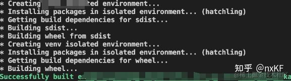


- 该命令执行完后，会在dist目录中生成如下红框内的文件：

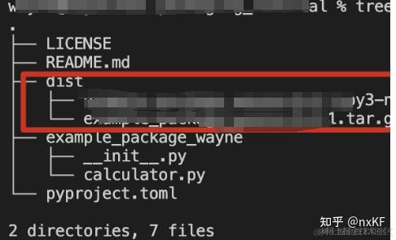

其中，`tar.gz`文件是源发行版`a source distribution `，而`.whl`文件是构建发行版`a built distribution`。

##### 把打包好的软件包上传到 PyPI

```text
twine upload dist/npts-0.0.1-py3-none-any.whl
或 
poetry -m publish #上传发布
```

##### 安装包

```text
pip3 install npts
```

##### pyproject.toml 完整参数说明

```text
[tool.poetry] # 是最基本的section，然后它由多个 sections 组成

name #package 名字，必填
version #package 版本号  ，必填
description #package 描述  ，必填
license #package 许可证，可选
authors #package 作者，必填
maintainers #package 维护者，可选
readme #package readme 文件，可选
README.rst 或 README.md
homepage #package 项目网站的 URL，可选
repository #package 指向项目 repository 的 URL，可选
documentation #package 项目文档的 URL，可选

keywords #与 package 相关的关键字列表(最多5个)，可选

[dependencies] and [dev-dependencies]
# 默认情况下，poetry 会从 Pypi 库中查找依赖项，只需要写名称、版本就行了

[tool.poetry.dependencies]
python = "^3.9" # 重点：必须声明与包兼容的python版本 python = "^3.9" 
requests = "^2.26.0"

[[tool.poetry.source]] # 使用私有存储库
name = 'private'
url = 'http://example.com/simple'

[extras] #支持可选依赖项
...

[tool.poetry.dependencies] # 这些软件包是强制性的
mandatory = "^1.0"
psycopg2 = { version = "^2.7", optional = true }    # 可选依赖项列表，可自行选择安装哪些
mysqlclient = { version = "^1.3", optional = true }
 
[tool.poetry.extras] 
mysql = ["mysqlclient"]
pgsql = ["psycopg2"]
```

> 当需要安装可选依赖库时
> poetry install --extras "mysql pgsql" poetry install -E mysql -E pgsql

### 类型推断

#### typing

`typing` 是 Python 标准库的一部分，用来写类型标注，比如 `list[int]`、`dict[str, int]`、`Optional[str]`、`TypedDict`、`Protocol`、`Literal` 等。**typing常用类型**

以下是typing包中常用的类型和泛型。

注意，int, float,bool,str, bytes不需要import typing，Any,Union,Tuple等需要import typing

**基本类型:**

- int: 整数类型
- float: 浮点数类型
- bool: 布尔类型
- str: 字符串类型
- bytes: 字节类型
- Any: 任意类型
- Union: 多个类型的联合类型，表示可以是其中任意一个类型
- Tuple: 固定长度的元组类型
- List: 列表类型
- Dict: 字典类型，用于键值对的映射

**泛型:**

- Generic: 泛型基类，用于创建泛型类或泛型函数
- TypeVar: 类型变量，用于创建表示不确定类型的占位符
- Callable: 可调用对象类型，用于表示函数类型
- [Optional](https://zhida.zhihu.com/search?content_id=229764108&content_type=Article&match_order=1&q=Optional&zhida_source=entity): 可选类型，表示一个值可以为指定类型或None
- Iterable: 可迭代对象类型
- Mapping: 映射类型，用于表示键值对的映射
- Sequence: 序列类型，用于表示有序集合类型
- Type:泛型类，用于表示类型本身

fun1里，标明了形参和返回值的类型，fun2中却没有。

```text
from typing import List, Tuple, Dict

def fun1(a0: int, s0: str, f0: float, b0: bool) -> Tuple[List, Tuple, Dict, bool]:
    list1 = list(range(a0))
    tup1 = (a0, s0, f0, b0)
    dict1 = {s0: f0}
    b1 = b0
    return list1, tup1, dict1, b1

def fun2(a0, s0, f0, b0):
    list1 = list(range(a0))
    tup1 = (a0, s0, f0, b0)
    dict1 = {s0: f0}
    b1 = b0
    return list1, tup1, dict1, b1

print(fun1(5, "KeyName", 2.3, False))


print(help(fun1))
"""
Help on function fun1 in module __main__:
fun1(a0: int, s0: str, f0: float, b0: bool) -> Tuple[List, Tuple, Dict, bool]
"""

print(help(fun2))
"""
Help on function fun2 in module __main__:
fun2(a0, s0, f0, b0)
"""
```

#### Pyrefly 

Pyrefly 是一个 Python 静态类型检查器，帮助你在代码运行前捕获类型相关的错误。它分析你的 Python 代码，确保整个代码库的类型一致性，使你的应用程序更可靠且易于维护。Pyrefly 支持 IDE 集成和命令行使用，让你在将类型检查融入工作流程时有更大的灵活性。类型检查的优势在你的 Python 代码中添加类型注解并使用 Pyrefly 这样的类型检查器，可以带来几个重要的优势：尽早捕获错误 在开发过程中识别类型相关的错误，而不是在运行时提升代码质量 类型注解作为动态文档，使你的代码更易读且自文档化增强开发者体验 通过准确的自动补全、重构工具和内联文档获得更好的 IDE 支持更安全的重构 在知道类型检查器会捕获不兼容类型使用的情况下，更有信心进行大规模更改更好的协作 类型在代码库的不同部分之间创建了清晰的契约，使团队更容易合作试试 Pyrefly这里有一个简单的例子，展示了 Pyrefly 如何捕获类型错误：# Example: Basic Type Checkingdef greet(name: str) -> str:  return "Hello, " + name# This works fine since both "World" is a string and greet expects a stringmessage = greet("World")# Pyrefly catches this error before runtime due to a type misatch between 42 and "str"# Error: Argument of type 'int' is not assignable to parameter of type 'str'error_message = greet(42)Python在这个例子中，Pyrefly 标记了第二个对 greet() 的调用，因为我们传递了一个整数 (42)，而期望的是字符串，这有助于你在代码运行前捕获这个问题。要了解更多关于 Python 类型注解以及如何有效使用它，请查看我们的 Python 类型注解入门 页面。

#### Pydantic

Pydantic 是 Python 中使用最广泛的数据验证库。快速且可扩展，Pydantic 与你的代码检查器/集成开发环境/大脑配合良好。以纯的、规范的 Python 3.8+ 定义数据应该如何；使用 Pydantic 对其进行验证。

成功

“迁移到 Pydantic V2”

使用 Pydantic V1 吗? 在应用程序中查看[迁移指南](https://pydantic.com.cn/migration/)以获取有关升级到 Pydantic V2 的注意事项！!

**Pydantic Example**

```
from datetime import datetime
from typing import Tuple

from pydantic import BaseModel


class Delivery(BaseModel):
    timestamp: datetime
    dimensions: Tuple[int, int]


m = Delivery(timestamp='2020-01-02T03:04:05Z', dimensions=['10', '20'])
print(repr(m.timestamp))
#> datetime.datetime(2020, 1, 2, 3, 4, 5, tzinfo=TzInfo(UTC))
print(m.dimensions)
#> (10, 20)
```

问题

“为什么 Pydantic 是这样命名的？”

“Pydantic”这个名字是“Py”和“pedantic”的混合词。“Py”部分表示该库与 Python 相关，而“pedantic”指的是该库在数据验证和类型强制方面的细致方法。

综合这些元素，“Pydantic”描述了我们的 Python 库，它提供了注重细节、严格的数据验证。

我们意识到具有讽刺意味的是，Pydantic V1 在其验证中并不严格，所以如果我们很“吹毛求疵”的话，在 V2 版本之前，“Pydantic”是一个用词不当的名称😉。

**为什么使用 Pydantic?[¶](https://pydantic.com.cn/#pydantic_1)**

- 由类型提示驱动——借助 Pydantic，模式验证和序列化由类型注释控制；学习的更少，编写的代码更少，并且与您的 IDE 和静态分析工具集成。了解更多……
- 速度——Pydantic 的核心验证逻辑是用 Rust 编写的。因此，Pydantic 是 Python 中最快的数据验证库之一。了解更多……
- JSON 模式——Pydantic 模型可以生成 JSON 模式，从而便于与其他工具进行集成。了解更多……
- 严格模式和宽松模式——Pydantic 可以在 `strict=True` 模式（数据不进行转换）或 `strict=False` 模式下运行（在适当的情况下，Pydantic 尝试将数据强制转换为正确类型）。了解更多……
- 数据类、类型字典等——Pydantic 支持对许多标准库类型的验证，包括 `dataclass` 和 `TypedDict` 。了解更多……
- 自定义——Pydantic 允许自定义验证器和序列化器以多种强大方式改变数据的处理方式。了解更多……
- 生态系统——PyPI 上约有 8000 个包使用 Pydantic，包括像 FastAPI、 huggingface、Django Ninja、SQLModel 和 LangChain 这样极受欢迎的库。了解更多……
- 经过实战检验——Pydantic 每月被下载超过 7000 万次，被所有 FAANG 公司以及纳斯达克 25 家最大公司中的 20 家所使用。如果你正试图用 Pydantic 做某事，那么可能其他人已经做过了。了解更多……

安装 Pydantic 就像这样简单： `pip install pydantic`

**Pydantic 使用例子[¶](https://pydantic.com.cn/#pydantic_2)**

**Validation Successful**

```
from datetime import datetime

from pydantic import BaseModel, PositiveInt


class User(BaseModel):
    id: int  
    name: str = 'John Doe'  
    signup_ts: datetime | None  
    tastes: dict[str, PositiveInt]  


external_data = {
    'id': 123,
    'signup_ts': '2019-06-01 12:22',  
    'tastes': {
        'wine': 9,
        b'cheese': 7,  
        'cabbage': '1',  
    },
}

user = User(**external_data)  

print(user.id)  
#> 123
print(user.model_dump())  
"""
{
    'id': 123,
    'name': 'John Doe',
    'signup_ts': datetime.datetime(2019, 6, 1, 12, 22),
    'tastes': {'wine': 9, 'cheese': 7, 'cabbage': 1},
}
"""
```

如果验证失败，Pydantic 会引发一个错误并详细说明哪里出错了：

**Validation Error**

```
# continuing the above example...

from pydantic import ValidationError


class User(BaseModel):
    id: int
    name: str = 'John Doe'
    signup_ts: datetime | None
    tastes: dict[str, PositiveInt]


external_data = {'id': 'not an int', 'tastes': {}}  

try:
    User(**external_data)  
except ValidationError as e:
    print(e.errors())
    """
    [
        {
            'type': 'int_parsing',
            'loc': ('id',),
            'msg': 'Input should be a valid integer, unable to parse string as an integer',
            'input': 'not an int',
            'url': 'https://pydantic.com.cn/errors/validation_errors#int_parsing',
        },
        {
            'type': 'missing',
            'loc': ('signup_ts',),
            'msg': 'Field required',
            'input': {'id': 'not an int', 'tastes': {}},
            'url': 'https://pydantic.com.cn/errors/validation_errors#missing',
        },
    ]
    """
```

### 代码格式化

#### ruff

Ruff是使用[Rust](https://zhida.zhihu.com/search?content_id=226726558&content_type=Article&match_order=1&q=Rust&zhida_source=entity)编写的超快Python静态分析工具。

我们看看它于市面上主流Python分析工具性能对比


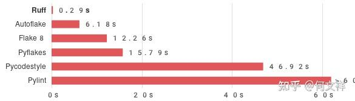

上面是针对[CPython](https://zhida.zhihu.com/search?content_id=226726558&content_type=Article&match_order=1&q=CPython&zhida_source=entity)源码进行分析时间开销，我们可以很直观看出Ruff完全碾压其余竞品。架设我们项目结构如下：

```text
number
    ├── __init__.py
    └── number.py
```

**number.py** 包含如下代码：

```python
from typing import List

import os


def sum_even_numbers(numbers: List[int]) -> int:
    """Given a list of integers, return the sum of all even numbers in the list."""
    return sum(num for num in numbers if num % 2 == 0)
```

通过PyPI安装Ruff

```text
$ pip install ruff
```

安装完后，我们使用如下执行ruff

```text
$ ruff check .
number.py:3:8: F401 [*] `os` imported but unused
Found 1 error.
[*] 1 potentially fixable with the --fix option.
```

Ruff指示这里有未使用的导入，它是一个Python里的常见错误。Ruff还指示该错误是"fixable"，即可以通过如下方式自动修复错误：

```text
$ ruff check --fix .
Found 1 error (1 fixed, 0 remaining).
```

这里我们就发现`import os`给自动移除了。

##### 配置

为给整个项目里的Python文件指定配置，Ruff会目录下寻找`pyproject.toml`或者`ruff.toml`文件。

我们来在项目根目录下创建一个`pyproject.toml`文件。

```text
[project]
# Support Python 3.10+.
requires-python = ">=3.10"

[tool.ruff]
# Decrease the maximum line length to 79 characters.
line-length = 79
src = ["src"]
```

##### 规则

Ruff支持超过[500个lint规则](https://link.zhihu.com/?target=https%3A//beta.ruff.rs/docs/rules/)，它们分布在超过40个内建插件中，根据项目所需进行选择：一些是非常严格规则，一些是框架特定的。

默认Ruff设定E-和F-前缀的规则相应派生至[pycodestyle](https://zhida.zhihu.com/search?content_id=226726558&content_type=Article&match_order=1&q=pycodestyle&zhida_source=entity)和[Pyflakes](https://zhida.zhihu.com/search?content_id=226726558&content_type=Article&match_order=1&q=Pyflakes&zhida_source=entity)。

如果你是一个linter新手，那么默认规则是一个非常好的开始，只专注公共错误。

如果你是从其它工具迁移过来的linter，你可以开启和之前所使用的相同规则。例如，如果要配置[pyupgrade](https://zhida.zhihu.com/search?content_id=226726558&content_type=Article&match_order=1&q=pyupgrade&zhida_source=entity)规则，我们可以如下对`pyproject.toml`配置：

```text
[tool.ruff]
select = [
  "E",   # pycodestyle
  "F",   # pyflakes
  "UP",  # pyupgrade
]
```

再次运行Ruff，现在强制遵循pyupgrade规则。

```text
$ ruff check .
number/number.py:5:31: UP006 [*] Use `list` instead of `List` for type annotations
number/number.py:6:80: E501 Line too long (83 > 79 characters)
Found 2 errors.
[*] 1 potentially fixable with the --fix option.
```

或者我们还想强制所有的函数都必须编写docstings：

```text
[tool.ruff]
    select = [
      "E",   # pycodestyle
      "F",   # pyflakes
      "UP",  # pyupgrade
      "D",   # pydocstyle
    ]

    [tool.ruff.pydocstyle]
    convention = "google"
```

再次运行，我们将强制遵循pydocstyle规则：

```text
$ ruff check .
number/__init__.py:1:1: D104 Missing docstring in public package
number/number.py:1:1: D100 Missing docstring in public module
number/number.py:5:31: UP006 [*] Use `list` instead of `List` for type annotations
number/number.py:5:80: E501 Line too long (83 > 79 characters)
Found 3 errors.
[*] 1 potentially fixable with the --fix option.
```

##### 忽略错误

通过使用#noqa注释来忽略行级检测。

```python
from typing import List


def sum_even_numbers(numbers: List[int]) -> int:  # noqa: UP006
    """Given a list of integers, return the sum of all even numbers in the list."""
    return sum(num for num in numbers if num % 2 == 0)
```

再次执行就没有指示`List`导入问题了。

如果想整个文件有效那么，在文件顶部加入 `# ruff: noqa: UP006`

```python
# ruff: noqa: UP006
from typing import List


def sum_even_numbers(numbers: List[int]) -> int:
    """Given a list of integers, return the sum of all even numbers in the list."""
    return sum(num for num in numbers if num % 2 == 0)
```

Ruff支持使用`--add-noqa`参数来为代码增加`# noqa`指令，我们可以组合`--add-noqa`和`--select`配置`UP006`规范忽律

```text
$ ruff check --select UP006 --add-noqa .
Added 1 noqa directive.
```

##### 持续集成

pre-commit 钩子中使用：

```yaml
- repo: https://github.com/charliermarsh/ruff-pre-commit
      # Ruff version.
      rev: 'v0.0.261'
      hooks:
        - id: ruff
```

##### 编辑器集成

[VS Code 扩展](https://link.zhihu.com/?target=https%3A//github.com/charliermarsh/ruff-vscode)或者使用[Ruff LSP](https://link.zhihu.com/?target=https%3A//github.com/charliermarsh/ruff-lsp)集成其它编辑器

#### black

**Black** 被称为”The uncompromising code formatter”（不妥协的代码格式化工具），是由Łukasz Langa开发并由Python Software Foundation维护的Python代码格式化工具。Black的核心理念是：

> “Any color you like.”（任何你喜欢的颜色。）

这句话来自于Henry Ford关于Model T汽车的名言——“你可以选择任何颜色，只要它是黑色的”。Black采用了类似的哲学：**通过放弃对代码格式细节的控制权，换取速度、确定性，以及从格式争论中解放出来的自由**。

Black的主要特点：

- **确定性输出**：相同的代码输入总是产生相同的格式化输出
- **最小化差异**：生成尽可能小的代码差异，使代码审查更高效
- **统一风格**：无论是哪个项目，使用Black格式化后的代码看起来都是一致的
- **AST安全检查**：格式化后会验证代码的抽象语法树（AST）是否与原始代码等效

##### 6.1 Pre-commit集成

使用pre-commit可以在提交代码前自动运行格式化检查：

创建`.pre-commit-config.yaml`：

```
repos:
  - repo: https://github.com/psf/black
    rev: 24.10.0
    hooks:
      - id: black
        language_version: python3.11

  - repo: https://github.com/pycqa/isort
    rev: 5.13.2
    hooks:
      - id: isort
        args: ["--profile", "black", "--filter-files"]
```

安装pre-commit钩子：

```
pip install pre-commit
pre-commit install
```

##### 6.2 GitHub Actions集成

创建`.github/workflows/lint.yml`：

```
name: Lint

on:
  push:
    branches: [main, develop]
  pull_request:
    branches: [main, develop]

jobs:
  lint:
    runs-on: ubuntu-latest
    steps:
      - uses: actions/checkout@v4
      
      - name: Set up Python
        uses: actions/setup-python@v5
        with:
          python-version: "3.11"
      
      - name: Install dependencies
        run: |
          pip install black isort
      
      - name: Check formatting with Black
        run: black --check --diff .
      
      - name: Check import sorting with isort
        run: isort --check-only --diff --profile black .
```

##### 6.3 跳过特定代码块

###### Black跳过格式化

```
# fmt: off
# 这里的代码不会被格式化
matrix = [
    [1, 0, 0],
    [0, 1, 0],
    [0, 0, 1],
]
# fmt: on

# 单行跳过
x = [1,2,3]  # fmt: skip
```

###### isort跳过导入排序

```
# isort: skip_file
"""整个文件跳过isort处理"""

import b
import a


# 或者单个导入跳过
import specific_module  # isort: skip
```

### 

### 文件管理 

#### glob

**glob模块**也是Python标准库中一个重要的模块，主要用来**查找符合特定规则的目录和文件**，并将搜索的到的**结果返回到一个列表中**。使用这个模块最主要的原因就是，该模块支持几个特殊的[正则通配符](https://zhida.zhihu.com/search?content_id=199065431&content_type=Article&match_order=1&q=正则通配符&zhida_source=entity)，用起来贼方便，这个将会在下方为大家进行详细讲解。

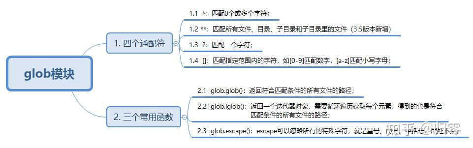

##### 一、支持4个常用的通配符

使用glob模块能够快速查找我们想要的目录和文件，就是由于它支持*、**、? 、[ ]这三个通配符，那么它们到底是 什么意思呢？

*：匹配0个或多个字符；

**：匹配所有文件、目录、子目录和子目录里的文件（3.5版本新增）；

?：代匹配一个字符；

[]：匹配指定范围内的字符，如[0-9]匹配数字，[a-z]匹配小写字母；

注意：这3个通配符的用法，将在讲函数的时候，一起带大家操作一遍；

##### 二、glob库中主要的3个函数

其实glob库很简单，只有3个主要函数供我们使用，它们分别是glob()、iglob()、escape()函数，因此学习起来特别容易。

glob.glob()：返回符合匹配条件的所有文件的路径；

glob.iglob()：返回一个迭代器对象，需要循环遍历获取每个元素，得到的也是符合匹配条件的所有文件的路径；

glob.escape()：escape可以忽略所有的特殊字符，就是星号、问号、中括号，用处不大；

recursive=False：代表递归调用，与特殊通配符“**”一同使用，默认为False，False表示不递归调用，True表示递归调用；

##### 2.1 glob()函数

```text
path1 = r"C:\Users\黄伟\Desktop\publish\os模块\test_shutil_a\[0-9].png"
glob.glob(path1)

path2 = r"C:\Users\黄伟\Desktop\publish\os模块\test_shutil_a\[0-9a-z].*"
glob.glob(path2)
```

结果如下：

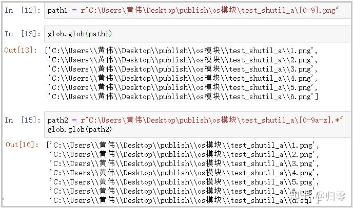

##### 2.2 iglob()函数

```text
path1 = r"C:\Users\黄伟\Desktop\publish\os模块\test_shutil_a\[0-9].png"
a = glob.iglob(path1)
for i in a:
    print(i)
```

结果如下：

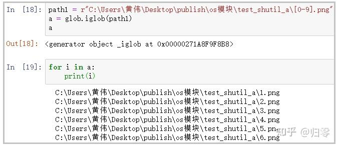

##### 2.3 escape()函数

通过下方两行代码的对比，可以看出escape()函数只是让*只表示它本来的意思，而不再具有通配符的作用。

```text
glob.glob('t*')
glob.escape('t*')
```

结果如下：

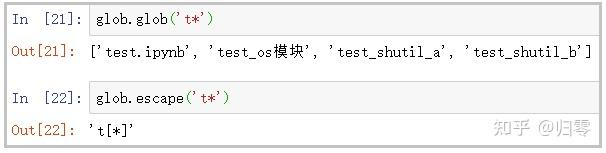

### 测试

#### pytest

Pytest是一个基于python的测试框架，用于编写和执行测试代码。在当今的 REST 服务中，pytest 主要用于 API 测试，尽管我们可以使用 pytest 编写简单到复杂的测试，即我们可以编写代码来测试 API、数据库、UI 等。

##### 安装Pytest

要开始安装，请执行以下命令 -

```python
pip install pytest == 2.9.1
```

我们可以安装任何版本的 pytest。这里，2.9.1 是我们正在安装的版本。

要安装最新版本的 pytest，请执行以下命令 -

```python
pip install pytest
```

使用以下命令确认安装以显示 pytest 的帮助部分。

```python
pytest -h
```

##### 使用Pytest

在不提及文件名的情况下运行 pytest 将运行所有格式的文件**test_\*.py**要么***_test.py**在当前目录和子目录中。Pytest 自动将这些文件识别为测试文件。我们**能够**通过明确提及它们使 pytest 运行其他文件名。Pytest 要求测试函数名称以**test**. 不符合格式的函数名称**test\***不被 pytest 视为测试函数。我们**cannot**明确地让 pytest 考虑任何不以**test**作为测试函数。


#### PyUnit / Unittest

