# MySQL

## 原理基础

### 架构

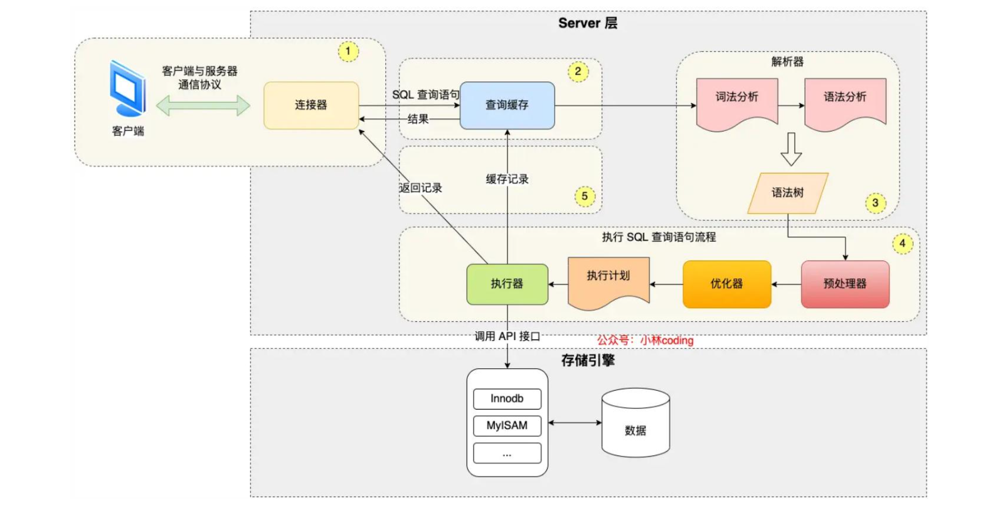

MySQL 的架构共分为两层：Server 层和存储引擎层，

Server 层负责建⽴连接、分析和执⾏ SQL。MySQL ⼤多数的核⼼功能模块都在这实现，主要包括连接器，查询缓存、解析器、预处理器、优化器、执⾏器等。另外，所有的内置函数（如⽇期、时间、数学和加密函数等）和所有跨存储引擎的功能（如存储过程、触发器、视图等。）都在 Server 层实现。

存储引擎层负责数据的存储和提取。⽀持 InnoDB、MyISAM、Memory 等多个存储引擎，不同的存储引擎共⽤⼀个 Server 层。现在最常⽤的存储引擎是 InnoDB，从 MySQL 5.5 版本开始， InnoDB 成为了 MySQL的默认存储引擎。我们常说的索引数据结构，就是由存储引擎层实现的，不同的存储引擎⽀持的索引类型也不相同，⽐如 InnoDB ⽀持索引类型是 B+ 树 ，且是默认使⽤，也就是说在数据表中创建的主键索引和⼆级索引默认使⽤的是 B+ 树索引。

需要注意：大多数Sql语句是在Server处理的，存储引擎在查询过程中主要职责是扫描并返回记录。我们可以认为对于一条Select语句，存储引擎仅仅根据执行器给出的指令确定某个起始位置和终止位置，然后开始进行全部扫描和返回；而哪些记录符合Sql语句条件要求哪些不符合，哪些需要做运算哪些不用，这些工作均为Server的内容。如果你理解了这个分工，那么你就可以理解索引为什么会如此重要——没有索引，执行器给存储引擎发出的指令只能是全表扫描；而利用索引，存储引擎可以利用 B+树等索引结构先确定一个扫描范围，从而只做局部扫描。

### 执行过程

#### 连接器

如果你在 Linux 操作系统⾥要使⽤ MySQL，那你第⼀步肯定是要先连接 MySQL 服务，然后才能执⾏ SQL 语句，普遍我们都是使⽤下⾯这条命令进⾏连接：

```shell
## -h 指定 MySQL 服务得 IP 地址，如果是连接本地的 MySQL 服务，可以不用这个参数；
## -u 指定用户名，管理员角色名为 root;
## -p 指定密码，如果命令行中不填写密码（为了密码安全，建议不要在命令行写密码），就需要在交互对话里面输入密码
mysql -h$ip -u$user -p
```

连接的过程需要先经过 TCP 三次握⼿，因为 MySQL 是基于 TCP 协议进⾏传输的。如果 MySQL 服务正常运⾏，完成 TCP 连接的建⽴后，连接器就要开始验证你的⽤户名和密码。如果⽤户密码都没有问题，连接器就会获取该⽤户的权限，然后保存起来，后续该⽤户在此连接⾥的任何操作，都会基于连接开始时读到的权限进⾏权限逻辑的判断。所以，如果⼀个⽤户已经建⽴了连接，即使管理员中途修改了该⽤户的权限，也不会影响已经存在连接的权限。修改完成后，只有再新建的连接才会使⽤新的权限设置。

如果你想知道当前 MySQL 服务被多少个客户端连接了，你可以执⾏ show processlist 命令进⾏查看。MySQL 定义了空闲连接的最⼤空闲时长，由 wait_timeout 参数控制的，默认值是 8 ⼩时（28880秒），如果空闲连接超过了这个时间，连接器就会⾃动将它断开。当然，我们⾃⼰也可以⼿动断开空闲的连接，使⽤的是 kill connection + id 的命令。

⼀个处于空闲状态的连接被服务端主动断开后，这个客户端并不会马上知道，等到客户端在发起下⼀个请求的时候，才会收到这样的报错“ERROR 2013 (HY000): Lost connection to MySQL server during query”。MySQL 服务⽀持的最⼤连接数由 max_connections 参数控制，超过这个值，系统就会拒绝接下来的连接请求，并报错提⽰“Too many connections”。

MySQL 的连接也跟 HTTP ⼀样，有短连接和长连接的概念，它们的区别如下：

```shell
// 短连接  
连接 mysql 服务 (TCP 三次握手)  
执行sql  
断开 mysql 服务 (TCP 四次挥手)

//长连接  
连接 mysql 服务（TCP三次握手）  
执行sql  
执行sql  
执行sql  
断开 mysql 服务（TCP四次挥手）
```

可以看到，使⽤长连接的好处就是可以减少建⽴连接和断开连接的过程，所以⼀般是推荐使⽤长连接。

但是，使⽤长连接后可能会占⽤内存增多。如果长连接累计很多，将导致 MySQL 服务占⽤内存太⼤，有可能会被系统强制杀掉，这样会发⽣ MySQL 服务异常重启的现象。

有两种解决⽅式。

* 定期断开长连接。既然断开连接后就会释放连接占⽤的内存资源，那么我们可以定期断开长连接。

* 客户端主动重置连接。MySQL 5.7 版本实现了 mysql_reset_connection() 函数这是函数不是命令，那么当客户端执⾏了⼀个很⼤的操作后，在代码⾥调⽤ mysql_reset_connection 函数来重置连接，达到释放内存的效果。这个过程不需要重连和重新做权限验证，但是会将连接恢复到刚刚创建完时的状态。

#### 查询缓存

MySQL 服务收到 SQL 语句后，就会解析出SQL 语句的第⼀个字段，看看是什么类型的语句。

如果 SQL 是查询语句（select 语句），MySQL 就会先去查询缓存（ Query Cache ）⾥查找缓存数据，看看之前有没有执⾏过这⼀条命令，这个查询缓存是以 key-value 形式保存在内存中的，key 为 SQL 查询语句，value 为 SQL语句查询的结果。如果查询的语句命中查询缓存，那么就会直接返回 value 给客户端。如果查询的语句没有命中查询缓存中，那么就要往下继续执⾏，等执⾏完后，查询的结果就会被存⼊查询缓存中。

这么看，查询缓存还挺有⽤，但是其实查询缓存挺鸡肋的。对于更新⽐较频繁的表，查询缓存的命中率很低的，因为只要⼀个表有更新操作，那么这个表的查询缓存就会被清空。如果刚缓存了⼀个查询结果很⼤的数据，还没被使⽤的时候，刚好这个表有更新操作，查询缓冲就被清空了，相当于缓存了个寂寞。所以，MySQL 8.0 版本直接将Server层的查询缓存机制删掉了。

#### 解析器

在正式执⾏ SQL 查询语句之前， MySQL 会先对 SQL 语句做解析，这个⼯作交由「解析器」来完成。解析器会做如下两件事情：

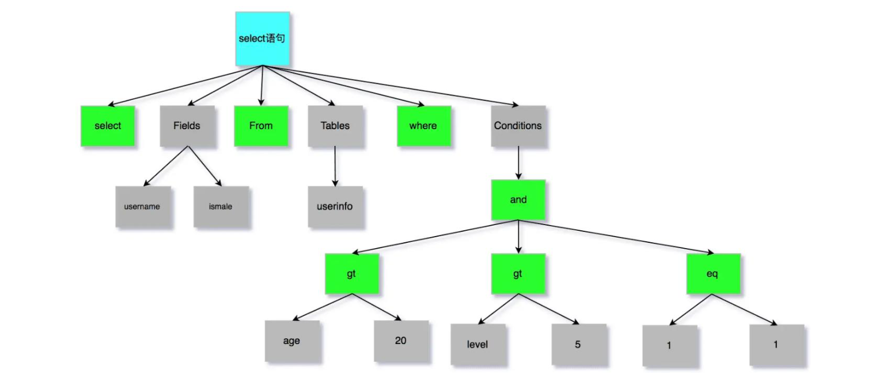

* 第⼀件事情，词法分析。MySQL 会根据你输⼊的字符串识别出关键字出来。
* 第⼆件事情，语法分析。根据词法分析的结果，语法解析器会根据语法规则，判断你输⼊的这个 SQL 语句是否满⾜MySQL 语法，如果没问题就会构建出 SQL 语法树，这样⽅便后⾯模块获取 SQL 类型、表名、字段名、 where 条件等等。

但是注意，表不存在或者字段不存在，并不是在解析器⾥做的，解析器只负责检查语法和构建语法树，但是不会去查表或者字段存不存在。

#### 执行

经过解析器后，接着就要进⼊执⾏ SQL 查询语句的流程了，每条SELECT 查询语句流程主要可以分为下⾯这三个阶段：

* prepare 阶段，也就是预处理阶段；

* optimize 阶段，也就是优化阶段；

* execute 阶段，也就是执⾏阶段；

##### 预处理器

预处理阶段会检查 SQL 查询语句中的表或者字段是否存在并将 select * 中的\* 符号扩展为表上的所有列。

##### 优化器

经过预处理阶段后，还需要为 SQL 查询语句先制定⼀个执⾏计划，这个⼯作交由「优化器」来完成的。

优化器主要负责将 SQL 查询语句的执⾏⽅案确定下来，⽐如在表⾥⾯有多个索引的时候，优化器会基于查询成本的考虑，来决定选择使⽤哪个索引。

要想知道优化器选择了哪个索引，我们可以在查询语句最前⾯加个 explain命令，这样就会输出这条 SQL 语句的执⾏计划，然后执⾏计划中的 key 就表⽰执⾏过程中使⽤了哪个索引，⽐如下图的 key 为 PRIMARY 就是使⽤了主键索引。

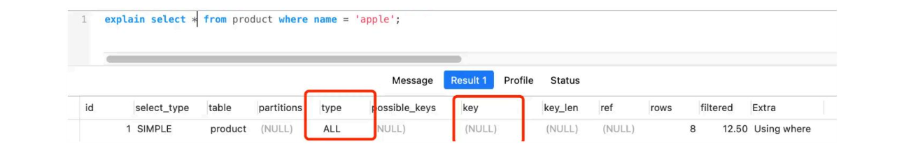

如果查询语句的执⾏计划⾥的 key 为 null 说明没有使⽤索引，那就会全表扫描（type $=$ ALL），这种查询扫描的⽅式是效率最低档次的。

##### 执行器

经历完优化器后，就确定了执⾏⽅案，接下来 MySQL 就真正开始执⾏语句了，这个⼯作是由「执⾏器」完成的。在执⾏的过程中，执⾏器就会和存储引擎交互了，交互是以记录为单位的。根据查询的索引情况可以进一步分为：

* 主键索引查询
* 全表扫描
* 索引下推

**主键索引查询**

```sql
select * from product where id = 1;  
```

这条查询语句的查询条件⽤到了主键索引，⽽且是等值查询，同时主键 id 是唯⼀，不会有 id 相同的记录，所以优化器决定选⽤访问类型为 const 进⾏查询，也就是使⽤主键索引查询⼀条记录，那么执⾏器与存储引擎的执⾏流程是这样的：

* 执⾏器第⼀次查询，会调⽤ read_first_record 函数指针指向的函数，因为优化器选择的访问类型为 const，这个函数指针被指向为 InnoDB 引擎索引查询的接口，把条件 id = 1 交给存储引擎，让存储引擎定位符合条件的第⼀条记录。

* 存储引擎通过主键索引的 B+ 树结构定位到 id = 1的第⼀条记录，如果记录是不存在的，就会向执⾏器上报记录找不到的错误，然后查询结束。如果记录是存在的，就会将记录返回给执⾏器；

* 执⾏器从存储引擎读到记录后，接着判断记录是否符合查询条件，如果符合则发送给客户端，如果不符合则跳过该记录。

* 执⾏器查询的过程是⼀个 while 循环，所以下一次会调⽤read_record 函数指针指向的函数，因为优化器选择的访问类型为 const，这个函数指针被指向为⼀个永远返回 - 1 的函数，所以当调⽤该函数的时候，执⾏器就退出循环，也就是结束查询了。

⾄此，这个语句就执⾏完成了。

**全表扫描**

```sql
select * from product where name = 'iphone'; 
```

这条查询语句的查询条件没有⽤到索引，所以优化器决定选⽤访问类型为 ALL 进⾏查询，也就是全表扫描的⽅式查询，那么这时执⾏器与存储引擎的执⾏流程是这样的：

* 执⾏器第⼀次查询，会调⽤ read_first_record 函数指针指向的函数，因为优化器选择的访问类型为 all，这个函数指针被指向为 InnoDB 引擎全扫描的接⼜，让存储引擎读取表中的第⼀条记录；

* 执⾏器会判断读到的这条记录的 name 是不是 iphone，如果不是则跳过；如果是则将记录发给客户的（是的没错，Server 层每从存储引擎读到⼀条记录就会发送给客户端，之所以客户端显⽰的时候是直接显⽰所有记录的，是因为客户端是等查询语句查询完成后，才会显⽰出所有的记录）。

* 执⾏器查询的过程是⼀个 while 循环，所以下一次会调⽤ read_record 函数指针指向的函数，因为优化器选择的访问类型为 all，read_record 函数指针指向的还是 InnoDB 引擎全扫描的接⼜，所以接着向存储引擎层要求继续读刚才那条记录的下⼀条记录，存储引擎把下⼀条记录取出后就将其返回给执⾏器（Server层），执⾏器继续判断条件，不符合查询条件即跳过该记录，否则发送到客户端；

* ⼀直重复上述过程，直到存储引擎把表中的所有记录读完，然后向执⾏器（Server层） 返回了读取完毕的信息；执⾏器收到存储引擎报告的查询完毕的信息，退出循环，停⽌查询。

⾄此，这个语句就执⾏完成了。

**索引下推**

索引下推能够减少⼆级索引在查询时的回表操作，提⾼查询的效率，因为它将 Server 层部分负责的事情，交给存储引擎层去处理了。举⼀个具体的例⼦，对 age 和 reward 字段建⽴了联合索引（age，reward）：

```sql
select * from t_user where age > 20 and reward = 100000; 
```

联合索引当遇到范围查询 $( > , ~ < )$ 就会停⽌匹配，也就是 age 字段能⽤到联合索引，但是 reward 字段则⽆法利⽤到索引。简单来说是因为联合索引第一级字段有序，而第二级字段只在等值第一级字段内局部有序而全局无序，所以，在不使用索引下推时：

- Server 层⾸先调⽤存储引擎的接⼜定位到满⾜查询条件的第⼀条⼆级索引记录，也就是定位到 age >20 的第⼀条记录；
- 存储引擎根据⼆级索引的 B+ 树快速定位到这条记录后，获取主键值，然后进⾏回表操作，将完整的记录返回给 Server 层；
- Server 层在判断该记录的 reward 是否等于 100000，如果成⽴则将其发送给客户端；否则跳过该记录；
- 接着，继续向存储引擎索要下⼀条记录，存储引擎在⼆级索引定位到记录后，获取主键值，然后回表操作，将完整的记录返回给 Server 层；
- 如此往复，直到存储引擎把表中的所有记录读完。

可以看到，没有索引下推的时候，每查询到⼀条⼆级索引记录，都要进⾏回表操作，然后将记录返回给 Server，接着 Server 再判断该记录的 reward 是否等于 100000。⽽使⽤索引下推后，判断记录的 reward 是否等于 100000 的⼯作交给了存储引擎层，过程如下 ：

* Server 层⾸先调⽤存储引擎的接⼜定位到满⾜查询条件的第⼀条⼆级索引记录，也就是定位到 age > 20 的第⼀条记录；

* 存储引擎定位到⼆级索引后，先不执⾏回表操作，⽽是先判断⼀下该索引中包含的列（reward列）的条件（reward 是否等于 100000）是否成⽴。如果条件不成⽴，则直接跳过该⼆级索引。如果成⽴，则执⾏回表操作，将完成记录返回给 Server 层。

* Server 层在判断其他的查询条件（本次查询没有其他条件）是否成⽴，如果成⽴则将其发送给客户端；否则跳过该记录，然后向存储引擎索要下⼀条记录。

* 如此往复，直到存储引擎把表中的所有记录读完。

可以看到，使⽤了索引下推后，虽然 reward 列⽆法使⽤到联合索引，但是因为它包含在联合索引（age，reward）⾥，所以直接在存储引擎过滤出满⾜ reward = 100000 的记录后，才去执⾏回表操作获取整个记录。相⽐于没有使⽤索引下推，节省了很多回表操作。当你发现执⾏计划⾥的 Extr 部分显⽰了 “Using index condition”，说明使⽤了索引下推。

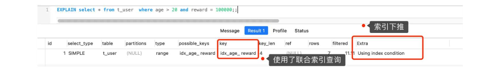

### 存储过程

MySQL 存储的⾏为是由存储引擎实现的，MySQL ⽀持多种存储引擎，不同的存储引擎保存的⽂件⾃然也不同。InnoDB 是我们常⽤的存储引擎，也是 MySQL 默认的存储引擎。所以，本⽂主要以 InnoDB 存储引擎展开讨论。

#### 表结构

我们每创建⼀个 database（数据库） 都会在 /var/lib/mysql/ ⽬录⾥⾯创建⼀个以 database 为名的⽬录，然后保存表结构和表数据的⽂件都会存放在这个⽬录⾥。⽐如，我这⾥有⼀个名为 my_test 的 database，该 database ⾥有⼀张名为 t_order 数据库表。

```
[root@xiaolin ~]#ls /var/lib/mysql/my_test  
db.opt  
t_order.frm  
t_order.ibd 
```

可以看到，共有三个⽂件，这三个⽂件分别代表着：

* db.opt，⽤来存储当前数据库的默认字符集和字符校验规则。

* t_order.frm ，t_order 的表结构会保存在这个⽂件。在 MySQL 中建⽴⼀张表都会⽣成⼀个.frm ⽂件，该⽂件是⽤来保存每个表的元数据信息的，主要包含表结构定义。

* t_order.ibd，t_order 的表数据会保存在这个⽂件。表数据既可以存在共享表空间⽂件（⽂件名：ibdata1）⾥，也可以存放在独占表空间⽂件（⽂件名：表名字.ibd）。这个⾏为是由参数 innodb_file_per_table 控制的，若设置了参数 innodb_file_per_table 为 1，则会将存储的数据、索引等信息单独存储在⼀个独占表空间，从 MySQL 5.6.6 版本开始，它的默认值就是 1 了，因此从这个版本之后， MySQL 中每⼀张表的数据都存放在⼀个独⽴的 .ibd ⽂件。

表空间由段（segment）、区（extent）、页（page）、⾏（row）组成，InnoDB存储引擎的逻辑存储结构⼤致如下图：

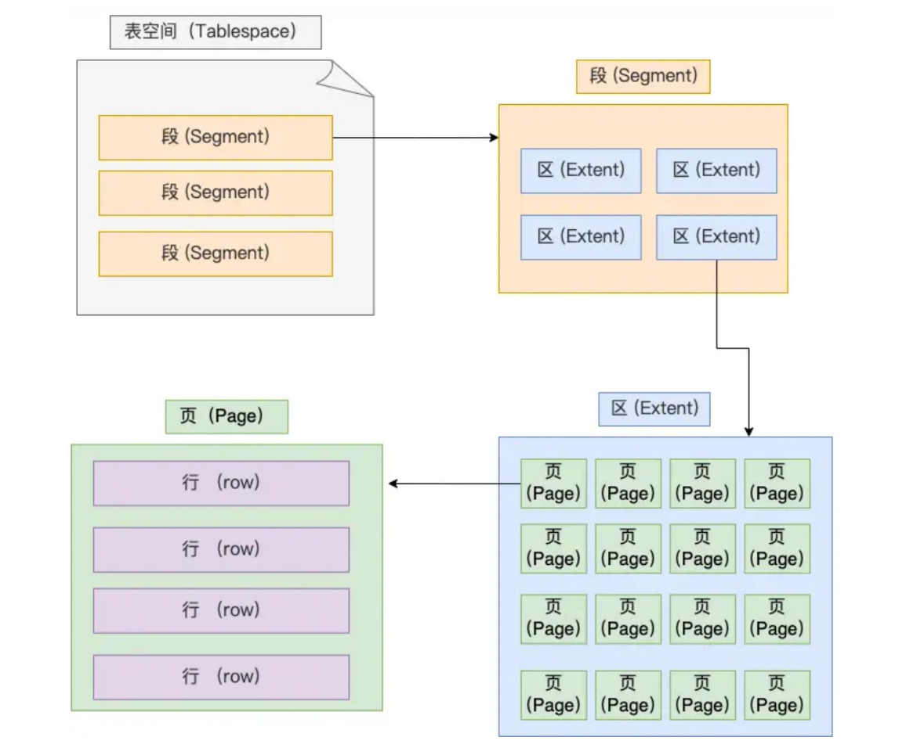

* 行（Row）：数据库表中的记录都是按⾏（row）进⾏存放的，每⾏记录根据不同的⾏格式，有不同的存储结构。
* 页（Page）：记录是按照⾏来存储的，但是数据库的读取并不以「⾏」为单位，InnoDB 的数据是按「页」为单位来读写的。默认每个页的⼤⼩为 16KB，也就是最多能保证 16KB 的连续存储空间。页是 InnoDB 存储引擎磁盘管理的最⼩单元，意味着数据库每次读写都是以 16KB 为单位的，⼀次最少从磁盘中读取 16K 的内容到内存中，⼀次最少把内存中的 16K 内容刷新到磁盘中。页的类型有很多，常见的有数据页、undo ⽇志页、溢出页等等。数据表中的⾏记录是⽤「数据页」来管理的。
* 区（extent）：B+ 树中每⼀层都是通过双向链表连接起来的，如果是以页为单位来分配存储空间，那么链表中相邻的两个页之间的物理位置并不是连续的，磁盘查询时就会有⼤量的随机I/O，随机 I/O 是⾮常慢的。在表中数据量⼤的时候，为某个索引分配空间的时候就不再按照页为单位分配了，⽽是按照区（extent）为单位分配。每个区的⼤⼩为 1MB，对于 16KB 的页来说，连续的 64 个页会被划为⼀个区，这样就使得链表中相邻的页的物理位置也相邻，就能使⽤顺序 I/O 了。
* 段（segment）：表空间是由各个段（segment）组成的，段是由多个区（extent）组成的。段⼀般分为数据段、索引段和回滚段等。
  * 索引段：存放 B + 树的⾮叶⼦节点的区的集合；
  * 数据段：存放 B + 树的叶⼦节点的区的集合；
  * 回滚段：存放的是回滚数据的区的集合，之前讲事务隔离的时候就介绍到了 MVCC 利⽤了回滚段实现了多版本查询数据。

简单来说：行是记录的基本单元，而页是分配管理的基本单元，区是比页更大一级的分配单元，而段是空间的逻辑划分。

#### 行结构

⾏格式（row_format），就是⼀条记录的存储结构。InnoDB 提供了 4 种⾏格式，分别是 Redundant、Compact、Dynamic和 Compressed ⾏格式。

* Redundant 是很古⽼的⾏格式了， MySQL 5.0 版本之前⽤的⾏格式，现在基本没⼈⽤了。

* 由于 Redundant 不是⼀种紧凑的⾏格式，所以 MySQL 5.0 之后引⼊了 Compact ⾏记录存储⽅式，Compact是⼀种紧凑的⾏格式，设计的初衷就是为了让⼀个数据页中可以存放更多的⾏记录，从 MySQL 5.1 版本之后，⾏格式默认设置成 Compact。

* Dynamic 和 Compressed 两个都是紧凑的⾏格式，它们的⾏格式都和 Compact 差不多，因为都是基于Compact 改进⼀点东西。从 MySQL5.7 版本之后，默认使⽤ Dynamic ⾏格式。

这次重点介绍 Compact ⾏格式，因为 Dynamic 和Compressed 这两个⾏格式跟 Compact ⾮常像。

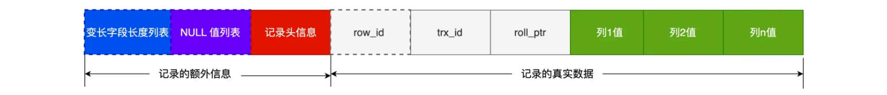

可以看到，⼀条完整的记录分为「记录的额外信息」和「记录的真实数据」两个部分。

记录的额外信息包含 3 个部分：变长字段长度列表、NULL 值列表、记录头信息。

* 变长字段长度列表：varchar 是变长的，变长字段实际存储的数据的长度不固定的。所以，在存储数据的时候，也要把数据占⽤的⼤⼩存起来，存到「变长字段长度列表」⾥⾯，读取数据的时候才能根据这个「变长字段长度列表」去读取对应长度的数据。其他 TEXT、BLOB 等变长字段也是这么实现的。

```sql
CREATE TABLE `t_user` (  
    `id` int(11) NOT NULL,  
    `name`VARCHAR(20) DEFAULT NULL,  
    `phone`VARCHAR(20) DEFAULT NULL,  
    `age`int(11) DEFAULT NULL,  
PRIMARY KEY (`id`) USING BTREE  
) ENGINE = InnoDB DEFAULT CHARACTER SET = ascii ROW_FORMAT = COMPACT; 

```

| id   | name | phone | age  |
| ---- | ---- | ----- | ---- |
| 1    | a    | 123   | 18   |
| 2    | bb   | 1234  | Null |
| 3    | ccc  | Null  | Null |

现在 t_user 表⾥有这三条记录，先来看第⼀条记录：

name 列的值为 a，真实数据占⽤的字节数是 1 字节，⼗六进制 0×01 ；phone 列的值为 123，真实数据占⽤的字节数是 3 字节，⼗六进制 0×03 ；age 列和 id 列不是变长字段，所以这⾥不⽤管。

这些变长字段的真实数据占⽤的字节数会按照列的顺序逆序存放，所以「变长字段长度列表」⾥的内容是「 03 01」，⽽不是 「01 03」。

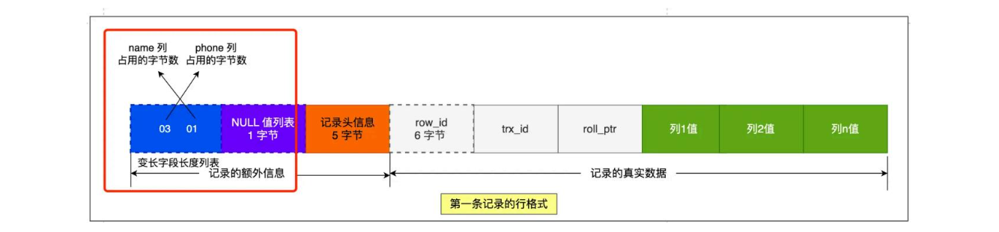

同样的道理，我们也可以得出第⼆条记录的⾏格式中，「变长字段长度列表」⾥的内容是「 04 02」，如下图：

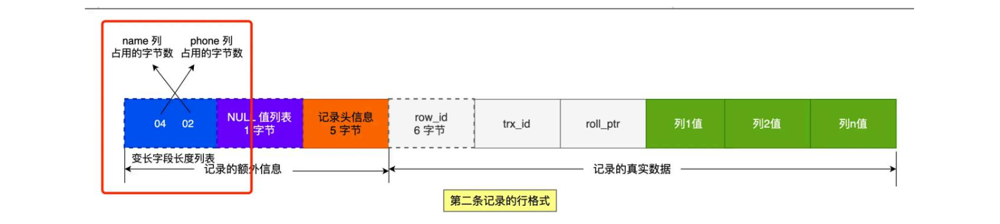

第三条记录中 phone 列的值是 NULL，NULL 是不会存放在⾏格式中记录的真实数据部分⾥的，所以「变长字段长度列表」⾥不需要保存值为 NULL 的变长字段的长度。

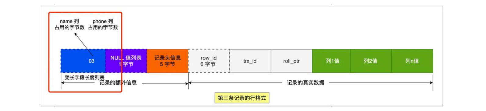

为什么「变长字段长度列表」的信息要按照逆序存放？

这个设计是有想法的，主要是因为「记录头信息」中指向下⼀个记录的指针，指向的是下⼀条记录的「记录头信息」和「真实数据」之间的位置，这样的好处是向左读就是记录头信息，向右读就是真实数据，⽐较⽅便。「变长字段长度列表」中的信息之所以要逆序存放，是因为这样可以使得位置靠前的记录的真实数据和数据对应的字段长度信息可以同时在⼀个 CPU Cache Line 中，这样就可以提⾼ CPU Cache 的命中率。同样的道理， NULL 值列表的信息也需要逆序存放。

当数据表没有变长字段的时候，⽐如全部都是 int 类型的字段，这时候表⾥的⾏格式就不会有「变长字段长度列表」了，因为没必要，不如去掉以节省空间。所以「变长字段长度列表」只出现在数据表有变长字段的时候。

* NULL值列表：表中的某些列可能会存储 NULL 值，如果把这些 NULL 值都放到记录的真实数据中会⽐较浪费空间，所以Compact ⾏格式把这些值为 NULL 的列存储到 NULL值列表中。如果存在允许 NULL 值的列，则每个列对应⼀个⼆进制位（bit），⼆进制位按照列的顺序逆序排列。⼆进制位的值为1时，代表该列的值为NULL。⼆进制位的值为0时，代表该列的值不为NULL。另外，NULL 值列表必须⽤整数个字节的位表⽰（1字节8位），如果使⽤的⼆进制位个数不⾜整数个字节，则在字节的⾼位补 0。

还是以 t_user 表的这三条记录作为例⼦，先来看第⼀条记录，第⼀条记录所有列都有值，不存在 NULL 值，但是 InnoDB 是⽤整数字节的⼆进制位来表⽰ NULL 值列表的，现在不⾜ 8 位，所以要在⾼位补 0，所以⽤⼆进制来表⽰如下：

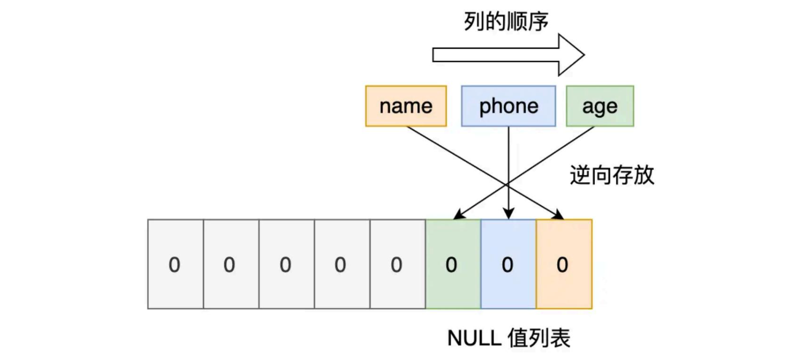

接下来看第⼆条记录，第⼆条记录 age 列是 NULL 值，所以，对于第⼆条数据，NULL值列表⽤⼗六进制表⽰是0x04。

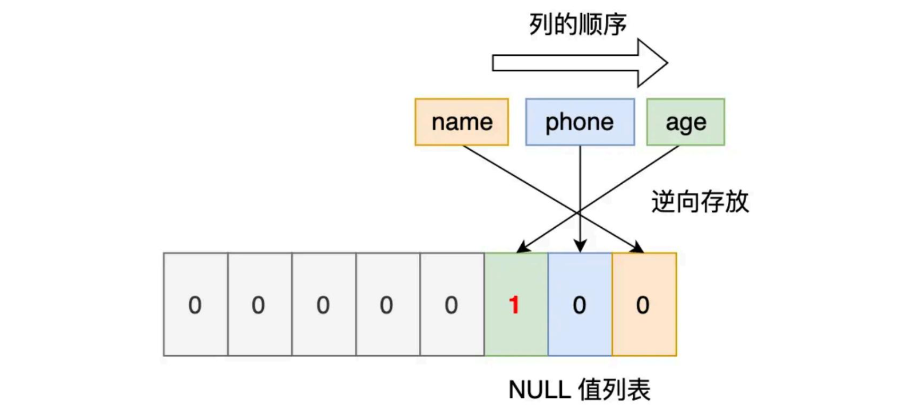

最后第三条记录，第三条记录 phone 列 和 age 列是 NULL 值，所以，对于第三条数据，NULL 值列表⽤⼗六进制表⽰是 $0 \mathrm { x 0 6 } .$ 。

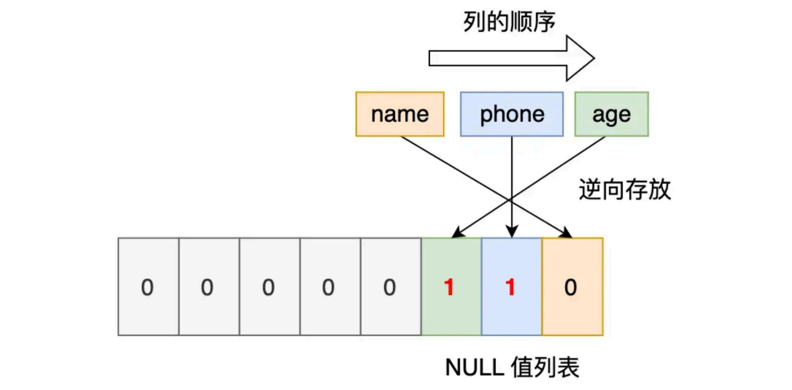

我们把三条记录的 NULL 值列表都填充完毕后，它们的⾏格式是这样的：

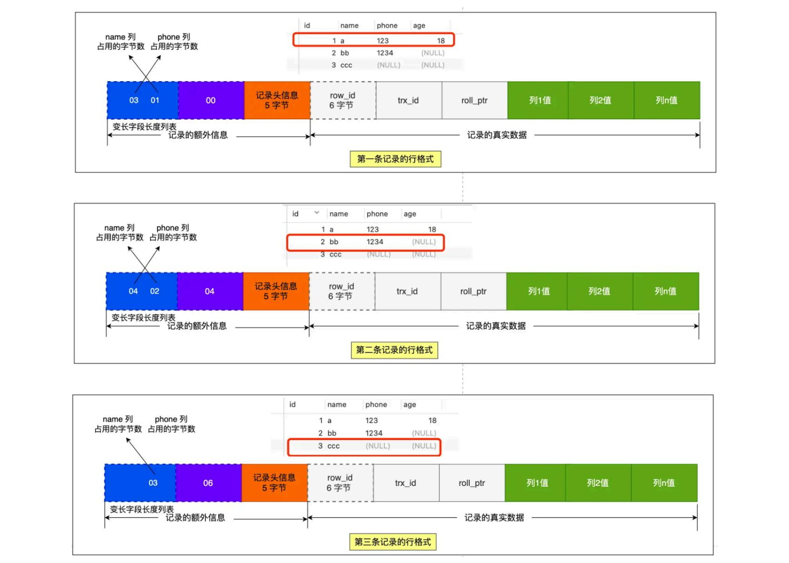

NULL 值列表也不是必须的。当数据表的字段都定义成 NOT NULL 的时候，这时候表⾥的⾏格式就不会有 NULL 值列表了。所以在设计数据库表的时候，通常都是建议将字段设置为 NOT NULL，这样可以⾄少节省 1 字节的空间（NULL值列表⾄少占⽤ 1 字节空间）。当⼀条记录有 9 个字段值都是 NULL，那么就会创建 2 字节空间的「NULL 值列表」，以此类推。

* 记录头信息
  * delete_mask ：标识此条数据是否被删除。从这⾥可以知道，我们执⾏ detele 删除记录的时候，并不会真正的删除记录，只是将这个记录的 delete_mask 标记为 1。
  * next_record：下⼀条记录的位置。从这⾥可以知道，记录与记录之间是通过链表组织的。其指向的是下⼀条记录的「记录头信息」和「真实数据」之间的位置，这样的好处是向左读就是记录头信息，向右读就是真实数据，⽐较⽅便。
  * record_type：表⽰当前记录的类型，0表⽰普通记录，1表⽰B+树⾮叶⼦节点记录，2表⽰最⼩记录，3表⽰最⼤记录

记录真实数据部分除了我们定义的字段，还有三个隐藏字段，分别为：row_id、trx_id、roll_pointer，我们来看下这三个字段是什么。

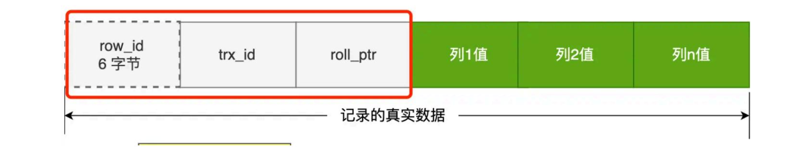

* row_id：如果我们建表的时候指定了主键或者唯⼀约束列，那么就没有 row_id 隐藏字段了。如果既没有指定主键，又没有唯⼀约束，那么 InnoDB 就会为记录添加 row_id 隐藏字段。row_id不是必需的，占⽤ 6 个字节。
* trx_id：事务id，表⽰这个数据是由哪个事务⽣成的。 trx_id是必需的，占⽤ 6 个字节。
* roll_pointer：这条记录上⼀个版本的指针。roll_pointer 是必需的，占⽤ 7 个字节。

如果你熟悉 MVCC 机制，你应该就清楚 trx_id 和 roll_pointer 的作⽤了，他们将用于控制事务可见版本。

**varchar(n) 中 n 最⼤取值为多少？**

MySQL 规定除了 TEXT、BLOBs 这种⼤对象类型之外，其他所有的列（不包括隐藏列和记录头信息）占⽤的字节长度加起来不能超过 65535 个字节。这个长度是包含「变长字段长度列表」和 「NULL 值列表」。换句话说除了行元数据的必要空间外，最多占用65535个字节。

所以， 我们在算 varchar(n) 中 n 最⼤值时，需要减去 storage overhead 占⽤的字节数。另外，要算 varchar(n) 最⼤能允许存储的字节数，还要看数据库表的字符集，因为字符集代表着，1个字符要占⽤多少字节，⽐如 ascii 字符集， 1 个字符占⽤ 1 字节，那么 varchar(100) 意味着最⼤能允许存储 100 字节的数据。而「变长字段长度」需要⽤多少字节表⽰需要具体情况分为：

* 条件⼀：如果变长字段允许存储的最⼤字节数⼩于等于 255 字节，就会⽤ 1 字节表⽰「变长字段长度」；

* 条件⼆：如果变长字段允许存储的最⼤字节数⼤于 255 字节，就会⽤ 2 字节表⽰「变长字段长度」；

因此我们可以认为n最大取值应该为65533。

#### 行溢出

MySQL 中磁盘和内存交互的基本单位是页，⼀个页的⼤⼩⼀般是 16KB，也就是 16384字节，⽽⼀个 varchar(n) 类型的列最多可以存储 65532字节，⼀些⼤对象如 TEXT、BLOB 可能存储更多的数据，这时⼀个页可能就存不了⼀条记录。这个时候就会发⽣⾏溢出，多的数据就会存到另外的「溢出页」中。


上⾯这个是 Compact ⾏格式在发⽣⾏溢出后的处理。

Compressed 和 Dynamic 这两个⾏格式和 Compact ⾮常类似，主要的区别在于处理⾏溢出数据时有些区别。

这两种格式采⽤**完全⾏溢出**⽅式，记录的真实数据处不会存储该列的⼀部分数据，只存储 20 个字节的指针来指向溢出页。⽽实际的数据都存储在溢出页中，看起来就像下⾯这样：

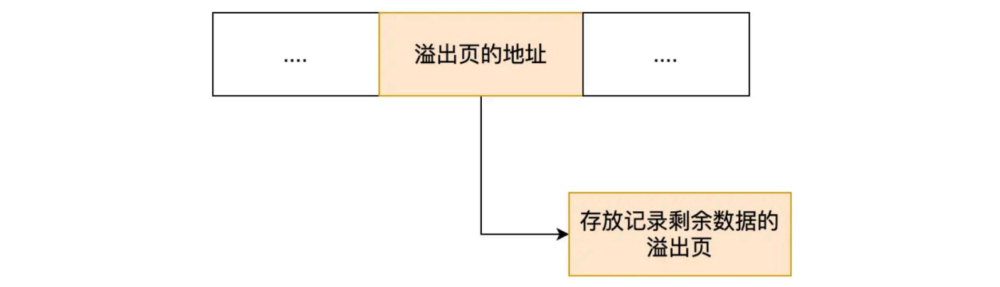

### 索引

#### 索引分类

要对这些索引进⾏分类，要清楚这些索引的使⽤和实现⽅式，然后再针对有相同特点的索引归为⼀类。我们可以按照四个⾓度来分类索引。

* 按「数据结构」分类：B+tree索引、Hash索引、Full-text索引。

* 按「物理存储」分类：聚簇索引（主键索引）、⼆级索引（辅助索引）。

* 按「字段特性」分类：主键索引、唯⼀索引、普通索引、前缀索引。

* 按「字段个数」分类：单列索引、联合索引。

接下来，按照这些⾓度来说说各类索引的特点。

##### 按数据结构

从数据结构的⾓度来看，MySQL 常见索引有 B+Tree 索引、HASH 索引、Full-Text 索引。

每⼀种存储引擎⽀持的索引类型不⼀定相同，下表总结了 MySQL 常见的存储引擎 InnoDB、MyISAM 和Memory 分别⽀持的索引类型。

| 索引类型       | InnoDB 引擎                                                  | MyISAM 引擎 | Memory 引擎 |
| -------------- | ------------------------------------------------------------ | ----------- | ----------- |
| B+Tree 索引    | Yes                                                          | Yes         | Yes         |
| HASH 索引      | No（不支持 HASH 索引，但在内存结构中有一个自适应 Hash 索引） | No          | Yes         |
| Full-Text 索引 | Yes（MySQL 5.6 版本后支持）                                  | Yes         | No          |

**B+ 树索引**：InnoDB 是在 MySQL 5.5 之后成为默认的 MySQL 存储引擎，B+Tree 索引类型也是 MySQL 存储引擎采⽤最多的索引类型。在创建表时，InnoDB 存储引擎会根据不同的场景选择不同的列作为索引：

* 如果有主键，默认会使⽤主键作为聚簇索引的索引键（key）；

* 如果没有主键，就选择第⼀个不包含 NULL 值的唯⼀列作为聚簇索引的索引键（key）；
* 在上⾯两个都没有的情况下，InnoDB 将⾃动⽣成⼀个隐式⾃增 id 列作为聚簇索引的索引键（key）；

创建的主键索引和⼆级索引默认使⽤的是 B+ Tree 索引。B+Tree 是⼀种多叉树，叶⼦节点才存放数据，⾮叶⼦节点只存放索引。每⼀层⽗节点的索引值都会出现在下层⼦节点的索引值中，因此在叶⼦节点中，包括了所有的索引值信息，并且每⼀个叶⼦节点都有两个指针，分别指向下⼀个叶⼦节点和上⼀个叶⼦节点，形成⼀个双向链表。主键索引的 B+ Tree 和⼆级索引的 B+ Tree 区别如下：

* 主键索引的 B+ Tree 的叶⼦节点存放的是实际数据，所有完整的⽤户记录都存放在主键索引的 B+ Tree 的叶⼦节点⾥；

* ⼆级索引的 B+Tree 的叶⼦节点存放的是主键值，⽽不是实际数据。

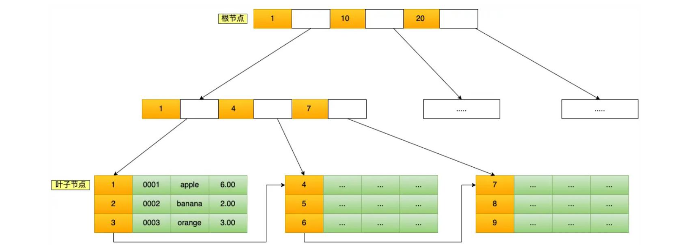

⽐如，我们执⾏了下⾯这条查询语句：

```sql 
select * from product where id=5;  
```

这条语句使⽤了主键索引查询 id 号为 5 的商品。查询过程是这样的，B+Tree 会⾃顶向下逐层进⾏查找：

* 将 5 与根节点的索引数据 (1，10，20) ⽐较，5 在 1 和 10 之间，所以根据 B+Tree的搜索逻辑，找到第⼆层的索引数据 (1，4，7)；

* 在第⼆层的索引数据 (1，4，7)中进⾏查找，因为 5 在 4 和 7 之间，所以找到第三层的索引数据（4，5，6）；

* 在叶⼦节点的索引数据（4，5，6）中进⾏查找，然后我们找到了索引值为 5 的⾏数据。

数据库的索引和数据都是存储在硬盘的，我们可以把读取⼀个节点当作⼀次磁盘 I/O 操作。那么上⾯的整个查询过程⼀共经历了 3 个节点，也就是进⾏了 3 次 I/O 操作。

B+Tree 存储千万级的数据只需要 3-4 层⾼度就可以满⾜，这意味着从千万级的表查询⽬标数据最多需要 3-4 次磁盘I/O，所以B+Tree 相⽐于 B 树和⼆叉树来说，最⼤的优势在于查询效率很⾼，因为即使在数据量很⼤的情况，查询个数据的磁盘 I/O 依然维持在 3-4次。


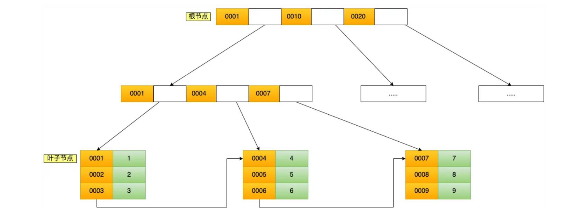

现在假设将前⾯的商品表中的 product_no（商品编码）字段设置为⼆级索引，那么⼆级索引的 B+ Tree 如下图（图中叶⼦节点之间我画了单向链表，但是实际上是双向链表）。

```sql
select * from product where product_no = '0002'; 
```

会先检⼆级索引中的 B+ 树的索引值（商品编码，product_no），找到对应的叶⼦节点，然后获取主键值，然后再通过主键索引中的 B+ 树查询到对应的叶⼦节点，然后获取整⾏数据。这个过程叫「回表」，也就是说要查两个  B+ 树才能查到数据。如下：

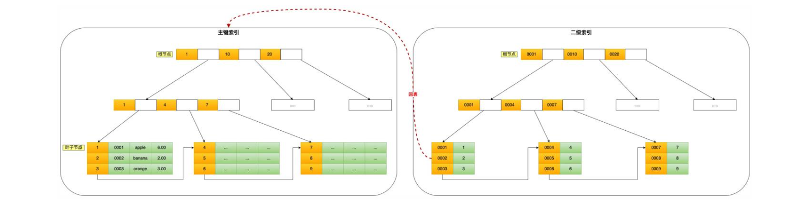

不过，当查询的数据是能在⼆级索引的 $\mathrm { B } +$ Tree 的叶⼦节点⾥查询到，这时就不⽤再查主键索引查，⽐如下⾯这条查询语句：

```sql
select id from product where product_no = '0002'; 
```

这种查询字段为索引字段的查询叫做覆盖索引。

##### 按物理存储分类

从物理存储的⾓度来看，索引分为聚簇索引（主键索引）、⼆级索引（辅助索引）。这两个区别在前⾯也提到了：

* 主键索引的 B+Tree 的叶⼦节点存放的是实际数据，所有完整记录都存放在主键索引的 B+Tree 的叶⼦节点

* ⼆级索引的 B+Tree 的叶⼦节点存放的是主键值，⽽不是实际数据

所以，在查询时使⽤了⼆级索引，如果查询的数据能在⼆级索引⾥查询的到，那么就不需要回表，这个过程就是覆

盖索引。如果查询的数据不在⼆级索引⾥，就会先检索⼆级索引，找到对应的叶⼦节点，获取到主键值后，然后再

检索主键索引，就能查询到数据了，这个过程就是回表。

##### 按字段特性分类

从字段特性的⾓度来看，索引分为主键索引、唯⼀索引、普通索引、前缀索引。

* **主键索引**：主键索引就是建⽴在主键字段上的索引，⼀张表最多只有⼀个主键索引，索引列的值不允许有空值。

```sql
CREATE TABLE table_name (
 ....
PRIMARY KEY (index_column_1) USING BTREE
);
```

* **唯⼀索引**：唯⼀索引建⽴在 UNIQUE 字段上的索引，⼀张表可以有多个唯⼀索引，索引列的值必须唯⼀，但是允许有空值。

```sql
CREATE TABLE table_name (
 ....
UNIQUE KEY(index_column_1,index_column_2,...)
);

CREATE UNIQUE INDEX index_name
ON table_name(index_column_1,index_column_2,...);
```

* **普通索引**:普通索引就是建⽴在普通字段上的索引，既不要求字段为主键，也不要求字段为 UNIQUE。

```sql
CREATE TABLE table_name (
 ....
INDEX(index_column_1,index_column_2,...)
);

CREATE INDEX index_name
ON table_name(index_column_1,index_column_2,...);
```

* **前缀索引**：前缀索引是指对字符类型字段的前⼏个字符建⽴的索引，⽽不是在整个字段上建⽴的索引，前缀索引可以建⽴在字段类型为 char、 varchar、binary、varbinary 的列上。**使⽤前缀索引的⽬的是为了减少索引占⽤的存储空间，提升查询效率。**

```sql
CREATE TABLE table_name(
 column_list,
INDEX(column_name(length))
);

CREATE INDEX index_name
ON table_name(column_name(length));
```

##### 按字段个数分类

从字段个数的⾓度来看，索引分为单列索引、联合索引（复合索引）。

* **单列索引**：比如主键索引，唯一索引都是单列索引的一种。
* **联合索引**：通过将多个字段组合成⼀个索引，该索引就被称为联合索引。

```sql
CREATE INDEX index_product_no_name ON product(product_no, name);
```

联合索引的⾮叶⼦节点⽤两个字段的值作为 B+Tree 的 key 值。当在联合索引查询数据时，先按product_no 字段⽐较，在 product_no 相同的情况下再按 name 字段⽐较。也就是说，联合索引查询的 B+Tree 是先按 product_no 进⾏排序，然后再 product_no 相同的情况再按 name 字段排序。

因此，使⽤联合索引时，存在最左匹配原则，也就是按照最左优先的⽅式进⾏索引的匹配。在使⽤联合索引进⾏查询的时候，如果不遵循「最左匹配原则」，联合索引会失效，这样就⽆法利⽤到索引快速查询的特性了。

⽐如，如果创建了⼀个 (a, b, c) 联合索引，如果查询条件是以下这⼏种，就可以匹配上联合索引：

- where a=1；
- where a=1 and b=2 and c=3；
- where a=1 and b=2；

需要注意的是，因为有查询优化器，所以 a 字段在 where ⼦句的顺序并不重要。但是，如果查询条件是以下这⼏种，因为不符合最左匹配原则，所以就⽆法匹配上联合索引，联合索引就会失效:

- where b=2；
- where c=3；
- where b=2 and c=3；

上⾯这些查询条件之所以会失效，是因为(a, b, c) 联合索引，是先按 a 排序，在 a 相同的情况再按 b 排序，在 b 相同的情况再按 c 排序。所以，**b** 和 **c** 是全局⽆序，局部相对有序的，这样在没有遵循最左匹配原则的情况下，是⽆法利⽤到索引的。

**索引下推**

索引下推之前已经讲过， MySQL 5.6 引⼊的索引下推优化（index condition pushdown)， 可以在联合索引遍历过程中，交由存储引擎对联合索引中包含的字段先做判断，直接过滤掉不满⾜条件的记录，减少回表次数。

当你的查询语句的执⾏计划⾥，出现了 Extra 为 Using index condition，那么说明使⽤了索引下推的优化。

#### B+树结构

要设计⼀个适合 MySQL 索引的数据结构，⾄少满⾜以下要求：能在尽可能少的磁盘的 I/O 操作中完成查询⼯作；要能⾼效地查询某⼀个记录，也要能⾼效地执⾏范围查找。

B+ 树就是对 B 树做了⼀个升级，MySQL 中索引的数据结构就是采⽤了 B+ 树，B+ 树结构如下图：


B+ 树与 B 树差异的点，主要是以下这⼏点：

* 叶⼦节点（最底部的节点）才会存放实际数据（索引+记录），⾮叶⼦节点只会存放索引；

* 所有索引都会在叶⼦节点出现，叶⼦节点之间构成⼀个有序链表；

* ⾮叶⼦节点的索引也会同时存在在⼦节点中，并且是在⼦节点中所有索引的最⼤（或最⼩）。

* ⾮叶⼦节点中有多少个⼦节点，就有多少个索引；

下⾯通过三个⽅⾯，⽐较下 B+ 和 B 树的性能区别。

**单点查询**：B 树进⾏单个索引查询时，最快可以在 O(1) 的时间代价内就查到，⽽从平均时间代价来看，会⽐B+树稍快⼀些。但是 B 树的查询波动会⽐较⼤，因为每个节点即存索引又存记录，所以有时候访问到了⾮叶⼦节点就可以找到索引，⽽有时需要访问到叶⼦节点才能找到索引。树的⾮叶⼦节点不存放实际的记录数据，仅存放索引，因此数据量相同的情况下，相⽐存储即存索引又存记录的 B 树，  树的⾮叶⼦节点可以存放更多的索引，因此  树可以⽐ B 树更「矮胖」，查询底层节点的磁盘 I/O次数会更少。

**插⼊和删除效率**：B+ 树有⼤量的冗余节点，这样使得删除⼀个节点的时候，可以直接从叶⼦节点中删除，甚⾄可以不动⾮叶⼦节点，这样删除⾮常快，⽐如下⾯这个动图是删除 B+ 树 0004 节点的过程，因为⾮叶⼦节点有 0004 的冗余节点，所以在删除的时候，树形结构变化很⼩：


B+ 树对于⾮叶⼦节点的⼦节点和索引的个数，定义⽅式可能会有不同，有的是说⾮叶⼦节点的⼦节点的个数为 M 阶，⽽索引的个数为 M-1（这个是维基百科⾥的定义），也有说的是「⾮叶⼦节点中有多少个⼦节点，就有多少个索引」，主要是 MySQL ⽤到的 B+ 树就是这个特性。B+树的插⼊也是⼀样，有冗余节点，插⼊可能存在节点的分裂（如果节点饱和），但是最多只涉及树的⼀条路径。⽽且B+ 树会⾃动平衡，不需要像更多复杂的算法，类似红⿊树的旋转操作等。

**范围查询**:B 树和 B+ 树等值查询原理基本⼀致，先从根节点查找，然后对⽐⽬标数据的范围，最后递归的进⼊⼦节点查找。因为 **B**+ 树所有叶⼦节点间还有⼀个链表进⾏连接，这种设计对范围查找⾮常有帮助，⽐如说我们想知道 12 ⽉ 1 ⽇和 12 ⽉ 12 ⽇之间的订单，这个时候可以先查找到 12 ⽉ 1 ⽇所在的叶⼦节点，然后利⽤链表向右遍历，直到找到12 ⽉12 ⽇的节点，这样就不需要从根节点查询了，进⼀步节省查询需要的时间。⽽ B 树没有将所有叶⼦节点⽤链表串联起来的结构，因此只能通过树的遍历来完成范围查询，这会涉及多个节点的磁盘 I/O 操作，范围查询效率不如 B+ 树。因此，存在⼤量范围检索的场景，适合使⽤ B+ 树，⽐如数据库。⽽对于⼤量的单个索引查询的场景，可以考虑 B树，⽐如 nosql 的MongoDB。

#### 索引失效

##### 最左匹配原则

联合索引有⼀些特殊情况，并不是查询过程使⽤了联合索引查询，就代表联合索引中的所有字段都⽤到了联合索引进⾏索引查询，也就是可能存在部分字段⽤到联合索引的 B+Tree，部分字段没有⽤到联合索引的 B+Tree 的情况。这种特殊情况就发⽣在范围查询。联合索引的最左匹配原则会⼀直向右匹配直到遇到「范围查询」就会停⽌匹配。也就是范围查询的字段可以⽤到联合索引，但是在范围查询字段的后⾯的字段⽆法⽤到联合索引。

以下以一些例子说明：

* Q1: 联合索引（a, b）哪⼀个字段⽤到了联合索引的B+Tree？

```sql
select * from t_table where a > 1 and b = 2
```

由于联合索引（⼆级索引）是先按照 a 字段的值排序的，所以符合 a > 1 条件的⼆级索引记录肯定是相邻，于是在进⾏索引扫描的时候，可以定位到符合 a > 1 条件的第⼀条记录，然后沿着记录所在的链表向后扫描，直到某条记录不符合 a > 1 条件位置。所以 a 字段可以在联合索引的 B+Tree 中进⾏索引查询。但是在符合 **a > 1** 条件的⼆级索引记录的范围⾥，**b** 字段的值是⽆序的。因此，我们不能根据查询条件 b = 2 来进⼀步减少需要扫描的记录数量（b 字段⽆法利⽤联合索引进⾏索引查询的意思）。

所以在执⾏ Q1 这条查询语句的时候，对应的扫描区间是 (2, + ∞)，形成该扫描区间的边界条件是 a > 1，与 b = 2 ⽆关。

* Q2:  联合索引（a, b）哪⼀个字段⽤到了联合索引的B+Tree？

```sql
select * from t_table where a >= 1 and b = 2
```

由于联合索引（⼆级索引）是先按照 a 字段的值排序的，所以符合 >= 1 条件的⼆级索引记录肯定是相邻，于是在进⾏索引扫描的时候，可以定位到符合 >= 1 条件的第⼀条记录，然后沿着记录所在的链表向后扫描，直到某条记录不符合 a>= 1 条件位置。所以 a 字段可以在联合索引的 B+Tree 中进⾏索引查询。

虽然在符合 a>= 1 条件的⼆级索引记录的范围⾥，b 字段的值是「⽆序」的，但是对于符合 **a = 1** 的⼆级索引记录的范围⾥，**b** 字段的值是「有序」的（因为对于联合索引，是先按照 a 字段的值排序，然后在 a 字段的值相同的情况下，再按照 b 字段的值进⾏排序）。从这我们就可以分析得出，只有 a=1 and b=2 ⾛了联合索引，然后后续的 a>1 其实还是不⾛联合索引。

于是，在确定需要扫描的⼆级索引的范围时，当⼆级索引记录的 a 字段值为 1 时，可以通过 b = 2 条件减少需要扫描的⼆级索引记录范围（b 字段可以利⽤联合索引进⾏索引查询的意思）。也就是说，从符合 a = 1 and b = 2 条件的第⼀条记录开始扫描，⽽不需要从第⼀个 a 字段值为 1 的记录开始扫描。

所以，**Q2** 这条查询语句 **a** 和 **b** 字段都⽤到了联合索引进⾏索引查询。

* Q3: 联合索引（a, b）哪⼀个字段⽤到了联合索引的 B+Tree？

```sql
SELECT * FROM t_table WHERE a BETWEEN 2 AND 8 AND b = 2
```

Q3 查询条件中 a BETWEEN 2 AND 8 的意思是查询 a 字段的值在 2 和 8 之间的记录。不同的数据库对 BETWEEN ... AND 处理⽅式是有差异的。在 MySQL 中，BETWEEN 包含了 value1 和 value2 边界值，类似于 >= and =<。⽽有的数据库则不包含 value1 和 value2 边界值（类似于 > and <）。这⾥我们只讨论 MySQL。由于 MySQL 的 BETWEEN 包含 value1 和 value2 边界值，所以类似于 Q2 查询语句，

因此 **Q3** 这条查询语句 **a** 和 **b** 字段都⽤到了联合索引进⾏索引查询。

* Q4: 联合索引（name, age）哪⼀个字段⽤到了联合索引的 B+Tree？

```sql
SELECT * FROM t_user WHERE name like 'j%' and age = 22
```

由于联合索引（⼆级索引）是先按照 name 字段的值排序的，所以前缀为 ‘j’ 的 name 字段的⼆级索引记录都是相邻的， 于是在进⾏索引扫描的时候，可以定位到符合前缀为 ‘j’ 的 name 字段的第⼀条记录，然后沿着记录所在的链表向后扫描，直到某条记录的 name 前缀不为 ‘j’ 为⽌。所以 a 字段可以在联合索引的 B+Tree 中进⾏索引查询，形成的扫描区间是['j','k')。注意， j 是闭区间。


虽然在符合前缀为 ‘j’ 的 name 字段的⼆级索引记录的范围⾥，age 字段的值是「⽆序」的，但是对于符合 **name = j** 的⼆级索引记录的范围⾥，**age**字段的值是「有序」的（因为对于联合索引，是先按照 name 字段的值排序，然后在 name 字段的值相同的情况下，再按照 age 字段的值进⾏排序）。于是，在确定需要扫描的⼆级索引的范围时，当⼆级索引记录的 name 字段值为 ‘j’ 时，可以通过 age = 22 条件减少需要扫描的⼆级索引记录范围（age 字段可以利⽤联合索引进⾏索引查询的意思）。也就是说，从符合 name = 'j' and age = 22 条件的第⼀条记录时开始扫描，⽽不需要从第⼀个 name 为 j 的记录开始扫描 。

##### 对索引使用左类模糊匹配

当我们使⽤左或者左右模糊匹配的时候，也就是 like %xx 或者 like %xx% 这两种⽅式都会造成索引失效。

因为索引 **B+** 树是按照「索引值」有序排列存储的，只能根据前缀进⾏⽐较。

##### 对索引进行计算

如果查询条件中对索引字段使⽤函数，就会导致索引失效。因为索引保存的是索引字段的原始值，⽽不是经过函数计算后的值，⾃然就没办法⾛索引了。

不过，从 MySQL 8.0 开始，索引特性增加了函数索引，即可以针对函数计算后的值建⽴⼀个索引，也就是说该索引的值是函数计算后的值，所以就可以通过扫描索引来查询数据。

在查询条件中对索引进⾏表达式计算，也是⽆法⾛索引的。原因跟对索引使⽤函数差不多。

因为索引保存的是索引字段的原始值，⽽不是 id + 1 表达式计算后的值，所以⽆法⾛索引，只能通过把索引字段的取值都取出来，然后依次进⾏表达式的计算来进⾏条件判断，因此采⽤的就是全表扫描的⽅式。

##### 索引隐式转换

其本质是对索引列使用了函数。如果索引字段是字符串类型，但是在条件查询中，输⼊的参数是整型的话，你会在执⾏计划的结果发现这条语句会⾛全表扫描。

⼀个简单的测试⽅式，就是通过 select “10” > 9 的结果来知道MySQL 的数据类型转换规则是什么：

* 如果规则是 MySQL 会将⾃动「字符串」转换成「数字」，就相当于 select 10 > 9，这个就是数字⽐较，所以结果应该是 1；

* 如果规则是 MySQL 会将⾃动「数字」转换成「字符串」，就相当于 select "10" > "9"，这个是字符串⽐较，字符串⽐较⼤⼩是逐位从⾼位到低位逐个⽐较（按ascii码） ，那么"10"字符串相当于 “1”和“0”字符的组合，所以先是拿 “1” 字符和 “9” 字符⽐较，因为 “1” 字符⽐ “9” 字符⼩，所以结果应该是 0。

##### 索引区分度

建⽴联合索引时的字段顺序，对索引效率也有很⼤影响。越靠前的字段被⽤于索引过滤的概率越⾼，实际开发⼯作中建⽴联合索引时，要把区分度⼤的字段排在前⾯，这样区分度⼤的字段越有可能被更多的 **SQL** 使⽤到。区分度就是某个字段 column 不同值的个数「除以」表的总⾏数，计算公式如下：

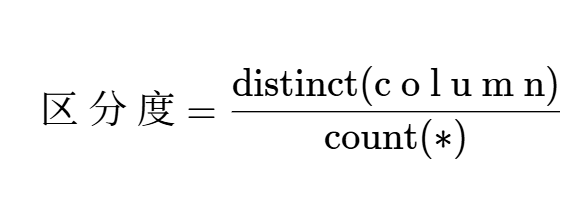

⽐如，性别的区分度就很⼩，不适合建⽴索引或不适合排在联合索引列的靠前的位置，⽽ UUID 这类字段就⽐较适合做索引或排在联合索引列的靠前的位置。因为如果索引的区分度很⼩，假设字段的值分布均匀，那么⽆论搜索哪个值都可能得到⼀半的数据。

在这些情况下，还不如不要索引，因为 MySQL 还有⼀个查询优化器，查询优化器发现某个值出现在表的数据⾏中的百分⽐（惯⽤的百分⽐界线是"30%"）很⾼的时候，它⼀般会忽略索引，进⾏全表扫描。

##### Where 中的 Or 语句

在 WHERE ⼦句中，如果在 OR 前的条件列是索引列，⽽在 OR 后的条件列不是索引列，那么索引会失效。这是因为 OR 的含义就是两个只要满⾜⼀个即可，因此只有⼀个条件列是索引列是没有意义的，只要有条件列不是索引列，就会进⾏全表扫描。

#### 索引优化

##### 前缀索引优化

前缀索引顾名思义就是使⽤某个字段中字符串的前⼏个字符建⽴索引。使⽤前缀索引是为了减⼩索引字段⼤⼩，可以增加⼀个索引页中存储的索引值，有效提⾼索引的查询速度。在⼀些⼤字符串的字段作为索引时，使⽤前缀索引可以帮助我们减⼩索引项的⼤⼩。

不过，前缀索引有⼀定的局限性，例如：

* order by 就⽆法使⽤前缀索引；
* ⽆法把前缀索引⽤作覆盖索引；

##### 覆盖索引优化

覆盖索引是指 SQL 中 query 的所有字段，在索引 B+Tree 的叶⼦节点上都能找得到的那些索引，从⼆级索引中查询得到记录，⽽不需要通过聚簇索引查询获得，可以避免回表的操作。

使⽤覆盖索引的好处就是，不需要查询出包含整⾏记录的所有信息，也就减少了⼤量的 I/O 操作。

##### 主键索引最好是自增的

我们在建表的时候，都会默认将主键索引设置为⾃增的。InnoDB 创建主键索引默认为聚簇索引，数据被存放在了 B+Tree 的叶⼦节点上。也就是说，同⼀个叶⼦节点内的各个数据是按主键顺序存放的，因此，每当有⼀条新的数据插⼊时，数据库会根据主键将其插⼊到对应的叶⼦节点中。

如果我们使⽤⾃增主键，那么每次插⼊的新数据就会按顺序添加到当前索引节点的位置，不需要移动已有的数据，当页⾯写满，就会⾃动开辟⼀个新页⾯。因为每次插⼊⼀条新记录，都是追加操作，不需要重新移动数据，因此这种插⼊数据的⽅法效率⾮常⾼。

如果我们使⽤⾮⾃增主键，由于每次插⼊主键的索引值都是随机的，因此每次插⼊新的数据时，就可能会插⼊到现有数据页中间的某个位置，这将不得不移动其它数据来满⾜新数据的插⼊，甚⾄需要从⼀个页⾯复制数据到另外⼀个页⾯，我们通常将这种情况称为页分裂。页分裂还有可能会造成⼤量的内存碎⽚，导致索引结构不紧凑，从⽽影响查询效率。

另外，主键字段的长度不要太⼤，因为主键字段长度越⼩，意味着⼆级索引的叶⼦节点越⼩（⼆级索引的叶⼦节点存放的数据是主键值），这样⼆级索引占⽤的空间也就越⼩。

##### 索引最好设置为 **NOT NULL**

为了更好的利⽤索引，索引列要设置为 NOT NULL 约束。有两个原因：

* 第⼀原因：索引列存在 NULL 就会导致优化器在做索引选择的时候更加复杂，更加难以优化，因为可为NULL 的列会使索引、索引统计和值⽐较都更复杂，⽐如进⾏索引统计时，count 会省略值为NULL 的⾏。

* 第⼆个原因：NULL 值是⼀个没意义的值，但是它会占⽤物理空间，所以会带来的存储空间的问题，因为InnoDB 存储记录的时候，如果表中存在允许为 NULL 的字段，那么⾏格式中⾄少会⽤ **1** 字节空间存储**NULL** 值列表

##### 防止索引失效

发⽣索引失效的情况：

* 当我们使⽤左或者左右模糊匹配的时候，也就是 like %xx 或者 like %xx%这两种⽅式都会造成索引失效；

* 当我们在查询条件中对索引列做了计算、函数、类型转换操作，这些情况下都会造成索引失效；

* 联合索引要能正确使⽤需要遵循最左匹配原则，也就是按照最左优先的⽅式进⾏索引的匹配，否则就会导致索引失效。

* 在 WHERE ⼦句中，如果在 OR 前的条件列是索引列，⽽在 OR 后的条件列不是索引列，那么索引会失效。

实际过程中，可能会出现其他的索引失效场景，这时我们就需要查看执⾏计划，通过执⾏计划显⽰的数据判断查询语句是否使⽤了索引。

对于执⾏计划，参数有：

- possible_keys 字段表⽰可能⽤到的索引；
- key 字段表⽰实际⽤的索引，如果这⼀项为 NULL，说明没有使⽤索引；
- key_len 表⽰索引的长度；
- rows 表⽰扫描的数据⾏数。
- type 表⽰数据扫描类型，我们需要重点看这个。

type 字段就是描述了找到所需数据时使⽤的扫描⽅式是什么，常见扫描类型的执⾏效率从低到⾼的顺序为：All（全表扫描）；

- index（全索引扫描）；
- range（索引范围扫描）；
- ref（⾮唯⼀索引扫描）；
- eq_ref（唯⼀索引扫描）；
- const（结果只有⼀条的主键或唯⼀索引扫描）。

在这些情况⾥，all 是最坏的情况，因为采⽤了全表扫描的⽅式。index 和 all 差不多，只不过 index 对索引表进⾏全扫描，这样做的好处是不再需要对数据进⾏排序，但是开销依然很⼤。所以，要尽量避免全表扫描和全索引扫

描。

range 表⽰采⽤了索引范围扫描，⼀般在 where ⼦句中使⽤ < 、>、in、between 等关键词，只检索给定范围的⾏，属于范围查找。从这⼀级别开始，索引的作⽤会越来越明显，因此我们需要尽量让 **SQL** 查询可以使⽤到 **range** 这⼀级别及以上的 **type** 访问⽅式。

ref 类型表⽰采⽤了⾮唯⼀索引，或者是唯⼀索引的⾮唯⼀性前缀，返回数据返回可能是多条。因为虽然使⽤了索引，但该索引列的值并不唯⼀，有重复。这样即使使⽤索引快速查找到了第⼀条数据，仍然不能停⽌，要进⾏⽬标值附近的⼩范围扫描。但它的好处是它并不需要扫全表，因为索引是有序的，即便有重复值，也是在⼀个⾮常⼩的范围内扫描。

eq_ref 类型是使⽤主键或唯⼀索引时产⽣的访问⽅式，通常使⽤在多表联查中。⽐如，对两张表进⾏联查，关联条件是两张表的 user_id 相等，且 user_id 是唯⼀索引，那么使⽤ EXPLAIN 进⾏执⾏计划查看的时候，type 就会显⽰ eq_ref。

const 类型表⽰使⽤了主键或者唯⼀索引与常量值进⾏⽐较，⽐如 select name from product where id=1。需要说明的是 const 类型和 eq_ref 都使⽤了主键或唯⼀索引，不过这两个类型有所区别，**const** 是与常量进⾏⽐较，查询效率会更快，⽽ **eq_ref** 通常⽤于多表联查中。

除了关注 type，我们也要关注 extra 显⽰的结果。这⾥说⼏个重要的参考指标：

- Using filesort ：当查询语句中包含 group by 操作，⽽且⽆法利⽤索引完成排序操作的时候， 这时不得不选择相应的排序算法进⾏，甚⾄可能会通过⽂件排序，效率是很低的，所以要避免这种问题的出现。
- Using temporary：使了⽤临时表保存中间结果，MySQL 在对查询结果排序时使⽤临时表，常见于排序order by 和分组查询 group by。效率低，要避免这种问题的出现。
- Using index：所需数据只需在索引即可全部获得，不须要再到表中取数据，也就是使⽤了覆盖索引，避免了回表操作，效率不错。

#### 其他索引问题

##### MySQL 单表不要超过 2000W ⾏？

⾸先我们先想想数据库单表⾏数最⼤多⼤？看看上⾯的建表 sql。id 是主键，本⾝就是唯⼀的，也就是说主键的⼤⼩可以限制表的上限：

* 如果主键声明 int 类型，也就是 32 位，那么⽀持 2∧32 –1∼∼21 亿；

* 如果主键声明 bigint类型，那就是 2∧62−1 （36893488147419103232），难以想象这个的多⼤了，⼀般还没有到这个限制之前，可能数据库已经爆满了。

所以限制表行数的问题不在于主键约束。


索引页中记录的是页 (数据页，索引页) 的最⼩主键 id 和页号，以及在索引页中增加了层级的信息，从 0 开始往上算，所以页与页之间就有了上下层级的概念。


看上图中，我们是单拿⼀个节点来看，⾸先它是⼀个⾮叶⼦节点（索引页），在它的内容区中有 id 和 页号地址两部分：

* id ：对应页中记录的最⼩记录 id 值；

* 页号：地址是指向对应页的指针；

⽽数据页与此⼏乎⼤同⼩异，区别在于数据页记录的是真实的⾏数据⽽不是页地址，⽽且 id 的也是顺序的。

同样⼀个 16K 的页，⾮叶⼦节点⾥的每条数据都指向新的页，⽽新的页有两种可能

* 如果是叶⼦节点，那么⾥⾯就是⼀⾏⾏的数据

* 如果是⾮叶⼦节点的话，那么就会继续指向新的页

⾮叶⼦节点内指向其他页的数量为 x，叶⼦节点内能容纳的数据⾏数为 y，B+ 数的层数为 z

如下图中所⽰，Total= x ^ (z-1) * y  也就是说总数会等于 **x** 的 z-1 次⽅ 与 Y 的乘积。

在⽂章的开头已经介绍了页的结构，索引也也不例外，都会有 File Header (38 byte)、Page Header (56 Byte)、Infimum $^ +$ Supermum（26 byte）、File Trailer（8byte）, 再加上页⽬录，⼤概 1k 左右。我们就当做它就是 1K, 那整个页的⼤⼩是 16K, 剩下 15k ⽤于存数据，在索引页中主要记录的是主键与页号，主键我们假设是 Bigint (8 byte), ⽽页号也是固定的（4Byte）, 那么索引页中的⼀条数据也就是 12byte。所以 x=15*1024/12≈1280 ⾏。叶⼦节点和⾮叶⼦节点的结构是⼀样的，同理，能放数据的空间也是 15k。但是叶⼦节点中存放的是真正的⾏数据，这个影响的因素就会多很多，⽐如，字段的类型，字段的数量。每⾏数据占⽤空间越⼤，页中所放的⾏数量就会越少。这边我们暂时按⼀条⾏数据 1k 来算，那⼀页就能存下 15 条，Y = 15*1024/1000 ≈15。

对于一颗B+树而言，它的层数一般为3。 这样计算有那 Total = 4915200 （近 500w）

##### count(*) 和 count(1) 有什么区别？

count() 是⼀个聚合函数，函数的参数不仅可以是字段名，也可以是其他任意表达式，该函数作⽤是统计符合查询条件的记录中，函数指定的参数不为 **NULL** 的记录有多少个。

假设 count() 函数的参数是字段名，如下：

```sql
select count(name) from t_order;
```

这条语句是统计「 t_order 表中，name 字段不为 NULL 的记录」有多少个。也就是说，如果某⼀条记录中的 name 字段的值为 NULL，则就不会被统计进去。再来假设 count() 函数的参数是数字 1 这个表达式，如下：

```sql
select count(1) from t_order;
```

这条语句是统计「 t_order 表中，1 这个表达式不为 NULL 的记录」有多少个。1 这个表达式就是单纯数字，它永远都不是 NULL，所以上⾯这条语句，其实是在统计 t_order 表中有多少个记录。

在通过 count 函数统计有多少个记录时，MySQL 的 server 层会维护⼀个名叫 count 的变量。如果表⾥只有主键索引，没有⼆级索引时。那么，InnoDB 循环遍历聚簇索引（主键索引），将读取到的记录返回给 server 层，但是不会读取记录中的任何字段的值，因为 count 函数的参数是 1，不是字段，所以不需要读取记录中的字段值。参数 1 很明显并不是 NULL，因此 server 层每从 InnoDB 读取到⼀条记录，就将 count 变量加 1。

可以看到，count(1) 相⽐ count(主键字段) 少⼀个步骤，就是不需要读取记录中的字段值，所以通常会说 count(1) 执⾏效率会⽐ count(主键字段) ⾼⼀点。但是，如果表⾥有⼆级索引时，InnoDB 循环遍历的对象就⼆级索引了。count(\*) 其实等于 count(0)，也就是说，当你使⽤ count(*) 时，MySQL 会将 * 参数转化为参数 0 来处理。所以，count(*) 执⾏过程跟 count(1) 执⾏过程基本⼀样的，性能没有什么差异。*

count(字段) 的执⾏效率相⽐前⾯的 count(1)、 count(*)、 count(主键字段) 执⾏效率是最差的。因为会采⽤全表扫描的⽅式来计数，所以它的执⾏效率是⽐较差的。

**解决方案**

* **近似值**：如果你的业务对于统计个数不需要很精确，⽐如搜索引擎在搜索关键词的时候，给出的搜索结果条数是⼀个⼤概值。使⽤ show table status 或者 explain 命令来表进⾏估算。执⾏ explain 命令效率是很⾼的，因为它并不会真正的去查询。
* **额外表保存计数值**：如果是想精确的获取表的记录总数，我们可以将这个计数值保存到单独的⼀张计数表中。当我们在数据表插⼊⼀条记录的同时，将计数表中的计数字段 + 1。也就是说，在新增和删除操作时，我们需要额外维护这个计数表。

##### MySql分页性能差？

为了实现分页。很容易联想到下⾯这样的sql语句。

```SQL
select * from page order by id limit offset, size;
```

要理解分页性能，主要要理解使用 Limit 时，表扫描的使用情况。我们先来看下limit sql的内部执⾏逻辑。


当我们去掉explain，执⾏这条sql。

```sql
select * from page order by id limit 0, 10;
```

上⾯select后⾯带的是星号*****，也就是要求获得⾏数据的所有字段信息。server层会调⽤innodb的接⼜，在innodb⾥的主键索引中获取到第0到10条完整⾏数据，依次返回给server层，并放到server层的结果集中，返回给客户端。⽽当我们把offset搞离谱点，⽐如执⾏的是

```sql
select * from page order by id limit 6000000, 10;
```

server层会调⽤innodb的接⼜，由于这次的offset=6000000，会在innodb⾥的主键索引中获取到第0到（6000000 + 10）条完整⾏数据，返回给**server**层之后根据**offset**的值挨个抛弃，最后只留下最后⾯的**size**条，也就是10条数据，放到server层的结果集中，返回给客户端。

可以看出，当offset⾮0时，server层会从引擎层获取到很多⽆⽤的数据，⽽获取的这些⽆⽤数据都是要耗时的。因此，我们就知道了⽂章开头的问题的答案，**mysql**查询中 **limit 1000,10** 会⽐ **limit 10** 更慢。原因是 **limit 1000,10** 会取出**1000+10**条数据，并抛弃前**1000**条，这部分耗时更⼤

```sql
select * from page where id >=(select id from page order by id limit 6000000, 1) order 
by id limit 10;
```

上⾯这条sql语句，⾥⾯先执⾏⼦查询 select id from page order by id limit 6000000, 1, 这个操作，其实也是将在innodb中的主键索引中获取到6000000+1条数据，然后server层会抛弃前6000000条，只保留最后⼀条数据的id。但不同的地⽅在于，在返回server层的过程中，只会拷贝数据⾏内的id这⼀列，⽽不会拷贝数据⾏的所有列，当数据量较⼤时，这部分的耗时还是⽐较明显的。在拿到了上⾯的id之后，假设这个id正好等于6000000，那sql就变成了

```sql
select * from page where id >=(6000000) order by id limit 10;
```

这样innodb再⾛⼀次主键索引，通过B+树快速定位到id=6000000的⾏数据，时间复杂度是lg(n)，然后向后取10条数据。

像这种，当offset变得超⼤时，⽐如到了百万千万的量级，问题就突然变得严肃了。这⾥就产⽣了个专门的术语，叫深度分页。

遇到深度分页的问题，多思考其原始需求，⼤部分时候是不应该出现深度分页的场景的，必要时多去影响产品经理。如果数据量很少，⽐如1k的量级，且长期不太可能有巨⼤的增长，还是⽤limit offset, size 的⽅案吧，整挺好，能⽤就⾏。

### 事务

#### 事务特性

事务是由 MySQL 的引擎来实现的，我们常见的 InnoDB 引擎它是⽀持事务的。

不过并不是所有的引擎都能⽀持事务，⽐如 MySQL 原⽣的 MyISAM 引擎就不⽀持事务，也正是这样，所以⼤多数 MySQL 的引擎都是⽤ InnoDB。

要实现事务必须要遵守 4 个特性，分别如下：

* **原⼦性（Atomicity）**：⼀个事务中的所有操作，要么全部完成，要么全部不完成，不会结束在中间某个环 节，⽽且事务在执⾏过程中发⽣错误，会被回滚到事务开始前的状态，就像这个事务从来没有执⾏过⼀样。
* **⼀致性（Consistency）**：是指事务操作前和操作后，数据满⾜完整性约束，数据库保持⼀致性状态。
* **隔离性（Isolation）**：数据库允许多个并发事务同时对其数据进⾏读写和修改的能⼒，隔离性可以防⽌多个事务并发执⾏时由于交叉执⾏⽽导致数据的不⼀致，因为多个事务同时使⽤相同的数据时，不会相互⼲扰，每个事务都有⼀个完整的数据空间，对其他并发事务是隔离的。
* **持久性（Durability）**：事务处理结束后，对数据的修改就是永久的，即便系统故障也不会丢失。

InnoDB 引擎通过：

- 持久性是通过 redo log （重做⽇志）来保证的；
-  原⼦性是通过 undo log（回滚⽇志） 来保证的；
-  隔离性是通过 MVCC（多版本并发控制） 或锁机制来保证的；
-  ⼀致性则是通过持久性+原⼦性+隔离性来保证；

#### 事务并发问题

MySQL 服务端是允许多个客户端连接的，这意味着 MySQL 会出现同时处理多个事务的情况。那么在同时处理多个事务的时候，就可能出现脏读（dirty read）、不可重复读（non-repeatable read）、幻读（phantom read）的问题。

* **脏读** ： 如果⼀个事务「读到」了另⼀个「未提交事务修改过的数据」，就意味着发⽣了「脏读」现象。这是因为没提交的事务随时可能发⽣回滚操作，读取它的事务就可能会读错了数据。
* **不可重复读**：在⼀个事务内多次读取同⼀个数据，如果出现前后两次读到的数据不⼀样的情况，就意味着发⽣了「不可重复读」
   现象。这是因为未提交的事务在两次读取期间发生了数据更改。
* **幻读**：在⼀个事务内多次查询某个符合查询条件的「记录数量」，如果出现前后两次查询到的记录数量不⼀样的情况，就意味着发⽣了「幻读」现象。幻读实际和脏读很像，只是幻读指的是记录数量读错而非数据读错。

#### 事务隔离级别

前⾯我们提到，当多个事务并发执⾏时可能会遇到「脏读、不可重复读、幻读」的现象，这些现象会对事务的⼀致性产⽣不同程序的影响。

-  **脏读**：读到其他事务未提交的数据；
-  **不可重复读**：前后读取的数据不⼀致；
-  **幻读**：前后读取的记录数量不⼀致。


SQL 标准提出了四种隔离级别来规避这些现象，隔离级别越⾼，性能效率就越低，这四个隔离级别如下：

- 读未提交（read uncommitted），指⼀个事务还没提交时，它做的变更就能被其他事务看到；
- 读提交（read committed），指⼀个事务提交之后，它做的变更才能被其他事务看到；
- 可重复读（repeatable read），指⼀个事务执⾏过程中看到的数据，⼀直跟这个事务启动时看到的数据是⼀致的，MySQL InnoDB 引擎的默认隔离级别；
- 串⾏化（serializable ）；会对记录加上读写锁，在多个事务对这条记录进⾏读写操作时，如果发⽣了读写冲突的时候，后访问的事务必须等前⼀个事务执⾏完成，才能继续执⾏；

按隔离⽔平⾼低排序如下：


针对不同的隔离级别，并发事务时可能发⽣的现象也会不同。


也就是说：

- 在「读未提交」隔离级别下，可能发⽣脏读、不可重复读和幻读现象；
- 在「读提交」隔离级别下，可能发⽣不可重复读和幻读现象，但是不可能发⽣脏读现象；
- 在「可重复读」隔离级别下，可能发⽣幻读现象，但是不可能脏读和不可重复读现象；
- 在「串⾏化」隔离级别下，脏读、不可重复读和幻读现象都不可能会发⽣。

所以，要解决脏读现象，就要升级到「读提交」以上的隔离级别；要解决不可重复读现象，就要升级到「可重复读」的隔离级别，要解决幻读现象不建议将隔离级别升级到「串⾏化」。

#### MVCC

在了解MVCC之前我们需要了解两个知识点：

- Read View 中四个字段作⽤；
- 聚簇索引记录中两个跟事务有关的隐藏列；


Read View 有四个重要的字段：

- m_ids ：指的是在**创建 Read View 时，当前数据库中「活跃事务」的事务 id 列表**，注意是⼀个列表，“活跃事务”指的就是，启动了但还没提交的事务。
- min_trx_id ：指的是在**创建 Read View 时，当前数据库中「活跃事务」中事务 id 最⼩的事务**，也就是m_ids 的最⼩值。
- max_trx_id ：这个并不是 m_ids 的最⼤值，⽽是**创建 Read View 时当前数据库中应该给下⼀个事务的 id值**，也就是全局事务中最⼤的事务 id 值 + 1；
- creator_trx_id ：**指的是创建该 Read View 的事务的事务 id。**


聚簇索引记录中都包含下⾯两个隐藏列：

- trx_id，当⼀个事务对某条聚簇索引记录进⾏改动时，就会把该事务的事务 id 记录在 trx_id 隐藏列⾥；
- roll_pointer，每次对某条聚簇索引记录进⾏改动时，都会把旧版本的记录写⼊到 undo ⽇志中，然后这个隐藏列是个指针，指向每⼀个旧版本记录，于是就可以通过它找到修改前的记录。


在创建 Read View 后，我们可以将记录中的 trx_id 划分这三种情况：

一个事务去访问记录的时候，除了⾃⼰的更新记录总是可见之外，还有这⼏种情况：

- 如果记录的 trx_id 值⼩于 Read View 中的 min_trx_id 值，表⽰这个版本的记录是在创建 Read View 前已经提交的事务⽣成的，所以该版本的记录对当前事务可见。
- 如果记录的 trx_id 值⼤于等于 Read View 中的 max_trx_id 值，表⽰这个版本的记录是在创建 Read View后才启动的事务⽣成的，所以该版本的记录对当前事务不可见。
- 如果记录的 trx_id 值在 Read View 的 min_trx_id 和 max_trx_id 之间，需要判断 trx_id 是否在 m_ids 列表中：
  - 如果记录的 trx_id 在 m_ids 列表中，表⽰⽣成该版本记录的活跃事务依然活跃着（还没提交事务），所以对于读未提交以上的隔离版本，该版本的记录对当前事务不可见。
  - 如果记录的 trx_id 不在 m_ids列表中，表⽰⽣成该版本记录的活跃事务已经被提交，所以该版本的记录对当前事务可见。

这种通过「版本链」来控制并发事务访问同⼀个记录时的⾏为就叫 MVCC（多版本并发控制）。

#### 事务隔离级别的实现

MySQL 在「可重复读」隔离级别下，可以很⼤程度上避免幻读现象的发⽣（注意是很⼤程度避免，并不是彻底避免），所以 MySQL 并不会使⽤「串⾏化」隔离级别来避免幻读现象的发⽣，因为使⽤「串⾏化」隔离级别会影响性能。

MySQL InnoDB 引擎的默认隔离级别虽然是「可重复读」，但是它很⼤程度上避免幻读现象，解决的⽅案有两种：

- 针对快照读（普通 select 语句），是通过 MVCC ⽅式解决了幻读，因为可重复读隔离级别下，事务执⾏过程中看到的数据，⼀直跟这个事务启动时看到的数据是⼀致的，即使中途有其他事务插⼊了⼀条数据，是查询不出来这条数据的，所以就很好了避免幻读问题。
- 针对当前读（select ... for update 等语句），是通过 next-key lock（记录锁 + 间隙锁）⽅式解决了幻读，因为当执⾏ select ... for update 语句的时候，会加上 next-key lock，如果有其他事务在 next-key lock 锁范围内插⼊了⼀条记录，那么这个插⼊语句就会被阻塞，⽆法成功插⼊，所以就很好了避免幻读问题。

这四种隔离级别具体是如何实现的呢？

* 对于「读未提交」隔离级别的事务来说，因为可以读到未提交事务修改的数据，所以直接读取最新的数据就好了
* 对于「串⾏化」隔离级别的事务来说，通过加读写锁的⽅式来避免并⾏访问；
* 对于「读提交」和「可重复读」隔离级别的事务来说，它们是通过 Read View 来实现的，它们的区别在于创建 Read View 的时机不同。**「读提交」隔离级别是在「每个语句执⾏前」都会重新⽣成⼀个 Read View，⽽「可重复读」隔离级别是「启动事务时」⽣成⼀个 Read View，然后整个事务期间都在⽤这个 Read View。**

注意，执⾏「开始事务」命令，并不意味着启动了事务。在 MySQL 有两种开启事务的命令，分别是：

* 第⼀种：begin/start transaction 命令；
* 第⼆种：start transaction with consistent snapshot 命令；

这两种开启事务的命令，事务的启动时机是不同的：

* 执⾏了 begin/start transaction 命令后，并不代表事务启动了。只有在执⾏这个命令后，执⾏了第⼀条select 语句，才是事务真正启动的时机；
* 执⾏了 start transaction with consistent snapshot 命令，就会马上启动事务。

以下我们详细说明可重复读以及读已提交的过程。

##### 可重复读实现

可重复读隔离级别是启动事务时⽣成⼀个 Read View，然后整个事务期间都在⽤这个 Read View。

假设事务 A （事务 id 为51）启动后，紧接着事务 B （事务 id 为52）也启动了，那这两个事务创建的 Read View 如下：


事务 A 和 事务 B 的 Read View 具体内容如下：

* 在事务 A 的 Read View 中，它的事务 id 是 51，由于它是第⼀个启动的事务，所以此时活跃事务的事务 id列表就只有 51，活跃事务的事务 id 列表中最⼩的事务 id 是事务 A 本⾝，下⼀个事务 id 则是 52。
* 在事务 B 的 Read View 中，它的事务 id 是 52，由于事务 A 是活跃的，所以此时活跃事务的事务 id 列表是51 和 52，活跃的事务 id 中最⼩的事务 id 是事务 A，下⼀个事务 id 应该是 53。

接着，在可重复读隔离级别下，事务 A 和事务 B 按顺序执⾏了以下操作：

* 事务 B 读取⼩林的账户余额记录，读到余额是 100 万；
* 事务 A 将⼩林的账户余额记录修改成 200 万，并没有提交事务；
* 事务 B 读取⼩林的账户余额记录，读到余额还是 100 万；
* 事务 A 提交事务；
* 事务 B 读取⼩林的账户余额记录，读到余额依然还是 100 万；

接下来，跟⼤家具体分析下。

事务 B 第⼀次读⼩林的账户余额记录，在找到记录后，它会先看这条记录的 trx_id，此时发现 trx_id 为 50，⽐事务B 的 Read View 中的 min_trx_id 值（51）还⼩，这意味着修改这条记录的事务早就在事务 B 启动前提交过了，所以该版本的记录对事务 B 可见的，也就是事务 B 可以获取到这条记录。

接着，事务 A 通过 update 语句将这条记录修改了（还未提交事务），将⼩林的余额改成 200 万，这时 MySQL 会记录相应的 undo log，并以链表的⽅式串联起来，形成版本链，如下图：


你可以在上图的「记录的字段」看到，由于事务 A 修改了该记录，以前的记录就变成旧版本记录了，于是最新记录和旧版本记录通过链表的⽅式串起来，⽽且最新记录的 trx_id 是事务 A 的事务 id（trx_id =51 ）。

然后事务 B 第⼆次去读取该记录，发现这条记录的 trx_id 值为 51，在事务 B 的 Read View 的 min_trx_id 和max_trx_id 之间，则需要判断 trx_id 值是否在 m_ids 范围内，判断的结果是在的，那么说明这条记录是被还未提交的事务修改的，这时事务 B 并不会读取这个版本的记录。⽽是沿着 undo log 链条往下找旧版本的记录，直到找到 trx_id 「⼩于」事务 B 的 Read View 中的 min_trx_id 值的第⼀条记录，所以事务 B 能读取到的是 trx_id 为 50的记录，也就是⼩林余额是 100 万的这条记录。

最后，当事物 A 提交事务后，由于隔离级别时「可重复读」，所以事务 B 再次读取记录时，还是基于启动事务时创建的 Read View 来判断当前版本的记录是否可见。所以，即使事物 A 将⼩林余额修改为 200 万并提交了事务， 事务 B 第三次读取记录时，读到的记录都是⼩林余额是 100 万的这条记录。

就是通过这样的⽅式实现了，「可重复读」隔离级别下在事务期间读到的记录都是事务启动前的记录。

##### 读已提交实现

读提交隔离级别是在每次读取数据时，都会⽣成⼀个新的 Read View。

也意味着，事务期间的多次读取同⼀条数据，前后两次读的数据可能会出现不⼀致，因为可能这期间另外⼀个事务修改了该记录，并提交了事务。

那读提交隔离级别是怎么⼯作呢？我们还是以前⾯的例⼦来聊聊。

假设事务 A （事务 id 为51）启动后，紧接着事务 B （事务 id 为52）也启动了，接着按顺序执⾏了以下操作：

- 事务 B 读取数据（创建 Read View），⼩林的账户余额为 100 万；
- 事务 A 修改数据（还没提交事务），将⼩林的账户余额从 100 万修改成了 200 万；
- 事务 B 读取数据（创建 Read View），⼩林的账户余额为 100 万；
- 事务 A 提交事务；
- 事务 B 读取数据（创建 Read View），⼩林的账户余额为 200 万；

那具体怎么做到的呢？我们重点看事务 B 每次读取数据时创建的 Read View。前两次 事务 B 读取数据时创建的Read View 如下图：


我们来分析下为什么事务 B 第⼆次读数据时，读不到事务 A （还未提交事务）修改的数据？

事务 B 在找到⼩林这条记录时，会看这条记录的 trx_id 是 51，在事务 B 的 Read View 的 min_trx_id 和max_trx_id 之间，接下来需要判断 trx_id 值是否在 m_ids 范围内，判断的结果是在的，那么说明这条记录是被还未提交的事务修改的，这时事务 B 并不会读取这个版本的记录。⽽是，沿着 undo log 链条往下找旧版本的记录，直到找到 trx_id 「⼩于」事务 B 的 Read View 中的 min_trx_id 值的第⼀条记录，所以事务 B 能读取到的是 trx_id为 50 的记录，也就是⼩林余额是 100 万的这条记录。

我们来分析下为什么事务 A 提交后，事务 B 就可以读到事务 A 修改的数据？

在事务 A 提交后，由于隔离级别是「读提交」，所以事务 B 在每次读数据的时候，会重新创建 Read View，此时事务 B 第三次读取数据时创建的 Read View 如下：


事务 B 在找到⼩林这条记录时，会发现这条记录的 trx_id 是 51，⽐事务 B 的 Read View 中的 min_trx_id 值（52）还⼩，这意味着修改这条记录的事务早就在创建 Read View 前提交过了，所以该版本的记录对事务 B 是可见的。

正是因为在读提交隔离级别下，事务每次读数据时都重新创建 Read View，那么在事务期间的多次读取同⼀条数据，前后两次读的数据可能会出现不⼀致，因为可能这期间另外⼀个事务修改了该记录，并提交了事务。

#### MVCC+锁机制下的幻读问题

MySQL InnoDB 引擎的默认隔离级别虽然是「可重复读」，但是它很⼤程度上避免幻读现象（并不是完全解决了），解决的⽅案有两种：

- 针对快照读（普通 select 语句），是通过 MVCC ⽅式解决了幻读，因为可重复读隔离级别下，事务执⾏过程中看到的数据，⼀直跟这个事务启动时看到的数据是⼀致的，即使中途有其他事务插⼊了⼀条数据，是查询不出来这条数据的，所以就很好了避免幻读问题。
- 针对当前读（select ... for update 等语句），是通过 next-key lock（记录锁 + 间隙锁）⽅式解决了幻读，因为当执⾏ select ... for update 语句的时候，会加上 next-key lock，如果有其他事务在 next-key lock 锁范围内插⼊了⼀条记录，那么这个插⼊语句就会被阻塞，⽆法成功插⼊，所以就很好了避免幻读问题。

这两个解决⽅案是很⼤程度上解决了幻读现象，但是还是有个别的情况造成的幻读现象是⽆法解决的。

##### 快照读避免幻读

可重复读隔离级是由 MVCC（多版本并发控制）实现的，实现的⽅式是开始事务后（执⾏ begin 语句后），在执⾏第⼀个查询语句后，会创建⼀个 Read View，后续的查询语句利⽤这个 Read View，通过这个 Read View 就可以在 undo log 版本链找到事务开始时的数据，所以事务过程中每次查询的数据都是⼀样的，即使中途有其他事务插⼊了新纪录，是查询不出来这条数据的，所以就很好了避免幻读问题。

##### 当前读避免幻读

MySQL ⾥除了普通查询是快照读，其他都是当前读，⽐如 update、insert、delete，这些语句执⾏前都会查询最新版本的数据，然后再做进⼀步的操作。另外，select ... for update这种查询语句是当前读，每次执⾏的时候都是读取最新的数据。

接下来，我们假设select ... for update当前读是不会加锁的（实际上是会加锁的），在做⼀遍实验。


这时候，事务 B 插⼊的记录，就会被事务 A 的第⼆条查询语句查询到（因为是当前读），这样就会出现前后两次查询的结果集合不⼀样，这就出现了幻读。所以，Innodb 引擎为了解决「可重复读」隔离级别使⽤「当前读」⽽造成的幻读问题，就引出了间隙锁。

假设，表中有⼀个范围 id 为（3，5）间隙锁，那么其他事务就⽆法插⼊ id = 4 这条记录了，这样就有效的防⽌幻读现象的发⽣。


事务 A 执⾏了这⾯这条锁定读语句后，就在对表中的记录加上 id 范围为 (2,+∞] 的 next-key lock（next-key lock 是间隙锁+记录锁的组合）。

然后，事务 B 在执⾏插⼊语句的时候，判断到插⼊的位置被事务 A 加了 next-key lock，于是事务 B 会⽣成⼀个插⼊意向锁，同时进⼊等待状态，直到事务 A 提交了事务。这就避免了由于事务 B 插⼊新记录⽽导致事务 A 发⽣幻读的现象。

##### 幻读漏洞

可重复读隔离级别下虽然很⼤程度上避免了幻读，但是还是没有能完全解决幻读。


还是以这张表作为例⼦：

事务 A 执⾏查询 id =5 的记录，此时表中是没有该记录的，所以查询不出来。

```sql
## 事务A  
mysql> begin;  
Query OK, 0 rows affected (0.00 sec)  
mysql> select * from t_stu where id = 5;  
Empty set (0.01 sec)
```

然后事务 B 插⼊⼀条 id = 5 的记录，并且提交了事务。

```sql
## 事务B
mysql> begin;
Query OK, 0 rows affected (0.00 sec)
mysql> insert into t_stu values(5, '小美', 18);
Query OK, 1 row affected (0.00 sec)
mysql> commit;
Query OK, 0 rows affected (0.00 sec)
```

此时，事务 A 更新 id $= 5$ 这条记录，对没错，事务 A 看不到 id $= 5$ 这条记录，但是他去更新了这条记录，这场景确实很违和，然后再次查询 id $= 5$ 的记录，事务 A 就能看到事务 B 插⼊的纪录了，幻读就是发⽣在这种违和的场景。

```sql
## 事务 A
mysql> update t_stu set name = '⼩林coding' where id = 5;
Query OK, 1 row affected (0.01 sec)
Rows matched: 1 Changed: 1 Warnings: 0
mysql> select * from t_stu where id = 5;
+----+--------------+------+
| id | name | age |
+----+--------------+------+
| 5 | ⼩林coding | 18 |
+----+--------------+------+
1 row in set (0.00 sec)
```


上⾯这⼀种场景会发⽣幻读现象之外，还有下⾯这个场景也会发⽣幻读现象。

-  T1 时刻：事务 A 先执⾏「快照读语句」：select * from t_test where id > 100 得到了 3 条记录。
-  T2 时刻：事务 B 往插⼊⼀个 id= 200 的记录并提交；
-  T3 时刻：事务 A 再执⾏「当前读语句」 select * from t_test where id > 100 for update 就会得到 4 条记录，

 此时也发⽣了幻读现象。这个问题的本质是事务A在T1时刻并没有锁住id > 100的间隙来防止其他事务插入数据。

要避免这类特殊场景下发⽣幻读的现象的话，就是尽量在开启事务之后，马上执⾏ select ... for update 这类当前读的语句，因为它会对记录加 next-key lock，从⽽避免其他事务插⼊⼀条新记录。

### 锁

#### 锁分类

在 MySQL ⾥，根据加锁的范围，可以分为全局锁、表级锁和⾏锁三类。

##### 全局锁

加上全局锁，意味着整个数据库都是只读状态。要使⽤全局锁，则要执⾏这条命令：

```sql
flush tables with read lock
```

执⾏后，整个数据库就处于只读状态了，这时其他线程执⾏以下操作，都会被阻塞：

* 对数据的增删改操作，⽐如 insert、delete、update等语句；
* 对表结构的更改操作，⽐如 alter table、drop table 等语句。

如果要释放全局锁，则要执⾏这条命令：

```sql
unlock tables
```

当会话断开了，全局锁会被⾃动释放。

可以看到全局锁有很大的阻塞权限，因此全局锁主要应⽤于做全库逻辑备份，这样在备份数据库期间，不会因为数据或表结构的更新，⽽出现备份⽂件的数据与预期的不⼀样。

##### 表级锁


 MySQL ⾥⾯表级别的锁有这⼏种：表锁、元数据锁（MDL）、意向锁、AUTO-INC 锁；

* **表锁**：表锁分为读锁与写锁，读锁会阻塞写操作，而写锁会阻塞其他线程任何操作。需要注意的是，表锁除了会限制别的线程的读写外，也会限制本线程接下来的读写操作。

如果我们想对学⽣表（t_student）加表锁，可以使⽤下⾯的命令：

```sql
//表级别的共享锁，也就是读锁；
//允许当前会话读取被锁定的表，但阻⽌其他会话对这些表进⾏写操作。
lock tables t_student read;
//表级别的独占锁，也就是写锁；
//允许当前会话对表进⾏读写操作，但阻⽌其他会话对这些表进⾏任何操作（读或写）。
lock tables t_stuent write;
```

要释放表锁，可以使⽤下⾯这条命令，会释放当前会话的所有表锁：

``` sql
unlock tables
```

另外，当会话退出后，也会释放所有表锁。不过尽量避免在使⽤ InnoDB 引擎的表使⽤表锁，因为表锁的颗粒度太⼤，会影响并发性能。

* **元数据锁**：元数据锁，故名思意就是对表的元数据的锁，我们不需要显⽰的使⽤ MDL，因为当我们对数据库表进⾏操作时，会⾃动给这个表加上 MDL：

  * 对⼀张表进⾏ CRUD 操作时，加的是 **MDL** 读锁；

  * 对⼀张表做结构变更操作的时候，加的是 **MDL** 写锁；
  
  * MDL 是在事务提交后才会释放，这意味着事务执⾏期间，**MDL** 是⼀直持有的。

MDL 是为了保证当⽤户对表执⾏ CRUD 操作时，防⽌其他线程对这个表结构做了变更。当有线程在执⾏ select 语句（ 加 MDL 读锁）的期间，如果有其他线程要更改该表的结构（ 申请 MDL 写锁），那么将会被阻塞，直到执⾏完 select 语句（ 释放 MDL 读锁）。反之，当有线程对表结构进⾏变更（ 加 MDL 写锁）的期间，如果有其他线程执⾏了 CRUD 操作（ 申请 MDL 读锁），那么就会被阻塞，直到表结构变更完成（ 释放 MDL 写锁）。

**不过要注意一点，为申请 MDL 锁的操作会形成⼀个队列，队列中写锁获取优先级⾼于读锁，⼀旦出现 MDL 写锁等待，会阻塞后续该表的所有 CRUD 操作。**这一点比较好理解，因为对元数据的修改可能直接导致后续事务非法，那么不如等写操作彻底完成再开始后续事务。

* **意向锁**：是一种辅助表级锁，总是随着表锁一并进行，也随着表锁一并释放。**意向锁的⽬的是为了快速判断表⾥是否有记录被加锁。**
  * 在使⽤ InnoDB 引擎的表⾥对某些记录加上「共享锁」之前，需要先在表级别加上⼀个「意向共享锁」；

  * 在使⽤ InnoDB 引擎的表⾥对某些纪录加上「独占锁」之前，需要先在表级别加上⼀个「意向独占锁」；

  * 意向锁一般**不能单独手动释放**，它会随着事务结束而释放。


当执⾏插⼊、更新、删除操作，需要先对表加上「意向独占锁」，然后对该记录加独占锁。⽽普通的 select 是不会加⾏级锁的，普通的 select 语句是利⽤ MVCC 实现⼀致性读，是⽆锁的。不过，select 也是可以对记录加共享锁和独占锁的，具体⽅式如下：

```sql
//先在表上加上意向共享锁，然后对读取的记录加共享锁
select ... lock in share mode;
//先表上加上意向独占锁，然后对读取的记录加独占锁
select ... for update;
```

**意向共享锁和意向独占锁是表级锁，不会和⾏级的共享锁和独占锁发⽣冲突，⽽且意向锁之间也不会发⽣冲突，只会和共享表锁（lock tables ... read）和独占表锁（lock tables ... write）发⽣冲突。**

如果没有「意向锁」，那么加「独占表锁」时，就需要遍历表⾥所有记录，查看是否有记录存在独占锁，这样效率会很慢。那么有了「意向锁」，由于在对记录加独占锁前，先会加上表级别的意向独占锁，那么在加「独占表锁」时，直接查该表是否有意向独占锁，如果有就意味着表⾥已经有记录被加了独占锁，这样就不⽤去遍历表⾥的记录。所以，意向锁的⽬的是为了快速判断表⾥是否有记录被加锁。

* **AUTO-INC 锁** ：表⾥的主键通常都会设置成⾃增的，这是通过对主键字段声明 AUTO_INCREMENT 属性实现的。之后可以在插⼊数据时，可以不指定主键的值，数据库会⾃动给主键赋值递增的值，这主要是通过 AUTO-INC锁实现的。
  * 在插⼊数据时，会加⼀个表级别的 AUTO-INC 锁，然后为被 AUTO_INCREMENT 修饰的字段赋值递增的值。
  * 锁不是再⼀个事务提交后才释放，⽽是再执⾏完插⼊语句后就会⽴即释放。

⼀个事务在持有 AUTO-INC 锁的过程中，其他事务的如果要向该表插⼊语句都会被阻塞，从⽽保证插⼊数据时，被 AUTO_INCREMENT 修饰的字段的值是连续递增的。但是， AUTO-INC 锁再对⼤量数据进⾏插⼊的时候，会影响插⼊性能，因为另⼀个事务中的插⼊会被阻塞。

InnoDB 存储引擎提供了个 innodb_autoinc_lock_mode 的系统变量，是⽤来控制选择⽤ AUTO-INC 锁，还是轻量级的锁。

* 当 innodb_autoinc_lock_mode = 0，就采⽤ AUTO-INC 锁，语句执⾏结束后才释放锁；

* 当 innodb_autoinc_lock_mode = 2，就采⽤轻量级锁，申请⾃增主键后就释放锁，并不需要等语句执⾏后才释放。

* 当 innodb_autoinc_lock_mode = 1：

  * 普通 insert 语句，⾃增锁在申请之后就马上释放；

  * 类似 insert … select 这样的批量插⼊数据的语句，⾃增锁还是要等语句结束后才被释放； 

当 innodb_autoinc_lock_mode = 2 是性能最⾼的⽅式，但是当搭配 binlog 的⽇志格式是 statement ⼀起使⽤的时候，在「主从复制的场景」中会发⽣数据不⼀致的问题。

##### 行级锁

InnoDB 引擎是⽀持⾏级锁的，⽽ MyISAM 引擎并不⽀持⾏级锁。前⾯也提到，普通的 select 语句是不会对记录加锁的，因为它属于快照读。

如果要在查询时对记录加⾏锁，可以使⽤下⾯这两个⽅式，这种查询会加锁的语句称为锁定读。

```sql
//对读取的记录加共享锁
select ... lock in share mode;
//对读取的记录加独占锁
select ... for update;
```

上⾯这两条语句必须在⼀个事务中，因为当事务提交了，锁就会被释放，所以在使⽤这两条语句的时候，要加上begin、start transaction 或者 set autocommit = 0。

共享锁（S锁）满⾜读读共享，读写互斥。独占锁（X锁）满⾜写写互斥、读写互斥。

按照锁定范围进一步可以划分行锁为： 

* Record Lock，记录锁，也就是仅仅把⼀条记录锁上；记录锁锁住的是⼀条记录。⽽且记录锁是有 S 锁和 X 锁之分的：

  * 当⼀个事务对⼀条记录加了 S 型记录锁后，其他事务也可以继续对该记录加 S 型记录锁（S 型与 S 锁兼
    容），但是不可以对该记录加 X 型记录锁（S 型与 X 锁不兼容）;

  * 当⼀个事务对⼀条记录加了 X 型记录锁后，其他事务既不可以对该记录加 S 型记录锁（S 型与 X 锁不兼
    容），也不可以对该记录加 X 型记录锁（X 型与 X 锁不兼容）。
  * 当事务执⾏提交后，事务过程中⽣成的锁都会被释放。

```sql
mysql > begin;
mysql > select * from t_test where id = 1 for update
```

举个例⼦，当⼀个事务执⾏了上⾯这条语句后，事务会对表中主键 id = 1 的这条记录加上 X 型的记录锁，如果这时候其他事务对这条记录进⾏删除或者更新操作，那么这些操作都会被阻塞。注意，其他事务插⼊⼀条 id = 1 的新记录并不会被阻塞，⽽是会报主键冲突的错误，这是因为主键有唯⼀性的约束。

* Gap Lock，间隙锁，锁定⼀个范围，但是不包含记录本⾝； 存在于可重复读隔离级别和串⾏化隔离级别，⽬的是为了解决可重复读隔离级别下幻读的现象。**间隙锁虽然存在 X 型间隙锁和 S 型间隙锁，但是并没有什么区别，间隙锁之间是兼容的，即两个事务可以同时持有包含共同间隙范围的间隙锁，并不存在互斥关系，因为间隙锁的⽬的是防⽌插⼊幻影记录⽽提出的。**


举个例⼦，假设，表中有⼀个范围 id 为（3，5）间隙锁，那么其他事务就⽆法插⼊ id = 4 这条记录了，这样就有效的防⽌幻读现象的发⽣。

* Next-Key Lock 临键锁：Record Lock + Gap Lock 的组合，**注意这里的组合是字面意义上的组合，也就是说临键锁就是一个间隙锁加一个记录锁，在实现上也是如此，本质上临键锁只是一个概念**，锁定⼀个范围和边界记录本⾝。临键锁即能保护该记录，又能阻⽌其他事务将新记录插⼊到被保护记录前⾯的间隙中。next-key lock 是包含间隙锁和记录锁的，如果⼀个事务获取了 X 型的 next-key lock，那么另外⼀个事务在获取相同范围的 X 型的 next-key lock 时，是会被阻塞的。


假设，表中有⼀个范围 id 为（3，5] 的 next-key lock，那么其他事务即不能插⼊ id= 4  记录，也不能修改和删除 id= 5 这条记录。

#### 行锁加锁机制

对于表级锁和全局锁，其加锁解锁机制比较直接，我们不在描述。而对于⾏级锁加锁规则⽐较复杂，不同的场景，加锁的形式是不同的。

**加锁的对象是索引，加锁的基本单位是 next-key lock，它是由记录锁和间隙锁组合⽽成的，next-key lock 是前开后闭区间，⽽间隙锁是前开后开区间。同样注意，这里所说的基本单位的概念，这说明加锁过程则是对行或者行间逐个加锁，而非对某个范围直接加锁。锁定时，我们只能做以下两件事并反复操作：**

* **要么锁定某行索引**
* **要么锁定相邻两行之间的索引**

举个例子，我们有索引 id = 1，3，5，7，9的若干列。

* 对范围大于等于一的区间上记录锁，本质是对索引1、3、5、7、9上了一系列记录锁。

* 对范围大于等于一的区间上间隙锁，本质是对索引间隙（1，3）、（3，5）、（5、7），（7，9），（9，+∞）上了一系列间隙锁。

* 对范围大于等于一的区间上临键锁，本质是对索引间隙（1，3）、（3，5）、（5、7），（7，9）、（9，+∞）上了一系列间隙锁的同时对1、3、5、7、9上了一系列记录锁。

```
索引值: 1, 3, 5, 7, 9

record locks:
1, 3, 5, 7, 9

gap locks:
(-∞,1), (1,3), (3,5), (5,7), (7,9), (9,+∞)

next-key locks:
(-∞,1], (1,3], (3,5], (5,7], (7,9], (9,+∞)
```

在实现上正无穷与负无穷实际是利用Max记录和Min记录实现的。

不过在实际加锁过程中并不存在我们所描述的场景，加锁级别默认为临键锁，并最终根据一些规则可能进行退化去锁。

下面我们展开说明对特定情况下，锁具体如何上的。

##### 唯⼀索引（主键索引）等值查询

当我们⽤唯⼀索引进⾏等值查询的时候，查询的记录存不存在，加锁的规则也会不同：

* 当查询的记录是「存在」的，在索引树上定位到这⼀条记录后，该记录的索引中的 next-key lock 会退化成「记录锁」。
* 当查询的记录是「不存在」的，在索引树找到第⼀条⼤于该查询记录的记录后，该记录的索引中的 next-keylock 会退化成「间隙锁」。

接下⾥⽤两个案例来说明。

* **记录存在**

假设事务 A 执⾏了这条等值查询语句，查询的记录是「存在」于表中的。


那么，事务 A 会为 id 为 1 的这条记录就会加上 X 型的记录锁。


接下来，如果有其他事务，对 id 为 1 的记录进⾏更新或者删除操作的话，这些操作都会被阻塞，因为更新或者删除操作也会对记录加 X 型的记录锁，⽽ X 锁和 X 锁之间是互斥关系。


因为事务 A 对 id $= 1$ 的记录加了 X 型的记录锁，所以事务 B 在修改 id=1 的记录时会被阻塞，事务 C 在删除 id=1的记录时也会被阻塞。因此，此时事务 A 在 $\mathbf { i d } = \mathbf { 1 }$ 记录的主键索引上加的是记录锁，锁住的范围是 id 为 1 的这条记录。这样其他事务就⽆法对 id 为 1 的这条记录进⾏更新和删除操作了。

* **记录不存在**

假设事务 A 执⾏了这条等值查询语句，查询的记录是「不存在」于表中的。


此时事务 A 在id = 5 记录的主键索引上加的是间隙锁，锁住的范围是 (1, 5)。


接下来，如果有其他事务插⼊ id 值为 2、3、4 这⼀些记录的话，这些插⼊语句都会发⽣阻塞。

注意，如果其他事务插⼊的 id=1 或者 id=5 的记录话，并不会发⽣阻塞，⽽是报主键冲突的错误，因为表中已经存在 id=1 和 id=5 的记录了。

⽐如，下⾯这个例⼦:


因为事务 A 在 id = 5 记录的主键索引上加了范围为 (1, 5) 的 X 型间隙锁，所以事务 B 在插⼊⼀条 id 为 3 的记录时会被阻塞住，即⽆法插⼊ id = 3 的记录。查询上锁情况时，如果 LOCK_MODE 是 next-key 锁或者间隙锁，那么 LOCK_DATA 就表⽰锁的范围「右边界」，此次的事务 A 的 LOCK_DATA 是 5。然后锁范围的「左边界」是表中 id 为 5 的上⼀条记录的 id 值，即 1。

##### 唯⼀索引（主键索引）范围查询

范围查询和等值查询的加锁规则是不同的。

当唯⼀索引进⾏范围查询时，会对每⼀个扫描到的索引加 next-key 锁，然后如果遇到下⾯这些情况，会退化成记录锁或者间隙锁：

* 情况⼀：针对「⼤于等于」的范围查询，因为存在等值查询的条件，那么如果等值查询的记录是存在于表中，那么该记录的索引中的 next-key 锁会退化成记录锁。**注意这里只是在这一条记录上退化为记录锁，其他位置还是临键锁。**

* 情况⼆：针对「⼩于或者⼩于等于」的范围查询，要看条件值的记录是否存在于表中：

  * 当条件值的记录不在表中，那么不管是「⼩于」还是「⼩于等于」条件的范围查询，扫描到终⽌范围查询的记录时，该记录的索引的 next-key 锁会退化成间隙锁，其他扫描到的记录，都是在这些记录的索引上加 next-key 锁。

  * 当条件值的记录在表中，如果是「⼩于」条件的范围查询，扫描到终⽌范围查询的记录时，该记录的索引的 next-key 锁会退化成间隙锁，其他扫描到的记录，都是在这些记录的索引上加 next-key 锁；如果「⼩于等于」条件的范围查询，扫描到终⽌范围查询的记录时，该记录的索引 next-key 锁不会退化成间隙锁。其他扫描到的记录，都是在这些记录的索引上加 next-key 锁。

#### 死锁


### 日志

更新语句的流程会涉及到 undo log（回滚⽇志）、redo log（重做⽇志） 、binlog （归档⽇志）这三种⽇志：

* **undo log（回滚⽇志）**：是 Innodb 存储引擎层⽣成的⽇志，实现了事务中的原⼦性，主要⽤于事务回滚和MVCC。

* **redo log（重做⽇志）**：是 Innodb 存储引擎层⽣成的⽇志，实现了事务中的持久性，主要⽤于掉电等故障恢复；

* **binlog （归档⽇志）**：是 **Server 层**⽣成的⽇志，主要⽤于数据备份和主从复制；

#### Undo Log

undo log 是⼀种⽤于撤销回退的⽇志。在事务没提交之前，MySQL 会先记录更新前的数据到 undo log ⽇志⽂件⾥⾯，当事务回滚时，可以利⽤ undo log 来进⾏回滚。如下图：

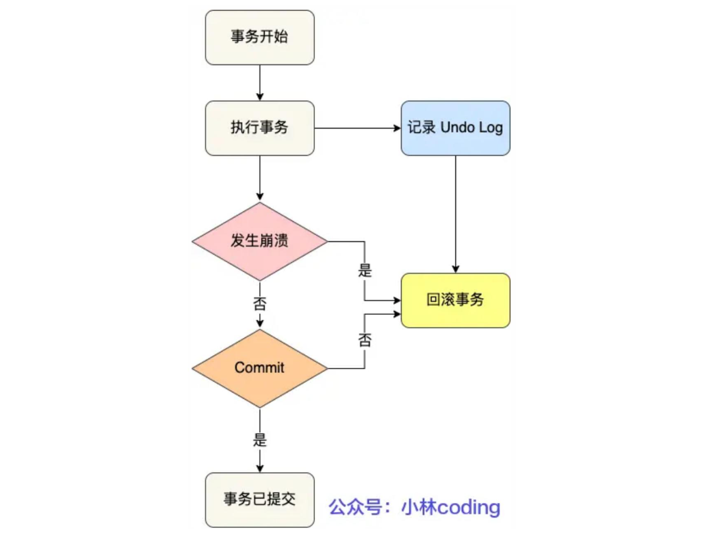

**每当** InnoDB 引擎**对⼀条记录进⾏操作（修改、删除、新增）时**，要把回滚时需要的信息都记录到 undo log ⾥，⽐如：

- 在插⼊⼀条记录时，要把这条记录的主键值记下来，这样之后回滚时只需要把这个主键值对应的记录删掉就好了；
- 在删除⼀条记录时，要把这条记录中的内容都记下来，这样之后回滚时再把由这些内容组成的记录插⼊到表中就好了；
- 在更新⼀条记录时，要把被更新的列的旧值记下来，这样之后回滚时再把这些列更新为旧值就好了。

在发⽣回滚时，就读取 undo log ⾥的数据，然后做原先相反操作。⽐如当 delete ⼀条记录时，undo log 中会把记录中的内容都记下来，然后执⾏回滚操作的时候，就读取 undo log ⾥的数据，然后进⾏ insert 操作。

针对 delete 操作和 update 操作会有⼀些特殊的处理：

* delete操作实际上不会⽴即直接删除，⽽是将delete对象打上delete flag，标记为删除，最终的删除操作是purge线程完成的。

* update分为两种情况：update的列是否是主键列。
  * 如果不是主键列，在undo log中直接反向记录是如何update的。即update是直接进⾏的。
  * 如果是主键列，update分两部执⾏：先删除该⾏，再插⼊⼀⾏⽬标⾏。

不同的操作，需要记录的内容也是不同的，所以不同类型的操作（修改、删除、新增）产⽣的 undo log 的格式也是不同的。

⼀条记录的每⼀次更新操作产⽣的 undo log 格式都有⼀个 roll_pointer 指针和⼀个 trx_id 事务id：

- 通过 trx_id 可以知道该记录是被哪个事务修改的；
- 通过 roll_pointer 指针可以将这些 undo log 串成⼀个链表，这个链表就被称为版本链；

版本链如下：

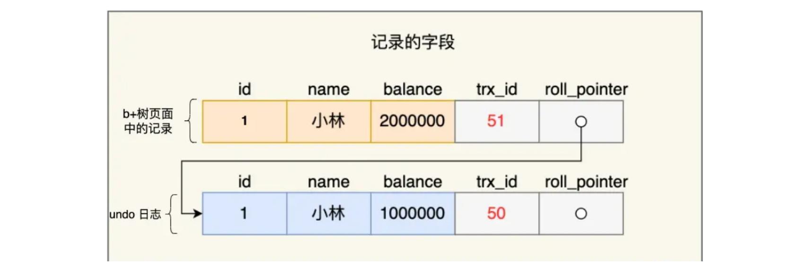

另外，undo log 还有⼀个作⽤，通过 ReadView + undo log 实现 MVCC（多版本并发控制）。

对于「读提交」和「可重复读」隔离级别的事务来说，它们的快照读（普通 select 语句）是通过 Read View +undo log 来实现的，它们的区别在于创建 Read View 的时机不同：

- **「读提交」隔离级别是在每个 select 都会⽣成⼀个新的 Read View**，也意味着，事务期间的多次读取同⼀条数据，前后两次读的数据可能会出现不⼀致，因为可能这期间另外⼀个事务修改了该记录，并提交了事务。
- **「可重复读」隔离级别是启动事务时⽣成⼀个 Read View，然后整个事务期间都在⽤这个 Read View**，这样就保证了在事务期间读到的数据都是事务启动前的记录。

因此，undo log 两⼤作⽤：

- **实现事务回滚，保障事务的原⼦性。**事务处理过程中，如果出现了错误或者⽤户执⾏了 ROLLBACK 语句，MySQL 可以利⽤ undo log 中的历史数据将数据恢复到事务开始之前的状态。
- **实现 MVCC（多版本并发控制）**关键因素之⼀。MVCC 是通过 ReadView + undo log 实现的。undo log 为每条记录保存多份历史数据，MySQL 在执⾏快照读（普通 select 语句）的时候，会根据事务的 Read View⾥的信息，顺着 undo log 的版本链找到满⾜其可见性的记录。


**undo log 和数据页的刷盘策略是⼀样的，都需要通过 redo log 保证持久化。**

**buffer pool 中有 undo 页，对 undo 页的修改也都会记录到 redo log。redo log 会每秒刷盘，提交事务时也会刷盘，数据页和 undo 页都是靠这个机制保证持久化的。**

#### Redo Log

为了防⽌断电导致数据丢失的问题，当有⼀条记录需要更新的时候，InnoDB 引擎就会先更新内存（同时标记为脏页），然后将本次对这个页的修改以 redo log 的形式记录下来，这个时候更新就算完成了。

后续，InnoDB 引擎会在适当的时候，由后台线程将缓存在 Buffer Pool 的脏页刷新到磁盘⾥，这就是 WAL（Write-Ahead Logging）技术。

**WAL 技术指的是， MySQL 的写操作并不是⽴刻写到磁盘上，⽽是先写⽇志，然后在合适的时间再写到磁盘上。**

过程如下：

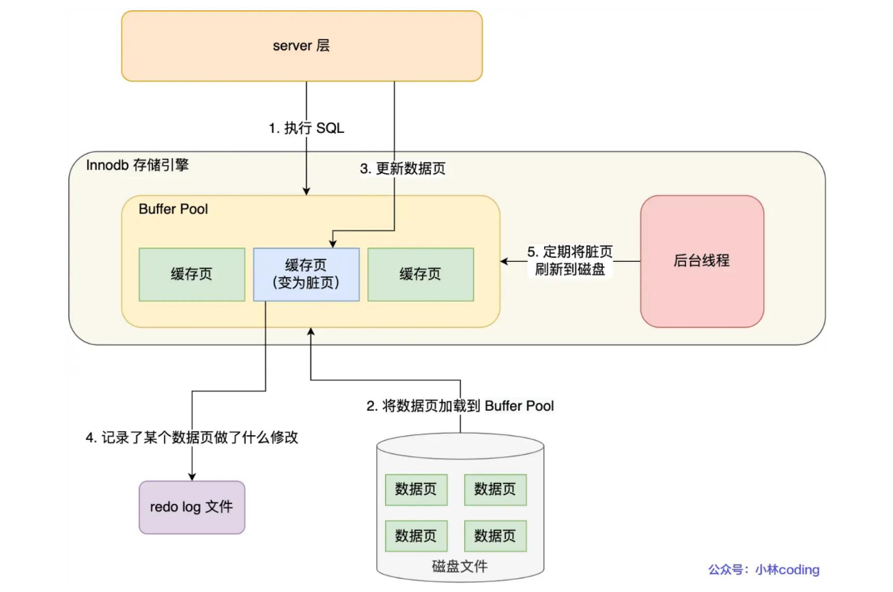

**redo log 是物理⽇志**，记录了某个数据页做了什么修改，⽐如对 XXX 表空间中的 YYY 数据页 ZZZ 偏移量的地⽅做了AAA 更新，每当执⾏⼀个事务就会产⽣这样的⼀条或者多条物理⽇志。

在事务提交时，只要先将 redo log 持久化到磁盘即可，可以不需要等到将缓存在 Buffer Pool ⾥的脏页数据持久化到磁盘。

当系统崩溃时，虽然脏页数据没有持久化，但是 redo log 已经持久化，接着 MySQL 重启后，可以根据 redo log 的内容，将所有数据恢复到最新的状态。

被修改 Undo 页⾯，也需要记录对应 redo log 。开启事务后，InnoDB 层更新记录前，⾸先要记录相应的 undo log，如果是更新操作，需要把被更新的列的旧值记下来，也就是要⽣成⼀条 undo log，undo log 会写⼊ Buffer Pool 中的 Undo 页⾯。不过，在内存修改该 Undo 页⾯后，也是需要记录对应的 redo log，因为undo log也要实现持久性的保护。

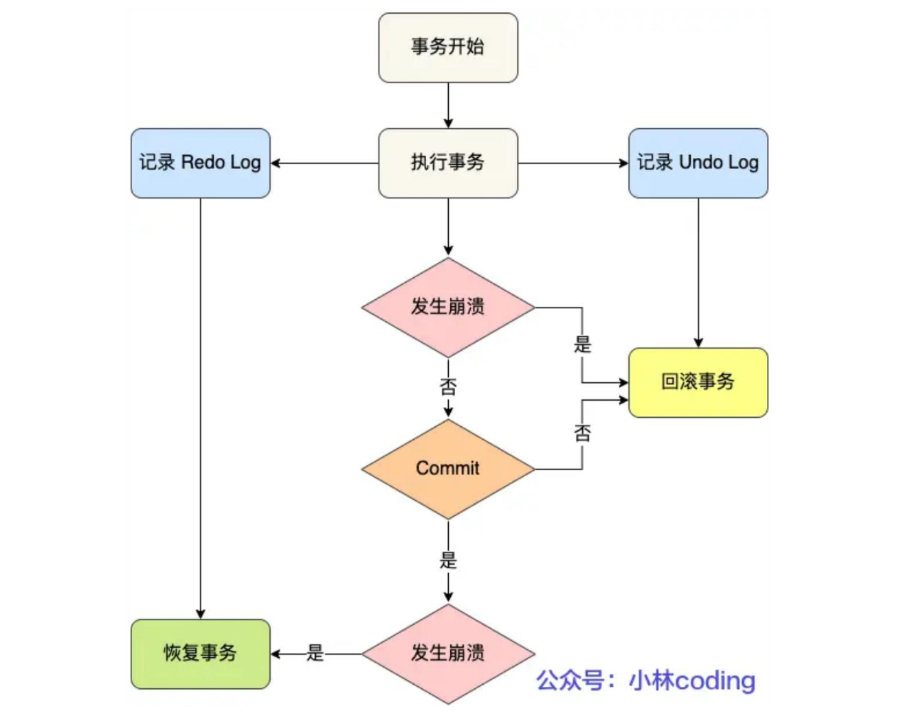

写⼊ redo log 的⽅式使⽤了追加操作， 所以磁盘操作是顺序写，⽽写⼊数据需要先找到写⼊位置，然后才写到磁盘，所以磁盘操作是随机写。

磁盘的「顺序写 」⽐「随机写」 ⾼效的多，因此 redo log 写⼊磁盘的开销更⼩。

实际上， 执⾏⼀个事务的过程中，产⽣的 redo log 也不是直接写⼊磁盘的，因为这样会产⽣⼤量的 I/O 操作，⽽且磁盘的运⾏速度远慢于内存。

所以，redo log 也有⾃⼰的缓存—— redo log buffer，每当产⽣⼀条 redo log 时，会先写⼊到 redo log buffer，后续在持久化到磁盘如下图：

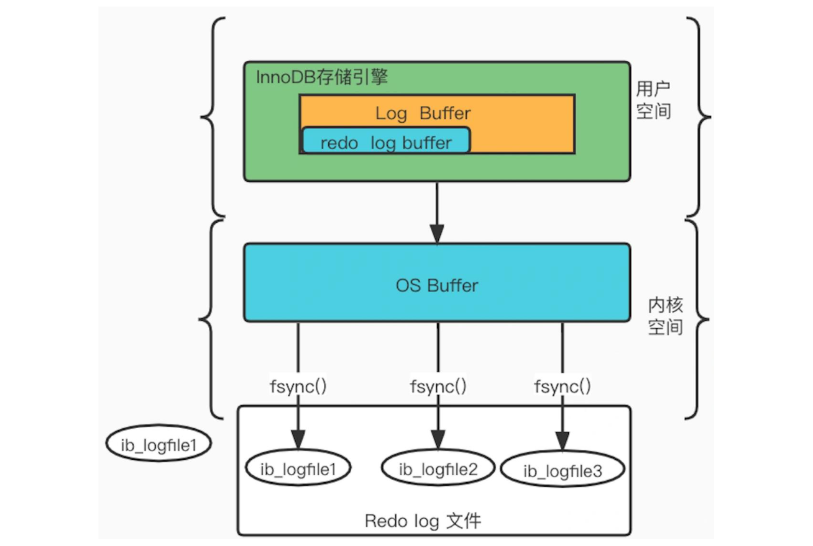

Redo Log的刷盘时机主要为以下情况：

- MySQL 正常关闭时；
- 当 redo log buffer 中记录的写⼊量⼤于 redo log buffer 内存空间的⼀半时，会触发落盘；
- InnoDB 的后台线程每隔 1 秒，将 redo log buffer 持久化到磁盘。
- 每 次 事 务 提 交 时 都 将 缓 存 在 redo log buffer ⾥ 的 redo log 直 接 持 久 化 到 磁 盘 （ 这 个 策 略 可 由innodb_flush_log_at_trx_commit 参数控制，下⾯会说）。

参数 innodb_flush_log_at_trx_commit 参数控制，可取的值有：0、1、2，默认值为 1，这三个值分别代表的策略如下：

- 当设置该参数为 0 时，表⽰每次事务提交时 ，还是将 redo log 留在 redo log buffer 中 ，该模式下在事务提交时不会主动触发写⼊磁盘的操作。
- 当设置该参数为 1 时，表⽰每次事务提交时，都将缓存在 redo log buffer ⾥的 redo log 直接持久化到磁盘，这样可以保证 MySQL 异常重启之后数据不会丢失。
- 当设置该参数为 2 时，表⽰每次事务提交时，都只是缓存在 redo log buffer ⾥的 redo log 写到 redo log ⽂件，注意写⼊到「 redo log ⽂件」并不意味着写⼊到了磁盘，因为操作系统的⽂件系统中有个 Page Cache（如果你想了解 Page Cache，可以看这篇 ），Page Cache 是专门⽤来缓存⽂件数据的，所以写⼊「 redolog⽂件」意味着写⼊到了操作系统的⽂件缓存。

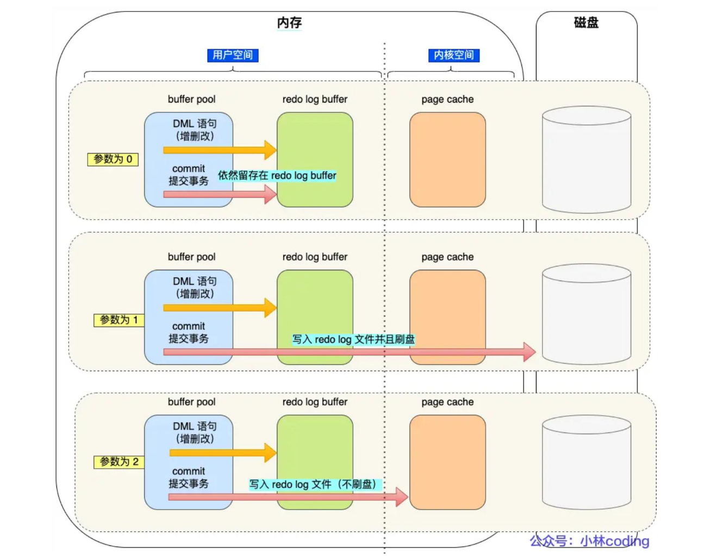

InnoDB 的后台线程每隔 1 秒：

- 针对参数 0 ：会把缓存在 redo log buffer 中的 redo log ，通过调⽤ write() 写到操作系统的 Page Cache，然后调⽤ fsync() 持久化到磁盘。所以参数为 0 的策略，MySQL 进程的崩溃会导致上⼀秒钟所有事务数据的丢失;
- 针对参数 2 ：调⽤ fsync，将缓存在操作系统中 Page Cache ⾥的 redo log 持久化到磁盘。所以参数为 2 的策略，较取值为 0 情况下更安全，因为 MySQL 进程的崩溃并不会丢失数据，只有在操作系统崩溃或者系统断电的情况下，上⼀秒钟所有事务数据才可能丢失。


重做⽇志⽂件组是以循环写的⽅式⼯作的，从头开始写，写到末尾就又回到开头，相当于⼀个环形。

所以 InnoDB 存储引擎会先写 ib_logfile0 ⽂件，当 ib_logfile0 ⽂件被写满的时候，会切换⾄ ib_logfile1 ⽂件，当ib_logfile1 ⽂件也被写满时，会切换回 ib_logfile0 ⽂件。

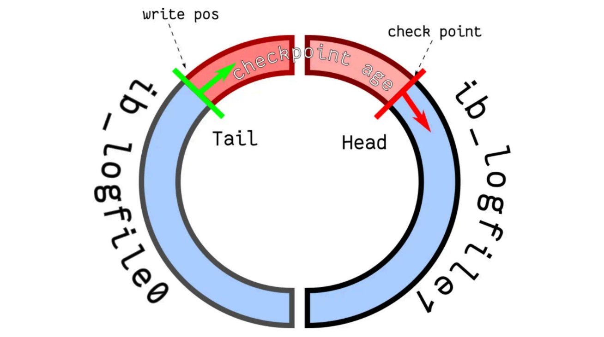

如果随着系统运⾏，Buffer Pool 的脏页刷新到了磁盘中，那么 redo log 对应的记录也就没⽤了，这时候我们擦除这些旧记录，以腾出空间记录新的更新操作。

#### Binlog

MySQL 在完成⼀条更新操作后，Server 层还会⽣成⼀条 binlog，等之后事务提交的时候，会将该事物执⾏过程中产⽣的所有 binlog 统⼀写 ⼊ binlog ⽂件。

binlog ⽂件是记录了所有数据库表结构变更和表数据修改的⽇志，不会记录查询类的操作，⽐如 SELECT 和SHOW 操作。

为什么有了 binlog， 还要有 redo log？这个问题跟 MySQL 的时间线有关系。

最开始 MySQL ⾥并没有 InnoDB 引擎，MySQL ⾃带的引擎是 MyISAM，但是 MyISAM 没有 crash-safe 的能⼒，binlog ⽇志只能⽤于归档。⽽ InnoDB 是另⼀个公司以插件形式引⼊ MySQL 的，既然只依靠 binlog 是没有 crash-safe 能⼒的，所以 InnoDB使⽤ redo log 来实现 crash-safe 能⼒。

久而久之分工也就变明确了，binlog负责主从复制的数据同步，而redolog用于崩溃后的数据恢复。

MySQL 的主从复制依赖于 binlog ，也就是记录 MySQL 上的所有变化并以⼆进制形式保存在磁盘上。复制的过程就是将 binlog 中的数据从主库传输到从库上。这个过程⼀般是异步的，也就是主库上执⾏事务操作的线程不会等待复制 binlog 的线程同步完成。

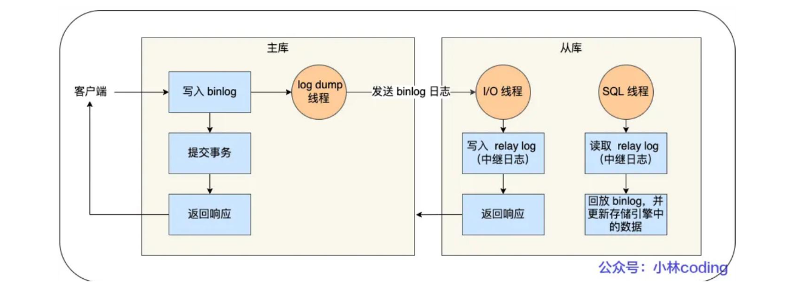

MySQL 集群的主从复制过程梳理成 3 个阶段：

- **写⼊ Binlog：**MySQL 主库在收到客户端提交事务的请求之后，会先写⼊ binlog，再提交事务，更新存储引擎中的数据，事务提交完成后，返回给客户端“操作成功”的响应。
- **同步 Binlog：**从库会创建⼀个专门的 I/O 线程，连接主库的 log dump 线程，来接收主库的 binlog ⽇志，再把 binlog 信息写⼊ relay log 的中继⽇志⾥，再返回给主库“复制成功”的响应。
- **回放 Binlog：**从库会创建⼀个⽤于回放 binlog 的线程，去读 relay log 中继⽇志，然后回放 binlog 更新存储引擎中的数据，最终实现主从的数据⼀致性。

在完成主从复制之后，你就可以在写数据时只写主库，在读数据时只读从库，这样即使写请求会锁表或者锁记录，也不会影响读请求的执⾏。

事务执⾏过程中，先把⽇志写到 binlog cache（Server 层的 cache），事务提交的时候，再把 binlog cache 写到binlog ⽂件中。

**一个事务的 binlog 是不能被拆开的，因此⽆论这个事务有多⼤（⽐如有很多条语句），也要保证⼀次性写⼊。这是因为有⼀个线程只能同时有⼀个事务在执⾏的设定，所以每当执⾏⼀个 begin/start transaction 的时候，就会默认提交上⼀个事务**，这样如果⼀个事务的 binlog 被拆开的时候，在备库执⾏就会被当做多个事务分段执⾏，这样破坏了原⼦性，是有问题的。

#### 两阶段提交

事务提交后，redo log 和 binlog 都要持久化到磁盘，但是这两个是独⽴的逻辑，可能出现半成功的状态，这样就造成两份⽇志之间的逻辑不⼀致。

在持久化 redo log 和 binlog 这两份⽇志的时候，如果出现半成功的状态，就会造成主从环境的数据不致性。这是因为 redo log 影响主库的数据，binlog 影响从库的数据，所以 redo log 和 binlog 必须保持⼀致才能保证主从数据⼀致。

MySQL 为了避免出现两份⽇志之间的逻辑不⼀致的问题，使⽤了「两阶段提交」来解决，两阶段提交把单个事务的提交拆分成了 2 个阶段，分别是「准备（Prepare）阶段」和「提交（Commit）阶段」，每个阶段都由协调者（Coordinator）和参与者（Participant）共同完成。


### 内存

#### Buffer Pool

当读取数据时，如果数据存在于 Buffer Pool 中，客户端就会直接读取 Buffer Pool 中的数据，否则再去磁盘中读取。当修改数据时，如果数据存在于 Buffer Pool 中，那直接修改 Buffer Pool 中数据所在的页，然后将其页设置为脏页（该页的内存数据和磁盘上的数据已经不⼀致），为了减少磁盘I/O，不会⽴即将脏页写⼊磁盘，后续由后台线程选择⼀个合适的时机将脏页写⼊到磁盘。

InnoDB 会把存储的数据划分为若⼲个「页」，以页作为磁盘和内存交互的基本单位，⼀个页的默认⼤⼩为 16KB。因此，Buffer Pool 同样需要按「页」来划分。

在 MySQL 启动的时候，InnoDB 会为 Buffer Pool 申请⼀⽚连续的内存空间，然后按照默认的16KB的⼤⼩划分出⼀个个的页， Buffer Pool 中的页就叫做缓存页。此时这些缓存页都是空闲的，之后随着程序的运⾏，才会有磁盘上的页被缓存到 Buffer Pool 中。

Buffer Pool 除了缓存「索引页」和「数据页」，还包括了 Undo 页，插⼊缓存、⾃适应哈希索引、锁信息等等。

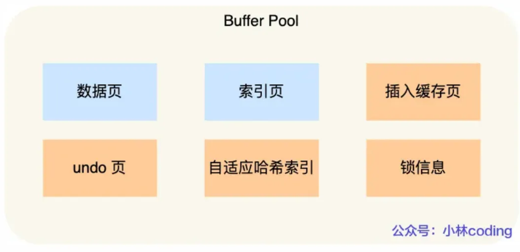

当我们查询⼀条记录时，InnoDB 是会把整个页的数据加载到 Buffer Pool 中，将页加载到 Buffer Pool 后，再通过页⾥的「页⽬录」去定位到某条具体的记录。

##### 管理空页

为了能够快速找到空闲的缓存页，可以使⽤链表结构，将空闲缓存页的「控制块」作为链表的节点，这个链表称为 Free 链表（空闲链表）。

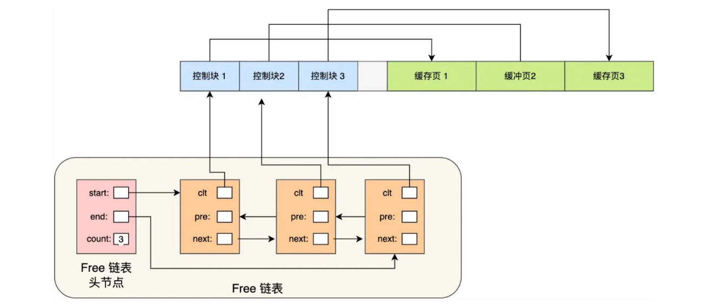

Free 链表上除了有控制块，还有⼀个头节点，该头节点包含链表的头节点地址，尾节点地址，以及当前链表中节点的数量等信息。

Free 链表节点是⼀个⼀个的控制块，⽽每个控制块包含着对应缓存页的地址，所以相当于 Free 链表节点都对应⼀个空闲的缓存页。

有了 Free 链表后，每当需要从磁盘中加载⼀个页到 Buffer Pool 中时，就从 Free链表中取⼀个空闲的缓存页，并且把该缓存页对应的控制块的信息填上，然后把该缓存页对应的控制块从 Free 链表中移除。

##### 管理脏页

为了能快速知道哪些缓存页是脏的，于是就设计出 Flush 链表，它跟 Free 链表类似的，链表的节点也是控制块，区别在于 Flush 链表的元素都是脏页。有了 Flush 链表后，后台线程就可以遍历 Flush 链表，将脏页写⼊到磁盘。

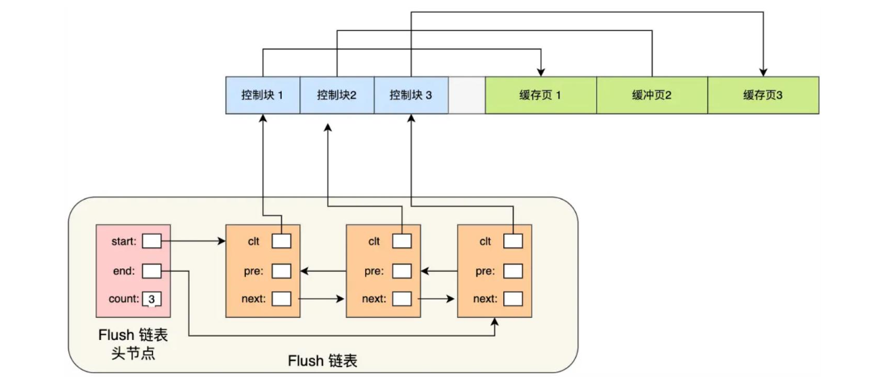

##### 管理缓存

MySQL 是这样做的，它改进了 LRU 算法，将 LRU 划分了 2 个区域：old 区域 和 young 区域。

young 区域在 LRU 链表的前半部分，old 区域则是在后半部分，如下图：

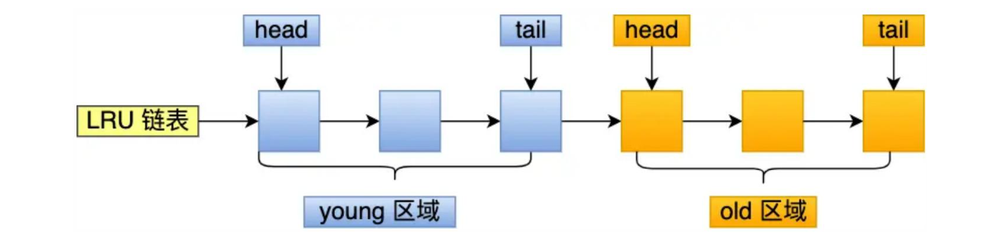

old 区域占整个 LRU 链表长度的⽐例可以通过 innodb_old_blocks_pct 参数来设置，默认是 37，代表整个 LRU链表中 young 区域与 old 区域⽐例是 63:37。

划分这两个区域后，预读的页就只需要加⼊到 old 区域的头部，当页被真正访问的时候，才将页插⼊ young 区域的头部。如果预读的页⼀直没有被访问，就会从 old 区域移除，这样就不会影响 young 区域中的热点数据。

接下来，给⼤家举个例⼦。

假设有⼀个长度为 10 的 LRU 链表，其中 young 区域占⽐ 70% ，old 区域占⽐ 30% 。

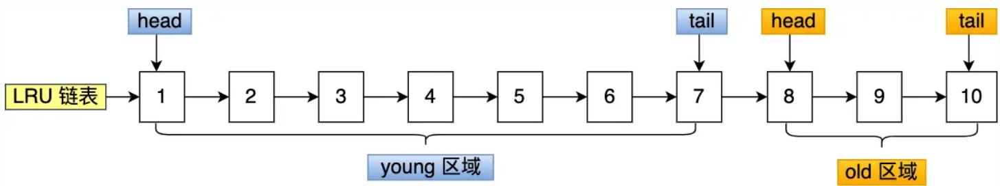

现在有个编号为 20 的页被预读了，这个页只会被插⼊到 old 区域头部，⽽ old 区域末尾的页（10号）会被淘汰掉。

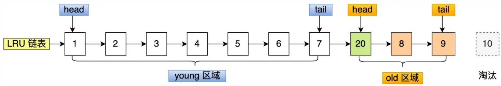

如果 20 号页⼀直不会被访问，它也没有占⽤到 young 区域的位置，⽽且还会⽐ young 区域的数据更早被淘汰出去。

如果 20 号页被预读后，⽴刻被访问了，那么就会将它插⼊到 young 区域的头部，young 区域末尾的页（7号），会被挤到 old 区域，作为 old 区域的头部，这个过程并不会有页被淘汰。

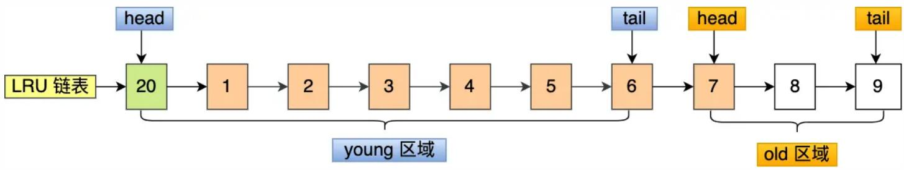

虽然通过划分 old 区域 和 young 区域避免了预读失效带来的影响，但是还有个问题⽆法解决，那就是 Buffer Pool污染的问题。

当某⼀个 SQL 语句扫描了⼤量的数据时，在 Buffer Pool 空间⽐较有限的情况下，可能会将Buffer Pool ⾥的所有页都替换出去，导致⼤量热数据被淘汰了，等这些热数据又被再次访问的时候，由于缓存未命中，就会产⽣⼤量的磁盘 IO，MySQL 性能就会急剧下降，这个过程被称为 Buffer Pool 污染。

MySQL 是这样做的，进⼊到 young 区域条件增加了⼀个停留在 old 区域的时间判断。

具体是这样做的，在对某个处在 old 区域的缓存页进⾏第⼀次访问时，就在它对应的控制块中记录下来这个访问时间：

- 如果后续的访问时间与第⼀次访问的时间在某个时间间隔内，那么该缓存页就不会被从 old 区域移动到young 区域的头部；
- 如果后续的访问时间与第⼀次访问的时间不在某个时间间隔内，那么该缓存页移动到 young 区域的头部；

这个间隔时间是由 innodb_old_blocks_time 控制的，默认是 1000ms 。也就说，只有同时满⾜「被访问」与「在 old 区域停留时间超过 1 秒」两个条件，才会被插⼊到 young 区域头部，这样就解决了 Buffer Pool 污染的问题 。另外，MySQL 针对 young 区域其实做了⼀个优化，为了防⽌ young 区域节点频繁移动到头部。young 区域前⾯1/4 被访问不会移动到链表头部，只有后⾯的 3/4被访问了才会。

下⾯⼏种情况会触发脏页的刷新：

- 当 redo log ⽇志满了的情况下，会主动触发脏页刷新到磁盘；
- Buffer Pool 空间不⾜时，需要将⼀部分数据页淘汰掉，如果淘汰的是脏页，需要先将脏页同步到磁盘；
- MySQL 认为空闲时，后台线程会定期将适量的脏页刷⼊到磁盘；
- MySQL 正常关闭之前，会把所有的脏页刷⼊到磁盘；

## MySql 使用

### MySQL 数据类型

MySQL 中定义数据字段的类型对你数据库的优化是非常重要的。

MySQL 支持多种类型，大致可以分为三类：数值、日期/时间和字符串(字符)类型。

#### 数值类型

MySQL 支持所有标准 SQL 数值数据类型。

这些类型包括严格数值数据类型(INTEGER、SMALLINT、DECIMAL 和 NUMERIC)，以及近似数值数据类型(FLOAT、REAL 和 DOUBLE PRECISION)。

关键字INT是INTEGER的同义词，关键字DEC是DECIMAL的同义词。

BIT数据类型保存位字段值，并且支持 MyISAM、MEMORY、InnoDB 和 BDB表。

作为 SQL 标准的扩展，MySQL 也支持整数类型 TINYINT、MEDIUMINT 和 BIGINT。下面的表显示了需要的每个整数类型的存储和范围。

| 类型         | 大小                                     | 范围（有符号）                                               | 范围（无符号）                                               | 用途            |
| :----------- | :--------------------------------------- | :----------------------------------------------------------- | :----------------------------------------------------------- | :-------------- |
| TINYINT      | 1 Bytes                                  | (-128，127)                                                  | (0，255)                                                     | 小整数值        |
| SMALLINT     | 2 Bytes                                  | (-32 768，32 767)                                            | (0，65 535)                                                  | 大整数值        |
| MEDIUMINT    | 3 Bytes                                  | (-8 388 608，8 388 607)                                      | (0，16 777 215)                                              | 大整数值        |
| INT或INTEGER | 4 Bytes                                  | (-2 147 483 648，2 147 483 647)                              | (0，4 294 967 295)                                           | 大整数值        |
| BIGINT       | 8 Bytes                                  | (-9,223,372,036,854,775,808，9 223 372 036 854 775 807)      | (0，18 446 744 073 709 551 615)                              | 极大整数值      |
| FLOAT        | 4 Bytes                                  | (-3.402 823 466 E+38，-1.175 494 351 E-38)，0，(1.175 494 351 E-38，3.402 823 466 351 E+38) | 0，(1.175 494 351 E-38，3.402 823 466 E+38)                  | 单精度 浮点数值 |
| DOUBLE       | 8 Bytes                                  | (-1.797 693 134 862 315 7 E+308，-2.225 073 858 507 201 4 E-308)，0，(2.225 073 858 507 201 4 E-308，1.797 693 134 862 315 7 E+308) | 0，(2.225 073 858 507 201 4 E-308，1.797 693 134 862 315 7 E+308) | 双精度 浮点数值 |
| DECIMAL      | 对DECIMAL(M,D) ，如果M>D，为M+2否则为D+2 | 依赖于M和D的值                                               | 依赖于M和D的值                                               | 小数值          |

#### 日期和时间类型

表示时间值的日期和时间类型为DATETIME、DATE、TIMESTAMP、TIME和YEAR。

每个时间类型有一个有效值范围和一个"零"值，当指定不合法的MySQL不能表示的值时使用"零"值。

TIMESTAMP类型有专有的自动更新特性，将在后面描述。

| 类型      | 大小 ( bytes) | 范围                                                         | 格式                | 用途                     |
| :-------- | :------------ | :----------------------------------------------------------- | :------------------ | :----------------------- |
| DATE      | 3             | 1000-01-01/9999-12-31                                        | YYYY-MM-DD          | 日期值                   |
| TIME      | 3             | '-838:59:59'/'838:59:59'                                     | HH:MM:SS            | 时间值或持续时间         |
| YEAR      | 1             | 1901/2155                                                    | YYYY                | 年份值                   |
| DATETIME  | 8             | '1000-01-01 00:00:00' 到 '9999-12-31 23:59:59'               | YYYY-MM-DD hh:mm:ss | 混合日期和时间值         |
| TIMESTAMP | 4             | '1970-01-01 00:00:01' UTC 到 '2038-01-19 03:14:07' UTC结束时间是第 **2147483647** 秒，北京时间 **2038-1-19 11:14:07**，格林尼治时间 2038年1月19日 凌晨 03:14:07 | YYYY-MM-DD hh:mm:ss | 混合日期和时间值，时间戳 |

#### 字符串类型

字符串类型指CHAR、VARCHAR、BINARY、VARBINARY、BLOB、TEXT、ENUM和SET。该节描述了这些类型如何工作以及如何在查询中使用这些类型。

| 类型       | 大小                  | 用途                            |
| :--------- | :-------------------- | :------------------------------ |
| CHAR       | 0-255 bytes           | 定长字符串                      |
| VARCHAR    | 0-65535 bytes         | 变长字符串                      |
| TINYBLOB   | 0-255 bytes           | 不超过 255 个字符的二进制字符串 |
| TINYTEXT   | 0-255 bytes           | 短文本字符串                    |
| BLOB       | 0-65 535 bytes        | 二进制形式的长文本数据          |
| TEXT       | 0-65 535 bytes        | 长文本数据                      |
| MEDIUMBLOB | 0-16 777 215 bytes    | 二进制形式的中等长度文本数据    |
| MEDIUMTEXT | 0-16 777 215 bytes    | 中等长度文本数据                |
| LONGBLOB   | 0-4 294 967 295 bytes | 二进制形式的极大文本数据        |
| LONGTEXT   | 0-4 294 967 295 bytes | 极大文本数据                    |

**注意**：char(n) 和 varchar(n) 中括号中 n 代表字符的个数，并不代表字节个数，比如 CHAR(30) 就可以存储 30 个字符。

CHAR 和 VARCHAR 类型类似，但它们保存和检索的方式不同。它们的最大长度和是否尾部空格被保留等方面也不同。在存储或检索过程中不进行大小写转换。

BINARY 和 VARBINARY 类似于 CHAR 和 VARCHAR，不同的是它们包含二进制字符串而不要非二进制字符串。也就是说，它们包含字节字符串而不是字符字符串。这说明它们没有字符集，并且排序和比较基于列值字节的数值值。

BLOB 是一个二进制大对象，可以容纳可变数量的数据。有 4 种 BLOB 类型：TINYBLOB、BLOB、MEDIUMBLOB 和 LONGBLOB。它们区别在于可容纳存储范围不同。

有 4 种 TEXT 类型：TINYTEXT、TEXT、MEDIUMTEXT 和 LONGTEXT。对应的这 4 种 BLOB 类型，可存储的最大长度不同，可根据实际情况选择。

#### 枚举与集合类型（Enumeration and Set Types）

- **ENUM**: 枚举类型，用于存储单一值，可以选择一个预定义的集合。
- **SET**: 集合类型，用于存储多个值，可以选择多个预定义的集合。

#### 空间数据类型（Spatial Data Types）

GEOMETRY, POINT, LINESTRING, POLYGON, MULTIPOINT, MULTILINESTRING, MULTIPOLYGON, GEOMETRYCOLLECTION: 用于存储空间数据（地理信息、几何图形等）。

### MySql 语言 

### DQL：查询数据

#### 基础查询

```sql
SELECT *
FROM table_name;
```

**指定字段查询：**

```sql
SELECT column_name1, column_name2
FROM table_name;
```

**使用别名：**

```sql
SELECT column_name1 AS alias_name1, column_name2 AS alias_name2
FROM table_name;
```

**去重查询：**

```sql
SELECT DISTINCT column_name1
FROM table_name;
# DISTINCT 需要加在前边而不是后边
```

**分页查询：**

```sql
SELECT *
FROM table_name
LIMIT 10;

SELECT *
FROM table_name
LIMIT 20, 10;
# 其中 LIMIT 为 LIMIT NUM, OFFSET 
```

#### 条件过滤

```sql
SELECT *
FROM table_name
WHERE column_name1 = 1;
```

**逻辑运算：**

```sql
SELECT *
FROM table_name
WHERE column_name1 > 1 AND column_name2 < 10;
```

```sql
SELECT *
FROM table_name
WHERE column_name1 IN (1, 2, 3) OR column_name2 IS NULL;
```

#### 排序、分页与去重

```sql
SELECT *
FROM table_name
ORDER BY column_name1 ASC, column_name2 DESC;
```

```sql
SELECT *
FROM table_name
ORDER BY id DESC
LIMIT 0, 20;
```

#### 模糊匹配

```sql
SELECT *
FROM table_name
WHERE name LIKE 'prefix%';
```

```sql
SELECT *
FROM table_name
WHERE name LIKE '_b%';
```

#### 计算与函数

**算术表达式：**

```sql
SELECT price, quantity, price * quantity AS total_amount
FROM order_table;
```

**CASE WHEN 条件判断：**

```sql
SELECT user_name,
       CASE
           WHEN score >= 90 THEN 'A'
           WHEN score >= 80 THEN 'B'
           WHEN score >= 60 THEN 'C'
           ELSE 'D'
       END AS grade
FROM student_table;
```

**聚合函数：**

```sql
SELECT COUNT(*) AS total_count,
       AVG(price) AS avg_price,
       MAX(price) AS max_price
FROM product_table;
```

**日期函数：**

```sql
SELECT NOW(), CURDATE(), CURTIME();
SELECT DATE_ADD(NOW(), INTERVAL 7 DAY);
SELECT DATEDIFF('2026-04-08', '2026-04-01');
```

**数值函数：**

```sql
SELECT ABS(-10), MOD(10, 3), RAND(), ROUND(3.14159, 2);
```

#### 字符串处理

```sql
SELECT CONCAT(TRIM(first_name), ' ', TRIM(last_name)) AS full_name
FROM user_table;
SELECT LEFT(phone_number, 3), RIGHT(phone_number, 4)
FROM user_table;
SELECT REPLACE(user_name, 'a', 'A')
FROM user_table;
```

#### 分组与聚合

```sql
SELECT department_id, COUNT(*) AS total_count
FROM employee_table
GROUP BY department_id;
SELECT department_id, COUNT(*) AS total_count
FROM employee_table
GROUP BY department_id
HAVING COUNT(*) >= 2;
```

#### 子查询

```sql
SELECT *
FROM order_table
WHERE user_id IN (
    SELECT id
    FROM user_table
    WHERE status = 1
);
```

```sql
SELECT *
FROM user_table AS u
WHERE EXISTS (
    SELECT 1
    FROM order_table AS o
    WHERE o.user_id = u.id
);
```

#### 连接查询

```sql
SELECT u.id, u.user_name, o.order_no
FROM user_table AS u
INNER JOIN order_table AS o
ON u.id = o.user_id;
```

```sql
SELECT u.id, u.user_name, o.order_no
FROM user_table AS u
LEFT JOIN order_table AS o
ON u.id = o.user_id;
```

```sql
SELECT e1.employee_name, e2.employee_name AS leader_name
FROM employee_table AS e1
RIGHT JOIN employee_table AS e2
ON e1.leader_id = e2.id;
```

#### 组合查询

```sql
SELECT name
FROM teacher_table
UNION
SELECT name
FROM student_table;
```

```sql
SELECT name
FROM teacher_table
UNION ALL
SELECT name
FROM student_table;
```

#### 高级查询

```sql
WITH order_summary AS (
    SELECT user_id, COUNT(*) AS total_count
    FROM order_table
    GROUP BY user_id
)
SELECT *
FROM order_summary
WHERE total_count >= 3;
```

```sql
SELECT employee_name,
       department_id,
       salary,
       ROW_NUMBER() OVER (PARTITION BY department_id ORDER BY salary DESC) AS row_num
FROM employee_table;
```

### DML：操作数据

#### 插入

```sql
INSERT INTO table_name(column_name1, column_name2)
VALUES(value1, value2);
```

```sql
INSERT INTO table_name(column_name1, column_name2)
VALUES
    (value1, value2),
    (value3, value4);
```

```sql
INSERT INTO target_table(column_name1, column_name2)
SELECT column_name1, column_name2
FROM source_table;
```

```sql
INSERT INTO table_name
SET column_name1 = value1,
    column_name2 = value2;
```

```sql
INSERT INTO user_table(id, user_name, age)
VALUES(1, 'Tom', 20)
ON DUPLICATE KEY UPDATE
    user_name = VALUES(user_name),
    age = VALUES(age);
```

#### 更新

```sql
UPDATE table_name
SET column_name1 = value1,
    column_name2 = value2
WHERE id = 1;
```

#### 删除

```sql
DELETE FROM table_name
WHERE id = 1;
DELETE FROM table_name;
TRUNCATE TABLE table_name;
```

### DDL：定义数据库对象

#### 数据库与表

```sql
CREATE DATABASE db_name;
DROP DATABASE db_name;
SHOW DATABASES;
USE db_name;
```

```sql
CREATE TABLE table_name (
    id BIGINT NOT NULL AUTO_INCREMENT,
    user_name VARCHAR(64) NOT NULL,
    age INT DEFAULT 0,
    created_time DATETIME DEFAULT CURRENT_TIMESTAMP,
    PRIMARY KEY (id)
);
DROP TABLE table_name;
RENAME TABLE old_table_name TO new_table_name;
```

#### 表结构修改

```sql
ALTER TABLE table_name ADD COLUMN email VARCHAR(128);
ALTER TABLE table_name MODIFY COLUMN age BIGINT;
ALTER TABLE table_name CHANGE COLUMN email user_email VARCHAR(128);
ALTER TABLE table_name DROP COLUMN user_email;
TRUNCATE TABLE table_name;
```

#### 字段约束

```sql
CREATE TABLE user_table (
    id BIGINT PRIMARY KEY AUTO_INCREMENT,
    email VARCHAR(128) NOT NULL UNIQUE
);
```

```sql
CREATE TABLE order_table (
    id BIGINT PRIMARY KEY AUTO_INCREMENT,
    user_id BIGINT NOT NULL,
    CONSTRAINT fk_user_id FOREIGN KEY (user_id) REFERENCES user_table(id)
);
```

#### 索引

```sql
CREATE INDEX idx_user_name ON user_table(user_name);
CREATE UNIQUE INDEX uk_email ON user_table(email);
CREATE INDEX idx_user_name_age ON user_table(user_name, age);
DROP INDEX idx_user_name ON user_table;
```

### TCL：事务控制

```sql
START TRANSACTION;
BEGIN;
COMMIT;
ROLLBACK;
SAVEPOINT savepoint_name;
ROLLBACK TO savepoint_name;
```

```sql
SET autocommit = 0;
SELECT @@transaction_isolation;
SET SESSION TRANSACTION ISOLATION LEVEL READ COMMITTED;
```

```sql
SELECT *
FROM account_table
WHERE id = 1 FOR UPDATE;
SELECT *
FROM account_table
WHERE id = 1 FOR SHARE;
```

### 数据库编程

#### 视图

```sql
CREATE VIEW user_order_view AS
SELECT u.id, u.user_name, o.order_no
FROM user_table AS u
LEFT JOIN order_table AS o
ON u.id = o.user_id;
ALTER VIEW user_order_view AS SELECT u.id, u.user_name FROM user_table AS u;
DROP VIEW user_order_view;
```

#### 存储过程

```sql
delimiter //
create procedure get_user_count(out total_count int)
begin
    select count(*) into total_count from user_table;
end //
delimiter ;
call get_user_count(@total_count);
select @total_count;
```

#### 游标

```sql
delimiter //
create procedure read_user_ids()
begin
    declare done int default 0;
    declare current_user_id bigint;
    declare user_cursor cursor for select id from user_table;
    declare continue handler for sqlstate '02000' set done = 1;
    open user_cursor;
    repeat fetch user_cursor into current_user_id;
        if not done then select current_user_id; end if;
    until done end repeat;
    close user_cursor;
end //
delimiter ;
```

#### 触发器

```sql
CREATE TRIGGER trg_user_insert AFTER INSERT ON user_table FOR EACH ROW SELECT NEW.id INTO @new_user_id;
```

#### 事件

```sql
SET GLOBAL event_scheduler = ON;
CREATE EVENT clear_log_event ON SCHEDULE EVERY 1 DAY DO DELETE FROM log_table WHERE created_time < NOW() - INTERVAL 30 DAY;
DROP EVENT clear_log_event;
```

### DCL：权限控制

```sql
CREATE USER 'user_name'@'%' IDENTIFIED BY 'password';
ALTER USER 'user_name'@'%' IDENTIFIED BY 'new_password';
RENAME USER 'user_name'@'%' TO 'new_user_name'@'%';
DROP USER 'new_user_name'@'%';
SHOW GRANTS FOR 'user_name'@'%';
GRANT SELECT, INSERT, UPDATE ON db_name.* TO 'user_name'@'%';
REVOKE INSERT, UPDATE ON db_name.* FROM 'user_name'@'%';
CREATE ROLE 'role_name';
GRANT SELECT, INSERT, UPDATE, DELETE ON db_name.* TO 'role_name';
GRANT 'role_name' TO 'user_name'@'%';
```

### 运维与诊断命令

#### 元数据与结构查看

```sql
SHOW DATABASES;
SHOW TABLES;
DESC table_name;
DESCRIBE table_name;
SHOW CREATE TABLE table_name;
SHOW INDEX FROM table_name;
```

#### 系统状态与连接管理

```sql
SHOW VARIABLES;
SHOW STATUS;
SHOW PROCESSLIST;
SHOW FULL PROCESSLIST;
KILL CONNECTION connection_id;
```

#### 执行计划分析

```sql
EXPLAIN SELECT * FROM table_name WHERE column_name = 1;
EXPLAIN ANALYZE SELECT * FROM table_name WHERE column_name = 1;
```

#### 锁与事务排查

```sql
SELECT * FROM information_schema.innodb_trx;
SELECT * FROM performance_schema.data_locks;
SELECT * FROM performance_schema.data_lock_waits;
SHOW ENGINE INNODB STATUS;
```

#### 字符集与校对规则

```sql
SHOW VARIABLES LIKE 'character_set%';
SHOW VARIABLES LIKE 'collation%';
CREATE TABLE table_name (name VARCHAR(50)) DEFAULT CHARACTER SET utf8mb4 COLLATE utf8mb4_general_ci;
```

