# Nginx

## 简介

好啦，到这里，最初那个简陋的单进程网关服务，已经逐步演化成了一个支持多种通用网关能力、支持多种网络协议、采用 **master-worker** 架构、具备高并发处理能力，并同时能够承担 **HTTP 服务器** 与 **反向代理** 职责的高性能网关服务。

它就是所谓的 **Nginx**。

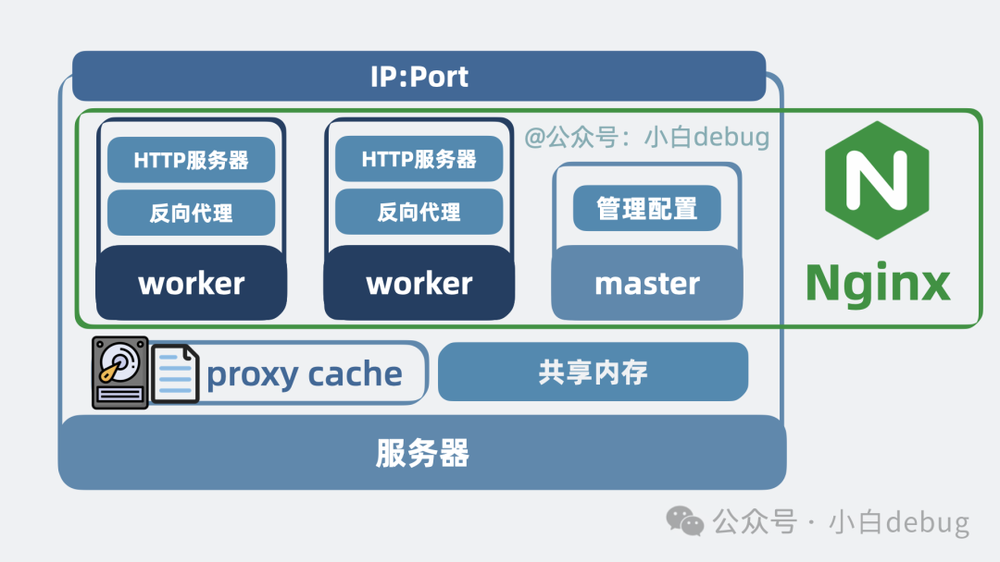

更准确地说，Nginx 是一个高性能、事件驱动的 Web 服务器和反向代理服务器。它最初因高并发、低资源消耗和稳定性而被广泛关注，后来又逐渐发展为一种通用的流量入口组件。在现代系统架构中，Nginx 常常位于客户端与后端服务之间，既可以直接对外提供静态资源访问能力，也可以作为统一入口把请求转发给后端服务集群。

它不仅支持日志、压缩、限流、缓存等通用能力，也具备很强的模块化扩展能力。很多时候，我们并不需要自己从头开发一个网关程序，只要写好配置，Nginx 就可以承担大量通用流量治理工作。对于绝大多数中小规模业务来说，它的性能都足够高，完全可以胜任流量入口、反向代理和静态资源服务这些职责。

不过，Nginx 再强，它本质上仍然只是部署在某台机器上的一组进程。如果整台机器故障，那么这组进程也会一起不可用，因此单独部署一个 Nginx 仍然会存在**单点问题**。

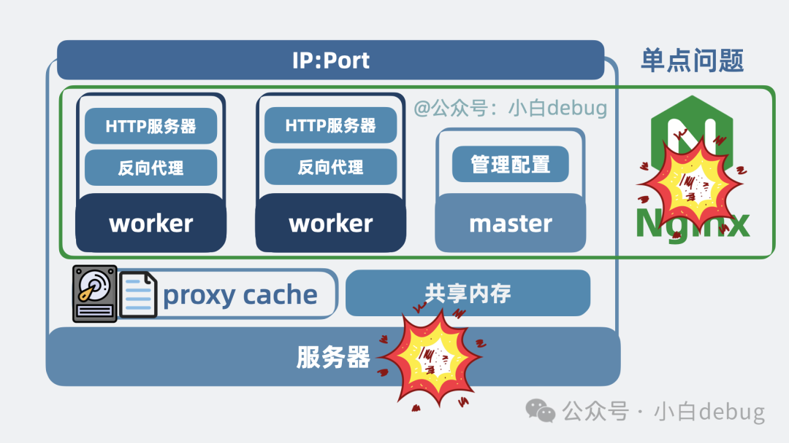

## 核心机制

### HTTP 服务器

想让本地浏览器获取远端服务器上的 HTML 文件，本质上需要的就是：远端有一个进程愿意接收 HTTP 请求，并把对应的网页文件返回给浏览器。浏览器负责发请求、接收响应并解析展示页面，而远端这个负责接收请求并返回网页内容的服务进程，就是所谓的 **HTTP 服务器**。


从这个角度看，HTTP 服务器的职责其实很明确：它理解 HTTP 协议，知道如何接收浏览器请求，知道该返回什么内容，也知道如何把本地文件系统中的网页、图片、CSS、JavaScript 等资源组织成 HTTP 响应返回给客户端。这样一来，前端开发写好的静态页面，就可以真正部署到服务器上，对外提供网页访问能力。

Nginx 最基础的身份之一，就是一个 HTTP 服务器。它可以直接把静态资源对外发布出来，因此在很多场景下，Nginx 既是网关，也是最前面的静态资源服务层。

## 反向代理是什么？

但一个完整的线上系统通常不只有前端页面，还会有很多后端服务。以前端商城为例，浏览器里展示的商品页面，往往还需要从后端商品服务获取实时数据。问题在于，一旦后端服务为了抗住流量而扩展成多个实例，浏览器就不可能直接理解“到底该访问后端哪一台机器”。

这时就需要在这些后端服务前面再放一个统一入口。客户端只访问这一个入口，请求到达之后，再由这个入口决定应该把流量转发给哪一个后端实例。这样一来，客户端就不需要感知后端到底有几台机器、每台机器的地址分别是什么，后端也可以在入口之后自由扩缩容。这种由代理位于服务端一侧、对客户端隐藏后端真实拓扑结构的代理方式，就是所谓的 **反向代理**。

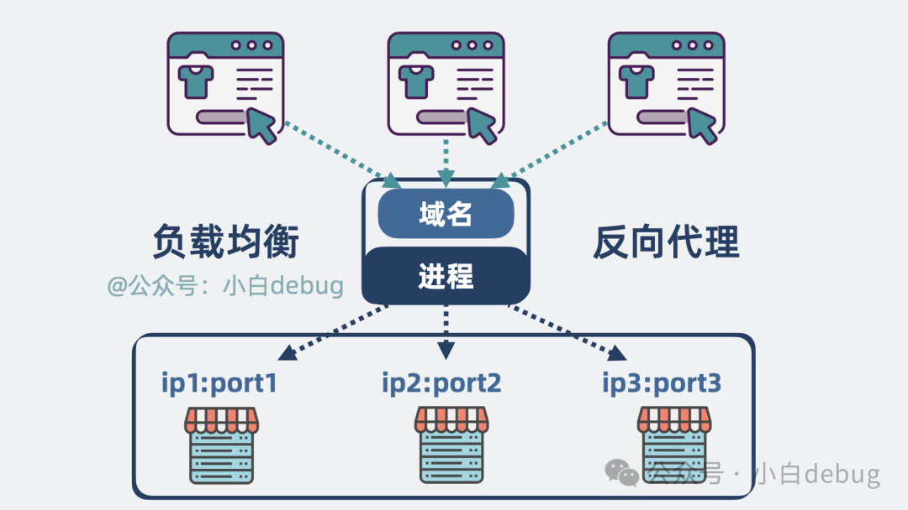

反向代理的核心价值，并不只是“帮忙转发请求”，而是它把后端服务集群统一封装到了一个稳定入口之后。客户端看到的是一个统一域名或统一地址，而后端真实节点可以根据需要随时扩容、缩容、替换甚至迁移。对客户端来说，后端是透明的；对系统维护者来说，入口之后的后端结构则是可控且可调整的。

顺着这个思路也能看出，反向代理和 HTTP 服务器其实完全可以放在同一个进程里：一方面，这个进程可以直接对外提供前端静态文件；另一方面，当浏览器中的前端代码继续请求后端接口时，它又可以把这些请求代理到真正的后端服务上。

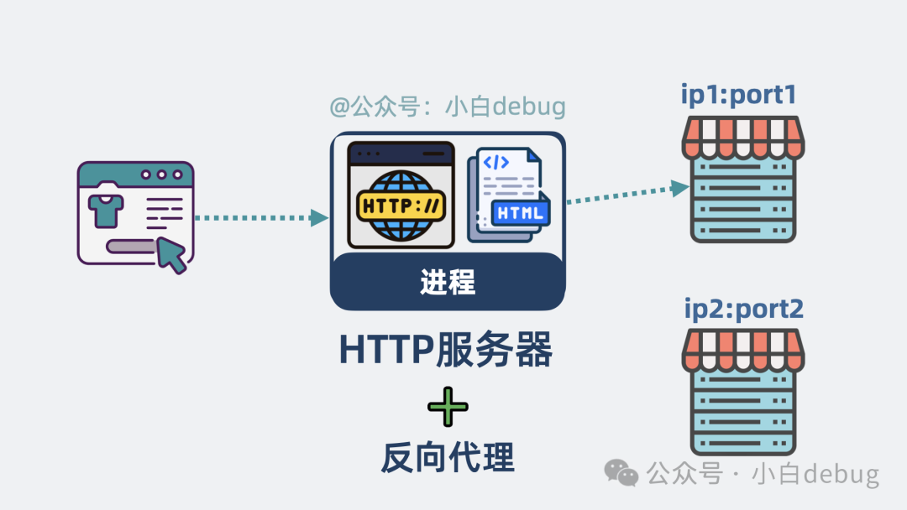

所以很多时候，Nginx 既是静态资源服务器，也是后端服务前的反向代理层。这也是它在实际架构里如此常见的原因。

顺便一提，反向代理经常和**正向代理**一起被提及。二者的区别在于：正向代理更像是“代理客户端”，帮助客户端访问外部资源；而反向代理更像是“代理服务器”，帮助后端服务统一接收并处理外部请求。Nginx 的经典定位，主要是后者。

### 负载均衡

当一个反向代理位于多个后端服务之前时，它自然就掌握了流量分发能力。也就是说，客户端发来的请求不一定都转发给同一台后端机器，而是可以按照某种策略，在多个后端节点之间分配。这件事本质上就是**负载均衡**。

负载均衡的意义在于，把不断增长的请求流量均摊到多个后端实例上，避免所有压力集中到单台服务器，从而提升整体吞吐能力与系统可用性。对于客户端来说，它只看到一个统一入口；但对于服务端来说，请求实际上已经被拆散并发往后方多个节点。

从概念上说，负载均衡并不是一个独立于反向代理之外的全新能力，而是反向代理在面对多个上游服务时自然具备的一种流量调度能力。因此，Nginx 之所以常常同时被称为“反向代理服务器”和“负载均衡器”，本质上就是因为它在服务端入口位置兼具了这两层角色。

### 模块化网关能力

既然所有流量都会经过这一层，那它天然就处在整个请求链路的“中间位置”。一旦一个组件处于中间位置，它就很适合承担各种**通用网关能力**，因为很多通用逻辑本来就应该在业务逻辑之外统一处理，而不是散落在每个后端服务里重复实现。


例如，访问日志可以统一记录，方便事后排查问题；压缩可以统一做，减少网络传输体积；限流和访问控制可以统一做，避免后端服务直接暴露在无保护的流量之下；缓存也可以统一做，把部分重复请求拦截在网关层；甚至某些请求头、响应头或协议行为，也可以在这一层集中处理。

也正因为这种“处于流量中间层”的天然优势，Nginx 很早就走上了模块化设计路线。它并不是只提供一个固定不变的 HTTP 转发程序，而是围绕核心处理流程挂接了大量模块，使得日志、压缩、访问控制、缓存、重写、代理、限流等能力都可以按需组合。对于 Nginx 来说，很多能力并不是“写死在一个不可调整的大程序里”，而是以模块化方式嵌入到请求处理链路中的。

这也是为什么 Nginx 不只是一个“Web 服务器”，而更像一个可扩展的高性能网关框架。

### 多协议支持

最初很多人认识 Nginx，是因为它擅长处理 HTTP 流量，但随着能力扩展，Nginx 的定位已经不局限于 HTTP。除了 HTTP/HTTPS 之外，它还可以处理基于 TCP、UDP 的流量，在不同模块支持下，也能承担 WebSocket、HTTP/2 等协议相关场景中的流量入口职责。

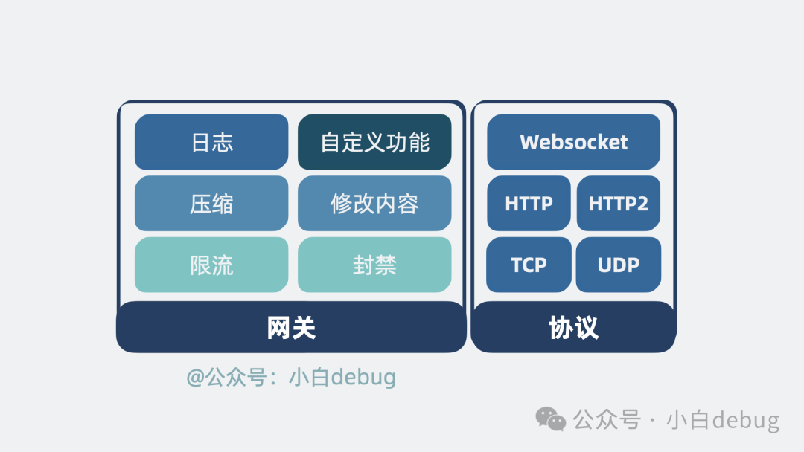

从本质上说，Nginx 并不是只为“网页访问”而生，而是为“高效处理网络连接和中转流量”而设计的。HTTP 只是它最经典、也最常见的应用场景之一。正因为它在底层连接处理和事件分发上做得足够优秀，所以才有能力逐步扩展到更多协议与更多中间层场景中。

### 配置能力

前面提到的这些能力，显然不可能要求用户每次都通过改源码来启用。更合理的方式，是让用户通过一份配置文件来声明：当前这个 Nginx 实例要监听哪些地址、承担哪些角色、转发到哪些后端、启用哪些模块能力。这也就是 **nginx.conf** 存在的意义。

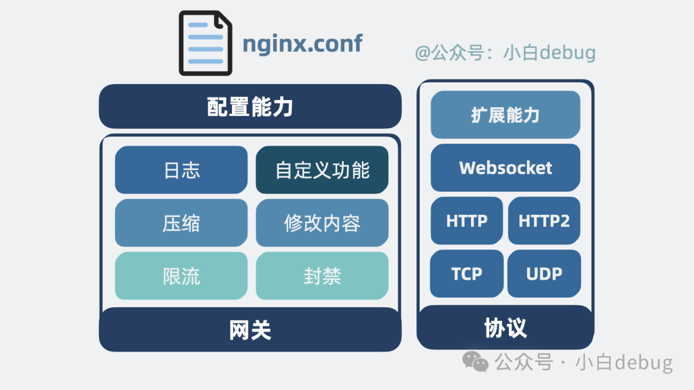

从架构角度看，Nginx 的配置文件本质上就是它的行为描述文件。用户通过配置告诉 Nginx：“你要监听哪些端口”“你要把哪些请求转发给谁”“你是否启用缓存”“是否启用限流”“是否记录日志”。Nginx 启动时读取并解析这份配置，然后根据配置建立起对应的监听 socket、请求处理逻辑和模块行为。

也正因为 Nginx 的大部分通用能力都是通过配置声明的，所以它才能既保持足够强的能力，又不需要用户为每个项目都重新开发一个新的网关程序。

### 事件驱动与单线程 worker

现在考虑一个问题：Nginx 作为流量入口，面对的是大量网络连接。网络连接的特点是，很多时候并不是一直在执行计算，而是在等待数据到达、等待对方发送、等待内核通知某个连接可读或可写。如果对每个连接都开一个线程，那么线程数量会迅速膨胀，线程切换、锁竞争和调度成本都会变得非常高。

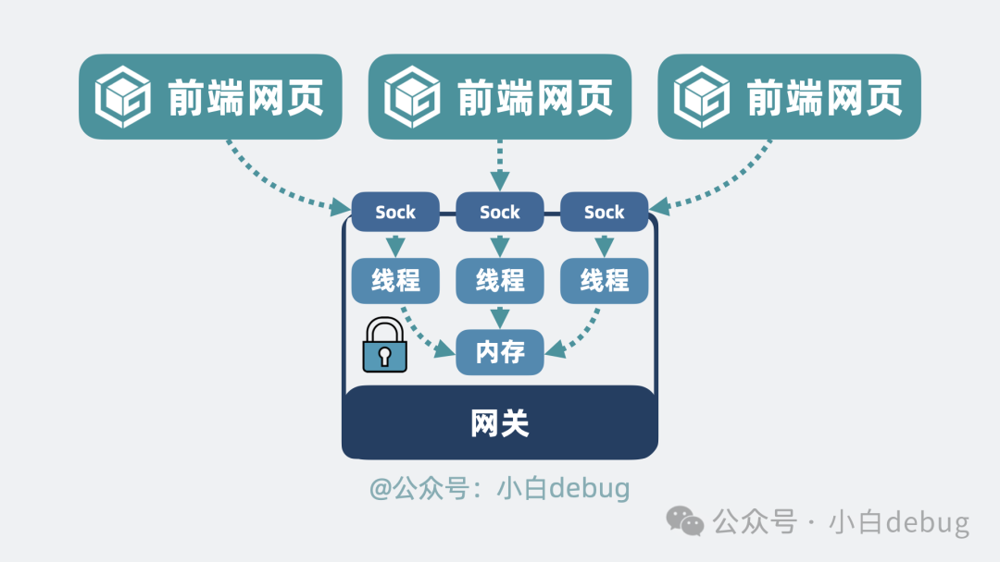

Nginx 的思路并不是“一个请求一个线程”，而是采用**事件驱动、异步非阻塞**的处理模型。在一个 worker 进程内部，通常由**一个主线程事件循环**统一管理大量连接：连接什么时候可读、什么时候可写、什么时候超时，都是通过事件机制感知的。某个连接当前不能继续处理时，worker 并不会傻等，而是先去处理别的连接；等内核通知该连接相关事件就绪后，再回来继续推进处理流程。

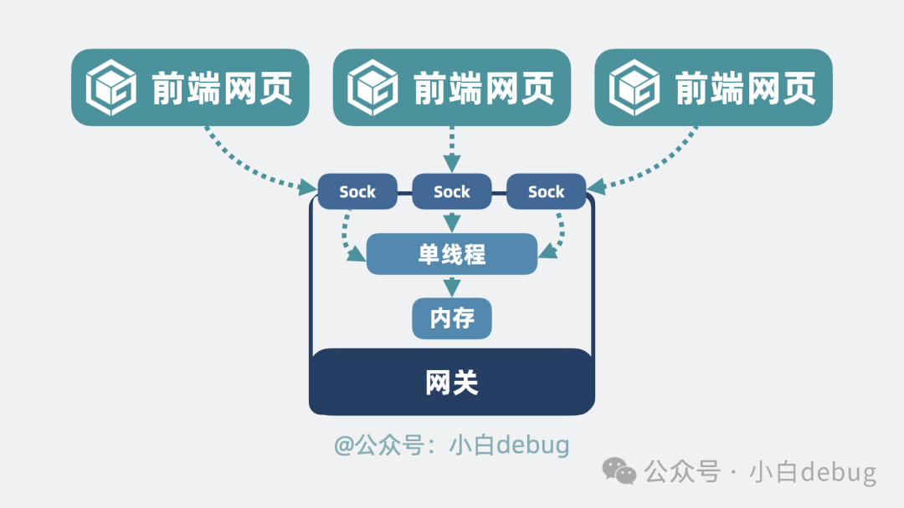

因此，Nginx 常被描述为“单线程高并发”，但更准确地说，它是 **单 worker 内以事件循环为核心、采用异步非阻塞方式处理大量连接**。它不是没有并发，而是并发并不依赖“为每个请求创建独立线程”来实现。也正是这种处理模型，使 Nginx 能够以较少的执行单元支撑大量并发连接，从而著名地解决了高并发网络服务中的 **C10K** 类问题。

### 多 worker 进程

但只靠一个 worker 进程，再优秀也终究会受到单核处理能力的限制。既然不希望回到“多线程模型”那种高开销方式，那么更自然的扩展方向就是：保留单个 worker 的事件驱动模型，同时通过**多个 worker 进程**并行利用多核 CPU。

于是，Nginx 将工作进程设计为多个 **worker**。每个 worker 都是相对独立的进程，内部各自运行事件循环并处理连接。这样做的好处很明显：一方面，多核 CPU 可以被更充分利用；另一方面，即使某个 worker 进程异常退出，也不会直接导致所有流量处理能力一起消失，其余 worker 仍可继续工作。

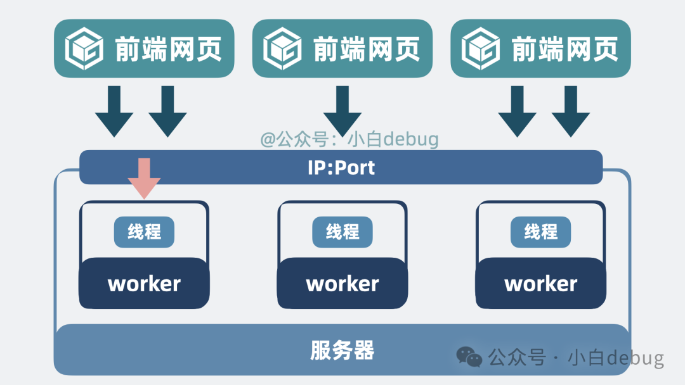

在实践中，worker 数量通常会与 CPU 核数接近，以便更高效地利用多核资源。这样理解会比较自然：单个 worker 负责在一个执行上下文中高效处理大量连接，而多个 worker 则共同构成整个 Nginx 的并发处理能力。

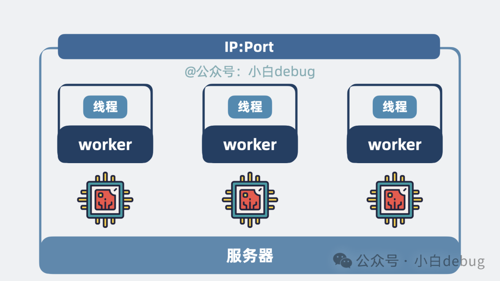

至于“为什么多个 worker 能同时监听同一个端口而不发生普通意义上的端口冲突”，核心原因在于：监听 socket 通常由 master 预先创建，再由多个 worker 继承使用，或者在特定机制下由内核协调接收连接；因此这并不是多个完全无关的独立进程各自重新绑定同一端口，而是多个受控 worker 共享同一监听能力。Nginx 还会结合 accept 相关机制来避免多个 worker 在接收连接时发生无谓竞争。

### 共享内存

多 worker 的设计虽然带来了多核并行能力，但也引入了另一个问题：不同 worker 是不同进程，它们的普通内存并不天然共享。如果某些逻辑需要所有 worker 共同看到一份状态数据，那么单独存放在某个 worker 内部就不合适了。

这类需求在限流、连接状态统计、共享计数等场景里尤其常见。比如限流本质上需要统一计数，如果同一个客户端的请求恰好被不同 worker 分别处理，而这些 worker 彼此完全不知道对方计数到多少，就会造成限流判断失真。

所以，Nginx 在某些模块中会引入**共享内存区域**。这块内存区域由多个 worker 共同访问，用来维护一些需要跨进程共享的状态数据。这样一来，不同 worker 虽然仍然是相互独立的进程，但在特定场景下又能够基于这块共享区域协作完成逻辑。

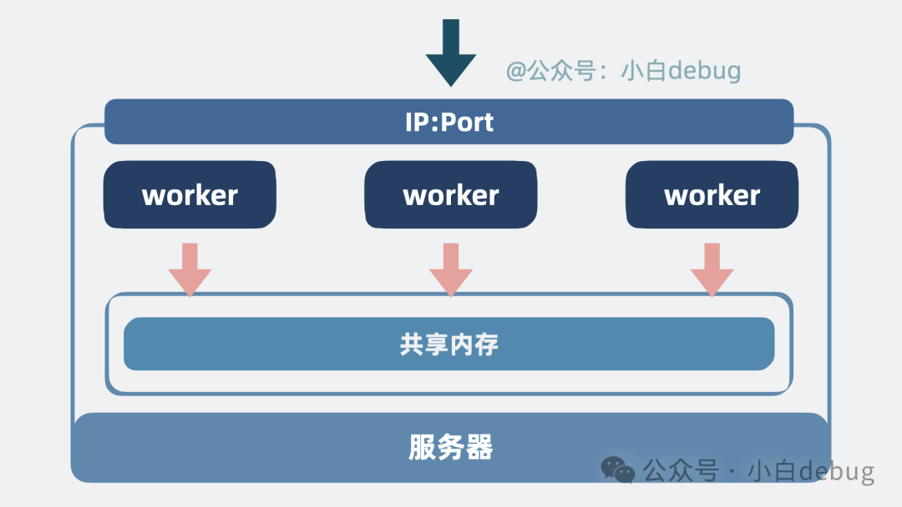共享内存

从架构角度看，这种设计非常关键。因为 Nginx 既想保留多进程模型带来的稳定性与并行能力，又必须在部分能力上实现跨 worker 的一致状态，那么共享内存就成了一个非常自然的折中方案。

### proxy cache

作为反向代理，Nginx 在收到客户端请求后，往往需要把请求继续转发给后端，再把后端返回的响应中转给客户端。这个过程中，如果某些请求具有很强的重复性，那么每次都把请求打到后端，其实并不划算。更高效的做法是：把一部分响应结果先缓存起来，下次遇到同样请求时，优先直接返回缓存结果，而不是再次访问后端。这种机制，就是 **proxy cache**。

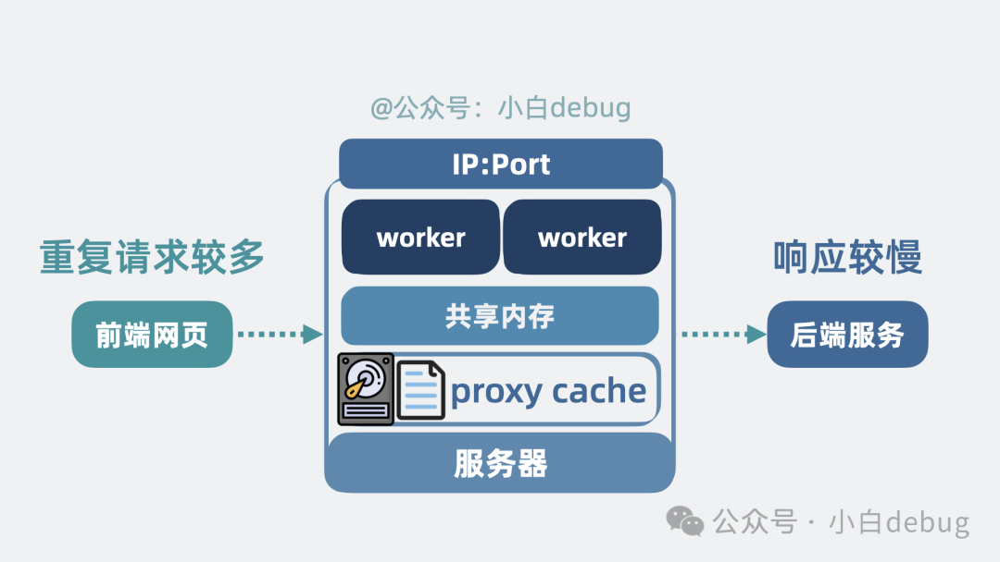

从概念上说，proxy cache 是代理层缓存。它缓存的不是“某个业务对象在内存中的原始结构”，而是代理层已经拿到的响应结果。当同类请求再次到来时，如果缓存仍然有效，就直接从缓存返回给客户端。这样做的收益主要体现在两个方面：一是减少后端服务压力，二是减少请求整体响应时间。

需要注意的是，Nginx 的 proxy cache 并不等同于“把所有缓存都放到共享内存里”。共享内存更适合存放索引、元数据或协调信息，而真正的响应内容常常会落在磁盘文件中，以获得更高的容量和更低的成本。也正因为如此，proxy cache 更像是一套“由内存索引 + 磁盘缓存文件”共同组成的代理缓存体系。

本质上，这仍然是一种经典的**空间换时间**思路：用额外的存储成本，换取更少的后端计算、更少的网络往返和更快的客户端响应。

### 加入 master 进程

如果系统中只有多个 worker，而没有统一协调者，那么配置重载、平滑升级、异常子进程回收、统一创建监听端口等管理工作就会变得非常混乱。因此，Nginx 在多 worker 模型之上，又引入了一个专门负责管理的 **master 进程**。

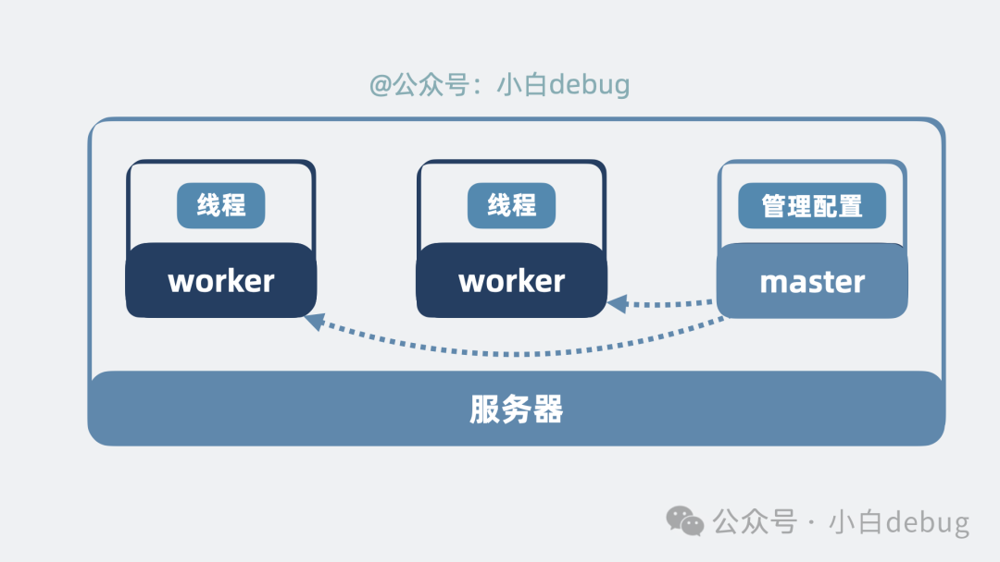

master 的职责并不是直接处理用户请求，而是负责读取配置、创建和管理 worker、处理信号、协调重载与升级等控制平面工作。真正处理网络请求的是 worker，而真正调度和管理这些 worker 的是 master。这样一来，Nginx 就形成了经典的 **master-worker 架构**。

这种架构的最大价值之一，是它使 Nginx 具备了较好的**平滑重载与滚动更新能力**。当配置发生变化或需要升级时，并不需要让所有 worker 同时暴力退出。更合理的做法是由 master 拉起新 worker，让新 worker 开始接收流量，再逐步让旧 worker 处理完手头连接后退出。这样整个过程中，总会有 worker 持续对外提供服务，从而显著降低因更新造成的连接中断风险。

因此，master 的存在，本质上是为了把“请求处理”和“进程管理”这两类职责分开：worker 负责高效处理流量，master 负责维持整个 Nginx 进程组的稳定运行。

### 小结

如果用一句话概括 Nginx，可以说：**Nginx 是一个基于事件驱动模型构建的高性能网络服务组件，它既可以充当 HTTP 服务器，也可以充当反向代理和负载均衡器，并通过模块化能力承担日志、限流、缓存、压缩等多种通用网关职责。**

理解 Nginx 时，最重要的不是先记住各种配置指令，而是先抓住它背后的核心逻辑：

它为什么能做 HTTP 服务器，是因为它能理解 HTTP 请求并返回资源；它为什么能做反向代理，是因为它位于客户端和后端之间并负责流量转发；它为什么能做负载均衡，是因为它掌握着请求该发给哪个后端节点；它为什么能扛高并发，是因为它采用了事件驱动、异步非阻塞和多 worker 进程模型；它为什么还能承担越来越多的网关能力，是因为它位于流量中间层，并且天然适合模块化扩展。

如果把后端服务看作系统真正执行业务逻辑的地方，那么 Nginx 更像是站在最前面的“高性能流量入口”和“通用网关层”。

## 使用

### 命令

nginx常用命令如下：

```sh
nginx -t            # 仅测试配置文件语法是否正确
nginx -T            # 输出完整配置（包含 include 进来的配置）
nginx -s reload     # 重新加载配置
nginx -s quit       # 平滑关闭Nginx
nginx -s stop       # 快速关闭Nginx
nginx -s reopen     # 重新打开日志文件
nginx -c filename   # 指定配置文件
nginx -p prefix     # 指定工作目录前缀
nginx -v            # 显示nginx版本
nginx -V            # 显示nginx版本、编译参数、模块信息
```

推荐使用顺序如下：

```sh
# 1. 修改配置
vim /etc/nginx/nginx.conf

# 2. 测试配置文件语法
sudo nginx -t

# 3. 重新加载配置
sudo nginx -s reload
```

可以编写一个简单脚本，方便快速检查并加载配置：

```sh
#!/usr/bin/env bash
set -e

CONFIG=/etc/nginx/nginx.conf

echo "Using config: $CONFIG"

# 测试配置文件语法正确性
sudo nginx -t -c "$CONFIG"

# 重新加载配置；如果还未启动，可改为 sudo nginx -c "$CONFIG"
sudo nginx -s reload
```

排错时最常看的两个日志：

- `access.log`：查看请求是否到达、状态码是多少。
- `error.log`：查看配置错误、权限问题、上游连接失败等信息。

### 功能

#### 配置文件结构与请求匹配

Nginx配置最常见的三个层级如下：

- `http {}`：HTTP相关总配置。
- `server {}`：一个站点，一个虚拟主机。
- `location {}`：某个请求路径的处理规则。

请求进入Nginx之后，通常按下面的顺序处理：先根据 `listen` 选择端口。再根据 `server_name` 选择对应的 `server`。再在该 `server` 中匹配 `location`。

需要注意：

- `server_name` 没有匹配上时，会进入该端口的默认 `server`。
- 前缀 `location` 会优先按“最长匹配”处理。
- 正则 `location` 会按书写顺序匹配，命中第一个即停止。
- `location` 只匹配URI路径部分，不匹配查询参数。

一个简单示例如下：

```nginx
http {
    server {
        listen 80;
        server_name example.com;

        location / {
            return 200 "default location\n";
        }

        location /images/ {
            return 200 "images location\n";
        }

        location ~ \.(gif|jpg|png)$ {
            return 200 "regex image location\n";
        }
    }
}
```

说明：

- `/images/a.txt` 会匹配 `location /images/`
- `/logo.png` 会匹配正则 `location ~ \.(gif|jpg|png)$`
- `/about` 会匹配 `location /`

#### Http 反向代理

这是Nginx最常见的使用方式：先接收客户端请求，再将请求转发给后端应用服务。

配置如下：

```nginx
http {
    upstream app_backend {
        server 127.0.0.1:8080;
    }

    server {
        listen 80;
        server_name example.com;

        location / {
            proxy_pass http://app_backend;
            proxy_set_header Host $host;
            proxy_set_header X-Real-IP $remote_addr;
            proxy_set_header X-Forwarded-For $proxy_add_x_forwarded_for;
            proxy_set_header X-Forwarded-Proto $scheme;

            proxy_connect_timeout 5s;
            proxy_send_timeout 30s;
            proxy_read_timeout 30s;
        }
    }
}
```

常用请求头说明：

- `Host`：把原始域名传给后端。
- `X-Real-IP`：把客户端真实IP传给后端。
- `X-Forwarded-For`：记录完整代理链路上的客户端IP。
- `X-Forwarded-Proto`：告诉后端原始请求协议是 `http` 还是 `https`。

`proxy_pass` 还有一个常见点：末尾带不带 `/`，转发结果不同。

```nginx
location /api/ {
    proxy_pass http://app_backend/;
}
```

这种写法会把 `/api/` 前缀去掉再转发，例如：

- `/api/users` 会转发为 `/users`

```nginx
location /api/ {
    proxy_pass http://app_backend;
}
```

这种写法会保留原始URI，例如：

- `/api/users` 仍然会转发为 `/api/users`

因此配置时要先确认：后端服务希望接收的是原始路径，还是去掉前缀后的路径。

#### Https 反向代理

一些安全性要求较高的站点会使用HTTPS协议，Nginx配置HTTPS和HTTP的主要区别如下：

- HTTPS默认端口为 `443`，HTTP默认端口为 `80`
- 需要配置证书和私钥文件

配置如下：

```nginx
http {
    upstream app_backend {
        server 127.0.0.1:8080;
    }

    # 80端口统一跳转到HTTPS
    server {
        listen 80;
        server_name example.com;
        return 301 https://$host$request_uri;
    }

    server {
        listen 443 ssl http2;
        server_name example.com;

        # 证书文件
        ssl_certificate     /etc/nginx/certs/example.com.pem;
        ssl_certificate_key /etc/nginx/certs/example.com.key;

        location / {
            proxy_pass http://app_backend;
            proxy_set_header Host $host;
            proxy_set_header X-Real-IP $remote_addr;
            proxy_set_header X-Forwarded-For $proxy_add_x_forwarded_for;
            proxy_set_header X-Forwarded-Proto $scheme;
        }
    }
}
```

说明：

- 如果HTTPS由Nginx处理，后端应用一般只需要提供HTTP服务即可。
- 后端如果需要知道外部请求是否为HTTPS，通常依赖 `X-Forwarded-Proto`。
- 证书文件通常由证书服务商或自动签发工具生成，Nginx负责加载使用。

#### 负载均衡

大多数情况下，生产环境服务会以集群方式运行，此时需要负载均衡来分流请求。Nginx可以实现常见的负载均衡功能。

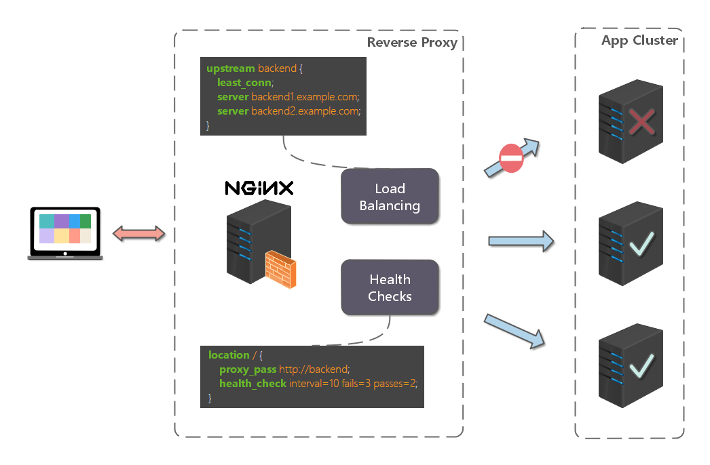

配置如下：

```nginx
http {
    include       /etc/nginx/mime.types;
    default_type  application/octet-stream;

    upstream app_backend {
        server 192.168.1.11:8080 weight=5;
        server 192.168.1.12:8080 weight=1;
        server 192.168.1.13:8080 weight=3;
    }

    server {
        listen 80;
        server_name www.example.com;

        location / {
            proxy_pass http://app_backend;
            proxy_set_header Host $host;
            proxy_set_header X-Real-IP $remote_addr;
            proxy_set_header X-Forwarded-For $proxy_add_x_forwarded_for;
        }
    }
}
```

其中：

- `upstream` 用来定义后端服务器列表。
- `proxy_pass` 用来把请求转发到该服务器组。
- `weight` 表示权重，权重越大，被分配到请求的概率越高。

常见负载均衡策略如下：

- 轮询（默认）：

```nginx
upstream app_backend {
    server 192.168.1.11:8080;
    server 192.168.1.12:8080;
    server 192.168.1.13:8080;
}
```

- 加权轮询：

```nginx
upstream app_backend {
    server 192.168.1.11:8080 weight=5;
    server 192.168.1.12:8080 weight=1;
    server 192.168.1.13:8080 weight=3;
}
```

- 最少连接：

```nginx
upstream app_backend {
    least_conn;
    server 192.168.1.11:8080;
    server 192.168.1.12:8080;
    server 192.168.1.13:8080;
}
```

- IP Hash：

```nginx
upstream app_backend {
    ip_hash;
    server 192.168.1.11:8080;
    server 192.168.1.12:8080;
    server 192.168.1.13:8080;
}
```

- 普通 Hash：

```nginx
upstream app_backend {
    hash $request_uri consistent;
    server 192.168.1.11:8080;
    server 192.168.1.12:8080;
    server 192.168.1.13:8080;
}
```

#### 多个Web应用配置

同一个域名下，经常需要把不同路径转发给不同服务。例如：

- `/product/` -> 产品服务
- `/admin/` -> 管理后台
- `/finance/` -> 财务服务

配置如下：

```nginx
http {
    upstream product_server {
        server 127.0.0.1:8081;
    }

    upstream admin_server {
        server 127.0.0.1:8082;
    }

    upstream finance_server {
        server 127.0.0.1:8083;
    }

    server {
        listen 80;
        server_name example.com;

        location /product/ {
            proxy_pass http://product_server/;
        }

        location /admin/ {
            proxy_pass http://admin_server/;
        }

        location /finance/ {
            proxy_pass http://finance_server/;
        }
    }
}
```

说明：

- 上述 `proxy_pass` 末尾都带 `/`，表示把 `/product/`、`/admin/`、`/finance/` 这些前缀去掉之后再转发。
- 例如 `/product/list` 会转发到后端的 `/list`。
- 如果后端本身就带有 `/product`、`/admin`、`/finance` 上下文路径，则不要在 `proxy_pass` 后加 `/`。

#### 静态站点

有时需要使用Nginx直接提供静态站点（HTML、CSS、JS、图片等资源）。

配置如下：

```nginx
server {
    listen 80;
    server_name static.example.com;

    root /srv/www/site;
    index index.html;

    location / {
        try_files $uri $uri/ /index.html;
    }

    location /assets/ {
        expires 7d;
        access_log off;
    }
}
```

说明：

- `root` 用来设置站点根目录。
- `index` 用来设置默认首页。
- `try_files $uri $uri/ /index.html;` 常用于单页应用（Vue / React）：
  - 先找真实文件
  - 再找目录
  - 都不存在时返回 `index.html`
- `expires 7d;` 表示给静态资源加7天缓存。

还需要注意 `root` 和 `alias` 的区别：

```nginx
location /images/ {
    root /data;
}
```

请求 `/images/a.png`，实际查找的文件为：

```text
/data/images/a.png
```

```nginx
location /images/ {
    alias /data/pictures/;
}
```

请求 `/images/a.png`，实际查找的文件为：

```text
/data/pictures/a.png
```

#### 搭建文件服务器

有时团队需要归档一些数据或资料，可以使用Nginx快速搭建一个简易文件服务器。

配置要点如下：

- `autoindex on;`：显示目录
- `autoindex_exact_size on;`：显示精确文件大小
- `autoindex_localtime on;`：显示文件修改时间
- `root` 或 `alias`：设置开放出来的目录

配置如下：

```nginx
server {
    listen 9050;
    server_name _;

    charset utf-8;
    root /share/fs;

    location / {
        autoindex on;
        autoindex_exact_size on;
        autoindex_localtime on;
    }
}
```

如果只想暴露一个子目录，也可以这样写：

```nginx
location /download/ {
    alias /share/fs/;
    autoindex on;
    autoindex_exact_size on;
    autoindex_localtime on;
}
```

这种方式更清晰，也更安全。

#### 跨域问题

在前后端分离开发中，不同域名、端口或协议之间访问接口时，浏览器会进行跨域检查。Nginx可以在代理层统一补充跨域响应头。

先在 `http {}` 中定义允许跨域的来源：

```nginx
map $http_origin $cors_origin {
    default "";
    "~^https?://(localhost:9000|www\\.example\\.com)$" $http_origin;
}
```

然后在接口位置启用CORS：

```nginx
server {
    listen 80;
    server_name api.example.com;

    location /api/ {
        if ($request_method = OPTIONS) {
            add_header Access-Control-Allow-Origin $cors_origin always;
            add_header Access-Control-Allow-Credentials true always;
            add_header Access-Control-Allow-Methods "GET, POST, PUT, DELETE, OPTIONS" always;
            add_header Access-Control-Allow-Headers "Content-Type, Authorization, X-Requested-With" always;
            add_header Access-Control-Max-Age 86400 always;
            return 204;
        }

        add_header Access-Control-Allow-Origin $cors_origin always;
        add_header Access-Control-Allow-Credentials true always;

        proxy_pass http://app_backend;
        proxy_set_header Host $host;
        proxy_set_header X-Real-IP $remote_addr;
        proxy_set_header X-Forwarded-For $proxy_add_x_forwarded_for;
    }
}
```

说明：

- `map` 用来限制允许跨域的来源，通常不要直接对所有来源开放。
- `OPTIONS` 是预检请求，通常直接返回 `204`。
- `add_header ... always;` 表示即使不是2xx响应，也尽量带上跨域响应头。

### 完整示例

下面给出一个常用模板，将前面几个常见功能串在一起，包含：

- 基础日志与性能设置
- 80端口跳转到443
- HTTPS主站
- 静态站点
- `/api/` 反向代理
- `/admin/` 路径转发
- `upstream` 负载均衡
- `/files/` 文件目录

配置如下：

```nginx
# =========================
# main
# =========================
user nginx;
worker_processes auto;

error_log /var/log/nginx/error.log warn;
pid /run/nginx.pid;

events {
    worker_connections 1024;
}

http {
    # 基础配置
    include       /etc/nginx/mime.types;
    default_type  application/octet-stream;

    log_format main '$remote_addr - $remote_user [$time_local] "$request" '
                    '$status $body_bytes_sent "$http_referer" '
                    '"$http_user_agent" "$http_x_forwarded_for"';

    access_log /var/log/nginx/access.log main;

    sendfile on;
    keepalive_timeout 65;
    client_max_body_size 20m;

    # 允许跨域的来源，不需要可删除
    map $http_origin $cors_origin {
        default "";
        "~^https?://(www\\.example\\.com|admin\\.example\\.com)$" $http_origin;
    }

    # 后端应用组
    upstream api_backend {
        server 127.0.0.1:8080;
        server 127.0.0.1:8081;
    }

    upstream admin_backend {
        server 127.0.0.1:8090;
    }

    # 80跳转到443
    server {
        listen 80;
        server_name www.example.com;
        return 301 https://$host$request_uri;
    }

    # HTTPS主站
    server {
        listen 443 ssl http2;
        server_name www.example.com;

        ssl_certificate     /etc/nginx/certs/example.com.pem;
        ssl_certificate_key /etc/nginx/certs/example.com.key;

        # 前端站点目录
        root /srv/www/site;
        index index.html;

        # 1. 静态站点 / 单页应用
        location / {
            try_files $uri $uri/ /index.html;
        }

        # 2. 静态资源缓存
        location /assets/ {
            expires 7d;
            access_log off;
        }

        # 3. API反向代理 + 负载均衡
        location /api/ {
            # 处理OPTIONS预检请求，不需要跨域时可删除
            if ($request_method = OPTIONS) {
                add_header Access-Control-Allow-Origin $cors_origin always;
                add_header Access-Control-Allow-Credentials true always;
                add_header Access-Control-Allow-Methods "GET, POST, PUT, DELETE, OPTIONS" always;
                add_header Access-Control-Allow-Headers "Content-Type, Authorization, X-Requested-With" always;
                add_header Access-Control-Max-Age 86400 always;
                return 204;
            }

            add_header Access-Control-Allow-Origin $cors_origin always;
            add_header Access-Control-Allow-Credentials true always;

            # 末尾带 / ，表示去掉 /api/ 前缀后再转发
            proxy_pass http://api_backend/;

            proxy_set_header Host $host;
            proxy_set_header X-Real-IP $remote_addr;
            proxy_set_header X-Forwarded-For $proxy_add_x_forwarded_for;
            proxy_set_header X-Forwarded-Proto $scheme;

            proxy_connect_timeout 5s;
            proxy_send_timeout 30s;
            proxy_read_timeout 30s;
        }

        # 4. 管理后台按路径转发
        location /admin/ {
            proxy_pass http://admin_backend/;

            proxy_set_header Host $host;
            proxy_set_header X-Real-IP $remote_addr;
            proxy_set_header X-Forwarded-For $proxy_add_x_forwarded_for;
            proxy_set_header X-Forwarded-Proto $scheme;
        }

        # 5. 文件下载目录
        location /files/ {
            alias /srv/share/files/;
            autoindex on;
            autoindex_exact_size on;
            autoindex_localtime on;
        }

        # 6. 自定义错误页（可选）
        error_page 404 /404.html;
        location = /404.html {
            internal;
        }
    }
}
```

这份模板可以直接作为练习用的综合配置。使用前需要按实际情况修改域名、证书路径、站点目录、后端端口等参数。如果某些功能暂时不用，可以把对应 `location` 或 `map` 删除。

