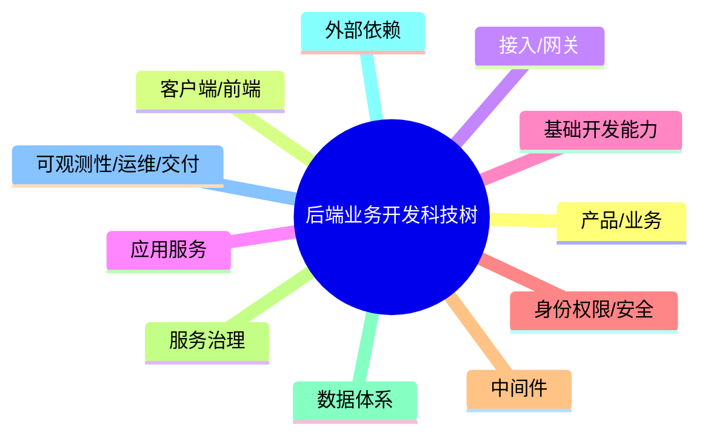
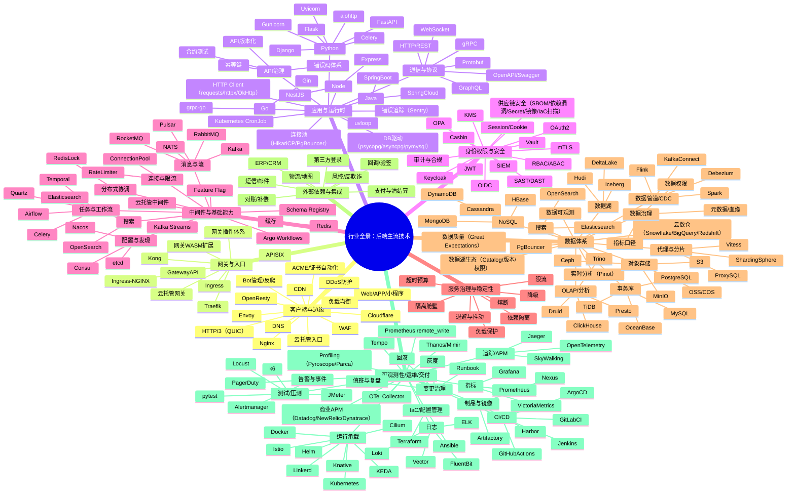

# 后端业务开发科技树

这份笔记的定位是“行业调研级别的科技树”。你可以把它当作一份后端行业地图：先用结构图和气泡图建立位置感，再用覆盖尽可能全面的技术清单把“主流/增长/存量大”的技术点全部摆出来，并用统一的相对学习成本（以 JSON=1 为单位）+ 多维评分帮助你做取舍。第二章给出“科技树怎么点”的最优路线，但它不会脱离第一章的结构与评分，而是把路线写成可执行的迭代策略与选择理由。

# 行业全景调研

## 架构主图

```text
                        ┌───────────────┐
                        │    产品 / 业务  │
                        └───────┬───────┘
                                ↓
        ┌───────────────┐   ┌──────────────────┐   ┌───────────────────┐
        │   客户端 / 前端  │ → │   接入层 / 网关入口 │ → │  后端应用服务(业务) │
        │ Web / App / 小程序│   │ LB / Ingress / GW │   │ API / RPC / Job    │
        └───────┬───────┘   └─────────┬────────┘   └─────────┬─────────┘
                │                     │                      │
                │                     ↓                      ↓
                │           ┌──────────────────┐    ┌────────────────────┐
                │           │   安全 / 身份权限   │    │  中间件 / 基础能力   │
                │           │ AuthN / AuthZ     │    │ Cache / MQ / Config │
                │           └──────────────────┘    └─────────┬──────────┘
                │                                             ↓
                │                                  ┌────────────────────┐
                │                                  │  服务治理 / 依赖治理  │
                │                                  │ 超时/限流/熔断/隔离等 │
                │                                  └─────────┬──────────┘
                │                                             │
                │           ┌──────────────────────────────────┘
                │           │
                ↓           ↓
        ┌──────────────────┐     ┌──────────────────────────────┐
        │   数据体系 / 存储   │     │     外部依赖 / 第三方系统       │
        │ DB / OSS / Search  │     │ 支付/短信/风控/地图/登录/ERP等  │
        └───────┬──────────┘     └──────────────────────────────┘
                ↓
        ┌──────────────────────────────┐
        │  数据分析 / 检索 / 报表（可选） │
        │ OLAP / Search / DWH / 实时分析  │
        └──────────────────────────────┘

            （上述所有层都被横切能力统一支撑）
                                ↓
        ┌──────────────────────────────────────────────────────┐
        │ 运维 / 可观测性 / 交付                                   │
        │ Logging / Metrics / Tracing / Alerting                 │
        │ CI/CD / 制品与镜像 / 发布回滚 / 容量压测 / 变更管理 / Runbook │
        └──────────────────────────────────────────────────────┘
```

这张图是“面向业务开发”的最小世界观：请求如何进来、在哪里统一治理、业务逻辑在哪里发生、数据在哪里成为权威、性能/稳定靠什么支撑、外部依赖为何是复杂度之源、以及上线后靠什么活下去。你只要能把一个技术点放回图里，并用自然语言讲清它在解决哪一种现实矛盾，你就已经站在“工程视角”而不是“背名词”的层次上。

---

## 气泡图



---

## 行业全景图

说明：你希望“主流、增长趋势、存量大”的技术都列出来，式微的可以不写。下面尽量覆盖后端常见分支，并偏向当下主流（尤其云原生、可观测、数据管道、工程化工具链）。如果某家公司技术栈非常偏（例如强数据湖或强网格），可以再按目标栈补充更深分支。



---

## 模块调研说明

接入与网关的价值在于把“流量治理”从业务代码里抽出来，让系统拥有统一入口和全局控制点。现实世界里，流量会突发、攻击会出现、发布会需要灰度、故障需要快速止血；这些都不能靠每个业务服务各写一套规则来完成。入口越统一，治理越集中，止血越快，事故半径越小。学习这块时，不必先背某个网关产品配置，但必须能讲清路由、鉴权接入、限流、灰度、统一日志与 trace 注入这些“入口治理”到底在解决什么问题，以及哪些属于网关、哪些属于业务服务。

应用服务是业务价值落地的主体，框架只是载体。真实交付的难点是边界：事务边界如何确定、幂等边界如何设置、错误语义如何表达、哪些副作用应该异步化、外部依赖如何超时与补偿。行业里 Python 的常见组合是“Web 框架 + WSGI/ASGI 运行时 + 任务队列 + ORM”，而中大型团队会进一步引入契约（OpenAPI/Protobuf）和 RPC（gRPC）来提升协作效率。你在学习时应优先建立“位置感”：框架负责请求生命周期，运行时负责并发与部署形态，ORM 负责连接与事务习惯，任务队列负责把副作用从同步链路挪走。

身份权限与安全是底线工程，也是业务规则的一部分。JWT 与 Session/Cookie 是两套主流登录态，各有取舍；OAuth2/OIDC 是第三方登录与授权的事实标准；RBAC/ABAC 是授权模型的基本语言；Casbin/OPA 帮助把策略工程化；Vault/KMS 帮助把密钥与凭证纳入生命周期管理；SAST/DAST、审计与合规则决定系统在安全与监管要求下能否上线。你不需要一开始把所有产品学深，但必须能把“认证、授权、策略、凭证、审计”这条安全链路讲清楚，并知道它们分别接在网关还是业务服务里。

中间件是性能与扩展底座。Redis 解决热点与高频读写的性能瓶颈，也引入一致性与失效策略问题；Kafka/RabbitMQ/RocketMQ 等消息系统解决解耦与削峰，也引入重复消费与积压治理问题；Nacos/Consul/etcd 等配置发现解决动态配置与服务发现，也引入配置漂移与治理问题；Temporal/Airflow 之类工作流系统解决长流程与编排，也会引入更复杂的运行与运维成本。行业实践的关键不是把每个组件学到极深，而是知道它们在系统演进中的“出现顺序”与“收益/风险边界”。

服务治理是让失败可预期、可控制、不会扩散的工程体系。线上事故常见的本质原因是级联故障：一个依赖慢或挂，导致线程池/连接池耗尽，导致更多请求堆积，最终整个系统雪崩。成熟治理的顺序几乎总是“先超时预算，再决定重试；用限流保护自己与下游；必要时熔断降级并隔离故障域”。治理能力可以落在网关、应用、SDK 或服务网格里，但学习时抓住“目的与放置位置”，再用一个最小项目把它落地，效果远胜于背概念。

数据体系由事务库、对象存储、搜索与分析共同构成。事务库（MySQL/PostgreSQL）保存权威状态并强调一致性；对象存储承载文件与大对象；搜索引擎支撑检索体验；OLAP 与数仓支撑报表与分析；CDC/数据管道把交易变化传播到检索与分析系统。行业里“事务库 + Redis + MQ + 搜索/分析”的组合非常普遍，因为它符合系统自然演进：先跑通交易，再解决热点，再解耦链路，再把复杂查询迁移走。数据湖（Iceberg/Hudi/Delta）是数据平台与湖仓一体方向的主流增长点，但对纯业务后端来说往往属于增强项。

外部依赖与集成是业务复杂度之源。支付/清结算、短信/邮件、物流/地图、风控/反欺诈、第三方登录、ERP/CRM 等都具有共同属性：你无法控制对方 SLA，但你必须交付最终正确。因此回调幂等、验签、补偿、对账会在这里高密度出现。很多分布式一致性的落地实践，本质就是把外部依赖处理成“可追溯、可重放、可对账”的工程体系。

可观测性、交付与运行承载是系统长期活下去的基础。日志让你能定位问题，指标让你能衡量健康与趋势，追踪让你能在分布式系统里定位慢与错；CI/CD 让你能稳定发布和回滚；制品与镜像仓库让交付链路可控；IaC 让环境与资源可复现；Kubernetes 让运行标准化；服务网格与 CNI（例如 Istio、Cilium）让治理与网络能力更体系化。这些工具链之所以重要，是因为没有它们，你的系统规模一大就会被事故与交付成本拖垮。

---

## 基础开发能力


### 项目落地最小清单

下面这份清单不是“概念”，是你把一个服务从 0 写到可交付时最常见的落地件。你照着做完，项目就不会只停留在“本地能跑”。

| 交付件 | 推荐做法（具体技术） | 你要落到什么程度 |
|---|---|---|
| 目录与分层 | Handler/Controller + Service + Repository/DAO；DTO/VO；配置与启动放在独立模块 | 任何人打开仓库 5 分钟能找到入口与核心逻辑 |
| 接口契约 | OpenAPI 文档自动生成；统一错误码；幂等键（写入类接口） | 文档能跑、能对齐；错误语义一致 |
| 环境与依赖 | Docker Compose（MySQL/Redis/MQ）；一条命令启动（Makefile/Taskfile） | 新人拉代码 30 分钟能跑通核心链路 |
| 配置与密钥 | .env + 环境分层；密钥不入库（dotenv/系统密钥/KMS） | dev/stg/prod 行为一致；密钥可轮换 |
| 日志规范 | 结构化日志（json）；trace_id/correlation_id；关键业务字段 | 任意一次请求能在日志里串起来 |
| 测试 | pytest/JUnit/testing/Jest + 最少一组集成测试（连 DB/Redis） | 改核心逻辑能靠测试兜底 |
| 迁移 | Alembic/Flyway/Liquibase；迁移脚本可回滚 | schema 变更可控，不靠手工改库 |
| 发布 | 产出镜像；版本号；灰度/回滚脚本或流程说明 | 出问题能止血，不靠“再发一版试试” |


这一节专门写“最基础的代码项目能力”。它不是某个中间件，也不是某个平台组件，而是你写业务服务每天都在用的那套底座能力：项目怎么起、代码怎么组织、怎么做输入输出与错误语义、怎么写测试、怎么做本地开发与发布、怎么排查问题。很多候选人看起来会很多名词，但项目问深入就露馅，往往就是这些基础能力没形成体系。

这块我按“跨语言通用能力 → 各语言常用技术栈”的方式写，覆盖 Python / Java / Go / Node.js，并尽量只写具体技术与落地形态。

### 跨语言通用能力

| 能力点 | 具体技术与常用做法 | 你在项目里要做到的样子 | 学习性价比 | 成本（×JSON） |
|---|---|---|---:|---:|
| 项目结构与分层 | Controller/Handler → Service → Repository/DAO；DTO/VO；依赖方向单向；模块化 | 代码能看得懂、能扩展；业务逻辑不散在路由里 | 9 | 4 |
| 接口契约与错误语义 | OpenAPI/Swagger；统一错误码；幂等键；分页/排序/过滤 | 失败可解释、可重试边界清晰 | 10 | 5 |
| 输入校验与序列化 | JSON schema / Pydantic / Hibernate Validator / zod；时间/金额精度规范 | 脏数据进不来；输出可兼容演进 | 9 | 4 |
| 配置管理 | .env + 配置分层；Nacos/Consul；Feature Flag（如有） | 不同环境可复现；开关可灰度 | 8 | 5 |
| 日志与追踪基础 | 结构化日志；trace_id/correlation_id；log level；Sentry（可选） | 一次请求能串起来，排障有抓手 | 9 | 5 |
| 测试体系 | 单测（核心业务）+ 集成测试（DB/Redis）+ 合约测试（可选） | 有基本回归网；改代码不怕 | 9 | 6 |
| 本地开发与依赖启动 | Docker Compose；Makefile/Taskfile；seed 数据脚本 | 新人拉代码 30 分钟能跑 | 8 | 5 |
| 发布与回滚最小闭环 | CI 构建；制品/镜像；灰度发布；回滚脚本 | 出问题能止血，能复盘 | 8 | 7 |

### Python 后端常用技术栈

| 领域 | 技术点（主流） | 说明 | 频率 | 成本（×JSON） |
|---|---|---|---:|---:|
| Web 框架 | FastAPI / Django / Flask | FastAPI 现代、Django 全家桶、Flask 轻量 | 10 | 5~7 |
| 运行时 | Gunicorn（WSGI）/ Uvicorn（ASGI） | 部署形态与并发模型的入口 | 9 | 3 |
| 校验与模型 | Pydantic | 请求/响应模型与校验的事实标准 | 10 | 4 |
| ORM/数据访问 | SQLAlchemy + Alembic | 连接池、事务边界、迁移流程 | 9 | 6 |
| 异步任务 | Celery / RQ（小型） | 把副作用从同步链路挪出去 | 8 | 6 |
| 测试 | pytest | fixture/参数化非常适合业务测试 | 9 | 4 |
| 代码质量 | Ruff/Flake8、Black、mypy（可选） | 工程化团队常见 | 7 | 2~6 |
| 依赖与运行 | venv + pip / Poetry / uv | 依赖锁定与可复现构建；生产环境尽量固定版本 | 8 | 5 |

### Java 后端常用技术栈

| 领域 | 技术点（主流） | 说明 | 频率 | 成本（×JSON） |
|---|---|---|---:|---:|
| Web 框架 | Spring Boot | 国内存量与面试覆盖最高 | 10 | 8 |
| 数据访问 | MyBatis / JPA(Hibernate) | MyBatis 常见；JPA 公司差异较大 | 9 | 6~9 |
| 校验 | Hibernate Validator | 常配合 Spring 做参数校验 | 8 | 4 |
| HTTP Client | OkHttp / RestTemplate / WebClient | 现代趋势更偏 WebClient，但差异大 | 7 | 4~7 |
| 连接池 | HikariCP | 生产默认常见 | 8 | 6 |
| 构建 | Maven / Gradle | 依赖与构建体系基础 | 9 | 6 |
| 测试 | JUnit5 + Mockito | 单测与 Mock 主力 | 8 | 6 |
| 观测埋点 | Micrometer | 指标埋点主流；后续接 Prometheus/Grafana 很顺 | 6 | 5 |

### Go 后端常用技术栈

| 领域 | 技术点（主流） | 说明 | 频率 | 成本（×JSON） |
|---|---|---|---:|---:|
| Web 框架 | Gin / Echo | Gin 国内很常见 | 9 | 5 |
| 数据访问 | database/sql + sqlx / gorm（可选） | sqlx 更贴近 SQL；gorm 公司差异大 | 8 | 5~7 |
| RPC | gRPC | 中大型团队常见 | 7 | 7 |
| 配置 | viper（常见） | 只是代表，关键是分层与热更新策略 | 6 | 4 |
| 测试 | testing + testify | Go 原生测试 + 断言库 | 7 | 5 |
| 依赖管理 | Go Modules | go.mod/go.sum；可复现构建的基础 | 9 | 4 |

### Node.js 后端常用技术栈

| 领域 | 技术点（主流） | 说明 | 频率 | 成本（×JSON） |
|---|---|---|---:|---:|
| Web 框架 | NestJS / Express | NestJS 工程化更强 | 8 | 6~8 |
| ORM | Prisma | 现代流行，但差异大 | 7 | 6 |
| 校验 | zod / class-validator | 入参校验常见组合 | 7 | 4 |
| 测试 | Jest | Node 生态主力 | 7 | 5 |
| 依赖管理 | pnpm / yarn / npm | 锁文件与 monorepo 常见；工程化必备 | 8 | 5 |

### C# 后端常用技术栈

| 领域 | 技术点（主流） | 说明 | 频率 | 成本（×JSON） |
|---|---|---|---:|---:|
| Web 框架 | ASP.NET Core | 微服务/企业应用主力，生态成熟 | 7 | 8 |
| ORM | Entity Framework Core / Dapper | EF 偏 ORM；Dapper 偏轻量 SQL | 7 | 6~8 |
| 配置与依赖注入 | 内置 DI + Options | 工程化默认能力 | 7 | 5 |
| 测试 | xUnit / NUnit | 常见单测框架 | 6 | 6 |
| 构建与包管理 | dotnet CLI + NuGet | 依赖与构建统一入口 | 7 | 5 |

### Rust 后端常用技术栈

| 领域 | 技术点（主流） | 说明 | 频率 | 成本（×JSON） |
|---|---|---|---:|---:|
| Web 框架 | Axum / Actix-web | 性能与安全性强，但团队差异大 | 4 | 10~14 |
| 异步运行时 | Tokio | Rust 服务端基本盘 | 4 | 10 |
| ORM/查询 | SQLx / Diesel | SQLx 更贴近 SQL；Diesel 更 ORM | 4 | 10~12 |
| gRPC | tonic | Rust gRPC 常用实现 | 3 | 10 |
| 构建与包管理 | Cargo | 依赖、构建、测试一体化 | 5 | 8 |

### PHP 后端常用技术栈

| 领域 | 技术点（主流） | 说明 | 频率 | 成本（×JSON） |
|---|---|---|---:|---:|
| Web 框架 | Laravel / Symfony | Laravel 国内外存量大 | 6 | 7~9 |
| ORM | Eloquent / Doctrine | 框架自带与生态方案 | 6 | 6~8 |
| 工程化 | Composer | 依赖管理基础 | 7 | 4 |
| 测试 | PHPUnit | PHP 主流测试框架 | 5 | 5 |
| 运行环境 | PHP-FPM + Nginx | 典型部署形态；理解进程模型与配置 | 6 | 6 |

### C++ 后端常用技术栈

| 领域 | 技术点（主流） | 说明 | 频率 | 成本（×JSON） |
|---|---|---|---:|---:|
| Web/RPC | gRPC C++ / brpc（国内存量） | 多用于高性能服务与基础设施 | 4 | 14~18 |
| 构建 | CMake | 工程化基础 | 4 | 10 |
| 性能分析 | perf / pprof | 性能定位常用工具链 | 4 | 10 |
| 并发 | 线程池/无锁/IO 多路复用 | 复杂度高，团队差异大 | 4 | 16 |
| 包管理 | Conan / vcpkg | 依赖管理与可复现构建，团队差异大 | 3 | 12 |

## 技术信息卡

说明：你要求尽量把“主流、增长、存量大”的技术全部列出来，并且把描述写厚。下面按模块分组，尽量覆盖行业常见技术点。为了避免阅读崩溃，表格里每个技术点用一段更强的“核心功能/边界”描述 + 当前状况 + 评分与相对成本。若你还想更厚，可以在每个分组后再追加“典型应用场景与坑点专题”，那会把篇幅进一步拉大。

---

### 接入与边缘
| 技术 | 核心功能与边界（加厚） | 当前行业状况 | 趋势 | 面试权重 | 业务收益 | 性价比 | 成本(×JSON) |
|---|---|---|---:|---:|---:|---:|---:|
| DNS（概念） | 决定流量如何解析到入口，理解 TTL、解析链路与故障切换直觉即可；对架构表达很关键但不必深挖实现 | 永久基础 | 7 | 3 | 4 | 6 | 2 |
| CDN（概念） | 静态资源加速与边缘缓存；常与安全能力（WAF、Bot 管理）绑定；理解回源、缓存命中与失效即可 | 主流 | 8 | 4 | 6 | 7 | 2 |
| 负载均衡（概念） | L4/L7 分发、健康检查、连接复用、会话保持等；理解“为什么要摘除坏节点”和“怎么避免连接风暴” | 主流 | 9 | 6 | 7 | 8 | 2 |
| Nginx | 反向代理与入口治理底座：TLS 终止、反向代理、连接复用、限速、静态服务；常被用作 Ingress/网关底座 | 主力 | 10 | 8 | 8 | 9 | 3 |
| OpenResty | 基于 Nginx 的可编程入口（Lua）；常用于自定义鉴权/限流/灰度等；适合“入口可编程”场景 | 存量大 + 持续使用 | 8 | 3 | 6 | 5 | 4 |
| Envoy | 高性能 L7 代理与过滤器机制；常作为服务网格/网关底座；理解其“数据面”定位与过滤器扩展即可 | 增长 | 8 | 4 | 6 | 5 | 5 |
| Cloudflare（代表） | 典型边缘平台：CDN+WAF+DDoS+Bot；对现代互联网入口形态很有代表性 | 主流平台化 | 8 | 2 | 6 | 4 | 4 |
| WAF（概念） | Web 攻击防护（SQLi/XSS/爬虫等）与规则拦截；多由平台/云提供；理解它是“兜底”不是“万能” | 主流 | 8 | 3 | 6 | 5 | 2 |
| DDoS 防护（概念） | 入口层抗大流量攻击；通常依赖云/边缘平台；理解它与应用层限流不同 | 主流（平台化） | 8 | 1 | 6 | 3 | 2 |
| Bot 管理/反爬！ | 识别并治理自动化流量（爬虫、撞库、薅羊毛等）；边界在误杀与业务体验，通常需要策略迭代与数据反馈闭环 | C端常见 | 8 | 0 | 7 | 2 | 7 |
| ACME/证书自动化！ | 自动签发与续期证书，降低证书过期事故风险；边界在域名验证、证书轮换策略与托管/自建选择 | 自建常见 | 6 | 0 | 6 | 2 | 4 |
| HTTP/3（QUIC）！ | 基于 QUIC 改善弱网/丢包场景体验；多由 CDN/边缘平台承载；边界在客户端与边缘支持度与回源链路 | 增长 | 6 | 0 | 5 | 1 | 6 |
| 云托管入口！ | 云LB/WAF/DDoS/API网关把入口治理平台化；边界在扩展受限与供应商锁定（与自建扩展取舍） | 存量巨大 | 9 | 0 | 7 | 2 | 4 |

---
### 网关与入口
| 技术 | 核心功能与边界（加厚） | 当前行业状况 | 趋势 | 面试权重 | 业务收益 | 性价比 | 成本(×JSON) |
|---|---|---|---:|---:|---:|---:|---:|
| API 网关（概念） | 统一入口治理：路由、鉴权接入、限流、灰度、统一日志与 trace；边界是“通用规则”不做业务规则 | 主流 | 9 | 6 | 8 | 8 | 2 |
| Ingress（概念） | K8s 入口抽象，把“流量如何进服务”标准化；与网关关系是“入口形态” vs “治理能力” | 主流 | 10 | 7 | 7 | 9 | 2 |
| Ingress-NGINX | 最常见 Ingress Controller 之一；理解其与 Nginx 的关系，能说清常见部署形态 | 主流 | 9 | 3 | 6 | 5 | 4 |
| Traefik | Ingress/边缘路由常用实现，配置体验友好；适合做 K8s 入口实践样例 | 主流 | 7 | 3 | 6 | 5 | 3 |
| Kong | 插件化网关，生态成熟；可作为“网关落地样例”理解插件与治理能力 | 常见 | 7 | 3 | 6 | 4 | 4 |
| APISIX | 插件化网关，国内生态常见；同样适合作为网关实践样例 | 常见 | 7 | 3 | 6 | 4 | 4 |
| Gateway API（概念） | K8s 新一代入口 API（相对 Ingress 更强表达）；理解趋势即可 | 增长 | 7 | 1 | 5 | 2 | 3 |
| 云托管网关！ | 云上 API 网关形态主流；优势是低运维、与安全/观测深度集成；边界在插件/自定义能力受限 | 存量巨大 | 9 | 0 | 7 | 2 | 4 |
| 网关插件体系！ | 通过插件扩展鉴权、限流、灰度、观测注入；边界在插件安全、性能与治理（版本/灰度/回滚） | 常见 | 7 | 0 | 6 | 2 | 6 |
| 网关 WASM 扩展！ | 用 WASM 方式扩展网关/代理过滤器，兼顾隔离与可移植；公司差异大 | 增长 | 6 | 0 | 5 | 1 | 8 |

---
### 应用服务与运行时
| 技术 | 核心功能与边界（加厚） | 当前行业状况 | 趋势 | 面试权重 | 业务收益 | 性价比 | 成本(×JSON) |
|---|---|---|---:|---:|---:|---:|---:|
| HTTP/REST（概念） | API 契约的语言：方法语义、幂等、状态码、错误码与重试语义；后端面试的硬通货 | 永久主流 | 10 | 10 | 9 | 10 | 4 |
| JSON | 最常见序列化格式：类型边界、兼容演进、精度风险 | 永久主流 | 10 | 7 | 6 | 9 | 1 |
| FastAPI | Python 现代 Web 框架：依赖注入、类型提示、异步友好；适合快速构建服务并匹配不少岗位 | 增长 | 8 | 6 | 7 | 8 | 5 |
| Django | 全家桶：ORM、Admin、生态完整；适合 CRUD+后台管理类业务，存量大 | 常见 | 8 | 5 | 6 | 6 | 7 |
| Flask | 轻量框架：理解 Web 最小模型；适合作为快速 demo 框架 | 常见 | 7 | 3 | 5 | 5 | 5 |
| aiohttp | 异步 Web 与 Client；在异步 IO 场景常见 | 常见 | 6 | 2 | 5 | 3 | 6 |
| Gunicorn | WSGI 运行时：worker 模型与部署形态；与 Nginx 常组合 | 常见 | 7 | 3 | 6 | 5 | 3 |
| Uvicorn | ASGI 运行时：为异步框架提供运行承载；理解 worker/loop 概念即可 | 常见 | 7 | 3 | 6 | 5 | 3 |
| Pydantic | Python 的数据校验/序列化核心库（FastAPI 生态几乎绕不开）：把输入校验、默认值、类型转换、输出 schema 固化下来，减少脏数据进系统；适合顺手建立一套统一的请求/响应模型。| 主流 | 9 | 3 | 7 | 7 | 4 |
| Marshmallow！ | Python schema 校验/序列化库（部分团队存量）；与 Pydantic 取舍看生态与代码风格 | 差异大 | 6 | 0 | 5 | 2 | 5 |
| SQLAlchemy | Python ORM：连接池、事务、模型映射；更关键的是形成正确的数据访问习惯 | 常见 | 7 | 4 | 6 | 5 | 6 |
| SQL 驱动与连接池 | pymysql/mysqlclient、psycopg/asyncpg 等驱动 + 连接池参数是数据库稳定性的地基：超时、最大连接、连接泄漏排查、读写分离/事务模式都离不开它；很多“数据库突然扛不住”其实是池配置问题。| 主流 | 9 | 4 | 8 | 7 | 6 |
| Alembic（迁移） | Python 迁移工具（SQLAlchemy 生态）；把 schema 变更纳入工程流程 | 常见 | 6 | 1 | 5 | 2 | 5 |
| Alembic 迁移规范 | Alembic 本身不难，难的是迁移怎么写才安全：大表加字段/建索引如何灰度、如何回滚、如何避免长事务与锁表；把这些约束写成团队规范，才是真正的工程能力。| 主流 | 8 | 3 | 7 | 5 | 6 |
| Flyway/Liquibase | 数据库迁移体系（Java 生态强）；把变更可审计、可回滚 | 主流（工程化） | 8 | 2 | 6 | 3 | 6 |
| pytest | Python 测试框架主力：fixture + 参数化非常适合业务后端写单测/集成测；配合数据库/缓存的测试容器或测试库，可以把“线上才发现问题”的比例压下去。| 主流 | 10 | 5 | 8 | 8 | 4 |
| unittest | Python 标准库测试框架；存量存在，了解基本用法即可 | 存量 | 6 | 1 | 5 | 3 | 3 |
| Celery | Python 任务队列：把副作用从同步链路移出；与 Redis/RabbitMQ 常组合 | 常见 | 7 | 4 | 6 | 5 | 6 |
| Kubernetes CronJob | 定时任务主流形态；边界在幂等、失败重试与观测（日志/指标） | 主流 | 8 | 0 | 6 | 4 | 3 |
| Temporal | 工作流编排：长事务、重试、补偿工程化；适合复杂业务流程 | 增长 | 7 | 2 | 6 | 3 | 10 |
| gRPC | 服务间 RPC：强契约、低开销、多语言；在中大型团队常见 | 常见 | 8 | 4 | 6 | 5 | 7 |
| Protobuf | gRPC 生态 IDL/序列化：强调兼容演进；理解 schema 演进比背语法更值钱 | 常见 | 8 | 3 | 5 | 4 | 6 |
| OpenAPI/Swagger | 把接口契约显式化：文档、生成客户端、支撑合约测试；对协作与质量很关键 | 增长 | 7 | 4 | 6 | 5 | 3 |
| OpenAPI 代码生成！ | 基于 OpenAPI 生成客户端/SDK；差异大，但能显著降低跨团队接口对齐成本 | 差异大 | 6 | 0 | 6 | 2 | 6 |
| 合约测试（Pact）！ | 生产者/消费者契约测试；差异大，但在多团队协作场景很值钱 | 差异大 | 6 | 0 | 6 | 2 | 8 |
| WebSocket | 长连接实时通信；适合通知、聊天、推送等 | 常见 | 6 | 2 | 5 | 3 | 5 |
| GraphQL | 查询语言与网关层聚合常用；适合复杂前端查询需求，但治理成本更高 | 常见 | 6 | 2 | 5 | 2 | 7 |
| requests | Python HTTP 客户端事实标准；边界在超时/重试/连接复用是否统一封装与治理 | 主流 | 8 | 0 | 6 | 5 | 2 |
| httpx！ | 更现代的 HTTP 客户端（含 async）；边界在团队是否统一使用与封装策略 | 增长 | 7 | 0 | 6 | 3 | 4 |
| OkHttp！ | Java HTTP 客户端主力；边界在拦截器策略与全局治理（超时/重试/熔断） | 存量大 | 8 | 0 | 6 | 2 | 4 |
| Sentry！ | 异常聚合、错误趋势、版本回溯；边界在噪声治理（采样、去重、告警） | 存量大 | 8 | 0 | 7 | 3 | 6 |
| Sentry SDK | 错误追踪在应用侧的落点（初始化、采样、过滤、用户上下文）；工具背后是“噪声治理” | 存量大 | 8 | 0 | 7 | 3 | 5 |
| OpenTelemetry SDK！ | 应用侧埋点与 trace_id 贯穿；差异大但趋势强 | 增长 | 8 | 0 | 7 | 3 | 8 |
| mypy！ | Python 静态类型检查：适合代码量变大后降低重构风险；对面试不是刚需，但在工程化团队里能显著提升协作效率（代价是需要维护类型标注与约束）。| 增长 | 7 | 0 | 6 | 2 | 6 |
| Ruff/Flake8！ | Python Lint/格式规范工具；差异大但工程化常见 | 增长 | 7 | 0 | 6 | 3 | 4 |
| Black！ | Python 格式化工具；把风格争论变成自动化 | 常见 | 7 | 0 | 5 | 3 | 2 |
| Poetry/uv/pip-tools！ | 依赖管理与锁定；差异大但真实工程绕不开（可复现构建） | 增长 | 7 | 0 | 6 | 2 | 5 |
| uvloop！ | Python event loop 性能优化；只在性能敏感团队常见 | 差异大 | 6 | 0 | 5 | 1 | 4 |
| asyncpg/psycopg！ | PostgreSQL 驱动生态；边界在 sync/async 选型、连接管理与事务用法 | 常见 | 7 | 0 | 6 | 3 | 5 |
| pymysql/mysqlclient！ | MySQL 驱动生态；边界在连接池、字符集、超时配置与复用策略 | 常见 | 7 | 0 | 6 | 3 | 5 |
| PgBouncer！ | PostgreSQL 连接池/代理，控制连接数与抖动；边界在事务模式与长连接场景 | 存量大 | 8 | 0 | 6 | 2 | 7 |
| HikariCP！ | Java 连接池主力；边界在池参数、超时预算与泄露排查（公司差异大） | 存量大 | 8 | 0 | 6 | 2 | 6 |

---### 身份权限与安全
| 技术 | 核心功能与边界（加厚） | 当前行业状况 | 趋势 | 面试权重 | 业务收益 | 性价比 | 成本(×JSON) |
|---|---|---|---:|---:|---:|---:|---:|
| JWT | 无状态鉴权：签名、过期、刷新、吊销直觉；关键是知道“无状态并不等于不可控” | 主力 | 10 | 9 | 8 | 10 | 3 |
| Session/Cookie | 有状态会话：会话存储、跨域、SameSite、CSRF 等直觉；存量巨大 | 主力 | 10 | 8 | 8 | 9 | 3 |
| OAuth2 | 授权框架：授权码、客户端凭证等；第三方登录与授权的基础语言 | 主流 | 8 | 6 | 6 | 6 | 6 |
| OIDC | 在 OAuth2 上补身份；SSO 与企业身份常见 | 主流 | 8 | 4 | 6 | 4 | 6 |
| RBAC | 角色权限模型：简单易落地，业务常用 | 主流 | 9 | 6 | 7 | 6 | 3 |
| ABAC | 属性/策略模型：适合复杂规则与多维度授权 | 增长（中大型） | 8 | 4 | 7 | 4 | 5 |
| Casbin | 授权策略库：把 RBAC/ABAC 工程化 | 常见 | 7 | 2 | 6 | 3 | 6 |
| OPA | 策略引擎：策略即代码，适合统一决策点 | 增长 | 7 | 2 | 6 | 3 | 8 |
| Keycloak | 身份与 SSO 产品：用户、客户端、realm，适合企业体系 | 常见 | 6 | 1 | 5 | 2 | 8 |
| mTLS | 服务间身份与加密底座；网格/零信任里常见 | 增长 | 7 | 3 | 6 | 4 | 6 |
| Vault | 凭证生命周期管理：动态凭证、审计、密钥轮换 | 增长 | 7 | 2 | 6 | 3 | 6 |
| KMS（概念） | 云密钥托管：密钥保管、轮换与权限控制 | 主流（云） | 8 | 1 | 6 | 2 | 5 |
| SAST/DAST（概念） | 静态/动态安全扫描：供应链与漏洞治理 | 增长（工程化） | 7 | 1 | 5 | 2 | 5 |
| 审计（概念） | 谁在何时做了什么：合规与追责基础 | 主流（行业要求） | 8 | 2 | 6 | 3 | 4 |
| SBOM！ | 组件清单与依赖透明，支撑漏洞响应；边界在流程成本与更新维护 | 增长 | 7 | 0 | 5 | 1 | 5 |
| 依赖漏洞扫描！ | 识别依赖 CVE；边界在噪声与修复优先级治理 | 增长 | 8 | 0 | 6 | 2 | 4 |
| Secret 扫描！ | 检测密钥泄漏；边界在误报与拦截流程 | 增长 | 8 | 0 | 6 | 2 | 4 |
| 镜像扫描！ | 容器镜像漏洞扫描（Trivy/Grype 类）；边界在修复闭环与基线治理 | 增长 | 8 | 0 | 6 | 2 | 5 |
| IaC 扫描！ | IaC 风险扫描（Checkov 类）；边界在策略与误报 | 增长 | 7 | 0 | 5 | 1 | 6 |
| SIEM！ | 安全事件平台联动审计与告警；强行业差异 | 差异大 | 6 | 0 | 6 | 1 | 10 |

---

### 身份权限与安全

| 技术 | 核心功能与边界 | 当前状况 | 趋势 | 面试 | 收益 | 性价比 | 成本 |
|---|---|---:|---:|---:|---:|---:|---:|
| JWT | 无状态登录态：签名、过期、刷新、吊销；注意“刷新/注销怎么做”和“跨端/多端并存” | 主流 | 10 | 9 | 8 | 10 | 3 |
| Session/Cookie | 有状态会话：CSRF、SameSite、跨域、会话固定；注意多机房/多实例共享与过期策略 | 主流 | 10 | 8 | 8 | 9 | 3 |
| OAuth2 | 授权框架：授权码/客户端凭证等；注意“授权”和“登录”不是一回事 | 主流 | 8 | 6 | 6 | 6 | 6 |
| OIDC | OAuth2 + 身份层：SSO/企业登录常用；注意 id_token 与 access_token 的区别 | 常见 | 8 | 3 | 6 | 4 | 6 |
| RBAC | 角色权限模型：最常用的授权语言；注意角色爆炸与权限聚合策略 | 主流 | 9 | 6 | 7 | 6 | 3 |
| ABAC！ | 属性策略模型：复杂规则更自然；注意策略治理与可解释性（公司差异大） | 增长 | 8 | 3 | 7 | 3 | 5 |
| OPA！ | 策略引擎：策略即代码；注意落点（网关/服务端）与缓存/性能 | 增长 | 7 | 0 | 6 | 2 | 8 |
| Casbin！ | 权限库：快速落地 RBAC/ABAC；注意规则模型与审计可追溯 | 常见 | 7 | 0 | 6 | 2 | 6 |
| Keycloak！ | 企业 SSO 产品：省自研；注意与组织/角色/租户体系对齐（差异大） | 存量 | 6 | 0 | 5 | 1 | 8 |
| Vault！/KMS！ | 凭证/密钥生命周期：发放、轮换、最小权限；注意密钥泄漏与轮换演练 | 增长 | 7 | 0 | 6 | 2 | 6 |
| mTLS！ | 服务间身份与加密：零信任/网格常见；注意证书轮换与故障排查 | 增长 | 7 | 0 | 6 | 2 | 6 |
| SBOM！ | 组件清单：漏洞响应与合规底座；注意落地在 CI 与制品签名流程里 | 增长 | 7 | 0 | 5 | 1 | 5 |
| 依赖漏洞扫描！ | 识别依赖 CVE；注意噪声治理与修复优先级，否则会被告警淹没 | 增长 | 8 | 0 | 6 | 2 | 4 |
| Secret 扫描！ | 检测密钥泄漏；注意“拦截策略+例外流程”，否则会误伤研发效率 | 增长 | 8 | 0 | 6 | 2 | 4 |
| 镜像扫描！ | 容器漏洞扫描；注意基线镜像治理与修复闭环 | 增长 | 8 | 0 | 6 | 2 | 5 |
| IaC 扫描！ | Terraform 等 IaC 风险扫描；注意策略维护与误报治理 | 增长 | 7 | 0 | 5 | 1 | 6 |
| 审计日志 | 谁在什么时候做了什么：合规与追责；注意字段规范与留存策略 | 主流 | 8 | 1 | 6 | 3 | 4 |
| SIEM！ | 安全事件联动平台：审计+告警+资产关联；强行业差异 | 差异大 | 6 | 0 | 6 | 1 | 10 |

### 外部依赖

| 技术/能力 | 核心功能与边界 | 当前状况 | 趋势 | 面试 | 收益 | 性价比 | 成本 |
|---|---|---:|---:|---:|---:|---:|---:|
| 回调验签 | 证明回调来源可信；注意重放攻击与时效校验 | 主流 | 8 | 3 | 8 | 6 | 5 |
| 回调幂等 | 回调重复不重复入账/发货；常用：幂等键 + 去重表 + 状态机推进 | 主流 | 8 | 4 | 9 | 7 | 8 |
| 状态机 | 把业务状态流转显式化；注意非法跳转与并发更新 | 主流 | 8 | 4 | 8 | 6 | 6 |
| 补偿任务 | 失败不是结束：进入补偿队列/延迟任务；注意可重放与幂等 | 主流 | 8 | 3 | 9 | 6 | 8 |
| 对账 | 发现差异并修复，保证最终正确；注意以“对账结果”为事实来源 | 主流 | 8 | 3 | 9 | 7 | 8 |
| 额度/账务！ | 金融/电商更重：余额、冻结、解冻、记账；强行业差异 | 差异大 | 7 | 0 | 8 | 2 | 10 |
| 第三方限流与熔断 | 对外部 API 做超时/退避/熔断；注意别把外部波动带进系统 | 主流 | 8 | 2 | 8 | 6 | 6 |
| 供应商降级 | 短信/支付/地图多供应商切换；注意切换策略与一致性 | 常见 | 7 | 0 | 7 | 3 | 8 |

### 中间件与基础能力
| 技术 | 核心功能与边界（加厚） | 当前行业状况 | 趋势 | 面试权重 | 业务收益 | 性价比 | 成本(×JSON) |
|---|---|---|---:|---:|---:|---:|---:|
| Redis | 缓存/KV：热点承载、过期策略、缓存模式；风险在一致性与穿透击穿雪崩 | 主力 | 10 | 9 | 9 | 10 | 6 |
| Redis Cluster（概念） | 分片与高可用形态：让 Redis 能支撑更大规模 | 主流（规模化） | 8 | 2 | 6 | 3 | 7 |
| Kafka | 事件流：分区、消费组、积压治理；适合事件驱动与数据链路 | 主流增长 | 10 | 6 | 8 | 7 | 9 |
| Kafka Connect | 连接器生态：把数据源/目标接到 Kafka | 增长（数据链路） | 7 | 1 | 6 | 2 | 8 |
| RabbitMQ | 任务队列：路由灵活、可靠投递；适合业务异步任务 | 主流 | 8 | 5 | 7 | 7 | 7 |
| RocketMQ | 国内业务消息常见：投递与延迟等特性常用 | 主流 | 8 | 5 | 7 | 7 | 7 |
| Pulsar | 多租户与流/队列统一；更偏平台化团队 | 增长（特定） | 6 | 1 | 5 | 2 | 10 |
| NATS | 轻量消息与事件；云原生场景常见 | 增长 | 7 | 1 | 5 | 3 | 7 |
| Nacos | 配置与注册发现：动态开关、灰度、服务发现 | 主流（国内） | 8 | 4 | 7 | 6 | 6 |
| Consul | 配置/发现通用方案：生态成熟 | 主流（通用） | 7 | 3 | 6 | 4 | 6 |
| etcd | 分布式 KV：K8s 底座；理解其角色即可 | 主流（底座） | 8 | 2 | 5 | 3 | 6 |
| Elasticsearch | 搜索与聚合：检索体验与复杂查询迁移 | 主流 | 8 | 4 | 6 | 4 | 9 |
| OpenSearch | ES 替代：同类能力 | 增长 | 7 | 2 | 5 | 3 | 9 |
| Airflow | 工作流调度：离线/数据任务编排 | 主流（数据） | 7 | 1 | 5 | 2 | 10 |
| Temporal | 工作流编排：长事务与补偿工程化 | 增长 | 7 | 2 | 6 | 3 | 10 |
| Feature Flag！ | 灰度/开关/实验平台化；边界在开关治理与一致性风险 | 增长 | 7 | 0 | 7 | 2 | 6 |
| Schema Registry！ | 约束消息 schema 演进兼容规则；边界在治理成本与团队协作流程 | 常见（平台化） | 7 | 0 | 6 | 2 | 8 |
| Kafka Streams! | 轻量流处理（贴近 Kafka 生态）；边界在复杂流处理能力不如 Flink | 差异大 | 6 | 0 | 5 | 1 | 9 |
| 云托管中间件！ | 托管 Kafka/Redis/MQ 降运维；边界在能力受限与供应商锁定 | 存量巨大 | 9 | 0 | 7 | 2 | 5 |
| Argo Workflows！ | K8s 原生工作流编排；平台团队常见 | 增长 | 7 | 0 | 5 | 1 | 9 |

---
### 服务治理与稳定性
| 技术/概念 | 核心功能与边界（加厚） | 当前行业状况 | 趋势 | 面试权重 | 业务收益 | 性价比 | 成本(×JSON) |
|---|---|---|---:|---:|---:|---:|---:|
| 超时预算 | 给链路设“截止时间”，避免线程/连接被无限占用；是治理的第一步 | 必备 | 10 | 7 | 8 | 8 | 4 |
| 重试退避/抖动 | 重试不是越多越好；退避与抖动避免同步放大 | 必备 | 10 | 6 | 8 | 7 | 5 |
| 限流（令牌桶/漏桶） | 保护自己与下游，避免雪崩；可在网关或应用落地 | 必备 | 10 | 6 | 8 | 7 | 5 |
| 熔断 | 依赖持续失败时快速失败，避免拖垮系统 | 常见 | 9 | 5 | 8 | 6 | 5 |
| 降级 | 在资源紧张时保核心功能，舍弃非关键路径 | 常见 | 9 | 4 | 8 | 6 | 6 |
| 隔离舱壁 | 线程池/连接池隔离故障域，限制扩散 | 常见（中大型） | 8 | 4 | 8 | 5 | 7 |
| Resilience4j/Sentinel | 治理工具化落地样例（Java 生态更常见） | 常见（特定） | 8 | 2 | 5 | 2 | 6 |
| 治理落点地图 | 明确网关/应用/客户端/网格各做什么：统一止血 vs 业务语义 vs 贴近依赖 vs 下沉统一 | 主流方法论 | 9 | 4 | 9 | 7 | 4 |
| 背压！ | 控制上游发送速率避免队列爆炸；边界在实现复杂度与链路改造成本 | 差异大 | 7 | 0 | 6 | 1 | 8 |
| 线程池治理 | 防止线程耗尽导致雪崩；边界在业务隔离与资源预算 | 常见 | 8 | 2 | 7 | 4 | 6 |
| 连接池治理 | 防止连接风暴与泄露；边界在超时预算与池参数治理 | 常见 | 9 | 3 | 8 | 6 | 5 |

---
### 数据体系
| 技术 | 核心功能与边界（加厚） | 当前行业状况 | 趋势 | 面试权重 | 业务收益 | 性价比 | 成本(×JSON) |
|---|---|---|---:|---:|---:|---:|---:|
| MySQL | 权威事务库：事务/索引/锁/慢查询口径；后端基础盘 | 永久主流 | 10 | 10 | 9 | 10 | 10 |
| PostgreSQL | 强事务库：生态增长；与 MySQL 类似也要掌握事务与索引直觉 | 增长 | 8 | 6 | 7 | 6 | 10 |
| TiDB | 分布式事务与水平扩展；更偏特定团队 | 常见（特定） | 7 | 2 | 6 | 3 | 12 |
| OceanBase | 分布式数据库；特定行业常见 | 常见（特定） | 7 | 2 | 6 | 3 | 12 |
| ProxySQL | 读写分离与连接治理代理；大规模常见 | 常见（规模化） | 7 | 1 | 6 | 2 | 10 |
| Vitess | MySQL 分片与水平扩展体系 | 常见（规模化） | 7 | 1 | 6 | 2 | 12 |
| ShardingSphere | 分片中间件（Java 生态强） | 常见（特定） | 7 | 1 | 5 | 1 | 10 |
| MongoDB | 文档存储：灵活 schema；适合特定数据模型 | 常见 | 7 | 3 | 5 | 4 | 6 |
| DynamoDB | 云原生 NoSQL：托管、可扩展；云环境常见 | 增长（云） | 7 | 1 | 5 | 2 | 8 |
| Cassandra | 大规模写优化 NoSQL；特定团队 | 常见（特定） | 5 | 0 | 4 | 1 | 10 |
| HBase | Hadoop 生态宽列存储；数据平台常见 | 常见（数据） | 5 | 0 | 4 | 1 | 10 |
| S3（概念） | 对象存储模型：文件/附件/大对象；理解一致性与权限即可 | 主流 | 8 | 4 | 6 | 6 | 4 |
| MinIO | 私有化对象存储实现 | 常见（私有云） | 6 | 1 | 4 | 2 | 5 |
| Ceph | 分布式存储底座（对象/块/文件） | 常见（私有云） | 6 | 1 | 5 | 2 | 8 |
| Elasticsearch | 搜索与聚合；面试常问“为什么不用 DB 做搜索” | 主流 | 8 | 4 | 6 | 4 | 9 |
| ClickHouse | OLAP：报表与运营分析；性能强 | 增长 | 8 | 3 | 6 | 4 | 10 |
| Trino/Presto | 数据联邦查询：数据湖/仓上查询 | 常见（中大型） | 7 | 1 | 5 | 2 | 10 |
| Debezium | CDC：捕获 binlog 变更并传播到下游 | 增长（数据链路） | 7 | 0 | 6 | 2 | 10 |
| Flink | 流处理：实时计算与实时数仓 | 增长（数据） | 8 | 0 | 6 | 1 | 14 |
| Spark | 批处理与离线计算 | 主流（数据） | 7 | 0 | 5 | 1 | 12 |
| Iceberg/Hudi/Delta | 数据湖表格式：湖仓一体方向主力 | 增长（数据平台） | 8 | 0 | 5 | 1 | 14 |
| 云数仓！ | 云数仓主力（Snowflake/BigQuery/Redshift 等），数据驱动团队存量巨大；边界在成本治理与口径治理 | 存量大 | 9 | 0 | 6 | 1 | 12 |
| Great Expectations！ | 数据质量校验框架类别；边界在规则维护与运行成本 | 常见 | 7 | 0 | 5 | 1 | 10 |
| 数据可观测！ | 新鲜度/漂移/血缘/告警；边界在口径治理与平台化成本 | 增长 | 7 | 0 | 6 | 1 | 12 |
| 数据湖生态！ | Catalog/版本/权限等周边能力；公司差异大 | 增长 | 7 | 0 | 5 | 1 | 12 |
| Pinot！ | 实时 OLAP 分析；边界在运维与数据建模复杂度 | 差异大 | 6 | 0 | 5 | 1 | 10 |

---
### 可观测性/运维/交付/承载
| 技术 | 核心功能与边界（加厚） | 当前行业状况 | 趋势 | 面试权重 | 业务收益 | 性价比 | 成本(×JSON) |
|---|---|---|---:|---:|---:|---:|---:|
| 结构化日志 | 排障入口：字段可检索、可关联；支撑追溯与审计 | 主力 | 10 | 7 | 9 | 9 | 5 |
| ELK | 日志采集与检索体系（代表） | 主流 | 8 | 3 | 7 | 4 | 10 |
| Loki | 云原生日志系统，常与 Grafana 组合 | 增长 | 8 | 2 | 7 | 4 | 9 |
| Vector/FluentBit | 日志采集与转发（轻量） | 主流（工程） | 8 | 1 | 6 | 3 | 7 |
| Prometheus | 指标采集与告警底座 | 标配 | 10 | 5 | 8 | 6 | 8 |
| Grafana | 可视化看板 | 标配 | 10 | 4 | 7 | 6 | 6 |
| VictoriaMetrics | 指标存储替代 | 增长（特定） | 7 | 1 | 6 | 2 | 9 |
| OpenTelemetry | 追踪/指标/日志统一标准，趋势强 | 增长 | 8 | 3 | 7 | 4 | 12 |
| Jaeger | 追踪展示（代表） | 常见 | 6 | 2 | 6 | 3 | 9 |
| SkyWalking | APM（在国内较常见） | 常见 | 7 | 2 | 6 | 3 | 10 |
| Alertmanager | Prometheus 告警组件 | 标配 | 9 | 2 | 7 | 3 | 6 |
| PagerDuty | oncall 事件管理（代表） | 常见（大团队） | 7 | 0 | 6 | 1 | 7 |
| GitHubActions/GitLabCI/Jenkins | CI 主流实现（任选其一深学即可） | 主流 | 10 | 3 | 7 | 5 | 8 |
| ArgoCD | GitOps 部署与回滚 | 增长 | 8 | 2 | 6 | 3 | 8 |
| Harbor | 镜像仓库（自建常见） | 主流（工程） | 8 | 1 | 6 | 2 | 6 |
| Nexus/Artifactory | 制品仓库（依赖与制品管理） | 主流（工程） | 8 | 0 | 6 | 1 | 7 |
| Terraform | IaC：资源可复现与环境一致 | 主流（工程） | 8 | 1 | 6 | 2 | 10 |
| Ansible | 配置管理与自动化运维 | 主流（工程） | 7 | 0 | 5 | 1 | 9 |
| Docker | 容器：交付一致性与隔离 | 永久主流 | 10 | 6 | 8 | 8 | 6 |
| Kubernetes | 编排：发布、扩缩容、隔离、服务发现 | 主流但重 | 10 | 5 | 8 | 6 | 16 |
| Helm | K8s 包管理与部署模板 | 主流（K8s生态） | 8 | 1 | 5 | 2 | 7 |
| Istio/Linkerd | 服务网格：流量治理、mTLS、观测增强 | 常见（中大型） | 8 | 1 | 6 | 2 | 16 |
| Cilium | eBPF 网络与安全能力（CNI） | 增长（云原生） | 7 | 0 | 6 | 1 | 14 |
| KEDA/Knative | 事件驱动扩缩与 Serverless | 增长（特定） | 7 | 0 | 5 | 1 | 14 |
| OTel Collector！ | 采集/处理/导出管道，统一日志/指标/追踪接入；边界在平台化成本与规范治理 | 增长 | 8 | 0 | 7 | 2 | 10 |
| Thanos！ | Prometheus 长期存储/联邦/聚合；平台团队常见 | 增长 | 7 | 0 | 6 | 1 | 10 |
| Mimir！ | Prometheus 指标后端；差异大 | 增长 | 7 | 0 | 6 | 1 | 10 |
| Grafana Tempo！ | Trace 存储后端（与 OTel/Grafana 生态结合） | 增长 | 7 | 0 | 6 | 1 | 9 |
| Pyroscope/Parca！ | Profiling 平台（CPU/内存），定位性能瓶颈；差异大但增长快 | 增长 | 7 | 0 | 6 | 1 | 10 |
| 商业 APM！ | 一体化观测平台（Datadog/NewRelic/Dynatrace）；存量巨大但公司差异大 | 存量大 | 8 | 0 | 7 | 1 | 10 |
| Prom remote_write | Prometheus 生态关键机制：把指标写入长期存储 | 主流（平台化） | 7 | 0 | 6 | 1 | 8 |

---
## 第一章覆盖自检

本章已覆盖你之前指出的缺口方向：WAF/DDoS、WSGI/ASGI 运行时、ORM 与迁移、任务/工作流、制品与镜像仓库、IaC、安全扫描、数据湖、数据治理、分片代理等，并且在行业全景图与信息卡里都给出了主流/增长/存量大的代表技术。仍然没有展开的部分主要是“云厂商具体产品谱系”（例如各云的托管网关/托管 MQ/托管监控），因为它们名称依云而异，写进去会变成云产品词典；但在结构与类别层面已覆盖，后续如你目标公司锁定某云，我们可以在相同结构下加一页“云产品映射表”。

---

---

# 学习路线与最优点法

这一章要解决的事很简单：把第一章那张全景图，变成一条“更像真实项目推进”的学习路线。我们不追求把树点满，而是追求你能用一个项目把核心能力讲清楚、演示出来、扛得住追问。为了让强度足够，这一版把每个阶段写得更厚：不仅告诉你学什么，还告诉你学到什么程度、怎么落地、怎么验收。

---

## 总体点树策略

做路线最怕两件事：学得散、学得虚。解决办法也很直接：每个点都要落地成项目里的一个“可见产出”，并且让产出能被验收。

你可以把阶段一当成“做出一个能交付的服务”，阶段二当成“把服务做稳、做得像线上”，阶段三当成“按目标岗位做对口增强”。只要你按这个节奏走，技术越学越有抓手，面试也越讲越顺。

---

## 大厂并行基础轨道

大厂业务后端面试通常是“两条线同时打”：项目工程能力 + 通用基础能力。你按三阶段做项目闭环的同时，每周固定拿出一小段时间把基础线补齐，不然很容易出现“项目讲得很好，但基础题丢分”的情况。

这条轨道不追求刷完所有题，而追求把最常考的点复习到“能讲清原理 + 能结合项目举例”。建议节奏是：每周 3～5 小时，持续 6～8 周。

| 周期 | 主题 | 你要掌握到的程度 | 最小验收 |
|---:|---|---|---|
| 第 1 周 | 计算机网络（HTTP/TCP/TLS） | 能讲清一次请求的网络链路：DNS→TCP→TLS→HTTP；能解释 keep-alive、HTTP/2 多路复用、常见状态码与重试边界 | 口述一次请求链路 + 写一页总结 |
| 第 2 周 | 操作系统与并发 | 进程/线程、锁与竞态、上下文切换；知道 IO 模型与阻塞点在哪里 | 用你项目举例：哪里会阻塞、怎么设置超时 |
| 第 3 周 | 数据结构与算法（高频） | 数组/链表/哈希/堆/二分/排序/复杂度；会写 10～15 道典型题 | 每周 2～3 题手写 + 复盘 |
| 第 4 周 | 数据库原理（面试深挖） | 索引/事务/隔离级别/死锁/执行计划；能解释慢查询与锁冲突 | 复现一次慢查/死锁并写排查记录 |
| 第 5 周 | 分布式基础（业务后端常考） | CAP/一致性、幂等、重试放大、消息语义、分布式锁常见坑 | 用你项目回答：为什么这样做最终一致 |
| 第 6 周 | Linux 排障与性能 | top/iostat/ss/netstat/lsof；CPU/内存/网络定位思路 | 用本地压测制造瓶颈并定位一次 |
| 第 7~8 周 | 语言底层（按主线语言） | Python：GIL/async；Java：GC/线程池；Go：调度/逃逸；Node：事件循环 | 把“语言模型”映射到你的并发与连接池配置 |

这条轨道的关键是“和项目绑定”：每学一个基础点，都能回到你的项目里说一句“我这里为什么这么设置”。这比孤立刷题更像大厂面试的表达方式。

## 语言推荐

这条路线不绑定语言，但你“选什么语言来做最小项目”，会直接影响学习速度与面试命中率。下面给你一个实用的选择表：先按目标岗位选语言，再按语言选框架与工具链。

| 目标/场景 | 推荐语言 | 为什么 | 可能的坑 |
|---|---|---|---|
| 国内业务后端通用岗 | Java / Python | 招聘覆盖最大、面试题库最成熟、案例多 | Java 体系重；Python 要讲清并发与阻塞点 |
| 需要快速做出项目闭环 | Python / Node.js | 上手快、生态多、写 demo 很快 | 规范不统一容易写成脚本；要用测试/日志兜底 |
| 偏基础设施/高并发 | Go / Java | 性能与工程化平衡；服务端生态成熟 | 容易过早追性能，忽略契约与一致性 |
| 企业内部系统/微软生态 | C# | ASP.NET Core + 生态一体化，工程体验好 | 国内面试覆盖不如 Java/Python，需要对口岗位 |
| 维护存量 Web 业务 | PHP | Laravel/Symfony 存量大，上线快 | 新岗位减少；更适合“目标公司就是 PHP 栈” |
| 性能/安全/系统方向 | Rust / C++ | 极致性能与控制力 | 学习成本高，不适合用来冲“最速闭环”除非岗位对口 |

一个很实用的规则：阶段一只选一门语言做主线项目；你可以同时“了解”其他语言生态，但不要让它们侵蚀主线进度。

---

## 阶段一 全面基础闭环


阶段一的标准是：你做出来的是一个“像样的后端服务”，不是脚本集合。它必须具备：清晰契约、能鉴权、能正确落库、能扛热点、能异步副作用、能排障、能复现、能回归。面试里最常见的追问，几乎都落在这八个字上：契约、边界、正确、稳定。

| 顺序 | 主题 | 具体技术点 | 你要落到什么程度 | 交付物/验收 |
|---:|---|---|---|---|
| 1 | 项目骨架与分层 | 分层：Handler/Controller → Service → Repository/DAO；DTO/VO | 代码入口清晰，依赖方向单向，业务逻辑不散在路由里 | 仓库结构图 + README 说明入口与分层 |
| 2 | 接口契约与错误语义 | REST、错误码体系、分页/排序、幂等键 | 能解释哪些可重试/不可重试；重复请求不会重复写 | 错误码表 + 幂等键方案 + 接口文档 |
| 3 | 输入校验与序列化 | Pydantic / Hibernate Validator / zod | 写入接口必校验；输出 schema 固定；字段演进有规则 | 校验层 + 兼容演进说明（新增字段/类型变化） |
| 4 | 身份边界 | JWT 或 Session；鉴权中间件 | 统一鉴权入口；至少做一个对象级权限校验示例 | middleware + 一个对象级鉴权点 |
| 5 | 权威落库 | MySQL/PG、索引、事务边界 | 能讲清事务边界；做一次慢查定位与优化 | 表设计 + explain 记录 + 优化前后对比 |
| 6 | 迁移流程 | Alembic/Flyway/Liquibase | 迁移可回滚；演示一次安全变更（加字段/加索引） | 迁移脚本 + 回滚演示 + 流程文档 |
| 7 | 热点与缓存 | Redis | 热点接口有缓存命中对比；能讲一致性处理方式 | 压测对比数据 + 失效策略说明 |
| 8 | 异步副作用 | Kafka/RabbitMQ/RocketMQ（选一） | 至少一次投递 + 消费幂等 + 重试/死信 | 幂等消费 + 重试/死信策略 + 积压查看方法 |
| 9 | 排障基线 | 结构化日志、trace_id；Sentry（可选） | 任意请求能串起来；错误能聚合 | 日志字段规范 + trace_id 贯穿演示 |
| 10 | 可复现与测试基线 | docker compose；pytest/JUnit 等 | 一键起依赖；核心单测 + 一组集成测 | compose 一键启动 + 测试可跑 |
| 11 | 基础题绑定项目 | 网络/并发/数据库基础复盘 | 能用你的项目解释：超时从哪来、连接为什么耗尽、TLS/HTTP keep-alive 影响什么 | 写一页“项目与基础题映射”小抄 |
## 阶段二 高性价比加分项


阶段二的关键词是止血能力。你已经能交付了，但遇到波动和故障时，你要能让系统不雪崩、能降级、能恢复、能复盘。阶段二只选最常用且性价比极高的能力：它们不一定炫，但几乎每家公司都用得上。

| 顺序 | 主题 | 具体技术点 | 你要落到什么程度 | 交付物/验收 |
|---:|---|---|---|---|
| 1 | 依赖超时与重试治理 | 统一超时；退避+抖动；重试预算 | 依赖变慢不拖垮线程/连接；重试不会放大故障 | client 封装/中间件策略 + 演练脚本 |
| 2 | 限流与降级 | 网关/服务内限流；降级路径 | 有明确兜底策略；保核心舍非核心 | 降级开关 + 降级响应演示 |
| 3 | 连接池治理 | DB/HTTP 连接池参数；泄漏排查口径 | 能解释“池耗尽”根因；有监控口径 | 池参数说明 + 复现与止血记录 |
| 4 | MQ 积压与重复治理 | lag 监控；死信/补偿；消费限速 | 积压能发现能止血；重复不影响正确性 | lag 看板/日志 + 补偿方案 |
| 5 | 指标看板与告警 | Prometheus/Grafana（或云监控）；告警分级 | 用数据解释系统变差；告警不过度打扰 | 看板（QPS/延迟/错误/依赖超时/lag）+ 告警规则 |
| 6 | 灰度与回滚 | Feature Flag；灰度发布；回滚流程 | 出问题能在分钟级止血；回滚不引入更大风险 | 灰度方案 + 回滚演练记录 |
| 7 | 测试升级 | 集成测试、关键链路回归网 | 改核心逻辑有测试兜底 | 10~20 条测试 + CI 跑通 |
| 8 | 外部依赖闭环 | 回调验签/幂等；补偿；对账 | 外部依赖不可靠也能最终正确 | 回调幂等 + 补偿任务 + 对账流程说明 |
| 9 | 故障演练与复盘 | 故障注入（依赖延迟/MQ积压/DB慢查） | 能止血、能恢复、能写复盘（现象/影响/根因/止血/预防） | 复盘文档 + 演练脚本 |
## 阶段三 按方向加厚分支


阶段三不追求全都会，而追求对口。你选对分支，面试会很占优势；你选错分支，就会在不需要的地方烧时间。


| 顺序 | 方向 | 推荐技术点 | 你要落到什么程度 | 交付物/验收 |
|---:|---|---|---|---|
| 1 | 云原生与平台化 | Kubernetes、Ingress/Gateway、网关插件、GitOps、OTel Collector、Tempo、Thanos/Mimir、Profiling | 能画出入口→服务→观测→交付链路；能做一次故障演练与回滚 | 架构图 + Runbook + 演练记录 |
| 2 | 数据链路与实时分析 | CDC（Debezium/Canal）、数据可观测、云数仓、ClickHouse/Pinot、口径治理 | 能讲清变更传播、一致性与延迟；能做最小链路与告警 | 变更→分析最小链路 + 口径说明 + 告警策略 |
| 3 | 合规与安全工程化 | SBOM/漏洞/Secret/镜像/IaC 扫描、Vault/KMS、mTLS、审计、SIEM | 能把安全要求写成上线清单并落地一项 | 上线安全清单 + CI 扫描接入示例 |
| 4 | 高性能/基础设施 | Go/Rust/C++、性能分析（perf/pprof）、线程/连接治理、协议优化 | 能定位热点并解释性能取舍 | 性能报告 + 优化前后对比 |

## 路线执行表

主线栈固定的意思是：阶段一到阶段二都不要中途换语言/框架。你可以在旁边了解其它语言生态，但交付项目只维护一条主线，否则进度会被分散。


| 周期 | 优先级 | 学习/实现主题 | 语言栈示例 | 你要产出的东西 | 为什么先做这个 | 验收方式 |
|---|---:|---|---|---|---|---|
| 第 1 周 | P0 | 接口契约（REST/错误码/幂等）+ 入参校验 | Python(FastAPI)+Pydantic / Java(Spring Boot) | 接口规范文档、错误码表、幂等键方案、校验层 | 面试最高频；决定系统是否“可用” | 用脚本模拟重试/重复请求，确保不重复写 |
| 第 2 周 | P0 | 鉴权（JWT/Session）+ 权威落库（事务/索引） | 主线栈固定 | 登录态、中间件鉴权、核心表结构、事务边界说明 | 身份边界与正确性是底线 | 并发压测下无重复写、无越权 |
| 第 3 周 | P0 | Redis 热点 + 缓存风险控制 | 主线栈固定 | 热点接口缓存、失效策略、防穿透/击穿 | 性能与成本最常见矛盾 | 对比压测：延迟下降、DB QPS 降 |
| 第 4 周 | P0 | MQ 异步 + 幂等消费 + 失败重试 | 主线栈固定 + MQ | 消费者幂等、重试/死信、积压观测 | 副作用迁出同步链路，接口更稳 | 人为制造重复消息与失败消费 |
| 第 5 周 | P1 | 治理：超时预算→退避抖动→限流→降级 | 主线栈固定 | 依赖超时策略、重试策略、限流与降级路径 | 事故止血能力的来源 | 把依赖延迟拉高，系统不雪崩 |
| 第 6 周 | P1 | 可观测最小闭环 + 发布/回滚演练 | 主线栈固定 + 观测 | 指标看板、日志串联、一次“事故复盘” | 会排障的人更值钱 | 模拟一次故障，写复盘并口述 |
| 第 7~8 周 | P2 | 按画像点“！”分支 | 按目标岗位选择 Go/C#/Rust 等 | K8s/OTel/长存/Profiling 或 数据链路/合规 | 不同公司差异巨大 | 针对目标公司做一页技术对齐 |

## 检测形式

- 演示：Docker 一键起服务与依赖，跑一遍接口调用，展示缓存命中与异步消费日志。
- 对比：热点接口做“无缓存 vs 有缓存”压测对比；副作用做“同步 vs 异步”对比。
- 故障演练：把依赖延迟拉高/让 MQ 消费失败，观察是否能止血并恢复。
- 复盘：写一份短复盘（现象、影响、根因、止血、修复、预防），能写出来就能讲出来。
